# Diagram: web/portal/src/modules/shipment-detail/EditShipmentState.js


> Auto-generated by Obscura crawlers

## Diagram 1

```mermaid
classDiagram
    class EditShipmentState {
        +mountPoint
        +actionCreators
        +selectors
        +reducer
    }
    class createShipmentEvents {
        +(shipment, organization, eventData, notes, onSuccess)
    }
    class assignAsset
    class assignTrailer
    class cancelShipment
    class startMobileTracking
    class stopMobileTracking
    class unassignAsset
    class setWatchShipment
    class reportDelay
    class clearDelay
    class fetchDelayOptions
    class clearReportDelayInState
    class clearEditShipmentStatus
    class clearReportShipmentEvents
    class updateShipment
    class buildFVShimentIdHeaders
    class buildCarrierBlock
    class buildLocationBlock
    class buildTimeString
    class buildErrorMessage
    class delayOptionsDuck
    class reportDelayDuck
    class clearDelayDuck
    class shipmentEventModalReducer

    EditShipmentState "1" o-- "many" createShipmentEvents : actionCreators
    EditShipmentState "1" o-- delayOptionsDuck : includes
    EditShipmentState "1" o-- reportDelayDuck : includes
    EditShipmentState "1" o-- clearDelayDuck : includes
    EditShipmentState "1" o-- shipmentEventModalReducer : reducer
    createShipmentEvents --> buildFVShimentIdHeaders : calls
    createShipmentEvents --> buildCarrierBlock : uses
    createShipmentEvents --> buildLocationBlock : uses
    createShipmentEvents --> buildTimeString : uses
    createShipmentEvents --> buildErrorMessage : uses
    assignAsset --> buildFVShimentIdHeaders : calls
    assignTrailer --> buildFVShimentIdHeaders : calls
    cancelShipment --> buildFVShimentIdHeaders : calls
    startMobileTracking --> buildFVShimentIdHeaders : calls
    stopMobileTracking --> buildFVShimentIdHeaders : calls
    unassignAsset --> buildFVShimentIdHeaders : calls
    reportDelay --> buildFVShimentIdHeaders : calls
    clearDelay --> buildFVShimentIdHeaders : calls
    updateShipment --> buildFVShimentIdHeaders : calls
    reportDelay --> reportDelayDuck : dispatches
    fetchDelayOptions --> delayOptionsDuck : dispatches
    clearReportDelayInState --> reportDelayDuck : dispatches
    clearDelay --> clearDelayDuck : dispatches
```



### SVG

<svg id="container" width="3931.71484375" xmlns="http://www.w3.org/2000/svg" class="classDiagram" height="566" viewBox="0 0 3931.71484375 566" role="graphics-document document" aria-roledescription="class"><style>#container{font-family:"trebuchet ms",verdana,arial,sans-serif;font-size:16px;fill:#333;}@keyframes edge-animation-frame{from{stroke-dashoffset:0;}}@keyframes dash{to{stroke-dashoffset:0;}}#container .edge-animation-slow{stroke-dasharray:9,5!important;stroke-dashoffset:900;animation:dash 50s linear infinite;stroke-linecap:round;}#container .edge-animation-fast{stroke-dasharray:9,5!important;stroke-dashoffset:900;animation:dash 20s linear infinite;stroke-linecap:round;}#container .error-icon{fill:#552222;}#container .error-text{fill:#552222;stroke:#552222;}#container .edge-thickness-normal{stroke-width:1px;}#container .edge-thickness-thick{stroke-width:3.5px;}#container .edge-pattern-solid{stroke-dasharray:0;}#container .edge-thickness-invisible{stroke-width:0;fill:none;}#container .edge-pattern-dashed{stroke-dasharray:3;}#container .edge-pattern-dotted{stroke-dasharray:2;}#container .marker{fill:#333333;stroke:#333333;}#container .marker.cross{stroke:#333333;}#container svg{font-family:"trebuchet ms",verdana,arial,sans-serif;font-size:16px;}#container p{margin:0;}#container g.classGroup text{fill:#9370DB;stroke:none;font-family:"trebuchet ms",verdana,arial,sans-serif;font-size:10px;}#container g.classGroup text .title{font-weight:bolder;}#container .nodeLabel,#container .edgeLabel{color:#131300;}#container .edgeLabel .label rect{fill:#ECECFF;}#container .label text{fill:#131300;}#container .labelBkg{background:#ECECFF;}#container .edgeLabel .label span{background:#ECECFF;}#container .classTitle{font-weight:bolder;}#container .node rect,#container .node circle,#container .node ellipse,#container .node polygon,#container .node path{fill:#ECECFF;stroke:#9370DB;stroke-width:1px;}#container .divider{stroke:#9370DB;stroke-width:1;}#container g.clickable{cursor:pointer;}#container g.classGroup rect{fill:#ECECFF;stroke:#9370DB;}#container g.classGroup line{stroke:#9370DB;stroke-width:1;}#container .classLabel .box{stroke:none;stroke-width:0;fill:#ECECFF;opacity:0.5;}#container .classLabel .label{fill:#9370DB;font-size:10px;}#container .relation{stroke:#333333;stroke-width:1;fill:none;}#container .dashed-line{stroke-dasharray:3;}#container .dotted-line{stroke-dasharray:1 2;}#container #compositionStart,#container .composition{fill:#333333!important;stroke:#333333!important;stroke-width:1;}#container #compositionEnd,#container .composition{fill:#333333!important;stroke:#333333!important;stroke-width:1;}#container #dependencyStart,#container .dependency{fill:#333333!important;stroke:#333333!important;stroke-width:1;}#container #dependencyStart,#container .dependency{fill:#333333!important;stroke:#333333!important;stroke-width:1;}#container #extensionStart,#container .extension{fill:transparent!important;stroke:#333333!important;stroke-width:1;}#container #extensionEnd,#container .extension{fill:transparent!important;stroke:#333333!important;stroke-width:1;}#container #aggregationStart,#container .aggregation{fill:transparent!important;stroke:#333333!important;stroke-width:1;}#container #aggregationEnd,#container .aggregation{fill:transparent!important;stroke:#333333!important;stroke-width:1;}#container #lollipopStart,#container .lollipop{fill:#ECECFF!important;stroke:#333333!important;stroke-width:1;}#container #lollipopEnd,#container .lollipop{fill:#ECECFF!important;stroke:#333333!important;stroke-width:1;}#container .edgeTerminals{font-size:11px;line-height:initial;}#container .classTitleText{text-anchor:middle;font-size:18px;fill:#333;}#container .label-icon{display:inline-block;height:1em;overflow:visible;vertical-align:-0.125em;}#container .node .label-icon path{fill:currentColor;stroke:revert;stroke-width:revert;}#container :root{--mermaid-font-family:"trebuchet ms",verdana,arial,sans-serif;}</style><g><defs><marker id="container_class-aggregationStart" class="marker aggregation class" refX="18" refY="7" markerWidth="190" markerHeight="240" orient="auto"><path d="M 18,7 L9,13 L1,7 L9,1 Z"></path></marker></defs><defs><marker id="container_class-aggregationEnd" class="marker aggregation class" refX="1" refY="7" markerWidth="20" markerHeight="28" orient="auto"><path d="M 18,7 L9,13 L1,7 L9,1 Z"></path></marker></defs><defs><marker id="container_class-extensionStart" class="marker extension class" refX="18" refY="7" markerWidth="190" markerHeight="240" orient="auto"><path d="M 1,7 L18,13 V 1 Z"></path></marker></defs><defs><marker id="container_class-extensionEnd" class="marker extension class" refX="1" refY="7" markerWidth="20" markerHeight="28" orient="auto"><path d="M 1,1 V 13 L18,7 Z"></path></marker></defs><defs><marker id="container_class-compositionStart" class="marker composition class" refX="18" refY="7" markerWidth="190" markerHeight="240" orient="auto"><path d="M 18,7 L9,13 L1,7 L9,1 Z"></path></marker></defs><defs><marker id="container_class-compositionEnd" class="marker composition class" refX="1" refY="7" markerWidth="20" markerHeight="28" orient="auto"><path d="M 18,7 L9,13 L1,7 L9,1 Z"></path></marker></defs><defs><marker id="container_class-dependencyStart" class="marker dependency class" refX="6" refY="7" markerWidth="190" markerHeight="240" orient="auto"><path d="M 5,7 L9,13 L1,7 L9,1 Z"></path></marker></defs><defs><marker id="container_class-dependencyEnd" class="marker dependency class" refX="13" refY="7" markerWidth="20" markerHeight="28" orient="auto"><path d="M 18,7 L9,13 L14,7 L9,1 Z"></path></marker></defs><defs><marker id="container_class-lollipopStart" class="marker lollipop class" refX="13" refY="7" markerWidth="190" markerHeight="240" orient="auto"><circle stroke="black" fill="transparent" cx="7" cy="7" r="6"></circle></marker></defs><defs><marker id="container_class-lollipopEnd" class="marker lollipop class" refX="1" refY="7" markerWidth="190" markerHeight="240" orient="auto"><circle stroke="black" fill="transparent" cx="7" cy="7" r="6"></circle></marker></defs><g class="root"><g class="clusters"></g><g class="edgePaths"><path d="M2687.344,110.269L2282.829,131.391C1878.315,152.513,1069.286,194.756,664.772,222.045C260.258,249.333,260.258,261.667,260.258,267.833L260.258,274" id="id_EditShipmentState_createShipmentEvents_1" class="edge-thickness-normal edge-pattern-solid relation" style=";;;" data-edge="true" data-et="edge" data-id="id_EditShipmentState_createShipmentEvents_1" data-points="W3sieCI6MjcwNC41NzAzMTI1LCJ5IjoxMDkuMzY5OTk1OTUxMzY3MzN9LHsieCI6MjYwLjI1NzgxMjUsInkiOjIzN30seyJ4IjoyNjAuMjU3ODEyNSwieSI6Mjc0fV0=" marker-start="url(#container_class-aggregationStart)"></path><path d="M2687.413,116.463L2493.984,136.553C2300.555,156.642,1913.697,196.821,1927.312,232.583C1940.926,268.345,2355.012,299.69,2562.055,315.363L2769.098,331.035" id="id_EditShipmentState_delayOptionsDuck_2" class="edge-thickness-normal edge-pattern-solid relation" style=";;;" data-edge="true" data-et="edge" data-id="id_EditShipmentState_delayOptionsDuck_2" data-points="W3sieCI6MjcwNC41NzAzMTI1LCJ5IjoxMTQuNjgxMzE2NjcwMDcyOTN9LHsieCI6MTUyNi44Mzk4NDM3NSwieSI6MjM3fSx7IngiOjI3NjkuMDk3NjU2MjUsInkiOjMzMS4wMzUzMDU1OTc0NDUyNH1d" marker-start="url(#container_class-aggregationStart)"></path><path d="M2721.748,213.591L2718.698,217.492C2715.649,221.394,2709.549,229.197,2706.499,249.765C2703.449,270.333,2703.449,303.667,2703.449,337C2703.449,370.333,2703.449,403.667,2673.493,429.677C2643.538,455.688,2583.626,474.376,2553.671,483.72L2523.715,493.064" id="id_EditShipmentState_reportDelayDuck_3" class="edge-thickness-normal edge-pattern-solid relation" style=";;;" data-edge="true" data-et="edge" data-id="id_EditShipmentState_reportDelayDuck_3" data-points="W3sieCI6MjczMi4zNzE3NjkyNjY5MTc1LCJ5IjoyMDB9LHsieCI6MjcwMy40NDkyMTg3NSwieSI6MjM3fSx7IngiOjI3MDMuNDQ5MjE4NzUsInkiOjMzN30seyJ4IjoyNzAzLjQ0OTIxODc1LCJ5Ijo0Mzd9LHsieCI6MjUyMy43MTQ4NDM3NSwieSI6NDkzLjA2MzczMDAyNjUyODQ1fV0=" marker-start="url(#container_class-aggregationStart)"></path><path d="M2924.262,188.038L2935.608,196.198C2946.955,204.359,2969.647,220.679,2980.994,245.506C2992.34,270.333,2992.34,303.667,2992.34,337C2992.34,370.333,2992.34,403.667,2982.972,426.5C2973.605,449.333,2954.87,461.667,2945.503,467.833L2936.135,474" id="id_EditShipmentState_clearDelayDuck_4" class="edge-thickness-normal edge-pattern-solid relation" style=";;;" data-edge="true" data-et="edge" data-id="id_EditShipmentState_clearDelayDuck_4" data-points="W3sieCI6MjkxMC4yNTc4MTI1LCJ5IjoxNzcuOTY1OTkxNDIzOTI0M30seyJ4IjoyOTkyLjMzOTg0Mzc1LCJ5IjoyMzd9LHsieCI6Mjk5Mi4zMzk4NDM3NSwieSI6MzM3fSx7IngiOjI5OTIuMzM5ODQzNzUsInkiOjQzN30seyJ4IjoyOTM2LjEzNTQ4MjU5NDkzNjUsInkiOjQ3NH1d" marker-start="url(#container_class-aggregationStart)"></path><path d="M2926.488,146.858L2968.229,161.882C3009.97,176.905,3093.452,206.953,3135.193,231.643C3176.934,256.333,3176.934,275.667,3176.934,285.333L3176.934,295" id="id_EditShipmentState_shipmentEventModalReducer_5" class="edge-thickness-normal edge-pattern-solid relation" style=";;;" data-edge="true" data-et="edge" data-id="id_EditShipmentState_shipmentEventModalReducer_5" data-points="W3sieCI6MjkxMC4yNTc4MTI1LCJ5IjoxNDEuMDE2MjI2NzMwMjM0NTZ9LHsieCI6MzE3Ni45MzM1OTM3NSwieSI6MjM3fSx7IngiOjMxNzYuOTMzNTkzNzUsInkiOjI5NX1d" marker-start="url(#container_class-aggregationStart)"></path><path d="M147.978,400L136.987,406.167C125.997,412.333,104.016,424.667,281.49,442.806C458.965,460.945,835.895,484.89,1024.36,496.863L1212.825,508.835" id="id_createShipmentEvents_buildFVShimentIdHeaders_6" class="edge-thickness-normal edge-pattern-solid relation" style=";;;" data-edge="true" data-et="edge" data-id="id_createShipmentEvents_buildFVShimentIdHeaders_6" data-points="W3sieCI6MTQ3Ljk3NzUzOTA2MjUsInkiOjQwMH0seyJ4Ijo4Mi4wMzUxNTYyNSwieSI6NDM3fSx7IngiOjEyMTguODEyNSwieSI6NTA5LjIxNTU2MTI0NDUyMjYzfV0=" marker-end="url(#container_class-dependencyEnd)"></path><path d="M181.328,400L173.602,406.167C165.876,412.333,150.424,424.667,140.95,436.052C131.476,447.437,127.979,457.874,126.23,463.092L124.482,468.311" id="id_createShipmentEvents_buildCarrierBlock_7" class="edge-thickness-normal edge-pattern-solid relation" style=";;;" data-edge="true" data-et="edge" data-id="id_createShipmentEvents_buildCarrierBlock_7" data-points="W3sieCI6MTgxLjMyODE2NDA2MjQ5OTk4LCJ5Ijo0MDB9LHsieCI6MTM0Ljk3MjY1NjI1LCJ5Ijo0Mzd9LHsieCI6MTIyLjU3NTg5OTkyMDg4NjA3LCJ5Ijo0NzR9XQ==" marker-end="url(#container_class-dependencyEnd)"></path><path d="M312.634,400L317.761,406.167C322.887,412.333,333.141,424.667,336.519,436.052C339.898,447.437,336.401,457.874,334.652,463.092L332.904,468.311" id="id_createShipmentEvents_buildLocationBlock_8" class="edge-thickness-normal edge-pattern-solid relation" style=";;;" data-edge="true" data-et="edge" data-id="id_createShipmentEvents_buildLocationBlock_8" data-points="W3sieCI6MzEyLjYzMzk0NTMxMjUwMDAzLCJ5Ijo0MDB9LHsieCI6MzQzLjM5NDUzMTI1LCJ5Ijo0Mzd9LHsieCI6MzMwLjk5Nzc3NDkyMDg4NjA2LCJ5Ijo0NzR9XQ==" marker-end="url(#container_class-dependencyEnd)"></path><path d="M440.48,400L458.12,406.167C475.761,412.333,511.043,424.667,526.935,436.052C542.827,447.437,539.33,457.874,537.582,463.092L535.834,468.311" id="id_createShipmentEvents_buildTimeString_9" class="edge-thickness-normal edge-pattern-solid relation" style=";;;" data-edge="true" data-et="edge" data-id="id_createShipmentEvents_buildTimeString_9" data-points="W3sieCI6NDQwLjQ3OTY0ODQzNzUwMDAzLCJ5Ijo0MDB9LHsieCI6NTQ2LjMyNDIxODc1LCJ5Ijo0Mzd9LHsieCI6NTMzLjkyNzQ2MjQyMDg4NjEsInkiOjQ3NH1d" marker-end="url(#container_class-dependencyEnd)"></path><path d="M512.516,388.81L551.622,396.841C590.728,404.873,668.94,420.937,706.298,434.187C743.655,447.437,740.159,457.874,738.41,463.092L736.662,468.311" id="id_createShipmentEvents_buildErrorMessage_10" class="edge-thickness-normal edge-pattern-solid relation" style=";;;" data-edge="true" data-et="edge" data-id="id_createShipmentEvents_buildErrorMessage_10" data-points="W3sieCI6NTEyLjUxNTYyNSwieSI6Mzg4LjgwOTUzOTA5MTAxODV9LHsieCI6NzQ3LjE1MjM0Mzc1LCJ5Ijo0Mzd9LHsieCI6NzM0Ljc1NTU4NzQyMDg4NjEsInkiOjQ3NH1d" marker-end="url(#container_class-dependencyEnd)"></path><path d="M800.09,379L800.09,388.667C800.09,398.333,800.09,417.667,868.888,437.676C937.686,457.685,1075.283,478.369,1144.081,488.711L1212.879,499.054" id="id_assignAsset_buildFVShimentIdHeaders_11" class="edge-thickness-normal edge-pattern-solid relation" style=";;;" data-edge="true" data-et="edge" data-id="id_assignAsset_buildFVShimentIdHeaders_11" data-points="W3sieCI6ODAwLjA4OTg0Mzc1LCJ5IjozNzl9LHsieCI6ODAwLjA4OTg0Mzc1LCJ5Ijo0Mzd9LHsieCI6MTIxOC44MTI1LCJ5Ijo0OTkuOTQ1NTAwMzYwNTA2MzR9XQ==" marker-end="url(#container_class-dependencyEnd)"></path><path d="M964.113,379L964.113,388.667C964.113,398.333,964.113,417.667,1005.586,436.397C1047.059,455.127,1130.005,473.253,1171.478,482.317L1212.951,491.38" id="id_assignTrailer_buildFVShimentIdHeaders_12" class="edge-thickness-normal edge-pattern-solid relation" style=";;;" data-edge="true" data-et="edge" data-id="id_assignTrailer_buildFVShimentIdHeaders_12" data-points="W3sieCI6OTY0LjExMzI4MTI1LCJ5IjozNzl9LHsieCI6OTY0LjExMzI4MTI1LCJ5Ijo0Mzd9LHsieCI6MTIxOC44MTI1LCJ5Ijo0OTIuNjYxMDExNjM3ODMzMn1d" marker-end="url(#container_class-dependencyEnd)"></path><path d="M1143.301,379L1143.301,388.667C1143.301,398.333,1143.301,417.667,1156.614,433.102C1169.927,448.538,1196.554,460.076,1209.867,465.845L1223.18,471.614" id="id_cancelShipment_buildFVShimentIdHeaders_13" class="edge-thickness-normal edge-pattern-solid relation" style=";;;" data-edge="true" data-et="edge" data-id="id_cancelShipment_buildFVShimentIdHeaders_13" data-points="W3sieCI6MTE0My4zMDA3ODEyNSwieSI6Mzc5fSx7IngiOjExNDMuMzAwNzgxMjUsInkiOjQzN30seyJ4IjoxMjI4LjY4NTgxODgyOTExNCwieSI6NDc0fV0=" marker-end="url(#container_class-dependencyEnd)"></path><path d="M1348.824,379L1348.824,388.667C1348.824,398.333,1348.824,417.667,1347.294,432.541C1345.764,447.414,1342.703,457.829,1341.173,463.036L1339.643,468.243" id="id_startMobileTracking_buildFVShimentIdHeaders_14" class="edge-thickness-normal edge-pattern-solid relation" style=";;;" data-edge="true" data-et="edge" data-id="id_startMobileTracking_buildFVShimentIdHeaders_14" data-points="W3sieCI6MTM0OC44MjQyMTg3NSwieSI6Mzc5fSx7IngiOjEzNDguODI0MjE4NzUsInkiOjQzN30seyJ4IjoxMzM3Ljk1MTQ0MzgyOTExNCwieSI6NDc0fV0=" marker-end="url(#container_class-dependencyEnd)"></path><path d="M1567.949,379L1567.949,388.667C1567.949,398.333,1567.949,417.667,1546.309,434.388C1524.67,451.109,1481.39,465.217,1459.751,472.272L1438.111,479.326" id="id_stopMobileTracking_buildFVShimentIdHeaders_15" class="edge-thickness-normal edge-pattern-solid relation" style=";;;" data-edge="true" data-et="edge" data-id="id_stopMobileTracking_buildFVShimentIdHeaders_15" data-points="W3sieCI6MTU2Ny45NDkyMTg3NSwieSI6Mzc5fSx7IngiOjE1NjcuOTQ5MjE4NzUsInkiOjQzN30seyJ4IjoxNDMyLjQwNjI1LCJ5Ijo0ODEuMTg1NDQ3ODYzNDQwNzR9XQ==" marker-end="url(#container_class-dependencyEnd)"></path><path d="M1766.223,379L1766.223,388.667C1766.223,398.333,1766.223,417.667,1711.571,437.132C1656.919,456.598,1547.616,476.195,1492.964,485.994L1438.312,495.793" id="id_unassignAsset_buildFVShimentIdHeaders_16" class="edge-thickness-normal edge-pattern-solid relation" style=";;;" data-edge="true" data-et="edge" data-id="id_unassignAsset_buildFVShimentIdHeaders_16" data-points="W3sieCI6MTc2Ni4yMjI2NTYyNSwieSI6Mzc5fSx7IngiOjE3NjYuMjIyNjU2MjUsInkiOjQzN30seyJ4IjoxNDMyLjQwNjI1LCJ5Ijo0OTYuODUxNzk1NzAzNzg2NH1d" marker-end="url(#container_class-dependencyEnd)"></path><path d="M1911.512,379L1905.859,388.667C1900.206,398.333,1888.9,417.667,1810.039,437.811C1731.178,457.955,1584.762,478.91,1511.554,489.388L1438.346,499.865" id="id_reportDelay_buildFVShimentIdHeaders_17" class="edge-thickness-normal edge-pattern-solid relation" style=";;;" data-edge="true" data-et="edge" data-id="id_reportDelay_buildFVShimentIdHeaders_17" data-points="W3sieCI6MTkxMS41MTI0MjE4NzUsInkiOjM3OX0seyJ4IjoxODc3LjU5Mzc1LCJ5Ijo0Mzd9LHsieCI6MTQzMi40MDYyNSwieSI6NTAwLjcxNTIzMTk3NTU0Mjh9XQ==" marker-end="url(#container_class-dependencyEnd)"></path><path d="M2075.171,379L2071.288,388.667C2067.404,398.333,2059.638,417.667,1953.504,438.456C1847.371,459.245,1642.871,481.489,1540.621,492.612L1438.371,503.734" id="id_clearDelay_buildFVShimentIdHeaders_18" class="edge-thickness-normal edge-pattern-solid relation" style=";;;" data-edge="true" data-et="edge" data-id="id_clearDelay_buildFVShimentIdHeaders_18" data-points="W3sieCI6MjA3NS4xNzA3ODEyNSwieSI6Mzc5fSx7IngiOjIwNTEuODcxMDkzNzUsInkiOjQzN30seyJ4IjoxNDMyLjQwNjI1LCJ5Ijo1MDQuMzgzMDQwMjkwODczMX1d" marker-end="url(#container_class-dependencyEnd)"></path><path d="M2518.957,379L2518.957,388.667C2518.957,398.333,2518.957,417.667,2338.863,439.256C2158.769,460.845,1798.581,484.689,1618.487,496.611L1438.393,508.534" id="id_updateShipment_buildFVShimentIdHeaders_19" class="edge-thickness-normal edge-pattern-solid relation" style=";;;" data-edge="true" data-et="edge" data-id="id_updateShipment_buildFVShimentIdHeaders_19" data-points="W3sieCI6MjUxOC45NTcwMzEyNSwieSI6Mzc5fSx7IngiOjI1MTguOTU3MDMxMjUsInkiOjQzN30seyJ4IjoxNDMyLjQwNjI1LCJ5Ijo1MDguOTMwMDEyNDA2MDEzOH1d" marker-end="url(#container_class-dependencyEnd)"></path><path d="M1952.946,379L1956.83,388.667C1960.713,398.333,1968.48,417.667,2038.111,438.293C2107.742,458.919,2239.238,480.838,2304.986,491.797L2370.734,502.757" id="id_reportDelay_reportDelayDuck_20" class="edge-thickness-normal edge-pattern-solid relation" style=";;;" data-edge="true" data-et="edge" data-id="id_reportDelay_reportDelayDuck_20" data-points="W3sieCI6MTk1Mi45NDY0MDYyNSwieSI6Mzc5fSx7IngiOjE5NzYuMjQ2MDkzNzUsInkiOjQzN30seyJ4IjoyMzc2LjY1MjM0Mzc1LCJ5Ijo1MDMuNzQzMTc1NTI0MTk4OX1d" marker-end="url(#container_class-dependencyEnd)"></path><path d="M3309.715,146L3309.715,161.167C3309.715,176.333,3309.715,206.667,3246.855,235.445C3183.995,264.223,3058.275,291.445,2995.415,305.057L2932.556,318.668" id="id_fetchDelayOptions_delayOptionsDuck_21" class="edge-thickness-normal edge-pattern-solid relation" style=";;;" data-edge="true" data-et="edge" data-id="id_fetchDelayOptions_delayOptionsDuck_21" data-points="W3sieCI6MzMwOS43MTQ4NDM3NSwieSI6MTQ2fSx7IngiOjMzMDkuNzE0ODQzNzUsInkiOjIzN30seyJ4IjoyOTI2LjY5MTQwNjI1LCJ5IjozMTkuOTM3NzYzMjY2OTYzMjZ9XQ==" marker-end="url(#container_class-dependencyEnd)"></path><path d="M2294.23,379L2294.23,388.667C2294.23,398.333,2294.23,417.667,2307.075,433.84C2319.92,450.013,2345.61,463.027,2358.455,469.534L2371.3,476.04" id="id_clearReportDelayInState_reportDelayDuck_22" class="edge-thickness-normal edge-pattern-solid relation" style=";;;" data-edge="true" data-et="edge" data-id="id_clearReportDelayInState_reportDelayDuck_22" data-points="W3sieCI6MjI5NC4yMzA0Njg3NSwieSI6Mzc5fSx7IngiOjIyOTQuMjMwNDY4NzUsInkiOjQzN30seyJ4IjoyMzc2LjY1MjM0Mzc1LCJ5Ijo0NzguNzUxODI4NDc0MTAwNzZ9XQ==" marker-end="url(#container_class-dependencyEnd)"></path><path d="M2113.847,379L2118.865,388.667C2123.884,398.333,2133.92,417.667,2247.924,439.154C2361.928,460.641,2579.9,484.282,2688.885,496.103L2797.871,507.924" id="id_clearDelay_clearDelayDuck_23" class="edge-thickness-normal edge-pattern-solid relation" style=";;;" data-edge="true" data-et="edge" data-id="id_clearDelay_clearDelayDuck_23" data-points="W3sieCI6MjExMy44NDY4NzUsInkiOjM3OX0seyJ4IjoyMTQzLjk1NzAzMTI1LCJ5Ijo0Mzd9LHsieCI6MjgwMy44MzU5Mzc1LCJ5Ijo1MDguNTcwNDg3NzU5MDk2ODZ9XQ==" marker-end="url(#container_class-dependencyEnd)"></path></g><g class="edgeLabels"><g class="edgeLabel" transform="translate(260.2578125, 237)"><g class="label" data-id="id_EditShipmentState_createShipmentEvents_1" transform="translate(-52.671875, -12)"><foreignObject width="105.34375" height="24"><div xmlns="http://www.w3.org/1999/xhtml" class="labelBkg" style="display: table-cell; white-space: nowrap; line-height: 1.5; max-width: 200px; text-align: center;"><span class="edgeLabel"><p>actionCreators</p></span></div></foreignObject></g></g><g class="edgeLabel" transform="translate(1557.62497, 239.33034)"><g class="label" data-id="id_EditShipmentState_delayOptionsDuck_2" transform="translate(-30.6484375, -12)"><foreignObject width="61.296875" height="24"><div xmlns="http://www.w3.org/1999/xhtml" class="labelBkg" style="display: table-cell; white-space: nowrap; line-height: 1.5; max-width: 200px; text-align: center;"><span class="edgeLabel"><p>includes</p></span></div></foreignObject></g></g><g class="edgeLabel" transform="translate(2703.44921875, 337)"><g class="label" data-id="id_EditShipmentState_reportDelayDuck_3" transform="translate(-30.6484375, -12)"><foreignObject width="61.296875" height="24"><div xmlns="http://www.w3.org/1999/xhtml" class="labelBkg" style="display: table-cell; white-space: nowrap; line-height: 1.5; max-width: 200px; text-align: center;"><span class="edgeLabel"><p>includes</p></span></div></foreignObject></g></g><g class="edgeLabel" transform="translate(2992.33984375, 337)"><g class="label" data-id="id_EditShipmentState_clearDelayDuck_4" transform="translate(-30.6484375, -12)"><foreignObject width="61.296875" height="24"><div xmlns="http://www.w3.org/1999/xhtml" class="labelBkg" style="display: table-cell; white-space: nowrap; line-height: 1.5; max-width: 200px; text-align: center;"><span class="edgeLabel"><p>includes</p></span></div></foreignObject></g></g><g class="edgeLabel" transform="translate(3176.93359375, 237)"><g class="label" data-id="id_EditShipmentState_shipmentEventModalReducer_5" transform="translate(-27.765625, -12)"><foreignObject width="55.53125" height="24"><div xmlns="http://www.w3.org/1999/xhtml" class="labelBkg" style="display: table-cell; white-space: nowrap; line-height: 1.5; max-width: 200px; text-align: center;"><span class="edgeLabel"><p>reducer</p></span></div></foreignObject></g></g><g class="edgeLabel" transform="translate(612.69315, 470.71088)"><g class="label" data-id="id_createShipmentEvents_buildFVShimentIdHeaders_6" transform="translate(-16.4453125, -12)"><foreignObject width="32.890625" height="24"><div xmlns="http://www.w3.org/1999/xhtml" class="labelBkg" style="display: table-cell; white-space: nowrap; line-height: 1.5; max-width: 200px; text-align: center;"><span class="edgeLabel"><p>calls</p></span></div></foreignObject></g></g><g class="edgeLabel" transform="translate(142.90153, 430.67134)"><g class="label" data-id="id_createShipmentEvents_buildCarrierBlock_7" transform="translate(-16.4921875, -12)"><foreignObject width="32.984375" height="24"><div xmlns="http://www.w3.org/1999/xhtml" class="labelBkg" style="display: table-cell; white-space: nowrap; line-height: 1.5; max-width: 200px; text-align: center;"><span class="edgeLabel"><p>uses</p></span></div></foreignObject></g></g><g class="edgeLabel" transform="translate(340.48731, 433.50308)"><g class="label" data-id="id_createShipmentEvents_buildLocationBlock_8" transform="translate(-16.4921875, -12)"><foreignObject width="32.984375" height="24"><div xmlns="http://www.w3.org/1999/xhtml" class="labelBkg" style="display: table-cell; white-space: nowrap; line-height: 1.5; max-width: 200px; text-align: center;"><span class="edgeLabel"><p>uses</p></span></div></foreignObject></g></g><g class="edgeLabel" transform="translate(511.8198, 424.93832)"><g class="label" data-id="id_createShipmentEvents_buildTimeString_9" transform="translate(-16.4921875, -12)"><foreignObject width="32.984375" height="24"><div xmlns="http://www.w3.org/1999/xhtml" class="labelBkg" style="display: table-cell; white-space: nowrap; line-height: 1.5; max-width: 200px; text-align: center;"><span class="edgeLabel"><p>uses</p></span></div></foreignObject></g></g><g class="edgeLabel" transform="translate(648.94582, 416.83002)"><g class="label" data-id="id_createShipmentEvents_buildErrorMessage_10" transform="translate(-16.4921875, -12)"><foreignObject width="32.984375" height="24"><div xmlns="http://www.w3.org/1999/xhtml" class="labelBkg" style="display: table-cell; white-space: nowrap; line-height: 1.5; max-width: 200px; text-align: center;"><span class="edgeLabel"><p>uses</p></span></div></foreignObject></g></g><g class="edgeLabel" transform="translate(800.08984375, 437)"><g class="label" data-id="id_assignAsset_buildFVShimentIdHeaders_11" transform="translate(-16.4453125, -12)"><foreignObject width="32.890625" height="24"><div xmlns="http://www.w3.org/1999/xhtml" class="labelBkg" style="display: table-cell; white-space: nowrap; line-height: 1.5; max-width: 200px; text-align: center;"><span class="edgeLabel"><p>calls</p></span></div></foreignObject></g></g><g class="edgeLabel" transform="translate(964.11328125, 437)"><g class="label" data-id="id_assignTrailer_buildFVShimentIdHeaders_12" transform="translate(-16.4453125, -12)"><foreignObject width="32.890625" height="24"><div xmlns="http://www.w3.org/1999/xhtml" class="labelBkg" style="display: table-cell; white-space: nowrap; line-height: 1.5; max-width: 200px; text-align: center;"><span class="edgeLabel"><p>calls</p></span></div></foreignObject></g></g><g class="edgeLabel" transform="translate(1143.30078125, 437)"><g class="label" data-id="id_cancelShipment_buildFVShimentIdHeaders_13" transform="translate(-16.4453125, -12)"><foreignObject width="32.890625" height="24"><div xmlns="http://www.w3.org/1999/xhtml" class="labelBkg" style="display: table-cell; white-space: nowrap; line-height: 1.5; max-width: 200px; text-align: center;"><span class="edgeLabel"><p>calls</p></span></div></foreignObject></g></g><g class="edgeLabel" transform="translate(1348.82421875, 437)"><g class="label" data-id="id_startMobileTracking_buildFVShimentIdHeaders_14" transform="translate(-16.4453125, -12)"><foreignObject width="32.890625" height="24"><div xmlns="http://www.w3.org/1999/xhtml" class="labelBkg" style="display: table-cell; white-space: nowrap; line-height: 1.5; max-width: 200px; text-align: center;"><span class="edgeLabel"><p>calls</p></span></div></foreignObject></g></g><g class="edgeLabel" transform="translate(1567.94921875, 437)"><g class="label" data-id="id_stopMobileTracking_buildFVShimentIdHeaders_15" transform="translate(-16.4453125, -12)"><foreignObject width="32.890625" height="24"><div xmlns="http://www.w3.org/1999/xhtml" class="labelBkg" style="display: table-cell; white-space: nowrap; line-height: 1.5; max-width: 200px; text-align: center;"><span class="edgeLabel"><p>calls</p></span></div></foreignObject></g></g><g class="edgeLabel" transform="translate(1766.22265625, 437)"><g class="label" data-id="id_unassignAsset_buildFVShimentIdHeaders_16" transform="translate(-16.4453125, -12)"><foreignObject width="32.890625" height="24"><div xmlns="http://www.w3.org/1999/xhtml" class="labelBkg" style="display: table-cell; white-space: nowrap; line-height: 1.5; max-width: 200px; text-align: center;"><span class="edgeLabel"><p>calls</p></span></div></foreignObject></g></g><g class="edgeLabel" transform="translate(1688.25606, 464.09801)"><g class="label" data-id="id_reportDelay_buildFVShimentIdHeaders_17" transform="translate(-16.4453125, -12)"><foreignObject width="32.890625" height="24"><div xmlns="http://www.w3.org/1999/xhtml" class="labelBkg" style="display: table-cell; white-space: nowrap; line-height: 1.5; max-width: 200px; text-align: center;"><span class="edgeLabel"><p>calls</p></span></div></foreignObject></g></g><g class="edgeLabel" transform="translate(1773.2079, 467.31193)"><g class="label" data-id="id_clearDelay_buildFVShimentIdHeaders_18" transform="translate(-16.4453125, -12)"><foreignObject width="32.890625" height="24"><div xmlns="http://www.w3.org/1999/xhtml" class="labelBkg" style="display: table-cell; white-space: nowrap; line-height: 1.5; max-width: 200px; text-align: center;"><span class="edgeLabel"><p>calls</p></span></div></foreignObject></g></g><g class="edgeLabel" transform="translate(2518.95703125, 437)"><g class="label" data-id="id_updateShipment_buildFVShimentIdHeaders_19" transform="translate(-16.4453125, -12)"><foreignObject width="32.890625" height="24"><div xmlns="http://www.w3.org/1999/xhtml" class="labelBkg" style="display: table-cell; white-space: nowrap; line-height: 1.5; max-width: 200px; text-align: center;"><span class="edgeLabel"><p>calls</p></span></div></foreignObject></g></g><g class="edgeLabel" transform="translate(2145.62205, 465.23305)"><g class="label" data-id="id_reportDelay_reportDelayDuck_20" transform="translate(-39.1796875, -12)"><foreignObject width="78.359375" height="24"><div xmlns="http://www.w3.org/1999/xhtml" class="labelBkg" style="display: table-cell; white-space: nowrap; line-height: 1.5; max-width: 200px; text-align: center;"><span class="edgeLabel"><p>dispatches</p></span></div></foreignObject></g></g><g class="edgeLabel" transform="translate(3309.71484375, 237)"><g class="label" data-id="id_fetchDelayOptions_delayOptionsDuck_21" transform="translate(-39.1796875, -12)"><foreignObject width="78.359375" height="24"><div xmlns="http://www.w3.org/1999/xhtml" class="labelBkg" style="display: table-cell; white-space: nowrap; line-height: 1.5; max-width: 200px; text-align: center;"><span class="edgeLabel"><p>dispatches</p></span></div></foreignObject></g></g><g class="edgeLabel" transform="translate(2294.23046875, 437)"><g class="label" data-id="id_clearReportDelayInState_reportDelayDuck_22" transform="translate(-39.1796875, -12)"><foreignObject width="78.359375" height="24"><div xmlns="http://www.w3.org/1999/xhtml" class="labelBkg" style="display: table-cell; white-space: nowrap; line-height: 1.5; max-width: 200px; text-align: center;"><span class="edgeLabel"><p>dispatches</p></span></div></foreignObject></g></g><g class="edgeLabel" transform="translate(2441.412, 469.26198)"><g class="label" data-id="id_clearDelay_clearDelayDuck_23" transform="translate(-39.1796875, -12)"><foreignObject width="78.359375" height="24"><div xmlns="http://www.w3.org/1999/xhtml" class="labelBkg" style="display: table-cell; white-space: nowrap; line-height: 1.5; max-width: 200px; text-align: center;"><span class="edgeLabel"><p>dispatches</p></span></div></foreignObject></g></g><g class="edgeTerminals" transform="translate(2686.3119594600266, 95.30292442531305)"><g class="inner" transform="translate(0, 0)"><foreignObject style="width: 9px; height: 12px;"><div xmlns="http://www.w3.org/1999/xhtml" style="display: inline-block; padding-right: 1px; white-space: nowrap;"><span class="edgeLabel">1</span></div></foreignObject></g></g><g class="edgeTerminals" transform="translate(2685.6143797704312, 101.56939104424643)"><g class="inner" transform="translate(0, 0)"><foreignObject style="width: 9px; height: 12px;"><div xmlns="http://www.w3.org/1999/xhtml" style="display: inline-block; padding-right: 1px; white-space: nowrap;"><span class="edgeLabel">1</span></div></foreignObject></g></g><g class="edgeTerminals" transform="translate(2709.77638604343, 204.54958570205386)"><g class="inner" transform="translate(0, 0)"><foreignObject style="width: 9px; height: 12px;"><div xmlns="http://www.w3.org/1999/xhtml" style="display: inline-block; padding-right: 1px; white-space: nowrap;"><span class="edgeLabel">1</span></div></foreignObject></g></g><g class="edgeTerminals" transform="translate(2915.706788782558, 200.36149637576526)"><g class="inner" transform="translate(0, 0)"><foreignObject style="width: 9px; height: 12px;"><div xmlns="http://www.w3.org/1999/xhtml" style="display: inline-block; padding-right: 1px; white-space: nowrap;"><span class="edgeLabel">1</span></div></foreignObject></g></g><g class="edgeTerminals" transform="translate(2921.6438465557158, 161.0563929485697)"><g class="inner" transform="translate(0, 0)"><foreignObject style="width: 9px; height: 12px;"><div xmlns="http://www.w3.org/1999/xhtml" style="display: inline-block; padding-right: 1px; white-space: nowrap;"><span class="edgeLabel">1</span></div></foreignObject></g></g><g class="edgeTerminals" transform="translate(270.25781125, 251.49999892857142)"><g class="inner" transform="translate(0, 0)"></g><foreignObject style="width: 36px; height: 12px;"><div xmlns="http://www.w3.org/1999/xhtml" style="display: inline-block; padding-right: 1px; white-space: nowrap;"><span class="edgeLabel">many</span></div></foreignObject></g></g><g class="nodes"><g class="node default" id="classId-EditShipmentState-0" transform="translate(2807.4140625, 104)"><g class="basic label-container"><path d="M-102.84375 -96 L102.84375 -96 L102.84375 96 L-102.84375 96" stroke="none" stroke-width="0" fill="#ECECFF" style=""></path><path d="M-102.84375 -96 C-41.23142728755453 -96, 20.380895424890937 -96, 102.84375 -96 M-102.84375 -96 C-47.752174463247705 -96, 7.33940107350459 -96, 102.84375 -96 M102.84375 -96 C102.84375 -23.799492255465722, 102.84375 48.401015489068556, 102.84375 96 M102.84375 -96 C102.84375 -44.43922928311666, 102.84375 7.12154143376668, 102.84375 96 M102.84375 96 C44.25857288703719 96, -14.326604225925621 96, -102.84375 96 M102.84375 96 C46.07190128726836 96, -10.699947425463279 96, -102.84375 96 M-102.84375 96 C-102.84375 33.6543506501426, -102.84375 -28.691298699714807, -102.84375 -96 M-102.84375 96 C-102.84375 51.4853888353792, -102.84375 6.970777670758395, -102.84375 -96" stroke="#9370DB" stroke-width="1.3" fill="none" stroke-dasharray="0 0" style=""></path></g><g class="annotation-group text" transform="translate(0, -72)"></g><g class="label-group text" transform="translate(-68.609375, -72)"><g class="label" style="font-weight: bolder" transform="translate(0,-12)"><foreignObject width="137.21875" height="24"><div xmlns="http://www.w3.org/1999/xhtml" style="display: table-cell; white-space: nowrap; line-height: 1.5; max-width: 185px; text-align: center;"><span class="nodeLabel markdown-node-label" style=""><p>EditShipmentState</p></span></div></foreignObject></g></g><g class="members-group text" transform="translate(-90.84375, -24)"><g class="label" style="" transform="translate(0,-12)"><foreignObject width="93.34375" height="24"><div xmlns="http://www.w3.org/1999/xhtml" style="display: table-cell; white-space: nowrap; line-height: 1.5; max-width: 151px; text-align: center;"><span class="nodeLabel markdown-node-label" style=""><p>+mountPoint</p></span></div></foreignObject></g><g class="label" style="" transform="translate(0,12)"><foreignObject width="113.078125" height="24"><div xmlns="http://www.w3.org/1999/xhtml" style="display: table-cell; white-space: nowrap; line-height: 1.5; max-width: 170px; text-align: center;"><span class="nodeLabel markdown-node-label" style=""><p>+actionCreators</p></span></div></foreignObject></g><g class="label" style="" transform="translate(0,36)"><foreignObject width="73.453125" height="24"><div xmlns="http://www.w3.org/1999/xhtml" style="display: table-cell; white-space: nowrap; line-height: 1.5; max-width: 131px; text-align: center;"><span class="nodeLabel markdown-node-label" style=""><p>+selectors</p></span></div></foreignObject></g><g class="label" style="" transform="translate(0,60)"><foreignObject width="63.515625" height="24"><div xmlns="http://www.w3.org/1999/xhtml" style="display: table-cell; white-space: nowrap; line-height: 1.5; max-width: 122px; text-align: center;"><span class="nodeLabel markdown-node-label" style=""><p>+reducer</p></span></div></foreignObject></g></g><g class="methods-group text" transform="translate(-90.84375, 96)"></g><g class="divider" style=""><path d="M-102.84375 -48 C-25.224290841955025 -48, 52.39516831608995 -48, 102.84375 -48 M-102.84375 -48 C-51.06269390621187 -48, 0.7183621875762611 -48, 102.84375 -48" stroke="#9370DB" stroke-width="1.3" fill="none" stroke-dasharray="0 0" style=""></path></g><g class="divider" style=""><path d="M-102.84375 72 C-61.28344186519787 72, -19.723133730395745 72, 102.84375 72 M-102.84375 72 C-56.06051477039131 72, -9.277279540782615 72, 102.84375 72" stroke="#9370DB" stroke-width="1.3" fill="none" stroke-dasharray="0 0" style=""></path></g></g><g class="node default" id="classId-createShipmentEvents-1" transform="translate(260.2578125, 337)"><g class="basic label-container"><path d="M-252.2578125 -63 L252.2578125 -63 L252.2578125 63 L-252.2578125 63" stroke="none" stroke-width="0" fill="#ECECFF" style=""></path><path d="M-252.2578125 -63 C-68.76676653725207 -63, 114.72427942549587 -63, 252.2578125 -63 M-252.2578125 -63 C-126.23233248589177 -63, -0.2068524717835487 -63, 252.2578125 -63 M252.2578125 -63 C252.2578125 -25.22853571840487, 252.2578125 12.542928563190259, 252.2578125 63 M252.2578125 -63 C252.2578125 -30.18244536816868, 252.2578125 2.635109263662642, 252.2578125 63 M252.2578125 63 C87.82052109173026 63, -76.61677031653949 63, -252.2578125 63 M252.2578125 63 C75.13297754178993 63, -101.99185741642015 63, -252.2578125 63 M-252.2578125 63 C-252.2578125 30.14824369963793, -252.2578125 -2.703512600724139, -252.2578125 -63 M-252.2578125 63 C-252.2578125 32.43130767289266, -252.2578125 1.862615345785322, -252.2578125 -63" stroke="#9370DB" stroke-width="1.3" fill="none" stroke-dasharray="0 0" style=""></path></g><g class="annotation-group text" transform="translate(0, -39)"></g><g class="label-group text" transform="translate(-82.0625, -39)"><g class="label" style="font-weight: bolder" transform="translate(0,-12)"><foreignObject width="164.125" height="24"><div xmlns="http://www.w3.org/1999/xhtml" style="display: table-cell; white-space: nowrap; line-height: 1.5; max-width: 212px; text-align: center;"><span class="nodeLabel markdown-node-label" style=""><p>createShipmentEvents</p></span></div></foreignObject></g></g><g class="members-group text" transform="translate(-240.2578125, 9)"></g><g class="methods-group text" transform="translate(-240.2578125, 39)"><g class="label" style="" transform="translate(0,-12)"><foreignObject width="398.453125" height="24"><div xmlns="http://www.w3.org/1999/xhtml" style="display: table-cell; white-space: nowrap; line-height: 1.5; max-width: 448px; text-align: center;"><span class="nodeLabel markdown-node-label" style=""><p>+(shipment, organization, eventData, notes, onSuccess)</p></span></div></foreignObject></g></g><g class="divider" style=""><path d="M-252.2578125 -15 C-80.48225451081385 -15, 91.29330347837231 -15, 252.2578125 -15 M-252.2578125 -15 C-90.7355324149481 -15, 70.78674767010381 -15, 252.2578125 -15" stroke="#9370DB" stroke-width="1.3" fill="none" stroke-dasharray="0 0" style=""></path></g><g class="divider" style=""><path d="M-252.2578125 9 C-118.86462369056343 9, 14.528565118873132 9, 252.2578125 9 M-252.2578125 9 C-68.65267195135976 9, 114.95246859728047 9, 252.2578125 9" stroke="#9370DB" stroke-width="1.3" fill="none" stroke-dasharray="0 0" style=""></path></g></g><g class="node default" id="classId-assignAsset-2" transform="translate(800.08984375, 337)"><g class="basic label-container"><path d="M-55.15625 -42 L55.15625 -42 L55.15625 42 L-55.15625 42" stroke="none" stroke-width="0" fill="#ECECFF" style=""></path><path d="M-55.15625 -42 C-31.782375632219363 -42, -8.408501264438726 -42, 55.15625 -42 M-55.15625 -42 C-26.391685573972335 -42, 2.3728788520553294 -42, 55.15625 -42 M55.15625 -42 C55.15625 -19.916896356780917, 55.15625 2.1662072864381656, 55.15625 42 M55.15625 -42 C55.15625 -9.252106979838494, 55.15625 23.49578604032301, 55.15625 42 M55.15625 42 C28.943815131710792 42, 2.7313802634215847 42, -55.15625 42 M55.15625 42 C11.170852756349554 42, -32.81454448730089 42, -55.15625 42 M-55.15625 42 C-55.15625 14.762411664836211, -55.15625 -12.475176670327578, -55.15625 -42 M-55.15625 42 C-55.15625 16.332843148572845, -55.15625 -9.33431370285431, -55.15625 -42" stroke="#9370DB" stroke-width="1.3" fill="none" stroke-dasharray="0 0" style=""></path></g><g class="annotation-group text" transform="translate(0, -18)"></g><g class="label-group text" transform="translate(-43.15625, -18)"><g class="label" style="font-weight: bolder" transform="translate(0,-12)"><foreignObject width="86.3125" height="24"><div xmlns="http://www.w3.org/1999/xhtml" style="display: table-cell; white-space: nowrap; line-height: 1.5; max-width: 134px; text-align: center;"><span class="nodeLabel markdown-node-label" style=""><p>assignAsset</p></span></div></foreignObject></g></g><g class="members-group text" transform="translate(-43.15625, 30)"></g><g class="methods-group text" transform="translate(-43.15625, 60)"></g><g class="divider" style=""><path d="M-55.15625 6 C-14.682433241960197 6, 25.791383516079605 6, 55.15625 6 M-55.15625 6 C-22.684336585206083 6, 9.787576829587834 6, 55.15625 6" stroke="#9370DB" stroke-width="1.3" fill="none" stroke-dasharray="0 0" style=""></path></g><g class="divider" style=""><path d="M-55.15625 24 C-16.107851217230483 24, 22.940547565539035 24, 55.15625 24 M-55.15625 24 C-32.21049046564781 24, -9.264730931295624 24, 55.15625 24" stroke="#9370DB" stroke-width="1.3" fill="none" stroke-dasharray="0 0" style=""></path></g></g><g class="node default" id="classId-assignTrailer-3" transform="translate(964.11328125, 337)"><g class="basic label-container"><path d="M-58.8671875 -42 L58.8671875 -42 L58.8671875 42 L-58.8671875 42" stroke="none" stroke-width="0" fill="#ECECFF" style=""></path><path d="M-58.8671875 -42 C-15.580951881530567 -42, 27.705283736938867 -42, 58.8671875 -42 M-58.8671875 -42 C-29.525693565853874 -42, -0.18419963170774878 -42, 58.8671875 -42 M58.8671875 -42 C58.8671875 -18.03311828275648, 58.8671875 5.933763434487041, 58.8671875 42 M58.8671875 -42 C58.8671875 -22.6057061748391, 58.8671875 -3.2114123496781986, 58.8671875 42 M58.8671875 42 C28.39009509223242 42, -2.0869973155351573 42, -58.8671875 42 M58.8671875 42 C12.794460687625914 42, -33.27826612474817 42, -58.8671875 42 M-58.8671875 42 C-58.8671875 20.528325908353473, -58.8671875 -0.9433481832930539, -58.8671875 -42 M-58.8671875 42 C-58.8671875 22.018394829802034, -58.8671875 2.036789659604068, -58.8671875 -42" stroke="#9370DB" stroke-width="1.3" fill="none" stroke-dasharray="0 0" style=""></path></g><g class="annotation-group text" transform="translate(0, -18)"></g><g class="label-group text" transform="translate(-46.8671875, -18)"><g class="label" style="font-weight: bolder" transform="translate(0,-12)"><foreignObject width="93.734375" height="24"><div xmlns="http://www.w3.org/1999/xhtml" style="display: table-cell; white-space: nowrap; line-height: 1.5; max-width: 142px; text-align: center;"><span class="nodeLabel markdown-node-label" style=""><p>assignTrailer</p></span></div></foreignObject></g></g><g class="members-group text" transform="translate(-46.8671875, 30)"></g><g class="methods-group text" transform="translate(-46.8671875, 60)"></g><g class="divider" style=""><path d="M-58.8671875 6 C-25.06925130807283 6, 8.728684883854342 6, 58.8671875 6 M-58.8671875 6 C-27.940794195510392 6, 2.9855991089792155 6, 58.8671875 6" stroke="#9370DB" stroke-width="1.3" fill="none" stroke-dasharray="0 0" style=""></path></g><g class="divider" style=""><path d="M-58.8671875 24 C-18.633053500690906 24, 21.601080498618188 24, 58.8671875 24 M-58.8671875 24 C-12.596803857041976 24, 33.67357978591605 24, 58.8671875 24" stroke="#9370DB" stroke-width="1.3" fill="none" stroke-dasharray="0 0" style=""></path></g></g><g class="node default" id="classId-cancelShipment-4" transform="translate(1143.30078125, 337)"><g class="basic label-container"><path d="M-70.3203125 -42 L70.3203125 -42 L70.3203125 42 L-70.3203125 42" stroke="none" stroke-width="0" fill="#ECECFF" style=""></path><path d="M-70.3203125 -42 C-30.13141592507246 -42, 10.05748064985508 -42, 70.3203125 -42 M-70.3203125 -42 C-36.21858376268492 -42, -2.116855025369844 -42, 70.3203125 -42 M70.3203125 -42 C70.3203125 -12.37769936729606, 70.3203125 17.24460126540788, 70.3203125 42 M70.3203125 -42 C70.3203125 -12.84266423587517, 70.3203125 16.31467152824966, 70.3203125 42 M70.3203125 42 C26.71800373280449 42, -16.88430503439102 42, -70.3203125 42 M70.3203125 42 C36.195460967042166 42, 2.070609434084332 42, -70.3203125 42 M-70.3203125 42 C-70.3203125 11.863328087492679, -70.3203125 -18.273343825014642, -70.3203125 -42 M-70.3203125 42 C-70.3203125 11.681569773243549, -70.3203125 -18.636860453512902, -70.3203125 -42" stroke="#9370DB" stroke-width="1.3" fill="none" stroke-dasharray="0 0" style=""></path></g><g class="annotation-group text" transform="translate(0, -18)"></g><g class="label-group text" transform="translate(-58.3203125, -18)"><g class="label" style="font-weight: bolder" transform="translate(0,-12)"><foreignObject width="116.640625" height="24"><div xmlns="http://www.w3.org/1999/xhtml" style="display: table-cell; white-space: nowrap; line-height: 1.5; max-width: 166px; text-align: center;"><span class="nodeLabel markdown-node-label" style=""><p>cancelShipment</p></span></div></foreignObject></g></g><g class="members-group text" transform="translate(-58.3203125, 30)"></g><g class="methods-group text" transform="translate(-58.3203125, 60)"></g><g class="divider" style=""><path d="M-70.3203125 6 C-31.26836711403667 6, 7.7835782719266575 6, 70.3203125 6 M-70.3203125 6 C-39.585747206413494 6, -8.851181912826988 6, 70.3203125 6" stroke="#9370DB" stroke-width="1.3" fill="none" stroke-dasharray="0 0" style=""></path></g><g class="divider" style=""><path d="M-70.3203125 24 C-28.888305100621587 24, 12.543702298756827 24, 70.3203125 24 M-70.3203125 24 C-30.928644406347658 24, 8.463023687304684 24, 70.3203125 24" stroke="#9370DB" stroke-width="1.3" fill="none" stroke-dasharray="0 0" style=""></path></g></g><g class="node default" id="classId-startMobileTracking-5" transform="translate(1348.82421875, 337)"><g class="basic label-container"><path d="M-85.203125 -42 L85.203125 -42 L85.203125 42 L-85.203125 42" stroke="none" stroke-width="0" fill="#ECECFF" style=""></path><path d="M-85.203125 -42 C-42.74963963299576 -42, -0.2961542659915182 -42, 85.203125 -42 M-85.203125 -42 C-27.573395164794434 -42, 30.056334670411132 -42, 85.203125 -42 M85.203125 -42 C85.203125 -18.77905640115278, 85.203125 4.441887197694442, 85.203125 42 M85.203125 -42 C85.203125 -12.18676943267116, 85.203125 17.62646113465768, 85.203125 42 M85.203125 42 C32.04714498096372 42, -21.108835038072556 42, -85.203125 42 M85.203125 42 C46.01466364073739 42, 6.826202281474778 42, -85.203125 42 M-85.203125 42 C-85.203125 14.365021918121599, -85.203125 -13.269956163756802, -85.203125 -42 M-85.203125 42 C-85.203125 11.882842487328322, -85.203125 -18.234315025343356, -85.203125 -42" stroke="#9370DB" stroke-width="1.3" fill="none" stroke-dasharray="0 0" style=""></path></g><g class="annotation-group text" transform="translate(0, -18)"></g><g class="label-group text" transform="translate(-73.203125, -18)"><g class="label" style="font-weight: bolder" transform="translate(0,-12)"><foreignObject width="146.40625" height="24"><div xmlns="http://www.w3.org/1999/xhtml" style="display: table-cell; white-space: nowrap; line-height: 1.5; max-width: 194px; text-align: center;"><span class="nodeLabel markdown-node-label" style=""><p>startMobileTracking</p></span></div></foreignObject></g></g><g class="members-group text" transform="translate(-73.203125, 30)"></g><g class="methods-group text" transform="translate(-73.203125, 60)"></g><g class="divider" style=""><path d="M-85.203125 6 C-29.593318696203475 6, 26.01648760759305 6, 85.203125 6 M-85.203125 6 C-25.14891778866903 6, 34.90528942266194 6, 85.203125 6" stroke="#9370DB" stroke-width="1.3" fill="none" stroke-dasharray="0 0" style=""></path></g><g class="divider" style=""><path d="M-85.203125 24 C-42.11039396084881 24, 0.982337078302379 24, 85.203125 24 M-85.203125 24 C-30.980796248291433 24, 23.241532503417133 24, 85.203125 24" stroke="#9370DB" stroke-width="1.3" fill="none" stroke-dasharray="0 0" style=""></path></g></g><g class="node default" id="classId-stopMobileTracking-6" transform="translate(1567.94921875, 337)"><g class="basic label-container"><path d="M-83.921875 -42 L83.921875 -42 L83.921875 42 L-83.921875 42" stroke="none" stroke-width="0" fill="#ECECFF" style=""></path><path d="M-83.921875 -42 C-28.386425326155127 -42, 27.149024347689746 -42, 83.921875 -42 M-83.921875 -42 C-17.88826694864467 -42, 48.14534110271066 -42, 83.921875 -42 M83.921875 -42 C83.921875 -19.905152933819434, 83.921875 2.189694132361133, 83.921875 42 M83.921875 -42 C83.921875 -16.455711677562853, 83.921875 9.088576644874294, 83.921875 42 M83.921875 42 C35.12937371187331 42, -13.663127576253373 42, -83.921875 42 M83.921875 42 C21.807798717647117 42, -40.306277564705766 42, -83.921875 42 M-83.921875 42 C-83.921875 10.475258726309693, -83.921875 -21.049482547380613, -83.921875 -42 M-83.921875 42 C-83.921875 11.296973267938544, -83.921875 -19.406053464122913, -83.921875 -42" stroke="#9370DB" stroke-width="1.3" fill="none" stroke-dasharray="0 0" style=""></path></g><g class="annotation-group text" transform="translate(0, -18)"></g><g class="label-group text" transform="translate(-71.921875, -18)"><g class="label" style="font-weight: bolder" transform="translate(0,-12)"><foreignObject width="143.84375" height="24"><div xmlns="http://www.w3.org/1999/xhtml" style="display: table-cell; white-space: nowrap; line-height: 1.5; max-width: 192px; text-align: center;"><span class="nodeLabel markdown-node-label" style=""><p>stopMobileTracking</p></span></div></foreignObject></g></g><g class="members-group text" transform="translate(-71.921875, 30)"></g><g class="methods-group text" transform="translate(-71.921875, 60)"></g><g class="divider" style=""><path d="M-83.921875 6 C-40.650235770425034 6, 2.6214034591499313 6, 83.921875 6 M-83.921875 6 C-21.94945077624336 6, 40.02297344751328 6, 83.921875 6" stroke="#9370DB" stroke-width="1.3" fill="none" stroke-dasharray="0 0" style=""></path></g><g class="divider" style=""><path d="M-83.921875 24 C-45.76136254321275 24, -7.6008500864254955 24, 83.921875 24 M-83.921875 24 C-23.488435598065948 24, 36.945003803868104 24, 83.921875 24" stroke="#9370DB" stroke-width="1.3" fill="none" stroke-dasharray="0 0" style=""></path></g></g><g class="node default" id="classId-unassignAsset-7" transform="translate(1766.22265625, 337)"><g class="basic label-container"><path d="M-64.3515625 -42 L64.3515625 -42 L64.3515625 42 L-64.3515625 42" stroke="none" stroke-width="0" fill="#ECECFF" style=""></path><path d="M-64.3515625 -42 C-20.719256951368052 -42, 22.913048597263895 -42, 64.3515625 -42 M-64.3515625 -42 C-29.633926054311253 -42, 5.083710391377494 -42, 64.3515625 -42 M64.3515625 -42 C64.3515625 -23.006903272421393, 64.3515625 -4.013806544842787, 64.3515625 42 M64.3515625 -42 C64.3515625 -10.440026032831899, 64.3515625 21.119947934336203, 64.3515625 42 M64.3515625 42 C20.780496581133526 42, -22.790569337732947 42, -64.3515625 42 M64.3515625 42 C21.519376769318605 42, -21.31280896136279 42, -64.3515625 42 M-64.3515625 42 C-64.3515625 8.62957250748866, -64.3515625 -24.74085498502268, -64.3515625 -42 M-64.3515625 42 C-64.3515625 21.550643166515297, -64.3515625 1.1012863330305933, -64.3515625 -42" stroke="#9370DB" stroke-width="1.3" fill="none" stroke-dasharray="0 0" style=""></path></g><g class="annotation-group text" transform="translate(0, -18)"></g><g class="label-group text" transform="translate(-52.3515625, -18)"><g class="label" style="font-weight: bolder" transform="translate(0,-12)"><foreignObject width="104.703125" height="24"><div xmlns="http://www.w3.org/1999/xhtml" style="display: table-cell; white-space: nowrap; line-height: 1.5; max-width: 153px; text-align: center;"><span class="nodeLabel markdown-node-label" style=""><p>unassignAsset</p></span></div></foreignObject></g></g><g class="members-group text" transform="translate(-52.3515625, 30)"></g><g class="methods-group text" transform="translate(-52.3515625, 60)"></g><g class="divider" style=""><path d="M-64.3515625 6 C-28.53392733201177 6, 7.2837078359764575 6, 64.3515625 6 M-64.3515625 6 C-37.77578725643584 6, -11.200012012871682 6, 64.3515625 6" stroke="#9370DB" stroke-width="1.3" fill="none" stroke-dasharray="0 0" style=""></path></g><g class="divider" style=""><path d="M-64.3515625 24 C-26.863020132055006 24, 10.625522235889989 24, 64.3515625 24 M-64.3515625 24 C-15.729784443651468 24, 32.891993612697064 24, 64.3515625 24" stroke="#9370DB" stroke-width="1.3" fill="none" stroke-dasharray="0 0" style=""></path></g></g><g class="node default" id="classId-setWatchShipment-8" transform="translate(3053.33984375, 104)"><g class="basic label-container"><path d="M-80.7890625 -42 L80.7890625 -42 L80.7890625 42 L-80.7890625 42" stroke="none" stroke-width="0" fill="#ECECFF" style=""></path><path d="M-80.7890625 -42 C-39.77529448931892 -42, 1.2384735213621667 -42, 80.7890625 -42 M-80.7890625 -42 C-44.62948992803632 -42, -8.469917356072642 -42, 80.7890625 -42 M80.7890625 -42 C80.7890625 -24.16685321692696, 80.7890625 -6.333706433853919, 80.7890625 42 M80.7890625 -42 C80.7890625 -8.683118991854009, 80.7890625 24.633762016291982, 80.7890625 42 M80.7890625 42 C45.79423632367433 42, 10.799410147348667 42, -80.7890625 42 M80.7890625 42 C16.206755152316077 42, -48.375552195367845 42, -80.7890625 42 M-80.7890625 42 C-80.7890625 11.585569085356617, -80.7890625 -18.828861829286765, -80.7890625 -42 M-80.7890625 42 C-80.7890625 22.395930654891306, -80.7890625 2.791861309782611, -80.7890625 -42" stroke="#9370DB" stroke-width="1.3" fill="none" stroke-dasharray="0 0" style=""></path></g><g class="annotation-group text" transform="translate(0, -18)"></g><g class="label-group text" transform="translate(-68.7890625, -18)"><g class="label" style="font-weight: bolder" transform="translate(0,-12)"><foreignObject width="137.578125" height="24"><div xmlns="http://www.w3.org/1999/xhtml" style="display: table-cell; white-space: nowrap; line-height: 1.5; max-width: 186px; text-align: center;"><span class="nodeLabel markdown-node-label" style=""><p>setWatchShipment</p></span></div></foreignObject></g></g><g class="members-group text" transform="translate(-68.7890625, 30)"></g><g class="methods-group text" transform="translate(-68.7890625, 60)"></g><g class="divider" style=""><path d="M-80.7890625 6 C-35.63603908044733 6, 9.516984339105335 6, 80.7890625 6 M-80.7890625 6 C-36.26313478656754 6, 8.262792926864918 6, 80.7890625 6" stroke="#9370DB" stroke-width="1.3" fill="none" stroke-dasharray="0 0" style=""></path></g><g class="divider" style=""><path d="M-80.7890625 24 C-27.953380598031465 24, 24.88230130393707 24, 80.7890625 24 M-80.7890625 24 C-18.76590065803859 24, 43.25726118392282 24, 80.7890625 24" stroke="#9370DB" stroke-width="1.3" fill="none" stroke-dasharray="0 0" style=""></path></g></g><g class="node default" id="classId-reportDelay-9" transform="translate(1936.07421875, 337)"><g class="basic label-container"><path d="M-55.5 -42 L55.5 -42 L55.5 42 L-55.5 42" stroke="none" stroke-width="0" fill="#ECECFF" style=""></path><path d="M-55.5 -42 C-27.76884821190336 -42, -0.03769642380672167 -42, 55.5 -42 M-55.5 -42 C-22.89167664098362 -42, 9.716646718032763 -42, 55.5 -42 M55.5 -42 C55.5 -13.76543588836499, 55.5 14.469128223270019, 55.5 42 M55.5 -42 C55.5 -21.879188086423426, 55.5 -1.7583761728468517, 55.5 42 M55.5 42 C31.929574287106718 42, 8.359148574213435 42, -55.5 42 M55.5 42 C30.74149280027611 42, 5.982985600552219 42, -55.5 42 M-55.5 42 C-55.5 13.394630695411578, -55.5 -15.210738609176843, -55.5 -42 M-55.5 42 C-55.5 14.65289331869431, -55.5 -12.694213362611379, -55.5 -42" stroke="#9370DB" stroke-width="1.3" fill="none" stroke-dasharray="0 0" style=""></path></g><g class="annotation-group text" transform="translate(0, -18)"></g><g class="label-group text" transform="translate(-43.5, -18)"><g class="label" style="font-weight: bolder" transform="translate(0,-12)"><foreignObject width="87" height="24"><div xmlns="http://www.w3.org/1999/xhtml" style="display: table-cell; white-space: nowrap; line-height: 1.5; max-width: 135px; text-align: center;"><span class="nodeLabel markdown-node-label" style=""><p>reportDelay</p></span></div></foreignObject></g></g><g class="members-group text" transform="translate(-43.5, 30)"></g><g class="methods-group text" transform="translate(-43.5, 60)"></g><g class="divider" style=""><path d="M-55.5 6 C-25.710584914804375 6, 4.0788301703912495 6, 55.5 6 M-55.5 6 C-18.62749870480748 6, 18.24500259038504 6, 55.5 6" stroke="#9370DB" stroke-width="1.3" fill="none" stroke-dasharray="0 0" style=""></path></g><g class="divider" style=""><path d="M-55.5 24 C-25.812304179724812 24, 3.875391640550376 24, 55.5 24 M-55.5 24 C-12.576902908297697 24, 30.346194183404606 24, 55.5 24" stroke="#9370DB" stroke-width="1.3" fill="none" stroke-dasharray="0 0" style=""></path></g></g><g class="node default" id="classId-clearDelay-10" transform="translate(2092.04296875, 337)"><g class="basic label-container"><path d="M-50.46875 -42 L50.46875 -42 L50.46875 42 L-50.46875 42" stroke="none" stroke-width="0" fill="#ECECFF" style=""></path><path d="M-50.46875 -42 C-29.030468784402448 -42, -7.592187568804896 -42, 50.46875 -42 M-50.46875 -42 C-17.375096544957927 -42, 15.718556910084146 -42, 50.46875 -42 M50.46875 -42 C50.46875 -8.529368356194446, 50.46875 24.941263287611108, 50.46875 42 M50.46875 -42 C50.46875 -14.289983032484027, 50.46875 13.420033935031945, 50.46875 42 M50.46875 42 C25.580494545887642 42, 0.692239091775285 42, -50.46875 42 M50.46875 42 C28.484012814585522 42, 6.499275629171045 42, -50.46875 42 M-50.46875 42 C-50.46875 21.08447772077401, -50.46875 0.16895544154802167, -50.46875 -42 M-50.46875 42 C-50.46875 12.21174850240904, -50.46875 -17.57650299518192, -50.46875 -42" stroke="#9370DB" stroke-width="1.3" fill="none" stroke-dasharray="0 0" style=""></path></g><g class="annotation-group text" transform="translate(0, -18)"></g><g class="label-group text" transform="translate(-38.46875, -18)"><g class="label" style="font-weight: bolder" transform="translate(0,-12)"><foreignObject width="76.9375" height="24"><div xmlns="http://www.w3.org/1999/xhtml" style="display: table-cell; white-space: nowrap; line-height: 1.5; max-width: 126px; text-align: center;"><span class="nodeLabel markdown-node-label" style=""><p>clearDelay</p></span></div></foreignObject></g></g><g class="members-group text" transform="translate(-38.46875, 30)"></g><g class="methods-group text" transform="translate(-38.46875, 60)"></g><g class="divider" style=""><path d="M-50.46875 6 C-13.938684128668378 6, 22.591381742663245 6, 50.46875 6 M-50.46875 6 C-29.40381931377407 6, -8.338888627548137 6, 50.46875 6" stroke="#9370DB" stroke-width="1.3" fill="none" stroke-dasharray="0 0" style=""></path></g><g class="divider" style=""><path d="M-50.46875 24 C-15.637579660295813 24, 19.193590679408373 24, 50.46875 24 M-50.46875 24 C-29.87848734417854 24, -9.288224688357083 24, 50.46875 24" stroke="#9370DB" stroke-width="1.3" fill="none" stroke-dasharray="0 0" style=""></path></g></g><g class="node default" id="classId-fetchDelayOptions-11" transform="translate(3309.71484375, 104)"><g class="basic label-container"><path d="M-79.75 -42 L79.75 -42 L79.75 42 L-79.75 42" stroke="none" stroke-width="0" fill="#ECECFF" style=""></path><path d="M-79.75 -42 C-37.61044405175783 -42, 4.529111896484338 -42, 79.75 -42 M-79.75 -42 C-26.14687406884184 -42, 27.45625186231632 -42, 79.75 -42 M79.75 -42 C79.75 -12.104929427900288, 79.75 17.790141144199424, 79.75 42 M79.75 -42 C79.75 -22.93643516927757, 79.75 -3.8728703385551384, 79.75 42 M79.75 42 C43.30064319446953 42, 6.851286388939059 42, -79.75 42 M79.75 42 C47.398988734317705 42, 15.047977468635409 42, -79.75 42 M-79.75 42 C-79.75 8.61449566067347, -79.75 -24.77100867865306, -79.75 -42 M-79.75 42 C-79.75 17.238691834249234, -79.75 -7.522616331501531, -79.75 -42" stroke="#9370DB" stroke-width="1.3" fill="none" stroke-dasharray="0 0" style=""></path></g><g class="annotation-group text" transform="translate(0, -18)"></g><g class="label-group text" transform="translate(-67.75, -18)"><g class="label" style="font-weight: bolder" transform="translate(0,-12)"><foreignObject width="135.5" height="24"><div xmlns="http://www.w3.org/1999/xhtml" style="display: table-cell; white-space: nowrap; line-height: 1.5; max-width: 184px; text-align: center;"><span class="nodeLabel markdown-node-label" style=""><p>fetchDelayOptions</p></span></div></foreignObject></g></g><g class="members-group text" transform="translate(-67.75, 30)"></g><g class="methods-group text" transform="translate(-67.75, 60)"></g><g class="divider" style=""><path d="M-79.75 6 C-43.49498230989277 6, -7.239964619785539 6, 79.75 6 M-79.75 6 C-36.61591978780457 6, 6.518160424390857 6, 79.75 6" stroke="#9370DB" stroke-width="1.3" fill="none" stroke-dasharray="0 0" style=""></path></g><g class="divider" style=""><path d="M-79.75 24 C-23.686380734611248 24, 32.377238530777504 24, 79.75 24 M-79.75 24 C-27.713926738356513 24, 24.322146523286975 24, 79.75 24" stroke="#9370DB" stroke-width="1.3" fill="none" stroke-dasharray="0 0" style=""></path></g></g><g class="node default" id="classId-clearReportDelayInState-12" transform="translate(2294.23046875, 337)"><g class="basic label-container"><path d="M-101.71875 -42 L101.71875 -42 L101.71875 42 L-101.71875 42" stroke="none" stroke-width="0" fill="#ECECFF" style=""></path><path d="M-101.71875 -42 C-25.17889167132735 -42, 51.3609666573453 -42, 101.71875 -42 M-101.71875 -42 C-44.30299163498192 -42, 13.112766730036157 -42, 101.71875 -42 M101.71875 -42 C101.71875 -10.411293863538322, 101.71875 21.177412272923355, 101.71875 42 M101.71875 -42 C101.71875 -18.37349506496933, 101.71875 5.253009870061341, 101.71875 42 M101.71875 42 C59.00824185865666 42, 16.29773371731332 42, -101.71875 42 M101.71875 42 C35.364915371086894 42, -30.98891925782621 42, -101.71875 42 M-101.71875 42 C-101.71875 20.85192217197092, -101.71875 -0.2961556560581613, -101.71875 -42 M-101.71875 42 C-101.71875 23.023109896706785, -101.71875 4.04621979341357, -101.71875 -42" stroke="#9370DB" stroke-width="1.3" fill="none" stroke-dasharray="0 0" style=""></path></g><g class="annotation-group text" transform="translate(0, -18)"></g><g class="label-group text" transform="translate(-89.71875, -18)"><g class="label" style="font-weight: bolder" transform="translate(0,-12)"><foreignObject width="179.4375" height="24"><div xmlns="http://www.w3.org/1999/xhtml" style="display: table-cell; white-space: nowrap; line-height: 1.5; max-width: 226px; text-align: center;"><span class="nodeLabel markdown-node-label" style=""><p>clearReportDelayInState</p></span></div></foreignObject></g></g><g class="members-group text" transform="translate(-89.71875, 30)"></g><g class="methods-group text" transform="translate(-89.71875, 60)"></g><g class="divider" style=""><path d="M-101.71875 6 C-41.6527292609565 6, 18.413291478087004 6, 101.71875 6 M-101.71875 6 C-37.41216552933486 6, 26.894418941330287 6, 101.71875 6" stroke="#9370DB" stroke-width="1.3" fill="none" stroke-dasharray="0 0" style=""></path></g><g class="divider" style=""><path d="M-101.71875 24 C-30.670986547997288 24, 40.376776904005425 24, 101.71875 24 M-101.71875 24 C-54.97068179143431 24, -8.222613582868618 24, 101.71875 24" stroke="#9370DB" stroke-width="1.3" fill="none" stroke-dasharray="0 0" style=""></path></g></g><g class="node default" id="classId-clearEditShipmentStatus-13" transform="translate(3542.33984375, 104)"><g class="basic label-container"><path d="M-102.875 -42 L102.875 -42 L102.875 42 L-102.875 42" stroke="none" stroke-width="0" fill="#ECECFF" style=""></path><path d="M-102.875 -42 C-39.75093765199488 -42, 23.373124696010237 -42, 102.875 -42 M-102.875 -42 C-57.52028136541159 -42, -12.165562730823183 -42, 102.875 -42 M102.875 -42 C102.875 -21.314651431941822, 102.875 -0.6293028638836446, 102.875 42 M102.875 -42 C102.875 -20.950815788240455, 102.875 0.0983684235190907, 102.875 42 M102.875 42 C31.688885865788038 42, -39.497228268423925 42, -102.875 42 M102.875 42 C32.99889851755255 42, -36.877202964894906 42, -102.875 42 M-102.875 42 C-102.875 21.009360684881713, -102.875 0.01872136976342631, -102.875 -42 M-102.875 42 C-102.875 17.785720001121145, -102.875 -6.428559997757709, -102.875 -42" stroke="#9370DB" stroke-width="1.3" fill="none" stroke-dasharray="0 0" style=""></path></g><g class="annotation-group text" transform="translate(0, -18)"></g><g class="label-group text" transform="translate(-90.875, -18)"><g class="label" style="font-weight: bolder" transform="translate(0,-12)"><foreignObject width="181.75" height="24"><div xmlns="http://www.w3.org/1999/xhtml" style="display: table-cell; white-space: nowrap; line-height: 1.5; max-width: 229px; text-align: center;"><span class="nodeLabel markdown-node-label" style=""><p>clearEditShipmentStatus</p></span></div></foreignObject></g></g><g class="members-group text" transform="translate(-90.875, 30)"></g><g class="methods-group text" transform="translate(-90.875, 60)"></g><g class="divider" style=""><path d="M-102.875 6 C-50.77722527029897 6, 1.3205494594020593 6, 102.875 6 M-102.875 6 C-23.705734914499303 6, 55.463530171001395 6, 102.875 6" stroke="#9370DB" stroke-width="1.3" fill="none" stroke-dasharray="0 0" style=""></path></g><g class="divider" style=""><path d="M-102.875 24 C-54.49775449145066 24, -6.120508982901313 24, 102.875 24 M-102.875 24 C-31.044807400174008 24, 40.785385199651984 24, 102.875 24" stroke="#9370DB" stroke-width="1.3" fill="none" stroke-dasharray="0 0" style=""></path></g></g><g class="node default" id="classId-clearReportShipmentEvents-14" transform="translate(3809.46484375, 104)"><g class="basic label-container"><path d="M-114.25 -42 L114.25 -42 L114.25 42 L-114.25 42" stroke="none" stroke-width="0" fill="#ECECFF" style=""></path><path d="M-114.25 -42 C-32.95038849396981 -42, 48.34922301206038 -42, 114.25 -42 M-114.25 -42 C-48.169063273983355 -42, 17.91187345203329 -42, 114.25 -42 M114.25 -42 C114.25 -22.93124572764539, 114.25 -3.8624914552907796, 114.25 42 M114.25 -42 C114.25 -10.39031980398542, 114.25 21.21936039202916, 114.25 42 M114.25 42 C28.879468725670918 42, -56.491062548658164 42, -114.25 42 M114.25 42 C33.540661048810406 42, -47.16867790237919 42, -114.25 42 M-114.25 42 C-114.25 24.859750340534173, -114.25 7.719500681068347, -114.25 -42 M-114.25 42 C-114.25 15.904884709338141, -114.25 -10.190230581323718, -114.25 -42" stroke="#9370DB" stroke-width="1.3" fill="none" stroke-dasharray="0 0" style=""></path></g><g class="annotation-group text" transform="translate(0, -18)"></g><g class="label-group text" transform="translate(-102.25, -18)"><g class="label" style="font-weight: bolder" transform="translate(0,-12)"><foreignObject width="204.5" height="24"><div xmlns="http://www.w3.org/1999/xhtml" style="display: table-cell; white-space: nowrap; line-height: 1.5; max-width: 252px; text-align: center;"><span class="nodeLabel markdown-node-label" style=""><p>clearReportShipmentEvents</p></span></div></foreignObject></g></g><g class="members-group text" transform="translate(-102.25, 30)"></g><g class="methods-group text" transform="translate(-102.25, 60)"></g><g class="divider" style=""><path d="M-114.25 6 C-56.353914309567635 6, 1.5421713808647297 6, 114.25 6 M-114.25 6 C-28.260927203208112 6, 57.728145593583776 6, 114.25 6" stroke="#9370DB" stroke-width="1.3" fill="none" stroke-dasharray="0 0" style=""></path></g><g class="divider" style=""><path d="M-114.25 24 C-52.6702464403349 24, 8.9095071193302 24, 114.25 24 M-114.25 24 C-28.92711354144282 24, 56.39577291711436 24, 114.25 24" stroke="#9370DB" stroke-width="1.3" fill="none" stroke-dasharray="0 0" style=""></path></g></g><g class="node default" id="classId-updateShipment-15" transform="translate(2518.95703125, 337)"><g class="basic label-container"><path d="M-73.0078125 -42 L73.0078125 -42 L73.0078125 42 L-73.0078125 42" stroke="none" stroke-width="0" fill="#ECECFF" style=""></path><path d="M-73.0078125 -42 C-24.303124637461686 -42, 24.40156322507663 -42, 73.0078125 -42 M-73.0078125 -42 C-40.8388308862771 -42, -8.669849272554202 -42, 73.0078125 -42 M73.0078125 -42 C73.0078125 -10.321418273399537, 73.0078125 21.357163453200926, 73.0078125 42 M73.0078125 -42 C73.0078125 -25.110315578198396, 73.0078125 -8.220631156396792, 73.0078125 42 M73.0078125 42 C17.78302477568142 42, -37.44176294863716 42, -73.0078125 42 M73.0078125 42 C26.161960244175994 42, -20.683892011648012 42, -73.0078125 42 M-73.0078125 42 C-73.0078125 21.60230876030957, -73.0078125 1.2046175206191378, -73.0078125 -42 M-73.0078125 42 C-73.0078125 24.79981526008303, -73.0078125 7.599630520166059, -73.0078125 -42" stroke="#9370DB" stroke-width="1.3" fill="none" stroke-dasharray="0 0" style=""></path></g><g class="annotation-group text" transform="translate(0, -18)"></g><g class="label-group text" transform="translate(-61.0078125, -18)"><g class="label" style="font-weight: bolder" transform="translate(0,-12)"><foreignObject width="122.015625" height="24"><div xmlns="http://www.w3.org/1999/xhtml" style="display: table-cell; white-space: nowrap; line-height: 1.5; max-width: 171px; text-align: center;"><span class="nodeLabel markdown-node-label" style=""><p>updateShipment</p></span></div></foreignObject></g></g><g class="members-group text" transform="translate(-61.0078125, 30)"></g><g class="methods-group text" transform="translate(-61.0078125, 60)"></g><g class="divider" style=""><path d="M-73.0078125 6 C-25.794594447173424 6, 21.418623605653153 6, 73.0078125 6 M-73.0078125 6 C-39.91790392481342 6, -6.827995349626846 6, 73.0078125 6" stroke="#9370DB" stroke-width="1.3" fill="none" stroke-dasharray="0 0" style=""></path></g><g class="divider" style=""><path d="M-73.0078125 24 C-34.63538480909598 24, 3.737042881808037 24, 73.0078125 24 M-73.0078125 24 C-27.75730654273682 24, 17.49319941452636 24, 73.0078125 24" stroke="#9370DB" stroke-width="1.3" fill="none" stroke-dasharray="0 0" style=""></path></g></g><g class="node default" id="classId-buildFVShimentIdHeaders-16" transform="translate(1325.609375, 516)"><g class="basic label-container"><path d="M-106.796875 -42 L106.796875 -42 L106.796875 42 L-106.796875 42" stroke="none" stroke-width="0" fill="#ECECFF" style=""></path><path d="M-106.796875 -42 C-23.499929924451962 -42, 59.797015151096076 -42, 106.796875 -42 M-106.796875 -42 C-26.00803890824284 -42, 54.78079718351432 -42, 106.796875 -42 M106.796875 -42 C106.796875 -22.74281968082121, 106.796875 -3.48563936164242, 106.796875 42 M106.796875 -42 C106.796875 -16.464966802784424, 106.796875 9.070066394431151, 106.796875 42 M106.796875 42 C21.57838867470359 42, -63.64009765059282 42, -106.796875 42 M106.796875 42 C40.22483644604412 42, -26.347202107911755 42, -106.796875 42 M-106.796875 42 C-106.796875 22.00954890704254, -106.796875 2.019097814085079, -106.796875 -42 M-106.796875 42 C-106.796875 21.885760350115234, -106.796875 1.771520700230468, -106.796875 -42" stroke="#9370DB" stroke-width="1.3" fill="none" stroke-dasharray="0 0" style=""></path></g><g class="annotation-group text" transform="translate(0, -18)"></g><g class="label-group text" transform="translate(-94.796875, -18)"><g class="label" style="font-weight: bolder" transform="translate(0,-12)"><foreignObject width="189.59375" height="24"><div xmlns="http://www.w3.org/1999/xhtml" style="display: table-cell; white-space: nowrap; line-height: 1.5; max-width: 238px; text-align: center;"><span class="nodeLabel markdown-node-label" style=""><p>buildFVShimentIdHeaders</p></span></div></foreignObject></g></g><g class="members-group text" transform="translate(-94.796875, 30)"></g><g class="methods-group text" transform="translate(-94.796875, 60)"></g><g class="divider" style=""><path d="M-106.796875 6 C-62.948909230840655 6, -19.10094346168131 6, 106.796875 6 M-106.796875 6 C-34.2195801370997 6, 38.357714725800605 6, 106.796875 6" stroke="#9370DB" stroke-width="1.3" fill="none" stroke-dasharray="0 0" style=""></path></g><g class="divider" style=""><path d="M-106.796875 24 C-57.56836872677643 24, -8.339862453552854 24, 106.796875 24 M-106.796875 24 C-31.459861053902273 24, 43.877152892195454 24, 106.796875 24" stroke="#9370DB" stroke-width="1.3" fill="none" stroke-dasharray="0 0" style=""></path></g></g><g class="node default" id="classId-buildCarrierBlock-17" transform="translate(108.50390625, 516)"><g class="basic label-container"><path d="M-76.140625 -42 L76.140625 -42 L76.140625 42 L-76.140625 42" stroke="none" stroke-width="0" fill="#ECECFF" style=""></path><path d="M-76.140625 -42 C-43.86941696346819 -42, -11.59820892693638 -42, 76.140625 -42 M-76.140625 -42 C-33.770815704465 -42, 8.598993591069998 -42, 76.140625 -42 M76.140625 -42 C76.140625 -9.781322389315264, 76.140625 22.437355221369472, 76.140625 42 M76.140625 -42 C76.140625 -9.804913460675444, 76.140625 22.390173078649113, 76.140625 42 M76.140625 42 C31.489886454428564 42, -13.160852091142871 42, -76.140625 42 M76.140625 42 C19.337381386806904 42, -37.46586222638619 42, -76.140625 42 M-76.140625 42 C-76.140625 20.395734749778708, -76.140625 -1.2085305004425848, -76.140625 -42 M-76.140625 42 C-76.140625 15.085603903527428, -76.140625 -11.828792192945144, -76.140625 -42" stroke="#9370DB" stroke-width="1.3" fill="none" stroke-dasharray="0 0" style=""></path></g><g class="annotation-group text" transform="translate(0, -18)"></g><g class="label-group text" transform="translate(-64.140625, -18)"><g class="label" style="font-weight: bolder" transform="translate(0,-12)"><foreignObject width="128.28125" height="24"><div xmlns="http://www.w3.org/1999/xhtml" style="display: table-cell; white-space: nowrap; line-height: 1.5; max-width: 177px; text-align: center;"><span class="nodeLabel markdown-node-label" style=""><p>buildCarrierBlock</p></span></div></foreignObject></g></g><g class="members-group text" transform="translate(-64.140625, 30)"></g><g class="methods-group text" transform="translate(-64.140625, 60)"></g><g class="divider" style=""><path d="M-76.140625 6 C-29.247522134836622 6, 17.645580730326756 6, 76.140625 6 M-76.140625 6 C-19.223565427955677 6, 37.693494144088646 6, 76.140625 6" stroke="#9370DB" stroke-width="1.3" fill="none" stroke-dasharray="0 0" style=""></path></g><g class="divider" style=""><path d="M-76.140625 24 C-27.818971429226302 24, 20.502682141547396 24, 76.140625 24 M-76.140625 24 C-44.1425699320902 24, -12.144514864180387 24, 76.140625 24" stroke="#9370DB" stroke-width="1.3" fill="none" stroke-dasharray="0 0" style=""></path></g></g><g class="node default" id="classId-buildLocationBlock-18" transform="translate(316.92578125, 516)"><g class="basic label-container"><path d="M-82.28125 -42 L82.28125 -42 L82.28125 42 L-82.28125 42" stroke="none" stroke-width="0" fill="#ECECFF" style=""></path><path d="M-82.28125 -42 C-38.32870799065717 -42, 5.623834018685656 -42, 82.28125 -42 M-82.28125 -42 C-25.288424883221822 -42, 31.704400233556356 -42, 82.28125 -42 M82.28125 -42 C82.28125 -10.082361760367707, 82.28125 21.835276479264586, 82.28125 42 M82.28125 -42 C82.28125 -15.266622822211154, 82.28125 11.466754355577692, 82.28125 42 M82.28125 42 C33.83801482419501 42, -14.605220351609987 42, -82.28125 42 M82.28125 42 C49.207357964397566 42, 16.133465928795133 42, -82.28125 42 M-82.28125 42 C-82.28125 11.664993955429782, -82.28125 -18.670012089140435, -82.28125 -42 M-82.28125 42 C-82.28125 20.408406361085582, -82.28125 -1.1831872778288357, -82.28125 -42" stroke="#9370DB" stroke-width="1.3" fill="none" stroke-dasharray="0 0" style=""></path></g><g class="annotation-group text" transform="translate(0, -18)"></g><g class="label-group text" transform="translate(-70.28125, -18)"><g class="label" style="font-weight: bolder" transform="translate(0,-12)"><foreignObject width="140.5625" height="24"><div xmlns="http://www.w3.org/1999/xhtml" style="display: table-cell; white-space: nowrap; line-height: 1.5; max-width: 190px; text-align: center;"><span class="nodeLabel markdown-node-label" style=""><p>buildLocationBlock</p></span></div></foreignObject></g></g><g class="members-group text" transform="translate(-70.28125, 30)"></g><g class="methods-group text" transform="translate(-70.28125, 60)"></g><g class="divider" style=""><path d="M-82.28125 6 C-37.17659155504929 6, 7.928066889901416 6, 82.28125 6 M-82.28125 6 C-19.846238313691117 6, 42.588773372617766 6, 82.28125 6" stroke="#9370DB" stroke-width="1.3" fill="none" stroke-dasharray="0 0" style=""></path></g><g class="divider" style=""><path d="M-82.28125 24 C-25.275270269494385 24, 31.73070946101123 24, 82.28125 24 M-82.28125 24 C-26.25002410125387 24, 29.78120179749226 24, 82.28125 24" stroke="#9370DB" stroke-width="1.3" fill="none" stroke-dasharray="0 0" style=""></path></g></g><g class="node default" id="classId-buildTimeString-19" transform="translate(519.85546875, 516)"><g class="basic label-container"><path d="M-70.6484375 -42 L70.6484375 -42 L70.6484375 42 L-70.6484375 42" stroke="none" stroke-width="0" fill="#ECECFF" style=""></path><path d="M-70.6484375 -42 C-21.47824832564941 -42, 27.69194084870118 -42, 70.6484375 -42 M-70.6484375 -42 C-17.278433853655592 -42, 36.091569792688816 -42, 70.6484375 -42 M70.6484375 -42 C70.6484375 -18.761873505009504, 70.6484375 4.476252989980992, 70.6484375 42 M70.6484375 -42 C70.6484375 -18.235238031840012, 70.6484375 5.5295239363199755, 70.6484375 42 M70.6484375 42 C42.10446172706514 42, 13.560485954130286 42, -70.6484375 42 M70.6484375 42 C33.46837521806047 42, -3.7116870638790544 42, -70.6484375 42 M-70.6484375 42 C-70.6484375 24.67664727478279, -70.6484375 7.353294549565582, -70.6484375 -42 M-70.6484375 42 C-70.6484375 11.72813015720767, -70.6484375 -18.54373968558466, -70.6484375 -42" stroke="#9370DB" stroke-width="1.3" fill="none" stroke-dasharray="0 0" style=""></path></g><g class="annotation-group text" transform="translate(0, -18)"></g><g class="label-group text" transform="translate(-58.6484375, -18)"><g class="label" style="font-weight: bolder" transform="translate(0,-12)"><foreignObject width="117.296875" height="24"><div xmlns="http://www.w3.org/1999/xhtml" style="display: table-cell; white-space: nowrap; line-height: 1.5; max-width: 166px; text-align: center;"><span class="nodeLabel markdown-node-label" style=""><p>buildTimeString</p></span></div></foreignObject></g></g><g class="members-group text" transform="translate(-58.6484375, 30)"></g><g class="methods-group text" transform="translate(-58.6484375, 60)"></g><g class="divider" style=""><path d="M-70.6484375 6 C-25.597268235423975 6, 19.45390102915205 6, 70.6484375 6 M-70.6484375 6 C-41.34677848005586 6, -12.045119460111728 6, 70.6484375 6" stroke="#9370DB" stroke-width="1.3" fill="none" stroke-dasharray="0 0" style=""></path></g><g class="divider" style=""><path d="M-70.6484375 24 C-17.21807931022545 24, 36.2122788795491 24, 70.6484375 24 M-70.6484375 24 C-30.570213977984714 24, 9.508009544030571 24, 70.6484375 24" stroke="#9370DB" stroke-width="1.3" fill="none" stroke-dasharray="0 0" style=""></path></g></g><g class="node default" id="classId-buildErrorMessage-20" transform="translate(720.68359375, 516)"><g class="basic label-container"><path d="M-80.1796875 -42 L80.1796875 -42 L80.1796875 42 L-80.1796875 42" stroke="none" stroke-width="0" fill="#ECECFF" style=""></path><path d="M-80.1796875 -42 C-44.85365871073535 -42, -9.527629921470705 -42, 80.1796875 -42 M-80.1796875 -42 C-23.49862854861223 -42, 33.18243040277554 -42, 80.1796875 -42 M80.1796875 -42 C80.1796875 -12.415931367806866, 80.1796875 17.168137264386267, 80.1796875 42 M80.1796875 -42 C80.1796875 -22.026673624745683, 80.1796875 -2.0533472494913667, 80.1796875 42 M80.1796875 42 C47.01633931624738 42, 13.852991132494765 42, -80.1796875 42 M80.1796875 42 C38.06976205952097 42, -4.040163380958063 42, -80.1796875 42 M-80.1796875 42 C-80.1796875 25.140146144931904, -80.1796875 8.280292289863809, -80.1796875 -42 M-80.1796875 42 C-80.1796875 12.49910131064232, -80.1796875 -17.00179737871536, -80.1796875 -42" stroke="#9370DB" stroke-width="1.3" fill="none" stroke-dasharray="0 0" style=""></path></g><g class="annotation-group text" transform="translate(0, -18)"></g><g class="label-group text" transform="translate(-68.1796875, -18)"><g class="label" style="font-weight: bolder" transform="translate(0,-12)"><foreignObject width="136.359375" height="24"><div xmlns="http://www.w3.org/1999/xhtml" style="display: table-cell; white-space: nowrap; line-height: 1.5; max-width: 184px; text-align: center;"><span class="nodeLabel markdown-node-label" style=""><p>buildErrorMessage</p></span></div></foreignObject></g></g><g class="members-group text" transform="translate(-68.1796875, 30)"></g><g class="methods-group text" transform="translate(-68.1796875, 60)"></g><g class="divider" style=""><path d="M-80.1796875 6 C-35.49389315868033 6, 9.191901182639342 6, 80.1796875 6 M-80.1796875 6 C-29.51119765990981 6, 21.157292180180377 6, 80.1796875 6" stroke="#9370DB" stroke-width="1.3" fill="none" stroke-dasharray="0 0" style=""></path></g><g class="divider" style=""><path d="M-80.1796875 24 C-20.791131913909616 24, 38.59742367218077 24, 80.1796875 24 M-80.1796875 24 C-37.81662046167105 24, 4.5464465766579 24, 80.1796875 24" stroke="#9370DB" stroke-width="1.3" fill="none" stroke-dasharray="0 0" style=""></path></g></g><g class="node default" id="classId-delayOptionsDuck-21" transform="translate(2847.89453125, 337)"><g class="basic label-container"><path d="M-78.796875 -42 L78.796875 -42 L78.796875 42 L-78.796875 42" stroke="none" stroke-width="0" fill="#ECECFF" style=""></path><path d="M-78.796875 -42 C-18.758222419909714 -42, 41.28043016018057 -42, 78.796875 -42 M-78.796875 -42 C-20.33066902828721 -42, 38.13553694342558 -42, 78.796875 -42 M78.796875 -42 C78.796875 -19.114565780826766, 78.796875 3.7708684383464686, 78.796875 42 M78.796875 -42 C78.796875 -9.28479964286877, 78.796875 23.43040071426246, 78.796875 42 M78.796875 42 C44.189302795992276 42, 9.581730591984552 42, -78.796875 42 M78.796875 42 C47.156945734045614 42, 15.517016468091228 42, -78.796875 42 M-78.796875 42 C-78.796875 13.606697831457268, -78.796875 -14.786604337085464, -78.796875 -42 M-78.796875 42 C-78.796875 24.319448428598257, -78.796875 6.638896857196514, -78.796875 -42" stroke="#9370DB" stroke-width="1.3" fill="none" stroke-dasharray="0 0" style=""></path></g><g class="annotation-group text" transform="translate(0, -18)"></g><g class="label-group text" transform="translate(-66.796875, -18)"><g class="label" style="font-weight: bolder" transform="translate(0,-12)"><foreignObject width="133.59375" height="24"><div xmlns="http://www.w3.org/1999/xhtml" style="display: table-cell; white-space: nowrap; line-height: 1.5; max-width: 183px; text-align: center;"><span class="nodeLabel markdown-node-label" style=""><p>delayOptionsDuck</p></span></div></foreignObject></g></g><g class="members-group text" transform="translate(-66.796875, 30)"></g><g class="methods-group text" transform="translate(-66.796875, 60)"></g><g class="divider" style=""><path d="M-78.796875 6 C-32.58345221323808 6, 13.629970573523835 6, 78.796875 6 M-78.796875 6 C-40.20142931102717 6, -1.6059836220543389 6, 78.796875 6" stroke="#9370DB" stroke-width="1.3" fill="none" stroke-dasharray="0 0" style=""></path></g><g class="divider" style=""><path d="M-78.796875 24 C-34.35840268184535 24, 10.080069636309304 24, 78.796875 24 M-78.796875 24 C-29.622090453668726 24, 19.55269409266255 24, 78.796875 24" stroke="#9370DB" stroke-width="1.3" fill="none" stroke-dasharray="0 0" style=""></path></g></g><g class="node default" id="classId-reportDelayDuck-22" transform="translate(2450.18359375, 516)"><g class="basic label-container"><path d="M-73.53125 -42 L73.53125 -42 L73.53125 42 L-73.53125 42" stroke="none" stroke-width="0" fill="#ECECFF" style=""></path><path d="M-73.53125 -42 C-43.99916747458846 -42, -14.467084949176915 -42, 73.53125 -42 M-73.53125 -42 C-38.09157003872711 -42, -2.651890077454226 -42, 73.53125 -42 M73.53125 -42 C73.53125 -9.562382954222294, 73.53125 22.875234091555413, 73.53125 42 M73.53125 -42 C73.53125 -14.023230336349986, 73.53125 13.953539327300028, 73.53125 42 M73.53125 42 C40.87022876512936 42, 8.209207530258723 42, -73.53125 42 M73.53125 42 C15.884441764829013 42, -41.76236647034197 42, -73.53125 42 M-73.53125 42 C-73.53125 21.59291071233696, -73.53125 1.185821424673918, -73.53125 -42 M-73.53125 42 C-73.53125 13.02733598968982, -73.53125 -15.945328020620359, -73.53125 -42" stroke="#9370DB" stroke-width="1.3" fill="none" stroke-dasharray="0 0" style=""></path></g><g class="annotation-group text" transform="translate(0, -18)"></g><g class="label-group text" transform="translate(-61.53125, -18)"><g class="label" style="font-weight: bolder" transform="translate(0,-12)"><foreignObject width="123.0625" height="24"><div xmlns="http://www.w3.org/1999/xhtml" style="display: table-cell; white-space: nowrap; line-height: 1.5; max-width: 171px; text-align: center;"><span class="nodeLabel markdown-node-label" style=""><p>reportDelayDuck</p></span></div></foreignObject></g></g><g class="members-group text" transform="translate(-61.53125, 30)"></g><g class="methods-group text" transform="translate(-61.53125, 60)"></g><g class="divider" style=""><path d="M-73.53125 6 C-22.684598689903417 6, 28.162052620193165 6, 73.53125 6 M-73.53125 6 C-24.46362721500072 6, 24.60399556999856 6, 73.53125 6" stroke="#9370DB" stroke-width="1.3" fill="none" stroke-dasharray="0 0" style=""></path></g><g class="divider" style=""><path d="M-73.53125 24 C-38.999719874253934 24, -4.468189748507868 24, 73.53125 24 M-73.53125 24 C-40.515543697478904 24, -7.499837394957808 24, 73.53125 24" stroke="#9370DB" stroke-width="1.3" fill="none" stroke-dasharray="0 0" style=""></path></g></g><g class="node default" id="classId-clearDelayDuck-23" transform="translate(2872.3359375, 516)"><g class="basic label-container"><path d="M-68.5 -42 L68.5 -42 L68.5 42 L-68.5 42" stroke="none" stroke-width="0" fill="#ECECFF" style=""></path><path d="M-68.5 -42 C-18.95708877717412 -42, 30.585822445651758 -42, 68.5 -42 M-68.5 -42 C-20.103910151040388 -42, 28.292179697919224 -42, 68.5 -42 M68.5 -42 C68.5 -24.953750881923778, 68.5 -7.907501763847556, 68.5 42 M68.5 -42 C68.5 -13.554627251532413, 68.5 14.890745496935175, 68.5 42 M68.5 42 C14.276131848155117 42, -39.947736303689766 42, -68.5 42 M68.5 42 C40.753987919147534 42, 13.00797583829506 42, -68.5 42 M-68.5 42 C-68.5 20.365489754475547, -68.5 -1.2690204910489058, -68.5 -42 M-68.5 42 C-68.5 19.73051794570535, -68.5 -2.5389641085892976, -68.5 -42" stroke="#9370DB" stroke-width="1.3" fill="none" stroke-dasharray="0 0" style=""></path></g><g class="annotation-group text" transform="translate(0, -18)"></g><g class="label-group text" transform="translate(-56.5, -18)"><g class="label" style="font-weight: bolder" transform="translate(0,-12)"><foreignObject width="113" height="24"><div xmlns="http://www.w3.org/1999/xhtml" style="display: table-cell; white-space: nowrap; line-height: 1.5; max-width: 162px; text-align: center;"><span class="nodeLabel markdown-node-label" style=""><p>clearDelayDuck</p></span></div></foreignObject></g></g><g class="members-group text" transform="translate(-56.5, 30)"></g><g class="methods-group text" transform="translate(-56.5, 60)"></g><g class="divider" style=""><path d="M-68.5 6 C-39.31962261843816 6, -10.139245236876327 6, 68.5 6 M-68.5 6 C-34.7657956313253 6, -1.0315912626505934 6, 68.5 6" stroke="#9370DB" stroke-width="1.3" fill="none" stroke-dasharray="0 0" style=""></path></g><g class="divider" style=""><path d="M-68.5 24 C-27.97923415363619 24, 12.541531692727617 24, 68.5 24 M-68.5 24 C-18.70406784744977 24, 31.091864305100458 24, 68.5 24" stroke="#9370DB" stroke-width="1.3" fill="none" stroke-dasharray="0 0" style=""></path></g></g><g class="node default" id="classId-shipmentEventModalReducer-24" transform="translate(3176.93359375, 337)"><g class="basic label-container"><path d="M-118.9453125 -42 L118.9453125 -42 L118.9453125 42 L-118.9453125 42" stroke="none" stroke-width="0" fill="#ECECFF" style=""></path><path d="M-118.9453125 -42 C-32.04405971713145 -42, 54.85719306573711 -42, 118.9453125 -42 M-118.9453125 -42 C-63.81312328261769 -42, -8.680934065235377 -42, 118.9453125 -42 M118.9453125 -42 C118.9453125 -19.491608762060203, 118.9453125 3.0167824758795945, 118.9453125 42 M118.9453125 -42 C118.9453125 -12.20760947703922, 118.9453125 17.58478104592156, 118.9453125 42 M118.9453125 42 C65.90768496981583 42, 12.870057439631665 42, -118.9453125 42 M118.9453125 42 C41.849282446262905 42, -35.24674760747419 42, -118.9453125 42 M-118.9453125 42 C-118.9453125 21.47615990095808, -118.9453125 0.9523198019161612, -118.9453125 -42 M-118.9453125 42 C-118.9453125 23.22449630679136, -118.9453125 4.448992613582718, -118.9453125 -42" stroke="#9370DB" stroke-width="1.3" fill="none" stroke-dasharray="0 0" style=""></path></g><g class="annotation-group text" transform="translate(0, -18)"></g><g class="label-group text" transform="translate(-106.9453125, -18)"><g class="label" style="font-weight: bolder" transform="translate(0,-12)"><foreignObject width="213.890625" height="24"><div xmlns="http://www.w3.org/1999/xhtml" style="display: table-cell; white-space: nowrap; line-height: 1.5; max-width: 263px; text-align: center;"><span class="nodeLabel markdown-node-label" style=""><p>shipmentEventModalReducer</p></span></div></foreignObject></g></g><g class="members-group text" transform="translate(-106.9453125, 30)"></g><g class="methods-group text" transform="translate(-106.9453125, 60)"></g><g class="divider" style=""><path d="M-118.9453125 6 C-43.325690346942295 6, 32.29393180611541 6, 118.9453125 6 M-118.9453125 6 C-45.98297337031845 6, 26.979365759363105 6, 118.9453125 6" stroke="#9370DB" stroke-width="1.3" fill="none" stroke-dasharray="0 0" style=""></path></g><g class="divider" style=""><path d="M-118.9453125 24 C-68.8483968927494 24, -18.751481285498812 24, 118.9453125 24 M-118.9453125 24 C-59.69944778911293 24, -0.4535830782258614 24, 118.9453125 24" stroke="#9370DB" stroke-width="1.3" fill="none" stroke-dasharray="0 0" style=""></path></g></g></g></g></g></svg>

## Diagram 2

```mermaid
flowchart LR
    A[START createShipmentEvents] --> B[dispatch REQUEST_SHIPMENT_EVENTS]
    B --> C[buildFVShimentIdHeaders -> headers]
    C --> D[stopsSortedByStopSequence loop]
    D --> E{for each stop -> determine stopType}
    E --> F[statusCodesForStop fields loop]
    F --> G{eventTime nil?}
    G -- yes --> F
    G -- no --> H[build payload (carrier, stopSequence, location, eventDetail)]
    H --> I[POST to SHIPMENT_EVENTS_URL with headers]
    I --> J{POST success?}
    J -- success --> K[record successStatus]
    J -- error --> L[collect errorStatuses with buildErrorMessage]
    K --> F
    L --> F
    F --> M{finished all stops/fields}
    M -- errors present --> N[dispatch REQUEST_ERROR_SHIPMENT_EVENTS with errors]
    M -- no errors --> O[call onSuccess() and dispatch RECEIVE_SHIPMENT_EVENTS]
    N --> P[END]
    O --> P[END]
```

> SVG rendering failed for this diagram.
