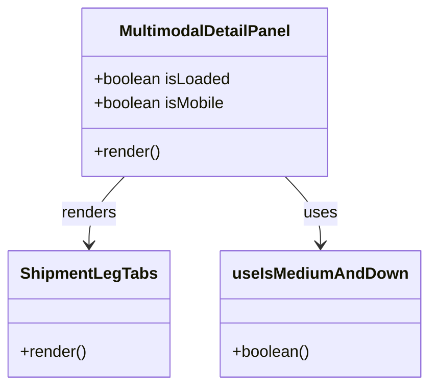

# Diagram: web/portal/src/modules/shipment-detail/MultimodalShipmentContentPanel.js


> Auto-generated by Obscura crawlers

## Diagram 1

```mermaid
graph LR
  A[MultimodalDetailPanel] --> B{props.isLoaded?}
  B -- false --> C[return null]
  B -- true --> D[call useIsMediumAndDown()]
  D --> E{isMobile?}
  E -- true --> F[div overflow: null]
  E -- false --> G[div overflow: auto]
  F --> H[ShipmentLegTabs {...props}]
  G --> H
  style A fill:#f9f,stroke:#333,stroke-width:1px
  style H fill:#bbf,stroke:#333,stroke-width:1px
```

> SVG rendering failed for this diagram.

## Diagram 2



### SVG

<svg id="container" width="410.96875" xmlns="http://www.w3.org/2000/svg" class="classDiagram" height="384" viewBox="0 0 410.96875 384" role="graphics-document document" aria-roledescription="class"><style>#container{font-family:"trebuchet ms",verdana,arial,sans-serif;font-size:16px;fill:#333;}@keyframes edge-animation-frame{from{stroke-dashoffset:0;}}@keyframes dash{to{stroke-dashoffset:0;}}#container .edge-animation-slow{stroke-dasharray:9,5!important;stroke-dashoffset:900;animation:dash 50s linear infinite;stroke-linecap:round;}#container .edge-animation-fast{stroke-dasharray:9,5!important;stroke-dashoffset:900;animation:dash 20s linear infinite;stroke-linecap:round;}#container .error-icon{fill:#552222;}#container .error-text{fill:#552222;stroke:#552222;}#container .edge-thickness-normal{stroke-width:1px;}#container .edge-thickness-thick{stroke-width:3.5px;}#container .edge-pattern-solid{stroke-dasharray:0;}#container .edge-thickness-invisible{stroke-width:0;fill:none;}#container .edge-pattern-dashed{stroke-dasharray:3;}#container .edge-pattern-dotted{stroke-dasharray:2;}#container .marker{fill:#333333;stroke:#333333;}#container .marker.cross{stroke:#333333;}#container svg{font-family:"trebuchet ms",verdana,arial,sans-serif;font-size:16px;}#container p{margin:0;}#container g.classGroup text{fill:#9370DB;stroke:none;font-family:"trebuchet ms",verdana,arial,sans-serif;font-size:10px;}#container g.classGroup text .title{font-weight:bolder;}#container .nodeLabel,#container .edgeLabel{color:#131300;}#container .edgeLabel .label rect{fill:#ECECFF;}#container .label text{fill:#131300;}#container .labelBkg{background:#ECECFF;}#container .edgeLabel .label span{background:#ECECFF;}#container .classTitle{font-weight:bolder;}#container .node rect,#container .node circle,#container .node ellipse,#container .node polygon,#container .node path{fill:#ECECFF;stroke:#9370DB;stroke-width:1px;}#container .divider{stroke:#9370DB;stroke-width:1;}#container g.clickable{cursor:pointer;}#container g.classGroup rect{fill:#ECECFF;stroke:#9370DB;}#container g.classGroup line{stroke:#9370DB;stroke-width:1;}#container .classLabel .box{stroke:none;stroke-width:0;fill:#ECECFF;opacity:0.5;}#container .classLabel .label{fill:#9370DB;font-size:10px;}#container .relation{stroke:#333333;stroke-width:1;fill:none;}#container .dashed-line{stroke-dasharray:3;}#container .dotted-line{stroke-dasharray:1 2;}#container #compositionStart,#container .composition{fill:#333333!important;stroke:#333333!important;stroke-width:1;}#container #compositionEnd,#container .composition{fill:#333333!important;stroke:#333333!important;stroke-width:1;}#container #dependencyStart,#container .dependency{fill:#333333!important;stroke:#333333!important;stroke-width:1;}#container #dependencyStart,#container .dependency{fill:#333333!important;stroke:#333333!important;stroke-width:1;}#container #extensionStart,#container .extension{fill:transparent!important;stroke:#333333!important;stroke-width:1;}#container #extensionEnd,#container .extension{fill:transparent!important;stroke:#333333!important;stroke-width:1;}#container #aggregationStart,#container .aggregation{fill:transparent!important;stroke:#333333!important;stroke-width:1;}#container #aggregationEnd,#container .aggregation{fill:transparent!important;stroke:#333333!important;stroke-width:1;}#container #lollipopStart,#container .lollipop{fill:#ECECFF!important;stroke:#333333!important;stroke-width:1;}#container #lollipopEnd,#container .lollipop{fill:#ECECFF!important;stroke:#333333!important;stroke-width:1;}#container .edgeTerminals{font-size:11px;line-height:initial;}#container .classTitleText{text-anchor:middle;font-size:18px;fill:#333;}#container .label-icon{display:inline-block;height:1em;overflow:visible;vertical-align:-0.125em;}#container .node .label-icon path{fill:currentColor;stroke:revert;stroke-width:revert;}#container :root{--mermaid-font-family:"trebuchet ms",verdana,arial,sans-serif;}</style><g><defs><marker id="container_class-aggregationStart" class="marker aggregation class" refX="18" refY="7" markerWidth="190" markerHeight="240" orient="auto"><path d="M 18,7 L9,13 L1,7 L9,1 Z"></path></marker></defs><defs><marker id="container_class-aggregationEnd" class="marker aggregation class" refX="1" refY="7" markerWidth="20" markerHeight="28" orient="auto"><path d="M 18,7 L9,13 L1,7 L9,1 Z"></path></marker></defs><defs><marker id="container_class-extensionStart" class="marker extension class" refX="18" refY="7" markerWidth="190" markerHeight="240" orient="auto"><path d="M 1,7 L18,13 V 1 Z"></path></marker></defs><defs><marker id="container_class-extensionEnd" class="marker extension class" refX="1" refY="7" markerWidth="20" markerHeight="28" orient="auto"><path d="M 1,1 V 13 L18,7 Z"></path></marker></defs><defs><marker id="container_class-compositionStart" class="marker composition class" refX="18" refY="7" markerWidth="190" markerHeight="240" orient="auto"><path d="M 18,7 L9,13 L1,7 L9,1 Z"></path></marker></defs><defs><marker id="container_class-compositionEnd" class="marker composition class" refX="1" refY="7" markerWidth="20" markerHeight="28" orient="auto"><path d="M 18,7 L9,13 L1,7 L9,1 Z"></path></marker></defs><defs><marker id="container_class-dependencyStart" class="marker dependency class" refX="6" refY="7" markerWidth="190" markerHeight="240" orient="auto"><path d="M 5,7 L9,13 L1,7 L9,1 Z"></path></marker></defs><defs><marker id="container_class-dependencyEnd" class="marker dependency class" refX="13" refY="7" markerWidth="20" markerHeight="28" orient="auto"><path d="M 18,7 L9,13 L14,7 L9,1 Z"></path></marker></defs><defs><marker id="container_class-lollipopStart" class="marker lollipop class" refX="13" refY="7" markerWidth="190" markerHeight="240" orient="auto"><circle stroke="black" fill="transparent" cx="7" cy="7" r="6"></circle></marker></defs><defs><marker id="container_class-lollipopEnd" class="marker lollipop class" refX="1" refY="7" markerWidth="190" markerHeight="240" orient="auto"><circle stroke="black" fill="transparent" cx="7" cy="7" r="6"></circle></marker></defs><g class="root"><g class="clusters"></g><g class="edgePaths"><path d="M119.712,176L114.042,182.167C108.373,188.333,97.034,200.667,91.365,212C85.695,223.333,85.695,233.667,85.695,238.833L85.695,244" id="id_MultimodalDetailPanel_ShipmentLegTabs_1" class="edge-thickness-normal edge-pattern-solid relation" style=";;;" data-edge="true" data-et="edge" data-id="id_MultimodalDetailPanel_ShipmentLegTabs_1" data-points="W3sieCI6MTE5LjcxMTUxODU5NTA0MTMzLCJ5IjoxNzZ9LHsieCI6ODUuNjk1MzEyNSwieSI6MjEzfSx7IngiOjg1LjY5NTMxMjUsInkiOjI1MH1d" marker-end="url(#container_class-dependencyEnd)"></path><path d="M274.163,176L279.833,182.167C285.502,188.333,296.841,200.667,302.51,212C308.18,223.333,308.18,233.667,308.18,238.833L308.18,244" id="id_MultimodalDetailPanel_useIsMediumAndDown_2" class="edge-thickness-normal edge-pattern-solid relation" style=";;;" data-edge="true" data-et="edge" data-id="id_MultimodalDetailPanel_useIsMediumAndDown_2" data-points="W3sieCI6Mjc0LjE2MzQ4MTQwNDk1ODcsInkiOjE3Nn0seyJ4IjozMDguMTc5Njg3NSwieSI6MjEzfSx7IngiOjMwOC4xNzk2ODc1LCJ5IjoyNTB9XQ==" marker-end="url(#container_class-dependencyEnd)"></path></g><g class="edgeLabels"><g class="edgeLabel" transform="translate(85.6953125, 213)"><g class="label" data-id="id_MultimodalDetailPanel_ShipmentLegTabs_1" transform="translate(-27.75, -12)"><foreignObject width="55.5" height="24"><div xmlns="http://www.w3.org/1999/xhtml" class="labelBkg" style="display: table-cell; white-space: nowrap; line-height: 1.5; max-width: 200px; text-align: center;"><span class="edgeLabel"><p>renders</p></span></div></foreignObject></g></g><g class="edgeLabel" transform="translate(308.1796875, 213)"><g class="label" data-id="id_MultimodalDetailPanel_useIsMediumAndDown_2" transform="translate(-16.4921875, -12)"><foreignObject width="32.984375" height="24"><div xmlns="http://www.w3.org/1999/xhtml" class="labelBkg" style="display: table-cell; white-space: nowrap; line-height: 1.5; max-width: 200px; text-align: center;"><span class="edgeLabel"><p>uses</p></span></div></foreignObject></g></g></g><g class="nodes"><g class="node default" id="classId-MultimodalDetailPanel-0" transform="translate(196.9375, 92)"><g class="basic label-container"><path d="M-122.13671875 -84 L122.13671875 -84 L122.13671875 84 L-122.13671875 84" stroke="none" stroke-width="0" fill="#ECECFF" style=""></path><path d="M-122.13671875 -84 C-28.613895932218497 -84, 64.908926885563 -84, 122.13671875 -84 M-122.13671875 -84 C-28.463423238259367 -84, 65.20987227348127 -84, 122.13671875 -84 M122.13671875 -84 C122.13671875 -29.495581954569616, 122.13671875 25.00883609086077, 122.13671875 84 M122.13671875 -84 C122.13671875 -48.24693343889823, 122.13671875 -12.493866877796464, 122.13671875 84 M122.13671875 84 C48.63437689991997 84, -24.867964950160058 84, -122.13671875 84 M122.13671875 84 C64.60276053633186 84, 7.068802322663728 84, -122.13671875 84 M-122.13671875 84 C-122.13671875 34.834750238140266, -122.13671875 -14.330499523719467, -122.13671875 -84 M-122.13671875 84 C-122.13671875 27.041278314483343, -122.13671875 -29.917443371033315, -122.13671875 -84" stroke="#9370DB" stroke-width="1.3" fill="none" stroke-dasharray="0 0" style=""></path></g><g class="annotation-group text" transform="translate(0, -60)"></g><g class="label-group text" transform="translate(-83.3046875, -60)"><g class="label" style="font-weight: bolder" transform="translate(0,-12)"><foreignObject width="166.609375" height="24"><div xmlns="http://www.w3.org/1999/xhtml" style="display: table-cell; white-space: nowrap; line-height: 1.5; max-width: 215px; text-align: center;"><span class="nodeLabel markdown-node-label" style=""><p>MultimodalDetailPanel</p></span></div></foreignObject></g></g><g class="members-group text" transform="translate(-110.13671875, -12)"><g class="label" style="" transform="translate(0,-12)"><foreignObject width="136.96875" height="24"><div xmlns="http://www.w3.org/1999/xhtml" style="display: table-cell; white-space: nowrap; line-height: 1.5; max-width: 194px; text-align: center;"><span class="nodeLabel markdown-node-label" style=""><p>+boolean isLoaded</p></span></div></foreignObject></g><g class="label" style="" transform="translate(0,12)"><foreignObject width="132.796875" height="24"><div xmlns="http://www.w3.org/1999/xhtml" style="display: table-cell; white-space: nowrap; line-height: 1.5; max-width: 190px; text-align: center;"><span class="nodeLabel markdown-node-label" style=""><p>+boolean isMobile</p></span></div></foreignObject></g></g><g class="methods-group text" transform="translate(-110.13671875, 60)"><g class="label" style="" transform="translate(0,-12)"><foreignObject width="66.609375" height="24"><div xmlns="http://www.w3.org/1999/xhtml" style="display: table-cell; white-space: nowrap; line-height: 1.5; max-width: 124px; text-align: center;"><span class="nodeLabel markdown-node-label" style=""><p>+render()</p></span></div></foreignObject></g></g><g class="divider" style=""><path d="M-122.13671875 -36 C-41.558285792280444 -36, 39.02014716543911 -36, 122.13671875 -36 M-122.13671875 -36 C-48.5393734568316 -36, 25.057971836336804 -36, 122.13671875 -36" stroke="#9370DB" stroke-width="1.3" fill="none" stroke-dasharray="0 0" style=""></path></g><g class="divider" style=""><path d="M-122.13671875 36 C-25.76110618241941 36, 70.61450638516118 36, 122.13671875 36 M-122.13671875 36 C-32.27366927379926 36, 57.589380202401486 36, 122.13671875 36" stroke="#9370DB" stroke-width="1.3" fill="none" stroke-dasharray="0 0" style=""></path></g></g><g class="node default" id="classId-ShipmentLegTabs-1" transform="translate(85.6953125, 313)"><g class="basic label-container"><path d="M-77.6953125 -63 L77.6953125 -63 L77.6953125 63 L-77.6953125 63" stroke="none" stroke-width="0" fill="#ECECFF" style=""></path><path d="M-77.6953125 -63 C-27.597925286739475 -63, 22.49946192652105 -63, 77.6953125 -63 M-77.6953125 -63 C-27.370841787338925 -63, 22.95362892532215 -63, 77.6953125 -63 M77.6953125 -63 C77.6953125 -28.17437231176943, 77.6953125 6.651255376461137, 77.6953125 63 M77.6953125 -63 C77.6953125 -31.261262605608977, 77.6953125 0.47747478878204674, 77.6953125 63 M77.6953125 63 C38.23419984807547 63, -1.2269128038490607 63, -77.6953125 63 M77.6953125 63 C31.79195843241377 63, -14.111395635172457 63, -77.6953125 63 M-77.6953125 63 C-77.6953125 21.440269527631735, -77.6953125 -20.11946094473653, -77.6953125 -63 M-77.6953125 63 C-77.6953125 17.136313222833806, -77.6953125 -28.727373554332388, -77.6953125 -63" stroke="#9370DB" stroke-width="1.3" fill="none" stroke-dasharray="0 0" style=""></path></g><g class="annotation-group text" transform="translate(0, -39)"></g><g class="label-group text" transform="translate(-64.78125, -39)"><g class="label" style="font-weight: bolder" transform="translate(0,-12)"><foreignObject width="129.5625" height="24"><div xmlns="http://www.w3.org/1999/xhtml" style="display: table-cell; white-space: nowrap; line-height: 1.5; max-width: 177px; text-align: center;"><span class="nodeLabel markdown-node-label" style=""><p>ShipmentLegTabs</p></span></div></foreignObject></g></g><g class="members-group text" transform="translate(-65.6953125, 9)"></g><g class="methods-group text" transform="translate(-65.6953125, 39)"><g class="label" style="" transform="translate(0,-12)"><foreignObject width="66.609375" height="24"><div xmlns="http://www.w3.org/1999/xhtml" style="display: table-cell; white-space: nowrap; line-height: 1.5; max-width: 124px; text-align: center;"><span class="nodeLabel markdown-node-label" style=""><p>+render()</p></span></div></foreignObject></g></g><g class="divider" style=""><path d="M-77.6953125 -15 C-27.386892959540553 -15, 22.921526580918894 -15, 77.6953125 -15 M-77.6953125 -15 C-17.691823591548186 -15, 42.31166531690363 -15, 77.6953125 -15" stroke="#9370DB" stroke-width="1.3" fill="none" stroke-dasharray="0 0" style=""></path></g><g class="divider" style=""><path d="M-77.6953125 9 C-19.628964740242317 9, 38.437383019515366 9, 77.6953125 9 M-77.6953125 9 C-20.704482128508992 9, 36.286348242982015 9, 77.6953125 9" stroke="#9370DB" stroke-width="1.3" fill="none" stroke-dasharray="0 0" style=""></path></g></g><g class="node default" id="classId-useIsMediumAndDown-2" transform="translate(308.1796875, 313)"><g class="basic label-container"><path d="M-94.7890625 -63 L94.7890625 -63 L94.7890625 63 L-94.7890625 63" stroke="none" stroke-width="0" fill="#ECECFF" style=""></path><path d="M-94.7890625 -63 C-41.84088713093005 -63, 11.107288238139901 -63, 94.7890625 -63 M-94.7890625 -63 C-45.30905177504307 -63, 4.170958949913853 -63, 94.7890625 -63 M94.7890625 -63 C94.7890625 -17.019115886519728, 94.7890625 28.961768226960544, 94.7890625 63 M94.7890625 -63 C94.7890625 -36.03993904356881, 94.7890625 -9.079878087137615, 94.7890625 63 M94.7890625 63 C28.462842501868977 63, -37.863377496262046 63, -94.7890625 63 M94.7890625 63 C24.270964529393865 63, -46.24713344121227 63, -94.7890625 63 M-94.7890625 63 C-94.7890625 35.20733584619754, -94.7890625 7.414671692395082, -94.7890625 -63 M-94.7890625 63 C-94.7890625 12.841044912946323, -94.7890625 -37.317910174107354, -94.7890625 -63" stroke="#9370DB" stroke-width="1.3" fill="none" stroke-dasharray="0 0" style=""></path></g><g class="annotation-group text" transform="translate(0, -39)"></g><g class="label-group text" transform="translate(-82.7890625, -39)"><g class="label" style="font-weight: bolder" transform="translate(0,-12)"><foreignObject width="165.578125" height="24"><div xmlns="http://www.w3.org/1999/xhtml" style="display: table-cell; white-space: nowrap; line-height: 1.5; max-width: 215px; text-align: center;"><span class="nodeLabel markdown-node-label" style=""><p>useIsMediumAndDown</p></span></div></foreignObject></g></g><g class="members-group text" transform="translate(-82.7890625, 9)"></g><g class="methods-group text" transform="translate(-82.7890625, 39)"><g class="label" style="" transform="translate(0,-12)"><foreignObject width="77.796875" height="24"><div xmlns="http://www.w3.org/1999/xhtml" style="display: table-cell; white-space: nowrap; line-height: 1.5; max-width: 135px; text-align: center;"><span class="nodeLabel markdown-node-label" style=""><p>+boolean()</p></span></div></foreignObject></g></g><g class="divider" style=""><path d="M-94.7890625 -15 C-20.246802674959568 -15, 54.295457150080864 -15, 94.7890625 -15 M-94.7890625 -15 C-45.644755059727544 -15, 3.4995523805449125 -15, 94.7890625 -15" stroke="#9370DB" stroke-width="1.3" fill="none" stroke-dasharray="0 0" style=""></path></g><g class="divider" style=""><path d="M-94.7890625 9 C-38.39233117038126 9, 18.004400159237477 9, 94.7890625 9 M-94.7890625 9 C-40.923565043010925 9, 12.94193241397815 9, 94.7890625 9" stroke="#9370DB" stroke-width="1.3" fill="none" stroke-dasharray="0 0" style=""></path></g></g></g></g></g></svg>
