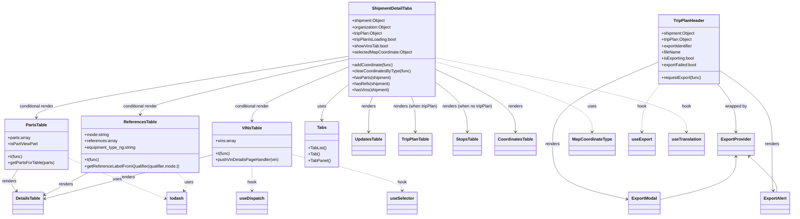

# Diagram: web/portal/src/modules/shipment-detail/ShipmentDetailTabs.js

> Auto-generated by Obscura crawlers

## Mermaid

### SVG

<svg id="container" width="2976.887451171875" xmlns="http://www.w3.org/2000/svg" class="classDiagram" height="824" viewBox="2.932861328125 0 2976.887451171875 824" role="graphics-document document" aria-roledescription="class"><g><defs><marker id="container_class-aggregationStart" class="marker aggregation class" refX="18" refY="7" markerWidth="190" markerHeight="240" orient="auto"><path d="M 18,7 L9,13 L1,7 L9,1 Z"></path></marker></defs><defs><marker id="container_class-aggregationEnd" class="marker aggregation class" refX="1" refY="7" markerWidth="20" markerHeight="28" orient="auto"><path d="M 18,7 L9,13 L1,7 L9,1 Z"></path></marker></defs><defs><marker id="container_class-extensionStart" class="marker extension class" refX="18" refY="7" markerWidth="190" markerHeight="240" orient="auto"><path d="M 1,7 L18,13 V 1 Z"></path></marker></defs><defs><marker id="container_class-extensionEnd" class="marker extension class" refX="1" refY="7" markerWidth="20" markerHeight="28" orient="auto"><path d="M 1,1 V 13 L18,7 Z"></path></marker></defs><defs><marker id="container_class-compositionStart" class="marker composition class" refX="18" refY="7" markerWidth="190" markerHeight="240" orient="auto"><path d="M 18,7 L9,13 L1,7 L9,1 Z"></path></marker></defs><defs><marker id="container_class-compositionEnd" class="marker composition class" refX="1" refY="7" markerWidth="20" markerHeight="28" orient="auto"><path d="M 18,7 L9,13 L1,7 L9,1 Z"></path></marker></defs><defs><marker id="container_class-dependencyStart" class="marker dependency class" refX="6" refY="7" markerWidth="190" markerHeight="240" orient="auto"><path d="M 5,7 L9,13 L1,7 L9,1 Z"></path></marker></defs><defs><marker id="container_class-dependencyEnd" class="marker dependency class" refX="13" refY="7" markerWidth="20" markerHeight="28" orient="auto"><path d="M 18,7 L9,13 L14,7 L9,1 Z"></path></marker></defs><defs><marker id="container_class-lollipopStart" class="marker lollipop class" refX="13" refY="7" markerWidth="190" markerHeight="240" orient="auto"><circle stroke="black" fill="transparent" cx="7" cy="7" r="6"></circle></marker></defs><defs><marker id="container_class-lollipopEnd" class="marker lollipop class" refX="1" refY="7" markerWidth="190" markerHeight="240" orient="auto"><circle stroke="black" fill="transparent" cx="7" cy="7" r="6"></circle></marker></defs><g class="root"><g class="clusters"></g><g class="edgePaths"><path d="M1321.402,324.02L1305.139,337.517C1288.875,351.013,1256.348,378.007,1240.084,400.17C1223.82,422.333,1223.82,439.667,1223.82,448.333L1223.82,457" id="id_ShipmentDetailTabs_Tabs_1" class="edge-thickness-normal edge-pattern-solid relation" style=";;;" data-edge="true" data-et="edge" data-id="id_ShipmentDetailTabs_Tabs_1" data-points="W3sieCI6MTMyMS40MDIzNDM3NSwieSI6MzI0LjAyMDA3NzM4MTU3NDh9LHsieCI6MTIyMy44MjAzMTI1LCJ5Ijo0MDV9LHsieCI6MTIyMy44MjAzMTI1LCJ5Ijo0NjN9XQ==" marker-end="url(#container_class-dependencyEnd)"></path><path d="M1412.961,368L1410.483,374.167C1408.004,380.333,1403.047,392.667,1400.568,415C1398.09,437.333,1398.09,469.667,1398.09,485.833L1398.09,502" id="id_ShipmentDetailTabs_UpdatesTable_2" class="edge-thickness-normal edge-pattern-solid relation" style=";;;" data-edge="true" data-et="edge" data-id="id_ShipmentDetailTabs_UpdatesTable_2" data-points="W3sieCI6MTQxMi45NjEyNDM1MTk1ODUyLCJ5IjozNjh9LHsieCI6MTM5OC4wODk4NDM3NSwieSI6NDA1fSx7IngiOjEzOTguMDg5ODQzNzUsInkiOjUwOH1d" marker-end="url(#container_class-dependencyEnd)"></path><path d="M1557.656,368L1560.135,374.167C1562.613,380.333,1567.57,392.667,1570.049,415C1572.527,437.333,1572.527,469.667,1572.527,485.833L1572.527,502" id="id_ShipmentDetailTabs_TripPlanTable_3" class="edge-thickness-normal edge-pattern-solid relation" style=";;;" data-edge="true" data-et="edge" data-id="id_ShipmentDetailTabs_TripPlanTable_3" data-points="W3sieCI6MTU1Ny42NTU5NDM5ODA0MTQ4LCJ5IjozNjh9LHsieCI6MTU3Mi41MjczNDM3NSwieSI6NDA1fSx7IngiOjE1NzIuNTI3MzQzNzUsInkiOjUwOH1d" marker-end="url(#container_class-dependencyEnd)"></path><path d="M1649.215,310.74L1670.194,326.45C1691.173,342.16,1733.132,373.58,1754.111,405.457C1775.09,437.333,1775.09,469.667,1775.09,485.833L1775.09,502" id="id_ShipmentDetailTabs_StopsTable_4" class="edge-thickness-normal edge-pattern-solid relation" style=";;;" data-edge="true" data-et="edge" data-id="id_ShipmentDetailTabs_StopsTable_4" data-points="W3sieCI6MTY0OS4yMTQ4NDM3NSwieSI6MzEwLjczOTY3NDMyMzMwNDJ9LHsieCI6MTc3NS4wODk4NDM3NSwieSI6NDA1fSx7IngiOjE3NzUuMDg5ODQzNzUsInkiOjUwOH1d" marker-end="url(#container_class-dependencyEnd)"></path><path d="M1649.215,263.947L1699.951,287.456C1750.686,310.965,1852.158,357.982,1902.893,397.658C1953.629,437.333,1953.629,469.667,1953.629,485.833L1953.629,502" id="id_ShipmentDetailTabs_CoordinatesTable_5" class="edge-thickness-normal edge-pattern-solid relation" style=";;;" data-edge="true" data-et="edge" data-id="id_ShipmentDetailTabs_CoordinatesTable_5" data-points="W3sieCI6MTY0OS4yMTQ4NDM3NSwieSI6MjYzLjk0NzI4NTAxMTI2MDN9LHsieCI6MTk1My42Mjg5MDYyNSwieSI6NDA1fSx7IngiOjE5NTMuNjI4OTA2MjUsInkiOjUwOH1d" marker-end="url(#container_class-dependencyEnd)"></path><path d="M1321.402,214.505L1125.064,246.254C928.725,278.003,536.048,341.502,339.71,380.417C143.371,419.333,143.371,433.667,143.371,440.833L143.371,448" id="id_ShipmentDetailTabs_PartsTable_6" class="edge-thickness-normal edge-pattern-solid relation" style=";;;" data-edge="true" data-et="edge" data-id="id_ShipmentDetailTabs_PartsTable_6" data-points="W3sieCI6MTMyMS40MDIzNDM3NSwieSI6MjE0LjUwNDcwNDAxOTM3NDk3fSx7IngiOjE0My4zNzEwOTM3NSwieSI6NDA1fSx7IngiOjE0My4zNzEwOTM3NSwieSI6NDU0fV0=" marker-end="url(#container_class-dependencyEnd)"></path><path d="M1321.402,255.918L1261.439,280.765C1201.475,305.612,1081.548,355.306,1021.585,389.32C961.621,423.333,961.621,441.667,961.621,450.833L961.621,460" id="id_ShipmentDetailTabs_VINsTable_7" class="edge-thickness-normal edge-pattern-solid relation" style=";;;" data-edge="true" data-et="edge" data-id="id_ShipmentDetailTabs_VINsTable_7" data-points="W3sieCI6MTMyMS40MDIzNDM3NSwieSI6MjU1LjkxNzcxMDk0NDAyNjc0fSx7IngiOjk2MS42MjEwOTM3NSwieSI6NDA1fSx7IngiOjk2MS42MjEwOTM3NSwieSI6NDY2fV0=" marker-end="url(#container_class-dependencyEnd)"></path><path d="M1321.402,225.518L1190.719,255.432C1060.035,285.346,798.668,345.173,667.984,380.253C537.301,415.333,537.301,425.667,537.301,430.833L537.301,436" id="id_ShipmentDetailTabs_ReferencesTable_8" class="edge-thickness-normal edge-pattern-solid relation" style=";;;" data-edge="true" data-et="edge" data-id="id_ShipmentDetailTabs_ReferencesTable_8" data-points="W3sieCI6MTMyMS40MDIzNDM3NSwieSI6MjI1LjUxODMxNTU0NjU4MjA3fSx7IngiOjUzNy4zMDA3ODEyNSwieSI6NDA1fSx7IngiOjUzNy4zMDA3ODEyNSwieSI6NDQyfV0=" marker-end="url(#container_class-dependencyEnd)"></path><path d="M2703.759,320L2715.122,334.167C2726.486,348.333,2749.214,376.667,2760.578,407C2771.941,437.333,2771.941,469.667,2771.941,485.833L2771.941,502" id="id_TripPlanHeader_ExportProvider_9" class="edge-thickness-normal edge-pattern-solid relation" style=";;;" data-edge="true" data-et="edge" data-id="id_TripPlanHeader_ExportProvider_9" data-points="W3sieCI6MjcwMy43NTg3MTI1NTc2MDM4LCJ5IjozMjB9LHsieCI6Mjc3MS45NDE0MDYyNSwieSI6NDA1fSx7IngiOjI3NzEuOTQxNDA2MjUsInkiOjUwOH1d" marker-end="url(#container_class-dependencyEnd)"></path><path d="M2481.23,238.06L2416.4,265.883C2351.569,293.707,2221.908,349.353,2157.077,401.343C2092.246,453.333,2092.246,501.667,2092.246,550C2092.246,598.333,2092.246,646.667,2137.74,681.489C2183.234,716.311,2274.223,737.621,2319.717,748.277L2365.211,758.932" id="id_TripPlanHeader_ExportModal_10" class="edge-thickness-normal edge-pattern-solid relation" style=";;;" data-edge="true" data-et="edge" data-id="id_TripPlanHeader_ExportModal_10" data-points="W3sieCI6MjQ4MS4yMzA0Njg3NSwieSI6MjM4LjA2MDE1ODY4MjMzNDAyfSx7IngiOjIwOTIuMjQ2MDkzNzUsInkiOjQwNX0seyJ4IjoyMDkyLjI0NjA5Mzc1LCJ5Ijo1NTB9LHsieCI6MjA5Mi4yNDYwOTM3NSwieSI6Njk1fSx7IngiOjIzNzEuMDUyNzM0Mzc1LCJ5Ijo3NjAuMzAwMzI5NDc4Nzk4Mn1d" marker-end="url(#container_class-dependencyEnd)"></path><path d="M2714.52,269.618L2746.766,292.182C2779.013,314.746,2843.507,359.873,2875.753,406.603C2908,453.333,2908,501.667,2908,550C2908,598.333,2908,646.667,2908.655,676.008C2909.31,705.349,2910.62,715.698,2911.275,720.873L2911.93,726.047" id="id_TripPlanHeader_ExportAlert_11" class="edge-thickness-normal edge-pattern-solid relation" style=";;;" data-edge="true" data-et="edge" data-id="id_TripPlanHeader_ExportAlert_11" data-points="W3sieCI6MjcxNC41MTk1MzEyNSwieSI6MjY5LjYxODI2MTI4NTc3MTg0fSx7IngiOjI5MDgsInkiOjQwNX0seyJ4IjoyOTA4LCJ5Ijo1NTB9LHsieCI6MjkwOCwieSI6Njk1fSx7IngiOjI5MTIuNjgzNTQ0MzAzNzk3NiwieSI6NzMyfV0=" marker-end="url(#container_class-dependencyEnd)"></path><path d="M72.119,646L66.057,654.167C59.996,662.333,47.873,678.667,47.014,692.277C46.155,705.887,56.56,716.775,61.763,722.219L66.965,727.662" id="id_PartsTable_DetailsTable_12" class="edge-thickness-normal edge-pattern-solid relation" style=";;;" data-edge="true" data-et="edge" data-id="id_PartsTable_DetailsTable_12" data-points="W3sieCI6NzIuMTE4NTA3NTQzMTAzNDUsInkiOjY0Nn0seyJ4IjozNS43NSwieSI6Njk1fSx7IngiOjcxLjExMDc1OTQ5MzY3MDg4LCJ5Ijo3MzJ9XQ==" marker-end="url(#container_class-dependencyEnd)"></path><path d="M338.554,658L327.206,664.167C315.858,670.333,293.161,682.667,265.728,696.815C238.294,710.963,206.124,726.925,190.038,734.906L173.953,742.888" id="id_ReferencesTable_DetailsTable_13" class="edge-thickness-normal edge-pattern-solid relation" style=";;;" data-edge="true" data-et="edge" data-id="id_ReferencesTable_DetailsTable_13" data-points="W3sieCI6MzM4LjU1NDAxNDAwODYyMDcsInkiOjY1OH0seyJ4IjoyNzAuNDY0ODQzNzUsInkiOjY5NX0seyJ4IjoxNjguNTc4MTI1LCJ5Ijo3NDUuNTU0NjUwNTA2NjM2Nn1d" marker-end="url(#container_class-dependencyEnd)"></path><path d="M811.465,589.95L745.659,607.459C679.853,624.967,548.241,659.983,442.061,687.936C335.882,715.889,255.134,736.778,214.761,747.222L174.387,757.667" id="id_VINsTable_DetailsTable_14" class="edge-thickness-normal edge-pattern-solid relation" style=";;;" data-edge="true" data-et="edge" data-id="id_VINsTable_DetailsTable_14" data-points="W3sieCI6ODExLjQ2NDg0Mzc1LCJ5Ijo1ODkuOTUwNDAwNjY1MTQ3Mn0seyJ4Ijo0MTYuNjI4OTA2MjUsInkiOjY5NX0seyJ4IjoxNjguNTc4MTI1LCJ5Ijo3NTkuMTY5NDk5OTgwODEyOH1d" marker-end="url(#container_class-dependencyEnd)"></path><path d="M2771.941,598L2771.941,614.167C2771.941,630.333,2771.941,662.667,2724.624,689.751C2677.307,716.835,2582.672,738.67,2535.354,749.587L2488.037,760.504" id="id_ExportProvider_ExportModal_15" class="edge-thickness-normal edge-pattern-solid relation" style=";;;" data-edge="true" data-et="edge" data-id="id_ExportProvider_ExportModal_15" data-points="W3sieCI6Mjc3MS45NDE0MDYyNSwieSI6NTkyfSx7IngiOjI3NzEuOTQxNDA2MjUsInkiOjY5NX0seyJ4IjoyNDg4LjAzNzEwOTM3NSwieSI6NzYwLjUwNDI5MjQ2OTc4MTZ9XQ==" marker-start="url(#container_class-dependencyStart)"></path><path d="M2821.54,596.084L2839.283,612.57C2857.027,629.056,2892.513,662.028,2909.476,684.681C2926.439,707.333,2924.878,719.667,2924.097,725.833L2923.316,732" id="id_ExportProvider_ExportAlert_16" class="edge-thickness-normal edge-pattern-solid relation" style=";;;" data-edge="true" data-et="edge" data-id="id_ExportProvider_ExportAlert_16" data-points="W3sieCI6MjgxNy4xNDQ1ODUxMjkzMSwieSI6NTkyfSx7IngiOjI5MjgsInkiOjY5NX0seyJ4IjoyOTIzLjMxNjQ1NTY5NjIwMjQsInkiOjczMn1d" marker-start="url(#container_class-dependencyStart)"></path><path d="M1649.215,235.132L1747.671,263.443C1846.126,291.755,2043.038,348.377,2141.493,392.855C2239.949,437.333,2239.949,469.667,2239.949,485.833L2239.949,502" id="id_ShipmentDetailTabs_MapCoordinateType_17" class="edge-thickness-normal edge-pattern-dashed relation" style=";;;" data-edge="true" data-et="edge" data-id="id_ShipmentDetailTabs_MapCoordinateType_17" data-points="W3sieCI6MTY0OS4yMTQ4NDM3NSwieSI6MjM1LjEzMTkxMjk1NTI1Nn0seyJ4IjoyMjM5Ljk0OTIxODc1LCJ5Ijo0MDV9LHsieCI6MjIzOS45NDkyMTg3NSwieSI6NTA4fV0=" marker-end="url(#container_class-dependencyEnd)"></path><path d="M2491.991,320L2480.628,334.167C2469.264,348.333,2446.536,376.667,2435.172,407C2423.809,437.333,2423.809,469.667,2423.809,485.833L2423.809,502" id="id_TripPlanHeader_useExport_18" class="edge-thickness-normal edge-pattern-dashed relation" style=";;;" data-edge="true" data-et="edge" data-id="id_TripPlanHeader_useExport_18" data-points="W3sieCI6MjQ5MS45OTEyODc0NDIzOTYyLCJ5IjozMjB9LHsieCI6MjQyMy44MDg1OTM3NSwieSI6NDA1fSx7IngiOjI0MjMuODA4NTkzNzUsInkiOjUwOH1d" marker-end="url(#container_class-dependencyEnd)"></path><path d="M961.621,634L961.621,644.167C961.621,654.333,961.621,674.667,961.621,690C961.621,705.333,961.621,715.667,961.621,720.833L961.621,726" id="id_VINsTable_useDispatch_19" class="edge-thickness-normal edge-pattern-dashed relation" style=";;;" data-edge="true" data-et="edge" data-id="id_VINsTable_useDispatch_19" data-points="W3sieCI6OTYxLjYyMTA5Mzc1LCJ5Ijo2MzR9LHsieCI6OTYxLjYyMTA5Mzc1LCJ5Ijo2OTV9LHsieCI6OTYxLjYyMTA5Mzc1LCJ5Ijo3MzJ9XQ==" marker-end="url(#container_class-dependencyEnd)"></path><path d="M1111.777,588.577L1180.817,606.314C1249.857,624.051,1387.936,659.526,1456.976,682.43C1526.016,705.333,1526.016,715.667,1526.016,720.833L1526.016,726" id="id_VINsTable_useSelector_20" class="edge-thickness-normal edge-pattern-dashed relation" style=";;;" data-edge="true" data-et="edge" data-id="id_VINsTable_useSelector_20" data-points="W3sieCI6MTExMS43NzczNDM3NSwieSI6NTg4LjU3NzAxNDkxNTA0M30seyJ4IjoxNTI2LjAxNTYyNSwieSI6Njk1fSx7IngiOjE1MjYuMDE1NjI1LCJ5Ijo3MzJ9XQ==" marker-end="url(#container_class-dependencyEnd)"></path><path d="M1649.215,220.232L1805.813,251.027C1962.41,281.821,2275.605,343.411,2432.203,390.372C2588.801,437.333,2588.801,469.667,2588.801,485.833L2588.801,502" id="id_ShipmentDetailTabs_useTranslation_21" class="edge-thickness-normal edge-pattern-dashed relation" style=";;;" data-edge="true" data-et="edge" data-id="id_ShipmentDetailTabs_useTranslation_21" data-points="W3sieCI6MTY0OS4yMTQ4NDM3NSwieSI6MjIwLjIzMTkwNTgxMDM4ODl9LHsieCI6MjU4OC44MDA3ODEyNSwieSI6NDA1fSx7IngiOjI1ODguODAwNzgxMjUsInkiOjUwOH1d" marker-end="url(#container_class-dependencyEnd)"></path><path d="M263.137,601.455L299.426,617.046C335.715,632.637,408.293,663.818,470.382,689.757C532.472,715.696,584.073,736.393,609.873,746.741L635.673,757.089" id="id_PartsTable_lodash_22" class="edge-thickness-normal edge-pattern-dashed relation" style=";;;" data-edge="true" data-et="edge" data-id="id_PartsTable_lodash_22" data-points="W3sieCI6MjYzLjEzNjcxODc1LCJ5Ijo2MDEuNDU0ODYxMTExMTExMX0seyJ4Ijo0ODAuODcxMDkzNzUsInkiOjY5NX0seyJ4Ijo2NDEuMjQyMTg3NSwieSI6NzU5LjMyMjcyOTcwNjY4MTV9XQ==" marker-end="url(#container_class-dependencyEnd)"></path><path d="M674.98,658L682.842,664.167C690.703,670.333,706.426,682.667,711.317,694.128C716.209,705.589,710.269,716.178,707.3,721.473L704.33,726.767" id="id_ReferencesTable_lodash_23" class="edge-thickness-normal edge-pattern-dashed relation" style=";;;" data-edge="true" data-et="edge" data-id="id_ReferencesTable_lodash_23" data-points="W3sieCI6Njc0Ljk4MDQxNDg3MDY4OTYsInkiOjY1OH0seyJ4Ijo3MjIuMTQ4NDM3NSwieSI6Njk1fSx7IngiOjcwMS4zOTQ0ODE4MDM3OTc1LCJ5Ijo3MzJ9XQ==" marker-end="url(#container_class-dependencyEnd)"></path></g><g class="edgeLabels"><g class="edgeLabel" transform="translate(1223.8203125, 405)"><g class="label" data-id="id_ShipmentDetailTabs_Tabs_1" transform="translate(-16.4921875, -12)"><foreignObject width="32.984375" height="24">

uses

</foreignObject></g></g><g class="edgeLabel" transform="translate(1398.08984375, 405)"><g class="label" data-id="id_ShipmentDetailTabs_UpdatesTable_2" transform="translate(-27.75, -12)"><foreignObject width="55.5" height="24">

renders

</foreignObject></g></g><g class="edgeLabel" transform="translate(1572.52734375, 405)"><g class="label" data-id="id_ShipmentDetailTabs_TripPlanTable_3" transform="translate(-85.5390625, -12)"><foreignObject width="171.078125" height="24">

renders (when tripPlan)

</foreignObject></g></g><g class="edgeLabel" transform="translate(1775.08984375, 405)"><g class="label" data-id="id_ShipmentDetailTabs_StopsTable_4" transform="translate(-97.0234375, -12)"><foreignObject width="194.046875" height="24">

renders (when no tripPlan)

</foreignObject></g></g><g class="edgeLabel" transform="translate(1953.62890625, 405)"><g class="label" data-id="id_ShipmentDetailTabs_CoordinatesTable_5" transform="translate(-27.75, -12)"><foreignObject width="55.5" height="24">

renders

</foreignObject></g></g><g class="edgeLabel" transform="translate(143.37109375, 405)"><g class="label" data-id="id_ShipmentDetailTabs_PartsTable_6" transform="translate(-67.4375, -12)"><foreignObject width="134.875" height="24">

conditional render

</foreignObject></g></g><g class="edgeLabel" transform="translate(961.62109375, 405)"><g class="label" data-id="id_ShipmentDetailTabs_VINsTable_7" transform="translate(-67.4375, -12)"><foreignObject width="134.875" height="24">

conditional render

</foreignObject></g></g><g class="edgeLabel" transform="translate(537.30078125, 405)"><g class="label" data-id="id_ShipmentDetailTabs_ReferencesTable_8" transform="translate(-67.4375, -12)"><foreignObject width="134.875" height="24">

conditional render

</foreignObject></g></g><g class="edgeLabel" transform="translate(2771.94140625, 405)"><g class="label" data-id="id_TripPlanHeader_ExportProvider_9" transform="translate(-42.3203125, -12)"><foreignObject width="84.640625" height="24">

wrapped by

</foreignObject></g></g><g class="edgeLabel" transform="translate(2092.24609375, 550)"><g class="label" data-id="id_TripPlanHeader_ExportModal_10" transform="translate(-27.75, -12)"><foreignObject width="55.5" height="24">

renders

</foreignObject></g></g><g class="edgeLabel" transform="translate(2908, 550)"><g class="label" data-id="id_TripPlanHeader_ExportAlert_11" transform="translate(-27.75, -12)"><foreignObject width="55.5" height="24">

renders

</foreignObject></g></g><g class="edgeLabel" transform="translate(38.68286, 691.0485)"><g class="label" data-id="id_PartsTable_DetailsTable_12" transform="translate(-27.75, -12)"><foreignObject width="55.5" height="24">

renders

</foreignObject></g></g><g class="edgeLabel" transform="translate(254.23013, 703.05542)"><g class="label" data-id="id_ReferencesTable_DetailsTable_13" transform="translate(-27.75, -12)"><foreignObject width="55.5" height="24">

renders

</foreignObject></g></g><g class="edgeLabel" transform="translate(490.24548, 675.41366)"><g class="label" data-id="id_VINsTable_DetailsTable_14" transform="translate(-27.75, -12)"><foreignObject width="55.5" height="24">

renders

</foreignObject></g></g><g class="edgeLabel"><g class="label" data-id="id_ExportProvider_ExportModal_15" transform="translate(0, 0)"><foreignObject width="0" height="0">

</foreignObject></g></g><g class="edgeLabel"><g class="label" data-id="id_ExportProvider_ExportAlert_16" transform="translate(0, 0)"><foreignObject width="0" height="0">

</foreignObject></g></g><g class="edgeLabel" transform="translate(2239.94921875, 405)"><g class="label" data-id="id_ShipmentDetailTabs_MapCoordinateType_17" transform="translate(-16.4921875, -12)"><foreignObject width="32.984375" height="24">

uses

</foreignObject></g></g><g class="edgeLabel" transform="translate(2423.80859375, 405)"><g class="label" data-id="id_TripPlanHeader_useExport_18" transform="translate(-18.1328125, -12)"><foreignObject width="36.265625" height="24">

hook

</foreignObject></g></g><g class="edgeLabel" transform="translate(961.62109375, 695)"><g class="label" data-id="id_VINsTable_useDispatch_19" transform="translate(-18.1328125, -12)"><foreignObject width="36.265625" height="24">

hook

</foreignObject></g></g><g class="edgeLabel" transform="translate(1526.015625, 695)"><g class="label" data-id="id_VINsTable_useSelector_20" transform="translate(-18.1328125, -12)"><foreignObject width="36.265625" height="24">

hook

</foreignObject></g></g><g class="edgeLabel" transform="translate(2588.80078125, 405)"><g class="label" data-id="id_ShipmentDetailTabs_useTranslation_21" transform="translate(-18.1328125, -12)"><foreignObject width="36.265625" height="24">

hook

</foreignObject></g></g><g class="edgeLabel" transform="translate(451.38289, 682.33099)"><g class="label" data-id="id_PartsTable_lodash_22" transform="translate(-16.4921875, -12)"><foreignObject width="32.984375" height="24">

uses

</foreignObject></g></g><g class="edgeLabel" transform="translate(715.2539, 689.59172)"><g class="label" data-id="id_ReferencesTable_lodash_23" transform="translate(-16.4921875, -12)"><foreignObject width="32.984375" height="24">

uses

</foreignObject></g></g></g><g class="nodes"><g class="node default" id="classId-ShipmentDetailTabs-0" transform="translate(1485.30859375, 188)"><g class="basic label-container"><path d="M-163.90625 -180 L163.90625 -180 L163.90625 180 L-163.90625 180" stroke="none" stroke-width="0" fill="#ECECFF" style=""></path><path d="M-163.90625 -180 C-33.82146536239304 -180, 96.26331927521392 -180, 163.90625 -180 M-163.90625 -180 C-41.1250687064139 -180, 81.6561125871722 -180, 163.90625 -180 M163.90625 -180 C163.90625 -71.02740489782117, 163.90625 37.94519020435766, 163.90625 180 M163.90625 -180 C163.90625 -36.17438857905336, 163.90625 107.65122284189329, 163.90625 180 M163.90625 180 C42.06194993777619 180, -79.78235012444762 180, -163.90625 180 M163.90625 180 C49.168778817483656 180, -65.56869236503269 180, -163.90625 180 M-163.90625 180 C-163.90625 96.11551801517462, -163.90625 12.23103603034923, -163.90625 -180 M-163.90625 180 C-163.90625 75.5276788117426, -163.90625 -28.944642376514793, -163.90625 -180" stroke="#9370DB" stroke-width="1.3" fill="none" stroke-dasharray="0 0" style=""></path></g><g class="annotation-group text" transform="translate(0, -156)"></g><g class="label-group text" transform="translate(-73.6875, -156)"><g class="label" style="font-weight: bolder" transform="translate(0,-12)"><foreignObject width="147.375" height="24">

ShipmentDetailTabs

</foreignObject></g></g><g class="members-group text" transform="translate(-151.90625, -108)"><g class="label" style="" transform="translate(0,-12)"><foreignObject width="127.546875" height="24">

+shipment:Object

</foreignObject></g><g class="label" style="" transform="translate(0,12)"><foreignObject width="149.390625" height="24">

+organization:Object

</foreignObject></g><g class="label" style="" transform="translate(0,36)"><foreignObject width="116.75" height="24">

+tripPlan:Object

</foreignObject></g><g class="label" style="" transform="translate(0,60)"><foreignObject width="171.84375" height="24">

+tripPlanIsLoading:bool

</foreignObject></g><g class="label" style="" transform="translate(0,84)"><foreignObject width="138.3125" height="24">

+showVinsTab:bool

</foreignObject></g><g class="label" style="" transform="translate(0,108)"><foreignObject width="230.125" height="24">

+selectedMapCoordinate:Object

</foreignObject></g></g><g class="methods-group text" transform="translate(-151.90625, 60)"><g class="label" style="" transform="translate(0,-12)"><foreignObject width="157.09375" height="24">

+addCoordinate(func)

</foreignObject></g><g class="label" style="" transform="translate(0,12)"><foreignObject width="224" height="24">

+clearCoordinatesByType(func)

</foreignObject></g><g class="label" style="" transform="translate(0,36)"><foreignObject width="148.75" height="24">

+hasParts(shipment)

</foreignObject></g><g class="label" style="" transform="translate(0,60)"><foreignObject width="143.109375" height="24">

+hasRefs(shipment)

</foreignObject></g><g class="label" style="" transform="translate(0,84)"><foreignObject width="142.453125" height="24">

+hasVins(shipment)

</foreignObject></g></g><g class="divider" style=""><path d="M-163.90625 -132 C-91.38126846886743 -132, -18.856286937734865 -132, 163.90625 -132 M-163.90625 -132 C-60.04948999426573 -132, 43.807270011468546 -132, 163.90625 -132" stroke="#9370DB" stroke-width="1.3" fill="none" stroke-dasharray="0 0" style=""></path></g><g class="divider" style=""><path d="M-163.90625 36 C-76.9008896510862 36, 10.104470697827594 36, 163.90625 36 M-163.90625 36 C-64.73226464714125 36, 34.4417207057175 36, 163.90625 36" stroke="#9370DB" stroke-width="1.3" fill="none" stroke-dasharray="0 0" style=""></path></g></g><g class="node default" id="classId-PartsTable-1" transform="translate(143.37109375, 550)"><g class="basic label-container"><path d="M-119.765625 -96 L119.765625 -96 L119.765625 96 L-119.765625 96" stroke="none" stroke-width="0" fill="#ECECFF" style=""></path><path d="M-119.765625 -96 C-59.77765626143119 -96, 0.21031247713762014 -96, 119.765625 -96 M-119.765625 -96 C-34.6720120101387 -96, 50.4216009797226 -96, 119.765625 -96 M119.765625 -96 C119.765625 -47.85081772768259, 119.765625 0.298364544634822, 119.765625 96 M119.765625 -96 C119.765625 -38.39855072776079, 119.765625 19.202898544478415, 119.765625 96 M119.765625 96 C38.688579237035015 96, -42.38846652592997 96, -119.765625 96 M119.765625 96 C51.509427978028356 96, -16.74676904394329 96, -119.765625 96 M-119.765625 96 C-119.765625 23.387869979123224, -119.765625 -49.22426004175355, -119.765625 -96 M-119.765625 96 C-119.765625 20.415550629958958, -119.765625 -55.168898740082085, -119.765625 -96" stroke="#9370DB" stroke-width="1.3" fill="none" stroke-dasharray="0 0" style=""></path></g><g class="annotation-group text" transform="translate(0, -72)"></g><g class="label-group text" transform="translate(-38.765625, -72)"><g class="label" style="font-weight: bolder" transform="translate(0,-12)"><foreignObject width="77.53125" height="24">

PartsTable

</foreignObject></g></g><g class="members-group text" transform="translate(-107.765625, -24)"><g class="label" style="" transform="translate(0,-12)"><foreignObject width="86.140625" height="24">

+parts:array

</foreignObject></g><g class="label" style="" transform="translate(0,12)"><foreignObject width="111.71875" height="24">

+isPartViewPart

</foreignObject></g></g><g class="methods-group text" transform="translate(-107.765625, 48)"><g class="label" style="" transform="translate(0,-12)"><foreignObject width="55.75" height="24">

+t(func)

</foreignObject></g><g class="label" style="" transform="translate(0,12)"><foreignObject width="176.765625" height="24">

+getPartsForTable(parts)

</foreignObject></g></g><g class="divider" style=""><path d="M-119.765625 -48 C-46.70795727541636 -48, 26.349710449167276 -48, 119.765625 -48 M-119.765625 -48 C-36.69070936164077 -48, 46.38420627671846 -48, 119.765625 -48" stroke="#9370DB" stroke-width="1.3" fill="none" stroke-dasharray="0 0" style=""></path></g><g class="divider" style=""><path d="M-119.765625 24 C-46.939821499086676 24, 25.885982001826648 24, 119.765625 24 M-119.765625 24 C-28.651492058817695 24, 62.46264088236461 24, 119.765625 24" stroke="#9370DB" stroke-width="1.3" fill="none" stroke-dasharray="0 0" style=""></path></g></g><g class="node default" id="classId-ReferencesTable-2" transform="translate(537.30078125, 550)"><g class="basic label-container"><path d="M-224.1640625 -108 L224.1640625 -108 L224.1640625 108 L-224.1640625 108" stroke="none" stroke-width="0" fill="#ECECFF" style=""></path><path d="M-224.1640625 -108 C-117.94851644955222 -108, -11.732970399104431 -108, 224.1640625 -108 M-224.1640625 -108 C-115.24134450241542 -108, -6.318626504830831 -108, 224.1640625 -108 M224.1640625 -108 C224.1640625 -53.88948507247064, 224.1640625 0.22102985505871686, 224.1640625 108 M224.1640625 -108 C224.1640625 -55.244905293390346, 224.1640625 -2.489810586780692, 224.1640625 108 M224.1640625 108 C116.9553969587228 108, 9.746731417445602 108, -224.1640625 108 M224.1640625 108 C53.447785510935205 108, -117.26849147812959 108, -224.1640625 108 M-224.1640625 108 C-224.1640625 30.699576568745613, -224.1640625 -46.600846862508774, -224.1640625 -108 M-224.1640625 108 C-224.1640625 62.71092654872645, -224.1640625 17.421853097452896, -224.1640625 -108" stroke="#9370DB" stroke-width="1.3" fill="none" stroke-dasharray="0 0" style=""></path></g><g class="annotation-group text" transform="translate(0, -84)"></g><g class="label-group text" transform="translate(-60.203125, -84)"><g class="label" style="font-weight: bolder" transform="translate(0,-12)"><foreignObject width="120.40625" height="24">

ReferencesTable

</foreignObject></g></g><g class="members-group text" transform="translate(-212.1640625, -36)"><g class="label" style="" transform="translate(0,-12)"><foreignObject width="94.96875" height="24">

+mode:string

</foreignObject></g><g class="label" style="" transform="translate(0,12)"><foreignObject width="124.3125" height="24">

+references:array

</foreignObject></g><g class="label" style="" transform="translate(0,36)"><foreignObject width="198.3125" height="24">

+equipment_type_ng:string

</foreignObject></g></g><g class="methods-group text" transform="translate(-212.1640625, 60)"><g class="label" style="" transform="translate(0,-12)"><foreignObject width="55.75" height="24">

+t(func)

</foreignObject></g><g class="label" style="" transform="translate(0,12)"><foreignObject width="364.125" height="24">

+getReferenceLabelFromQualifier(qualifier,mode,t)

</foreignObject></g></g><g class="divider" style=""><path d="M-224.1640625 -60 C-76.63508751396517 -60, 70.89388747206965 -60, 224.1640625 -60 M-224.1640625 -60 C-85.31244484242853 -60, 53.53917281514293 -60, 224.1640625 -60" stroke="#9370DB" stroke-width="1.3" fill="none" stroke-dasharray="0 0" style=""></path></g><g class="divider" style=""><path d="M-224.1640625 36 C-120.49024092089834 36, -16.81641934179669 36, 224.1640625 36 M-224.1640625 36 C-104.85325903006176 36, 14.457544439876472 36, 224.1640625 36" stroke="#9370DB" stroke-width="1.3" fill="none" stroke-dasharray="0 0" style=""></path></g></g><g class="node default" id="classId-VINsTable-3" transform="translate(961.62109375, 550)"><g class="basic label-container"><path d="M-150.15625 -84 L150.15625 -84 L150.15625 84 L-150.15625 84" stroke="none" stroke-width="0" fill="#ECECFF" style=""></path><path d="M-150.15625 -84 C-62.01510559194074 -84, 26.126038816118523 -84, 150.15625 -84 M-150.15625 -84 C-83.57901778814815 -84, -17.0017855762963 -84, 150.15625 -84 M150.15625 -84 C150.15625 -31.609466640701847, 150.15625 20.781066718596307, 150.15625 84 M150.15625 -84 C150.15625 -37.60357925724491, 150.15625 8.79284148551018, 150.15625 84 M150.15625 84 C70.13255256813508 84, -9.891144863729835 84, -150.15625 84 M150.15625 84 C35.644841721038844 84, -78.86656655792231 84, -150.15625 84 M-150.15625 84 C-150.15625 48.10610735160466, -150.15625 12.212214703209327, -150.15625 -84 M-150.15625 84 C-150.15625 17.317343066166785, -150.15625 -49.36531386766643, -150.15625 -84" stroke="#9370DB" stroke-width="1.3" fill="none" stroke-dasharray="0 0" style=""></path></g><g class="annotation-group text" transform="translate(0, -60)"></g><g class="label-group text" transform="translate(-35.90625, -60)"><g class="label" style="font-weight: bolder" transform="translate(0,-12)"><foreignObject width="71.8125" height="24">

VINsTable

</foreignObject></g></g><g class="members-group text" transform="translate(-138.15625, -12)"><g class="label" style="" transform="translate(0,-12)"><foreignObject width="77.734375" height="24">

+vins:array

</foreignObject></g></g><g class="methods-group text" transform="translate(-138.15625, 36)"><g class="label" style="" transform="translate(0,-12)"><foreignObject width="55.75" height="24">

+t(func)

</foreignObject></g><g class="label" style="" transform="translate(0,12)"><foreignObject width="240.40625" height="24">

+pushVinDetailsPageHandler(vin)

</foreignObject></g></g><g class="divider" style=""><path d="M-150.15625 -36 C-38.57862218178143 -36, 72.99900563643715 -36, 150.15625 -36 M-150.15625 -36 C-65.18643982888045 -36, 19.783370342239095 -36, 150.15625 -36" stroke="#9370DB" stroke-width="1.3" fill="none" stroke-dasharray="0 0" style=""></path></g><g class="divider" style=""><path d="M-150.15625 12 C-45.183648972226806 12, 59.78895205554639 12, 150.15625 12 M-150.15625 12 C-53.924002009691336 12, 42.30824598061733 12, 150.15625 12" stroke="#9370DB" stroke-width="1.3" fill="none" stroke-dasharray="0 0" style=""></path></g></g><g class="node default" id="classId-TripPlanHeader-4" transform="translate(2597.875, 188)"><g class="basic label-container"><path d="M-116.64453125 -132 L116.64453125 -132 L116.64453125 132 L-116.64453125 132" stroke="none" stroke-width="0" fill="#ECECFF" style=""></path><path d="M-116.64453125 -132 C-32.455127862469425 -132, 51.73427552506115 -132, 116.64453125 -132 M-116.64453125 -132 C-49.70213512357385 -132, 17.240261002852293 -132, 116.64453125 -132 M116.64453125 -132 C116.64453125 -58.95881292940582, 116.64453125 14.082374141188353, 116.64453125 132 M116.64453125 -132 C116.64453125 -40.1287556919585, 116.64453125 51.742488616082994, 116.64453125 132 M116.64453125 132 C30.161312279408406 132, -56.32190669118319 132, -116.64453125 132 M116.64453125 132 C41.94257695056905 132, -32.759377348861904 132, -116.64453125 132 M-116.64453125 132 C-116.64453125 78.90516343970543, -116.64453125 25.81032687941085, -116.64453125 -132 M-116.64453125 132 C-116.64453125 28.824130554462073, -116.64453125 -74.35173889107585, -116.64453125 -132" stroke="#9370DB" stroke-width="1.3" fill="none" stroke-dasharray="0 0" style=""></path></g><g class="annotation-group text" transform="translate(0, -108)"></g><g class="label-group text" transform="translate(-56.8515625, -108)"><g class="label" style="font-weight: bolder" transform="translate(0,-12)"><foreignObject width="113.703125" height="24">

TripPlanHeader

</foreignObject></g></g><g class="members-group text" transform="translate(-104.64453125, -60)"><g class="label" style="" transform="translate(0,-12)"><foreignObject width="127.546875" height="24">

+shipment:Object

</foreignObject></g><g class="label" style="" transform="translate(0,12)"><foreignObject width="116.75" height="24">

+tripPlan:Object

</foreignObject></g><g class="label" style="" transform="translate(0,36)"><foreignObject width="121.890625" height="24">

+exportIdentifier

</foreignObject></g><g class="label" style="" transform="translate(0,60)"><foreignObject width="72.34375" height="24">

+fileName

</foreignObject></g><g class="label" style="" transform="translate(0,84)"><foreignObject width="126.03125" height="24">

+isExporting:bool

</foreignObject></g><g class="label" style="" transform="translate(0,108)"><foreignObject width="134.859375" height="24">

+exportFailed:bool

</foreignObject></g></g><g class="methods-group text" transform="translate(-104.64453125, 108)"><g class="label" style="" transform="translate(0,-12)"><foreignObject width="152.4375" height="24">

+requestExport(func)

</foreignObject></g></g><g class="divider" style=""><path d="M-116.64453125 -84 C-27.806142292258883 -84, 61.03224666548223 -84, 116.64453125 -84 M-116.64453125 -84 C-69.22740275719833 -84, -21.810274264396668 -84, 116.64453125 -84" stroke="#9370DB" stroke-width="1.3" fill="none" stroke-dasharray="0 0" style=""></path></g><g class="divider" style=""><path d="M-116.64453125 84 C-49.45094344840352 84, 17.742644353192958 84, 116.64453125 84 M-116.64453125 84 C-46.761466333393244 84, 23.121598583213512 84, 116.64453125 84" stroke="#9370DB" stroke-width="1.3" fill="none" stroke-dasharray="0 0" style=""></path></g></g><g class="node default" id="classId-Tabs-5" transform="translate(1223.8203125, 550)"><g class="basic label-container"><path d="M-62.04296875 -87 L62.04296875 -87 L62.04296875 87 L-62.04296875 87" stroke="none" stroke-width="0" fill="#ECECFF" style=""></path><path d="M-62.04296875 -87 C-15.861558955787956 -87, 30.319850838424088 -87, 62.04296875 -87 M-62.04296875 -87 C-14.019688420488848 -87, 34.003591909022305 -87, 62.04296875 -87 M62.04296875 -87 C62.04296875 -42.95463236505963, 62.04296875 1.0907352698807387, 62.04296875 87 M62.04296875 -87 C62.04296875 -32.49461331887909, 62.04296875 22.01077336224182, 62.04296875 87 M62.04296875 87 C26.76673502887153 87, -8.50949869225694 87, -62.04296875 87 M62.04296875 87 C19.16153120986764 87, -23.71990633026472 87, -62.04296875 87 M-62.04296875 87 C-62.04296875 45.83756390950742, -62.04296875 4.675127819014847, -62.04296875 -87 M-62.04296875 87 C-62.04296875 19.81906444128836, -62.04296875 -47.36187111742328, -62.04296875 -87" stroke="#9370DB" stroke-width="1.3" fill="none" stroke-dasharray="0 0" style=""></path></g><g class="annotation-group text" transform="translate(0, -63)"></g><g class="label-group text" transform="translate(-16.9453125, -63)"><g class="label" style="font-weight: bolder" transform="translate(0,-12)"><foreignObject width="33.890625" height="24">

Tabs

</foreignObject></g></g><g class="members-group text" transform="translate(-50.04296875, -15)"></g><g class="methods-group text" transform="translate(-50.04296875, 15)"><g class="label" style="" transform="translate(0,-12)"><foreignObject width="68.96875" height="24">

+TabList()

</foreignObject></g><g class="label" style="" transform="translate(0,12)"><foreignObject width="43.234375" height="24">

+Tab()

</foreignObject></g><g class="label" style="" transform="translate(0,36)"><foreignObject width="83.140625" height="24">

+TabPanel()

</foreignObject></g></g><g class="divider" style=""><path d="M-62.04296875 -39 C-28.65067395265359 -39, 4.741620844692818 -39, 62.04296875 -39 M-62.04296875 -39 C-29.228768880118665 -39, 3.5854309897626706 -39, 62.04296875 -39" stroke="#9370DB" stroke-width="1.3" fill="none" stroke-dasharray="0 0" style=""></path></g><g class="divider" style=""><path d="M-62.04296875 -15 C-12.6330735315478 -15, 36.7768216869044 -15, 62.04296875 -15 M-62.04296875 -15 C-18.020778022636193 -15, 26.001412704727613 -15, 62.04296875 -15" stroke="#9370DB" stroke-width="1.3" fill="none" stroke-dasharray="0 0" style=""></path></g></g><g class="node default" id="classId-DetailsTable-6" transform="translate(111.25, 774)"><g class="basic label-container"><path d="M-57.328125 -42 L57.328125 -42 L57.328125 42 L-57.328125 42" stroke="none" stroke-width="0" fill="#ECECFF" style=""></path><path d="M-57.328125 -42 C-28.937816483776643 -42, -0.5475079675532868 -42, 57.328125 -42 M-57.328125 -42 C-14.617508998038971 -42, 28.093107003922057 -42, 57.328125 -42 M57.328125 -42 C57.328125 -24.52193461257366, 57.328125 -7.0438692251473185, 57.328125 42 M57.328125 -42 C57.328125 -14.022643640934916, 57.328125 13.954712718130168, 57.328125 42 M57.328125 42 C24.112741868434995 42, -9.10264126313001 42, -57.328125 42 M57.328125 42 C27.519902894143375 42, -2.288319211713251 42, -57.328125 42 M-57.328125 42 C-57.328125 13.611115373268056, -57.328125 -14.777769253463887, -57.328125 -42 M-57.328125 42 C-57.328125 19.325356039630073, -57.328125 -3.3492879207398545, -57.328125 -42" stroke="#9370DB" stroke-width="1.3" fill="none" stroke-dasharray="0 0" style=""></path></g><g class="annotation-group text" transform="translate(0, -18)"></g><g class="label-group text" transform="translate(-45.328125, -18)"><g class="label" style="font-weight: bolder" transform="translate(0,-12)"><foreignObject width="90.65625" height="24">

DetailsTable

</foreignObject></g></g><g class="members-group text" transform="translate(-45.328125, 30)"></g><g class="methods-group text" transform="translate(-45.328125, 60)"></g><g class="divider" style=""><path d="M-57.328125 6 C-32.33945824292345 6, -7.350791485846898 6, 57.328125 6 M-57.328125 6 C-31.961662364587863 6, -6.595199729175725 6, 57.328125 6" stroke="#9370DB" stroke-width="1.3" fill="none" stroke-dasharray="0 0" style=""></path></g><g class="divider" style=""><path d="M-57.328125 24 C-25.51511443146984 24, 6.29789613706032 24, 57.328125 24 M-57.328125 24 C-33.86820058461392 24, -10.408276169227847 24, 57.328125 24" stroke="#9370DB" stroke-width="1.3" fill="none" stroke-dasharray="0 0" style=""></path></g></g><g class="node default" id="classId-UpdatesTable-7" transform="translate(1398.08984375, 550)"><g class="basic label-container"><path d="M-62.2265625 -42 L62.2265625 -42 L62.2265625 42 L-62.2265625 42" stroke="none" stroke-width="0" fill="#ECECFF" style=""></path><path d="M-62.2265625 -42 C-18.32111673654895 -42, 25.584329026902097 -42, 62.2265625 -42 M-62.2265625 -42 C-15.092074937737728 -42, 32.042412624524545 -42, 62.2265625 -42 M62.2265625 -42 C62.2265625 -18.85712872138893, 62.2265625 4.285742557222143, 62.2265625 42 M62.2265625 -42 C62.2265625 -23.909442743522813, 62.2265625 -5.818885487045627, 62.2265625 42 M62.2265625 42 C26.00161264094399 42, -10.223337218112022 42, -62.2265625 42 M62.2265625 42 C25.51014941731585 42, -11.206263665368297 42, -62.2265625 42 M-62.2265625 42 C-62.2265625 11.525353699450175, -62.2265625 -18.94929260109965, -62.2265625 -42 M-62.2265625 42 C-62.2265625 10.730877643801481, -62.2265625 -20.538244712397038, -62.2265625 -42" stroke="#9370DB" stroke-width="1.3" fill="none" stroke-dasharray="0 0" style=""></path></g><g class="annotation-group text" transform="translate(0, -18)"></g><g class="label-group text" transform="translate(-50.2265625, -18)"><g class="label" style="font-weight: bolder" transform="translate(0,-12)"><foreignObject width="100.453125" height="24">

UpdatesTable

</foreignObject></g></g><g class="members-group text" transform="translate(-50.2265625, 30)"></g><g class="methods-group text" transform="translate(-50.2265625, 60)"></g><g class="divider" style=""><path d="M-62.2265625 6 C-22.39920248528476 6, 17.42815752943048 6, 62.2265625 6 M-62.2265625 6 C-14.526547251205614 6, 33.17346799758877 6, 62.2265625 6" stroke="#9370DB" stroke-width="1.3" fill="none" stroke-dasharray="0 0" style=""></path></g><g class="divider" style=""><path d="M-62.2265625 24 C-18.88266950868293 24, 24.46122348263414 24, 62.2265625 24 M-62.2265625 24 C-18.44117927572257 24, 25.344203948554863 24, 62.2265625 24" stroke="#9370DB" stroke-width="1.3" fill="none" stroke-dasharray="0 0" style=""></path></g></g><g class="node default" id="classId-TripPlanTable-8" transform="translate(1572.52734375, 550)"><g class="basic label-container"><path d="M-62.2109375 -42 L62.2109375 -42 L62.2109375 42 L-62.2109375 42" stroke="none" stroke-width="0" fill="#ECECFF" style=""></path><path d="M-62.2109375 -42 C-20.901951554102197 -42, 20.407034391795605 -42, 62.2109375 -42 M-62.2109375 -42 C-17.001839270460614 -42, 28.20725895907877 -42, 62.2109375 -42 M62.2109375 -42 C62.2109375 -21.572738457827924, 62.2109375 -1.1454769156558484, 62.2109375 42 M62.2109375 -42 C62.2109375 -9.281790280179138, 62.2109375 23.436419439641725, 62.2109375 42 M62.2109375 42 C26.334855869240563 42, -9.541225761518874 42, -62.2109375 42 M62.2109375 42 C12.767474514000014 42, -36.67598847199997 42, -62.2109375 42 M-62.2109375 42 C-62.2109375 9.841875530363652, -62.2109375 -22.316248939272697, -62.2109375 -42 M-62.2109375 42 C-62.2109375 24.780031298642456, -62.2109375 7.560062597284912, -62.2109375 -42" stroke="#9370DB" stroke-width="1.3" fill="none" stroke-dasharray="0 0" style=""></path></g><g class="annotation-group text" transform="translate(0, -18)"></g><g class="label-group text" transform="translate(-50.2109375, -18)"><g class="label" style="font-weight: bolder" transform="translate(0,-12)"><foreignObject width="100.421875" height="24">

TripPlanTable

</foreignObject></g></g><g class="members-group text" transform="translate(-50.2109375, 30)"></g><g class="methods-group text" transform="translate(-50.2109375, 60)"></g><g class="divider" style=""><path d="M-62.2109375 6 C-28.700065125886198 6, 4.810807248227604 6, 62.2109375 6 M-62.2109375 6 C-22.0656745473146 6, 18.0795884053708 6, 62.2109375 6" stroke="#9370DB" stroke-width="1.3" fill="none" stroke-dasharray="0 0" style=""></path></g><g class="divider" style=""><path d="M-62.2109375 24 C-20.786653400665926 24, 20.637630698668147 24, 62.2109375 24 M-62.2109375 24 C-28.570160801201403 24, 5.070615897597193 24, 62.2109375 24" stroke="#9370DB" stroke-width="1.3" fill="none" stroke-dasharray="0 0" style=""></path></g></g><g class="node default" id="classId-StopsTable-9" transform="translate(1775.08984375, 550)"><g class="basic label-container"><path d="M-52.671875 -42 L52.671875 -42 L52.671875 42 L-52.671875 42" stroke="none" stroke-width="0" fill="#ECECFF" style=""></path><path d="M-52.671875 -42 C-25.595481740592852 -42, 1.4809115188142954 -42, 52.671875 -42 M-52.671875 -42 C-12.487515064070664 -42, 27.696844871858673 -42, 52.671875 -42 M52.671875 -42 C52.671875 -10.881727301243139, 52.671875 20.236545397513723, 52.671875 42 M52.671875 -42 C52.671875 -24.196552627492455, 52.671875 -6.39310525498491, 52.671875 42 M52.671875 42 C25.66085390335498 42, -1.3501671932900408 42, -52.671875 42 M52.671875 42 C23.116125454719405 42, -6.439624090561189 42, -52.671875 42 M-52.671875 42 C-52.671875 15.671294679548339, -52.671875 -10.657410640903322, -52.671875 -42 M-52.671875 42 C-52.671875 16.934616409059757, -52.671875 -8.130767181880486, -52.671875 -42" stroke="#9370DB" stroke-width="1.3" fill="none" stroke-dasharray="0 0" style=""></path></g><g class="annotation-group text" transform="translate(0, -18)"></g><g class="label-group text" transform="translate(-40.671875, -18)"><g class="label" style="font-weight: bolder" transform="translate(0,-12)"><foreignObject width="81.34375" height="24">

StopsTable

</foreignObject></g></g><g class="members-group text" transform="translate(-40.671875, 30)"></g><g class="methods-group text" transform="translate(-40.671875, 60)"></g><g class="divider" style=""><path d="M-52.671875 6 C-16.569145015526367 6, 19.533584968947267 6, 52.671875 6 M-52.671875 6 C-20.921780805325028 6, 10.828313389349944 6, 52.671875 6" stroke="#9370DB" stroke-width="1.3" fill="none" stroke-dasharray="0 0" style=""></path></g><g class="divider" style=""><path d="M-52.671875 24 C-29.97485190805419 24, -7.277828816108382 24, 52.671875 24 M-52.671875 24 C-17.428672344098302 24, 17.814530311803395 24, 52.671875 24" stroke="#9370DB" stroke-width="1.3" fill="none" stroke-dasharray="0 0" style=""></path></g></g><g class="node default" id="classId-CoordinatesTable-10" transform="translate(1953.62890625, 550)"><g class="basic label-container"><path d="M-75.8671875 -42 L75.8671875 -42 L75.8671875 42 L-75.8671875 42" stroke="none" stroke-width="0" fill="#ECECFF" style=""></path><path d="M-75.8671875 -42 C-40.250061963373184 -42, -4.632936426746369 -42, 75.8671875 -42 M-75.8671875 -42 C-44.10894812561477 -42, -12.350708751229554 -42, 75.8671875 -42 M75.8671875 -42 C75.8671875 -23.691159521083563, 75.8671875 -5.382319042167126, 75.8671875 42 M75.8671875 -42 C75.8671875 -10.996840075935069, 75.8671875 20.006319848129863, 75.8671875 42 M75.8671875 42 C28.171645811685195 42, -19.52389587662961 42, -75.8671875 42 M75.8671875 42 C28.148844481083664 42, -19.569498537832672 42, -75.8671875 42 M-75.8671875 42 C-75.8671875 11.229793530922613, -75.8671875 -19.540412938154773, -75.8671875 -42 M-75.8671875 42 C-75.8671875 23.483982016885818, -75.8671875 4.967964033771636, -75.8671875 -42" stroke="#9370DB" stroke-width="1.3" fill="none" stroke-dasharray="0 0" style=""></path></g><g class="annotation-group text" transform="translate(0, -18)"></g><g class="label-group text" transform="translate(-63.8671875, -18)"><g class="label" style="font-weight: bolder" transform="translate(0,-12)"><foreignObject width="127.734375" height="24">

CoordinatesTable

</foreignObject></g></g><g class="members-group text" transform="translate(-63.8671875, 30)"></g><g class="methods-group text" transform="translate(-63.8671875, 60)"></g><g class="divider" style=""><path d="M-75.8671875 6 C-18.351435063178016 6, 39.16431737364397 6, 75.8671875 6 M-75.8671875 6 C-32.430569876442235 6, 11.006047747115531 6, 75.8671875 6" stroke="#9370DB" stroke-width="1.3" fill="none" stroke-dasharray="0 0" style=""></path></g><g class="divider" style=""><path d="M-75.8671875 24 C-34.48282584647495 24, 6.901535807050095 24, 75.8671875 24 M-75.8671875 24 C-36.46730533350524 24, 2.9325768329895254 24, 75.8671875 24" stroke="#9370DB" stroke-width="1.3" fill="none" stroke-dasharray="0 0" style=""></path></g></g><g class="node default" id="classId-ExportProvider-11" transform="translate(2771.94140625, 550)"><g class="basic label-container"><path d="M-67.0546875 -42 L67.0546875 -42 L67.0546875 42 L-67.0546875 42" stroke="none" stroke-width="0" fill="#ECECFF" style=""></path><path d="M-67.0546875 -42 C-37.9355352321692 -42, -8.816382964338402 -42, 67.0546875 -42 M-67.0546875 -42 C-39.38159154473859 -42, -11.708495589477181 -42, 67.0546875 -42 M67.0546875 -42 C67.0546875 -21.550699945623904, 67.0546875 -1.1013998912478087, 67.0546875 42 M67.0546875 -42 C67.0546875 -21.91331647204117, 67.0546875 -1.8266329440823412, 67.0546875 42 M67.0546875 42 C14.134272601366717 42, -38.786142297266565 42, -67.0546875 42 M67.0546875 42 C33.24715756818104 42, -0.5603723636379243 42, -67.0546875 42 M-67.0546875 42 C-67.0546875 14.188883384994199, -67.0546875 -13.622233230011602, -67.0546875 -42 M-67.0546875 42 C-67.0546875 24.36848243171259, -67.0546875 6.736964863425179, -67.0546875 -42" stroke="#9370DB" stroke-width="1.3" fill="none" stroke-dasharray="0 0" style=""></path></g><g class="annotation-group text" transform="translate(0, -18)"></g><g class="label-group text" transform="translate(-55.0546875, -18)"><g class="label" style="font-weight: bolder" transform="translate(0,-12)"><foreignObject width="110.109375" height="24">

ExportProvider

</foreignObject></g></g><g class="members-group text" transform="translate(-55.0546875, 30)"></g><g class="methods-group text" transform="translate(-55.0546875, 60)"></g><g class="divider" style=""><path d="M-67.0546875 6 C-23.57627195801652 6, 19.90214358396696 6, 67.0546875 6 M-67.0546875 6 C-25.360791968762207 6, 16.333103562475586 6, 67.0546875 6" stroke="#9370DB" stroke-width="1.3" fill="none" stroke-dasharray="0 0" style=""></path></g><g class="divider" style=""><path d="M-67.0546875 24 C-25.782980444330967 24, 15.488726611338066 24, 67.0546875 24 M-67.0546875 24 C-21.771589269985093 24, 23.511508960029815 24, 67.0546875 24" stroke="#9370DB" stroke-width="1.3" fill="none" stroke-dasharray="0 0" style=""></path></g></g><g class="node default" id="classId-ExportModal-12" transform="translate(2429.544921875, 774)"><g class="basic label-container"><path d="M-58.4921875 -42 L58.4921875 -42 L58.4921875 42 L-58.4921875 42" stroke="none" stroke-width="0" fill="#ECECFF" style=""></path><path d="M-58.4921875 -42 C-20.903933619967304 -42, 16.68432026006539 -42, 58.4921875 -42 M-58.4921875 -42 C-17.619344510756278 -42, 23.253498478487444 -42, 58.4921875 -42 M58.4921875 -42 C58.4921875 -21.222352802915584, 58.4921875 -0.44470560583116736, 58.4921875 42 M58.4921875 -42 C58.4921875 -10.887297021055474, 58.4921875 20.225405957889052, 58.4921875 42 M58.4921875 42 C18.89914591868409 42, -20.693895662631817 42, -58.4921875 42 M58.4921875 42 C13.551126489839952 42, -31.389934520320097 42, -58.4921875 42 M-58.4921875 42 C-58.4921875 16.072014129043747, -58.4921875 -9.855971741912505, -58.4921875 -42 M-58.4921875 42 C-58.4921875 12.75224227484727, -58.4921875 -16.49551545030546, -58.4921875 -42" stroke="#9370DB" stroke-width="1.3" fill="none" stroke-dasharray="0 0" style=""></path></g><g class="annotation-group text" transform="translate(0, -18)"></g><g class="label-group text" transform="translate(-46.4921875, -18)"><g class="label" style="font-weight: bolder" transform="translate(0,-12)"><foreignObject width="92.984375" height="24">

ExportModal

</foreignObject></g></g><g class="members-group text" transform="translate(-46.4921875, 30)"></g><g class="methods-group text" transform="translate(-46.4921875, 60)"></g><g class="divider" style=""><path d="M-58.4921875 6 C-26.263086704717146 6, 5.966014090565707 6, 58.4921875 6 M-58.4921875 6 C-27.672084219918382 6, 3.148019060163236 6, 58.4921875 6" stroke="#9370DB" stroke-width="1.3" fill="none" stroke-dasharray="0 0" style=""></path></g><g class="divider" style=""><path d="M-58.4921875 24 C-22.034106003754154 24, 14.423975492491692 24, 58.4921875 24 M-58.4921875 24 C-20.042890732459753 24, 18.406406035080494 24, 58.4921875 24" stroke="#9370DB" stroke-width="1.3" fill="none" stroke-dasharray="0 0" style=""></path></g></g><g class="node default" id="classId-ExportAlert-13" transform="translate(2918, 774)"><g class="basic label-container"><path d="M-53.8203125 -42 L53.8203125 -42 L53.8203125 42 L-53.8203125 42" stroke="none" stroke-width="0" fill="#ECECFF" style=""></path><path d="M-53.8203125 -42 C-31.061189524577408 -42, -8.302066549154816 -42, 53.8203125 -42 M-53.8203125 -42 C-23.800367774453242 -42, 6.219576951093515 -42, 53.8203125 -42 M53.8203125 -42 C53.8203125 -15.108972132758744, 53.8203125 11.782055734482512, 53.8203125 42 M53.8203125 -42 C53.8203125 -13.262678166626234, 53.8203125 15.474643666747532, 53.8203125 42 M53.8203125 42 C31.086002413767574 42, 8.351692327535147 42, -53.8203125 42 M53.8203125 42 C31.735331156572027 42, 9.650349813144054 42, -53.8203125 42 M-53.8203125 42 C-53.8203125 15.869847290978797, -53.8203125 -10.260305418042407, -53.8203125 -42 M-53.8203125 42 C-53.8203125 22.64402810127677, -53.8203125 3.288056202553541, -53.8203125 -42" stroke="#9370DB" stroke-width="1.3" fill="none" stroke-dasharray="0 0" style=""></path></g><g class="annotation-group text" transform="translate(0, -18)"></g><g class="label-group text" transform="translate(-41.8203125, -18)"><g class="label" style="font-weight: bolder" transform="translate(0,-12)"><foreignObject width="83.640625" height="24">

ExportAlert

</foreignObject></g></g><g class="members-group text" transform="translate(-41.8203125, 30)"></g><g class="methods-group text" transform="translate(-41.8203125, 60)"></g><g class="divider" style=""><path d="M-53.8203125 6 C-20.612731306279443 6, 12.594849887441114 6, 53.8203125 6 M-53.8203125 6 C-30.849389824022875 6, -7.87846714804575 6, 53.8203125 6" stroke="#9370DB" stroke-width="1.3" fill="none" stroke-dasharray="0 0" style=""></path></g><g class="divider" style=""><path d="M-53.8203125 24 C-19.854464888467852 24, 14.111382723064295 24, 53.8203125 24 M-53.8203125 24 C-27.840947725379287 24, -1.8615829507585744 24, 53.8203125 24" stroke="#9370DB" stroke-width="1.3" fill="none" stroke-dasharray="0 0" style=""></path></g></g><g class="node default" id="classId-MapCoordinateType-14" transform="translate(2239.94921875, 550)"><g class="basic label-container"><path d="M-84.953125 -42 L84.953125 -42 L84.953125 42 L-84.953125 42" stroke="none" stroke-width="0" fill="#ECECFF" style=""></path><path d="M-84.953125 -42 C-45.1527160291611 -42, -5.3523070583221966 -42, 84.953125 -42 M-84.953125 -42 C-19.862581874331156 -42, 45.22796125133769 -42, 84.953125 -42 M84.953125 -42 C84.953125 -12.831033787314407, 84.953125 16.337932425371186, 84.953125 42 M84.953125 -42 C84.953125 -18.081045475982307, 84.953125 5.837909048035385, 84.953125 42 M84.953125 42 C36.98173584593586 42, -10.989653308128283 42, -84.953125 42 M84.953125 42 C21.85464210289289 42, -41.24384079421422 42, -84.953125 42 M-84.953125 42 C-84.953125 18.460587766069043, -84.953125 -5.078824467861914, -84.953125 -42 M-84.953125 42 C-84.953125 9.095608959158895, -84.953125 -23.80878208168221, -84.953125 -42" stroke="#9370DB" stroke-width="1.3" fill="none" stroke-dasharray="0 0" style=""></path></g><g class="annotation-group text" transform="translate(0, -18)"></g><g class="label-group text" transform="translate(-72.953125, -18)"><g class="label" style="font-weight: bolder" transform="translate(0,-12)"><foreignObject width="145.90625" height="24">

MapCoordinateType

</foreignObject></g></g><g class="members-group text" transform="translate(-72.953125, 30)"></g><g class="methods-group text" transform="translate(-72.953125, 60)"></g><g class="divider" style=""><path d="M-84.953125 6 C-34.703577594457045 6, 15.54596981108591 6, 84.953125 6 M-84.953125 6 C-31.802326794774714 6, 21.34847141045057 6, 84.953125 6" stroke="#9370DB" stroke-width="1.3" fill="none" stroke-dasharray="0 0" style=""></path></g><g class="divider" style=""><path d="M-84.953125 24 C-33.79246819128481 24, 17.368188617430377 24, 84.953125 24 M-84.953125 24 C-43.44743314601731 24, -1.9417412920346209 24, 84.953125 24" stroke="#9370DB" stroke-width="1.3" fill="none" stroke-dasharray="0 0" style=""></path></g></g><g class="node default" id="classId-useExport-15" transform="translate(2423.80859375, 550)"><g class="basic label-container"><path d="M-48.90625 -42 L48.90625 -42 L48.90625 42 L-48.90625 42" stroke="none" stroke-width="0" fill="#ECECFF" style=""></path><path d="M-48.90625 -42 C-19.55606148849604 -42, 9.794127023007917 -42, 48.90625 -42 M-48.90625 -42 C-12.879667675556021 -42, 23.146914648887957 -42, 48.90625 -42 M48.90625 -42 C48.90625 -21.975666630875793, 48.90625 -1.9513332617515857, 48.90625 42 M48.90625 -42 C48.90625 -14.55253153194089, 48.90625 12.89493693611822, 48.90625 42 M48.90625 42 C16.16369380798519 42, -16.57886238402962 42, -48.90625 42 M48.90625 42 C21.381168841690634 42, -6.1439123166187315 42, -48.90625 42 M-48.90625 42 C-48.90625 13.568668448064816, -48.90625 -14.862663103870368, -48.90625 -42 M-48.90625 42 C-48.90625 14.71160293497595, -48.90625 -12.5767941300481, -48.90625 -42" stroke="#9370DB" stroke-width="1.3" fill="none" stroke-dasharray="0 0" style=""></path></g><g class="annotation-group text" transform="translate(0, -18)"></g><g class="label-group text" transform="translate(-36.90625, -18)"><g class="label" style="font-weight: bolder" transform="translate(0,-12)"><foreignObject width="73.8125" height="24">

useExport

</foreignObject></g></g><g class="members-group text" transform="translate(-36.90625, 30)"></g><g class="methods-group text" transform="translate(-36.90625, 60)"></g><g class="divider" style=""><path d="M-48.90625 6 C-11.451228061783972 6, 26.003793876432056 6, 48.90625 6 M-48.90625 6 C-27.67023782944313 6, -6.4342256588862625 6, 48.90625 6" stroke="#9370DB" stroke-width="1.3" fill="none" stroke-dasharray="0 0" style=""></path></g><g class="divider" style=""><path d="M-48.90625 24 C-17.607264332893397 24, 13.691721334213206 24, 48.90625 24 M-48.90625 24 C-20.912382615377314 24, 7.081484769245371 24, 48.90625 24" stroke="#9370DB" stroke-width="1.3" fill="none" stroke-dasharray="0 0" style=""></path></g></g><g class="node default" id="classId-useDispatch-16" transform="translate(961.62109375, 774)"><g class="basic label-container"><path d="M-56.65625 -42 L56.65625 -42 L56.65625 42 L-56.65625 42" stroke="none" stroke-width="0" fill="#ECECFF" style=""></path><path d="M-56.65625 -42 C-27.388847381586245 -42, 1.8785552368275091 -42, 56.65625 -42 M-56.65625 -42 C-31.446841024384426 -42, -6.237432048768852 -42, 56.65625 -42 M56.65625 -42 C56.65625 -19.335718224147477, 56.65625 3.328563551705045, 56.65625 42 M56.65625 -42 C56.65625 -10.570227649493123, 56.65625 20.859544701013753, 56.65625 42 M56.65625 42 C19.24778746944471 42, -18.16067506111058 42, -56.65625 42 M56.65625 42 C11.741674630290113 42, -33.172900739419774 42, -56.65625 42 M-56.65625 42 C-56.65625 13.006739602278586, -56.65625 -15.986520795442829, -56.65625 -42 M-56.65625 42 C-56.65625 13.530794736314384, -56.65625 -14.938410527371232, -56.65625 -42" stroke="#9370DB" stroke-width="1.3" fill="none" stroke-dasharray="0 0" style=""></path></g><g class="annotation-group text" transform="translate(0, -18)"></g><g class="label-group text" transform="translate(-44.65625, -18)"><g class="label" style="font-weight: bolder" transform="translate(0,-12)"><foreignObject width="89.3125" height="24">

useDispatch

</foreignObject></g></g><g class="members-group text" transform="translate(-44.65625, 30)"></g><g class="methods-group text" transform="translate(-44.65625, 60)"></g><g class="divider" style=""><path d="M-56.65625 6 C-30.509635459526013 6, -4.363020919052026 6, 56.65625 6 M-56.65625 6 C-31.42611366061474 6, -6.195977321229478 6, 56.65625 6" stroke="#9370DB" stroke-width="1.3" fill="none" stroke-dasharray="0 0" style=""></path></g><g class="divider" style=""><path d="M-56.65625 24 C-33.787057868236815 24, -10.91786573647363 24, 56.65625 24 M-56.65625 24 C-25.004096271059023 24, 6.648057457881954 24, 56.65625 24" stroke="#9370DB" stroke-width="1.3" fill="none" stroke-dasharray="0 0" style=""></path></g></g><g class="node default" id="classId-useSelector-17" transform="translate(1526.015625, 774)"><g class="basic label-container"><path d="M-55.2578125 -42 L55.2578125 -42 L55.2578125 42 L-55.2578125 42" stroke="none" stroke-width="0" fill="#ECECFF" style=""></path><path d="M-55.2578125 -42 C-32.229878972388974 -42, -9.201945444777955 -42, 55.2578125 -42 M-55.2578125 -42 C-23.730761565015303 -42, 7.796289369969394 -42, 55.2578125 -42 M55.2578125 -42 C55.2578125 -12.903100924331461, 55.2578125 16.193798151337077, 55.2578125 42 M55.2578125 -42 C55.2578125 -23.055324170666175, 55.2578125 -4.11064834133235, 55.2578125 42 M55.2578125 42 C14.358077945429585 42, -26.54165660914083 42, -55.2578125 42 M55.2578125 42 C28.399835108451153 42, 1.5418577169023067 42, -55.2578125 42 M-55.2578125 42 C-55.2578125 9.281710205540108, -55.2578125 -23.436579588919784, -55.2578125 -42 M-55.2578125 42 C-55.2578125 20.00745118948607, -55.2578125 -1.9850976210278617, -55.2578125 -42" stroke="#9370DB" stroke-width="1.3" fill="none" stroke-dasharray="0 0" style=""></path></g><g class="annotation-group text" transform="translate(0, -18)"></g><g class="label-group text" transform="translate(-43.2578125, -18)"><g class="label" style="font-weight: bolder" transform="translate(0,-12)"><foreignObject width="86.515625" height="24">

useSelector

</foreignObject></g></g><g class="members-group text" transform="translate(-43.2578125, 30)"></g><g class="methods-group text" transform="translate(-43.2578125, 60)"></g><g class="divider" style=""><path d="M-55.2578125 6 C-14.414955845063815 6, 26.42790080987237 6, 55.2578125 6 M-55.2578125 6 C-25.253527658194518 6, 4.750757183610965 6, 55.2578125 6" stroke="#9370DB" stroke-width="1.3" fill="none" stroke-dasharray="0 0" style=""></path></g><g class="divider" style=""><path d="M-55.2578125 24 C-19.179099400749323 24, 16.899613698501355 24, 55.2578125 24 M-55.2578125 24 C-29.062131977262013 24, -2.866451454524025 24, 55.2578125 24" stroke="#9370DB" stroke-width="1.3" fill="none" stroke-dasharray="0 0" style=""></path></g></g><g class="node default" id="classId-useTranslation-18" transform="translate(2588.80078125, 550)"><g class="basic label-container"><path d="M-66.0859375 -42 L66.0859375 -42 L66.0859375 42 L-66.0859375 42" stroke="none" stroke-width="0" fill="#ECECFF" style=""></path><path d="M-66.0859375 -42 C-39.63848365101714 -42, -13.191029802034286 -42, 66.0859375 -42 M-66.0859375 -42 C-16.11939977473984 -42, 33.84713795052032 -42, 66.0859375 -42 M66.0859375 -42 C66.0859375 -23.011181761865394, 66.0859375 -4.022363523730789, 66.0859375 42 M66.0859375 -42 C66.0859375 -8.980495473404744, 66.0859375 24.03900905319051, 66.0859375 42 M66.0859375 42 C15.856532212883288 42, -34.372873074233425 42, -66.0859375 42 M66.0859375 42 C27.62460368102073 42, -10.83673013795854 42, -66.0859375 42 M-66.0859375 42 C-66.0859375 15.116846375041678, -66.0859375 -11.766307249916643, -66.0859375 -42 M-66.0859375 42 C-66.0859375 23.353958111718963, -66.0859375 4.707916223437927, -66.0859375 -42" stroke="#9370DB" stroke-width="1.3" fill="none" stroke-dasharray="0 0" style=""></path></g><g class="annotation-group text" transform="translate(0, -18)"></g><g class="label-group text" transform="translate(-54.0859375, -18)"><g class="label" style="font-weight: bolder" transform="translate(0,-12)"><foreignObject width="108.171875" height="24">

useTranslation

</foreignObject></g></g><g class="members-group text" transform="translate(-54.0859375, 30)"></g><g class="methods-group text" transform="translate(-54.0859375, 60)"></g><g class="divider" style=""><path d="M-66.0859375 6 C-23.456533404659183 6, 19.172870690681634 6, 66.0859375 6 M-66.0859375 6 C-13.55580330979604 6, 38.97433088040792 6, 66.0859375 6" stroke="#9370DB" stroke-width="1.3" fill="none" stroke-dasharray="0 0" style=""></path></g><g class="divider" style=""><path d="M-66.0859375 24 C-23.879004648773112 24, 18.327928202453776 24, 66.0859375 24 M-66.0859375 24 C-26.98271381656445 24, 12.120509866871103 24, 66.0859375 24" stroke="#9370DB" stroke-width="1.3" fill="none" stroke-dasharray="0 0" style=""></path></g></g><g class="node default" id="classId-lodash-19" transform="translate(677.8359375, 774)"><g class="basic label-container"><path d="M-36.59375 -42 L36.59375 -42 L36.59375 42 L-36.59375 42" stroke="none" stroke-width="0" fill="#ECECFF" style=""></path><path d="M-36.59375 -42 C-9.445842422694056 -42, 17.702065154611887 -42, 36.59375 -42 M-36.59375 -42 C-19.763308762052585 -42, -2.93286752410517 -42, 36.59375 -42 M36.59375 -42 C36.59375 -24.366610841774868, 36.59375 -6.733221683549736, 36.59375 42 M36.59375 -42 C36.59375 -20.2655320802309, 36.59375 1.4689358395381973, 36.59375 42 M36.59375 42 C21.646750362206603 42, 6.699750724413207 42, -36.59375 42 M36.59375 42 C12.886682439050055 42, -10.82038512189989 42, -36.59375 42 M-36.59375 42 C-36.59375 15.27694362509618, -36.59375 -11.44611274980764, -36.59375 -42 M-36.59375 42 C-36.59375 19.127689685856108, -36.59375 -3.744620628287784, -36.59375 -42" stroke="#9370DB" stroke-width="1.3" fill="none" stroke-dasharray="0 0" style=""></path></g><g class="annotation-group text" transform="translate(0, -18)"></g><g class="label-group text" transform="translate(-24.59375, -18)"><g class="label" style="font-weight: bolder" transform="translate(0,-12)"><foreignObject width="49.1875" height="24">

lodash

</foreignObject></g></g><g class="members-group text" transform="translate(-24.59375, 30)"></g><g class="methods-group text" transform="translate(-24.59375, 60)"></g><g class="divider" style=""><path d="M-36.59375 6 C-9.569564840539854 6, 17.45462031892029 6, 36.59375 6 M-36.59375 6 C-21.27461547897994 6, -5.955480957959882 6, 36.59375 6" stroke="#9370DB" stroke-width="1.3" fill="none" stroke-dasharray="0 0" style=""></path></g><g class="divider" style=""><path d="M-36.59375 24 C-12.95117118261766 24, 10.69140763476468 24, 36.59375 24 M-36.59375 24 C-15.519730174174377 24, 5.554289651651246 24, 36.59375 24" stroke="#9370DB" stroke-width="1.3" fill="none" stroke-dasharray="0 0" style=""></path></g></g></g></g></g></svg>
