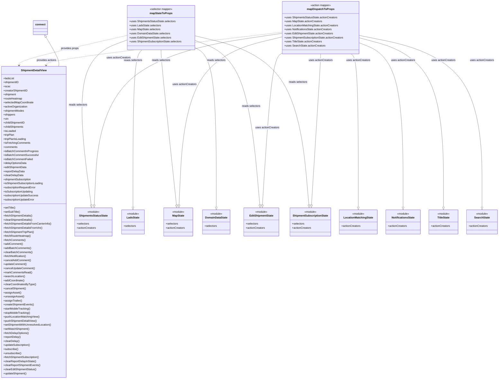

# Diagram: web/portal/src/modules/shipment-detail/ShipmentDetailViewContainer.js

> Auto-generated by Obscura crawlers

## Mermaid

### SVG

<svg id="container" width="2947.6796875" xmlns="http://www.w3.org/2000/svg" class="classDiagram" height="2250" viewBox="0 0 2947.6796875 2250" role="graphics-document document" aria-roledescription="class"><g><defs><marker id="container_class-aggregationStart" class="marker aggregation class" refX="18" refY="7" markerWidth="190" markerHeight="240" orient="auto"><path d="M 18,7 L9,13 L1,7 L9,1 Z"></path></marker></defs><defs><marker id="container_class-aggregationEnd" class="marker aggregation class" refX="1" refY="7" markerWidth="20" markerHeight="28" orient="auto"><path d="M 18,7 L9,13 L1,7 L9,1 Z"></path></marker></defs><defs><marker id="container_class-extensionStart" class="marker extension class" refX="18" refY="7" markerWidth="190" markerHeight="240" orient="auto"><path d="M 1,7 L18,13 V 1 Z"></path></marker></defs><defs><marker id="container_class-extensionEnd" class="marker extension class" refX="1" refY="7" markerWidth="20" markerHeight="28" orient="auto"><path d="M 1,1 V 13 L18,7 Z"></path></marker></defs><defs><marker id="container_class-compositionStart" class="marker composition class" refX="18" refY="7" markerWidth="190" markerHeight="240" orient="auto"><path d="M 18,7 L9,13 L1,7 L9,1 Z"></path></marker></defs><defs><marker id="container_class-compositionEnd" class="marker composition class" refX="1" refY="7" markerWidth="20" markerHeight="28" orient="auto"><path d="M 18,7 L9,13 L1,7 L9,1 Z"></path></marker></defs><defs><marker id="container_class-dependencyStart" class="marker dependency class" refX="6" refY="7" markerWidth="190" markerHeight="240" orient="auto"><path d="M 5,7 L9,13 L1,7 L9,1 Z"></path></marker></defs><defs><marker id="container_class-dependencyEnd" class="marker dependency class" refX="13" refY="7" markerWidth="20" markerHeight="28" orient="auto"><path d="M 18,7 L9,13 L14,7 L9,1 Z"></path></marker></defs><defs><marker id="container_class-lollipopStart" class="marker lollipop class" refX="13" refY="7" markerWidth="190" markerHeight="240" orient="auto"><circle stroke="black" fill="transparent" cx="7" cy="7" r="6"></circle></marker></defs><defs><marker id="container_class-lollipopEnd" class="marker lollipop class" refX="1" refY="7" markerWidth="190" markerHeight="240" orient="auto"><circle stroke="black" fill="transparent" cx="7" cy="7" r="6"></circle></marker></defs><g class="root"><g class="clusters"></g><g class="edgePaths"><path d="M749.26,210.297L642.119,234.747C534.978,259.198,320.696,308.099,214.065,337.721C107.434,367.343,108.453,377.686,108.963,382.857L109.472,388.029" id="id_mapStateToProps_ShipmentDetailView_1" class="edge-thickness-normal edge-pattern-dashed relation" style=";;;" data-edge="true" data-et="edge" data-id="id_mapStateToProps_ShipmentDetailView_1" data-points="W3sieCI6NzQ5LjI1OTc2NTYyNSwieSI6MjEwLjI5Njk2NTE3NjA4MjZ9LHsieCI6MTA2LjQxNDA2MjUsInkiOjM1N30seyJ4IjoxMTAuMDYxMDMyNjE1NzY0ODMsInkiOjM5NH1d" marker-end="url(#container_class-dependencyEnd)"></path><path d="M1673.012,190.932L1439.571,218.61C1206.13,246.288,739.247,301.644,505.423,334.491C271.599,367.339,270.833,377.678,270.449,382.847L270.066,388.016" id="id_mapDispatchToProps_ShipmentDetailView_2" class="edge-thickness-normal edge-pattern-dashed relation" style=";;;" data-edge="true" data-et="edge" data-id="id_mapDispatchToProps_ShipmentDetailView_2" data-points="W3sieCI6MTY3My4wMTE3MTg3NSwieSI6MTkwLjkzMjMyMjA5NDI3NzU0fSx7IngiOjI3Mi4zNjUyMzQzNzUsInkiOjM1N30seyJ4IjoyNjkuNjIyODI1MzQ0NjkzLCJ5IjozOTR9XQ==" marker-end="url(#container_class-dependencyEnd)"></path><path d="M273.861,220.948L286.92,243.623C299.979,266.299,326.098,311.649,338.188,340.491C350.278,369.333,348.339,381.667,347.369,387.833L346.4,394" id="id_connect_ShipmentDetailView_3" class="edge-thickness-normal edge-pattern-solid relation" style=";;;" data-edge="true" data-et="edge" data-id="id_connect_ShipmentDetailView_3" data-points="W3sieCI6MjY1LjI1MTUxNzk3Mjc5Nzk2LCJ5IjoyMDZ9LHsieCI6MzUyLjIxNjc5Njg3NSwieSI6MzU3fSx7IngiOjM0Ni4zOTk5NzgwNTAyMDgxLCJ5IjozOTR9XQ==" marker-start="url(#container_class-extensionStart)"></path><path d="M749.26,238.57L695.561,258.309C641.863,278.047,534.465,317.523,499.651,480.578C464.837,643.633,502.605,930.265,521.489,1073.582L540.374,1216.898" id="id_mapStateToProps_ShipmentsStatusState_4" class="edge-thickness-normal edge-pattern-solid relation" style=";;;" data-edge="true" data-et="edge" data-id="id_mapStateToProps_ShipmentsStatusState_4" data-points="W3sieCI6NzQ5LjI1OTc2NTYyNSwieSI6MjM4LjU3MDQwMDg0NTEzNzV9LHsieCI6NDI3LjA2ODM1OTM3NSwieSI6MzU3fSx7IngiOjU0Mi42MjY5ODM2MTA4MjIxLCJ5IjoxMjM0fV0=" marker-end="url(#container_class-extensionEnd)"></path><path d="M838.06,296L829.274,306.167C820.489,316.333,802.917,336.667,794.131,492.125C785.346,647.583,785.346,938.167,785.346,1083.458L785.346,1228.75" id="id_mapStateToProps_LadsState_5" class="edge-thickness-normal edge-pattern-solid relation" style=";;;" data-edge="true" data-et="edge" data-id="id_mapStateToProps_LadsState_5" data-points="W3sieCI6ODM4LjA2MDE4MjU2MTUyODQsInkiOjI5Nn0seyJ4Ijo3ODUuMzQ1NzAzMTI1LCJ5IjozNTd9LHsieCI6Nzg1LjM0NTcwMzEyNSwieSI6MTI0Nn1d" marker-end="url(#container_class-extensionEnd)"></path><path d="M952.131,296L952.131,306.167C952.131,316.333,952.131,336.667,967.616,490.142C983.101,643.617,1014.072,930.233,1029.557,1073.542L1045.043,1216.85" id="id_mapStateToProps_MapState_6" class="edge-thickness-normal edge-pattern-solid relation" style=";;;" data-edge="true" data-et="edge" data-id="id_mapStateToProps_MapState_6" data-points="W3sieCI6OTUyLjEzMDg1OTM3NSwieSI6Mjk2fSx7IngiOjk1Mi4xMzA4NTkzNzUsInkiOjM1N30seyJ4IjoxMDQ2Ljg5NTk1MzkyMTY5NjIsInkiOjEyMzR9XQ==" marker-end="url(#container_class-extensionEnd)"></path><path d="M1155.002,283.374L1175.856,295.645C1196.71,307.916,1238.419,332.458,1259.273,490.021C1280.127,647.583,1280.127,938.167,1280.127,1083.458L1280.127,1228.75" id="id_mapStateToProps_DomainDataState_7" class="edge-thickness-normal edge-pattern-solid relation" style=";;;" data-edge="true" data-et="edge" data-id="id_mapStateToProps_DomainDataState_7" data-points="W3sieCI6MTE1NS4wMDE5NTMxMjUsInkiOjI4My4zNzM3NDIwNjUzMzUyfSx7IngiOjEyODAuMTI2OTUzMTI1LCJ5IjozNTd9LHsieCI6MTI4MC4xMjY5NTMxMjUsInkiOjEyNDZ9XQ==" marker-end="url(#container_class-extensionEnd)"></path><path d="M1155.002,240.824L1206.133,260.187C1257.264,279.55,1359.527,318.275,1423.725,480.941C1487.923,643.607,1514.058,930.214,1527.125,1073.518L1540.192,1216.821" id="id_mapStateToProps_EditShipmentState_8" class="edge-thickness-normal edge-pattern-solid relation" style=";;;" data-edge="true" data-et="edge" data-id="id_mapStateToProps_EditShipmentState_8" data-points="W3sieCI6MTE1NS4wMDE5NTMxMjUsInkiOjI0MC44MjQyNzMzMTQyOTk5NH0seyJ4IjoxNDYxLjc4OTA2MjUsInkiOjM1N30seyJ4IjoxNTQxLjc1ODQxODE1MTY2NSwieSI6MTIzNH1d" marker-end="url(#container_class-extensionEnd)"></path><path d="M1155.002,212.826L1254.841,236.855C1354.681,260.884,1554.36,308.942,1667.267,476.275C1780.173,643.607,1806.308,930.214,1819.375,1073.518L1832.442,1216.821" id="id_mapStateToProps_ShipmentSubscriptionState_9" class="edge-thickness-normal edge-pattern-solid relation" style=";;;" data-edge="true" data-et="edge" data-id="id_mapStateToProps_ShipmentSubscriptionState_9" data-points="W3sieCI6MTE1NS4wMDE5NTMxMjUsInkiOjIxMi44MjYxODg1MTAzMTU5N30seyJ4IjoxNzU0LjAzOTA2MjUsInkiOjM1N30seyJ4IjoxODM0LjAwODQxODE1MTY2NSwieSI6MTIzNH1d" marker-end="url(#container_class-extensionEnd)"></path><path d="M1673.012,197.695L1494.02,224.246C1315.027,250.796,957.043,303.898,771.287,473.744C585.53,643.59,572.002,930.179,565.238,1073.474L558.474,1216.769" id="id_mapDispatchToProps_ShipmentsStatusState_10" class="edge-thickness-normal edge-pattern-solid relation" style=";;;" data-edge="true" data-et="edge" data-id="id_mapDispatchToProps_ShipmentsStatusState_10" data-points="W3sieCI6MTY3My4wMTE3MTg3NSwieSI6MTk3LjY5NDczMzc0NTA0MjUzfSx7IngiOjU5OS4wNTg1OTM3NSwieSI6MzU3fSx7IngiOjU1Ny42NjA0NjkyMzc3NzMxLCJ5IjoxMjM0fV0=" marker-end="url(#container_class-extensionEnd)"></path><path d="M1673.012,218.67L1577.219,241.725C1481.426,264.78,1289.841,310.89,1187.744,477.239C1085.646,643.589,1073.037,930.178,1066.732,1073.472L1060.427,1216.767" id="id_mapDispatchToProps_MapState_11" class="edge-thickness-normal edge-pattern-solid relation" style=";;;" data-edge="true" data-et="edge" data-id="id_mapDispatchToProps_MapState_11" data-points="W3sieCI6MTY3My4wMTE3MTg3NSwieSI6MjE4LjY3MDEwMDg1ODA2MDcyfSx7IngiOjEwOTguMjU1ODU5Mzc1LCJ5IjozNTd9LHsieCI6MTA1OS42Njg1ODY1OTU5OTM3LCJ5IjoxMjM0fV0=" marker-end="url(#container_class-extensionEnd)"></path><path d="M2078.831,320L2085.894,326.167C2092.956,332.333,2107.082,344.667,2114.144,496.125C2121.207,647.583,2121.207,938.167,2121.207,1083.458L2121.207,1228.75" id="id_mapDispatchToProps_LocationMatchingState_12" class="edge-thickness-normal edge-pattern-solid relation" style=";;;" data-edge="true" data-et="edge" data-id="id_mapDispatchToProps_LocationMatchingState_12" data-points="W3sieCI6MjA3OC44MzA5MTgwNjk5NDgsInkiOjMyMH0seyJ4IjoyMTIxLjIwNzAzMTI1LCJ5IjozNTd9LHsieCI6MjEyMS4yMDcwMzEyNSwieSI6MTI0Nn1d" marker-end="url(#container_class-extensionEnd)"></path><path d="M2127.316,254.738L2169.984,271.781C2212.651,288.825,2297.986,322.913,2340.653,485.248C2383.32,647.583,2383.32,938.167,2383.32,1083.458L2383.32,1228.75" id="id_mapDispatchToProps_NotificationsState_13" class="edge-thickness-normal edge-pattern-solid relation" style=";;;" data-edge="true" data-et="edge" data-id="id_mapDispatchToProps_NotificationsState_13" data-points="W3sieCI6MjEyNy4zMTY0MDYyNSwieSI6MjU0LjczNzUyNTA2MzA2MTl9LHsieCI6MjM4My4zMjAzMTI1LCJ5IjozNTd9LHsieCI6MjM4My4zMjAzMTI1LCJ5IjoxMjQ2fV0=" marker-end="url(#container_class-extensionEnd)"></path><path d="M1673.012,314.01L1662.162,321.175C1651.313,328.34,1629.613,342.67,1610.041,493.132C1590.469,643.594,1573.024,930.188,1564.302,1073.485L1555.579,1216.782" id="id_mapDispatchToProps_EditShipmentState_14" class="edge-thickness-normal edge-pattern-solid relation" style=";;;" data-edge="true" data-et="edge" data-id="id_mapDispatchToProps_EditShipmentState_14" data-points="W3sieCI6MTY3My4wMTE3MTg3NSwieSI6MzE0LjAwOTkzMTAzMDc5NTU0fSx7IngiOjE2MDcuOTE0MDYyNSwieSI6MzU3fSx7IngiOjE1NTQuNTMxMDUwODI1OTYyNCwieSI6MTIzNH1d" marker-end="url(#container_class-extensionEnd)"></path><path d="M1900.164,320L1900.164,326.167C1900.164,332.333,1900.164,344.667,1891.442,494.13C1882.719,643.594,1865.274,930.188,1856.552,1073.485L1847.829,1216.782" id="id_mapDispatchToProps_ShipmentSubscriptionState_15" class="edge-thickness-normal edge-pattern-solid relation" style=";;;" data-edge="true" data-et="edge" data-id="id_mapDispatchToProps_ShipmentSubscriptionState_15" data-points="W3sieCI6MTkwMC4xNjQwNjI1LCJ5IjozMjB9LHsieCI6MTkwMC4xNjQwNjI1LCJ5IjozNTd9LHsieCI6MTg0Ni43ODEwNTA4MjU5NjI0LCJ5IjoxMjM0fV0=" marker-end="url(#container_class-extensionEnd)"></path><path d="M2127.316,224.757L2209.719,246.798C2292.121,268.838,2456.926,312.919,2539.328,480.251C2621.73,647.583,2621.73,938.167,2621.73,1083.458L2621.73,1228.75" id="id_mapDispatchToProps_TitleState_16" class="edge-thickness-normal edge-pattern-solid relation" style=";;;" data-edge="true" data-et="edge" data-id="id_mapDispatchToProps_TitleState_16" data-points="W3sieCI6MjEyNy4zMTY0MDYyNSwieSI6MjI0Ljc1NzI2NjM2Mzg2NzY3fSx7IngiOjI2MjEuNzMwNDY4NzUsInkiOjM1N30seyJ4IjoyNjIxLjczMDQ2ODc1LCJ5IjoxMjQ2fV0=" marker-end="url(#container_class-extensionEnd)"></path><path d="M2127.316,210.198L2247.618,234.665C2367.919,259.132,2608.522,308.066,2728.824,477.825C2849.125,647.583,2849.125,938.167,2849.125,1083.458L2849.125,1228.75" id="id_mapDispatchToProps_SearchState_17" class="edge-thickness-normal edge-pattern-solid relation" style=";;;" data-edge="true" data-et="edge" data-id="id_mapDispatchToProps_SearchState_17" data-points="W3sieCI6MjEyNy4zMTY0MDYyNSwieSI6MjEwLjE5ODMyMTM1NDc3MTI1fSx7IngiOjI4NDkuMTI1LCJ5IjozNTd9LHsieCI6Mjg0OS4xMjUsInkiOjEyNDZ9XQ==" marker-end="url(#container_class-extensionEnd)"></path></g><g class="edgeLabels"><g class="edgeLabel" transform="translate(409.71321, 287.78447)"><g class="label" data-id="id_mapStateToProps_ShipmentDetailView_1" transform="translate(-54.1953125, -12)"><foreignObject width="108.390625" height="24">

provides props

</foreignObject></g></g><g class="edgeLabel" transform="translate(272.365234375, 357)"><g class="label" data-id="id_mapDispatchToProps_ShipmentDetailView_2" transform="translate(-59.8515625, -12)"><foreignObject width="119.703125" height="24">

provides actions

</foreignObject></g></g><g class="edgeLabel"><g class="label" data-id="id_connect_ShipmentDetailView_3" transform="translate(0, 0)"><foreignObject width="0" height="0">

</foreignObject></g></g><g class="edgeLabel" transform="translate(462.42599, 625.33688)"><g class="label" data-id="id_mapStateToProps_ShipmentsStatusState_4" transform="translate(-54.8515625, -12)"><foreignObject width="109.703125" height="24">

reads selectors

</foreignObject></g></g><g class="edgeLabel" transform="translate(785.345703125, 357)"><g class="label" data-id="id_mapStateToProps_LadsState_5" transform="translate(-54.8515625, -12)"><foreignObject width="109.703125" height="24">

reads selectors

</foreignObject></g></g><g class="edgeLabel" transform="translate(952.130859375, 357)"><g class="label" data-id="id_mapStateToProps_MapState_6" transform="translate(-54.8515625, -12)"><foreignObject width="109.703125" height="24">

reads selectors

</foreignObject></g></g><g class="edgeLabel" transform="translate(1280.126953125, 357)"><g class="label" data-id="id_mapStateToProps_DomainDataState_7" transform="translate(-54.8515625, -12)"><foreignObject width="109.703125" height="24">

reads selectors

</foreignObject></g></g><g class="edgeLabel" transform="translate(1486.87901, 632.15396)"><g class="label" data-id="id_mapStateToProps_EditShipmentState_8" transform="translate(-54.8515625, -12)"><foreignObject width="109.703125" height="24">

reads selectors

</foreignObject></g></g><g class="edgeLabel" transform="translate(1766.04829, 488.7016)"><g class="label" data-id="id_mapStateToProps_ShipmentSubscriptionState_9" transform="translate(-54.8515625, -12)"><foreignObject width="109.703125" height="24">

reads selectors

</foreignObject></g></g><g class="edgeLabel" transform="translate(701.79823, 341.76007)"><g class="label" data-id="id_mapDispatchToProps_ShipmentsStatusState_10" transform="translate(-71.2734375, -12)"><foreignObject width="142.546875" height="24">

uses actionCreators

</foreignObject></g></g><g class="edgeLabel" transform="translate(1091.9551, 500.20176)"><g class="label" data-id="id_mapDispatchToProps_MapState_11" transform="translate(-71.2734375, -12)"><foreignObject width="142.546875" height="24">

uses actionCreators

</foreignObject></g></g><g class="edgeLabel" transform="translate(2121.20703125, 357)"><g class="label" data-id="id_mapDispatchToProps_LocationMatchingState_12" transform="translate(-71.2734375, -12)"><foreignObject width="142.546875" height="24">

uses actionCreators

</foreignObject></g></g><g class="edgeLabel" transform="translate(2383.3203125, 357)"><g class="label" data-id="id_mapDispatchToProps_NotificationsState_13" transform="translate(-71.2734375, -12)"><foreignObject width="142.546875" height="24">

uses actionCreators

</foreignObject></g></g><g class="edgeLabel" transform="translate(1583.59246, 756.56613)"><g class="label" data-id="id_mapDispatchToProps_EditShipmentState_14" transform="translate(-71.2734375, -12)"><foreignObject width="142.546875" height="24">

uses actionCreators

</foreignObject></g></g><g class="edgeLabel" transform="translate(1900.1640625, 357)"><g class="label" data-id="id_mapDispatchToProps_ShipmentSubscriptionState_15" transform="translate(-71.2734375, -12)"><foreignObject width="142.546875" height="24">

uses actionCreators

</foreignObject></g></g><g class="edgeLabel" transform="translate(2621.73046875, 357)"><g class="label" data-id="id_mapDispatchToProps_TitleState_16" transform="translate(-71.2734375, -12)"><foreignObject width="142.546875" height="24">

uses actionCreators

</foreignObject></g></g><g class="edgeLabel" transform="translate(2849.125, 357)"><g class="label" data-id="id_mapDispatchToProps_SearchState_17" transform="translate(-71.2734375, -12)"><foreignObject width="142.546875" height="24">

uses actionCreators

</foreignObject></g></g></g><g class="nodes"><g class="node default" id="classId-ShipmentDetailView-0" transform="translate(201.13671875, 1318)"><g class="basic label-container"><path d="M-193.13671875 -924 L193.13671875 -924 L193.13671875 924 L-193.13671875 924" stroke="none" stroke-width="0" fill="#ECECFF" style=""></path><path d="M-193.13671875 -924 C-49.140154220673026 -924, 94.85641030865395 -924, 193.13671875 -924 M-193.13671875 -924 C-42.73773646772085 -924, 107.6612458145583 -924, 193.13671875 -924 M193.13671875 -924 C193.13671875 -285.3641294795684, 193.13671875 353.27174104086316, 193.13671875 924 M193.13671875 -924 C193.13671875 -515.5283463913493, 193.13671875 -107.05669278269863, 193.13671875 924 M193.13671875 924 C40.893010643087706 924, -111.35069746382459 924, -193.13671875 924 M193.13671875 924 C71.10898561656764 924, -50.91874751686473 924, -193.13671875 924 M-193.13671875 924 C-193.13671875 256.6070582368558, -193.13671875 -410.78588352628844, -193.13671875 -924 M-193.13671875 924 C-193.13671875 274.31268785998714, -193.13671875 -375.3746242800257, -193.13671875 -924" stroke="#9370DB" stroke-width="1.3" fill="none" stroke-dasharray="0 0" style=""></path></g><g class="annotation-group text" transform="translate(0, -900)"></g><g class="label-group text" transform="translate(-73.9609375, -900)"><g class="label" style="font-weight: bolder" transform="translate(0,-12)"><foreignObject width="147.921875" height="24">

ShipmentDetailView

</foreignObject></g></g><g class="members-group text" transform="translate(-181.13671875, -852)"><g class="label" style="" transform="translate(0,-12)"><foreignObject width="64.078125" height="24">

+ladsList

</foreignObject></g><g class="label" style="" transform="translate(0,12)"><foreignObject width="91.46875" height="24">

+shipmentID

</foreignObject></g><g class="label" style="" transform="translate(0,36)"><foreignObject width="39.296875" height="24">

+scac

</foreignObject></g><g class="label" style="" transform="translate(0,60)"><foreignObject width="144.375" height="24">

+creatorShipmentID

</foreignObject></g><g class="label" style="" transform="translate(0,84)"><foreignObject width="76.4375" height="24">

+shipment

</foreignObject></g><g class="label" style="" transform="translate(0,108)"><foreignObject width="112.4375" height="24">

+routeHeatmap

</foreignObject></g><g class="label" style="" transform="translate(0,132)"><foreignObject width="179.078125" height="24">

+selectedMapCoordinate

</foreignObject></g><g class="label" style="" transform="translate(0,156)"><foreignObject width="143" height="24">

+activeOrganization

</foreignObject></g><g class="label" style="" transform="translate(0,180)"><foreignObject width="123.984375" height="24">

+shipmentModes

</foreignObject></g><g class="label" style="" transform="translate(0,204)"><foreignObject width="70.484375" height="24">

+shippers

</foreignObject></g><g class="label" style="" transform="translate(0,228)"><foreignObject width="29.59375" height="24">

+vin

</foreignObject></g><g class="label" style="" transform="translate(0,252)"><foreignObject width="128.421875" height="24">

+childShipmentID

</foreignObject></g><g class="label" style="" transform="translate(0,276)"><foreignObject width="120.875" height="24">

+childShipments

</foreignObject></g><g class="label" style="" transform="translate(0,300)"><foreignObject width="73.28125" height="24">

+isLoaded

</foreignObject></g><g class="label" style="" transform="translate(0,324)"><foreignObject width="65.703125" height="24">

+tripPlan

</foreignObject></g><g class="label" style="" transform="translate(0,348)"><foreignObject width="135.125" height="24">

+tripPlanIsLoading

</foreignObject></g><g class="label" style="" transform="translate(0,372)"><foreignObject width="157.515625" height="24">

+isFetchingComments

</foreignObject></g><g class="label" style="" transform="translate(0,396)"><foreignObject width="83.4375" height="24">

+comments

</foreignObject></g><g class="label" style="" transform="translate(0,420)"><foreignObject width="205.875" height="24">

+isBatchCommentInProgress

</foreignObject></g><g class="label" style="" transform="translate(0,444)"><foreignObject width="205.796875" height="24">

+isBatchCommentSuccessful

</foreignObject></g><g class="label" style="" transform="translate(0,468)"><foreignObject width="173.25" height="24">

+isBatchCommentFailed

</foreignObject></g><g class="label" style="" transform="translate(0,492)"><foreignObject width="137.5" height="24">

+delayOptionsData

</foreignObject></g><g class="label" style="" transform="translate(0,516)"><foreignObject width="139.484375" height="24">

+editShipmentData

</foreignObject></g><g class="label" style="" transform="translate(0,540)"><foreignObject width="126.390625" height="24">

+reportDelayData

</foreignObject></g><g class="label" style="" transform="translate(0,564)"><foreignObject width="116.875" height="24">

+clearDelayData

</foreignObject></g><g class="label" style="" transform="translate(0,588)"><foreignObject width="168.296875" height="24">

+shipmentSubscription

</foreignObject></g><g class="label" style="" transform="translate(0,612)"><foreignObject width="238.765625" height="24">

+isShipmentSubscriptionLoading

</foreignObject></g><g class="label" style="" transform="translate(0,636)"><foreignObject width="193.40625" height="24">

+subscriptionRequestError

</foreignObject></g><g class="label" style="" transform="translate(0,660)"><foreignObject width="178.1875" height="24">

+isSubscriptionUpdating

</foreignObject></g><g class="label" style="" transform="translate(0,684)"><foreignObject width="207.421875" height="24">

+subscriptionUpdateSuccess

</foreignObject></g><g class="label" style="" transform="translate(0,708)"><foreignObject width="187.015625" height="24">

+subscriptionUpdateError

</foreignObject></g></g><g class="methods-group text" transform="translate(-181.13671875, -84)"><g class="label" style="" transform="translate(0,-12)"><foreignObject width="72.0625" height="24">

+setTitle()

</foreignObject></g><g class="label" style="" transform="translate(0,12)"><foreignObject width="99.59375" height="24">

+setSubTitle()

</foreignObject></g><g class="label" style="" transform="translate(0,36)"><foreignObject width="174.359375" height="24">

+fetchShipmentDetails()

</foreignObject></g><g class="label" style="" transform="translate(0,60)"><foreignObject width="173.8125" height="24">

+clearShipmentDetails()

</foreignObject></g><g class="label" style="" transform="translate(0,84)"><foreignObject width="288.3125" height="24">

+fetchShipmentDetailsFromCarrierInfo()

</foreignObject></g><g class="label" style="" transform="translate(0,108)"><foreignObject width="233.1875" height="24">

+fetchShipmentDetailsFromVin()

</foreignObject></g><g class="label" style="" transform="translate(0,132)"><foreignObject width="184.109375" height="24">

+fetchShipmentTripPlan()

</foreignObject></g><g class="label" style="" transform="translate(0,156)"><foreignObject width="162.796875" height="24">

+fetchRouteHeatmap()

</foreignObject></g><g class="label" style="" transform="translate(0,180)"><foreignObject width="131.359375" height="24">

+fetchComments()

</foreignObject></g><g class="label" style="" transform="translate(0,204)"><foreignObject width="115.234375" height="24">

+addComment()

</foreignObject></g><g class="label" style="" transform="translate(0,228)"><foreignObject width="163.703125" height="24">

+addBatchComments()

</foreignObject></g><g class="label" style="" transform="translate(0,252)"><foreignObject width="171.796875" height="24">

+clearBatchComments()

</foreignObject></g><g class="label" style="" transform="translate(0,276)"><foreignObject width="139.5625" height="24">

+fetchNotification()

</foreignObject></g><g class="label" style="" transform="translate(0,300)"><foreignObject width="162.25" height="24">

+cancelAddComment()

</foreignObject></g><g class="label" style="" transform="translate(0,324)"><foreignObject width="138.984375" height="24">

+updateComment()

</foreignObject></g><g class="label" style="" transform="translate(0,348)"><foreignObject width="186.5625" height="24">

+cancelUpdateComment()

</foreignObject></g><g class="label" style="" transform="translate(0,372)"><foreignObject width="168.171875" height="24">

+markCommentsRead()

</foreignObject></g><g class="label" style="" transform="translate(0,396)"><foreignObject width="127.921875" height="24">

+searchLocation()

</foreignObject></g><g class="label" style="" transform="translate(0,420)"><foreignObject width="125.40625" height="24">

+addCoordinate()

</foreignObject></g><g class="label" style="" transform="translate(0,444)"><foreignObject width="192.296875" height="24">

+clearCoordinatesByType()

</foreignObject></g><g class="label" style="" transform="translate(0,468)"><foreignObject width="134.359375" height="24">

+cancelShipment()

</foreignObject></g><g class="label" style="" transform="translate(0,492)"><foreignObject width="102.109375" height="24">

+assignAsset()

</foreignObject></g><g class="label" style="" transform="translate(0,516)"><foreignObject width="121.03125" height="24">

+unassignAsset()

</foreignObject></g><g class="label" style="" transform="translate(0,540)"><foreignObject width="109.78125" height="24">

+assignTrailer()

</foreignObject></g><g class="label" style="" transform="translate(0,564)"><foreignObject width="180.3125" height="24">

+createShipmentEvents()

</foreignObject></g><g class="label" style="" transform="translate(0,588)"><foreignObject width="161.453125" height="24">

+startMobileTracking()

</foreignObject></g><g class="label" style="" transform="translate(0,612)"><foreignObject width="159.515625" height="24">

+stopMobileTracking()

</foreignObject></g><g class="label" style="" transform="translate(0,636)"><foreignObject width="215.65625" height="24">

+pushLocationMatchingView()

</foreignObject></g><g class="label" style="" transform="translate(0,660)"><foreignObject width="199.90625" height="24">

+pushShipmentDetailView()

</foreignObject></g><g class="label" style="" transform="translate(0,684)"><foreignObject width="286.84375" height="24">

+setShipmentWithUnresolvedLocation()

</foreignObject></g><g class="label" style="" transform="translate(0,708)"><foreignObject width="154.03125" height="24">

+setWatchShipment()

</foreignObject></g><g class="label" style="" transform="translate(0,732)"><foreignObject width="151.625" height="24">

+fetchDelayOptions()

</foreignObject></g><g class="label" style="" transform="translate(0,756)"><foreignObject width="103.546875" height="24">

+reportDelay()

</foreignObject></g><g class="label" style="" transform="translate(0,780)"><foreignObject width="94.03125" height="24">

+clearDelay()

</foreignObject></g><g class="label" style="" transform="translate(0,804)"><foreignObject width="161.5625" height="24">

+updateSubscription()

</foreignObject></g><g class="label" style="" transform="translate(0,828)"><foreignObject width="88.6875" height="24">

+subscribe()

</foreignObject></g><g class="label" style="" transform="translate(0,852)"><foreignObject width="107.375" height="24">

+unsubscribe()

</foreignObject></g><g class="label" style="" transform="translate(0,876)"><foreignObject width="216.15625" height="24">

+fetchShipmentSubscription()

</foreignObject></g><g class="label" style="" transform="translate(0,900)"><foreignObject width="194.421875" height="24">

+clearReportDelayInState()

</foreignObject></g><g class="label" style="" transform="translate(0,924)"><foreignObject width="220.109375" height="24">

+clearReportShipmentEvents()

</foreignObject></g><g class="label" style="" transform="translate(0,948)"><foreignObject width="197.5" height="24">

+clearEditShipmentStatus()

</foreignObject></g><g class="label" style="" transform="translate(0,972)"><foreignObject width="139.40625" height="24">

+updateShipment()

</foreignObject></g></g><g class="divider" style=""><path d="M-193.13671875 -876 C-80.02400774646745 -876, 33.088703257065106 -876, 193.13671875 -876 M-193.13671875 -876 C-101.36844325904919 -876, -9.600167768098373 -876, 193.13671875 -876" stroke="#9370DB" stroke-width="1.3" fill="none" stroke-dasharray="0 0" style=""></path></g><g class="divider" style=""><path d="M-193.13671875 -108 C-115.28388953390665 -108, -37.43106031781329 -108, 193.13671875 -108 M-193.13671875 -108 C-77.06298078335648 -108, 39.01075718328704 -108, 193.13671875 -108" stroke="#9370DB" stroke-width="1.3" fill="none" stroke-dasharray="0 0" style=""></path></g></g><g class="node default" id="classId-mapStateToProps-1" transform="translate(952.130859375, 164)"><g class="basic label-container"><path d="M-202.87109375 -132 L202.87109375 -132 L202.87109375 132 L-202.87109375 132" stroke="none" stroke-width="0" fill="#ECECFF" style=""></path><path d="M-202.87109375 -132 C-46.2810613536592 -132, 110.3089710426816 -132, 202.87109375 -132 M-202.87109375 -132 C-41.05262632144331 -132, 120.76584110711337 -132, 202.87109375 -132 M202.87109375 -132 C202.87109375 -58.60510631859401, 202.87109375 14.789787362811978, 202.87109375 132 M202.87109375 -132 C202.87109375 -36.87492457402132, 202.87109375 58.25015085195736, 202.87109375 132 M202.87109375 132 C69.87324854009987 132, -63.12459666980027 132, -202.87109375 132 M202.87109375 132 C107.71019574599971 132, 12.549297741999425 132, -202.87109375 132 M-202.87109375 132 C-202.87109375 54.10197428756278, -202.87109375 -23.796051424874435, -202.87109375 -132 M-202.87109375 132 C-202.87109375 54.21990204743655, -202.87109375 -23.560195905126903, -202.87109375 -132" stroke="#9370DB" stroke-width="1.3" fill="none" stroke-dasharray="0 0" style=""></path></g><g class="annotation-group text" transform="translate(-68.4453125, -108)"><g class="label" style="" transform="translate(0,-12)"><foreignObject width="136.890625" height="24">

«selector mapper»

</foreignObject></g></g><g class="label-group text" transform="translate(-64.7109375, -84)"><g class="label" style="font-weight: bolder" transform="translate(0,-12)"><foreignObject width="129.421875" height="24">

mapStateToProps

</foreignObject></g></g><g class="members-group text" transform="translate(-190.87109375, -36)"><g class="label" style="" transform="translate(0,-12)"><foreignObject width="274.5625" height="24">

+uses ShipmentsStatusState.selectors

</foreignObject></g><g class="label" style="" transform="translate(0,12)"><foreignObject width="185.296875" height="24">

+uses LadsState.selectors

</foreignObject></g><g class="label" style="" transform="translate(0,36)"><foreignObject width="182.40625" height="24">

+uses MapState.selectors

</foreignObject></g><g class="label" style="" transform="translate(0,60)"><foreignObject width="240.921875" height="24">

+uses DomainDataState.selectors

</foreignObject></g><g class="label" style="" transform="translate(0,84)"><foreignObject width="249.546875" height="24">

+uses EditShipmentState.selectors

</foreignObject></g><g class="label" style="" transform="translate(0,108)"><foreignObject width="313.296875" height="24">

+uses ShipmentSubscriptionState.selectors

</foreignObject></g></g><g class="methods-group text" transform="translate(-190.87109375, 132)"></g><g class="divider" style=""><path d="M-202.87109375 -60 C-103.03443457944647 -60, -3.1977754088929373 -60, 202.87109375 -60 M-202.87109375 -60 C-55.71087707641763 -60, 91.44933959716474 -60, 202.87109375 -60" stroke="#9370DB" stroke-width="1.3" fill="none" stroke-dasharray="0 0" style=""></path></g><g class="divider" style=""><path d="M-202.87109375 108 C-65.76473126329319 108, 71.34163122341363 108, 202.87109375 108 M-202.87109375 108 C-115.94355286736503 108, -29.016011984730056 108, 202.87109375 108" stroke="#9370DB" stroke-width="1.3" fill="none" stroke-dasharray="0 0" style=""></path></g></g><g class="node default" id="classId-mapDispatchToProps-2" transform="translate(1900.1640625, 164)"><g class="basic label-container"><path d="M-227.15234375 -156 L227.15234375 -156 L227.15234375 156 L-227.15234375 156" stroke="none" stroke-width="0" fill="#ECECFF" style=""></path><path d="M-227.15234375 -156 C-77.13454009218583 -156, 72.88326356562834 -156, 227.15234375 -156 M-227.15234375 -156 C-86.99832571755289 -156, 53.155692314894225 -156, 227.15234375 -156 M227.15234375 -156 C227.15234375 -55.8113749805168, 227.15234375 44.377250038966395, 227.15234375 156 M227.15234375 -156 C227.15234375 -72.64312304730664, 227.15234375 10.71375390538671, 227.15234375 156 M227.15234375 156 C55.21980769545033 156, -116.71272835909934 156, -227.15234375 156 M227.15234375 156 C65.70688051262817 156, -95.73858272474365 156, -227.15234375 156 M-227.15234375 156 C-227.15234375 88.70963913417863, -227.15234375 21.41927826835726, -227.15234375 -156 M-227.15234375 156 C-227.15234375 75.50186149882889, -227.15234375 -4.996277002342225, -227.15234375 -156" stroke="#9370DB" stroke-width="1.3" fill="none" stroke-dasharray="0 0" style=""></path></g><g class="annotation-group text" transform="translate(-61.890625, -132)"><g class="label" style="" transform="translate(0,-12)"><foreignObject width="123.78125" height="24">

«action mapper»

</foreignObject></g></g><g class="label-group text" transform="translate(-77.1953125, -108)"><g class="label" style="font-weight: bolder" transform="translate(0,-12)"><foreignObject width="154.390625" height="24">

mapDispatchToProps

</foreignObject></g></g><g class="members-group text" transform="translate(-215.15234375, -60)"><g class="label" style="" transform="translate(0,-12)"><foreignObject width="314.375" height="24">

+uses ShipmentsStatusState.actionCreators

</foreignObject></g><g class="label" style="" transform="translate(0,12)"><foreignObject width="222.21875" height="24">

+uses MapState.actionCreators

</foreignObject></g><g class="label" style="" transform="translate(0,36)"><foreignObject width="319.59375" height="24">

+uses LocationMatchingState.actionCreators

</foreignObject></g><g class="label" style="" transform="translate(0,60)"><foreignObject width="284" height="24">

+uses NotificationsState.actionCreators

</foreignObject></g><g class="label" style="" transform="translate(0,84)"><foreignObject width="289.359375" height="24">

+uses EditShipmentState.actionCreators

</foreignObject></g><g class="label" style="" transform="translate(0,108)"><foreignObject width="353.109375" height="24">

+uses ShipmentSubscriptionState.actionCreators

</foreignObject></g><g class="label" style="" transform="translate(0,132)"><foreignObject width="223.28125" height="24">

+uses TitleState.actionCreators

</foreignObject></g><g class="label" style="" transform="translate(0,156)"><foreignObject width="240.265625" height="24">

+uses SearchState.actionCreators

</foreignObject></g></g><g class="methods-group text" transform="translate(-215.15234375, 156)"></g><g class="divider" style=""><path d="M-227.15234375 -84 C-74.20123404580883 -84, 78.74987565838234 -84, 227.15234375 -84 M-227.15234375 -84 C-82.12905530155504 -84, 62.89423314688992 -84, 227.15234375 -84" stroke="#9370DB" stroke-width="1.3" fill="none" stroke-dasharray="0 0" style=""></path></g><g class="divider" style=""><path d="M-227.15234375 132 C-70.65292334751283 132, 85.84649705497435 132, 227.15234375 132 M-227.15234375 132 C-93.08728605513318 132, 40.977771639733646 132, 227.15234375 132" stroke="#9370DB" stroke-width="1.3" fill="none" stroke-dasharray="0 0" style=""></path></g></g><g class="node default" id="classId-ShipmentsStatusState-3" transform="translate(553.6953125, 1318)"><g class="basic label-container"><path d="M-109.421875 -84 L109.421875 -84 L109.421875 84 L-109.421875 84" stroke="none" stroke-width="0" fill="#ECECFF" style=""></path><path d="M-109.421875 -84 C-35.27960213094315 -84, 38.86267073811371 -84, 109.421875 -84 M-109.421875 -84 C-64.06579974194624 -84, -18.709724483892472 -84, 109.421875 -84 M109.421875 -84 C109.421875 -46.98056558818053, 109.421875 -9.961131176361064, 109.421875 84 M109.421875 -84 C109.421875 -37.49946995764661, 109.421875 9.00106008470678, 109.421875 84 M109.421875 84 C21.953233958914595 84, -65.51540708217081 84, -109.421875 84 M109.421875 84 C57.911466931382606 84, 6.401058862765211 84, -109.421875 84 M-109.421875 84 C-109.421875 41.924638258375786, -109.421875 -0.15072348324842721, -109.421875 -84 M-109.421875 84 C-109.421875 40.52669435201916, -109.421875 -2.9466112959616737, -109.421875 -84" stroke="#9370DB" stroke-width="1.3" fill="none" stroke-dasharray="0 0" style=""></path></g><g class="annotation-group text" transform="translate(-36.6015625, -60)"><g class="label" style="" transform="translate(0,-12)"><foreignObject width="73.203125" height="24">

«module»

</foreignObject></g></g><g class="label-group text" transform="translate(-81.765625, -36)"><g class="label" style="font-weight: bolder" transform="translate(0,-12)"><foreignObject width="163.53125" height="24">

ShipmentsStatusState

</foreignObject></g></g><g class="members-group text" transform="translate(-97.421875, 12)"><g class="label" style="" transform="translate(0,-12)"><foreignObject width="73.453125" height="24">

+selectors

</foreignObject></g><g class="label" style="" transform="translate(0,12)"><foreignObject width="113.078125" height="24">

+actionCreators

</foreignObject></g></g><g class="methods-group text" transform="translate(-97.421875, 84)"></g><g class="divider" style=""><path d="M-109.421875 -12 C-63.930956845874405 -12, -18.44003869174881 -12, 109.421875 -12 M-109.421875 -12 C-47.650721630641534 -12, 14.120431738716931 -12, 109.421875 -12" stroke="#9370DB" stroke-width="1.3" fill="none" stroke-dasharray="0 0" style=""></path></g><g class="divider" style=""><path d="M-109.421875 60 C-23.901732323482236 60, 61.61841035303553 60, 109.421875 60 M-109.421875 60 C-49.8035199050398 60, 9.814835189920402 60, 109.421875 60" stroke="#9370DB" stroke-width="1.3" fill="none" stroke-dasharray="0 0" style=""></path></g></g><g class="node default" id="classId-EditShipmentState-4" transform="translate(1549.41796875, 1318)"><g class="basic label-container"><path d="M-102.84375 -84 L102.84375 -84 L102.84375 84 L-102.84375 84" stroke="none" stroke-width="0" fill="#ECECFF" style=""></path><path d="M-102.84375 -84 C-26.877090574257153 -84, 49.089568851485694 -84, 102.84375 -84 M-102.84375 -84 C-24.280318519937552 -84, 54.283112960124896 -84, 102.84375 -84 M102.84375 -84 C102.84375 -48.48651419912709, 102.84375 -12.973028398254186, 102.84375 84 M102.84375 -84 C102.84375 -40.15289175698573, 102.84375 3.6942164860285374, 102.84375 84 M102.84375 84 C31.104252038160624 84, -40.63524592367875 84, -102.84375 84 M102.84375 84 C55.63047203977298 84, 8.417194079545965 84, -102.84375 84 M-102.84375 84 C-102.84375 21.838000405242028, -102.84375 -40.323999189515945, -102.84375 -84 M-102.84375 84 C-102.84375 28.599991813000884, -102.84375 -26.800016373998233, -102.84375 -84" stroke="#9370DB" stroke-width="1.3" fill="none" stroke-dasharray="0 0" style=""></path></g><g class="annotation-group text" transform="translate(-36.6015625, -60)"><g class="label" style="" transform="translate(0,-12)"><foreignObject width="73.203125" height="24">

«module»

</foreignObject></g></g><g class="label-group text" transform="translate(-68.609375, -36)"><g class="label" style="font-weight: bolder" transform="translate(0,-12)"><foreignObject width="137.21875" height="24">

EditShipmentState

</foreignObject></g></g><g class="members-group text" transform="translate(-90.84375, 12)"><g class="label" style="" transform="translate(0,-12)"><foreignObject width="73.453125" height="24">

+selectors

</foreignObject></g><g class="label" style="" transform="translate(0,12)"><foreignObject width="113.078125" height="24">

+actionCreators

</foreignObject></g></g><g class="methods-group text" transform="translate(-90.84375, 84)"></g><g class="divider" style=""><path d="M-102.84375 -12 C-45.82092272693508 -12, 11.201904546129839 -12, 102.84375 -12 M-102.84375 -12 C-55.67880272013739 -12, -8.513855440274781 -12, 102.84375 -12" stroke="#9370DB" stroke-width="1.3" fill="none" stroke-dasharray="0 0" style=""></path></g><g class="divider" style=""><path d="M-102.84375 60 C-34.9910794921236 60, 32.86159101575279 60, 102.84375 60 M-102.84375 60 C-40.131180985812335 60, 22.58138802837533 60, 102.84375 60" stroke="#9370DB" stroke-width="1.3" fill="none" stroke-dasharray="0 0" style=""></path></g></g><g class="node default" id="classId-ShipmentSubscriptionState-5" transform="translate(1841.66796875, 1318)"><g class="basic label-container"><path d="M-118.99609375 -84 L118.99609375 -84 L118.99609375 84 L-118.99609375 84" stroke="none" stroke-width="0" fill="#ECECFF" style=""></path><path d="M-118.99609375 -84 C-49.70860549955579 -84, 19.578882750888425 -84, 118.99609375 -84 M-118.99609375 -84 C-35.38813572197216 -84, 48.219822306055676 -84, 118.99609375 -84 M118.99609375 -84 C118.99609375 -40.46751768898862, 118.99609375 3.0649646220227567, 118.99609375 84 M118.99609375 -84 C118.99609375 -44.76083982361675, 118.99609375 -5.521679647233498, 118.99609375 84 M118.99609375 84 C66.5640783062876 84, 14.13206286257521 84, -118.99609375 84 M118.99609375 84 C64.01379419777648 84, 9.031494645552954 84, -118.99609375 84 M-118.99609375 84 C-118.99609375 28.974302207323106, -118.99609375 -26.051395585353788, -118.99609375 -84 M-118.99609375 84 C-118.99609375 40.47035572709294, -118.99609375 -3.059288545814127, -118.99609375 -84" stroke="#9370DB" stroke-width="1.3" fill="none" stroke-dasharray="0 0" style=""></path></g><g class="annotation-group text" transform="translate(-36.6015625, -60)"><g class="label" style="" transform="translate(0,-12)"><foreignObject width="73.203125" height="24">

«module»

</foreignObject></g></g><g class="label-group text" transform="translate(-100.9140625, -36)"><g class="label" style="font-weight: bolder" transform="translate(0,-12)"><foreignObject width="201.828125" height="24">

ShipmentSubscriptionState

</foreignObject></g></g><g class="members-group text" transform="translate(-106.99609375, 12)"><g class="label" style="" transform="translate(0,-12)"><foreignObject width="73.453125" height="24">

+selectors

</foreignObject></g><g class="label" style="" transform="translate(0,12)"><foreignObject width="113.078125" height="24">

+actionCreators

</foreignObject></g></g><g class="methods-group text" transform="translate(-106.99609375, 84)"></g><g class="divider" style=""><path d="M-118.99609375 -12 C-30.98324501739077 -12, 57.02960371521846 -12, 118.99609375 -12 M-118.99609375 -12 C-32.181541932355486 -12, 54.63300988528903 -12, 118.99609375 -12" stroke="#9370DB" stroke-width="1.3" fill="none" stroke-dasharray="0 0" style=""></path></g><g class="divider" style=""><path d="M-118.99609375 60 C-27.994225837181006 60, 63.00764207563799 60, 118.99609375 60 M-118.99609375 60 C-58.42510640621698 60, 2.1458809375660337 60, 118.99609375 60" stroke="#9370DB" stroke-width="1.3" fill="none" stroke-dasharray="0 0" style=""></path></g></g><g class="node default" id="classId-MapState-6" transform="translate(1055.97265625, 1318)"><g class="basic label-container"><path d="M-86.83984375 -84 L86.83984375 -84 L86.83984375 84 L-86.83984375 84" stroke="none" stroke-width="0" fill="#ECECFF" style=""></path><path d="M-86.83984375 -84 C-35.39401632297526 -84, 16.051811104049477 -84, 86.83984375 -84 M-86.83984375 -84 C-40.34371214635056 -84, 6.152419457298876 -84, 86.83984375 -84 M86.83984375 -84 C86.83984375 -22.681526311012078, 86.83984375 38.636947377975844, 86.83984375 84 M86.83984375 -84 C86.83984375 -20.501748342627067, 86.83984375 42.996503314745866, 86.83984375 84 M86.83984375 84 C41.84853260163122 84, -3.14277854673756 84, -86.83984375 84 M86.83984375 84 C33.07701622790356 84, -20.685811294192874 84, -86.83984375 84 M-86.83984375 84 C-86.83984375 25.242561310055784, -86.83984375 -33.51487737988843, -86.83984375 -84 M-86.83984375 84 C-86.83984375 33.46636003706478, -86.83984375 -17.067279925870437, -86.83984375 -84" stroke="#9370DB" stroke-width="1.3" fill="none" stroke-dasharray="0 0" style=""></path></g><g class="annotation-group text" transform="translate(-36.6015625, -60)"><g class="label" style="" transform="translate(0,-12)"><foreignObject width="73.203125" height="24">

«module»

</foreignObject></g></g><g class="label-group text" transform="translate(-34.765625, -36)"><g class="label" style="font-weight: bolder" transform="translate(0,-12)"><foreignObject width="69.53125" height="24">

MapState

</foreignObject></g></g><g class="members-group text" transform="translate(-74.83984375, 12)"><g class="label" style="" transform="translate(0,-12)"><foreignObject width="73.453125" height="24">

+selectors

</foreignObject></g><g class="label" style="" transform="translate(0,12)"><foreignObject width="113.078125" height="24">

+actionCreators

</foreignObject></g></g><g class="methods-group text" transform="translate(-74.83984375, 84)"></g><g class="divider" style=""><path d="M-86.83984375 -12 C-50.636869410841676 -12, -14.433895071683352 -12, 86.83984375 -12 M-86.83984375 -12 C-25.352105762980806 -12, 36.13563222403839 -12, 86.83984375 -12" stroke="#9370DB" stroke-width="1.3" fill="none" stroke-dasharray="0 0" style=""></path></g><g class="divider" style=""><path d="M-86.83984375 60 C-41.42742481477465 60, 3.9849941204506933 60, 86.83984375 60 M-86.83984375 60 C-26.161448332416605 60, 34.51694708516679 60, 86.83984375 60" stroke="#9370DB" stroke-width="1.3" fill="none" stroke-dasharray="0 0" style=""></path></g></g><g class="node default" id="classId-LadsState-7" transform="translate(785.345703125, 1318)"><g class="basic label-container"><path d="M-67.02734375 -72 L67.02734375 -72 L67.02734375 72 L-67.02734375 72" stroke="none" stroke-width="0" fill="#ECECFF" style=""></path><path d="M-67.02734375 -72 C-17.9965820124738 -72, 31.034179725052397 -72, 67.02734375 -72 M-67.02734375 -72 C-19.809638087240756 -72, 27.408067575518487 -72, 67.02734375 -72 M67.02734375 -72 C67.02734375 -39.561318302102634, 67.02734375 -7.122636604205269, 67.02734375 72 M67.02734375 -72 C67.02734375 -25.799949290210407, 67.02734375 20.400101419579187, 67.02734375 72 M67.02734375 72 C16.24953886178556 72, -34.52826602642888 72, -67.02734375 72 M67.02734375 72 C17.516573555453313 72, -31.994196639093374 72, -67.02734375 72 M-67.02734375 72 C-67.02734375 19.448623403123833, -67.02734375 -33.102753193752335, -67.02734375 -72 M-67.02734375 72 C-67.02734375 25.333777854227108, -67.02734375 -21.332444291545784, -67.02734375 -72" stroke="#9370DB" stroke-width="1.3" fill="none" stroke-dasharray="0 0" style=""></path></g><g class="annotation-group text" transform="translate(-36.6015625, -48)"><g class="label" style="" transform="translate(0,-12)"><foreignObject width="73.203125" height="24">

«module»

</foreignObject></g></g><g class="label-group text" transform="translate(-36.390625, -24)"><g class="label" style="font-weight: bolder" transform="translate(0,-12)"><foreignObject width="72.78125" height="24">

LadsState

</foreignObject></g></g><g class="members-group text" transform="translate(-55.02734375, 24)"><g class="label" style="" transform="translate(0,-12)"><foreignObject width="73.453125" height="24">

+selectors

</foreignObject></g></g><g class="methods-group text" transform="translate(-55.02734375, 72)"></g><g class="divider" style=""><path d="M-67.02734375 0 C-17.212916176332293 0, 32.601511397335415 0, 67.02734375 0 M-67.02734375 0 C-36.02234721203722 0, -5.017350674074443 0, 67.02734375 0" stroke="#9370DB" stroke-width="1.3" fill="none" stroke-dasharray="0 0" style=""></path></g><g class="divider" style=""><path d="M-67.02734375 48 C-15.921418063265442 48, 35.184507623469116 48, 67.02734375 48 M-67.02734375 48 C-26.164442615317142 48, 14.698458519365715 48, 67.02734375 48" stroke="#9370DB" stroke-width="1.3" fill="none" stroke-dasharray="0 0" style=""></path></g></g><g class="node default" id="classId-DomainDataState-8" transform="translate(1280.126953125, 1318)"><g class="basic label-container"><path d="M-80.77734375 -72 L80.77734375 -72 L80.77734375 72 L-80.77734375 72" stroke="none" stroke-width="0" fill="#ECECFF" style=""></path><path d="M-80.77734375 -72 C-25.316274107011445 -72, 30.14479553597711 -72, 80.77734375 -72 M-80.77734375 -72 C-35.371945348261875 -72, 10.03345305347625 -72, 80.77734375 -72 M80.77734375 -72 C80.77734375 -28.94525885171595, 80.77734375 14.109482296568103, 80.77734375 72 M80.77734375 -72 C80.77734375 -18.982105321477746, 80.77734375 34.03578935704451, 80.77734375 72 M80.77734375 72 C27.219788751044426 72, -26.337766247911148 72, -80.77734375 72 M80.77734375 72 C16.75107187991881 72, -47.27519999016238 72, -80.77734375 72 M-80.77734375 72 C-80.77734375 35.18899538215711, -80.77734375 -1.6220092356857805, -80.77734375 -72 M-80.77734375 72 C-80.77734375 38.01260202142967, -80.77734375 4.025204042859343, -80.77734375 -72" stroke="#9370DB" stroke-width="1.3" fill="none" stroke-dasharray="0 0" style=""></path></g><g class="annotation-group text" transform="translate(-36.6015625, -48)"><g class="label" style="" transform="translate(0,-12)"><foreignObject width="73.203125" height="24">

«module»

</foreignObject></g></g><g class="label-group text" transform="translate(-64.1015625, -24)"><g class="label" style="font-weight: bolder" transform="translate(0,-12)"><foreignObject width="128.203125" height="24">

DomainDataState

</foreignObject></g></g><g class="members-group text" transform="translate(-68.77734375, 24)"><g class="label" style="" transform="translate(0,-12)"><foreignObject width="73.453125" height="24">

+selectors

</foreignObject></g></g><g class="methods-group text" transform="translate(-68.77734375, 72)"></g><g class="divider" style=""><path d="M-80.77734375 0 C-42.0751227945994 0, -3.3729018391988035 0, 80.77734375 0 M-80.77734375 0 C-26.316915268270627 0, 28.143513213458746 0, 80.77734375 0" stroke="#9370DB" stroke-width="1.3" fill="none" stroke-dasharray="0 0" style=""></path></g><g class="divider" style=""><path d="M-80.77734375 48 C-23.018067833581583 48, 34.741208082836835 48, 80.77734375 48 M-80.77734375 48 C-40.38279895872104 48, 0.011745832557920721 48, 80.77734375 48" stroke="#9370DB" stroke-width="1.3" fill="none" stroke-dasharray="0 0" style=""></path></g></g><g class="node default" id="classId-LocationMatchingState-9" transform="translate(2121.20703125, 1318)"><g class="basic label-container"><path d="M-110.54296875 -72 L110.54296875 -72 L110.54296875 72 L-110.54296875 72" stroke="none" stroke-width="0" fill="#ECECFF" style=""></path><path d="M-110.54296875 -72 C-42.416562164547855 -72, 25.70984442090429 -72, 110.54296875 -72 M-110.54296875 -72 C-57.062537311786166 -72, -3.5821058735723312 -72, 110.54296875 -72 M110.54296875 -72 C110.54296875 -21.659861907174196, 110.54296875 28.680276185651607, 110.54296875 72 M110.54296875 -72 C110.54296875 -31.563935091421023, 110.54296875 8.872129817157955, 110.54296875 72 M110.54296875 72 C50.70061676520056 72, -9.141735219598885 72, -110.54296875 72 M110.54296875 72 C55.58690644227892 72, 0.6308441345578331 72, -110.54296875 72 M-110.54296875 72 C-110.54296875 33.4464564843025, -110.54296875 -5.107087031394997, -110.54296875 -72 M-110.54296875 72 C-110.54296875 16.70281731418315, -110.54296875 -38.5943653716337, -110.54296875 -72" stroke="#9370DB" stroke-width="1.3" fill="none" stroke-dasharray="0 0" style=""></path></g><g class="annotation-group text" transform="translate(-36.6015625, -48)"><g class="label" style="" transform="translate(0,-12)"><foreignObject width="73.203125" height="24">

«module»

</foreignObject></g></g><g class="label-group text" transform="translate(-84.0078125, -24)"><g class="label" style="font-weight: bolder" transform="translate(0,-12)"><foreignObject width="168.015625" height="24">

LocationMatchingState

</foreignObject></g></g><g class="members-group text" transform="translate(-98.54296875, 24)"><g class="label" style="" transform="translate(0,-12)"><foreignObject width="113.078125" height="24">

+actionCreators

</foreignObject></g></g><g class="methods-group text" transform="translate(-98.54296875, 72)"></g><g class="divider" style=""><path d="M-110.54296875 0 C-59.68423691583207 0, -8.825505081664133 0, 110.54296875 0 M-110.54296875 0 C-60.09091879288402 0, -9.638868835768037 0, 110.54296875 0" stroke="#9370DB" stroke-width="1.3" fill="none" stroke-dasharray="0 0" style=""></path></g><g class="divider" style=""><path d="M-110.54296875 48 C-22.961968105347836 48, 64.61903253930433 48, 110.54296875 48 M-110.54296875 48 C-43.2316247021501 48, 24.0797193456998 48, 110.54296875 48" stroke="#9370DB" stroke-width="1.3" fill="none" stroke-dasharray="0 0" style=""></path></g></g><g class="node default" id="classId-NotificationsState-10" transform="translate(2383.3203125, 1318)"><g class="basic label-container"><path d="M-101.5703125 -72 L101.5703125 -72 L101.5703125 72 L-101.5703125 72" stroke="none" stroke-width="0" fill="#ECECFF" style=""></path><path d="M-101.5703125 -72 C-21.71461410784096 -72, 58.14108428431808 -72, 101.5703125 -72 M-101.5703125 -72 C-43.817168204879806 -72, 13.935976090240388 -72, 101.5703125 -72 M101.5703125 -72 C101.5703125 -35.19993222787373, 101.5703125 1.600135544252538, 101.5703125 72 M101.5703125 -72 C101.5703125 -29.1175422801697, 101.5703125 13.764915439660598, 101.5703125 72 M101.5703125 72 C23.691509019108935 72, -54.18729446178213 72, -101.5703125 72 M101.5703125 72 C35.8567664125418 72, -29.856779674916396 72, -101.5703125 72 M-101.5703125 72 C-101.5703125 34.435926252227986, -101.5703125 -3.1281474955440274, -101.5703125 -72 M-101.5703125 72 C-101.5703125 25.156074150981603, -101.5703125 -21.687851698036795, -101.5703125 -72" stroke="#9370DB" stroke-width="1.3" fill="none" stroke-dasharray="0 0" style=""></path></g><g class="annotation-group text" transform="translate(-36.6015625, -48)"><g class="label" style="" transform="translate(0,-12)"><foreignObject width="73.203125" height="24">

«module»

</foreignObject></g></g><g class="label-group text" transform="translate(-66.0625, -24)"><g class="label" style="font-weight: bolder" transform="translate(0,-12)"><foreignObject width="132.125" height="24">

NotificationsState

</foreignObject></g></g><g class="members-group text" transform="translate(-89.5703125, 24)"><g class="label" style="" transform="translate(0,-12)"><foreignObject width="113.078125" height="24">

+actionCreators

</foreignObject></g></g><g class="methods-group text" transform="translate(-89.5703125, 72)"></g><g class="divider" style=""><path d="M-101.5703125 0 C-28.619774654649405 0, 44.33076319070119 0, 101.5703125 0 M-101.5703125 0 C-59.89754448543168 0, -18.22477647086336 0, 101.5703125 0" stroke="#9370DB" stroke-width="1.3" fill="none" stroke-dasharray="0 0" style=""></path></g><g class="divider" style=""><path d="M-101.5703125 48 C-30.843812112937798 48, 39.882688274124405 48, 101.5703125 48 M-101.5703125 48 C-24.86567383063759 48, 51.83896483872482 48, 101.5703125 48" stroke="#9370DB" stroke-width="1.3" fill="none" stroke-dasharray="0 0" style=""></path></g></g><g class="node default" id="classId-TitleState-11" transform="translate(2621.73046875, 1318)"><g class="basic label-container"><path d="M-86.83984375 -72 L86.83984375 -72 L86.83984375 72 L-86.83984375 72" stroke="none" stroke-width="0" fill="#ECECFF" style=""></path><path d="M-86.83984375 -72 C-25.658236852708114 -72, 35.52337004458377 -72, 86.83984375 -72 M-86.83984375 -72 C-23.12037880464822 -72, 40.59908614070356 -72, 86.83984375 -72 M86.83984375 -72 C86.83984375 -21.685588332671415, 86.83984375 28.62882333465717, 86.83984375 72 M86.83984375 -72 C86.83984375 -42.70560259422102, 86.83984375 -13.411205188442032, 86.83984375 72 M86.83984375 72 C30.158873365458554 72, -26.522097019082892 72, -86.83984375 72 M86.83984375 72 C28.164902120726474 72, -30.510039508547052 72, -86.83984375 72 M-86.83984375 72 C-86.83984375 34.62821537343938, -86.83984375 -2.743569253121237, -86.83984375 -72 M-86.83984375 72 C-86.83984375 16.093640651350405, -86.83984375 -39.81271869729919, -86.83984375 -72" stroke="#9370DB" stroke-width="1.3" fill="none" stroke-dasharray="0 0" style=""></path></g><g class="annotation-group text" transform="translate(-36.6015625, -48)"><g class="label" style="" transform="translate(0,-12)"><foreignObject width="73.203125" height="24">

«module»

</foreignObject></g></g><g class="label-group text" transform="translate(-35.6484375, -24)"><g class="label" style="font-weight: bolder" transform="translate(0,-12)"><foreignObject width="71.296875" height="24">

TitleState

</foreignObject></g></g><g class="members-group text" transform="translate(-74.83984375, 24)"><g class="label" style="" transform="translate(0,-12)"><foreignObject width="113.078125" height="24">

+actionCreators

</foreignObject></g></g><g class="methods-group text" transform="translate(-74.83984375, 72)"></g><g class="divider" style=""><path d="M-86.83984375 0 C-28.303256767667357 0, 30.233330214665287 0, 86.83984375 0 M-86.83984375 0 C-35.630826660187736 0, 15.578190429624527 0, 86.83984375 0" stroke="#9370DB" stroke-width="1.3" fill="none" stroke-dasharray="0 0" style=""></path></g><g class="divider" style=""><path d="M-86.83984375 48 C-33.70024601268633 48, 19.439351724627343 48, 86.83984375 48 M-86.83984375 48 C-28.637695427723287 48, 29.564452894553426 48, 86.83984375 48" stroke="#9370DB" stroke-width="1.3" fill="none" stroke-dasharray="0 0" style=""></path></g></g><g class="node default" id="classId-SearchState-12" transform="translate(2849.125, 1318)"><g class="basic label-container"><path d="M-90.5546875 -72 L90.5546875 -72 L90.5546875 72 L-90.5546875 72" stroke="none" stroke-width="0" fill="#ECECFF" style=""></path><path d="M-90.5546875 -72 C-19.184573920215414 -72, 52.18553965956917 -72, 90.5546875 -72 M-90.5546875 -72 C-26.067117729238632 -72, 38.420452041522736 -72, 90.5546875 -72 M90.5546875 -72 C90.5546875 -35.44818481618861, 90.5546875 1.1036303676227845, 90.5546875 72 M90.5546875 -72 C90.5546875 -27.459041180009308, 90.5546875 17.081917639981384, 90.5546875 72 M90.5546875 72 C31.561714140322067 72, -27.431259219355866 72, -90.5546875 72 M90.5546875 72 C44.12508850745572 72, -2.3045104850885565 72, -90.5546875 72 M-90.5546875 72 C-90.5546875 33.26213099576088, -90.5546875 -5.475738008478245, -90.5546875 -72 M-90.5546875 72 C-90.5546875 19.596902721375493, -90.5546875 -32.806194557249015, -90.5546875 -72" stroke="#9370DB" stroke-width="1.3" fill="none" stroke-dasharray="0 0" style=""></path></g><g class="annotation-group text" transform="translate(-36.6015625, -48)"><g class="label" style="" transform="translate(0,-12)"><foreignObject width="73.203125" height="24">

«module»

</foreignObject></g></g><g class="label-group text" transform="translate(-44.03125, -24)"><g class="label" style="font-weight: bolder" transform="translate(0,-12)"><foreignObject width="88.0625" height="24">

SearchState

</foreignObject></g></g><g class="members-group text" transform="translate(-78.5546875, 24)"><g class="label" style="" transform="translate(0,-12)"><foreignObject width="113.078125" height="24">

+actionCreators

</foreignObject></g></g><g class="methods-group text" transform="translate(-78.5546875, 72)"></g><g class="divider" style=""><path d="M-90.5546875 0 C-40.245695166463754 0, 10.063297167072491 0, 90.5546875 0 M-90.5546875 0 C-43.03371588872906 0, 4.4872557225418745 0, 90.5546875 0" stroke="#9370DB" stroke-width="1.3" fill="none" stroke-dasharray="0 0" style=""></path></g><g class="divider" style=""><path d="M-90.5546875 48 C-38.816110587407444 48, 12.922466325185113 48, 90.5546875 48 M-90.5546875 48 C-24.98578380071261 48, 40.58311989857478 48, 90.5546875 48" stroke="#9370DB" stroke-width="1.3" fill="none" stroke-dasharray="0 0" style=""></path></g></g><g class="node default" id="classId-connect-13" transform="translate(241.0625, 164)"><g class="basic label-container"><path d="M-40.9140625 -42 L40.9140625 -42 L40.9140625 42 L-40.9140625 42" stroke="none" stroke-width="0" fill="#ECECFF" style=""></path><path d="M-40.9140625 -42 C-13.657697661432255 -42, 13.59866717713549 -42, 40.9140625 -42 M-40.9140625 -42 C-14.363430331364999 -42, 12.187201837270003 -42, 40.9140625 -42 M40.9140625 -42 C40.9140625 -18.399831681431877, 40.9140625 5.200336637136246, 40.9140625 42 M40.9140625 -42 C40.9140625 -24.119922996766014, 40.9140625 -6.239845993532029, 40.9140625 42 M40.9140625 42 C10.762636310250048 42, -19.388789879499903 42, -40.9140625 42 M40.9140625 42 C23.091169263976028 42, 5.268276027952055 42, -40.9140625 42 M-40.9140625 42 C-40.9140625 12.798664677175054, -40.9140625 -16.40267064564989, -40.9140625 -42 M-40.9140625 42 C-40.9140625 18.021472761216376, -40.9140625 -5.957054477567247, -40.9140625 -42" stroke="#9370DB" stroke-width="1.3" fill="none" stroke-dasharray="0 0" style=""></path></g><g class="annotation-group text" transform="translate(0, -18)"></g><g class="label-group text" transform="translate(-28.9140625, -18)"><g class="label" style="font-weight: bolder" transform="translate(0,-12)"><foreignObject width="57.828125" height="24">

connect

</foreignObject></g></g><g class="members-group text" transform="translate(-28.9140625, 30)"></g><g class="methods-group text" transform="translate(-28.9140625, 60)"></g><g class="divider" style=""><path d="M-40.9140625 6 C-10.1935843651091 6, 20.5268937697818 6, 40.9140625 6 M-40.9140625 6 C-12.25559255313918 6, 16.40287739372164 6, 40.9140625 6" stroke="#9370DB" stroke-width="1.3" fill="none" stroke-dasharray="0 0" style=""></path></g><g class="divider" style=""><path d="M-40.9140625 24 C-21.134093752692827 24, -1.3541250053856544 24, 40.9140625 24 M-40.9140625 24 C-13.592355732264654 24, 13.729351035470692 24, 40.9140625 24" stroke="#9370DB" stroke-width="1.3" fill="none" stroke-dasharray="0 0" style=""></path></g></g></g></g></g></svg>
