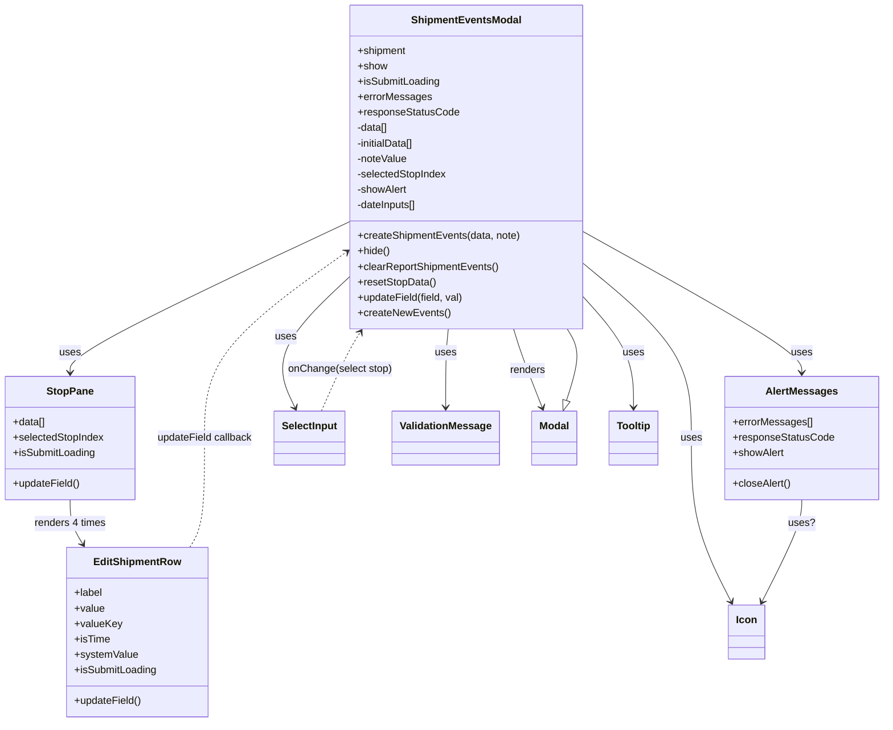

# Diagram: web/portal/src/modules/shipment-detail/ShipmentEventsModal.js


> Auto-generated by Obscura crawlers

## Diagram 1



### SVG

<svg id="container" width="1360.4375" xmlns="http://www.w3.org/2000/svg" class="classDiagram" height="1124" viewBox="0 0 1360.4375 1124" role="graphics-document document" aria-roledescription="class"><style>#container{font-family:"trebuchet ms",verdana,arial,sans-serif;font-size:16px;fill:#333;}@keyframes edge-animation-frame{from{stroke-dashoffset:0;}}@keyframes dash{to{stroke-dashoffset:0;}}#container .edge-animation-slow{stroke-dasharray:9,5!important;stroke-dashoffset:900;animation:dash 50s linear infinite;stroke-linecap:round;}#container .edge-animation-fast{stroke-dasharray:9,5!important;stroke-dashoffset:900;animation:dash 20s linear infinite;stroke-linecap:round;}#container .error-icon{fill:#552222;}#container .error-text{fill:#552222;stroke:#552222;}#container .edge-thickness-normal{stroke-width:1px;}#container .edge-thickness-thick{stroke-width:3.5px;}#container .edge-pattern-solid{stroke-dasharray:0;}#container .edge-thickness-invisible{stroke-width:0;fill:none;}#container .edge-pattern-dashed{stroke-dasharray:3;}#container .edge-pattern-dotted{stroke-dasharray:2;}#container .marker{fill:#333333;stroke:#333333;}#container .marker.cross{stroke:#333333;}#container svg{font-family:"trebuchet ms",verdana,arial,sans-serif;font-size:16px;}#container p{margin:0;}#container g.classGroup text{fill:#9370DB;stroke:none;font-family:"trebuchet ms",verdana,arial,sans-serif;font-size:10px;}#container g.classGroup text .title{font-weight:bolder;}#container .nodeLabel,#container .edgeLabel{color:#131300;}#container .edgeLabel .label rect{fill:#ECECFF;}#container .label text{fill:#131300;}#container .labelBkg{background:#ECECFF;}#container .edgeLabel .label span{background:#ECECFF;}#container .classTitle{font-weight:bolder;}#container .node rect,#container .node circle,#container .node ellipse,#container .node polygon,#container .node path{fill:#ECECFF;stroke:#9370DB;stroke-width:1px;}#container .divider{stroke:#9370DB;stroke-width:1;}#container g.clickable{cursor:pointer;}#container g.classGroup rect{fill:#ECECFF;stroke:#9370DB;}#container g.classGroup line{stroke:#9370DB;stroke-width:1;}#container .classLabel .box{stroke:none;stroke-width:0;fill:#ECECFF;opacity:0.5;}#container .classLabel .label{fill:#9370DB;font-size:10px;}#container .relation{stroke:#333333;stroke-width:1;fill:none;}#container .dashed-line{stroke-dasharray:3;}#container .dotted-line{stroke-dasharray:1 2;}#container #compositionStart,#container .composition{fill:#333333!important;stroke:#333333!important;stroke-width:1;}#container #compositionEnd,#container .composition{fill:#333333!important;stroke:#333333!important;stroke-width:1;}#container #dependencyStart,#container .dependency{fill:#333333!important;stroke:#333333!important;stroke-width:1;}#container #dependencyStart,#container .dependency{fill:#333333!important;stroke:#333333!important;stroke-width:1;}#container #extensionStart,#container .extension{fill:transparent!important;stroke:#333333!important;stroke-width:1;}#container #extensionEnd,#container .extension{fill:transparent!important;stroke:#333333!important;stroke-width:1;}#container #aggregationStart,#container .aggregation{fill:transparent!important;stroke:#333333!important;stroke-width:1;}#container #aggregationEnd,#container .aggregation{fill:transparent!important;stroke:#333333!important;stroke-width:1;}#container #lollipopStart,#container .lollipop{fill:#ECECFF!important;stroke:#333333!important;stroke-width:1;}#container #lollipopEnd,#container .lollipop{fill:#ECECFF!important;stroke:#333333!important;stroke-width:1;}#container .edgeTerminals{font-size:11px;line-height:initial;}#container .classTitleText{text-anchor:middle;font-size:18px;fill:#333;}#container .label-icon{display:inline-block;height:1em;overflow:visible;vertical-align:-0.125em;}#container .node .label-icon path{fill:currentColor;stroke:revert;stroke-width:revert;}#container :root{--mermaid-font-family:"trebuchet ms",verdana,arial,sans-serif;}</style><g><defs><marker id="container_class-aggregationStart" class="marker aggregation class" refX="18" refY="7" markerWidth="190" markerHeight="240" orient="auto"><path d="M 18,7 L9,13 L1,7 L9,1 Z"></path></marker></defs><defs><marker id="container_class-aggregationEnd" class="marker aggregation class" refX="1" refY="7" markerWidth="20" markerHeight="28" orient="auto"><path d="M 18,7 L9,13 L1,7 L9,1 Z"></path></marker></defs><defs><marker id="container_class-extensionStart" class="marker extension class" refX="18" refY="7" markerWidth="190" markerHeight="240" orient="auto"><path d="M 1,7 L18,13 V 1 Z"></path></marker></defs><defs><marker id="container_class-extensionEnd" class="marker extension class" refX="1" refY="7" markerWidth="20" markerHeight="28" orient="auto"><path d="M 1,1 V 13 L18,7 Z"></path></marker></defs><defs><marker id="container_class-compositionStart" class="marker composition class" refX="18" refY="7" markerWidth="190" markerHeight="240" orient="auto"><path d="M 18,7 L9,13 L1,7 L9,1 Z"></path></marker></defs><defs><marker id="container_class-compositionEnd" class="marker composition class" refX="1" refY="7" markerWidth="20" markerHeight="28" orient="auto"><path d="M 18,7 L9,13 L1,7 L9,1 Z"></path></marker></defs><defs><marker id="container_class-dependencyStart" class="marker dependency class" refX="6" refY="7" markerWidth="190" markerHeight="240" orient="auto"><path d="M 5,7 L9,13 L1,7 L9,1 Z"></path></marker></defs><defs><marker id="container_class-dependencyEnd" class="marker dependency class" refX="13" refY="7" markerWidth="20" markerHeight="28" orient="auto"><path d="M 18,7 L9,13 L14,7 L9,1 Z"></path></marker></defs><defs><marker id="container_class-lollipopStart" class="marker lollipop class" refX="13" refY="7" markerWidth="190" markerHeight="240" orient="auto"><circle stroke="black" fill="transparent" cx="7" cy="7" r="6"></circle></marker></defs><defs><marker id="container_class-lollipopEnd" class="marker lollipop class" refX="1" refY="7" markerWidth="190" markerHeight="240" orient="auto"><circle stroke="black" fill="transparent" cx="7" cy="7" r="6"></circle></marker></defs><g class="root"><g class="clusters"></g><g class="edgePaths"><path d="M795.688,512L797.445,518.167C799.202,524.333,802.716,536.667,809.847,557.064C816.978,577.462,827.726,605.925,833.1,620.156L838.474,634.387" id="id_ShipmentEventsModal_Modal_1" class="edge-thickness-normal edge-pattern-solid relation" style=";;;" data-edge="true" data-et="edge" data-id="id_ShipmentEventsModal_Modal_1" data-points="W3sieCI6Nzk1LjY4ODE4OTMzODIzNTIsInkiOjUxMn0seyJ4Ijo4MDYuMjMwNDY4NzUsInkiOjU0OX0seyJ4Ijo4NDAuNTkzMzM4ODE1Nzg5NSwieSI6NjQwfV0=" marker-end="url(#container_class-dependencyEnd)"></path><path d="M544.07,344.437L471.464,378.531C398.858,412.625,253.646,480.812,181.04,520.073C108.434,559.333,108.434,569.667,108.434,574.833L108.434,580" id="id_ShipmentEventsModal_StopPane_2" class="edge-thickness-normal edge-pattern-solid relation" style=";;;" data-edge="true" data-et="edge" data-id="id_ShipmentEventsModal_StopPane_2" data-points="W3sieCI6NTQ0LjA3MDMxMjUsInkiOjM0NC40MzY4Nzk1ODU2NzExNH0seyJ4IjoxMDguNDMzNTkzNzUsInkiOjU0OX0seyJ4IjoxMDguNDMzNTkzNzUsInkiOjU4Nn1d" marker-end="url(#container_class-dependencyEnd)"></path><path d="M544.07,430.359L523.199,450.133C502.328,469.906,460.586,509.453,446.546,543.491C432.505,577.529,446.167,606.059,452.997,620.324L459.828,634.588" id="id_ShipmentEventsModal_SelectInput_3" class="edge-thickness-normal edge-pattern-solid relation" style=";;;" data-edge="true" data-et="edge" data-id="id_ShipmentEventsModal_SelectInput_3" data-points="W3sieCI6NTQ0LjA3MDMxMjUsInkiOjQzMC4zNTk0MTQwMTY5ODAxN30seyJ4Ijo0MTguODQzNzUsInkiOjU0OX0seyJ4Ijo0NjIuNDE5NDA3ODk0NzM2OCwieSI6NjQwfV0=" marker-end="url(#container_class-dependencyEnd)"></path><path d="M695.878,512L695.193,518.167C694.507,524.333,693.136,536.667,692.451,557C691.766,577.333,691.766,605.667,691.766,619.833L691.766,634" id="id_ShipmentEventsModal_ValidationMessage_4" class="edge-thickness-normal edge-pattern-solid relation" style=";;;" data-edge="true" data-et="edge" data-id="id_ShipmentEventsModal_ValidationMessage_4" data-points="W3sieCI6Njk1Ljg3ODAxNDE2NTIyNSwieSI6NTEyfSx7IngiOjY5MS43NjU2MjUsInkiOjU0OX0seyJ4Ijo2OTEuNzY1NjI1LCJ5Ijo2NDB9XQ==" marker-end="url(#container_class-dependencyEnd)"></path><path d="M903.703,361.498L959.067,392.748C1014.431,423.999,1125.159,486.499,1180.523,522.916C1235.887,559.333,1235.887,569.667,1235.887,574.833L1235.887,580" id="id_ShipmentEventsModal_AlertMessages_5" class="edge-thickness-normal edge-pattern-solid relation" style=";;;" data-edge="true" data-et="edge" data-id="id_ShipmentEventsModal_AlertMessages_5" data-points="W3sieCI6OTAzLjcwMzEyNSwieSI6MzYxLjQ5NzkzMjQzNDA4MjAzfSx7IngiOjEyMzUuODg2NzE4NzUsInkiOjU0OX0seyJ4IjoxMjM1Ljg4NjcxODc1LCJ5Ijo1ODZ9XQ==" marker-end="url(#container_class-dependencyEnd)"></path><path d="M903.703,464.001L916.19,478.168C928.677,492.334,953.651,520.667,966.138,549C978.625,577.333,978.625,605.667,978.625,619.833L978.625,634" id="id_ShipmentEventsModal_Tooltip_6" class="edge-thickness-normal edge-pattern-solid relation" style=";;;" data-edge="true" data-et="edge" data-id="id_ShipmentEventsModal_Tooltip_6" data-points="W3sieCI6OTAzLjcwMzEyNSwieSI6NDY0LjAwMTMwMzQyMTA5N30seyJ4Ijo5NzguNjI1LCJ5Ijo1NDl9LHsieCI6OTc4LjYyNSwieSI6NjQwfV0=" marker-end="url(#container_class-dependencyEnd)"></path><path d="M903.703,411.086L931.06,434.071C958.417,457.057,1013.13,503.029,1040.487,548.181C1067.844,593.333,1067.844,637.667,1067.844,682C1067.844,726.333,1067.844,770.667,1077.922,813.105C1088,855.542,1108.157,896.085,1118.235,916.356L1128.313,936.627" id="id_ShipmentEventsModal_Icon_7" class="edge-thickness-normal edge-pattern-solid relation" style=";;;" data-edge="true" data-et="edge" data-id="id_ShipmentEventsModal_Icon_7" data-points="W3sieCI6OTAzLjcwMzEyNSwieSI6NDExLjA4NTU2MjEwNDY0MTU1fSx7IngiOjEwNjcuODQzNzUsInkiOjU0OX0seyJ4IjoxMDY3Ljg0Mzc1LCJ5Ijo2ODJ9LHsieCI6MTA2Ny44NDM3NSwieSI6ODE1fSx7IngiOjExMzAuOTg0MTU1NDE3ODk5NSwieSI6OTQyfV0=" marker-end="url(#container_class-dependencyEnd)"></path><path d="M108.434,778L108.434,784.167C108.434,790.333,108.434,802.667,111.741,814.151C115.048,825.635,121.663,836.27,124.971,841.588L128.278,846.905" id="id_StopPane_EditShipmentRow_8" class="edge-thickness-normal edge-pattern-solid relation" style=";;;" data-edge="true" data-et="edge" data-id="id_StopPane_EditShipmentRow_8" data-points="W3sieCI6MTA4LjQzMzU5Mzc1LCJ5Ijo3Nzh9LHsieCI6MTA4LjQzMzU5Mzc1LCJ5Ijo4MTV9LHsieCI6MTMxLjQ0Njk4ODI1ODEzNjEsInkiOjg1Mn1d" marker-end="url(#container_class-dependencyEnd)"></path><path d="M1235.887,778L1235.887,784.167C1235.887,790.333,1235.887,802.667,1225.809,829.105C1215.73,855.542,1195.574,896.085,1185.496,916.356L1175.417,936.627" id="id_AlertMessages_Icon_9" class="edge-thickness-normal edge-pattern-solid relation" style=";;;" data-edge="true" data-et="edge" data-id="id_AlertMessages_Icon_9" data-points="W3sieCI6MTIzNS44ODY3MTg3NSwieSI6Nzc4fSx7IngiOjEyMzUuODg2NzE4NzUsInkiOjgxNX0seyJ4IjoxMTcyLjc0NjMxMzMzMjEwMDUsInkiOjk0Mn1d" marker-end="url(#container_class-dependencyEnd)"></path><path d="M875.27,623.581L879.274,611.151C883.278,598.72,891.285,573.86,891.546,555.263C891.807,536.667,884.322,524.333,880.579,518.167L876.836,512" id="id_Modal_ShipmentEventsModal_10" class="edge-thickness-normal edge-pattern-solid relation" style=";;;" data-edge="true" data-et="edge" data-id="id_Modal_ShipmentEventsModal_10" data-points="W3sieCI6ODY5Ljk4MTQ5NjcxMDUyNjQsInkiOjY0MH0seyJ4Ijo4OTkuMjkyOTY4NzUsInkiOjU0OX0seyJ4Ijo4NzYuODM2MTEzMjEzNjY3OSwieSI6NTEyfV0=" marker-start="url(#container_class-extensionStart)"></path><path d="M295.651,852L299.486,845.833C303.322,839.667,310.993,827.333,314.828,799C318.664,770.667,318.664,726.333,318.664,682C318.664,637.667,318.664,593.333,355.418,544.954C392.171,496.576,465.678,444.151,502.432,417.939L539.185,391.727" id="id_EditShipmentRow_ShipmentEventsModal_11" class="edge-thickness-normal edge-pattern-dashed relation" style=";;;" data-edge="true" data-et="edge" data-id="id_EditShipmentRow_ShipmentEventsModal_11" data-points="W3sieCI6Mjk1LjY1MDY2Nzk5MTg2MzksInkiOjg1Mn0seyJ4IjozMTguNjY0MDYyNSwieSI6ODE1fSx7IngiOjMxOC42NjQwNjI1LCJ5Ijo2ODJ9LHsieCI6MzE4LjY2NDA2MjUsInkiOjU0OX0seyJ4Ijo1NDQuMDcwMzEyNSwieSI6Mzg4LjI0MjkzMTY0NDQ0N31d" marker-end="url(#container_class-dependencyEnd)"></path><path d="M501.017,640L507.693,624.833C514.368,609.667,527.719,579.333,537.761,558.845C547.803,538.357,554.536,527.714,557.902,522.392L561.268,517.071" id="id_SelectInput_ShipmentEventsModal_12" class="edge-thickness-normal edge-pattern-dashed relation" style=";;;" data-edge="true" data-et="edge" data-id="id_SelectInput_ShipmentEventsModal_12" data-points="W3sieCI6NTAxLjAxNzI2OTczNjg0MjEsInkiOjY0MH0seyJ4Ijo1NDEuMDcwMzEyNSwieSI6NTQ5fSx7IngiOjU2NC40NzU4NzMxNjE3NjQ2LCJ5Ijo1MTJ9XQ==" marker-end="url(#container_class-dependencyEnd)"></path></g><g class="edgeLabels"><g class="edgeLabel" transform="translate(816.61637, 576.50401)"><g class="label" data-id="id_ShipmentEventsModal_Modal_1" transform="translate(-27.75, -12)"><foreignObject width="55.5" height="24"><div xmlns="http://www.w3.org/1999/xhtml" class="labelBkg" style="display: table-cell; white-space: nowrap; line-height: 1.5; max-width: 200px; text-align: center;"><span class="edgeLabel"><p>renders</p></span></div></foreignObject></g></g><g class="edgeLabel" transform="translate(108.43359375, 549)"><g class="label" data-id="id_ShipmentEventsModal_StopPane_2" transform="translate(-16.4921875, -12)"><foreignObject width="32.984375" height="24"><div xmlns="http://www.w3.org/1999/xhtml" class="labelBkg" style="display: table-cell; white-space: nowrap; line-height: 1.5; max-width: 200px; text-align: center;"><span class="edgeLabel"><p>uses</p></span></div></foreignObject></g></g><g class="edgeLabel" transform="translate(444.83518, 524.37552)"><g class="label" data-id="id_ShipmentEventsModal_SelectInput_3" transform="translate(-16.4921875, -12)"><foreignObject width="32.984375" height="24"><div xmlns="http://www.w3.org/1999/xhtml" class="labelBkg" style="display: table-cell; white-space: nowrap; line-height: 1.5; max-width: 200px; text-align: center;"><span class="edgeLabel"><p>uses</p></span></div></foreignObject></g></g><g class="edgeLabel" transform="translate(691.765625, 549)"><g class="label" data-id="id_ShipmentEventsModal_ValidationMessage_4" transform="translate(-16.4921875, -12)"><foreignObject width="32.984375" height="24"><div xmlns="http://www.w3.org/1999/xhtml" class="labelBkg" style="display: table-cell; white-space: nowrap; line-height: 1.5; max-width: 200px; text-align: center;"><span class="edgeLabel"><p>uses</p></span></div></foreignObject></g></g><g class="edgeLabel" transform="translate(1235.88671875, 549)"><g class="label" data-id="id_ShipmentEventsModal_AlertMessages_5" transform="translate(-16.4921875, -12)"><foreignObject width="32.984375" height="24"><div xmlns="http://www.w3.org/1999/xhtml" class="labelBkg" style="display: table-cell; white-space: nowrap; line-height: 1.5; max-width: 200px; text-align: center;"><span class="edgeLabel"><p>uses</p></span></div></foreignObject></g></g><g class="edgeLabel" transform="translate(978.625, 549)"><g class="label" data-id="id_ShipmentEventsModal_Tooltip_6" transform="translate(-16.4921875, -12)"><foreignObject width="32.984375" height="24"><div xmlns="http://www.w3.org/1999/xhtml" class="labelBkg" style="display: table-cell; white-space: nowrap; line-height: 1.5; max-width: 200px; text-align: center;"><span class="edgeLabel"><p>uses</p></span></div></foreignObject></g></g><g class="edgeLabel" transform="translate(1067.84375, 682)"><g class="label" data-id="id_ShipmentEventsModal_Icon_7" transform="translate(-16.4921875, -12)"><foreignObject width="32.984375" height="24"><div xmlns="http://www.w3.org/1999/xhtml" class="labelBkg" style="display: table-cell; white-space: nowrap; line-height: 1.5; max-width: 200px; text-align: center;"><span class="edgeLabel"><p>uses</p></span></div></foreignObject></g></g><g class="edgeLabel" transform="translate(108.43359375, 815)"><g class="label" data-id="id_StopPane_EditShipmentRow_8" transform="translate(-56.34375, -12)"><foreignObject width="112.6875" height="24"><div xmlns="http://www.w3.org/1999/xhtml" class="labelBkg" style="display: table-cell; white-space: nowrap; line-height: 1.5; max-width: 200px; text-align: center;"><span class="edgeLabel"><p>renders 4 times</p></span></div></foreignObject></g></g><g class="edgeLabel" transform="translate(1235.88671875, 815)"><g class="label" data-id="id_AlertMessages_Icon_9" transform="translate(-19.921875, -12)"><foreignObject width="39.84375" height="24"><div xmlns="http://www.w3.org/1999/xhtml" class="labelBkg" style="display: table-cell; white-space: nowrap; line-height: 1.5; max-width: 200px; text-align: center;"><span class="edgeLabel"><p>uses?</p></span></div></foreignObject></g></g><g class="edgeLabel"><g class="label" data-id="id_Modal_ShipmentEventsModal_10" transform="translate(0, 0)"><foreignObject width="0" height="0"><div xmlns="http://www.w3.org/1999/xhtml" class="labelBkg" style="display: table-cell; white-space: nowrap; line-height: 1.5; max-width: 200px; text-align: center;"><span class="edgeLabel"></span></div></foreignObject></g></g><g class="edgeLabel" transform="translate(318.6640625, 682)"><g class="label" data-id="id_EditShipmentRow_ShipmentEventsModal_11" transform="translate(-74.796875, -12)"><foreignObject width="149.59375" height="24"><div xmlns="http://www.w3.org/1999/xhtml" class="labelBkg" style="display: table-cell; white-space: nowrap; line-height: 1.5; max-width: 200px; text-align: center;"><span class="edgeLabel"><p>updateField callback</p></span></div></foreignObject></g></g><g class="edgeLabel" transform="translate(529.86245, 574.46412)"><g class="label" data-id="id_SelectInput_ShipmentEventsModal_12" transform="translate(-80.5859375, -12)"><foreignObject width="161.171875" height="24"><div xmlns="http://www.w3.org/1999/xhtml" class="labelBkg" style="display: table-cell; white-space: nowrap; line-height: 1.5; max-width: 200px; text-align: center;"><span class="edgeLabel"><p>onChange(select stop)</p></span></div></foreignObject></g></g></g><g class="nodes"><g class="node default" id="classId-ShipmentEventsModal-0" transform="translate(723.88671875, 260)"><g class="basic label-container"><path d="M-179.81640625 -252 L179.81640625 -252 L179.81640625 252 L-179.81640625 252" stroke="none" stroke-width="0" fill="#ECECFF" style=""></path><path d="M-179.81640625 -252 C-63.65611423572528 -252, 52.50417777854943 -252, 179.81640625 -252 M-179.81640625 -252 C-90.76963851186322 -252, -1.7228707737264415 -252, 179.81640625 -252 M179.81640625 -252 C179.81640625 -103.54466673013368, 179.81640625 44.91066653973263, 179.81640625 252 M179.81640625 -252 C179.81640625 -133.84183473933558, 179.81640625 -15.683669478671135, 179.81640625 252 M179.81640625 252 C39.15469203359763 252, -101.50702218280475 252, -179.81640625 252 M179.81640625 252 C37.986503089365925 252, -103.84340007126815 252, -179.81640625 252 M-179.81640625 252 C-179.81640625 53.32918851517181, -179.81640625 -145.34162296965638, -179.81640625 -252 M-179.81640625 252 C-179.81640625 106.04274883483387, -179.81640625 -39.914502330332255, -179.81640625 -252" stroke="#9370DB" stroke-width="1.3" fill="none" stroke-dasharray="0 0" style=""></path></g><g class="annotation-group text" transform="translate(0, -228)"></g><g class="label-group text" transform="translate(-81.6171875, -228)"><g class="label" style="font-weight: bolder" transform="translate(0,-12)"><foreignObject width="163.234375" height="24"><div xmlns="http://www.w3.org/1999/xhtml" style="display: table-cell; white-space: nowrap; line-height: 1.5; max-width: 212px; text-align: center;"><span class="nodeLabel markdown-node-label" style=""><p>ShipmentEventsModal</p></span></div></foreignObject></g></g><g class="members-group text" transform="translate(-167.81640625, -180)"><g class="label" style="" transform="translate(0,-12)"><foreignObject width="76.4375" height="24"><div xmlns="http://www.w3.org/1999/xhtml" style="display: table-cell; white-space: nowrap; line-height: 1.5; max-width: 134px; text-align: center;"><span class="nodeLabel markdown-node-label" style=""><p>+shipment</p></span></div></foreignObject></g><g class="label" style="" transform="translate(0,12)"><foreignObject width="45.65625" height="24"><div xmlns="http://www.w3.org/1999/xhtml" style="display: table-cell; white-space: nowrap; line-height: 1.5; max-width: 104px; text-align: center;"><span class="nodeLabel markdown-node-label" style=""><p>+show</p></span></div></foreignObject></g><g class="label" style="" transform="translate(0,36)"><foreignObject width="128.75" height="24"><div xmlns="http://www.w3.org/1999/xhtml" style="display: table-cell; white-space: nowrap; line-height: 1.5; max-width: 187px; text-align: center;"><span class="nodeLabel markdown-node-label" style=""><p>+isSubmitLoading</p></span></div></foreignObject></g><g class="label" style="" transform="translate(0,60)"><foreignObject width="112.703125" height="24"><div xmlns="http://www.w3.org/1999/xhtml" style="display: table-cell; white-space: nowrap; line-height: 1.5; max-width: 170px; text-align: center;"><span class="nodeLabel markdown-node-label" style=""><p>+errorMessages</p></span></div></foreignObject></g><g class="label" style="" transform="translate(0,84)"><foreignObject width="156.21875" height="24"><div xmlns="http://www.w3.org/1999/xhtml" style="display: table-cell; white-space: nowrap; line-height: 1.5; max-width: 214px; text-align: center;"><span class="nodeLabel markdown-node-label" style=""><p>+responseStatusCode</p></span></div></foreignObject></g><g class="label" style="" transform="translate(0,108)"><foreignObject width="49.40625" height="24"><div xmlns="http://www.w3.org/1999/xhtml" style="display: table-cell; white-space: nowrap; line-height: 1.5; max-width: 107px; text-align: center;"><span class="nodeLabel markdown-node-label" style=""><p>-data[]</p></span></div></foreignObject></g><g class="label" style="" transform="translate(0,132)"><foreignObject width="91.890625" height="24"><div xmlns="http://www.w3.org/1999/xhtml" style="display: table-cell; white-space: nowrap; line-height: 1.5; max-width: 149px; text-align: center;"><span class="nodeLabel markdown-node-label" style=""><p>-initialData[]</p></span></div></foreignObject></g><g class="label" style="" transform="translate(0,156)"><foreignObject width="78.953125" height="24"><div xmlns="http://www.w3.org/1999/xhtml" style="display: table-cell; white-space: nowrap; line-height: 1.5; max-width: 136px; text-align: center;"><span class="nodeLabel markdown-node-label" style=""><p>-noteValue</p></span></div></foreignObject></g><g class="label" style="" transform="translate(0,180)"><foreignObject width="140.546875" height="24"><div xmlns="http://www.w3.org/1999/xhtml" style="display: table-cell; white-space: nowrap; line-height: 1.5; max-width: 198px; text-align: center;"><span class="nodeLabel markdown-node-label" style=""><p>-selectedStopIndex</p></span></div></foreignObject></g><g class="label" style="" transform="translate(0,204)"><foreignObject width="78.5625" height="24"><div xmlns="http://www.w3.org/1999/xhtml" style="display: table-cell; white-space: nowrap; line-height: 1.5; max-width: 136px; text-align: center;"><span class="nodeLabel markdown-node-label" style=""><p>-showAlert</p></span></div></foreignObject></g><g class="label" style="" transform="translate(0,228)"><foreignObject width="95.453125" height="24"><div xmlns="http://www.w3.org/1999/xhtml" style="display: table-cell; white-space: nowrap; line-height: 1.5; max-width: 153px; text-align: center;"><span class="nodeLabel markdown-node-label" style=""><p>-dateInputs[]</p></span></div></foreignObject></g></g><g class="methods-group text" transform="translate(-167.81640625, 108)"><g class="label" style="" transform="translate(0,-12)"><foreignObject width="254.015625" height="24"><div xmlns="http://www.w3.org/1999/xhtml" style="display: table-cell; white-space: nowrap; line-height: 1.5; max-width: 311px; text-align: center;"><span class="nodeLabel markdown-node-label" style=""><p>+createShipmentEvents(data, note)</p></span></div></foreignObject></g><g class="label" style="" transform="translate(0,12)"><foreignObject width="50.53125" height="24"><div xmlns="http://www.w3.org/1999/xhtml" style="display: table-cell; white-space: nowrap; line-height: 1.5; max-width: 108px; text-align: center;"><span class="nodeLabel markdown-node-label" style=""><p>+hide()</p></span></div></foreignObject></g><g class="label" style="" transform="translate(0,36)"><foreignObject width="220.109375" height="24"><div xmlns="http://www.w3.org/1999/xhtml" style="display: table-cell; white-space: nowrap; line-height: 1.5; max-width: 277px; text-align: center;"><span class="nodeLabel markdown-node-label" style=""><p>+clearReportShipmentEvents()</p></span></div></foreignObject></g><g class="label" style="" transform="translate(0,60)"><foreignObject width="121.0625" height="24"><div xmlns="http://www.w3.org/1999/xhtml" style="display: table-cell; white-space: nowrap; line-height: 1.5; max-width: 178px; text-align: center;"><span class="nodeLabel markdown-node-label" style=""><p>+resetStopData()</p></span></div></foreignObject></g><g class="label" style="" transform="translate(0,84)"><foreignObject width="165.4375" height="24"><div xmlns="http://www.w3.org/1999/xhtml" style="display: table-cell; white-space: nowrap; line-height: 1.5; max-width: 223px; text-align: center;"><span class="nodeLabel markdown-node-label" style=""><p>+updateField(field, val)</p></span></div></foreignObject></g><g class="label" style="" transform="translate(0,108)"><foreignObject width="141.734375" height="24"><div xmlns="http://www.w3.org/1999/xhtml" style="display: table-cell; white-space: nowrap; line-height: 1.5; max-width: 199px; text-align: center;"><span class="nodeLabel markdown-node-label" style=""><p>+createNewEvents()</p></span></div></foreignObject></g></g><g class="divider" style=""><path d="M-179.81640625 -204 C-46.21451023933028 -204, 87.38738577133944 -204, 179.81640625 -204 M-179.81640625 -204 C-53.660852184415035 -204, 72.49470188116993 -204, 179.81640625 -204" stroke="#9370DB" stroke-width="1.3" fill="none" stroke-dasharray="0 0" style=""></path></g><g class="divider" style=""><path d="M-179.81640625 84 C-59.30426543166885 84, 61.207875386662295 84, 179.81640625 84 M-179.81640625 84 C-81.54509848293017 84, 16.726209284139657 84, 179.81640625 84" stroke="#9370DB" stroke-width="1.3" fill="none" stroke-dasharray="0 0" style=""></path></g></g><g class="node default" id="classId-StopPane-1" transform="translate(108.43359375, 682)"><g class="basic label-container"><path d="M-100.43359375 -96 L100.43359375 -96 L100.43359375 96 L-100.43359375 96" stroke="none" stroke-width="0" fill="#ECECFF" style=""></path><path d="M-100.43359375 -96 C-47.051825385910256 -96, 6.3299429781794885 -96, 100.43359375 -96 M-100.43359375 -96 C-55.61782749352718 -96, -10.80206123705436 -96, 100.43359375 -96 M100.43359375 -96 C100.43359375 -47.56131192171315, 100.43359375 0.8773761565737033, 100.43359375 96 M100.43359375 -96 C100.43359375 -49.90100436727617, 100.43359375 -3.802008734552345, 100.43359375 96 M100.43359375 96 C33.45126694933016 96, -33.53105985133968 96, -100.43359375 96 M100.43359375 96 C51.176152257391465 96, 1.9187107647829293 96, -100.43359375 96 M-100.43359375 96 C-100.43359375 53.34930503756512, -100.43359375 10.698610075130233, -100.43359375 -96 M-100.43359375 96 C-100.43359375 38.70669923002904, -100.43359375 -18.586601539941924, -100.43359375 -96" stroke="#9370DB" stroke-width="1.3" fill="none" stroke-dasharray="0 0" style=""></path></g><g class="annotation-group text" transform="translate(0, -72)"></g><g class="label-group text" transform="translate(-34.7734375, -72)"><g class="label" style="font-weight: bolder" transform="translate(0,-12)"><foreignObject width="69.546875" height="24"><div xmlns="http://www.w3.org/1999/xhtml" style="display: table-cell; white-space: nowrap; line-height: 1.5; max-width: 118px; text-align: center;"><span class="nodeLabel markdown-node-label" style=""><p>StopPane</p></span></div></foreignObject></g></g><g class="members-group text" transform="translate(-88.43359375, -24)"><g class="label" style="" transform="translate(0,-12)"><foreignObject width="50.9375" height="24"><div xmlns="http://www.w3.org/1999/xhtml" style="display: table-cell; white-space: nowrap; line-height: 1.5; max-width: 108px; text-align: center;"><span class="nodeLabel markdown-node-label" style=""><p>+data[]</p></span></div></foreignObject></g><g class="label" style="" transform="translate(0,12)"><foreignObject width="142.09375" height="24"><div xmlns="http://www.w3.org/1999/xhtml" style="display: table-cell; white-space: nowrap; line-height: 1.5; max-width: 200px; text-align: center;"><span class="nodeLabel markdown-node-label" style=""><p>+selectedStopIndex</p></span></div></foreignObject></g><g class="label" style="" transform="translate(0,36)"><foreignObject width="128.75" height="24"><div xmlns="http://www.w3.org/1999/xhtml" style="display: table-cell; white-space: nowrap; line-height: 1.5; max-width: 187px; text-align: center;"><span class="nodeLabel markdown-node-label" style=""><p>+isSubmitLoading</p></span></div></foreignObject></g></g><g class="methods-group text" transform="translate(-88.43359375, 72)"><g class="label" style="" transform="translate(0,-12)"><foreignObject width="104.40625" height="24"><div xmlns="http://www.w3.org/1999/xhtml" style="display: table-cell; white-space: nowrap; line-height: 1.5; max-width: 162px; text-align: center;"><span class="nodeLabel markdown-node-label" style=""><p>+updateField()</p></span></div></foreignObject></g></g><g class="divider" style=""><path d="M-100.43359375 -48 C-30.348631037962818 -48, 39.736331674074364 -48, 100.43359375 -48 M-100.43359375 -48 C-35.293130785957246 -48, 29.84733217808551 -48, 100.43359375 -48" stroke="#9370DB" stroke-width="1.3" fill="none" stroke-dasharray="0 0" style=""></path></g><g class="divider" style=""><path d="M-100.43359375 48 C-50.34332812051554 48, -0.2530624910310735 48, 100.43359375 48 M-100.43359375 48 C-20.85884347226373 48, 58.71590680547254 48, 100.43359375 48" stroke="#9370DB" stroke-width="1.3" fill="none" stroke-dasharray="0 0" style=""></path></g></g><g class="node default" id="classId-EditShipmentRow-2" transform="translate(213.548828125, 984)"><g class="basic label-container"><path d="M-108.765625 -132 L108.765625 -132 L108.765625 132 L-108.765625 132" stroke="none" stroke-width="0" fill="#ECECFF" style=""></path><path d="M-108.765625 -132 C-34.927716874059655 -132, 38.91019125188069 -132, 108.765625 -132 M-108.765625 -132 C-34.281658450175186 -132, 40.20230809964963 -132, 108.765625 -132 M108.765625 -132 C108.765625 -57.611820361952766, 108.765625 16.776359276094468, 108.765625 132 M108.765625 -132 C108.765625 -57.69693173868178, 108.765625 16.606136522636433, 108.765625 132 M108.765625 132 C54.39269351541573 132, 0.019762030831458333 132, -108.765625 132 M108.765625 132 C58.61777199833548 132, 8.469918996670955 132, -108.765625 132 M-108.765625 132 C-108.765625 36.54160849606956, -108.765625 -58.916783007860886, -108.765625 -132 M-108.765625 132 C-108.765625 66.84997976366469, -108.765625 1.6999595273293835, -108.765625 -132" stroke="#9370DB" stroke-width="1.3" fill="none" stroke-dasharray="0 0" style=""></path></g><g class="annotation-group text" transform="translate(0, -108)"></g><g class="label-group text" transform="translate(-64.78125, -108)"><g class="label" style="font-weight: bolder" transform="translate(0,-12)"><foreignObject width="129.5625" height="24"><div xmlns="http://www.w3.org/1999/xhtml" style="display: table-cell; white-space: nowrap; line-height: 1.5; max-width: 179px; text-align: center;"><span class="nodeLabel markdown-node-label" style=""><p>EditShipmentRow</p></span></div></foreignObject></g></g><g class="members-group text" transform="translate(-96.765625, -60)"><g class="label" style="" transform="translate(0,-12)"><foreignObject width="44.21875" height="24"><div xmlns="http://www.w3.org/1999/xhtml" style="display: table-cell; white-space: nowrap; line-height: 1.5; max-width: 102px; text-align: center;"><span class="nodeLabel markdown-node-label" style=""><p>+label</p></span></div></foreignObject></g><g class="label" style="" transform="translate(0,12)"><foreignObject width="46.71875" height="24"><div xmlns="http://www.w3.org/1999/xhtml" style="display: table-cell; white-space: nowrap; line-height: 1.5; max-width: 104px; text-align: center;"><span class="nodeLabel markdown-node-label" style=""><p>+value</p></span></div></foreignObject></g><g class="label" style="" transform="translate(0,36)"><foreignObject width="72.4375" height="24"><div xmlns="http://www.w3.org/1999/xhtml" style="display: table-cell; white-space: nowrap; line-height: 1.5; max-width: 130px; text-align: center;"><span class="nodeLabel markdown-node-label" style=""><p>+valueKey</p></span></div></foreignObject></g><g class="label" style="" transform="translate(0,60)"><foreignObject width="55.1875" height="24"><div xmlns="http://www.w3.org/1999/xhtml" style="display: table-cell; white-space: nowrap; line-height: 1.5; max-width: 113px; text-align: center;"><span class="nodeLabel markdown-node-label" style=""><p>+isTime</p></span></div></foreignObject></g><g class="label" style="" transform="translate(0,84)"><foreignObject width="97.90625" height="24"><div xmlns="http://www.w3.org/1999/xhtml" style="display: table-cell; white-space: nowrap; line-height: 1.5; max-width: 155px; text-align: center;"><span class="nodeLabel markdown-node-label" style=""><p>+systemValue</p></span></div></foreignObject></g><g class="label" style="" transform="translate(0,108)"><foreignObject width="128.75" height="24"><div xmlns="http://www.w3.org/1999/xhtml" style="display: table-cell; white-space: nowrap; line-height: 1.5; max-width: 187px; text-align: center;"><span class="nodeLabel markdown-node-label" style=""><p>+isSubmitLoading</p></span></div></foreignObject></g></g><g class="methods-group text" transform="translate(-96.765625, 108)"><g class="label" style="" transform="translate(0,-12)"><foreignObject width="104.40625" height="24"><div xmlns="http://www.w3.org/1999/xhtml" style="display: table-cell; white-space: nowrap; line-height: 1.5; max-width: 162px; text-align: center;"><span class="nodeLabel markdown-node-label" style=""><p>+updateField()</p></span></div></foreignObject></g></g><g class="divider" style=""><path d="M-108.765625 -84 C-43.80699913018215 -84, 21.151626739635702 -84, 108.765625 -84 M-108.765625 -84 C-49.941809212220704 -84, 8.882006575558592 -84, 108.765625 -84" stroke="#9370DB" stroke-width="1.3" fill="none" stroke-dasharray="0 0" style=""></path></g><g class="divider" style=""><path d="M-108.765625 84 C-24.056909491426367 84, 60.651806017147265 84, 108.765625 84 M-108.765625 84 C-41.02144741874153 84, 26.72273016251694 84, 108.765625 84" stroke="#9370DB" stroke-width="1.3" fill="none" stroke-dasharray="0 0" style=""></path></g></g><g class="node default" id="classId-AlertMessages-3" transform="translate(1235.88671875, 682)"><g class="basic label-container"><path d="M-116.55078125 -96 L116.55078125 -96 L116.55078125 96 L-116.55078125 96" stroke="none" stroke-width="0" fill="#ECECFF" style=""></path><path d="M-116.55078125 -96 C-68.04731279528886 -96, -19.54384434057772 -96, 116.55078125 -96 M-116.55078125 -96 C-45.5152886039199 -96, 25.520204042160202 -96, 116.55078125 -96 M116.55078125 -96 C116.55078125 -49.61509318426701, 116.55078125 -3.230186368534021, 116.55078125 96 M116.55078125 -96 C116.55078125 -46.37797422618115, 116.55078125 3.244051547637696, 116.55078125 96 M116.55078125 96 C32.6194549664214 96, -51.3118713171572 96, -116.55078125 96 M116.55078125 96 C63.033851084527356 96, 9.516920919054712 96, -116.55078125 96 M-116.55078125 96 C-116.55078125 35.819025471950354, -116.55078125 -24.36194905609929, -116.55078125 -96 M-116.55078125 96 C-116.55078125 39.58486905123617, -116.55078125 -16.830261897527663, -116.55078125 -96" stroke="#9370DB" stroke-width="1.3" fill="none" stroke-dasharray="0 0" style=""></path></g><g class="annotation-group text" transform="translate(0, -72)"></g><g class="label-group text" transform="translate(-52.8828125, -72)"><g class="label" style="font-weight: bolder" transform="translate(0,-12)"><foreignObject width="105.765625" height="24"><div xmlns="http://www.w3.org/1999/xhtml" style="display: table-cell; white-space: nowrap; line-height: 1.5; max-width: 153px; text-align: center;"><span class="nodeLabel markdown-node-label" style=""><p>AlertMessages</p></span></div></foreignObject></g></g><g class="members-group text" transform="translate(-104.55078125, -24)"><g class="label" style="" transform="translate(0,-12)"><foreignObject width="123" height="24"><div xmlns="http://www.w3.org/1999/xhtml" style="display: table-cell; white-space: nowrap; line-height: 1.5; max-width: 180px; text-align: center;"><span class="nodeLabel markdown-node-label" style=""><p>+errorMessages[]</p></span></div></foreignObject></g><g class="label" style="" transform="translate(0,12)"><foreignObject width="156.21875" height="24"><div xmlns="http://www.w3.org/1999/xhtml" style="display: table-cell; white-space: nowrap; line-height: 1.5; max-width: 214px; text-align: center;"><span class="nodeLabel markdown-node-label" style=""><p>+responseStatusCode</p></span></div></foreignObject></g><g class="label" style="" transform="translate(0,36)"><foreignObject width="80.109375" height="24"><div xmlns="http://www.w3.org/1999/xhtml" style="display: table-cell; white-space: nowrap; line-height: 1.5; max-width: 138px; text-align: center;"><span class="nodeLabel markdown-node-label" style=""><p>+showAlert</p></span></div></foreignObject></g></g><g class="methods-group text" transform="translate(-104.55078125, 72)"><g class="label" style="" transform="translate(0,-12)"><foreignObject width="90.59375" height="24"><div xmlns="http://www.w3.org/1999/xhtml" style="display: table-cell; white-space: nowrap; line-height: 1.5; max-width: 148px; text-align: center;"><span class="nodeLabel markdown-node-label" style=""><p>+closeAlert()</p></span></div></foreignObject></g></g><g class="divider" style=""><path d="M-116.55078125 -48 C-26.163027820643123 -48, 64.22472560871375 -48, 116.55078125 -48 M-116.55078125 -48 C-47.75857362851157 -48, 21.03363399297686 -48, 116.55078125 -48" stroke="#9370DB" stroke-width="1.3" fill="none" stroke-dasharray="0 0" style=""></path></g><g class="divider" style=""><path d="M-116.55078125 48 C-38.472419861848124 48, 39.60594152630375 48, 116.55078125 48 M-116.55078125 48 C-55.127756855982206 48, 6.2952675380355885 48, 116.55078125 48" stroke="#9370DB" stroke-width="1.3" fill="none" stroke-dasharray="0 0" style=""></path></g></g><g class="node default" id="classId-SelectInput-4" transform="translate(482.53125, 682)"><g class="basic label-container"><path d="M-54.0703125 -42 L54.0703125 -42 L54.0703125 42 L-54.0703125 42" stroke="none" stroke-width="0" fill="#ECECFF" style=""></path><path d="M-54.0703125 -42 C-18.401026118320246 -42, 17.268260263359508 -42, 54.0703125 -42 M-54.0703125 -42 C-27.692254476899585 -42, -1.3141964537991697 -42, 54.0703125 -42 M54.0703125 -42 C54.0703125 -12.908348721092395, 54.0703125 16.18330255781521, 54.0703125 42 M54.0703125 -42 C54.0703125 -24.112335289915425, 54.0703125 -6.22467057983085, 54.0703125 42 M54.0703125 42 C26.609299403309002 42, -0.8517136933819955 42, -54.0703125 42 M54.0703125 42 C22.822628191999463 42, -8.425056116001073 42, -54.0703125 42 M-54.0703125 42 C-54.0703125 17.147352390605977, -54.0703125 -7.705295218788045, -54.0703125 -42 M-54.0703125 42 C-54.0703125 16.783788717133387, -54.0703125 -8.432422565733226, -54.0703125 -42" stroke="#9370DB" stroke-width="1.3" fill="none" stroke-dasharray="0 0" style=""></path></g><g class="annotation-group text" transform="translate(0, -18)"></g><g class="label-group text" transform="translate(-42.0703125, -18)"><g class="label" style="font-weight: bolder" transform="translate(0,-12)"><foreignObject width="84.140625" height="24"><div xmlns="http://www.w3.org/1999/xhtml" style="display: table-cell; white-space: nowrap; line-height: 1.5; max-width: 133px; text-align: center;"><span class="nodeLabel markdown-node-label" style=""><p>SelectInput</p></span></div></foreignObject></g></g><g class="members-group text" transform="translate(-42.0703125, 30)"></g><g class="methods-group text" transform="translate(-42.0703125, 60)"></g><g class="divider" style=""><path d="M-54.0703125 6 C-17.46106651300098 6, 19.14817947399804 6, 54.0703125 6 M-54.0703125 6 C-31.747394917195415 6, -9.42447733439083 6, 54.0703125 6" stroke="#9370DB" stroke-width="1.3" fill="none" stroke-dasharray="0 0" style=""></path></g><g class="divider" style=""><path d="M-54.0703125 24 C-31.271872577587352 24, -8.473432655174705 24, 54.0703125 24 M-54.0703125 24 C-22.732617296217228 24, 8.605077907565544 24, 54.0703125 24" stroke="#9370DB" stroke-width="1.3" fill="none" stroke-dasharray="0 0" style=""></path></g></g><g class="node default" id="classId-ValidationMessage-5" transform="translate(691.765625, 682)"><g class="basic label-container"><path d="M-80.2421875 -42 L80.2421875 -42 L80.2421875 42 L-80.2421875 42" stroke="none" stroke-width="0" fill="#ECECFF" style=""></path><path d="M-80.2421875 -42 C-21.43739299505613 -42, 37.36740150988774 -42, 80.2421875 -42 M-80.2421875 -42 C-19.972822988013903 -42, 40.296541523972195 -42, 80.2421875 -42 M80.2421875 -42 C80.2421875 -15.393234099809423, 80.2421875 11.213531800381155, 80.2421875 42 M80.2421875 -42 C80.2421875 -18.949892288846915, 80.2421875 4.100215422306171, 80.2421875 42 M80.2421875 42 C40.13705447733422 42, 0.03192145466843499 42, -80.2421875 42 M80.2421875 42 C26.357255475065017 42, -27.527676549869966 42, -80.2421875 42 M-80.2421875 42 C-80.2421875 25.018354691465046, -80.2421875 8.036709382930091, -80.2421875 -42 M-80.2421875 42 C-80.2421875 17.440387067939177, -80.2421875 -7.1192258641216455, -80.2421875 -42" stroke="#9370DB" stroke-width="1.3" fill="none" stroke-dasharray="0 0" style=""></path></g><g class="annotation-group text" transform="translate(0, -18)"></g><g class="label-group text" transform="translate(-68.2421875, -18)"><g class="label" style="font-weight: bolder" transform="translate(0,-12)"><foreignObject width="136.484375" height="24"><div xmlns="http://www.w3.org/1999/xhtml" style="display: table-cell; white-space: nowrap; line-height: 1.5; max-width: 184px; text-align: center;"><span class="nodeLabel markdown-node-label" style=""><p>ValidationMessage</p></span></div></foreignObject></g></g><g class="members-group text" transform="translate(-68.2421875, 30)"></g><g class="methods-group text" transform="translate(-68.2421875, 60)"></g><g class="divider" style=""><path d="M-80.2421875 6 C-45.198550881527666 6, -10.154914263055332 6, 80.2421875 6 M-80.2421875 6 C-31.025080916668742 6, 18.192025666662516 6, 80.2421875 6" stroke="#9370DB" stroke-width="1.3" fill="none" stroke-dasharray="0 0" style=""></path></g><g class="divider" style=""><path d="M-80.2421875 24 C-21.116637184913152 24, 38.008913130173696 24, 80.2421875 24 M-80.2421875 24 C-44.55308989091073 24, -8.863992281821453 24, 80.2421875 24" stroke="#9370DB" stroke-width="1.3" fill="none" stroke-dasharray="0 0" style=""></path></g></g><g class="node default" id="classId-Modal-6" transform="translate(856.453125, 682)"><g class="basic label-container"><path d="M-34.4453125 -42 L34.4453125 -42 L34.4453125 42 L-34.4453125 42" stroke="none" stroke-width="0" fill="#ECECFF" style=""></path><path d="M-34.4453125 -42 C-11.46416137464443 -42, 11.51698975071114 -42, 34.4453125 -42 M-34.4453125 -42 C-19.574253412890183 -42, -4.703194325780366 -42, 34.4453125 -42 M34.4453125 -42 C34.4453125 -23.924565480001586, 34.4453125 -5.849130960003173, 34.4453125 42 M34.4453125 -42 C34.4453125 -22.740961605254864, 34.4453125 -3.481923210509727, 34.4453125 42 M34.4453125 42 C14.38100129689941 42, -5.683309906201181 42, -34.4453125 42 M34.4453125 42 C15.490978142099657 42, -3.4633562158006868 42, -34.4453125 42 M-34.4453125 42 C-34.4453125 18.493074261563166, -34.4453125 -5.013851476873668, -34.4453125 -42 M-34.4453125 42 C-34.4453125 10.829170854895334, -34.4453125 -20.34165829020933, -34.4453125 -42" stroke="#9370DB" stroke-width="1.3" fill="none" stroke-dasharray="0 0" style=""></path></g><g class="annotation-group text" transform="translate(0, -18)"></g><g class="label-group text" transform="translate(-22.4453125, -18)"><g class="label" style="font-weight: bolder" transform="translate(0,-12)"><foreignObject width="44.890625" height="24"><div xmlns="http://www.w3.org/1999/xhtml" style="display: table-cell; white-space: nowrap; line-height: 1.5; max-width: 95px; text-align: center;"><span class="nodeLabel markdown-node-label" style=""><p>Modal</p></span></div></foreignObject></g></g><g class="members-group text" transform="translate(-22.4453125, 30)"></g><g class="methods-group text" transform="translate(-22.4453125, 60)"></g><g class="divider" style=""><path d="M-34.4453125 6 C-11.782475317594315 6, 10.88036186481137 6, 34.4453125 6 M-34.4453125 6 C-17.29273227840477 6, -0.14015205680954068 6, 34.4453125 6" stroke="#9370DB" stroke-width="1.3" fill="none" stroke-dasharray="0 0" style=""></path></g><g class="divider" style=""><path d="M-34.4453125 24 C-13.14035565136139 24, 8.164601197277221 24, 34.4453125 24 M-34.4453125 24 C-15.596113402899963 24, 3.253085694200074 24, 34.4453125 24" stroke="#9370DB" stroke-width="1.3" fill="none" stroke-dasharray="0 0" style=""></path></g></g><g class="node default" id="classId-Tooltip-7" transform="translate(978.625, 682)"><g class="basic label-container"><path d="M-37.7265625 -42 L37.7265625 -42 L37.7265625 42 L-37.7265625 42" stroke="none" stroke-width="0" fill="#ECECFF" style=""></path><path d="M-37.7265625 -42 C-12.890079981959808 -42, 11.946402536080384 -42, 37.7265625 -42 M-37.7265625 -42 C-18.37546228820942 -42, 0.9756379235811607 -42, 37.7265625 -42 M37.7265625 -42 C37.7265625 -10.331007906834397, 37.7265625 21.337984186331205, 37.7265625 42 M37.7265625 -42 C37.7265625 -15.652128783181748, 37.7265625 10.695742433636504, 37.7265625 42 M37.7265625 42 C18.786953865629652 42, -0.15265476874069606 42, -37.7265625 42 M37.7265625 42 C16.986965939814162 42, -3.7526306203716757 42, -37.7265625 42 M-37.7265625 42 C-37.7265625 23.73971734490165, -37.7265625 5.479434689803298, -37.7265625 -42 M-37.7265625 42 C-37.7265625 9.603680629143717, -37.7265625 -22.792638741712565, -37.7265625 -42" stroke="#9370DB" stroke-width="1.3" fill="none" stroke-dasharray="0 0" style=""></path></g><g class="annotation-group text" transform="translate(0, -18)"></g><g class="label-group text" transform="translate(-25.7265625, -18)"><g class="label" style="font-weight: bolder" transform="translate(0,-12)"><foreignObject width="51.453125" height="24"><div xmlns="http://www.w3.org/1999/xhtml" style="display: table-cell; white-space: nowrap; line-height: 1.5; max-width: 101px; text-align: center;"><span class="nodeLabel markdown-node-label" style=""><p>Tooltip</p></span></div></foreignObject></g></g><g class="members-group text" transform="translate(-25.7265625, 30)"></g><g class="methods-group text" transform="translate(-25.7265625, 60)"></g><g class="divider" style=""><path d="M-37.7265625 6 C-11.559153707426358 6, 14.608255085147285 6, 37.7265625 6 M-37.7265625 6 C-17.435268989795926 6, 2.8560245204081482 6, 37.7265625 6" stroke="#9370DB" stroke-width="1.3" fill="none" stroke-dasharray="0 0" style=""></path></g><g class="divider" style=""><path d="M-37.7265625 24 C-7.647928993319102 24, 22.430704513361796 24, 37.7265625 24 M-37.7265625 24 C-12.570491802051471 24, 12.585578895897058 24, 37.7265625 24" stroke="#9370DB" stroke-width="1.3" fill="none" stroke-dasharray="0 0" style=""></path></g></g><g class="node default" id="classId-Icon-8" transform="translate(1151.865234375, 984)"><g class="basic label-container"><path d="M-27.3046875 -42 L27.3046875 -42 L27.3046875 42 L-27.3046875 42" stroke="none" stroke-width="0" fill="#ECECFF" style=""></path><path d="M-27.3046875 -42 C-6.357706862875833 -42, 14.589273774248333 -42, 27.3046875 -42 M-27.3046875 -42 C-11.6126413565416 -42, 4.0794047869168 -42, 27.3046875 -42 M27.3046875 -42 C27.3046875 -21.968070952829986, 27.3046875 -1.936141905659973, 27.3046875 42 M27.3046875 -42 C27.3046875 -9.584883069018737, 27.3046875 22.830233861962526, 27.3046875 42 M27.3046875 42 C7.297445316293572 42, -12.709796867412855 42, -27.3046875 42 M27.3046875 42 C12.12938660022556 42, -3.0459142995488797 42, -27.3046875 42 M-27.3046875 42 C-27.3046875 25.174553749053985, -27.3046875 8.34910749810797, -27.3046875 -42 M-27.3046875 42 C-27.3046875 13.448927188563186, -27.3046875 -15.102145622873628, -27.3046875 -42" stroke="#9370DB" stroke-width="1.3" fill="none" stroke-dasharray="0 0" style=""></path></g><g class="annotation-group text" transform="translate(0, -18)"></g><g class="label-group text" transform="translate(-15.3046875, -18)"><g class="label" style="font-weight: bolder" transform="translate(0,-12)"><foreignObject width="30.609375" height="24"><div xmlns="http://www.w3.org/1999/xhtml" style="display: table-cell; white-space: nowrap; line-height: 1.5; max-width: 81px; text-align: center;"><span class="nodeLabel markdown-node-label" style=""><p>Icon</p></span></div></foreignObject></g></g><g class="members-group text" transform="translate(-15.3046875, 30)"></g><g class="methods-group text" transform="translate(-15.3046875, 60)"></g><g class="divider" style=""><path d="M-27.3046875 6 C-10.613595797069785 6, 6.077495905860431 6, 27.3046875 6 M-27.3046875 6 C-15.476894606776973 6, -3.6491017135539465 6, 27.3046875 6" stroke="#9370DB" stroke-width="1.3" fill="none" stroke-dasharray="0 0" style=""></path></g><g class="divider" style=""><path d="M-27.3046875 24 C-9.827312220636674 24, 7.650063058726651 24, 27.3046875 24 M-27.3046875 24 C-6.156003580299252 24, 14.992680339401495 24, 27.3046875 24" stroke="#9370DB" stroke-width="1.3" fill="none" stroke-dasharray="0 0" style=""></path></g></g></g></g></g></svg>

## Diagram 2

```mermaid
flowchart LR
  A[Open ShipmentEventsModal] --> B{shipment.shipment_stops exists?}
  B -- No --> C[Render null / do nothing]
  B -- Yes --> D[resetStopData(shipment)]
  D --> E[Render Modal Body with Stop selector]
  E --> F[Select stop -> setSelectedStopIndex]
  F --> G[StopPane shows 4 EditShipmentRow fields]
  G --> H[User edits times -> updateField]
  H --> I[Compare initialData vs data -> userChangedData]
  I --> J[validTimes(userChangedData, stops, data) => hasValidData]
  J --> K{hasValidData && !isSubmitLoading}
  K -- No --> L[Submit disabled]
  K -- Yes --> M[Click Submit -> createNewEvents()]
  M --> N[createShipmentEvents(data, noteValue)]
  N --> O[On response: setShowAlert(true); if success resetStopData()]
  O --> P[Show AlertMessages with success or errors]
```

> SVG rendering failed for this diagram.
