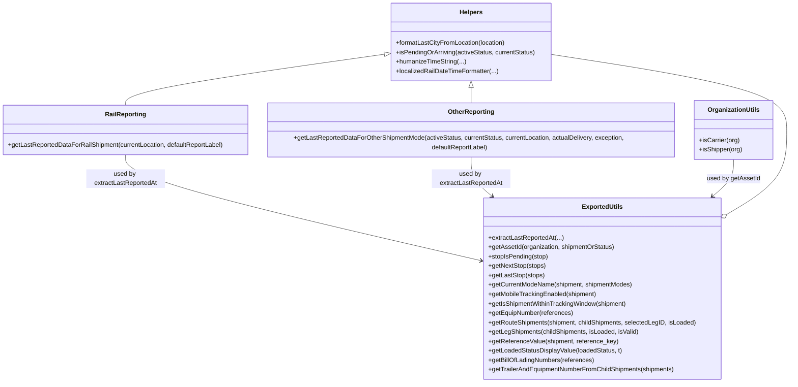

# Diagram: web/portal/src/modules/shipment-detail/ShipmentUtils.js


> Auto-generated by Obscura crawlers

## Diagram 1



### SVG

<svg id="container" width="2058.031005859375" xmlns="http://www.w3.org/2000/svg" class="classDiagram" height="974" viewBox="0 0 2058.031005859375 974" role="graphics-document document" aria-roledescription="class"><style>#container{font-family:"trebuchet ms",verdana,arial,sans-serif;font-size:16px;fill:#333;}@keyframes edge-animation-frame{from{stroke-dashoffset:0;}}@keyframes dash{to{stroke-dashoffset:0;}}#container .edge-animation-slow{stroke-dasharray:9,5!important;stroke-dashoffset:900;animation:dash 50s linear infinite;stroke-linecap:round;}#container .edge-animation-fast{stroke-dasharray:9,5!important;stroke-dashoffset:900;animation:dash 20s linear infinite;stroke-linecap:round;}#container .error-icon{fill:#552222;}#container .error-text{fill:#552222;stroke:#552222;}#container .edge-thickness-normal{stroke-width:1px;}#container .edge-thickness-thick{stroke-width:3.5px;}#container .edge-pattern-solid{stroke-dasharray:0;}#container .edge-thickness-invisible{stroke-width:0;fill:none;}#container .edge-pattern-dashed{stroke-dasharray:3;}#container .edge-pattern-dotted{stroke-dasharray:2;}#container .marker{fill:#333333;stroke:#333333;}#container .marker.cross{stroke:#333333;}#container svg{font-family:"trebuchet ms",verdana,arial,sans-serif;font-size:16px;}#container p{margin:0;}#container g.classGroup text{fill:#9370DB;stroke:none;font-family:"trebuchet ms",verdana,arial,sans-serif;font-size:10px;}#container g.classGroup text .title{font-weight:bolder;}#container .nodeLabel,#container .edgeLabel{color:#131300;}#container .edgeLabel .label rect{fill:#ECECFF;}#container .label text{fill:#131300;}#container .labelBkg{background:#ECECFF;}#container .edgeLabel .label span{background:#ECECFF;}#container .classTitle{font-weight:bolder;}#container .node rect,#container .node circle,#container .node ellipse,#container .node polygon,#container .node path{fill:#ECECFF;stroke:#9370DB;stroke-width:1px;}#container .divider{stroke:#9370DB;stroke-width:1;}#container g.clickable{cursor:pointer;}#container g.classGroup rect{fill:#ECECFF;stroke:#9370DB;}#container g.classGroup line{stroke:#9370DB;stroke-width:1;}#container .classLabel .box{stroke:none;stroke-width:0;fill:#ECECFF;opacity:0.5;}#container .classLabel .label{fill:#9370DB;font-size:10px;}#container .relation{stroke:#333333;stroke-width:1;fill:none;}#container .dashed-line{stroke-dasharray:3;}#container .dotted-line{stroke-dasharray:1 2;}#container #compositionStart,#container .composition{fill:#333333!important;stroke:#333333!important;stroke-width:1;}#container #compositionEnd,#container .composition{fill:#333333!important;stroke:#333333!important;stroke-width:1;}#container #dependencyStart,#container .dependency{fill:#333333!important;stroke:#333333!important;stroke-width:1;}#container #dependencyStart,#container .dependency{fill:#333333!important;stroke:#333333!important;stroke-width:1;}#container #extensionStart,#container .extension{fill:transparent!important;stroke:#333333!important;stroke-width:1;}#container #extensionEnd,#container .extension{fill:transparent!important;stroke:#333333!important;stroke-width:1;}#container #aggregationStart,#container .aggregation{fill:transparent!important;stroke:#333333!important;stroke-width:1;}#container #aggregationEnd,#container .aggregation{fill:transparent!important;stroke:#333333!important;stroke-width:1;}#container #lollipopStart,#container .lollipop{fill:#ECECFF!important;stroke:#333333!important;stroke-width:1;}#container #lollipopEnd,#container .lollipop{fill:#ECECFF!important;stroke:#333333!important;stroke-width:1;}#container .edgeTerminals{font-size:11px;line-height:initial;}#container .classTitleText{text-anchor:middle;font-size:18px;fill:#333;}#container .label-icon{display:inline-block;height:1em;overflow:visible;vertical-align:-0.125em;}#container .node .label-icon path{fill:currentColor;stroke:revert;stroke-width:revert;}#container :root{--mermaid-font-family:"trebuchet ms",verdana,arial,sans-serif;}</style><g><defs><marker id="container_class-aggregationStart" class="marker aggregation class" refX="18" refY="7" markerWidth="190" markerHeight="240" orient="auto"><path d="M 18,7 L9,13 L1,7 L9,1 Z"></path></marker></defs><defs><marker id="container_class-aggregationEnd" class="marker aggregation class" refX="1" refY="7" markerWidth="20" markerHeight="28" orient="auto"><path d="M 18,7 L9,13 L1,7 L9,1 Z"></path></marker></defs><defs><marker id="container_class-extensionStart" class="marker extension class" refX="18" refY="7" markerWidth="190" markerHeight="240" orient="auto"><path d="M 1,7 L18,13 V 1 Z"></path></marker></defs><defs><marker id="container_class-extensionEnd" class="marker extension class" refX="1" refY="7" markerWidth="20" markerHeight="28" orient="auto"><path d="M 1,1 V 13 L18,7 Z"></path></marker></defs><defs><marker id="container_class-compositionStart" class="marker composition class" refX="18" refY="7" markerWidth="190" markerHeight="240" orient="auto"><path d="M 18,7 L9,13 L1,7 L9,1 Z"></path></marker></defs><defs><marker id="container_class-compositionEnd" class="marker composition class" refX="1" refY="7" markerWidth="20" markerHeight="28" orient="auto"><path d="M 18,7 L9,13 L1,7 L9,1 Z"></path></marker></defs><defs><marker id="container_class-dependencyStart" class="marker dependency class" refX="6" refY="7" markerWidth="190" markerHeight="240" orient="auto"><path d="M 5,7 L9,13 L1,7 L9,1 Z"></path></marker></defs><defs><marker id="container_class-dependencyEnd" class="marker dependency class" refX="13" refY="7" markerWidth="20" markerHeight="28" orient="auto"><path d="M 18,7 L9,13 L14,7 L9,1 Z"></path></marker></defs><defs><marker id="container_class-lollipopStart" class="marker lollipop class" refX="13" refY="7" markerWidth="190" markerHeight="240" orient="auto"><circle stroke="black" fill="transparent" cx="7" cy="7" r="6"></circle></marker></defs><defs><marker id="container_class-lollipopEnd" class="marker lollipop class" refX="1" refY="7" markerWidth="190" markerHeight="240" orient="auto"><circle stroke="black" fill="transparent" cx="7" cy="7" r="6"></circle></marker></defs><g class="root"><g class="clusters"></g><g class="edgePaths"><path d="M1004.425,137.43L890.664,153.025C776.902,168.62,549.379,199.81,435.617,221.572C321.855,243.333,321.855,255.667,321.855,261.833L321.855,268" id="id_Helpers_RailReporting_1" class="edge-thickness-normal edge-pattern-solid relation" style=";;;" data-edge="true" data-et="edge" data-id="id_Helpers_RailReporting_1" data-points="W3sieCI6MTAyMS41MTU2MjUsInkiOjEzNS4wODY5MzkyNDc4OTY5fSx7IngiOjMyMS44NTU0Njg3NSwieSI6MjMxfSx7IngiOjMyMS44NTU0Njg3NSwieSI6MjY4fV0=" marker-start="url(#container_class-extensionStart)"></path><path d="M1226.402,223.25L1226.402,224.542C1226.402,225.833,1226.402,228.417,1226.402,235.875C1226.402,243.333,1226.402,255.667,1226.402,261.833L1226.402,268" id="id_Helpers_OtherReporting_2" class="edge-thickness-normal edge-pattern-solid relation" style=";;;" data-edge="true" data-et="edge" data-id="id_Helpers_OtherReporting_2" data-points="W3sieCI6MTIyNi40MDIzNDM3NSwieSI6MjA2fSx7IngiOjEyMjYuNDAyMzQzNzUsInkiOjIzMX0seyJ4IjoxMjI2LjQwMjM0Mzc1LCJ5IjoyNjh9XQ==" marker-start="url(#container_class-extensionStart)"></path><path d="M321.855,394L321.855,404.167C321.855,414.333,321.855,434.667,478.644,479.971C635.432,525.276,949.008,595.552,1105.796,630.69L1262.585,665.828" id="id_RailReporting_ExportedUtils_3" class="edge-thickness-normal edge-pattern-solid relation" style=";;;" data-edge="true" data-et="edge" data-id="id_RailReporting_ExportedUtils_3" data-points="W3sieCI6MzIxLjg1NTQ2ODc1LCJ5IjozOTR9LHsieCI6MzIxLjg1NTQ2ODc1LCJ5Ijo0NTV9LHsieCI6MTI2OC40Mzk0NTMxMjUsInkiOjY2Ny4xNDA1NTEzMDYwNDE2fV0=" marker-end="url(#container_class-dependencyEnd)"></path><path d="M1226.402,394L1226.402,404.167C1226.402,414.333,1226.402,434.667,1235.684,452.37C1244.965,470.073,1263.527,485.145,1272.809,492.682L1282.09,500.218" id="id_OtherReporting_ExportedUtils_4" class="edge-thickness-normal edge-pattern-solid relation" style=";;;" data-edge="true" data-et="edge" data-id="id_OtherReporting_ExportedUtils_4" data-points="W3sieCI6MTIyNi40MDIzNDM3NSwieSI6Mzk0fSx7IngiOjEyMjYuNDAyMzQzNzUsInkiOjQ1NX0seyJ4IjoxMjg2Ljc0NzYwNzQyMTg3NSwieSI6NTA0fV0=" marker-end="url(#container_class-dependencyEnd)"></path><path d="M1916.063,406L1916.063,414.167C1916.063,422.333,1916.063,438.667,1906.781,454.37C1897.5,470.073,1878.938,485.145,1869.656,492.682L1860.375,500.218" id="id_OrganizationUtils_ExportedUtils_5" class="edge-thickness-normal edge-pattern-solid relation" style=";;;" data-edge="true" data-et="edge" data-id="id_OrganizationUtils_ExportedUtils_5" data-points="W3sieCI6MTkxNi4wNjI1LCJ5Ijo0MDZ9LHsieCI6MTkxNi4wNjI1LCJ5Ijo0NTV9LHsieCI6MTg1NS43MTcyMzYzMjgxMjUsInkiOjUwNH1d" marker-end="url(#container_class-dependencyEnd)"></path><path d="M1888.916,549.22L1915.769,533.516C1942.621,517.813,1996.326,486.407,2023.179,450.037C2050.031,413.667,2050.031,372.333,2050.031,335C2050.031,297.667,2050.031,264.333,1946.908,232.141C1843.784,199.949,1637.536,168.898,1534.413,153.372L1431.289,137.846" id="id_ExportedUtils_Helpers_6" class="edge-thickness-normal edge-pattern-solid relation" style=";;;" data-edge="true" data-et="edge" data-id="id_ExportedUtils_Helpers_6" data-points="W3sieCI6MTg3NC4wMjUzOTA2MjUsInkiOjU1Ny45Mjc2NTUwNjEyOTAyfSx7IngiOjIwNTAuMDMxMjUsInkiOjQ1NX0seyJ4IjoyMDUwLjAzMTI1LCJ5IjozMzF9LHsieCI6MjA1MC4wMzEyNSwieSI6MjMxfSx7IngiOjE0MzEuMjg5MDYyNSwieSI6MTM3Ljg0NjM1OTI0Mjg3MDV9XQ==" marker-start="url(#container_class-aggregationStart)"></path></g><g class="edgeLabels"><g class="edgeLabel"><g class="label" data-id="id_Helpers_RailReporting_1" transform="translate(0, 0)"><foreignObject width="0" height="0"><div xmlns="http://www.w3.org/1999/xhtml" class="labelBkg" style="display: table-cell; white-space: nowrap; line-height: 1.5; max-width: 200px; text-align: center;"><span class="edgeLabel"></span></div></foreignObject></g></g><g class="edgeLabel"><g class="label" data-id="id_Helpers_OtherReporting_2" transform="translate(0, 0)"><foreignObject width="0" height="0"><div xmlns="http://www.w3.org/1999/xhtml" class="labelBkg" style="display: table-cell; white-space: nowrap; line-height: 1.5; max-width: 200px; text-align: center;"><span class="edgeLabel"></span></div></foreignObject></g></g><g class="edgeLabel" transform="translate(321.85546875, 455)"><g class="label" data-id="id_RailReporting_ExportedUtils_3" transform="translate(-100, -24)"><foreignObject width="200" height="48"><div xmlns="http://www.w3.org/1999/xhtml" class="labelBkg" style="display: table; white-space: break-spaces; line-height: 1.5; max-width: 200px; text-align: center; width: 200px;"><span class="edgeLabel"><p>used by extractLastReportedAt</p></span></div></foreignObject></g></g><g class="edgeLabel" transform="translate(1226.40234375, 455)"><g class="label" data-id="id_OtherReporting_ExportedUtils_4" transform="translate(-100, -24)"><foreignObject width="200" height="48"><div xmlns="http://www.w3.org/1999/xhtml" class="labelBkg" style="display: table; white-space: break-spaces; line-height: 1.5; max-width: 200px; text-align: center; width: 200px;"><span class="edgeLabel"><p>used by extractLastReportedAt</p></span></div></foreignObject></g></g><g class="edgeLabel" transform="translate(1916.0625, 455)"><g class="label" data-id="id_OrganizationUtils_ExportedUtils_5" transform="translate(-68.0859375, -12)"><foreignObject width="136.171875" height="24"><div xmlns="http://www.w3.org/1999/xhtml" class="labelBkg" style="display: table-cell; white-space: nowrap; line-height: 1.5; max-width: 200px; text-align: center;"><span class="edgeLabel"><p>used by getAssetId</p></span></div></foreignObject></g></g><g class="edgeLabel"><g class="label" data-id="id_ExportedUtils_Helpers_6" transform="translate(0, 0)"><foreignObject width="0" height="0"><div xmlns="http://www.w3.org/1999/xhtml" class="labelBkg" style="display: table-cell; white-space: nowrap; line-height: 1.5; max-width: 200px; text-align: center;"><span class="edgeLabel"></span></div></foreignObject></g></g></g><g class="nodes"><g class="node default" id="classId-Helpers-0" transform="translate(1226.40234375, 107)"><g class="basic label-container"><path d="M-204.88671875 -99 L204.88671875 -99 L204.88671875 99 L-204.88671875 99" stroke="none" stroke-width="0" fill="#ECECFF" style=""></path><path d="M-204.88671875 -99 C-62.107197507674755 -99, 80.67232373465049 -99, 204.88671875 -99 M-204.88671875 -99 C-73.14509829141176 -99, 58.59652216717649 -99, 204.88671875 -99 M204.88671875 -99 C204.88671875 -37.45577213414267, 204.88671875 24.08845573171466, 204.88671875 99 M204.88671875 -99 C204.88671875 -20.68738145635983, 204.88671875 57.62523708728034, 204.88671875 99 M204.88671875 99 C46.93920760836292 99, -111.00830353327416 99, -204.88671875 99 M204.88671875 99 C80.10897709619438 99, -44.66876455761124 99, -204.88671875 99 M-204.88671875 99 C-204.88671875 21.227892007598044, -204.88671875 -56.54421598480391, -204.88671875 -99 M-204.88671875 99 C-204.88671875 40.237733779874524, -204.88671875 -18.52453244025095, -204.88671875 -99" stroke="#9370DB" stroke-width="1.3" fill="none" stroke-dasharray="0 0" style=""></path></g><g class="annotation-group text" transform="translate(0, -75)"></g><g class="label-group text" transform="translate(-28.2890625, -75)"><g class="label" style="font-weight: bolder" transform="translate(0,-12)"><foreignObject width="56.578125" height="24"><div xmlns="http://www.w3.org/1999/xhtml" style="display: table-cell; white-space: nowrap; line-height: 1.5; max-width: 106px; text-align: center;"><span class="nodeLabel markdown-node-label" style=""><p>Helpers</p></span></div></foreignObject></g></g><g class="members-group text" transform="translate(-192.88671875, -27)"></g><g class="methods-group text" transform="translate(-192.88671875, 3)"><g class="label" style="" transform="translate(0,-12)"><foreignObject width="280.984375" height="24"><div xmlns="http://www.w3.org/1999/xhtml" style="display: table-cell; white-space: nowrap; line-height: 1.5; max-width: 338px; text-align: center;"><span class="nodeLabel markdown-node-label" style=""><p>+formatLastCityFromLocation(location)</p></span></div></foreignObject></g><g class="label" style="" transform="translate(0,12)"><foreignObject width="357.484375" height="24"><div xmlns="http://www.w3.org/1999/xhtml" style="display: table-cell; white-space: nowrap; line-height: 1.5; max-width: 415px; text-align: center;"><span class="nodeLabel markdown-node-label" style=""><p>+isPendingOrArriving(activeStatus, currentStatus)</p></span></div></foreignObject></g><g class="label" style="" transform="translate(0,36)"><foreignObject width="178.5625" height="24"><div xmlns="http://www.w3.org/1999/xhtml" style="display: table-cell; white-space: nowrap; line-height: 1.5; max-width: 236px; text-align: center;"><span class="nodeLabel markdown-node-label" style=""><p>+humanizeTimeString(...)</p></span></div></foreignObject></g><g class="label" style="" transform="translate(0,60)"><foreignObject width="261.421875" height="24"><div xmlns="http://www.w3.org/1999/xhtml" style="display: table-cell; white-space: nowrap; line-height: 1.5; max-width: 319px; text-align: center;"><span class="nodeLabel markdown-node-label" style=""><p>+localizedRailDateTimeFormatter(...)</p></span></div></foreignObject></g></g><g class="divider" style=""><path d="M-204.88671875 -51 C-57.315976934038815 -51, 90.25476488192237 -51, 204.88671875 -51 M-204.88671875 -51 C-45.17264891794767 -51, 114.54142091410466 -51, 204.88671875 -51" stroke="#9370DB" stroke-width="1.3" fill="none" stroke-dasharray="0 0" style=""></path></g><g class="divider" style=""><path d="M-204.88671875 -27 C-91.96273935863138 -27, 20.961240032737237 -27, 204.88671875 -27 M-204.88671875 -27 C-103.89654686425983 -27, -2.906374978519665 -27, 204.88671875 -27" stroke="#9370DB" stroke-width="1.3" fill="none" stroke-dasharray="0 0" style=""></path></g></g><g class="node default" id="classId-RailReporting-1" transform="translate(321.85546875, 331)"><g class="basic label-container"><path d="M-313.85546875 -63 L313.85546875 -63 L313.85546875 63 L-313.85546875 63" stroke="none" stroke-width="0" fill="#ECECFF" style=""></path><path d="M-313.85546875 -63 C-165.12053469853376 -63, -16.38560064706752 -63, 313.85546875 -63 M-313.85546875 -63 C-109.34872283513056 -63, 95.15802307973888 -63, 313.85546875 -63 M313.85546875 -63 C313.85546875 -21.937596714006936, 313.85546875 19.124806571986127, 313.85546875 63 M313.85546875 -63 C313.85546875 -31.01673485801892, 313.85546875 0.9665302839621575, 313.85546875 63 M313.85546875 63 C166.02828903349 63, 18.201109316980023 63, -313.85546875 63 M313.85546875 63 C180.9006081601231 63, 47.945747570246226 63, -313.85546875 63 M-313.85546875 63 C-313.85546875 33.941561640889304, -313.85546875 4.883123281778609, -313.85546875 -63 M-313.85546875 63 C-313.85546875 19.289711177322353, -313.85546875 -24.420577645355294, -313.85546875 -63" stroke="#9370DB" stroke-width="1.3" fill="none" stroke-dasharray="0 0" style=""></path></g><g class="annotation-group text" transform="translate(0, -39)"></g><g class="label-group text" transform="translate(-50.1328125, -39)"><g class="label" style="font-weight: bolder" transform="translate(0,-12)"><foreignObject width="100.265625" height="24"><div xmlns="http://www.w3.org/1999/xhtml" style="display: table-cell; white-space: nowrap; line-height: 1.5; max-width: 149px; text-align: center;"><span class="nodeLabel markdown-node-label" style=""><p>RailReporting</p></span></div></foreignObject></g></g><g class="members-group text" transform="translate(-301.85546875, 9)"></g><g class="methods-group text" transform="translate(-301.85546875, 39)"><g class="label" style="" transform="translate(0,-12)"><foreignObject width="553.578125" height="24"><div xmlns="http://www.w3.org/1999/xhtml" style="display: table-cell; white-space: nowrap; line-height: 1.5; max-width: 611px; text-align: center;"><span class="nodeLabel markdown-node-label" style=""><p>+getLastReportedDataForRailShipment(currentLocation, defaultReportLabel)</p></span></div></foreignObject></g></g><g class="divider" style=""><path d="M-313.85546875 -15 C-103.41675983784745 -15, 107.0219490743051 -15, 313.85546875 -15 M-313.85546875 -15 C-176.63021710648286 -15, -39.40496546296572 -15, 313.85546875 -15" stroke="#9370DB" stroke-width="1.3" fill="none" stroke-dasharray="0 0" style=""></path></g><g class="divider" style=""><path d="M-313.85546875 9 C-133.88178858410828 9, 46.09189158178344 9, 313.85546875 9 M-313.85546875 9 C-165.78451868288235 9, -17.7135686157647 9, 313.85546875 9" stroke="#9370DB" stroke-width="1.3" fill="none" stroke-dasharray="0 0" style=""></path></g></g><g class="node default" id="classId-OtherReporting-2" transform="translate(1226.40234375, 331)"><g class="basic label-container"><path d="M-540.69140625 -63 L540.69140625 -63 L540.69140625 63 L-540.69140625 63" stroke="none" stroke-width="0" fill="#ECECFF" style=""></path><path d="M-540.69140625 -63 C-237.62056397282555 -63, 65.4502783043489 -63, 540.69140625 -63 M-540.69140625 -63 C-279.98387164094385 -63, -19.276337031887692 -63, 540.69140625 -63 M540.69140625 -63 C540.69140625 -29.12078712761128, 540.69140625 4.7584257447774405, 540.69140625 63 M540.69140625 -63 C540.69140625 -21.47434740205029, 540.69140625 20.051305195899417, 540.69140625 63 M540.69140625 63 C208.58560458582394 63, -123.52019707835211 63, -540.69140625 63 M540.69140625 63 C266.79824625409816 63, -7.09491374180368 63, -540.69140625 63 M-540.69140625 63 C-540.69140625 22.597712462725354, -540.69140625 -17.80457507454929, -540.69140625 -63 M-540.69140625 63 C-540.69140625 32.75393049288927, -540.69140625 2.5078609857785423, -540.69140625 -63" stroke="#9370DB" stroke-width="1.3" fill="none" stroke-dasharray="0 0" style=""></path></g><g class="annotation-group text" transform="translate(0, -39)"></g><g class="label-group text" transform="translate(-57.1171875, -39)"><g class="label" style="font-weight: bolder" transform="translate(0,-12)"><foreignObject width="114.234375" height="24"><div xmlns="http://www.w3.org/1999/xhtml" style="display: table-cell; white-space: nowrap; line-height: 1.5; max-width: 163px; text-align: center;"><span class="nodeLabel markdown-node-label" style=""><p>OtherReporting</p></span></div></foreignObject></g></g><g class="members-group text" transform="translate(-528.69140625, 9)"></g><g class="methods-group text" transform="translate(-528.69140625, 39)"><g class="label" style="" transform="translate(0,-12)"><foreignObject width="1000.265625" height="24"><div xmlns="http://www.w3.org/1999/xhtml" style="display: table-cell; white-space: nowrap; line-height: 1.5; max-width: 1058px; text-align: center;"><span class="nodeLabel markdown-node-label" style=""><p>+getLastReportedDataForOtherShipmentMode(activeStatus, currentStatus, currentLocation, actualDelivery, exception, defaultReportLabel)</p></span></div></foreignObject></g></g><g class="divider" style=""><path d="M-540.69140625 -15 C-256.9332749239765 -15, 26.824856402046976 -15, 540.69140625 -15 M-540.69140625 -15 C-211.94351160213188 -15, 116.80438304573624 -15, 540.69140625 -15" stroke="#9370DB" stroke-width="1.3" fill="none" stroke-dasharray="0 0" style=""></path></g><g class="divider" style=""><path d="M-540.69140625 9 C-137.7617631409634 9, 265.1678799680732 9, 540.69140625 9 M-540.69140625 9 C-127.99457572881613 9, 284.70225479236774 9, 540.69140625 9" stroke="#9370DB" stroke-width="1.3" fill="none" stroke-dasharray="0 0" style=""></path></g></g><g class="node default" id="classId-ExportedUtils-3" transform="translate(1571.232421875, 735)"><g class="basic label-container"><path d="M-302.79296875 -231 L302.79296875 -231 L302.79296875 231 L-302.79296875 231" stroke="none" stroke-width="0" fill="#ECECFF" style=""></path><path d="M-302.79296875 -231 C-64.89791721197989 -231, 172.99713432604023 -231, 302.79296875 -231 M-302.79296875 -231 C-163.40559235772724 -231, -24.018215965454488 -231, 302.79296875 -231 M302.79296875 -231 C302.79296875 -96.74903050666884, 302.79296875 37.50193898666231, 302.79296875 231 M302.79296875 -231 C302.79296875 -77.58323522981405, 302.79296875 75.8335295403719, 302.79296875 231 M302.79296875 231 C78.56941665523755 231, -145.6541354395249 231, -302.79296875 231 M302.79296875 231 C68.05930926479624 231, -166.67435022040752 231, -302.79296875 231 M-302.79296875 231 C-302.79296875 87.45682444928195, -302.79296875 -56.086351101436094, -302.79296875 -231 M-302.79296875 231 C-302.79296875 56.55638373399967, -302.79296875 -117.88723253200067, -302.79296875 -231" stroke="#9370DB" stroke-width="1.3" fill="none" stroke-dasharray="0 0" style=""></path></g><g class="annotation-group text" transform="translate(0, -207)"></g><g class="label-group text" transform="translate(-49.9140625, -207)"><g class="label" style="font-weight: bolder" transform="translate(0,-12)"><foreignObject width="99.828125" height="24"><div xmlns="http://www.w3.org/1999/xhtml" style="display: table-cell; white-space: nowrap; line-height: 1.5; max-width: 148px; text-align: center;"><span class="nodeLabel markdown-node-label" style=""><p>ExportedUtils</p></span></div></foreignObject></g></g><g class="members-group text" transform="translate(-290.79296875, -159)"></g><g class="methods-group text" transform="translate(-290.79296875, -129)"><g class="label" style="" transform="translate(0,-12)"><foreignObject width="191.28125" height="24"><div xmlns="http://www.w3.org/1999/xhtml" style="display: table-cell; white-space: nowrap; line-height: 1.5; max-width: 249px; text-align: center;"><span class="nodeLabel markdown-node-label" style=""><p>+extractLastReportedAt(...)</p></span></div></foreignObject></g><g class="label" style="" transform="translate(0,12)"><foreignObject width="323.4375" height="24"><div xmlns="http://www.w3.org/1999/xhtml" style="display: table-cell; white-space: nowrap; line-height: 1.5; max-width: 381px; text-align: center;"><span class="nodeLabel markdown-node-label" style=""><p>+getAssetId(organization, shipmentOrStatus)</p></span></div></foreignObject></g><g class="label" style="" transform="translate(0,36)"><foreignObject width="152.953125" height="24"><div xmlns="http://www.w3.org/1999/xhtml" style="display: table-cell; white-space: nowrap; line-height: 1.5; max-width: 210px; text-align: center;"><span class="nodeLabel markdown-node-label" style=""><p>+stopIsPending(stop)</p></span></div></foreignObject></g><g class="label" style="" transform="translate(0,60)"><foreignObject width="146.390625" height="24"><div xmlns="http://www.w3.org/1999/xhtml" style="display: table-cell; white-space: nowrap; line-height: 1.5; max-width: 204px; text-align: center;"><span class="nodeLabel markdown-node-label" style=""><p>+getNextStop(stops)</p></span></div></foreignObject></g><g class="label" style="" transform="translate(0,84)"><foreignObject width="142.953125" height="24"><div xmlns="http://www.w3.org/1999/xhtml" style="display: table-cell; white-space: nowrap; line-height: 1.5; max-width: 200px; text-align: center;"><span class="nodeLabel markdown-node-label" style=""><p>+getLastStop(stops)</p></span></div></foreignObject></g><g class="label" style="" transform="translate(0,108)"><foreignObject width="369.40625" height="24"><div xmlns="http://www.w3.org/1999/xhtml" style="display: table-cell; white-space: nowrap; line-height: 1.5; max-width: 427px; text-align: center;"><span class="nodeLabel markdown-node-label" style=""><p>+getCurrentModeName(shipment, shipmentModes)</p></span></div></foreignObject></g><g class="label" style="" transform="translate(0,132)"><foreignObject width="277.546875" height="24"><div xmlns="http://www.w3.org/1999/xhtml" style="display: table-cell; white-space: nowrap; line-height: 1.5; max-width: 335px; text-align: center;"><span class="nodeLabel markdown-node-label" style=""><p>+getMobileTrackingEnabled(shipment)</p></span></div></foreignObject></g><g class="label" style="" transform="translate(0,156)"><foreignObject width="355.671875" height="24"><div xmlns="http://www.w3.org/1999/xhtml" style="display: table-cell; white-space: nowrap; line-height: 1.5; max-width: 413px; text-align: center;"><span class="nodeLabel markdown-node-label" style=""><p>+getIsShipmentWithinTrackingWindow(shipment)</p></span></div></foreignObject></g><g class="label" style="" transform="translate(0,180)"><foreignObject width="216.0625" height="24"><div xmlns="http://www.w3.org/1999/xhtml" style="display: table-cell; white-space: nowrap; line-height: 1.5; max-width: 273px; text-align: center;"><span class="nodeLabel markdown-node-label" style=""><p>+getEquipNumber(references)</p></span></div></foreignObject></g><g class="label" style="" transform="translate(0,204)"><foreignObject width="531.671875" height="24"><div xmlns="http://www.w3.org/1999/xhtml" style="display: table-cell; white-space: nowrap; line-height: 1.5; max-width: 589px; text-align: center;"><span class="nodeLabel markdown-node-label" style=""><p>+getRouteShipments(shipment, childShipments, selectedLegID, isLoaded)</p></span></div></foreignObject></g><g class="label" style="" transform="translate(0,228)"><foreignObject width="384.578125" height="24"><div xmlns="http://www.w3.org/1999/xhtml" style="display: table-cell; white-space: nowrap; line-height: 1.5; max-width: 442px; text-align: center;"><span class="nodeLabel markdown-node-label" style=""><p>+getLegShipments(childShipments, isLoaded, isValid)</p></span></div></foreignObject></g><g class="label" style="" transform="translate(0,252)"><foreignObject width="329.703125" height="24"><div xmlns="http://www.w3.org/1999/xhtml" style="display: table-cell; white-space: nowrap; line-height: 1.5; max-width: 387px; text-align: center;"><span class="nodeLabel markdown-node-label" style=""><p>+getReferenceValue(shipment, reference_key)</p></span></div></foreignObject></g><g class="label" style="" transform="translate(0,276)"><foreignObject width="342" height="24"><div xmlns="http://www.w3.org/1999/xhtml" style="display: table-cell; white-space: nowrap; line-height: 1.5; max-width: 399px; text-align: center;"><span class="nodeLabel markdown-node-label" style=""><p>+getLoadedStatusDisplayValue(loadedStatus, t)</p></span></div></foreignObject></g><g class="label" style="" transform="translate(0,300)"><foreignObject width="270.484375" height="24"><div xmlns="http://www.w3.org/1999/xhtml" style="display: table-cell; white-space: nowrap; line-height: 1.5; max-width: 328px; text-align: center;"><span class="nodeLabel markdown-node-label" style=""><p>+getBillOfLadingNumbers(references)</p></span></div></foreignObject></g><g class="label" style="" transform="translate(0,324)"><foreignObject width="478.234375" height="24"><div xmlns="http://www.w3.org/1999/xhtml" style="display: table-cell; white-space: nowrap; line-height: 1.5; max-width: 536px; text-align: center;"><span class="nodeLabel markdown-node-label" style=""><p>+getTrailerAndEquipmentNumberFromChildShipments(shipments)</p></span></div></foreignObject></g></g><g class="divider" style=""><path d="M-302.79296875 -183 C-177.37642625999072 -183, -51.959883769981445 -183, 302.79296875 -183 M-302.79296875 -183 C-63.61052964747313 -183, 175.57190945505374 -183, 302.79296875 -183" stroke="#9370DB" stroke-width="1.3" fill="none" stroke-dasharray="0 0" style=""></path></g><g class="divider" style=""><path d="M-302.79296875 -159 C-154.8220355634406 -159, -6.851102376881215 -159, 302.79296875 -159 M-302.79296875 -159 C-79.8370165222542 -159, 143.1189357054916 -159, 302.79296875 -159" stroke="#9370DB" stroke-width="1.3" fill="none" stroke-dasharray="0 0" style=""></path></g></g><g class="node default" id="classId-OrganizationUtils-4" transform="translate(1916.0625, 331)"><g class="basic label-container"><path d="M-98.96875 -75 L98.96875 -75 L98.96875 75 L-98.96875 75" stroke="none" stroke-width="0" fill="#ECECFF" style=""></path><path d="M-98.96875 -75 C-51.10249064437189 -75, -3.236231288743781 -75, 98.96875 -75 M-98.96875 -75 C-53.19788491785687 -75, -7.427019835713736 -75, 98.96875 -75 M98.96875 -75 C98.96875 -44.14318183513409, 98.96875 -13.28636367026818, 98.96875 75 M98.96875 -75 C98.96875 -36.554253942491705, 98.96875 1.8914921150165895, 98.96875 75 M98.96875 75 C47.6569236610737 75, -3.654902677852604 75, -98.96875 75 M98.96875 75 C42.91366475225445 75, -13.141420495491104 75, -98.96875 75 M-98.96875 75 C-98.96875 24.88928794210011, -98.96875 -25.221424115799778, -98.96875 -75 M-98.96875 75 C-98.96875 32.93430584686213, -98.96875 -9.131388306275738, -98.96875 -75" stroke="#9370DB" stroke-width="1.3" fill="none" stroke-dasharray="0 0" style=""></path></g><g class="annotation-group text" transform="translate(0, -51)"></g><g class="label-group text" transform="translate(-63.484375, -51)"><g class="label" style="font-weight: bolder" transform="translate(0,-12)"><foreignObject width="126.96875" height="24"><div xmlns="http://www.w3.org/1999/xhtml" style="display: table-cell; white-space: nowrap; line-height: 1.5; max-width: 175px; text-align: center;"><span class="nodeLabel markdown-node-label" style=""><p>OrganizationUtils</p></span></div></foreignObject></g></g><g class="members-group text" transform="translate(-86.96875, -3)"></g><g class="methods-group text" transform="translate(-86.96875, 27)"><g class="label" style="" transform="translate(0,-12)"><foreignObject width="103.203125" height="24"><div xmlns="http://www.w3.org/1999/xhtml" style="display: table-cell; white-space: nowrap; line-height: 1.5; max-width: 161px; text-align: center;"><span class="nodeLabel markdown-node-label" style=""><p>+isCarrier(org)</p></span></div></foreignObject></g><g class="label" style="" transform="translate(0,12)"><foreignObject width="110.453125" height="24"><div xmlns="http://www.w3.org/1999/xhtml" style="display: table-cell; white-space: nowrap; line-height: 1.5; max-width: 168px; text-align: center;"><span class="nodeLabel markdown-node-label" style=""><p>+isShipper(org)</p></span></div></foreignObject></g></g><g class="divider" style=""><path d="M-98.96875 -27 C-38.91801547889894 -27, 21.132719042202126 -27, 98.96875 -27 M-98.96875 -27 C-33.939106691711956 -27, 31.090536616576088 -27, 98.96875 -27" stroke="#9370DB" stroke-width="1.3" fill="none" stroke-dasharray="0 0" style=""></path></g><g class="divider" style=""><path d="M-98.96875 -3 C-23.1418810830628 -3, 52.6849878338744 -3, 98.96875 -3 M-98.96875 -3 C-29.45234811923082 -3, 40.06405376153836 -3, 98.96875 -3" stroke="#9370DB" stroke-width="1.3" fill="none" stroke-dasharray="0 0" style=""></path></g></g></g></g></g></svg>

## Diagram 2

```mermaid
flowchart TD
    A[extractLastReportedAt(...)] --> B{mode === "Rail"?}
    B -- Yes --> C[getLastReportedDataForRailShipment]
    B -- No --> D[getLastReportedDataForOtherShipmentMode]
    C --> C1[uses currentLocation.updates[-1] if exists]
    C --> C2[formats time with localizedRailDateTimeFormatter]
    D --> D1{isPendingOrArriving(activeStatus,currentStatus)?}
    D1 -- true --> D2[use actualDelivery, label empty]
    D1 -- false --> D3{activeStatus excluded list OR exception != "Under Review"}
    D3 -- true --> D4[showDistance=true; use latest currentLocation.update if exists]
    D3 -- false --> D5[no last update; label default]
    D4 --> D6[formattedLastTime = humanizeTimeString(...)]
    D2 --> E[return reported data object]
    D5 --> E
    C1 --> E
    C2 --> E
```

> SVG rendering failed for this diagram.
