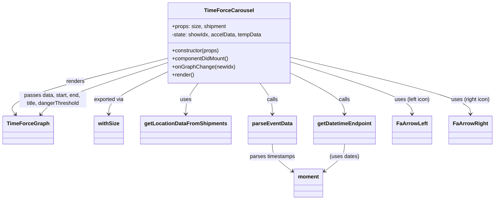

# Diagram: web/portal/src/modules/shipment-detail/TimeForceCarousel.js


> Auto-generated by Obscura crawlers

## Diagram 1



### SVG

<svg id="container" width="1428.6953125" xmlns="http://www.w3.org/2000/svg" class="classDiagram" height="596" viewBox="30.6640625 0 1428.6953125 596" role="graphics-document document" aria-roledescription="class"><style>#container{font-family:"trebuchet ms",verdana,arial,sans-serif;font-size:16px;fill:#333;}@keyframes edge-animation-frame{from{stroke-dashoffset:0;}}@keyframes dash{to{stroke-dashoffset:0;}}#container .edge-animation-slow{stroke-dasharray:9,5!important;stroke-dashoffset:900;animation:dash 50s linear infinite;stroke-linecap:round;}#container .edge-animation-fast{stroke-dasharray:9,5!important;stroke-dashoffset:900;animation:dash 20s linear infinite;stroke-linecap:round;}#container .error-icon{fill:#552222;}#container .error-text{fill:#552222;stroke:#552222;}#container .edge-thickness-normal{stroke-width:1px;}#container .edge-thickness-thick{stroke-width:3.5px;}#container .edge-pattern-solid{stroke-dasharray:0;}#container .edge-thickness-invisible{stroke-width:0;fill:none;}#container .edge-pattern-dashed{stroke-dasharray:3;}#container .edge-pattern-dotted{stroke-dasharray:2;}#container .marker{fill:#333333;stroke:#333333;}#container .marker.cross{stroke:#333333;}#container svg{font-family:"trebuchet ms",verdana,arial,sans-serif;font-size:16px;}#container p{margin:0;}#container g.classGroup text{fill:#9370DB;stroke:none;font-family:"trebuchet ms",verdana,arial,sans-serif;font-size:10px;}#container g.classGroup text .title{font-weight:bolder;}#container .nodeLabel,#container .edgeLabel{color:#131300;}#container .edgeLabel .label rect{fill:#ECECFF;}#container .label text{fill:#131300;}#container .labelBkg{background:#ECECFF;}#container .edgeLabel .label span{background:#ECECFF;}#container .classTitle{font-weight:bolder;}#container .node rect,#container .node circle,#container .node ellipse,#container .node polygon,#container .node path{fill:#ECECFF;stroke:#9370DB;stroke-width:1px;}#container .divider{stroke:#9370DB;stroke-width:1;}#container g.clickable{cursor:pointer;}#container g.classGroup rect{fill:#ECECFF;stroke:#9370DB;}#container g.classGroup line{stroke:#9370DB;stroke-width:1;}#container .classLabel .box{stroke:none;stroke-width:0;fill:#ECECFF;opacity:0.5;}#container .classLabel .label{fill:#9370DB;font-size:10px;}#container .relation{stroke:#333333;stroke-width:1;fill:none;}#container .dashed-line{stroke-dasharray:3;}#container .dotted-line{stroke-dasharray:1 2;}#container #compositionStart,#container .composition{fill:#333333!important;stroke:#333333!important;stroke-width:1;}#container #compositionEnd,#container .composition{fill:#333333!important;stroke:#333333!important;stroke-width:1;}#container #dependencyStart,#container .dependency{fill:#333333!important;stroke:#333333!important;stroke-width:1;}#container #dependencyStart,#container .dependency{fill:#333333!important;stroke:#333333!important;stroke-width:1;}#container #extensionStart,#container .extension{fill:transparent!important;stroke:#333333!important;stroke-width:1;}#container #extensionEnd,#container .extension{fill:transparent!important;stroke:#333333!important;stroke-width:1;}#container #aggregationStart,#container .aggregation{fill:transparent!important;stroke:#333333!important;stroke-width:1;}#container #aggregationEnd,#container .aggregation{fill:transparent!important;stroke:#333333!important;stroke-width:1;}#container #lollipopStart,#container .lollipop{fill:#ECECFF!important;stroke:#333333!important;stroke-width:1;}#container #lollipopEnd,#container .lollipop{fill:#ECECFF!important;stroke:#333333!important;stroke-width:1;}#container .edgeTerminals{font-size:11px;line-height:initial;}#container .classTitleText{text-anchor:middle;font-size:18px;fill:#333;}#container .label-icon{display:inline-block;height:1em;overflow:visible;vertical-align:-0.125em;}#container .node .label-icon path{fill:currentColor;stroke:revert;stroke-width:revert;}#container :root{--mermaid-font-family:"trebuchet ms",verdana,arial,sans-serif;}</style><g><defs><marker id="container_class-aggregationStart" class="marker aggregation class" refX="18" refY="7" markerWidth="190" markerHeight="240" orient="auto"><path d="M 18,7 L9,13 L1,7 L9,1 Z"></path></marker></defs><defs><marker id="container_class-aggregationEnd" class="marker aggregation class" refX="1" refY="7" markerWidth="20" markerHeight="28" orient="auto"><path d="M 18,7 L9,13 L1,7 L9,1 Z"></path></marker></defs><defs><marker id="container_class-extensionStart" class="marker extension class" refX="18" refY="7" markerWidth="190" markerHeight="240" orient="auto"><path d="M 1,7 L18,13 V 1 Z"></path></marker></defs><defs><marker id="container_class-extensionEnd" class="marker extension class" refX="1" refY="7" markerWidth="20" markerHeight="28" orient="auto"><path d="M 1,1 V 13 L18,7 Z"></path></marker></defs><defs><marker id="container_class-compositionStart" class="marker composition class" refX="18" refY="7" markerWidth="190" markerHeight="240" orient="auto"><path d="M 18,7 L9,13 L1,7 L9,1 Z"></path></marker></defs><defs><marker id="container_class-compositionEnd" class="marker composition class" refX="1" refY="7" markerWidth="20" markerHeight="28" orient="auto"><path d="M 18,7 L9,13 L1,7 L9,1 Z"></path></marker></defs><defs><marker id="container_class-dependencyStart" class="marker dependency class" refX="6" refY="7" markerWidth="190" markerHeight="240" orient="auto"><path d="M 5,7 L9,13 L1,7 L9,1 Z"></path></marker></defs><defs><marker id="container_class-dependencyEnd" class="marker dependency class" refX="13" refY="7" markerWidth="20" markerHeight="28" orient="auto"><path d="M 18,7 L9,13 L14,7 L9,1 Z"></path></marker></defs><defs><marker id="container_class-lollipopStart" class="marker lollipop class" refX="13" refY="7" markerWidth="190" markerHeight="240" orient="auto"><circle stroke="black" fill="transparent" cx="7" cy="7" r="6"></circle></marker></defs><defs><marker id="container_class-lollipopEnd" class="marker lollipop class" refX="1" refY="7" markerWidth="190" markerHeight="240" orient="auto"><circle stroke="black" fill="transparent" cx="7" cy="7" r="6"></circle></marker></defs><g class="root"><g class="clusters"></g><g class="edgePaths"><path d="M514.723,174.173L434.894,194.644C355.065,215.115,195.408,256.058,121.578,283.919C47.749,311.781,59.748,326.561,65.748,333.951L71.747,341.342" id="id_TimeForceCarousel_TimeForceGraph_1" class="edge-thickness-normal edge-pattern-solid relation" style=";;;" data-edge="true" data-et="edge" data-id="id_TimeForceCarousel_TimeForceGraph_1" data-points="W3sieCI6NTE0LjcyMjY1NjI1LCJ5IjoxNzQuMTcyOTU4NDkxMTQ3Nn0seyJ4IjozNS43NSwieSI6Mjk3fSx7IngiOjc1LjUyODg0NjE1Mzg0NjE2LCJ5IjozNDZ9XQ==" marker-end="url(#container_class-dependencyEnd)"></path><path d="M514.723,215.941L487.062,229.451C459.401,242.961,404.079,269.98,376.419,290.657C348.758,311.333,348.758,325.667,348.758,332.833L348.758,340" id="id_TimeForceCarousel_withSize_2" class="edge-thickness-normal edge-pattern-solid relation" style=";;;" data-edge="true" data-et="edge" data-id="id_TimeForceCarousel_withSize_2" data-points="W3sieCI6NTE0LjcyMjY1NjI1LCJ5IjoyMTUuOTQwODIyNTI0MDE3NTZ9LHsieCI6MzQ4Ljc1NzgxMjUsInkiOjI5N30seyJ4IjozNDguNzU3ODEyNSwieSI6MzQ2fV0=" marker-end="url(#container_class-dependencyEnd)"></path><path d="M606.544,248L600.539,256.167C594.535,264.333,582.525,280.667,576.52,296C570.516,311.333,570.516,325.667,570.516,332.833L570.516,340" id="id_TimeForceCarousel_getLocationDataFromShipments_3" class="edge-thickness-normal edge-pattern-solid relation" style=";;;" data-edge="true" data-et="edge" data-id="id_TimeForceCarousel_getLocationDataFromShipments_3" data-points="W3sieCI6NjA2LjU0NDE3MDY3MzA3NjksInkiOjI0OH0seyJ4Ijo1NzAuNTE1NjI1LCJ5IjoyOTd9LHsieCI6NTcwLjUxNTYyNSwieSI6MzQ2fV0=" marker-end="url(#container_class-dependencyEnd)"></path><path d="M874.832,219.128L900.476,232.107C926.12,245.085,977.408,271.043,1003.051,291.188C1028.695,311.333,1028.695,325.667,1028.695,332.833L1028.695,340" id="id_TimeForceCarousel_getDatetimeEndpoint_4" class="edge-thickness-normal edge-pattern-solid relation" style=";;;" data-edge="true" data-et="edge" data-id="id_TimeForceCarousel_getDatetimeEndpoint_4" data-points="W3sieCI6ODc0LjgzMjAzMTI1LCJ5IjoyMTkuMTI3ODk2Nzc0Nzk3M30seyJ4IjoxMDI4LjY5NTMxMjUsInkiOjI5N30seyJ4IjoxMDI4LjY5NTMxMjUsInkiOjM0Nn1d" marker-end="url(#container_class-dependencyEnd)"></path><path d="M783.011,248L789.015,256.167C795.02,264.333,807.03,280.667,813.034,296C819.039,311.333,819.039,325.667,819.039,332.833L819.039,340" id="id_TimeForceCarousel_parseEventData_5" class="edge-thickness-normal edge-pattern-solid relation" style=";;;" data-edge="true" data-et="edge" data-id="id_TimeForceCarousel_parseEventData_5" data-points="W3sieCI6NzgzLjAxMDUxNjgyNjkyMzEsInkiOjI0OH0seyJ4Ijo4MTkuMDM5MDYyNSwieSI6Mjk3fSx7IngiOjgxOS4wMzkwNjI1LCJ5IjozNDZ9XQ==" marker-end="url(#container_class-dependencyEnd)"></path><path d="M874.832,185.455L933.093,204.046C991.354,222.636,1107.876,259.818,1166.137,285.576C1224.398,311.333,1224.398,325.667,1224.398,332.833L1224.398,340" id="id_TimeForceCarousel_FaArrowLeft_6" class="edge-thickness-normal edge-pattern-solid relation" style=";;;" data-edge="true" data-et="edge" data-id="id_TimeForceCarousel_FaArrowLeft_6" data-points="W3sieCI6ODc0LjgzMjAzMTI1LCJ5IjoxODUuNDU0NzM5OTAxMDIwMDV9LHsieCI6MTIyNC4zOTg0Mzc1LCJ5IjoyOTd9LHsieCI6MTIyNC4zOTg0Mzc1LCJ5IjozNDZ9XQ==" marker-end="url(#container_class-dependencyEnd)"></path><path d="M874.832,171.726L960.808,192.605C1046.784,213.484,1218.736,255.242,1304.712,283.288C1390.688,311.333,1390.688,325.667,1390.688,332.833L1390.688,340" id="id_TimeForceCarousel_FaArrowRight_7" class="edge-thickness-normal edge-pattern-solid relation" style=";;;" data-edge="true" data-et="edge" data-id="id_TimeForceCarousel_FaArrowRight_7" data-points="W3sieCI6ODc0LjgzMjAzMTI1LCJ5IjoxNzEuNzI1ODE5OTQxMjg2NDN9LHsieCI6MTM5MC42ODc1LCJ5IjoyOTd9LHsieCI6MTM5MC42ODc1LCJ5IjozNDZ9XQ==" marker-end="url(#container_class-dependencyEnd)"></path><path d="M819.039,430L819.039,436.167C819.039,442.333,819.039,454.667,828.66,468.084C838.28,481.501,857.522,496.001,867.142,503.251L876.763,510.502" id="id_parseEventData_moment_8" class="edge-thickness-normal edge-pattern-solid relation" style=";;;" data-edge="true" data-et="edge" data-id="id_parseEventData_moment_8" data-points="W3sieCI6ODE5LjAzOTA2MjUsInkiOjQzMH0seyJ4Ijo4MTkuMDM5MDYyNSwieSI6NDY3fSx7IngiOjg4MS41NTQ2ODc1LCJ5Ijo1MTQuMTEyNjg0NDUzNzE4OX1d" marker-end="url(#container_class-dependencyEnd)"></path><path d="M1028.695,430L1028.695,436.167C1028.695,442.333,1028.695,454.667,1019.075,468.084C1009.454,481.501,990.213,496.001,980.592,503.251L970.971,510.502" id="id_getDatetimeEndpoint_moment_9" class="edge-thickness-normal edge-pattern-solid relation" style=";;;" data-edge="true" data-et="edge" data-id="id_getDatetimeEndpoint_moment_9" data-points="W3sieCI6MTAyOC42OTUzMTI1LCJ5Ijo0MzB9LHsieCI6MTAyOC42OTUzMTI1LCJ5Ijo0Njd9LHsieCI6OTY2LjE3OTY4NzUsInkiOjUxNC4xMTI2ODQ0NTM3MTg5fV0=" marker-end="url(#container_class-dependencyEnd)"></path><path d="M147.503,341.342L153.502,333.951C159.502,326.561,171.501,311.781,232.704,286.143C293.908,260.505,404.315,224.011,459.519,205.763L514.723,187.516" id="id_TimeForceGraph_TimeForceCarousel_10" class="edge-thickness-normal edge-pattern-solid relation" style=";;;" data-edge="true" data-et="edge" data-id="id_TimeForceGraph_TimeForceCarousel_10" data-points="W3sieCI6MTQzLjcyMTE1Mzg0NjE1Mzg0LCJ5IjozNDZ9LHsieCI6MTgzLjUsInkiOjI5N30seyJ4Ijo1MTQuNzIyNjU2MjUsInkiOjE4Ny41MTYxMTY5NTU4NDc0fV0=" marker-start="url(#container_class-dependencyStart)"></path></g><g class="edgeLabels"><g class="edgeLabel" transform="translate(244.66849, 243.42525)"><g class="label" data-id="id_TimeForceCarousel_TimeForceGraph_1" transform="translate(-27.75, -12)"><foreignObject width="55.5" height="24"><div xmlns="http://www.w3.org/1999/xhtml" class="labelBkg" style="display: table-cell; white-space: nowrap; line-height: 1.5; max-width: 200px; text-align: center;"><span class="edgeLabel"><p>renders</p></span></div></foreignObject></g></g><g class="edgeLabel" transform="translate(348.7578125, 297)"><g class="label" data-id="id_TimeForceCarousel_withSize_2" transform="translate(-45.2578125, -12)"><foreignObject width="90.515625" height="24"><div xmlns="http://www.w3.org/1999/xhtml" class="labelBkg" style="display: table-cell; white-space: nowrap; line-height: 1.5; max-width: 200px; text-align: center;"><span class="edgeLabel"><p>exported via</p></span></div></foreignObject></g></g><g class="edgeLabel" transform="translate(570.515625, 297)"><g class="label" data-id="id_TimeForceCarousel_getLocationDataFromShipments_3" transform="translate(-16.4921875, -12)"><foreignObject width="32.984375" height="24"><div xmlns="http://www.w3.org/1999/xhtml" class="labelBkg" style="display: table-cell; white-space: nowrap; line-height: 1.5; max-width: 200px; text-align: center;"><span class="edgeLabel"><p>uses</p></span></div></foreignObject></g></g><g class="edgeLabel" transform="translate(1028.6953125, 297)"><g class="label" data-id="id_TimeForceCarousel_getDatetimeEndpoint_4" transform="translate(-16.4453125, -12)"><foreignObject width="32.890625" height="24"><div xmlns="http://www.w3.org/1999/xhtml" class="labelBkg" style="display: table-cell; white-space: nowrap; line-height: 1.5; max-width: 200px; text-align: center;"><span class="edgeLabel"><p>calls</p></span></div></foreignObject></g></g><g class="edgeLabel" transform="translate(819.0390625, 297)"><g class="label" data-id="id_TimeForceCarousel_parseEventData_5" transform="translate(-16.4453125, -12)"><foreignObject width="32.890625" height="24"><div xmlns="http://www.w3.org/1999/xhtml" class="labelBkg" style="display: table-cell; white-space: nowrap; line-height: 1.5; max-width: 200px; text-align: center;"><span class="edgeLabel"><p>calls</p></span></div></foreignObject></g></g><g class="edgeLabel" transform="translate(1224.3984375, 297)"><g class="label" data-id="id_TimeForceCarousel_FaArrowLeft_6" transform="translate(-53.4296875, -12)"><foreignObject width="106.859375" height="24"><div xmlns="http://www.w3.org/1999/xhtml" class="labelBkg" style="display: table-cell; white-space: nowrap; line-height: 1.5; max-width: 200px; text-align: center;"><span class="edgeLabel"><p>uses (left icon)</p></span></div></foreignObject></g></g><g class="edgeLabel" transform="translate(1390.6875, 297)"><g class="label" data-id="id_TimeForceCarousel_FaArrowRight_7" transform="translate(-58.2734375, -12)"><foreignObject width="116.546875" height="24"><div xmlns="http://www.w3.org/1999/xhtml" class="labelBkg" style="display: table-cell; white-space: nowrap; line-height: 1.5; max-width: 200px; text-align: center;"><span class="edgeLabel"><p>uses (right icon)</p></span></div></foreignObject></g></g><g class="edgeLabel" transform="translate(819.0390625, 467)"><g class="label" data-id="id_parseEventData_moment_8" transform="translate(-68.5703125, -12)"><foreignObject width="137.140625" height="24"><div xmlns="http://www.w3.org/1999/xhtml" class="labelBkg" style="display: table-cell; white-space: nowrap; line-height: 1.5; max-width: 200px; text-align: center;"><span class="edgeLabel"><p>parses timestamps</p></span></div></foreignObject></g></g><g class="edgeLabel" transform="translate(1028.6953125, 467)"><g class="label" data-id="id_getDatetimeEndpoint_moment_9" transform="translate(-43.796875, -12)"><foreignObject width="87.59375" height="24"><div xmlns="http://www.w3.org/1999/xhtml" class="labelBkg" style="display: table-cell; white-space: nowrap; line-height: 1.5; max-width: 200px; text-align: center;"><span class="edgeLabel"><p>(uses dates)</p></span></div></foreignObject></g></g><g class="edgeLabel" transform="translate(319.14883, 252.162)"><g class="label" data-id="id_TimeForceGraph_TimeForceCarousel_10" transform="translate(-100, -24)"><foreignObject width="200" height="48"><div xmlns="http://www.w3.org/1999/xhtml" class="labelBkg" style="display: table; white-space: break-spaces; line-height: 1.5; max-width: 200px; text-align: center; width: 200px;"><span class="edgeLabel"><p>passes data, start, end, title, dangerThreshold</p></span></div></foreignObject></g></g></g><g class="nodes"><g class="node default" id="classId-TimeForceCarousel-0" transform="translate(694.77734375, 128)"><g class="basic label-container"><path d="M-180.0546875 -120 L180.0546875 -120 L180.0546875 120 L-180.0546875 120" stroke="none" stroke-width="0" fill="#ECECFF" style=""></path><path d="M-180.0546875 -120 C-90.77697273895255 -120, -1.4992579779051027 -120, 180.0546875 -120 M-180.0546875 -120 C-62.98594483007061 -120, 54.082797839858785 -120, 180.0546875 -120 M180.0546875 -120 C180.0546875 -57.82930413610068, 180.0546875 4.341391727798637, 180.0546875 120 M180.0546875 -120 C180.0546875 -46.216391642649995, 180.0546875 27.56721671470001, 180.0546875 120 M180.0546875 120 C107.20482489010558 120, 34.35496228021117 120, -180.0546875 120 M180.0546875 120 C74.96332432377028 120, -30.12803885245944 120, -180.0546875 120 M-180.0546875 120 C-180.0546875 45.307705020595535, -180.0546875 -29.38458995880893, -180.0546875 -120 M-180.0546875 120 C-180.0546875 46.69660313428524, -180.0546875 -26.60679373142952, -180.0546875 -120" stroke="#9370DB" stroke-width="1.3" fill="none" stroke-dasharray="0 0" style=""></path></g><g class="annotation-group text" transform="translate(0, -96)"></g><g class="label-group text" transform="translate(-68.875, -96)"><g class="label" style="font-weight: bolder" transform="translate(0,-12)"><foreignObject width="137.75" height="24"><div xmlns="http://www.w3.org/1999/xhtml" style="display: table-cell; white-space: nowrap; line-height: 1.5; max-width: 187px; text-align: center;"><span class="nodeLabel markdown-node-label" style=""><p>TimeForceCarousel</p></span></div></foreignObject></g></g><g class="members-group text" transform="translate(-168.0546875, -48)"><g class="label" style="" transform="translate(0,-12)"><foreignObject width="161.546875" height="24"><div xmlns="http://www.w3.org/1999/xhtml" style="display: table-cell; white-space: nowrap; line-height: 1.5; max-width: 219px; text-align: center;"><span class="nodeLabel markdown-node-label" style=""><p>+props: size, shipment</p></span></div></foreignObject></g><g class="label" style="" transform="translate(0,12)"><foreignObject width="267.234375" height="24"><div xmlns="http://www.w3.org/1999/xhtml" style="display: table-cell; white-space: nowrap; line-height: 1.5; max-width: 325px; text-align: center;"><span class="nodeLabel markdown-node-label" style=""><p>-state: showIdx, accelData, tempData</p></span></div></foreignObject></g></g><g class="methods-group text" transform="translate(-168.0546875, 24)"><g class="label" style="" transform="translate(0,-12)"><foreignObject width="143.375" height="24"><div xmlns="http://www.w3.org/1999/xhtml" style="display: table-cell; white-space: nowrap; line-height: 1.5; max-width: 201px; text-align: center;"><span class="nodeLabel markdown-node-label" style=""><p>+constructor(props)</p></span></div></foreignObject></g><g class="label" style="" transform="translate(0,12)"><foreignObject width="171.484375" height="24"><div xmlns="http://www.w3.org/1999/xhtml" style="display: table-cell; white-space: nowrap; line-height: 1.5; max-width: 229px; text-align: center;"><span class="nodeLabel markdown-node-label" style=""><p>+componentDidMount()</p></span></div></foreignObject></g><g class="label" style="" transform="translate(0,36)"><foreignObject width="185.03125" height="24"><div xmlns="http://www.w3.org/1999/xhtml" style="display: table-cell; white-space: nowrap; line-height: 1.5; max-width: 242px; text-align: center;"><span class="nodeLabel markdown-node-label" style=""><p>+onGraphChange(newIdx)</p></span></div></foreignObject></g><g class="label" style="" transform="translate(0,60)"><foreignObject width="66.609375" height="24"><div xmlns="http://www.w3.org/1999/xhtml" style="display: table-cell; white-space: nowrap; line-height: 1.5; max-width: 124px; text-align: center;"><span class="nodeLabel markdown-node-label" style=""><p>+render()</p></span></div></foreignObject></g></g><g class="divider" style=""><path d="M-180.0546875 -72 C-78.41583662252357 -72, 23.223014254952858 -72, 180.0546875 -72 M-180.0546875 -72 C-83.52537038612073 -72, 13.003946727758546 -72, 180.0546875 -72" stroke="#9370DB" stroke-width="1.3" fill="none" stroke-dasharray="0 0" style=""></path></g><g class="divider" style=""><path d="M-180.0546875 0 C-86.4768604247531 0, 7.1009666504938025 0, 180.0546875 0 M-180.0546875 0 C-53.990689163707145 0, 72.07330917258571 0, 180.0546875 0" stroke="#9370DB" stroke-width="1.3" fill="none" stroke-dasharray="0 0" style=""></path></g></g><g class="node default" id="classId-TimeForceGraph-1" transform="translate(109.625, 388)"><g class="basic label-container"><path d="M-70.9609375 -42 L70.9609375 -42 L70.9609375 42 L-70.9609375 42" stroke="none" stroke-width="0" fill="#ECECFF" style=""></path><path d="M-70.9609375 -42 C-35.761932279294335 -42, -0.5629270585886701 -42, 70.9609375 -42 M-70.9609375 -42 C-26.43301297443837 -42, 18.09491155112326 -42, 70.9609375 -42 M70.9609375 -42 C70.9609375 -15.591763117392325, 70.9609375 10.816473765215349, 70.9609375 42 M70.9609375 -42 C70.9609375 -18.775196556288705, 70.9609375 4.44960688742259, 70.9609375 42 M70.9609375 42 C32.93649576125714 42, -5.087945977485717 42, -70.9609375 42 M70.9609375 42 C30.716314334077133 42, -9.528308831845735 42, -70.9609375 42 M-70.9609375 42 C-70.9609375 8.455979700801208, -70.9609375 -25.088040598397583, -70.9609375 -42 M-70.9609375 42 C-70.9609375 14.854263590301944, -70.9609375 -12.291472819396112, -70.9609375 -42" stroke="#9370DB" stroke-width="1.3" fill="none" stroke-dasharray="0 0" style=""></path></g><g class="annotation-group text" transform="translate(0, -18)"></g><g class="label-group text" transform="translate(-58.9609375, -18)"><g class="label" style="font-weight: bolder" transform="translate(0,-12)"><foreignObject width="117.921875" height="24"><div xmlns="http://www.w3.org/1999/xhtml" style="display: table-cell; white-space: nowrap; line-height: 1.5; max-width: 167px; text-align: center;"><span class="nodeLabel markdown-node-label" style=""><p>TimeForceGraph</p></span></div></foreignObject></g></g><g class="members-group text" transform="translate(-58.9609375, 30)"></g><g class="methods-group text" transform="translate(-58.9609375, 60)"></g><g class="divider" style=""><path d="M-70.9609375 6 C-27.021414456847054 6, 16.91810858630589 6, 70.9609375 6 M-70.9609375 6 C-20.06016968872681 6, 30.840598122546382 6, 70.9609375 6" stroke="#9370DB" stroke-width="1.3" fill="none" stroke-dasharray="0 0" style=""></path></g><g class="divider" style=""><path d="M-70.9609375 24 C-29.57796589222795 24, 11.805005715544098 24, 70.9609375 24 M-70.9609375 24 C-28.880537781330077 24, 13.199861937339847 24, 70.9609375 24" stroke="#9370DB" stroke-width="1.3" fill="none" stroke-dasharray="0 0" style=""></path></g></g><g class="node default" id="classId-withSize-2" transform="translate(348.7578125, 388)"><g class="basic label-container"><path d="M-42.8046875 -42 L42.8046875 -42 L42.8046875 42 L-42.8046875 42" stroke="none" stroke-width="0" fill="#ECECFF" style=""></path><path d="M-42.8046875 -42 C-16.533878684536976 -42, 9.736930130926048 -42, 42.8046875 -42 M-42.8046875 -42 C-15.654064320822638 -42, 11.496558858354724 -42, 42.8046875 -42 M42.8046875 -42 C42.8046875 -17.104501917807397, 42.8046875 7.790996164385206, 42.8046875 42 M42.8046875 -42 C42.8046875 -20.45433350553096, 42.8046875 1.0913329889380776, 42.8046875 42 M42.8046875 42 C20.290921967725737 42, -2.2228435645485263 42, -42.8046875 42 M42.8046875 42 C20.655902724615597 42, -1.4928820507688059 42, -42.8046875 42 M-42.8046875 42 C-42.8046875 20.39675869108315, -42.8046875 -1.2064826178337, -42.8046875 -42 M-42.8046875 42 C-42.8046875 24.671636262730626, -42.8046875 7.343272525461252, -42.8046875 -42" stroke="#9370DB" stroke-width="1.3" fill="none" stroke-dasharray="0 0" style=""></path></g><g class="annotation-group text" transform="translate(0, -18)"></g><g class="label-group text" transform="translate(-30.8046875, -18)"><g class="label" style="font-weight: bolder" transform="translate(0,-12)"><foreignObject width="61.609375" height="24"><div xmlns="http://www.w3.org/1999/xhtml" style="display: table-cell; white-space: nowrap; line-height: 1.5; max-width: 110px; text-align: center;"><span class="nodeLabel markdown-node-label" style=""><p>withSize</p></span></div></foreignObject></g></g><g class="members-group text" transform="translate(-30.8046875, 30)"></g><g class="methods-group text" transform="translate(-30.8046875, 60)"></g><g class="divider" style=""><path d="M-42.8046875 6 C-21.54347881219777 6, -0.2822701243955379 6, 42.8046875 6 M-42.8046875 6 C-10.57576593227136 6, 21.65315563545728 6, 42.8046875 6" stroke="#9370DB" stroke-width="1.3" fill="none" stroke-dasharray="0 0" style=""></path></g><g class="divider" style=""><path d="M-42.8046875 24 C-21.838543164960264 24, -0.8723988299205274 24, 42.8046875 24 M-42.8046875 24 C-9.818147281537819 24, 23.168392936924363 24, 42.8046875 24" stroke="#9370DB" stroke-width="1.3" fill="none" stroke-dasharray="0 0" style=""></path></g></g><g class="node default" id="classId-getLocationDataFromShipments-3" transform="translate(570.515625, 388)"><g class="basic label-container"><path d="M-128.953125 -42 L128.953125 -42 L128.953125 42 L-128.953125 42" stroke="none" stroke-width="0" fill="#ECECFF" style=""></path><path d="M-128.953125 -42 C-48.06902648382321 -42, 32.815072032353584 -42, 128.953125 -42 M-128.953125 -42 C-57.8210208763677 -42, 13.311083247264605 -42, 128.953125 -42 M128.953125 -42 C128.953125 -16.29917089442911, 128.953125 9.401658211141779, 128.953125 42 M128.953125 -42 C128.953125 -13.804960000170102, 128.953125 14.390079999659797, 128.953125 42 M128.953125 42 C33.30086375772457 42, -62.35139748455086 42, -128.953125 42 M128.953125 42 C47.1995057903701 42, -34.55411341925981 42, -128.953125 42 M-128.953125 42 C-128.953125 18.52418783003644, -128.953125 -4.951624339927122, -128.953125 -42 M-128.953125 42 C-128.953125 18.57720510611563, -128.953125 -4.845589787768738, -128.953125 -42" stroke="#9370DB" stroke-width="1.3" fill="none" stroke-dasharray="0 0" style=""></path></g><g class="annotation-group text" transform="translate(0, -18)"></g><g class="label-group text" transform="translate(-116.953125, -18)"><g class="label" style="font-weight: bolder" transform="translate(0,-12)"><foreignObject width="233.90625" height="24"><div xmlns="http://www.w3.org/1999/xhtml" style="display: table-cell; white-space: nowrap; line-height: 1.5; max-width: 281px; text-align: center;"><span class="nodeLabel markdown-node-label" style=""><p>getLocationDataFromShipments</p></span></div></foreignObject></g></g><g class="members-group text" transform="translate(-116.953125, 30)"></g><g class="methods-group text" transform="translate(-116.953125, 60)"></g><g class="divider" style=""><path d="M-128.953125 6 C-33.80088639230601 6, 61.351352215387976 6, 128.953125 6 M-128.953125 6 C-31.51647602956014 6, 65.92017294087972 6, 128.953125 6" stroke="#9370DB" stroke-width="1.3" fill="none" stroke-dasharray="0 0" style=""></path></g><g class="divider" style=""><path d="M-128.953125 24 C-62.58358255533578 24, 3.7859598893284385 24, 128.953125 24 M-128.953125 24 C-37.13897898757334 24, 54.67516702485332 24, 128.953125 24" stroke="#9370DB" stroke-width="1.3" fill="none" stroke-dasharray="0 0" style=""></path></g></g><g class="node default" id="classId-getDatetimeEndpoint-4" transform="translate(1028.6953125, 388)"><g class="basic label-container"><path d="M-90.0859375 -42 L90.0859375 -42 L90.0859375 42 L-90.0859375 42" stroke="none" stroke-width="0" fill="#ECECFF" style=""></path><path d="M-90.0859375 -42 C-41.80546893390895 -42, 6.474999632182104 -42, 90.0859375 -42 M-90.0859375 -42 C-46.34167012601106 -42, -2.59740275202212 -42, 90.0859375 -42 M90.0859375 -42 C90.0859375 -21.72809681114204, 90.0859375 -1.4561936222840828, 90.0859375 42 M90.0859375 -42 C90.0859375 -19.87091297623146, 90.0859375 2.258174047537082, 90.0859375 42 M90.0859375 42 C45.76470307838511 42, 1.4434686567702215 42, -90.0859375 42 M90.0859375 42 C50.46360414914873 42, 10.841270798297458 42, -90.0859375 42 M-90.0859375 42 C-90.0859375 19.975945396555318, -90.0859375 -2.0481092068893645, -90.0859375 -42 M-90.0859375 42 C-90.0859375 16.405570818938305, -90.0859375 -9.18885836212339, -90.0859375 -42" stroke="#9370DB" stroke-width="1.3" fill="none" stroke-dasharray="0 0" style=""></path></g><g class="annotation-group text" transform="translate(0, -18)"></g><g class="label-group text" transform="translate(-78.0859375, -18)"><g class="label" style="font-weight: bolder" transform="translate(0,-12)"><foreignObject width="156.171875" height="24"><div xmlns="http://www.w3.org/1999/xhtml" style="display: table-cell; white-space: nowrap; line-height: 1.5; max-width: 204px; text-align: center;"><span class="nodeLabel markdown-node-label" style=""><p>getDatetimeEndpoint</p></span></div></foreignObject></g></g><g class="members-group text" transform="translate(-78.0859375, 30)"></g><g class="methods-group text" transform="translate(-78.0859375, 60)"></g><g class="divider" style=""><path d="M-90.0859375 6 C-41.40706005500799 6, 7.271817389984022 6, 90.0859375 6 M-90.0859375 6 C-22.117917880803788 6, 45.850101738392425 6, 90.0859375 6" stroke="#9370DB" stroke-width="1.3" fill="none" stroke-dasharray="0 0" style=""></path></g><g class="divider" style=""><path d="M-90.0859375 24 C-22.682046611300677 24, 44.721844277398645 24, 90.0859375 24 M-90.0859375 24 C-36.75870104778656 24, 16.568535404426882 24, 90.0859375 24" stroke="#9370DB" stroke-width="1.3" fill="none" stroke-dasharray="0 0" style=""></path></g></g><g class="node default" id="classId-parseEventData-5" transform="translate(819.0390625, 388)"><g class="basic label-container"><path d="M-69.5703125 -42 L69.5703125 -42 L69.5703125 42 L-69.5703125 42" stroke="none" stroke-width="0" fill="#ECECFF" style=""></path><path d="M-69.5703125 -42 C-41.72009222463293 -42, -13.869871949265857 -42, 69.5703125 -42 M-69.5703125 -42 C-33.94166800549335 -42, 1.686976489013304 -42, 69.5703125 -42 M69.5703125 -42 C69.5703125 -14.578994444918152, 69.5703125 12.842011110163696, 69.5703125 42 M69.5703125 -42 C69.5703125 -19.94330044229386, 69.5703125 2.113399115412278, 69.5703125 42 M69.5703125 42 C18.123419421547027 42, -33.323473656905946 42, -69.5703125 42 M69.5703125 42 C23.614871098277384 42, -22.340570303445233 42, -69.5703125 42 M-69.5703125 42 C-69.5703125 18.009013789100113, -69.5703125 -5.9819724217997745, -69.5703125 -42 M-69.5703125 42 C-69.5703125 17.350601068242167, -69.5703125 -7.2987978635156665, -69.5703125 -42" stroke="#9370DB" stroke-width="1.3" fill="none" stroke-dasharray="0 0" style=""></path></g><g class="annotation-group text" transform="translate(0, -18)"></g><g class="label-group text" transform="translate(-57.5703125, -18)"><g class="label" style="font-weight: bolder" transform="translate(0,-12)"><foreignObject width="115.140625" height="24"><div xmlns="http://www.w3.org/1999/xhtml" style="display: table-cell; white-space: nowrap; line-height: 1.5; max-width: 163px; text-align: center;"><span class="nodeLabel markdown-node-label" style=""><p>parseEventData</p></span></div></foreignObject></g></g><g class="members-group text" transform="translate(-57.5703125, 30)"></g><g class="methods-group text" transform="translate(-57.5703125, 60)"></g><g class="divider" style=""><path d="M-69.5703125 6 C-15.4198894358085 6, 38.730533628383 6, 69.5703125 6 M-69.5703125 6 C-15.406280052991463 6, 38.757752394017075 6, 69.5703125 6" stroke="#9370DB" stroke-width="1.3" fill="none" stroke-dasharray="0 0" style=""></path></g><g class="divider" style=""><path d="M-69.5703125 24 C-39.98292958189414 24, -10.395546663788274 24, 69.5703125 24 M-69.5703125 24 C-15.502396196349686 24, 38.56552010730063 24, 69.5703125 24" stroke="#9370DB" stroke-width="1.3" fill="none" stroke-dasharray="0 0" style=""></path></g></g><g class="node default" id="classId-FaArrowLeft-6" transform="translate(1224.3984375, 388)"><g class="basic label-container"><path d="M-55.6171875 -42 L55.6171875 -42 L55.6171875 42 L-55.6171875 42" stroke="none" stroke-width="0" fill="#ECECFF" style=""></path><path d="M-55.6171875 -42 C-30.04850923988669 -42, -4.479830979773382 -42, 55.6171875 -42 M-55.6171875 -42 C-26.154728207579012 -42, 3.3077310848419756 -42, 55.6171875 -42 M55.6171875 -42 C55.6171875 -15.082996902203295, 55.6171875 11.83400619559341, 55.6171875 42 M55.6171875 -42 C55.6171875 -22.736636720548468, 55.6171875 -3.4732734410969357, 55.6171875 42 M55.6171875 42 C23.146536598785303 42, -9.324114302429393 42, -55.6171875 42 M55.6171875 42 C17.21883963791847 42, -21.179508224163058 42, -55.6171875 42 M-55.6171875 42 C-55.6171875 13.017951874307816, -55.6171875 -15.964096251384369, -55.6171875 -42 M-55.6171875 42 C-55.6171875 12.408741378263521, -55.6171875 -17.182517243472958, -55.6171875 -42" stroke="#9370DB" stroke-width="1.3" fill="none" stroke-dasharray="0 0" style=""></path></g><g class="annotation-group text" transform="translate(0, -18)"></g><g class="label-group text" transform="translate(-43.6171875, -18)"><g class="label" style="font-weight: bolder" transform="translate(0,-12)"><foreignObject width="87.234375" height="24"><div xmlns="http://www.w3.org/1999/xhtml" style="display: table-cell; white-space: nowrap; line-height: 1.5; max-width: 135px; text-align: center;"><span class="nodeLabel markdown-node-label" style=""><p>FaArrowLeft</p></span></div></foreignObject></g></g><g class="members-group text" transform="translate(-43.6171875, 30)"></g><g class="methods-group text" transform="translate(-43.6171875, 60)"></g><g class="divider" style=""><path d="M-55.6171875 6 C-33.17675605547166 6, -10.73632461094332 6, 55.6171875 6 M-55.6171875 6 C-11.437276298180173 6, 32.742634903639654 6, 55.6171875 6" stroke="#9370DB" stroke-width="1.3" fill="none" stroke-dasharray="0 0" style=""></path></g><g class="divider" style=""><path d="M-55.6171875 24 C-12.56640346125031 24, 30.48438057749938 24, 55.6171875 24 M-55.6171875 24 C-20.168971252570437 24, 15.279244994859127 24, 55.6171875 24" stroke="#9370DB" stroke-width="1.3" fill="none" stroke-dasharray="0 0" style=""></path></g></g><g class="node default" id="classId-FaArrowRight-7" transform="translate(1390.6875, 388)"><g class="basic label-container"><path d="M-60.671875 -42 L60.671875 -42 L60.671875 42 L-60.671875 42" stroke="none" stroke-width="0" fill="#ECECFF" style=""></path><path d="M-60.671875 -42 C-21.677943804053967 -42, 17.315987391892065 -42, 60.671875 -42 M-60.671875 -42 C-33.3523926786536 -42, -6.032910357307195 -42, 60.671875 -42 M60.671875 -42 C60.671875 -24.144565484404563, 60.671875 -6.2891309688091255, 60.671875 42 M60.671875 -42 C60.671875 -24.26115555938467, 60.671875 -6.522311118769338, 60.671875 42 M60.671875 42 C14.247371603990736 42, -32.17713179201853 42, -60.671875 42 M60.671875 42 C25.33969638927548 42, -9.992482221449038 42, -60.671875 42 M-60.671875 42 C-60.671875 20.995495114923752, -60.671875 -0.009009770152495378, -60.671875 -42 M-60.671875 42 C-60.671875 24.39478850752652, -60.671875 6.789577015053041, -60.671875 -42" stroke="#9370DB" stroke-width="1.3" fill="none" stroke-dasharray="0 0" style=""></path></g><g class="annotation-group text" transform="translate(0, -18)"></g><g class="label-group text" transform="translate(-48.671875, -18)"><g class="label" style="font-weight: bolder" transform="translate(0,-12)"><foreignObject width="97.34375" height="24"><div xmlns="http://www.w3.org/1999/xhtml" style="display: table-cell; white-space: nowrap; line-height: 1.5; max-width: 145px; text-align: center;"><span class="nodeLabel markdown-node-label" style=""><p>FaArrowRight</p></span></div></foreignObject></g></g><g class="members-group text" transform="translate(-48.671875, 30)"></g><g class="methods-group text" transform="translate(-48.671875, 60)"></g><g class="divider" style=""><path d="M-60.671875 6 C-19.324164747399877 6, 22.023545505200246 6, 60.671875 6 M-60.671875 6 C-31.487047109532995 6, -2.3022192190659894 6, 60.671875 6" stroke="#9370DB" stroke-width="1.3" fill="none" stroke-dasharray="0 0" style=""></path></g><g class="divider" style=""><path d="M-60.671875 24 C-28.580460232079226 24, 3.510954535841549 24, 60.671875 24 M-60.671875 24 C-29.96314856838227 24, 0.7455778632354608 24, 60.671875 24" stroke="#9370DB" stroke-width="1.3" fill="none" stroke-dasharray="0 0" style=""></path></g></g><g class="node default" id="classId-moment-8" transform="translate(923.8671875, 546)"><g class="basic label-container"><path d="M-42.3125 -42 L42.3125 -42 L42.3125 42 L-42.3125 42" stroke="none" stroke-width="0" fill="#ECECFF" style=""></path><path d="M-42.3125 -42 C-24.146838069410506 -42, -5.981176138821013 -42, 42.3125 -42 M-42.3125 -42 C-21.30256063465116 -42, -0.29262126930232313 -42, 42.3125 -42 M42.3125 -42 C42.3125 -24.13650238629269, 42.3125 -6.273004772585381, 42.3125 42 M42.3125 -42 C42.3125 -18.305171093581425, 42.3125 5.38965781283715, 42.3125 42 M42.3125 42 C17.364734561274368 42, -7.5830308774512645 42, -42.3125 42 M42.3125 42 C20.36818368662626 42, -1.57613262674748 42, -42.3125 42 M-42.3125 42 C-42.3125 20.62224095984788, -42.3125 -0.7555180803042418, -42.3125 -42 M-42.3125 42 C-42.3125 11.239245266170272, -42.3125 -19.521509467659456, -42.3125 -42" stroke="#9370DB" stroke-width="1.3" fill="none" stroke-dasharray="0 0" style=""></path></g><g class="annotation-group text" transform="translate(0, -18)"></g><g class="label-group text" transform="translate(-30.3125, -18)"><g class="label" style="font-weight: bolder" transform="translate(0,-12)"><foreignObject width="60.625" height="24"><div xmlns="http://www.w3.org/1999/xhtml" style="display: table-cell; white-space: nowrap; line-height: 1.5; max-width: 111px; text-align: center;"><span class="nodeLabel markdown-node-label" style=""><p>moment</p></span></div></foreignObject></g></g><g class="members-group text" transform="translate(-30.3125, 30)"></g><g class="methods-group text" transform="translate(-30.3125, 60)"></g><g class="divider" style=""><path d="M-42.3125 6 C-11.449877395216166 6, 19.412745209567667 6, 42.3125 6 M-42.3125 6 C-19.46084487423065 6, 3.390810251538703 6, 42.3125 6" stroke="#9370DB" stroke-width="1.3" fill="none" stroke-dasharray="0 0" style=""></path></g><g class="divider" style=""><path d="M-42.3125 24 C-16.435954535050367 24, 9.440590929899265 24, 42.3125 24 M-42.3125 24 C-24.97324596912722 24, -7.6339919382544394 24, 42.3125 24" stroke="#9370DB" stroke-width="1.3" fill="none" stroke-dasharray="0 0" style=""></path></g></g></g></g></g></svg>

## Diagram 2

```mermaid
flowchart TD
    subgraph Input
        S[shipment.event_references]
    end
    S --> |"filter 'g-force'"| ParseG[parseEventData (g-force)]
    S --> |"filter 'temp'"| ParseT[parseEventData (temp)]
    ParseG --> AccelData[accelData (state)]
    ParseT --> TempData[tempData (state)]
    AccelData --> DecisionIdx{showIdx === 0}
    TempData --> DecisionIdx
    DecisionIdx -->|true| DisplayG[TimeForceGraph (title: G Force, dangerThreshold: 8)]
    DecisionIdx -->|false| DisplayT[TimeForceGraph (title: Temperature, dangerThreshold: 90)]
    DisplayG --> IconsLeft[FaArrowLeft clickable if showIdx===1]
    DisplayT --> IconsRight[FaArrowRight clickable if showIdx===0]
    IconsLeft --> TimeForceCarousel:onGraphChange
    IconsRight --> TimeForceCarousel:onGraphChange
    subgraph TimeRange
        Origin[getLocationDataFromShipments -> origin]
        Destination[getLocationDataFromShipments -> destination]
        Origin --> |start| getDateStart[getDatetimeEndpoint(origin, true)]
        Destination --> |end| getDateEnd[getDatetimeEndpoint(destination, true)]
        getDateStart --> DisplayG
        getDateEnd --> DisplayG
        getDateStart --> DisplayT
        getDateEnd --> DisplayT
    end
```

> SVG rendering failed for this diagram.
