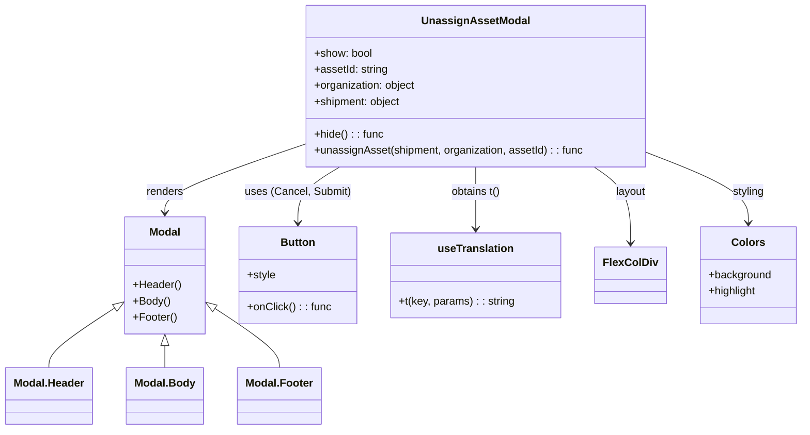

# Diagram: web/portal/src/modules/shipment-detail/UnassignAssetModal.js


> Auto-generated by Obscura crawlers

## Diagram 1



### SVG

<svg id="container" width="1166.80078125" xmlns="http://www.w3.org/2000/svg" class="classDiagram" height="638" viewBox="0 0 1166.80078125 638" role="graphics-document document" aria-roledescription="class"><style>#container{font-family:"trebuchet ms",verdana,arial,sans-serif;font-size:16px;fill:#333;}@keyframes edge-animation-frame{from{stroke-dashoffset:0;}}@keyframes dash{to{stroke-dashoffset:0;}}#container .edge-animation-slow{stroke-dasharray:9,5!important;stroke-dashoffset:900;animation:dash 50s linear infinite;stroke-linecap:round;}#container .edge-animation-fast{stroke-dasharray:9,5!important;stroke-dashoffset:900;animation:dash 20s linear infinite;stroke-linecap:round;}#container .error-icon{fill:#552222;}#container .error-text{fill:#552222;stroke:#552222;}#container .edge-thickness-normal{stroke-width:1px;}#container .edge-thickness-thick{stroke-width:3.5px;}#container .edge-pattern-solid{stroke-dasharray:0;}#container .edge-thickness-invisible{stroke-width:0;fill:none;}#container .edge-pattern-dashed{stroke-dasharray:3;}#container .edge-pattern-dotted{stroke-dasharray:2;}#container .marker{fill:#333333;stroke:#333333;}#container .marker.cross{stroke:#333333;}#container svg{font-family:"trebuchet ms",verdana,arial,sans-serif;font-size:16px;}#container p{margin:0;}#container g.classGroup text{fill:#9370DB;stroke:none;font-family:"trebuchet ms",verdana,arial,sans-serif;font-size:10px;}#container g.classGroup text .title{font-weight:bolder;}#container .nodeLabel,#container .edgeLabel{color:#131300;}#container .edgeLabel .label rect{fill:#ECECFF;}#container .label text{fill:#131300;}#container .labelBkg{background:#ECECFF;}#container .edgeLabel .label span{background:#ECECFF;}#container .classTitle{font-weight:bolder;}#container .node rect,#container .node circle,#container .node ellipse,#container .node polygon,#container .node path{fill:#ECECFF;stroke:#9370DB;stroke-width:1px;}#container .divider{stroke:#9370DB;stroke-width:1;}#container g.clickable{cursor:pointer;}#container g.classGroup rect{fill:#ECECFF;stroke:#9370DB;}#container g.classGroup line{stroke:#9370DB;stroke-width:1;}#container .classLabel .box{stroke:none;stroke-width:0;fill:#ECECFF;opacity:0.5;}#container .classLabel .label{fill:#9370DB;font-size:10px;}#container .relation{stroke:#333333;stroke-width:1;fill:none;}#container .dashed-line{stroke-dasharray:3;}#container .dotted-line{stroke-dasharray:1 2;}#container #compositionStart,#container .composition{fill:#333333!important;stroke:#333333!important;stroke-width:1;}#container #compositionEnd,#container .composition{fill:#333333!important;stroke:#333333!important;stroke-width:1;}#container #dependencyStart,#container .dependency{fill:#333333!important;stroke:#333333!important;stroke-width:1;}#container #dependencyStart,#container .dependency{fill:#333333!important;stroke:#333333!important;stroke-width:1;}#container #extensionStart,#container .extension{fill:transparent!important;stroke:#333333!important;stroke-width:1;}#container #extensionEnd,#container .extension{fill:transparent!important;stroke:#333333!important;stroke-width:1;}#container #aggregationStart,#container .aggregation{fill:transparent!important;stroke:#333333!important;stroke-width:1;}#container #aggregationEnd,#container .aggregation{fill:transparent!important;stroke:#333333!important;stroke-width:1;}#container #lollipopStart,#container .lollipop{fill:#ECECFF!important;stroke:#333333!important;stroke-width:1;}#container #lollipopEnd,#container .lollipop{fill:#ECECFF!important;stroke:#333333!important;stroke-width:1;}#container .edgeTerminals{font-size:11px;line-height:initial;}#container .classTitleText{text-anchor:middle;font-size:18px;fill:#333;}#container .label-icon{display:inline-block;height:1em;overflow:visible;vertical-align:-0.125em;}#container .node .label-icon path{fill:currentColor;stroke:revert;stroke-width:revert;}#container :root{--mermaid-font-family:"trebuchet ms",verdana,arial,sans-serif;}</style><g><defs><marker id="container_class-aggregationStart" class="marker aggregation class" refX="18" refY="7" markerWidth="190" markerHeight="240" orient="auto"><path d="M 18,7 L9,13 L1,7 L9,1 Z"></path></marker></defs><defs><marker id="container_class-aggregationEnd" class="marker aggregation class" refX="1" refY="7" markerWidth="20" markerHeight="28" orient="auto"><path d="M 18,7 L9,13 L1,7 L9,1 Z"></path></marker></defs><defs><marker id="container_class-extensionStart" class="marker extension class" refX="18" refY="7" markerWidth="190" markerHeight="240" orient="auto"><path d="M 1,7 L18,13 V 1 Z"></path></marker></defs><defs><marker id="container_class-extensionEnd" class="marker extension class" refX="1" refY="7" markerWidth="20" markerHeight="28" orient="auto"><path d="M 1,1 V 13 L18,7 Z"></path></marker></defs><defs><marker id="container_class-compositionStart" class="marker composition class" refX="18" refY="7" markerWidth="190" markerHeight="240" orient="auto"><path d="M 18,7 L9,13 L1,7 L9,1 Z"></path></marker></defs><defs><marker id="container_class-compositionEnd" class="marker composition class" refX="1" refY="7" markerWidth="20" markerHeight="28" orient="auto"><path d="M 18,7 L9,13 L1,7 L9,1 Z"></path></marker></defs><defs><marker id="container_class-dependencyStart" class="marker dependency class" refX="6" refY="7" markerWidth="190" markerHeight="240" orient="auto"><path d="M 5,7 L9,13 L1,7 L9,1 Z"></path></marker></defs><defs><marker id="container_class-dependencyEnd" class="marker dependency class" refX="13" refY="7" markerWidth="20" markerHeight="28" orient="auto"><path d="M 18,7 L9,13 L14,7 L9,1 Z"></path></marker></defs><defs><marker id="container_class-lollipopStart" class="marker lollipop class" refX="13" refY="7" markerWidth="190" markerHeight="240" orient="auto"><circle stroke="black" fill="transparent" cx="7" cy="7" r="6"></circle></marker></defs><defs><marker id="container_class-lollipopEnd" class="marker lollipop class" refX="1" refY="7" markerWidth="190" markerHeight="240" orient="auto"><circle stroke="black" fill="transparent" cx="7" cy="7" r="6"></circle></marker></defs><g class="root"><g class="clusters"></g><g class="edgePaths"><path d="M444.359,214.128L410.095,225.94C375.831,237.752,307.302,261.376,273.038,278.355C238.773,295.333,238.773,305.667,238.773,310.833L238.773,316" id="id_UnassignAssetModal_Modal_1" class="edge-thickness-normal edge-pattern-solid relation" style=";;;" data-edge="true" data-et="edge" data-id="id_UnassignAssetModal_Modal_1" data-points="W3sieCI6NDQ0LjM1OTM3NSwieSI6MjE0LjEyODQ4NDQzMjYyNzE1fSx7IngiOjIzOC43NzM0Mzc1LCJ5IjoyODV9LHsieCI6MjM4Ljc3MzQzNzUsInkiOjMyMn1d" marker-end="url(#container_class-dependencyEnd)"></path><path d="M494.868,248L484.624,254.167C474.381,260.333,453.893,272.667,443.65,286.5C433.406,300.333,433.406,315.667,433.406,323.333L433.406,331" id="id_UnassignAssetModal_Button_2" class="edge-thickness-normal edge-pattern-solid relation" style=";;;" data-edge="true" data-et="edge" data-id="id_UnassignAssetModal_Button_2" data-points="W3sieCI6NDk0Ljg2NzkzMzkxNzE5NzQzLCJ5IjoyNDh9LHsieCI6NDMzLjQwNjI1LCJ5IjoyODV9LHsieCI6NDMzLjQwNjI1LCJ5IjozMzd9XQ==" marker-end="url(#container_class-dependencyEnd)"></path><path d="M694.203,248L694.203,254.167C694.203,260.333,694.203,272.667,694.203,288C694.203,303.333,694.203,321.667,694.203,330.833L694.203,340" id="id_UnassignAssetModal_useTranslation_3" class="edge-thickness-normal edge-pattern-solid relation" style=";;;" data-edge="true" data-et="edge" data-id="id_UnassignAssetModal_useTranslation_3" data-points="W3sieCI6Njk0LjIwMzEyNSwieSI6MjQ4fSx7IngiOjY5NC4yMDMxMjUsInkiOjI4NX0seyJ4Ijo2OTQuMjAzMTI1LCJ5IjozNDZ9XQ==" marker-end="url(#container_class-dependencyEnd)"></path><path d="M865.787,248L874.604,254.167C883.421,260.333,901.056,272.667,909.874,291.5C918.691,310.333,918.691,335.667,918.691,348.333L918.691,361" id="id_UnassignAssetModal_FlexColDiv_4" class="edge-thickness-normal edge-pattern-solid relation" style=";;;" data-edge="true" data-et="edge" data-id="id_UnassignAssetModal_FlexColDiv_4" data-points="W3sieCI6ODY1Ljc4NjUyNDY4MTUyODcsInkiOjI0OH0seyJ4Ijo5MTguNjkxNDA2MjUsInkiOjI4NX0seyJ4Ijo5MTguNjkxNDA2MjUsInkiOjM2N31d" marker-end="url(#container_class-dependencyEnd)"></path><path d="M944.047,227.468L968.132,237.057C992.216,246.646,1040.385,265.823,1064.47,283.078C1088.555,300.333,1088.555,315.667,1088.555,323.333L1088.555,331" id="id_UnassignAssetModal_Colors_5" class="edge-thickness-normal edge-pattern-solid relation" style=";;;" data-edge="true" data-et="edge" data-id="id_UnassignAssetModal_Colors_5" data-points="W3sieCI6OTQ0LjA0Njg3NSwieSI6MjI3LjQ2ODI3MjY3ODY0NTcyfSx7IngiOjEwODguNTU0Njg3NSwieSI6Mjg1fSx7IngiOjEwODguNTU0Njg3NSwieSI6MzM3fV0=" marker-end="url(#container_class-dependencyEnd)"></path><path d="M165.717,457.741L149.914,468.284C134.111,478.827,102.505,499.914,86.702,514.623C70.898,529.333,70.898,537.667,70.898,541.833L70.898,546" id="id_Modal_Modal.Header_6" class="edge-thickness-normal edge-pattern-solid relation" style=";;;" data-edge="true" data-et="edge" data-id="id_Modal_Modal.Header_6" data-points="W3sieCI6MTgwLjA2NjQwNjI1LCJ5Ijo0NDguMTY3MTYzMDY3NzU4NzR9LHsieCI6NzAuODk4NDM3NSwieSI6NTIxfSx7IngiOjcwLjg5ODQzNzUsInkiOjU0Nn1d" marker-start="url(#container_class-extensionStart)"></path><path d="M238.773,513.25L238.773,514.542C238.773,515.833,238.773,518.417,238.773,523.875C238.773,529.333,238.773,537.667,238.773,541.833L238.773,546" id="id_Modal_Modal.Body_7" class="edge-thickness-normal edge-pattern-solid relation" style=";;;" data-edge="true" data-et="edge" data-id="id_Modal_Modal.Body_7" data-points="W3sieCI6MjM4Ljc3MzQzNzUsInkiOjQ5Nn0seyJ4IjoyMzguNzczNDM3NSwieSI6NTIxfSx7IngiOjIzOC43NzM0Mzc1LCJ5Ijo1NDZ9XQ==" marker-start="url(#container_class-extensionStart)"></path><path d="M311.751,458.557L327.076,468.965C342.402,479.372,373.052,500.186,388.378,514.76C403.703,529.333,403.703,537.667,403.703,541.833L403.703,546" id="id_Modal_Modal.Footer_8" class="edge-thickness-normal edge-pattern-solid relation" style=";;;" data-edge="true" data-et="edge" data-id="id_Modal_Modal.Footer_8" data-points="W3sieCI6Mjk3LjQ4MDQ2ODc1LCJ5Ijo0NDguODY2NjA5ODI0MjYyMjR9LHsieCI6NDAzLjcwMzEyNSwieSI6NTIxfSx7IngiOjQwMy43MDMxMjUsInkiOjU0Nn1d" marker-start="url(#container_class-extensionStart)"></path></g><g class="edgeLabels"><g class="edgeLabel" transform="translate(238.7734375, 285)"><g class="label" data-id="id_UnassignAssetModal_Modal_1" transform="translate(-27.75, -12)"><foreignObject width="55.5" height="24"><div xmlns="http://www.w3.org/1999/xhtml" class="labelBkg" style="display: table-cell; white-space: nowrap; line-height: 1.5; max-width: 200px; text-align: center;"><span class="edgeLabel"><p>renders</p></span></div></foreignObject></g></g><g class="edgeLabel" transform="translate(433.40625, 285)"><g class="label" data-id="id_UnassignAssetModal_Button_2" transform="translate(-77.4453125, -12)"><foreignObject width="154.890625" height="24"><div xmlns="http://www.w3.org/1999/xhtml" class="labelBkg" style="display: table-cell; white-space: nowrap; line-height: 1.5; max-width: 200px; text-align: center;"><span class="edgeLabel"><p>uses (Cancel, Submit)</p></span></div></foreignObject></g></g><g class="edgeLabel" transform="translate(694.203125, 285)"><g class="label" data-id="id_UnassignAssetModal_useTranslation_3" transform="translate(-37.484375, -12)"><foreignObject width="74.96875" height="24"><div xmlns="http://www.w3.org/1999/xhtml" class="labelBkg" style="display: table-cell; white-space: nowrap; line-height: 1.5; max-width: 200px; text-align: center;"><span class="edgeLabel"><p>obtains t()</p></span></div></foreignObject></g></g><g class="edgeLabel" transform="translate(918.69140625, 285)"><g class="label" data-id="id_UnassignAssetModal_FlexColDiv_4" transform="translate(-22.65625, -12)"><foreignObject width="45.3125" height="24"><div xmlns="http://www.w3.org/1999/xhtml" class="labelBkg" style="display: table-cell; white-space: nowrap; line-height: 1.5; max-width: 200px; text-align: center;"><span class="edgeLabel"><p>layout</p></span></div></foreignObject></g></g><g class="edgeLabel" transform="translate(1088.5546875, 285)"><g class="label" data-id="id_UnassignAssetModal_Colors_5" transform="translate(-23.96875, -12)"><foreignObject width="47.9375" height="24"><div xmlns="http://www.w3.org/1999/xhtml" class="labelBkg" style="display: table-cell; white-space: nowrap; line-height: 1.5; max-width: 200px; text-align: center;"><span class="edgeLabel"><p>styling</p></span></div></foreignObject></g></g><g class="edgeLabel"><g class="label" data-id="id_Modal_Modal.Header_6" transform="translate(0, 0)"><foreignObject width="0" height="0"><div xmlns="http://www.w3.org/1999/xhtml" class="labelBkg" style="display: table-cell; white-space: nowrap; line-height: 1.5; max-width: 200px; text-align: center;"><span class="edgeLabel"></span></div></foreignObject></g></g><g class="edgeLabel"><g class="label" data-id="id_Modal_Modal.Body_7" transform="translate(0, 0)"><foreignObject width="0" height="0"><div xmlns="http://www.w3.org/1999/xhtml" class="labelBkg" style="display: table-cell; white-space: nowrap; line-height: 1.5; max-width: 200px; text-align: center;"><span class="edgeLabel"></span></div></foreignObject></g></g><g class="edgeLabel"><g class="label" data-id="id_Modal_Modal.Footer_8" transform="translate(0, 0)"><foreignObject width="0" height="0"><div xmlns="http://www.w3.org/1999/xhtml" class="labelBkg" style="display: table-cell; white-space: nowrap; line-height: 1.5; max-width: 200px; text-align: center;"><span class="edgeLabel"></span></div></foreignObject></g></g></g><g class="nodes"><g class="node default" id="classId-UnassignAssetModal-0" transform="translate(694.203125, 128)"><g class="basic label-container"><path d="M-249.84375 -120 L249.84375 -120 L249.84375 120 L-249.84375 120" stroke="none" stroke-width="0" fill="#ECECFF" style=""></path><path d="M-249.84375 -120 C-82.09927755164517 -120, 85.64519489670965 -120, 249.84375 -120 M-249.84375 -120 C-118.93806605017178 -120, 11.967617899656432 -120, 249.84375 -120 M249.84375 -120 C249.84375 -53.11289344307272, 249.84375 13.774213113854557, 249.84375 120 M249.84375 -120 C249.84375 -53.39007372583437, 249.84375 13.21985254833126, 249.84375 120 M249.84375 120 C88.61566987279619 120, -72.61241025440762 120, -249.84375 120 M249.84375 120 C63.08257869383334 120, -123.67859261233332 120, -249.84375 120 M-249.84375 120 C-249.84375 37.48692230538741, -249.84375 -45.02615538922518, -249.84375 -120 M-249.84375 120 C-249.84375 52.22198758058646, -249.84375 -15.556024838827085, -249.84375 -120" stroke="#9370DB" stroke-width="1.3" fill="none" stroke-dasharray="0 0" style=""></path></g><g class="annotation-group text" transform="translate(0, -96)"></g><g class="label-group text" transform="translate(-75.421875, -96)"><g class="label" style="font-weight: bolder" transform="translate(0,-12)"><foreignObject width="150.84375" height="24"><div xmlns="http://www.w3.org/1999/xhtml" style="display: table-cell; white-space: nowrap; line-height: 1.5; max-width: 199px; text-align: center;"><span class="nodeLabel markdown-node-label" style=""><p>UnassignAssetModal</p></span></div></foreignObject></g></g><g class="members-group text" transform="translate(-237.84375, -48)"><g class="label" style="" transform="translate(0,-12)"><foreignObject width="86.6875" height="24"><div xmlns="http://www.w3.org/1999/xhtml" style="display: table-cell; white-space: nowrap; line-height: 1.5; max-width: 144px; text-align: center;"><span class="nodeLabel markdown-node-label" style=""><p>+show: bool</p></span></div></foreignObject></g><g class="label" style="" transform="translate(0,12)"><foreignObject width="109.578125" height="24"><div xmlns="http://www.w3.org/1999/xhtml" style="display: table-cell; white-space: nowrap; line-height: 1.5; max-width: 168px; text-align: center;"><span class="nodeLabel markdown-node-label" style=""><p>+assetId: string</p></span></div></foreignObject></g><g class="label" style="" transform="translate(0,36)"><foreignObject width="151.890625" height="24"><div xmlns="http://www.w3.org/1999/xhtml" style="display: table-cell; white-space: nowrap; line-height: 1.5; max-width: 209px; text-align: center;"><span class="nodeLabel markdown-node-label" style=""><p>+organization: object</p></span></div></foreignObject></g><g class="label" style="" transform="translate(0,60)"><foreignObject width="130.0625" height="24"><div xmlns="http://www.w3.org/1999/xhtml" style="display: table-cell; white-space: nowrap; line-height: 1.5; max-width: 188px; text-align: center;"><span class="nodeLabel markdown-node-label" style=""><p>+shipment: object</p></span></div></foreignObject></g></g><g class="methods-group text" transform="translate(-237.84375, 72)"><g class="label" style="" transform="translate(0,-12)"><foreignObject width="102.625" height="24"><div xmlns="http://www.w3.org/1999/xhtml" style="display: table-cell; white-space: nowrap; line-height: 1.5; max-width: 160px; text-align: center;"><span class="nodeLabel markdown-node-label" style=""><p>+hide() : : func</p></span></div></foreignObject></g><g class="label" style="" transform="translate(0,12)"><foreignObject width="400.265625" height="24"><div xmlns="http://www.w3.org/1999/xhtml" style="display: table-cell; white-space: nowrap; line-height: 1.5; max-width: 458px; text-align: center;"><span class="nodeLabel markdown-node-label" style=""><p>+unassignAsset(shipment, organization, assetId) : : func</p></span></div></foreignObject></g></g><g class="divider" style=""><path d="M-249.84375 -72 C-67.47541158055199 -72, 114.89292683889602 -72, 249.84375 -72 M-249.84375 -72 C-108.12536987041852 -72, 33.59301025916295 -72, 249.84375 -72" stroke="#9370DB" stroke-width="1.3" fill="none" stroke-dasharray="0 0" style=""></path></g><g class="divider" style=""><path d="M-249.84375 48 C-56.70390610975039 48, 136.43593778049922 48, 249.84375 48 M-249.84375 48 C-136.8058591274908 48, -23.767968254981582 48, 249.84375 48" stroke="#9370DB" stroke-width="1.3" fill="none" stroke-dasharray="0 0" style=""></path></g></g><g class="node default" id="classId-Modal-1" transform="translate(238.7734375, 409)"><g class="basic label-container"><path d="M-58.70703125 -87 L58.70703125 -87 L58.70703125 87 L-58.70703125 87" stroke="none" stroke-width="0" fill="#ECECFF" style=""></path><path d="M-58.70703125 -87 C-30.81582344044924 -87, -2.9246156308984794 -87, 58.70703125 -87 M-58.70703125 -87 C-17.127458183948463 -87, 24.452114882103075 -87, 58.70703125 -87 M58.70703125 -87 C58.70703125 -19.86057499516727, 58.70703125 47.27885000966546, 58.70703125 87 M58.70703125 -87 C58.70703125 -30.06195880668325, 58.70703125 26.8760823866335, 58.70703125 87 M58.70703125 87 C27.260075162564284 87, -4.186880924871431 87, -58.70703125 87 M58.70703125 87 C26.3490531138791 87, -6.008925022241797 87, -58.70703125 87 M-58.70703125 87 C-58.70703125 20.493864910505835, -58.70703125 -46.01227017898833, -58.70703125 -87 M-58.70703125 87 C-58.70703125 29.243091717452273, -58.70703125 -28.513816565095453, -58.70703125 -87" stroke="#9370DB" stroke-width="1.3" fill="none" stroke-dasharray="0 0" style=""></path></g><g class="annotation-group text" transform="translate(0, -63)"></g><g class="label-group text" transform="translate(-22.4453125, -63)"><g class="label" style="font-weight: bolder" transform="translate(0,-12)"><foreignObject width="44.890625" height="24"><div xmlns="http://www.w3.org/1999/xhtml" style="display: table-cell; white-space: nowrap; line-height: 1.5; max-width: 95px; text-align: center;"><span class="nodeLabel markdown-node-label" style=""><p>Modal</p></span></div></foreignObject></g></g><g class="members-group text" transform="translate(-46.70703125, -15)"></g><g class="methods-group text" transform="translate(-46.70703125, 15)"><g class="label" style="" transform="translate(0,-12)"><foreignObject width="70.96875" height="24"><div xmlns="http://www.w3.org/1999/xhtml" style="display: table-cell; white-space: nowrap; line-height: 1.5; max-width: 128px; text-align: center;"><span class="nodeLabel markdown-node-label" style=""><p>+Header()</p></span></div></foreignObject></g><g class="label" style="" transform="translate(0,12)"><foreignObject width="54.875" height="24"><div xmlns="http://www.w3.org/1999/xhtml" style="display: table-cell; white-space: nowrap; line-height: 1.5; max-width: 112px; text-align: center;"><span class="nodeLabel markdown-node-label" style=""><p>+Body()</p></span></div></foreignObject></g><g class="label" style="" transform="translate(0,36)"><foreignObject width="64.78125" height="24"><div xmlns="http://www.w3.org/1999/xhtml" style="display: table-cell; white-space: nowrap; line-height: 1.5; max-width: 122px; text-align: center;"><span class="nodeLabel markdown-node-label" style=""><p>+Footer()</p></span></div></foreignObject></g></g><g class="divider" style=""><path d="M-58.70703125 -39 C-13.378662673161458 -39, 31.949705903677085 -39, 58.70703125 -39 M-58.70703125 -39 C-29.96093529624283 -39, -1.2148393424856607 -39, 58.70703125 -39" stroke="#9370DB" stroke-width="1.3" fill="none" stroke-dasharray="0 0" style=""></path></g><g class="divider" style=""><path d="M-58.70703125 -15 C-18.605984282346768 -15, 21.495062685306465 -15, 58.70703125 -15 M-58.70703125 -15 C-29.533208840991566 -15, -0.3593864319831326 -15, 58.70703125 -15" stroke="#9370DB" stroke-width="1.3" fill="none" stroke-dasharray="0 0" style=""></path></g></g><g class="node default" id="classId-Button-2" transform="translate(433.40625, 409)"><g class="basic label-container"><path d="M-85.92578125 -72 L85.92578125 -72 L85.92578125 72 L-85.92578125 72" stroke="none" stroke-width="0" fill="#ECECFF" style=""></path><path d="M-85.92578125 -72 C-44.95223174450907 -72, -3.9786822390181413 -72, 85.92578125 -72 M-85.92578125 -72 C-26.266755288147074 -72, 33.39227067370585 -72, 85.92578125 -72 M85.92578125 -72 C85.92578125 -19.20387216880978, 85.92578125 33.59225566238044, 85.92578125 72 M85.92578125 -72 C85.92578125 -26.363421679959053, 85.92578125 19.273156640081893, 85.92578125 72 M85.92578125 72 C34.02900011863166 72, -17.867781012736685 72, -85.92578125 72 M85.92578125 72 C48.73473033831264 72, 11.543679426625275 72, -85.92578125 72 M-85.92578125 72 C-85.92578125 31.50929969741827, -85.92578125 -8.981400605163458, -85.92578125 -72 M-85.92578125 72 C-85.92578125 42.412928035467914, -85.92578125 12.825856070935835, -85.92578125 -72" stroke="#9370DB" stroke-width="1.3" fill="none" stroke-dasharray="0 0" style=""></path></g><g class="annotation-group text" transform="translate(0, -48)"></g><g class="label-group text" transform="translate(-24.8359375, -48)"><g class="label" style="font-weight: bolder" transform="translate(0,-12)"><foreignObject width="49.671875" height="24"><div xmlns="http://www.w3.org/1999/xhtml" style="display: table-cell; white-space: nowrap; line-height: 1.5; max-width: 99px; text-align: center;"><span class="nodeLabel markdown-node-label" style=""><p>Button</p></span></div></foreignObject></g></g><g class="members-group text" transform="translate(-73.92578125, 0)"><g class="label" style="" transform="translate(0,-12)"><foreignObject width="42.359375" height="24"><div xmlns="http://www.w3.org/1999/xhtml" style="display: table-cell; white-space: nowrap; line-height: 1.5; max-width: 100px; text-align: center;"><span class="nodeLabel markdown-node-label" style=""><p>+style</p></span></div></foreignObject></g></g><g class="methods-group text" transform="translate(-73.92578125, 48)"><g class="label" style="" transform="translate(0,-12)"><foreignObject width="123.015625" height="24"><div xmlns="http://www.w3.org/1999/xhtml" style="display: table-cell; white-space: nowrap; line-height: 1.5; max-width: 181px; text-align: center;"><span class="nodeLabel markdown-node-label" style=""><p>+onClick() : : func</p></span></div></foreignObject></g></g><g class="divider" style=""><path d="M-85.92578125 -24 C-35.70909877544063 -24, 14.50758369911874 -24, 85.92578125 -24 M-85.92578125 -24 C-19.545620158488532 -24, 46.834540933022936 -24, 85.92578125 -24" stroke="#9370DB" stroke-width="1.3" fill="none" stroke-dasharray="0 0" style=""></path></g><g class="divider" style=""><path d="M-85.92578125 24 C-44.520674902152216 24, -3.1155685543044314 24, 85.92578125 24 M-85.92578125 24 C-21.436325414745085 24, 43.05313042050983 24, 85.92578125 24" stroke="#9370DB" stroke-width="1.3" fill="none" stroke-dasharray="0 0" style=""></path></g></g><g class="node default" id="classId-useTranslation-3" transform="translate(694.203125, 409)"><g class="basic label-container"><path d="M-124.87109375 -63 L124.87109375 -63 L124.87109375 63 L-124.87109375 63" stroke="none" stroke-width="0" fill="#ECECFF" style=""></path><path d="M-124.87109375 -63 C-34.22139375408548 -63, 56.428306241829034 -63, 124.87109375 -63 M-124.87109375 -63 C-71.9612713297644 -63, -19.051448909528787 -63, 124.87109375 -63 M124.87109375 -63 C124.87109375 -31.552826425113178, 124.87109375 -0.10565285022635607, 124.87109375 63 M124.87109375 -63 C124.87109375 -19.94071258005031, 124.87109375 23.11857483989938, 124.87109375 63 M124.87109375 63 C55.59092282897909 63, -13.689248092041822 63, -124.87109375 63 M124.87109375 63 C52.39980915039396 63, -20.071475449212073 63, -124.87109375 63 M-124.87109375 63 C-124.87109375 20.76490951004149, -124.87109375 -21.470180979917018, -124.87109375 -63 M-124.87109375 63 C-124.87109375 17.647075919113135, -124.87109375 -27.70584816177373, -124.87109375 -63" stroke="#9370DB" stroke-width="1.3" fill="none" stroke-dasharray="0 0" style=""></path></g><g class="annotation-group text" transform="translate(0, -39)"></g><g class="label-group text" transform="translate(-54.0859375, -39)"><g class="label" style="font-weight: bolder" transform="translate(0,-12)"><foreignObject width="108.171875" height="24"><div xmlns="http://www.w3.org/1999/xhtml" style="display: table-cell; white-space: nowrap; line-height: 1.5; max-width: 157px; text-align: center;"><span class="nodeLabel markdown-node-label" style=""><p>useTranslation</p></span></div></foreignObject></g></g><g class="members-group text" transform="translate(-112.87109375, 9)"></g><g class="methods-group text" transform="translate(-112.87109375, 39)"><g class="label" style="" transform="translate(0,-12)"><foreignObject width="171.65625" height="24"><div xmlns="http://www.w3.org/1999/xhtml" style="display: table-cell; white-space: nowrap; line-height: 1.5; max-width: 230px; text-align: center;"><span class="nodeLabel markdown-node-label" style=""><p>+t(key, params) : : string</p></span></div></foreignObject></g></g><g class="divider" style=""><path d="M-124.87109375 -15 C-43.64675447246388 -15, 37.577584805072235 -15, 124.87109375 -15 M-124.87109375 -15 C-43.819453355975725 -15, 37.23218703804855 -15, 124.87109375 -15" stroke="#9370DB" stroke-width="1.3" fill="none" stroke-dasharray="0 0" style=""></path></g><g class="divider" style=""><path d="M-124.87109375 9 C-44.95303331054386 9, 34.96502712891228 9, 124.87109375 9 M-124.87109375 9 C-44.49418441036903 9, 35.88272492926194 9, 124.87109375 9" stroke="#9370DB" stroke-width="1.3" fill="none" stroke-dasharray="0 0" style=""></path></g></g><g class="node default" id="classId-FlexColDiv-4" transform="translate(918.69140625, 409)"><g class="basic label-container"><path d="M-49.6171875 -42 L49.6171875 -42 L49.6171875 42 L-49.6171875 42" stroke="none" stroke-width="0" fill="#ECECFF" style=""></path><path d="M-49.6171875 -42 C-11.350706338786829 -42, 26.915774822426343 -42, 49.6171875 -42 M-49.6171875 -42 C-26.000710128575957 -42, -2.3842327571519135 -42, 49.6171875 -42 M49.6171875 -42 C49.6171875 -24.218937158429426, 49.6171875 -6.437874316858853, 49.6171875 42 M49.6171875 -42 C49.6171875 -24.8514109621696, 49.6171875 -7.702821924339197, 49.6171875 42 M49.6171875 42 C18.25817793446283 42, -13.100831631074342 42, -49.6171875 42 M49.6171875 42 C29.748511715806714 42, 9.879835931613428 42, -49.6171875 42 M-49.6171875 42 C-49.6171875 9.621807794041935, -49.6171875 -22.75638441191613, -49.6171875 -42 M-49.6171875 42 C-49.6171875 11.953124833188664, -49.6171875 -18.093750333622673, -49.6171875 -42" stroke="#9370DB" stroke-width="1.3" fill="none" stroke-dasharray="0 0" style=""></path></g><g class="annotation-group text" transform="translate(0, -18)"></g><g class="label-group text" transform="translate(-37.6171875, -18)"><g class="label" style="font-weight: bolder" transform="translate(0,-12)"><foreignObject width="75.234375" height="24"><div xmlns="http://www.w3.org/1999/xhtml" style="display: table-cell; white-space: nowrap; line-height: 1.5; max-width: 124px; text-align: center;"><span class="nodeLabel markdown-node-label" style=""><p>FlexColDiv</p></span></div></foreignObject></g></g><g class="members-group text" transform="translate(-37.6171875, 30)"></g><g class="methods-group text" transform="translate(-37.6171875, 60)"></g><g class="divider" style=""><path d="M-49.6171875 6 C-20.758758282030048 6, 8.099670935939905 6, 49.6171875 6 M-49.6171875 6 C-20.877021601913153 6, 7.863144296173694 6, 49.6171875 6" stroke="#9370DB" stroke-width="1.3" fill="none" stroke-dasharray="0 0" style=""></path></g><g class="divider" style=""><path d="M-49.6171875 24 C-18.764618568599857 24, 12.087950362800285 24, 49.6171875 24 M-49.6171875 24 C-29.158333756438243 24, -8.699480012876485 24, 49.6171875 24" stroke="#9370DB" stroke-width="1.3" fill="none" stroke-dasharray="0 0" style=""></path></g></g><g class="node default" id="classId-Colors-5" transform="translate(1088.5546875, 409)"><g class="basic label-container"><path d="M-70.24609375 -72 L70.24609375 -72 L70.24609375 72 L-70.24609375 72" stroke="none" stroke-width="0" fill="#ECECFF" style=""></path><path d="M-70.24609375 -72 C-38.76420105307679 -72, -7.282308356153578 -72, 70.24609375 -72 M-70.24609375 -72 C-24.142776153390678 -72, 21.960541443218645 -72, 70.24609375 -72 M70.24609375 -72 C70.24609375 -26.950336165556166, 70.24609375 18.099327668887668, 70.24609375 72 M70.24609375 -72 C70.24609375 -20.804788371666227, 70.24609375 30.390423256667546, 70.24609375 72 M70.24609375 72 C19.271021438342935 72, -31.70405087331413 72, -70.24609375 72 M70.24609375 72 C20.186683894431262 72, -29.872725961137476 72, -70.24609375 72 M-70.24609375 72 C-70.24609375 15.536221363162511, -70.24609375 -40.92755727367498, -70.24609375 -72 M-70.24609375 72 C-70.24609375 33.07365713242263, -70.24609375 -5.852685735154736, -70.24609375 -72" stroke="#9370DB" stroke-width="1.3" fill="none" stroke-dasharray="0 0" style=""></path></g><g class="annotation-group text" transform="translate(0, -48)"></g><g class="label-group text" transform="translate(-23.1015625, -48)"><g class="label" style="font-weight: bolder" transform="translate(0,-12)"><foreignObject width="46.203125" height="24"><div xmlns="http://www.w3.org/1999/xhtml" style="display: table-cell; white-space: nowrap; line-height: 1.5; max-width: 95px; text-align: center;"><span class="nodeLabel markdown-node-label" style=""><p>Colors</p></span></div></foreignObject></g></g><g class="members-group text" transform="translate(-58.24609375, 0)"><g class="label" style="" transform="translate(0,-12)"><foreignObject width="93.390625" height="24"><div xmlns="http://www.w3.org/1999/xhtml" style="display: table-cell; white-space: nowrap; line-height: 1.5; max-width: 151px; text-align: center;"><span class="nodeLabel markdown-node-label" style=""><p>+background</p></span></div></foreignObject></g><g class="label" style="" transform="translate(0,12)"><foreignObject width="72.25" height="24"><div xmlns="http://www.w3.org/1999/xhtml" style="display: table-cell; white-space: nowrap; line-height: 1.5; max-width: 130px; text-align: center;"><span class="nodeLabel markdown-node-label" style=""><p>+highlight</p></span></div></foreignObject></g></g><g class="methods-group text" transform="translate(-58.24609375, 72)"></g><g class="divider" style=""><path d="M-70.24609375 -24 C-28.298734800546285 -24, 13.64862414890743 -24, 70.24609375 -24 M-70.24609375 -24 C-34.741536766484515 -24, 0.7630202170309701 -24, 70.24609375 -24" stroke="#9370DB" stroke-width="1.3" fill="none" stroke-dasharray="0 0" style=""></path></g><g class="divider" style=""><path d="M-70.24609375 48 C-15.313852917157902 48, 39.618387915684195 48, 70.24609375 48 M-70.24609375 48 C-40.561893462750774 48, -10.877693175501555 48, 70.24609375 48" stroke="#9370DB" stroke-width="1.3" fill="none" stroke-dasharray="0 0" style=""></path></g></g><g class="node default" id="classId-Modal.Header-6" transform="translate(70.8984375, 588)"><g class="basic label-container"><path d="M-62.8984375 -42 L62.8984375 -42 L62.8984375 42 L-62.8984375 42" stroke="none" stroke-width="0" fill="#ECECFF" style=""></path><path d="M-62.8984375 -42 C-26.642916211343305 -42, 9.61260507731339 -42, 62.8984375 -42 M-62.8984375 -42 C-25.637759139417902 -42, 11.622919221164196 -42, 62.8984375 -42 M62.8984375 -42 C62.8984375 -18.61235836927912, 62.8984375 4.775283261441757, 62.8984375 42 M62.8984375 -42 C62.8984375 -8.86667722413587, 62.8984375 24.26664555172826, 62.8984375 42 M62.8984375 42 C28.28904920438439 42, -6.320339091231219 42, -62.8984375 42 M62.8984375 42 C18.605341179390543 42, -25.687755141218915 42, -62.8984375 42 M-62.8984375 42 C-62.8984375 21.390932409521376, -62.8984375 0.7818648190427524, -62.8984375 -42 M-62.8984375 42 C-62.8984375 12.142290151830007, -62.8984375 -17.715419696339985, -62.8984375 -42" stroke="#9370DB" stroke-width="1.3" fill="none" stroke-dasharray="0 0" style=""></path></g><g class="annotation-group text" transform="translate(0, -18)"></g><g class="label-group text" transform="translate(-50.8984375, -18)"><g class="label" style="font-weight: bolder" transform="translate(0,-12)"><foreignObject width="101.796875" height="24"><div xmlns="http://www.w3.org/1999/xhtml" style="display: table-cell; white-space: nowrap; line-height: 1.5; max-width: 152px; text-align: center;"><span class="nodeLabel markdown-node-label" style=""><p>Modal.Header</p></span></div></foreignObject></g></g><g class="members-group text" transform="translate(-50.8984375, 30)"></g><g class="methods-group text" transform="translate(-50.8984375, 60)"></g><g class="divider" style=""><path d="M-62.8984375 6 C-21.3568415561651 6, 20.1847543876698 6, 62.8984375 6 M-62.8984375 6 C-37.39580902219313 6, -11.893180544386254 6, 62.8984375 6" stroke="#9370DB" stroke-width="1.3" fill="none" stroke-dasharray="0 0" style=""></path></g><g class="divider" style=""><path d="M-62.8984375 24 C-31.51682151610881 24, -0.13520553221761844 24, 62.8984375 24 M-62.8984375 24 C-28.083622664958234 24, 6.731192170083531 24, 62.8984375 24" stroke="#9370DB" stroke-width="1.3" fill="none" stroke-dasharray="0 0" style=""></path></g></g><g class="node default" id="classId-Modal.Body-7" transform="translate(238.7734375, 588)"><g class="basic label-container"><path d="M-54.9765625 -42 L54.9765625 -42 L54.9765625 42 L-54.9765625 42" stroke="none" stroke-width="0" fill="#ECECFF" style=""></path><path d="M-54.9765625 -42 C-26.77087511512646 -42, 1.434812269747077 -42, 54.9765625 -42 M-54.9765625 -42 C-31.695345901647794 -42, -8.414129303295589 -42, 54.9765625 -42 M54.9765625 -42 C54.9765625 -17.539590487248553, 54.9765625 6.920819025502894, 54.9765625 42 M54.9765625 -42 C54.9765625 -19.3626182707254, 54.9765625 3.2747634585492023, 54.9765625 42 M54.9765625 42 C24.883268115046796 42, -5.2100262699064075 42, -54.9765625 42 M54.9765625 42 C26.118228780942268 42, -2.740104938115465 42, -54.9765625 42 M-54.9765625 42 C-54.9765625 24.249528669382514, -54.9765625 6.499057338765027, -54.9765625 -42 M-54.9765625 42 C-54.9765625 11.495938247208525, -54.9765625 -19.00812350558295, -54.9765625 -42" stroke="#9370DB" stroke-width="1.3" fill="none" stroke-dasharray="0 0" style=""></path></g><g class="annotation-group text" transform="translate(0, -18)"></g><g class="label-group text" transform="translate(-42.9765625, -18)"><g class="label" style="font-weight: bolder" transform="translate(0,-12)"><foreignObject width="85.953125" height="24"><div xmlns="http://www.w3.org/1999/xhtml" style="display: table-cell; white-space: nowrap; line-height: 1.5; max-width: 135px; text-align: center;"><span class="nodeLabel markdown-node-label" style=""><p>Modal.Body</p></span></div></foreignObject></g></g><g class="members-group text" transform="translate(-42.9765625, 30)"></g><g class="methods-group text" transform="translate(-42.9765625, 60)"></g><g class="divider" style=""><path d="M-54.9765625 6 C-17.635548300949026 6, 19.70546589810195 6, 54.9765625 6 M-54.9765625 6 C-23.56948302421153 6, 7.8375964515769425 6, 54.9765625 6" stroke="#9370DB" stroke-width="1.3" fill="none" stroke-dasharray="0 0" style=""></path></g><g class="divider" style=""><path d="M-54.9765625 24 C-17.227197167140034 24, 20.522168165719933 24, 54.9765625 24 M-54.9765625 24 C-11.929443198761952 24, 31.117676102476096 24, 54.9765625 24" stroke="#9370DB" stroke-width="1.3" fill="none" stroke-dasharray="0 0" style=""></path></g></g><g class="node default" id="classId-Modal.Footer-8" transform="translate(403.703125, 588)"><g class="basic label-container"><path d="M-59.953125 -42 L59.953125 -42 L59.953125 42 L-59.953125 42" stroke="none" stroke-width="0" fill="#ECECFF" style=""></path><path d="M-59.953125 -42 C-29.592230803224744 -42, 0.7686633935505114 -42, 59.953125 -42 M-59.953125 -42 C-14.655283096900781 -42, 30.642558806198437 -42, 59.953125 -42 M59.953125 -42 C59.953125 -17.02681046996549, 59.953125 7.94637906006902, 59.953125 42 M59.953125 -42 C59.953125 -21.414514814341302, 59.953125 -0.8290296286826049, 59.953125 42 M59.953125 42 C23.637972010386633 42, -12.677180979226733 42, -59.953125 42 M59.953125 42 C28.80378738419726 42, -2.345550231605479 42, -59.953125 42 M-59.953125 42 C-59.953125 15.822369773777755, -59.953125 -10.35526045244449, -59.953125 -42 M-59.953125 42 C-59.953125 24.311595716148215, -59.953125 6.62319143229643, -59.953125 -42" stroke="#9370DB" stroke-width="1.3" fill="none" stroke-dasharray="0 0" style=""></path></g><g class="annotation-group text" transform="translate(0, -18)"></g><g class="label-group text" transform="translate(-47.953125, -18)"><g class="label" style="font-weight: bolder" transform="translate(0,-12)"><foreignObject width="95.90625" height="24"><div xmlns="http://www.w3.org/1999/xhtml" style="display: table-cell; white-space: nowrap; line-height: 1.5; max-width: 146px; text-align: center;"><span class="nodeLabel markdown-node-label" style=""><p>Modal.Footer</p></span></div></foreignObject></g></g><g class="members-group text" transform="translate(-47.953125, 30)"></g><g class="methods-group text" transform="translate(-47.953125, 60)"></g><g class="divider" style=""><path d="M-59.953125 6 C-16.20608099649818 6, 27.54096300700364 6, 59.953125 6 M-59.953125 6 C-15.242677081075826 6, 29.46777083784835 6, 59.953125 6" stroke="#9370DB" stroke-width="1.3" fill="none" stroke-dasharray="0 0" style=""></path></g><g class="divider" style=""><path d="M-59.953125 24 C-14.453125163782254 24, 31.046874672435493 24, 59.953125 24 M-59.953125 24 C-16.972706202320225 24, 26.00771259535955 24, 59.953125 24" stroke="#9370DB" stroke-width="1.3" fill="none" stroke-dasharray="0 0" style=""></path></g></g></g></g></g></svg>

## Diagram 2

```mermaid
flowchart TD
  A[Parent shows component] --> B[UnassignAssetModal]
  B --> C{Modal}
  C --> D[Header: title = t("Unassign Asset")]
  C --> E[Body: message with assetId]
  C --> F[Footer: Buttons]
  F --> G[Cancel Button]
  F --> H[Submit Button]
  G --> I[hide()] 
  H --> J[unassignAsset(shipment, organization, assetId)]
  H --> I
  B --> K[useTranslation.t]
  B --> L[FlexColDiv layout]
  B --> M[Colors for styling]
```

> SVG rendering failed for this diagram.
