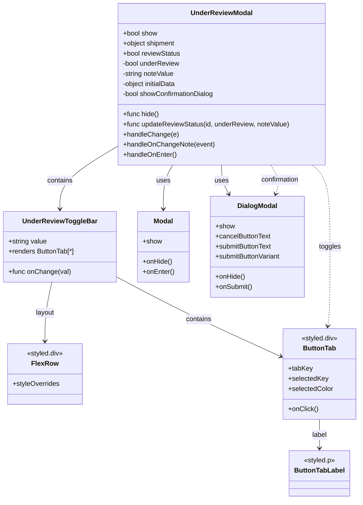

# Diagram: web/portal/src/modules/shipment-detail/UnderReviewModal.js


> Auto-generated by Obscura crawlers

## Diagram 1



### SVG

<svg id="container" width="858.06640625" xmlns="http://www.w3.org/2000/svg" class="classDiagram" height="1186" viewBox="0 0 858.06640625 1186" role="graphics-document document" aria-roledescription="class"><style>#container{font-family:"trebuchet ms",verdana,arial,sans-serif;font-size:16px;fill:#333;}@keyframes edge-animation-frame{from{stroke-dashoffset:0;}}@keyframes dash{to{stroke-dashoffset:0;}}#container .edge-animation-slow{stroke-dasharray:9,5!important;stroke-dashoffset:900;animation:dash 50s linear infinite;stroke-linecap:round;}#container .edge-animation-fast{stroke-dasharray:9,5!important;stroke-dashoffset:900;animation:dash 20s linear infinite;stroke-linecap:round;}#container .error-icon{fill:#552222;}#container .error-text{fill:#552222;stroke:#552222;}#container .edge-thickness-normal{stroke-width:1px;}#container .edge-thickness-thick{stroke-width:3.5px;}#container .edge-pattern-solid{stroke-dasharray:0;}#container .edge-thickness-invisible{stroke-width:0;fill:none;}#container .edge-pattern-dashed{stroke-dasharray:3;}#container .edge-pattern-dotted{stroke-dasharray:2;}#container .marker{fill:#333333;stroke:#333333;}#container .marker.cross{stroke:#333333;}#container svg{font-family:"trebuchet ms",verdana,arial,sans-serif;font-size:16px;}#container p{margin:0;}#container g.classGroup text{fill:#9370DB;stroke:none;font-family:"trebuchet ms",verdana,arial,sans-serif;font-size:10px;}#container g.classGroup text .title{font-weight:bolder;}#container .nodeLabel,#container .edgeLabel{color:#131300;}#container .edgeLabel .label rect{fill:#ECECFF;}#container .label text{fill:#131300;}#container .labelBkg{background:#ECECFF;}#container .edgeLabel .label span{background:#ECECFF;}#container .classTitle{font-weight:bolder;}#container .node rect,#container .node circle,#container .node ellipse,#container .node polygon,#container .node path{fill:#ECECFF;stroke:#9370DB;stroke-width:1px;}#container .divider{stroke:#9370DB;stroke-width:1;}#container g.clickable{cursor:pointer;}#container g.classGroup rect{fill:#ECECFF;stroke:#9370DB;}#container g.classGroup line{stroke:#9370DB;stroke-width:1;}#container .classLabel .box{stroke:none;stroke-width:0;fill:#ECECFF;opacity:0.5;}#container .classLabel .label{fill:#9370DB;font-size:10px;}#container .relation{stroke:#333333;stroke-width:1;fill:none;}#container .dashed-line{stroke-dasharray:3;}#container .dotted-line{stroke-dasharray:1 2;}#container #compositionStart,#container .composition{fill:#333333!important;stroke:#333333!important;stroke-width:1;}#container #compositionEnd,#container .composition{fill:#333333!important;stroke:#333333!important;stroke-width:1;}#container #dependencyStart,#container .dependency{fill:#333333!important;stroke:#333333!important;stroke-width:1;}#container #dependencyStart,#container .dependency{fill:#333333!important;stroke:#333333!important;stroke-width:1;}#container #extensionStart,#container .extension{fill:transparent!important;stroke:#333333!important;stroke-width:1;}#container #extensionEnd,#container .extension{fill:transparent!important;stroke:#333333!important;stroke-width:1;}#container #aggregationStart,#container .aggregation{fill:transparent!important;stroke:#333333!important;stroke-width:1;}#container #aggregationEnd,#container .aggregation{fill:transparent!important;stroke:#333333!important;stroke-width:1;}#container #lollipopStart,#container .lollipop{fill:#ECECFF!important;stroke:#333333!important;stroke-width:1;}#container #lollipopEnd,#container .lollipop{fill:#ECECFF!important;stroke:#333333!important;stroke-width:1;}#container .edgeTerminals{font-size:11px;line-height:initial;}#container .classTitleText{text-anchor:middle;font-size:18px;fill:#333;}#container .label-icon{display:inline-block;height:1em;overflow:visible;vertical-align:-0.125em;}#container .node .label-icon path{fill:currentColor;stroke:revert;stroke-width:revert;}#container :root{--mermaid-font-family:"trebuchet ms",verdana,arial,sans-serif;}</style><g><defs><marker id="container_class-aggregationStart" class="marker aggregation class" refX="18" refY="7" markerWidth="190" markerHeight="240" orient="auto"><path d="M 18,7 L9,13 L1,7 L9,1 Z"></path></marker></defs><defs><marker id="container_class-aggregationEnd" class="marker aggregation class" refX="1" refY="7" markerWidth="20" markerHeight="28" orient="auto"><path d="M 18,7 L9,13 L1,7 L9,1 Z"></path></marker></defs><defs><marker id="container_class-extensionStart" class="marker extension class" refX="18" refY="7" markerWidth="190" markerHeight="240" orient="auto"><path d="M 1,7 L18,13 V 1 Z"></path></marker></defs><defs><marker id="container_class-extensionEnd" class="marker extension class" refX="1" refY="7" markerWidth="20" markerHeight="28" orient="auto"><path d="M 1,1 V 13 L18,7 Z"></path></marker></defs><defs><marker id="container_class-compositionStart" class="marker composition class" refX="18" refY="7" markerWidth="190" markerHeight="240" orient="auto"><path d="M 18,7 L9,13 L1,7 L9,1 Z"></path></marker></defs><defs><marker id="container_class-compositionEnd" class="marker composition class" refX="1" refY="7" markerWidth="20" markerHeight="28" orient="auto"><path d="M 18,7 L9,13 L1,7 L9,1 Z"></path></marker></defs><defs><marker id="container_class-dependencyStart" class="marker dependency class" refX="6" refY="7" markerWidth="190" markerHeight="240" orient="auto"><path d="M 5,7 L9,13 L1,7 L9,1 Z"></path></marker></defs><defs><marker id="container_class-dependencyEnd" class="marker dependency class" refX="13" refY="7" markerWidth="20" markerHeight="28" orient="auto"><path d="M 18,7 L9,13 L14,7 L9,1 Z"></path></marker></defs><defs><marker id="container_class-lollipopStart" class="marker lollipop class" refX="13" refY="7" markerWidth="190" markerHeight="240" orient="auto"><circle stroke="black" fill="transparent" cx="7" cy="7" r="6"></circle></marker></defs><defs><marker id="container_class-lollipopEnd" class="marker lollipop class" refX="1" refY="7" markerWidth="190" markerHeight="240" orient="auto"><circle stroke="black" fill="transparent" cx="7" cy="7" r="6"></circle></marker></defs><g class="root"><g class="clusters"></g><g class="edgePaths"><path d="M409.962,392L406.218,398.167C402.473,404.333,394.985,416.667,391.24,434C387.496,451.333,387.496,473.667,387.496,484.833L387.496,496" id="id_UnderReviewModal_Modal_1" class="edge-thickness-normal edge-pattern-solid relation" style=";;;" data-edge="true" data-et="edge" data-id="id_UnderReviewModal_Modal_1" data-points="W3sieCI6NDA5Ljk2MTg2NzE1MzM4NDMsInkiOjM5Mn0seyJ4IjozODcuNDk2MDkzNzUsInkiOjQyOX0seyJ4IjozODcuNDk2MDkzNzUsInkiOjUwMn1d" marker-end="url(#container_class-dependencyEnd)"></path><path d="M526.541,392L526.541,398.167C526.541,404.333,526.541,416.667,529.441,428.123C532.34,439.58,538.139,450.159,541.039,455.449L543.939,460.739" id="id_UnderReviewModal_DialogModal_2" class="edge-thickness-normal edge-pattern-solid relation" style=";;;" data-edge="true" data-et="edge" data-id="id_UnderReviewModal_DialogModal_2" data-points="W3sieCI6NTI2LjU0MTAxNTYyNSwieSI6MzkyfSx7IngiOjUyNi41NDEwMTU2MjUsInkiOjQyOX0seyJ4Ijo1NDYuODIyODAwNTU3MzI0OSwieSI6NDY2fV0=" marker-end="url(#container_class-dependencyEnd)"></path><path d="M280.252,346.79L257.263,360.491C234.273,374.193,188.295,401.597,165.306,426.465C142.316,451.333,142.316,473.667,142.316,484.833L142.316,496" id="id_UnderReviewModal_UnderReviewToggleBar_3" class="edge-thickness-normal edge-pattern-solid relation" style=";;;" data-edge="true" data-et="edge" data-id="id_UnderReviewModal_UnderReviewToggleBar_3" data-points="W3sieCI6MjgwLjI1MTk1MzEyNSwieSI6MzQ2Ljc4OTY0ODM4ODg1MTMzfSx7IngiOjE0Mi4zMTY0MDYyNSwieSI6NDI5fSx7IngiOjE0Mi4zMTY0MDYyNSwieSI6NTAyfV0=" marker-end="url(#container_class-dependencyEnd)"></path><path d="M122.641,670L119.792,682.167C116.942,694.333,111.242,718.667,108.393,742C105.543,765.333,105.543,787.667,105.543,798.833L105.543,810" id="id_UnderReviewToggleBar_FlexRow_4" class="edge-thickness-normal edge-pattern-solid relation" style=";;;" data-edge="true" data-et="edge" data-id="id_UnderReviewToggleBar_FlexRow_4" data-points="W3sieCI6MTIyLjY0MTQ0NjA1ODkxNzIsInkiOjY3MH0seyJ4IjoxMDUuNTQyOTY4NzUsInkiOjc0M30seyJ4IjoxMDUuNTQyOTY4NzUsInkiOjgxNn1d" marker-end="url(#container_class-dependencyEnd)"></path><path d="M276.633,656.907L303.813,671.256C330.994,685.604,385.355,714.302,450.848,745.858C516.34,777.414,592.962,811.827,631.274,829.034L669.585,846.241" id="id_UnderReviewToggleBar_ButtonTab_5" class="edge-thickness-normal edge-pattern-solid relation" style=";;;" data-edge="true" data-et="edge" data-id="id_UnderReviewToggleBar_ButtonTab_5" data-points="W3sieCI6Mjc2LjYzMjgxMjUsInkiOjY1Ni45MDY2ODQ4ODAwNDc4fSx7IngiOjQzOS43MTY3OTY4NzUsInkiOjc0M30seyJ4Ijo2NzUuMDU4NTkzNzUsInkiOjg0OC42OTkyODY3Mzg0MTYzfV0=" marker-end="url(#container_class-dependencyEnd)"></path><path d="M762.563,996L762.563,1002.167C762.563,1008.333,762.563,1020.667,762.563,1032C762.563,1043.333,762.563,1053.667,762.563,1058.833L762.563,1064" id="id_ButtonTab_ButtonTabLabel_6" class="edge-thickness-normal edge-pattern-solid relation" style=";;;" data-edge="true" data-et="edge" data-id="id_ButtonTab_ButtonTabLabel_6" data-points="W3sieCI6NzYyLjU2MjUsInkiOjk5Nn0seyJ4Ijo3NjIuNTYyNSwieSI6MTAzM30seyJ4Ijo3NjIuNTYyNSwieSI6MTA3MH1d" marker-end="url(#container_class-dependencyEnd)"></path><path d="M745.762,392L752.803,398.167C759.844,404.333,773.926,416.667,780.967,449C788.008,481.333,788.008,533.667,788.008,586C788.008,638.333,788.008,690.667,787.098,722.015C786.189,753.363,784.371,763.727,783.461,768.909L782.552,774.09" id="id_UnderReviewModal_ButtonTab_7" class="edge-thickness-normal edge-pattern-dashed relation" style=";;;" data-edge="true" data-et="edge" data-id="id_UnderReviewModal_ButtonTab_7" data-points="W3sieCI6NzQ1Ljc2MjA4NTQ5Mzk5NTYsInkiOjM5Mn0seyJ4Ijo3ODguMDA3ODEyNSwieSI6NDI5fSx7IngiOjc4OC4wMDc4MTI1LCJ5Ijo1ODZ9LHsieCI6Nzg4LjAwNzgxMjUsInkiOjc0M30seyJ4Ijo3ODEuNTE0ODcwNjg5NjU1MSwieSI6NzgwfV0=" marker-end="url(#container_class-dependencyEnd)"></path><path d="M644.381,392L648.166,398.167C651.951,404.333,659.52,416.667,661.493,428.055C663.465,439.444,659.841,449.888,658.028,455.11L656.216,460.332" id="id_UnderReviewModal_DialogModal_8" class="edge-thickness-normal edge-pattern-dashed relation" style=";;;" data-edge="true" data-et="edge" data-id="id_UnderReviewModal_DialogModal_8" data-points="W3sieCI6NjQ0LjM4MTA4MTEyNzE4MzQsInkiOjM5Mn0seyJ4Ijo2NjcuMDg5ODQzNzUsInkiOjQyOX0seyJ4Ijo2NTQuMjQ4NjU2NDQ5MDQ0NiwieSI6NDY2fV0=" marker-end="url(#container_class-dependencyEnd)"></path></g><g class="edgeLabels"><g class="edgeLabel" transform="translate(387.49609375, 429)"><g class="label" data-id="id_UnderReviewModal_Modal_1" transform="translate(-16.4921875, -12)"><foreignObject width="32.984375" height="24"><div xmlns="http://www.w3.org/1999/xhtml" class="labelBkg" style="display: table-cell; white-space: nowrap; line-height: 1.5; max-width: 200px; text-align: center;"><span class="edgeLabel"><p>uses</p></span></div></foreignObject></g></g><g class="edgeLabel" transform="translate(526.541015625, 429)"><g class="label" data-id="id_UnderReviewModal_DialogModal_2" transform="translate(-16.4921875, -12)"><foreignObject width="32.984375" height="24"><div xmlns="http://www.w3.org/1999/xhtml" class="labelBkg" style="display: table-cell; white-space: nowrap; line-height: 1.5; max-width: 200px; text-align: center;"><span class="edgeLabel"><p>uses</p></span></div></foreignObject></g></g><g class="edgeLabel" transform="translate(142.31640625, 429)"><g class="label" data-id="id_UnderReviewModal_UnderReviewToggleBar_3" transform="translate(-30.890625, -12)"><foreignObject width="61.78125" height="24"><div xmlns="http://www.w3.org/1999/xhtml" class="labelBkg" style="display: table-cell; white-space: nowrap; line-height: 1.5; max-width: 200px; text-align: center;"><span class="edgeLabel"><p>contains</p></span></div></foreignObject></g></g><g class="edgeLabel" transform="translate(105.54296875, 743)"><g class="label" data-id="id_UnderReviewToggleBar_FlexRow_4" transform="translate(-22.65625, -12)"><foreignObject width="45.3125" height="24"><div xmlns="http://www.w3.org/1999/xhtml" class="labelBkg" style="display: table-cell; white-space: nowrap; line-height: 1.5; max-width: 200px; text-align: center;"><span class="edgeLabel"><p>layout</p></span></div></foreignObject></g></g><g class="edgeLabel" transform="translate(473.27491, 758.07199)"><g class="label" data-id="id_UnderReviewToggleBar_ButtonTab_5" transform="translate(-30.890625, -12)"><foreignObject width="61.78125" height="24"><div xmlns="http://www.w3.org/1999/xhtml" class="labelBkg" style="display: table-cell; white-space: nowrap; line-height: 1.5; max-width: 200px; text-align: center;"><span class="edgeLabel"><p>contains</p></span></div></foreignObject></g></g><g class="edgeLabel" transform="translate(762.5625, 1033)"><g class="label" data-id="id_ButtonTab_ButtonTabLabel_6" transform="translate(-18.1171875, -12)"><foreignObject width="36.234375" height="24"><div xmlns="http://www.w3.org/1999/xhtml" class="labelBkg" style="display: table-cell; white-space: nowrap; line-height: 1.5; max-width: 200px; text-align: center;"><span class="edgeLabel"><p>label</p></span></div></foreignObject></g></g><g class="edgeLabel" transform="translate(788.0078125, 586)"><g class="label" data-id="id_UnderReviewModal_ButtonTab_7" transform="translate(-26.1640625, -12)"><foreignObject width="52.328125" height="24"><div xmlns="http://www.w3.org/1999/xhtml" class="labelBkg" style="display: table-cell; white-space: nowrap; line-height: 1.5; max-width: 200px; text-align: center;"><span class="edgeLabel"><p>toggles</p></span></div></foreignObject></g></g><g class="edgeLabel" transform="translate(665.97881, 427.18976)"><g class="label" data-id="id_UnderReviewModal_DialogModal_8" transform="translate(-46.4296875, -12)"><foreignObject width="92.859375" height="24"><div xmlns="http://www.w3.org/1999/xhtml" class="labelBkg" style="display: table-cell; white-space: nowrap; line-height: 1.5; max-width: 200px; text-align: center;"><span class="edgeLabel"><p>confirmation</p></span></div></foreignObject></g></g></g><g class="nodes"><g class="node default" id="classId-UnderReviewModal-0" transform="translate(526.541015625, 200)"><g class="basic label-container"><path d="M-246.2890625 -192 L246.2890625 -192 L246.2890625 192 L-246.2890625 192" stroke="none" stroke-width="0" fill="#ECECFF" style=""></path><path d="M-246.2890625 -192 C-109.44922832300801 -192, 27.39060585398397 -192, 246.2890625 -192 M-246.2890625 -192 C-94.05040231292844 -192, 58.18825787414312 -192, 246.2890625 -192 M246.2890625 -192 C246.2890625 -105.29665649884868, 246.2890625 -18.593312997697353, 246.2890625 192 M246.2890625 -192 C246.2890625 -95.097342473198, 246.2890625 1.805315053604005, 246.2890625 192 M246.2890625 192 C112.76966138723128 192, -20.749739725537438 192, -246.2890625 192 M246.2890625 192 C71.71253342038807 192, -102.86399565922386 192, -246.2890625 192 M-246.2890625 192 C-246.2890625 107.3058414975056, -246.2890625 22.611682995011193, -246.2890625 -192 M-246.2890625 192 C-246.2890625 99.8855646494714, -246.2890625 7.77112929894281, -246.2890625 -192" stroke="#9370DB" stroke-width="1.3" fill="none" stroke-dasharray="0 0" style=""></path></g><g class="annotation-group text" transform="translate(0, -168)"></g><g class="label-group text" transform="translate(-70.625, -168)"><g class="label" style="font-weight: bolder" transform="translate(0,-12)"><foreignObject width="141.25" height="24"><div xmlns="http://www.w3.org/1999/xhtml" style="display: table-cell; white-space: nowrap; line-height: 1.5; max-width: 190px; text-align: center;"><span class="nodeLabel markdown-node-label" style=""><p>UnderReviewModal</p></span></div></foreignObject></g></g><g class="members-group text" transform="translate(-234.2890625, -120)"><g class="label" style="" transform="translate(0,-12)"><foreignObject width="82.78125" height="24"><div xmlns="http://www.w3.org/1999/xhtml" style="display: table-cell; white-space: nowrap; line-height: 1.5; max-width: 141px; text-align: center;"><span class="nodeLabel markdown-node-label" style=""><p>+bool show</p></span></div></foreignObject></g><g class="label" style="" transform="translate(0,12)"><foreignObject width="126.15625" height="24"><div xmlns="http://www.w3.org/1999/xhtml" style="display: table-cell; white-space: nowrap; line-height: 1.5; max-width: 184px; text-align: center;"><span class="nodeLabel markdown-node-label" style=""><p>+object shipment</p></span></div></foreignObject></g><g class="label" style="" transform="translate(0,36)"><foreignObject width="137.6875" height="24"><div xmlns="http://www.w3.org/1999/xhtml" style="display: table-cell; white-space: nowrap; line-height: 1.5; max-width: 195px; text-align: center;"><span class="nodeLabel markdown-node-label" style=""><p>+bool reviewStatus</p></span></div></foreignObject></g><g class="label" style="" transform="translate(0,60)"><foreignObject width="137.40625" height="24"><div xmlns="http://www.w3.org/1999/xhtml" style="display: table-cell; white-space: nowrap; line-height: 1.5; max-width: 195px; text-align: center;"><span class="nodeLabel markdown-node-label" style=""><p>-bool underReview</p></span></div></foreignObject></g><g class="label" style="" transform="translate(0,84)"><foreignObject width="124.828125" height="24"><div xmlns="http://www.w3.org/1999/xhtml" style="display: table-cell; white-space: nowrap; line-height: 1.5; max-width: 182px; text-align: center;"><span class="nodeLabel markdown-node-label" style=""><p>-string noteValue</p></span></div></foreignObject></g><g class="label" style="" transform="translate(0,108)"><foreignObject width="131.296875" height="24"><div xmlns="http://www.w3.org/1999/xhtml" style="display: table-cell; white-space: nowrap; line-height: 1.5; max-width: 189px; text-align: center;"><span class="nodeLabel markdown-node-label" style=""><p>-object initialData</p></span></div></foreignObject></g><g class="label" style="" transform="translate(0,132)"><foreignObject width="221.03125" height="24"><div xmlns="http://www.w3.org/1999/xhtml" style="display: table-cell; white-space: nowrap; line-height: 1.5; max-width: 279px; text-align: center;"><span class="nodeLabel markdown-node-label" style=""><p>-bool showConfirmationDialog</p></span></div></foreignObject></g></g><g class="methods-group text" transform="translate(-234.2890625, 72)"><g class="label" style="" transform="translate(0,-12)"><foreignObject width="86.234375" height="24"><div xmlns="http://www.w3.org/1999/xhtml" style="display: table-cell; white-space: nowrap; line-height: 1.5; max-width: 144px; text-align: center;"><span class="nodeLabel markdown-node-label" style=""><p>+func hide()</p></span></div></foreignObject></g><g class="label" style="" transform="translate(0,12)"><foreignObject width="397.953125" height="24"><div xmlns="http://www.w3.org/1999/xhtml" style="display: table-cell; white-space: nowrap; line-height: 1.5; max-width: 455px; text-align: center;"><span class="nodeLabel markdown-node-label" style=""><p>+func updateReviewStatus(id, underReview, noteValue)</p></span></div></foreignObject></g><g class="label" style="" transform="translate(0,36)"><foreignObject width="130.46875" height="24"><div xmlns="http://www.w3.org/1999/xhtml" style="display: table-cell; white-space: nowrap; line-height: 1.5; max-width: 188px; text-align: center;"><span class="nodeLabel markdown-node-label" style=""><p>+handleChange(e)</p></span></div></foreignObject></g><g class="label" style="" transform="translate(0,60)"><foreignObject width="217.0625" height="24"><div xmlns="http://www.w3.org/1999/xhtml" style="display: table-cell; white-space: nowrap; line-height: 1.5; max-width: 274px; text-align: center;"><span class="nodeLabel markdown-node-label" style=""><p>+handleOnChangeNote(event)</p></span></div></foreignObject></g><g class="label" style="" transform="translate(0,84)"><foreignObject width="127.375" height="24"><div xmlns="http://www.w3.org/1999/xhtml" style="display: table-cell; white-space: nowrap; line-height: 1.5; max-width: 185px; text-align: center;"><span class="nodeLabel markdown-node-label" style=""><p>+handleOnEnter()</p></span></div></foreignObject></g></g><g class="divider" style=""><path d="M-246.2890625 -144 C-107.051113110752 -144, 32.186836278496 -144, 246.2890625 -144 M-246.2890625 -144 C-62.07319099714539 -144, 122.14268050570922 -144, 246.2890625 -144" stroke="#9370DB" stroke-width="1.3" fill="none" stroke-dasharray="0 0" style=""></path></g><g class="divider" style=""><path d="M-246.2890625 48 C-130.4861231948749 48, -14.683183889749785 48, 246.2890625 48 M-246.2890625 48 C-84.93652582714265 48, 76.41601084571471 48, 246.2890625 48" stroke="#9370DB" stroke-width="1.3" fill="none" stroke-dasharray="0 0" style=""></path></g></g><g class="node default" id="classId-UnderReviewToggleBar-1" transform="translate(142.31640625, 586)"><g class="basic label-container"><path d="M-134.31640625 -84 L134.31640625 -84 L134.31640625 84 L-134.31640625 84" stroke="none" stroke-width="0" fill="#ECECFF" style=""></path><path d="M-134.31640625 -84 C-32.8426793193734 -84, 68.6310476112532 -84, 134.31640625 -84 M-134.31640625 -84 C-61.897835722530615 -84, 10.520734804938769 -84, 134.31640625 -84 M134.31640625 -84 C134.31640625 -32.12970336234499, 134.31640625 19.74059327531002, 134.31640625 84 M134.31640625 -84 C134.31640625 -29.65335736518349, 134.31640625 24.693285269633023, 134.31640625 84 M134.31640625 84 C37.47057149025362 84, -59.37526326949276 84, -134.31640625 84 M134.31640625 84 C43.441257569201724 84, -47.43389111159655 84, -134.31640625 84 M-134.31640625 84 C-134.31640625 44.796700060926504, -134.31640625 5.5934001218530085, -134.31640625 -84 M-134.31640625 84 C-134.31640625 30.87017615900615, -134.31640625 -22.2596476819877, -134.31640625 -84" stroke="#9370DB" stroke-width="1.3" fill="none" stroke-dasharray="0 0" style=""></path></g><g class="annotation-group text" transform="translate(0, -60)"></g><g class="label-group text" transform="translate(-84.8359375, -60)"><g class="label" style="font-weight: bolder" transform="translate(0,-12)"><foreignObject width="169.671875" height="24"><div xmlns="http://www.w3.org/1999/xhtml" style="display: table-cell; white-space: nowrap; line-height: 1.5; max-width: 217px; text-align: center;"><span class="nodeLabel markdown-node-label" style=""><p>UnderReviewToggleBar</p></span></div></foreignObject></g></g><g class="members-group text" transform="translate(-122.31640625, -12)"><g class="label" style="" transform="translate(0,-12)"><foreignObject width="92.75" height="24"><div xmlns="http://www.w3.org/1999/xhtml" style="display: table-cell; white-space: nowrap; line-height: 1.5; max-width: 150px; text-align: center;"><span class="nodeLabel markdown-node-label" style=""><p>+string value</p></span></div></foreignObject></g><g class="label" style="" transform="translate(0,12)"><foreignObject width="159.796875" height="24"><div xmlns="http://www.w3.org/1999/xhtml" style="display: table-cell; white-space: nowrap; line-height: 1.5; max-width: 217px; text-align: center;"><span class="nodeLabel markdown-node-label" style=""><p>+renders ButtonTab[*]</p></span></div></foreignObject></g></g><g class="methods-group text" transform="translate(-122.31640625, 60)"><g class="label" style="" transform="translate(0,-12)"><foreignObject width="146.671875" height="24"><div xmlns="http://www.w3.org/1999/xhtml" style="display: table-cell; white-space: nowrap; line-height: 1.5; max-width: 204px; text-align: center;"><span class="nodeLabel markdown-node-label" style=""><p>+func onChange(val)</p></span></div></foreignObject></g></g><g class="divider" style=""><path d="M-134.31640625 -36 C-69.07751069077017 -36, -3.8386151315403367 -36, 134.31640625 -36 M-134.31640625 -36 C-74.22540838092971 -36, -14.134410511859414 -36, 134.31640625 -36" stroke="#9370DB" stroke-width="1.3" fill="none" stroke-dasharray="0 0" style=""></path></g><g class="divider" style=""><path d="M-134.31640625 36 C-68.81520025670807 36, -3.3139942634161343 36, 134.31640625 36 M-134.31640625 36 C-72.45400073723987 36, -10.591595224479732 36, 134.31640625 36" stroke="#9370DB" stroke-width="1.3" fill="none" stroke-dasharray="0 0" style=""></path></g></g><g class="node default" id="classId-FlexRow-2" transform="translate(105.54296875, 888)"><g class="basic label-container"><path d="M-90.24609375 -72 L90.24609375 -72 L90.24609375 72 L-90.24609375 72" stroke="none" stroke-width="0" fill="#ECECFF" style=""></path><path d="M-90.24609375 -72 C-53.54985619259366 -72, -16.853618635187317 -72, 90.24609375 -72 M-90.24609375 -72 C-43.71296862478579 -72, 2.820156500428425 -72, 90.24609375 -72 M90.24609375 -72 C90.24609375 -42.50923637028433, 90.24609375 -13.018472740568654, 90.24609375 72 M90.24609375 -72 C90.24609375 -14.415614880613226, 90.24609375 43.16877023877355, 90.24609375 72 M90.24609375 72 C29.23848300867136 72, -31.76912773265728 72, -90.24609375 72 M90.24609375 72 C23.33739363120256 72, -43.57130648759488 72, -90.24609375 72 M-90.24609375 72 C-90.24609375 32.85990262723353, -90.24609375 -6.280194745532938, -90.24609375 -72 M-90.24609375 72 C-90.24609375 35.43319678869146, -90.24609375 -1.1336064226170777, -90.24609375 -72" stroke="#9370DB" stroke-width="1.3" fill="none" stroke-dasharray="0 0" style=""></path></g><g class="annotation-group text" transform="translate(-43.9140625, -48)"><g class="label" style="" transform="translate(0,-12)"><foreignObject width="87.828125" height="24"><div xmlns="http://www.w3.org/1999/xhtml" style="display: table-cell; white-space: nowrap; line-height: 1.5; max-width: 138px; text-align: center;"><span class="nodeLabel markdown-node-label" style=""><p>«styled.div»</p></span></div></foreignObject></g></g><g class="label-group text" transform="translate(-30.046875, -24)"><g class="label" style="font-weight: bolder" transform="translate(0,-12)"><foreignObject width="60.09375" height="24"><div xmlns="http://www.w3.org/1999/xhtml" style="display: table-cell; white-space: nowrap; line-height: 1.5; max-width: 109px; text-align: center;"><span class="nodeLabel markdown-node-label" style=""><p>FlexRow</p></span></div></foreignObject></g></g><g class="members-group text" transform="translate(-78.24609375, 24)"><g class="label" style="" transform="translate(0,-12)"><foreignObject width="112.578125" height="24"><div xmlns="http://www.w3.org/1999/xhtml" style="display: table-cell; white-space: nowrap; line-height: 1.5; max-width: 170px; text-align: center;"><span class="nodeLabel markdown-node-label" style=""><p>+styleOverrides</p></span></div></foreignObject></g></g><g class="methods-group text" transform="translate(-78.24609375, 72)"></g><g class="divider" style=""><path d="M-90.24609375 0 C-46.31873429873571 0, -2.3913748474714254 0, 90.24609375 0 M-90.24609375 0 C-25.04262471913782 0, 40.16084431172436 0, 90.24609375 0" stroke="#9370DB" stroke-width="1.3" fill="none" stroke-dasharray="0 0" style=""></path></g><g class="divider" style=""><path d="M-90.24609375 48 C-44.65306805210783 48, 0.9399576457843466 48, 90.24609375 48 M-90.24609375 48 C-30.181165412322017 48, 29.883762925355967 48, 90.24609375 48" stroke="#9370DB" stroke-width="1.3" fill="none" stroke-dasharray="0 0" style=""></path></g></g><g class="node default" id="classId-ButtonTab-3" transform="translate(762.5625, 888)"><g class="basic label-container"><path d="M-87.50390625 -108 L87.50390625 -108 L87.50390625 108 L-87.50390625 108" stroke="none" stroke-width="0" fill="#ECECFF" style=""></path><path d="M-87.50390625 -108 C-34.45546243395533 -108, 18.592981382089334 -108, 87.50390625 -108 M-87.50390625 -108 C-28.161832485215186 -108, 31.18024127956963 -108, 87.50390625 -108 M87.50390625 -108 C87.50390625 -33.57703939487064, 87.50390625 40.84592121025872, 87.50390625 108 M87.50390625 -108 C87.50390625 -38.044584256002196, 87.50390625 31.91083148799561, 87.50390625 108 M87.50390625 108 C25.68151079627188 108, -36.14088465745624 108, -87.50390625 108 M87.50390625 108 C43.13388027811531 108, -1.236145693769373 108, -87.50390625 108 M-87.50390625 108 C-87.50390625 61.07945270854094, -87.50390625 14.158905417081883, -87.50390625 -108 M-87.50390625 108 C-87.50390625 25.27813446919312, -87.50390625 -57.44373106161376, -87.50390625 -108" stroke="#9370DB" stroke-width="1.3" fill="none" stroke-dasharray="0 0" style=""></path></g><g class="annotation-group text" transform="translate(-43.9140625, -84)"><g class="label" style="" transform="translate(0,-12)"><foreignObject width="87.828125" height="24"><div xmlns="http://www.w3.org/1999/xhtml" style="display: table-cell; white-space: nowrap; line-height: 1.5; max-width: 138px; text-align: center;"><span class="nodeLabel markdown-node-label" style=""><p>«styled.div»</p></span></div></foreignObject></g></g><g class="label-group text" transform="translate(-37.9140625, -60)"><g class="label" style="font-weight: bolder" transform="translate(0,-12)"><foreignObject width="75.828125" height="24"><div xmlns="http://www.w3.org/1999/xhtml" style="display: table-cell; white-space: nowrap; line-height: 1.5; max-width: 125px; text-align: center;"><span class="nodeLabel markdown-node-label" style=""><p>ButtonTab</p></span></div></foreignObject></g></g><g class="members-group text" transform="translate(-75.50390625, -12)"><g class="label" style="" transform="translate(0,-12)"><foreignObject width="57.515625" height="24"><div xmlns="http://www.w3.org/1999/xhtml" style="display: table-cell; white-space: nowrap; line-height: 1.5; max-width: 115px; text-align: center;"><span class="nodeLabel markdown-node-label" style=""><p>+tabKey</p></span></div></foreignObject></g><g class="label" style="" transform="translate(0,12)"><foreignObject width="94.71875" height="24"><div xmlns="http://www.w3.org/1999/xhtml" style="display: table-cell; white-space: nowrap; line-height: 1.5; max-width: 152px; text-align: center;"><span class="nodeLabel markdown-node-label" style=""><p>+selectedKey</p></span></div></foreignObject></g><g class="label" style="" transform="translate(0,36)"><foreignObject width="107.09375" height="24"><div xmlns="http://www.w3.org/1999/xhtml" style="display: table-cell; white-space: nowrap; line-height: 1.5; max-width: 165px; text-align: center;"><span class="nodeLabel markdown-node-label" style=""><p>+selectedColor</p></span></div></foreignObject></g></g><g class="methods-group text" transform="translate(-75.50390625, 84)"><g class="label" style="" transform="translate(0,-12)"><foreignObject width="70.921875" height="24"><div xmlns="http://www.w3.org/1999/xhtml" style="display: table-cell; white-space: nowrap; line-height: 1.5; max-width: 128px; text-align: center;"><span class="nodeLabel markdown-node-label" style=""><p>+onClick()</p></span></div></foreignObject></g></g><g class="divider" style=""><path d="M-87.50390625 -36 C-21.67795485477231 -36, 44.14799654045538 -36, 87.50390625 -36 M-87.50390625 -36 C-27.566242065133807 -36, 32.37142211973239 -36, 87.50390625 -36" stroke="#9370DB" stroke-width="1.3" fill="none" stroke-dasharray="0 0" style=""></path></g><g class="divider" style=""><path d="M-87.50390625 60 C-31.87822156704697 60, 23.747463115906058 60, 87.50390625 60 M-87.50390625 60 C-35.03148078892911 60, 17.440944672141782 60, 87.50390625 60" stroke="#9370DB" stroke-width="1.3" fill="none" stroke-dasharray="0 0" style=""></path></g></g><g class="node default" id="classId-ButtonTabLabel-4" transform="translate(762.5625, 1124)"><g class="basic label-container"><path d="M-69.890625 -54 L69.890625 -54 L69.890625 54 L-69.890625 54" stroke="none" stroke-width="0" fill="#ECECFF" style=""></path><path d="M-69.890625 -54 C-15.407270369578278 -54, 39.076084260843444 -54, 69.890625 -54 M-69.890625 -54 C-27.893647512147325 -54, 14.10332997570535 -54, 69.890625 -54 M69.890625 -54 C69.890625 -21.690166838584233, 69.890625 10.619666322831534, 69.890625 54 M69.890625 -54 C69.890625 -11.295115883636328, 69.890625 31.409768232727345, 69.890625 54 M69.890625 54 C35.706920250012395 54, 1.52321550002479 54, -69.890625 54 M69.890625 54 C30.06366817481007 54, -9.763288650379863 54, -69.890625 54 M-69.890625 54 C-69.890625 22.859334037122075, -69.890625 -8.28133192575585, -69.890625 -54 M-69.890625 54 C-69.890625 27.596820918443846, -69.890625 1.1936418368876929, -69.890625 -54" stroke="#9370DB" stroke-width="1.3" fill="none" stroke-dasharray="0 0" style=""></path></g><g class="annotation-group text" transform="translate(-37.609375, -30)"><g class="label" style="" transform="translate(0,-12)"><foreignObject width="75.21875" height="24"><div xmlns="http://www.w3.org/1999/xhtml" style="display: table-cell; white-space: nowrap; line-height: 1.5; max-width: 125px; text-align: center;"><span class="nodeLabel markdown-node-label" style=""><p>«styled.p»</p></span></div></foreignObject></g></g><g class="label-group text" transform="translate(-57.890625, -6)"><g class="label" style="font-weight: bolder" transform="translate(0,-12)"><foreignObject width="115.78125" height="24"><div xmlns="http://www.w3.org/1999/xhtml" style="display: table-cell; white-space: nowrap; line-height: 1.5; max-width: 164px; text-align: center;"><span class="nodeLabel markdown-node-label" style=""><p>ButtonTabLabel</p></span></div></foreignObject></g></g><g class="members-group text" transform="translate(-57.890625, 42)"></g><g class="methods-group text" transform="translate(-57.890625, 72)"></g><g class="divider" style=""><path d="M-69.890625 18 C-23.1694214735599 18, 23.5517820528802 18, 69.890625 18 M-69.890625 18 C-16.979487905209723 18, 35.931649189580554 18, 69.890625 18" stroke="#9370DB" stroke-width="1.3" fill="none" stroke-dasharray="0 0" style=""></path></g><g class="divider" style=""><path d="M-69.890625 36 C-22.125260905819218 36, 25.640103188361564 36, 69.890625 36 M-69.890625 36 C-15.058537724573 36, 39.773549550854 36, 69.890625 36" stroke="#9370DB" stroke-width="1.3" fill="none" stroke-dasharray="0 0" style=""></path></g></g><g class="node default" id="classId-Modal-5" transform="translate(387.49609375, 586)"><g class="basic label-container"><path d="M-60.86328125 -84 L60.86328125 -84 L60.86328125 84 L-60.86328125 84" stroke="none" stroke-width="0" fill="#ECECFF" style=""></path><path d="M-60.86328125 -84 C-24.3388654886568 -84, 12.185550272686399 -84, 60.86328125 -84 M-60.86328125 -84 C-20.603459156212622 -84, 19.656362937574755 -84, 60.86328125 -84 M60.86328125 -84 C60.86328125 -45.59377370573559, 60.86328125 -7.187547411471186, 60.86328125 84 M60.86328125 -84 C60.86328125 -40.5162674897404, 60.86328125 2.9674650205191995, 60.86328125 84 M60.86328125 84 C17.377111328771086 84, -26.109058592457828 84, -60.86328125 84 M60.86328125 84 C27.655025917852036 84, -5.553229414295927 84, -60.86328125 84 M-60.86328125 84 C-60.86328125 36.31190993951999, -60.86328125 -11.376180120960015, -60.86328125 -84 M-60.86328125 84 C-60.86328125 27.11059818214136, -60.86328125 -29.77880363571728, -60.86328125 -84" stroke="#9370DB" stroke-width="1.3" fill="none" stroke-dasharray="0 0" style=""></path></g><g class="annotation-group text" transform="translate(0, -60)"></g><g class="label-group text" transform="translate(-22.4453125, -60)"><g class="label" style="font-weight: bolder" transform="translate(0,-12)"><foreignObject width="44.890625" height="24"><div xmlns="http://www.w3.org/1999/xhtml" style="display: table-cell; white-space: nowrap; line-height: 1.5; max-width: 95px; text-align: center;"><span class="nodeLabel markdown-node-label" style=""><p>Modal</p></span></div></foreignObject></g></g><g class="members-group text" transform="translate(-48.86328125, -12)"><g class="label" style="" transform="translate(0,-12)"><foreignObject width="45.65625" height="24"><div xmlns="http://www.w3.org/1999/xhtml" style="display: table-cell; white-space: nowrap; line-height: 1.5; max-width: 104px; text-align: center;"><span class="nodeLabel markdown-node-label" style=""><p>+show</p></span></div></foreignObject></g></g><g class="methods-group text" transform="translate(-48.86328125, 36)"><g class="label" style="" transform="translate(0,-12)"><foreignObject width="70.765625" height="24"><div xmlns="http://www.w3.org/1999/xhtml" style="display: table-cell; white-space: nowrap; line-height: 1.5; max-width: 128px; text-align: center;"><span class="nodeLabel markdown-node-label" style=""><p>+onHide()</p></span></div></foreignObject></g><g class="label" style="" transform="translate(0,12)"><foreignObject width="75.28125" height="24"><div xmlns="http://www.w3.org/1999/xhtml" style="display: table-cell; white-space: nowrap; line-height: 1.5; max-width: 133px; text-align: center;"><span class="nodeLabel markdown-node-label" style=""><p>+onEnter()</p></span></div></foreignObject></g></g><g class="divider" style=""><path d="M-60.86328125 -36 C-29.050975931984347 -36, 2.7613293860313064 -36, 60.86328125 -36 M-60.86328125 -36 C-26.895460843772085 -36, 7.07235956245583 -36, 60.86328125 -36" stroke="#9370DB" stroke-width="1.3" fill="none" stroke-dasharray="0 0" style=""></path></g><g class="divider" style=""><path d="M-60.86328125 12 C-35.50056579483545 12, -10.137850339670905 12, 60.86328125 12 M-60.86328125 12 C-18.075280862379692 12, 24.712719525240615 12, 60.86328125 12" stroke="#9370DB" stroke-width="1.3" fill="none" stroke-dasharray="0 0" style=""></path></g></g><g class="node default" id="classId-DialogModal-6" transform="translate(612.6015625, 586)"><g class="basic label-container"><path d="M-114.2421875 -120 L114.2421875 -120 L114.2421875 120 L-114.2421875 120" stroke="none" stroke-width="0" fill="#ECECFF" style=""></path><path d="M-114.2421875 -120 C-52.38596291555868 -120, 9.470261668882642 -120, 114.2421875 -120 M-114.2421875 -120 C-39.864661278811184 -120, 34.51286494237763 -120, 114.2421875 -120 M114.2421875 -120 C114.2421875 -66.32919684114789, 114.2421875 -12.658393682295781, 114.2421875 120 M114.2421875 -120 C114.2421875 -35.15284940704723, 114.2421875 49.694301185905545, 114.2421875 120 M114.2421875 120 C52.72576582430781 120, -8.790655851384386 120, -114.2421875 120 M114.2421875 120 C52.61826613177339 120, -9.005655236453222 120, -114.2421875 120 M-114.2421875 120 C-114.2421875 61.81523042575196, -114.2421875 3.6304608515039263, -114.2421875 -120 M-114.2421875 120 C-114.2421875 53.98522699378812, -114.2421875 -12.029546012423765, -114.2421875 -120" stroke="#9370DB" stroke-width="1.3" fill="none" stroke-dasharray="0 0" style=""></path></g><g class="annotation-group text" transform="translate(0, -96)"></g><g class="label-group text" transform="translate(-45.625, -96)"><g class="label" style="font-weight: bolder" transform="translate(0,-12)"><foreignObject width="91.25" height="24"><div xmlns="http://www.w3.org/1999/xhtml" style="display: table-cell; white-space: nowrap; line-height: 1.5; max-width: 141px; text-align: center;"><span class="nodeLabel markdown-node-label" style=""><p>DialogModal</p></span></div></foreignObject></g></g><g class="members-group text" transform="translate(-102.2421875, -48)"><g class="label" style="" transform="translate(0,-12)"><foreignObject width="45.65625" height="24"><div xmlns="http://www.w3.org/1999/xhtml" style="display: table-cell; white-space: nowrap; line-height: 1.5; max-width: 104px; text-align: center;"><span class="nodeLabel markdown-node-label" style=""><p>+show</p></span></div></foreignObject></g><g class="label" style="" transform="translate(0,12)"><foreignObject width="132.875" height="24"><div xmlns="http://www.w3.org/1999/xhtml" style="display: table-cell; white-space: nowrap; line-height: 1.5; max-width: 190px; text-align: center;"><span class="nodeLabel markdown-node-label" style=""><p>+cancelButtonText</p></span></div></foreignObject></g><g class="label" style="" transform="translate(0,36)"><foreignObject width="136.859375" height="24"><div xmlns="http://www.w3.org/1999/xhtml" style="display: table-cell; white-space: nowrap; line-height: 1.5; max-width: 194px; text-align: center;"><span class="nodeLabel markdown-node-label" style=""><p>+submitButtonText</p></span></div></foreignObject></g><g class="label" style="" transform="translate(0,60)"><foreignObject width="158.859375" height="24"><div xmlns="http://www.w3.org/1999/xhtml" style="display: table-cell; white-space: nowrap; line-height: 1.5; max-width: 216px; text-align: center;"><span class="nodeLabel markdown-node-label" style=""><p>+submitButtonVariant</p></span></div></foreignObject></g></g><g class="methods-group text" transform="translate(-102.2421875, 72)"><g class="label" style="" transform="translate(0,-12)"><foreignObject width="70.765625" height="24"><div xmlns="http://www.w3.org/1999/xhtml" style="display: table-cell; white-space: nowrap; line-height: 1.5; max-width: 128px; text-align: center;"><span class="nodeLabel markdown-node-label" style=""><p>+onHide()</p></span></div></foreignObject></g><g class="label" style="" transform="translate(0,12)"><foreignObject width="88.609375" height="24"><div xmlns="http://www.w3.org/1999/xhtml" style="display: table-cell; white-space: nowrap; line-height: 1.5; max-width: 146px; text-align: center;"><span class="nodeLabel markdown-node-label" style=""><p>+onSubmit()</p></span></div></foreignObject></g></g><g class="divider" style=""><path d="M-114.2421875 -72 C-51.385798669882 -72, 11.470590160236 -72, 114.2421875 -72 M-114.2421875 -72 C-33.595287988083086 -72, 47.05161152383383 -72, 114.2421875 -72" stroke="#9370DB" stroke-width="1.3" fill="none" stroke-dasharray="0 0" style=""></path></g><g class="divider" style=""><path d="M-114.2421875 48 C-66.01592185097266 48, -17.789656201945334 48, 114.2421875 48 M-114.2421875 48 C-52.78036454056205 48, 8.681458418875906 48, 114.2421875 48" stroke="#9370DB" stroke-width="1.3" fill="none" stroke-dasharray="0 0" style=""></path></g></g></g></g></g></svg>

## Diagram 2

```mermaid
flowchart TD
    A[Open UnderReviewModal (show=true)] --> B[Modal.onEnter -> handleOnEnter]
    B --> C{Set initial state}
    C --> D[underReview = reviewStatus]
    C --> E[noteValue = ""]
    D --> F[Render Modal.Body with UnderReviewToggleBar and textarea]
    F --> G[User clicks ButtonTab -> UnderReviewToggleBar.onChange -> handleChange]
    G --> H[set underReview true/false]
    F --> I[User types in textarea -> handleOnChangeNote -> set noteValue]
    H --> J[Compute userChangedData (!_.isEqual(initialData, data))]
    I --> J
    J --> K{userChangedData ? enable Submit : disable Submit}
    K -->|true| L[Click Submit -> setShowConfirmationDialog(true)]
    L --> M[DialogModal shown]
    M --> N[User confirms -> DialogModal.onSubmit]
    N --> O[updateReviewStatus(shipment.id, underReview, noteValue)]
    O --> P[setShowConfirmationDialog(false) -> hide() -> Modal closed]
```

> SVG rendering failed for this diagram.
