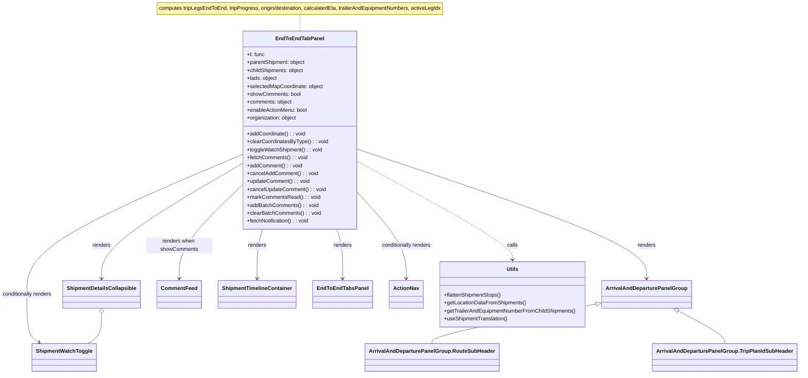

# Diagram: web/portal/src/modules/shipment-detail/multimodal/EndToEndTabPanel.js

> Auto-generated by Obscura crawlers

## Mermaid

### SVG

<svg id="container" width="2362.63671875" xmlns="http://www.w3.org/2000/svg" class="classDiagram" height="1132" viewBox="0 0 2362.63671875 1132" role="graphics-document document" aria-roledescription="class"><g><defs><marker id="container_class-aggregationStart" class="marker aggregation class" refX="18" refY="7" markerWidth="190" markerHeight="240" orient="auto"><path d="M 18,7 L9,13 L1,7 L9,1 Z"></path></marker></defs><defs><marker id="container_class-aggregationEnd" class="marker aggregation class" refX="1" refY="7" markerWidth="20" markerHeight="28" orient="auto"><path d="M 18,7 L9,13 L1,7 L9,1 Z"></path></marker></defs><defs><marker id="container_class-extensionStart" class="marker extension class" refX="18" refY="7" markerWidth="190" markerHeight="240" orient="auto"><path d="M 1,7 L18,13 V 1 Z"></path></marker></defs><defs><marker id="container_class-extensionEnd" class="marker extension class" refX="1" refY="7" markerWidth="20" markerHeight="28" orient="auto"><path d="M 1,1 V 13 L18,7 Z"></path></marker></defs><defs><marker id="container_class-compositionStart" class="marker composition class" refX="18" refY="7" markerWidth="190" markerHeight="240" orient="auto"><path d="M 18,7 L9,13 L1,7 L9,1 Z"></path></marker></defs><defs><marker id="container_class-compositionEnd" class="marker composition class" refX="1" refY="7" markerWidth="20" markerHeight="28" orient="auto"><path d="M 18,7 L9,13 L1,7 L9,1 Z"></path></marker></defs><defs><marker id="container_class-dependencyStart" class="marker dependency class" refX="6" refY="7" markerWidth="190" markerHeight="240" orient="auto"><path d="M 5,7 L9,13 L1,7 L9,1 Z"></path></marker></defs><defs><marker id="container_class-dependencyEnd" class="marker dependency class" refX="13" refY="7" markerWidth="20" markerHeight="28" orient="auto"><path d="M 18,7 L9,13 L14,7 L9,1 Z"></path></marker></defs><defs><marker id="container_class-lollipopStart" class="marker lollipop class" refX="13" refY="7" markerWidth="190" markerHeight="240" orient="auto"><circle stroke="black" fill="transparent" cx="7" cy="7" r="6"></circle></marker></defs><defs><marker id="container_class-lollipopEnd" class="marker lollipop class" refX="1" refY="7" markerWidth="190" markerHeight="240" orient="auto"><circle stroke="black" fill="transparent" cx="7" cy="7" r="6"></circle></marker></defs><g class="root"><g class="clusters"></g><g class="edgePaths"><path d="M890.555,44L890.555,48.167C890.555,52.333,890.555,60.667,890.555,69C890.555,77.333,890.555,85.667,890.555,89.833L890.555,94" id="edgeNote1" class="edge-thickness-normal edge-pattern-dotted relation" style="fill: none;;;fill: none" data-edge="true" data-et="edge" data-id="edgeNote1" data-points="W3sieCI6ODkwLjU1NDY4NzUsInkiOjQ0fSx7IngiOjg5MC41NTQ2ODc1LCJ5Ijo2OX0seyJ4Ijo4OTAuNTU0Njg3NSwieSI6OTR9XQ=="></path><path d="M722.145,495.368L653.576,536.64C585.008,577.912,447.871,660.456,379.303,718.395C310.734,776.333,310.734,809.667,310.734,826.333L310.734,843" id="id_EndToEndTabPanel_ShipmentDetailsCollapsible_1" class="edge-thickness-normal edge-pattern-solid relation" style=";;;" data-edge="true" data-et="edge" data-id="id_EndToEndTabPanel_ShipmentDetailsCollapsible_1" data-points="W3sieCI6NzIyLjE0NDUzMTI1LCJ5Ijo0OTUuMzY3ODYwNDYzMjM2Mn0seyJ4IjozMTAuNzM0Mzc1LCJ5Ijo3NDN9LHsieCI6MzEwLjczNDM3NSwieSI6ODQ5fV0=" marker-end="url(#container_class-dependencyEnd)"></path><path d="M1058.965,451.093L1202.475,499.744C1345.984,548.395,1633.004,645.698,1776.514,711.015C1920.023,776.333,1920.023,809.667,1920.023,826.333L1920.023,843" id="id_EndToEndTabPanel_ArrivalAndDeparturePanelGroup_2" class="edge-thickness-normal edge-pattern-solid relation" style=";;;" data-edge="true" data-et="edge" data-id="id_EndToEndTabPanel_ArrivalAndDeparturePanelGroup_2" data-points="W3sieCI6MTA1OC45NjQ4NDM3NSwieSI6NDUxLjA5MjY5NDE5OTA3MTF9LHsieCI6MTkyMC4wMjM0Mzc1LCJ5Ijo3NDN9LHsieCI6MTkyMC4wMjM0Mzc1LCJ5Ijo4NDl9XQ==" marker-end="url(#container_class-dependencyEnd)"></path><path d="M722.145,560.701L691.45,591.084C660.755,621.467,599.366,682.234,568.671,729.284C537.977,776.333,537.977,809.667,537.977,826.333L537.977,843" id="id_EndToEndTabPanel_CommentFeed_3" class="edge-thickness-normal edge-pattern-solid relation" style=";;;" data-edge="true" data-et="edge" data-id="id_EndToEndTabPanel_CommentFeed_3" data-points="W3sieCI6NzIyLjE0NDUzMTI1LCJ5Ijo1NjAuNzAxMDUyNTE0OTU2OH0seyJ4Ijo1MzcuOTc2NTYyNSwieSI6NzQzfSx7IngiOjUzNy45NzY1NjI1LCJ5Ijo4NDl9XQ==" marker-end="url(#container_class-dependencyEnd)"></path><path d="M783.582,694L780.67,702.167C777.758,710.333,771.933,726.667,769.021,751.5C766.109,776.333,766.109,809.667,766.109,826.333L766.109,843" id="id_EndToEndTabPanel_ShipmentTimelineContainer_4" class="edge-thickness-normal edge-pattern-solid relation" style=";;;" data-edge="true" data-et="edge" data-id="id_EndToEndTabPanel_ShipmentTimelineContainer_4" data-points="W3sieCI6NzgzLjU4MTYzOTUwNTczMDcsInkiOjY5NH0seyJ4Ijo3NjYuMTA5Mzc1LCJ5Ijo3NDN9LHsieCI6NzY2LjEwOTM3NSwieSI6ODQ5fV0=" marker-end="url(#container_class-dependencyEnd)"></path><path d="M997.528,694L1000.44,702.167C1003.352,710.333,1009.176,726.667,1012.088,751.5C1015,776.333,1015,809.667,1015,826.333L1015,843" id="id_EndToEndTabPanel_EndToEndTabsPanel_5" class="edge-thickness-normal edge-pattern-solid relation" style=";;;" data-edge="true" data-et="edge" data-id="id_EndToEndTabPanel_EndToEndTabsPanel_5" data-points="W3sieCI6OTk3LjUyNzczNTQ5NDI2OTMsInkiOjY5NH0seyJ4IjoxMDE1LCJ5Ijo3NDN9LHsieCI6MTAxNSwieSI6ODQ5fV0=" marker-end="url(#container_class-dependencyEnd)"></path><path d="M722.145,466.985L615.995,512.987C509.846,558.99,297.548,650.995,191.399,721.664C85.25,792.333,85.25,841.667,85.25,887C85.25,932.333,85.25,973.667,91.402,997.989C97.553,1022.312,109.857,1029.623,116.008,1033.279L122.16,1036.935" id="id_EndToEndTabPanel_ShipmentWatchToggle_6" class="edge-thickness-normal edge-pattern-solid relation" style=";;;" data-edge="true" data-et="edge" data-id="id_EndToEndTabPanel_ShipmentWatchToggle_6" data-points="W3sieCI6NzIyLjE0NDUzMTI1LCJ5Ijo0NjYuOTg0OTc3NTQxNDk3M30seyJ4Ijo4NS4yNSwieSI6NzQzfSx7IngiOjg1LjI1LCJ5Ijo4OTF9LHsieCI6ODUuMjUsInkiOjEwMTV9LHsieCI6MTI3LjMxNzk4MDQxMDQ0Nzc2LCJ5IjoxMDQwfV0=" marker-end="url(#container_class-dependencyEnd)"></path><path d="M1058.965,584.785L1082.242,611.154C1105.518,637.523,1152.072,690.262,1175.348,733.297C1198.625,776.333,1198.625,809.667,1198.625,826.333L1198.625,843" id="id_EndToEndTabPanel_ActionNav_7" class="edge-thickness-normal edge-pattern-solid relation" style=";;;" data-edge="true" data-et="edge" data-id="id_EndToEndTabPanel_ActionNav_7" data-points="W3sieCI6MTA1OC45NjQ4NDM3NSwieSI6NTg0Ljc4NDgzNzU3MjU5MTR9LHsieCI6MTE5OC42MjUsInkiOjc0M30seyJ4IjoxMTk4LjYyNSwieSI6ODQ5fV0=" marker-end="url(#container_class-dependencyEnd)"></path><path d="M1058.965,487.519L1135.644,530.099C1212.323,572.679,1365.681,657.84,1442.36,707.586C1519.039,757.333,1519.039,771.667,1519.039,778.833L1519.039,786" id="id_EndToEndTabPanel_Utils_8" class="edge-thickness-normal edge-pattern-dashed relation" style=";;;" data-edge="true" data-et="edge" data-id="id_EndToEndTabPanel_Utils_8" data-points="W3sieCI6MTA1OC45NjQ4NDM3NSwieSI6NDg3LjUxODg2MzU4NTUxMDc2fSx7IngiOjE1MTkuMDM5MDYyNSwieSI6NzQzfSx7IngiOjE1MTkuMDM5MDYyNSwieSI6NzkyfV0=" marker-end="url(#container_class-dependencyEnd)"></path><path d="M310.734,950.25L310.734,961.042C310.734,971.833,310.734,993.417,303.723,1008.375C296.712,1023.333,282.689,1031.667,275.678,1035.833L268.666,1040" id="id_ShipmentDetailsCollapsible_ShipmentWatchToggle_9" class="edge-thickness-normal edge-pattern-solid relation" style=";;;" data-edge="true" data-et="edge" data-id="id_ShipmentDetailsCollapsible_ShipmentWatchToggle_9" data-points="W3sieCI6MzEwLjczNDM3NSwieSI6OTMzfSx7IngiOjMxMC43MzQzNzUsInkiOjEwMTV9LHsieCI6MjY4LjY2NjM5NDU4OTU1MjIsInkiOjEwNDB9XQ==" marker-start="url(#container_class-aggregationStart)"></path><path d="M1773.662,919.521L1692.001,935.434C1610.34,951.347,1447.018,983.174,1365.356,1003.254C1283.695,1023.333,1283.695,1031.667,1283.695,1035.833L1283.695,1040" id="id_ArrivalAndDeparturePanelGroup_ArrivalAndDeparturePanelGroup.RouteSubHeader_10" class="edge-thickness-normal edge-pattern-solid relation" style=";;;" data-edge="true" data-et="edge" data-id="id_ArrivalAndDeparturePanelGroup_ArrivalAndDeparturePanelGroup.RouteSubHeader_10" data-points="W3sieCI6MTc5MC41OTM3NSwieSI6OTE2LjIyMTcwNjU2ODQ0Njh9LHsieCI6MTI4My42OTUzMTI1LCJ5IjoxMDE1fSx7IngiOjEyODMuNjk1MzEyNSwieSI6MTA0MH1d" marker-start="url(#container_class-extensionStart)"></path><path d="M2011.66,941.3L2034.038,953.584C2056.416,965.867,2101.171,990.433,2123.548,1006.883C2145.926,1023.333,2145.926,1031.667,2145.926,1035.833L2145.926,1040" id="id_ArrivalAndDeparturePanelGroup_ArrivalAndDeparturePanelGroup.TripPlanIdSubHeader_11" class="edge-thickness-normal edge-pattern-solid relation" style=";;;" data-edge="true" data-et="edge" data-id="id_ArrivalAndDeparturePanelGroup_ArrivalAndDeparturePanelGroup.TripPlanIdSubHeader_11" data-points="W3sieCI6MTk5Ni41Mzg3NDc0Nzk4Mzg4LCJ5Ijo5MzN9LHsieCI6MjE0NS45MjU3ODEyNSwieSI6MTAxNX0seyJ4IjoyMTQ1LjkyNTc4MTI1LCJ5IjoxMDQwfV0=" marker-start="url(#container_class-extensionStart)"></path></g><g class="edgeLabels"><g class="edgeLabel"><g class="label" data-id="edgeNote1" transform="translate(0, 0)"><foreignObject width="0" height="0">

</foreignObject></g></g><g class="edgeLabel" transform="translate(310.734375, 743)"><g class="label" data-id="id_EndToEndTabPanel_ShipmentDetailsCollapsible_1" transform="translate(-27.75, -12)"><foreignObject width="55.5" height="24">

renders

</foreignObject></g></g><g class="edgeLabel" transform="translate(1920.0234375, 743)"><g class="label" data-id="id_EndToEndTabPanel_ArrivalAndDeparturePanelGroup_2" transform="translate(-27.75, -12)"><foreignObject width="55.5" height="24">

renders

</foreignObject></g></g><g class="edgeLabel" transform="translate(537.9765625, 743)"><g class="label" data-id="id_EndToEndTabPanel_CommentFeed_3" transform="translate(-100, -24)"><foreignObject width="200" height="48">

renders when showComments

</foreignObject></g></g><g class="edgeLabel" transform="translate(766.109375, 743)"><g class="label" data-id="id_EndToEndTabPanel_ShipmentTimelineContainer_4" transform="translate(-27.75, -12)"><foreignObject width="55.5" height="24">

renders

</foreignObject></g></g><g class="edgeLabel" transform="translate(1015, 743)"><g class="label" data-id="id_EndToEndTabPanel_EndToEndTabsPanel_5" transform="translate(-27.75, -12)"><foreignObject width="55.5" height="24">

renders

</foreignObject></g></g><g class="edgeLabel" transform="translate(85.25, 891)"><g class="label" data-id="id_EndToEndTabPanel_ShipmentWatchToggle_6" transform="translate(-77.25, -12)"><foreignObject width="154.5" height="24">

conditionally renders

</foreignObject></g></g><g class="edgeLabel" transform="translate(1198.625, 743)"><g class="label" data-id="id_EndToEndTabPanel_ActionNav_7" transform="translate(-77.25, -12)"><foreignObject width="154.5" height="24">

conditionally renders

</foreignObject></g></g><g class="edgeLabel" transform="translate(1519.0390625, 743)"><g class="label" data-id="id_EndToEndTabPanel_Utils_8" transform="translate(-16.4453125, -12)"><foreignObject width="32.890625" height="24">

calls

</foreignObject></g></g><g class="edgeLabel"><g class="label" data-id="id_ShipmentDetailsCollapsible_ShipmentWatchToggle_9" transform="translate(0, 0)"><foreignObject width="0" height="0">

</foreignObject></g></g><g class="edgeLabel"><g class="label" data-id="id_ArrivalAndDeparturePanelGroup_ArrivalAndDeparturePanelGroup.RouteSubHeader_10" transform="translate(0, 0)"><foreignObject width="0" height="0">

</foreignObject></g></g><g class="edgeLabel"><g class="label" data-id="id_ArrivalAndDeparturePanelGroup_ArrivalAndDeparturePanelGroup.TripPlanIdSubHeader_11" transform="translate(0, 0)"><foreignObject width="0" height="0">

</foreignObject></g></g></g><g class="nodes"><g class="node default" id="classId-EndToEndTabPanel-0" transform="translate(890.5546875, 394)"><g class="basic label-container"><path d="M-168.41015625 -300 L168.41015625 -300 L168.41015625 300 L-168.41015625 300" stroke="none" stroke-width="0" fill="#ECECFF" style=""></path><path d="M-168.41015625 -300 C-88.71976178775097 -300, -9.029367325501937 -300, 168.41015625 -300 M-168.41015625 -300 C-90.49778533040059 -300, -12.585414410801178 -300, 168.41015625 -300 M168.41015625 -300 C168.41015625 -154.01519089346107, 168.41015625 -8.030381786922135, 168.41015625 300 M168.41015625 -300 C168.41015625 -179.5314035503257, 168.41015625 -59.06280710065141, 168.41015625 300 M168.41015625 300 C74.72634808652867 300, -18.957460076942652 300, -168.41015625 300 M168.41015625 300 C97.95111771161932 300, 27.492079173238636 300, -168.41015625 300 M-168.41015625 300 C-168.41015625 134.940098871472, -168.41015625 -30.119802257055994, -168.41015625 -300 M-168.41015625 300 C-168.41015625 158.2626862638154, -168.41015625 16.525372527630793, -168.41015625 -300" stroke="#9370DB" stroke-width="1.3" fill="none" stroke-dasharray="0 0" style=""></path></g><g class="annotation-group text" transform="translate(0, -276)"></g><g class="label-group text" transform="translate(-68.8984375, -276)"><g class="label" style="font-weight: bolder" transform="translate(0,-12)"><foreignObject width="137.796875" height="24">

EndToEndTabPanel

</foreignObject></g></g><g class="members-group text" transform="translate(-156.41015625, -228)"><g class="label" style="" transform="translate(0,-12)"><foreignObject width="53.53125" height="24">

+t: func

</foreignObject></g><g class="label" style="" transform="translate(0,12)"><foreignObject width="178.921875" height="24">

+parentShipment: object

</foreignObject></g><g class="label" style="" transform="translate(0,36)"><foreignObject width="174.421875" height="24">

+childShipments: object

</foreignObject></g><g class="label" style="" transform="translate(0,60)"><foreignObject width="91.890625" height="24">

+lads: object

</foreignObject></g><g class="label" style="" transform="translate(0,84)"><foreignObject width="232.625" height="24">

+selectedMapCoordinate: object

</foreignObject></g><g class="label" style="" transform="translate(0,108)"><foreignObject width="163.375" height="24">

+showComments: bool

</foreignObject></g><g class="label" style="" transform="translate(0,132)"><foreignObject width="136.984375" height="24">

+comments: object

</foreignObject></g><g class="label" style="" transform="translate(0,156)"><foreignObject width="184.265625" height="24">

+enableActionMenu: bool

</foreignObject></g><g class="label" style="" transform="translate(0,180)"><foreignObject width="151.890625" height="24">

+organization: object

</foreignObject></g></g><g class="methods-group text" transform="translate(-156.41015625, 12)"><g class="label" style="" transform="translate(0,-12)"><foreignObject width="177.03125" height="24">

+addCoordinate() : : void

</foreignObject></g><g class="label" style="" transform="translate(0,12)"><foreignObject width="243.921875" height="24">

+clearCoordinatesByType() : : void

</foreignObject></g><g class="label" style="" transform="translate(0,36)"><foreignObject width="228.453125" height="24">

+toggleWatchShipment() : : void

</foreignObject></g><g class="label" style="" transform="translate(0,60)"><foreignObject width="182.984375" height="24">

+fetchComments() : : void

</foreignObject></g><g class="label" style="" transform="translate(0,84)"><foreignObject width="166.875" height="24">

+addComment() : : void

</foreignObject></g><g class="label" style="" transform="translate(0,108)"><foreignObject width="213.875" height="24">

+cancelAddComment() : : void

</foreignObject></g><g class="label" style="" transform="translate(0,132)"><foreignObject width="190.609375" height="24">

+updateComment() : : void

</foreignObject></g><g class="label" style="" transform="translate(0,156)"><foreignObject width="238.203125" height="24">

+cancelUpdateComment() : : void

</foreignObject></g><g class="label" style="" transform="translate(0,180)"><foreignObject width="219.796875" height="24">

+markCommentsRead() : : void

</foreignObject></g><g class="label" style="" transform="translate(0,204)"><foreignObject width="215.34375" height="24">

+addBatchComments() : : void

</foreignObject></g><g class="label" style="" transform="translate(0,228)"><foreignObject width="223.4375" height="24">

+clearBatchComments() : : void

</foreignObject></g><g class="label" style="" transform="translate(0,252)"><foreignObject width="191.1875" height="24">

+fetchNotification() : : void

</foreignObject></g></g><g class="divider" style=""><path d="M-168.41015625 -252 C-43.15790897705102 -252, 82.09433829589796 -252, 168.41015625 -252 M-168.41015625 -252 C-81.9217340078567 -252, 4.566688234286602 -252, 168.41015625 -252" stroke="#9370DB" stroke-width="1.3" fill="none" stroke-dasharray="0 0" style=""></path></g><g class="divider" style=""><path d="M-168.41015625 -12 C-83.8549689961934 -12, 0.7002182576131872 -12, 168.41015625 -12 M-168.41015625 -12 C-33.85124558039914 -12, 100.70766508920173 -12, 168.41015625 -12" stroke="#9370DB" stroke-width="1.3" fill="none" stroke-dasharray="0 0" style=""></path></g></g><g class="node default" id="classId-ShipmentDetailsCollapsible-1" transform="translate(310.734375, 891)"><g class="basic label-container"><path d="M-113.234375 -42 L113.234375 -42 L113.234375 42 L-113.234375 42" stroke="none" stroke-width="0" fill="#ECECFF" style=""></path><path d="M-113.234375 -42 C-41.304626283323316 -42, 30.62512243335337 -42, 113.234375 -42 M-113.234375 -42 C-60.9515818570112 -42, -8.668788714022398 -42, 113.234375 -42 M113.234375 -42 C113.234375 -12.039337086916927, 113.234375 17.921325826166147, 113.234375 42 M113.234375 -42 C113.234375 -21.754719310508737, 113.234375 -1.5094386210174733, 113.234375 42 M113.234375 42 C44.045132061040206 42, -25.144110877919587 42, -113.234375 42 M113.234375 42 C63.48827742512066 42, 13.742179850241314 42, -113.234375 42 M-113.234375 42 C-113.234375 14.807795971215896, -113.234375 -12.384408057568209, -113.234375 -42 M-113.234375 42 C-113.234375 13.008098961949099, -113.234375 -15.983802076101803, -113.234375 -42" stroke="#9370DB" stroke-width="1.3" fill="none" stroke-dasharray="0 0" style=""></path></g><g class="annotation-group text" transform="translate(0, -18)"></g><g class="label-group text" transform="translate(-101.234375, -18)"><g class="label" style="font-weight: bolder" transform="translate(0,-12)"><foreignObject width="202.46875" height="24">

ShipmentDetailsCollapsible

</foreignObject></g></g><g class="members-group text" transform="translate(-101.234375, 30)"></g><g class="methods-group text" transform="translate(-101.234375, 60)"></g><g class="divider" style=""><path d="M-113.234375 6 C-45.31293849904647 6, 22.608498001907066 6, 113.234375 6 M-113.234375 6 C-35.80237918235272 6, 41.62961663529455 6, 113.234375 6" stroke="#9370DB" stroke-width="1.3" fill="none" stroke-dasharray="0 0" style=""></path></g><g class="divider" style=""><path d="M-113.234375 24 C-39.22747142772022 24, 34.779432144559564 24, 113.234375 24 M-113.234375 24 C-45.24981123483502 24, 22.734752530329956 24, 113.234375 24" stroke="#9370DB" stroke-width="1.3" fill="none" stroke-dasharray="0 0" style=""></path></g></g><g class="node default" id="classId-ArrivalAndDeparturePanelGroup-2" transform="translate(1920.0234375, 891)"><g class="basic label-container"><path d="M-129.4296875 -42 L129.4296875 -42 L129.4296875 42 L-129.4296875 42" stroke="none" stroke-width="0" fill="#ECECFF" style=""></path><path d="M-129.4296875 -42 C-61.61477793215096 -42, 6.200131635698085 -42, 129.4296875 -42 M-129.4296875 -42 C-62.26170213777668 -42, 4.906283224446639 -42, 129.4296875 -42 M129.4296875 -42 C129.4296875 -16.336821671746193, 129.4296875 9.326356656507613, 129.4296875 42 M129.4296875 -42 C129.4296875 -12.035142897671168, 129.4296875 17.929714204657664, 129.4296875 42 M129.4296875 42 C54.64515062114286 42, -20.13938625771428 42, -129.4296875 42 M129.4296875 42 C29.60894922922205 42, -70.2117890415559 42, -129.4296875 42 M-129.4296875 42 C-129.4296875 12.030965665549328, -129.4296875 -17.938068668901344, -129.4296875 -42 M-129.4296875 42 C-129.4296875 15.256735648809741, -129.4296875 -11.486528702380518, -129.4296875 -42" stroke="#9370DB" stroke-width="1.3" fill="none" stroke-dasharray="0 0" style=""></path></g><g class="annotation-group text" transform="translate(0, -18)"></g><g class="label-group text" transform="translate(-117.4296875, -18)"><g class="label" style="font-weight: bolder" transform="translate(0,-12)"><foreignObject width="234.859375" height="24">

ArrivalAndDeparturePanelGroup

</foreignObject></g></g><g class="members-group text" transform="translate(-117.4296875, 30)"></g><g class="methods-group text" transform="translate(-117.4296875, 60)"></g><g class="divider" style=""><path d="M-129.4296875 6 C-56.52169169177668 6, 16.386304116446638 6, 129.4296875 6 M-129.4296875 6 C-57.00909961261647 6, 15.411488274767066 6, 129.4296875 6" stroke="#9370DB" stroke-width="1.3" fill="none" stroke-dasharray="0 0" style=""></path></g><g class="divider" style=""><path d="M-129.4296875 24 C-38.95608504799961 24, 51.517517404000785 24, 129.4296875 24 M-129.4296875 24 C-56.23969083992374 24, 16.950305820152522 24, 129.4296875 24" stroke="#9370DB" stroke-width="1.3" fill="none" stroke-dasharray="0 0" style=""></path></g></g><g class="node default" id="classId-CommentFeed-3" transform="translate(537.9765625, 891)"><g class="basic label-container"><path d="M-64.0078125 -42 L64.0078125 -42 L64.0078125 42 L-64.0078125 42" stroke="none" stroke-width="0" fill="#ECECFF" style=""></path><path d="M-64.0078125 -42 C-29.720346976782665 -42, 4.567118546434671 -42, 64.0078125 -42 M-64.0078125 -42 C-21.097649447458515 -42, 21.81251360508297 -42, 64.0078125 -42 M64.0078125 -42 C64.0078125 -13.27727524002557, 64.0078125 15.445449519948859, 64.0078125 42 M64.0078125 -42 C64.0078125 -14.707758235355065, 64.0078125 12.58448352928987, 64.0078125 42 M64.0078125 42 C22.116447503021803 42, -19.774917493956394 42, -64.0078125 42 M64.0078125 42 C28.698887335872634 42, -6.6100378282547325 42, -64.0078125 42 M-64.0078125 42 C-64.0078125 10.744957060502756, -64.0078125 -20.510085878994488, -64.0078125 -42 M-64.0078125 42 C-64.0078125 9.211079567185436, -64.0078125 -23.577840865629128, -64.0078125 -42" stroke="#9370DB" stroke-width="1.3" fill="none" stroke-dasharray="0 0" style=""></path></g><g class="annotation-group text" transform="translate(0, -18)"></g><g class="label-group text" transform="translate(-52.0078125, -18)"><g class="label" style="font-weight: bolder" transform="translate(0,-12)"><foreignObject width="104.015625" height="24">

CommentFeed

</foreignObject></g></g><g class="members-group text" transform="translate(-52.0078125, 30)"></g><g class="methods-group text" transform="translate(-52.0078125, 60)"></g><g class="divider" style=""><path d="M-64.0078125 6 C-34.734951087809094 6, -5.462089675618195 6, 64.0078125 6 M-64.0078125 6 C-15.60598360315175 6, 32.7958452936965 6, 64.0078125 6" stroke="#9370DB" stroke-width="1.3" fill="none" stroke-dasharray="0 0" style=""></path></g><g class="divider" style=""><path d="M-64.0078125 24 C-34.716527929839245 24, -5.425243359678497 24, 64.0078125 24 M-64.0078125 24 C-29.914533595474026 24, 4.178745309051948 24, 64.0078125 24" stroke="#9370DB" stroke-width="1.3" fill="none" stroke-dasharray="0 0" style=""></path></g></g><g class="node default" id="classId-ShipmentTimelineContainer-4" transform="translate(766.109375, 891)"><g class="basic label-container"><path d="M-114.125 -42 L114.125 -42 L114.125 42 L-114.125 42" stroke="none" stroke-width="0" fill="#ECECFF" style=""></path><path d="M-114.125 -42 C-65.03088406398336 -42, -15.93676812796673 -42, 114.125 -42 M-114.125 -42 C-54.64168545492971 -42, 4.841629090140586 -42, 114.125 -42 M114.125 -42 C114.125 -21.582497527594526, 114.125 -1.1649950551890527, 114.125 42 M114.125 -42 C114.125 -15.73610577636174, 114.125 10.52778844727652, 114.125 42 M114.125 42 C48.688638314735456 42, -16.747723370529087 42, -114.125 42 M114.125 42 C32.07027395806598 42, -49.984452083868035 42, -114.125 42 M-114.125 42 C-114.125 17.88558429487415, -114.125 -6.228831410251701, -114.125 -42 M-114.125 42 C-114.125 21.66509964802772, -114.125 1.33019929605544, -114.125 -42" stroke="#9370DB" stroke-width="1.3" fill="none" stroke-dasharray="0 0" style=""></path></g><g class="annotation-group text" transform="translate(0, -18)"></g><g class="label-group text" transform="translate(-102.125, -18)"><g class="label" style="font-weight: bolder" transform="translate(0,-12)"><foreignObject width="204.25" height="24">

ShipmentTimelineContainer

</foreignObject></g></g><g class="members-group text" transform="translate(-102.125, 30)"></g><g class="methods-group text" transform="translate(-102.125, 60)"></g><g class="divider" style=""><path d="M-114.125 6 C-44.255839955296054 6, 25.613320089407893 6, 114.125 6 M-114.125 6 C-45.019084107192825 6, 24.08683178561435 6, 114.125 6" stroke="#9370DB" stroke-width="1.3" fill="none" stroke-dasharray="0 0" style=""></path></g><g class="divider" style=""><path d="M-114.125 24 C-64.46415699342796 24, -14.80331398685594 24, 114.125 24 M-114.125 24 C-37.66254040315387 24, 38.79991919369226 24, 114.125 24" stroke="#9370DB" stroke-width="1.3" fill="none" stroke-dasharray="0 0" style=""></path></g></g><g class="node default" id="classId-EndToEndTabsPanel-5" transform="translate(1015, 891)"><g class="basic label-container"><path d="M-84.765625 -42 L84.765625 -42 L84.765625 42 L-84.765625 42" stroke="none" stroke-width="0" fill="#ECECFF" style=""></path><path d="M-84.765625 -42 C-31.885954243290982 -42, 20.993716513418036 -42, 84.765625 -42 M-84.765625 -42 C-26.720817088889333 -42, 31.323990822221333 -42, 84.765625 -42 M84.765625 -42 C84.765625 -9.398313192126182, 84.765625 23.203373615747637, 84.765625 42 M84.765625 -42 C84.765625 -8.949238095553042, 84.765625 24.101523808893916, 84.765625 42 M84.765625 42 C18.49571373288454 42, -47.77419753423092 42, -84.765625 42 M84.765625 42 C32.99849884524543 42, -18.768627309509142 42, -84.765625 42 M-84.765625 42 C-84.765625 17.152284176323622, -84.765625 -7.6954316473527555, -84.765625 -42 M-84.765625 42 C-84.765625 17.651545361481794, -84.765625 -6.696909277036411, -84.765625 -42" stroke="#9370DB" stroke-width="1.3" fill="none" stroke-dasharray="0 0" style=""></path></g><g class="annotation-group text" transform="translate(0, -18)"></g><g class="label-group text" transform="translate(-72.765625, -18)"><g class="label" style="font-weight: bolder" transform="translate(0,-12)"><foreignObject width="145.53125" height="24">

EndToEndTabsPanel

</foreignObject></g></g><g class="members-group text" transform="translate(-72.765625, 30)"></g><g class="methods-group text" transform="translate(-72.765625, 60)"></g><g class="divider" style=""><path d="M-84.765625 6 C-23.55891204145565 6, 37.6478009170887 6, 84.765625 6 M-84.765625 6 C-17.916268154288943 6, 48.933088691422114 6, 84.765625 6" stroke="#9370DB" stroke-width="1.3" fill="none" stroke-dasharray="0 0" style=""></path></g><g class="divider" style=""><path d="M-84.765625 24 C-23.590817070414147 24, 37.583990859171706 24, 84.765625 24 M-84.765625 24 C-46.88798726990582 24, -9.010349539811642 24, 84.765625 24" stroke="#9370DB" stroke-width="1.3" fill="none" stroke-dasharray="0 0" style=""></path></g></g><g class="node default" id="classId-ShipmentWatchToggle-6" transform="translate(197.9921875, 1082)"><g class="basic label-container"><path d="M-93.5390625 -42 L93.5390625 -42 L93.5390625 42 L-93.5390625 42" stroke="none" stroke-width="0" fill="#ECECFF" style=""></path><path d="M-93.5390625 -42 C-18.724656427600834 -42, 56.08974964479833 -42, 93.5390625 -42 M-93.5390625 -42 C-50.453823991809955 -42, -7.36858548361991 -42, 93.5390625 -42 M93.5390625 -42 C93.5390625 -12.068985643789475, 93.5390625 17.86202871242105, 93.5390625 42 M93.5390625 -42 C93.5390625 -17.962748746925286, 93.5390625 6.074502506149429, 93.5390625 42 M93.5390625 42 C24.826684966448994 42, -43.88569256710201 42, -93.5390625 42 M93.5390625 42 C47.716882697119765 42, 1.8947028942395292 42, -93.5390625 42 M-93.5390625 42 C-93.5390625 9.286856847287815, -93.5390625 -23.42628630542437, -93.5390625 -42 M-93.5390625 42 C-93.5390625 24.498873039980715, -93.5390625 6.997746079961431, -93.5390625 -42" stroke="#9370DB" stroke-width="1.3" fill="none" stroke-dasharray="0 0" style=""></path></g><g class="annotation-group text" transform="translate(0, -18)"></g><g class="label-group text" transform="translate(-81.5390625, -18)"><g class="label" style="font-weight: bolder" transform="translate(0,-12)"><foreignObject width="163.078125" height="24">

ShipmentWatchToggle

</foreignObject></g></g><g class="members-group text" transform="translate(-81.5390625, 30)"></g><g class="methods-group text" transform="translate(-81.5390625, 60)"></g><g class="divider" style=""><path d="M-93.5390625 6 C-18.846260429613295 6, 55.84654164077341 6, 93.5390625 6 M-93.5390625 6 C-19.744253463824307 6, 54.050555572351385 6, 93.5390625 6" stroke="#9370DB" stroke-width="1.3" fill="none" stroke-dasharray="0 0" style=""></path></g><g class="divider" style=""><path d="M-93.5390625 24 C-45.004312071175505 24, 3.5304383576489897 24, 93.5390625 24 M-93.5390625 24 C-24.981730003447964 24, 43.57560249310407 24, 93.5390625 24" stroke="#9370DB" stroke-width="1.3" fill="none" stroke-dasharray="0 0" style=""></path></g></g><g class="node default" id="classId-ActionNav-7" transform="translate(1198.625, 891)"><g class="basic label-container"><path d="M-48.859375 -42 L48.859375 -42 L48.859375 42 L-48.859375 42" stroke="none" stroke-width="0" fill="#ECECFF" style=""></path><path d="M-48.859375 -42 C-12.968885663186299 -42, 22.921603673627402 -42, 48.859375 -42 M-48.859375 -42 C-14.934717723122468 -42, 18.989939553755065 -42, 48.859375 -42 M48.859375 -42 C48.859375 -24.326893977867023, 48.859375 -6.653787955734046, 48.859375 42 M48.859375 -42 C48.859375 -17.829496992732302, 48.859375 6.341006014535395, 48.859375 42 M48.859375 42 C13.214660607009357 42, -22.430053785981286 42, -48.859375 42 M48.859375 42 C22.716274547272516 42, -3.426825905454969 42, -48.859375 42 M-48.859375 42 C-48.859375 16.338614406174223, -48.859375 -9.322771187651554, -48.859375 -42 M-48.859375 42 C-48.859375 24.235491064165238, -48.859375 6.470982128330476, -48.859375 -42" stroke="#9370DB" stroke-width="1.3" fill="none" stroke-dasharray="0 0" style=""></path></g><g class="annotation-group text" transform="translate(0, -18)"></g><g class="label-group text" transform="translate(-36.859375, -18)"><g class="label" style="font-weight: bolder" transform="translate(0,-12)"><foreignObject width="73.71875" height="24">

ActionNav

</foreignObject></g></g><g class="members-group text" transform="translate(-36.859375, 30)"></g><g class="methods-group text" transform="translate(-36.859375, 60)"></g><g class="divider" style=""><path d="M-48.859375 6 C-17.27027305759126 6, 14.318828884817478 6, 48.859375 6 M-48.859375 6 C-26.891845913521866 6, -4.924316827043732 6, 48.859375 6" stroke="#9370DB" stroke-width="1.3" fill="none" stroke-dasharray="0 0" style=""></path></g><g class="divider" style=""><path d="M-48.859375 24 C-11.990327156470862 24, 24.878720687058276 24, 48.859375 24 M-48.859375 24 C-23.791152252777962 24, 1.2770704944440752 24, 48.859375 24" stroke="#9370DB" stroke-width="1.3" fill="none" stroke-dasharray="0 0" style=""></path></g></g><g class="node default" id="classId-Utils-8" transform="translate(1519.0390625, 891)"><g class="basic label-container"><path d="M-221.5546875 -99 L221.5546875 -99 L221.5546875 99 L-221.5546875 99" stroke="none" stroke-width="0" fill="#ECECFF" style=""></path><path d="M-221.5546875 -99 C-64.08908105102876 -99, 93.37652539794249 -99, 221.5546875 -99 M-221.5546875 -99 C-60.38358418650432 -99, 100.78751912699136 -99, 221.5546875 -99 M221.5546875 -99 C221.5546875 -41.55637997433666, 221.5546875 15.887240051326685, 221.5546875 99 M221.5546875 -99 C221.5546875 -39.11011057079181, 221.5546875 20.77977885841638, 221.5546875 99 M221.5546875 99 C92.6424518264314 99, -36.269783847137205 99, -221.5546875 99 M221.5546875 99 C118.26991200873935 99, 14.985136517478708 99, -221.5546875 99 M-221.5546875 99 C-221.5546875 31.489767257357457, -221.5546875 -36.02046548528509, -221.5546875 -99 M-221.5546875 99 C-221.5546875 49.96738193790177, -221.5546875 0.9347638758035401, -221.5546875 -99" stroke="#9370DB" stroke-width="1.3" fill="none" stroke-dasharray="0 0" style=""></path></g><g class="annotation-group text" transform="translate(0, -75)"></g><g class="label-group text" transform="translate(-16.796875, -75)"><g class="label" style="font-weight: bolder" transform="translate(0,-12)"><foreignObject width="33.59375" height="24">

Utils

</foreignObject></g></g><g class="members-group text" transform="translate(-209.5546875, -27)"></g><g class="methods-group text" transform="translate(-209.5546875, 3)"><g class="label" style="" transform="translate(0,-12)"><foreignObject width="175.890625" height="24">

+flattenShipmentStops()

</foreignObject></g><g class="label" style="" transform="translate(0,12)"><foreignObject width="249.46875" height="24">

+getLocationDataFromShipments()

</foreignObject></g><g class="label" style="" transform="translate(0,36)"><foreignObject width="402.3125" height="24">

+getTrailerAndEquipmentNumberFromChildShipments()

</foreignObject></g><g class="label" style="" transform="translate(0,60)"><foreignObject width="194.84375" height="24">

+useShipmentTranslation()

</foreignObject></g></g><g class="divider" style=""><path d="M-221.5546875 -51 C-80.95628458007565 -51, 59.64211833984871 -51, 221.5546875 -51 M-221.5546875 -51 C-88.41505318380374 -51, 44.72458113239253 -51, 221.5546875 -51" stroke="#9370DB" stroke-width="1.3" fill="none" stroke-dasharray="0 0" style=""></path></g><g class="divider" style=""><path d="M-221.5546875 -27 C-115.59194283739707 -27, -9.62919817479414 -27, 221.5546875 -27 M-221.5546875 -27 C-129.3219752352922 -27, -37.08926297058437 -27, 221.5546875 -27" stroke="#9370DB" stroke-width="1.3" fill="none" stroke-dasharray="0 0" style=""></path></g></g><g class="node default" id="classId-ArrivalAndDeparturePanelGroup.RouteSubHeader-9" transform="translate(1283.6953125, 1082)"><g class="basic label-container"><path d="M-193.09375 -42 L193.09375 -42 L193.09375 42 L-193.09375 42" stroke="none" stroke-width="0" fill="#ECECFF" style=""></path><path d="M-193.09375 -42 C-38.98294793806261 -42, 115.12785412387478 -42, 193.09375 -42 M-193.09375 -42 C-72.53841987584907 -42, 48.016910248301855 -42, 193.09375 -42 M193.09375 -42 C193.09375 -8.495348677195544, 193.09375 25.009302645608912, 193.09375 42 M193.09375 -42 C193.09375 -24.551136707545375, 193.09375 -7.10227341509075, 193.09375 42 M193.09375 42 C84.3394523752324 42, -24.414845249535205 42, -193.09375 42 M193.09375 42 C98.28296161910623 42, 3.472173238212463 42, -193.09375 42 M-193.09375 42 C-193.09375 23.15937279239789, -193.09375 4.318745584795778, -193.09375 -42 M-193.09375 42 C-193.09375 9.238103100358408, -193.09375 -23.523793799283183, -193.09375 -42" stroke="#9370DB" stroke-width="1.3" fill="none" stroke-dasharray="0 0" style=""></path></g><g class="annotation-group text" transform="translate(0, -18)"></g><g class="label-group text" transform="translate(-181.09375, -18)"><g class="label" style="font-weight: bolder" transform="translate(0,-12)"><foreignObject width="362.1875" height="24">

ArrivalAndDeparturePanelGroup.RouteSubHeader

</foreignObject></g></g><g class="members-group text" transform="translate(-181.09375, 30)"></g><g class="methods-group text" transform="translate(-181.09375, 60)"></g><g class="divider" style=""><path d="M-193.09375 6 C-64.51382965656256 6, 64.06609068687487 6, 193.09375 6 M-193.09375 6 C-76.08177163666808 6, 40.93020672666384 6, 193.09375 6" stroke="#9370DB" stroke-width="1.3" fill="none" stroke-dasharray="0 0" style=""></path></g><g class="divider" style=""><path d="M-193.09375 24 C-48.25831574733971 24, 96.57711850532058 24, 193.09375 24 M-193.09375 24 C-77.47238740579931 24, 38.14897518840138 24, 193.09375 24" stroke="#9370DB" stroke-width="1.3" fill="none" stroke-dasharray="0 0" style=""></path></g></g><g class="node default" id="classId-ArrivalAndDeparturePanelGroup.TripPlanIdSubHeader-10" transform="translate(2145.92578125, 1082)"><g class="basic label-container"><path d="M-208.7109375 -42 L208.7109375 -42 L208.7109375 42 L-208.7109375 42" stroke="none" stroke-width="0" fill="#ECECFF" style=""></path><path d="M-208.7109375 -42 C-91.26786458281245 -42, 26.1752083343751 -42, 208.7109375 -42 M-208.7109375 -42 C-84.1257153322834 -42, 40.45950683543319 -42, 208.7109375 -42 M208.7109375 -42 C208.7109375 -24.316228477024097, 208.7109375 -6.632456954048195, 208.7109375 42 M208.7109375 -42 C208.7109375 -9.466674608855229, 208.7109375 23.066650782289543, 208.7109375 42 M208.7109375 42 C52.506429250381075 42, -103.69807899923785 42, -208.7109375 42 M208.7109375 42 C68.16175279866977 42, -72.38743190266047 42, -208.7109375 42 M-208.7109375 42 C-208.7109375 16.4447461951513, -208.7109375 -9.1105076096974, -208.7109375 -42 M-208.7109375 42 C-208.7109375 17.5755030834567, -208.7109375 -6.8489938330866025, -208.7109375 -42" stroke="#9370DB" stroke-width="1.3" fill="none" stroke-dasharray="0 0" style=""></path></g><g class="annotation-group text" transform="translate(0, -18)"></g><g class="label-group text" transform="translate(-196.7109375, -18)"><g class="label" style="font-weight: bolder" transform="translate(0,-12)"><foreignObject width="393.421875" height="24">

ArrivalAndDeparturePanelGroup.TripPlanIdSubHeader

</foreignObject></g></g><g class="members-group text" transform="translate(-196.7109375, 30)"></g><g class="methods-group text" transform="translate(-196.7109375, 60)"></g><g class="divider" style=""><path d="M-208.7109375 6 C-84.23273483433624 6, 40.24546783132752 6, 208.7109375 6 M-208.7109375 6 C-103.92895400138718 6, 0.8530294972256343 6, 208.7109375 6" stroke="#9370DB" stroke-width="1.3" fill="none" stroke-dasharray="0 0" style=""></path></g><g class="divider" style=""><path d="M-208.7109375 24 C-57.29331210388639 24, 94.12431329222721 24, 208.7109375 24 M-208.7109375 24 C-120.5978955325963 24, -32.484853565192594 24, 208.7109375 24" stroke="#9370DB" stroke-width="1.3" fill="none" stroke-dasharray="0 0" style=""></path></g></g><g class="node undefined" id="note0" transform="translate(890.5546875, 26)"><g class="basic label-container"><path d="M-440.484375 -18 L440.484375 -18 L440.484375 18 L-440.484375 18" stroke="none" stroke-width="0" fill="#fff5ad" style="fill:#fff5ad !important;stroke:#aaaa33 !important"></path><path d="M-440.484375 -18 C-156.68187287088807 -18, 127.12062925822386 -18, 440.484375 -18 M-440.484375 -18 C-188.71416262961426 -18, 63.05604974077147 -18, 440.484375 -18 M440.484375 -18 C440.484375 -4.195696793312834, 440.484375 9.608606413374332, 440.484375 18 M440.484375 -18 C440.484375 -8.562697351288385, 440.484375 0.8746052974232299, 440.484375 18 M440.484375 18 C103.58940273422058 18, -233.30556953155883 18, -440.484375 18 M440.484375 18 C151.94557669495936 18, -136.5932216100813 18, -440.484375 18 M-440.484375 18 C-440.484375 5.794862754389358, -440.484375 -6.4102744912212835, -440.484375 -18 M-440.484375 18 C-440.484375 7.472560461377778, -440.484375 -3.0548790772444434, -440.484375 -18" stroke="#aaaa33" stroke-width="1.3" fill="none" stroke-dasharray="0 0" style="fill:#fff5ad !important;stroke:#aaaa33 !important"></path></g><g class="label" style="text-align:left !important;white-space:nowrap !important" transform="translate(-434.484375, -12)"><rect></rect><foreignObject width="868.96875" height="24">

computes tripLegsEndToEnd, tripProgress, origin/destination, calculatedEta, trailerAndEquipmentNumbers, activeLegIdx

</foreignObject></g></g></g></g></g></svg>
