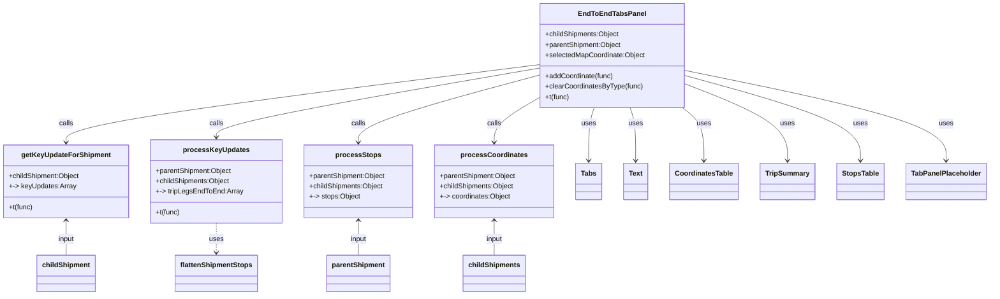

# Diagram: web/portal/src/modules/shipment-detail/multimodal/EndToEndTabsPanel.js


> Auto-generated by Obscura crawlers

## Diagram 1



### SVG

<svg id="container" width="2236.9140625" xmlns="http://www.w3.org/2000/svg" class="classDiagram" height="680" viewBox="0 0 2236.9140625 680" role="graphics-document document" aria-roledescription="class"><style>#container{font-family:"trebuchet ms",verdana,arial,sans-serif;font-size:16px;fill:#333;}@keyframes edge-animation-frame{from{stroke-dashoffset:0;}}@keyframes dash{to{stroke-dashoffset:0;}}#container .edge-animation-slow{stroke-dasharray:9,5!important;stroke-dashoffset:900;animation:dash 50s linear infinite;stroke-linecap:round;}#container .edge-animation-fast{stroke-dasharray:9,5!important;stroke-dashoffset:900;animation:dash 20s linear infinite;stroke-linecap:round;}#container .error-icon{fill:#552222;}#container .error-text{fill:#552222;stroke:#552222;}#container .edge-thickness-normal{stroke-width:1px;}#container .edge-thickness-thick{stroke-width:3.5px;}#container .edge-pattern-solid{stroke-dasharray:0;}#container .edge-thickness-invisible{stroke-width:0;fill:none;}#container .edge-pattern-dashed{stroke-dasharray:3;}#container .edge-pattern-dotted{stroke-dasharray:2;}#container .marker{fill:#333333;stroke:#333333;}#container .marker.cross{stroke:#333333;}#container svg{font-family:"trebuchet ms",verdana,arial,sans-serif;font-size:16px;}#container p{margin:0;}#container g.classGroup text{fill:#9370DB;stroke:none;font-family:"trebuchet ms",verdana,arial,sans-serif;font-size:10px;}#container g.classGroup text .title{font-weight:bolder;}#container .nodeLabel,#container .edgeLabel{color:#131300;}#container .edgeLabel .label rect{fill:#ECECFF;}#container .label text{fill:#131300;}#container .labelBkg{background:#ECECFF;}#container .edgeLabel .label span{background:#ECECFF;}#container .classTitle{font-weight:bolder;}#container .node rect,#container .node circle,#container .node ellipse,#container .node polygon,#container .node path{fill:#ECECFF;stroke:#9370DB;stroke-width:1px;}#container .divider{stroke:#9370DB;stroke-width:1;}#container g.clickable{cursor:pointer;}#container g.classGroup rect{fill:#ECECFF;stroke:#9370DB;}#container g.classGroup line{stroke:#9370DB;stroke-width:1;}#container .classLabel .box{stroke:none;stroke-width:0;fill:#ECECFF;opacity:0.5;}#container .classLabel .label{fill:#9370DB;font-size:10px;}#container .relation{stroke:#333333;stroke-width:1;fill:none;}#container .dashed-line{stroke-dasharray:3;}#container .dotted-line{stroke-dasharray:1 2;}#container #compositionStart,#container .composition{fill:#333333!important;stroke:#333333!important;stroke-width:1;}#container #compositionEnd,#container .composition{fill:#333333!important;stroke:#333333!important;stroke-width:1;}#container #dependencyStart,#container .dependency{fill:#333333!important;stroke:#333333!important;stroke-width:1;}#container #dependencyStart,#container .dependency{fill:#333333!important;stroke:#333333!important;stroke-width:1;}#container #extensionStart,#container .extension{fill:transparent!important;stroke:#333333!important;stroke-width:1;}#container #extensionEnd,#container .extension{fill:transparent!important;stroke:#333333!important;stroke-width:1;}#container #aggregationStart,#container .aggregation{fill:transparent!important;stroke:#333333!important;stroke-width:1;}#container #aggregationEnd,#container .aggregation{fill:transparent!important;stroke:#333333!important;stroke-width:1;}#container #lollipopStart,#container .lollipop{fill:#ECECFF!important;stroke:#333333!important;stroke-width:1;}#container #lollipopEnd,#container .lollipop{fill:#ECECFF!important;stroke:#333333!important;stroke-width:1;}#container .edgeTerminals{font-size:11px;line-height:initial;}#container .classTitleText{text-anchor:middle;font-size:18px;fill:#333;}#container .label-icon{display:inline-block;height:1em;overflow:visible;vertical-align:-0.125em;}#container .node .label-icon path{fill:currentColor;stroke:revert;stroke-width:revert;}#container :root{--mermaid-font-family:"trebuchet ms",verdana,arial,sans-serif;}</style><g><defs><marker id="container_class-aggregationStart" class="marker aggregation class" refX="18" refY="7" markerWidth="190" markerHeight="240" orient="auto"><path d="M 18,7 L9,13 L1,7 L9,1 Z"></path></marker></defs><defs><marker id="container_class-aggregationEnd" class="marker aggregation class" refX="1" refY="7" markerWidth="20" markerHeight="28" orient="auto"><path d="M 18,7 L9,13 L1,7 L9,1 Z"></path></marker></defs><defs><marker id="container_class-extensionStart" class="marker extension class" refX="18" refY="7" markerWidth="190" markerHeight="240" orient="auto"><path d="M 1,7 L18,13 V 1 Z"></path></marker></defs><defs><marker id="container_class-extensionEnd" class="marker extension class" refX="1" refY="7" markerWidth="20" markerHeight="28" orient="auto"><path d="M 1,1 V 13 L18,7 Z"></path></marker></defs><defs><marker id="container_class-compositionStart" class="marker composition class" refX="18" refY="7" markerWidth="190" markerHeight="240" orient="auto"><path d="M 18,7 L9,13 L1,7 L9,1 Z"></path></marker></defs><defs><marker id="container_class-compositionEnd" class="marker composition class" refX="1" refY="7" markerWidth="20" markerHeight="28" orient="auto"><path d="M 18,7 L9,13 L1,7 L9,1 Z"></path></marker></defs><defs><marker id="container_class-dependencyStart" class="marker dependency class" refX="6" refY="7" markerWidth="190" markerHeight="240" orient="auto"><path d="M 5,7 L9,13 L1,7 L9,1 Z"></path></marker></defs><defs><marker id="container_class-dependencyEnd" class="marker dependency class" refX="13" refY="7" markerWidth="20" markerHeight="28" orient="auto"><path d="M 18,7 L9,13 L14,7 L9,1 Z"></path></marker></defs><defs><marker id="container_class-lollipopStart" class="marker lollipop class" refX="13" refY="7" markerWidth="190" markerHeight="240" orient="auto"><circle stroke="black" fill="transparent" cx="7" cy="7" r="6"></circle></marker></defs><defs><marker id="container_class-lollipopEnd" class="marker lollipop class" refX="1" refY="7" markerWidth="190" markerHeight="240" orient="auto"><circle stroke="black" fill="transparent" cx="7" cy="7" r="6"></circle></marker></defs><g class="root"><g class="clusters"></g><g class="edgePaths"><path d="M1228.703,148.682L1049.151,171.401C869.599,194.121,510.495,239.561,330.943,269.447C151.391,299.333,151.391,313.667,151.391,320.833L151.391,328" id="id_EndToEndTabsPanel_getKeyUpdateForShipment_1" class="edge-thickness-normal edge-pattern-solid relation" style=";;;" data-edge="true" data-et="edge" data-id="id_EndToEndTabsPanel_getKeyUpdateForShipment_1" data-points="W3sieCI6MTIyOC43MDMxMjUsInkiOjE0OC42ODE2NDYxNzEzNzk2NH0seyJ4IjoxNTEuMzkwNjI1LCJ5IjoyODV9LHsieCI6MTUxLjM5MDYyNSwieSI6MzM0fV0=" marker-end="url(#container_class-dependencyEnd)"></path><path d="M1228.703,156.488L1105.818,177.907C982.932,199.325,737.161,242.163,614.276,268.748C491.391,295.333,491.391,305.667,491.391,310.833L491.391,316" id="id_EndToEndTabsPanel_processKeyUpdates_2" class="edge-thickness-normal edge-pattern-solid relation" style=";;;" data-edge="true" data-et="edge" data-id="id_EndToEndTabsPanel_processKeyUpdates_2" data-points="W3sieCI6MTIyOC43MDMxMjUsInkiOjE1Ni40ODgxMzkzMjcxMjkwNn0seyJ4Ijo0OTEuMzkwNjI1LCJ5IjoyODV9LHsieCI6NDkxLjM5MDYyNSwieSI6MzIyfV0=" marker-end="url(#container_class-dependencyEnd)"></path><path d="M1228.703,172.286L1159.371,191.072C1090.039,209.857,951.375,247.429,882.043,273.381C812.711,299.333,812.711,313.667,812.711,320.833L812.711,328" id="id_EndToEndTabsPanel_processStops_3" class="edge-thickness-normal edge-pattern-solid relation" style=";;;" data-edge="true" data-et="edge" data-id="id_EndToEndTabsPanel_processStops_3" data-points="W3sieCI6MTIyOC43MDMxMjUsInkiOjE3Mi4yODU5MDQ5NzI0OTQ4OH0seyJ4Ijo4MTIuNzEwOTM3NSwieSI6Mjg1fSx7IngiOjgxMi43MTA5Mzc1LCJ5IjozMzR9XQ==" marker-end="url(#container_class-dependencyEnd)"></path><path d="M1228.703,223.601L1211.208,233.834C1193.712,244.067,1158.721,264.534,1141.226,281.933C1123.73,299.333,1123.73,313.667,1123.73,320.833L1123.73,328" id="id_EndToEndTabsPanel_processCoordinates_4" class="edge-thickness-normal edge-pattern-solid relation" style=";;;" data-edge="true" data-et="edge" data-id="id_EndToEndTabsPanel_processCoordinates_4" data-points="W3sieCI6MTIyOC43MDMxMjUsInkiOjIyMy42MDA1ODIxMTQ1MzEwNX0seyJ4IjoxMTIzLjczMDQ2ODc1LCJ5IjoyODV9LHsieCI6MTEyMy43MzA0Njg3NSwieSI6MzM0fV0=" marker-end="url(#container_class-dependencyEnd)"></path><path d="M1351.513,248L1349.425,254.167C1347.337,260.333,1343.161,272.667,1341.073,293C1338.984,313.333,1338.984,341.667,1338.984,355.833L1338.984,370" id="id_EndToEndTabsPanel_Tabs_5" class="edge-thickness-normal edge-pattern-solid relation" style=";;;" data-edge="true" data-et="edge" data-id="id_EndToEndTabsPanel_Tabs_5" data-points="W3sieCI6MTM1MS41MTM0ODUyNzA3MDA2LCJ5IjoyNDh9LHsieCI6MTMzOC45ODQzNzUsInkiOjI4NX0seyJ4IjoxMzM4Ljk4NDM3NSwieSI6Mzc2fV0=" marker-end="url(#container_class-dependencyEnd)"></path><path d="M1432.783,248L1434.872,254.167C1436.96,260.333,1441.136,272.667,1443.224,293C1445.313,313.333,1445.313,341.667,1445.313,355.833L1445.313,370" id="id_EndToEndTabsPanel_Text_6" class="edge-thickness-normal edge-pattern-solid relation" style=";;;" data-edge="true" data-et="edge" data-id="id_EndToEndTabsPanel_Text_6" data-points="W3sieCI6MTQzMi43ODMzODk3MjkyOTk0LCJ5IjoyNDh9LHsieCI6MTQ0NS4zMTI1LCJ5IjoyODV9LHsieCI6MTQ0NS4zMTI1LCJ5IjozNzZ9XQ==" marker-end="url(#container_class-dependencyEnd)"></path><path d="M1549.917,248L1558.025,254.167C1566.132,260.333,1582.347,272.667,1590.455,293C1598.563,313.333,1598.563,341.667,1598.563,355.833L1598.563,370" id="id_EndToEndTabsPanel_CoordinatesTable_7" class="edge-thickness-normal edge-pattern-solid relation" style=";;;" data-edge="true" data-et="edge" data-id="id_EndToEndTabsPanel_CoordinatesTable_7" data-points="W3sieCI6MTU0OS45MTcxNDc2OTEwODI4LCJ5IjoyNDh9LHsieCI6MTU5OC41NjI1LCJ5IjoyODV9LHsieCI6MTU5OC41NjI1LCJ5IjozNzZ9XQ==" marker-end="url(#container_class-dependencyEnd)"></path><path d="M1555.594,193.292L1593.855,208.577C1632.117,223.862,1708.641,254.431,1746.902,283.882C1785.164,313.333,1785.164,341.667,1785.164,355.833L1785.164,370" id="id_EndToEndTabsPanel_TripSummary_8" class="edge-thickness-normal edge-pattern-solid relation" style=";;;" data-edge="true" data-et="edge" data-id="id_EndToEndTabsPanel_TripSummary_8" data-points="W3sieCI6MTU1NS41OTM3NSwieSI6MTkzLjI5MjM1MDgxMzAyNDI5fSx7IngiOjE3ODUuMTY0MDYyNSwieSI6Mjg1fSx7IngiOjE3ODUuMTY0MDYyNSwieSI6Mzc2fV0=" marker-end="url(#container_class-dependencyEnd)"></path><path d="M1555.594,174.118L1621.09,192.598C1686.586,211.078,1817.578,248.039,1883.074,280.686C1948.57,313.333,1948.57,341.667,1948.57,355.833L1948.57,370" id="id_EndToEndTabsPanel_StopsTable_9" class="edge-thickness-normal edge-pattern-solid relation" style=";;;" data-edge="true" data-et="edge" data-id="id_EndToEndTabsPanel_StopsTable_9" data-points="W3sieCI6MTU1NS41OTM3NSwieSI6MTc0LjExNzczMDQ3NjUzODE2fSx7IngiOjE5NDguNTcwMzEyNSwieSI6Mjg1fSx7IngiOjE5NDguNTcwMzEyNSwieSI6Mzc2fV0=" marker-end="url(#container_class-dependencyEnd)"></path><path d="M1555.594,162.309L1653.008,182.758C1750.422,203.206,1945.25,244.103,2042.664,278.718C2140.078,313.333,2140.078,341.667,2140.078,355.833L2140.078,370" id="id_EndToEndTabsPanel_TabPanelPlaceholder_10" class="edge-thickness-normal edge-pattern-solid relation" style=";;;" data-edge="true" data-et="edge" data-id="id_EndToEndTabsPanel_TabPanelPlaceholder_10" data-points="W3sieCI6MTU1NS41OTM3NSwieSI6MTYyLjMwOTI1OTkzNjI4MjQ0fSx7IngiOjIxNDAuMDc4MTI1LCJ5IjoyODV9LHsieCI6MjE0MC4wNzgxMjUsInkiOjM3Nn1d" marker-end="url(#container_class-dependencyEnd)"></path><path d="M491.391,514L491.391,520.167C491.391,526.333,491.391,538.667,491.391,550C491.391,561.333,491.391,571.667,491.391,576.833L491.391,582" id="id_processKeyUpdates_flattenShipmentStops_11" class="edge-thickness-normal edge-pattern-dashed relation" style=";;;" data-edge="true" data-et="edge" data-id="id_processKeyUpdates_flattenShipmentStops_11" data-points="W3sieCI6NDkxLjM5MDYyNSwieSI6NTE0fSx7IngiOjQ5MS4zOTA2MjUsInkiOjU1MX0seyJ4Ijo0OTEuMzkwNjI1LCJ5Ijo1ODh9XQ==" marker-end="url(#container_class-dependencyEnd)"></path><path d="M151.391,508L151.391,515.167C151.391,522.333,151.391,536.667,151.391,550C151.391,563.333,151.391,575.667,151.391,581.833L151.391,588" id="id_getKeyUpdateForShipment_childShipment_12" class="edge-thickness-normal edge-pattern-solid relation" style=";;;" data-edge="true" data-et="edge" data-id="id_getKeyUpdateForShipment_childShipment_12" data-points="W3sieCI6MTUxLjM5MDYyNSwieSI6NTAyfSx7IngiOjE1MS4zOTA2MjUsInkiOjU1MX0seyJ4IjoxNTEuMzkwNjI1LCJ5Ijo1ODh9XQ==" marker-start="url(#container_class-dependencyStart)"></path><path d="M812.711,508L812.711,515.167C812.711,522.333,812.711,536.667,812.711,550C812.711,563.333,812.711,575.667,812.711,581.833L812.711,588" id="id_processStops_parentShipment_13" class="edge-thickness-normal edge-pattern-solid relation" style=";;;" data-edge="true" data-et="edge" data-id="id_processStops_parentShipment_13" data-points="W3sieCI6ODEyLjcxMDkzNzUsInkiOjUwMn0seyJ4Ijo4MTIuNzEwOTM3NSwieSI6NTUxfSx7IngiOjgxMi43MTA5Mzc1LCJ5Ijo1ODh9XQ==" marker-start="url(#container_class-dependencyStart)"></path><path d="M1123.73,508L1123.73,515.167C1123.73,522.333,1123.73,536.667,1123.73,550C1123.73,563.333,1123.73,575.667,1123.73,581.833L1123.73,588" id="id_processCoordinates_childShipments_14" class="edge-thickness-normal edge-pattern-solid relation" style=";;;" data-edge="true" data-et="edge" data-id="id_processCoordinates_childShipments_14" data-points="W3sieCI6MTEyMy43MzA0Njg3NSwieSI6NTAyfSx7IngiOjExMjMuNzMwNDY4NzUsInkiOjU1MX0seyJ4IjoxMTIzLjczMDQ2ODc1LCJ5Ijo1ODh9XQ==" marker-start="url(#container_class-dependencyStart)"></path></g><g class="edgeLabels"><g class="edgeLabel" transform="translate(151.390625, 285)"><g class="label" data-id="id_EndToEndTabsPanel_getKeyUpdateForShipment_1" transform="translate(-16.4453125, -12)"><foreignObject width="32.890625" height="24"><div xmlns="http://www.w3.org/1999/xhtml" class="labelBkg" style="display: table-cell; white-space: nowrap; line-height: 1.5; max-width: 200px; text-align: center;"><span class="edgeLabel"><p>calls</p></span></div></foreignObject></g></g><g class="edgeLabel" transform="translate(491.390625, 285)"><g class="label" data-id="id_EndToEndTabsPanel_processKeyUpdates_2" transform="translate(-16.4453125, -12)"><foreignObject width="32.890625" height="24"><div xmlns="http://www.w3.org/1999/xhtml" class="labelBkg" style="display: table-cell; white-space: nowrap; line-height: 1.5; max-width: 200px; text-align: center;"><span class="edgeLabel"><p>calls</p></span></div></foreignObject></g></g><g class="edgeLabel" transform="translate(812.7109375, 285)"><g class="label" data-id="id_EndToEndTabsPanel_processStops_3" transform="translate(-16.4453125, -12)"><foreignObject width="32.890625" height="24"><div xmlns="http://www.w3.org/1999/xhtml" class="labelBkg" style="display: table-cell; white-space: nowrap; line-height: 1.5; max-width: 200px; text-align: center;"><span class="edgeLabel"><p>calls</p></span></div></foreignObject></g></g><g class="edgeLabel" transform="translate(1123.73046875, 285)"><g class="label" data-id="id_EndToEndTabsPanel_processCoordinates_4" transform="translate(-16.4453125, -12)"><foreignObject width="32.890625" height="24"><div xmlns="http://www.w3.org/1999/xhtml" class="labelBkg" style="display: table-cell; white-space: nowrap; line-height: 1.5; max-width: 200px; text-align: center;"><span class="edgeLabel"><p>calls</p></span></div></foreignObject></g></g><g class="edgeLabel" transform="translate(1338.984375, 285)"><g class="label" data-id="id_EndToEndTabsPanel_Tabs_5" transform="translate(-16.4921875, -12)"><foreignObject width="32.984375" height="24"><div xmlns="http://www.w3.org/1999/xhtml" class="labelBkg" style="display: table-cell; white-space: nowrap; line-height: 1.5; max-width: 200px; text-align: center;"><span class="edgeLabel"><p>uses</p></span></div></foreignObject></g></g><g class="edgeLabel" transform="translate(1445.3125, 285)"><g class="label" data-id="id_EndToEndTabsPanel_Text_6" transform="translate(-16.4921875, -12)"><foreignObject width="32.984375" height="24"><div xmlns="http://www.w3.org/1999/xhtml" class="labelBkg" style="display: table-cell; white-space: nowrap; line-height: 1.5; max-width: 200px; text-align: center;"><span class="edgeLabel"><p>uses</p></span></div></foreignObject></g></g><g class="edgeLabel" transform="translate(1598.5625, 285)"><g class="label" data-id="id_EndToEndTabsPanel_CoordinatesTable_7" transform="translate(-16.4921875, -12)"><foreignObject width="32.984375" height="24"><div xmlns="http://www.w3.org/1999/xhtml" class="labelBkg" style="display: table-cell; white-space: nowrap; line-height: 1.5; max-width: 200px; text-align: center;"><span class="edgeLabel"><p>uses</p></span></div></foreignObject></g></g><g class="edgeLabel" transform="translate(1785.1640625, 285)"><g class="label" data-id="id_EndToEndTabsPanel_TripSummary_8" transform="translate(-16.4921875, -12)"><foreignObject width="32.984375" height="24"><div xmlns="http://www.w3.org/1999/xhtml" class="labelBkg" style="display: table-cell; white-space: nowrap; line-height: 1.5; max-width: 200px; text-align: center;"><span class="edgeLabel"><p>uses</p></span></div></foreignObject></g></g><g class="edgeLabel" transform="translate(1948.5703125, 285)"><g class="label" data-id="id_EndToEndTabsPanel_StopsTable_9" transform="translate(-16.4921875, -12)"><foreignObject width="32.984375" height="24"><div xmlns="http://www.w3.org/1999/xhtml" class="labelBkg" style="display: table-cell; white-space: nowrap; line-height: 1.5; max-width: 200px; text-align: center;"><span class="edgeLabel"><p>uses</p></span></div></foreignObject></g></g><g class="edgeLabel" transform="translate(2140.078125, 285)"><g class="label" data-id="id_EndToEndTabsPanel_TabPanelPlaceholder_10" transform="translate(-16.4921875, -12)"><foreignObject width="32.984375" height="24"><div xmlns="http://www.w3.org/1999/xhtml" class="labelBkg" style="display: table-cell; white-space: nowrap; line-height: 1.5; max-width: 200px; text-align: center;"><span class="edgeLabel"><p>uses</p></span></div></foreignObject></g></g><g class="edgeLabel" transform="translate(491.390625, 551)"><g class="label" data-id="id_processKeyUpdates_flattenShipmentStops_11" transform="translate(-16.4921875, -12)"><foreignObject width="32.984375" height="24"><div xmlns="http://www.w3.org/1999/xhtml" class="labelBkg" style="display: table-cell; white-space: nowrap; line-height: 1.5; max-width: 200px; text-align: center;"><span class="edgeLabel"><p>uses</p></span></div></foreignObject></g></g><g class="edgeLabel" transform="translate(151.390625, 551)"><g class="label" data-id="id_getKeyUpdateForShipment_childShipment_12" transform="translate(-19.2421875, -12)"><foreignObject width="38.484375" height="24"><div xmlns="http://www.w3.org/1999/xhtml" class="labelBkg" style="display: table-cell; white-space: nowrap; line-height: 1.5; max-width: 200px; text-align: center;"><span class="edgeLabel"><p>input</p></span></div></foreignObject></g></g><g class="edgeLabel" transform="translate(812.7109375, 551)"><g class="label" data-id="id_processStops_parentShipment_13" transform="translate(-19.2421875, -12)"><foreignObject width="38.484375" height="24"><div xmlns="http://www.w3.org/1999/xhtml" class="labelBkg" style="display: table-cell; white-space: nowrap; line-height: 1.5; max-width: 200px; text-align: center;"><span class="edgeLabel"><p>input</p></span></div></foreignObject></g></g><g class="edgeLabel" transform="translate(1123.73046875, 551)"><g class="label" data-id="id_processCoordinates_childShipments_14" transform="translate(-19.2421875, -12)"><foreignObject width="38.484375" height="24"><div xmlns="http://www.w3.org/1999/xhtml" class="labelBkg" style="display: table-cell; white-space: nowrap; line-height: 1.5; max-width: 200px; text-align: center;"><span class="edgeLabel"><p>input</p></span></div></foreignObject></g></g></g><g class="nodes"><g class="node default" id="classId-EndToEndTabsPanel-0" transform="translate(1392.1484375, 128)"><g class="basic label-container"><path d="M-163.4453125 -120 L163.4453125 -120 L163.4453125 120 L-163.4453125 120" stroke="none" stroke-width="0" fill="#ECECFF" style=""></path><path d="M-163.4453125 -120 C-65.69550078995005 -120, 32.05431092009991 -120, 163.4453125 -120 M-163.4453125 -120 C-95.76608408014053 -120, -28.08685566028106 -120, 163.4453125 -120 M163.4453125 -120 C163.4453125 -40.291153819314914, 163.4453125 39.41769236137017, 163.4453125 120 M163.4453125 -120 C163.4453125 -57.867853053456955, 163.4453125 4.264293893086091, 163.4453125 120 M163.4453125 120 C41.031675475163695 120, -81.38196154967261 120, -163.4453125 120 M163.4453125 120 C55.86131805601258 120, -51.72267638797484 120, -163.4453125 120 M-163.4453125 120 C-163.4453125 26.313364132294936, -163.4453125 -67.37327173541013, -163.4453125 -120 M-163.4453125 120 C-163.4453125 50.00808124332411, -163.4453125 -19.983837513351773, -163.4453125 -120" stroke="#9370DB" stroke-width="1.3" fill="none" stroke-dasharray="0 0" style=""></path></g><g class="annotation-group text" transform="translate(0, -96)"></g><g class="label-group text" transform="translate(-72.765625, -96)"><g class="label" style="font-weight: bolder" transform="translate(0,-12)"><foreignObject width="145.53125" height="24"><div xmlns="http://www.w3.org/1999/xhtml" style="display: table-cell; white-space: nowrap; line-height: 1.5; max-width: 195px; text-align: center;"><span class="nodeLabel markdown-node-label" style=""><p>EndToEndTabsPanel</p></span></div></foreignObject></g></g><g class="members-group text" transform="translate(-151.4453125, -48)"><g class="label" style="" transform="translate(0,-12)"><foreignObject width="171.90625" height="24"><div xmlns="http://www.w3.org/1999/xhtml" style="display: table-cell; white-space: nowrap; line-height: 1.5; max-width: 229px; text-align: center;"><span class="nodeLabel markdown-node-label" style=""><p>+childShipments:Object</p></span></div></foreignObject></g><g class="label" style="" transform="translate(0,12)"><foreignObject width="176.40625" height="24"><div xmlns="http://www.w3.org/1999/xhtml" style="display: table-cell; white-space: nowrap; line-height: 1.5; max-width: 234px; text-align: center;"><span class="nodeLabel markdown-node-label" style=""><p>+parentShipment:Object</p></span></div></foreignObject></g><g class="label" style="" transform="translate(0,36)"><foreignObject width="230.125" height="24"><div xmlns="http://www.w3.org/1999/xhtml" style="display: table-cell; white-space: nowrap; line-height: 1.5; max-width: 288px; text-align: center;"><span class="nodeLabel markdown-node-label" style=""><p>+selectedMapCoordinate:Object</p></span></div></foreignObject></g></g><g class="methods-group text" transform="translate(-151.4453125, 48)"><g class="label" style="" transform="translate(0,-12)"><foreignObject width="157.09375" height="24"><div xmlns="http://www.w3.org/1999/xhtml" style="display: table-cell; white-space: nowrap; line-height: 1.5; max-width: 214px; text-align: center;"><span class="nodeLabel markdown-node-label" style=""><p>+addCoordinate(func)</p></span></div></foreignObject></g><g class="label" style="" transform="translate(0,12)"><foreignObject width="224" height="24"><div xmlns="http://www.w3.org/1999/xhtml" style="display: table-cell; white-space: nowrap; line-height: 1.5; max-width: 281px; text-align: center;"><span class="nodeLabel markdown-node-label" style=""><p>+clearCoordinatesByType(func)</p></span></div></foreignObject></g><g class="label" style="" transform="translate(0,36)"><foreignObject width="55.75" height="24"><div xmlns="http://www.w3.org/1999/xhtml" style="display: table-cell; white-space: nowrap; line-height: 1.5; max-width: 113px; text-align: center;"><span class="nodeLabel markdown-node-label" style=""><p>+t(func)</p></span></div></foreignObject></g></g><g class="divider" style=""><path d="M-163.4453125 -72 C-60.07845472912807 -72, 43.28840304174386 -72, 163.4453125 -72 M-163.4453125 -72 C-72.19390340411508 -72, 19.057505691769848 -72, 163.4453125 -72" stroke="#9370DB" stroke-width="1.3" fill="none" stroke-dasharray="0 0" style=""></path></g><g class="divider" style=""><path d="M-163.4453125 24 C-93.81065857261544 24, -24.176004645230876 24, 163.4453125 24 M-163.4453125 24 C-78.57890565756341 24, 6.287501184873179 24, 163.4453125 24" stroke="#9370DB" stroke-width="1.3" fill="none" stroke-dasharray="0 0" style=""></path></g></g><g class="node default" id="classId-getKeyUpdateForShipment-1" transform="translate(151.390625, 418)"><g class="basic label-container"><path d="M-143.390625 -84 L143.390625 -84 L143.390625 84 L-143.390625 84" stroke="none" stroke-width="0" fill="#ECECFF" style=""></path><path d="M-143.390625 -84 C-34.85642247918226 -84, 73.67778004163549 -84, 143.390625 -84 M-143.390625 -84 C-84.72235920897262 -84, -26.054093417945225 -84, 143.390625 -84 M143.390625 -84 C143.390625 -31.12691609285625, 143.390625 21.746167814287503, 143.390625 84 M143.390625 -84 C143.390625 -28.23606392673286, 143.390625 27.52787214653428, 143.390625 84 M143.390625 84 C73.63238669185435 84, 3.8741483837087003 84, -143.390625 84 M143.390625 84 C52.56132705418226 84, -38.267970891635485 84, -143.390625 84 M-143.390625 84 C-143.390625 32.60241477812334, -143.390625 -18.79517044375332, -143.390625 -84 M-143.390625 84 C-143.390625 42.92832530174418, -143.390625 1.8566506034883616, -143.390625 -84" stroke="#9370DB" stroke-width="1.3" fill="none" stroke-dasharray="0 0" style=""></path></g><g class="annotation-group text" transform="translate(0, -60)"></g><g class="label-group text" transform="translate(-98.28125, -60)"><g class="label" style="font-weight: bolder" transform="translate(0,-12)"><foreignObject width="196.5625" height="24"><div xmlns="http://www.w3.org/1999/xhtml" style="display: table-cell; white-space: nowrap; line-height: 1.5; max-width: 244px; text-align: center;"><span class="nodeLabel markdown-node-label" style=""><p>getKeyUpdateForShipment</p></span></div></foreignObject></g></g><g class="members-group text" transform="translate(-131.390625, -12)"><g class="label" style="" transform="translate(0,-12)"><foreignObject width="164.5" height="24"><div xmlns="http://www.w3.org/1999/xhtml" style="display: table-cell; white-space: nowrap; line-height: 1.5; max-width: 222px; text-align: center;"><span class="nodeLabel markdown-node-label" style=""><p>+childShipment:Object</p></span></div></foreignObject></g><g class="label" style="" transform="translate(0,12)"><foreignObject width="152.546875" height="24"><div xmlns="http://www.w3.org/1999/xhtml" style="display: table-cell; white-space: nowrap; line-height: 1.5; max-width: 231px; text-align: center;"><span class="nodeLabel markdown-node-label" style=""><p>+-&gt; keyUpdates:Array</p></span></div></foreignObject></g></g><g class="methods-group text" transform="translate(-131.390625, 60)"><g class="label" style="" transform="translate(0,-12)"><foreignObject width="55.75" height="24"><div xmlns="http://www.w3.org/1999/xhtml" style="display: table-cell; white-space: nowrap; line-height: 1.5; max-width: 113px; text-align: center;"><span class="nodeLabel markdown-node-label" style=""><p>+t(func)</p></span></div></foreignObject></g></g><g class="divider" style=""><path d="M-143.390625 -36 C-69.68337111313468 -36, 4.023882773730634 -36, 143.390625 -36 M-143.390625 -36 C-39.86893993284367 -36, 63.65274513431265 -36, 143.390625 -36" stroke="#9370DB" stroke-width="1.3" fill="none" stroke-dasharray="0 0" style=""></path></g><g class="divider" style=""><path d="M-143.390625 36 C-51.904253167082004 36, 39.58211866583599 36, 143.390625 36 M-143.390625 36 C-54.148623857240494 36, 35.09337728551901 36, 143.390625 36" stroke="#9370DB" stroke-width="1.3" fill="none" stroke-dasharray="0 0" style=""></path></g></g><g class="node default" id="classId-processKeyUpdates-2" transform="translate(491.390625, 418)"><g class="basic label-container"><path d="M-146.609375 -96 L146.609375 -96 L146.609375 96 L-146.609375 96" stroke="none" stroke-width="0" fill="#ECECFF" style=""></path><path d="M-146.609375 -96 C-58.330884026023085 -96, 29.94760694795383 -96, 146.609375 -96 M-146.609375 -96 C-46.66386156952994 -96, 53.281651860940116 -96, 146.609375 -96 M146.609375 -96 C146.609375 -21.641287433694032, 146.609375 52.717425132611936, 146.609375 96 M146.609375 -96 C146.609375 -21.5996824608914, 146.609375 52.8006350782172, 146.609375 96 M146.609375 96 C50.94305635460947 96, -44.723262290781065 96, -146.609375 96 M146.609375 96 C29.605111586068816 96, -87.39915182786237 96, -146.609375 96 M-146.609375 96 C-146.609375 36.42301235821398, -146.609375 -23.153975283572038, -146.609375 -96 M-146.609375 96 C-146.609375 43.7129986414023, -146.609375 -8.574002717195398, -146.609375 -96" stroke="#9370DB" stroke-width="1.3" fill="none" stroke-dasharray="0 0" style=""></path></g><g class="annotation-group text" transform="translate(0, -72)"></g><g class="label-group text" transform="translate(-71.984375, -72)"><g class="label" style="font-weight: bolder" transform="translate(0,-12)"><foreignObject width="143.96875" height="24"><div xmlns="http://www.w3.org/1999/xhtml" style="display: table-cell; white-space: nowrap; line-height: 1.5; max-width: 191px; text-align: center;"><span class="nodeLabel markdown-node-label" style=""><p>processKeyUpdates</p></span></div></foreignObject></g></g><g class="members-group text" transform="translate(-134.609375, -24)"><g class="label" style="" transform="translate(0,-12)"><foreignObject width="176.40625" height="24"><div xmlns="http://www.w3.org/1999/xhtml" style="display: table-cell; white-space: nowrap; line-height: 1.5; max-width: 234px; text-align: center;"><span class="nodeLabel markdown-node-label" style=""><p>+parentShipment:Object</p></span></div></foreignObject></g><g class="label" style="" transform="translate(0,12)"><foreignObject width="171.90625" height="24"><div xmlns="http://www.w3.org/1999/xhtml" style="display: table-cell; white-space: nowrap; line-height: 1.5; max-width: 229px; text-align: center;"><span class="nodeLabel markdown-node-label" style=""><p>+childShipments:Object</p></span></div></foreignObject></g><g class="label" style="" transform="translate(0,36)"><foreignObject width="197.234375" height="24"><div xmlns="http://www.w3.org/1999/xhtml" style="display: table-cell; white-space: nowrap; line-height: 1.5; max-width: 276px; text-align: center;"><span class="nodeLabel markdown-node-label" style=""><p>+-&gt; tripLegsEndToEnd:Array</p></span></div></foreignObject></g></g><g class="methods-group text" transform="translate(-134.609375, 72)"><g class="label" style="" transform="translate(0,-12)"><foreignObject width="55.75" height="24"><div xmlns="http://www.w3.org/1999/xhtml" style="display: table-cell; white-space: nowrap; line-height: 1.5; max-width: 113px; text-align: center;"><span class="nodeLabel markdown-node-label" style=""><p>+t(func)</p></span></div></foreignObject></g></g><g class="divider" style=""><path d="M-146.609375 -48 C-39.92746001156708 -48, 66.75445497686584 -48, 146.609375 -48 M-146.609375 -48 C-83.43661787917685 -48, -20.2638607583537 -48, 146.609375 -48" stroke="#9370DB" stroke-width="1.3" fill="none" stroke-dasharray="0 0" style=""></path></g><g class="divider" style=""><path d="M-146.609375 48 C-71.54456590755517 48, 3.520243184889665 48, 146.609375 48 M-146.609375 48 C-39.57066889146023 48, 67.46803721707954 48, 146.609375 48" stroke="#9370DB" stroke-width="1.3" fill="none" stroke-dasharray="0 0" style=""></path></g></g><g class="node default" id="classId-processCoordinates-3" transform="translate(1123.73046875, 418)"><g class="basic label-container"><path d="M-136.30859375 -84 L136.30859375 -84 L136.30859375 84 L-136.30859375 84" stroke="none" stroke-width="0" fill="#ECECFF" style=""></path><path d="M-136.30859375 -84 C-72.5799622037465 -84, -8.851330657492994 -84, 136.30859375 -84 M-136.30859375 -84 C-54.758138852948235 -84, 26.79231604410353 -84, 136.30859375 -84 M136.30859375 -84 C136.30859375 -37.91497818783854, 136.30859375 8.170043624322915, 136.30859375 84 M136.30859375 -84 C136.30859375 -34.37010905749478, 136.30859375 15.25978188501044, 136.30859375 84 M136.30859375 84 C59.34018036599606 84, -17.628233018007876 84, -136.30859375 84 M136.30859375 84 C62.35345073830915 84, -11.601692273381701 84, -136.30859375 84 M-136.30859375 84 C-136.30859375 35.25923563514468, -136.30859375 -13.481528729710647, -136.30859375 -84 M-136.30859375 84 C-136.30859375 35.33513699224696, -136.30859375 -13.329726015506083, -136.30859375 -84" stroke="#9370DB" stroke-width="1.3" fill="none" stroke-dasharray="0 0" style=""></path></g><g class="annotation-group text" transform="translate(0, -60)"></g><g class="label-group text" transform="translate(-72.2109375, -60)"><g class="label" style="font-weight: bolder" transform="translate(0,-12)"><foreignObject width="144.421875" height="24"><div xmlns="http://www.w3.org/1999/xhtml" style="display: table-cell; white-space: nowrap; line-height: 1.5; max-width: 192px; text-align: center;"><span class="nodeLabel markdown-node-label" style=""><p>processCoordinates</p></span></div></foreignObject></g></g><g class="members-group text" transform="translate(-124.30859375, -12)"><g class="label" style="" transform="translate(0,-12)"><foreignObject width="176.40625" height="24"><div xmlns="http://www.w3.org/1999/xhtml" style="display: table-cell; white-space: nowrap; line-height: 1.5; max-width: 234px; text-align: center;"><span class="nodeLabel markdown-node-label" style=""><p>+parentShipment:Object</p></span></div></foreignObject></g><g class="label" style="" transform="translate(0,12)"><foreignObject width="171.90625" height="24"><div xmlns="http://www.w3.org/1999/xhtml" style="display: table-cell; white-space: nowrap; line-height: 1.5; max-width: 229px; text-align: center;"><span class="nodeLabel markdown-node-label" style=""><p>+childShipments:Object</p></span></div></foreignObject></g><g class="label" style="" transform="translate(0,36)"><foreignObject width="163.3125" height="24"><div xmlns="http://www.w3.org/1999/xhtml" style="display: table-cell; white-space: nowrap; line-height: 1.5; max-width: 242px; text-align: center;"><span class="nodeLabel markdown-node-label" style=""><p>+-&gt; coordinates:Object</p></span></div></foreignObject></g></g><g class="methods-group text" transform="translate(-124.30859375, 84)"></g><g class="divider" style=""><path d="M-136.30859375 -36 C-81.68176834012777 -36, -27.05494293025555 -36, 136.30859375 -36 M-136.30859375 -36 C-46.15132600126219 -36, 44.00594174747562 -36, 136.30859375 -36" stroke="#9370DB" stroke-width="1.3" fill="none" stroke-dasharray="0 0" style=""></path></g><g class="divider" style=""><path d="M-136.30859375 60 C-73.07049397275671 60, -9.83239419551343 60, 136.30859375 60 M-136.30859375 60 C-56.10269646151987 60, 24.10320082696026 60, 136.30859375 60" stroke="#9370DB" stroke-width="1.3" fill="none" stroke-dasharray="0 0" style=""></path></g></g><g class="node default" id="classId-processStops-4" transform="translate(812.7109375, 418)"><g class="basic label-container"><path d="M-124.7109375 -84 L124.7109375 -84 L124.7109375 84 L-124.7109375 84" stroke="none" stroke-width="0" fill="#ECECFF" style=""></path><path d="M-124.7109375 -84 C-36.05757050522185 -84, 52.59579648955631 -84, 124.7109375 -84 M-124.7109375 -84 C-63.49384991883869 -84, -2.2767623376773827 -84, 124.7109375 -84 M124.7109375 -84 C124.7109375 -47.97785886315596, 124.7109375 -11.955717726311917, 124.7109375 84 M124.7109375 -84 C124.7109375 -49.760125396179525, 124.7109375 -15.52025079235905, 124.7109375 84 M124.7109375 84 C68.95206633627669 84, 13.193195172553388 84, -124.7109375 84 M124.7109375 84 C33.414827946845364 84, -57.88128160630927 84, -124.7109375 84 M-124.7109375 84 C-124.7109375 43.09704287936117, -124.7109375 2.1940857587223377, -124.7109375 -84 M-124.7109375 84 C-124.7109375 48.44811583791615, -124.7109375 12.896231675832297, -124.7109375 -84" stroke="#9370DB" stroke-width="1.3" fill="none" stroke-dasharray="0 0" style=""></path></g><g class="annotation-group text" transform="translate(0, -60)"></g><g class="label-group text" transform="translate(-49.015625, -60)"><g class="label" style="font-weight: bolder" transform="translate(0,-12)"><foreignObject width="98.03125" height="24"><div xmlns="http://www.w3.org/1999/xhtml" style="display: table-cell; white-space: nowrap; line-height: 1.5; max-width: 146px; text-align: center;"><span class="nodeLabel markdown-node-label" style=""><p>processStops</p></span></div></foreignObject></g></g><g class="members-group text" transform="translate(-112.7109375, -12)"><g class="label" style="" transform="translate(0,-12)"><foreignObject width="176.40625" height="24"><div xmlns="http://www.w3.org/1999/xhtml" style="display: table-cell; white-space: nowrap; line-height: 1.5; max-width: 234px; text-align: center;"><span class="nodeLabel markdown-node-label" style=""><p>+parentShipment:Object</p></span></div></foreignObject></g><g class="label" style="" transform="translate(0,12)"><foreignObject width="171.90625" height="24"><div xmlns="http://www.w3.org/1999/xhtml" style="display: table-cell; white-space: nowrap; line-height: 1.5; max-width: 229px; text-align: center;"><span class="nodeLabel markdown-node-label" style=""><p>+childShipments:Object</p></span></div></foreignObject></g><g class="label" style="" transform="translate(0,36)"><foreignObject width="117.046875" height="24"><div xmlns="http://www.w3.org/1999/xhtml" style="display: table-cell; white-space: nowrap; line-height: 1.5; max-width: 196px; text-align: center;"><span class="nodeLabel markdown-node-label" style=""><p>+-&gt; stops:Object</p></span></div></foreignObject></g></g><g class="methods-group text" transform="translate(-112.7109375, 84)"></g><g class="divider" style=""><path d="M-124.7109375 -36 C-34.52069980739006 -36, 55.66953788521988 -36, 124.7109375 -36 M-124.7109375 -36 C-45.46055504077839 -36, 33.789827418443224 -36, 124.7109375 -36" stroke="#9370DB" stroke-width="1.3" fill="none" stroke-dasharray="0 0" style=""></path></g><g class="divider" style=""><path d="M-124.7109375 60 C-40.84954129682646 60, 43.01185490634708 60, 124.7109375 60 M-124.7109375 60 C-66.70233941542105 60, -8.693741330842087 60, 124.7109375 60" stroke="#9370DB" stroke-width="1.3" fill="none" stroke-dasharray="0 0" style=""></path></g></g><g class="node default" id="classId-Tabs-5" transform="translate(1338.984375, 418)"><g class="basic label-container"><path d="M-28.9453125 -42 L28.9453125 -42 L28.9453125 42 L-28.9453125 42" stroke="none" stroke-width="0" fill="#ECECFF" style=""></path><path d="M-28.9453125 -42 C-9.674569735657144 -42, 9.596173028685712 -42, 28.9453125 -42 M-28.9453125 -42 C-14.732028053544482 -42, -0.5187436070889646 -42, 28.9453125 -42 M28.9453125 -42 C28.9453125 -19.695917054005346, 28.9453125 2.6081658919893087, 28.9453125 42 M28.9453125 -42 C28.9453125 -12.545245738333787, 28.9453125 16.909508523332427, 28.9453125 42 M28.9453125 42 C15.993333188880927 42, 3.0413538777618534 42, -28.9453125 42 M28.9453125 42 C9.87463453548062 42, -9.19604342903876 42, -28.9453125 42 M-28.9453125 42 C-28.9453125 23.968809057824465, -28.9453125 5.937618115648931, -28.9453125 -42 M-28.9453125 42 C-28.9453125 16.51132360615802, -28.9453125 -8.977352787683962, -28.9453125 -42" stroke="#9370DB" stroke-width="1.3" fill="none" stroke-dasharray="0 0" style=""></path></g><g class="annotation-group text" transform="translate(0, -18)"></g><g class="label-group text" transform="translate(-16.9453125, -18)"><g class="label" style="font-weight: bolder" transform="translate(0,-12)"><foreignObject width="33.890625" height="24"><div xmlns="http://www.w3.org/1999/xhtml" style="display: table-cell; white-space: nowrap; line-height: 1.5; max-width: 83px; text-align: center;"><span class="nodeLabel markdown-node-label" style=""><p>Tabs</p></span></div></foreignObject></g></g><g class="members-group text" transform="translate(-16.9453125, 30)"></g><g class="methods-group text" transform="translate(-16.9453125, 60)"></g><g class="divider" style=""><path d="M-28.9453125 6 C-7.114003995592203 6, 14.717304508815594 6, 28.9453125 6 M-28.9453125 6 C-16.286239279239364 6, -3.6271660584787284 6, 28.9453125 6" stroke="#9370DB" stroke-width="1.3" fill="none" stroke-dasharray="0 0" style=""></path></g><g class="divider" style=""><path d="M-28.9453125 24 C-7.740339570358078 24, 13.464633359283845 24, 28.9453125 24 M-28.9453125 24 C-10.198540543424361 24, 8.548231413151278 24, 28.9453125 24" stroke="#9370DB" stroke-width="1.3" fill="none" stroke-dasharray="0 0" style=""></path></g></g><g class="node default" id="classId-Text-6" transform="translate(1445.3125, 418)"><g class="basic label-container"><path d="M-27.3828125 -42 L27.3828125 -42 L27.3828125 42 L-27.3828125 42" stroke="none" stroke-width="0" fill="#ECECFF" style=""></path><path d="M-27.3828125 -42 C-16.069070844119526 -42, -4.7553291882390525 -42, 27.3828125 -42 M-27.3828125 -42 C-7.97832829330914 -42, 11.42615591338172 -42, 27.3828125 -42 M27.3828125 -42 C27.3828125 -24.644118551996375, 27.3828125 -7.288237103992749, 27.3828125 42 M27.3828125 -42 C27.3828125 -9.627500807355624, 27.3828125 22.744998385288753, 27.3828125 42 M27.3828125 42 C9.960492391570792 42, -7.461827716858416 42, -27.3828125 42 M27.3828125 42 C10.776427785532718 42, -5.829956928934564 42, -27.3828125 42 M-27.3828125 42 C-27.3828125 20.889991200070394, -27.3828125 -0.22001759985921154, -27.3828125 -42 M-27.3828125 42 C-27.3828125 24.413334813518606, -27.3828125 6.826669627037212, -27.3828125 -42" stroke="#9370DB" stroke-width="1.3" fill="none" stroke-dasharray="0 0" style=""></path></g><g class="annotation-group text" transform="translate(0, -18)"></g><g class="label-group text" transform="translate(-15.3828125, -18)"><g class="label" style="font-weight: bolder" transform="translate(0,-12)"><foreignObject width="30.765625" height="24"><div xmlns="http://www.w3.org/1999/xhtml" style="display: table-cell; white-space: nowrap; line-height: 1.5; max-width: 80px; text-align: center;"><span class="nodeLabel markdown-node-label" style=""><p>Text</p></span></div></foreignObject></g></g><g class="members-group text" transform="translate(-15.3828125, 30)"></g><g class="methods-group text" transform="translate(-15.3828125, 60)"></g><g class="divider" style=""><path d="M-27.3828125 6 C-9.241988312372506 6, 8.898835875254989 6, 27.3828125 6 M-27.3828125 6 C-15.45585971336434 6, -3.5289069267286806 6, 27.3828125 6" stroke="#9370DB" stroke-width="1.3" fill="none" stroke-dasharray="0 0" style=""></path></g><g class="divider" style=""><path d="M-27.3828125 24 C-7.003232316951394 24, 13.376347866097213 24, 27.3828125 24 M-27.3828125 24 C-6.578050057992403 24, 14.226712384015194 24, 27.3828125 24" stroke="#9370DB" stroke-width="1.3" fill="none" stroke-dasharray="0 0" style=""></path></g></g><g class="node default" id="classId-CoordinatesTable-7" transform="translate(1598.5625, 418)"><g class="basic label-container"><path d="M-75.8671875 -42 L75.8671875 -42 L75.8671875 42 L-75.8671875 42" stroke="none" stroke-width="0" fill="#ECECFF" style=""></path><path d="M-75.8671875 -42 C-22.527127905707786 -42, 30.812931688584428 -42, 75.8671875 -42 M-75.8671875 -42 C-25.585377438926443 -42, 24.696432622147114 -42, 75.8671875 -42 M75.8671875 -42 C75.8671875 -21.194904797389057, 75.8671875 -0.3898095947781144, 75.8671875 42 M75.8671875 -42 C75.8671875 -23.886267406778305, 75.8671875 -5.772534813556611, 75.8671875 42 M75.8671875 42 C16.675692646799142 42, -42.515802206401716 42, -75.8671875 42 M75.8671875 42 C22.819917572776603 42, -30.227352354446793 42, -75.8671875 42 M-75.8671875 42 C-75.8671875 19.95332648865753, -75.8671875 -2.093347022684938, -75.8671875 -42 M-75.8671875 42 C-75.8671875 22.475495388771677, -75.8671875 2.9509907775433533, -75.8671875 -42" stroke="#9370DB" stroke-width="1.3" fill="none" stroke-dasharray="0 0" style=""></path></g><g class="annotation-group text" transform="translate(0, -18)"></g><g class="label-group text" transform="translate(-63.8671875, -18)"><g class="label" style="font-weight: bolder" transform="translate(0,-12)"><foreignObject width="127.734375" height="24"><div xmlns="http://www.w3.org/1999/xhtml" style="display: table-cell; white-space: nowrap; line-height: 1.5; max-width: 176px; text-align: center;"><span class="nodeLabel markdown-node-label" style=""><p>CoordinatesTable</p></span></div></foreignObject></g></g><g class="members-group text" transform="translate(-63.8671875, 30)"></g><g class="methods-group text" transform="translate(-63.8671875, 60)"></g><g class="divider" style=""><path d="M-75.8671875 6 C-28.778781277433062 6, 18.309624945133876 6, 75.8671875 6 M-75.8671875 6 C-28.036082978099692 6, 19.795021543800615 6, 75.8671875 6" stroke="#9370DB" stroke-width="1.3" fill="none" stroke-dasharray="0 0" style=""></path></g><g class="divider" style=""><path d="M-75.8671875 24 C-18.142173491814688 24, 39.582840516370624 24, 75.8671875 24 M-75.8671875 24 C-31.863661545167744 24, 12.139864409664511 24, 75.8671875 24" stroke="#9370DB" stroke-width="1.3" fill="none" stroke-dasharray="0 0" style=""></path></g></g><g class="node default" id="classId-TripSummary-8" transform="translate(1785.1640625, 418)"><g class="basic label-container"><path d="M-60.734375 -42 L60.734375 -42 L60.734375 42 L-60.734375 42" stroke="none" stroke-width="0" fill="#ECECFF" style=""></path><path d="M-60.734375 -42 C-14.421430376180389 -42, 31.891514247639222 -42, 60.734375 -42 M-60.734375 -42 C-13.983079214457987 -42, 32.768216571084025 -42, 60.734375 -42 M60.734375 -42 C60.734375 -11.69164437463689, 60.734375 18.61671125072622, 60.734375 42 M60.734375 -42 C60.734375 -10.240591642825102, 60.734375 21.518816714349796, 60.734375 42 M60.734375 42 C31.054570538925056 42, 1.3747660778501114 42, -60.734375 42 M60.734375 42 C16.276252094326864 42, -28.181870811346272 42, -60.734375 42 M-60.734375 42 C-60.734375 20.849451637479827, -60.734375 -0.30109672504034535, -60.734375 -42 M-60.734375 42 C-60.734375 19.183743563202977, -60.734375 -3.6325128735940453, -60.734375 -42" stroke="#9370DB" stroke-width="1.3" fill="none" stroke-dasharray="0 0" style=""></path></g><g class="annotation-group text" transform="translate(0, -18)"></g><g class="label-group text" transform="translate(-48.734375, -18)"><g class="label" style="font-weight: bolder" transform="translate(0,-12)"><foreignObject width="97.46875" height="24"><div xmlns="http://www.w3.org/1999/xhtml" style="display: table-cell; white-space: nowrap; line-height: 1.5; max-width: 146px; text-align: center;"><span class="nodeLabel markdown-node-label" style=""><p>TripSummary</p></span></div></foreignObject></g></g><g class="members-group text" transform="translate(-48.734375, 30)"></g><g class="methods-group text" transform="translate(-48.734375, 60)"></g><g class="divider" style=""><path d="M-60.734375 6 C-28.402459347557283 6, 3.9294563048854343 6, 60.734375 6 M-60.734375 6 C-29.136959972304084 6, 2.460455055391833 6, 60.734375 6" stroke="#9370DB" stroke-width="1.3" fill="none" stroke-dasharray="0 0" style=""></path></g><g class="divider" style=""><path d="M-60.734375 24 C-30.44807606932644 24, -0.16177713865288013 24, 60.734375 24 M-60.734375 24 C-24.88896175275851 24, 10.956451494482977 24, 60.734375 24" stroke="#9370DB" stroke-width="1.3" fill="none" stroke-dasharray="0 0" style=""></path></g></g><g class="node default" id="classId-StopsTable-9" transform="translate(1948.5703125, 418)"><g class="basic label-container"><path d="M-52.671875 -42 L52.671875 -42 L52.671875 42 L-52.671875 42" stroke="none" stroke-width="0" fill="#ECECFF" style=""></path><path d="M-52.671875 -42 C-28.95645424548841 -42, -5.241033490976818 -42, 52.671875 -42 M-52.671875 -42 C-24.042437232016997 -42, 4.5870005359660055 -42, 52.671875 -42 M52.671875 -42 C52.671875 -17.159975936942278, 52.671875 7.6800481261154445, 52.671875 42 M52.671875 -42 C52.671875 -11.135710649890832, 52.671875 19.728578700218335, 52.671875 42 M52.671875 42 C14.938403304982423 42, -22.795068390035155 42, -52.671875 42 M52.671875 42 C17.98114049878353 42, -16.709594002432937 42, -52.671875 42 M-52.671875 42 C-52.671875 10.35958038919058, -52.671875 -21.28083922161884, -52.671875 -42 M-52.671875 42 C-52.671875 21.98483197124332, -52.671875 1.9696639424866405, -52.671875 -42" stroke="#9370DB" stroke-width="1.3" fill="none" stroke-dasharray="0 0" style=""></path></g><g class="annotation-group text" transform="translate(0, -18)"></g><g class="label-group text" transform="translate(-40.671875, -18)"><g class="label" style="font-weight: bolder" transform="translate(0,-12)"><foreignObject width="81.34375" height="24"><div xmlns="http://www.w3.org/1999/xhtml" style="display: table-cell; white-space: nowrap; line-height: 1.5; max-width: 130px; text-align: center;"><span class="nodeLabel markdown-node-label" style=""><p>StopsTable</p></span></div></foreignObject></g></g><g class="members-group text" transform="translate(-40.671875, 30)"></g><g class="methods-group text" transform="translate(-40.671875, 60)"></g><g class="divider" style=""><path d="M-52.671875 6 C-18.91621402903595 6, 14.839446941928102 6, 52.671875 6 M-52.671875 6 C-16.14190877354705 6, 20.388057452905898 6, 52.671875 6" stroke="#9370DB" stroke-width="1.3" fill="none" stroke-dasharray="0 0" style=""></path></g><g class="divider" style=""><path d="M-52.671875 24 C-18.740611529608877 24, 15.190651940782246 24, 52.671875 24 M-52.671875 24 C-16.361146056728906 24, 19.94958288654219 24, 52.671875 24" stroke="#9370DB" stroke-width="1.3" fill="none" stroke-dasharray="0 0" style=""></path></g></g><g class="node default" id="classId-TabPanelPlaceholder-10" transform="translate(2140.078125, 418)"><g class="basic label-container"><path d="M-88.8359375 -42 L88.8359375 -42 L88.8359375 42 L-88.8359375 42" stroke="none" stroke-width="0" fill="#ECECFF" style=""></path><path d="M-88.8359375 -42 C-43.87226900100143 -42, 1.0913994979971449 -42, 88.8359375 -42 M-88.8359375 -42 C-21.83041264864528 -42, 45.17511220270944 -42, 88.8359375 -42 M88.8359375 -42 C88.8359375 -14.761942559429507, 88.8359375 12.476114881140987, 88.8359375 42 M88.8359375 -42 C88.8359375 -9.399219334414994, 88.8359375 23.201561331170012, 88.8359375 42 M88.8359375 42 C21.462928172798115 42, -45.91008115440377 42, -88.8359375 42 M88.8359375 42 C23.070623751740627 42, -42.69468999651875 42, -88.8359375 42 M-88.8359375 42 C-88.8359375 15.3113251535104, -88.8359375 -11.377349692979202, -88.8359375 -42 M-88.8359375 42 C-88.8359375 15.366928503483855, -88.8359375 -11.26614299303229, -88.8359375 -42" stroke="#9370DB" stroke-width="1.3" fill="none" stroke-dasharray="0 0" style=""></path></g><g class="annotation-group text" transform="translate(0, -18)"></g><g class="label-group text" transform="translate(-76.8359375, -18)"><g class="label" style="font-weight: bolder" transform="translate(0,-12)"><foreignObject width="153.671875" height="24"><div xmlns="http://www.w3.org/1999/xhtml" style="display: table-cell; white-space: nowrap; line-height: 1.5; max-width: 203px; text-align: center;"><span class="nodeLabel markdown-node-label" style=""><p>TabPanelPlaceholder</p></span></div></foreignObject></g></g><g class="members-group text" transform="translate(-76.8359375, 30)"></g><g class="methods-group text" transform="translate(-76.8359375, 60)"></g><g class="divider" style=""><path d="M-88.8359375 6 C-31.550002068414265 6, 25.73593336317147 6, 88.8359375 6 M-88.8359375 6 C-29.766589855095553 6, 29.302757789808894 6, 88.8359375 6" stroke="#9370DB" stroke-width="1.3" fill="none" stroke-dasharray="0 0" style=""></path></g><g class="divider" style=""><path d="M-88.8359375 24 C-32.002665822963706 24, 24.830605854072587 24, 88.8359375 24 M-88.8359375 24 C-18.07496296763712 24, 52.68601156472576 24, 88.8359375 24" stroke="#9370DB" stroke-width="1.3" fill="none" stroke-dasharray="0 0" style=""></path></g></g><g class="node default" id="classId-flattenShipmentStops-11" transform="translate(491.390625, 630)"><g class="basic label-container"><path d="M-92.3984375 -42 L92.3984375 -42 L92.3984375 42 L-92.3984375 42" stroke="none" stroke-width="0" fill="#ECECFF" style=""></path><path d="M-92.3984375 -42 C-48.79564798551736 -42, -5.192858471034725 -42, 92.3984375 -42 M-92.3984375 -42 C-24.006262490623158 -42, 44.385912518753685 -42, 92.3984375 -42 M92.3984375 -42 C92.3984375 -23.702839468005255, 92.3984375 -5.40567893601051, 92.3984375 42 M92.3984375 -42 C92.3984375 -10.244074948370724, 92.3984375 21.511850103258553, 92.3984375 42 M92.3984375 42 C27.68060958701261 42, -37.03721832597478 42, -92.3984375 42 M92.3984375 42 C53.9444466164125 42, 15.490455732824998 42, -92.3984375 42 M-92.3984375 42 C-92.3984375 22.744629759658626, -92.3984375 3.489259519317251, -92.3984375 -42 M-92.3984375 42 C-92.3984375 24.746719915516724, -92.3984375 7.493439831033449, -92.3984375 -42" stroke="#9370DB" stroke-width="1.3" fill="none" stroke-dasharray="0 0" style=""></path></g><g class="annotation-group text" transform="translate(0, -18)"></g><g class="label-group text" transform="translate(-80.3984375, -18)"><g class="label" style="font-weight: bolder" transform="translate(0,-12)"><foreignObject width="160.796875" height="24"><div xmlns="http://www.w3.org/1999/xhtml" style="display: table-cell; white-space: nowrap; line-height: 1.5; max-width: 208px; text-align: center;"><span class="nodeLabel markdown-node-label" style=""><p>flattenShipmentStops</p></span></div></foreignObject></g></g><g class="members-group text" transform="translate(-80.3984375, 30)"></g><g class="methods-group text" transform="translate(-80.3984375, 60)"></g><g class="divider" style=""><path d="M-92.3984375 6 C-45.871383320766164 6, 0.6556708584676727 6, 92.3984375 6 M-92.3984375 6 C-40.181904503583915 6, 12.03462849283217 6, 92.3984375 6" stroke="#9370DB" stroke-width="1.3" fill="none" stroke-dasharray="0 0" style=""></path></g><g class="divider" style=""><path d="M-92.3984375 24 C-54.373670617597995 24, -16.34890373519599 24, 92.3984375 24 M-92.3984375 24 C-54.602088241084296 24, -16.80573898216859 24, 92.3984375 24" stroke="#9370DB" stroke-width="1.3" fill="none" stroke-dasharray="0 0" style=""></path></g></g><g class="node default" id="classId-childShipment-12" transform="translate(151.390625, 630)"><g class="basic label-container"><path d="M-64.9453125 -42 L64.9453125 -42 L64.9453125 42 L-64.9453125 42" stroke="none" stroke-width="0" fill="#ECECFF" style=""></path><path d="M-64.9453125 -42 C-22.376078930109173 -42, 20.193154639781653 -42, 64.9453125 -42 M-64.9453125 -42 C-25.315974334850004 -42, 14.313363830299991 -42, 64.9453125 -42 M64.9453125 -42 C64.9453125 -9.601332974565366, 64.9453125 22.797334050869267, 64.9453125 42 M64.9453125 -42 C64.9453125 -20.219108146236174, 64.9453125 1.5617837075276526, 64.9453125 42 M64.9453125 42 C16.829211476141573 42, -31.286889547716854 42, -64.9453125 42 M64.9453125 42 C15.649627679027638 42, -33.64605714194472 42, -64.9453125 42 M-64.9453125 42 C-64.9453125 14.104686001747652, -64.9453125 -13.790627996504696, -64.9453125 -42 M-64.9453125 42 C-64.9453125 17.57410528082154, -64.9453125 -6.851789438356917, -64.9453125 -42" stroke="#9370DB" stroke-width="1.3" fill="none" stroke-dasharray="0 0" style=""></path></g><g class="annotation-group text" transform="translate(0, -18)"></g><g class="label-group text" transform="translate(-52.9453125, -18)"><g class="label" style="font-weight: bolder" transform="translate(0,-12)"><foreignObject width="105.890625" height="24"><div xmlns="http://www.w3.org/1999/xhtml" style="display: table-cell; white-space: nowrap; line-height: 1.5; max-width: 156px; text-align: center;"><span class="nodeLabel markdown-node-label" style=""><p>childShipment</p></span></div></foreignObject></g></g><g class="members-group text" transform="translate(-52.9453125, 30)"></g><g class="methods-group text" transform="translate(-52.9453125, 60)"></g><g class="divider" style=""><path d="M-64.9453125 6 C-36.60192411811585 6, -8.258535736231707 6, 64.9453125 6 M-64.9453125 6 C-20.16545489670242 6, 24.614402706595158 6, 64.9453125 6" stroke="#9370DB" stroke-width="1.3" fill="none" stroke-dasharray="0 0" style=""></path></g><g class="divider" style=""><path d="M-64.9453125 24 C-26.501214188115377 24, 11.942884123769247 24, 64.9453125 24 M-64.9453125 24 C-23.19331247347001 24, 18.558687553059983 24, 64.9453125 24" stroke="#9370DB" stroke-width="1.3" fill="none" stroke-dasharray="0 0" style=""></path></g></g><g class="node default" id="classId-parentShipment-13" transform="translate(812.7109375, 630)"><g class="basic label-container"><path d="M-71.2734375 -42 L71.2734375 -42 L71.2734375 42 L-71.2734375 42" stroke="none" stroke-width="0" fill="#ECECFF" style=""></path><path d="M-71.2734375 -42 C-37.62329777997636 -42, -3.9731580599527234 -42, 71.2734375 -42 M-71.2734375 -42 C-24.154072698843528 -42, 22.965292102312944 -42, 71.2734375 -42 M71.2734375 -42 C71.2734375 -13.195503665947484, 71.2734375 15.608992668105031, 71.2734375 42 M71.2734375 -42 C71.2734375 -8.876036159837966, 71.2734375 24.247927680324068, 71.2734375 42 M71.2734375 42 C17.166281551883927 42, -36.94087439623215 42, -71.2734375 42 M71.2734375 42 C15.752465338375906 42, -39.76850682324819 42, -71.2734375 42 M-71.2734375 42 C-71.2734375 17.847206494973907, -71.2734375 -6.305587010052186, -71.2734375 -42 M-71.2734375 42 C-71.2734375 21.11524736550623, -71.2734375 0.2304947310124632, -71.2734375 -42" stroke="#9370DB" stroke-width="1.3" fill="none" stroke-dasharray="0 0" style=""></path></g><g class="annotation-group text" transform="translate(0, -18)"></g><g class="label-group text" transform="translate(-59.2734375, -18)"><g class="label" style="font-weight: bolder" transform="translate(0,-12)"><foreignObject width="118.546875" height="24"><div xmlns="http://www.w3.org/1999/xhtml" style="display: table-cell; white-space: nowrap; line-height: 1.5; max-width: 168px; text-align: center;"><span class="nodeLabel markdown-node-label" style=""><p>parentShipment</p></span></div></foreignObject></g></g><g class="members-group text" transform="translate(-59.2734375, 30)"></g><g class="methods-group text" transform="translate(-59.2734375, 60)"></g><g class="divider" style=""><path d="M-71.2734375 6 C-36.71968536242458 6, -2.165933224849155 6, 71.2734375 6 M-71.2734375 6 C-15.224596205853139 6, 40.82424508829372 6, 71.2734375 6" stroke="#9370DB" stroke-width="1.3" fill="none" stroke-dasharray="0 0" style=""></path></g><g class="divider" style=""><path d="M-71.2734375 24 C-22.00936656859588 24, 27.25470436280824 24, 71.2734375 24 M-71.2734375 24 C-15.216572011192333 24, 40.84029347761533 24, 71.2734375 24" stroke="#9370DB" stroke-width="1.3" fill="none" stroke-dasharray="0 0" style=""></path></g></g><g class="node default" id="classId-childShipments-14" transform="translate(1123.73046875, 630)"><g class="basic label-container"><path d="M-68.8125 -42 L68.8125 -42 L68.8125 42 L-68.8125 42" stroke="none" stroke-width="0" fill="#ECECFF" style=""></path><path d="M-68.8125 -42 C-15.661881675214218 -42, 37.488736649571564 -42, 68.8125 -42 M-68.8125 -42 C-24.927133810610094 -42, 18.95823237877981 -42, 68.8125 -42 M68.8125 -42 C68.8125 -17.737727346933383, 68.8125 6.524545306133234, 68.8125 42 M68.8125 -42 C68.8125 -24.671662513366407, 68.8125 -7.343325026732813, 68.8125 42 M68.8125 42 C38.390718110164784 42, 7.968936220329574 42, -68.8125 42 M68.8125 42 C32.05841550546058 42, -4.69566898907884 42, -68.8125 42 M-68.8125 42 C-68.8125 20.33030551263326, -68.8125 -1.339388974733481, -68.8125 -42 M-68.8125 42 C-68.8125 21.445127001895358, -68.8125 0.8902540037907158, -68.8125 -42" stroke="#9370DB" stroke-width="1.3" fill="none" stroke-dasharray="0 0" style=""></path></g><g class="annotation-group text" transform="translate(0, -18)"></g><g class="label-group text" transform="translate(-56.8125, -18)"><g class="label" style="font-weight: bolder" transform="translate(0,-12)"><foreignObject width="113.625" height="24"><div xmlns="http://www.w3.org/1999/xhtml" style="display: table-cell; white-space: nowrap; line-height: 1.5; max-width: 163px; text-align: center;"><span class="nodeLabel markdown-node-label" style=""><p>childShipments</p></span></div></foreignObject></g></g><g class="members-group text" transform="translate(-56.8125, 30)"></g><g class="methods-group text" transform="translate(-56.8125, 60)"></g><g class="divider" style=""><path d="M-68.8125 6 C-19.948676096812726 6, 28.91514780637455 6, 68.8125 6 M-68.8125 6 C-28.590943799376923 6, 11.630612401246154 6, 68.8125 6" stroke="#9370DB" stroke-width="1.3" fill="none" stroke-dasharray="0 0" style=""></path></g><g class="divider" style=""><path d="M-68.8125 24 C-28.2482567528904 24, 12.315986494219203 24, 68.8125 24 M-68.8125 24 C-15.781172850159308 24, 37.250154299681384 24, 68.8125 24" stroke="#9370DB" stroke-width="1.3" fill="none" stroke-dasharray="0 0" style=""></path></g></g></g></g></g></svg>

## Diagram 2

```mermaid
flowchart TD
  A[parentShipment & childShipments] --> B1[getKeyUpdateForShipment/processKeyUpdates]
  B1 --> C1[keyUpdatesData]
  C1 --> D1{keyUpdatesData.length === 0}
  D1 -- true --> E1[TabPanelPlaceholder (No Trip Plan Available)]
  D1 -- false --> F1[TripSummary (plannedStops)]
  A --> B2[processStops]
  B2 --> C2[stopsData]
  C2 --> D2{stopsData.stops empty?}
  D2 -- true --> E2[TabPanelPlaceholder (No Stops Available)]
  D2 -- false --> F2[StopsTable (stops)]
  A --> B3[processCoordinates]
  B3 --> C3[coordinatesData]
  C3 --> D3{coordinatesData.coordinates empty?}
  D3 -- true --> E3[TabPanelPlaceholder (No Coordinates Available)]
  D3 -- false --> F3[CoordinatesTable (coords)]
  G[Tabs onSelect] --> H{Left Coordinates Tab?}
  H -- yes --> I[clearCoordinatesByType(SELECTED_COORDINATE)]
  style A fill:#f9f,stroke:#333,stroke-width:1px
  style B1 fill:#bbf,stroke:#333
  style B2 fill:#bbf,stroke:#333
  style B3 fill:#bbf,stroke:#333
```

> SVG rendering failed for this diagram.
