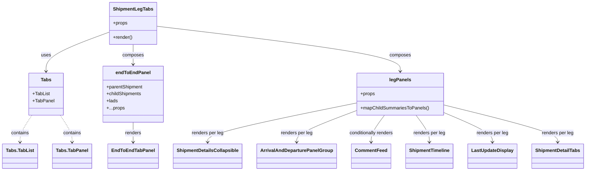

# Diagram: web/portal/src/modules/shipment-detail/multimodal/ShipmentLegTabs.js


> Auto-generated by Obscura crawlers

## Diagram 1



### SVG

<svg id="container" width="1929.232421875" xmlns="http://www.w3.org/2000/svg" class="classDiagram" height="584" viewBox="0 0 1929.232421875 584" role="graphics-document document" aria-roledescription="class"><style>#container{font-family:"trebuchet ms",verdana,arial,sans-serif;font-size:16px;fill:#333;}@keyframes edge-animation-frame{from{stroke-dashoffset:0;}}@keyframes dash{to{stroke-dashoffset:0;}}#container .edge-animation-slow{stroke-dasharray:9,5!important;stroke-dashoffset:900;animation:dash 50s linear infinite;stroke-linecap:round;}#container .edge-animation-fast{stroke-dasharray:9,5!important;stroke-dashoffset:900;animation:dash 20s linear infinite;stroke-linecap:round;}#container .error-icon{fill:#552222;}#container .error-text{fill:#552222;stroke:#552222;}#container .edge-thickness-normal{stroke-width:1px;}#container .edge-thickness-thick{stroke-width:3.5px;}#container .edge-pattern-solid{stroke-dasharray:0;}#container .edge-thickness-invisible{stroke-width:0;fill:none;}#container .edge-pattern-dashed{stroke-dasharray:3;}#container .edge-pattern-dotted{stroke-dasharray:2;}#container .marker{fill:#333333;stroke:#333333;}#container .marker.cross{stroke:#333333;}#container svg{font-family:"trebuchet ms",verdana,arial,sans-serif;font-size:16px;}#container p{margin:0;}#container g.classGroup text{fill:#9370DB;stroke:none;font-family:"trebuchet ms",verdana,arial,sans-serif;font-size:10px;}#container g.classGroup text .title{font-weight:bolder;}#container .nodeLabel,#container .edgeLabel{color:#131300;}#container .edgeLabel .label rect{fill:#ECECFF;}#container .label text{fill:#131300;}#container .labelBkg{background:#ECECFF;}#container .edgeLabel .label span{background:#ECECFF;}#container .classTitle{font-weight:bolder;}#container .node rect,#container .node circle,#container .node ellipse,#container .node polygon,#container .node path{fill:#ECECFF;stroke:#9370DB;stroke-width:1px;}#container .divider{stroke:#9370DB;stroke-width:1;}#container g.clickable{cursor:pointer;}#container g.classGroup rect{fill:#ECECFF;stroke:#9370DB;}#container g.classGroup line{stroke:#9370DB;stroke-width:1;}#container .classLabel .box{stroke:none;stroke-width:0;fill:#ECECFF;opacity:0.5;}#container .classLabel .label{fill:#9370DB;font-size:10px;}#container .relation{stroke:#333333;stroke-width:1;fill:none;}#container .dashed-line{stroke-dasharray:3;}#container .dotted-line{stroke-dasharray:1 2;}#container #compositionStart,#container .composition{fill:#333333!important;stroke:#333333!important;stroke-width:1;}#container #compositionEnd,#container .composition{fill:#333333!important;stroke:#333333!important;stroke-width:1;}#container #dependencyStart,#container .dependency{fill:#333333!important;stroke:#333333!important;stroke-width:1;}#container #dependencyStart,#container .dependency{fill:#333333!important;stroke:#333333!important;stroke-width:1;}#container #extensionStart,#container .extension{fill:transparent!important;stroke:#333333!important;stroke-width:1;}#container #extensionEnd,#container .extension{fill:transparent!important;stroke:#333333!important;stroke-width:1;}#container #aggregationStart,#container .aggregation{fill:transparent!important;stroke:#333333!important;stroke-width:1;}#container #aggregationEnd,#container .aggregation{fill:transparent!important;stroke:#333333!important;stroke-width:1;}#container #lollipopStart,#container .lollipop{fill:#ECECFF!important;stroke:#333333!important;stroke-width:1;}#container #lollipopEnd,#container .lollipop{fill:#ECECFF!important;stroke:#333333!important;stroke-width:1;}#container .edgeTerminals{font-size:11px;line-height:initial;}#container .classTitleText{text-anchor:middle;font-size:18px;fill:#333;}#container .label-icon{display:inline-block;height:1em;overflow:visible;vertical-align:-0.125em;}#container .node .label-icon path{fill:currentColor;stroke:revert;stroke-width:revert;}#container :root{--mermaid-font-family:"trebuchet ms",verdana,arial,sans-serif;}</style><g><defs><marker id="container_class-aggregationStart" class="marker aggregation class" refX="18" refY="7" markerWidth="190" markerHeight="240" orient="auto"><path d="M 18,7 L9,13 L1,7 L9,1 Z"></path></marker></defs><defs><marker id="container_class-aggregationEnd" class="marker aggregation class" refX="1" refY="7" markerWidth="20" markerHeight="28" orient="auto"><path d="M 18,7 L9,13 L1,7 L9,1 Z"></path></marker></defs><defs><marker id="container_class-extensionStart" class="marker extension class" refX="18" refY="7" markerWidth="190" markerHeight="240" orient="auto"><path d="M 1,7 L18,13 V 1 Z"></path></marker></defs><defs><marker id="container_class-extensionEnd" class="marker extension class" refX="1" refY="7" markerWidth="20" markerHeight="28" orient="auto"><path d="M 1,1 V 13 L18,7 Z"></path></marker></defs><defs><marker id="container_class-compositionStart" class="marker composition class" refX="18" refY="7" markerWidth="190" markerHeight="240" orient="auto"><path d="M 18,7 L9,13 L1,7 L9,1 Z"></path></marker></defs><defs><marker id="container_class-compositionEnd" class="marker composition class" refX="1" refY="7" markerWidth="20" markerHeight="28" orient="auto"><path d="M 18,7 L9,13 L1,7 L9,1 Z"></path></marker></defs><defs><marker id="container_class-dependencyStart" class="marker dependency class" refX="6" refY="7" markerWidth="190" markerHeight="240" orient="auto"><path d="M 5,7 L9,13 L1,7 L9,1 Z"></path></marker></defs><defs><marker id="container_class-dependencyEnd" class="marker dependency class" refX="13" refY="7" markerWidth="20" markerHeight="28" orient="auto"><path d="M 18,7 L9,13 L14,7 L9,1 Z"></path></marker></defs><defs><marker id="container_class-lollipopStart" class="marker lollipop class" refX="13" refY="7" markerWidth="190" markerHeight="240" orient="auto"><circle stroke="black" fill="transparent" cx="7" cy="7" r="6"></circle></marker></defs><defs><marker id="container_class-lollipopEnd" class="marker lollipop class" refX="1" refY="7" markerWidth="190" markerHeight="240" orient="auto"><circle stroke="black" fill="transparent" cx="7" cy="7" r="6"></circle></marker></defs><g class="root"><g class="clusters"></g><g class="edgePaths"><path d="M359.561,109.481L324.632,122.734C289.704,135.987,219.848,162.494,184.92,184.913C149.992,207.333,149.992,225.667,149.992,234.833L149.992,244" id="id_ShipmentLegTabs_Tabs_1" class="edge-thickness-normal edge-pattern-solid relation" style=";;;" data-edge="true" data-et="edge" data-id="id_ShipmentLegTabs_Tabs_1" data-points="W3sieCI6MzU5LjU2MDU0Njg3NSwieSI6MTA5LjQ4MDg5MTIyMTcyNDM4fSx7IngiOjE0OS45OTIxODc1LCJ5IjoxODl9LHsieCI6MTQ5Ljk5MjE4NzUsInkiOjI1MH1d" marker-end="url(#container_class-dependencyEnd)"></path><path d="M437.256,152L437.256,158.167C437.256,164.333,437.256,176.667,437.256,188C437.256,199.333,437.256,209.667,437.256,214.833L437.256,220" id="id_ShipmentLegTabs_endToEndPanel_2" class="edge-thickness-normal edge-pattern-solid relation" style=";;;" data-edge="true" data-et="edge" data-id="id_ShipmentLegTabs_endToEndPanel_2" data-points="W3sieCI6NDM3LjI1NTg1OTM3NSwieSI6MTUyfSx7IngiOjQzNy4yNTU4NTkzNzUsInkiOjE4OX0seyJ4Ijo0MzcuMjU1ODU5Mzc1LCJ5IjoyMjZ9XQ==" marker-end="url(#container_class-dependencyEnd)"></path><path d="M514.951,89.662L648.085,106.218C781.219,122.775,1047.488,155.887,1180.622,181.61C1313.756,207.333,1313.756,225.667,1313.756,234.833L1313.756,244" id="id_ShipmentLegTabs_legPanels_3" class="edge-thickness-normal edge-pattern-solid relation" style=";;;" data-edge="true" data-et="edge" data-id="id_ShipmentLegTabs_legPanels_3" data-points="W3sieCI6NTE0Ljk1MTE3MTg3NSwieSI6ODkuNjYyMDUyNTUyNzY2Njh9LHsieCI6MTMxMy43NTU4NTkzNzUsInkiOjE4OX0seyJ4IjoxMzEzLjc1NTg1OTM3NSwieSI6MjUwfV0=" marker-end="url(#container_class-dependencyEnd)"></path><path d="M437.256,418L437.256,424.167C437.256,430.333,437.256,442.667,437.256,454C437.256,465.333,437.256,475.667,437.256,480.833L437.256,486" id="id_endToEndPanel_EndToEndTabPanel_4" class="edge-thickness-normal edge-pattern-solid relation" style=";;;" data-edge="true" data-et="edge" data-id="id_endToEndPanel_EndToEndTabPanel_4" data-points="W3sieCI6NDM3LjI1NTg1OTM3NSwieSI6NDE4fSx7IngiOjQzNy4yNTU4NTkzNzUsInkiOjQ1NX0seyJ4Ijo0MzcuMjU1ODU5Mzc1LCJ5Ijo0OTJ9XQ==" marker-end="url(#container_class-dependencyEnd)"></path><path d="M1168.006,352.654L1086.903,369.712C1005.8,386.77,843.594,420.885,762.492,443.109C681.389,465.333,681.389,475.667,681.389,480.833L681.389,486" id="id_legPanels_ShipmentDetailsCollapsible_5" class="edge-thickness-normal edge-pattern-solid relation" style=";;;" data-edge="true" data-et="edge" data-id="id_legPanels_ShipmentDetailsCollapsible_5" data-points="W3sieCI6MTE2OC4wMDU4NTkzNzUsInkiOjM1Mi42NTQyNjI4NzYzNDUwNn0seyJ4Ijo2ODEuMzg4NjcxODc1LCJ5Ijo0NTV9LHsieCI6NjgxLjM4ODY3MTg3NSwieSI6NDkyfV0=" marker-end="url(#container_class-dependencyEnd)"></path><path d="M1168.006,379.064L1135.68,391.72C1103.355,404.376,1038.704,429.688,1006.378,447.511C974.053,465.333,974.053,475.667,974.053,480.833L974.053,486" id="id_legPanels_ArrivalAndDeparturePanelGroup_6" class="edge-thickness-normal edge-pattern-solid relation" style=";;;" data-edge="true" data-et="edge" data-id="id_legPanels_ArrivalAndDeparturePanelGroup_6" data-points="W3sieCI6MTE2OC4wMDU4NTkzNzUsInkiOjM3OS4wNjM3OTY1MTM0OTk4fSx7IngiOjk3NC4wNTI3MzQzNzUsInkiOjQ1NX0seyJ4Ijo5NzQuMDUyNzM0Mzc1LCJ5Ijo0OTJ9XQ==" marker-end="url(#container_class-dependencyEnd)"></path><path d="M1261.642,394L1254.283,404.167C1246.925,414.333,1232.208,434.667,1224.849,450C1217.49,465.333,1217.49,475.667,1217.49,480.833L1217.49,486" id="id_legPanels_CommentFeed_7" class="edge-thickness-normal edge-pattern-solid relation" style=";;;" data-edge="true" data-et="edge" data-id="id_legPanels_CommentFeed_7" data-points="W3sieCI6MTI2MS42NDIxMzc1NzA0ODg4LCJ5IjozOTR9LHsieCI6MTIxNy40OTAyMzQzNzUsInkiOjQ1NX0seyJ4IjoxMjE3LjQ5MDIzNDM3NSwieSI6NDkyfV0=" marker-end="url(#container_class-dependencyEnd)"></path><path d="M1365.87,394L1373.228,404.167C1380.587,414.333,1395.304,434.667,1402.663,450C1410.021,465.333,1410.021,475.667,1410.021,480.833L1410.021,486" id="id_legPanels_ShipmentTimeline_8" class="edge-thickness-normal edge-pattern-solid relation" style=";;;" data-edge="true" data-et="edge" data-id="id_legPanels_ShipmentTimeline_8" data-points="W3sieCI6MTM2NS44Njk1ODExNzk1MTEyLCJ5IjozOTR9LHsieCI6MTQxMC4wMjE0ODQzNzUsInkiOjQ1NX0seyJ4IjoxNDEwLjAyMTQ4NDM3NSwieSI6NDkyfV0=" marker-end="url(#container_class-dependencyEnd)"></path><path d="M1459.506,385.464L1486.122,397.053C1512.738,408.643,1565.969,431.821,1592.585,448.577C1619.201,465.333,1619.201,475.667,1619.201,480.833L1619.201,486" id="id_legPanels_LastUpdateDisplay_9" class="edge-thickness-normal edge-pattern-solid relation" style=";;;" data-edge="true" data-et="edge" data-id="id_legPanels_LastUpdateDisplay_9" data-points="W3sieCI6MTQ1OS41MDU4NTkzNzUsInkiOjM4NS40NjM4OTc0ODU3NDA2fSx7IngiOjE2MTkuMjAxMTcxODc1LCJ5Ijo0NTV9LHsieCI6MTYxOS4yMDExNzE4NzUsInkiOjQ5Mn1d" marker-end="url(#container_class-dependencyEnd)"></path><path d="M1459.506,359.151L1522.179,375.125C1584.852,391.1,1710.199,423.05,1772.872,444.192C1835.545,465.333,1835.545,475.667,1835.545,480.833L1835.545,486" id="id_legPanels_ShipmentDetailTabs_10" class="edge-thickness-normal edge-pattern-solid relation" style=";;;" data-edge="true" data-et="edge" data-id="id_legPanels_ShipmentDetailTabs_10" data-points="W3sieCI6MTQ1OS41MDU4NTkzNzUsInkiOjM1OS4xNTA1NDg3NDMwNTY1fSx7IngiOjE4MzUuNTQ0OTIxODc1LCJ5Ijo0NTV9LHsieCI6MTgzNS41NDQ5MjE4NzUsInkiOjQ5Mn1d" marker-end="url(#container_class-dependencyEnd)"></path><path d="M103.863,394L97.349,404.167C90.836,414.333,77.808,434.667,71.295,450C64.781,465.333,64.781,475.667,64.781,480.833L64.781,486" id="id_Tabs_Tabs.TabList_11" class="edge-thickness-normal edge-pattern-dashed relation" style=";;;" data-edge="true" data-et="edge" data-id="id_Tabs_Tabs.TabList_11" data-points="W3sieCI6MTAzLjg2Mjk1ODE3NjY5MTczLCJ5IjozOTR9LHsieCI6NjQuNzgxMjUsInkiOjQ1NX0seyJ4Ijo2NC43ODEyNSwieSI6NDkyfV0=" marker-end="url(#container_class-dependencyEnd)"></path><path d="M196.121,394L202.635,404.167C209.149,414.333,222.176,434.667,228.69,450C235.203,465.333,235.203,475.667,235.203,480.833L235.203,486" id="id_Tabs_Tabs.TabPanel_12" class="edge-thickness-normal edge-pattern-dashed relation" style=";;;" data-edge="true" data-et="edge" data-id="id_Tabs_Tabs.TabPanel_12" data-points="W3sieCI6MTk2LjEyMTQxNjgyMzMwODI3LCJ5IjozOTR9LHsieCI6MjM1LjIwMzEyNSwieSI6NDU1fSx7IngiOjIzNS4yMDMxMjUsInkiOjQ5Mn1d" marker-end="url(#container_class-dependencyEnd)"></path></g><g class="edgeLabels"><g class="edgeLabel" transform="translate(149.9921875, 189)"><g class="label" data-id="id_ShipmentLegTabs_Tabs_1" transform="translate(-16.4921875, -12)"><foreignObject width="32.984375" height="24"><div xmlns="http://www.w3.org/1999/xhtml" class="labelBkg" style="display: table-cell; white-space: nowrap; line-height: 1.5; max-width: 200px; text-align: center;"><span class="edgeLabel"><p>uses</p></span></div></foreignObject></g></g><g class="edgeLabel" transform="translate(437.255859375, 189)"><g class="label" data-id="id_ShipmentLegTabs_endToEndPanel_2" transform="translate(-36.453125, -12)"><foreignObject width="72.90625" height="24"><div xmlns="http://www.w3.org/1999/xhtml" class="labelBkg" style="display: table-cell; white-space: nowrap; line-height: 1.5; max-width: 200px; text-align: center;"><span class="edgeLabel"><p>composes</p></span></div></foreignObject></g></g><g class="edgeLabel" transform="translate(1313.755859375, 189)"><g class="label" data-id="id_ShipmentLegTabs_legPanels_3" transform="translate(-36.453125, -12)"><foreignObject width="72.90625" height="24"><div xmlns="http://www.w3.org/1999/xhtml" class="labelBkg" style="display: table-cell; white-space: nowrap; line-height: 1.5; max-width: 200px; text-align: center;"><span class="edgeLabel"><p>composes</p></span></div></foreignObject></g></g><g class="edgeLabel" transform="translate(437.255859375, 455)"><g class="label" data-id="id_endToEndPanel_EndToEndTabPanel_4" transform="translate(-27.75, -12)"><foreignObject width="55.5" height="24"><div xmlns="http://www.w3.org/1999/xhtml" class="labelBkg" style="display: table-cell; white-space: nowrap; line-height: 1.5; max-width: 200px; text-align: center;"><span class="edgeLabel"><p>renders</p></span></div></foreignObject></g></g><g class="edgeLabel" transform="translate(681.388671875, 455)"><g class="label" data-id="id_legPanels_ShipmentDetailsCollapsible_5" transform="translate(-55.015625, -12)"><foreignObject width="110.03125" height="24"><div xmlns="http://www.w3.org/1999/xhtml" class="labelBkg" style="display: table-cell; white-space: nowrap; line-height: 1.5; max-width: 200px; text-align: center;"><span class="edgeLabel"><p>renders per leg</p></span></div></foreignObject></g></g><g class="edgeLabel" transform="translate(974.052734375, 455)"><g class="label" data-id="id_legPanels_ArrivalAndDeparturePanelGroup_6" transform="translate(-55.015625, -12)"><foreignObject width="110.03125" height="24"><div xmlns="http://www.w3.org/1999/xhtml" class="labelBkg" style="display: table-cell; white-space: nowrap; line-height: 1.5; max-width: 200px; text-align: center;"><span class="edgeLabel"><p>renders per leg</p></span></div></foreignObject></g></g><g class="edgeLabel" transform="translate(1217.490234375, 455)"><g class="label" data-id="id_legPanels_CommentFeed_7" transform="translate(-77.25, -12)"><foreignObject width="154.5" height="24"><div xmlns="http://www.w3.org/1999/xhtml" class="labelBkg" style="display: table-cell; white-space: nowrap; line-height: 1.5; max-width: 200px; text-align: center;"><span class="edgeLabel"><p>conditionally renders</p></span></div></foreignObject></g></g><g class="edgeLabel" transform="translate(1410.021484375, 455)"><g class="label" data-id="id_legPanels_ShipmentTimeline_8" transform="translate(-55.015625, -12)"><foreignObject width="110.03125" height="24"><div xmlns="http://www.w3.org/1999/xhtml" class="labelBkg" style="display: table-cell; white-space: nowrap; line-height: 1.5; max-width: 200px; text-align: center;"><span class="edgeLabel"><p>renders per leg</p></span></div></foreignObject></g></g><g class="edgeLabel" transform="translate(1619.201171875, 455)"><g class="label" data-id="id_legPanels_LastUpdateDisplay_9" transform="translate(-55.015625, -12)"><foreignObject width="110.03125" height="24"><div xmlns="http://www.w3.org/1999/xhtml" class="labelBkg" style="display: table-cell; white-space: nowrap; line-height: 1.5; max-width: 200px; text-align: center;"><span class="edgeLabel"><p>renders per leg</p></span></div></foreignObject></g></g><g class="edgeLabel" transform="translate(1835.544921875, 455)"><g class="label" data-id="id_legPanels_ShipmentDetailTabs_10" transform="translate(-55.015625, -12)"><foreignObject width="110.03125" height="24"><div xmlns="http://www.w3.org/1999/xhtml" class="labelBkg" style="display: table-cell; white-space: nowrap; line-height: 1.5; max-width: 200px; text-align: center;"><span class="edgeLabel"><p>renders per leg</p></span></div></foreignObject></g></g><g class="edgeLabel" transform="translate(64.78125, 455)"><g class="label" data-id="id_Tabs_Tabs.TabList_11" transform="translate(-30.890625, -12)"><foreignObject width="61.78125" height="24"><div xmlns="http://www.w3.org/1999/xhtml" class="labelBkg" style="display: table-cell; white-space: nowrap; line-height: 1.5; max-width: 200px; text-align: center;"><span class="edgeLabel"><p>contains</p></span></div></foreignObject></g></g><g class="edgeLabel" transform="translate(235.203125, 455)"><g class="label" data-id="id_Tabs_Tabs.TabPanel_12" transform="translate(-30.890625, -12)"><foreignObject width="61.78125" height="24"><div xmlns="http://www.w3.org/1999/xhtml" class="labelBkg" style="display: table-cell; white-space: nowrap; line-height: 1.5; max-width: 200px; text-align: center;"><span class="edgeLabel"><p>contains</p></span></div></foreignObject></g></g></g><g class="nodes"><g class="node default" id="classId-ShipmentLegTabs-0" transform="translate(437.255859375, 80)"><g class="basic label-container"><path d="M-77.6953125 -72 L77.6953125 -72 L77.6953125 72 L-77.6953125 72" stroke="none" stroke-width="0" fill="#ECECFF" style=""></path><path d="M-77.6953125 -72 C-21.26283476928503 -72, 35.16964296142994 -72, 77.6953125 -72 M-77.6953125 -72 C-19.0626686353463 -72, 39.5699752293074 -72, 77.6953125 -72 M77.6953125 -72 C77.6953125 -27.29101394881721, 77.6953125 17.41797210236558, 77.6953125 72 M77.6953125 -72 C77.6953125 -31.894555998748523, 77.6953125 8.210888002502955, 77.6953125 72 M77.6953125 72 C19.976800424320622 72, -37.741711651358756 72, -77.6953125 72 M77.6953125 72 C36.15012024433751 72, -5.395072011324984 72, -77.6953125 72 M-77.6953125 72 C-77.6953125 26.27040553824282, -77.6953125 -19.45918892351436, -77.6953125 -72 M-77.6953125 72 C-77.6953125 16.12326182981178, -77.6953125 -39.75347634037644, -77.6953125 -72" stroke="#9370DB" stroke-width="1.3" fill="none" stroke-dasharray="0 0" style=""></path></g><g class="annotation-group text" transform="translate(0, -48)"></g><g class="label-group text" transform="translate(-64.78125, -48)"><g class="label" style="font-weight: bolder" transform="translate(0,-12)"><foreignObject width="129.5625" height="24"><div xmlns="http://www.w3.org/1999/xhtml" style="display: table-cell; white-space: nowrap; line-height: 1.5; max-width: 177px; text-align: center;"><span class="nodeLabel markdown-node-label" style=""><p>ShipmentLegTabs</p></span></div></foreignObject></g></g><g class="members-group text" transform="translate(-65.6953125, 0)"><g class="label" style="" transform="translate(0,-12)"><foreignObject width="49.515625" height="24"><div xmlns="http://www.w3.org/1999/xhtml" style="display: table-cell; white-space: nowrap; line-height: 1.5; max-width: 107px; text-align: center;"><span class="nodeLabel markdown-node-label" style=""><p>+props</p></span></div></foreignObject></g></g><g class="methods-group text" transform="translate(-65.6953125, 48)"><g class="label" style="" transform="translate(0,-12)"><foreignObject width="66.609375" height="24"><div xmlns="http://www.w3.org/1999/xhtml" style="display: table-cell; white-space: nowrap; line-height: 1.5; max-width: 124px; text-align: center;"><span class="nodeLabel markdown-node-label" style=""><p>+render()</p></span></div></foreignObject></g></g><g class="divider" style=""><path d="M-77.6953125 -24 C-33.72900266794031 -24, 10.237307164119386 -24, 77.6953125 -24 M-77.6953125 -24 C-27.902231040288328 -24, 21.890850419423344 -24, 77.6953125 -24" stroke="#9370DB" stroke-width="1.3" fill="none" stroke-dasharray="0 0" style=""></path></g><g class="divider" style=""><path d="M-77.6953125 24 C-34.24933906083063 24, 9.196634378338743 24, 77.6953125 24 M-77.6953125 24 C-22.46346186357944 24, 32.76838877284112 24, 77.6953125 24" stroke="#9370DB" stroke-width="1.3" fill="none" stroke-dasharray="0 0" style=""></path></g></g><g class="node default" id="classId-endToEndPanel-1" transform="translate(437.255859375, 322)"><g class="basic label-container"><path d="M-102.703125 -96 L102.703125 -96 L102.703125 96 L-102.703125 96" stroke="none" stroke-width="0" fill="#ECECFF" style=""></path><path d="M-102.703125 -96 C-28.52101507188243 -96, 45.66109485623514 -96, 102.703125 -96 M-102.703125 -96 C-55.849762622931536 -96, -8.996400245863072 -96, 102.703125 -96 M102.703125 -96 C102.703125 -22.54300603269901, 102.703125 50.91398793460198, 102.703125 96 M102.703125 -96 C102.703125 -24.795409376738235, 102.703125 46.40918124652353, 102.703125 96 M102.703125 96 C55.467066360151684 96, 8.231007720303367 96, -102.703125 96 M102.703125 96 C20.81541881734711 96, -61.07228736530578 96, -102.703125 96 M-102.703125 96 C-102.703125 30.58607787611996, -102.703125 -34.82784424776008, -102.703125 -96 M-102.703125 96 C-102.703125 31.66395191695696, -102.703125 -32.67209616608608, -102.703125 -96" stroke="#9370DB" stroke-width="1.3" fill="none" stroke-dasharray="0 0" style=""></path></g><g class="annotation-group text" transform="translate(0, -72)"></g><g class="label-group text" transform="translate(-56.109375, -72)"><g class="label" style="font-weight: bolder" transform="translate(0,-12)"><foreignObject width="112.21875" height="24"><div xmlns="http://www.w3.org/1999/xhtml" style="display: table-cell; white-space: nowrap; line-height: 1.5; max-width: 162px; text-align: center;"><span class="nodeLabel markdown-node-label" style=""><p>endToEndPanel</p></span></div></foreignObject></g></g><g class="members-group text" transform="translate(-90.703125, -24)"><g class="label" style="" transform="translate(0,-12)"><foreignObject width="125.296875" height="24"><div xmlns="http://www.w3.org/1999/xhtml" style="display: table-cell; white-space: nowrap; line-height: 1.5; max-width: 183px; text-align: center;"><span class="nodeLabel markdown-node-label" style=""><p>+parentShipment</p></span></div></foreignObject></g><g class="label" style="" transform="translate(0,12)"><foreignObject width="120.875" height="24"><div xmlns="http://www.w3.org/1999/xhtml" style="display: table-cell; white-space: nowrap; line-height: 1.5; max-width: 178px; text-align: center;"><span class="nodeLabel markdown-node-label" style=""><p>+childShipments</p></span></div></foreignObject></g><g class="label" style="" transform="translate(0,36)"><foreignObject width="38.34375" height="24"><div xmlns="http://www.w3.org/1999/xhtml" style="display: table-cell; white-space: nowrap; line-height: 1.5; max-width: 96px; text-align: center;"><span class="nodeLabel markdown-node-label" style=""><p>+lads</p></span></div></foreignObject></g><g class="label" style="" transform="translate(0,60)"><foreignObject width="60.234375" height="24"><div xmlns="http://www.w3.org/1999/xhtml" style="display: table-cell; white-space: nowrap; line-height: 1.5; max-width: 118px; text-align: center;"><span class="nodeLabel markdown-node-label" style=""><p>+...props</p></span></div></foreignObject></g></g><g class="methods-group text" transform="translate(-90.703125, 96)"></g><g class="divider" style=""><path d="M-102.703125 -48 C-29.79909410806212 -48, 43.10493678387576 -48, 102.703125 -48 M-102.703125 -48 C-60.39400407612058 -48, -18.08488315224116 -48, 102.703125 -48" stroke="#9370DB" stroke-width="1.3" fill="none" stroke-dasharray="0 0" style=""></path></g><g class="divider" style=""><path d="M-102.703125 72 C-42.259335800701926 72, 18.184453398596148 72, 102.703125 72 M-102.703125 72 C-48.58964833940106 72, 5.5238283211978825 72, 102.703125 72" stroke="#9370DB" stroke-width="1.3" fill="none" stroke-dasharray="0 0" style=""></path></g></g><g class="node default" id="classId-legPanels-2" transform="translate(1313.755859375, 322)"><g class="basic label-container"><path d="M-145.75 -72 L145.75 -72 L145.75 72 L-145.75 72" stroke="none" stroke-width="0" fill="#ECECFF" style=""></path><path d="M-145.75 -72 C-51.02246512712864 -72, 43.70506974574272 -72, 145.75 -72 M-145.75 -72 C-34.13751341724935 -72, 77.4749731655013 -72, 145.75 -72 M145.75 -72 C145.75 -41.66801499145472, 145.75 -11.336029982909437, 145.75 72 M145.75 -72 C145.75 -23.035881836835287, 145.75 25.928236326329426, 145.75 72 M145.75 72 C57.65423454913679 72, -30.441530901726424 72, -145.75 72 M145.75 72 C57.973205649641926 72, -29.803588700716148 72, -145.75 72 M-145.75 72 C-145.75 28.21595769592836, -145.75 -15.56808460814328, -145.75 -72 M-145.75 72 C-145.75 32.1031777861825, -145.75 -7.793644427635002, -145.75 -72" stroke="#9370DB" stroke-width="1.3" fill="none" stroke-dasharray="0 0" style=""></path></g><g class="annotation-group text" transform="translate(0, -48)"></g><g class="label-group text" transform="translate(-35.203125, -48)"><g class="label" style="font-weight: bolder" transform="translate(0,-12)"><foreignObject width="70.40625" height="24"><div xmlns="http://www.w3.org/1999/xhtml" style="display: table-cell; white-space: nowrap; line-height: 1.5; max-width: 119px; text-align: center;"><span class="nodeLabel markdown-node-label" style=""><p>legPanels</p></span></div></foreignObject></g></g><g class="members-group text" transform="translate(-133.75, 0)"><g class="label" style="" transform="translate(0,-12)"><foreignObject width="49.515625" height="24"><div xmlns="http://www.w3.org/1999/xhtml" style="display: table-cell; white-space: nowrap; line-height: 1.5; max-width: 107px; text-align: center;"><span class="nodeLabel markdown-node-label" style=""><p>+props</p></span></div></foreignObject></g></g><g class="methods-group text" transform="translate(-133.75, 48)"><g class="label" style="" transform="translate(0,-12)"><foreignObject width="232.296875" height="24"><div xmlns="http://www.w3.org/1999/xhtml" style="display: table-cell; white-space: nowrap; line-height: 1.5; max-width: 290px; text-align: center;"><span class="nodeLabel markdown-node-label" style=""><p>+mapChildSummariesToPanels()</p></span></div></foreignObject></g></g><g class="divider" style=""><path d="M-145.75 -24 C-60.14504814205324 -24, 25.459903715893518 -24, 145.75 -24 M-145.75 -24 C-77.94282322019012 -24, -10.135646440380242 -24, 145.75 -24" stroke="#9370DB" stroke-width="1.3" fill="none" stroke-dasharray="0 0" style=""></path></g><g class="divider" style=""><path d="M-145.75 24 C-36.83669576700666 24, 72.07660846598668 24, 145.75 24 M-145.75 24 C-59.127154680549324 24, 27.49569063890135 24, 145.75 24" stroke="#9370DB" stroke-width="1.3" fill="none" stroke-dasharray="0 0" style=""></path></g></g><g class="node default" id="classId-Tabs-3" transform="translate(149.9921875, 322)"><g class="basic label-container"><path d="M-56.86328125 -72 L56.86328125 -72 L56.86328125 72 L-56.86328125 72" stroke="none" stroke-width="0" fill="#ECECFF" style=""></path><path d="M-56.86328125 -72 C-29.055452361886722 -72, -1.2476234737734444 -72, 56.86328125 -72 M-56.86328125 -72 C-26.594392692881883 -72, 3.674495864236235 -72, 56.86328125 -72 M56.86328125 -72 C56.86328125 -19.449791411015518, 56.86328125 33.100417177968964, 56.86328125 72 M56.86328125 -72 C56.86328125 -31.77533097191528, 56.86328125 8.449338056169438, 56.86328125 72 M56.86328125 72 C32.046879917918695 72, 7.230478585837389 72, -56.86328125 72 M56.86328125 72 C32.238930208556475 72, 7.61457916711295 72, -56.86328125 72 M-56.86328125 72 C-56.86328125 16.88753515188884, -56.86328125 -38.22492969622232, -56.86328125 -72 M-56.86328125 72 C-56.86328125 26.40716238369332, -56.86328125 -19.185675232613363, -56.86328125 -72" stroke="#9370DB" stroke-width="1.3" fill="none" stroke-dasharray="0 0" style=""></path></g><g class="annotation-group text" transform="translate(0, -48)"></g><g class="label-group text" transform="translate(-16.9453125, -48)"><g class="label" style="font-weight: bolder" transform="translate(0,-12)"><foreignObject width="33.890625" height="24"><div xmlns="http://www.w3.org/1999/xhtml" style="display: table-cell; white-space: nowrap; line-height: 1.5; max-width: 83px; text-align: center;"><span class="nodeLabel markdown-node-label" style=""><p>Tabs</p></span></div></foreignObject></g></g><g class="members-group text" transform="translate(-44.86328125, 0)"><g class="label" style="" transform="translate(0,-12)"><foreignObject width="58.59375" height="24"><div xmlns="http://www.w3.org/1999/xhtml" style="display: table-cell; white-space: nowrap; line-height: 1.5; max-width: 116px; text-align: center;"><span class="nodeLabel markdown-node-label" style=""><p>+TabList</p></span></div></foreignObject></g><g class="label" style="" transform="translate(0,12)"><foreignObject width="72.78125" height="24"><div xmlns="http://www.w3.org/1999/xhtml" style="display: table-cell; white-space: nowrap; line-height: 1.5; max-width: 130px; text-align: center;"><span class="nodeLabel markdown-node-label" style=""><p>+TabPanel</p></span></div></foreignObject></g></g><g class="methods-group text" transform="translate(-44.86328125, 72)"></g><g class="divider" style=""><path d="M-56.86328125 -24 C-20.010339403296655 -24, 16.84260244340669 -24, 56.86328125 -24 M-56.86328125 -24 C-23.6387259082285 -24, 9.585829433542997 -24, 56.86328125 -24" stroke="#9370DB" stroke-width="1.3" fill="none" stroke-dasharray="0 0" style=""></path></g><g class="divider" style=""><path d="M-56.86328125 48 C-17.627913430951068 48, 21.607454388097864 48, 56.86328125 48 M-56.86328125 48 C-22.003356457488586 48, 12.856568335022828 48, 56.86328125 48" stroke="#9370DB" stroke-width="1.3" fill="none" stroke-dasharray="0 0" style=""></path></g></g><g class="node default" id="classId-EndToEndTabPanel-4" transform="translate(437.255859375, 534)"><g class="basic label-container"><path d="M-80.8984375 -42 L80.8984375 -42 L80.8984375 42 L-80.8984375 42" stroke="none" stroke-width="0" fill="#ECECFF" style=""></path><path d="M-80.8984375 -42 C-17.281921887087677 -42, 46.33459372582465 -42, 80.8984375 -42 M-80.8984375 -42 C-39.16109230618288 -42, 2.57625288763424 -42, 80.8984375 -42 M80.8984375 -42 C80.8984375 -14.863549600848707, 80.8984375 12.272900798302587, 80.8984375 42 M80.8984375 -42 C80.8984375 -17.647482729013422, 80.8984375 6.705034541973156, 80.8984375 42 M80.8984375 42 C32.561993281826794 42, -15.774450936346412 42, -80.8984375 42 M80.8984375 42 C25.678789063032873 42, -29.540859373934254 42, -80.8984375 42 M-80.8984375 42 C-80.8984375 20.114683647595093, -80.8984375 -1.7706327048098132, -80.8984375 -42 M-80.8984375 42 C-80.8984375 15.018264085411584, -80.8984375 -11.963471829176832, -80.8984375 -42" stroke="#9370DB" stroke-width="1.3" fill="none" stroke-dasharray="0 0" style=""></path></g><g class="annotation-group text" transform="translate(0, -18)"></g><g class="label-group text" transform="translate(-68.8984375, -18)"><g class="label" style="font-weight: bolder" transform="translate(0,-12)"><foreignObject width="137.796875" height="24"><div xmlns="http://www.w3.org/1999/xhtml" style="display: table-cell; white-space: nowrap; line-height: 1.5; max-width: 187px; text-align: center;"><span class="nodeLabel markdown-node-label" style=""><p>EndToEndTabPanel</p></span></div></foreignObject></g></g><g class="members-group text" transform="translate(-68.8984375, 30)"></g><g class="methods-group text" transform="translate(-68.8984375, 60)"></g><g class="divider" style=""><path d="M-80.8984375 6 C-20.563574640296395 6, 39.77128821940721 6, 80.8984375 6 M-80.8984375 6 C-36.845366582209806 6, 7.207704335580388 6, 80.8984375 6" stroke="#9370DB" stroke-width="1.3" fill="none" stroke-dasharray="0 0" style=""></path></g><g class="divider" style=""><path d="M-80.8984375 24 C-41.9849891641298 24, -3.0715408282596 24, 80.8984375 24 M-80.8984375 24 C-34.06873630518024 24, 12.760964889639524 24, 80.8984375 24" stroke="#9370DB" stroke-width="1.3" fill="none" stroke-dasharray="0 0" style=""></path></g></g><g class="node default" id="classId-ShipmentDetailsCollapsible-5" transform="translate(681.388671875, 534)"><g class="basic label-container"><path d="M-113.234375 -42 L113.234375 -42 L113.234375 42 L-113.234375 42" stroke="none" stroke-width="0" fill="#ECECFF" style=""></path><path d="M-113.234375 -42 C-67.74405617919525 -42, -22.25373735839051 -42, 113.234375 -42 M-113.234375 -42 C-28.5340577130721 -42, 56.1662595738558 -42, 113.234375 -42 M113.234375 -42 C113.234375 -21.584021326730056, 113.234375 -1.1680426534601125, 113.234375 42 M113.234375 -42 C113.234375 -13.023076763837103, 113.234375 15.953846472325793, 113.234375 42 M113.234375 42 C60.12202457921512 42, 7.0096741584302436 42, -113.234375 42 M113.234375 42 C51.05074631393521 42, -11.132882372129586 42, -113.234375 42 M-113.234375 42 C-113.234375 23.498521046146106, -113.234375 4.997042092292212, -113.234375 -42 M-113.234375 42 C-113.234375 13.236658272661941, -113.234375 -15.526683454676117, -113.234375 -42" stroke="#9370DB" stroke-width="1.3" fill="none" stroke-dasharray="0 0" style=""></path></g><g class="annotation-group text" transform="translate(0, -18)"></g><g class="label-group text" transform="translate(-101.234375, -18)"><g class="label" style="font-weight: bolder" transform="translate(0,-12)"><foreignObject width="202.46875" height="24"><div xmlns="http://www.w3.org/1999/xhtml" style="display: table-cell; white-space: nowrap; line-height: 1.5; max-width: 250px; text-align: center;"><span class="nodeLabel markdown-node-label" style=""><p>ShipmentDetailsCollapsible</p></span></div></foreignObject></g></g><g class="members-group text" transform="translate(-101.234375, 30)"></g><g class="methods-group text" transform="translate(-101.234375, 60)"></g><g class="divider" style=""><path d="M-113.234375 6 C-57.86074716837163 6, -2.4871193367432625 6, 113.234375 6 M-113.234375 6 C-44.74967542080391 6, 23.73502415839218 6, 113.234375 6" stroke="#9370DB" stroke-width="1.3" fill="none" stroke-dasharray="0 0" style=""></path></g><g class="divider" style=""><path d="M-113.234375 24 C-23.992546696754573 24, 65.24928160649085 24, 113.234375 24 M-113.234375 24 C-34.05412441462718 24, 45.126126170745636 24, 113.234375 24" stroke="#9370DB" stroke-width="1.3" fill="none" stroke-dasharray="0 0" style=""></path></g></g><g class="node default" id="classId-ArrivalAndDeparturePanelGroup-6" transform="translate(974.052734375, 534)"><g class="basic label-container"><path d="M-129.4296875 -42 L129.4296875 -42 L129.4296875 42 L-129.4296875 42" stroke="none" stroke-width="0" fill="#ECECFF" style=""></path><path d="M-129.4296875 -42 C-54.26097787498475 -42, 20.907731750030507 -42, 129.4296875 -42 M-129.4296875 -42 C-27.40854283099432 -42, 74.61260183801136 -42, 129.4296875 -42 M129.4296875 -42 C129.4296875 -10.606175894466041, 129.4296875 20.787648211067918, 129.4296875 42 M129.4296875 -42 C129.4296875 -10.9480075353747, 129.4296875 20.1039849292506, 129.4296875 42 M129.4296875 42 C47.94971084139907 42, -33.530265817201865 42, -129.4296875 42 M129.4296875 42 C65.44730321597021 42, 1.4649189319404172 42, -129.4296875 42 M-129.4296875 42 C-129.4296875 17.245680382226485, -129.4296875 -7.5086392355470295, -129.4296875 -42 M-129.4296875 42 C-129.4296875 17.835498786387536, -129.4296875 -6.329002427224928, -129.4296875 -42" stroke="#9370DB" stroke-width="1.3" fill="none" stroke-dasharray="0 0" style=""></path></g><g class="annotation-group text" transform="translate(0, -18)"></g><g class="label-group text" transform="translate(-117.4296875, -18)"><g class="label" style="font-weight: bolder" transform="translate(0,-12)"><foreignObject width="234.859375" height="24"><div xmlns="http://www.w3.org/1999/xhtml" style="display: table-cell; white-space: nowrap; line-height: 1.5; max-width: 282px; text-align: center;"><span class="nodeLabel markdown-node-label" style=""><p>ArrivalAndDeparturePanelGroup</p></span></div></foreignObject></g></g><g class="members-group text" transform="translate(-117.4296875, 30)"></g><g class="methods-group text" transform="translate(-117.4296875, 60)"></g><g class="divider" style=""><path d="M-129.4296875 6 C-55.3153564482608 6, 18.7989746034784 6, 129.4296875 6 M-129.4296875 6 C-26.84787818587172 6, 75.73393112825656 6, 129.4296875 6" stroke="#9370DB" stroke-width="1.3" fill="none" stroke-dasharray="0 0" style=""></path></g><g class="divider" style=""><path d="M-129.4296875 24 C-56.95514154826408 24, 15.519404403471839 24, 129.4296875 24 M-129.4296875 24 C-47.18741141313416 24, 35.054864673731686 24, 129.4296875 24" stroke="#9370DB" stroke-width="1.3" fill="none" stroke-dasharray="0 0" style=""></path></g></g><g class="node default" id="classId-CommentFeed-7" transform="translate(1217.490234375, 534)"><g class="basic label-container"><path d="M-64.0078125 -42 L64.0078125 -42 L64.0078125 42 L-64.0078125 42" stroke="none" stroke-width="0" fill="#ECECFF" style=""></path><path d="M-64.0078125 -42 C-18.082763423309203 -42, 27.842285653381595 -42, 64.0078125 -42 M-64.0078125 -42 C-16.731136176023718 -42, 30.545540147952565 -42, 64.0078125 -42 M64.0078125 -42 C64.0078125 -18.20322353549123, 64.0078125 5.593552929017541, 64.0078125 42 M64.0078125 -42 C64.0078125 -19.356416715087814, 64.0078125 3.2871665698243717, 64.0078125 42 M64.0078125 42 C17.122771253931084 42, -29.76226999213783 42, -64.0078125 42 M64.0078125 42 C23.714025282903364 42, -16.57976193419327 42, -64.0078125 42 M-64.0078125 42 C-64.0078125 12.39519087736273, -64.0078125 -17.20961824527454, -64.0078125 -42 M-64.0078125 42 C-64.0078125 10.231952303267235, -64.0078125 -21.53609539346553, -64.0078125 -42" stroke="#9370DB" stroke-width="1.3" fill="none" stroke-dasharray="0 0" style=""></path></g><g class="annotation-group text" transform="translate(0, -18)"></g><g class="label-group text" transform="translate(-52.0078125, -18)"><g class="label" style="font-weight: bolder" transform="translate(0,-12)"><foreignObject width="104.015625" height="24"><div xmlns="http://www.w3.org/1999/xhtml" style="display: table-cell; white-space: nowrap; line-height: 1.5; max-width: 154px; text-align: center;"><span class="nodeLabel markdown-node-label" style=""><p>CommentFeed</p></span></div></foreignObject></g></g><g class="members-group text" transform="translate(-52.0078125, 30)"></g><g class="methods-group text" transform="translate(-52.0078125, 60)"></g><g class="divider" style=""><path d="M-64.0078125 6 C-31.47466328820888 6, 1.0584859235822393 6, 64.0078125 6 M-64.0078125 6 C-14.278759504904173 6, 35.450293490191655 6, 64.0078125 6" stroke="#9370DB" stroke-width="1.3" fill="none" stroke-dasharray="0 0" style=""></path></g><g class="divider" style=""><path d="M-64.0078125 24 C-27.896620898412678 24, 8.214570703174644 24, 64.0078125 24 M-64.0078125 24 C-13.775731055733416 24, 36.45635038853317 24, 64.0078125 24" stroke="#9370DB" stroke-width="1.3" fill="none" stroke-dasharray="0 0" style=""></path></g></g><g class="node default" id="classId-ShipmentTimeline-8" transform="translate(1410.021484375, 534)"><g class="basic label-container"><path d="M-78.5234375 -42 L78.5234375 -42 L78.5234375 42 L-78.5234375 42" stroke="none" stroke-width="0" fill="#ECECFF" style=""></path><path d="M-78.5234375 -42 C-29.901346529860078 -42, 18.720744440279844 -42, 78.5234375 -42 M-78.5234375 -42 C-44.92370688332348 -42, -11.323976266646966 -42, 78.5234375 -42 M78.5234375 -42 C78.5234375 -15.002212797603722, 78.5234375 11.995574404792556, 78.5234375 42 M78.5234375 -42 C78.5234375 -9.257037203424176, 78.5234375 23.48592559315165, 78.5234375 42 M78.5234375 42 C35.485458568187155 42, -7.552520363625689 42, -78.5234375 42 M78.5234375 42 C44.18591788770076 42, 9.848398275401522 42, -78.5234375 42 M-78.5234375 42 C-78.5234375 20.909710070618424, -78.5234375 -0.18057985876315286, -78.5234375 -42 M-78.5234375 42 C-78.5234375 25.156916352341955, -78.5234375 8.313832704683911, -78.5234375 -42" stroke="#9370DB" stroke-width="1.3" fill="none" stroke-dasharray="0 0" style=""></path></g><g class="annotation-group text" transform="translate(0, -18)"></g><g class="label-group text" transform="translate(-66.5234375, -18)"><g class="label" style="font-weight: bolder" transform="translate(0,-12)"><foreignObject width="133.046875" height="24"><div xmlns="http://www.w3.org/1999/xhtml" style="display: table-cell; white-space: nowrap; line-height: 1.5; max-width: 182px; text-align: center;"><span class="nodeLabel markdown-node-label" style=""><p>ShipmentTimeline</p></span></div></foreignObject></g></g><g class="members-group text" transform="translate(-66.5234375, 30)"></g><g class="methods-group text" transform="translate(-66.5234375, 60)"></g><g class="divider" style=""><path d="M-78.5234375 6 C-45.907651162775245 6, -13.29186482555049 6, 78.5234375 6 M-78.5234375 6 C-38.89633730618551 6, 0.730762887628984 6, 78.5234375 6" stroke="#9370DB" stroke-width="1.3" fill="none" stroke-dasharray="0 0" style=""></path></g><g class="divider" style=""><path d="M-78.5234375 24 C-24.505404189043055 24, 29.51262912191389 24, 78.5234375 24 M-78.5234375 24 C-39.480488228487744 24, -0.4375389569754873 24, 78.5234375 24" stroke="#9370DB" stroke-width="1.3" fill="none" stroke-dasharray="0 0" style=""></path></g></g><g class="node default" id="classId-LastUpdateDisplay-9" transform="translate(1619.201171875, 534)"><g class="basic label-container"><path d="M-80.65625 -42 L80.65625 -42 L80.65625 42 L-80.65625 42" stroke="none" stroke-width="0" fill="#ECECFF" style=""></path><path d="M-80.65625 -42 C-20.374161972211795 -42, 39.90792605557641 -42, 80.65625 -42 M-80.65625 -42 C-33.42909940337911 -42, 13.798051193241776 -42, 80.65625 -42 M80.65625 -42 C80.65625 -9.280508702090259, 80.65625 23.438982595819482, 80.65625 42 M80.65625 -42 C80.65625 -12.780134928396148, 80.65625 16.439730143207704, 80.65625 42 M80.65625 42 C45.4620126357166 42, 10.267775271433194 42, -80.65625 42 M80.65625 42 C33.3941874442241 42, -13.867875111551797 42, -80.65625 42 M-80.65625 42 C-80.65625 17.298037404978896, -80.65625 -7.403925190042209, -80.65625 -42 M-80.65625 42 C-80.65625 14.849790824420928, -80.65625 -12.300418351158143, -80.65625 -42" stroke="#9370DB" stroke-width="1.3" fill="none" stroke-dasharray="0 0" style=""></path></g><g class="annotation-group text" transform="translate(0, -18)"></g><g class="label-group text" transform="translate(-68.65625, -18)"><g class="label" style="font-weight: bolder" transform="translate(0,-12)"><foreignObject width="137.3125" height="24"><div xmlns="http://www.w3.org/1999/xhtml" style="display: table-cell; white-space: nowrap; line-height: 1.5; max-width: 185px; text-align: center;"><span class="nodeLabel markdown-node-label" style=""><p>LastUpdateDisplay</p></span></div></foreignObject></g></g><g class="members-group text" transform="translate(-68.65625, 30)"></g><g class="methods-group text" transform="translate(-68.65625, 60)"></g><g class="divider" style=""><path d="M-80.65625 6 C-21.72250577806208 6, 37.21123844387584 6, 80.65625 6 M-80.65625 6 C-21.812415558008148 6, 37.031418883983704 6, 80.65625 6" stroke="#9370DB" stroke-width="1.3" fill="none" stroke-dasharray="0 0" style=""></path></g><g class="divider" style=""><path d="M-80.65625 24 C-44.67772625223585 24, -8.6992025044717 24, 80.65625 24 M-80.65625 24 C-28.683772950895253 24, 23.288704098209493 24, 80.65625 24" stroke="#9370DB" stroke-width="1.3" fill="none" stroke-dasharray="0 0" style=""></path></g></g><g class="node default" id="classId-ShipmentDetailTabs-10" transform="translate(1835.544921875, 534)"><g class="basic label-container"><path d="M-85.6875 -42 L85.6875 -42 L85.6875 42 L-85.6875 42" stroke="none" stroke-width="0" fill="#ECECFF" style=""></path><path d="M-85.6875 -42 C-17.38162150389232 -42, 50.92425699221536 -42, 85.6875 -42 M-85.6875 -42 C-24.0350173013195 -42, 37.617465397361 -42, 85.6875 -42 M85.6875 -42 C85.6875 -24.19571450324842, 85.6875 -6.391429006496843, 85.6875 42 M85.6875 -42 C85.6875 -15.249321095849872, 85.6875 11.501357808300256, 85.6875 42 M85.6875 42 C37.54644443979151 42, -10.594611120416985 42, -85.6875 42 M85.6875 42 C46.982696501922106 42, 8.277893003844213 42, -85.6875 42 M-85.6875 42 C-85.6875 18.98389887426179, -85.6875 -4.03220225147642, -85.6875 -42 M-85.6875 42 C-85.6875 22.254717877923213, -85.6875 2.5094357558464253, -85.6875 -42" stroke="#9370DB" stroke-width="1.3" fill="none" stroke-dasharray="0 0" style=""></path></g><g class="annotation-group text" transform="translate(0, -18)"></g><g class="label-group text" transform="translate(-73.6875, -18)"><g class="label" style="font-weight: bolder" transform="translate(0,-12)"><foreignObject width="147.375" height="24"><div xmlns="http://www.w3.org/1999/xhtml" style="display: table-cell; white-space: nowrap; line-height: 1.5; max-width: 195px; text-align: center;"><span class="nodeLabel markdown-node-label" style=""><p>ShipmentDetailTabs</p></span></div></foreignObject></g></g><g class="members-group text" transform="translate(-73.6875, 30)"></g><g class="methods-group text" transform="translate(-73.6875, 60)"></g><g class="divider" style=""><path d="M-85.6875 6 C-51.039150916622496 6, -16.390801833244993 6, 85.6875 6 M-85.6875 6 C-42.22792467430981 6, 1.2316506513803773 6, 85.6875 6" stroke="#9370DB" stroke-width="1.3" fill="none" stroke-dasharray="0 0" style=""></path></g><g class="divider" style=""><path d="M-85.6875 24 C-50.62217620640024 24, -15.556852412800481 24, 85.6875 24 M-85.6875 24 C-43.70762930415558 24, -1.727758608311163 24, 85.6875 24" stroke="#9370DB" stroke-width="1.3" fill="none" stroke-dasharray="0 0" style=""></path></g></g><g class="node default" id="classId-Tabs.TabList-11" transform="translate(64.78125, 534)"><g class="basic label-container"><path d="M-56.78125 -42 L56.78125 -42 L56.78125 42 L-56.78125 42" stroke="none" stroke-width="0" fill="#ECECFF" style=""></path><path d="M-56.78125 -42 C-29.32003752653235 -42, -1.8588250530646988 -42, 56.78125 -42 M-56.78125 -42 C-12.388536515116414 -42, 32.00417696976717 -42, 56.78125 -42 M56.78125 -42 C56.78125 -8.430246624771222, 56.78125 25.139506750457556, 56.78125 42 M56.78125 -42 C56.78125 -16.118662842729606, 56.78125 9.762674314540789, 56.78125 42 M56.78125 42 C26.790423878631568 42, -3.200402242736864 42, -56.78125 42 M56.78125 42 C23.68677072941675 42, -9.4077085411665 42, -56.78125 42 M-56.78125 42 C-56.78125 25.14355863195741, -56.78125 8.287117263914823, -56.78125 -42 M-56.78125 42 C-56.78125 18.790522407656525, -56.78125 -4.418955184686951, -56.78125 -42" stroke="#9370DB" stroke-width="1.3" fill="none" stroke-dasharray="0 0" style=""></path></g><g class="annotation-group text" transform="translate(0, -18)"></g><g class="label-group text" transform="translate(-44.78125, -18)"><g class="label" style="font-weight: bolder" transform="translate(0,-12)"><foreignObject width="89.5625" height="24"><div xmlns="http://www.w3.org/1999/xhtml" style="display: table-cell; white-space: nowrap; line-height: 1.5; max-width: 138px; text-align: center;"><span class="nodeLabel markdown-node-label" style=""><p>Tabs.TabList</p></span></div></foreignObject></g></g><g class="members-group text" transform="translate(-44.78125, 30)"></g><g class="methods-group text" transform="translate(-44.78125, 60)"></g><g class="divider" style=""><path d="M-56.78125 6 C-12.677988886065357 6, 31.425272227869286 6, 56.78125 6 M-56.78125 6 C-22.066881328146778 6, 12.647487343706445 6, 56.78125 6" stroke="#9370DB" stroke-width="1.3" fill="none" stroke-dasharray="0 0" style=""></path></g><g class="divider" style=""><path d="M-56.78125 24 C-18.351944865499796 24, 20.07736026900041 24, 56.78125 24 M-56.78125 24 C-30.18500016706121 24, -3.588750334122423 24, 56.78125 24" stroke="#9370DB" stroke-width="1.3" fill="none" stroke-dasharray="0 0" style=""></path></g></g><g class="node default" id="classId-Tabs.TabPanel-12" transform="translate(235.203125, 534)"><g class="basic label-container"><path d="M-63.640625 -42 L63.640625 -42 L63.640625 42 L-63.640625 42" stroke="none" stroke-width="0" fill="#ECECFF" style=""></path><path d="M-63.640625 -42 C-23.348202905504884 -42, 16.944219188990232 -42, 63.640625 -42 M-63.640625 -42 C-16.000500636245533 -42, 31.639623727508933 -42, 63.640625 -42 M63.640625 -42 C63.640625 -14.162239191297964, 63.640625 13.675521617404073, 63.640625 42 M63.640625 -42 C63.640625 -14.547148820728182, 63.640625 12.905702358543635, 63.640625 42 M63.640625 42 C26.73125185995559 42, -10.178121280088817 42, -63.640625 42 M63.640625 42 C22.998059913390428 42, -17.644505173219144 42, -63.640625 42 M-63.640625 42 C-63.640625 16.570850410178934, -63.640625 -8.858299179642131, -63.640625 -42 M-63.640625 42 C-63.640625 12.175286767009066, -63.640625 -17.64942646598187, -63.640625 -42" stroke="#9370DB" stroke-width="1.3" fill="none" stroke-dasharray="0 0" style=""></path></g><g class="annotation-group text" transform="translate(0, -18)"></g><g class="label-group text" transform="translate(-51.640625, -18)"><g class="label" style="font-weight: bolder" transform="translate(0,-12)"><foreignObject width="103.28125" height="24"><div xmlns="http://www.w3.org/1999/xhtml" style="display: table-cell; white-space: nowrap; line-height: 1.5; max-width: 152px; text-align: center;"><span class="nodeLabel markdown-node-label" style=""><p>Tabs.TabPanel</p></span></div></foreignObject></g></g><g class="members-group text" transform="translate(-51.640625, 30)"></g><g class="methods-group text" transform="translate(-51.640625, 60)"></g><g class="divider" style=""><path d="M-63.640625 6 C-35.09118721628453 6, -6.541749432569063 6, 63.640625 6 M-63.640625 6 C-34.85330742518531 6, -6.065989850370613 6, 63.640625 6" stroke="#9370DB" stroke-width="1.3" fill="none" stroke-dasharray="0 0" style=""></path></g><g class="divider" style=""><path d="M-63.640625 24 C-37.14261067918652 24, -10.644596358373043 24, 63.640625 24 M-63.640625 24 C-13.046529798642638 24, 37.547565402714724 24, 63.640625 24" stroke="#9370DB" stroke-width="1.3" fill="none" stroke-dasharray="0 0" style=""></path></g></g></g></g></g></svg>

## Diagram 2

```mermaid
flowchart TD
    Props["props\n(parentShipment, childShipments,\nselectedChildShipmentID, ladsList,\nshowComments, eventHandler, organization,\n...other handlers)"] --> BuildTabs["Build tabs and panels\n(endToEndTab + legTabs)"]
    BuildTabs --> ComputeLads[getLads(ladsList)]
    ComputeLads --> Panels["panels array\n[endToEndPanel, ...legPanels]"]
    Panels --> TabsComponent[Tabs(fullWidthTabs, defaultIndex)]
    TabsComponent --> TabList[Tabs.TabList (renders tab headers)]
    TabsComponent --> TabPanels[Tabs.TabPanel... (renders panels)]
    TabPanels --> EndToEndPanelNode[EndToEndTabPanel (end-to-end panel)]
    TabPanels --> LegPanelNode[Leg TabPanels (for each child shipment)]
    EndToEndPanelNode --> EndToEndTabPanelComp[EndToEndTabPanel Component]
    LegPanelNode --> ShipmentDetailsCollapsibleComp[ShipmentDetailsCollapsible]
    LegPanelNode --> ArrivalAndDepartureComp[ArrivalAndDeparturePanelGroup]
    LegPanelNode --> CommentFeedComp[CommentFeed (if showComments)]
    LegPanelNode --> ShipmentTimelineComp[ShipmentTimeline]
    LegPanelNode --> LastUpdateComp[LastUpdateDisplay]
    LegPanelNode --> DetailTabsComp[ShipmentDetailTabs]
```

> SVG rendering failed for this diagram.
