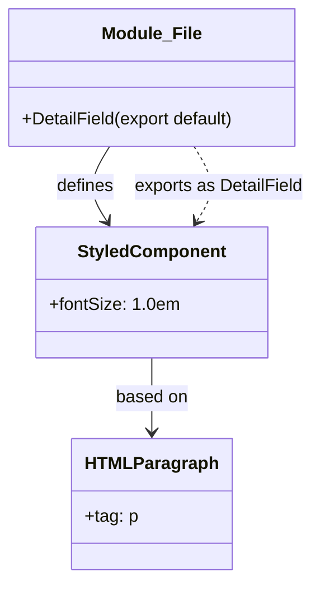

# Diagram: web/portal/src/modules/shipment-detail/shipment-detail-styled-components/DetailField.js

> Auto-generated by Obscura crawlers

## Mermaid

### SVG

<svg id="container" width="289.756103515625" xmlns="http://www.w3.org/2000/svg" class="classDiagram" height="530" viewBox="0 0 289.756103515625 530" role="graphics-document document" aria-roledescription="class"><g><defs><marker id="container_class-aggregationStart" class="marker aggregation class" refX="18" refY="7" markerWidth="190" markerHeight="240" orient="auto"><path d="M 18,7 L9,13 L1,7 L9,1 Z"></path></marker></defs><defs><marker id="container_class-aggregationEnd" class="marker aggregation class" refX="1" refY="7" markerWidth="20" markerHeight="28" orient="auto"><path d="M 18,7 L9,13 L1,7 L9,1 Z"></path></marker></defs><defs><marker id="container_class-extensionStart" class="marker extension class" refX="18" refY="7" markerWidth="190" markerHeight="240" orient="auto"><path d="M 1,7 L18,13 V 1 Z"></path></marker></defs><defs><marker id="container_class-extensionEnd" class="marker extension class" refX="1" refY="7" markerWidth="20" markerHeight="28" orient="auto"><path d="M 1,1 V 13 L18,7 Z"></path></marker></defs><defs><marker id="container_class-compositionStart" class="marker composition class" refX="18" refY="7" markerWidth="190" markerHeight="240" orient="auto"><path d="M 18,7 L9,13 L1,7 L9,1 Z"></path></marker></defs><defs><marker id="container_class-compositionEnd" class="marker composition class" refX="1" refY="7" markerWidth="20" markerHeight="28" orient="auto"><path d="M 18,7 L9,13 L1,7 L9,1 Z"></path></marker></defs><defs><marker id="container_class-dependencyStart" class="marker dependency class" refX="6" refY="7" markerWidth="190" markerHeight="240" orient="auto"><path d="M 5,7 L9,13 L1,7 L9,1 Z"></path></marker></defs><defs><marker id="container_class-dependencyEnd" class="marker dependency class" refX="13" refY="7" markerWidth="20" markerHeight="28" orient="auto"><path d="M 18,7 L9,13 L14,7 L9,1 Z"></path></marker></defs><defs><marker id="container_class-lollipopStart" class="marker lollipop class" refX="13" refY="7" markerWidth="190" markerHeight="240" orient="auto"><circle stroke="black" fill="transparent" cx="7" cy="7" r="6"></circle></marker></defs><defs><marker id="container_class-lollipopEnd" class="marker lollipop class" refX="1" refY="7" markerWidth="190" markerHeight="240" orient="auto"><circle stroke="black" fill="transparent" cx="7" cy="7" r="6"></circle></marker></defs><g class="root"><g class="clusters"></g><g class="edgePaths"><path d="M101.998,134L98.152,140.167C94.306,146.333,86.614,158.667,86.192,170.159C85.77,181.651,92.618,192.302,96.042,197.628L99.467,202.953" id="id_Module_File_StyledComponent_1" class="edge-thickness-normal edge-pattern-solid relation" style=";;;" data-edge="true" data-et="edge" data-id="id_Module_File_StyledComponent_1" data-points="W3sieCI6MTAxLjk5NzczNDM3NSwieSI6MTM0fSx7IngiOjc4LjkyMTg3NSwieSI6MTcxfSx7IngiOjEwMi43MTE0MjA3NDc0MjI2OCwieSI6MjA4fV0=" marker-end="url(#container_class-dependencyEnd)"></path><path d="M141.289,328L141.289,334.167C141.289,340.333,141.289,352.667,141.289,364C141.289,375.333,141.289,385.667,141.289,390.833L141.289,396" id="id_StyledComponent_HTMLParagraph_2" class="edge-thickness-normal edge-pattern-solid relation" style=";;;" data-edge="true" data-et="edge" data-id="id_StyledComponent_HTMLParagraph_2" data-points="W3sieCI6MTQxLjI4OTA2MjUsInkiOjMyOH0seyJ4IjoxNDEuMjg5MDYyNSwieSI6MzY1fSx7IngiOjE0MS4yODkwNjI1LCJ5Ijo0MDJ9XQ==" marker-end="url(#container_class-dependencyEnd)"></path><path d="M180.58,134L184.426,140.167C188.272,146.333,195.964,158.667,196.386,170.159C196.808,181.651,189.96,192.302,186.536,197.628L183.112,202.953" id="id_Module_File_StyledComponent_3" class="edge-thickness-normal edge-pattern-dashed relation" style=";;;" data-edge="true" data-et="edge" data-id="id_Module_File_StyledComponent_3" data-points="W3sieCI6MTgwLjU4MDM5MDYyNSwieSI6MTM0fSx7IngiOjIwMy42NTYyNSwieSI6MTcxfSx7IngiOjE3OS44NjY3MDQyNTI1NzczNCwieSI6MjA4fV0=" marker-end="url(#container_class-dependencyEnd)"></path></g><g class="edgeLabels"><g class="edgeLabel" transform="translate(79.02513, 171.16059)"><g class="label" data-id="id_Module_File_StyledComponent_1" transform="translate(-26.53125, -12)"><foreignObject width="53.0625" height="24">

defines

</foreignObject></g></g><g class="edgeLabel" transform="translate(141.2890625, 365)"><g class="label" data-id="id_StyledComponent_HTMLParagraph_2" transform="translate(-33.3046875, -12)"><foreignObject width="66.609375" height="24">

based on

</foreignObject></g></g><g class="edgeLabel" transform="translate(203.553, 171.16059)"><g class="label" data-id="id_Module_File_StyledComponent_3" transform="translate(-78.203125, -12)"><foreignObject width="156.40625" height="24">

exports as DetailField

</foreignObject></g></g></g><g class="nodes"><g class="node default" id="classId-Module_File-0" transform="translate(141.2890625, 71)"><g class="basic label-container"><path d="M-133.2890625 -63 L133.2890625 -63 L133.2890625 63 L-133.2890625 63" stroke="none" stroke-width="0" fill="#ECECFF" style=""></path><path d="M-133.2890625 -63 C-63.12378701126646 -63, 7.041488477467084 -63, 133.2890625 -63 M-133.2890625 -63 C-32.071548084508734 -63, 69.14596633098253 -63, 133.2890625 -63 M133.2890625 -63 C133.2890625 -30.801003052662878, 133.2890625 1.3979938946742436, 133.2890625 63 M133.2890625 -63 C133.2890625 -31.219000668598436, 133.2890625 0.561998662803127, 133.2890625 63 M133.2890625 63 C72.36695329150429 63, 11.444844083008576 63, -133.2890625 63 M133.2890625 63 C55.34402724048293 63, -22.60100801903414 63, -133.2890625 63 M-133.2890625 63 C-133.2890625 12.9521921086194, -133.2890625 -37.0956157827612, -133.2890625 -63 M-133.2890625 63 C-133.2890625 33.11614150523836, -133.2890625 3.2322830104767206, -133.2890625 -63" stroke="#9370DB" stroke-width="1.3" fill="none" stroke-dasharray="0 0" style=""></path></g><g class="annotation-group text" transform="translate(0, -39)"></g><g class="label-group text" transform="translate(-43.765625, -39)"><g class="label" style="font-weight: bolder" transform="translate(0,-12)"><foreignObject width="87.53125" height="24">

Module_File

</foreignObject></g></g><g class="members-group text" transform="translate(-121.2890625, 9)"></g><g class="methods-group text" transform="translate(-121.2890625, 39)"><g class="label" style="" transform="translate(0,-12)"><foreignObject width="198.8125" height="24">

+DetailField(export default)

</foreignObject></g></g><g class="divider" style=""><path d="M-133.2890625 -15 C-30.838024960629127 -15, 71.61301257874175 -15, 133.2890625 -15 M-133.2890625 -15 C-68.77746998701569 -15, -4.2658774740313845 -15, 133.2890625 -15" stroke="#9370DB" stroke-width="1.3" fill="none" stroke-dasharray="0 0" style=""></path></g><g class="divider" style=""><path d="M-133.2890625 9 C-43.640511630908236 9, 46.00803923818353 9, 133.2890625 9 M-133.2890625 9 C-39.60473832728145 9, 54.079585845437094 9, 133.2890625 9" stroke="#9370DB" stroke-width="1.3" fill="none" stroke-dasharray="0 0" style=""></path></g></g><g class="node default" id="classId-StyledComponent-1" transform="translate(141.2890625, 268)"><g class="basic label-container"><path d="M-102.83984375 -60 L102.83984375 -60 L102.83984375 60 L-102.83984375 60" stroke="none" stroke-width="0" fill="#ECECFF" style=""></path><path d="M-102.83984375 -60 C-48.517156207803026 -60, 5.805531334393947 -60, 102.83984375 -60 M-102.83984375 -60 C-29.523099134637718 -60, 43.793645480724564 -60, 102.83984375 -60 M102.83984375 -60 C102.83984375 -21.66049131330083, 102.83984375 16.679017373398338, 102.83984375 60 M102.83984375 -60 C102.83984375 -26.88773064118822, 102.83984375 6.22453871762356, 102.83984375 60 M102.83984375 60 C34.19126218310612 60, -34.45731938378776 60, -102.83984375 60 M102.83984375 60 C28.480353388636274 60, -45.87913697272745 60, -102.83984375 60 M-102.83984375 60 C-102.83984375 26.803912728267036, -102.83984375 -6.392174543465927, -102.83984375 -60 M-102.83984375 60 C-102.83984375 18.297150614899365, -102.83984375 -23.40569877020127, -102.83984375 -60" stroke="#9370DB" stroke-width="1.3" fill="none" stroke-dasharray="0 0" style=""></path></g><g class="annotation-group text" transform="translate(0, -36)"></g><g class="label-group text" transform="translate(-65.3828125, -36)"><g class="label" style="font-weight: bolder" transform="translate(0,-12)"><foreignObject width="130.765625" height="24">

StyledComponent

</foreignObject></g></g><g class="members-group text" transform="translate(-90.83984375, 12)"><g class="label" style="" transform="translate(0,-12)"><foreignObject width="116.296875" height="24">

+fontSize: 1.0em

</foreignObject></g></g><g class="methods-group text" transform="translate(-90.83984375, 60)"></g><g class="divider" style=""><path d="M-102.83984375 -12 C-49.393921699003535 -12, 4.05200035199293 -12, 102.83984375 -12 M-102.83984375 -12 C-60.950048072399134 -12, -19.06025239479827 -12, 102.83984375 -12" stroke="#9370DB" stroke-width="1.3" fill="none" stroke-dasharray="0 0" style=""></path></g><g class="divider" style=""><path d="M-102.83984375 36 C-55.33117340839676 36, -7.822503066793516 36, 102.83984375 36 M-102.83984375 36 C-39.59195362470038 36, 23.65593650059924 36, 102.83984375 36" stroke="#9370DB" stroke-width="1.3" fill="none" stroke-dasharray="0 0" style=""></path></g></g><g class="node default" id="classId-HTMLParagraph-2" transform="translate(141.2890625, 462)"><g class="basic label-container"><path d="M-68.9921875 -60 L68.9921875 -60 L68.9921875 60 L-68.9921875 60" stroke="none" stroke-width="0" fill="#ECECFF" style=""></path><path d="M-68.9921875 -60 C-40.78820272558944 -60, -12.584217951178893 -60, 68.9921875 -60 M-68.9921875 -60 C-31.5177670038412 -60, 5.956653492317599 -60, 68.9921875 -60 M68.9921875 -60 C68.9921875 -24.734860710639154, 68.9921875 10.530278578721692, 68.9921875 60 M68.9921875 -60 C68.9921875 -30.000371344596857, 68.9921875 -0.0007426891937143409, 68.9921875 60 M68.9921875 60 C33.19986958417349 60, -2.592448331653017 60, -68.9921875 60 M68.9921875 60 C22.18434157559433 60, -24.623504348811338 60, -68.9921875 60 M-68.9921875 60 C-68.9921875 21.786165465146738, -68.9921875 -16.427669069706525, -68.9921875 -60 M-68.9921875 60 C-68.9921875 29.642650128945533, -68.9921875 -0.7146997421089338, -68.9921875 -60" stroke="#9370DB" stroke-width="1.3" fill="none" stroke-dasharray="0 0" style=""></path></g><g class="annotation-group text" transform="translate(0, -36)"></g><g class="label-group text" transform="translate(-56.9921875, -36)"><g class="label" style="font-weight: bolder" transform="translate(0,-12)"><foreignObject width="113.984375" height="24">

HTMLParagraph

</foreignObject></g></g><g class="members-group text" transform="translate(-56.9921875, 12)"><g class="label" style="" transform="translate(0,-12)"><foreignObject width="48.03125" height="24">

+tag: p

</foreignObject></g></g><g class="methods-group text" transform="translate(-56.9921875, 60)"></g><g class="divider" style=""><path d="M-68.9921875 -12 C-33.46119923030394 -12, 2.06978903939212 -12, 68.9921875 -12 M-68.9921875 -12 C-14.54912226519103 -12, 39.89394296961794 -12, 68.9921875 -12" stroke="#9370DB" stroke-width="1.3" fill="none" stroke-dasharray="0 0" style=""></path></g><g class="divider" style=""><path d="M-68.9921875 36 C-33.61073072023197 36, 1.7707260595360594 36, 68.9921875 36 M-68.9921875 36 C-21.580129849182704 36, 25.831927801634592 36, 68.9921875 36" stroke="#9370DB" stroke-width="1.3" fill="none" stroke-dasharray="0 0" style=""></path></g></g></g></g></g></svg>
