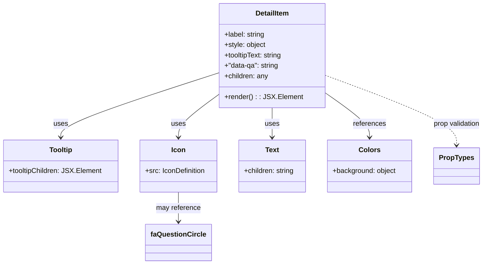

# Diagram: web/portal/src/modules/shipment-detail/shipment-detail-styled-components/DetailItem.js


> Auto-generated by Obscura crawlers

## Diagram 1



### SVG

<svg id="container" width="1110.9140625" xmlns="http://www.w3.org/2000/svg" class="classDiagram" height="608" viewBox="0 0 1110.9140625 608" role="graphics-document document" aria-roledescription="class"><style>#container{font-family:"trebuchet ms",verdana,arial,sans-serif;font-size:16px;fill:#333;}@keyframes edge-animation-frame{from{stroke-dashoffset:0;}}@keyframes dash{to{stroke-dashoffset:0;}}#container .edge-animation-slow{stroke-dasharray:9,5!important;stroke-dashoffset:900;animation:dash 50s linear infinite;stroke-linecap:round;}#container .edge-animation-fast{stroke-dasharray:9,5!important;stroke-dashoffset:900;animation:dash 20s linear infinite;stroke-linecap:round;}#container .error-icon{fill:#552222;}#container .error-text{fill:#552222;stroke:#552222;}#container .edge-thickness-normal{stroke-width:1px;}#container .edge-thickness-thick{stroke-width:3.5px;}#container .edge-pattern-solid{stroke-dasharray:0;}#container .edge-thickness-invisible{stroke-width:0;fill:none;}#container .edge-pattern-dashed{stroke-dasharray:3;}#container .edge-pattern-dotted{stroke-dasharray:2;}#container .marker{fill:#333333;stroke:#333333;}#container .marker.cross{stroke:#333333;}#container svg{font-family:"trebuchet ms",verdana,arial,sans-serif;font-size:16px;}#container p{margin:0;}#container g.classGroup text{fill:#9370DB;stroke:none;font-family:"trebuchet ms",verdana,arial,sans-serif;font-size:10px;}#container g.classGroup text .title{font-weight:bolder;}#container .nodeLabel,#container .edgeLabel{color:#131300;}#container .edgeLabel .label rect{fill:#ECECFF;}#container .label text{fill:#131300;}#container .labelBkg{background:#ECECFF;}#container .edgeLabel .label span{background:#ECECFF;}#container .classTitle{font-weight:bolder;}#container .node rect,#container .node circle,#container .node ellipse,#container .node polygon,#container .node path{fill:#ECECFF;stroke:#9370DB;stroke-width:1px;}#container .divider{stroke:#9370DB;stroke-width:1;}#container g.clickable{cursor:pointer;}#container g.classGroup rect{fill:#ECECFF;stroke:#9370DB;}#container g.classGroup line{stroke:#9370DB;stroke-width:1;}#container .classLabel .box{stroke:none;stroke-width:0;fill:#ECECFF;opacity:0.5;}#container .classLabel .label{fill:#9370DB;font-size:10px;}#container .relation{stroke:#333333;stroke-width:1;fill:none;}#container .dashed-line{stroke-dasharray:3;}#container .dotted-line{stroke-dasharray:1 2;}#container #compositionStart,#container .composition{fill:#333333!important;stroke:#333333!important;stroke-width:1;}#container #compositionEnd,#container .composition{fill:#333333!important;stroke:#333333!important;stroke-width:1;}#container #dependencyStart,#container .dependency{fill:#333333!important;stroke:#333333!important;stroke-width:1;}#container #dependencyStart,#container .dependency{fill:#333333!important;stroke:#333333!important;stroke-width:1;}#container #extensionStart,#container .extension{fill:transparent!important;stroke:#333333!important;stroke-width:1;}#container #extensionEnd,#container .extension{fill:transparent!important;stroke:#333333!important;stroke-width:1;}#container #aggregationStart,#container .aggregation{fill:transparent!important;stroke:#333333!important;stroke-width:1;}#container #aggregationEnd,#container .aggregation{fill:transparent!important;stroke:#333333!important;stroke-width:1;}#container #lollipopStart,#container .lollipop{fill:#ECECFF!important;stroke:#333333!important;stroke-width:1;}#container #lollipopEnd,#container .lollipop{fill:#ECECFF!important;stroke:#333333!important;stroke-width:1;}#container .edgeTerminals{font-size:11px;line-height:initial;}#container .classTitleText{text-anchor:middle;font-size:18px;fill:#333;}#container .label-icon{display:inline-block;height:1em;overflow:visible;vertical-align:-0.125em;}#container .node .label-icon path{fill:currentColor;stroke:revert;stroke-width:revert;}#container :root{--mermaid-font-family:"trebuchet ms",verdana,arial,sans-serif;}</style><g><defs><marker id="container_class-aggregationStart" class="marker aggregation class" refX="18" refY="7" markerWidth="190" markerHeight="240" orient="auto"><path d="M 18,7 L9,13 L1,7 L9,1 Z"></path></marker></defs><defs><marker id="container_class-aggregationEnd" class="marker aggregation class" refX="1" refY="7" markerWidth="20" markerHeight="28" orient="auto"><path d="M 18,7 L9,13 L1,7 L9,1 Z"></path></marker></defs><defs><marker id="container_class-extensionStart" class="marker extension class" refX="18" refY="7" markerWidth="190" markerHeight="240" orient="auto"><path d="M 1,7 L18,13 V 1 Z"></path></marker></defs><defs><marker id="container_class-extensionEnd" class="marker extension class" refX="1" refY="7" markerWidth="20" markerHeight="28" orient="auto"><path d="M 1,1 V 13 L18,7 Z"></path></marker></defs><defs><marker id="container_class-compositionStart" class="marker composition class" refX="18" refY="7" markerWidth="190" markerHeight="240" orient="auto"><path d="M 18,7 L9,13 L1,7 L9,1 Z"></path></marker></defs><defs><marker id="container_class-compositionEnd" class="marker composition class" refX="1" refY="7" markerWidth="20" markerHeight="28" orient="auto"><path d="M 18,7 L9,13 L1,7 L9,1 Z"></path></marker></defs><defs><marker id="container_class-dependencyStart" class="marker dependency class" refX="6" refY="7" markerWidth="190" markerHeight="240" orient="auto"><path d="M 5,7 L9,13 L1,7 L9,1 Z"></path></marker></defs><defs><marker id="container_class-dependencyEnd" class="marker dependency class" refX="13" refY="7" markerWidth="20" markerHeight="28" orient="auto"><path d="M 18,7 L9,13 L14,7 L9,1 Z"></path></marker></defs><defs><marker id="container_class-lollipopStart" class="marker lollipop class" refX="13" refY="7" markerWidth="190" markerHeight="240" orient="auto"><circle stroke="black" fill="transparent" cx="7" cy="7" r="6"></circle></marker></defs><defs><marker id="container_class-lollipopEnd" class="marker lollipop class" refX="1" refY="7" markerWidth="190" markerHeight="240" orient="auto"><circle stroke="black" fill="transparent" cx="7" cy="7" r="6"></circle></marker></defs><g class="root"><g class="clusters"></g><g class="edgePaths"><path d="M507.633,165.818L446.062,185.681C384.491,205.545,261.349,245.273,199.778,270.303C138.207,295.333,138.207,305.667,138.207,310.833L138.207,316" id="id_DetailItem_Tooltip_1" class="edge-thickness-normal edge-pattern-solid relation" style=";;;" data-edge="true" data-et="edge" data-id="id_DetailItem_Tooltip_1" data-points="W3sieCI6NTA3LjYzMjgxMjUsInkiOjE2NS44MTc3NjY2MTE1NDkwMn0seyJ4IjoxMzguMjA3MDMxMjUsInkiOjI4NX0seyJ4IjoxMzguMjA3MDMxMjUsInkiOjMyMn1d" marker-end="url(#container_class-dependencyEnd)"></path><path d="M507.633,212.668L490.942,224.723C474.251,236.778,440.87,260.889,424.179,278.111C407.488,295.333,407.488,305.667,407.488,310.833L407.488,316" id="id_DetailItem_Icon_2" class="edge-thickness-normal edge-pattern-solid relation" style=";;;" data-edge="true" data-et="edge" data-id="id_DetailItem_Icon_2" data-points="W3sieCI6NTA3LjYzMjgxMjUsInkiOjIxMi42Njc1OTUxNTUwODc1fSx7IngiOjQwNy40ODgyODEyNSwieSI6Mjg1fSx7IngiOjQwNy40ODgyODEyNSwieSI6MzIyfV0=" marker-end="url(#container_class-dependencyEnd)"></path><path d="M624.855,248L624.855,254.167C624.855,260.333,624.855,272.667,624.855,284C624.855,295.333,624.855,305.667,624.855,310.833L624.855,316" id="id_DetailItem_Text_3" class="edge-thickness-normal edge-pattern-solid relation" style=";;;" data-edge="true" data-et="edge" data-id="id_DetailItem_Text_3" data-points="W3sieCI6NjI0Ljg1NTQ2ODc1LCJ5IjoyNDh9LHsieCI6NjI0Ljg1NTQ2ODc1LCJ5IjoyODV9LHsieCI6NjI0Ljg1NTQ2ODc1LCJ5IjozMjJ9XQ==" marker-end="url(#container_class-dependencyEnd)"></path><path d="M742.078,209.682L760.093,222.235C778.108,234.788,814.138,259.894,832.153,277.614C850.168,295.333,850.168,305.667,850.168,310.833L850.168,316" id="id_DetailItem_Colors_4" class="edge-thickness-normal edge-pattern-solid relation" style=";;;" data-edge="true" data-et="edge" data-id="id_DetailItem_Colors_4" data-points="W3sieCI6NzQyLjA3ODEyNSwieSI6MjA5LjY4MTkxNzQ3NTcyODE0fSx7IngiOjg1MC4xNjc5Njg3NSwieSI6Mjg1fSx7IngiOjg1MC4xNjc5Njg3NSwieSI6MzIyfV0=" marker-end="url(#container_class-dependencyEnd)"></path><path d="M407.488,442L407.488,448.167C407.488,454.333,407.488,466.667,407.488,478C407.488,489.333,407.488,499.667,407.488,504.833L407.488,510" id="id_Icon_faQuestionCircle_5" class="edge-thickness-normal edge-pattern-solid relation" style=";;;" data-edge="true" data-et="edge" data-id="id_Icon_faQuestionCircle_5" data-points="W3sieCI6NDA3LjQ4ODI4MTI1LCJ5Ijo0NDJ9LHsieCI6NDA3LjQ4ODI4MTI1LCJ5Ijo0Nzl9LHsieCI6NDA3LjQ4ODI4MTI1LCJ5Ijo1MTZ9XQ==" marker-end="url(#container_class-dependencyEnd)"></path><path d="M742.078,171.55L792.973,190.459C843.867,209.367,945.656,247.183,996.551,274.258C1047.445,301.333,1047.445,317.667,1047.445,325.833L1047.445,334" id="id_DetailItem_PropTypes_6" class="edge-thickness-normal edge-pattern-dashed relation" style=";;;" data-edge="true" data-et="edge" data-id="id_DetailItem_PropTypes_6" data-points="W3sieCI6NzQyLjA3ODEyNSwieSI6MTcxLjU1MDQwMDcwOTkwODIyfSx7IngiOjEwNDcuNDQ1MzEyNSwieSI6Mjg1fSx7IngiOjEwNDcuNDQ1MzEyNSwieSI6MzQwfV0=" marker-end="url(#container_class-dependencyEnd)"></path></g><g class="edgeLabels"><g class="edgeLabel" transform="translate(138.20703125, 285)"><g class="label" data-id="id_DetailItem_Tooltip_1" transform="translate(-16.4921875, -12)"><foreignObject width="32.984375" height="24"><div xmlns="http://www.w3.org/1999/xhtml" class="labelBkg" style="display: table-cell; white-space: nowrap; line-height: 1.5; max-width: 200px; text-align: center;"><span class="edgeLabel"><p>uses</p></span></div></foreignObject></g></g><g class="edgeLabel" transform="translate(407.48828125, 285)"><g class="label" data-id="id_DetailItem_Icon_2" transform="translate(-16.4921875, -12)"><foreignObject width="32.984375" height="24"><div xmlns="http://www.w3.org/1999/xhtml" class="labelBkg" style="display: table-cell; white-space: nowrap; line-height: 1.5; max-width: 200px; text-align: center;"><span class="edgeLabel"><p>uses</p></span></div></foreignObject></g></g><g class="edgeLabel" transform="translate(624.85546875, 285)"><g class="label" data-id="id_DetailItem_Text_3" transform="translate(-16.4921875, -12)"><foreignObject width="32.984375" height="24"><div xmlns="http://www.w3.org/1999/xhtml" class="labelBkg" style="display: table-cell; white-space: nowrap; line-height: 1.5; max-width: 200px; text-align: center;"><span class="edgeLabel"><p>uses</p></span></div></foreignObject></g></g><g class="edgeLabel" transform="translate(850.16796875, 285)"><g class="label" data-id="id_DetailItem_Colors_4" transform="translate(-37.828125, -12)"><foreignObject width="75.65625" height="24"><div xmlns="http://www.w3.org/1999/xhtml" class="labelBkg" style="display: table-cell; white-space: nowrap; line-height: 1.5; max-width: 200px; text-align: center;"><span class="edgeLabel"><p>references</p></span></div></foreignObject></g></g><g class="edgeLabel" transform="translate(407.48828125, 479)"><g class="label" data-id="id_Icon_faQuestionCircle_5" transform="translate(-51.234375, -12)"><foreignObject width="102.46875" height="24"><div xmlns="http://www.w3.org/1999/xhtml" class="labelBkg" style="display: table-cell; white-space: nowrap; line-height: 1.5; max-width: 200px; text-align: center;"><span class="edgeLabel"><p>may reference</p></span></div></foreignObject></g></g><g class="edgeLabel" transform="translate(1047.4453125, 285)"><g class="label" data-id="id_DetailItem_PropTypes_6" transform="translate(-55.46875, -12)"><foreignObject width="110.9375" height="24"><div xmlns="http://www.w3.org/1999/xhtml" class="labelBkg" style="display: table-cell; white-space: nowrap; line-height: 1.5; max-width: 200px; text-align: center;"><span class="edgeLabel"><p>prop validation</p></span></div></foreignObject></g></g></g><g class="nodes"><g class="node default" id="classId-DetailItem-0" transform="translate(624.85546875, 128)"><g class="basic label-container"><path d="M-117.22265625 -120 L117.22265625 -120 L117.22265625 120 L-117.22265625 120" stroke="none" stroke-width="0" fill="#ECECFF" style=""></path><path d="M-117.22265625 -120 C-32.0317070218767 -120, 53.1592422062466 -120, 117.22265625 -120 M-117.22265625 -120 C-38.3636693413621 -120, 40.495317567275805 -120, 117.22265625 -120 M117.22265625 -120 C117.22265625 -70.45169319516933, 117.22265625 -20.903386390338653, 117.22265625 120 M117.22265625 -120 C117.22265625 -59.15865127631221, 117.22265625 1.682697447375574, 117.22265625 120 M117.22265625 120 C60.928410580466505 120, 4.634164910933009 120, -117.22265625 120 M117.22265625 120 C24.938969640361208 120, -67.34471696927758 120, -117.22265625 120 M-117.22265625 120 C-117.22265625 34.437527623502845, -117.22265625 -51.12494475299431, -117.22265625 -120 M-117.22265625 120 C-117.22265625 33.61025834554739, -117.22265625 -52.77948330890521, -117.22265625 -120" stroke="#9370DB" stroke-width="1.3" fill="none" stroke-dasharray="0 0" style=""></path></g><g class="annotation-group text" transform="translate(0, -96)"></g><g class="label-group text" transform="translate(-38.1015625, -96)"><g class="label" style="font-weight: bolder" transform="translate(0,-12)"><foreignObject width="76.203125" height="24"><div xmlns="http://www.w3.org/1999/xhtml" style="display: table-cell; white-space: nowrap; line-height: 1.5; max-width: 125px; text-align: center;"><span class="nodeLabel markdown-node-label" style=""><p>DetailItem</p></span></div></foreignObject></g></g><g class="members-group text" transform="translate(-105.22265625, -48)"><g class="label" style="" transform="translate(0,-12)"><foreignObject width="94.09375" height="24"><div xmlns="http://www.w3.org/1999/xhtml" style="display: table-cell; white-space: nowrap; line-height: 1.5; max-width: 152px; text-align: center;"><span class="nodeLabel markdown-node-label" style=""><p>+label: string</p></span></div></foreignObject></g><g class="label" style="" transform="translate(0,12)"><foreignObject width="95.90625" height="24"><div xmlns="http://www.w3.org/1999/xhtml" style="display: table-cell; white-space: nowrap; line-height: 1.5; max-width: 153px; text-align: center;"><span class="nodeLabel markdown-node-label" style=""><p>+style: object</p></span></div></foreignObject></g><g class="label" style="" transform="translate(0,36)"><foreignObject width="135.890625" height="24"><div xmlns="http://www.w3.org/1999/xhtml" style="display: table-cell; white-space: nowrap; line-height: 1.5; max-width: 194px; text-align: center;"><span class="nodeLabel markdown-node-label" style=""><p>+tooltipText: string</p></span></div></foreignObject></g><g class="label" style="" transform="translate(0,60)"><foreignObject width="127.359375" height="24"><div xmlns="http://www.w3.org/1999/xhtml" style="display: table-cell; white-space: nowrap; line-height: 1.5; max-width: 185px; text-align: center;"><span class="nodeLabel markdown-node-label" style=""><p>+"data-qa": string</p></span></div></foreignObject></g><g class="label" style="" transform="translate(0,84)"><foreignObject width="101.421875" height="24"><div xmlns="http://www.w3.org/1999/xhtml" style="display: table-cell; white-space: nowrap; line-height: 1.5; max-width: 159px; text-align: center;"><span class="nodeLabel markdown-node-label" style=""><p>+children: any</p></span></div></foreignObject></g></g><g class="methods-group text" transform="translate(-105.22265625, 96)"><g class="label" style="" transform="translate(0,-12)"><foreignObject width="172.34375" height="24"><div xmlns="http://www.w3.org/1999/xhtml" style="display: table-cell; white-space: nowrap; line-height: 1.5; max-width: 230px; text-align: center;"><span class="nodeLabel markdown-node-label" style=""><p>+render() : : JSX.Element</p></span></div></foreignObject></g></g><g class="divider" style=""><path d="M-117.22265625 -72 C-49.639331407511364 -72, 17.943993434977273 -72, 117.22265625 -72 M-117.22265625 -72 C-45.16127673648839 -72, 26.90010277702322 -72, 117.22265625 -72" stroke="#9370DB" stroke-width="1.3" fill="none" stroke-dasharray="0 0" style=""></path></g><g class="divider" style=""><path d="M-117.22265625 72 C-50.52462932521341 72, 16.17339759957318 72, 117.22265625 72 M-117.22265625 72 C-28.062165622045626 72, 61.09832500590875 72, 117.22265625 72" stroke="#9370DB" stroke-width="1.3" fill="none" stroke-dasharray="0 0" style=""></path></g></g><g class="node default" id="classId-Tooltip-1" transform="translate(138.20703125, 382)"><g class="basic label-container"><path d="M-130.20703125 -60 L130.20703125 -60 L130.20703125 60 L-130.20703125 60" stroke="none" stroke-width="0" fill="#ECECFF" style=""></path><path d="M-130.20703125 -60 C-45.835115048427056 -60, 38.53680115314589 -60, 130.20703125 -60 M-130.20703125 -60 C-56.741122216282974 -60, 16.72478681743405 -60, 130.20703125 -60 M130.20703125 -60 C130.20703125 -16.867803782034194, 130.20703125 26.26439243593161, 130.20703125 60 M130.20703125 -60 C130.20703125 -20.767814509659836, 130.20703125 18.46437098068033, 130.20703125 60 M130.20703125 60 C47.511857192294684 60, -35.18331686541063 60, -130.20703125 60 M130.20703125 60 C45.20794331289541 60, -39.79114462420918 60, -130.20703125 60 M-130.20703125 60 C-130.20703125 34.012450049771985, -130.20703125 8.02490009954397, -130.20703125 -60 M-130.20703125 60 C-130.20703125 20.85977811801478, -130.20703125 -18.28044376397044, -130.20703125 -60" stroke="#9370DB" stroke-width="1.3" fill="none" stroke-dasharray="0 0" style=""></path></g><g class="annotation-group text" transform="translate(0, -36)"></g><g class="label-group text" transform="translate(-25.7265625, -36)"><g class="label" style="font-weight: bolder" transform="translate(0,-12)"><foreignObject width="51.453125" height="24"><div xmlns="http://www.w3.org/1999/xhtml" style="display: table-cell; white-space: nowrap; line-height: 1.5; max-width: 101px; text-align: center;"><span class="nodeLabel markdown-node-label" style=""><p>Tooltip</p></span></div></foreignObject></g></g><g class="members-group text" transform="translate(-118.20703125, 12)"><g class="label" style="" transform="translate(0,-12)"><foreignObject width="210.6875" height="24"><div xmlns="http://www.w3.org/1999/xhtml" style="display: table-cell; white-space: nowrap; line-height: 1.5; max-width: 268px; text-align: center;"><span class="nodeLabel markdown-node-label" style=""><p>+tooltipChildren: JSX.Element</p></span></div></foreignObject></g></g><g class="methods-group text" transform="translate(-118.20703125, 60)"></g><g class="divider" style=""><path d="M-130.20703125 -12 C-35.259808337010995 -12, 59.68741457597801 -12, 130.20703125 -12 M-130.20703125 -12 C-27.706459238161926 -12, 74.79411277367615 -12, 130.20703125 -12" stroke="#9370DB" stroke-width="1.3" fill="none" stroke-dasharray="0 0" style=""></path></g><g class="divider" style=""><path d="M-130.20703125 36 C-28.633444937379977 36, 72.94014137524005 36, 130.20703125 36 M-130.20703125 36 C-66.80543926066173 36, -3.403847271323471 36, 130.20703125 36" stroke="#9370DB" stroke-width="1.3" fill="none" stroke-dasharray="0 0" style=""></path></g></g><g class="node default" id="classId-Icon-2" transform="translate(407.48828125, 382)"><g class="basic label-container"><path d="M-89.07421875 -60 L89.07421875 -60 L89.07421875 60 L-89.07421875 60" stroke="none" stroke-width="0" fill="#ECECFF" style=""></path><path d="M-89.07421875 -60 C-49.52643408195099 -60, -9.978649413901977 -60, 89.07421875 -60 M-89.07421875 -60 C-47.51403045734627 -60, -5.953842164692546 -60, 89.07421875 -60 M89.07421875 -60 C89.07421875 -23.538155905506734, 89.07421875 12.923688188986532, 89.07421875 60 M89.07421875 -60 C89.07421875 -32.451863030037224, 89.07421875 -4.9037260600744474, 89.07421875 60 M89.07421875 60 C22.162879921362077 60, -44.74845890727585 60, -89.07421875 60 M89.07421875 60 C43.65458519440391 60, -1.7650483611921857 60, -89.07421875 60 M-89.07421875 60 C-89.07421875 20.502767230068294, -89.07421875 -18.994465539863413, -89.07421875 -60 M-89.07421875 60 C-89.07421875 12.094808382157105, -89.07421875 -35.81038323568579, -89.07421875 -60" stroke="#9370DB" stroke-width="1.3" fill="none" stroke-dasharray="0 0" style=""></path></g><g class="annotation-group text" transform="translate(0, -36)"></g><g class="label-group text" transform="translate(-15.3046875, -36)"><g class="label" style="font-weight: bolder" transform="translate(0,-12)"><foreignObject width="30.609375" height="24"><div xmlns="http://www.w3.org/1999/xhtml" style="display: table-cell; white-space: nowrap; line-height: 1.5; max-width: 81px; text-align: center;"><span class="nodeLabel markdown-node-label" style=""><p>Icon</p></span></div></foreignObject></g></g><g class="members-group text" transform="translate(-77.07421875, 12)"><g class="label" style="" transform="translate(0,-12)"><foreignObject width="138.84375" height="24"><div xmlns="http://www.w3.org/1999/xhtml" style="display: table-cell; white-space: nowrap; line-height: 1.5; max-width: 196px; text-align: center;"><span class="nodeLabel markdown-node-label" style=""><p>+src: IconDefinition</p></span></div></foreignObject></g></g><g class="methods-group text" transform="translate(-77.07421875, 60)"></g><g class="divider" style=""><path d="M-89.07421875 -12 C-19.534364155969712 -12, 50.005490438060576 -12, 89.07421875 -12 M-89.07421875 -12 C-26.72506296852621 -12, 35.62409281294758 -12, 89.07421875 -12" stroke="#9370DB" stroke-width="1.3" fill="none" stroke-dasharray="0 0" style=""></path></g><g class="divider" style=""><path d="M-89.07421875 36 C-42.424924504508716 36, 4.224369740982567 36, 89.07421875 36 M-89.07421875 36 C-42.05209403206227 36, 4.970030685875457 36, 89.07421875 36" stroke="#9370DB" stroke-width="1.3" fill="none" stroke-dasharray="0 0" style=""></path></g></g><g class="node default" id="classId-Text-3" transform="translate(624.85546875, 382)"><g class="basic label-container"><path d="M-78.29296875 -60 L78.29296875 -60 L78.29296875 60 L-78.29296875 60" stroke="none" stroke-width="0" fill="#ECECFF" style=""></path><path d="M-78.29296875 -60 C-32.99202386745864 -60, 12.308921015082717 -60, 78.29296875 -60 M-78.29296875 -60 C-19.98755594269533 -60, 38.31785686460934 -60, 78.29296875 -60 M78.29296875 -60 C78.29296875 -20.09234571938464, 78.29296875 19.815308561230722, 78.29296875 60 M78.29296875 -60 C78.29296875 -18.421630970323797, 78.29296875 23.156738059352406, 78.29296875 60 M78.29296875 60 C43.74644414622269 60, 9.199919542445386 60, -78.29296875 60 M78.29296875 60 C44.67078163734447 60, 11.048594524688937 60, -78.29296875 60 M-78.29296875 60 C-78.29296875 22.879952520900503, -78.29296875 -14.240094958198995, -78.29296875 -60 M-78.29296875 60 C-78.29296875 16.73952786308861, -78.29296875 -26.520944273822778, -78.29296875 -60" stroke="#9370DB" stroke-width="1.3" fill="none" stroke-dasharray="0 0" style=""></path></g><g class="annotation-group text" transform="translate(0, -36)"></g><g class="label-group text" transform="translate(-15.3828125, -36)"><g class="label" style="font-weight: bolder" transform="translate(0,-12)"><foreignObject width="30.765625" height="24"><div xmlns="http://www.w3.org/1999/xhtml" style="display: table-cell; white-space: nowrap; line-height: 1.5; max-width: 80px; text-align: center;"><span class="nodeLabel markdown-node-label" style=""><p>Text</p></span></div></foreignObject></g></g><g class="members-group text" transform="translate(-66.29296875, 12)"><g class="label" style="" transform="translate(0,-12)"><foreignObject width="117.203125" height="24"><div xmlns="http://www.w3.org/1999/xhtml" style="display: table-cell; white-space: nowrap; line-height: 1.5; max-width: 175px; text-align: center;"><span class="nodeLabel markdown-node-label" style=""><p>+children: string</p></span></div></foreignObject></g></g><g class="methods-group text" transform="translate(-66.29296875, 60)"></g><g class="divider" style=""><path d="M-78.29296875 -12 C-35.65957012160151 -12, 6.973828506796977 -12, 78.29296875 -12 M-78.29296875 -12 C-22.93323919889351 -12, 32.42649035221298 -12, 78.29296875 -12" stroke="#9370DB" stroke-width="1.3" fill="none" stroke-dasharray="0 0" style=""></path></g><g class="divider" style=""><path d="M-78.29296875 36 C-25.483884085335454 36, 27.325200579329092 36, 78.29296875 36 M-78.29296875 36 C-41.35111871894897 36, -4.409268687897935 36, 78.29296875 36" stroke="#9370DB" stroke-width="1.3" fill="none" stroke-dasharray="0 0" style=""></path></g></g><g class="node default" id="classId-Colors-4" transform="translate(850.16796875, 382)"><g class="basic label-container"><path d="M-97.01953125 -60 L97.01953125 -60 L97.01953125 60 L-97.01953125 60" stroke="none" stroke-width="0" fill="#ECECFF" style=""></path><path d="M-97.01953125 -60 C-36.40500876834048 -60, 24.20951371331904 -60, 97.01953125 -60 M-97.01953125 -60 C-22.594073505233595 -60, 51.83138423953281 -60, 97.01953125 -60 M97.01953125 -60 C97.01953125 -32.9502193572165, 97.01953125 -5.900438714432987, 97.01953125 60 M97.01953125 -60 C97.01953125 -21.988602361399785, 97.01953125 16.02279527720043, 97.01953125 60 M97.01953125 60 C51.07486808899713 60, 5.1302049279942565 60, -97.01953125 60 M97.01953125 60 C35.892937859653784 60, -25.23365553069243 60, -97.01953125 60 M-97.01953125 60 C-97.01953125 30.86652220569169, -97.01953125 1.733044411383382, -97.01953125 -60 M-97.01953125 60 C-97.01953125 17.898136518372773, -97.01953125 -24.203726963254454, -97.01953125 -60" stroke="#9370DB" stroke-width="1.3" fill="none" stroke-dasharray="0 0" style=""></path></g><g class="annotation-group text" transform="translate(0, -36)"></g><g class="label-group text" transform="translate(-23.1015625, -36)"><g class="label" style="font-weight: bolder" transform="translate(0,-12)"><foreignObject width="46.203125" height="24"><div xmlns="http://www.w3.org/1999/xhtml" style="display: table-cell; white-space: nowrap; line-height: 1.5; max-width: 95px; text-align: center;"><span class="nodeLabel markdown-node-label" style=""><p>Colors</p></span></div></foreignObject></g></g><g class="members-group text" transform="translate(-85.01953125, 12)"><g class="label" style="" transform="translate(0,-12)"><foreignObject width="146.9375" height="24"><div xmlns="http://www.w3.org/1999/xhtml" style="display: table-cell; white-space: nowrap; line-height: 1.5; max-width: 205px; text-align: center;"><span class="nodeLabel markdown-node-label" style=""><p>+background: object</p></span></div></foreignObject></g></g><g class="methods-group text" transform="translate(-85.01953125, 60)"></g><g class="divider" style=""><path d="M-97.01953125 -12 C-29.96195971826228 -12, 37.09561181347544 -12, 97.01953125 -12 M-97.01953125 -12 C-57.59413845608744 -12, -18.168745662174885 -12, 97.01953125 -12" stroke="#9370DB" stroke-width="1.3" fill="none" stroke-dasharray="0 0" style=""></path></g><g class="divider" style=""><path d="M-97.01953125 36 C-53.95059919803632 36, -10.881667146072644 36, 97.01953125 36 M-97.01953125 36 C-40.449348242279946 36, 16.120834765440108 36, 97.01953125 36" stroke="#9370DB" stroke-width="1.3" fill="none" stroke-dasharray="0 0" style=""></path></g></g><g class="node default" id="classId-faQuestionCircle-5" transform="translate(407.48828125, 558)"><g class="basic label-container"><path d="M-72.4609375 -42 L72.4609375 -42 L72.4609375 42 L-72.4609375 42" stroke="none" stroke-width="0" fill="#ECECFF" style=""></path><path d="M-72.4609375 -42 C-16.303821034961018 -42, 39.853295430077964 -42, 72.4609375 -42 M-72.4609375 -42 C-18.46798033084837 -42, 35.52497683830326 -42, 72.4609375 -42 M72.4609375 -42 C72.4609375 -16.388844821178953, 72.4609375 9.222310357642094, 72.4609375 42 M72.4609375 -42 C72.4609375 -20.623499504384846, 72.4609375 0.7530009912303086, 72.4609375 42 M72.4609375 42 C32.69395701220434 42, -7.073023475591313 42, -72.4609375 42 M72.4609375 42 C29.873055585296818 42, -12.714826329406364 42, -72.4609375 42 M-72.4609375 42 C-72.4609375 22.253359918796097, -72.4609375 2.5067198375921933, -72.4609375 -42 M-72.4609375 42 C-72.4609375 24.468900054750165, -72.4609375 6.93780010950033, -72.4609375 -42" stroke="#9370DB" stroke-width="1.3" fill="none" stroke-dasharray="0 0" style=""></path></g><g class="annotation-group text" transform="translate(0, -18)"></g><g class="label-group text" transform="translate(-60.4609375, -18)"><g class="label" style="font-weight: bolder" transform="translate(0,-12)"><foreignObject width="120.921875" height="24"><div xmlns="http://www.w3.org/1999/xhtml" style="display: table-cell; white-space: nowrap; line-height: 1.5; max-width: 169px; text-align: center;"><span class="nodeLabel markdown-node-label" style=""><p>faQuestionCircle</p></span></div></foreignObject></g></g><g class="members-group text" transform="translate(-60.4609375, 30)"></g><g class="methods-group text" transform="translate(-60.4609375, 60)"></g><g class="divider" style=""><path d="M-72.4609375 6 C-23.759582345981237 6, 24.941772808037527 6, 72.4609375 6 M-72.4609375 6 C-24.05452431541955 6, 24.351888869160902 6, 72.4609375 6" stroke="#9370DB" stroke-width="1.3" fill="none" stroke-dasharray="0 0" style=""></path></g><g class="divider" style=""><path d="M-72.4609375 24 C-27.919249832678595 24, 16.62243783464281 24, 72.4609375 24 M-72.4609375 24 C-39.968698648998576 24, -7.476459797997151 24, 72.4609375 24" stroke="#9370DB" stroke-width="1.3" fill="none" stroke-dasharray="0 0" style=""></path></g></g><g class="node default" id="classId-PropTypes-6" transform="translate(1047.4453125, 382)"><g class="basic label-container"><path d="M-50.2578125 -42 L50.2578125 -42 L50.2578125 42 L-50.2578125 42" stroke="none" stroke-width="0" fill="#ECECFF" style=""></path><path d="M-50.2578125 -42 C-28.480621902431327 -42, -6.703431304862654 -42, 50.2578125 -42 M-50.2578125 -42 C-26.235212944463633 -42, -2.2126133889272666 -42, 50.2578125 -42 M50.2578125 -42 C50.2578125 -23.607015203696573, 50.2578125 -5.214030407393146, 50.2578125 42 M50.2578125 -42 C50.2578125 -13.988863482859319, 50.2578125 14.022273034281362, 50.2578125 42 M50.2578125 42 C24.16504082831376 42, -1.9277308433724798 42, -50.2578125 42 M50.2578125 42 C17.92627544357316 42, -14.405261612853678 42, -50.2578125 42 M-50.2578125 42 C-50.2578125 15.09963805419245, -50.2578125 -11.8007238916151, -50.2578125 -42 M-50.2578125 42 C-50.2578125 14.883135881405583, -50.2578125 -12.233728237188835, -50.2578125 -42" stroke="#9370DB" stroke-width="1.3" fill="none" stroke-dasharray="0 0" style=""></path></g><g class="annotation-group text" transform="translate(0, -18)"></g><g class="label-group text" transform="translate(-38.2578125, -18)"><g class="label" style="font-weight: bolder" transform="translate(0,-12)"><foreignObject width="76.515625" height="24"><div xmlns="http://www.w3.org/1999/xhtml" style="display: table-cell; white-space: nowrap; line-height: 1.5; max-width: 125px; text-align: center;"><span class="nodeLabel markdown-node-label" style=""><p>PropTypes</p></span></div></foreignObject></g></g><g class="members-group text" transform="translate(-38.2578125, 30)"></g><g class="methods-group text" transform="translate(-38.2578125, 60)"></g><g class="divider" style=""><path d="M-50.2578125 6 C-21.519748137641084 6, 7.218316224717832 6, 50.2578125 6 M-50.2578125 6 C-17.85985073488692 6, 14.538111030226162 6, 50.2578125 6" stroke="#9370DB" stroke-width="1.3" fill="none" stroke-dasharray="0 0" style=""></path></g><g class="divider" style=""><path d="M-50.2578125 24 C-15.906905572253486 24, 18.44400135549303 24, 50.2578125 24 M-50.2578125 24 C-23.516009682353978 24, 3.2257931352920437 24, 50.2578125 24" stroke="#9370DB" stroke-width="1.3" fill="none" stroke-dasharray="0 0" style=""></path></g></g></g></g></g></svg>

## Diagram 2

```mermaid
flowchart LR
  A[Start: DetailItem render] --> B{label present?}
  B -- Yes --> C[Render label span with styles]
  B -- No --> D[Skip label span]
  C --> E{tooltipText present?}
  E -- Yes --> F[Render Tooltip with Text and Icon(faQuestionCircle)]
  E -- No --> G[No Tooltip]
  F --> H[Continue to render value span]
  G --> H
  D --> H
  H[Render children span with Colors.background.DARK_BLUE and data-qa] --> I[End]
```

> SVG rendering failed for this diagram.
