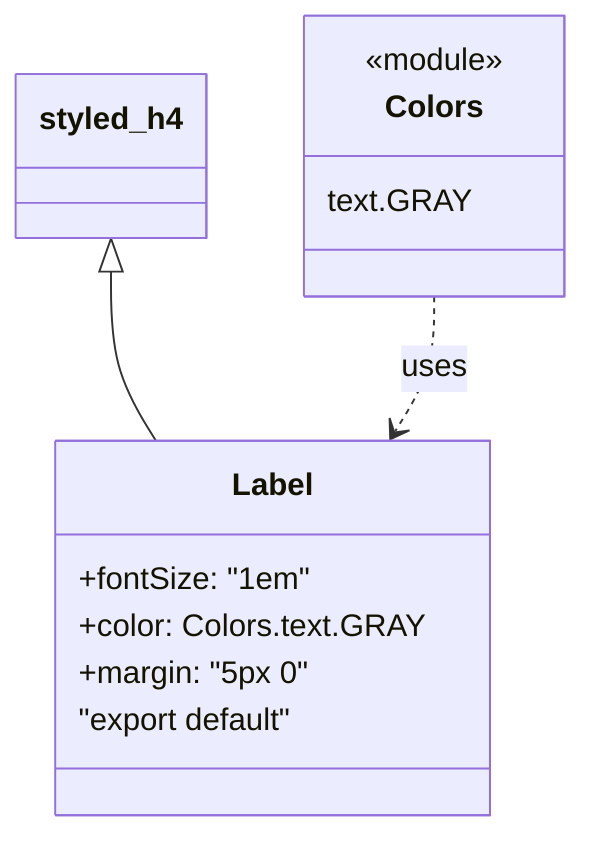

# Diagram: web/portal/src/modules/shipment-detail/shipment-detail-styled-components/Label.js

> Auto-generated by Obscura crawlers

## Mermaid

### SVG

<svg id="container" width="290.6171875" xmlns="http://www.w3.org/2000/svg" class="classDiagram" height="426" viewBox="0 0 290.6171875 426" role="graphics-document document" aria-roledescription="class"><g><defs><marker id="container_class-aggregationStart" class="marker aggregation class" refX="18" refY="7" markerWidth="190" markerHeight="240" orient="auto"><path d="M 18,7 L9,13 L1,7 L9,1 Z"></path></marker></defs><defs><marker id="container_class-aggregationEnd" class="marker aggregation class" refX="1" refY="7" markerWidth="20" markerHeight="28" orient="auto"><path d="M 18,7 L9,13 L1,7 L9,1 Z"></path></marker></defs><defs><marker id="container_class-extensionStart" class="marker extension class" refX="18" refY="7" markerWidth="190" markerHeight="240" orient="auto"><path d="M 1,7 L18,13 V 1 Z"></path></marker></defs><defs><marker id="container_class-extensionEnd" class="marker extension class" refX="1" refY="7" markerWidth="20" markerHeight="28" orient="auto"><path d="M 1,1 V 13 L18,7 Z"></path></marker></defs><defs><marker id="container_class-compositionStart" class="marker composition class" refX="18" refY="7" markerWidth="190" markerHeight="240" orient="auto"><path d="M 18,7 L9,13 L1,7 L9,1 Z"></path></marker></defs><defs><marker id="container_class-compositionEnd" class="marker composition class" refX="1" refY="7" markerWidth="20" markerHeight="28" orient="auto"><path d="M 18,7 L9,13 L1,7 L9,1 Z"></path></marker></defs><defs><marker id="container_class-dependencyStart" class="marker dependency class" refX="6" refY="7" markerWidth="190" markerHeight="240" orient="auto"><path d="M 5,7 L9,13 L1,7 L9,1 Z"></path></marker></defs><defs><marker id="container_class-dependencyEnd" class="marker dependency class" refX="13" refY="7" markerWidth="20" markerHeight="28" orient="auto"><path d="M 18,7 L9,13 L14,7 L9,1 Z"></path></marker></defs><defs><marker id="container_class-lollipopStart" class="marker lollipop class" refX="13" refY="7" markerWidth="190" markerHeight="240" orient="auto"><circle stroke="black" fill="transparent" cx="7" cy="7" r="6"></circle></marker></defs><defs><marker id="container_class-lollipopEnd" class="marker lollipop class" refX="1" refY="7" markerWidth="190" markerHeight="240" orient="auto"><circle stroke="black" fill="transparent" cx="7" cy="7" r="6"></circle></marker></defs><g class="root"><g class="clusters"></g><g class="edgePaths"><path d="M55.906,139.25L55.906,147.542C55.906,155.833,55.906,172.417,59.669,186.875C63.432,201.333,70.957,213.667,74.72,219.833L78.483,226" id="id_styled_h4_Label_1" class="edge-thickness-normal edge-pattern-solid relation" style=";;;" data-edge="true" data-et="edge" data-id="id_styled_h4_Label_1" data-points="W3sieCI6NTUuOTA2MjUsInkiOjEyMn0seyJ4Ijo1NS45MDYyNSwieSI6MTg5fSx7IngiOjc4LjQ4MzAwOTI4MTAxNTAzLCJ5IjoyMjZ9XQ==" marker-start="url(#container_class-extensionStart)"></path><path d="M218.215,152L218.215,158.167C218.215,164.333,218.215,176.667,214.973,188.146C211.731,199.626,205.247,210.252,202.005,215.565L198.763,220.878" id="id_Colors_Label_2" class="edge-thickness-normal edge-pattern-dashed relation" style=";;;" data-edge="true" data-et="edge" data-id="id_Colors_Label_2" data-points="W3sieCI6MjE4LjIxNDg0Mzc1LCJ5IjoxNTJ9LHsieCI6MjE4LjIxNDg0Mzc1LCJ5IjoxODl9LHsieCI6MTk1LjYzODA4NDQ2ODk4NDk3LCJ5IjoyMjZ9XQ==" marker-end="url(#container_class-dependencyEnd)"></path></g><g class="edgeLabels"><g class="edgeLabel"><g class="label" data-id="id_styled_h4_Label_1" transform="translate(0, 0)"><foreignObject width="0" height="0">

</foreignObject></g></g><g class="edgeLabel" transform="translate(218.21484375, 189)"><g class="label" data-id="id_Colors_Label_2" transform="translate(-16.4921875, -12)"><foreignObject width="32.984375" height="24">

uses

</foreignObject></g></g></g><g class="nodes"><g class="node default" id="classId-styled_h4-0" transform="translate(55.90625, 80)"><g class="basic label-container"><path d="M-47.90625 -42 L47.90625 -42 L47.90625 42 L-47.90625 42" stroke="none" stroke-width="0" fill="#ECECFF" style=""></path><path d="M-47.90625 -42 C-28.549938163043905 -42, -9.19362632608781 -42, 47.90625 -42 M-47.90625 -42 C-20.645280912290485 -42, 6.615688175419031 -42, 47.90625 -42 M47.90625 -42 C47.90625 -16.6655508375385, 47.90625 8.668898324923, 47.90625 42 M47.90625 -42 C47.90625 -9.81769429238831, 47.90625 22.36461141522338, 47.90625 42 M47.90625 42 C28.630573767521767 42, 9.354897535043534 42, -47.90625 42 M47.90625 42 C16.77324913796178 42, -14.359751724076439 42, -47.90625 42 M-47.90625 42 C-47.90625 11.029274256444438, -47.90625 -19.941451487111124, -47.90625 -42 M-47.90625 42 C-47.90625 25.12164083086308, -47.90625 8.243281661726158, -47.90625 -42" stroke="#9370DB" stroke-width="1.3" fill="none" stroke-dasharray="0 0" style=""></path></g><g class="annotation-group text" transform="translate(0, -18)"></g><g class="label-group text" transform="translate(-35.90625, -18)"><g class="label" style="font-weight: bolder" transform="translate(0,-12)"><foreignObject width="71.8125" height="24">

styled_h4

</foreignObject></g></g><g class="members-group text" transform="translate(-35.90625, 30)"></g><g class="methods-group text" transform="translate(-35.90625, 60)"></g><g class="divider" style=""><path d="M-47.90625 6 C-18.25920385734396 6, 11.387842285312082 6, 47.90625 6 M-47.90625 6 C-22.806730578442036 6, 2.292788843115929 6, 47.90625 6" stroke="#9370DB" stroke-width="1.3" fill="none" stroke-dasharray="0 0" style=""></path></g><g class="divider" style=""><path d="M-47.90625 24 C-17.752766924995388 24, 12.400716150009224 24, 47.90625 24 M-47.90625 24 C-16.950795392035168 24, 14.004659215929664 24, 47.90625 24" stroke="#9370DB" stroke-width="1.3" fill="none" stroke-dasharray="0 0" style=""></path></g></g><g class="node default" id="classId-Colors-1" transform="translate(218.21484375, 80)"><g class="basic label-container"><path d="M-64.40234375 -72 L64.40234375 -72 L64.40234375 72 L-64.40234375 72" stroke="none" stroke-width="0" fill="#ECECFF" style=""></path><path d="M-64.40234375 -72 C-29.824758086055205 -72, 4.75282757788959 -72, 64.40234375 -72 M-64.40234375 -72 C-30.546493086938852 -72, 3.309357576122295 -72, 64.40234375 -72 M64.40234375 -72 C64.40234375 -15.618747696474003, 64.40234375 40.762504607051994, 64.40234375 72 M64.40234375 -72 C64.40234375 -24.755180214428357, 64.40234375 22.489639571143286, 64.40234375 72 M64.40234375 72 C35.321684213955685 72, 6.241024677911369 72, -64.40234375 72 M64.40234375 72 C31.371040288555406 72, -1.660263172889188 72, -64.40234375 72 M-64.40234375 72 C-64.40234375 21.90807650298143, -64.40234375 -28.18384699403714, -64.40234375 -72 M-64.40234375 72 C-64.40234375 17.007041244032138, -64.40234375 -37.985917511935725, -64.40234375 -72" stroke="#9370DB" stroke-width="1.3" fill="none" stroke-dasharray="0 0" style=""></path></g><g class="annotation-group text" transform="translate(-36.6015625, -48)"><g class="label" style="" transform="translate(0,-12)"><foreignObject width="73.203125" height="24">

«module»

</foreignObject></g></g><g class="label-group text" transform="translate(-23.1015625, -24)"><g class="label" style="font-weight: bolder" transform="translate(0,-12)"><foreignObject width="46.203125" height="24">

Colors

</foreignObject></g></g><g class="members-group text" transform="translate(-52.40234375, 24)"><g class="label" style="" transform="translate(0,-12)"><foreignObject width="68.203125" height="24">

text.GRAY

</foreignObject></g></g><g class="methods-group text" transform="translate(-52.40234375, 72)"></g><g class="divider" style=""><path d="M-64.40234375 0 C-36.19684962208277 0, -7.991355494165546 0, 64.40234375 0 M-64.40234375 0 C-35.851802194364865 0, -7.301260638729737 0, 64.40234375 0" stroke="#9370DB" stroke-width="1.3" fill="none" stroke-dasharray="0 0" style=""></path></g><g class="divider" style=""><path d="M-64.40234375 48 C-21.525440210897898 48, 21.351463328204204 48, 64.40234375 48 M-64.40234375 48 C-27.2085195663821 48, 9.985304617235798 48, 64.40234375 48" stroke="#9370DB" stroke-width="1.3" fill="none" stroke-dasharray="0 0" style=""></path></g></g><g class="node default" id="classId-Label-2" transform="translate(137.060546875, 322)"><g class="basic label-container"><path d="M-106.94921875 -96 L106.94921875 -96 L106.94921875 96 L-106.94921875 96" stroke="none" stroke-width="0" fill="#ECECFF" style=""></path><path d="M-106.94921875 -96 C-42.77043604453114 -96, 21.408346660937724 -96, 106.94921875 -96 M-106.94921875 -96 C-46.25549866241749 -96, 14.438221425165025 -96, 106.94921875 -96 M106.94921875 -96 C106.94921875 -45.91144139949205, 106.94921875 4.1771172010159034, 106.94921875 96 M106.94921875 -96 C106.94921875 -42.42223695453205, 106.94921875 11.155526090935894, 106.94921875 96 M106.94921875 96 C47.17651509316602 96, -12.596188563667965 96, -106.94921875 96 M106.94921875 96 C36.60763618246283 96, -33.73394638507435 96, -106.94921875 96 M-106.94921875 96 C-106.94921875 30.64336320577641, -106.94921875 -34.71327358844718, -106.94921875 -96 M-106.94921875 96 C-106.94921875 30.009667669999033, -106.94921875 -35.980664660001935, -106.94921875 -96" stroke="#9370DB" stroke-width="1.3" fill="none" stroke-dasharray="0 0" style=""></path></g><g class="annotation-group text" transform="translate(0, -72)"></g><g class="label-group text" transform="translate(-19.9765625, -72)"><g class="label" style="font-weight: bolder" transform="translate(0,-12)"><foreignObject width="39.953125" height="24">

Label

</foreignObject></g></g><g class="members-group text" transform="translate(-94.94921875, -24)"><g class="label" style="" transform="translate(0,-12)"><foreignObject width="116.328125" height="24">

+fontSize: "1em"

</foreignObject></g><g class="label" style="" transform="translate(0,12)"><foreignObject width="169.921875" height="24">

+color: Colors.text.GRAY

</foreignObject></g><g class="label" style="" transform="translate(0,36)"><foreignObject width="117.546875" height="24">

+margin: "5px 0"

</foreignObject></g><g class="label" style="" transform="translate(0,60)"><foreignObject width="115.53125" height="24">

"export default"

</foreignObject></g></g><g class="methods-group text" transform="translate(-94.94921875, 96)"></g><g class="divider" style=""><path d="M-106.94921875 -48 C-56.944461293955094 -48, -6.939703837910187 -48, 106.94921875 -48 M-106.94921875 -48 C-49.1211349072384 -48, 8.7069489355232 -48, 106.94921875 -48" stroke="#9370DB" stroke-width="1.3" fill="none" stroke-dasharray="0 0" style=""></path></g><g class="divider" style=""><path d="M-106.94921875 72 C-42.14799758089306 72, 22.653223588213876 72, 106.94921875 72 M-106.94921875 72 C-45.342505212119036 72, 16.264208325761928 72, 106.94921875 72" stroke="#9370DB" stroke-width="1.3" fill="none" stroke-dasharray="0 0" style=""></path></g></g></g></g></g></svg>
