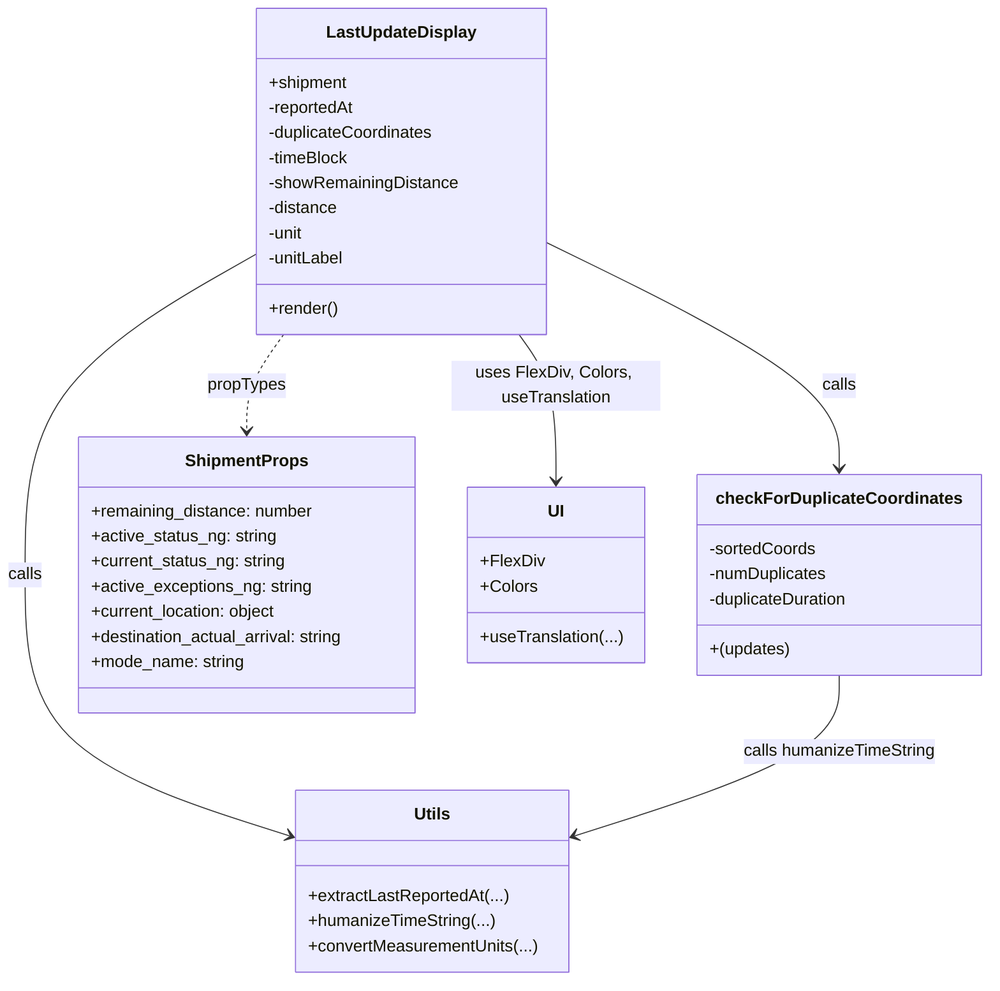

# Diagram: web/portal/src/modules/shipment-detail/shipment-detail-styled-components/LastUpdateDisplay.js

> Auto-generated by Obscura crawlers

## Mermaid

### SVG

<svg id="container" width="953.015625" xmlns="http://www.w3.org/2000/svg" class="classDiagram" height="938" viewBox="0 0 953.015625 938" role="graphics-document document" aria-roledescription="class"><g><defs><marker id="container_class-aggregationStart" class="marker aggregation class" refX="18" refY="7" markerWidth="190" markerHeight="240" orient="auto"><path d="M 18,7 L9,13 L1,7 L9,1 Z"></path></marker></defs><defs><marker id="container_class-aggregationEnd" class="marker aggregation class" refX="1" refY="7" markerWidth="20" markerHeight="28" orient="auto"><path d="M 18,7 L9,13 L1,7 L9,1 Z"></path></marker></defs><defs><marker id="container_class-extensionStart" class="marker extension class" refX="18" refY="7" markerWidth="190" markerHeight="240" orient="auto"><path d="M 1,7 L18,13 V 1 Z"></path></marker></defs><defs><marker id="container_class-extensionEnd" class="marker extension class" refX="1" refY="7" markerWidth="20" markerHeight="28" orient="auto"><path d="M 1,1 V 13 L18,7 Z"></path></marker></defs><defs><marker id="container_class-compositionStart" class="marker composition class" refX="18" refY="7" markerWidth="190" markerHeight="240" orient="auto"><path d="M 18,7 L9,13 L1,7 L9,1 Z"></path></marker></defs><defs><marker id="container_class-compositionEnd" class="marker composition class" refX="1" refY="7" markerWidth="20" markerHeight="28" orient="auto"><path d="M 18,7 L9,13 L1,7 L9,1 Z"></path></marker></defs><defs><marker id="container_class-dependencyStart" class="marker dependency class" refX="6" refY="7" markerWidth="190" markerHeight="240" orient="auto"><path d="M 5,7 L9,13 L1,7 L9,1 Z"></path></marker></defs><defs><marker id="container_class-dependencyEnd" class="marker dependency class" refX="13" refY="7" markerWidth="20" markerHeight="28" orient="auto"><path d="M 18,7 L9,13 L14,7 L9,1 Z"></path></marker></defs><defs><marker id="container_class-lollipopStart" class="marker lollipop class" refX="13" refY="7" markerWidth="190" markerHeight="240" orient="auto"><circle stroke="black" fill="transparent" cx="7" cy="7" r="6"></circle></marker></defs><defs><marker id="container_class-lollipopEnd" class="marker lollipop class" refX="1" refY="7" markerWidth="190" markerHeight="240" orient="auto"><circle stroke="black" fill="transparent" cx="7" cy="7" r="6"></circle></marker></defs><g class="root"><g class="clusters"></g><g class="edgePaths"><path d="M251.275,241.461L213.47,262.718C175.665,283.974,100.055,326.487,62.25,377.91C24.445,429.333,24.445,489.667,24.445,548C24.445,606.333,24.445,662.667,67.077,704.316C109.71,745.965,194.974,772.93,237.606,786.413L280.238,799.895" id="id_LastUpdateDisplay_Utils_1" class="edge-thickness-normal edge-pattern-solid relation" style=";;;" data-edge="true" data-et="edge" data-id="id_LastUpdateDisplay_Utils_1" data-points="W3sieCI6MjUxLjI3NTM5MDYyNSwieSI6MjQxLjQ2MTAxNDcxNTU3MjE2fSx7IngiOjI0LjQ0NTMxMjUsInkiOjM2OX0seyJ4IjoyNC40NDUzMTI1LCJ5Ijo1NTB9LHsieCI6MjQuNDQ1MzEyNSwieSI6NzE5fSx7IngiOjI4NS45NTg5ODQzNzUsInkiOjgwMS43MDQzNDUxODM4MzQ3fV0=" marker-end="url(#container_class-dependencyEnd)"></path><path d="M526.807,231.309L573.777,254.257C620.747,277.206,714.688,323.103,761.659,359.218C808.629,395.333,808.629,421.667,808.629,434.833L808.629,448" id="id_LastUpdateDisplay_checkForDuplicateCoordinates_2" class="edge-thickness-normal edge-pattern-solid relation" style=";;;" data-edge="true" data-et="edge" data-id="id_LastUpdateDisplay_checkForDuplicateCoordinates_2" data-points="W3sieCI6NTI2LjgwNjY0MDYyNSwieSI6MjMxLjMwODc4OTc4MTY0MDN9LHsieCI6ODA4LjYyODkwNjI1LCJ5IjozNjl9LHsieCI6ODA4LjYyODkwNjI1LCJ5Ijo0NTR9XQ==" marker-end="url(#container_class-dependencyEnd)"></path><path d="M808.629,646L808.629,658.167C808.629,670.333,808.629,694.667,765.997,720.316C723.365,745.965,638.1,772.93,595.468,786.413L552.836,799.895" id="id_checkForDuplicateCoordinates_Utils_3" class="edge-thickness-normal edge-pattern-solid relation" style=";;;" data-edge="true" data-et="edge" data-id="id_checkForDuplicateCoordinates_Utils_3" data-points="W3sieCI6ODA4LjYyODkwNjI1LCJ5Ijo2NDZ9LHsieCI6ODA4LjYyODkwNjI1LCJ5Ijo3MTl9LHsieCI6NTQ3LjExNTIzNDM3NSwieSI6ODAxLjcwNDM0NTE4MzgzNDd9XQ==" marker-end="url(#container_class-dependencyEnd)"></path><path d="M275.589,320L269.649,328.167C263.71,336.333,251.832,352.667,245.892,368C239.953,383.333,239.953,397.667,239.953,404.833L239.953,412" id="id_LastUpdateDisplay_ShipmentProps_4" class="edge-thickness-normal edge-pattern-dashed relation" style=";;;" data-edge="true" data-et="edge" data-id="id_LastUpdateDisplay_ShipmentProps_4" data-points="W3sieCI6Mjc1LjU4ODc2NzE0OTM5MDI2LCJ5IjozMjB9LHsieCI6MjM5Ljk1MzEyNSwieSI6MzY5fSx7IngiOjIzOS45NTMxMjUsInkiOjQxOH1d" marker-end="url(#container_class-dependencyEnd)"></path><path d="M502.493,320L508.433,328.167C514.372,336.333,526.25,352.667,532.19,376C538.129,399.333,538.129,429.667,538.129,444.833L538.129,460" id="id_LastUpdateDisplay_UI_5" class="edge-thickness-normal edge-pattern-solid relation" style=";;;" data-edge="true" data-et="edge" data-id="id_LastUpdateDisplay_UI_5" data-points="W3sieCI6NTAyLjQ5MzI2NDEwMDYwOTc0LCJ5IjozMjB9LHsieCI6NTM4LjEyODkwNjI1LCJ5IjozNjl9LHsieCI6NTM4LjEyODkwNjI1LCJ5Ijo0NjZ9XQ==" marker-end="url(#container_class-dependencyEnd)"></path></g><g class="edgeLabels"><g class="edgeLabel" transform="translate(24.4453125, 550)"><g class="label" data-id="id_LastUpdateDisplay_Utils_1" transform="translate(-16.4453125, -12)"><foreignObject width="32.890625" height="24">

calls

</foreignObject></g></g><g class="edgeLabel" transform="translate(808.62890625, 369)"><g class="label" data-id="id_LastUpdateDisplay_checkForDuplicateCoordinates_2" transform="translate(-16.4453125, -12)"><foreignObject width="32.890625" height="24">

calls

</foreignObject></g></g><g class="edgeLabel" transform="translate(808.62890625, 719)"><g class="label" data-id="id_checkForDuplicateCoordinates_Utils_3" transform="translate(-92.90625, -12)"><foreignObject width="185.8125" height="24">

calls humanizeTimeString

</foreignObject></g></g><g class="edgeLabel" transform="translate(239.953125, 369)"><g class="label" data-id="id_LastUpdateDisplay_ShipmentProps_4" transform="translate(-37.625, -12)"><foreignObject width="75.25" height="24">

propTypes

</foreignObject></g></g><g class="edgeLabel" transform="translate(538.12890625, 369)"><g class="label" data-id="id_LastUpdateDisplay_UI_5" transform="translate(-100, -24)"><foreignObject width="200" height="48">

uses FlexDiv, Colors, useTranslation

</foreignObject></g></g></g><g class="nodes"><g class="node default" id="classId-LastUpdateDisplay-0" transform="translate(389.041015625, 164)"><g class="basic label-container"><path d="M-137.765625 -156 L137.765625 -156 L137.765625 156 L-137.765625 156" stroke="none" stroke-width="0" fill="#ECECFF" style=""></path><path d="M-137.765625 -156 C-43.94714150203349 -156, 49.87134199593302 -156, 137.765625 -156 M-137.765625 -156 C-47.05884021655912 -156, 43.64794456688176 -156, 137.765625 -156 M137.765625 -156 C137.765625 -76.51762366711671, 137.765625 2.964752665766582, 137.765625 156 M137.765625 -156 C137.765625 -37.15858274776117, 137.765625 81.68283450447765, 137.765625 156 M137.765625 156 C30.70734664451217 156, -76.35093171097566 156, -137.765625 156 M137.765625 156 C34.516220575787955 156, -68.73318384842409 156, -137.765625 156 M-137.765625 156 C-137.765625 82.04728633646076, -137.765625 8.094572672921515, -137.765625 -156 M-137.765625 156 C-137.765625 76.04765907693721, -137.765625 -3.904681846125584, -137.765625 -156" stroke="#9370DB" stroke-width="1.3" fill="none" stroke-dasharray="0 0" style=""></path></g><g class="annotation-group text" transform="translate(0, -132)"></g><g class="label-group text" transform="translate(-68.65625, -132)"><g class="label" style="font-weight: bolder" transform="translate(0,-12)"><foreignObject width="137.3125" height="24">

LastUpdateDisplay

</foreignObject></g></g><g class="members-group text" transform="translate(-125.765625, -84)"><g class="label" style="" transform="translate(0,-12)"><foreignObject width="76.4375" height="24">

+shipment

</foreignObject></g><g class="label" style="" transform="translate(0,12)"><foreignObject width="84.65625" height="24">

-reportedAt

</foreignObject></g><g class="label" style="" transform="translate(0,36)"><foreignObject width="161.40625" height="24">

-duplicateCoordinates

</foreignObject></g><g class="label" style="" transform="translate(0,60)"><foreignObject width="78.609375" height="24">

-timeBlock

</foreignObject></g><g class="label" style="" transform="translate(0,84)"><foreignObject width="182.875" height="24">

-showRemainingDistance

</foreignObject></g><g class="label" style="" transform="translate(0,108)"><foreignObject width="67.796875" height="24">

-distance

</foreignObject></g><g class="label" style="" transform="translate(0,132)"><foreignObject width="35.4375" height="24">

-unit

</foreignObject></g><g class="label" style="" transform="translate(0,156)"><foreignObject width="74.859375" height="24">

-unitLabel

</foreignObject></g></g><g class="methods-group text" transform="translate(-125.765625, 132)"><g class="label" style="" transform="translate(0,-12)"><foreignObject width="66.609375" height="24">

+render()

</foreignObject></g></g><g class="divider" style=""><path d="M-137.765625 -108 C-46.68226864826829 -108, 44.40108770346342 -108, 137.765625 -108 M-137.765625 -108 C-55.12762396391258 -108, 27.510377072174833 -108, 137.765625 -108" stroke="#9370DB" stroke-width="1.3" fill="none" stroke-dasharray="0 0" style=""></path></g><g class="divider" style=""><path d="M-137.765625 108 C-28.107250819054727 108, 81.55112336189055 108, 137.765625 108 M-137.765625 108 C-56.63995299164982 108, 24.485719016700358 108, 137.765625 108" stroke="#9370DB" stroke-width="1.3" fill="none" stroke-dasharray="0 0" style=""></path></g></g><g class="node default" id="classId-checkForDuplicateCoordinates-1" transform="translate(808.62890625, 550)"><g class="basic label-container"><path d="M-136.38671875 -96 L136.38671875 -96 L136.38671875 96 L-136.38671875 96" stroke="none" stroke-width="0" fill="#ECECFF" style=""></path><path d="M-136.38671875 -96 C-58.6328602748808 -96, 19.120998200238404 -96, 136.38671875 -96 M-136.38671875 -96 C-60.02211281416564 -96, 16.342493121668724 -96, 136.38671875 -96 M136.38671875 -96 C136.38671875 -35.955040945458904, 136.38671875 24.08991810908219, 136.38671875 96 M136.38671875 -96 C136.38671875 -30.07742966133972, 136.38671875 35.84514067732056, 136.38671875 96 M136.38671875 96 C65.42813619105304 96, -5.530446367893916 96, -136.38671875 96 M136.38671875 96 C76.32074352286119 96, 16.25476829572237 96, -136.38671875 96 M-136.38671875 96 C-136.38671875 27.666668441544346, -136.38671875 -40.66666311691131, -136.38671875 -96 M-136.38671875 96 C-136.38671875 54.885096393376294, -136.38671875 13.770192786752588, -136.38671875 -96" stroke="#9370DB" stroke-width="1.3" fill="none" stroke-dasharray="0 0" style=""></path></g><g class="annotation-group text" transform="translate(0, -72)"></g><g class="label-group text" transform="translate(-111.3359375, -72)"><g class="label" style="font-weight: bolder" transform="translate(0,-12)"><foreignObject width="222.671875" height="24">

checkForDuplicateCoordinates

</foreignObject></g></g><g class="members-group text" transform="translate(-124.38671875, -24)"><g class="label" style="" transform="translate(0,-12)"><foreignObject width="103.34375" height="24">

-sortedCoords

</foreignObject></g><g class="label" style="" transform="translate(0,12)"><foreignObject width="115.09375" height="24">

-numDuplicates

</foreignObject></g><g class="label" style="" transform="translate(0,36)"><foreignObject width="137.4375" height="24">

-duplicateDuration

</foreignObject></g></g><g class="methods-group text" transform="translate(-124.38671875, 72)"><g class="label" style="" transform="translate(0,-12)"><foreignObject width="77.171875" height="24">

+(updates)

</foreignObject></g></g><g class="divider" style=""><path d="M-136.38671875 -48 C-29.964357732140925 -48, 76.45800328571815 -48, 136.38671875 -48 M-136.38671875 -48 C-36.75986800053661 -48, 62.86698274892677 -48, 136.38671875 -48" stroke="#9370DB" stroke-width="1.3" fill="none" stroke-dasharray="0 0" style=""></path></g><g class="divider" style=""><path d="M-136.38671875 48 C-64.91687038151088 48, 6.552977986978249 48, 136.38671875 48 M-136.38671875 48 C-64.57694454429362 48, 7.232829661412751 48, 136.38671875 48" stroke="#9370DB" stroke-width="1.3" fill="none" stroke-dasharray="0 0" style=""></path></g></g><g class="node default" id="classId-ShipmentProps-2" transform="translate(239.953125, 550)"><g class="basic label-container"><path d="M-164.0625 -132 L164.0625 -132 L164.0625 132 L-164.0625 132" stroke="none" stroke-width="0" fill="#ECECFF" style=""></path><path d="M-164.0625 -132 C-97.96562359927928 -132, -31.868747198558566 -132, 164.0625 -132 M-164.0625 -132 C-76.44002030692843 -132, 11.182459386143137 -132, 164.0625 -132 M164.0625 -132 C164.0625 -49.08067868280132, 164.0625 33.83864263439736, 164.0625 132 M164.0625 -132 C164.0625 -78.17929336168191, 164.0625 -24.358586723363814, 164.0625 132 M164.0625 132 C71.57849366563127 132, -20.905512668737458 132, -164.0625 132 M164.0625 132 C60.06308008287456 132, -43.93633983425087 132, -164.0625 132 M-164.0625 132 C-164.0625 29.8452598523362, -164.0625 -72.3094802953276, -164.0625 -132 M-164.0625 132 C-164.0625 78.9219272868161, -164.0625 25.843854573632214, -164.0625 -132" stroke="#9370DB" stroke-width="1.3" fill="none" stroke-dasharray="0 0" style=""></path></g><g class="annotation-group text" transform="translate(0, -108)"></g><g class="label-group text" transform="translate(-56.03125, -108)"><g class="label" style="font-weight: bolder" transform="translate(0,-12)"><foreignObject width="112.0625" height="24">

ShipmentProps

</foreignObject></g></g><g class="members-group text" transform="translate(-152.0625, -60)"><g class="label" style="" transform="translate(0,-12)"><foreignObject width="215.203125" height="24">

+remaining_distance: number

</foreignObject></g><g class="label" style="" transform="translate(0,12)"><foreignObject width="178.734375" height="24">

+active_status_ng: string

</foreignObject></g><g class="label" style="" transform="translate(0,36)"><foreignObject width="188.671875" height="24">

+current_status_ng: string

</foreignObject></g><g class="label" style="" transform="translate(0,60)"><foreignObject width="212.234375" height="24">

+active_exceptions_ng: string

</foreignObject></g><g class="label" style="" transform="translate(0,84)"><foreignObject width="181.40625" height="24">

+current_location: object

</foreignObject></g><g class="label" style="" transform="translate(0,108)"><foreignObject width="248.09375" height="24">

+destination_actual_arrival: string

</foreignObject></g><g class="label" style="" transform="translate(0,132)"><foreignObject width="147.5625" height="24">

+mode_name: string

</foreignObject></g></g><g class="methods-group text" transform="translate(-152.0625, 132)"></g><g class="divider" style=""><path d="M-164.0625 -84 C-74.81253074795303 -84, 14.437438504093933 -84, 164.0625 -84 M-164.0625 -84 C-58.180874614299185 -84, 47.70075077140163 -84, 164.0625 -84" stroke="#9370DB" stroke-width="1.3" fill="none" stroke-dasharray="0 0" style=""></path></g><g class="divider" style=""><path d="M-164.0625 108 C-89.68487407688009 108, -15.307248153760185 108, 164.0625 108 M-164.0625 108 C-63.13815663969562 108, 37.786186720608754 108, 164.0625 108" stroke="#9370DB" stroke-width="1.3" fill="none" stroke-dasharray="0 0" style=""></path></g></g><g class="node default" id="classId-Utils-3" transform="translate(416.537109375, 843)"><g class="basic label-container"><path d="M-130.578125 -87 L130.578125 -87 L130.578125 87 L-130.578125 87" stroke="none" stroke-width="0" fill="#ECECFF" style=""></path><path d="M-130.578125 -87 C-73.5889857938182 -87, -16.599846587636392 -87, 130.578125 -87 M-130.578125 -87 C-29.203032832698838 -87, 72.17205933460232 -87, 130.578125 -87 M130.578125 -87 C130.578125 -32.35425670077442, 130.578125 22.291486598451158, 130.578125 87 M130.578125 -87 C130.578125 -20.699879838651796, 130.578125 45.60024032269641, 130.578125 87 M130.578125 87 C57.717938470757716 87, -15.142248058484569 87, -130.578125 87 M130.578125 87 C66.12068854753927 87, 1.6632520950785477 87, -130.578125 87 M-130.578125 87 C-130.578125 30.003583800352615, -130.578125 -26.99283239929477, -130.578125 -87 M-130.578125 87 C-130.578125 41.924362879396554, -130.578125 -3.1512742412068917, -130.578125 -87" stroke="#9370DB" stroke-width="1.3" fill="none" stroke-dasharray="0 0" style=""></path></g><g class="annotation-group text" transform="translate(0, -63)"></g><g class="label-group text" transform="translate(-16.796875, -63)"><g class="label" style="font-weight: bolder" transform="translate(0,-12)"><foreignObject width="33.59375" height="24">

Utils

</foreignObject></g></g><g class="members-group text" transform="translate(-118.578125, -15)"></g><g class="methods-group text" transform="translate(-118.578125, 15)"><g class="label" style="" transform="translate(0,-12)"><foreignObject width="191.28125" height="24">

+extractLastReportedAt(...)

</foreignObject></g><g class="label" style="" transform="translate(0,12)"><foreignObject width="178.5625" height="24">

+humanizeTimeString(...)

</foreignObject></g><g class="label" style="" transform="translate(0,36)"><foreignObject width="220.359375" height="24">

+convertMeasurementUnits(...)

</foreignObject></g></g><g class="divider" style=""><path d="M-130.578125 -39 C-28.560389334758412 -39, 73.45734633048318 -39, 130.578125 -39 M-130.578125 -39 C-77.03779767258305 -39, -23.497470345166093 -39, 130.578125 -39" stroke="#9370DB" stroke-width="1.3" fill="none" stroke-dasharray="0 0" style=""></path></g><g class="divider" style=""><path d="M-130.578125 -15 C-59.16027377789422 -15, 12.257577444211563 -15, 130.578125 -15 M-130.578125 -15 C-48.02848987776596 -15, 34.52114524446807 -15, 130.578125 -15" stroke="#9370DB" stroke-width="1.3" fill="none" stroke-dasharray="0 0" style=""></path></g></g><g class="node default" id="classId-UI-4" transform="translate(538.12890625, 550)"><g class="basic label-container"><path d="M-84.11328125 -84 L84.11328125 -84 L84.11328125 84 L-84.11328125 84" stroke="none" stroke-width="0" fill="#ECECFF" style=""></path><path d="M-84.11328125 -84 C-39.96954512464155 -84, 4.1741910007169025 -84, 84.11328125 -84 M-84.11328125 -84 C-35.78072008240647 -84, 12.551841085187064 -84, 84.11328125 -84 M84.11328125 -84 C84.11328125 -19.04418234219318, 84.11328125 45.91163531561364, 84.11328125 84 M84.11328125 -84 C84.11328125 -18.886906175503483, 84.11328125 46.22618764899303, 84.11328125 84 M84.11328125 84 C47.453663404689564 84, 10.794045559379128 84, -84.11328125 84 M84.11328125 84 C29.250967714422046 84, -25.611345821155908 84, -84.11328125 84 M-84.11328125 84 C-84.11328125 20.736035240091198, -84.11328125 -42.527929519817604, -84.11328125 -84 M-84.11328125 84 C-84.11328125 22.14070695089189, -84.11328125 -39.71858609821622, -84.11328125 -84" stroke="#9370DB" stroke-width="1.3" fill="none" stroke-dasharray="0 0" style=""></path></g><g class="annotation-group text" transform="translate(0, -60)"></g><g class="label-group text" transform="translate(-7.5546875, -60)"><g class="label" style="font-weight: bolder" transform="translate(0,-12)"><foreignObject width="15.109375" height="24">

UI

</foreignObject></g></g><g class="members-group text" transform="translate(-72.11328125, -12)"><g class="label" style="" transform="translate(0,-12)"><foreignObject width="59.3125" height="24">

+FlexDiv

</foreignObject></g><g class="label" style="" transform="translate(0,12)"><foreignObject width="53.328125" height="24">

+Colors

</foreignObject></g></g><g class="methods-group text" transform="translate(-72.11328125, 60)"><g class="label" style="" transform="translate(0,-12)"><foreignObject width="136.671875" height="24">

+useTranslation(...)

</foreignObject></g></g><g class="divider" style=""><path d="M-84.11328125 -36 C-39.46448988065343 -36, 5.184301488693137 -36, 84.11328125 -36 M-84.11328125 -36 C-48.63991352936002 -36, -13.166545808720045 -36, 84.11328125 -36" stroke="#9370DB" stroke-width="1.3" fill="none" stroke-dasharray="0 0" style=""></path></g><g class="divider" style=""><path d="M-84.11328125 36 C-16.956853734637946 36, 50.19957378072411 36, 84.11328125 36 M-84.11328125 36 C-28.555054687050593 36, 27.003171875898815 36, 84.11328125 36" stroke="#9370DB" stroke-width="1.3" fill="none" stroke-dasharray="0 0" style=""></path></g></g></g></g></g></svg>
