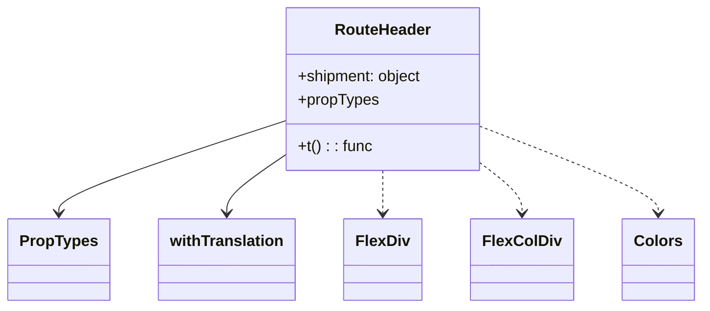

# Diagram: web/portal/src/modules/shipment-detail/shipment-detail-styled-components/RouteHeader.js


> Auto-generated by Obscura crawlers

## Diagram 1



### SVG

<svg id="container" width="700.578125" xmlns="http://www.w3.org/2000/svg" class="classDiagram" height="318" viewBox="0 0 700.578125 318" role="graphics-document document" aria-roledescription="class"><style>#container{font-family:"trebuchet ms",verdana,arial,sans-serif;font-size:16px;fill:#333;}@keyframes edge-animation-frame{from{stroke-dashoffset:0;}}@keyframes dash{to{stroke-dashoffset:0;}}#container .edge-animation-slow{stroke-dasharray:9,5!important;stroke-dashoffset:900;animation:dash 50s linear infinite;stroke-linecap:round;}#container .edge-animation-fast{stroke-dasharray:9,5!important;stroke-dashoffset:900;animation:dash 20s linear infinite;stroke-linecap:round;}#container .error-icon{fill:#552222;}#container .error-text{fill:#552222;stroke:#552222;}#container .edge-thickness-normal{stroke-width:1px;}#container .edge-thickness-thick{stroke-width:3.5px;}#container .edge-pattern-solid{stroke-dasharray:0;}#container .edge-thickness-invisible{stroke-width:0;fill:none;}#container .edge-pattern-dashed{stroke-dasharray:3;}#container .edge-pattern-dotted{stroke-dasharray:2;}#container .marker{fill:#333333;stroke:#333333;}#container .marker.cross{stroke:#333333;}#container svg{font-family:"trebuchet ms",verdana,arial,sans-serif;font-size:16px;}#container p{margin:0;}#container g.classGroup text{fill:#9370DB;stroke:none;font-family:"trebuchet ms",verdana,arial,sans-serif;font-size:10px;}#container g.classGroup text .title{font-weight:bolder;}#container .nodeLabel,#container .edgeLabel{color:#131300;}#container .edgeLabel .label rect{fill:#ECECFF;}#container .label text{fill:#131300;}#container .labelBkg{background:#ECECFF;}#container .edgeLabel .label span{background:#ECECFF;}#container .classTitle{font-weight:bolder;}#container .node rect,#container .node circle,#container .node ellipse,#container .node polygon,#container .node path{fill:#ECECFF;stroke:#9370DB;stroke-width:1px;}#container .divider{stroke:#9370DB;stroke-width:1;}#container g.clickable{cursor:pointer;}#container g.classGroup rect{fill:#ECECFF;stroke:#9370DB;}#container g.classGroup line{stroke:#9370DB;stroke-width:1;}#container .classLabel .box{stroke:none;stroke-width:0;fill:#ECECFF;opacity:0.5;}#container .classLabel .label{fill:#9370DB;font-size:10px;}#container .relation{stroke:#333333;stroke-width:1;fill:none;}#container .dashed-line{stroke-dasharray:3;}#container .dotted-line{stroke-dasharray:1 2;}#container #compositionStart,#container .composition{fill:#333333!important;stroke:#333333!important;stroke-width:1;}#container #compositionEnd,#container .composition{fill:#333333!important;stroke:#333333!important;stroke-width:1;}#container #dependencyStart,#container .dependency{fill:#333333!important;stroke:#333333!important;stroke-width:1;}#container #dependencyStart,#container .dependency{fill:#333333!important;stroke:#333333!important;stroke-width:1;}#container #extensionStart,#container .extension{fill:transparent!important;stroke:#333333!important;stroke-width:1;}#container #extensionEnd,#container .extension{fill:transparent!important;stroke:#333333!important;stroke-width:1;}#container #aggregationStart,#container .aggregation{fill:transparent!important;stroke:#333333!important;stroke-width:1;}#container #aggregationEnd,#container .aggregation{fill:transparent!important;stroke:#333333!important;stroke-width:1;}#container #lollipopStart,#container .lollipop{fill:#ECECFF!important;stroke:#333333!important;stroke-width:1;}#container #lollipopEnd,#container .lollipop{fill:#ECECFF!important;stroke:#333333!important;stroke-width:1;}#container .edgeTerminals{font-size:11px;line-height:initial;}#container .classTitleText{text-anchor:middle;font-size:18px;fill:#333;}#container .label-icon{display:inline-block;height:1em;overflow:visible;vertical-align:-0.125em;}#container .node .label-icon path{fill:currentColor;stroke:revert;stroke-width:revert;}#container :root{--mermaid-font-family:"trebuchet ms",verdana,arial,sans-serif;}</style><g><defs><marker id="container_class-aggregationStart" class="marker aggregation class" refX="18" refY="7" markerWidth="190" markerHeight="240" orient="auto"><path d="M 18,7 L9,13 L1,7 L9,1 Z"></path></marker></defs><defs><marker id="container_class-aggregationEnd" class="marker aggregation class" refX="1" refY="7" markerWidth="20" markerHeight="28" orient="auto"><path d="M 18,7 L9,13 L1,7 L9,1 Z"></path></marker></defs><defs><marker id="container_class-extensionStart" class="marker extension class" refX="18" refY="7" markerWidth="190" markerHeight="240" orient="auto"><path d="M 1,7 L18,13 V 1 Z"></path></marker></defs><defs><marker id="container_class-extensionEnd" class="marker extension class" refX="1" refY="7" markerWidth="20" markerHeight="28" orient="auto"><path d="M 1,1 V 13 L18,7 Z"></path></marker></defs><defs><marker id="container_class-compositionStart" class="marker composition class" refX="18" refY="7" markerWidth="190" markerHeight="240" orient="auto"><path d="M 18,7 L9,13 L1,7 L9,1 Z"></path></marker></defs><defs><marker id="container_class-compositionEnd" class="marker composition class" refX="1" refY="7" markerWidth="20" markerHeight="28" orient="auto"><path d="M 18,7 L9,13 L1,7 L9,1 Z"></path></marker></defs><defs><marker id="container_class-dependencyStart" class="marker dependency class" refX="6" refY="7" markerWidth="190" markerHeight="240" orient="auto"><path d="M 5,7 L9,13 L1,7 L9,1 Z"></path></marker></defs><defs><marker id="container_class-dependencyEnd" class="marker dependency class" refX="13" refY="7" markerWidth="20" markerHeight="28" orient="auto"><path d="M 18,7 L9,13 L14,7 L9,1 Z"></path></marker></defs><defs><marker id="container_class-lollipopStart" class="marker lollipop class" refX="13" refY="7" markerWidth="190" markerHeight="240" orient="auto"><circle stroke="black" fill="transparent" cx="7" cy="7" r="6"></circle></marker></defs><defs><marker id="container_class-lollipopEnd" class="marker lollipop class" refX="1" refY="7" markerWidth="190" markerHeight="240" orient="auto"><circle stroke="black" fill="transparent" cx="7" cy="7" r="6"></circle></marker></defs><g class="root"><g class="clusters"></g><g class="edgePaths"><path d="M284.027,125.686L246.399,138.238C208.771,150.791,133.514,175.895,95.886,191.614C58.258,207.333,58.258,213.667,58.258,216.833L58.258,220" id="id_RouteHeader_PropTypes_1" class="edge-thickness-normal edge-pattern-solid relation" style=";;;" data-edge="true" data-et="edge" data-id="id_RouteHeader_PropTypes_1" data-points="W3sieCI6Mjg0LjAyNzM0Mzc1LCJ5IjoxMjUuNjg1OTEwMDAzODI1NTV9LHsieCI6NTguMjU3ODEyNSwieSI6MjAxfSx7IngiOjU4LjI1NzgxMjUsInkiOjIyNn1d" marker-end="url(#container_class-dependencyEnd)"></path><path d="M284.027,161.968L274.639,168.473C265.25,174.979,246.473,187.989,237.084,197.661C227.695,207.333,227.695,213.667,227.695,216.833L227.695,220" id="id_RouteHeader_withTranslation_2" class="edge-thickness-normal edge-pattern-solid relation" style=";;;" data-edge="true" data-et="edge" data-id="id_RouteHeader_withTranslation_2" data-points="W3sieCI6Mjg0LjAyNzM0Mzc1LCJ5IjoxNjEuOTY4MTkxMjk5MTY1NjV9LHsieCI6MjI3LjY5NTMxMjUsInkiOjIwMX0seyJ4IjoyMjcuNjk1MzEyNSwieSI6MjI2fV0=" marker-end="url(#container_class-dependencyEnd)"></path><path d="M385.008,176L385.008,180.167C385.008,184.333,385.008,192.667,385.008,200C385.008,207.333,385.008,213.667,385.008,216.833L385.008,220" id="id_RouteHeader_FlexDiv_3" class="edge-thickness-normal edge-pattern-dashed relation" style=";;;" data-edge="true" data-et="edge" data-id="id_RouteHeader_FlexDiv_3" data-points="W3sieCI6Mzg1LjAwNzgxMjUsInkiOjE3Nn0seyJ4IjozODUuMDA3ODEyNSwieSI6MjAxfSx7IngiOjM4NS4wMDc4MTI1LCJ5IjoyMjZ9XQ==" marker-end="url(#container_class-dependencyEnd)"></path><path d="M485.988,171.905L492.117,176.754C498.245,181.603,510.501,191.302,516.63,199.317C522.758,207.333,522.758,213.667,522.758,216.833L522.758,220" id="id_RouteHeader_FlexColDiv_4" class="edge-thickness-normal edge-pattern-dashed relation" style=";;;" data-edge="true" data-et="edge" data-id="id_RouteHeader_FlexColDiv_4" data-points="W3sieCI6NDg1Ljk4ODI4MTI1LCJ5IjoxNzEuOTA0NjkwMzM1NzUzMTd9LHsieCI6NTIyLjc1NzgxMjUsInkiOjIwMX0seyJ4Ijo1MjIuNzU3ODEyNSwieSI6MjI2fV0=" marker-end="url(#container_class-dependencyEnd)"></path><path d="M485.988,132.397L514.57,143.831C543.151,155.265,600.314,178.132,628.895,192.733C657.477,207.333,657.477,213.667,657.477,216.833L657.477,220" id="id_RouteHeader_Colors_5" class="edge-thickness-normal edge-pattern-dashed relation" style=";;;" data-edge="true" data-et="edge" data-id="id_RouteHeader_Colors_5" data-points="W3sieCI6NDg1Ljk4ODI4MTI1LCJ5IjoxMzIuMzk2ODIwMTYyODYyNzJ9LHsieCI6NjU3LjQ3NjU2MjUsInkiOjIwMX0seyJ4Ijo2NTcuNDc2NTYyNSwieSI6MjI2fV0=" marker-end="url(#container_class-dependencyEnd)"></path></g><g class="edgeLabels"><g class="edgeLabel"><g class="label" data-id="id_RouteHeader_PropTypes_1" transform="translate(0, 0)"><foreignObject width="0" height="0"><div xmlns="http://www.w3.org/1999/xhtml" class="labelBkg" style="display: table-cell; white-space: nowrap; line-height: 1.5; max-width: 200px; text-align: center;"><span class="edgeLabel"></span></div></foreignObject></g></g><g class="edgeLabel"><g class="label" data-id="id_RouteHeader_withTranslation_2" transform="translate(0, 0)"><foreignObject width="0" height="0"><div xmlns="http://www.w3.org/1999/xhtml" class="labelBkg" style="display: table-cell; white-space: nowrap; line-height: 1.5; max-width: 200px; text-align: center;"><span class="edgeLabel"></span></div></foreignObject></g></g><g class="edgeLabel"><g class="label" data-id="id_RouteHeader_FlexDiv_3" transform="translate(0, 0)"><foreignObject width="0" height="0"><div xmlns="http://www.w3.org/1999/xhtml" class="labelBkg" style="display: table-cell; white-space: nowrap; line-height: 1.5; max-width: 200px; text-align: center;"><span class="edgeLabel"></span></div></foreignObject></g></g><g class="edgeLabel"><g class="label" data-id="id_RouteHeader_FlexColDiv_4" transform="translate(0, 0)"><foreignObject width="0" height="0"><div xmlns="http://www.w3.org/1999/xhtml" class="labelBkg" style="display: table-cell; white-space: nowrap; line-height: 1.5; max-width: 200px; text-align: center;"><span class="edgeLabel"></span></div></foreignObject></g></g><g class="edgeLabel"><g class="label" data-id="id_RouteHeader_Colors_5" transform="translate(0, 0)"><foreignObject width="0" height="0"><div xmlns="http://www.w3.org/1999/xhtml" class="labelBkg" style="display: table-cell; white-space: nowrap; line-height: 1.5; max-width: 200px; text-align: center;"><span class="edgeLabel"></span></div></foreignObject></g></g></g><g class="nodes"><g class="node default" id="classId-RouteHeader-0" transform="translate(385.0078125, 92)"><g class="basic label-container"><path d="M-100.98046875 -84 L100.98046875 -84 L100.98046875 84 L-100.98046875 84" stroke="none" stroke-width="0" fill="#ECECFF" style=""></path><path d="M-100.98046875 -84 C-37.11902286809225 -84, 26.742423013815497 -84, 100.98046875 -84 M-100.98046875 -84 C-26.907084239000042 -84, 47.166300271999916 -84, 100.98046875 -84 M100.98046875 -84 C100.98046875 -29.793599577987692, 100.98046875 24.412800844024616, 100.98046875 84 M100.98046875 -84 C100.98046875 -35.5017448645806, 100.98046875 12.996510270838797, 100.98046875 84 M100.98046875 84 C38.140395853259406 84, -24.699677043481188 84, -100.98046875 84 M100.98046875 84 C42.33075125282502 84, -16.318966244349966 84, -100.98046875 84 M-100.98046875 84 C-100.98046875 37.07018008728445, -100.98046875 -9.859639825431103, -100.98046875 -84 M-100.98046875 84 C-100.98046875 24.980922833478687, -100.98046875 -34.03815433304263, -100.98046875 -84" stroke="#9370DB" stroke-width="1.3" fill="none" stroke-dasharray="0 0" style=""></path></g><g class="annotation-group text" transform="translate(0, -60)"></g><g class="label-group text" transform="translate(-47.8984375, -60)"><g class="label" style="font-weight: bolder" transform="translate(0,-12)"><foreignObject width="95.796875" height="24"><div xmlns="http://www.w3.org/1999/xhtml" style="display: table-cell; white-space: nowrap; line-height: 1.5; max-width: 146px; text-align: center;"><span class="nodeLabel markdown-node-label" style=""><p>RouteHeader</p></span></div></foreignObject></g></g><g class="members-group text" transform="translate(-88.98046875, -12)"><g class="label" style="" transform="translate(0,-12)"><foreignObject width="130.0625" height="24"><div xmlns="http://www.w3.org/1999/xhtml" style="display: table-cell; white-space: nowrap; line-height: 1.5; max-width: 188px; text-align: center;"><span class="nodeLabel markdown-node-label" style=""><p>+shipment: object</p></span></div></foreignObject></g><g class="label" style="" transform="translate(0,12)"><foreignObject width="83.234375" height="24"><div xmlns="http://www.w3.org/1999/xhtml" style="display: table-cell; white-space: nowrap; line-height: 1.5; max-width: 141px; text-align: center;"><span class="nodeLabel markdown-node-label" style=""><p>+propTypes</p></span></div></foreignObject></g></g><g class="methods-group text" transform="translate(-88.98046875, 60)"><g class="label" style="" transform="translate(0,-12)"><foreignObject width="76.15625" height="24"><div xmlns="http://www.w3.org/1999/xhtml" style="display: table-cell; white-space: nowrap; line-height: 1.5; max-width: 134px; text-align: center;"><span class="nodeLabel markdown-node-label" style=""><p>+t() : : func</p></span></div></foreignObject></g></g><g class="divider" style=""><path d="M-100.98046875 -36 C-47.42680322293886 -36, 6.126862304122284 -36, 100.98046875 -36 M-100.98046875 -36 C-45.13765171866131 -36, 10.70516531267738 -36, 100.98046875 -36" stroke="#9370DB" stroke-width="1.3" fill="none" stroke-dasharray="0 0" style=""></path></g><g class="divider" style=""><path d="M-100.98046875 36 C-46.54416698101297 36, 7.892134787974058 36, 100.98046875 36 M-100.98046875 36 C-33.489951464888364 36, 34.00056582022327 36, 100.98046875 36" stroke="#9370DB" stroke-width="1.3" fill="none" stroke-dasharray="0 0" style=""></path></g></g><g class="node default" id="classId-PropTypes-1" transform="translate(58.2578125, 268)"><g class="basic label-container"><path d="M-50.2578125 -42 L50.2578125 -42 L50.2578125 42 L-50.2578125 42" stroke="none" stroke-width="0" fill="#ECECFF" style=""></path><path d="M-50.2578125 -42 C-17.44496934164802 -42, 15.367873816703963 -42, 50.2578125 -42 M-50.2578125 -42 C-11.957753061509273 -42, 26.342306376981455 -42, 50.2578125 -42 M50.2578125 -42 C50.2578125 -13.395862238170483, 50.2578125 15.208275523659033, 50.2578125 42 M50.2578125 -42 C50.2578125 -14.407770427547778, 50.2578125 13.184459144904444, 50.2578125 42 M50.2578125 42 C16.68582491073841 42, -16.886162678523178 42, -50.2578125 42 M50.2578125 42 C26.321707699929597 42, 2.385602899859194 42, -50.2578125 42 M-50.2578125 42 C-50.2578125 22.758937443960654, -50.2578125 3.517874887921309, -50.2578125 -42 M-50.2578125 42 C-50.2578125 9.494854157599292, -50.2578125 -23.010291684801416, -50.2578125 -42" stroke="#9370DB" stroke-width="1.3" fill="none" stroke-dasharray="0 0" style=""></path></g><g class="annotation-group text" transform="translate(0, -18)"></g><g class="label-group text" transform="translate(-38.2578125, -18)"><g class="label" style="font-weight: bolder" transform="translate(0,-12)"><foreignObject width="76.515625" height="24"><div xmlns="http://www.w3.org/1999/xhtml" style="display: table-cell; white-space: nowrap; line-height: 1.5; max-width: 125px; text-align: center;"><span class="nodeLabel markdown-node-label" style=""><p>PropTypes</p></span></div></foreignObject></g></g><g class="members-group text" transform="translate(-38.2578125, 30)"></g><g class="methods-group text" transform="translate(-38.2578125, 60)"></g><g class="divider" style=""><path d="M-50.2578125 6 C-21.652940743175165 6, 6.95193101364967 6, 50.2578125 6 M-50.2578125 6 C-25.64139871748889 6, -1.0249849349777804 6, 50.2578125 6" stroke="#9370DB" stroke-width="1.3" fill="none" stroke-dasharray="0 0" style=""></path></g><g class="divider" style=""><path d="M-50.2578125 24 C-26.334560358433656 24, -2.4113082168673117 24, 50.2578125 24 M-50.2578125 24 C-11.098393125858571 24, 28.061026248282857 24, 50.2578125 24" stroke="#9370DB" stroke-width="1.3" fill="none" stroke-dasharray="0 0" style=""></path></g></g><g class="node default" id="classId-withTranslation-2" transform="translate(227.6953125, 268)"><g class="basic label-container"><path d="M-69.1796875 -42 L69.1796875 -42 L69.1796875 42 L-69.1796875 42" stroke="none" stroke-width="0" fill="#ECECFF" style=""></path><path d="M-69.1796875 -42 C-15.775397434795273 -42, 37.62889263040945 -42, 69.1796875 -42 M-69.1796875 -42 C-21.96231825113297 -42, 25.25505099773406 -42, 69.1796875 -42 M69.1796875 -42 C69.1796875 -16.65847057339491, 69.1796875 8.683058853210177, 69.1796875 42 M69.1796875 -42 C69.1796875 -13.781902817583418, 69.1796875 14.436194364833163, 69.1796875 42 M69.1796875 42 C32.32562644963033 42, -4.528434600739345 42, -69.1796875 42 M69.1796875 42 C26.11645570583441 42, -16.946776088331177 42, -69.1796875 42 M-69.1796875 42 C-69.1796875 13.667495131486099, -69.1796875 -14.665009737027802, -69.1796875 -42 M-69.1796875 42 C-69.1796875 9.060812037387407, -69.1796875 -23.878375925225185, -69.1796875 -42" stroke="#9370DB" stroke-width="1.3" fill="none" stroke-dasharray="0 0" style=""></path></g><g class="annotation-group text" transform="translate(0, -18)"></g><g class="label-group text" transform="translate(-57.1796875, -18)"><g class="label" style="font-weight: bolder" transform="translate(0,-12)"><foreignObject width="114.359375" height="24"><div xmlns="http://www.w3.org/1999/xhtml" style="display: table-cell; white-space: nowrap; line-height: 1.5; max-width: 162px; text-align: center;"><span class="nodeLabel markdown-node-label" style=""><p>withTranslation</p></span></div></foreignObject></g></g><g class="members-group text" transform="translate(-57.1796875, 30)"></g><g class="methods-group text" transform="translate(-57.1796875, 60)"></g><g class="divider" style=""><path d="M-69.1796875 6 C-15.786304069153175 6, 37.60707936169365 6, 69.1796875 6 M-69.1796875 6 C-21.02521683320891 6, 27.129253833582183 6, 69.1796875 6" stroke="#9370DB" stroke-width="1.3" fill="none" stroke-dasharray="0 0" style=""></path></g><g class="divider" style=""><path d="M-69.1796875 24 C-24.50326016870627 24, 20.17316716258746 24, 69.1796875 24 M-69.1796875 24 C-26.029806268093573 24, 17.120074963812854 24, 69.1796875 24" stroke="#9370DB" stroke-width="1.3" fill="none" stroke-dasharray="0 0" style=""></path></g></g><g class="node default" id="classId-FlexDiv-3" transform="translate(385.0078125, 268)"><g class="basic label-container"><path d="M-38.1328125 -42 L38.1328125 -42 L38.1328125 42 L-38.1328125 42" stroke="none" stroke-width="0" fill="#ECECFF" style=""></path><path d="M-38.1328125 -42 C-10.44435901228918 -42, 17.24409447542164 -42, 38.1328125 -42 M-38.1328125 -42 C-17.478030630202944 -42, 3.176751239594111 -42, 38.1328125 -42 M38.1328125 -42 C38.1328125 -17.554623872440576, 38.1328125 6.890752255118848, 38.1328125 42 M38.1328125 -42 C38.1328125 -14.882070709176595, 38.1328125 12.23585858164681, 38.1328125 42 M38.1328125 42 C11.554885703185107 42, -15.023041093629786 42, -38.1328125 42 M38.1328125 42 C16.157455433337056 42, -5.817901633325889 42, -38.1328125 42 M-38.1328125 42 C-38.1328125 8.919336331135192, -38.1328125 -24.161327337729617, -38.1328125 -42 M-38.1328125 42 C-38.1328125 24.981265874723768, -38.1328125 7.962531749447535, -38.1328125 -42" stroke="#9370DB" stroke-width="1.3" fill="none" stroke-dasharray="0 0" style=""></path></g><g class="annotation-group text" transform="translate(0, -18)"></g><g class="label-group text" transform="translate(-26.1328125, -18)"><g class="label" style="font-weight: bolder" transform="translate(0,-12)"><foreignObject width="52.265625" height="24"><div xmlns="http://www.w3.org/1999/xhtml" style="display: table-cell; white-space: nowrap; line-height: 1.5; max-width: 101px; text-align: center;"><span class="nodeLabel markdown-node-label" style=""><p>FlexDiv</p></span></div></foreignObject></g></g><g class="members-group text" transform="translate(-26.1328125, 30)"></g><g class="methods-group text" transform="translate(-26.1328125, 60)"></g><g class="divider" style=""><path d="M-38.1328125 6 C-8.064061060815536 6, 22.004690378368927 6, 38.1328125 6 M-38.1328125 6 C-9.644175287119666 6, 18.84446192576067 6, 38.1328125 6" stroke="#9370DB" stroke-width="1.3" fill="none" stroke-dasharray="0 0" style=""></path></g><g class="divider" style=""><path d="M-38.1328125 24 C-20.50918346357654 24, -2.8855544271530817 24, 38.1328125 24 M-38.1328125 24 C-22.054953690971413 24, -5.977094881942826 24, 38.1328125 24" stroke="#9370DB" stroke-width="1.3" fill="none" stroke-dasharray="0 0" style=""></path></g></g><g class="node default" id="classId-FlexColDiv-4" transform="translate(522.7578125, 268)"><g class="basic label-container"><path d="M-49.6171875 -42 L49.6171875 -42 L49.6171875 42 L-49.6171875 42" stroke="none" stroke-width="0" fill="#ECECFF" style=""></path><path d="M-49.6171875 -42 C-27.091917192118082 -42, -4.566646884236164 -42, 49.6171875 -42 M-49.6171875 -42 C-19.739417613169678 -42, 10.138352273660644 -42, 49.6171875 -42 M49.6171875 -42 C49.6171875 -14.800992740558229, 49.6171875 12.398014518883542, 49.6171875 42 M49.6171875 -42 C49.6171875 -23.48748173748843, 49.6171875 -4.97496347497686, 49.6171875 42 M49.6171875 42 C19.213047325215605 42, -11.19109284956879 42, -49.6171875 42 M49.6171875 42 C27.41025847867008 42, 5.2033294573401605 42, -49.6171875 42 M-49.6171875 42 C-49.6171875 18.8624501402329, -49.6171875 -4.275099719534197, -49.6171875 -42 M-49.6171875 42 C-49.6171875 22.057295692542574, -49.6171875 2.1145913850851485, -49.6171875 -42" stroke="#9370DB" stroke-width="1.3" fill="none" stroke-dasharray="0 0" style=""></path></g><g class="annotation-group text" transform="translate(0, -18)"></g><g class="label-group text" transform="translate(-37.6171875, -18)"><g class="label" style="font-weight: bolder" transform="translate(0,-12)"><foreignObject width="75.234375" height="24"><div xmlns="http://www.w3.org/1999/xhtml" style="display: table-cell; white-space: nowrap; line-height: 1.5; max-width: 124px; text-align: center;"><span class="nodeLabel markdown-node-label" style=""><p>FlexColDiv</p></span></div></foreignObject></g></g><g class="members-group text" transform="translate(-37.6171875, 30)"></g><g class="methods-group text" transform="translate(-37.6171875, 60)"></g><g class="divider" style=""><path d="M-49.6171875 6 C-22.26005061965225 6, 5.097086260695498 6, 49.6171875 6 M-49.6171875 6 C-15.463844933865367 6, 18.689497632269266 6, 49.6171875 6" stroke="#9370DB" stroke-width="1.3" fill="none" stroke-dasharray="0 0" style=""></path></g><g class="divider" style=""><path d="M-49.6171875 24 C-27.684555640875352 24, -5.751923781750705 24, 49.6171875 24 M-49.6171875 24 C-22.661799342264423 24, 4.2935888154711535 24, 49.6171875 24" stroke="#9370DB" stroke-width="1.3" fill="none" stroke-dasharray="0 0" style=""></path></g></g><g class="node default" id="classId-Colors-5" transform="translate(657.4765625, 268)"><g class="basic label-container"><path d="M-35.1015625 -42 L35.1015625 -42 L35.1015625 42 L-35.1015625 42" stroke="none" stroke-width="0" fill="#ECECFF" style=""></path><path d="M-35.1015625 -42 C-11.396207028577162 -42, 12.309148442845675 -42, 35.1015625 -42 M-35.1015625 -42 C-12.561442169948254 -42, 9.978678160103492 -42, 35.1015625 -42 M35.1015625 -42 C35.1015625 -8.646910673740827, 35.1015625 24.706178652518346, 35.1015625 42 M35.1015625 -42 C35.1015625 -12.591039712467616, 35.1015625 16.81792057506477, 35.1015625 42 M35.1015625 42 C16.870286204914265 42, -1.3609900901714695 42, -35.1015625 42 M35.1015625 42 C12.69907746048511 42, -9.70340757902978 42, -35.1015625 42 M-35.1015625 42 C-35.1015625 23.809838722783603, -35.1015625 5.619677445567206, -35.1015625 -42 M-35.1015625 42 C-35.1015625 23.154150577221266, -35.1015625 4.308301154442532, -35.1015625 -42" stroke="#9370DB" stroke-width="1.3" fill="none" stroke-dasharray="0 0" style=""></path></g><g class="annotation-group text" transform="translate(0, -18)"></g><g class="label-group text" transform="translate(-23.1015625, -18)"><g class="label" style="font-weight: bolder" transform="translate(0,-12)"><foreignObject width="46.203125" height="24"><div xmlns="http://www.w3.org/1999/xhtml" style="display: table-cell; white-space: nowrap; line-height: 1.5; max-width: 95px; text-align: center;"><span class="nodeLabel markdown-node-label" style=""><p>Colors</p></span></div></foreignObject></g></g><g class="members-group text" transform="translate(-23.1015625, 30)"></g><g class="methods-group text" transform="translate(-23.1015625, 60)"></g><g class="divider" style=""><path d="M-35.1015625 6 C-9.042484928986816 6, 17.016592642026367 6, 35.1015625 6 M-35.1015625 6 C-17.457020452697254 6, 0.18752159460549223 6, 35.1015625 6" stroke="#9370DB" stroke-width="1.3" fill="none" stroke-dasharray="0 0" style=""></path></g><g class="divider" style=""><path d="M-35.1015625 24 C-11.521615122500457 24, 12.058332254999087 24, 35.1015625 24 M-35.1015625 24 C-10.00851363307537 24, 15.084535233849259 24, 35.1015625 24" stroke="#9370DB" stroke-width="1.3" fill="none" stroke-dasharray="0 0" style=""></path></g></g></g></g></g></svg>

## Diagram 2

```mermaid
flowchart TD
Start([Start]) --> CheckShipment{shipment && shipment.route_number?}
CheckShipment -- No --> ReturnNull([return null])
CheckShipment -- Yes --> RenderMain[Render FlexColDiv (background WARM_GRAY, bold, padding)]
RenderMain --> HeaderFlex[Render FlexDiv (align center, space-between)]
HeaderFlex --> ShowRouteID[Show "Route ID" and span data-qa="text-route-number"]
HeaderFlex --> CheckOnTime{shipment.on_time_percentage?}
CheckOnTime -- Yes --> ShowOnTime[Show "On Time" and span data-qa="text-on-time-percentage"]
CheckOnTime -- No --> SkipOnTime([No on_time_percentage])
RenderMain --> CheckTripPlan{shipment.trip_plan_number?}
CheckTripPlan -- Yes --> ShowTripPlan[Render FlexDiv with "Trip Plan ID" span]
CheckTripPlan -- No --> SkipTripPlan([No trip_plan_number])
ShowOnTime --> End([End])
ShowTripPlan --> End
ReturnNull --> End
```

> SVG rendering failed for this diagram.
