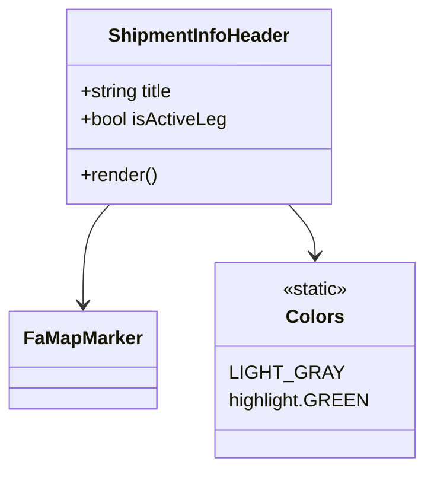

# Diagram: web/portal/src/modules/shipment-detail/shipment-detail-styled-components/ShipmentInfoHeader.js


> Auto-generated by Obscura crawlers

## Diagram 1



### SVG

<svg id="container" width="356.8359375" xmlns="http://www.w3.org/2000/svg" class="classDiagram" height="402" viewBox="0 0 356.8359375 402" role="graphics-document document" aria-roledescription="class"><style>#container{font-family:"trebuchet ms",verdana,arial,sans-serif;font-size:16px;fill:#333;}@keyframes edge-animation-frame{from{stroke-dashoffset:0;}}@keyframes dash{to{stroke-dashoffset:0;}}#container .edge-animation-slow{stroke-dasharray:9,5!important;stroke-dashoffset:900;animation:dash 50s linear infinite;stroke-linecap:round;}#container .edge-animation-fast{stroke-dasharray:9,5!important;stroke-dashoffset:900;animation:dash 20s linear infinite;stroke-linecap:round;}#container .error-icon{fill:#552222;}#container .error-text{fill:#552222;stroke:#552222;}#container .edge-thickness-normal{stroke-width:1px;}#container .edge-thickness-thick{stroke-width:3.5px;}#container .edge-pattern-solid{stroke-dasharray:0;}#container .edge-thickness-invisible{stroke-width:0;fill:none;}#container .edge-pattern-dashed{stroke-dasharray:3;}#container .edge-pattern-dotted{stroke-dasharray:2;}#container .marker{fill:#333333;stroke:#333333;}#container .marker.cross{stroke:#333333;}#container svg{font-family:"trebuchet ms",verdana,arial,sans-serif;font-size:16px;}#container p{margin:0;}#container g.classGroup text{fill:#9370DB;stroke:none;font-family:"trebuchet ms",verdana,arial,sans-serif;font-size:10px;}#container g.classGroup text .title{font-weight:bolder;}#container .nodeLabel,#container .edgeLabel{color:#131300;}#container .edgeLabel .label rect{fill:#ECECFF;}#container .label text{fill:#131300;}#container .labelBkg{background:#ECECFF;}#container .edgeLabel .label span{background:#ECECFF;}#container .classTitle{font-weight:bolder;}#container .node rect,#container .node circle,#container .node ellipse,#container .node polygon,#container .node path{fill:#ECECFF;stroke:#9370DB;stroke-width:1px;}#container .divider{stroke:#9370DB;stroke-width:1;}#container g.clickable{cursor:pointer;}#container g.classGroup rect{fill:#ECECFF;stroke:#9370DB;}#container g.classGroup line{stroke:#9370DB;stroke-width:1;}#container .classLabel .box{stroke:none;stroke-width:0;fill:#ECECFF;opacity:0.5;}#container .classLabel .label{fill:#9370DB;font-size:10px;}#container .relation{stroke:#333333;stroke-width:1;fill:none;}#container .dashed-line{stroke-dasharray:3;}#container .dotted-line{stroke-dasharray:1 2;}#container #compositionStart,#container .composition{fill:#333333!important;stroke:#333333!important;stroke-width:1;}#container #compositionEnd,#container .composition{fill:#333333!important;stroke:#333333!important;stroke-width:1;}#container #dependencyStart,#container .dependency{fill:#333333!important;stroke:#333333!important;stroke-width:1;}#container #dependencyStart,#container .dependency{fill:#333333!important;stroke:#333333!important;stroke-width:1;}#container #extensionStart,#container .extension{fill:transparent!important;stroke:#333333!important;stroke-width:1;}#container #extensionEnd,#container .extension{fill:transparent!important;stroke:#333333!important;stroke-width:1;}#container #aggregationStart,#container .aggregation{fill:transparent!important;stroke:#333333!important;stroke-width:1;}#container #aggregationEnd,#container .aggregation{fill:transparent!important;stroke:#333333!important;stroke-width:1;}#container #lollipopStart,#container .lollipop{fill:#ECECFF!important;stroke:#333333!important;stroke-width:1;}#container #lollipopEnd,#container .lollipop{fill:#ECECFF!important;stroke:#333333!important;stroke-width:1;}#container .edgeTerminals{font-size:11px;line-height:initial;}#container .classTitleText{text-anchor:middle;font-size:18px;fill:#333;}#container .label-icon{display:inline-block;height:1em;overflow:visible;vertical-align:-0.125em;}#container .node .label-icon path{fill:currentColor;stroke:revert;stroke-width:revert;}#container :root{--mermaid-font-family:"trebuchet ms",verdana,arial,sans-serif;}</style><g><defs><marker id="container_class-aggregationStart" class="marker aggregation class" refX="18" refY="7" markerWidth="190" markerHeight="240" orient="auto"><path d="M 18,7 L9,13 L1,7 L9,1 Z"></path></marker></defs><defs><marker id="container_class-aggregationEnd" class="marker aggregation class" refX="1" refY="7" markerWidth="20" markerHeight="28" orient="auto"><path d="M 18,7 L9,13 L1,7 L9,1 Z"></path></marker></defs><defs><marker id="container_class-extensionStart" class="marker extension class" refX="18" refY="7" markerWidth="190" markerHeight="240" orient="auto"><path d="M 1,7 L18,13 V 1 Z"></path></marker></defs><defs><marker id="container_class-extensionEnd" class="marker extension class" refX="1" refY="7" markerWidth="20" markerHeight="28" orient="auto"><path d="M 1,1 V 13 L18,7 Z"></path></marker></defs><defs><marker id="container_class-compositionStart" class="marker composition class" refX="18" refY="7" markerWidth="190" markerHeight="240" orient="auto"><path d="M 18,7 L9,13 L1,7 L9,1 Z"></path></marker></defs><defs><marker id="container_class-compositionEnd" class="marker composition class" refX="1" refY="7" markerWidth="20" markerHeight="28" orient="auto"><path d="M 18,7 L9,13 L1,7 L9,1 Z"></path></marker></defs><defs><marker id="container_class-dependencyStart" class="marker dependency class" refX="6" refY="7" markerWidth="190" markerHeight="240" orient="auto"><path d="M 5,7 L9,13 L1,7 L9,1 Z"></path></marker></defs><defs><marker id="container_class-dependencyEnd" class="marker dependency class" refX="13" refY="7" markerWidth="20" markerHeight="28" orient="auto"><path d="M 18,7 L9,13 L14,7 L9,1 Z"></path></marker></defs><defs><marker id="container_class-lollipopStart" class="marker lollipop class" refX="13" refY="7" markerWidth="190" markerHeight="240" orient="auto"><circle stroke="black" fill="transparent" cx="7" cy="7" r="6"></circle></marker></defs><defs><marker id="container_class-lollipopEnd" class="marker lollipop class" refX="1" refY="7" markerWidth="190" markerHeight="240" orient="auto"><circle stroke="black" fill="transparent" cx="7" cy="7" r="6"></circle></marker></defs><g class="root"><g class="clusters"></g><g class="edgePaths"><path d="M91.481,176L87.746,180.167C84.011,184.333,76.54,192.667,72.805,207C69.07,221.333,69.07,241.667,69.07,251.833L69.07,262" id="id_ShipmentInfoHeader_FaMapMarker_1" class="edge-thickness-normal edge-pattern-solid relation" style=";;;" data-edge="true" data-et="edge" data-id="id_ShipmentInfoHeader_FaMapMarker_1" data-points="W3sieCI6OTEuNDgwNjMwMDE3MjAxODMsInkiOjE3Nn0seyJ4Ijo2OS4wNzAzMTI1LCJ5IjoyMDF9LHsieCI6NjkuMDcwMzEyNSwieSI6MjY4fV0=" marker-end="url(#container_class-dependencyEnd)"></path><path d="M242.078,176L245.813,180.167C249.548,184.333,257.018,192.667,260.753,200C264.488,207.333,264.488,213.667,264.488,216.833L264.488,220" id="id_ShipmentInfoHeader_Colors_2" class="edge-thickness-normal edge-pattern-solid relation" style=";;;" data-edge="true" data-et="edge" data-id="id_ShipmentInfoHeader_Colors_2" data-points="W3sieCI6MjQyLjA3Nzk2MzczMjc5ODE3LCJ5IjoxNzZ9LHsieCI6MjY0LjQ4ODI4MTI1LCJ5IjoyMDF9LHsieCI6MjY0LjQ4ODI4MTI1LCJ5IjoyMjZ9XQ==" marker-end="url(#container_class-dependencyEnd)"></path></g><g class="edgeLabels"><g class="edgeLabel"><g class="label" data-id="id_ShipmentInfoHeader_FaMapMarker_1" transform="translate(0, 0)"><foreignObject width="0" height="0"><div xmlns="http://www.w3.org/1999/xhtml" class="labelBkg" style="display: table-cell; white-space: nowrap; line-height: 1.5; max-width: 200px; text-align: center;"><span class="edgeLabel"></span></div></foreignObject></g></g><g class="edgeLabel"><g class="label" data-id="id_ShipmentInfoHeader_Colors_2" transform="translate(0, 0)"><foreignObject width="0" height="0"><div xmlns="http://www.w3.org/1999/xhtml" class="labelBkg" style="display: table-cell; white-space: nowrap; line-height: 1.5; max-width: 200px; text-align: center;"><span class="edgeLabel"></span></div></foreignObject></g></g></g><g class="nodes"><g class="node default" id="classId-ShipmentInfoHeader-0" transform="translate(166.779296875, 92)"><g class="basic label-container"><path d="M-112.66015625 -84 L112.66015625 -84 L112.66015625 84 L-112.66015625 84" stroke="none" stroke-width="0" fill="#ECECFF" style=""></path><path d="M-112.66015625 -84 C-43.44764455240819 -84, 25.764867145183615 -84, 112.66015625 -84 M-112.66015625 -84 C-59.130234663283524 -84, -5.600313076567048 -84, 112.66015625 -84 M112.66015625 -84 C112.66015625 -22.376053699730207, 112.66015625 39.247892600539586, 112.66015625 84 M112.66015625 -84 C112.66015625 -20.455205323720612, 112.66015625 43.089589352558775, 112.66015625 84 M112.66015625 84 C24.52120936397982 84, -63.61773752204036 84, -112.66015625 84 M112.66015625 84 C62.07467650310736 84, 11.489196756214724 84, -112.66015625 84 M-112.66015625 84 C-112.66015625 41.72045610174046, -112.66015625 -0.5590877965190799, -112.66015625 -84 M-112.66015625 84 C-112.66015625 26.31651568707563, -112.66015625 -31.36696862584874, -112.66015625 -84" stroke="#9370DB" stroke-width="1.3" fill="none" stroke-dasharray="0 0" style=""></path></g><g class="annotation-group text" transform="translate(0, -60)"></g><g class="label-group text" transform="translate(-75.9765625, -60)"><g class="label" style="font-weight: bolder" transform="translate(0,-12)"><foreignObject width="151.953125" height="24"><div xmlns="http://www.w3.org/1999/xhtml" style="display: table-cell; white-space: nowrap; line-height: 1.5; max-width: 202px; text-align: center;"><span class="nodeLabel markdown-node-label" style=""><p>ShipmentInfoHeader</p></span></div></foreignObject></g></g><g class="members-group text" transform="translate(-100.66015625, -12)"><g class="label" style="" transform="translate(0,-12)"><foreignObject width="83.09375" height="24"><div xmlns="http://www.w3.org/1999/xhtml" style="display: table-cell; white-space: nowrap; line-height: 1.5; max-width: 140px; text-align: center;"><span class="nodeLabel markdown-node-label" style=""><p>+string title</p></span></div></foreignObject></g><g class="label" style="" transform="translate(0,12)"><foreignObject width="125.34375" height="24"><div xmlns="http://www.w3.org/1999/xhtml" style="display: table-cell; white-space: nowrap; line-height: 1.5; max-width: 183px; text-align: center;"><span class="nodeLabel markdown-node-label" style=""><p>+bool isActiveLeg</p></span></div></foreignObject></g></g><g class="methods-group text" transform="translate(-100.66015625, 60)"><g class="label" style="" transform="translate(0,-12)"><foreignObject width="66.609375" height="24"><div xmlns="http://www.w3.org/1999/xhtml" style="display: table-cell; white-space: nowrap; line-height: 1.5; max-width: 124px; text-align: center;"><span class="nodeLabel markdown-node-label" style=""><p>+render()</p></span></div></foreignObject></g></g><g class="divider" style=""><path d="M-112.66015625 -36 C-54.37918392392794 -36, 3.9017884021441205 -36, 112.66015625 -36 M-112.66015625 -36 C-51.50744554878997 -36, 9.645265152420066 -36, 112.66015625 -36" stroke="#9370DB" stroke-width="1.3" fill="none" stroke-dasharray="0 0" style=""></path></g><g class="divider" style=""><path d="M-112.66015625 36 C-60.94882805744372 36, -9.23749986488744 36, 112.66015625 36 M-112.66015625 36 C-49.79705665674277 36, 13.066042936514464 36, 112.66015625 36" stroke="#9370DB" stroke-width="1.3" fill="none" stroke-dasharray="0 0" style=""></path></g></g><g class="node default" id="classId-FaMapMarker-1" transform="translate(69.0703125, 310)"><g class="basic label-container"><path d="M-61.0703125 -42 L61.0703125 -42 L61.0703125 42 L-61.0703125 42" stroke="none" stroke-width="0" fill="#ECECFF" style=""></path><path d="M-61.0703125 -42 C-28.628821436220818 -42, 3.812669627558364 -42, 61.0703125 -42 M-61.0703125 -42 C-26.511638714158202 -42, 8.047035071683595 -42, 61.0703125 -42 M61.0703125 -42 C61.0703125 -20.795246093624296, 61.0703125 0.40950781275140713, 61.0703125 42 M61.0703125 -42 C61.0703125 -10.69033187750588, 61.0703125 20.61933624498824, 61.0703125 42 M61.0703125 42 C29.154160273719317 42, -2.7619919525613668 42, -61.0703125 42 M61.0703125 42 C23.469839718215887 42, -14.130633063568226 42, -61.0703125 42 M-61.0703125 42 C-61.0703125 9.23725107280461, -61.0703125 -23.52549785439078, -61.0703125 -42 M-61.0703125 42 C-61.0703125 11.229941954873262, -61.0703125 -19.540116090253477, -61.0703125 -42" stroke="#9370DB" stroke-width="1.3" fill="none" stroke-dasharray="0 0" style=""></path></g><g class="annotation-group text" transform="translate(0, -18)"></g><g class="label-group text" transform="translate(-49.0703125, -18)"><g class="label" style="font-weight: bolder" transform="translate(0,-12)"><foreignObject width="98.140625" height="24"><div xmlns="http://www.w3.org/1999/xhtml" style="display: table-cell; white-space: nowrap; line-height: 1.5; max-width: 147px; text-align: center;"><span class="nodeLabel markdown-node-label" style=""><p>FaMapMarker</p></span></div></foreignObject></g></g><g class="members-group text" transform="translate(-49.0703125, 30)"></g><g class="methods-group text" transform="translate(-49.0703125, 60)"></g><g class="divider" style=""><path d="M-61.0703125 6 C-33.96894815577794 6, -6.867583811555875 6, 61.0703125 6 M-61.0703125 6 C-35.7358794191685 6, -10.401446338336996 6, 61.0703125 6" stroke="#9370DB" stroke-width="1.3" fill="none" stroke-dasharray="0 0" style=""></path></g><g class="divider" style=""><path d="M-61.0703125 24 C-30.953491706615754 24, -0.836670913231508 24, 61.0703125 24 M-61.0703125 24 C-27.828490800073077 24, 5.413330899853847 24, 61.0703125 24" stroke="#9370DB" stroke-width="1.3" fill="none" stroke-dasharray="0 0" style=""></path></g></g><g class="node default" id="classId-Colors-2" transform="translate(264.48828125, 310)"><g class="basic label-container"><path d="M-84.34765625 -84 L84.34765625 -84 L84.34765625 84 L-84.34765625 84" stroke="none" stroke-width="0" fill="#ECECFF" style=""></path><path d="M-84.34765625 -84 C-35.97491253386103 -84, 12.39783118227794 -84, 84.34765625 -84 M-84.34765625 -84 C-34.37227670172979 -84, 15.603102846540423 -84, 84.34765625 -84 M84.34765625 -84 C84.34765625 -17.276742054081254, 84.34765625 49.44651589183749, 84.34765625 84 M84.34765625 -84 C84.34765625 -39.65369908368528, 84.34765625 4.692601832629435, 84.34765625 84 M84.34765625 84 C47.88706108652814 84, 11.426465923056284 84, -84.34765625 84 M84.34765625 84 C17.23249993427477 84, -49.88265638145046 84, -84.34765625 84 M-84.34765625 84 C-84.34765625 28.536682060997542, -84.34765625 -26.926635878004916, -84.34765625 -84 M-84.34765625 84 C-84.34765625 27.112921504972206, -84.34765625 -29.774156990055587, -84.34765625 -84" stroke="#9370DB" stroke-width="1.3" fill="none" stroke-dasharray="0 0" style=""></path></g><g class="annotation-group text" transform="translate(-29.0234375, -60)"><g class="label" style="" transform="translate(0,-12)"><foreignObject width="58.046875" height="24"><div xmlns="http://www.w3.org/1999/xhtml" style="display: table-cell; white-space: nowrap; line-height: 1.5; max-width: 108px; text-align: center;"><span class="nodeLabel markdown-node-label" style=""><p>«static»</p></span></div></foreignObject></g></g><g class="label-group text" transform="translate(-23.1015625, -36)"><g class="label" style="font-weight: bolder" transform="translate(0,-12)"><foreignObject width="46.203125" height="24"><div xmlns="http://www.w3.org/1999/xhtml" style="display: table-cell; white-space: nowrap; line-height: 1.5; max-width: 95px; text-align: center;"><span class="nodeLabel markdown-node-label" style=""><p>Colors</p></span></div></foreignObject></g></g><g class="members-group text" transform="translate(-72.34765625, 12)"><g class="label" style="" transform="translate(0,-12)"><foreignObject width="85.78125" height="24"><div xmlns="http://www.w3.org/1999/xhtml" style="display: table-cell; white-space: nowrap; line-height: 1.5; max-width: 136px; text-align: center;"><span class="nodeLabel markdown-node-label" style=""><p>LIGHT_GRAY</p></span></div></foreignObject></g><g class="label" style="" transform="translate(0,12)"><foreignObject width="115.671875" height="24"><div xmlns="http://www.w3.org/1999/xhtml" style="display: table-cell; white-space: nowrap; line-height: 1.5; max-width: 166px; text-align: center;"><span class="nodeLabel markdown-node-label" style=""><p>highlight.GREEN</p></span></div></foreignObject></g></g><g class="methods-group text" transform="translate(-72.34765625, 84)"></g><g class="divider" style=""><path d="M-84.34765625 -12 C-32.60092552780452 -12, 19.14580519439096 -12, 84.34765625 -12 M-84.34765625 -12 C-21.95390398838589 -12, 40.43984827322822 -12, 84.34765625 -12" stroke="#9370DB" stroke-width="1.3" fill="none" stroke-dasharray="0 0" style=""></path></g><g class="divider" style=""><path d="M-84.34765625 60 C-16.918222793768123 60, 50.51121066246375 60, 84.34765625 60 M-84.34765625 60 C-33.99390264762045 60, 16.359850954759096 60, 84.34765625 60" stroke="#9370DB" stroke-width="1.3" fill="none" stroke-dasharray="0 0" style=""></path></g></g></g></g></g></svg>

## Diagram 2

```mermaid
graph LR
Container[div: container (flex, borderBottom, paddingBottom, marginBottom)] --> Row[div: inner (flex, alignItems:center)]
Row --> Title[div: title (fontSize:14)]
Row -->|isActiveLeg = true| ActiveGroup[div: active group]
ActiveGroup --> Icon[FaMapMarker (fontSize:16, color:GREEN, margin:0 10px)]
ActiveGroup --> Label[span: "Active Shipment" (fontSize:12, fontWeight:bold, color:GREEN)]
Row -.->|isActiveLeg = false| NoActive[(no active elements shown)]
```

> SVG rendering failed for this diagram.
