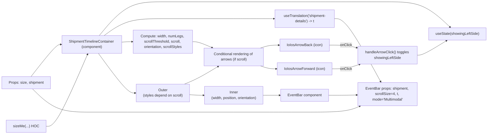

# Diagram: web/portal/src/modules/shipment-detail/shipment-detail-styled-components/ShipmentTimelineContainer.js

> Auto-generated by Obscura crawlers

## Mermaid

### SVG

<svg id="container" width="2140.609375" xmlns="http://www.w3.org/2000/svg" class="flowchart" height="607" viewBox="0 -35 2140.609375 607" role="graphics-document document" aria-roledescription="flowchart-v2"><g><marker id="container_flowchart-v2-pointEnd" class="marker flowchart-v2" viewBox="0 0 10 10" refX="5" refY="5" markerUnits="userSpaceOnUse" markerWidth="8" markerHeight="8" orient="auto"><path d="M 0 0 L 10 5 L 0 10 z" class="arrowMarkerPath" style="stroke-width: 1; stroke-dasharray: 1, 0;"></path></marker><marker id="container_flowchart-v2-pointStart" class="marker flowchart-v2" viewBox="0 0 10 10" refX="4.5" refY="5" markerUnits="userSpaceOnUse" markerWidth="8" markerHeight="8" orient="auto"><path d="M 0 5 L 10 10 L 10 0 z" class="arrowMarkerPath" style="stroke-width: 1; stroke-dasharray: 1, 0;"></path></marker><marker id="container_flowchart-v2-circleEnd" class="marker flowchart-v2" viewBox="0 0 10 10" refX="11" refY="5" markerUnits="userSpaceOnUse" markerWidth="11" markerHeight="11" orient="auto"><circle cx="5" cy="5" r="5" class="arrowMarkerPath" style="stroke-width: 1; stroke-dasharray: 1, 0;"></circle></marker><marker id="container_flowchart-v2-circleStart" class="marker flowchart-v2" viewBox="0 0 10 10" refX="-1" refY="5" markerUnits="userSpaceOnUse" markerWidth="11" markerHeight="11" orient="auto"><circle cx="5" cy="5" r="5" class="arrowMarkerPath" style="stroke-width: 1; stroke-dasharray: 1, 0;"></circle></marker><marker id="container_flowchart-v2-crossEnd" class="marker cross flowchart-v2" viewBox="0 0 11 11" refX="12" refY="5.2" markerUnits="userSpaceOnUse" markerWidth="11" markerHeight="11" orient="auto"><path d="M 1,1 l 9,9 M 10,1 l -9,9" class="arrowMarkerPath" style="stroke-width: 2; stroke-dasharray: 1, 0;"></path></marker><marker id="container_flowchart-v2-crossStart" class="marker cross flowchart-v2" viewBox="0 0 11 11" refX="-1" refY="5.2" markerUnits="userSpaceOnUse" markerWidth="11" markerHeight="11" orient="auto"><path d="M 1,1 l 9,9 M 10,1 l -9,9" class="arrowMarkerPath" style="stroke-width: 2; stroke-dasharray: 1, 0;"></path></marker><g class="root"><g class="clusters"></g><g class="edgePaths"><path d="M134.243,313L152.874,287.5C171.506,262,208.768,211,230.9,185.5C253.031,160,260.031,160,263.531,160L267.031,160" id="L_Props_ShipmentTimelineContainer_0" class="edge-thickness-normal edge-pattern-solid edge-thickness-normal edge-pattern-solid flowchart-link" style=";" data-edge="true" data-et="edge" data-id="L_Props_ShipmentTimelineContainer_0" data-points="W3sieCI6MTM0LjI0Mjk2ODc1LCJ5IjozMTN9LHsieCI6MjQ2LjAzMTI1LCJ5IjoxNjB9LHsieCI6MjcxLjAzMTI1LCJ5IjoxNjB9XQ==" marker-end="url(#container_flowchart-v2-pointEnd)"></path><path d="M197.414,537L205.517,537C213.62,537,229.826,537,261.352,481.281C292.878,425.562,339.724,314.125,363.147,258.406L386.571,202.687" id="L_sizeMeHOC_ShipmentTimelineContainer_0" class="edge-thickness-normal edge-pattern-solid edge-thickness-normal edge-pattern-solid flowchart-link" style=";" data-edge="true" data-et="edge" data-id="L_sizeMeHOC_ShipmentTimelineContainer_0" data-points="W3sieCI6MTk3LjQxNDA2MjUsInkiOjUzN30seyJ4IjoyNDYuMDMxMjUsInkiOjUzN30seyJ4IjozODguMTIwNjg5NjU1MTcyNDQsInkiOjE5OX1d" marker-end="url(#container_flowchart-v2-pointEnd)"></path><path d="M437.569,121L458.474,96.333C479.379,71.667,521.19,22.333,567.928,-2.333C614.667,-27,666.333,-27,718,-27C769.667,-27,821.333,-27,873,-27C924.667,-27,976.333,-27,1028,-27C1079.667,-27,1131.333,-27,1183,-27C1234.667,-27,1286.333,-27,1342.38,-27C1398.427,-27,1458.854,-27,1519.281,-27C1579.708,-27,1640.135,-27,1696.182,-27C1752.229,-27,1803.896,-27,1849.799,-7.465C1895.702,12.07,1935.841,51.14,1955.911,70.675L1975.981,90.21" id="L_ShipmentTimelineContainer_useStateHook_0" class="edge-thickness-normal edge-pattern-solid edge-thickness-normal edge-pattern-solid flowchart-link" style=";" data-edge="true" data-et="edge" data-id="L_ShipmentTimelineContainer_useStateHook_0" data-points="W3sieCI6NDM3LjU2ODUxNjA0Mjc4MDc0LCJ5IjoxMjF9LHsieCI6NTYzLCJ5IjotMjd9LHsieCI6NzE4LCJ5IjotMjd9LHsieCI6ODczLCJ5IjotMjd9LHsieCI6MTAyOCwieSI6LTI3fSx7IngiOjExODMsInkiOi0yN30seyJ4IjoxMzM4LCJ5IjotMjd9LHsieCI6MTUxOS4yODEyNSwieSI6LTI3fSx7IngiOjE3MDAuNTYyNSwieSI6LTI3fSx7IngiOjE4NTUuNTYyNSwieSI6LTI3fSx7IngiOjE5NzguODQ2OTM4Nzc1NTEwMSwieSI6OTN9XQ==" marker-end="url(#container_flowchart-v2-pointEnd)"></path><path d="M459.214,121L476.511,108.667C493.809,96.333,528.405,71.667,571.536,59.333C614.667,47,666.333,47,718,47C769.667,47,821.333,47,873,47C924.667,47,976.333,47,1028,47C1079.667,47,1131.333,47,1160.667,47C1190,47,1197,47,1200.5,47L1204,47" id="L_ShipmentTimelineContainer_useTranslationHook_0" class="edge-thickness-normal edge-pattern-solid edge-thickness-normal edge-pattern-solid flowchart-link" style=";" data-edge="true" data-et="edge" data-id="L_ShipmentTimelineContainer_useTranslationHook_0" data-points="W3sieCI6NDU5LjIxMzc3MjEyMzg5MzgsInkiOjEyMX0seyJ4Ijo1NjMsInkiOjQ3fSx7IngiOjcxOCwieSI6NDd9LHsieCI6ODczLCJ5Ijo0N30seyJ4IjoxMDI4LCJ5Ijo0N30seyJ4IjoxMTgzLCJ5Ijo0N30seyJ4IjoxMjA4LCJ5Ijo0N31d" marker-end="url(#container_flowchart-v2-pointEnd)"></path><path d="M538,149.893L542.167,149.577C546.333,149.262,554.667,148.631,562.333,148.315C570,148,577,148,580.5,148L584,148" id="L_ShipmentTimelineContainer_compute_0" class="edge-thickness-normal edge-pattern-solid edge-thickness-normal edge-pattern-solid flowchart-link" style=";" data-edge="true" data-et="edge" data-id="L_ShipmentTimelineContainer_compute_0" data-points="W3sieCI6NTM4LCJ5IjoxNDkuODkyOTMxMDg1NDc3Njd9LHsieCI6NTYzLCJ5IjoxNDh9LHsieCI6NTg4LCJ5IjoxNDh9XQ==" marker-end="url(#container_flowchart-v2-pointEnd)"></path><path d="M848,148L852.167,148C856.333,148,864.667,148,879.017,152.402C893.368,156.804,913.736,165.609,923.92,170.011L934.104,174.413" id="L_compute_ConditionalArrows_0" class="edge-thickness-normal edge-pattern-solid edge-thickness-normal edge-pattern-solid flowchart-link" style=";" data-edge="true" data-et="edge" data-id="L_compute_ConditionalArrows_0" data-points="W3sieCI6ODQ4LCJ5IjoxNDh9LHsieCI6ODczLCJ5IjoxNDh9LHsieCI6OTM3Ljc3NjExOTQwMjk4NSwieSI6MTc2fV0=" marker-end="url(#container_flowchart-v2-pointEnd)"></path><path d="M1144.25,176L1150.708,173.833C1157.167,171.667,1170.083,167.333,1183.633,165.167C1197.182,163,1211.365,163,1218.456,163L1225.547,163" id="L_ConditionalArrows_ArrowBack_0" class="edge-thickness-normal edge-pattern-solid edge-thickness-normal edge-pattern-solid flowchart-link" style=";" data-edge="true" data-et="edge" data-id="L_ConditionalArrows_ArrowBack_0" data-points="W3sieCI6MTE0NC4yNSwieSI6MTc2fSx7IngiOjExODMsInkiOjE2M30seyJ4IjoxMjI5LjU0Njg3NSwieSI6MTYzfV0=" marker-end="url(#container_flowchart-v2-pointEnd)"></path><path d="M1144.25,254L1150.708,256.167C1157.167,258.333,1170.083,262.667,1181.65,264.833C1193.216,267,1203.432,267,1208.54,267L1213.648,267" id="L_ConditionalArrows_ArrowForward_0" class="edge-thickness-normal edge-pattern-solid edge-thickness-normal edge-pattern-solid flowchart-link" style=";" data-edge="true" data-et="edge" data-id="L_ConditionalArrows_ArrowForward_0" data-points="W3sieCI6MTE0NC4yNSwieSI6MjU0fSx7IngiOjExODMsInkiOjI2N30seyJ4IjoxMjE3LjY0ODQzNzUsInkiOjI2N31d" marker-end="url(#container_flowchart-v2-pointEnd)"></path><path d="M1446.453,163L1458.591,163C1470.729,163,1495.005,163,1515.042,164.917C1535.079,166.834,1550.877,170.669,1558.776,172.586L1566.675,174.503" id="L_ArrowBack_handleArrowClick_0" class="edge-thickness-normal edge-pattern-solid edge-thickness-normal edge-pattern-solid flowchart-link" style=";" data-edge="true" data-et="edge" data-id="L_ArrowBack_handleArrowClick_0" data-points="W3sieCI6MTQ0Ni40NTMxMjUsInkiOjE2M30seyJ4IjoxNTE5LjI4MTI1LCJ5IjoxNjN9LHsieCI6MTU3MC41NjI1LCJ5IjoxNzUuNDQ2ODE5NTEzODc2OX1d" marker-end="url(#container_flowchart-v2-pointEnd)"></path><path d="M1458.352,267L1468.507,267C1478.661,267,1498.971,267,1519.068,263.709C1539.165,260.419,1559.049,253.838,1568.99,250.547L1578.932,247.257" id="L_ArrowForward_handleArrowClick_0" class="edge-thickness-normal edge-pattern-solid edge-thickness-normal edge-pattern-solid flowchart-link" style=";" data-edge="true" data-et="edge" data-id="L_ArrowForward_handleArrowClick_0" data-points="W3sieCI6MTQ1OC4zNTE1NjI1LCJ5IjoyNjd9LHsieCI6MTUxOS4yODEyNSwieSI6MjY3fSx7IngiOjE1ODIuNzI5Njg3NSwieSI6MjQ2fV0=" marker-end="url(#container_flowchart-v2-pointEnd)"></path><path d="M1830.563,207L1834.729,207C1838.896,207,1847.229,207,1868.177,197.333C1889.125,187.666,1922.688,168.331,1939.469,158.664L1956.251,148.997" id="L_handleArrowClick_useStateHook_0" class="edge-thickness-normal edge-pattern-solid edge-thickness-normal edge-pattern-solid flowchart-link" style=";" data-edge="true" data-et="edge" data-id="L_handleArrowClick_useStateHook_0" data-points="W3sieCI6MTgzMC41NjI1LCJ5IjoyMDd9LHsieCI6MTg1NS41NjI1LCJ5IjoyMDd9LHsieCI6MTk1OS43MTY1OTQ4Mjc1ODYzLCJ5IjoxNDd9XQ==" marker-end="url(#container_flowchart-v2-pointEnd)"></path><path d="M432.739,199L454.449,229C476.159,259,519.58,319,546.57,349C573.56,379,584.12,379,589.4,379L594.68,379" id="L_ShipmentTimelineContainer_ContainerDiv_0" class="edge-thickness-normal edge-pattern-solid edge-thickness-normal edge-pattern-solid flowchart-link" style=";" data-edge="true" data-et="edge" data-id="L_ShipmentTimelineContainer_ContainerDiv_0" data-points="W3sieCI6NDMyLjczODg2OTg2MzAxMzcsInkiOjE5OX0seyJ4Ijo1NjMsInkiOjM3OX0seyJ4Ijo1OTguNjc5Njg3NSwieSI6Mzc5fV0=" marker-end="url(#container_flowchart-v2-pointEnd)"></path><path d="M804.357,340L815.798,334.833C827.238,329.667,850.119,319.333,876.105,305.346C902.09,291.358,931.181,273.716,945.726,264.895L960.271,256.074" id="L_ContainerDiv_ConditionalArrows_0" class="edge-thickness-normal edge-pattern-solid edge-thickness-normal edge-pattern-solid flowchart-link" style=";" data-edge="true" data-et="edge" data-id="L_ContainerDiv_ConditionalArrows_0" data-points="W3sieCI6ODA0LjM1NzE0Mjg1NzE0MjksInkiOjM0MH0seyJ4Ijo4NzMsInkiOjMwOX0seyJ4Ijo5NjMuNjkxNDg5MzYxNzAyMSwieSI6MjU0fV0=" marker-end="url(#container_flowchart-v2-pointEnd)"></path><path d="M837.32,386.698L843.267,387.082C849.214,387.465,861.107,388.233,870.553,388.616C880,389,887,389,890.5,389L894,389" id="L_ContainerDiv_InnerDiv_0" class="edge-thickness-normal edge-pattern-solid edge-thickness-normal edge-pattern-solid flowchart-link" style=";" data-edge="true" data-et="edge" data-id="L_ContainerDiv_InnerDiv_0" data-points="W3sieCI6ODM3LjMyMDMxMjUsInkiOjM4Ni42OTgwODQ2Nzc0MTkzM30seyJ4Ijo4NzMsInkiOjM4OX0seyJ4Ijo4OTgsInkiOjM4OX1d" marker-end="url(#container_flowchart-v2-pointEnd)"></path><path d="M1158,389L1162.167,389C1166.333,389,1174.667,389,1186.396,389C1198.125,389,1213.25,389,1220.813,389L1228.375,389" id="L_InnerDiv_EventBarComp_0" class="edge-thickness-normal edge-pattern-solid edge-thickness-normal edge-pattern-solid flowchart-link" style=";" data-edge="true" data-et="edge" data-id="L_InnerDiv_EventBarComp_0" data-points="W3sieCI6MTE1OCwieSI6Mzg5fSx7IngiOjExODMsInkiOjM4OX0seyJ4IjoxMjMyLjM3NSwieSI6Mzg5fV0=" marker-end="url(#container_flowchart-v2-pointEnd)"></path><path d="M1443.625,389L1456.234,389C1468.844,389,1494.063,389,1514.552,389C1535.042,389,1550.802,389,1558.682,389L1566.563,389" id="L_EventBarComp_EventBarProps_0" class="edge-thickness-normal edge-pattern-solid edge-thickness-normal edge-pattern-solid flowchart-link" style=";" data-edge="true" data-et="edge" data-id="L_EventBarComp_EventBarProps_0" data-points="W3sieCI6MTQ0My42MjUsInkiOjM4OX0seyJ4IjoxNTE5LjI4MTI1LCJ5IjozODl9LHsieCI6MTU3MC41NjI1LCJ5IjozODl9XQ==" marker-end="url(#container_flowchart-v2-pointEnd)"></path><path d="M140.819,367L158.354,385C175.89,403,210.96,439,254.91,457C298.859,475,351.688,475,404.516,475C457.344,475,510.172,475,562.419,475C614.667,475,666.333,475,718,475C769.667,475,821.333,475,873,475C924.667,475,976.333,475,1028,475C1079.667,475,1131.333,475,1183,475C1234.667,475,1286.333,475,1342.38,475C1398.427,475,1458.854,475,1500.762,469.452C1542.669,463.905,1566.057,452.81,1577.751,447.262L1589.445,441.714" id="L_Props_EventBarProps_0" class="edge-thickness-normal edge-pattern-solid edge-thickness-normal edge-pattern-solid flowchart-link" style=";" data-edge="true" data-et="edge" data-id="L_Props_EventBarProps_0" data-points="W3sieCI6MTQwLjgxODc1LCJ5IjozNjd9LHsieCI6MjQ2LjAzMTI1LCJ5Ijo0NzV9LHsieCI6NDA0LjUxNTYyNSwieSI6NDc1fSx7IngiOjU2MywieSI6NDc1fSx7IngiOjcxOCwieSI6NDc1fSx7IngiOjg3MywieSI6NDc1fSx7IngiOjEwMjgsInkiOjQ3NX0seyJ4IjoxMTgzLCJ5Ijo0NzV9LHsieCI6MTMzOCwieSI6NDc1fSx7IngiOjE1MTkuMjgxMjUsInkiOjQ3NX0seyJ4IjoxNTkzLjA1ODUwMjkwNjk3NjYsInkiOjQ0MH1d" marker-end="url(#container_flowchart-v2-pointEnd)"></path><path d="M1468,47L1476.547,47C1485.094,47,1502.188,47,1536.13,94.911C1570.073,142.822,1620.864,238.644,1646.26,286.555L1671.656,334.466" id="L_useTranslationHook_EventBarProps_0" class="edge-thickness-normal edge-pattern-solid edge-thickness-normal edge-pattern-solid flowchart-link" style=";" data-edge="true" data-et="edge" data-id="L_useTranslationHook_EventBarProps_0" data-points="W3sieCI6MTQ2OCwieSI6NDd9LHsieCI6MTUxOS4yODEyNSwieSI6NDd9LHsieCI6MTY3My41MjkzMzExNDAzNTEsInkiOjMzOH1d" marker-end="url(#container_flowchart-v2-pointEnd)"></path></g><g class="edgeLabels"><g class="edgeLabel"><g class="label" data-id="L_Props_ShipmentTimelineContainer_0" transform="translate(0, 0)"><foreignObject width="0" height="0">

</foreignObject></g></g><g class="edgeLabel"><g class="label" data-id="L_sizeMeHOC_ShipmentTimelineContainer_0" transform="translate(0, 0)"><foreignObject width="0" height="0">

</foreignObject></g></g><g class="edgeLabel"><g class="label" data-id="L_ShipmentTimelineContainer_useStateHook_0" transform="translate(0, 0)"><foreignObject width="0" height="0">

</foreignObject></g></g><g class="edgeLabel"><g class="label" data-id="L_ShipmentTimelineContainer_useTranslationHook_0" transform="translate(0, 0)"><foreignObject width="0" height="0">

</foreignObject></g></g><g class="edgeLabel"><g class="label" data-id="L_ShipmentTimelineContainer_compute_0" transform="translate(0, 0)"><foreignObject width="0" height="0">

</foreignObject></g></g><g class="edgeLabel"><g class="label" data-id="L_compute_ConditionalArrows_0" transform="translate(0, 0)"><foreignObject width="0" height="0">

</foreignObject></g></g><g class="edgeLabel"><g class="label" data-id="L_ConditionalArrows_ArrowBack_0" transform="translate(0, 0)"><foreignObject width="0" height="0">

</foreignObject></g></g><g class="edgeLabel"><g class="label" data-id="L_ConditionalArrows_ArrowForward_0" transform="translate(0, 0)"><foreignObject width="0" height="0">

</foreignObject></g></g><g class="edgeLabel" transform="translate(1519.28125, 163)"><g class="label" data-id="L_ArrowBack_handleArrowClick_0" transform="translate(-26.28125, -12)"><foreignObject width="52.5625" height="24">

onClick

</foreignObject></g></g><g class="edgeLabel" transform="translate(1519.28125, 267)"><g class="label" data-id="L_ArrowForward_handleArrowClick_0" transform="translate(-26.28125, -12)"><foreignObject width="52.5625" height="24">

onClick

</foreignObject></g></g><g class="edgeLabel"><g class="label" data-id="L_handleArrowClick_useStateHook_0" transform="translate(0, 0)"><foreignObject width="0" height="0">

</foreignObject></g></g><g class="edgeLabel"><g class="label" data-id="L_ShipmentTimelineContainer_ContainerDiv_0" transform="translate(0, 0)"><foreignObject width="0" height="0">

</foreignObject></g></g><g class="edgeLabel"><g class="label" data-id="L_ContainerDiv_ConditionalArrows_0" transform="translate(0, 0)"><foreignObject width="0" height="0">

</foreignObject></g></g><g class="edgeLabel"><g class="label" data-id="L_ContainerDiv_InnerDiv_0" transform="translate(0, 0)"><foreignObject width="0" height="0">

</foreignObject></g></g><g class="edgeLabel"><g class="label" data-id="L_InnerDiv_EventBarComp_0" transform="translate(0, 0)"><foreignObject width="0" height="0">

</foreignObject></g></g><g class="edgeLabel"><g class="label" data-id="L_EventBarComp_EventBarProps_0" transform="translate(0, 0)"><foreignObject width="0" height="0">

</foreignObject></g></g><g class="edgeLabel"><g class="label" data-id="L_Props_EventBarProps_0" transform="translate(0, 0)"><foreignObject width="0" height="0">

</foreignObject></g></g><g class="edgeLabel"><g class="label" data-id="L_useTranslationHook_EventBarProps_0" transform="translate(0, 0)"><foreignObject width="0" height="0">

</foreignObject></g></g></g><g class="nodes"><g class="node default" id="flowchart-ShipmentTimelineContainer-0" transform="translate(404.515625, 160)"><rect class="basic label-container" style="" x="-133.484375" y="-39" width="266.96875" height="78"></rect><g class="label" style="" transform="translate(-103.484375, -24)"><rect></rect><foreignObject width="206.96875" height="48">

ShipmentTimelineContainer (component)

</foreignObject></g></g><g class="node default" id="flowchart-Props-1" transform="translate(114.515625, 340)"><rect class="basic label-container" style="" x="-106.515625" y="-27" width="213.03125" height="54"></rect><g class="label" style="" transform="translate(-76.515625, -12)"><rect></rect><foreignObject width="153.03125" height="24">

Props: size, shipment

</foreignObject></g></g><g class="node default" id="flowchart-sizeMeHOC-2" transform="translate(114.515625, 537)"><rect class="basic label-container" style="" x="-82.8984375" y="-27" width="165.796875" height="54"></rect><g class="label" style="" transform="translate(-52.8984375, -12)"><rect></rect><foreignObject width="105.796875" height="24">

sizeMe(...) HOC

</foreignObject></g></g><g class="node default" id="flowchart-useStateHook-3" transform="translate(2006.5859375, 120)"><rect class="basic label-container" style="" x="-126.0234375" y="-27" width="252.046875" height="54"></rect><g class="label" style="" transform="translate(-96.0234375, -12)"><rect></rect><foreignObject width="192.046875" height="24">

useState(showingLeftSide)

</foreignObject></g></g><g class="node default" id="flowchart-useTranslationHook-4" transform="translate(1338, 47)"><rect class="basic label-container" style="" x="-130" y="-39" width="260" height="78"></rect><g class="label" style="" transform="translate(-100, -24)"><rect></rect><foreignObject width="200" height="48">

useTranslation('shipment-details') -&gt; t

</foreignObject></g></g><g class="node default" id="flowchart-compute-5" transform="translate(718, 148)"><rect class="basic label-container" style="" x="-130" y="-51" width="260" height="102"></rect><g class="label" style="" transform="translate(-100, -36)"><rect></rect><foreignObject width="200" height="72">

Compute: width, numLegs, scrollThreshold, scroll, orientation, scrollStyles

</foreignObject></g></g><g class="node default" id="flowchart-handleArrowClick-6" transform="translate(1700.5625, 207)"><rect class="basic label-container" style="" x="-130" y="-39" width="260" height="78"></rect><g class="label" style="" transform="translate(-100, -24)"><rect></rect><foreignObject width="200" height="48">

handleArrowClick() toggles showingLeftSide

</foreignObject></g></g><g class="node default" id="flowchart-ArrowBack-7" transform="translate(1338, 163)"><rect class="basic label-container" style="" x="-108.453125" y="-27" width="216.90625" height="54"></rect><g class="label" style="" transform="translate(-78.453125, -12)"><rect></rect><foreignObject width="156.90625" height="24">

IoIosArrowBack (icon)

</foreignObject></g></g><g class="node default" id="flowchart-ArrowForward-8" transform="translate(1338, 267)"><rect class="basic label-container" style="" x="-120.3515625" y="-27" width="240.703125" height="54"></rect><g class="label" style="" transform="translate(-90.3515625, -12)"><rect></rect><foreignObject width="180.703125" height="24">

IoIosArrowForward (icon)

</foreignObject></g></g><g class="node default" id="flowchart-ConditionalArrows-9" transform="translate(1028, 215)"><rect class="basic label-container" style="" x="-130" y="-39" width="260" height="78"></rect><g class="label" style="" transform="translate(-100, -24)"><rect></rect><foreignObject width="200" height="48">

Conditional rendering of arrows (if scroll)

</foreignObject></g></g><g class="node default" id="flowchart-EventBarComp-10" transform="translate(1338, 389)"><rect class="basic label-container" style="" x="-105.625" y="-27" width="211.25" height="54"></rect><g class="label" style="" transform="translate(-75.625, -12)"><rect></rect><foreignObject width="151.25" height="24">

EventBar component

</foreignObject></g></g><g class="node default" id="flowchart-EventBarProps-11" transform="translate(1700.5625, 389)"><rect class="basic label-container" style="" x="-130" y="-51" width="260" height="102"></rect><g class="label" style="" transform="translate(-100, -36)"><rect></rect><foreignObject width="200" height="72">

EventBar props: shipment, scrollSize=4, t, mode='Multimodal'

</foreignObject></g></g><g class="node default" id="flowchart-ContainerDiv-12" transform="translate(718, 379)"><rect class="basic label-container" style="" x="-119.3203125" y="-39" width="238.640625" height="78"></rect><g class="label" style="" transform="translate(-89.3203125, -24)"><rect></rect><foreignObject width="178.640625" height="48">

Outer 

 (styles depend on scroll)

</foreignObject></g></g><g class="node default" id="flowchart-InnerDiv-13" transform="translate(1028, 389)"><rect class="basic label-container" style="" x="-130" y="-51" width="260" height="102"></rect><g class="label" style="" transform="translate(-100, -36)"><rect></rect><foreignObject width="200" height="72">

Inner 

 (width, position, orientation)

</foreignObject></g></g></g></g></g></svg>
