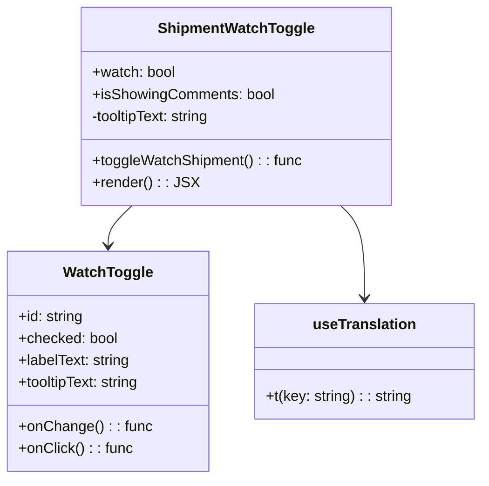

# Diagram: web/portal/src/modules/shipment-detail/shipment-detail-styled-components/ShipmentWatchToggle.js


> Auto-generated by Obscura crawlers

## Diagram 1



### SVG

<svg id="container" width="517.1796875" xmlns="http://www.w3.org/2000/svg" class="classDiagram" height="522" viewBox="0 0 517.1796875 522" role="graphics-document document" aria-roledescription="class"><style>#container{font-family:"trebuchet ms",verdana,arial,sans-serif;font-size:16px;fill:#333;}@keyframes edge-animation-frame{from{stroke-dashoffset:0;}}@keyframes dash{to{stroke-dashoffset:0;}}#container .edge-animation-slow{stroke-dasharray:9,5!important;stroke-dashoffset:900;animation:dash 50s linear infinite;stroke-linecap:round;}#container .edge-animation-fast{stroke-dasharray:9,5!important;stroke-dashoffset:900;animation:dash 20s linear infinite;stroke-linecap:round;}#container .error-icon{fill:#552222;}#container .error-text{fill:#552222;stroke:#552222;}#container .edge-thickness-normal{stroke-width:1px;}#container .edge-thickness-thick{stroke-width:3.5px;}#container .edge-pattern-solid{stroke-dasharray:0;}#container .edge-thickness-invisible{stroke-width:0;fill:none;}#container .edge-pattern-dashed{stroke-dasharray:3;}#container .edge-pattern-dotted{stroke-dasharray:2;}#container .marker{fill:#333333;stroke:#333333;}#container .marker.cross{stroke:#333333;}#container svg{font-family:"trebuchet ms",verdana,arial,sans-serif;font-size:16px;}#container p{margin:0;}#container g.classGroup text{fill:#9370DB;stroke:none;font-family:"trebuchet ms",verdana,arial,sans-serif;font-size:10px;}#container g.classGroup text .title{font-weight:bolder;}#container .nodeLabel,#container .edgeLabel{color:#131300;}#container .edgeLabel .label rect{fill:#ECECFF;}#container .label text{fill:#131300;}#container .labelBkg{background:#ECECFF;}#container .edgeLabel .label span{background:#ECECFF;}#container .classTitle{font-weight:bolder;}#container .node rect,#container .node circle,#container .node ellipse,#container .node polygon,#container .node path{fill:#ECECFF;stroke:#9370DB;stroke-width:1px;}#container .divider{stroke:#9370DB;stroke-width:1;}#container g.clickable{cursor:pointer;}#container g.classGroup rect{fill:#ECECFF;stroke:#9370DB;}#container g.classGroup line{stroke:#9370DB;stroke-width:1;}#container .classLabel .box{stroke:none;stroke-width:0;fill:#ECECFF;opacity:0.5;}#container .classLabel .label{fill:#9370DB;font-size:10px;}#container .relation{stroke:#333333;stroke-width:1;fill:none;}#container .dashed-line{stroke-dasharray:3;}#container .dotted-line{stroke-dasharray:1 2;}#container #compositionStart,#container .composition{fill:#333333!important;stroke:#333333!important;stroke-width:1;}#container #compositionEnd,#container .composition{fill:#333333!important;stroke:#333333!important;stroke-width:1;}#container #dependencyStart,#container .dependency{fill:#333333!important;stroke:#333333!important;stroke-width:1;}#container #dependencyStart,#container .dependency{fill:#333333!important;stroke:#333333!important;stroke-width:1;}#container #extensionStart,#container .extension{fill:transparent!important;stroke:#333333!important;stroke-width:1;}#container #extensionEnd,#container .extension{fill:transparent!important;stroke:#333333!important;stroke-width:1;}#container #aggregationStart,#container .aggregation{fill:transparent!important;stroke:#333333!important;stroke-width:1;}#container #aggregationEnd,#container .aggregation{fill:transparent!important;stroke:#333333!important;stroke-width:1;}#container #lollipopStart,#container .lollipop{fill:#ECECFF!important;stroke:#333333!important;stroke-width:1;}#container #lollipopEnd,#container .lollipop{fill:#ECECFF!important;stroke:#333333!important;stroke-width:1;}#container .edgeTerminals{font-size:11px;line-height:initial;}#container .classTitleText{text-anchor:middle;font-size:18px;fill:#333;}#container .label-icon{display:inline-block;height:1em;overflow:visible;vertical-align:-0.125em;}#container .node .label-icon path{fill:currentColor;stroke:revert;stroke-width:revert;}#container :root{--mermaid-font-family:"trebuchet ms",verdana,arial,sans-serif;}</style><g><defs><marker id="container_class-aggregationStart" class="marker aggregation class" refX="18" refY="7" markerWidth="190" markerHeight="240" orient="auto"><path d="M 18,7 L9,13 L1,7 L9,1 Z"></path></marker></defs><defs><marker id="container_class-aggregationEnd" class="marker aggregation class" refX="1" refY="7" markerWidth="20" markerHeight="28" orient="auto"><path d="M 18,7 L9,13 L1,7 L9,1 Z"></path></marker></defs><defs><marker id="container_class-extensionStart" class="marker extension class" refX="18" refY="7" markerWidth="190" markerHeight="240" orient="auto"><path d="M 1,7 L18,13 V 1 Z"></path></marker></defs><defs><marker id="container_class-extensionEnd" class="marker extension class" refX="1" refY="7" markerWidth="20" markerHeight="28" orient="auto"><path d="M 1,1 V 13 L18,7 Z"></path></marker></defs><defs><marker id="container_class-compositionStart" class="marker composition class" refX="18" refY="7" markerWidth="190" markerHeight="240" orient="auto"><path d="M 18,7 L9,13 L1,7 L9,1 Z"></path></marker></defs><defs><marker id="container_class-compositionEnd" class="marker composition class" refX="1" refY="7" markerWidth="20" markerHeight="28" orient="auto"><path d="M 18,7 L9,13 L1,7 L9,1 Z"></path></marker></defs><defs><marker id="container_class-dependencyStart" class="marker dependency class" refX="6" refY="7" markerWidth="190" markerHeight="240" orient="auto"><path d="M 5,7 L9,13 L1,7 L9,1 Z"></path></marker></defs><defs><marker id="container_class-dependencyEnd" class="marker dependency class" refX="13" refY="7" markerWidth="20" markerHeight="28" orient="auto"><path d="M 18,7 L9,13 L14,7 L9,1 Z"></path></marker></defs><defs><marker id="container_class-lollipopStart" class="marker lollipop class" refX="13" refY="7" markerWidth="190" markerHeight="240" orient="auto"><circle stroke="black" fill="transparent" cx="7" cy="7" r="6"></circle></marker></defs><defs><marker id="container_class-lollipopEnd" class="marker lollipop class" refX="1" refY="7" markerWidth="190" markerHeight="240" orient="auto"><circle stroke="black" fill="transparent" cx="7" cy="7" r="6"></circle></marker></defs><g class="root"><g class="clusters"></g><g class="edgePaths"><path d="M140.229,224L135.913,228.167C131.596,232.333,122.962,240.667,118.645,248C114.328,255.333,114.328,261.667,114.328,264.833L114.328,268" id="id_ShipmentWatchToggle_WatchToggle_1" class="edge-thickness-normal edge-pattern-solid relation" style=";;;" data-edge="true" data-et="edge" data-id="id_ShipmentWatchToggle_WatchToggle_1" data-points="W3sieCI6MTQwLjIyOTQyNjEwNDMyMzMsInkiOjIyNH0seyJ4IjoxMTQuMzI4MTI1LCJ5IjoyNDl9LHsieCI6MTE0LjMyODEyNSwieSI6Mjc0fV0=" marker-end="url(#container_class-dependencyEnd)"></path><path d="M364.017,224L368.334,228.167C372.65,232.333,381.284,240.667,385.601,257.5C389.918,274.333,389.918,299.667,389.918,312.333L389.918,325" id="id_ShipmentWatchToggle_useTranslation_2" class="edge-thickness-normal edge-pattern-solid relation" style=";;;" data-edge="true" data-et="edge" data-id="id_ShipmentWatchToggle_useTranslation_2" data-points="W3sieCI6MzY0LjAxNjY2NzY0NTY3NjcsInkiOjIyNH0seyJ4IjozODkuOTE3OTY4NzUsInkiOjI0OX0seyJ4IjozODkuOTE3OTY4NzUsInkiOjMzMX1d" marker-end="url(#container_class-dependencyEnd)"></path></g><g class="edgeLabels"><g class="edgeLabel"><g class="label" data-id="id_ShipmentWatchToggle_WatchToggle_1" transform="translate(0, 0)"><foreignObject width="0" height="0"><div xmlns="http://www.w3.org/1999/xhtml" class="labelBkg" style="display: table-cell; white-space: nowrap; line-height: 1.5; max-width: 200px; text-align: center;"><span class="edgeLabel"></span></div></foreignObject></g></g><g class="edgeLabel"><g class="label" data-id="id_ShipmentWatchToggle_useTranslation_2" transform="translate(0, 0)"><foreignObject width="0" height="0"><div xmlns="http://www.w3.org/1999/xhtml" class="labelBkg" style="display: table-cell; white-space: nowrap; line-height: 1.5; max-width: 200px; text-align: center;"><span class="edgeLabel"></span></div></foreignObject></g></g></g><g class="nodes"><g class="node default" id="classId-ShipmentWatchToggle-0" transform="translate(252.123046875, 116)"><g class="basic label-container"><path d="M-167.23046875 -108 L167.23046875 -108 L167.23046875 108 L-167.23046875 108" stroke="none" stroke-width="0" fill="#ECECFF" style=""></path><path d="M-167.23046875 -108 C-80.73654385270352 -108, 5.757381044592961 -108, 167.23046875 -108 M-167.23046875 -108 C-35.72273200724544 -108, 95.78500473550912 -108, 167.23046875 -108 M167.23046875 -108 C167.23046875 -62.075338268303554, 167.23046875 -16.150676536607108, 167.23046875 108 M167.23046875 -108 C167.23046875 -58.27754350320999, 167.23046875 -8.555087006419981, 167.23046875 108 M167.23046875 108 C77.08479640991122 108, -13.06087593017756 108, -167.23046875 108 M167.23046875 108 C73.5270799848806 108, -20.1763087802388 108, -167.23046875 108 M-167.23046875 108 C-167.23046875 42.7429207766759, -167.23046875 -22.514158446648196, -167.23046875 -108 M-167.23046875 108 C-167.23046875 52.92024090202343, -167.23046875 -2.15951819595314, -167.23046875 -108" stroke="#9370DB" stroke-width="1.3" fill="none" stroke-dasharray="0 0" style=""></path></g><g class="annotation-group text" transform="translate(0, -84)"></g><g class="label-group text" transform="translate(-81.5390625, -84)"><g class="label" style="font-weight: bolder" transform="translate(0,-12)"><foreignObject width="163.078125" height="24"><div xmlns="http://www.w3.org/1999/xhtml" style="display: table-cell; white-space: nowrap; line-height: 1.5; max-width: 210px; text-align: center;"><span class="nodeLabel markdown-node-label" style=""><p>ShipmentWatchToggle</p></span></div></foreignObject></g></g><g class="members-group text" transform="translate(-155.23046875, -36)"><g class="label" style="" transform="translate(0,-12)"><foreignObject width="91.5" height="24"><div xmlns="http://www.w3.org/1999/xhtml" style="display: table-cell; white-space: nowrap; line-height: 1.5; max-width: 149px; text-align: center;"><span class="nodeLabel markdown-node-label" style=""><p>+watch: bool</p></span></div></foreignObject></g><g class="label" style="" transform="translate(0,12)"><foreignObject width="198.8125" height="24"><div xmlns="http://www.w3.org/1999/xhtml" style="display: table-cell; white-space: nowrap; line-height: 1.5; max-width: 256px; text-align: center;"><span class="nodeLabel markdown-node-label" style=""><p>+isShowingComments: bool</p></span></div></foreignObject></g><g class="label" style="" transform="translate(0,36)"><foreignObject width="134.359375" height="24"><div xmlns="http://www.w3.org/1999/xhtml" style="display: table-cell; white-space: nowrap; line-height: 1.5; max-width: 192px; text-align: center;"><span class="nodeLabel markdown-node-label" style=""><p>-tooltipText: string</p></span></div></foreignObject></g></g><g class="methods-group text" transform="translate(-155.23046875, 60)"><g class="label" style="" transform="translate(0,-12)"><foreignObject width="228.921875" height="24"><div xmlns="http://www.w3.org/1999/xhtml" style="display: table-cell; white-space: nowrap; line-height: 1.5; max-width: 287px; text-align: center;"><span class="nodeLabel markdown-node-label" style=""><p>+toggleWatchShipment() : : func</p></span></div></foreignObject></g><g class="label" style="" transform="translate(0,12)"><foreignObject width="109.140625" height="24"><div xmlns="http://www.w3.org/1999/xhtml" style="display: table-cell; white-space: nowrap; line-height: 1.5; max-width: 167px; text-align: center;"><span class="nodeLabel markdown-node-label" style=""><p>+render() : : JSX</p></span></div></foreignObject></g></g><g class="divider" style=""><path d="M-167.23046875 -60 C-57.60550804829539 -60, 52.01945265340922 -60, 167.23046875 -60 M-167.23046875 -60 C-71.71746244610395 -60, 23.795543857792097 -60, 167.23046875 -60" stroke="#9370DB" stroke-width="1.3" fill="none" stroke-dasharray="0 0" style=""></path></g><g class="divider" style=""><path d="M-167.23046875 36 C-98.47140929369203 36, -29.712349837384068 36, 167.23046875 36 M-167.23046875 36 C-96.27566385622066 36, -25.32085896244132 36, 167.23046875 36" stroke="#9370DB" stroke-width="1.3" fill="none" stroke-dasharray="0 0" style=""></path></g></g><g class="node default" id="classId-WatchToggle-1" transform="translate(114.328125, 394)"><g class="basic label-container"><path d="M-106.328125 -120 L106.328125 -120 L106.328125 120 L-106.328125 120" stroke="none" stroke-width="0" fill="#ECECFF" style=""></path><path d="M-106.328125 -120 C-37.71297507768797 -120, 30.902174844624057 -120, 106.328125 -120 M-106.328125 -120 C-23.5792180588995 -120, 59.169688882201 -120, 106.328125 -120 M106.328125 -120 C106.328125 -61.36894215943621, 106.328125 -2.7378843188724176, 106.328125 120 M106.328125 -120 C106.328125 -62.29075800735269, 106.328125 -4.581516014705386, 106.328125 120 M106.328125 120 C24.906725588398928 120, -56.514673823202145 120, -106.328125 120 M106.328125 120 C42.393963403353396 120, -21.540198193293207 120, -106.328125 120 M-106.328125 120 C-106.328125 31.80057797439747, -106.328125 -56.39884405120506, -106.328125 -120 M-106.328125 120 C-106.328125 40.068657916862065, -106.328125 -39.86268416627587, -106.328125 -120" stroke="#9370DB" stroke-width="1.3" fill="none" stroke-dasharray="0 0" style=""></path></g><g class="annotation-group text" transform="translate(0, -96)"></g><g class="label-group text" transform="translate(-46.4375, -96)"><g class="label" style="font-weight: bolder" transform="translate(0,-12)"><foreignObject width="92.875" height="24"><div xmlns="http://www.w3.org/1999/xhtml" style="display: table-cell; white-space: nowrap; line-height: 1.5; max-width: 141px; text-align: center;"><span class="nodeLabel markdown-node-label" style=""><p>WatchToggle</p></span></div></foreignObject></g></g><g class="members-group text" transform="translate(-94.328125, -48)"><g class="label" style="" transform="translate(0,-12)"><foreignObject width="71.78125" height="24"><div xmlns="http://www.w3.org/1999/xhtml" style="display: table-cell; white-space: nowrap; line-height: 1.5; max-width: 130px; text-align: center;"><span class="nodeLabel markdown-node-label" style=""><p>+id: string</p></span></div></foreignObject></g><g class="label" style="" transform="translate(0,12)"><foreignObject width="108.6875" height="24"><div xmlns="http://www.w3.org/1999/xhtml" style="display: table-cell; white-space: nowrap; line-height: 1.5; max-width: 166px; text-align: center;"><span class="nodeLabel markdown-node-label" style=""><p>+checked: bool</p></span></div></foreignObject></g><g class="label" style="" transform="translate(0,36)"><foreignObject width="123.5" height="24"><div xmlns="http://www.w3.org/1999/xhtml" style="display: table-cell; white-space: nowrap; line-height: 1.5; max-width: 182px; text-align: center;"><span class="nodeLabel markdown-node-label" style=""><p>+labelText: string</p></span></div></foreignObject></g><g class="label" style="" transform="translate(0,60)"><foreignObject width="135.890625" height="24"><div xmlns="http://www.w3.org/1999/xhtml" style="display: table-cell; white-space: nowrap; line-height: 1.5; max-width: 194px; text-align: center;"><span class="nodeLabel markdown-node-label" style=""><p>+tooltipText: string</p></span></div></foreignObject></g></g><g class="methods-group text" transform="translate(-94.328125, 72)"><g class="label" style="" transform="translate(0,-12)"><foreignObject width="142.21875" height="24"><div xmlns="http://www.w3.org/1999/xhtml" style="display: table-cell; white-space: nowrap; line-height: 1.5; max-width: 200px; text-align: center;"><span class="nodeLabel markdown-node-label" style=""><p>+onChange() : : func</p></span></div></foreignObject></g><g class="label" style="" transform="translate(0,12)"><foreignObject width="123.015625" height="24"><div xmlns="http://www.w3.org/1999/xhtml" style="display: table-cell; white-space: nowrap; line-height: 1.5; max-width: 181px; text-align: center;"><span class="nodeLabel markdown-node-label" style=""><p>+onClick() : : func</p></span></div></foreignObject></g></g><g class="divider" style=""><path d="M-106.328125 -72 C-23.283710530407234 -72, 59.76070393918553 -72, 106.328125 -72 M-106.328125 -72 C-61.143222836710954 -72, -15.958320673421909 -72, 106.328125 -72" stroke="#9370DB" stroke-width="1.3" fill="none" stroke-dasharray="0 0" style=""></path></g><g class="divider" style=""><path d="M-106.328125 48 C-45.80506105117531 48, 14.718002897649384 48, 106.328125 48 M-106.328125 48 C-38.54883796022402 48, 29.23044907955196 48, 106.328125 48" stroke="#9370DB" stroke-width="1.3" fill="none" stroke-dasharray="0 0" style=""></path></g></g><g class="node default" id="classId-useTranslation-2" transform="translate(389.91796875, 394)"><g class="basic label-container"><path d="M-119.26171875 -63 L119.26171875 -63 L119.26171875 63 L-119.26171875 63" stroke="none" stroke-width="0" fill="#ECECFF" style=""></path><path d="M-119.26171875 -63 C-31.511541497949793 -63, 56.238635754100414 -63, 119.26171875 -63 M-119.26171875 -63 C-33.50580862191593 -63, 52.250101506168136 -63, 119.26171875 -63 M119.26171875 -63 C119.26171875 -35.23717091865997, 119.26171875 -7.4743418373199475, 119.26171875 63 M119.26171875 -63 C119.26171875 -22.509855488932324, 119.26171875 17.980289022135352, 119.26171875 63 M119.26171875 63 C24.31183649813063 63, -70.63804575373874 63, -119.26171875 63 M119.26171875 63 C26.18323579169649 63, -66.89524716660702 63, -119.26171875 63 M-119.26171875 63 C-119.26171875 33.47825814092813, -119.26171875 3.956516281856267, -119.26171875 -63 M-119.26171875 63 C-119.26171875 25.23708341508336, -119.26171875 -12.525833169833277, -119.26171875 -63" stroke="#9370DB" stroke-width="1.3" fill="none" stroke-dasharray="0 0" style=""></path></g><g class="annotation-group text" transform="translate(0, -39)"></g><g class="label-group text" transform="translate(-54.0859375, -39)"><g class="label" style="font-weight: bolder" transform="translate(0,-12)"><foreignObject width="108.171875" height="24"><div xmlns="http://www.w3.org/1999/xhtml" style="display: table-cell; white-space: nowrap; line-height: 1.5; max-width: 157px; text-align: center;"><span class="nodeLabel markdown-node-label" style=""><p>useTranslation</p></span></div></foreignObject></g></g><g class="members-group text" transform="translate(-107.26171875, 9)"></g><g class="methods-group text" transform="translate(-107.26171875, 39)"><g class="label" style="" transform="translate(0,-12)"><foreignObject width="160.4375" height="24"><div xmlns="http://www.w3.org/1999/xhtml" style="display: table-cell; white-space: nowrap; line-height: 1.5; max-width: 218px; text-align: center;"><span class="nodeLabel markdown-node-label" style=""><p>+t(key: string) : : string</p></span></div></foreignObject></g></g><g class="divider" style=""><path d="M-119.26171875 -15 C-27.496366059581334 -15, 64.26898663083733 -15, 119.26171875 -15 M-119.26171875 -15 C-65.68521445014446 -15, -12.108710150288914 -15, 119.26171875 -15" stroke="#9370DB" stroke-width="1.3" fill="none" stroke-dasharray="0 0" style=""></path></g><g class="divider" style=""><path d="M-119.26171875 9 C-64.27382205438522 9, -9.285925358770442 9, 119.26171875 9 M-119.26171875 9 C-44.412459069381555 9, 30.43680061123689 9, 119.26171875 9" stroke="#9370DB" stroke-width="1.3" fill="none" stroke-dasharray="0 0" style=""></path></g></g></g></g></g></svg>

## Diagram 2

```mermaid
flowchart TB
    Start([Start])
    A[Call useTranslation("shipment-details")]
    B{isShowingComments ?}
    C[Set tooltipText with comments message]
    D[Set tooltipText with default message]
    E[Render WatchToggle with props:
      id="watch",
      checked={watch ?? false},
      onChange=toggleWatchShipment,
      onClick=stopPropagation,
      labelText=t("Watch this shipment"),
      tooltipText=tooltipText]
    End([End])

    Start --> A --> B
    B -- Yes --> C --> E --> End
    B -- No --> D --> E --> End
```

> SVG rendering failed for this diagram.
