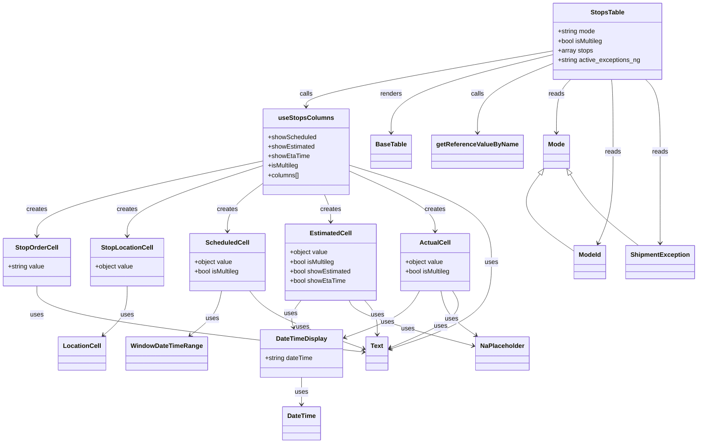

# Diagram: web/portal/src/modules/shipment-detail/shipment-detail-styled-components/StopsTable.js

> Auto-generated by Obscura crawlers

## Mermaid

### SVG

<svg id="container" width="1727.314453125" xmlns="http://www.w3.org/2000/svg" class="classDiagram" height="1116" viewBox="0 0 1727.314453125 1116" role="graphics-document document" aria-roledescription="class"><g><defs><marker id="container_class-aggregationStart" class="marker aggregation class" refX="18" refY="7" markerWidth="190" markerHeight="240" orient="auto"><path d="M 18,7 L9,13 L1,7 L9,1 Z"></path></marker></defs><defs><marker id="container_class-aggregationEnd" class="marker aggregation class" refX="1" refY="7" markerWidth="20" markerHeight="28" orient="auto"><path d="M 18,7 L9,13 L1,7 L9,1 Z"></path></marker></defs><defs><marker id="container_class-extensionStart" class="marker extension class" refX="18" refY="7" markerWidth="190" markerHeight="240" orient="auto"><path d="M 1,7 L18,13 V 1 Z"></path></marker></defs><defs><marker id="container_class-extensionEnd" class="marker extension class" refX="1" refY="7" markerWidth="20" markerHeight="28" orient="auto"><path d="M 1,1 V 13 L18,7 Z"></path></marker></defs><defs><marker id="container_class-compositionStart" class="marker composition class" refX="18" refY="7" markerWidth="190" markerHeight="240" orient="auto"><path d="M 18,7 L9,13 L1,7 L9,1 Z"></path></marker></defs><defs><marker id="container_class-compositionEnd" class="marker composition class" refX="1" refY="7" markerWidth="20" markerHeight="28" orient="auto"><path d="M 18,7 L9,13 L1,7 L9,1 Z"></path></marker></defs><defs><marker id="container_class-dependencyStart" class="marker dependency class" refX="6" refY="7" markerWidth="190" markerHeight="240" orient="auto"><path d="M 5,7 L9,13 L1,7 L9,1 Z"></path></marker></defs><defs><marker id="container_class-dependencyEnd" class="marker dependency class" refX="13" refY="7" markerWidth="20" markerHeight="28" orient="auto"><path d="M 18,7 L9,13 L14,7 L9,1 Z"></path></marker></defs><defs><marker id="container_class-lollipopStart" class="marker lollipop class" refX="13" refY="7" markerWidth="190" markerHeight="240" orient="auto"><circle stroke="black" fill="transparent" cx="7" cy="7" r="6"></circle></marker></defs><defs><marker id="container_class-lollipopEnd" class="marker lollipop class" refX="1" refY="7" markerWidth="190" markerHeight="240" orient="auto"><circle stroke="black" fill="transparent" cx="7" cy="7" r="6"></circle></marker></defs><g class="root"><g class="clusters"></g><g class="edgePaths"><path d="M745.627,950L745.627,956.167C745.627,962.333,745.627,974.667,745.627,986C745.627,997.333,745.627,1007.667,745.627,1012.833L745.627,1018" id="id_DateTimeDisplay_DateTime_1" class="edge-thickness-normal edge-pattern-solid relation" style=";;;" data-edge="true" data-et="edge" data-id="id_DateTimeDisplay_DateTime_1" data-points="W3sieCI6NzQ1LjYyNjk1MzEyNSwieSI6OTUwfSx7IngiOjc0NS42MjY5NTMxMjUsInkiOjk4N30seyJ4Ijo3NDUuNjI2OTUzMTI1LCJ5IjoxMDI0fV0=" marker-end="url(#container_class-dependencyEnd)"></path><path d="M92.125,720L92.125,732.167C92.125,744.333,92.125,768.667,225.963,796.355C359.8,824.044,627.476,855.089,761.314,870.611L895.151,886.133" id="id_StopOrderCell_Text_2" class="edge-thickness-normal edge-pattern-solid relation" style=";;;" data-edge="true" data-et="edge" data-id="id_StopOrderCell_Text_2" data-points="W3sieCI6OTIuMTI1LCJ5Ijo3MjB9LHsieCI6OTIuMTI1LCJ5Ijo3OTN9LHsieCI6OTAxLjExMTMyODEyNSwieSI6ODg2LjgyNDIwOTkyODk4NTN9XQ==" marker-end="url(#container_class-dependencyEnd)"></path><path d="M317.5,720L317.5,732.167C317.5,744.333,317.5,768.667,307.609,789.348C297.717,810.029,277.935,827.057,268.044,835.571L258.152,844.086" id="id_StopLocationCell_LocationCell_3" class="edge-thickness-normal edge-pattern-solid relation" style=";;;" data-edge="true" data-et="edge" data-id="id_StopLocationCell_LocationCell_3" data-points="W3sieCI6MzE3LjUsInkiOjcyMH0seyJ4IjozMTcuNSwieSI6NzkzfSx7IngiOjI1My42MDUwMjU3NzMxOTU4OCwieSI6ODQ4fV0=" marker-end="url(#container_class-dependencyEnd)"></path><path d="M550.738,732L548.713,742.167C546.688,752.333,542.638,772.667,529.26,791.398C515.882,810.129,493.177,827.258,481.824,835.822L470.472,844.387" id="id_ScheduledCell_WindowDateTimeRange_4" class="edge-thickness-normal edge-pattern-solid relation" style=";;;" data-edge="true" data-et="edge" data-id="id_ScheduledCell_WindowDateTimeRange_4" data-points="W3sieCI6NTUwLjczODQ0Mjc4NjY1NDEsInkiOjczMn0seyJ4Ijo1MzguNTg3ODkwNjI1LCJ5Ijo3OTN9LHsieCI6NDY1LjY4MTY2MDc2MDMwOTMsInkiOjg0OH1d" marker-end="url(#container_class-dependencyEnd)"></path><path d="M621.25,732L629.181,742.167C637.112,752.333,652.975,772.667,698.682,796.945C744.389,821.224,819.94,849.447,857.715,863.559L895.491,877.671" id="id_ScheduledCell_Text_5" class="edge-thickness-normal edge-pattern-solid relation" style=";;;" data-edge="true" data-et="edge" data-id="id_ScheduledCell_Text_5" data-points="W3sieCI6NjIxLjI0OTcyMDk4MjE0MjksInkiOjczMn0seyJ4Ijo2NjguODM3ODkwNjI1LCJ5Ijo3OTN9LHsieCI6OTAxLjExMTMyODEyNSwieSI6ODc5Ljc3MDU4MDA5Mzg3NDF9XQ==" marker-end="url(#container_class-dependencyEnd)"></path><path d="M750.687,756L745.876,762.167C741.066,768.333,731.444,780.667,727.908,792.029C724.372,803.391,726.922,813.782,728.197,818.977L729.472,824.173" id="id_EstimatedCell_DateTimeDisplay_6" class="edge-thickness-normal edge-pattern-solid relation" style=";;;" data-edge="true" data-et="edge" data-id="id_EstimatedCell_DateTimeDisplay_6" data-points="W3sieCI6NzUwLjY4NzIyMDk4MjE0MjksInkiOjc1Nn0seyJ4Ijo3MjEuODIyMjY1NjI1LCJ5Ijo3OTN9LHsieCI6NzMwLjkwMjQwNDE1NTkyNzgsInkiOjgzMH1d" marker-end="url(#container_class-dependencyEnd)"></path><path d="M871.754,756L874.72,762.167C877.687,768.333,883.619,780.667,935.619,799.855C987.618,819.043,1085.686,845.085,1134.72,858.107L1183.754,871.128" id="id_EstimatedCell_NaPlaceholder_7" class="edge-thickness-normal edge-pattern-solid relation" style=";;;" data-edge="true" data-et="edge" data-id="id_EstimatedCell_NaPlaceholder_7" data-points="W3sieCI6ODcxLjc1NDQyMDIzMDI2MzEsInkiOjc1Nn0seyJ4Ijo4ODkuNTUwNzgxMjUsInkiOjc5M30seyJ4IjoxMTg5LjU1MjczNDM3NSwieSI6ODcyLjY2ODE0MjQ2ODMzMTh9XQ==" marker-end="url(#container_class-dependencyEnd)"></path><path d="M909.999,756L915.422,762.167C920.844,768.333,931.69,780.667,935.929,795.01C940.168,809.354,937.801,825.708,936.617,833.885L935.433,842.062" id="id_EstimatedCell_Text_8" class="edge-thickness-normal edge-pattern-solid relation" style=";;;" data-edge="true" data-et="edge" data-id="id_EstimatedCell_Text_8" data-points="W3sieCI6OTA5Ljk5ODc4MTEzMjUxODgsInkiOjc1Nn0seyJ4Ijo5NDIuNTM1MTU2MjUsInkiOjc5M30seyJ4Ijo5MzQuNTczNzU1NjM3ODg2NiwieSI6ODQ4fV0=" marker-end="url(#container_class-dependencyEnd)"></path><path d="M1047.523,732L1041.913,742.167C1036.302,752.333,1025.081,772.667,992.962,792.419C960.844,812.172,907.828,831.344,881.32,840.93L854.812,850.516" id="id_ActualCell_DateTimeDisplay_9" class="edge-thickness-normal edge-pattern-solid relation" style=";;;" data-edge="true" data-et="edge" data-id="id_ActualCell_DateTimeDisplay_9" data-points="W3sieCI6MTA0Ny41MjMzMjAwMTg3OTcsInkiOjczMn0seyJ4IjoxMDEzLjg1OTM3NSwieSI6NzkzfSx7IngiOjg0OS4xNjk5MjE4NzUsInkiOjg1Mi41NTYxMDAwNDczMjk2fV0=" marker-end="url(#container_class-dependencyEnd)"></path><path d="M1101.599,732L1103.625,742.167C1105.65,752.333,1109.7,772.667,1124.232,791.433C1138.764,810.2,1163.779,827.4,1176.286,836L1188.793,844.6" id="id_ActualCell_NaPlaceholder_10" class="edge-thickness-normal edge-pattern-solid relation" style=";;;" data-edge="true" data-et="edge" data-id="id_ActualCell_NaPlaceholder_10" data-points="W3sieCI6MTEwMS41OTk0NDc4MzgzNDYsInkiOjczMn0seyJ4IjoxMTEzLjc1LCJ5Ijo3OTN9LHsieCI6MTE5My43MzcyMTQwNzg2MDgzLCJ5Ijo4NDh9XQ==" marker-end="url(#container_class-dependencyEnd)"></path><path d="M1130.283,732L1136.358,742.167C1142.433,752.333,1154.584,772.667,1126.442,796.765C1098.301,820.863,1029.867,848.726,995.651,862.657L961.434,876.588" id="id_ActualCell_Text_11" class="edge-thickness-normal edge-pattern-solid relation" style=";;;" data-edge="true" data-et="edge" data-id="id_ActualCell_Text_11" data-points="W3sieCI6MTEzMC4yODI3MTg1MTUwMzc3LCJ5Ijo3MzJ9LHsieCI6MTE2Ni43MzQzNzUsInkiOjc5M30seyJ4Ijo5NTUuODc2OTUzMTI1LCJ5Ijo4NzguODUxMDMxNzM0OTcwOH1d" marker-end="url(#container_class-dependencyEnd)"></path><path d="M665.213,404.533L569.698,424.944C474.184,445.355,283.154,486.178,187.64,517.755C92.125,549.333,92.125,571.667,92.125,582.833L92.125,594" id="id_useStopsColumns_StopOrderCell_12" class="edge-thickness-normal edge-pattern-solid relation" style=";;;" data-edge="true" data-et="edge" data-id="id_useStopsColumns_StopOrderCell_12" data-points="W3sieCI6NjY1LjIxMjg5MDYyNSwieSI6NDA0LjUzMjU2MjY3MTQ0ODh9LHsieCI6OTIuMTI1LCJ5Ijo1Mjd9LHsieCI6OTIuMTI1LCJ5Ijo2MDB9XQ==" marker-end="url(#container_class-dependencyEnd)"></path><path d="M665.213,415.739L607.261,434.283C549.309,452.826,433.404,489.913,375.452,519.623C317.5,549.333,317.5,571.667,317.5,582.833L317.5,594" id="id_useStopsColumns_StopLocationCell_13" class="edge-thickness-normal edge-pattern-solid relation" style=";;;" data-edge="true" data-et="edge" data-id="id_useStopsColumns_StopLocationCell_13" data-points="W3sieCI6NjY1LjIxMjg5MDYyNSwieSI6NDE1LjczOTA2ODU5NDcwMjl9LHsieCI6MzE3LjUsInkiOjUyN30seyJ4IjozMTcuNSwieSI6NjAwfV0=" marker-end="url(#container_class-dependencyEnd)"></path><path d="M665.213,456.372L648.524,468.143C631.835,479.915,598.458,503.457,581.769,524.395C565.08,545.333,565.08,563.667,565.08,572.833L565.08,582" id="id_useStopsColumns_ScheduledCell_14" class="edge-thickness-normal edge-pattern-solid relation" style=";;;" data-edge="true" data-et="edge" data-id="id_useStopsColumns_ScheduledCell_14" data-points="W3sieCI6NjY1LjIxMjg5MDYyNSwieSI6NDU2LjM3MjE4NTM4MDEyODF9LHsieCI6NTY1LjA4MDA3ODEyNSwieSI6NTI3fSx7IngiOjU2NS4wODAwNzgxMjUsInkiOjU4OH1d" marker-end="url(#container_class-dependencyEnd)"></path><path d="M811.565,490L813.9,496.167C816.236,502.333,820.908,514.667,823.244,526C825.58,537.333,825.58,547.667,825.58,552.833L825.58,558" id="id_useStopsColumns_EstimatedCell_15" class="edge-thickness-normal edge-pattern-solid relation" style=";;;" data-edge="true" data-et="edge" data-id="id_useStopsColumns_EstimatedCell_15" data-points="W3sieCI6ODExLjU2NDUzMzk0Mzk2NTYsInkiOjQ5MH0seyJ4Ijo4MjUuNTgwMDc4MTI1LCJ5Ijo1Mjd9LHsieCI6ODI1LjU4MDA3ODEyNSwieSI6NTY0fV0=" marker-end="url(#container_class-dependencyEnd)"></path><path d="M876.096,430.291L911.289,446.409C946.483,462.527,1016.87,494.764,1052.064,520.048C1087.258,545.333,1087.258,563.667,1087.258,572.833L1087.258,582" id="id_useStopsColumns_ActualCell_16" class="edge-thickness-normal edge-pattern-solid relation" style=";;;" data-edge="true" data-et="edge" data-id="id_useStopsColumns_ActualCell_16" data-points="W3sieCI6ODc2LjA5NTcwMzEyNSwieSI6NDMwLjI5MDY5NTMwNzI0Njd9LHsieCI6MTA4Ny4yNTc4MTI1LCJ5Ijo1Mjd9LHsieCI6MTA4Ny4yNTc4MTI1LCJ5Ijo1ODh9XQ==" marker-end="url(#container_class-dependencyEnd)"></path><path d="M876.096,415.413L934.785,434.011C993.475,452.609,1110.854,489.804,1169.543,530.569C1228.232,571.333,1228.232,615.667,1228.232,660C1228.232,704.333,1228.232,748.667,1183.791,785.215C1139.35,821.764,1050.468,850.527,1006.027,864.909L961.585,879.291" id="id_useStopsColumns_Text_17" class="edge-thickness-normal edge-pattern-solid relation" style=";;;" data-edge="true" data-et="edge" data-id="id_useStopsColumns_Text_17" data-points="W3sieCI6ODc2LjA5NTcwMzEyNSwieSI6NDE1LjQxMjg4MjAyMTUxMjd9LHsieCI6MTIyOC4yMzI0MjE4NzUsInkiOjUyN30seyJ4IjoxMjI4LjIzMjQyMTg3NSwieSI6NjYwfSx7IngiOjEyMjguMjMyNDIxODc1LCJ5Ijo3OTN9LHsieCI6OTU1Ljg3Njk1MzEyNSwieSI6ODgxLjEzODQ5MzIxNjczODV9XQ==" marker-end="url(#container_class-dependencyEnd)"></path><path d="M1370.205,128.687L1270.28,146.739C1170.355,164.791,970.505,200.896,870.579,224.114C770.654,247.333,770.654,257.667,770.654,262.833L770.654,268" id="id_StopsTable_useStopsColumns_18" class="edge-thickness-normal edge-pattern-solid relation" style=";;;" data-edge="true" data-et="edge" data-id="id_StopsTable_useStopsColumns_18" data-points="W3sieCI6MTM3MC4yMDUwNzgxMjUsInkiOjEyOC42ODY1ODE3MzU3OTQ2fSx7IngiOjc3MC42NTQyOTY4NzUsInkiOjIzN30seyJ4Ijo3NzAuNjU0Mjk2ODc1LCJ5IjoyNzR9XQ==" marker-end="url(#container_class-dependencyEnd)"></path><path d="M1370.205,138.433L1305.011,154.861C1239.817,171.289,1109.429,204.144,1044.235,236.739C979.041,269.333,979.041,301.667,979.041,317.833L979.041,334" id="id_StopsTable_BaseTable_19" class="edge-thickness-normal edge-pattern-solid relation" style=";;;" data-edge="true" data-et="edge" data-id="id_StopsTable_BaseTable_19" data-points="W3sieCI6MTM3MC4yMDUwNzgxMjUsInkiOjEzOC40MzMxNDA5MTE3ODIxMn0seyJ4Ijo5NzkuMDQxMDE1NjI1LCJ5IjoyMzd9LHsieCI6OTc5LjA0MTAxNTYyNSwieSI6MzQwfV0=" marker-end="url(#container_class-dependencyEnd)"></path><path d="M1370.205,161.089L1339.921,173.74C1309.637,186.392,1249.07,211.696,1218.786,240.515C1188.502,269.333,1188.502,301.667,1188.502,317.833L1188.502,334" id="id_StopsTable_getReferenceValueByName_20" class="edge-thickness-normal edge-pattern-solid relation" style=";;;" data-edge="true" data-et="edge" data-id="id_StopsTable_getReferenceValueByName_20" data-points="W3sieCI6MTM3MC4yMDUwNzgxMjUsInkiOjE2MS4wODg1OTExMzEwNzA3fSx7IngiOjExODguNTAxOTUzMTI1LCJ5IjoyMzd9LHsieCI6MTE4OC41MDE5NTMxMjUsInkiOjM0MH1d" marker-end="url(#container_class-dependencyEnd)"></path><path d="M1415.855,200L1410.01,206.167C1404.165,212.333,1392.474,224.667,1386.629,247C1380.783,269.333,1380.783,301.667,1380.783,317.833L1380.783,334" id="id_StopsTable_Mode_21" class="edge-thickness-normal edge-pattern-solid relation" style=";;;" data-edge="true" data-et="edge" data-id="id_StopsTable_Mode_21" data-points="W3sieCI6MTQxNS44NTUzOTUzMjQyNDgsInkiOjIwMH0seyJ4IjoxMzgwLjc4MzIwMzEyNSwieSI6MjM3fSx7IngiOjEzODAuNzgzMjAzMTI1LCJ5IjozNDB9XQ==" marker-end="url(#container_class-dependencyEnd)"></path><path d="M1516.66,200L1517.29,206.167C1517.92,212.333,1519.18,224.667,1519.81,255C1520.439,285.333,1520.439,333.667,1520.439,382C1520.439,430.333,1520.439,478.667,1514.436,517.079C1508.432,555.49,1496.424,583.981,1490.42,598.226L1484.417,612.471" id="id_StopsTable_ModeId_22" class="edge-thickness-normal edge-pattern-solid relation" style=";;;" data-edge="true" data-et="edge" data-id="id_StopsTable_ModeId_22" data-points="W3sieCI6MTUxNi42NTk5MDY2MDI0NDM3LCJ5IjoyMDB9LHsieCI6MTUyMC40Mzk0NTMxMjUsInkiOjIzN30seyJ4IjoxNTIwLjQzOTQ1MzEyNSwieSI6MzgyfSx7IngiOjE1MjAuNDM5NDUzMTI1LCJ5Ijo1Mjd9LHsieCI6MTQ4Mi4wODYyNDU4ODgxNTgsInkiOjYxOH1d" marker-end="url(#container_class-dependencyEnd)"></path><path d="M1600.44,200L1606.452,206.167C1612.463,212.333,1624.487,224.667,1630.498,255C1636.51,285.333,1636.51,333.667,1636.51,382C1636.51,430.333,1636.51,478.667,1636.51,517C1636.51,555.333,1636.51,583.667,1636.51,597.833L1636.51,612" id="id_StopsTable_ShipmentException_23" class="edge-thickness-normal edge-pattern-solid relation" style=";;;" data-edge="true" data-et="edge" data-id="id_StopsTable_ShipmentException_23" data-points="W3sieCI6MTYwMC40Mzk5ODE3OTA0MTM2LCJ5IjoyMDB9LHsieCI6MTYzNi41MDk3NjU2MjUsInkiOjIzN30seyJ4IjoxNjM2LjUwOTc2NTYyNSwieSI6MzgyfSx7IngiOjE2MzYuNTA5NzY1NjI1LCJ5Ijo1Mjd9LHsieCI6MTYzNi41MDk3NjU2MjUsInkiOjYxOH1d" marker-end="url(#container_class-dependencyEnd)"></path><path d="M1343.044,438.331L1333.143,453.109C1323.242,467.887,1303.44,497.444,1317.11,529.566C1330.781,561.689,1377.923,596.378,1401.493,613.722L1425.064,631.067" id="id_Mode_ModeId_24" class="edge-thickness-normal edge-pattern-solid relation" style=";;;" data-edge="true" data-et="edge" data-id="id_Mode_ModeId_24" data-points="W3sieCI6MTM1Mi42NDQ3ODcxNzY3MjQsInkiOjQyNH0seyJ4IjoxMjgzLjYzODY3MTg3NSwieSI6NTI3fSx7IngiOjE0MjUuMDY0NDUzMTI1LCJ5Ijo2MzEuMDY2NTg1OTgyNTgwOX1d" marker-start="url(#container_class-extensionStart)"></path><path d="M1414.516,438.834L1423.238,453.528C1431.959,468.223,1449.402,497.611,1477.472,527.472C1505.541,557.333,1544.236,587.667,1563.584,602.833L1582.932,618" id="id_Mode_ShipmentException_25" class="edge-thickness-normal edge-pattern-solid relation" style=";;;" data-edge="true" data-et="edge" data-id="id_Mode_ShipmentException_25" data-points="W3sieCI6MTQwNS43MTE2NTE0MDA4NjIxLCJ5Ijo0MjR9LHsieCI6MTQ2Ni44NDU3MDMxMjUsInkiOjUyN30seyJ4IjoxNTgyLjkzMTY0MDYyNSwieSI6NjE4fV0=" marker-start="url(#container_class-extensionStart)"></path></g><g class="edgeLabels"><g class="edgeLabel" transform="translate(745.626953125, 987)"><g class="label" data-id="id_DateTimeDisplay_DateTime_1" transform="translate(-16.4921875, -12)"><foreignObject width="32.984375" height="24">

uses

</foreignObject></g></g><g class="edgeLabel" transform="translate(92.125, 793)"><g class="label" data-id="id_StopOrderCell_Text_2" transform="translate(-16.4921875, -12)"><foreignObject width="32.984375" height="24">

uses

</foreignObject></g></g><g class="edgeLabel" transform="translate(317.5, 793)"><g class="label" data-id="id_StopLocationCell_LocationCell_3" transform="translate(-16.4921875, -12)"><foreignObject width="32.984375" height="24">

uses

</foreignObject></g></g><g class="edgeLabel" transform="translate(526.96166, 801.77075)"><g class="label" data-id="id_ScheduledCell_WindowDateTimeRange_4" transform="translate(-16.4921875, -12)"><foreignObject width="32.984375" height="24">

uses

</foreignObject></g></g><g class="edgeLabel" transform="translate(748.73718, 822.84804)"><g class="label" data-id="id_ScheduledCell_Text_5" transform="translate(-16.4921875, -12)"><foreignObject width="32.984375" height="24">

uses

</foreignObject></g></g><g class="edgeLabel" transform="translate(724.53779, 789.51916)"><g class="label" data-id="id_EstimatedCell_DateTimeDisplay_6" transform="translate(-16.4921875, -12)"><foreignObject width="32.984375" height="24">

uses

</foreignObject></g></g><g class="edgeLabel" transform="translate(1019.71075, 827.56512)"><g class="label" data-id="id_EstimatedCell_NaPlaceholder_7" transform="translate(-16.4921875, -12)"><foreignObject width="32.984375" height="24">

uses

</foreignObject></g></g><g class="edgeLabel" transform="translate(942.08372, 796.11869)"><g class="label" data-id="id_EstimatedCell_Text_8" transform="translate(-16.4921875, -12)"><foreignObject width="32.984375" height="24">

uses

</foreignObject></g></g><g class="edgeLabel" transform="translate(964.27463, 810.93117)"><g class="label" data-id="id_ActualCell_DateTimeDisplay_9" transform="translate(-16.4921875, -12)"><foreignObject width="32.984375" height="24">

uses

</foreignObject></g></g><g class="edgeLabel" transform="translate(1128.11789, 802.87951)"><g class="label" data-id="id_ActualCell_NaPlaceholder_10" transform="translate(-16.4921875, -12)"><foreignObject width="32.984375" height="24">

uses

</foreignObject></g></g><g class="edgeLabel" transform="translate(1094.21331, 822.5271)"><g class="label" data-id="id_ActualCell_Text_11" transform="translate(-16.4921875, -12)"><foreignObject width="32.984375" height="24">

uses

</foreignObject></g></g><g class="edgeLabel" transform="translate(92.125, 527)"><g class="label" data-id="id_useStopsColumns_StopOrderCell_12" transform="translate(-26.171875, -12)"><foreignObject width="52.34375" height="24">

creates

</foreignObject></g></g><g class="edgeLabel" transform="translate(317.5, 527)"><g class="label" data-id="id_useStopsColumns_StopLocationCell_13" transform="translate(-26.171875, -12)"><foreignObject width="52.34375" height="24">

creates

</foreignObject></g></g><g class="edgeLabel" transform="translate(565.080078125, 527)"><g class="label" data-id="id_useStopsColumns_ScheduledCell_14" transform="translate(-26.171875, -12)"><foreignObject width="52.34375" height="24">

creates

</foreignObject></g></g><g class="edgeLabel" transform="translate(825.580078125, 527)"><g class="label" data-id="id_useStopsColumns_EstimatedCell_15" transform="translate(-26.171875, -12)"><foreignObject width="52.34375" height="24">

creates

</foreignObject></g></g><g class="edgeLabel" transform="translate(1087.2578125, 527)"><g class="label" data-id="id_useStopsColumns_ActualCell_16" transform="translate(-26.171875, -12)"><foreignObject width="52.34375" height="24">

creates

</foreignObject></g></g><g class="edgeLabel" transform="translate(1228.232421875, 660)"><g class="label" data-id="id_useStopsColumns_Text_17" transform="translate(-16.4921875, -12)"><foreignObject width="32.984375" height="24">

uses

</foreignObject></g></g><g class="edgeLabel" transform="translate(770.654296875, 237)"><g class="label" data-id="id_StopsTable_useStopsColumns_18" transform="translate(-16.4453125, -12)"><foreignObject width="32.890625" height="24">

calls

</foreignObject></g></g><g class="edgeLabel" transform="translate(979.041015625, 237)"><g class="label" data-id="id_StopsTable_BaseTable_19" transform="translate(-27.75, -12)"><foreignObject width="55.5" height="24">

renders

</foreignObject></g></g><g class="edgeLabel" transform="translate(1188.501953125, 237)"><g class="label" data-id="id_StopsTable_getReferenceValueByName_20" transform="translate(-16.4453125, -12)"><foreignObject width="32.890625" height="24">

calls

</foreignObject></g></g><g class="edgeLabel" transform="translate(1380.783203125, 237)"><g class="label" data-id="id_StopsTable_Mode_21" transform="translate(-20.0078125, -12)"><foreignObject width="40.015625" height="24">

reads

</foreignObject></g></g><g class="edgeLabel" transform="translate(1520.439453125, 382)"><g class="label" data-id="id_StopsTable_ModeId_22" transform="translate(-20.0078125, -12)"><foreignObject width="40.015625" height="24">

reads

</foreignObject></g></g><g class="edgeLabel" transform="translate(1636.509765625, 382)"><g class="label" data-id="id_StopsTable_ShipmentException_23" transform="translate(-20.0078125, -12)"><foreignObject width="40.015625" height="24">

reads

</foreignObject></g></g><g class="edgeLabel"><g class="label" data-id="id_Mode_ModeId_24" transform="translate(0, 0)"><foreignObject width="0" height="0">

</foreignObject></g></g><g class="edgeLabel"><g class="label" data-id="id_Mode_ShipmentException_25" transform="translate(0, 0)"><foreignObject width="0" height="0">

</foreignObject></g></g></g><g class="nodes"><g class="node default" id="classId-DateTimeDisplay-0" transform="translate(745.626953125, 890)"><g class="basic label-container"><path d="M-103.54296875 -60 L103.54296875 -60 L103.54296875 60 L-103.54296875 60" stroke="none" stroke-width="0" fill="#ECECFF" style=""></path><path d="M-103.54296875 -60 C-28.889486861631994 -60, 45.76399502673601 -60, 103.54296875 -60 M-103.54296875 -60 C-25.831365712911335 -60, 51.88023732417733 -60, 103.54296875 -60 M103.54296875 -60 C103.54296875 -20.90832105889841, 103.54296875 18.183357882203182, 103.54296875 60 M103.54296875 -60 C103.54296875 -24.59129235479758, 103.54296875 10.817415290404838, 103.54296875 60 M103.54296875 60 C53.78027041734086 60, 4.017572084681717 60, -103.54296875 60 M103.54296875 60 C59.340653976388225 60, 15.13833920277645 60, -103.54296875 60 M-103.54296875 60 C-103.54296875 15.743346885181538, -103.54296875 -28.513306229636925, -103.54296875 -60 M-103.54296875 60 C-103.54296875 29.74732522821382, -103.54296875 -0.5053495435723576, -103.54296875 -60" stroke="#9370DB" stroke-width="1.3" fill="none" stroke-dasharray="0 0" style=""></path></g><g class="annotation-group text" transform="translate(0, -36)"></g><g class="label-group text" transform="translate(-61.4765625, -36)"><g class="label" style="font-weight: bolder" transform="translate(0,-12)"><foreignObject width="122.953125" height="24">

DateTimeDisplay

</foreignObject></g></g><g class="members-group text" transform="translate(-91.54296875, 12)"><g class="label" style="" transform="translate(0,-12)"><foreignObject width="121.609375" height="24">

+string dateTime

</foreignObject></g></g><g class="methods-group text" transform="translate(-91.54296875, 60)"></g><g class="divider" style=""><path d="M-103.54296875 -12 C-61.61034436030366 -12, -19.677719970607313 -12, 103.54296875 -12 M-103.54296875 -12 C-37.22455219053775 -12, 29.0938643689245 -12, 103.54296875 -12" stroke="#9370DB" stroke-width="1.3" fill="none" stroke-dasharray="0 0" style=""></path></g><g class="divider" style=""><path d="M-103.54296875 36 C-30.908097955088905 36, 41.72677283982219 36, 103.54296875 36 M-103.54296875 36 C-52.65962276051226 36, -1.776276771024527 36, 103.54296875 36" stroke="#9370DB" stroke-width="1.3" fill="none" stroke-dasharray="0 0" style=""></path></g></g><g class="node default" id="classId-StopOrderCell-1" transform="translate(92.125, 660)"><g class="basic label-container"><path d="M-84.125 -60 L84.125 -60 L84.125 60 L-84.125 60" stroke="none" stroke-width="0" fill="#ECECFF" style=""></path><path d="M-84.125 -60 C-27.09862073411835 -60, 29.927758531763303 -60, 84.125 -60 M-84.125 -60 C-20.8676783509867 -60, 42.3896432980266 -60, 84.125 -60 M84.125 -60 C84.125 -29.361130901690178, 84.125 1.2777381966196444, 84.125 60 M84.125 -60 C84.125 -26.464582603523958, 84.125 7.070834792952084, 84.125 60 M84.125 60 C38.29038978411444 60, -7.544220431771123 60, -84.125 60 M84.125 60 C39.541285132973364 60, -5.042429734053272 60, -84.125 60 M-84.125 60 C-84.125 21.34853240994527, -84.125 -17.302935180109458, -84.125 -60 M-84.125 60 C-84.125 21.74324510427754, -84.125 -16.513509791444918, -84.125 -60" stroke="#9370DB" stroke-width="1.3" fill="none" stroke-dasharray="0 0" style=""></path></g><g class="annotation-group text" transform="translate(0, -36)"></g><g class="label-group text" transform="translate(-51.5, -36)"><g class="label" style="font-weight: bolder" transform="translate(0,-12)"><foreignObject width="103" height="24">

StopOrderCell

</foreignObject></g></g><g class="members-group text" transform="translate(-72.125, 12)"><g class="label" style="" transform="translate(0,-12)"><foreignObject width="92.75" height="24">

+string value

</foreignObject></g></g><g class="methods-group text" transform="translate(-72.125, 60)"></g><g class="divider" style=""><path d="M-84.125 -12 C-17.453369131114584 -12, 49.21826173777083 -12, 84.125 -12 M-84.125 -12 C-27.606134112711317 -12, 28.912731774577367 -12, 84.125 -12" stroke="#9370DB" stroke-width="1.3" fill="none" stroke-dasharray="0 0" style=""></path></g><g class="divider" style=""><path d="M-84.125 36 C-48.39689622812051 36, -12.668792456241022 36, 84.125 36 M-84.125 36 C-37.23851195660908 36, 9.647976086781838 36, 84.125 36" stroke="#9370DB" stroke-width="1.3" fill="none" stroke-dasharray="0 0" style=""></path></g></g><g class="node default" id="classId-StopLocationCell-2" transform="translate(317.5, 660)"><g class="basic label-container"><path d="M-91.25 -60 L91.25 -60 L91.25 60 L-91.25 60" stroke="none" stroke-width="0" fill="#ECECFF" style=""></path><path d="M-91.25 -60 C-30.81906902903718 -60, 29.61186194192564 -60, 91.25 -60 M-91.25 -60 C-24.24849919328338 -60, 42.75300161343324 -60, 91.25 -60 M91.25 -60 C91.25 -26.941307554905315, 91.25 6.117384890189371, 91.25 60 M91.25 -60 C91.25 -13.5228691926728, 91.25 32.9542616146544, 91.25 60 M91.25 60 C29.138831598245574 60, -32.97233680350885 60, -91.25 60 M91.25 60 C46.98973154165141 60, 2.729463083302818 60, -91.25 60 M-91.25 60 C-91.25 21.427812572970517, -91.25 -17.144374854058967, -91.25 -60 M-91.25 60 C-91.25 30.9504078368458, -91.25 1.9008156736916035, -91.25 -60" stroke="#9370DB" stroke-width="1.3" fill="none" stroke-dasharray="0 0" style=""></path></g><g class="annotation-group text" transform="translate(0, -36)"></g><g class="label-group text" transform="translate(-61.921875, -36)"><g class="label" style="font-weight: bolder" transform="translate(0,-12)"><foreignObject width="123.84375" height="24">

StopLocationCell

</foreignObject></g></g><g class="members-group text" transform="translate(-79.25, 12)"><g class="label" style="" transform="translate(0,-12)"><foreignObject width="96.578125" height="24">

+object value

</foreignObject></g></g><g class="methods-group text" transform="translate(-79.25, 60)"></g><g class="divider" style=""><path d="M-91.25 -12 C-35.36846900409825 -12, 20.513061991803497 -12, 91.25 -12 M-91.25 -12 C-28.321695304529584 -12, 34.60660939094083 -12, 91.25 -12" stroke="#9370DB" stroke-width="1.3" fill="none" stroke-dasharray="0 0" style=""></path></g><g class="divider" style=""><path d="M-91.25 36 C-18.49427610163447 36, 54.26144779673106 36, 91.25 36 M-91.25 36 C-38.275946192255 36, 14.698107615490002 36, 91.25 36" stroke="#9370DB" stroke-width="1.3" fill="none" stroke-dasharray="0 0" style=""></path></g></g><g class="node default" id="classId-ScheduledCell-3" transform="translate(565.080078125, 660)"><g class="basic label-container"><path d="M-95.73046875 -72 L95.73046875 -72 L95.73046875 72 L-95.73046875 72" stroke="none" stroke-width="0" fill="#ECECFF" style=""></path><path d="M-95.73046875 -72 C-55.33860259253015 -72, -14.946736435060302 -72, 95.73046875 -72 M-95.73046875 -72 C-22.775518726441263 -72, 50.179431297117475 -72, 95.73046875 -72 M95.73046875 -72 C95.73046875 -23.304887023564547, 95.73046875 25.390225952870907, 95.73046875 72 M95.73046875 -72 C95.73046875 -40.85198181191501, 95.73046875 -9.703963623830013, 95.73046875 72 M95.73046875 72 C56.64888363219095 72, 17.567298514381903 72, -95.73046875 72 M95.73046875 72 C43.89751065159882 72, -7.935447446802357 72, -95.73046875 72 M-95.73046875 72 C-95.73046875 37.23503998541567, -95.73046875 2.4700799708313355, -95.73046875 -72 M-95.73046875 72 C-95.73046875 19.024962100909477, -95.73046875 -33.95007579818105, -95.73046875 -72" stroke="#9370DB" stroke-width="1.3" fill="none" stroke-dasharray="0 0" style=""></path></g><g class="annotation-group text" transform="translate(0, -48)"></g><g class="label-group text" transform="translate(-51.9765625, -48)"><g class="label" style="font-weight: bolder" transform="translate(0,-12)"><foreignObject width="103.953125" height="24">

ScheduledCell

</foreignObject></g></g><g class="members-group text" transform="translate(-83.73046875, 0)"><g class="label" style="" transform="translate(0,-12)"><foreignObject width="96.578125" height="24">

+object value

</foreignObject></g><g class="label" style="" transform="translate(0,12)"><foreignObject width="115.484375" height="24">

+bool isMultileg

</foreignObject></g></g><g class="methods-group text" transform="translate(-83.73046875, 72)"></g><g class="divider" style=""><path d="M-95.73046875 -24 C-51.55302349905982 -24, -7.375578248119638 -24, 95.73046875 -24 M-95.73046875 -24 C-53.31150323052807 -24, -10.892537711056136 -24, 95.73046875 -24" stroke="#9370DB" stroke-width="1.3" fill="none" stroke-dasharray="0 0" style=""></path></g><g class="divider" style=""><path d="M-95.73046875 48 C-49.70152580264927 48, -3.6725828552985433 48, 95.73046875 48 M-95.73046875 48 C-27.31835635651892 48, 41.09375603696216 48, 95.73046875 48" stroke="#9370DB" stroke-width="1.3" fill="none" stroke-dasharray="0 0" style=""></path></g></g><g class="node default" id="classId-EstimatedCell-4" transform="translate(825.580078125, 660)"><g class="basic label-container"><path d="M-114.76953125 -96 L114.76953125 -96 L114.76953125 96 L-114.76953125 96" stroke="none" stroke-width="0" fill="#ECECFF" style=""></path><path d="M-114.76953125 -96 C-29.514791662249365 -96, 55.73994792550127 -96, 114.76953125 -96 M-114.76953125 -96 C-24.522283999663344 -96, 65.72496325067331 -96, 114.76953125 -96 M114.76953125 -96 C114.76953125 -31.879583102102146, 114.76953125 32.24083379579571, 114.76953125 96 M114.76953125 -96 C114.76953125 -27.60491635802076, 114.76953125 40.79016728395848, 114.76953125 96 M114.76953125 96 C67.95240506874077 96, 21.13527888748156 96, -114.76953125 96 M114.76953125 96 C30.741881647293397 96, -53.285767955413206 96, -114.76953125 96 M-114.76953125 96 C-114.76953125 42.52454170763815, -114.76953125 -10.9509165847237, -114.76953125 -96 M-114.76953125 96 C-114.76953125 42.39080710636155, -114.76953125 -11.218385787276901, -114.76953125 -96" stroke="#9370DB" stroke-width="1.3" fill="none" stroke-dasharray="0 0" style=""></path></g><g class="annotation-group text" transform="translate(0, -72)"></g><g class="label-group text" transform="translate(-50.2890625, -72)"><g class="label" style="font-weight: bolder" transform="translate(0,-12)"><foreignObject width="100.578125" height="24">

EstimatedCell

</foreignObject></g></g><g class="members-group text" transform="translate(-102.76953125, -24)"><g class="label" style="" transform="translate(0,-12)"><foreignObject width="96.578125" height="24">

+object value

</foreignObject></g><g class="label" style="" transform="translate(0,12)"><foreignObject width="115.484375" height="24">

+bool isMultileg

</foreignObject></g><g class="label" style="" transform="translate(0,36)"><foreignObject width="155.25" height="24">

+bool showEstimated

</foreignObject></g><g class="label" style="" transform="translate(0,60)"><foreignObject width="140.703125" height="24">

+bool showEtaTime

</foreignObject></g></g><g class="methods-group text" transform="translate(-102.76953125, 96)"></g><g class="divider" style=""><path d="M-114.76953125 -48 C-61.959443845421575 -48, -9.14935644084315 -48, 114.76953125 -48 M-114.76953125 -48 C-31.126604378166135 -48, 52.51632249366773 -48, 114.76953125 -48" stroke="#9370DB" stroke-width="1.3" fill="none" stroke-dasharray="0 0" style=""></path></g><g class="divider" style=""><path d="M-114.76953125 72 C-49.95724001703384 72, 14.85505121593232 72, 114.76953125 72 M-114.76953125 72 C-24.61652979856956 72, 65.53647165286088 72, 114.76953125 72" stroke="#9370DB" stroke-width="1.3" fill="none" stroke-dasharray="0 0" style=""></path></g></g><g class="node default" id="classId-ActualCell-5" transform="translate(1087.2578125, 660)"><g class="basic label-container"><path d="M-87.99609375 -72 L87.99609375 -72 L87.99609375 72 L-87.99609375 72" stroke="none" stroke-width="0" fill="#ECECFF" style=""></path><path d="M-87.99609375 -72 C-41.90531424103904 -72, 4.185465267921927 -72, 87.99609375 -72 M-87.99609375 -72 C-30.771844457611415 -72, 26.45240483477717 -72, 87.99609375 -72 M87.99609375 -72 C87.99609375 -22.773115067912414, 87.99609375 26.45376986417517, 87.99609375 72 M87.99609375 -72 C87.99609375 -42.92510570660512, 87.99609375 -13.85021141321024, 87.99609375 72 M87.99609375 72 C43.68043754695358 72, -0.6352186560928459 72, -87.99609375 72 M87.99609375 72 C46.097855584935814 72, 4.199617419871629 72, -87.99609375 72 M-87.99609375 72 C-87.99609375 18.70780842314211, -87.99609375 -34.58438315371578, -87.99609375 -72 M-87.99609375 72 C-87.99609375 20.427325719937663, -87.99609375 -31.145348560124674, -87.99609375 -72" stroke="#9370DB" stroke-width="1.3" fill="none" stroke-dasharray="0 0" style=""></path></g><g class="annotation-group text" transform="translate(0, -48)"></g><g class="label-group text" transform="translate(-36.5078125, -48)"><g class="label" style="font-weight: bolder" transform="translate(0,-12)"><foreignObject width="73.015625" height="24">

ActualCell

</foreignObject></g></g><g class="members-group text" transform="translate(-75.99609375, 0)"><g class="label" style="" transform="translate(0,-12)"><foreignObject width="96.578125" height="24">

+object value

</foreignObject></g><g class="label" style="" transform="translate(0,12)"><foreignObject width="115.484375" height="24">

+bool isMultileg

</foreignObject></g></g><g class="methods-group text" transform="translate(-75.99609375, 72)"></g><g class="divider" style=""><path d="M-87.99609375 -24 C-24.65967856813642 -24, 38.67673661372716 -24, 87.99609375 -24 M-87.99609375 -24 C-41.4639573534564 -24, 5.0681790430871985 -24, 87.99609375 -24" stroke="#9370DB" stroke-width="1.3" fill="none" stroke-dasharray="0 0" style=""></path></g><g class="divider" style=""><path d="M-87.99609375 48 C-48.36249434768493 48, -8.72889494536986 48, 87.99609375 48 M-87.99609375 48 C-33.72441677777032 48, 20.547260194459355 48, 87.99609375 48" stroke="#9370DB" stroke-width="1.3" fill="none" stroke-dasharray="0 0" style=""></path></g></g><g class="node default" id="classId-useStopsColumns-6" transform="translate(770.654296875, 382)"><g class="basic label-container"><path d="M-105.44140625 -108 L105.44140625 -108 L105.44140625 108 L-105.44140625 108" stroke="none" stroke-width="0" fill="#ECECFF" style=""></path><path d="M-105.44140625 -108 C-43.69160556520153 -108, 18.058195119596945 -108, 105.44140625 -108 M-105.44140625 -108 C-47.19165765538196 -108, 11.05809093923608 -108, 105.44140625 -108 M105.44140625 -108 C105.44140625 -25.4224183783451, 105.44140625 57.1551632433098, 105.44140625 108 M105.44140625 -108 C105.44140625 -31.00421573241087, 105.44140625 45.99156853517826, 105.44140625 108 M105.44140625 108 C50.79134429867342 108, -3.858717652653155 108, -105.44140625 108 M105.44140625 108 C57.03661884708991 108, 8.631831444179824 108, -105.44140625 108 M-105.44140625 108 C-105.44140625 36.39057543057672, -105.44140625 -35.218849138846565, -105.44140625 -108 M-105.44140625 108 C-105.44140625 42.17578122141413, -105.44140625 -23.648437557171746, -105.44140625 -108" stroke="#9370DB" stroke-width="1.3" fill="none" stroke-dasharray="0 0" style=""></path></g><g class="annotation-group text" transform="translate(0, -84)"></g><g class="label-group text" transform="translate(-64.9921875, -84)"><g class="label" style="font-weight: bolder" transform="translate(0,-12)"><foreignObject width="129.984375" height="24">

useStopsColumns

</foreignObject></g></g><g class="members-group text" transform="translate(-93.44140625, -36)"><g class="label" style="" transform="translate(0,-12)"><foreignObject width="121.890625" height="24">

+showScheduled

</foreignObject></g><g class="label" style="" transform="translate(0,12)"><foreignObject width="118.140625" height="24">

+showEstimated

</foreignObject></g><g class="label" style="" transform="translate(0,36)"><foreignObject width="103.578125" height="24">

+showEtaTime

</foreignObject></g><g class="label" style="" transform="translate(0,60)"><foreignObject width="78.359375" height="24">

+isMultileg

</foreignObject></g><g class="label" style="" transform="translate(0,84)"><foreignObject width="79.53125" height="24">

+columns[]

</foreignObject></g></g><g class="methods-group text" transform="translate(-93.44140625, 108)"></g><g class="divider" style=""><path d="M-105.44140625 -60 C-49.36868072021745 -60, 6.704044809565104 -60, 105.44140625 -60 M-105.44140625 -60 C-51.35651253528333 -60, 2.7283811794333417 -60, 105.44140625 -60" stroke="#9370DB" stroke-width="1.3" fill="none" stroke-dasharray="0 0" style=""></path></g><g class="divider" style=""><path d="M-105.44140625 84 C-50.245377564809274 84, 4.950651120381451 84, 105.44140625 84 M-105.44140625 84 C-26.550593695148734 84, 52.34021885970253 84, 105.44140625 84" stroke="#9370DB" stroke-width="1.3" fill="none" stroke-dasharray="0 0" style=""></path></g></g><g class="node default" id="classId-StopsTable-7" transform="translate(1506.853515625, 104)"><g class="basic label-container"><path d="M-136.6484375 -96 L136.6484375 -96 L136.6484375 96 L-136.6484375 96" stroke="none" stroke-width="0" fill="#ECECFF" style=""></path><path d="M-136.6484375 -96 C-58.03607443815591 -96, 20.576288623688185 -96, 136.6484375 -96 M-136.6484375 -96 C-51.77715042847217 -96, 33.09413664305566 -96, 136.6484375 -96 M136.6484375 -96 C136.6484375 -37.4375490258234, 136.6484375 21.124901948353198, 136.6484375 96 M136.6484375 -96 C136.6484375 -53.15336454427397, 136.6484375 -10.30672908854794, 136.6484375 96 M136.6484375 96 C75.1738639270618 96, 13.699290354123619 96, -136.6484375 96 M136.6484375 96 C69.3388228362393 96, 2.0292081724786044 96, -136.6484375 96 M-136.6484375 96 C-136.6484375 36.512612593892165, -136.6484375 -22.97477481221567, -136.6484375 -96 M-136.6484375 96 C-136.6484375 35.627310567595444, -136.6484375 -24.745378864809112, -136.6484375 -96" stroke="#9370DB" stroke-width="1.3" fill="none" stroke-dasharray="0 0" style=""></path></g><g class="annotation-group text" transform="translate(0, -72)"></g><g class="label-group text" transform="translate(-40.671875, -72)"><g class="label" style="font-weight: bolder" transform="translate(0,-12)"><foreignObject width="81.34375" height="24">

StopsTable

</foreignObject></g></g><g class="members-group text" transform="translate(-124.6484375, -24)"><g class="label" style="" transform="translate(0,-12)"><foreignObject width="95.203125" height="24">

+string mode

</foreignObject></g><g class="label" style="" transform="translate(0,12)"><foreignObject width="115.484375" height="24">

+bool isMultileg

</foreignObject></g><g class="label" style="" transform="translate(0,36)"><foreignObject width="88.15625" height="24">

+array stops

</foreignObject></g><g class="label" style="" transform="translate(0,60)"><foreignObject width="208.625" height="24">

+string active_exceptions_ng

</foreignObject></g></g><g class="methods-group text" transform="translate(-124.6484375, 96)"></g><g class="divider" style=""><path d="M-136.6484375 -48 C-52.54491626540188 -48, 31.55860496919624 -48, 136.6484375 -48 M-136.6484375 -48 C-68.18988071820434 -48, 0.2686760635913288 -48, 136.6484375 -48" stroke="#9370DB" stroke-width="1.3" fill="none" stroke-dasharray="0 0" style=""></path></g><g class="divider" style=""><path d="M-136.6484375 72 C-75.31243921547372 72, -13.976440930947433 72, 136.6484375 72 M-136.6484375 72 C-44.87320031073868 72, 46.90203687852264 72, 136.6484375 72" stroke="#9370DB" stroke-width="1.3" fill="none" stroke-dasharray="0 0" style=""></path></g></g><g class="node default" id="classId-BaseTable-8" transform="translate(979.041015625, 382)"><g class="basic label-container"><path d="M-49.359375 -42 L49.359375 -42 L49.359375 42 L-49.359375 42" stroke="none" stroke-width="0" fill="#ECECFF" style=""></path><path d="M-49.359375 -42 C-21.702371546571438 -42, 5.954631906857124 -42, 49.359375 -42 M-49.359375 -42 C-19.585760415166035 -42, 10.18785416966793 -42, 49.359375 -42 M49.359375 -42 C49.359375 -21.292608004500494, 49.359375 -0.5852160090009875, 49.359375 42 M49.359375 -42 C49.359375 -22.697626761632854, 49.359375 -3.3952535232657084, 49.359375 42 M49.359375 42 C13.187511049112338 42, -22.984352901775324 42, -49.359375 42 M49.359375 42 C23.650821892403144 42, -2.057731215193712 42, -49.359375 42 M-49.359375 42 C-49.359375 11.009523747904957, -49.359375 -19.980952504190086, -49.359375 -42 M-49.359375 42 C-49.359375 24.91087153319879, -49.359375 7.82174306639758, -49.359375 -42" stroke="#9370DB" stroke-width="1.3" fill="none" stroke-dasharray="0 0" style=""></path></g><g class="annotation-group text" transform="translate(0, -18)"></g><g class="label-group text" transform="translate(-37.359375, -18)"><g class="label" style="font-weight: bolder" transform="translate(0,-12)"><foreignObject width="74.71875" height="24">

BaseTable

</foreignObject></g></g><g class="members-group text" transform="translate(-37.359375, 30)"></g><g class="methods-group text" transform="translate(-37.359375, 60)"></g><g class="divider" style=""><path d="M-49.359375 6 C-25.475762276262603 6, -1.592149552525207 6, 49.359375 6 M-49.359375 6 C-27.947278238288987 6, -6.535181476577975 6, 49.359375 6" stroke="#9370DB" stroke-width="1.3" fill="none" stroke-dasharray="0 0" style=""></path></g><g class="divider" style=""><path d="M-49.359375 24 C-12.987687631344706 24, 23.38399973731059 24, 49.359375 24 M-49.359375 24 C-11.413711963655146 24, 26.531951072689708 24, 49.359375 24" stroke="#9370DB" stroke-width="1.3" fill="none" stroke-dasharray="0 0" style=""></path></g></g><g class="node default" id="classId-WindowDateTimeRange-9" transform="translate(410.0078125, 890)"><g class="basic label-container"><path d="M-98.2421875 -42 L98.2421875 -42 L98.2421875 42 L-98.2421875 42" stroke="none" stroke-width="0" fill="#ECECFF" style=""></path><path d="M-98.2421875 -42 C-28.800051965946892 -42, 40.642083568106216 -42, 98.2421875 -42 M-98.2421875 -42 C-40.13478079444134 -42, 17.97262591111732 -42, 98.2421875 -42 M98.2421875 -42 C98.2421875 -14.68825034131541, 98.2421875 12.62349931736918, 98.2421875 42 M98.2421875 -42 C98.2421875 -16.361322282003776, 98.2421875 9.277355435992447, 98.2421875 42 M98.2421875 42 C39.487659484397874 42, -19.266868531204253 42, -98.2421875 42 M98.2421875 42 C27.998086011894898 42, -42.246015476210204 42, -98.2421875 42 M-98.2421875 42 C-98.2421875 20.088326197936322, -98.2421875 -1.8233476041273562, -98.2421875 -42 M-98.2421875 42 C-98.2421875 12.142628222351284, -98.2421875 -17.71474355529743, -98.2421875 -42" stroke="#9370DB" stroke-width="1.3" fill="none" stroke-dasharray="0 0" style=""></path></g><g class="annotation-group text" transform="translate(0, -18)"></g><g class="label-group text" transform="translate(-86.2421875, -18)"><g class="label" style="font-weight: bolder" transform="translate(0,-12)"><foreignObject width="172.484375" height="24">

WindowDateTimeRange

</foreignObject></g></g><g class="members-group text" transform="translate(-86.2421875, 30)"></g><g class="methods-group text" transform="translate(-86.2421875, 60)"></g><g class="divider" style=""><path d="M-98.2421875 6 C-47.657984748772485 6, 2.9262180024550304 6, 98.2421875 6 M-98.2421875 6 C-44.30145496461193 6, 9.639277570776144 6, 98.2421875 6" stroke="#9370DB" stroke-width="1.3" fill="none" stroke-dasharray="0 0" style=""></path></g><g class="divider" style=""><path d="M-98.2421875 24 C-46.13535058727107 24, 5.97148632545786 24, 98.2421875 24 M-98.2421875 24 C-22.470029503986808 24, 53.302128492026384 24, 98.2421875 24" stroke="#9370DB" stroke-width="1.3" fill="none" stroke-dasharray="0 0" style=""></path></g></g><g class="node default" id="classId-DateTime-10" transform="translate(745.626953125, 1066)"><g class="basic label-container"><path d="M-46.625 -42 L46.625 -42 L46.625 42 L-46.625 42" stroke="none" stroke-width="0" fill="#ECECFF" style=""></path><path d="M-46.625 -42 C-23.968983511932223 -42, -1.312967023864445 -42, 46.625 -42 M-46.625 -42 C-12.615608873439214 -42, 21.39378225312157 -42, 46.625 -42 M46.625 -42 C46.625 -9.342274072874986, 46.625 23.31545185425003, 46.625 42 M46.625 -42 C46.625 -11.557996023943684, 46.625 18.884007952112633, 46.625 42 M46.625 42 C14.645040113916739 42, -17.334919772166522 42, -46.625 42 M46.625 42 C19.28417250432316 42, -8.056654991353682 42, -46.625 42 M-46.625 42 C-46.625 11.100348186262341, -46.625 -19.799303627475318, -46.625 -42 M-46.625 42 C-46.625 21.355624491821164, -46.625 0.7112489836423279, -46.625 -42" stroke="#9370DB" stroke-width="1.3" fill="none" stroke-dasharray="0 0" style=""></path></g><g class="annotation-group text" transform="translate(0, -18)"></g><g class="label-group text" transform="translate(-34.625, -18)"><g class="label" style="font-weight: bolder" transform="translate(0,-12)"><foreignObject width="69.25" height="24">

DateTime

</foreignObject></g></g><g class="members-group text" transform="translate(-34.625, 30)"></g><g class="methods-group text" transform="translate(-34.625, 60)"></g><g class="divider" style=""><path d="M-46.625 6 C-24.999459543693096 6, -3.3739190873861915 6, 46.625 6 M-46.625 6 C-17.091245843357758 6, 12.442508313284485 6, 46.625 6" stroke="#9370DB" stroke-width="1.3" fill="none" stroke-dasharray="0 0" style=""></path></g><g class="divider" style=""><path d="M-46.625 24 C-10.42390512873974 24, 25.77718974252052 24, 46.625 24 M-46.625 24 C-12.807327894587551 24, 21.010344210824897 24, 46.625 24" stroke="#9370DB" stroke-width="1.3" fill="none" stroke-dasharray="0 0" style=""></path></g></g><g class="node default" id="classId-LocationCell-11" transform="translate(204.8125, 890)"><g class="basic label-container"><path d="M-56.953125 -42 L56.953125 -42 L56.953125 42 L-56.953125 42" stroke="none" stroke-width="0" fill="#ECECFF" style=""></path><path d="M-56.953125 -42 C-33.48629953965907 -42, -10.019474079318144 -42, 56.953125 -42 M-56.953125 -42 C-26.76766520283266 -42, 3.41779459433468 -42, 56.953125 -42 M56.953125 -42 C56.953125 -15.89192987078107, 56.953125 10.21614025843786, 56.953125 42 M56.953125 -42 C56.953125 -9.867461150937743, 56.953125 22.265077698124514, 56.953125 42 M56.953125 42 C16.892204331853797 42, -23.168716336292405 42, -56.953125 42 M56.953125 42 C25.169706866067518 42, -6.613711267864964 42, -56.953125 42 M-56.953125 42 C-56.953125 11.857204748726375, -56.953125 -18.28559050254725, -56.953125 -42 M-56.953125 42 C-56.953125 14.790899525685798, -56.953125 -12.418200948628403, -56.953125 -42" stroke="#9370DB" stroke-width="1.3" fill="none" stroke-dasharray="0 0" style=""></path></g><g class="annotation-group text" transform="translate(0, -18)"></g><g class="label-group text" transform="translate(-44.953125, -18)"><g class="label" style="font-weight: bolder" transform="translate(0,-12)"><foreignObject width="89.90625" height="24">

LocationCell

</foreignObject></g></g><g class="members-group text" transform="translate(-44.953125, 30)"></g><g class="methods-group text" transform="translate(-44.953125, 60)"></g><g class="divider" style=""><path d="M-56.953125 6 C-20.049987441115398 6, 16.853150117769204 6, 56.953125 6 M-56.953125 6 C-16.228648746769203 6, 24.495827506461595 6, 56.953125 6" stroke="#9370DB" stroke-width="1.3" fill="none" stroke-dasharray="0 0" style=""></path></g><g class="divider" style=""><path d="M-56.953125 24 C-30.035829677116755 24, -3.1185343542335104 24, 56.953125 24 M-56.953125 24 C-27.99020179374444 24, 0.9727214125111203 24, 56.953125 24" stroke="#9370DB" stroke-width="1.3" fill="none" stroke-dasharray="0 0" style=""></path></g></g><g class="node default" id="classId-Text-12" transform="translate(928.494140625, 890)"><g class="basic label-container"><path d="M-27.3828125 -42 L27.3828125 -42 L27.3828125 42 L-27.3828125 42" stroke="none" stroke-width="0" fill="#ECECFF" style=""></path><path d="M-27.3828125 -42 C-15.893346597121445 -42, -4.40388069424289 -42, 27.3828125 -42 M-27.3828125 -42 C-12.505661583002592 -42, 2.371489333994816 -42, 27.3828125 -42 M27.3828125 -42 C27.3828125 -14.235975817805823, 27.3828125 13.528048364388354, 27.3828125 42 M27.3828125 -42 C27.3828125 -10.893401441960794, 27.3828125 20.213197116078412, 27.3828125 42 M27.3828125 42 C6.374015766009606 42, -14.634780967980788 42, -27.3828125 42 M27.3828125 42 C6.718278280279385 42, -13.94625593944123 42, -27.3828125 42 M-27.3828125 42 C-27.3828125 11.429162241772222, -27.3828125 -19.141675516455557, -27.3828125 -42 M-27.3828125 42 C-27.3828125 11.596405794793146, -27.3828125 -18.80718841041371, -27.3828125 -42" stroke="#9370DB" stroke-width="1.3" fill="none" stroke-dasharray="0 0" style=""></path></g><g class="annotation-group text" transform="translate(0, -18)"></g><g class="label-group text" transform="translate(-15.3828125, -18)"><g class="label" style="font-weight: bolder" transform="translate(0,-12)"><foreignObject width="30.765625" height="24">

Text

</foreignObject></g></g><g class="members-group text" transform="translate(-15.3828125, 30)"></g><g class="methods-group text" transform="translate(-15.3828125, 60)"></g><g class="divider" style=""><path d="M-27.3828125 6 C-6.158172698298603 6, 15.066467103402793 6, 27.3828125 6 M-27.3828125 6 C-9.525893368327775 6, 8.33102576334445 6, 27.3828125 6" stroke="#9370DB" stroke-width="1.3" fill="none" stroke-dasharray="0 0" style=""></path></g><g class="divider" style=""><path d="M-27.3828125 24 C-6.18051822747244 24, 15.02177604505512 24, 27.3828125 24 M-27.3828125 24 C-10.661560185863326 24, 6.059692128273348 24, 27.3828125 24" stroke="#9370DB" stroke-width="1.3" fill="none" stroke-dasharray="0 0" style=""></path></g></g><g class="node default" id="classId-NaPlaceholder-13" transform="translate(1254.818359375, 890)"><g class="basic label-container"><path d="M-65.265625 -42 L65.265625 -42 L65.265625 42 L-65.265625 42" stroke="none" stroke-width="0" fill="#ECECFF" style=""></path><path d="M-65.265625 -42 C-27.886760159415083 -42, 9.492104681169835 -42, 65.265625 -42 M-65.265625 -42 C-29.574198346088465 -42, 6.117228307823069 -42, 65.265625 -42 M65.265625 -42 C65.265625 -21.210508670340985, 65.265625 -0.4210173406819706, 65.265625 42 M65.265625 -42 C65.265625 -19.817262878846392, 65.265625 2.365474242307215, 65.265625 42 M65.265625 42 C30.51639619586686 42, -4.232832608266278 42, -65.265625 42 M65.265625 42 C21.29668711391706 42, -22.67225077216588 42, -65.265625 42 M-65.265625 42 C-65.265625 9.392384650876139, -65.265625 -23.215230698247723, -65.265625 -42 M-65.265625 42 C-65.265625 19.24119601049855, -65.265625 -3.5176079790028965, -65.265625 -42" stroke="#9370DB" stroke-width="1.3" fill="none" stroke-dasharray="0 0" style=""></path></g><g class="annotation-group text" transform="translate(0, -18)"></g><g class="label-group text" transform="translate(-53.265625, -18)"><g class="label" style="font-weight: bolder" transform="translate(0,-12)"><foreignObject width="106.53125" height="24">

NaPlaceholder

</foreignObject></g></g><g class="members-group text" transform="translate(-53.265625, 30)"></g><g class="methods-group text" transform="translate(-53.265625, 60)"></g><g class="divider" style=""><path d="M-65.265625 6 C-35.82914098725011 6, -6.392656974500234 6, 65.265625 6 M-65.265625 6 C-22.88715348178355 6, 19.4913180364329 6, 65.265625 6" stroke="#9370DB" stroke-width="1.3" fill="none" stroke-dasharray="0 0" style=""></path></g><g class="divider" style=""><path d="M-65.265625 24 C-24.955940235769575 24, 15.353744528460851 24, 65.265625 24 M-65.265625 24 C-37.90071996288368 24, -10.535814925767355 24, 65.265625 24" stroke="#9370DB" stroke-width="1.3" fill="none" stroke-dasharray="0 0" style=""></path></g></g><g class="node default" id="classId-getReferenceValueByName-14" transform="translate(1188.501953125, 382)"><g class="basic label-container"><path d="M-110.1015625 -42 L110.1015625 -42 L110.1015625 42 L-110.1015625 42" stroke="none" stroke-width="0" fill="#ECECFF" style=""></path><path d="M-110.1015625 -42 C-56.1910853349442 -42, -2.2806081698883958 -42, 110.1015625 -42 M-110.1015625 -42 C-26.847882943267322 -42, 56.405796613465355 -42, 110.1015625 -42 M110.1015625 -42 C110.1015625 -14.596412904235649, 110.1015625 12.807174191528702, 110.1015625 42 M110.1015625 -42 C110.1015625 -9.234219844734064, 110.1015625 23.531560310531873, 110.1015625 42 M110.1015625 42 C41.550082341873235 42, -27.00139781625353 42, -110.1015625 42 M110.1015625 42 C60.05916320025195 42, 10.016763900503904 42, -110.1015625 42 M-110.1015625 42 C-110.1015625 12.064282576550074, -110.1015625 -17.871434846899852, -110.1015625 -42 M-110.1015625 42 C-110.1015625 20.467613820332996, -110.1015625 -1.0647723593340075, -110.1015625 -42" stroke="#9370DB" stroke-width="1.3" fill="none" stroke-dasharray="0 0" style=""></path></g><g class="annotation-group text" transform="translate(0, -18)"></g><g class="label-group text" transform="translate(-98.1015625, -18)"><g class="label" style="font-weight: bolder" transform="translate(0,-12)"><foreignObject width="196.203125" height="24">

getReferenceValueByName

</foreignObject></g></g><g class="members-group text" transform="translate(-98.1015625, 30)"></g><g class="methods-group text" transform="translate(-98.1015625, 60)"></g><g class="divider" style=""><path d="M-110.1015625 6 C-32.14274658639218 6, 45.816069327215644 6, 110.1015625 6 M-110.1015625 6 C-52.761278029317715 6, 4.5790064413645695 6, 110.1015625 6" stroke="#9370DB" stroke-width="1.3" fill="none" stroke-dasharray="0 0" style=""></path></g><g class="divider" style=""><path d="M-110.1015625 24 C-40.543373341137624 24, 29.014815817724752 24, 110.1015625 24 M-110.1015625 24 C-46.86626055077302 24, 16.36904139845396 24, 110.1015625 24" stroke="#9370DB" stroke-width="1.3" fill="none" stroke-dasharray="0 0" style=""></path></g></g><g class="node default" id="classId-Mode-15" transform="translate(1380.783203125, 382)"><g class="basic label-container"><path d="M-32.1796875 -42 L32.1796875 -42 L32.1796875 42 L-32.1796875 42" stroke="none" stroke-width="0" fill="#ECECFF" style=""></path><path d="M-32.1796875 -42 C-11.311986879024946 -42, 9.555713741950107 -42, 32.1796875 -42 M-32.1796875 -42 C-8.229301464770185 -42, 15.721084570459631 -42, 32.1796875 -42 M32.1796875 -42 C32.1796875 -23.77815812339071, 32.1796875 -5.556316246781421, 32.1796875 42 M32.1796875 -42 C32.1796875 -13.188662986293796, 32.1796875 15.622674027412408, 32.1796875 42 M32.1796875 42 C7.00872729564523 42, -18.16223290870954 42, -32.1796875 42 M32.1796875 42 C17.961673508920754 42, 3.743659517841511 42, -32.1796875 42 M-32.1796875 42 C-32.1796875 20.954173833063933, -32.1796875 -0.09165233387213334, -32.1796875 -42 M-32.1796875 42 C-32.1796875 20.328535996763485, -32.1796875 -1.3429280064730307, -32.1796875 -42" stroke="#9370DB" stroke-width="1.3" fill="none" stroke-dasharray="0 0" style=""></path></g><g class="annotation-group text" transform="translate(0, -18)"></g><g class="label-group text" transform="translate(-20.1796875, -18)"><g class="label" style="font-weight: bolder" transform="translate(0,-12)"><foreignObject width="40.359375" height="24">

Mode

</foreignObject></g></g><g class="members-group text" transform="translate(-20.1796875, 30)"></g><g class="methods-group text" transform="translate(-20.1796875, 60)"></g><g class="divider" style=""><path d="M-32.1796875 6 C-16.692707253644286 6, -1.2057270072885693 6, 32.1796875 6 M-32.1796875 6 C-14.059912117359534 6, 4.059863265280931 6, 32.1796875 6" stroke="#9370DB" stroke-width="1.3" fill="none" stroke-dasharray="0 0" style=""></path></g><g class="divider" style=""><path d="M-32.1796875 24 C-7.042302522388905 24, 18.09508245522219 24, 32.1796875 24 M-32.1796875 24 C-11.325403437095726 24, 9.528880625808547 24, 32.1796875 24" stroke="#9370DB" stroke-width="1.3" fill="none" stroke-dasharray="0 0" style=""></path></g></g><g class="node default" id="classId-ModeId-16" transform="translate(1464.384765625, 660)"><g class="basic label-container"><path d="M-39.3203125 -42 L39.3203125 -42 L39.3203125 42 L-39.3203125 42" stroke="none" stroke-width="0" fill="#ECECFF" style=""></path><path d="M-39.3203125 -42 C-11.431184861542576 -42, 16.457942776914848 -42, 39.3203125 -42 M-39.3203125 -42 C-15.764139688471058 -42, 7.792033123057884 -42, 39.3203125 -42 M39.3203125 -42 C39.3203125 -24.495389043662747, 39.3203125 -6.990778087325495, 39.3203125 42 M39.3203125 -42 C39.3203125 -15.180632268525752, 39.3203125 11.638735462948496, 39.3203125 42 M39.3203125 42 C12.951334911497582 42, -13.417642677004835 42, -39.3203125 42 M39.3203125 42 C15.456840286841622 42, -8.406631926316756 42, -39.3203125 42 M-39.3203125 42 C-39.3203125 11.103963806658768, -39.3203125 -19.792072386682463, -39.3203125 -42 M-39.3203125 42 C-39.3203125 22.731692105052474, -39.3203125 3.463384210104948, -39.3203125 -42" stroke="#9370DB" stroke-width="1.3" fill="none" stroke-dasharray="0 0" style=""></path></g><g class="annotation-group text" transform="translate(0, -18)"></g><g class="label-group text" transform="translate(-27.3203125, -18)"><g class="label" style="font-weight: bolder" transform="translate(0,-12)"><foreignObject width="54.640625" height="24">

ModeId

</foreignObject></g></g><g class="members-group text" transform="translate(-27.3203125, 30)"></g><g class="methods-group text" transform="translate(-27.3203125, 60)"></g><g class="divider" style=""><path d="M-39.3203125 6 C-21.318987821913097 6, -3.317663143826195 6, 39.3203125 6 M-39.3203125 6 C-17.128263496833537 6, 5.063785506332927 6, 39.3203125 6" stroke="#9370DB" stroke-width="1.3" fill="none" stroke-dasharray="0 0" style=""></path></g><g class="divider" style=""><path d="M-39.3203125 24 C-17.074437574702145 24, 5.17143735059571 24, 39.3203125 24 M-39.3203125 24 C-21.798797034422222 24, -4.277281568844444 24, 39.3203125 24" stroke="#9370DB" stroke-width="1.3" fill="none" stroke-dasharray="0 0" style=""></path></g></g><g class="node default" id="classId-ShipmentException-17" transform="translate(1636.509765625, 660)"><g class="basic label-container"><path d="M-82.8046875 -42 L82.8046875 -42 L82.8046875 42 L-82.8046875 42" stroke="none" stroke-width="0" fill="#ECECFF" style=""></path><path d="M-82.8046875 -42 C-37.736579509164656 -42, 7.331528481670688 -42, 82.8046875 -42 M-82.8046875 -42 C-44.83746750156812 -42, -6.870247503136241 -42, 82.8046875 -42 M82.8046875 -42 C82.8046875 -11.747721361482974, 82.8046875 18.504557277034053, 82.8046875 42 M82.8046875 -42 C82.8046875 -9.51751478179785, 82.8046875 22.9649704364043, 82.8046875 42 M82.8046875 42 C36.872821572214285 42, -9.05904435557143 42, -82.8046875 42 M82.8046875 42 C47.602096490305144 42, 12.399505480610287 42, -82.8046875 42 M-82.8046875 42 C-82.8046875 17.51675912497723, -82.8046875 -6.9664817500455385, -82.8046875 -42 M-82.8046875 42 C-82.8046875 20.61601357613563, -82.8046875 -0.7679728477287426, -82.8046875 -42" stroke="#9370DB" stroke-width="1.3" fill="none" stroke-dasharray="0 0" style=""></path></g><g class="annotation-group text" transform="translate(0, -18)"></g><g class="label-group text" transform="translate(-70.8046875, -18)"><g class="label" style="font-weight: bolder" transform="translate(0,-12)"><foreignObject width="141.609375" height="24">

ShipmentException

</foreignObject></g></g><g class="members-group text" transform="translate(-70.8046875, 30)"></g><g class="methods-group text" transform="translate(-70.8046875, 60)"></g><g class="divider" style=""><path d="M-82.8046875 6 C-42.217290541007266 6, -1.6298935820145317 6, 82.8046875 6 M-82.8046875 6 C-32.001750183231906 6, 18.80118713353619 6, 82.8046875 6" stroke="#9370DB" stroke-width="1.3" fill="none" stroke-dasharray="0 0" style=""></path></g><g class="divider" style=""><path d="M-82.8046875 24 C-17.766191652116035 24, 47.27230419576793 24, 82.8046875 24 M-82.8046875 24 C-30.014610868300878 24, 22.775465763398245 24, 82.8046875 24" stroke="#9370DB" stroke-width="1.3" fill="none" stroke-dasharray="0 0" style=""></path></g></g></g></g></g></svg>
