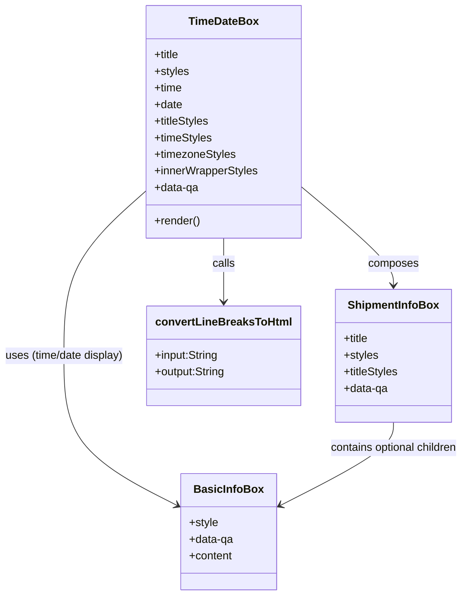

# Diagram: web/portal/src/modules/shipment-detail/shipment-detail-styled-components/TimeDateBox.js


> Auto-generated by Obscura crawlers

## Diagram 1



### SVG

<svg id="container" width="678.5234375" xmlns="http://www.w3.org/2000/svg" class="classDiagram" height="860" viewBox="0 0 678.5234375 860" role="graphics-document document" aria-roledescription="class"><style>#container{font-family:"trebuchet ms",verdana,arial,sans-serif;font-size:16px;fill:#333;}@keyframes edge-animation-frame{from{stroke-dashoffset:0;}}@keyframes dash{to{stroke-dashoffset:0;}}#container .edge-animation-slow{stroke-dasharray:9,5!important;stroke-dashoffset:900;animation:dash 50s linear infinite;stroke-linecap:round;}#container .edge-animation-fast{stroke-dasharray:9,5!important;stroke-dashoffset:900;animation:dash 20s linear infinite;stroke-linecap:round;}#container .error-icon{fill:#552222;}#container .error-text{fill:#552222;stroke:#552222;}#container .edge-thickness-normal{stroke-width:1px;}#container .edge-thickness-thick{stroke-width:3.5px;}#container .edge-pattern-solid{stroke-dasharray:0;}#container .edge-thickness-invisible{stroke-width:0;fill:none;}#container .edge-pattern-dashed{stroke-dasharray:3;}#container .edge-pattern-dotted{stroke-dasharray:2;}#container .marker{fill:#333333;stroke:#333333;}#container .marker.cross{stroke:#333333;}#container svg{font-family:"trebuchet ms",verdana,arial,sans-serif;font-size:16px;}#container p{margin:0;}#container g.classGroup text{fill:#9370DB;stroke:none;font-family:"trebuchet ms",verdana,arial,sans-serif;font-size:10px;}#container g.classGroup text .title{font-weight:bolder;}#container .nodeLabel,#container .edgeLabel{color:#131300;}#container .edgeLabel .label rect{fill:#ECECFF;}#container .label text{fill:#131300;}#container .labelBkg{background:#ECECFF;}#container .edgeLabel .label span{background:#ECECFF;}#container .classTitle{font-weight:bolder;}#container .node rect,#container .node circle,#container .node ellipse,#container .node polygon,#container .node path{fill:#ECECFF;stroke:#9370DB;stroke-width:1px;}#container .divider{stroke:#9370DB;stroke-width:1;}#container g.clickable{cursor:pointer;}#container g.classGroup rect{fill:#ECECFF;stroke:#9370DB;}#container g.classGroup line{stroke:#9370DB;stroke-width:1;}#container .classLabel .box{stroke:none;stroke-width:0;fill:#ECECFF;opacity:0.5;}#container .classLabel .label{fill:#9370DB;font-size:10px;}#container .relation{stroke:#333333;stroke-width:1;fill:none;}#container .dashed-line{stroke-dasharray:3;}#container .dotted-line{stroke-dasharray:1 2;}#container #compositionStart,#container .composition{fill:#333333!important;stroke:#333333!important;stroke-width:1;}#container #compositionEnd,#container .composition{fill:#333333!important;stroke:#333333!important;stroke-width:1;}#container #dependencyStart,#container .dependency{fill:#333333!important;stroke:#333333!important;stroke-width:1;}#container #dependencyStart,#container .dependency{fill:#333333!important;stroke:#333333!important;stroke-width:1;}#container #extensionStart,#container .extension{fill:transparent!important;stroke:#333333!important;stroke-width:1;}#container #extensionEnd,#container .extension{fill:transparent!important;stroke:#333333!important;stroke-width:1;}#container #aggregationStart,#container .aggregation{fill:transparent!important;stroke:#333333!important;stroke-width:1;}#container #aggregationEnd,#container .aggregation{fill:transparent!important;stroke:#333333!important;stroke-width:1;}#container #lollipopStart,#container .lollipop{fill:#ECECFF!important;stroke:#333333!important;stroke-width:1;}#container #lollipopEnd,#container .lollipop{fill:#ECECFF!important;stroke:#333333!important;stroke-width:1;}#container .edgeTerminals{font-size:11px;line-height:initial;}#container .classTitleText{text-anchor:middle;font-size:18px;fill:#333;}#container .label-icon{display:inline-block;height:1em;overflow:visible;vertical-align:-0.125em;}#container .node .label-icon path{fill:currentColor;stroke:revert;stroke-width:revert;}#container :root{--mermaid-font-family:"trebuchet ms",verdana,arial,sans-serif;}</style><g><defs><marker id="container_class-aggregationStart" class="marker aggregation class" refX="18" refY="7" markerWidth="190" markerHeight="240" orient="auto"><path d="M 18,7 L9,13 L1,7 L9,1 Z"></path></marker></defs><defs><marker id="container_class-aggregationEnd" class="marker aggregation class" refX="1" refY="7" markerWidth="20" markerHeight="28" orient="auto"><path d="M 18,7 L9,13 L1,7 L9,1 Z"></path></marker></defs><defs><marker id="container_class-extensionStart" class="marker extension class" refX="18" refY="7" markerWidth="190" markerHeight="240" orient="auto"><path d="M 1,7 L18,13 V 1 Z"></path></marker></defs><defs><marker id="container_class-extensionEnd" class="marker extension class" refX="1" refY="7" markerWidth="20" markerHeight="28" orient="auto"><path d="M 1,1 V 13 L18,7 Z"></path></marker></defs><defs><marker id="container_class-compositionStart" class="marker composition class" refX="18" refY="7" markerWidth="190" markerHeight="240" orient="auto"><path d="M 18,7 L9,13 L1,7 L9,1 Z"></path></marker></defs><defs><marker id="container_class-compositionEnd" class="marker composition class" refX="1" refY="7" markerWidth="20" markerHeight="28" orient="auto"><path d="M 18,7 L9,13 L1,7 L9,1 Z"></path></marker></defs><defs><marker id="container_class-dependencyStart" class="marker dependency class" refX="6" refY="7" markerWidth="190" markerHeight="240" orient="auto"><path d="M 5,7 L9,13 L1,7 L9,1 Z"></path></marker></defs><defs><marker id="container_class-dependencyEnd" class="marker dependency class" refX="13" refY="7" markerWidth="20" markerHeight="28" orient="auto"><path d="M 18,7 L9,13 L14,7 L9,1 Z"></path></marker></defs><defs><marker id="container_class-lollipopStart" class="marker lollipop class" refX="13" refY="7" markerWidth="190" markerHeight="240" orient="auto"><circle stroke="black" fill="transparent" cx="7" cy="7" r="6"></circle></marker></defs><defs><marker id="container_class-lollipopEnd" class="marker lollipop class" refX="1" refY="7" markerWidth="190" markerHeight="240" orient="auto"><circle stroke="black" fill="transparent" cx="7" cy="7" r="6"></circle></marker></defs><g class="root"><g class="clusters"></g><g class="edgePaths"><path d="M441.918,269.379L464.114,287.982C486.31,306.586,530.702,343.793,552.898,367.563C575.094,391.333,575.094,401.667,575.094,406.833L575.094,412" id="id_TimeDateBox_ShipmentInfoBox_1" class="edge-thickness-normal edge-pattern-solid relation" style=";;;" data-edge="true" data-et="edge" data-id="id_TimeDateBox_ShipmentInfoBox_1" data-points="W3sieCI6NDQxLjkxNzk2ODc1LCJ5IjoyNjkuMzc4NTU3NTExMDk5NzZ9LHsieCI6NTc1LjA5Mzc1LCJ5IjozODF9LHsieCI6NTc1LjA5Mzc1LCJ5Ijo0MTh9XQ==" marker-end="url(#container_class-dependencyEnd)"></path><path d="M219.098,273.515L198.631,291.429C178.164,309.343,137.23,345.172,116.764,385.253C96.297,425.333,96.297,469.667,96.297,514C96.297,558.333,96.297,602.667,123.939,638.805C151.581,674.942,206.865,702.885,234.507,716.856L262.149,730.827" id="id_TimeDateBox_BasicInfoBox_2" class="edge-thickness-normal edge-pattern-solid relation" style=";;;" data-edge="true" data-et="edge" data-id="id_TimeDateBox_BasicInfoBox_2" data-points="W3sieCI6MjE5LjA5NzY1NjI1LCJ5IjoyNzMuNTE1MDEwNTA3MzU1MTZ9LHsieCI6OTYuMjk2ODc1LCJ5IjozODF9LHsieCI6OTYuMjk2ODc1LCJ5Ijo1MTR9LHsieCI6OTYuMjk2ODc1LCJ5Ijo2NDd9LHsieCI6MjY3LjUwMzkwNjI1LCJ5Ijo3MzMuNTMzNzc2MDY2MzEyfV0=" marker-end="url(#container_class-dependencyEnd)"></path><path d="M330.508,344L330.508,350.167C330.508,356.333,330.508,368.667,330.508,384C330.508,399.333,330.508,417.667,330.508,426.833L330.508,436" id="id_TimeDateBox_convertLineBreaksToHtml_3" class="edge-thickness-normal edge-pattern-solid relation" style=";;;" data-edge="true" data-et="edge" data-id="id_TimeDateBox_convertLineBreaksToHtml_3" data-points="W3sieCI6MzMwLjUwNzgxMjUsInkiOjM0NH0seyJ4IjozMzAuNTA3ODEyNSwieSI6MzgxfSx7IngiOjMzMC41MDc4MTI1LCJ5Ijo0NDJ9XQ==" marker-end="url(#container_class-dependencyEnd)"></path><path d="M575.094,610L575.094,616.167C575.094,622.333,575.094,634.667,547.452,654.805C519.81,674.942,464.526,702.885,436.884,716.856L409.242,730.827" id="id_ShipmentInfoBox_BasicInfoBox_4" class="edge-thickness-normal edge-pattern-solid relation" style=";;;" data-edge="true" data-et="edge" data-id="id_ShipmentInfoBox_BasicInfoBox_4" data-points="W3sieCI6NTc1LjA5Mzc1LCJ5Ijo2MTB9LHsieCI6NTc1LjA5Mzc1LCJ5Ijo2NDd9LHsieCI6NDAzLjg4NjcxODc1LCJ5Ijo3MzMuNTMzNzc2MDY2MzEyfV0=" marker-end="url(#container_class-dependencyEnd)"></path></g><g class="edgeLabels"><g class="edgeLabel" transform="translate(575.09375, 381)"><g class="label" data-id="id_TimeDateBox_ShipmentInfoBox_1" transform="translate(-36.453125, -12)"><foreignObject width="72.90625" height="24"><div xmlns="http://www.w3.org/1999/xhtml" class="labelBkg" style="display: table-cell; white-space: nowrap; line-height: 1.5; max-width: 200px; text-align: center;"><span class="edgeLabel"><p>composes</p></span></div></foreignObject></g></g><g class="edgeLabel" transform="translate(96.296875, 514)"><g class="label" data-id="id_TimeDateBox_BasicInfoBox_2" transform="translate(-88.296875, -12)"><foreignObject width="176.59375" height="24"><div xmlns="http://www.w3.org/1999/xhtml" class="labelBkg" style="display: table-cell; white-space: nowrap; line-height: 1.5; max-width: 200px; text-align: center;"><span class="edgeLabel"><p>uses (time/date display)</p></span></div></foreignObject></g></g><g class="edgeLabel" transform="translate(330.5078125, 381)"><g class="label" data-id="id_TimeDateBox_convertLineBreaksToHtml_3" transform="translate(-16.4453125, -12)"><foreignObject width="32.890625" height="24"><div xmlns="http://www.w3.org/1999/xhtml" class="labelBkg" style="display: table-cell; white-space: nowrap; line-height: 1.5; max-width: 200px; text-align: center;"><span class="edgeLabel"><p>calls</p></span></div></foreignObject></g></g><g class="edgeLabel" transform="translate(575.09375, 647)"><g class="label" data-id="id_ShipmentInfoBox_BasicInfoBox_4" transform="translate(-95.4296875, -12)"><foreignObject width="190.859375" height="24"><div xmlns="http://www.w3.org/1999/xhtml" class="labelBkg" style="display: table-cell; white-space: nowrap; line-height: 1.5; max-width: 200px; text-align: center;"><span class="edgeLabel"><p>contains optional children</p></span></div></foreignObject></g></g></g><g class="nodes"><g class="node default" id="classId-TimeDateBox-0" transform="translate(330.5078125, 176)"><g class="basic label-container"><path d="M-111.41015625 -168 L111.41015625 -168 L111.41015625 168 L-111.41015625 168" stroke="none" stroke-width="0" fill="#ECECFF" style=""></path><path d="M-111.41015625 -168 C-33.567588313396016 -168, 44.27497962320797 -168, 111.41015625 -168 M-111.41015625 -168 C-30.38630414333379 -168, 50.63754796333242 -168, 111.41015625 -168 M111.41015625 -168 C111.41015625 -38.63448251361683, 111.41015625 90.73103497276634, 111.41015625 168 M111.41015625 -168 C111.41015625 -46.267565336594686, 111.41015625 75.46486932681063, 111.41015625 168 M111.41015625 168 C65.18713014984112 168, 18.964104049682234 168, -111.41015625 168 M111.41015625 168 C59.716809928282565 168, 8.02346360656513 168, -111.41015625 168 M-111.41015625 168 C-111.41015625 47.94417133120149, -111.41015625 -72.11165733759702, -111.41015625 -168 M-111.41015625 168 C-111.41015625 35.569901042183204, -111.41015625 -96.86019791563359, -111.41015625 -168" stroke="#9370DB" stroke-width="1.3" fill="none" stroke-dasharray="0 0" style=""></path></g><g class="annotation-group text" transform="translate(0, -144)"></g><g class="label-group text" transform="translate(-48.2265625, -144)"><g class="label" style="font-weight: bolder" transform="translate(0,-12)"><foreignObject width="96.453125" height="24"><div xmlns="http://www.w3.org/1999/xhtml" style="display: table-cell; white-space: nowrap; line-height: 1.5; max-width: 145px; text-align: center;"><span class="nodeLabel markdown-node-label" style=""><p>TimeDateBox</p></span></div></foreignObject></g></g><g class="members-group text" transform="translate(-99.41015625, -96)"><g class="label" style="" transform="translate(0,-12)"><foreignObject width="37.140625" height="24"><div xmlns="http://www.w3.org/1999/xhtml" style="display: table-cell; white-space: nowrap; line-height: 1.5; max-width: 95px; text-align: center;"><span class="nodeLabel markdown-node-label" style=""><p>+title</p></span></div></foreignObject></g><g class="label" style="" transform="translate(0,12)"><foreignObject width="49.828125" height="24"><div xmlns="http://www.w3.org/1999/xhtml" style="display: table-cell; white-space: nowrap; line-height: 1.5; max-width: 107px; text-align: center;"><span class="nodeLabel markdown-node-label" style=""><p>+styles</p></span></div></foreignObject></g><g class="label" style="" transform="translate(0,36)"><foreignObject width="40.625" height="24"><div xmlns="http://www.w3.org/1999/xhtml" style="display: table-cell; white-space: nowrap; line-height: 1.5; max-width: 98px; text-align: center;"><span class="nodeLabel markdown-node-label" style=""><p>+time</p></span></div></foreignObject></g><g class="label" style="" transform="translate(0,60)"><foreignObject width="40.515625" height="24"><div xmlns="http://www.w3.org/1999/xhtml" style="display: table-cell; white-space: nowrap; line-height: 1.5; max-width: 98px; text-align: center;"><span class="nodeLabel markdown-node-label" style=""><p>+date</p></span></div></foreignObject></g><g class="label" style="" transform="translate(0,84)"><foreignObject width="80.234375" height="24"><div xmlns="http://www.w3.org/1999/xhtml" style="display: table-cell; white-space: nowrap; line-height: 1.5; max-width: 138px; text-align: center;"><span class="nodeLabel markdown-node-label" style=""><p>+titleStyles</p></span></div></foreignObject></g><g class="label" style="" transform="translate(0,108)"><foreignObject width="83.71875" height="24"><div xmlns="http://www.w3.org/1999/xhtml" style="display: table-cell; white-space: nowrap; line-height: 1.5; max-width: 141px; text-align: center;"><span class="nodeLabel markdown-node-label" style=""><p>+timeStyles</p></span></div></foreignObject></g><g class="label" style="" transform="translate(0,132)"><foreignObject width="117.921875" height="24"><div xmlns="http://www.w3.org/1999/xhtml" style="display: table-cell; white-space: nowrap; line-height: 1.5; max-width: 175px; text-align: center;"><span class="nodeLabel markdown-node-label" style=""><p>+timezoneStyles</p></span></div></foreignObject></g><g class="label" style="" transform="translate(0,156)"><foreignObject width="150.59375" height="24"><div xmlns="http://www.w3.org/1999/xhtml" style="display: table-cell; white-space: nowrap; line-height: 1.5; max-width: 208px; text-align: center;"><span class="nodeLabel markdown-node-label" style=""><p>+innerWrapperStyles</p></span></div></foreignObject></g><g class="label" style="" transform="translate(0,180)"><foreignObject width="65.1875" height="24"><div xmlns="http://www.w3.org/1999/xhtml" style="display: table-cell; white-space: nowrap; line-height: 1.5; max-width: 123px; text-align: center;"><span class="nodeLabel markdown-node-label" style=""><p>+data-qa</p></span></div></foreignObject></g></g><g class="methods-group text" transform="translate(-99.41015625, 144)"><g class="label" style="" transform="translate(0,-12)"><foreignObject width="66.609375" height="24"><div xmlns="http://www.w3.org/1999/xhtml" style="display: table-cell; white-space: nowrap; line-height: 1.5; max-width: 124px; text-align: center;"><span class="nodeLabel markdown-node-label" style=""><p>+render()</p></span></div></foreignObject></g></g><g class="divider" style=""><path d="M-111.41015625 -120 C-62.67001827948524 -120, -13.929880308970482 -120, 111.41015625 -120 M-111.41015625 -120 C-26.532915165767648 -120, 58.344325918464705 -120, 111.41015625 -120" stroke="#9370DB" stroke-width="1.3" fill="none" stroke-dasharray="0 0" style=""></path></g><g class="divider" style=""><path d="M-111.41015625 120 C-37.71615088168397 120, 35.977854486632054 120, 111.41015625 120 M-111.41015625 120 C-60.93499626795319 120, -10.459836285906377 120, 111.41015625 120" stroke="#9370DB" stroke-width="1.3" fill="none" stroke-dasharray="0 0" style=""></path></g></g><g class="node default" id="classId-ShipmentInfoBox-1" transform="translate(575.09375, 514)"><g class="basic label-container"><path d="M-83.671875 -96 L83.671875 -96 L83.671875 96 L-83.671875 96" stroke="none" stroke-width="0" fill="#ECECFF" style=""></path><path d="M-83.671875 -96 C-47.946367170253254 -96, -12.220859340506507 -96, 83.671875 -96 M-83.671875 -96 C-29.30855538733347 -96, 25.05476422533306 -96, 83.671875 -96 M83.671875 -96 C83.671875 -57.58798345873987, 83.671875 -19.17596691747974, 83.671875 96 M83.671875 -96 C83.671875 -52.51358347068612, 83.671875 -9.027166941372244, 83.671875 96 M83.671875 96 C25.340879521308956 96, -32.99011595738209 96, -83.671875 96 M83.671875 96 C21.768197010651605 96, -40.13548097869679 96, -83.671875 96 M-83.671875 96 C-83.671875 46.2240292734141, -83.671875 -3.551941453171807, -83.671875 -96 M-83.671875 96 C-83.671875 19.399848435393096, -83.671875 -57.20030312921381, -83.671875 -96" stroke="#9370DB" stroke-width="1.3" fill="none" stroke-dasharray="0 0" style=""></path></g><g class="annotation-group text" transform="translate(0, -72)"></g><g class="label-group text" transform="translate(-63.109375, -72)"><g class="label" style="font-weight: bolder" transform="translate(0,-12)"><foreignObject width="126.21875" height="24"><div xmlns="http://www.w3.org/1999/xhtml" style="display: table-cell; white-space: nowrap; line-height: 1.5; max-width: 175px; text-align: center;"><span class="nodeLabel markdown-node-label" style=""><p>ShipmentInfoBox</p></span></div></foreignObject></g></g><g class="members-group text" transform="translate(-71.671875, -24)"><g class="label" style="" transform="translate(0,-12)"><foreignObject width="37.140625" height="24"><div xmlns="http://www.w3.org/1999/xhtml" style="display: table-cell; white-space: nowrap; line-height: 1.5; max-width: 95px; text-align: center;"><span class="nodeLabel markdown-node-label" style=""><p>+title</p></span></div></foreignObject></g><g class="label" style="" transform="translate(0,12)"><foreignObject width="49.828125" height="24"><div xmlns="http://www.w3.org/1999/xhtml" style="display: table-cell; white-space: nowrap; line-height: 1.5; max-width: 107px; text-align: center;"><span class="nodeLabel markdown-node-label" style=""><p>+styles</p></span></div></foreignObject></g><g class="label" style="" transform="translate(0,36)"><foreignObject width="80.234375" height="24"><div xmlns="http://www.w3.org/1999/xhtml" style="display: table-cell; white-space: nowrap; line-height: 1.5; max-width: 138px; text-align: center;"><span class="nodeLabel markdown-node-label" style=""><p>+titleStyles</p></span></div></foreignObject></g><g class="label" style="" transform="translate(0,60)"><foreignObject width="65.1875" height="24"><div xmlns="http://www.w3.org/1999/xhtml" style="display: table-cell; white-space: nowrap; line-height: 1.5; max-width: 123px; text-align: center;"><span class="nodeLabel markdown-node-label" style=""><p>+data-qa</p></span></div></foreignObject></g></g><g class="methods-group text" transform="translate(-71.671875, 96)"></g><g class="divider" style=""><path d="M-83.671875 -48 C-28.15469295446784 -48, 27.36248909106432 -48, 83.671875 -48 M-83.671875 -48 C-39.42448520614406 -48, 4.822904587711875 -48, 83.671875 -48" stroke="#9370DB" stroke-width="1.3" fill="none" stroke-dasharray="0 0" style=""></path></g><g class="divider" style=""><path d="M-83.671875 72 C-36.687476123564046 72, 10.296922752871907 72, 83.671875 72 M-83.671875 72 C-18.59577231782734 72, 46.48033036434532 72, 83.671875 72" stroke="#9370DB" stroke-width="1.3" fill="none" stroke-dasharray="0 0" style=""></path></g></g><g class="node default" id="classId-BasicInfoBox-2" transform="translate(335.6953125, 768)"><g class="basic label-container"><path d="M-68.19140625 -84 L68.19140625 -84 L68.19140625 84 L-68.19140625 84" stroke="none" stroke-width="0" fill="#ECECFF" style=""></path><path d="M-68.19140625 -84 C-34.77737161645001 -84, -1.363336982900023 -84, 68.19140625 -84 M-68.19140625 -84 C-37.63803455285123 -84, -7.084662855702462 -84, 68.19140625 -84 M68.19140625 -84 C68.19140625 -36.37869603693673, 68.19140625 11.242607926126539, 68.19140625 84 M68.19140625 -84 C68.19140625 -22.86693841504647, 68.19140625 38.26612316990706, 68.19140625 84 M68.19140625 84 C30.57939548858009 84, -7.03261527283982 84, -68.19140625 84 M68.19140625 84 C36.93438216579991 84, 5.67735808159982 84, -68.19140625 84 M-68.19140625 84 C-68.19140625 24.269822488810824, -68.19140625 -35.46035502237835, -68.19140625 -84 M-68.19140625 84 C-68.19140625 25.311984643005246, -68.19140625 -33.37603071398951, -68.19140625 -84" stroke="#9370DB" stroke-width="1.3" fill="none" stroke-dasharray="0 0" style=""></path></g><g class="annotation-group text" transform="translate(0, -60)"></g><g class="label-group text" transform="translate(-47.1953125, -60)"><g class="label" style="font-weight: bolder" transform="translate(0,-12)"><foreignObject width="94.390625" height="24"><div xmlns="http://www.w3.org/1999/xhtml" style="display: table-cell; white-space: nowrap; line-height: 1.5; max-width: 143px; text-align: center;"><span class="nodeLabel markdown-node-label" style=""><p>BasicInfoBox</p></span></div></foreignObject></g></g><g class="members-group text" transform="translate(-56.19140625, -12)"><g class="label" style="" transform="translate(0,-12)"><foreignObject width="42.359375" height="24"><div xmlns="http://www.w3.org/1999/xhtml" style="display: table-cell; white-space: nowrap; line-height: 1.5; max-width: 100px; text-align: center;"><span class="nodeLabel markdown-node-label" style=""><p>+style</p></span></div></foreignObject></g><g class="label" style="" transform="translate(0,12)"><foreignObject width="65.1875" height="24"><div xmlns="http://www.w3.org/1999/xhtml" style="display: table-cell; white-space: nowrap; line-height: 1.5; max-width: 123px; text-align: center;"><span class="nodeLabel markdown-node-label" style=""><p>+data-qa</p></span></div></foreignObject></g><g class="label" style="" transform="translate(0,36)"><foreignObject width="63.453125" height="24"><div xmlns="http://www.w3.org/1999/xhtml" style="display: table-cell; white-space: nowrap; line-height: 1.5; max-width: 121px; text-align: center;"><span class="nodeLabel markdown-node-label" style=""><p>+content</p></span></div></foreignObject></g></g><g class="methods-group text" transform="translate(-56.19140625, 84)"></g><g class="divider" style=""><path d="M-68.19140625 -36 C-34.48523685250288 -36, -0.7790674550057588 -36, 68.19140625 -36 M-68.19140625 -36 C-38.852925169068484 -36, -9.514444088136962 -36, 68.19140625 -36" stroke="#9370DB" stroke-width="1.3" fill="none" stroke-dasharray="0 0" style=""></path></g><g class="divider" style=""><path d="M-68.19140625 60 C-27.803431512093184 60, 12.584543225813633 60, 68.19140625 60 M-68.19140625 60 C-32.889903992105424 60, 2.411598265789152 60, 68.19140625 60" stroke="#9370DB" stroke-width="1.3" fill="none" stroke-dasharray="0 0" style=""></path></g></g><g class="node default" id="classId-convertLineBreaksToHtml-3" transform="translate(330.5078125, 514)"><g class="basic label-container"><path d="M-110.9140625 -72 L110.9140625 -72 L110.9140625 72 L-110.9140625 72" stroke="none" stroke-width="0" fill="#ECECFF" style=""></path><path d="M-110.9140625 -72 C-40.751685338512544 -72, 29.41069182297491 -72, 110.9140625 -72 M-110.9140625 -72 C-29.261958819181586 -72, 52.39014486163683 -72, 110.9140625 -72 M110.9140625 -72 C110.9140625 -22.671788191718008, 110.9140625 26.656423616563984, 110.9140625 72 M110.9140625 -72 C110.9140625 -16.739543463218354, 110.9140625 38.52091307356329, 110.9140625 72 M110.9140625 72 C65.16462901154122 72, 19.41519552308246 72, -110.9140625 72 M110.9140625 72 C28.1253279590032 72, -54.6634065819936 72, -110.9140625 72 M-110.9140625 72 C-110.9140625 41.95471181434576, -110.9140625 11.90942362869152, -110.9140625 -72 M-110.9140625 72 C-110.9140625 31.800921775710414, -110.9140625 -8.398156448579172, -110.9140625 -72" stroke="#9370DB" stroke-width="1.3" fill="none" stroke-dasharray="0 0" style=""></path></g><g class="annotation-group text" transform="translate(0, -48)"></g><g class="label-group text" transform="translate(-94.03125, -48)"><g class="label" style="font-weight: bolder" transform="translate(0,-12)"><foreignObject width="188.0625" height="24"><div xmlns="http://www.w3.org/1999/xhtml" style="display: table-cell; white-space: nowrap; line-height: 1.5; max-width: 235px; text-align: center;"><span class="nodeLabel markdown-node-label" style=""><p>convertLineBreaksToHtml</p></span></div></foreignObject></g></g><g class="members-group text" transform="translate(-98.9140625, 0)"><g class="label" style="" transform="translate(0,-12)"><foreignObject width="93.25" height="24"><div xmlns="http://www.w3.org/1999/xhtml" style="display: table-cell; white-space: nowrap; line-height: 1.5; max-width: 151px; text-align: center;"><span class="nodeLabel markdown-node-label" style=""><p>+input:String</p></span></div></foreignObject></g><g class="label" style="" transform="translate(0,12)"><foreignObject width="103.796875" height="24"><div xmlns="http://www.w3.org/1999/xhtml" style="display: table-cell; white-space: nowrap; line-height: 1.5; max-width: 162px; text-align: center;"><span class="nodeLabel markdown-node-label" style=""><p>+output:String</p></span></div></foreignObject></g></g><g class="methods-group text" transform="translate(-98.9140625, 72)"></g><g class="divider" style=""><path d="M-110.9140625 -24 C-30.767241369760512 -24, 49.379579760478975 -24, 110.9140625 -24 M-110.9140625 -24 C-35.24092554528802 -24, 40.43221140942396 -24, 110.9140625 -24" stroke="#9370DB" stroke-width="1.3" fill="none" stroke-dasharray="0 0" style=""></path></g><g class="divider" style=""><path d="M-110.9140625 48 C-48.088392351350315 48, 14.73727779729937 48, 110.9140625 48 M-110.9140625 48 C-28.60691654389855 48, 53.7002294122029 48, 110.9140625 48" stroke="#9370DB" stroke-width="1.3" fill="none" stroke-dasharray="0 0" style=""></path></g></g></g></g></g></svg>

## Diagram 2

```mermaid
flowchart TD
    A[Parent Component / App] -->|renders| B[TimeDateBox]
    B --> C{time provided?}
    C -- yes --> D[split time into timeOnly & timezoneOnly]
    D --> E[BasicInfoBox (time)]
    E --> F[convertLineBreaksToHtml(timeOnly/timezoneOnly)]
    C -- no --> G[skip time block]
    B --> H{date provided?}
    H -- yes --> I[BasicInfoBox (date)]
    I --> J[convertLineBreaksToHtml(date)]
    H -- no --> K[skip date block]
    B --> L[ShipmentInfoBox wrapper]
```

> SVG rendering failed for this diagram.
