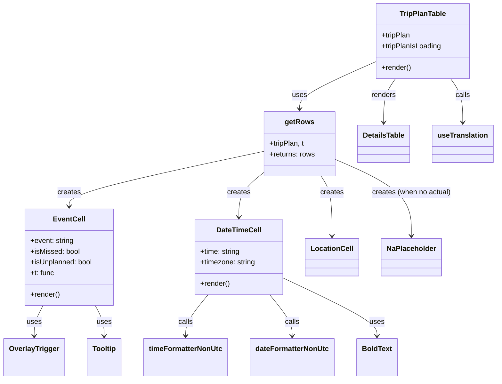

# Diagram: web/portal/src/modules/shipment-detail/shipment-detail-styled-components/TripPlanTable.js


> Auto-generated by Obscura crawlers

## Diagram 1



### SVG

<svg id="container" width="1088.490234375" xmlns="http://www.w3.org/2000/svg" class="classDiagram" height="850" viewBox="0 0 1088.490234375 850" role="graphics-document document" aria-roledescription="class"><style>#container{font-family:"trebuchet ms",verdana,arial,sans-serif;font-size:16px;fill:#333;}@keyframes edge-animation-frame{from{stroke-dashoffset:0;}}@keyframes dash{to{stroke-dashoffset:0;}}#container .edge-animation-slow{stroke-dasharray:9,5!important;stroke-dashoffset:900;animation:dash 50s linear infinite;stroke-linecap:round;}#container .edge-animation-fast{stroke-dasharray:9,5!important;stroke-dashoffset:900;animation:dash 20s linear infinite;stroke-linecap:round;}#container .error-icon{fill:#552222;}#container .error-text{fill:#552222;stroke:#552222;}#container .edge-thickness-normal{stroke-width:1px;}#container .edge-thickness-thick{stroke-width:3.5px;}#container .edge-pattern-solid{stroke-dasharray:0;}#container .edge-thickness-invisible{stroke-width:0;fill:none;}#container .edge-pattern-dashed{stroke-dasharray:3;}#container .edge-pattern-dotted{stroke-dasharray:2;}#container .marker{fill:#333333;stroke:#333333;}#container .marker.cross{stroke:#333333;}#container svg{font-family:"trebuchet ms",verdana,arial,sans-serif;font-size:16px;}#container p{margin:0;}#container g.classGroup text{fill:#9370DB;stroke:none;font-family:"trebuchet ms",verdana,arial,sans-serif;font-size:10px;}#container g.classGroup text .title{font-weight:bolder;}#container .nodeLabel,#container .edgeLabel{color:#131300;}#container .edgeLabel .label rect{fill:#ECECFF;}#container .label text{fill:#131300;}#container .labelBkg{background:#ECECFF;}#container .edgeLabel .label span{background:#ECECFF;}#container .classTitle{font-weight:bolder;}#container .node rect,#container .node circle,#container .node ellipse,#container .node polygon,#container .node path{fill:#ECECFF;stroke:#9370DB;stroke-width:1px;}#container .divider{stroke:#9370DB;stroke-width:1;}#container g.clickable{cursor:pointer;}#container g.classGroup rect{fill:#ECECFF;stroke:#9370DB;}#container g.classGroup line{stroke:#9370DB;stroke-width:1;}#container .classLabel .box{stroke:none;stroke-width:0;fill:#ECECFF;opacity:0.5;}#container .classLabel .label{fill:#9370DB;font-size:10px;}#container .relation{stroke:#333333;stroke-width:1;fill:none;}#container .dashed-line{stroke-dasharray:3;}#container .dotted-line{stroke-dasharray:1 2;}#container #compositionStart,#container .composition{fill:#333333!important;stroke:#333333!important;stroke-width:1;}#container #compositionEnd,#container .composition{fill:#333333!important;stroke:#333333!important;stroke-width:1;}#container #dependencyStart,#container .dependency{fill:#333333!important;stroke:#333333!important;stroke-width:1;}#container #dependencyStart,#container .dependency{fill:#333333!important;stroke:#333333!important;stroke-width:1;}#container #extensionStart,#container .extension{fill:transparent!important;stroke:#333333!important;stroke-width:1;}#container #extensionEnd,#container .extension{fill:transparent!important;stroke:#333333!important;stroke-width:1;}#container #aggregationStart,#container .aggregation{fill:transparent!important;stroke:#333333!important;stroke-width:1;}#container #aggregationEnd,#container .aggregation{fill:transparent!important;stroke:#333333!important;stroke-width:1;}#container #lollipopStart,#container .lollipop{fill:#ECECFF!important;stroke:#333333!important;stroke-width:1;}#container #lollipopEnd,#container .lollipop{fill:#ECECFF!important;stroke:#333333!important;stroke-width:1;}#container .edgeTerminals{font-size:11px;line-height:initial;}#container .classTitleText{text-anchor:middle;font-size:18px;fill:#333;}#container .label-icon{display:inline-block;height:1em;overflow:visible;vertical-align:-0.125em;}#container .node .label-icon path{fill:currentColor;stroke:revert;stroke-width:revert;}#container :root{--mermaid-font-family:"trebuchet ms",verdana,arial,sans-serif;}</style><g><defs><marker id="container_class-aggregationStart" class="marker aggregation class" refX="18" refY="7" markerWidth="190" markerHeight="240" orient="auto"><path d="M 18,7 L9,13 L1,7 L9,1 Z"></path></marker></defs><defs><marker id="container_class-aggregationEnd" class="marker aggregation class" refX="1" refY="7" markerWidth="20" markerHeight="28" orient="auto"><path d="M 18,7 L9,13 L1,7 L9,1 Z"></path></marker></defs><defs><marker id="container_class-extensionStart" class="marker extension class" refX="18" refY="7" markerWidth="190" markerHeight="240" orient="auto"><path d="M 1,7 L18,13 V 1 Z"></path></marker></defs><defs><marker id="container_class-extensionEnd" class="marker extension class" refX="1" refY="7" markerWidth="20" markerHeight="28" orient="auto"><path d="M 1,1 V 13 L18,7 Z"></path></marker></defs><defs><marker id="container_class-compositionStart" class="marker composition class" refX="18" refY="7" markerWidth="190" markerHeight="240" orient="auto"><path d="M 18,7 L9,13 L1,7 L9,1 Z"></path></marker></defs><defs><marker id="container_class-compositionEnd" class="marker composition class" refX="1" refY="7" markerWidth="20" markerHeight="28" orient="auto"><path d="M 18,7 L9,13 L1,7 L9,1 Z"></path></marker></defs><defs><marker id="container_class-dependencyStart" class="marker dependency class" refX="6" refY="7" markerWidth="190" markerHeight="240" orient="auto"><path d="M 5,7 L9,13 L1,7 L9,1 Z"></path></marker></defs><defs><marker id="container_class-dependencyEnd" class="marker dependency class" refX="13" refY="7" markerWidth="20" markerHeight="28" orient="auto"><path d="M 18,7 L9,13 L14,7 L9,1 Z"></path></marker></defs><defs><marker id="container_class-lollipopStart" class="marker lollipop class" refX="13" refY="7" markerWidth="190" markerHeight="240" orient="auto"><circle stroke="black" fill="transparent" cx="7" cy="7" r="6"></circle></marker></defs><defs><marker id="container_class-lollipopEnd" class="marker lollipop class" refX="1" refY="7" markerWidth="190" markerHeight="240" orient="auto"><circle stroke="black" fill="transparent" cx="7" cy="7" r="6"></circle></marker></defs><g class="root"><g class="clusters"></g><g class="edgePaths"><path d="M823.029,138.414L794.996,150.845C766.963,163.276,710.896,188.138,682.863,205.736C654.83,223.333,654.83,233.667,654.83,238.833L654.83,244" id="id_TripPlanTable_getRows_1" class="edge-thickness-normal edge-pattern-solid relation" style=";;;" data-edge="true" data-et="edge" data-id="id_TripPlanTable_getRows_1" data-points="W3sieCI6ODIzLjAyOTI5Njg3NSwieSI6MTM4LjQxMzg3NzUxNTk2MTg3fSx7IngiOjY1NC44MzAwNzgxMjUsInkiOjIxM30seyJ4Ijo2NTQuODMwMDc4MTI1LCJ5IjoyNTB9XQ==" marker-end="url(#container_class-dependencyEnd)"></path><path d="M575.998,339.037L505.08,354.365C434.161,369.692,292.325,400.346,221.407,420.84C150.488,441.333,150.488,451.667,150.488,456.833L150.488,462" id="id_getRows_EventCell_2" class="edge-thickness-normal edge-pattern-solid relation" style=";;;" data-edge="true" data-et="edge" data-id="id_getRows_EventCell_2" data-points="W3sieCI6NTc1Ljk5ODA0Njg3NSwieSI6MzM5LjAzNzQzNjYzNDIyN30seyJ4IjoxNTAuNDg4MjgxMjUsInkiOjQzMX0seyJ4IjoxNTAuNDg4MjgxMjUsInkiOjQ2OH1d" marker-end="url(#container_class-dependencyEnd)"></path><path d="M703.232,394L707.378,400.167C711.523,406.333,719.814,418.667,723.96,441C728.105,463.333,728.105,495.667,728.105,511.833L728.105,528" id="id_getRows_LocationCell_3" class="edge-thickness-normal edge-pattern-solid relation" style=";;;" data-edge="true" data-et="edge" data-id="id_getRows_LocationCell_3" data-points="W3sieCI6NzAzLjIzMjE3MTAxNDkwODIsInkiOjM5NH0seyJ4Ijo3MjguMTA1NDY4NzUsInkiOjQzMX0seyJ4Ijo3MjguMTA1NDY4NzUsInkiOjUzNH1d" marker-end="url(#container_class-dependencyEnd)"></path><path d="M575.998,387.062L567.125,394.385C558.253,401.708,540.507,416.354,531.634,432.844C522.762,449.333,522.762,467.667,522.762,476.833L522.762,486" id="id_getRows_DateTimeCell_4" class="edge-thickness-normal edge-pattern-solid relation" style=";;;" data-edge="true" data-et="edge" data-id="id_getRows_DateTimeCell_4" data-points="W3sieCI6NTc1Ljk5ODA0Njg3NSwieSI6Mzg3LjA2MjQ1Mjg2MDg4MjMzfSx7IngiOjUyMi43NjE3MTg3NSwieSI6NDMxfSx7IngiOjUyMi43NjE3MTg3NSwieSI6NDkyfV0=" marker-end="url(#container_class-dependencyEnd)"></path><path d="M733.662,357.002L761.439,369.335C789.216,381.668,844.77,406.334,872.547,434.834C900.324,463.333,900.324,495.667,900.324,511.833L900.324,528" id="id_getRows_NaPlaceholder_5" class="edge-thickness-normal edge-pattern-solid relation" style=";;;" data-edge="true" data-et="edge" data-id="id_getRows_NaPlaceholder_5" data-points="W3sieCI6NzMzLjY2MjEwOTM3NSwieSI6MzU3LjAwMTYxNTA0NjE4MzkzfSx7IngiOjkwMC4zMjQyMTg3NSwieSI6NDMxfSx7IngiOjkwMC4zMjQyMTg3NSwieSI6NTM0fV0=" marker-end="url(#container_class-dependencyEnd)"></path><path d="M867.504,176L863.085,182.167C858.666,188.333,849.828,200.667,845.409,217C840.99,233.333,840.99,253.667,840.99,263.833L840.99,274" id="id_TripPlanTable_DetailsTable_6" class="edge-thickness-normal edge-pattern-solid relation" style=";;;" data-edge="true" data-et="edge" data-id="id_TripPlanTable_DetailsTable_6" data-points="W3sieCI6ODY3LjUwMzk1NDY3NDU4NjgsInkiOjE3Nn0seyJ4Ijo4NDAuOTkwMjM0Mzc1LCJ5IjoyMTN9LHsieCI6ODQwLjk5MDIzNDM3NSwieSI6MjgwfV0=" marker-end="url(#container_class-dependencyEnd)"></path><path d="M93.331,684L90.068,690.167C86.804,696.333,80.277,708.667,77.014,720C73.75,731.333,73.75,741.667,73.75,746.833L73.75,752" id="id_EventCell_OverlayTrigger_7" class="edge-thickness-normal edge-pattern-solid relation" style=";;;" data-edge="true" data-et="edge" data-id="id_EventCell_OverlayTrigger_7" data-points="W3sieCI6OTMuMzMxNDkyNDU2ODk2NTYsInkiOjY4NH0seyJ4Ijo3My43NSwieSI6NzIxfSx7IngiOjczLjc1LCJ5Ijo3NTh9XQ==" marker-end="url(#container_class-dependencyEnd)"></path><path d="M207.645,684L210.909,690.167C214.172,696.333,220.699,708.667,223.963,720C227.227,731.333,227.227,741.667,227.227,746.833L227.227,752" id="id_EventCell_Tooltip_8" class="edge-thickness-normal edge-pattern-solid relation" style=";;;" data-edge="true" data-et="edge" data-id="id_EventCell_Tooltip_8" data-points="W3sieCI6MjA3LjY0NTA3MDA0MzEwMzQzLCJ5Ijo2ODR9LHsieCI6MjI3LjIyNjU2MjUsInkiOjcyMX0seyJ4IjoyMjcuMjI2NTYyNSwieSI6NzU4fV0=" marker-end="url(#container_class-dependencyEnd)"></path><path d="M455.324,660L447.162,670.167C439,680.333,422.676,700.667,414.514,716C406.352,731.333,406.352,741.667,406.352,746.833L406.352,752" id="id_DateTimeCell_timeFormatterNonUtc_9" class="edge-thickness-normal edge-pattern-solid relation" style=";;;" data-edge="true" data-et="edge" data-id="id_DateTimeCell_timeFormatterNonUtc_9" data-points="W3sieCI6NDU1LjMyNDExMDk5MTM3OTMsInkiOjY2MH0seyJ4Ijo0MDYuMzUxNTYyNSwieSI6NzIxfSx7IngiOjQwNi4zNTE1NjI1LCJ5Ijo3NTh9XQ==" marker-end="url(#container_class-dependencyEnd)"></path><path d="M590.199,660L598.361,670.167C606.524,680.333,622.848,700.667,631.01,716C639.172,731.333,639.172,741.667,639.172,746.833L639.172,752" id="id_DateTimeCell_dateFormatterNonUtc_10" class="edge-thickness-normal edge-pattern-solid relation" style=";;;" data-edge="true" data-et="edge" data-id="id_DateTimeCell_dateFormatterNonUtc_10" data-points="W3sieCI6NTkwLjE5OTMyNjUwODYyMDcsInkiOjY2MH0seyJ4Ijo2MzkuMTcxODc1LCJ5Ijo3MjF9LHsieCI6NjM5LjE3MTg3NSwieSI6NzU4fV0=" marker-end="url(#container_class-dependencyEnd)"></path><path d="M987.891,176L992.31,182.167C996.728,188.333,1005.566,200.667,1009.985,217C1014.404,233.333,1014.404,253.667,1014.404,263.833L1014.404,274" id="id_TripPlanTable_useTranslation_11" class="edge-thickness-normal edge-pattern-solid relation" style=";;;" data-edge="true" data-et="edge" data-id="id_TripPlanTable_useTranslation_11" data-points="W3sieCI6OTg3Ljg5MDU3NjU3NTQxMzIsInkiOjE3Nn0seyJ4IjoxMDE0LjQwNDI5Njg3NSwieSI6MjEzfSx7IngiOjEwMTQuNDA0Mjk2ODc1LCJ5IjoyODB9XQ==" marker-end="url(#container_class-dependencyEnd)"></path><path d="M621.152,623.247L655.08,639.539C689.008,655.832,756.863,688.416,790.791,709.875C824.719,731.333,824.719,741.667,824.719,746.833L824.719,752" id="id_DateTimeCell_BoldText_12" class="edge-thickness-normal edge-pattern-solid relation" style=";;;" data-edge="true" data-et="edge" data-id="id_DateTimeCell_BoldText_12" data-points="W3sieCI6NjIxLjE1MjM0Mzc1LCJ5Ijo2MjMuMjQ3MjU0MjM5OTE5Mn0seyJ4Ijo4MjQuNzE4NzUsInkiOjcyMX0seyJ4Ijo4MjQuNzE4NzUsInkiOjc1OH1d" marker-end="url(#container_class-dependencyEnd)"></path></g><g class="edgeLabels"><g class="edgeLabel" transform="translate(654.830078125, 213)"><g class="label" data-id="id_TripPlanTable_getRows_1" transform="translate(-16.4921875, -12)"><foreignObject width="32.984375" height="24"><div xmlns="http://www.w3.org/1999/xhtml" class="labelBkg" style="display: table-cell; white-space: nowrap; line-height: 1.5; max-width: 200px; text-align: center;"><span class="edgeLabel"><p>uses</p></span></div></foreignObject></g></g><g class="edgeLabel" transform="translate(150.48828125, 431)"><g class="label" data-id="id_getRows_EventCell_2" transform="translate(-26.171875, -12)"><foreignObject width="52.34375" height="24"><div xmlns="http://www.w3.org/1999/xhtml" class="labelBkg" style="display: table-cell; white-space: nowrap; line-height: 1.5; max-width: 200px; text-align: center;"><span class="edgeLabel"><p>creates</p></span></div></foreignObject></g></g><g class="edgeLabel" transform="translate(728.10546875, 431)"><g class="label" data-id="id_getRows_LocationCell_3" transform="translate(-26.171875, -12)"><foreignObject width="52.34375" height="24"><div xmlns="http://www.w3.org/1999/xhtml" class="labelBkg" style="display: table-cell; white-space: nowrap; line-height: 1.5; max-width: 200px; text-align: center;"><span class="edgeLabel"><p>creates</p></span></div></foreignObject></g></g><g class="edgeLabel" transform="translate(522.76171875, 431)"><g class="label" data-id="id_getRows_DateTimeCell_4" transform="translate(-26.171875, -12)"><foreignObject width="52.34375" height="24"><div xmlns="http://www.w3.org/1999/xhtml" class="labelBkg" style="display: table-cell; white-space: nowrap; line-height: 1.5; max-width: 200px; text-align: center;"><span class="edgeLabel"><p>creates</p></span></div></foreignObject></g></g><g class="edgeLabel" transform="translate(900.32421875, 431)"><g class="label" data-id="id_getRows_NaPlaceholder_5" transform="translate(-88.8828125, -12)"><foreignObject width="177.765625" height="24"><div xmlns="http://www.w3.org/1999/xhtml" class="labelBkg" style="display: table-cell; white-space: nowrap; line-height: 1.5; max-width: 200px; text-align: center;"><span class="edgeLabel"><p>creates (when no actual)</p></span></div></foreignObject></g></g><g class="edgeLabel" transform="translate(840.990234375, 213)"><g class="label" data-id="id_TripPlanTable_DetailsTable_6" transform="translate(-27.75, -12)"><foreignObject width="55.5" height="24"><div xmlns="http://www.w3.org/1999/xhtml" class="labelBkg" style="display: table-cell; white-space: nowrap; line-height: 1.5; max-width: 200px; text-align: center;"><span class="edgeLabel"><p>renders</p></span></div></foreignObject></g></g><g class="edgeLabel" transform="translate(73.75, 721)"><g class="label" data-id="id_EventCell_OverlayTrigger_7" transform="translate(-16.4921875, -12)"><foreignObject width="32.984375" height="24"><div xmlns="http://www.w3.org/1999/xhtml" class="labelBkg" style="display: table-cell; white-space: nowrap; line-height: 1.5; max-width: 200px; text-align: center;"><span class="edgeLabel"><p>uses</p></span></div></foreignObject></g></g><g class="edgeLabel" transform="translate(227.2265625, 721)"><g class="label" data-id="id_EventCell_Tooltip_8" transform="translate(-16.4921875, -12)"><foreignObject width="32.984375" height="24"><div xmlns="http://www.w3.org/1999/xhtml" class="labelBkg" style="display: table-cell; white-space: nowrap; line-height: 1.5; max-width: 200px; text-align: center;"><span class="edgeLabel"><p>uses</p></span></div></foreignObject></g></g><g class="edgeLabel" transform="translate(406.3515625, 721)"><g class="label" data-id="id_DateTimeCell_timeFormatterNonUtc_9" transform="translate(-16.4453125, -12)"><foreignObject width="32.890625" height="24"><div xmlns="http://www.w3.org/1999/xhtml" class="labelBkg" style="display: table-cell; white-space: nowrap; line-height: 1.5; max-width: 200px; text-align: center;"><span class="edgeLabel"><p>calls</p></span></div></foreignObject></g></g><g class="edgeLabel" transform="translate(639.171875, 721)"><g class="label" data-id="id_DateTimeCell_dateFormatterNonUtc_10" transform="translate(-16.4453125, -12)"><foreignObject width="32.890625" height="24"><div xmlns="http://www.w3.org/1999/xhtml" class="labelBkg" style="display: table-cell; white-space: nowrap; line-height: 1.5; max-width: 200px; text-align: center;"><span class="edgeLabel"><p>calls</p></span></div></foreignObject></g></g><g class="edgeLabel" transform="translate(1014.404296875, 213)"><g class="label" data-id="id_TripPlanTable_useTranslation_11" transform="translate(-16.4453125, -12)"><foreignObject width="32.890625" height="24"><div xmlns="http://www.w3.org/1999/xhtml" class="labelBkg" style="display: table-cell; white-space: nowrap; line-height: 1.5; max-width: 200px; text-align: center;"><span class="edgeLabel"><p>calls</p></span></div></foreignObject></g></g><g class="edgeLabel" transform="translate(824.71875, 721)"><g class="label" data-id="id_DateTimeCell_BoldText_12" transform="translate(-16.4921875, -12)"><foreignObject width="32.984375" height="24"><div xmlns="http://www.w3.org/1999/xhtml" class="labelBkg" style="display: table-cell; white-space: nowrap; line-height: 1.5; max-width: 200px; text-align: center;"><span class="edgeLabel"><p>uses</p></span></div></foreignObject></g></g></g><g class="nodes"><g class="node default" id="classId-TripPlanTable-0" transform="translate(927.697265625, 92)"><g class="basic label-container"><path d="M-104.66796875 -84 L104.66796875 -84 L104.66796875 84 L-104.66796875 84" stroke="none" stroke-width="0" fill="#ECECFF" style=""></path><path d="M-104.66796875 -84 C-35.4117163995182 -84, 33.8445359509636 -84, 104.66796875 -84 M-104.66796875 -84 C-53.63316981561074 -84, -2.5983708812214843 -84, 104.66796875 -84 M104.66796875 -84 C104.66796875 -21.78968155180724, 104.66796875 40.42063689638552, 104.66796875 84 M104.66796875 -84 C104.66796875 -30.884931103385057, 104.66796875 22.230137793229886, 104.66796875 84 M104.66796875 84 C48.25317458949477 84, -8.161619571010462 84, -104.66796875 84 M104.66796875 84 C25.022404085681103 84, -54.623160578637794 84, -104.66796875 84 M-104.66796875 84 C-104.66796875 42.81071513531659, -104.66796875 1.6214302706331836, -104.66796875 -84 M-104.66796875 84 C-104.66796875 39.928280907562055, -104.66796875 -4.14343818487589, -104.66796875 -84" stroke="#9370DB" stroke-width="1.3" fill="none" stroke-dasharray="0 0" style=""></path></g><g class="annotation-group text" transform="translate(0, -60)"></g><g class="label-group text" transform="translate(-50.2109375, -60)"><g class="label" style="font-weight: bolder" transform="translate(0,-12)"><foreignObject width="100.421875" height="24"><div xmlns="http://www.w3.org/1999/xhtml" style="display: table-cell; white-space: nowrap; line-height: 1.5; max-width: 149px; text-align: center;"><span class="nodeLabel markdown-node-label" style=""><p>TripPlanTable</p></span></div></foreignObject></g></g><g class="members-group text" transform="translate(-92.66796875, -12)"><g class="label" style="" transform="translate(0,-12)"><foreignObject width="65.703125" height="24"><div xmlns="http://www.w3.org/1999/xhtml" style="display: table-cell; white-space: nowrap; line-height: 1.5; max-width: 123px; text-align: center;"><span class="nodeLabel markdown-node-label" style=""><p>+tripPlan</p></span></div></foreignObject></g><g class="label" style="" transform="translate(0,12)"><foreignObject width="135.125" height="24"><div xmlns="http://www.w3.org/1999/xhtml" style="display: table-cell; white-space: nowrap; line-height: 1.5; max-width: 193px; text-align: center;"><span class="nodeLabel markdown-node-label" style=""><p>+tripPlanIsLoading</p></span></div></foreignObject></g></g><g class="methods-group text" transform="translate(-92.66796875, 60)"><g class="label" style="" transform="translate(0,-12)"><foreignObject width="66.609375" height="24"><div xmlns="http://www.w3.org/1999/xhtml" style="display: table-cell; white-space: nowrap; line-height: 1.5; max-width: 124px; text-align: center;"><span class="nodeLabel markdown-node-label" style=""><p>+render()</p></span></div></foreignObject></g></g><g class="divider" style=""><path d="M-104.66796875 -36 C-22.840595518287557 -36, 58.986777713424885 -36, 104.66796875 -36 M-104.66796875 -36 C-31.45066457002298 -36, 41.76663960995404 -36, 104.66796875 -36" stroke="#9370DB" stroke-width="1.3" fill="none" stroke-dasharray="0 0" style=""></path></g><g class="divider" style=""><path d="M-104.66796875 36 C-24.97551335802568 36, 54.71694203394864 36, 104.66796875 36 M-104.66796875 36 C-36.22382628347913 36, 32.220316183041746 36, 104.66796875 36" stroke="#9370DB" stroke-width="1.3" fill="none" stroke-dasharray="0 0" style=""></path></g></g><g class="node default" id="classId-getRows-1" transform="translate(654.830078125, 322)"><g class="basic label-container"><path d="M-78.83203125 -72 L78.83203125 -72 L78.83203125 72 L-78.83203125 72" stroke="none" stroke-width="0" fill="#ECECFF" style=""></path><path d="M-78.83203125 -72 C-18.45296229381291 -72, 41.92610666237418 -72, 78.83203125 -72 M-78.83203125 -72 C-21.369476092623295 -72, 36.09307906475341 -72, 78.83203125 -72 M78.83203125 -72 C78.83203125 -15.123301105536108, 78.83203125 41.753397788927785, 78.83203125 72 M78.83203125 -72 C78.83203125 -18.04854314504962, 78.83203125 35.90291370990076, 78.83203125 72 M78.83203125 72 C34.40329142671925 72, -10.0254483965615 72, -78.83203125 72 M78.83203125 72 C23.480065720833515 72, -31.87189980833297 72, -78.83203125 72 M-78.83203125 72 C-78.83203125 31.571752233123355, -78.83203125 -8.85649553375329, -78.83203125 -72 M-78.83203125 72 C-78.83203125 42.680226801305494, -78.83203125 13.360453602610995, -78.83203125 -72" stroke="#9370DB" stroke-width="1.3" fill="none" stroke-dasharray="0 0" style=""></path></g><g class="annotation-group text" transform="translate(0, -48)"></g><g class="label-group text" transform="translate(-31.0859375, -48)"><g class="label" style="font-weight: bolder" transform="translate(0,-12)"><foreignObject width="62.171875" height="24"><div xmlns="http://www.w3.org/1999/xhtml" style="display: table-cell; white-space: nowrap; line-height: 1.5; max-width: 110px; text-align: center;"><span class="nodeLabel markdown-node-label" style=""><p>getRows</p></span></div></foreignObject></g></g><g class="members-group text" transform="translate(-66.83203125, 0)"><g class="label" style="" transform="translate(0,-12)"><foreignObject width="79.5625" height="24"><div xmlns="http://www.w3.org/1999/xhtml" style="display: table-cell; white-space: nowrap; line-height: 1.5; max-width: 137px; text-align: center;"><span class="nodeLabel markdown-node-label" style=""><p>+tripPlan, t</p></span></div></foreignObject></g><g class="label" style="" transform="translate(0,12)"><foreignObject width="102.578125" height="24"><div xmlns="http://www.w3.org/1999/xhtml" style="display: table-cell; white-space: nowrap; line-height: 1.5; max-width: 160px; text-align: center;"><span class="nodeLabel markdown-node-label" style=""><p>+returns: rows</p></span></div></foreignObject></g></g><g class="methods-group text" transform="translate(-66.83203125, 72)"></g><g class="divider" style=""><path d="M-78.83203125 -24 C-42.595290061090466 -24, -6.358548872180933 -24, 78.83203125 -24 M-78.83203125 -24 C-33.1876999784288 -24, 12.456631293142394 -24, 78.83203125 -24" stroke="#9370DB" stroke-width="1.3" fill="none" stroke-dasharray="0 0" style=""></path></g><g class="divider" style=""><path d="M-78.83203125 48 C-15.811799624270762 48, 47.208432001458476 48, 78.83203125 48 M-78.83203125 48 C-28.209519108367118 48, 22.412993033265764 48, 78.83203125 48" stroke="#9370DB" stroke-width="1.3" fill="none" stroke-dasharray="0 0" style=""></path></g></g><g class="node default" id="classId-EventCell-2" transform="translate(150.48828125, 576)"><g class="basic label-container"><path d="M-99.29296875 -108 L99.29296875 -108 L99.29296875 108 L-99.29296875 108" stroke="none" stroke-width="0" fill="#ECECFF" style=""></path><path d="M-99.29296875 -108 C-45.93516886620746 -108, 7.422631017585076 -108, 99.29296875 -108 M-99.29296875 -108 C-59.48164402888213 -108, -19.67031930776426 -108, 99.29296875 -108 M99.29296875 -108 C99.29296875 -62.32600261953719, 99.29296875 -16.652005239074384, 99.29296875 108 M99.29296875 -108 C99.29296875 -39.788696852544774, 99.29296875 28.42260629491045, 99.29296875 108 M99.29296875 108 C26.042984372020456 108, -47.20700000595909 108, -99.29296875 108 M99.29296875 108 C36.342965690250985 108, -26.60703736949803 108, -99.29296875 108 M-99.29296875 108 C-99.29296875 61.39513554093472, -99.29296875 14.790271081869435, -99.29296875 -108 M-99.29296875 108 C-99.29296875 51.01114887565427, -99.29296875 -5.9777022486914575, -99.29296875 -108" stroke="#9370DB" stroke-width="1.3" fill="none" stroke-dasharray="0 0" style=""></path></g><g class="annotation-group text" transform="translate(0, -84)"></g><g class="label-group text" transform="translate(-33.8203125, -84)"><g class="label" style="font-weight: bolder" transform="translate(0,-12)"><foreignObject width="67.640625" height="24"><div xmlns="http://www.w3.org/1999/xhtml" style="display: table-cell; white-space: nowrap; line-height: 1.5; max-width: 117px; text-align: center;"><span class="nodeLabel markdown-node-label" style=""><p>EventCell</p></span></div></foreignObject></g></g><g class="members-group text" transform="translate(-87.29296875, -36)"><g class="label" style="" transform="translate(0,-12)"><foreignObject width="98.109375" height="24"><div xmlns="http://www.w3.org/1999/xhtml" style="display: table-cell; white-space: nowrap; line-height: 1.5; max-width: 156px; text-align: center;"><span class="nodeLabel markdown-node-label" style=""><p>+event: string</p></span></div></foreignObject></g><g class="label" style="" transform="translate(0,12)"><foreignObject width="110.96875" height="24"><div xmlns="http://www.w3.org/1999/xhtml" style="display: table-cell; white-space: nowrap; line-height: 1.5; max-width: 169px; text-align: center;"><span class="nodeLabel markdown-node-label" style=""><p>+isMissed: bool</p></span></div></foreignObject></g><g class="label" style="" transform="translate(0,36)"><foreignObject width="140.765625" height="24"><div xmlns="http://www.w3.org/1999/xhtml" style="display: table-cell; white-space: nowrap; line-height: 1.5; max-width: 198px; text-align: center;"><span class="nodeLabel markdown-node-label" style=""><p>+isUnplanned: bool</p></span></div></foreignObject></g><g class="label" style="" transform="translate(0,60)"><foreignObject width="53.53125" height="24"><div xmlns="http://www.w3.org/1999/xhtml" style="display: table-cell; white-space: nowrap; line-height: 1.5; max-width: 111px; text-align: center;"><span class="nodeLabel markdown-node-label" style=""><p>+t: func</p></span></div></foreignObject></g></g><g class="methods-group text" transform="translate(-87.29296875, 84)"><g class="label" style="" transform="translate(0,-12)"><foreignObject width="66.609375" height="24"><div xmlns="http://www.w3.org/1999/xhtml" style="display: table-cell; white-space: nowrap; line-height: 1.5; max-width: 124px; text-align: center;"><span class="nodeLabel markdown-node-label" style=""><p>+render()</p></span></div></foreignObject></g></g><g class="divider" style=""><path d="M-99.29296875 -60 C-26.10472581826471 -60, 47.08351711347058 -60, 99.29296875 -60 M-99.29296875 -60 C-39.807031672406346 -60, 19.678905405187308 -60, 99.29296875 -60" stroke="#9370DB" stroke-width="1.3" fill="none" stroke-dasharray="0 0" style=""></path></g><g class="divider" style=""><path d="M-99.29296875 60 C-31.418578346075975 60, 36.45581205784805 60, 99.29296875 60 M-99.29296875 60 C-22.512458507969896 60, 54.26805173406021 60, 99.29296875 60" stroke="#9370DB" stroke-width="1.3" fill="none" stroke-dasharray="0 0" style=""></path></g></g><g class="node default" id="classId-DateTimeCell-3" transform="translate(522.76171875, 576)"><g class="basic label-container"><path d="M-98.390625 -84 L98.390625 -84 L98.390625 84 L-98.390625 84" stroke="none" stroke-width="0" fill="#ECECFF" style=""></path><path d="M-98.390625 -84 C-31.478532346879774 -84, 35.43356030624045 -84, 98.390625 -84 M-98.390625 -84 C-26.602394387804353 -84, 45.185836224391295 -84, 98.390625 -84 M98.390625 -84 C98.390625 -29.734201711349748, 98.390625 24.531596577300505, 98.390625 84 M98.390625 -84 C98.390625 -24.54324572656276, 98.390625 34.91350854687448, 98.390625 84 M98.390625 84 C24.758098521954793 84, -48.874427956090415 84, -98.390625 84 M98.390625 84 C48.9256465019365 84, -0.5393319961270038 84, -98.390625 84 M-98.390625 84 C-98.390625 39.35158468637307, -98.390625 -5.296830627253854, -98.390625 -84 M-98.390625 84 C-98.390625 38.476423294844345, -98.390625 -7.04715341031131, -98.390625 -84" stroke="#9370DB" stroke-width="1.3" fill="none" stroke-dasharray="0 0" style=""></path></g><g class="annotation-group text" transform="translate(0, -60)"></g><g class="label-group text" transform="translate(-48.234375, -60)"><g class="label" style="font-weight: bolder" transform="translate(0,-12)"><foreignObject width="96.46875" height="24"><div xmlns="http://www.w3.org/1999/xhtml" style="display: table-cell; white-space: nowrap; line-height: 1.5; max-width: 145px; text-align: center;"><span class="nodeLabel markdown-node-label" style=""><p>DateTimeCell</p></span></div></foreignObject></g></g><g class="members-group text" transform="translate(-86.390625, -12)"><g class="label" style="" transform="translate(0,-12)"><foreignObject width="90.34375" height="24"><div xmlns="http://www.w3.org/1999/xhtml" style="display: table-cell; white-space: nowrap; line-height: 1.5; max-width: 148px; text-align: center;"><span class="nodeLabel markdown-node-label" style=""><p>+time: string</p></span></div></foreignObject></g><g class="label" style="" transform="translate(0,12)"><foreignObject width="124.546875" height="24"><div xmlns="http://www.w3.org/1999/xhtml" style="display: table-cell; white-space: nowrap; line-height: 1.5; max-width: 183px; text-align: center;"><span class="nodeLabel markdown-node-label" style=""><p>+timezone: string</p></span></div></foreignObject></g></g><g class="methods-group text" transform="translate(-86.390625, 60)"><g class="label" style="" transform="translate(0,-12)"><foreignObject width="66.609375" height="24"><div xmlns="http://www.w3.org/1999/xhtml" style="display: table-cell; white-space: nowrap; line-height: 1.5; max-width: 124px; text-align: center;"><span class="nodeLabel markdown-node-label" style=""><p>+render()</p></span></div></foreignObject></g></g><g class="divider" style=""><path d="M-98.390625 -36 C-50.022296232589156 -36, -1.6539674651783116 -36, 98.390625 -36 M-98.390625 -36 C-31.199167046348663 -36, 35.992290907302674 -36, 98.390625 -36" stroke="#9370DB" stroke-width="1.3" fill="none" stroke-dasharray="0 0" style=""></path></g><g class="divider" style=""><path d="M-98.390625 36 C-48.59178834922512 36, 1.2070483015497615 36, 98.390625 36 M-98.390625 36 C-47.76157017808323 36, 2.867484643833535 36, 98.390625 36" stroke="#9370DB" stroke-width="1.3" fill="none" stroke-dasharray="0 0" style=""></path></g></g><g class="node default" id="classId-DetailsTable-4" transform="translate(840.990234375, 322)"><g class="basic label-container"><path d="M-57.328125 -42 L57.328125 -42 L57.328125 42 L-57.328125 42" stroke="none" stroke-width="0" fill="#ECECFF" style=""></path><path d="M-57.328125 -42 C-13.411249904197796 -42, 30.50562519160441 -42, 57.328125 -42 M-57.328125 -42 C-22.525822763305904 -42, 12.276479473388193 -42, 57.328125 -42 M57.328125 -42 C57.328125 -18.422769471474076, 57.328125 5.154461057051847, 57.328125 42 M57.328125 -42 C57.328125 -22.735904476804947, 57.328125 -3.4718089536098944, 57.328125 42 M57.328125 42 C12.407240020233331 42, -32.51364495953334 42, -57.328125 42 M57.328125 42 C27.098533748547673 42, -3.1310575029046532 42, -57.328125 42 M-57.328125 42 C-57.328125 17.63195241590743, -57.328125 -6.7360951681851375, -57.328125 -42 M-57.328125 42 C-57.328125 10.705356573505291, -57.328125 -20.589286852989417, -57.328125 -42" stroke="#9370DB" stroke-width="1.3" fill="none" stroke-dasharray="0 0" style=""></path></g><g class="annotation-group text" transform="translate(0, -18)"></g><g class="label-group text" transform="translate(-45.328125, -18)"><g class="label" style="font-weight: bolder" transform="translate(0,-12)"><foreignObject width="90.65625" height="24"><div xmlns="http://www.w3.org/1999/xhtml" style="display: table-cell; white-space: nowrap; line-height: 1.5; max-width: 139px; text-align: center;"><span class="nodeLabel markdown-node-label" style=""><p>DetailsTable</p></span></div></foreignObject></g></g><g class="members-group text" transform="translate(-45.328125, 30)"></g><g class="methods-group text" transform="translate(-45.328125, 60)"></g><g class="divider" style=""><path d="M-57.328125 6 C-26.674123754111346 6, 3.9798774917773088 6, 57.328125 6 M-57.328125 6 C-16.147698599115223 6, 25.032727801769553 6, 57.328125 6" stroke="#9370DB" stroke-width="1.3" fill="none" stroke-dasharray="0 0" style=""></path></g><g class="divider" style=""><path d="M-57.328125 24 C-17.39474871381875 24, 22.5386275723625 24, 57.328125 24 M-57.328125 24 C-31.840003558707007 24, -6.351882117414014 24, 57.328125 24" stroke="#9370DB" stroke-width="1.3" fill="none" stroke-dasharray="0 0" style=""></path></g></g><g class="node default" id="classId-LocationCell-5" transform="translate(728.10546875, 576)"><g class="basic label-container"><path d="M-56.953125 -42 L56.953125 -42 L56.953125 42 L-56.953125 42" stroke="none" stroke-width="0" fill="#ECECFF" style=""></path><path d="M-56.953125 -42 C-20.885703588009896 -42, 15.181717823980208 -42, 56.953125 -42 M-56.953125 -42 C-33.48259146606725 -42, -10.012057932134503 -42, 56.953125 -42 M56.953125 -42 C56.953125 -10.342162741108176, 56.953125 21.31567451778365, 56.953125 42 M56.953125 -42 C56.953125 -17.146780452015662, 56.953125 7.706439095968676, 56.953125 42 M56.953125 42 C20.05579233963939 42, -16.841540320721222 42, -56.953125 42 M56.953125 42 C26.525119455753696 42, -3.9028860884926075 42, -56.953125 42 M-56.953125 42 C-56.953125 19.327742650917862, -56.953125 -3.344514698164275, -56.953125 -42 M-56.953125 42 C-56.953125 12.54945431744298, -56.953125 -16.90109136511404, -56.953125 -42" stroke="#9370DB" stroke-width="1.3" fill="none" stroke-dasharray="0 0" style=""></path></g><g class="annotation-group text" transform="translate(0, -18)"></g><g class="label-group text" transform="translate(-44.953125, -18)"><g class="label" style="font-weight: bolder" transform="translate(0,-12)"><foreignObject width="89.90625" height="24"><div xmlns="http://www.w3.org/1999/xhtml" style="display: table-cell; white-space: nowrap; line-height: 1.5; max-width: 139px; text-align: center;"><span class="nodeLabel markdown-node-label" style=""><p>LocationCell</p></span></div></foreignObject></g></g><g class="members-group text" transform="translate(-44.953125, 30)"></g><g class="methods-group text" transform="translate(-44.953125, 60)"></g><g class="divider" style=""><path d="M-56.953125 6 C-13.685985824639268 6, 29.581153350721465 6, 56.953125 6 M-56.953125 6 C-27.109910232746447 6, 2.7333045345071056 6, 56.953125 6" stroke="#9370DB" stroke-width="1.3" fill="none" stroke-dasharray="0 0" style=""></path></g><g class="divider" style=""><path d="M-56.953125 24 C-16.780701703631784 24, 23.39172159273643 24, 56.953125 24 M-56.953125 24 C-31.245940122303445 24, -5.5387552446068895 24, 56.953125 24" stroke="#9370DB" stroke-width="1.3" fill="none" stroke-dasharray="0 0" style=""></path></g></g><g class="node default" id="classId-NaPlaceholder-6" transform="translate(900.32421875, 576)"><g class="basic label-container"><path d="M-65.265625 -42 L65.265625 -42 L65.265625 42 L-65.265625 42" stroke="none" stroke-width="0" fill="#ECECFF" style=""></path><path d="M-65.265625 -42 C-36.87075173968155 -42, -8.47587847936311 -42, 65.265625 -42 M-65.265625 -42 C-15.578225658762008 -42, 34.10917368247598 -42, 65.265625 -42 M65.265625 -42 C65.265625 -20.655969604968647, 65.265625 0.6880607900627069, 65.265625 42 M65.265625 -42 C65.265625 -19.223537546513644, 65.265625 3.552924906972713, 65.265625 42 M65.265625 42 C21.14169711148653 42, -22.982230777026942 42, -65.265625 42 M65.265625 42 C36.145417161530204 42, 7.025209323060409 42, -65.265625 42 M-65.265625 42 C-65.265625 18.294006937827383, -65.265625 -5.411986124345233, -65.265625 -42 M-65.265625 42 C-65.265625 24.608388956150836, -65.265625 7.216777912301673, -65.265625 -42" stroke="#9370DB" stroke-width="1.3" fill="none" stroke-dasharray="0 0" style=""></path></g><g class="annotation-group text" transform="translate(0, -18)"></g><g class="label-group text" transform="translate(-53.265625, -18)"><g class="label" style="font-weight: bolder" transform="translate(0,-12)"><foreignObject width="106.53125" height="24"><div xmlns="http://www.w3.org/1999/xhtml" style="display: table-cell; white-space: nowrap; line-height: 1.5; max-width: 157px; text-align: center;"><span class="nodeLabel markdown-node-label" style=""><p>NaPlaceholder</p></span></div></foreignObject></g></g><g class="members-group text" transform="translate(-53.265625, 30)"></g><g class="methods-group text" transform="translate(-53.265625, 60)"></g><g class="divider" style=""><path d="M-65.265625 6 C-31.57899588004767 6, 2.107633239904658 6, 65.265625 6 M-65.265625 6 C-33.333445411085364 6, -1.4012658221707213 6, 65.265625 6" stroke="#9370DB" stroke-width="1.3" fill="none" stroke-dasharray="0 0" style=""></path></g><g class="divider" style=""><path d="M-65.265625 24 C-20.781355529724358 24, 23.702913940551284 24, 65.265625 24 M-65.265625 24 C-37.121052754115745 24, -8.97648050823149 24, 65.265625 24" stroke="#9370DB" stroke-width="1.3" fill="none" stroke-dasharray="0 0" style=""></path></g></g><g class="node default" id="classId-useTranslation-7" transform="translate(1014.404296875, 322)"><g class="basic label-container"><path d="M-66.0859375 -42 L66.0859375 -42 L66.0859375 42 L-66.0859375 42" stroke="none" stroke-width="0" fill="#ECECFF" style=""></path><path d="M-66.0859375 -42 C-27.84029814584123 -42, 10.405341208317537 -42, 66.0859375 -42 M-66.0859375 -42 C-23.075107645942204 -42, 19.935722208115592 -42, 66.0859375 -42 M66.0859375 -42 C66.0859375 -10.88389842026439, 66.0859375 20.23220315947122, 66.0859375 42 M66.0859375 -42 C66.0859375 -8.82525891185562, 66.0859375 24.34948217628876, 66.0859375 42 M66.0859375 42 C15.721658251945342 42, -34.642620996109315 42, -66.0859375 42 M66.0859375 42 C20.959369036406244 42, -24.167199427187512 42, -66.0859375 42 M-66.0859375 42 C-66.0859375 23.141420672614196, -66.0859375 4.282841345228391, -66.0859375 -42 M-66.0859375 42 C-66.0859375 19.395411153388007, -66.0859375 -3.2091776932239853, -66.0859375 -42" stroke="#9370DB" stroke-width="1.3" fill="none" stroke-dasharray="0 0" style=""></path></g><g class="annotation-group text" transform="translate(0, -18)"></g><g class="label-group text" transform="translate(-54.0859375, -18)"><g class="label" style="font-weight: bolder" transform="translate(0,-12)"><foreignObject width="108.171875" height="24"><div xmlns="http://www.w3.org/1999/xhtml" style="display: table-cell; white-space: nowrap; line-height: 1.5; max-width: 157px; text-align: center;"><span class="nodeLabel markdown-node-label" style=""><p>useTranslation</p></span></div></foreignObject></g></g><g class="members-group text" transform="translate(-54.0859375, 30)"></g><g class="methods-group text" transform="translate(-54.0859375, 60)"></g><g class="divider" style=""><path d="M-66.0859375 6 C-32.70576111565255 6, 0.6744152686949008 6, 66.0859375 6 M-66.0859375 6 C-21.291936801949227 6, 23.502063896101546 6, 66.0859375 6" stroke="#9370DB" stroke-width="1.3" fill="none" stroke-dasharray="0 0" style=""></path></g><g class="divider" style=""><path d="M-66.0859375 24 C-23.19302232078028 24, 19.69989285843944 24, 66.0859375 24 M-66.0859375 24 C-39.57381132262073 24, -13.061685145241448 24, 66.0859375 24" stroke="#9370DB" stroke-width="1.3" fill="none" stroke-dasharray="0 0" style=""></path></g></g><g class="node default" id="classId-timeFormatterNonUtc-8" transform="translate(406.3515625, 800)"><g class="basic label-container"><path d="M-91.3984375 -42 L91.3984375 -42 L91.3984375 42 L-91.3984375 42" stroke="none" stroke-width="0" fill="#ECECFF" style=""></path><path d="M-91.3984375 -42 C-24.18775588291885 -42, 43.0229257341623 -42, 91.3984375 -42 M-91.3984375 -42 C-51.79380064663049 -42, -12.189163793260974 -42, 91.3984375 -42 M91.3984375 -42 C91.3984375 -15.22910891599301, 91.3984375 11.541782168013981, 91.3984375 42 M91.3984375 -42 C91.3984375 -11.613207192263097, 91.3984375 18.773585615473806, 91.3984375 42 M91.3984375 42 C45.0312851320653 42, -1.3358672358694008 42, -91.3984375 42 M91.3984375 42 C31.63223545881594 42, -28.133966582368117 42, -91.3984375 42 M-91.3984375 42 C-91.3984375 9.974353493423763, -91.3984375 -22.051293013152474, -91.3984375 -42 M-91.3984375 42 C-91.3984375 17.859414376991097, -91.3984375 -6.281171246017806, -91.3984375 -42" stroke="#9370DB" stroke-width="1.3" fill="none" stroke-dasharray="0 0" style=""></path></g><g class="annotation-group text" transform="translate(0, -18)"></g><g class="label-group text" transform="translate(-79.3984375, -18)"><g class="label" style="font-weight: bolder" transform="translate(0,-12)"><foreignObject width="158.796875" height="24"><div xmlns="http://www.w3.org/1999/xhtml" style="display: table-cell; white-space: nowrap; line-height: 1.5; max-width: 208px; text-align: center;"><span class="nodeLabel markdown-node-label" style=""><p>timeFormatterNonUtc</p></span></div></foreignObject></g></g><g class="members-group text" transform="translate(-79.3984375, 30)"></g><g class="methods-group text" transform="translate(-79.3984375, 60)"></g><g class="divider" style=""><path d="M-91.3984375 6 C-25.827430176108393 6, 39.74357714778321 6, 91.3984375 6 M-91.3984375 6 C-54.219211739630175 6, -17.03998597926035 6, 91.3984375 6" stroke="#9370DB" stroke-width="1.3" fill="none" stroke-dasharray="0 0" style=""></path></g><g class="divider" style=""><path d="M-91.3984375 24 C-53.92320546160154 24, -16.44797342320308 24, 91.3984375 24 M-91.3984375 24 C-52.31353581005197 24, -13.228634120103933 24, 91.3984375 24" stroke="#9370DB" stroke-width="1.3" fill="none" stroke-dasharray="0 0" style=""></path></g></g><g class="node default" id="classId-dateFormatterNonUtc-9" transform="translate(639.171875, 800)"><g class="basic label-container"><path d="M-91.421875 -42 L91.421875 -42 L91.421875 42 L-91.421875 42" stroke="none" stroke-width="0" fill="#ECECFF" style=""></path><path d="M-91.421875 -42 C-27.45490165694587 -42, 36.51207168610826 -42, 91.421875 -42 M-91.421875 -42 C-31.051964749666347 -42, 29.317945500667307 -42, 91.421875 -42 M91.421875 -42 C91.421875 -16.214322980216696, 91.421875 9.571354039566607, 91.421875 42 M91.421875 -42 C91.421875 -19.45326205275742, 91.421875 3.0934758944851595, 91.421875 42 M91.421875 42 C51.924111462138704 42, 12.426347924277408 42, -91.421875 42 M91.421875 42 C43.71980100071185 42, -3.982272998576306 42, -91.421875 42 M-91.421875 42 C-91.421875 16.131167131125387, -91.421875 -9.737665737749225, -91.421875 -42 M-91.421875 42 C-91.421875 15.987472747333577, -91.421875 -10.025054505332847, -91.421875 -42" stroke="#9370DB" stroke-width="1.3" fill="none" stroke-dasharray="0 0" style=""></path></g><g class="annotation-group text" transform="translate(0, -18)"></g><g class="label-group text" transform="translate(-79.421875, -18)"><g class="label" style="font-weight: bolder" transform="translate(0,-12)"><foreignObject width="158.84375" height="24"><div xmlns="http://www.w3.org/1999/xhtml" style="display: table-cell; white-space: nowrap; line-height: 1.5; max-width: 208px; text-align: center;"><span class="nodeLabel markdown-node-label" style=""><p>dateFormatterNonUtc</p></span></div></foreignObject></g></g><g class="members-group text" transform="translate(-79.421875, 30)"></g><g class="methods-group text" transform="translate(-79.421875, 60)"></g><g class="divider" style=""><path d="M-91.421875 6 C-28.065719083533736 6, 35.29043683293253 6, 91.421875 6 M-91.421875 6 C-26.577229406408406 6, 38.26741618718319 6, 91.421875 6" stroke="#9370DB" stroke-width="1.3" fill="none" stroke-dasharray="0 0" style=""></path></g><g class="divider" style=""><path d="M-91.421875 24 C-27.527196191856724 24, 36.36748261628655 24, 91.421875 24 M-91.421875 24 C-24.693534830363546 24, 42.03480533927291 24, 91.421875 24" stroke="#9370DB" stroke-width="1.3" fill="none" stroke-dasharray="0 0" style=""></path></g></g><g class="node default" id="classId-BoldText-10" transform="translate(824.71875, 800)"><g class="basic label-container"><path d="M-44.125 -42 L44.125 -42 L44.125 42 L-44.125 42" stroke="none" stroke-width="0" fill="#ECECFF" style=""></path><path d="M-44.125 -42 C-11.907658491018303 -42, 20.309683017963394 -42, 44.125 -42 M-44.125 -42 C-12.947552339281199 -42, 18.229895321437603 -42, 44.125 -42 M44.125 -42 C44.125 -17.551804914255015, 44.125 6.896390171489969, 44.125 42 M44.125 -42 C44.125 -21.49070694306913, 44.125 -0.9814138861382631, 44.125 42 M44.125 42 C19.722392751928236 42, -4.6802144961435275 42, -44.125 42 M44.125 42 C16.69086877048343 42, -10.74326245903314 42, -44.125 42 M-44.125 42 C-44.125 17.045467564852782, -44.125 -7.909064870294436, -44.125 -42 M-44.125 42 C-44.125 11.15567266404054, -44.125 -19.68865467191892, -44.125 -42" stroke="#9370DB" stroke-width="1.3" fill="none" stroke-dasharray="0 0" style=""></path></g><g class="annotation-group text" transform="translate(0, -18)"></g><g class="label-group text" transform="translate(-32.125, -18)"><g class="label" style="font-weight: bolder" transform="translate(0,-12)"><foreignObject width="64.25" height="24"><div xmlns="http://www.w3.org/1999/xhtml" style="display: table-cell; white-space: nowrap; line-height: 1.5; max-width: 113px; text-align: center;"><span class="nodeLabel markdown-node-label" style=""><p>BoldText</p></span></div></foreignObject></g></g><g class="members-group text" transform="translate(-32.125, 30)"></g><g class="methods-group text" transform="translate(-32.125, 60)"></g><g class="divider" style=""><path d="M-44.125 6 C-23.816418924707193 6, -3.5078378494143863 6, 44.125 6 M-44.125 6 C-19.88082377641622 6, 4.363352447167557 6, 44.125 6" stroke="#9370DB" stroke-width="1.3" fill="none" stroke-dasharray="0 0" style=""></path></g><g class="divider" style=""><path d="M-44.125 24 C-26.47165907713901 24, -8.818318154278018 24, 44.125 24 M-44.125 24 C-26.398616692005017 24, -8.672233384010035 24, 44.125 24" stroke="#9370DB" stroke-width="1.3" fill="none" stroke-dasharray="0 0" style=""></path></g></g><g class="node default" id="classId-OverlayTrigger-11" transform="translate(73.75, 800)"><g class="basic label-container"><path d="M-65.75 -42 L65.75 -42 L65.75 42 L-65.75 42" stroke="none" stroke-width="0" fill="#ECECFF" style=""></path><path d="M-65.75 -42 C-34.81466343918217 -42, -3.8793268783643313 -42, 65.75 -42 M-65.75 -42 C-14.19913344518148 -42, 37.35173310963704 -42, 65.75 -42 M65.75 -42 C65.75 -10.508790921350862, 65.75 20.982418157298277, 65.75 42 M65.75 -42 C65.75 -9.298039041391895, 65.75 23.40392191721621, 65.75 42 M65.75 42 C28.547536284773315 42, -8.65492743045337 42, -65.75 42 M65.75 42 C35.76922203460117 42, 5.788444069202342 42, -65.75 42 M-65.75 42 C-65.75 21.064723330708823, -65.75 0.12944666141764571, -65.75 -42 M-65.75 42 C-65.75 18.342070893437384, -65.75 -5.315858213125232, -65.75 -42" stroke="#9370DB" stroke-width="1.3" fill="none" stroke-dasharray="0 0" style=""></path></g><g class="annotation-group text" transform="translate(0, -18)"></g><g class="label-group text" transform="translate(-53.75, -18)"><g class="label" style="font-weight: bolder" transform="translate(0,-12)"><foreignObject width="107.5" height="24"><div xmlns="http://www.w3.org/1999/xhtml" style="display: table-cell; white-space: nowrap; line-height: 1.5; max-width: 155px; text-align: center;"><span class="nodeLabel markdown-node-label" style=""><p>OverlayTrigger</p></span></div></foreignObject></g></g><g class="members-group text" transform="translate(-53.75, 30)"></g><g class="methods-group text" transform="translate(-53.75, 60)"></g><g class="divider" style=""><path d="M-65.75 6 C-23.185661188256944 6, 19.378677623486112 6, 65.75 6 M-65.75 6 C-19.645036318171435 6, 26.45992736365713 6, 65.75 6" stroke="#9370DB" stroke-width="1.3" fill="none" stroke-dasharray="0 0" style=""></path></g><g class="divider" style=""><path d="M-65.75 24 C-36.73374694858265 24, -7.717493897165291 24, 65.75 24 M-65.75 24 C-17.18507882481702 24, 31.379842350365962 24, 65.75 24" stroke="#9370DB" stroke-width="1.3" fill="none" stroke-dasharray="0 0" style=""></path></g></g><g class="node default" id="classId-Tooltip-12" transform="translate(227.2265625, 800)"><g class="basic label-container"><path d="M-37.7265625 -42 L37.7265625 -42 L37.7265625 42 L-37.7265625 42" stroke="none" stroke-width="0" fill="#ECECFF" style=""></path><path d="M-37.7265625 -42 C-15.34215395883249 -42, 7.042254582335019 -42, 37.7265625 -42 M-37.7265625 -42 C-11.606317631488636 -42, 14.513927237022727 -42, 37.7265625 -42 M37.7265625 -42 C37.7265625 -15.931974135528776, 37.7265625 10.136051728942448, 37.7265625 42 M37.7265625 -42 C37.7265625 -11.58308300355424, 37.7265625 18.83383399289152, 37.7265625 42 M37.7265625 42 C13.774906941770851 42, -10.176748616458298 42, -37.7265625 42 M37.7265625 42 C12.401879484799348 42, -12.922803530401303 42, -37.7265625 42 M-37.7265625 42 C-37.7265625 24.448390201872364, -37.7265625 6.896780403744728, -37.7265625 -42 M-37.7265625 42 C-37.7265625 14.082843058290042, -37.7265625 -13.834313883419917, -37.7265625 -42" stroke="#9370DB" stroke-width="1.3" fill="none" stroke-dasharray="0 0" style=""></path></g><g class="annotation-group text" transform="translate(0, -18)"></g><g class="label-group text" transform="translate(-25.7265625, -18)"><g class="label" style="font-weight: bolder" transform="translate(0,-12)"><foreignObject width="51.453125" height="24"><div xmlns="http://www.w3.org/1999/xhtml" style="display: table-cell; white-space: nowrap; line-height: 1.5; max-width: 101px; text-align: center;"><span class="nodeLabel markdown-node-label" style=""><p>Tooltip</p></span></div></foreignObject></g></g><g class="members-group text" transform="translate(-25.7265625, 30)"></g><g class="methods-group text" transform="translate(-25.7265625, 60)"></g><g class="divider" style=""><path d="M-37.7265625 6 C-14.666666494237191 6, 8.393229511525618 6, 37.7265625 6 M-37.7265625 6 C-15.367600594097677 6, 6.991361311804646 6, 37.7265625 6" stroke="#9370DB" stroke-width="1.3" fill="none" stroke-dasharray="0 0" style=""></path></g><g class="divider" style=""><path d="M-37.7265625 24 C-20.190710989526472 24, -2.654859479052945 24, 37.7265625 24 M-37.7265625 24 C-16.31224869965783 24, 5.102065100684342 24, 37.7265625 24" stroke="#9370DB" stroke-width="1.3" fill="none" stroke-dasharray="0 0" style=""></path></g></g></g></g></g></svg>

## Diagram 2

```mermaid
flowchart TD
    A[TripPlanTable render] --> B{tripPlan exists?}
    B -- no --> Z[null returned]
    B -- yes --> C[getRows(tripPlan, t)]
    C --> D[iterate tripPlan.tripPlan]
    D --> E[create table row]
    E --> E1[EventCell(event,isMissed,isUnplanned,t)]
    E --> E2[LocationCell(location,showAddress=true)]
    E --> E3[td scheduled -> DateTimeCell?]
    E --> E4[td estimated -> DateTimeCell?]
    E --> E5[td actual -> DateTimeCell? or NaPlaceholder]
    E1 --> F{isMissed?}
    F -- yes --> G[OverlayTrigger -> Tooltip "Missed Event" + Icon faMapMarkerExclamation]
    F -- no --> H[skip]
    E1 --> I{isUnplanned?}
    I -- yes --> J[OverlayTrigger -> Tooltip "Unplanned Event" + Icon faMapMarkerQuestion]
    I -- no --> K[skip]
    C --> L[rows collected]
    L --> M[DetailsTable headers, rows]
    M --> N[Rendered table output]
```

> SVG rendering failed for this diagram.
