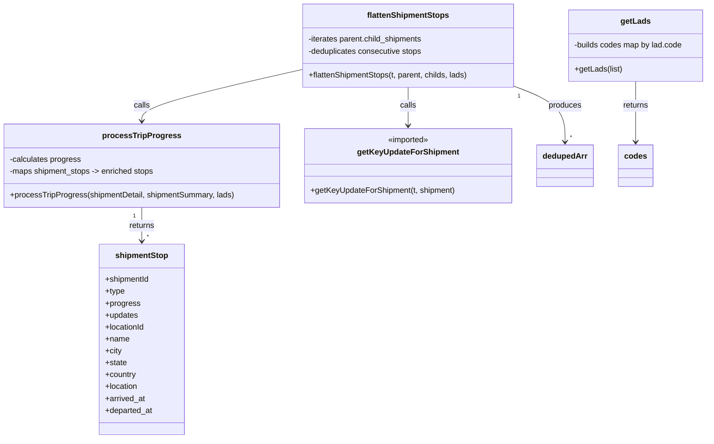

# Diagram: web/portal/src/modules/shipment-detail/trip-utils.js

> Auto-generated by Obscura crawlers

## Mermaid

### SVG

<svg id="container" width="1419.6484375" xmlns="http://www.w3.org/2000/svg" class="classDiagram" height="884" viewBox="0 0 1419.6484375 884" role="graphics-document document" aria-roledescription="class"><g><defs><marker id="container_class-aggregationStart" class="marker aggregation class" refX="18" refY="7" markerWidth="190" markerHeight="240" orient="auto"><path d="M 18,7 L9,13 L1,7 L9,1 Z"></path></marker></defs><defs><marker id="container_class-aggregationEnd" class="marker aggregation class" refX="1" refY="7" markerWidth="20" markerHeight="28" orient="auto"><path d="M 18,7 L9,13 L1,7 L9,1 Z"></path></marker></defs><defs><marker id="container_class-extensionStart" class="marker extension class" refX="18" refY="7" markerWidth="190" markerHeight="240" orient="auto"><path d="M 1,7 L18,13 V 1 Z"></path></marker></defs><defs><marker id="container_class-extensionEnd" class="marker extension class" refX="1" refY="7" markerWidth="20" markerHeight="28" orient="auto"><path d="M 1,1 V 13 L18,7 Z"></path></marker></defs><defs><marker id="container_class-compositionStart" class="marker composition class" refX="18" refY="7" markerWidth="190" markerHeight="240" orient="auto"><path d="M 18,7 L9,13 L1,7 L9,1 Z"></path></marker></defs><defs><marker id="container_class-compositionEnd" class="marker composition class" refX="1" refY="7" markerWidth="20" markerHeight="28" orient="auto"><path d="M 18,7 L9,13 L1,7 L9,1 Z"></path></marker></defs><defs><marker id="container_class-dependencyStart" class="marker dependency class" refX="6" refY="7" markerWidth="190" markerHeight="240" orient="auto"><path d="M 5,7 L9,13 L1,7 L9,1 Z"></path></marker></defs><defs><marker id="container_class-dependencyEnd" class="marker dependency class" refX="13" refY="7" markerWidth="20" markerHeight="28" orient="auto"><path d="M 18,7 L9,13 L14,7 L9,1 Z"></path></marker></defs><defs><marker id="container_class-lollipopStart" class="marker lollipop class" refX="13" refY="7" markerWidth="190" markerHeight="240" orient="auto"><circle stroke="black" fill="transparent" cx="7" cy="7" r="6"></circle></marker></defs><defs><marker id="container_class-lollipopEnd" class="marker lollipop class" refX="1" refY="7" markerWidth="190" markerHeight="240" orient="auto"><circle stroke="black" fill="transparent" cx="7" cy="7" r="6"></circle></marker></defs><g class="root"><g class="clusters"></g><g class="edgePaths"><path d="M285.566,418L285.566,424.167C285.566,430.333,285.566,442.667,285.566,454C285.566,465.333,285.566,475.667,285.566,480.833L285.566,486" id="id_processTripProgress_shipmentStop_1" class="edge-thickness-normal edge-pattern-solid relation" style=";;;" data-edge="true" data-et="edge" data-id="id_processTripProgress_shipmentStop_1" data-points="W3sieCI6Mjg1LjU2NjQwNjI1LCJ5Ijo0MTh9LHsieCI6Mjg1LjU2NjQwNjI1LCJ5Ijo0NTV9LHsieCI6Mjg1LjU2NjQwNjI1LCJ5Ijo0OTJ9XQ==" marker-end="url(#container_class-dependencyEnd)"></path><path d="M605.559,140.734L552.227,152.778C498.895,164.823,392.23,188.911,338.898,206.122C285.566,223.333,285.566,233.667,285.566,238.833L285.566,244" id="id_flattenShipmentStops_processTripProgress_2" class="edge-thickness-normal edge-pattern-solid relation" style=";;;" data-edge="true" data-et="edge" data-id="id_flattenShipmentStops_processTripProgress_2" data-points="W3sieCI6NjA1LjU1ODU5Mzc1LCJ5IjoxNDAuNzMzOTkxNDQwNzE1Njd9LHsieCI6Mjg1LjU2NjQwNjI1LCJ5IjoyMTN9LHsieCI6Mjg1LjU2NjQwNjI1LCJ5IjoyNTB9XQ==" marker-end="url(#container_class-dependencyEnd)"></path><path d="M821.352,176L821.352,182.167C821.352,188.333,821.352,200.667,821.352,213.5C821.352,226.333,821.352,239.667,821.352,246.333L821.352,253" id="id_flattenShipmentStops_getKeyUpdateForShipment_3" class="edge-thickness-normal edge-pattern-solid relation" style=";;;" data-edge="true" data-et="edge" data-id="id_flattenShipmentStops_getKeyUpdateForShipment_3" data-points="W3sieCI6ODIxLjM1MTU2MjUsInkiOjE3Nn0seyJ4Ijo4MjEuMzUxNTYyNSwieSI6MjEzfSx7IngiOjgyMS4zNTE1NjI1LCJ5IjoyNTl9XQ==" marker-end="url(#container_class-dependencyEnd)"></path><path d="M1037.145,175.17L1053.503,181.475C1069.862,187.78,1102.579,200.39,1118.938,218.862C1135.297,237.333,1135.297,261.667,1135.297,273.833L1135.297,286" id="id_flattenShipmentStops_dedupedArr_4" class="edge-thickness-normal edge-pattern-solid relation" style=";;;" data-edge="true" data-et="edge" data-id="id_flattenShipmentStops_dedupedArr_4" data-points="W3sieCI6MTAzNy4xNDQ1MzEyNSwieSI6MTc1LjE3MDM3NDUxNzg1NDkyfSx7IngiOjExMzUuMjk2ODc1LCJ5IjoyMTN9LHsieCI6MTEzNS4yOTY4NzUsInkiOjI5Mn1d" marker-end="url(#container_class-dependencyEnd)"></path><path d="M1274.453,164L1274.453,172.167C1274.453,180.333,1274.453,196.667,1274.453,217C1274.453,237.333,1274.453,261.667,1274.453,273.833L1274.453,286" id="id_getLads_codes_5" class="edge-thickness-normal edge-pattern-solid relation" style=";;;" data-edge="true" data-et="edge" data-id="id_getLads_codes_5" data-points="W3sieCI6MTI3NC40NTMxMjUsInkiOjE2NH0seyJ4IjoxMjc0LjQ1MzEyNSwieSI6MjEzfSx7IngiOjEyNzQuNDUzMTI1LCJ5IjoyOTJ9XQ==" marker-end="url(#container_class-dependencyEnd)"></path></g><g class="edgeLabels"><g class="edgeLabel" transform="translate(285.56640625, 455)"><g class="label" data-id="id_processTripProgress_shipmentStop_1" transform="translate(-26.265625, -12)"><foreignObject width="52.53125" height="24">

returns

</foreignObject></g></g><g class="edgeLabel" transform="translate(285.56640625, 213)"><g class="label" data-id="id_flattenShipmentStops_processTripProgress_2" transform="translate(-16.4453125, -12)"><foreignObject width="32.890625" height="24">

calls

</foreignObject></g></g><g class="edgeLabel" transform="translate(821.3515625, 213)"><g class="label" data-id="id_flattenShipmentStops_getKeyUpdateForShipment_3" transform="translate(-16.4453125, -12)"><foreignObject width="32.890625" height="24">

calls

</foreignObject></g></g><g class="edgeLabel" transform="translate(1135.296875, 213)"><g class="label" data-id="id_flattenShipmentStops_dedupedArr_4" transform="translate(-33.4765625, -12)"><foreignObject width="66.953125" height="24">

produces

</foreignObject></g></g><g class="edgeLabel" transform="translate(1274.453125, 213)"><g class="label" data-id="id_getLads_codes_5" transform="translate(-26.265625, -12)"><foreignObject width="52.53125" height="24">

returns

</foreignObject></g></g><g class="edgeTerminals" transform="translate(270.5664081250001, 435.50000160714285)"><g class="inner" transform="translate(0, 0)"><foreignObject style="width: 9px; height: 12px;">
1
</foreignObject></g></g><g class="edgeTerminals" transform="translate(1048.0792200910548, 195.46033614388077)"><g class="inner" transform="translate(0, 0)"><foreignObject style="width: 9px; height: 12px;">
1
</foreignObject></g></g><g class="edgeTerminals" transform="translate(295.5664081249999, 469.50000160714285)"><g class="inner" transform="translate(0, 0)"></g><foreignObject style="width: 9px; height: 12px;">
*
</foreignObject></g><g class="edgeTerminals" transform="translate(1145.2968774999997, 269.50000214285717)"><g class="inner" transform="translate(0, 0)"></g><foreignObject style="width: 9px; height: 12px;">
*
</foreignObject></g></g><g class="nodes"><g class="node default" id="classId-processTripProgress-0" transform="translate(285.56640625, 334)"><g class="basic label-container"><path d="M-277.56640625 -84 L277.56640625 -84 L277.56640625 84 L-277.56640625 84" stroke="none" stroke-width="0" fill="#ECECFF" style=""></path><path d="M-277.56640625 -84 C-132.64224126591537 -84, 12.281923718169253 -84, 277.56640625 -84 M-277.56640625 -84 C-144.2380070202137 -84, -10.909607790427401 -84, 277.56640625 -84 M277.56640625 -84 C277.56640625 -40.600821904930314, 277.56640625 2.7983561901393728, 277.56640625 84 M277.56640625 -84 C277.56640625 -33.748844234864244, 277.56640625 16.502311530271513, 277.56640625 84 M277.56640625 84 C84.17142478609335 84, -109.22355667781329 84, -277.56640625 84 M277.56640625 84 C106.12547112649074 84, -65.31546399701853 84, -277.56640625 84 M-277.56640625 84 C-277.56640625 42.333213288054445, -277.56640625 0.6664265761088899, -277.56640625 -84 M-277.56640625 84 C-277.56640625 40.76099915674217, -277.56640625 -2.478001686515654, -277.56640625 -84" stroke="#9370DB" stroke-width="1.3" fill="none" stroke-dasharray="0 0" style=""></path></g><g class="annotation-group text" transform="translate(0, -60)"></g><g class="label-group text" transform="translate(-74.2421875, -60)"><g class="label" style="font-weight: bolder" transform="translate(0,-12)"><foreignObject width="148.484375" height="24">

processTripProgress

</foreignObject></g></g><g class="members-group text" transform="translate(-265.56640625, -12)"><g class="label" style="" transform="translate(0,-12)"><foreignObject width="145.234375" height="24">

-calculates progress

</foreignObject></g><g class="label" style="" transform="translate(0,12)"><foreignObject width="296.78125" height="24">

-maps shipment_stops -&gt; enriched stops

</foreignObject></g></g><g class="methods-group text" transform="translate(-265.56640625, 60)"><g class="label" style="" transform="translate(0,-12)"><foreignObject width="456.890625" height="24">

+processTripProgress(shipmentDetail, shipmentSummary, lads)

</foreignObject></g></g><g class="divider" style=""><path d="M-277.56640625 -36 C-79.2162551421043 -36, 119.1338959657914 -36, 277.56640625 -36 M-277.56640625 -36 C-138.38281774507482 -36, 0.8007707598503657 -36, 277.56640625 -36" stroke="#9370DB" stroke-width="1.3" fill="none" stroke-dasharray="0 0" style=""></path></g><g class="divider" style=""><path d="M-277.56640625 36 C-149.82574360424314 36, -22.085080958486287 36, 277.56640625 36 M-277.56640625 36 C-108.10602820055041 36, 61.354349848899176 36, 277.56640625 36" stroke="#9370DB" stroke-width="1.3" fill="none" stroke-dasharray="0 0" style=""></path></g></g><g class="node default" id="classId-flattenShipmentStops-1" transform="translate(821.3515625, 92)"><g class="basic label-container"><path d="M-215.79296875 -84 L215.79296875 -84 L215.79296875 84 L-215.79296875 84" stroke="none" stroke-width="0" fill="#ECECFF" style=""></path><path d="M-215.79296875 -84 C-83.90514607128739 -84, 47.98267660742522 -84, 215.79296875 -84 M-215.79296875 -84 C-65.77870010729731 -84, 84.23556853540538 -84, 215.79296875 -84 M215.79296875 -84 C215.79296875 -48.19346522810845, 215.79296875 -12.386930456216902, 215.79296875 84 M215.79296875 -84 C215.79296875 -38.41469740051308, 215.79296875 7.1706051989738455, 215.79296875 84 M215.79296875 84 C123.6812691735587 84, 31.569569597117408 84, -215.79296875 84 M215.79296875 84 C92.19038162707774 84, -31.412205495844518 84, -215.79296875 84 M-215.79296875 84 C-215.79296875 42.045281905059525, -215.79296875 0.09056381011905046, -215.79296875 -84 M-215.79296875 84 C-215.79296875 46.9834914124889, -215.79296875 9.966982824977805, -215.79296875 -84" stroke="#9370DB" stroke-width="1.3" fill="none" stroke-dasharray="0 0" style=""></path></g><g class="annotation-group text" transform="translate(0, -60)"></g><g class="label-group text" transform="translate(-80.3984375, -60)"><g class="label" style="font-weight: bolder" transform="translate(0,-12)"><foreignObject width="160.796875" height="24">

flattenShipmentStops

</foreignObject></g></g><g class="members-group text" transform="translate(-203.79296875, -12)"><g class="label" style="" transform="translate(0,-12)"><foreignObject width="236.828125" height="24">

-iterates parent.child_shipments

</foreignObject></g><g class="label" style="" transform="translate(0,12)"><foreignObject width="233.90625" height="24">

-deduplicates consecutive stops

</foreignObject></g></g><g class="methods-group text" transform="translate(-203.79296875, 60)"><g class="label" style="" transform="translate(0,-12)"><foreignObject width="327.1875" height="24">

+flattenShipmentStops(t, parent, childs, lads)

</foreignObject></g></g><g class="divider" style=""><path d="M-215.79296875 -36 C-62.91620132720408 -36, 89.96056609559184 -36, 215.79296875 -36 M-215.79296875 -36 C-116.32670793412503 -36, -16.86044711825005 -36, 215.79296875 -36" stroke="#9370DB" stroke-width="1.3" fill="none" stroke-dasharray="0 0" style=""></path></g><g class="divider" style=""><path d="M-215.79296875 36 C-108.53469548770047 36, -1.2764222254009496 36, 215.79296875 36 M-215.79296875 36 C-88.80376137842784 36, 38.18544599314433 36, 215.79296875 36" stroke="#9370DB" stroke-width="1.3" fill="none" stroke-dasharray="0 0" style=""></path></g></g><g class="node default" id="classId-getLads-2" transform="translate(1274.453125, 92)"><g class="basic label-container"><path d="M-137.1953125 -72 L137.1953125 -72 L137.1953125 72 L-137.1953125 72" stroke="none" stroke-width="0" fill="#ECECFF" style=""></path><path d="M-137.1953125 -72 C-79.81719241514384 -72, -22.439072330287672 -72, 137.1953125 -72 M-137.1953125 -72 C-45.5810678880506 -72, 46.033176723898805 -72, 137.1953125 -72 M137.1953125 -72 C137.1953125 -34.54257209989127, 137.1953125 2.9148558002174667, 137.1953125 72 M137.1953125 -72 C137.1953125 -39.79388930982847, 137.1953125 -7.587778619656945, 137.1953125 72 M137.1953125 72 C38.57453594326944 72, -60.04624061346112 72, -137.1953125 72 M137.1953125 72 C68.06261492254657 72, -1.0700826549068552 72, -137.1953125 72 M-137.1953125 72 C-137.1953125 42.762794851000365, -137.1953125 13.525589702000723, -137.1953125 -72 M-137.1953125 72 C-137.1953125 26.486275914331742, -137.1953125 -19.027448171336516, -137.1953125 -72" stroke="#9370DB" stroke-width="1.3" fill="none" stroke-dasharray="0 0" style=""></path></g><g class="annotation-group text" transform="translate(0, -48)"></g><g class="label-group text" transform="translate(-28.8125, -48)"><g class="label" style="font-weight: bolder" transform="translate(0,-12)"><foreignObject width="57.625" height="24">

getLads

</foreignObject></g></g><g class="members-group text" transform="translate(-125.1953125, 0)"><g class="label" style="" transform="translate(0,-12)"><foreignObject width="221.578125" height="24">

-builds codes map by lad.code

</foreignObject></g></g><g class="methods-group text" transform="translate(-125.1953125, 48)"><g class="label" style="" transform="translate(0,-12)"><foreignObject width="96.921875" height="24">

+getLads(list)

</foreignObject></g></g><g class="divider" style=""><path d="M-137.1953125 -24 C-36.78652230756556 -24, 63.622267884868876 -24, 137.1953125 -24 M-137.1953125 -24 C-57.02752312105427 -24, 23.140266257891454 -24, 137.1953125 -24" stroke="#9370DB" stroke-width="1.3" fill="none" stroke-dasharray="0 0" style=""></path></g><g class="divider" style=""><path d="M-137.1953125 24 C-36.74569544894068 24, 63.70392160211864 24, 137.1953125 24 M-137.1953125 24 C-51.39528271790283 24, 34.40474706419434 24, 137.1953125 24" stroke="#9370DB" stroke-width="1.3" fill="none" stroke-dasharray="0 0" style=""></path></g></g><g class="node default" id="classId-getKeyUpdateForShipment-3" transform="translate(821.3515625, 334)"><g class="basic label-container"><path d="M-208.21875 -75 L208.21875 -75 L208.21875 75 L-208.21875 75" stroke="none" stroke-width="0" fill="#ECECFF" style=""></path><path d="M-208.21875 -75 C-113.8285098751852 -75, -19.43826975037041 -75, 208.21875 -75 M-208.21875 -75 C-120.25889124700402 -75, -32.29903249400803 -75, 208.21875 -75 M208.21875 -75 C208.21875 -34.178781555074295, 208.21875 6.64243688985141, 208.21875 75 M208.21875 -75 C208.21875 -41.08020007653029, 208.21875 -7.1604001530605785, 208.21875 75 M208.21875 75 C60.347829514558555 75, -87.52309097088289 75, -208.21875 75 M208.21875 75 C98.88364243244138 75, -10.451465135117246 75, -208.21875 75 M-208.21875 75 C-208.21875 21.590891980784868, -208.21875 -31.818216038430265, -208.21875 -75 M-208.21875 75 C-208.21875 31.39396333786967, -208.21875 -12.212073324260658, -208.21875 -75" stroke="#9370DB" stroke-width="1.3" fill="none" stroke-dasharray="0 0" style=""></path></g><g class="annotation-group text" transform="translate(-42.671875, -51)"><g class="label" style="" transform="translate(0,-12)"><foreignObject width="85.34375" height="24">

«imported»

</foreignObject></g></g><g class="label-group text" transform="translate(-98.28125, -27)"><g class="label" style="font-weight: bolder" transform="translate(0,-12)"><foreignObject width="196.5625" height="24">

getKeyUpdateForShipment

</foreignObject></g></g><g class="members-group text" transform="translate(-196.21875, 21)"></g><g class="methods-group text" transform="translate(-196.21875, 51)"><g class="label" style="" transform="translate(0,-12)"><foreignObject width="294.15625" height="24">

+getKeyUpdateForShipment(t, shipment)

</foreignObject></g></g><g class="divider" style=""><path d="M-208.21875 -3 C-114.61639160198841 -3, -21.014033203976823 -3, 208.21875 -3 M-208.21875 -3 C-104.93977266469867 -3, -1.660795329397331 -3, 208.21875 -3" stroke="#9370DB" stroke-width="1.3" fill="none" stroke-dasharray="0 0" style=""></path></g><g class="divider" style=""><path d="M-208.21875 21 C-106.6759187667626 21, -5.133087533525213 21, 208.21875 21 M-208.21875 21 C-80.50075523147565 21, 47.2172395370487 21, 208.21875 21" stroke="#9370DB" stroke-width="1.3" fill="none" stroke-dasharray="0 0" style=""></path></g></g><g class="node default" id="classId-shipmentStop-4" transform="translate(285.56640625, 684)"><g class="basic label-container"><path d="M-86.08984375 -192 L86.08984375 -192 L86.08984375 192 L-86.08984375 192" stroke="none" stroke-width="0" fill="#ECECFF" style=""></path><path d="M-86.08984375 -192 C-18.982403330466227 -192, 48.12503708906755 -192, 86.08984375 -192 M-86.08984375 -192 C-37.728971458740745 -192, 10.631900832518511 -192, 86.08984375 -192 M86.08984375 -192 C86.08984375 -83.4283129554936, 86.08984375 25.14337408901281, 86.08984375 192 M86.08984375 -192 C86.08984375 -55.20296646819918, 86.08984375 81.59406706360164, 86.08984375 192 M86.08984375 192 C19.77802029828166 192, -46.53380315343668 192, -86.08984375 192 M86.08984375 192 C50.680537060556645 192, 15.27123037111329 192, -86.08984375 192 M-86.08984375 192 C-86.08984375 110.64470808663029, -86.08984375 29.289416173260577, -86.08984375 -192 M-86.08984375 192 C-86.08984375 67.66620658801833, -86.08984375 -56.66758682396335, -86.08984375 -192" stroke="#9370DB" stroke-width="1.3" fill="none" stroke-dasharray="0 0" style=""></path></g><g class="annotation-group text" transform="translate(0, -168)"></g><g class="label-group text" transform="translate(-51.3671875, -168)"><g class="label" style="font-weight: bolder" transform="translate(0,-12)"><foreignObject width="102.734375" height="24">

shipmentStop

</foreignObject></g></g><g class="members-group text" transform="translate(-74.08984375, -120)"><g class="label" style="" transform="translate(0,-12)"><foreignObject width="90.734375" height="24">

+shipmentId

</foreignObject></g><g class="label" style="" transform="translate(0,12)"><foreignObject width="39.703125" height="24">

+type

</foreignObject></g><g class="label" style="" transform="translate(0,36)"><foreignObject width="70.0625" height="24">

+progress

</foreignObject></g><g class="label" style="" transform="translate(0,60)"><foreignObject width="66.8125" height="24">

+updates

</foreignObject></g><g class="label" style="" transform="translate(0,84)"><foreignObject width="81.4375" height="24">

+locationId

</foreignObject></g><g class="label" style="" transform="translate(0,108)"><foreignObject width="48.5" height="24">

+name

</foreignObject></g><g class="label" style="" transform="translate(0,132)"><foreignObject width="33.71875" height="24">

+city

</foreignObject></g><g class="label" style="" transform="translate(0,156)"><foreignObject width="44.09375" height="24">

+state

</foreignObject></g><g class="label" style="" transform="translate(0,180)"><foreignObject width="63.171875" height="24">

+country

</foreignObject></g><g class="label" style="" transform="translate(0,204)"><foreignObject width="67.140625" height="24">

+location

</foreignObject></g><g class="label" style="" transform="translate(0,228)"><foreignObject width="81.890625" height="24">

+arrived_at

</foreignObject></g><g class="label" style="" transform="translate(0,252)"><foreignObject width="96.8125" height="24">

+departed_at

</foreignObject></g></g><g class="methods-group text" transform="translate(-74.08984375, 192)"></g><g class="divider" style=""><path d="M-86.08984375 -144 C-42.643001231476546 -144, 0.8038412870469074 -144, 86.08984375 -144 M-86.08984375 -144 C-17.763722772030803 -144, 50.56239820593839 -144, 86.08984375 -144" stroke="#9370DB" stroke-width="1.3" fill="none" stroke-dasharray="0 0" style=""></path></g><g class="divider" style=""><path d="M-86.08984375 168 C-20.120749145913678 168, 45.848345458172645 168, 86.08984375 168 M-86.08984375 168 C-32.051818574451076 168, 21.986206601097848 168, 86.08984375 168" stroke="#9370DB" stroke-width="1.3" fill="none" stroke-dasharray="0 0" style=""></path></g></g><g class="node default" id="classId-dedupedArr-5" transform="translate(1135.296875, 334)"><g class="basic label-container"><path d="M-55.7265625 -42 L55.7265625 -42 L55.7265625 42 L-55.7265625 42" stroke="none" stroke-width="0" fill="#ECECFF" style=""></path><path d="M-55.7265625 -42 C-24.8097274086392 -42, 6.1071076827215975 -42, 55.7265625 -42 M-55.7265625 -42 C-31.98984343975322 -42, -8.253124379506438 -42, 55.7265625 -42 M55.7265625 -42 C55.7265625 -18.577740608944723, 55.7265625 4.844518782110555, 55.7265625 42 M55.7265625 -42 C55.7265625 -21.669372159059645, 55.7265625 -1.3387443181192893, 55.7265625 42 M55.7265625 42 C20.792251600761823 42, -14.142059298476354 42, -55.7265625 42 M55.7265625 42 C20.065754198713037 42, -15.595054102573926 42, -55.7265625 42 M-55.7265625 42 C-55.7265625 11.34228600061953, -55.7265625 -19.31542799876094, -55.7265625 -42 M-55.7265625 42 C-55.7265625 10.059481355148876, -55.7265625 -21.88103728970225, -55.7265625 -42" stroke="#9370DB" stroke-width="1.3" fill="none" stroke-dasharray="0 0" style=""></path></g><g class="annotation-group text" transform="translate(0, -18)"></g><g class="label-group text" transform="translate(-43.7265625, -18)"><g class="label" style="font-weight: bolder" transform="translate(0,-12)"><foreignObject width="87.453125" height="24">

dedupedArr

</foreignObject></g></g><g class="members-group text" transform="translate(-43.7265625, 30)"></g><g class="methods-group text" transform="translate(-43.7265625, 60)"></g><g class="divider" style=""><path d="M-55.7265625 6 C-24.614990098731084 6, 6.496582302537831 6, 55.7265625 6 M-55.7265625 6 C-25.624674599488376 6, 4.477213301023248 6, 55.7265625 6" stroke="#9370DB" stroke-width="1.3" fill="none" stroke-dasharray="0 0" style=""></path></g><g class="divider" style=""><path d="M-55.7265625 24 C-15.064898858905359 24, 25.596764782189283 24, 55.7265625 24 M-55.7265625 24 C-14.583750792572935 24, 26.55906091485413 24, 55.7265625 24" stroke="#9370DB" stroke-width="1.3" fill="none" stroke-dasharray="0 0" style=""></path></g></g><g class="node default" id="classId-codes-6" transform="translate(1274.453125, 334)"><g class="basic label-container"><path d="M-33.4296875 -42 L33.4296875 -42 L33.4296875 42 L-33.4296875 42" stroke="none" stroke-width="0" fill="#ECECFF" style=""></path><path d="M-33.4296875 -42 C-6.871299124863711 -42, 19.687089250272578 -42, 33.4296875 -42 M-33.4296875 -42 C-12.525754473899244 -42, 8.378178552201511 -42, 33.4296875 -42 M33.4296875 -42 C33.4296875 -9.518662975998147, 33.4296875 22.962674048003706, 33.4296875 42 M33.4296875 -42 C33.4296875 -22.71918237170277, 33.4296875 -3.4383647434055433, 33.4296875 42 M33.4296875 42 C18.43593120160877 42, 3.4421749032175413 42, -33.4296875 42 M33.4296875 42 C11.589504540873936 42, -10.250678418252129 42, -33.4296875 42 M-33.4296875 42 C-33.4296875 22.87868492144066, -33.4296875 3.7573698428813174, -33.4296875 -42 M-33.4296875 42 C-33.4296875 22.135525029362867, -33.4296875 2.2710500587257343, -33.4296875 -42" stroke="#9370DB" stroke-width="1.3" fill="none" stroke-dasharray="0 0" style=""></path></g><g class="annotation-group text" transform="translate(0, -18)"></g><g class="label-group text" transform="translate(-21.4296875, -18)"><g class="label" style="font-weight: bolder" transform="translate(0,-12)"><foreignObject width="42.859375" height="24">

codes

</foreignObject></g></g><g class="members-group text" transform="translate(-21.4296875, 30)"></g><g class="methods-group text" transform="translate(-21.4296875, 60)"></g><g class="divider" style=""><path d="M-33.4296875 6 C-12.654064443574008 6, 8.121558612851985 6, 33.4296875 6 M-33.4296875 6 C-14.276037376428597 6, 4.8776127471428055 6, 33.4296875 6" stroke="#9370DB" stroke-width="1.3" fill="none" stroke-dasharray="0 0" style=""></path></g><g class="divider" style=""><path d="M-33.4296875 24 C-12.729752020818403 24, 7.970183458363195 24, 33.4296875 24 M-33.4296875 24 C-7.5670604945112 24, 18.2955665109776 24, 33.4296875 24" stroke="#9370DB" stroke-width="1.3" fill="none" stroke-dasharray="0 0" style=""></path></g></g></g></g></g></svg>
