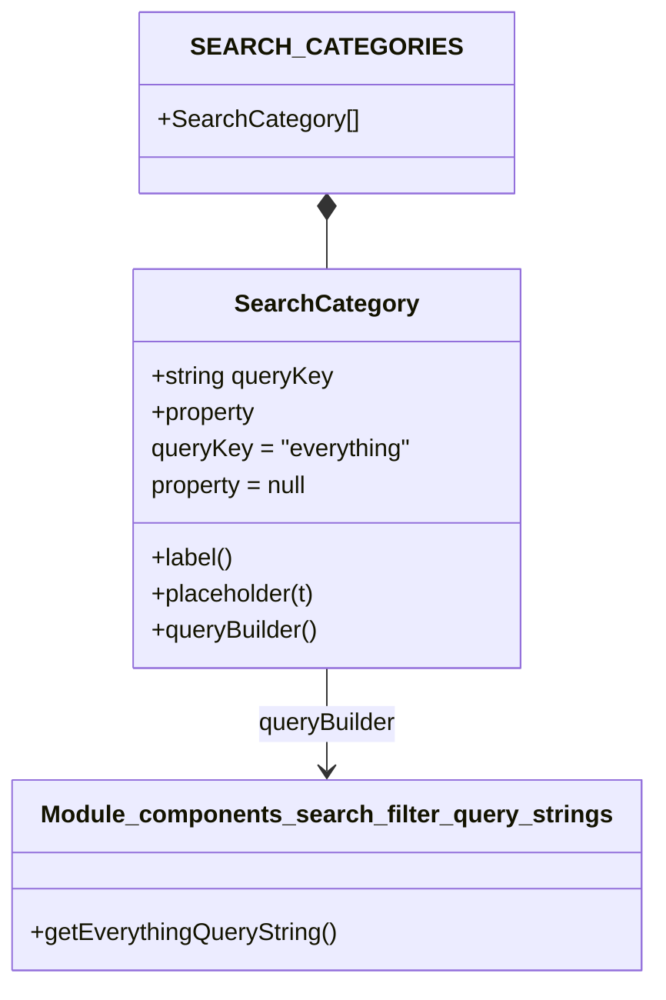

# Diagram: web/portal/src/modules/users/UsersSearch.searchOptions.js

> Auto-generated by Obscura crawlers

## Mermaid

### SVG

<svg id="container" width="422.5859375" xmlns="http://www.w3.org/2000/svg" class="classDiagram" height="650" viewBox="0 0 422.5859375 650" role="graphics-document document" aria-roledescription="class"><g><defs><marker id="container_class-aggregationStart" class="marker aggregation class" refX="18" refY="7" markerWidth="190" markerHeight="240" orient="auto"><path d="M 18,7 L9,13 L1,7 L9,1 Z"></path></marker></defs><defs><marker id="container_class-aggregationEnd" class="marker aggregation class" refX="1" refY="7" markerWidth="20" markerHeight="28" orient="auto"><path d="M 18,7 L9,13 L1,7 L9,1 Z"></path></marker></defs><defs><marker id="container_class-extensionStart" class="marker extension class" refX="18" refY="7" markerWidth="190" markerHeight="240" orient="auto"><path d="M 1,7 L18,13 V 1 Z"></path></marker></defs><defs><marker id="container_class-extensionEnd" class="marker extension class" refX="1" refY="7" markerWidth="20" markerHeight="28" orient="auto"><path d="M 1,1 V 13 L18,7 Z"></path></marker></defs><defs><marker id="container_class-compositionStart" class="marker composition class" refX="18" refY="7" markerWidth="190" markerHeight="240" orient="auto"><path d="M 18,7 L9,13 L1,7 L9,1 Z"></path></marker></defs><defs><marker id="container_class-compositionEnd" class="marker composition class" refX="1" refY="7" markerWidth="20" markerHeight="28" orient="auto"><path d="M 18,7 L9,13 L1,7 L9,1 Z"></path></marker></defs><defs><marker id="container_class-dependencyStart" class="marker dependency class" refX="6" refY="7" markerWidth="190" markerHeight="240" orient="auto"><path d="M 5,7 L9,13 L1,7 L9,1 Z"></path></marker></defs><defs><marker id="container_class-dependencyEnd" class="marker dependency class" refX="13" refY="7" markerWidth="20" markerHeight="28" orient="auto"><path d="M 18,7 L9,13 L14,7 L9,1 Z"></path></marker></defs><defs><marker id="container_class-lollipopStart" class="marker lollipop class" refX="13" refY="7" markerWidth="190" markerHeight="240" orient="auto"><circle stroke="black" fill="transparent" cx="7" cy="7" r="6"></circle></marker></defs><defs><marker id="container_class-lollipopEnd" class="marker lollipop class" refX="1" refY="7" markerWidth="190" markerHeight="240" orient="auto"><circle stroke="black" fill="transparent" cx="7" cy="7" r="6"></circle></marker></defs><g class="root"><g class="clusters"></g><g class="edgePaths"><path d="M211.293,145.25L211.293,146.542C211.293,147.833,211.293,150.417,211.293,155.875C211.293,161.333,211.293,169.667,211.293,173.833L211.293,178" id="id_SEARCH_CATEGORIES_SearchCategory_1" class="edge-thickness-normal edge-pattern-solid relation" style=";;;" data-edge="true" data-et="edge" data-id="id_SEARCH_CATEGORIES_SearchCategory_1" data-points="W3sieCI6MjExLjI5Mjk2ODc1LCJ5IjoxMjh9LHsieCI6MjExLjI5Mjk2ODc1LCJ5IjoxNTN9LHsieCI6MjExLjI5Mjk2ODc1LCJ5IjoxNzh9XQ==" marker-start="url(#container_class-compositionStart)"></path><path d="M211.293,442L211.293,448.167C211.293,454.333,211.293,466.667,211.293,478C211.293,489.333,211.293,499.667,211.293,504.833L211.293,510" id="id_SearchCategory_Module_components_search_filter_query_strings_2" class="edge-thickness-normal edge-pattern-solid relation" style=";;;" data-edge="true" data-et="edge" data-id="id_SearchCategory_Module_components_search_filter_query_strings_2" data-points="W3sieCI6MjExLjI5Mjk2ODc1LCJ5Ijo0NDJ9LHsieCI6MjExLjI5Mjk2ODc1LCJ5Ijo0Nzl9LHsieCI6MjExLjI5Mjk2ODc1LCJ5Ijo1MTZ9XQ==" marker-end="url(#container_class-dependencyEnd)"></path></g><g class="edgeLabels"><g class="edgeLabel"><g class="label" data-id="id_SEARCH_CATEGORIES_SearchCategory_1" transform="translate(0, 0)"><foreignObject width="0" height="0">

</foreignObject></g></g><g class="edgeLabel" transform="translate(211.29296875, 479)"><g class="label" data-id="id_SearchCategory_Module_components_search_filter_query_strings_2" transform="translate(-47.140625, -12)"><foreignObject width="94.28125" height="24">

queryBuilder

</foreignObject></g></g></g><g class="nodes"><g class="node default" id="classId-Module_components_search_filter_query_strings-0" transform="translate(211.29296875, 579)"><g class="basic label-container"><path d="M-203.29296875 -63 L203.29296875 -63 L203.29296875 63 L-203.29296875 63" stroke="none" stroke-width="0" fill="#ECECFF" style=""></path><path d="M-203.29296875 -63 C-48.178638808796165 -63, 106.93569113240767 -63, 203.29296875 -63 M-203.29296875 -63 C-106.35439918692501 -63, -9.415829623850016 -63, 203.29296875 -63 M203.29296875 -63 C203.29296875 -15.140705232459403, 203.29296875 32.71858953508119, 203.29296875 63 M203.29296875 -63 C203.29296875 -36.89253185734901, 203.29296875 -10.785063714698033, 203.29296875 63 M203.29296875 63 C57.27519031411725 63, -88.7425881217655 63, -203.29296875 63 M203.29296875 63 C119.33558052975627 63, 35.37819230951254 63, -203.29296875 63 M-203.29296875 63 C-203.29296875 26.251899306686354, -203.29296875 -10.496201386627291, -203.29296875 -63 M-203.29296875 63 C-203.29296875 30.094144599116284, -203.29296875 -2.8117108017674326, -203.29296875 -63" stroke="#9370DB" stroke-width="1.3" fill="none" stroke-dasharray="0 0" style=""></path></g><g class="annotation-group text" transform="translate(0, -39)"></g><g class="label-group text" transform="translate(-179.4765625, -39)"><g class="label" style="font-weight: bolder" transform="translate(0,-12)"><foreignObject width="358.953125" height="24">

Module_components_search_filter_query_strings

</foreignObject></g></g><g class="members-group text" transform="translate(-191.29296875, 9)"></g><g class="methods-group text" transform="translate(-191.29296875, 39)"><g class="label" style="" transform="translate(0,-12)"><foreignObject width="203.109375" height="24">

+getEverythingQueryString()

</foreignObject></g></g><g class="divider" style=""><path d="M-203.29296875 -15 C-88.73268025975071 -15, 25.827608230498583 -15, 203.29296875 -15 M-203.29296875 -15 C-77.90098852253661 -15, 47.490991704926785 -15, 203.29296875 -15" stroke="#9370DB" stroke-width="1.3" fill="none" stroke-dasharray="0 0" style=""></path></g><g class="divider" style=""><path d="M-203.29296875 9 C-100.87793519687483 9, 1.5370983562503397 9, 203.29296875 9 M-203.29296875 9 C-109.1795360050728 9, -15.06610326014561 9, 203.29296875 9" stroke="#9370DB" stroke-width="1.3" fill="none" stroke-dasharray="0 0" style=""></path></g></g><g class="node default" id="classId-SearchCategory-1" transform="translate(211.29296875, 310)"><g class="basic label-container"><path d="M-127.1484375 -132 L127.1484375 -132 L127.1484375 132 L-127.1484375 132" stroke="none" stroke-width="0" fill="#ECECFF" style=""></path><path d="M-127.1484375 -132 C-44.9993251877201 -132, 37.14978712455979 -132, 127.1484375 -132 M-127.1484375 -132 C-56.63990624069643 -132, 13.868625018607133 -132, 127.1484375 -132 M127.1484375 -132 C127.1484375 -61.00426224306601, 127.1484375 9.991475513867982, 127.1484375 132 M127.1484375 -132 C127.1484375 -44.087119709989366, 127.1484375 43.82576058002127, 127.1484375 132 M127.1484375 132 C64.98339653006525 132, 2.8183555601304846 132, -127.1484375 132 M127.1484375 132 C68.98364128511196 132, 10.81884507022393 132, -127.1484375 132 M-127.1484375 132 C-127.1484375 47.437056521303546, -127.1484375 -37.12588695739291, -127.1484375 -132 M-127.1484375 132 C-127.1484375 66.52051711830092, -127.1484375 1.0410342366018313, -127.1484375 -132" stroke="#9370DB" stroke-width="1.3" fill="none" stroke-dasharray="0 0" style=""></path></g><g class="annotation-group text" transform="translate(0, -108)"></g><g class="label-group text" transform="translate(-57.234375, -108)"><g class="label" style="font-weight: bolder" transform="translate(0,-12)"><foreignObject width="114.46875" height="24">

SearchCategory

</foreignObject></g></g><g class="members-group text" transform="translate(-115.1484375, -60)"><g class="label" style="" transform="translate(0,-12)"><foreignObject width="121.234375" height="24">

+string queryKey

</foreignObject></g><g class="label" style="" transform="translate(0,12)"><foreignObject width="70.5" height="24">

+property

</foreignObject></g><g class="label" style="" transform="translate(0,36)"><foreignObject width="173.0625" height="24">

queryKey = "everything"

</foreignObject></g><g class="label" style="" transform="translate(0,60)"><foreignObject width="107.0625" height="24">

property = null

</foreignObject></g></g><g class="methods-group text" transform="translate(-115.1484375, 60)"><g class="label" style="" transform="translate(0,-12)"><foreignObject width="54.578125" height="24">

+label()

</foreignObject></g><g class="label" style="" transform="translate(0,12)"><foreignObject width="110.796875" height="24">

+placeholder(t)

</foreignObject></g><g class="label" style="" transform="translate(0,36)"><foreignObject width="112.625" height="24">

+queryBuilder()

</foreignObject></g></g><g class="divider" style=""><path d="M-127.1484375 -84 C-50.409284442046754 -84, 26.32986861590649 -84, 127.1484375 -84 M-127.1484375 -84 C-33.14822886253802 -84, 60.85197977492396 -84, 127.1484375 -84" stroke="#9370DB" stroke-width="1.3" fill="none" stroke-dasharray="0 0" style=""></path></g><g class="divider" style=""><path d="M-127.1484375 36 C-33.96752034568853 36, 59.213396808622946 36, 127.1484375 36 M-127.1484375 36 C-52.31570082413924 36, 22.517035851721516 36, 127.1484375 36" stroke="#9370DB" stroke-width="1.3" fill="none" stroke-dasharray="0 0" style=""></path></g></g><g class="node default" id="classId-SEARCH_CATEGORIES-2" transform="translate(211.29296875, 68)"><g class="basic label-container"><path d="M-114.84765625 -60 L114.84765625 -60 L114.84765625 60 L-114.84765625 60" stroke="none" stroke-width="0" fill="#ECECFF" style=""></path><path d="M-114.84765625 -60 C-50.586888602803086 -60, 13.673879044393829 -60, 114.84765625 -60 M-114.84765625 -60 C-38.45837888538715 -60, 37.930898479225704 -60, 114.84765625 -60 M114.84765625 -60 C114.84765625 -32.00595366321487, 114.84765625 -4.0119073264297285, 114.84765625 60 M114.84765625 -60 C114.84765625 -20.755892863121574, 114.84765625 18.488214273756853, 114.84765625 60 M114.84765625 60 C38.77115075128019 60, -37.30535474743962 60, -114.84765625 60 M114.84765625 60 C24.336699746592885 60, -66.17425675681423 60, -114.84765625 60 M-114.84765625 60 C-114.84765625 22.002951726083907, -114.84765625 -15.994096547832186, -114.84765625 -60 M-114.84765625 60 C-114.84765625 16.498274505989144, -114.84765625 -27.00345098802171, -114.84765625 -60" stroke="#9370DB" stroke-width="1.3" fill="none" stroke-dasharray="0 0" style=""></path></g><g class="annotation-group text" transform="translate(0, -36)"></g><g class="label-group text" transform="translate(-76.1171875, -36)"><g class="label" style="font-weight: bolder" transform="translate(0,-12)"><foreignObject width="152.234375" height="24">

SEARCH_CATEGORIES

</foreignObject></g></g><g class="members-group text" transform="translate(-102.84765625, 12)"><g class="label" style="" transform="translate(0,-12)"><foreignObject width="129.578125" height="24">

+SearchCategory[]

</foreignObject></g></g><g class="methods-group text" transform="translate(-102.84765625, 60)"></g><g class="divider" style=""><path d="M-114.84765625 -12 C-51.28427035378373 -12, 12.279115542432535 -12, 114.84765625 -12 M-114.84765625 -12 C-62.03111860690502 -12, -9.214580963810036 -12, 114.84765625 -12" stroke="#9370DB" stroke-width="1.3" fill="none" stroke-dasharray="0 0" style=""></path></g><g class="divider" style=""><path d="M-114.84765625 36 C-34.6936279812935 36, 45.460400287412995 36, 114.84765625 36 M-114.84765625 36 C-29.13583646969289 36, 56.57598331061422 36, 114.84765625 36" stroke="#9370DB" stroke-width="1.3" fill="none" stroke-dasharray="0 0" style=""></path></g></g></g></g></g></svg>
