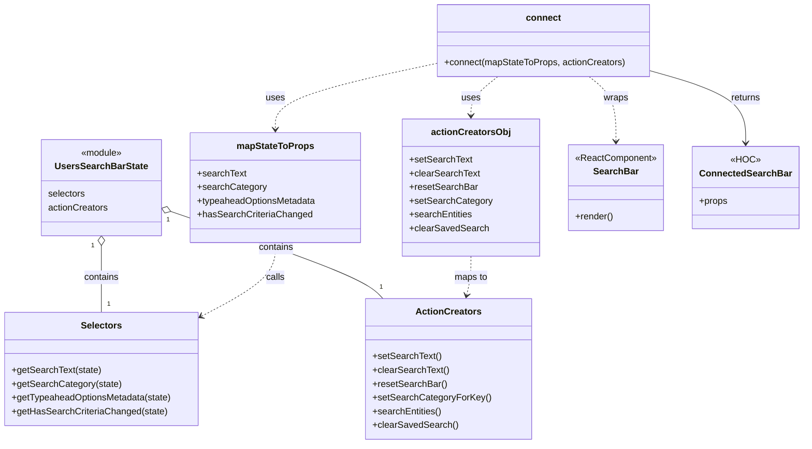

# Diagram: web/portal/src/modules/users/UsersSearchBarContainer.js

> Auto-generated by Obscura crawlers

## Mermaid

### SVG

<svg id="container" width="1383.048828125" xmlns="http://www.w3.org/2000/svg" class="classDiagram" height="776" viewBox="0 0 1383.048828125 776" role="graphics-document document" aria-roledescription="class"><g><defs><marker id="container_class-aggregationStart" class="marker aggregation class" refX="18" refY="7" markerWidth="190" markerHeight="240" orient="auto"><path d="M 18,7 L9,13 L1,7 L9,1 Z"></path></marker></defs><defs><marker id="container_class-aggregationEnd" class="marker aggregation class" refX="1" refY="7" markerWidth="20" markerHeight="28" orient="auto"><path d="M 18,7 L9,13 L1,7 L9,1 Z"></path></marker></defs><defs><marker id="container_class-extensionStart" class="marker extension class" refX="18" refY="7" markerWidth="190" markerHeight="240" orient="auto"><path d="M 1,7 L18,13 V 1 Z"></path></marker></defs><defs><marker id="container_class-extensionEnd" class="marker extension class" refX="1" refY="7" markerWidth="20" markerHeight="28" orient="auto"><path d="M 1,1 V 13 L18,7 Z"></path></marker></defs><defs><marker id="container_class-compositionStart" class="marker composition class" refX="18" refY="7" markerWidth="190" markerHeight="240" orient="auto"><path d="M 18,7 L9,13 L1,7 L9,1 Z"></path></marker></defs><defs><marker id="container_class-compositionEnd" class="marker composition class" refX="1" refY="7" markerWidth="20" markerHeight="28" orient="auto"><path d="M 18,7 L9,13 L1,7 L9,1 Z"></path></marker></defs><defs><marker id="container_class-dependencyStart" class="marker dependency class" refX="6" refY="7" markerWidth="190" markerHeight="240" orient="auto"><path d="M 5,7 L9,13 L1,7 L9,1 Z"></path></marker></defs><defs><marker id="container_class-dependencyEnd" class="marker dependency class" refX="13" refY="7" markerWidth="20" markerHeight="28" orient="auto"><path d="M 18,7 L9,13 L14,7 L9,1 Z"></path></marker></defs><defs><marker id="container_class-lollipopStart" class="marker lollipop class" refX="13" refY="7" markerWidth="190" markerHeight="240" orient="auto"><circle stroke="black" fill="transparent" cx="7" cy="7" r="6"></circle></marker></defs><defs><marker id="container_class-lollipopEnd" class="marker lollipop class" refX="1" refY="7" markerWidth="190" markerHeight="240" orient="auto"><circle stroke="black" fill="transparent" cx="7" cy="7" r="6"></circle></marker></defs><g class="root"><g class="clusters"></g><g class="edgePaths"><path d="M177.453,429.25L177.453,438.542C177.453,447.833,177.453,466.417,177.453,485.875C177.453,505.333,177.453,525.667,177.453,535.833L177.453,546" id="id_UsersSearchBarState_Selectors_1" class="edge-thickness-normal edge-pattern-solid relation" style=";;;" data-edge="true" data-et="edge" data-id="id_UsersSearchBarState_Selectors_1" data-points="W3sieCI6MTc3LjQ1MzEyNSwieSI6NDEyfSx7IngiOjE3Ny40NTMxMjUsInkiOjQ4NX0seyJ4IjoxNzcuNDUzMTI1LCJ5Ijo1NDZ9XQ==" marker-start="url(#container_class-aggregationStart)"></path><path d="M296.914,369.351L352.599,388.626C408.283,407.901,519.652,446.45,580.954,471.892C642.256,497.333,653.491,509.667,659.109,515.833L664.726,522" id="id_UsersSearchBarState_ActionCreators_2" class="edge-thickness-normal edge-pattern-solid relation" style=";;;" data-edge="true" data-et="edge" data-id="id_UsersSearchBarState_ActionCreators_2" data-points="W3sieCI6MjgwLjYxMzI4MTI1LCJ5IjozNjMuNzA4Mjc2ODE1MzU3NH0seyJ4Ijo2MzEuMDIxNDg0Mzc1LCJ5Ijo0ODV9LHsieCI6NjY0LjcyNjE3MTg3NSwieSI6NTIyfV0=" marker-start="url(#container_class-aggregationStart)"></path><path d="M479.813,424L479.813,434.167C479.813,444.333,479.813,464.667,458.545,486.087C437.278,507.508,394.744,530.016,373.477,541.27L352.21,552.524" id="id_mapStateToProps_Selectors_3" class="edge-thickness-normal edge-pattern-dashed relation" style=";;;" data-edge="true" data-et="edge" data-id="id_mapStateToProps_Selectors_3" data-points="W3sieCI6NDc5LjgxMjUsInkiOjQyNH0seyJ4Ijo0NzkuODEyNSwieSI6NDg1fSx7IngiOjM0Ni45MDYyNSwieSI6NTU1LjMzMDIxNTQ5MjczOTR9XQ==" marker-end="url(#container_class-dependencyEnd)"></path><path d="M816.846,448L816.846,454.167C816.846,460.333,816.846,472.667,815.544,484.03C814.243,495.393,811.639,505.787,810.338,510.983L809.036,516.18" id="id_actionCreatorsObj_ActionCreators_4" class="edge-thickness-normal edge-pattern-dashed relation" style=";;;" data-edge="true" data-et="edge" data-id="id_actionCreatorsObj_ActionCreators_4" data-points="W3sieCI6ODE2Ljg0NTcwMzEyNSwieSI6NDQ4fSx7IngiOjgxNi44NDU3MDMxMjUsInkiOjQ4NX0seyJ4Ijo4MDcuNTc4NTQwMDM5MDYyNSwieSI6NTIyfV0=" marker-end="url(#container_class-dependencyEnd)"></path><path d="M756.787,110.996L710.625,120.997C664.462,130.998,572.137,150.999,525.975,170.166C479.813,189.333,479.813,207.667,479.813,216.833L479.813,226" id="id_connect_mapStateToProps_5" class="edge-thickness-normal edge-pattern-dashed relation" style=";;;" data-edge="true" data-et="edge" data-id="id_connect_mapStateToProps_5" data-points="W3sieCI6NzU2Ljc4NzEwOTM3NSwieSI6MTEwLjk5NjI3NjUwMzQ2NzV9LHsieCI6NDc5LjgxMjUsInkiOjE3MX0seyJ4Ijo0NzkuODEyNSwieSI6MjMyfV0=" marker-end="url(#container_class-dependencyEnd)"></path><path d="M862.934,134L855.252,140.167C847.571,146.333,832.208,158.667,824.527,170C816.846,181.333,816.846,191.667,816.846,196.833L816.846,202" id="id_connect_actionCreatorsObj_6" class="edge-thickness-normal edge-pattern-dashed relation" style=";;;" data-edge="true" data-et="edge" data-id="id_connect_actionCreatorsObj_6" data-points="W3sieCI6ODYyLjkzMzgyODEyNSwieSI6MTM0fSx7IngiOjgxNi44NDU3MDMxMjUsInkiOjE3MX0seyJ4Ijo4MTYuODQ1NzAzMTI1LCJ5IjoyMDh9XQ==" marker-end="url(#container_class-dependencyEnd)"></path><path d="M1019.883,134L1027.564,140.167C1035.245,146.333,1050.608,158.667,1058.289,177.5C1065.971,196.333,1065.971,221.667,1065.971,234.333L1065.971,247" id="id_connect_SearchBar_7" class="edge-thickness-normal edge-pattern-dashed relation" style=";;;" data-edge="true" data-et="edge" data-id="id_connect_SearchBar_7" data-points="W3sieCI6MTAxOS44ODI1NzgxMjUsInkiOjEzNH0seyJ4IjoxMDY1Ljk3MDcwMzEyNSwieSI6MTcxfSx7IngiOjEwNjUuOTcwNzAzMTI1LCJ5IjoyNTN9XQ==" marker-end="url(#container_class-dependencyEnd)"></path><path d="M1126.029,124.413L1152.867,132.177C1179.705,139.942,1233.381,155.471,1260.219,176.402C1287.057,197.333,1287.057,223.667,1287.057,236.833L1287.057,250" id="id_connect_ConnectedSearchBar_8" class="edge-thickness-normal edge-pattern-solid relation" style=";;;" data-edge="true" data-et="edge" data-id="id_connect_ConnectedSearchBar_8" data-points="W3sieCI6MTEyNi4wMjkyOTY4NzUsInkiOjEyNC40MTI5NjkyODMyNzY0NX0seyJ4IjoxMjg3LjA1NjY0MDYyNSwieSI6MTcxfSx7IngiOjEyODcuMDU2NjQwNjI1LCJ5IjoyNTZ9XQ==" marker-end="url(#container_class-dependencyEnd)"></path></g><g class="edgeLabels"><g class="edgeLabel" transform="translate(177.453125, 485)"><g class="label" data-id="id_UsersSearchBarState_Selectors_1" transform="translate(-30.890625, -12)"><foreignObject width="61.78125" height="24">

contains

</foreignObject></g></g><g class="edgeLabel" transform="translate(479.46575, 432.53988)"><g class="label" data-id="id_UsersSearchBarState_ActionCreators_2" transform="translate(-30.890625, -12)"><foreignObject width="61.78125" height="24">

contains

</foreignObject></g></g><g class="edgeLabel" transform="translate(479.8125, 485)"><g class="label" data-id="id_mapStateToProps_Selectors_3" transform="translate(-16.4453125, -12)"><foreignObject width="32.890625" height="24">

calls

</foreignObject></g></g><g class="edgeLabel" transform="translate(816.845703125, 485)"><g class="label" data-id="id_actionCreatorsObj_ActionCreators_4" transform="translate(-29.2578125, -12)"><foreignObject width="58.515625" height="24">

maps to

</foreignObject></g></g><g class="edgeLabel" transform="translate(479.8125, 171)"><g class="label" data-id="id_connect_mapStateToProps_5" transform="translate(-16.4921875, -12)"><foreignObject width="32.984375" height="24">

uses

</foreignObject></g></g><g class="edgeLabel" transform="translate(816.845703125, 171)"><g class="label" data-id="id_connect_actionCreatorsObj_6" transform="translate(-16.4921875, -12)"><foreignObject width="32.984375" height="24">

uses

</foreignObject></g></g><g class="edgeLabel" transform="translate(1065.970703125, 171)"><g class="label" data-id="id_connect_SearchBar_7" transform="translate(-21.390625, -12)"><foreignObject width="42.78125" height="24">

wraps

</foreignObject></g></g><g class="edgeLabel" transform="translate(1287.056640625, 171)"><g class="label" data-id="id_connect_ConnectedSearchBar_8" transform="translate(-26.265625, -12)"><foreignObject width="52.53125" height="24">

returns

</foreignObject></g></g><g class="edgeTerminals" transform="translate(162.45312750000014, 429.5000021428571)"><g class="inner" transform="translate(0, 0)"><foreignObject style="width: 9px; height: 12px;">
1
</foreignObject></g></g><g class="edgeTerminals" transform="translate(292.2440495757102, 383.6074018810222)"><g class="inner" transform="translate(0, 0)"><foreignObject style="width: 9px; height: 12px;">
1
</foreignObject></g></g><g class="edgeTerminals" transform="translate(187.45312749999985, 523.5000021428572)"><g class="inner" transform="translate(0, 0)"></g><foreignObject style="width: 9px; height: 12px;">
1
</foreignObject></g><g class="edgeTerminals" transform="translate(659.0302304795058, 493.9616482486773)"><g class="inner" transform="translate(0, 0)"></g><foreignObject style="width: 9px; height: 12px;">
1
</foreignObject></g></g><g class="nodes"><g class="node default" id="classId-UsersSearchBarState-0" transform="translate(177.453125, 328)"><g class="basic label-container"><path d="M-103.16015625 -84 L103.16015625 -84 L103.16015625 84 L-103.16015625 84" stroke="none" stroke-width="0" fill="#ECECFF" style=""></path><path d="M-103.16015625 -84 C-35.10207382499007 -84, 32.95600860001986 -84, 103.16015625 -84 M-103.16015625 -84 C-38.75512625741271 -84, 25.649903735174576 -84, 103.16015625 -84 M103.16015625 -84 C103.16015625 -37.55427316581012, 103.16015625 8.891453668379754, 103.16015625 84 M103.16015625 -84 C103.16015625 -20.892659394464133, 103.16015625 42.214681211071735, 103.16015625 84 M103.16015625 84 C41.24791118138752 84, -20.664333887224956 84, -103.16015625 84 M103.16015625 84 C51.041123063290286 84, -1.0779101234194286 84, -103.16015625 84 M-103.16015625 84 C-103.16015625 47.456926795505204, -103.16015625 10.913853591010408, -103.16015625 -84 M-103.16015625 84 C-103.16015625 42.384686584767906, -103.16015625 0.769373169535811, -103.16015625 -84" stroke="#9370DB" stroke-width="1.3" fill="none" stroke-dasharray="0 0" style=""></path></g><g class="annotation-group text" transform="translate(-36.6015625, -60)"><g class="label" style="" transform="translate(0,-12)"><foreignObject width="73.203125" height="24">

«module»

</foreignObject></g></g><g class="label-group text" transform="translate(-76.9765625, -36)"><g class="label" style="font-weight: bolder" transform="translate(0,-12)"><foreignObject width="153.953125" height="24">

UsersSearchBarState

</foreignObject></g></g><g class="members-group text" transform="translate(-91.16015625, 12)"><g class="label" style="" transform="translate(0,-12)"><foreignObject width="65.46875" height="24">

selectors

</foreignObject></g><g class="label" style="" transform="translate(0,12)"><foreignObject width="105.34375" height="24">

actionCreators

</foreignObject></g></g><g class="methods-group text" transform="translate(-91.16015625, 84)"></g><g class="divider" style=""><path d="M-103.16015625 -12 C-40.960040546723945 -12, 21.24007515655211 -12, 103.16015625 -12 M-103.16015625 -12 C-50.05646051169637 -12, 3.047235226607256 -12, 103.16015625 -12" stroke="#9370DB" stroke-width="1.3" fill="none" stroke-dasharray="0 0" style=""></path></g><g class="divider" style=""><path d="M-103.16015625 60 C-24.485814071592728 60, 54.188528106814545 60, 103.16015625 60 M-103.16015625 60 C-56.08350164214959 60, -9.006847034299184 60, 103.16015625 60" stroke="#9370DB" stroke-width="1.3" fill="none" stroke-dasharray="0 0" style=""></path></g></g><g class="node default" id="classId-Selectors-1" transform="translate(177.453125, 645)"><g class="basic label-container"><path d="M-169.453125 -99 L169.453125 -99 L169.453125 99 L-169.453125 99" stroke="none" stroke-width="0" fill="#ECECFF" style=""></path><path d="M-169.453125 -99 C-57.35781430834213 -99, 54.737496383315744 -99, 169.453125 -99 M-169.453125 -99 C-69.69101314605592 -99, 30.071098707888154 -99, 169.453125 -99 M169.453125 -99 C169.453125 -26.10405462776339, 169.453125 46.79189074447322, 169.453125 99 M169.453125 -99 C169.453125 -35.82604940553061, 169.453125 27.347901188938778, 169.453125 99 M169.453125 99 C72.77630314094263 99, -23.90051871811474 99, -169.453125 99 M169.453125 99 C37.675420524586656 99, -94.10228395082669 99, -169.453125 99 M-169.453125 99 C-169.453125 41.355898519973415, -169.453125 -16.28820296005317, -169.453125 -99 M-169.453125 99 C-169.453125 37.89451663227369, -169.453125 -23.210966735452615, -169.453125 -99" stroke="#9370DB" stroke-width="1.3" fill="none" stroke-dasharray="0 0" style=""></path></g><g class="annotation-group text" transform="translate(0, -75)"></g><g class="label-group text" transform="translate(-34.171875, -75)"><g class="label" style="font-weight: bolder" transform="translate(0,-12)"><foreignObject width="68.34375" height="24">

Selectors

</foreignObject></g></g><g class="members-group text" transform="translate(-157.453125, -27)"></g><g class="methods-group text" transform="translate(-157.453125, 3)"><g class="label" style="" transform="translate(0,-12)"><foreignObject width="155.21875" height="24">

+getSearchText(state)

</foreignObject></g><g class="label" style="" transform="translate(0,12)"><foreignObject width="188.9375" height="24">

+getSearchCategory(state)

</foreignObject></g><g class="label" style="" transform="translate(0,36)"><foreignObject width="280.734375" height="24">

+getTypeaheadOptionsMetadata(state)

</foreignObject></g><g class="label" style="" transform="translate(0,60)"><foreignObject width="268.28125" height="24">

+getHasSearchCriteriaChanged(state)

</foreignObject></g></g><g class="divider" style=""><path d="M-169.453125 -51 C-42.228641865161606 -51, 84.99584126967679 -51, 169.453125 -51 M-169.453125 -51 C-48.502309984453575 -51, 72.44850503109285 -51, 169.453125 -51" stroke="#9370DB" stroke-width="1.3" fill="none" stroke-dasharray="0 0" style=""></path></g><g class="divider" style=""><path d="M-169.453125 -27 C-85.26846693867675 -27, -1.0838088773535048 -27, 169.453125 -27 M-169.453125 -27 C-62.697392347880196 -27, 44.05834030423961 -27, 169.453125 -27" stroke="#9370DB" stroke-width="1.3" fill="none" stroke-dasharray="0 0" style=""></path></g></g><g class="node default" id="classId-ActionCreators-2" transform="translate(776.771484375, 645)"><g class="basic label-container"><path d="M-139.3828125 -123 L139.3828125 -123 L139.3828125 123 L-139.3828125 123" stroke="none" stroke-width="0" fill="#ECECFF" style=""></path><path d="M-139.3828125 -123 C-43.21469353979127 -123, 52.95342542041746 -123, 139.3828125 -123 M-139.3828125 -123 C-37.66629715100579 -123, 64.05021819798841 -123, 139.3828125 -123 M139.3828125 -123 C139.3828125 -35.253539792364876, 139.3828125 52.49292041527025, 139.3828125 123 M139.3828125 -123 C139.3828125 -56.3736434083378, 139.3828125 10.252713183324403, 139.3828125 123 M139.3828125 123 C47.61551079972105 123, -44.1517909005579 123, -139.3828125 123 M139.3828125 123 C79.8221282308468 123, 20.261443961693615 123, -139.3828125 123 M-139.3828125 123 C-139.3828125 28.634129409777827, -139.3828125 -65.73174118044435, -139.3828125 -123 M-139.3828125 123 C-139.3828125 66.63447206890211, -139.3828125 10.268944137804212, -139.3828125 -123" stroke="#9370DB" stroke-width="1.3" fill="none" stroke-dasharray="0 0" style=""></path></g><g class="annotation-group text" transform="translate(0, -99)"></g><g class="label-group text" transform="translate(-53.96875, -99)"><g class="label" style="font-weight: bolder" transform="translate(0,-12)"><foreignObject width="107.9375" height="24">

ActionCreators

</foreignObject></g></g><g class="members-group text" transform="translate(-127.3828125, -51)"></g><g class="methods-group text" transform="translate(-127.3828125, -21)"><g class="label" style="" transform="translate(0,-12)"><foreignObject width="118.53125" height="24">

+setSearchText()

</foreignObject></g><g class="label" style="" transform="translate(0,12)"><foreignObject width="132.265625" height="24">

+clearSearchText()

</foreignObject></g><g class="label" style="" transform="translate(0,36)"><foreignObject width="128.0625" height="24">

+resetSearchBar()

</foreignObject></g><g class="label" style="" transform="translate(0,60)"><foreignObject width="200.796875" height="24">

+setSearchCategoryForKey()

</foreignObject></g><g class="label" style="" transform="translate(0,84)"><foreignObject width="120.359375" height="24">

+searchEntities()

</foreignObject></g><g class="label" style="" transform="translate(0,108)"><foreignObject width="146.046875" height="24">

+clearSavedSearch()

</foreignObject></g></g><g class="divider" style=""><path d="M-139.3828125 -75 C-63.86612734652958 -75, 11.650557806940839 -75, 139.3828125 -75 M-139.3828125 -75 C-36.08237094715767 -75, 67.21807060568466 -75, 139.3828125 -75" stroke="#9370DB" stroke-width="1.3" fill="none" stroke-dasharray="0 0" style=""></path></g><g class="divider" style=""><path d="M-139.3828125 -51 C-43.259187953357596 -51, 52.86443659328481 -51, 139.3828125 -51 M-139.3828125 -51 C-58.70752245385478 -51, 21.967767592290443 -51, 139.3828125 -51" stroke="#9370DB" stroke-width="1.3" fill="none" stroke-dasharray="0 0" style=""></path></g></g><g class="node default" id="classId-mapStateToProps-3" transform="translate(479.8125, 328)"><g class="basic label-container"><path d="M-149.19921875 -96 L149.19921875 -96 L149.19921875 96 L-149.19921875 96" stroke="none" stroke-width="0" fill="#ECECFF" style=""></path><path d="M-149.19921875 -96 C-79.93822326556749 -96, -10.677227781134974 -96, 149.19921875 -96 M-149.19921875 -96 C-71.0532283822508 -96, 7.092761985498413 -96, 149.19921875 -96 M149.19921875 -96 C149.19921875 -55.416303226842274, 149.19921875 -14.832606453684548, 149.19921875 96 M149.19921875 -96 C149.19921875 -36.63352573360973, 149.19921875 22.73294853278054, 149.19921875 96 M149.19921875 96 C63.966443018251894 96, -21.26633271349621 96, -149.19921875 96 M149.19921875 96 C48.49208300091509 96, -52.215052748169825 96, -149.19921875 96 M-149.19921875 96 C-149.19921875 54.91661419423434, -149.19921875 13.833228388468683, -149.19921875 -96 M-149.19921875 96 C-149.19921875 44.54286497713759, -149.19921875 -6.91427004572482, -149.19921875 -96" stroke="#9370DB" stroke-width="1.3" fill="none" stroke-dasharray="0 0" style=""></path></g><g class="annotation-group text" transform="translate(0, -72)"></g><g class="label-group text" transform="translate(-64.7109375, -72)"><g class="label" style="font-weight: bolder" transform="translate(0,-12)"><foreignObject width="129.421875" height="24">

mapStateToProps

</foreignObject></g></g><g class="members-group text" transform="translate(-137.19921875, -24)"><g class="label" style="" transform="translate(0,-12)"><foreignObject width="84.953125" height="24">

+searchText

</foreignObject></g><g class="label" style="" transform="translate(0,12)"><foreignObject width="118.65625" height="24">

+searchCategory

</foreignObject></g><g class="label" style="" transform="translate(0,36)"><foreignObject width="209.6875" height="24">

+typeaheadOptionsMetadata

</foreignObject></g><g class="label" style="" transform="translate(0,60)"><foreignObject width="197.75" height="24">

+hasSearchCriteriaChanged

</foreignObject></g></g><g class="methods-group text" transform="translate(-137.19921875, 96)"></g><g class="divider" style=""><path d="M-149.19921875 -48 C-83.03259842847716 -48, -16.865978106954316 -48, 149.19921875 -48 M-149.19921875 -48 C-79.79537521683875 -48, -10.3915316836775 -48, 149.19921875 -48" stroke="#9370DB" stroke-width="1.3" fill="none" stroke-dasharray="0 0" style=""></path></g><g class="divider" style=""><path d="M-149.19921875 72 C-54.55805356333495 72, 40.0831116233301 72, 149.19921875 72 M-149.19921875 72 C-52.83858131634494 72, 43.522056117310115 72, 149.19921875 72" stroke="#9370DB" stroke-width="1.3" fill="none" stroke-dasharray="0 0" style=""></path></g></g><g class="node default" id="classId-actionCreatorsObj-4" transform="translate(816.845703125, 328)"><g class="basic label-container"><path d="M-116.03125 -120 L116.03125 -120 L116.03125 120 L-116.03125 120" stroke="none" stroke-width="0" fill="#ECECFF" style=""></path><path d="M-116.03125 -120 C-27.948610546465787 -120, 60.134028907068426 -120, 116.03125 -120 M-116.03125 -120 C-59.742087874735425 -120, -3.4529257494708503 -120, 116.03125 -120 M116.03125 -120 C116.03125 -66.21661867270402, 116.03125 -12.433237345408017, 116.03125 120 M116.03125 -120 C116.03125 -63.950016222117064, 116.03125 -7.900032444234128, 116.03125 120 M116.03125 120 C56.326121612750434 120, -3.379006774499132 120, -116.03125 120 M116.03125 120 C24.848737594800255 120, -66.33377481039949 120, -116.03125 120 M-116.03125 120 C-116.03125 71.5462028230856, -116.03125 23.092405646171173, -116.03125 -120 M-116.03125 120 C-116.03125 51.13848296449004, -116.03125 -17.723034071019924, -116.03125 -120" stroke="#9370DB" stroke-width="1.3" fill="none" stroke-dasharray="0 0" style=""></path></g><g class="annotation-group text" transform="translate(0, -96)"></g><g class="label-group text" transform="translate(-66.1875, -96)"><g class="label" style="font-weight: bolder" transform="translate(0,-12)"><foreignObject width="132.375" height="24">

actionCreatorsObj

</foreignObject></g></g><g class="members-group text" transform="translate(-104.03125, -48)"><g class="label" style="" transform="translate(0,-12)"><foreignObject width="108.171875" height="24">

+setSearchText

</foreignObject></g><g class="label" style="" transform="translate(0,12)"><foreignObject width="121.890625" height="24">

+clearSearchText

</foreignObject></g><g class="label" style="" transform="translate(0,36)"><foreignObject width="117.6875" height="24">

+resetSearchBar

</foreignObject></g><g class="label" style="" transform="translate(0,60)"><foreignObject width="141.875" height="24">

+setSearchCategory

</foreignObject></g><g class="label" style="" transform="translate(0,84)"><foreignObject width="109.984375" height="24">

+searchEntities

</foreignObject></g><g class="label" style="" transform="translate(0,108)"><foreignObject width="135.671875" height="24">

+clearSavedSearch

</foreignObject></g></g><g class="methods-group text" transform="translate(-104.03125, 120)"></g><g class="divider" style=""><path d="M-116.03125 -72 C-24.393107259045507 -72, 67.24503548190899 -72, 116.03125 -72 M-116.03125 -72 C-55.130539801478626 -72, 5.770170397042747 -72, 116.03125 -72" stroke="#9370DB" stroke-width="1.3" fill="none" stroke-dasharray="0 0" style=""></path></g><g class="divider" style=""><path d="M-116.03125 96 C-48.30803258654191 96, 19.415184826916175 96, 116.03125 96 M-116.03125 96 C-48.067918119924414 96, 19.895413760151172 96, 116.03125 96" stroke="#9370DB" stroke-width="1.3" fill="none" stroke-dasharray="0 0" style=""></path></g></g><g class="node default" id="classId-SearchBar-5" transform="translate(1065.970703125, 328)"><g class="basic label-container"><path d="M-83.09375 -75 L83.09375 -75 L83.09375 75 L-83.09375 75" stroke="none" stroke-width="0" fill="#ECECFF" style=""></path><path d="M-83.09375 -75 C-21.3420866260186 -75, 40.4095767479628 -75, 83.09375 -75 M-83.09375 -75 C-19.36204618958066 -75, 44.36965762083868 -75, 83.09375 -75 M83.09375 -75 C83.09375 -44.08370234445448, 83.09375 -13.16740468890896, 83.09375 75 M83.09375 -75 C83.09375 -34.50902817746596, 83.09375 5.981943645068085, 83.09375 75 M83.09375 75 C17.3893370563826 75, -48.3150758872348 75, -83.09375 75 M83.09375 75 C49.25062405407457 75, 15.407498108149142 75, -83.09375 75 M-83.09375 75 C-83.09375 20.40315016480549, -83.09375 -34.19369967038902, -83.09375 -75 M-83.09375 75 C-83.09375 22.69408678420205, -83.09375 -29.6118264315959, -83.09375 -75" stroke="#9370DB" stroke-width="1.3" fill="none" stroke-dasharray="0 0" style=""></path></g><g class="annotation-group text" transform="translate(-71.09375, -51)"><g class="label" style="" transform="translate(0,-12)"><foreignObject width="142.1875" height="24">

«ReactComponent»

</foreignObject></g></g><g class="label-group text" transform="translate(-37.2421875, -27)"><g class="label" style="font-weight: bolder" transform="translate(0,-12)"><foreignObject width="74.484375" height="24">

SearchBar

</foreignObject></g></g><g class="members-group text" transform="translate(-71.09375, 21)"></g><g class="methods-group text" transform="translate(-71.09375, 51)"><g class="label" style="" transform="translate(0,-12)"><foreignObject width="66.609375" height="24">

+render()

</foreignObject></g></g><g class="divider" style=""><path d="M-83.09375 -3 C-41.619964790656496 -3, -0.14617958131299247 -3, 83.09375 -3 M-83.09375 -3 C-23.04668510940074 -3, 37.00037978119852 -3, 83.09375 -3" stroke="#9370DB" stroke-width="1.3" fill="none" stroke-dasharray="0 0" style=""></path></g><g class="divider" style=""><path d="M-83.09375 21 C-20.342837973991806 21, 42.40807405201639 21, 83.09375 21 M-83.09375 21 C-28.65375415780813 21, 25.78624168438374 21, 83.09375 21" stroke="#9370DB" stroke-width="1.3" fill="none" stroke-dasharray="0 0" style=""></path></g></g><g class="node default" id="classId-connect-6" transform="translate(941.408203125, 71)"><g class="basic label-container"><path d="M-184.62109375 -63 L184.62109375 -63 L184.62109375 63 L-184.62109375 63" stroke="none" stroke-width="0" fill="#ECECFF" style=""></path><path d="M-184.62109375 -63 C-41.5871560345675 -63, 101.446781680865 -63, 184.62109375 -63 M-184.62109375 -63 C-76.14558850966496 -63, 32.32991673067008 -63, 184.62109375 -63 M184.62109375 -63 C184.62109375 -20.797620064476753, 184.62109375 21.404759871046494, 184.62109375 63 M184.62109375 -63 C184.62109375 -14.177264838180044, 184.62109375 34.64547032363991, 184.62109375 63 M184.62109375 63 C41.835674870825926 63, -100.94974400834815 63, -184.62109375 63 M184.62109375 63 C96.68802739854956 63, 8.75496104709913 63, -184.62109375 63 M-184.62109375 63 C-184.62109375 24.36107768682261, -184.62109375 -14.277844626354778, -184.62109375 -63 M-184.62109375 63 C-184.62109375 37.67461500561603, -184.62109375 12.34923001123206, -184.62109375 -63" stroke="#9370DB" stroke-width="1.3" fill="none" stroke-dasharray="0 0" style=""></path></g><g class="annotation-group text" transform="translate(0, -39)"></g><g class="label-group text" transform="translate(-28.9140625, -39)"><g class="label" style="font-weight: bolder" transform="translate(0,-12)"><foreignObject width="57.828125" height="24">

connect

</foreignObject></g></g><g class="members-group text" transform="translate(-172.62109375, 9)"></g><g class="methods-group text" transform="translate(-172.62109375, 39)"><g class="label" style="" transform="translate(0,-12)"><foreignObject width="316.328125" height="24">

+connect(mapStateToProps, actionCreators)

</foreignObject></g></g><g class="divider" style=""><path d="M-184.62109375 -15 C-49.12185629332177 -15, 86.37738116335646 -15, 184.62109375 -15 M-184.62109375 -15 C-102.98033174447126 -15, -21.339569738942515 -15, 184.62109375 -15" stroke="#9370DB" stroke-width="1.3" fill="none" stroke-dasharray="0 0" style=""></path></g><g class="divider" style=""><path d="M-184.62109375 9 C-86.90253368213554 9, 10.816026385728918 9, 184.62109375 9 M-184.62109375 9 C-97.38179522303327 9, -10.14249669606653 9, 184.62109375 9" stroke="#9370DB" stroke-width="1.3" fill="none" stroke-dasharray="0 0" style=""></path></g></g><g class="node default" id="classId-ConnectedSearchBar-7" transform="translate(1287.056640625, 328)"><g class="basic label-container"><path d="M-87.9921875 -72 L87.9921875 -72 L87.9921875 72 L-87.9921875 72" stroke="none" stroke-width="0" fill="#ECECFF" style=""></path><path d="M-87.9921875 -72 C-22.52539364544731 -72, 42.94140020910538 -72, 87.9921875 -72 M-87.9921875 -72 C-21.991682953972358 -72, 44.008821592055284 -72, 87.9921875 -72 M87.9921875 -72 C87.9921875 -14.725404546465697, 87.9921875 42.549190907068606, 87.9921875 72 M87.9921875 -72 C87.9921875 -37.22328085857417, 87.9921875 -2.4465617171483416, 87.9921875 72 M87.9921875 72 C51.062381380764 72, 14.132575261528004 72, -87.9921875 72 M87.9921875 72 C18.95781066657092 72, -50.07656616685816 72, -87.9921875 72 M-87.9921875 72 C-87.9921875 31.52484691590064, -87.9921875 -8.950306168198722, -87.9921875 -72 M-87.9921875 72 C-87.9921875 31.010573398383393, -87.9921875 -9.978853203233214, -87.9921875 -72" stroke="#9370DB" stroke-width="1.3" fill="none" stroke-dasharray="0 0" style=""></path></g><g class="annotation-group text" transform="translate(-24.4296875, -48)"><g class="label" style="" transform="translate(0,-12)"><foreignObject width="48.859375" height="24">

«HOC»

</foreignObject></g></g><g class="label-group text" transform="translate(-75.9921875, -24)"><g class="label" style="font-weight: bolder" transform="translate(0,-12)"><foreignObject width="151.984375" height="24">

ConnectedSearchBar

</foreignObject></g></g><g class="members-group text" transform="translate(-75.9921875, 24)"><g class="label" style="" transform="translate(0,-12)"><foreignObject width="49.515625" height="24">

+props

</foreignObject></g></g><g class="methods-group text" transform="translate(-75.9921875, 72)"></g><g class="divider" style=""><path d="M-87.9921875 0 C-29.040207525518888 0, 29.911772448962225 0, 87.9921875 0 M-87.9921875 0 C-47.79883641326263 0, -7.605485326525255 0, 87.9921875 0" stroke="#9370DB" stroke-width="1.3" fill="none" stroke-dasharray="0 0" style=""></path></g><g class="divider" style=""><path d="M-87.9921875 48 C-48.31090640777448 48, -8.629625315548964 48, 87.9921875 48 M-87.9921875 48 C-23.475902015716755 48, 41.04038346856649 48, 87.9921875 48" stroke="#9370DB" stroke-width="1.3" fill="none" stroke-dasharray="0 0" style=""></path></g></g></g></g></g></svg>
