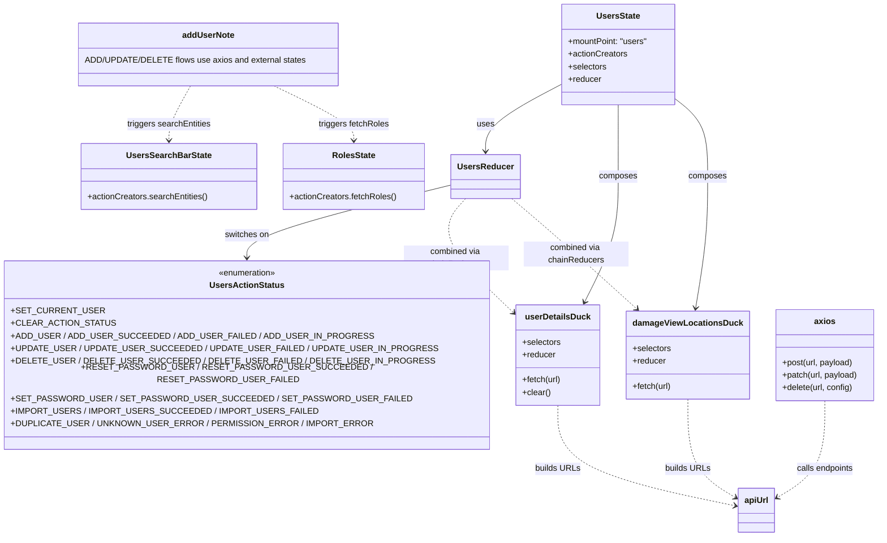
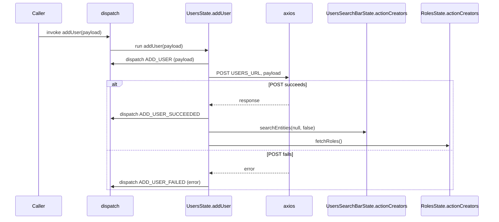
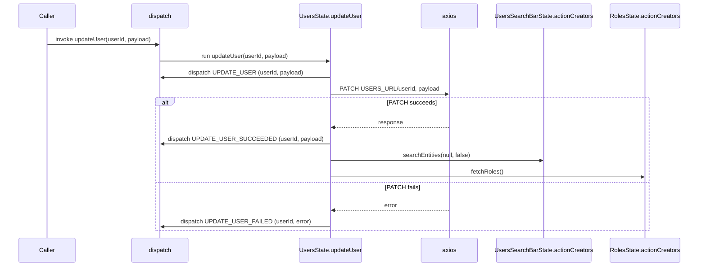
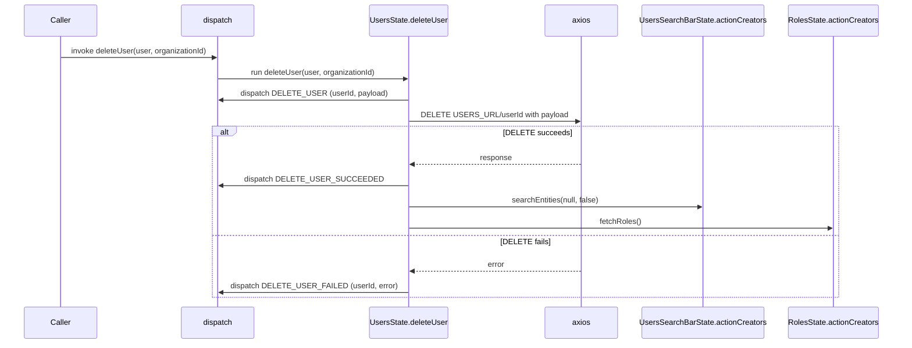

# Diagram: web/portal/src/modules/users/UsersState.js

> Auto-generated by Obscura crawlers

## Diagram 1

### SVG

<svg id="container" width="1541.8671875" xmlns="http://www.w3.org/2000/svg" class="classDiagram" height="1000" viewBox="0 0 1541.8671875 1000" role="graphics-document document" aria-roledescription="class"><g><defs><marker id="container_class-aggregationStart" class="marker aggregation class" refX="18" refY="7" markerWidth="190" markerHeight="240" orient="auto"><path d="M 18,7 L9,13 L1,7 L9,1 Z"></path></marker></defs><defs><marker id="container_class-aggregationEnd" class="marker aggregation class" refX="1" refY="7" markerWidth="20" markerHeight="28" orient="auto"><path d="M 18,7 L9,13 L1,7 L9,1 Z"></path></marker></defs><defs><marker id="container_class-extensionStart" class="marker extension class" refX="18" refY="7" markerWidth="190" markerHeight="240" orient="auto"><path d="M 1,7 L18,13 V 1 Z"></path></marker></defs><defs><marker id="container_class-extensionEnd" class="marker extension class" refX="1" refY="7" markerWidth="20" markerHeight="28" orient="auto"><path d="M 1,1 V 13 L18,7 Z"></path></marker></defs><defs><marker id="container_class-compositionStart" class="marker composition class" refX="18" refY="7" markerWidth="190" markerHeight="240" orient="auto"><path d="M 18,7 L9,13 L1,7 L9,1 Z"></path></marker></defs><defs><marker id="container_class-compositionEnd" class="marker composition class" refX="1" refY="7" markerWidth="20" markerHeight="28" orient="auto"><path d="M 18,7 L9,13 L1,7 L9,1 Z"></path></marker></defs><defs><marker id="container_class-dependencyStart" class="marker dependency class" refX="6" refY="7" markerWidth="190" markerHeight="240" orient="auto"><path d="M 5,7 L9,13 L1,7 L9,1 Z"></path></marker></defs><defs><marker id="container_class-dependencyEnd" class="marker dependency class" refX="13" refY="7" markerWidth="20" markerHeight="28" orient="auto"><path d="M 18,7 L9,13 L14,7 L9,1 Z"></path></marker></defs><defs><marker id="container_class-lollipopStart" class="marker lollipop class" refX="13" refY="7" markerWidth="190" markerHeight="240" orient="auto"><circle stroke="black" fill="transparent" cx="7" cy="7" r="6"></circle></marker></defs><defs><marker id="container_class-lollipopEnd" class="marker lollipop class" refX="1" refY="7" markerWidth="190" markerHeight="240" orient="auto"><circle stroke="black" fill="transparent" cx="7" cy="7" r="6"></circle></marker></defs><g class="root"><g class="clusters"></g><g class="edgePaths"><path d="M948.695,162.293L925.556,174.744C902.417,187.195,856.138,212.098,832.999,233.215C809.859,254.333,809.859,271.667,809.859,280.333L809.859,289" id="id_UsersState_UsersReducer_1" class="edge-thickness-normal edge-pattern-solid relation" style=";;;" data-edge="true" data-et="edge" data-id="id_UsersState_UsersReducer_1" data-points="W3sieCI6OTQ4LjY5NTMxMjUsInkiOjE2Mi4yOTI5OTA5MTI2ODI3NH0seyJ4Ijo4MDkuODU5Mzc1LCJ5IjoyMzd9LHsieCI6ODA5Ljg1OTM3NSwieSI6Mjk1fV0=" marker-end="url(#container_class-dependencyEnd)"></path><path d="M1057.027,200L1057.027,206.167C1057.027,212.333,1057.027,224.667,1057.027,247.5C1057.027,270.333,1057.027,303.667,1057.027,339C1057.027,374.333,1057.027,411.667,1046.953,449.614C1036.879,487.561,1016.73,526.121,1006.656,545.402L996.581,564.682" id="id_UsersState_userDetailsDuck_2" class="edge-thickness-normal edge-pattern-solid relation" style=";;;" data-edge="true" data-et="edge" data-id="id_UsersState_userDetailsDuck_2" data-points="W3sieCI6MTA1Ny4wMjczNDM3NSwieSI6MjAwfSx7IngiOjEwNTcuMDI3MzQzNzUsInkiOjIzN30seyJ4IjoxMDU3LjAyNzM0Mzc1LCJ5IjozMzd9LHsieCI6MTA1Ny4wMjczNDM3NSwieSI6NDQ5fSx7IngiOjk5My44MDI0OTEzNTk0NDcsInkiOjU3MH1d" marker-end="url(#container_class-dependencyEnd)"></path><path d="M1165.359,190.416L1175.092,198.18C1184.826,205.944,1204.292,221.472,1214.025,245.903C1223.758,270.333,1223.758,303.667,1223.758,339C1223.758,374.333,1223.758,411.667,1219.896,451.516C1216.034,491.366,1208.31,533.732,1204.448,554.914L1200.586,576.097" id="id_UsersState_damageViewLocationsDuck_3" class="edge-thickness-normal edge-pattern-solid relation" style=";;;" data-edge="true" data-et="edge" data-id="id_UsersState_damageViewLocationsDuck_3" data-points="W3sieCI6MTE2NS4zNTkzNzUsInkiOjE5MC40MTU4Nzk4NTg0OTE2OH0seyJ4IjoxMjIzLjc1NzgxMjUsInkiOjIzN30seyJ4IjoxMjIzLjc1NzgxMjUsInkiOjMzN30seyJ4IjoxMjIzLjc1NzgxMjUsInkiOjQ0OX0seyJ4IjoxMTk5LjUwOTgyODYyOTAzMjIsInkiOjU4Mn1d" marker-end="url(#container_class-dependencyEnd)"></path><path d="M747.531,354.512L691.48,370.26C635.43,386.008,523.328,417.504,467.277,440.419C411.227,463.333,411.227,477.667,411.227,484.833L411.227,492" id="id_UsersReducer_UsersActionStatus_4" class="edge-thickness-normal edge-pattern-solid relation" style=";;;" data-edge="true" data-et="edge" data-id="id_UsersReducer_UsersActionStatus_4" data-points="W3sieCI6NzQ3LjUzMTI1LCJ5IjozNTQuNTExNzI5NTQ0MzQxfSx7IngiOjQxMS4yMjY1NjI1LCJ5Ijo0NDl9LHsieCI6NDExLjIyNjU2MjUsInkiOjQ5OH1d" marker-end="url(#container_class-dependencyEnd)"></path><path d="M771.193,379L760.453,390.667C749.712,402.333,728.231,425.667,743.037,460.735C757.843,495.803,808.936,542.606,834.482,566.007L860.029,589.409" id="id_UsersReducer_userDetailsDuck_5" class="edge-thickness-normal edge-pattern-dashed relation" style=";;;" data-edge="true" data-et="edge" data-id="id_UsersReducer_userDetailsDuck_5" data-points="W3sieCI6NzcxLjE5MzM1OTM3NSwieSI6Mzc5fSx7IngiOjcwNi43NSwieSI6NDQ5fSx7IngiOjg2NC40NTMxMjUsInkiOjU5My40NjE1MTMwOTI4MDM5fV0=" marker-end="url(#container_class-dependencyEnd)"></path><path d="M857.547,379L870.794,390.667C884.041,402.333,910.534,425.667,948.278,458.84C986.021,492.014,1035.015,535.028,1059.512,556.535L1084.009,578.041" id="id_UsersReducer_damageViewLocationsDuck_6" class="edge-thickness-normal edge-pattern-dashed relation" style=";;;" data-edge="true" data-et="edge" data-id="id_UsersReducer_damageViewLocationsDuck_6" data-points="W3sieCI6ODU3LjU0NzM2MzI4MTI1LCJ5IjozNzl9LHsieCI6OTM3LjAyNzM0Mzc1LCJ5Ijo0NDl9LHsieCI6MTA4OC41MTczODkxMTI5MDMyLCJ5Ijo1ODJ9XQ==" marker-end="url(#container_class-dependencyEnd)"></path><path d="M254.847,164L248.342,176.167C241.837,188.333,228.827,212.667,222.322,230C215.816,247.333,215.816,257.667,215.816,262.833L215.816,268" id="id_addUserNote_UsersSearchBarState_7" class="edge-thickness-normal edge-pattern-dashed relation" style=";;;" data-edge="true" data-et="edge" data-id="id_addUserNote_UsersSearchBarState_7" data-points="W3sieCI6MjU0Ljg0NzQzNTk3Mjc0NDM2LCJ5IjoxNjR9LHsieCI6MjE1LjgxNjQwNjI1LCJ5IjoyMzd9LHsieCI6MjE1LjgxNjQwNjI1LCJ5IjoyNzR9XQ==" marker-end="url(#container_class-dependencyEnd)"></path><path d="M412.039,164L437.409,176.167C462.779,188.333,513.518,212.667,538.888,230C564.258,247.333,564.258,257.667,564.258,262.833L564.258,268" id="id_addUserNote_RolesState_8" class="edge-thickness-normal edge-pattern-dashed relation" style=";;;" data-edge="true" data-et="edge" data-id="id_addUserNote_RolesState_8" data-points="W3sieCI6NDEyLjAzOTA0NzgxNDg0OTYsInkiOjE2NH0seyJ4Ijo1NjQuMjU3ODEyNSwieSI6MjM3fSx7IngiOjU2NC4yNTc4MTI1LCJ5IjoyNzR9XQ==" marker-end="url(#container_class-dependencyEnd)"></path><path d="M943.641,762L943.641,780.167C943.641,798.333,943.641,834.667,998.347,864.567C1053.053,894.468,1162.465,917.936,1217.171,929.67L1271.878,941.404" id="id_userDetailsDuck_apiUrl_9" class="edge-thickness-normal edge-pattern-dashed relation" style=";;;" data-edge="true" data-et="edge" data-id="id_userDetailsDuck_apiUrl_9" data-points="W3sieCI6OTQzLjY0MDYyNSwieSI6NzYyfSx7IngiOjk0My42NDA2MjUsInkiOjg3MX0seyJ4IjoxMjc3Ljc0NDE0MDYyNSwieSI6OTQyLjY2MjA3NDM3ODEwNTR9XQ==" marker-end="url(#container_class-dependencyEnd)"></path><path d="M1184.195,750L1184.195,770.167C1184.195,790.333,1184.195,830.667,1198.936,859.948C1213.677,889.23,1243.159,907.46,1257.9,916.575L1272.641,925.69" id="id_damageViewLocationsDuck_apiUrl_10" class="edge-thickness-normal edge-pattern-dashed relation" style=";;;" data-edge="true" data-et="edge" data-id="id_damageViewLocationsDuck_apiUrl_10" data-points="W3sieCI6MTE4NC4xOTUzMTI1LCJ5Ijo3NTB9LHsieCI6MTE4NC4xOTUzMTI1LCJ5Ijo4NzF9LHsieCI6MTI3Ny43NDQxNDA2MjUsInkiOjkyOC44NDU3MzQwMjg0MDQyfV0=" marker-end="url(#container_class-dependencyEnd)"></path><path d="M1439.715,753L1439.715,772.667C1439.715,792.333,1439.715,831.667,1424.974,860.448C1410.233,889.23,1380.751,907.46,1366.01,916.575L1351.269,925.69" id="id_axios_apiUrl_11" class="edge-thickness-normal edge-pattern-dashed relation" style=";;;" data-edge="true" data-et="edge" data-id="id_axios_apiUrl_11" data-points="W3sieCI6MTQzOS43MTQ4NDM3NSwieSI6NzUzfSx7IngiOjE0MzkuNzE0ODQzNzUsInkiOjg3MX0seyJ4IjoxMzQ2LjE2NjAxNTYyNSwieSI6OTI4Ljg0NTczNDAyODQwNDJ9XQ==" marker-end="url(#container_class-dependencyEnd)"></path></g><g class="edgeLabels"><g class="edgeLabel" transform="translate(809.859375, 237)"><g class="label" data-id="id_UsersState_UsersReducer_1" transform="translate(-16.4921875, -12)"><foreignObject width="32.984375" height="24">

uses

</foreignObject></g></g><g class="edgeLabel" transform="translate(1057.02734375, 337)"><g class="label" data-id="id_UsersState_userDetailsDuck_2" transform="translate(-36.453125, -12)"><foreignObject width="72.90625" height="24">

composes

</foreignObject></g></g><g class="edgeLabel" transform="translate(1223.7578125, 337)"><g class="label" data-id="id_UsersState_damageViewLocationsDuck_3" transform="translate(-36.453125, -12)"><foreignObject width="72.90625" height="24">

composes

</foreignObject></g></g><g class="edgeLabel" transform="translate(411.2265625, 449)"><g class="label" data-id="id_UsersReducer_UsersActionStatus_4" transform="translate(-42.53125, -12)"><foreignObject width="85.0625" height="24">

switches on

</foreignObject></g></g><g class="edgeLabel" transform="translate(750.52153, 489.09623)"><g class="label" data-id="id_UsersReducer_userDetailsDuck_5" transform="translate(-100, -24)"><foreignObject width="200" height="48">

combined via chainReducers

</foreignObject></g></g><g class="edgeLabel" transform="translate(972.97756, 480.56233)"><g class="label" data-id="id_UsersReducer_damageViewLocationsDuck_6" transform="translate(-100, -24)"><foreignObject width="200" height="48">

combined via chainReducers

</foreignObject></g></g><g class="edgeLabel" transform="translate(215.81640625, 237)"><g class="label" data-id="id_addUserNote_UsersSearchBarState_7" transform="translate(-80.609375, -12)"><foreignObject width="161.21875" height="24">

triggers searchEntities

</foreignObject></g></g><g class="edgeLabel" transform="translate(564.2578125, 237)"><g class="label" data-id="id_addUserNote_RolesState_8" transform="translate(-67.640625, -12)"><foreignObject width="135.28125" height="24">

triggers fetchRoles

</foreignObject></g></g><g class="edgeLabel" transform="translate(943.640625, 871)"><g class="label" data-id="id_userDetailsDuck_apiUrl_9" transform="translate(-42.3515625, -12)"><foreignObject width="84.703125" height="24">

builds URLs

</foreignObject></g></g><g class="edgeLabel" transform="translate(1184.1953125, 871)"><g class="label" data-id="id_damageViewLocationsDuck_apiUrl_10" transform="translate(-42.3515625, -12)"><foreignObject width="84.703125" height="24">

builds URLs

</foreignObject></g></g><g class="edgeLabel" transform="translate(1439.71484375, 871)"><g class="label" data-id="id_axios_apiUrl_11" transform="translate(-55.390625, -12)"><foreignObject width="110.78125" height="24">

calls endpoints

</foreignObject></g></g></g><g class="nodes"><g class="node default" id="classId-UsersState-0" transform="translate(1057.02734375, 104)"><g class="basic label-container"><path d="M-108.33203125 -96 L108.33203125 -96 L108.33203125 96 L-108.33203125 96" stroke="none" stroke-width="0" fill="#ECECFF" style=""></path><path d="M-108.33203125 -96 C-21.842625320151356 -96, 64.64678060969729 -96, 108.33203125 -96 M-108.33203125 -96 C-48.244770401087585 -96, 11.84249044782483 -96, 108.33203125 -96 M108.33203125 -96 C108.33203125 -35.55536285034416, 108.33203125 24.88927429931168, 108.33203125 96 M108.33203125 -96 C108.33203125 -19.599771354082065, 108.33203125 56.80045729183587, 108.33203125 96 M108.33203125 96 C60.57324086121724 96, 12.814450472434487 96, -108.33203125 96 M108.33203125 96 C55.34588182767531 96, 2.359732405350627 96, -108.33203125 96 M-108.33203125 96 C-108.33203125 54.60646568748701, -108.33203125 13.21293137497402, -108.33203125 -96 M-108.33203125 96 C-108.33203125 45.04707840196256, -108.33203125 -5.905843196074883, -108.33203125 -96" stroke="#9370DB" stroke-width="1.3" fill="none" stroke-dasharray="0 0" style=""></path></g><g class="annotation-group text" transform="translate(0, -72)"></g><g class="label-group text" transform="translate(-39.7421875, -72)"><g class="label" style="font-weight: bolder" transform="translate(0,-12)"><foreignObject width="79.484375" height="24">

UsersState

</foreignObject></g></g><g class="members-group text" transform="translate(-96.33203125, -24)"><g class="label" style="" transform="translate(0,-12)"><foreignObject width="152.921875" height="24">

+mountPoint: "users"

</foreignObject></g><g class="label" style="" transform="translate(0,12)"><foreignObject width="113.078125" height="24">

+actionCreators

</foreignObject></g><g class="label" style="" transform="translate(0,36)"><foreignObject width="73.453125" height="24">

+selectors

</foreignObject></g><g class="label" style="" transform="translate(0,60)"><foreignObject width="63.515625" height="24">

+reducer

</foreignObject></g></g><g class="methods-group text" transform="translate(-96.33203125, 96)"></g><g class="divider" style=""><path d="M-108.33203125 -48 C-35.91812987592836 -48, 36.495771498143284 -48, 108.33203125 -48 M-108.33203125 -48 C-37.7793421117579 -48, 32.7733470264842 -48, 108.33203125 -48" stroke="#9370DB" stroke-width="1.3" fill="none" stroke-dasharray="0 0" style=""></path></g><g class="divider" style=""><path d="M-108.33203125 72 C-49.436707606108364 72, 9.458616037783273 72, 108.33203125 72 M-108.33203125 72 C-34.93741832123291 72, 38.45719460753418 72, 108.33203125 72" stroke="#9370DB" stroke-width="1.3" fill="none" stroke-dasharray="0 0" style=""></path></g></g><g class="node default" id="classId-UsersReducer-1" transform="translate(809.859375, 337)"><g class="basic label-container"><path d="M-62.328125 -42 L62.328125 -42 L62.328125 42 L-62.328125 42" stroke="none" stroke-width="0" fill="#ECECFF" style=""></path><path d="M-62.328125 -42 C-24.6226158404481 -42, 13.082893319103803 -42, 62.328125 -42 M-62.328125 -42 C-15.528010028025157 -42, 31.272104943949685 -42, 62.328125 -42 M62.328125 -42 C62.328125 -12.770023821052781, 62.328125 16.459952357894437, 62.328125 42 M62.328125 -42 C62.328125 -8.473857887118164, 62.328125 25.05228422576367, 62.328125 42 M62.328125 42 C24.583104525895422 42, -13.161915948209156 42, -62.328125 42 M62.328125 42 C29.358891303303444 42, -3.610342393393111 42, -62.328125 42 M-62.328125 42 C-62.328125 24.947260635183323, -62.328125 7.894521270366646, -62.328125 -42 M-62.328125 42 C-62.328125 12.277125624725574, -62.328125 -17.44574875054885, -62.328125 -42" stroke="#9370DB" stroke-width="1.3" fill="none" stroke-dasharray="0 0" style=""></path></g><g class="annotation-group text" transform="translate(0, -18)"></g><g class="label-group text" transform="translate(-50.328125, -18)"><g class="label" style="font-weight: bolder" transform="translate(0,-12)"><foreignObject width="100.65625" height="24">

UsersReducer

</foreignObject></g></g><g class="members-group text" transform="translate(-50.328125, 30)"></g><g class="methods-group text" transform="translate(-50.328125, 60)"></g><g class="divider" style=""><path d="M-62.328125 6 C-33.433714944621656 6, -4.539304889243311 6, 62.328125 6 M-62.328125 6 C-19.658152530350932 6, 23.011819939298135 6, 62.328125 6" stroke="#9370DB" stroke-width="1.3" fill="none" stroke-dasharray="0 0" style=""></path></g><g class="divider" style=""><path d="M-62.328125 24 C-14.28546352290438 24, 33.75719795419124 24, 62.328125 24 M-62.328125 24 C-25.069819555893154 24, 12.188485888213691 24, 62.328125 24" stroke="#9370DB" stroke-width="1.3" fill="none" stroke-dasharray="0 0" style=""></path></g></g><g class="node default" id="classId-userDetailsDuck-2" transform="translate(943.640625, 666)"><g class="basic label-container"><path d="M-79.1875 -96 L79.1875 -96 L79.1875 96 L-79.1875 96" stroke="none" stroke-width="0" fill="#ECECFF" style=""></path><path d="M-79.1875 -96 C-45.47520387423366 -96, -11.762907748467313 -96, 79.1875 -96 M-79.1875 -96 C-28.80056825342521 -96, 21.586363493149577 -96, 79.1875 -96 M79.1875 -96 C79.1875 -51.652907807286496, 79.1875 -7.3058156145729924, 79.1875 96 M79.1875 -96 C79.1875 -56.14317504563538, 79.1875 -16.286350091270762, 79.1875 96 M79.1875 96 C24.755236517563 96, -29.677026964874003 96, -79.1875 96 M79.1875 96 C41.33624006602799 96, 3.4849801320559806 96, -79.1875 96 M-79.1875 96 C-79.1875 40.981564678547954, -79.1875 -14.036870642904091, -79.1875 -96 M-79.1875 96 C-79.1875 41.85556219081161, -79.1875 -12.288875618376778, -79.1875 -96" stroke="#9370DB" stroke-width="1.3" fill="none" stroke-dasharray="0 0" style=""></path></g><g class="annotation-group text" transform="translate(0, -72)"></g><g class="label-group text" transform="translate(-59.59375, -72)"><g class="label" style="font-weight: bolder" transform="translate(0,-12)"><foreignObject width="119.1875" height="24">

userDetailsDuck

</foreignObject></g></g><g class="members-group text" transform="translate(-67.1875, -24)"><g class="label" style="" transform="translate(0,-12)"><foreignObject width="73.453125" height="24">

+selectors

</foreignObject></g><g class="label" style="" transform="translate(0,12)"><foreignObject width="63.515625" height="24">

+reducer

</foreignObject></g></g><g class="methods-group text" transform="translate(-67.1875, 48)"><g class="label" style="" transform="translate(0,-12)"><foreignObject width="74.78125" height="24">

+fetch(url)

</foreignObject></g><g class="label" style="" transform="translate(0,12)"><foreignObject width="54.0625" height="24">

+clear()

</foreignObject></g></g><g class="divider" style=""><path d="M-79.1875 -48 C-43.79546291725364 -48, -8.403425834507274 -48, 79.1875 -48 M-79.1875 -48 C-33.889389229782125 -48, 11.40872154043575 -48, 79.1875 -48" stroke="#9370DB" stroke-width="1.3" fill="none" stroke-dasharray="0 0" style=""></path></g><g class="divider" style=""><path d="M-79.1875 24 C-36.11389770695161 24, 6.959704586096777 24, 79.1875 24 M-79.1875 24 C-38.5064559519689 24, 2.1745880960621946 24, 79.1875 24" stroke="#9370DB" stroke-width="1.3" fill="none" stroke-dasharray="0 0" style=""></path></g></g><g class="node default" id="classId-damageViewLocationsDuck-3" transform="translate(1184.1953125, 666)"><g class="basic label-container"><path d="M-111.3671875 -84 L111.3671875 -84 L111.3671875 84 L-111.3671875 84" stroke="none" stroke-width="0" fill="#ECECFF" style=""></path><path d="M-111.3671875 -84 C-56.45415880420621 -84, -1.5411301084124176 -84, 111.3671875 -84 M-111.3671875 -84 C-49.976945710951654 -84, 11.413296078096693 -84, 111.3671875 -84 M111.3671875 -84 C111.3671875 -45.50458420454518, 111.3671875 -7.009168409090364, 111.3671875 84 M111.3671875 -84 C111.3671875 -38.376004102202494, 111.3671875 7.247991795595013, 111.3671875 84 M111.3671875 84 C60.3356526849576 84, 9.304117869915203 84, -111.3671875 84 M111.3671875 84 C42.75264442374653 84, -25.861898652506937 84, -111.3671875 84 M-111.3671875 84 C-111.3671875 42.83427925561194, -111.3671875 1.6685585112238783, -111.3671875 -84 M-111.3671875 84 C-111.3671875 40.80103286583783, -111.3671875 -2.3979342683243345, -111.3671875 -84" stroke="#9370DB" stroke-width="1.3" fill="none" stroke-dasharray="0 0" style=""></path></g><g class="annotation-group text" transform="translate(0, -60)"></g><g class="label-group text" transform="translate(-99.3671875, -60)"><g class="label" style="font-weight: bolder" transform="translate(0,-12)"><foreignObject width="198.734375" height="24">

damageViewLocationsDuck

</foreignObject></g></g><g class="members-group text" transform="translate(-99.3671875, -12)"><g class="label" style="" transform="translate(0,-12)"><foreignObject width="73.453125" height="24">

+selectors

</foreignObject></g><g class="label" style="" transform="translate(0,12)"><foreignObject width="63.515625" height="24">

+reducer

</foreignObject></g></g><g class="methods-group text" transform="translate(-99.3671875, 60)"><g class="label" style="" transform="translate(0,-12)"><foreignObject width="74.78125" height="24">

+fetch(url)

</foreignObject></g></g><g class="divider" style=""><path d="M-111.3671875 -36 C-25.13127335342402 -36, 61.10464079315196 -36, 111.3671875 -36 M-111.3671875 -36 C-50.76420582177761 -36, 9.838775856444784 -36, 111.3671875 -36" stroke="#9370DB" stroke-width="1.3" fill="none" stroke-dasharray="0 0" style=""></path></g><g class="divider" style=""><path d="M-111.3671875 36 C-61.32666503875842 36, -11.286142577516841 36, 111.3671875 36 M-111.3671875 36 C-43.41780574901418 36, 24.531576001971644 36, 111.3671875 36" stroke="#9370DB" stroke-width="1.3" fill="none" stroke-dasharray="0 0" style=""></path></g></g><g class="node default" id="classId-UsersActionStatus-4" transform="translate(411.2265625, 666)"><g class="basic label-container"><path d="M-403.2265625 -168 L403.2265625 -168 L403.2265625 168 L-403.2265625 168" stroke="none" stroke-width="0" fill="#ECECFF" style=""></path><path d="M-403.2265625 -168 C-237.45360435177145 -168, -71.68064620354289 -168, 403.2265625 -168 M-403.2265625 -168 C-196.9764115361801 -168, 9.273739427639782 -168, 403.2265625 -168 M403.2265625 -168 C403.2265625 -89.46875455070308, 403.2265625 -10.937509101406164, 403.2265625 168 M403.2265625 -168 C403.2265625 -62.68893469501771, 403.2265625 42.622130609964586, 403.2265625 168 M403.2265625 168 C86.02376852818946 168, -231.17902544362107 168, -403.2265625 168 M403.2265625 168 C213.47804020667104 168, 23.72951791334208 168, -403.2265625 168 M-403.2265625 168 C-403.2265625 70.16262229019839, -403.2265625 -27.67475541960323, -403.2265625 -168 M-403.2265625 168 C-403.2265625 35.328052169100374, -403.2265625 -97.34389566179925, -403.2265625 -168" stroke="#9370DB" stroke-width="1.3" fill="none" stroke-dasharray="0 0" style=""></path></g><g class="annotation-group text" transform="translate(-55.5546875, -144)"><g class="label" style="" transform="translate(0,-12)"><foreignObject width="111.109375" height="24">

«enumeration»

</foreignObject></g></g><g class="label-group text" transform="translate(-67.09375, -120)"><g class="label" style="font-weight: bolder" transform="translate(0,-12)"><foreignObject width="134.1875" height="24">

UsersActionStatus

</foreignObject></g></g><g class="members-group text" transform="translate(-391.2265625, -72)"><g class="label" style="" transform="translate(0,-12)"><foreignObject width="150.78125" height="24">

+SET_CURRENT_USER

</foreignObject></g><g class="label" style="" transform="translate(0,12)"><foreignObject width="173.125" height="24">

+CLEAR_ACTION_STATUS

</foreignObject></g><g class="label" style="" transform="translate(0,36)"><foreignObject width="610.8125" height="24">

+ADD_USER / ADD_USER_SUCCEEDED / ADD_USER_FAILED / ADD_USER_IN_PROGRESS

</foreignObject></g><g class="label" style="" transform="translate(0,60)"><foreignObject width="715.359375" height="24">

+UPDATE_USER / UPDATE_USER_SUCCEEDED / UPDATE_USER_FAILED / UPDATE_USER_IN_PROGRESS

</foreignObject></g><g class="label" style="" transform="translate(0,84)"><foreignObject width="703.328125" height="24">

+DELETE_USER / DELETE_USER_SUCCEEDED / DELETE_USER_FAILED / DELETE_USER_IN_PROGRESS

</foreignObject></g><g class="label" style="" transform="translate(0,108)"><foreignObject width="712.859375" height="24">

+RESET_PASSWORD_USER / RESET_PASSWORD_USER_SUCCEEDED / RESET_PASSWORD_USER_FAILED

</foreignObject></g><g class="label" style="" transform="translate(0,132)"><foreignObject width="657.984375" height="24">

+SET_PASSWORD_USER / SET_PASSWORD_USER_SUCCEEDED / SET_PASSWORD_USER_FAILED

</foreignObject></g><g class="label" style="" transform="translate(0,156)"><foreignObject width="512.703125" height="24">

+IMPORT_USERS / IMPORT_USERS_SUCCEEDED / IMPORT_USERS_FAILED

</foreignObject></g><g class="label" style="" transform="translate(0,180)"><foreignObject width="616.671875" height="24">

+DUPLICATE_USER / UNKNOWN_USER_ERROR / PERMISSION_ERROR / IMPORT_ERROR

</foreignObject></g></g><g class="methods-group text" transform="translate(-391.2265625, 168)"></g><g class="divider" style=""><path d="M-403.2265625 -96 C-179.29711349740066 -96, 44.63233550519868 -96, 403.2265625 -96 M-403.2265625 -96 C-140.13400278323064 -96, 122.95855693353872 -96, 403.2265625 -96" stroke="#9370DB" stroke-width="1.3" fill="none" stroke-dasharray="0 0" style=""></path></g><g class="divider" style=""><path d="M-403.2265625 144 C-125.99704761071314 144, 151.23246727857372 144, 403.2265625 144 M-403.2265625 144 C-118.07208263264664 144, 167.08239723470672 144, 403.2265625 144" stroke="#9370DB" stroke-width="1.3" fill="none" stroke-dasharray="0 0" style=""></path></g></g><g class="node default" id="classId-RolesState-5" transform="translate(564.2578125, 337)"><g class="basic label-container"><path d="M-133.2734375 -63 L133.2734375 -63 L133.2734375 63 L-133.2734375 63" stroke="none" stroke-width="0" fill="#ECECFF" style=""></path><path d="M-133.2734375 -63 C-65.39632596853593 -63, 2.4807855629281335 -63, 133.2734375 -63 M-133.2734375 -63 C-63.81485405953735 -63, 5.6437293809252935 -63, 133.2734375 -63 M133.2734375 -63 C133.2734375 -12.628534006739152, 133.2734375 37.7429319865217, 133.2734375 63 M133.2734375 -63 C133.2734375 -18.98813428247852, 133.2734375 25.02373143504296, 133.2734375 63 M133.2734375 63 C28.23865508362013 63, -76.79612733275974 63, -133.2734375 63 M133.2734375 63 C31.01262268701717 63, -71.24819212596566 63, -133.2734375 63 M-133.2734375 63 C-133.2734375 30.567188061935724, -133.2734375 -1.8656238761285522, -133.2734375 -63 M-133.2734375 63 C-133.2734375 36.97333607294388, -133.2734375 10.94667214588776, -133.2734375 -63" stroke="#9370DB" stroke-width="1.3" fill="none" stroke-dasharray="0 0" style=""></path></g><g class="annotation-group text" transform="translate(0, -39)"></g><g class="label-group text" transform="translate(-39.421875, -39)"><g class="label" style="font-weight: bolder" transform="translate(0,-12)"><foreignObject width="78.84375" height="24">

RolesState

</foreignObject></g></g><g class="members-group text" transform="translate(-121.2734375, 9)"></g><g class="methods-group text" transform="translate(-121.2734375, 39)"><g class="label" style="" transform="translate(0,-12)"><foreignObject width="203.125" height="24">

+actionCreators.fetchRoles()

</foreignObject></g></g><g class="divider" style=""><path d="M-133.2734375 -15 C-37.44190933225572 -15, 58.38961883548856 -15, 133.2734375 -15 M-133.2734375 -15 C-51.42552428493147 -15, 30.42238893013706 -15, 133.2734375 -15" stroke="#9370DB" stroke-width="1.3" fill="none" stroke-dasharray="0 0" style=""></path></g><g class="divider" style=""><path d="M-133.2734375 9 C-76.92259375095426 9, -20.571750001908526 9, 133.2734375 9 M-133.2734375 9 C-59.35233590912718 9, 14.568765681745646 9, 133.2734375 9" stroke="#9370DB" stroke-width="1.3" fill="none" stroke-dasharray="0 0" style=""></path></g></g><g class="node default" id="classId-UsersSearchBarState-6" transform="translate(215.81640625, 337)"><g class="basic label-container"><path d="M-165.16796875 -63 L165.16796875 -63 L165.16796875 63 L-165.16796875 63" stroke="none" stroke-width="0" fill="#ECECFF" style=""></path><path d="M-165.16796875 -63 C-60.6873564926009 -63, 43.793255764798204 -63, 165.16796875 -63 M-165.16796875 -63 C-69.22171820595578 -63, 26.724532338088437 -63, 165.16796875 -63 M165.16796875 -63 C165.16796875 -24.715373919281973, 165.16796875 13.569252161436054, 165.16796875 63 M165.16796875 -63 C165.16796875 -17.019855018020287, 165.16796875 28.960289963959426, 165.16796875 63 M165.16796875 63 C52.16737130840092 63, -60.83322613319817 63, -165.16796875 63 M165.16796875 63 C65.00028083341238 63, -35.16740708317525 63, -165.16796875 63 M-165.16796875 63 C-165.16796875 34.6868689424999, -165.16796875 6.373737884999791, -165.16796875 -63 M-165.16796875 63 C-165.16796875 25.43253765476215, -165.16796875 -12.1349246904757, -165.16796875 -63" stroke="#9370DB" stroke-width="1.3" fill="none" stroke-dasharray="0 0" style=""></path></g><g class="annotation-group text" transform="translate(0, -39)"></g><g class="label-group text" transform="translate(-76.9765625, -39)"><g class="label" style="font-weight: bolder" transform="translate(0,-12)"><foreignObject width="153.953125" height="24">

UsersSearchBarState

</foreignObject></g></g><g class="members-group text" transform="translate(-153.16796875, 9)"></g><g class="methods-group text" transform="translate(-153.16796875, 39)"><g class="label" style="" transform="translate(0,-12)"><foreignObject width="229.359375" height="24">

+actionCreators.searchEntities()

</foreignObject></g></g><g class="divider" style=""><path d="M-165.16796875 -15 C-37.610202860949244 -15, 89.94756302810151 -15, 165.16796875 -15 M-165.16796875 -15 C-88.38265289554467 -15, -11.597337041089332 -15, 165.16796875 -15" stroke="#9370DB" stroke-width="1.3" fill="none" stroke-dasharray="0 0" style=""></path></g><g class="divider" style=""><path d="M-165.16796875 9 C-54.56281395502238 9, 56.042340839955244 9, 165.16796875 9 M-165.16796875 9 C-96.32178529732374 9, -27.475601844647485 9, 165.16796875 9" stroke="#9370DB" stroke-width="1.3" fill="none" stroke-dasharray="0 0" style=""></path></g></g><g class="node default" id="classId-axios-7" transform="translate(1439.71484375, 666)"><g class="basic label-container"><path d="M-94.15234375 -87 L94.15234375 -87 L94.15234375 87 L-94.15234375 87" stroke="none" stroke-width="0" fill="#ECECFF" style=""></path><path d="M-94.15234375 -87 C-42.92193875815208 -87, 8.308466233695839 -87, 94.15234375 -87 M-94.15234375 -87 C-29.497826399220585 -87, 35.15669095155883 -87, 94.15234375 -87 M94.15234375 -87 C94.15234375 -33.5856208326597, 94.15234375 19.8287583346806, 94.15234375 87 M94.15234375 -87 C94.15234375 -23.268342012279575, 94.15234375 40.46331597544085, 94.15234375 87 M94.15234375 87 C55.426250291304136 87, 16.700156832608272 87, -94.15234375 87 M94.15234375 87 C36.27706411102431 87, -21.598215527951382 87, -94.15234375 87 M-94.15234375 87 C-94.15234375 31.797511554401076, -94.15234375 -23.404976891197848, -94.15234375 -87 M-94.15234375 87 C-94.15234375 20.418810535850483, -94.15234375 -46.162378928299034, -94.15234375 -87" stroke="#9370DB" stroke-width="1.3" fill="none" stroke-dasharray="0 0" style=""></path></g><g class="annotation-group text" transform="translate(0, -63)"></g><g class="label-group text" transform="translate(-19.2734375, -63)"><g class="label" style="font-weight: bolder" transform="translate(0,-12)"><foreignObject width="38.546875" height="24">

axios

</foreignObject></g></g><g class="members-group text" transform="translate(-82.15234375, -15)"></g><g class="methods-group text" transform="translate(-82.15234375, 15)"><g class="label" style="" transform="translate(0,-12)"><foreignObject width="136.515625" height="24">

+post(url, payload)

</foreignObject></g><g class="label" style="" transform="translate(0,12)"><foreignObject width="145.03125" height="24">

+patch(url, payload)

</foreignObject></g><g class="label" style="" transform="translate(0,36)"><foreignObject width="136.125" height="24">

+delete(url, config)

</foreignObject></g></g><g class="divider" style=""><path d="M-94.15234375 -39 C-37.40221836401272 -39, 19.347907021974564 -39, 94.15234375 -39 M-94.15234375 -39 C-40.030262582920024 -39, 14.091818584159952 -39, 94.15234375 -39" stroke="#9370DB" stroke-width="1.3" fill="none" stroke-dasharray="0 0" style=""></path></g><g class="divider" style=""><path d="M-94.15234375 -15 C-30.926829747119527 -15, 32.298684255760946 -15, 94.15234375 -15 M-94.15234375 -15 C-49.92485031652927 -15, -5.697356883058546 -15, 94.15234375 -15" stroke="#9370DB" stroke-width="1.3" fill="none" stroke-dasharray="0 0" style=""></path></g></g><g class="node default" id="classId-apiUrl-8" transform="translate(1311.955078125, 950)"><g class="basic label-container"><path d="M-34.2109375 -42 L34.2109375 -42 L34.2109375 42 L-34.2109375 42" stroke="none" stroke-width="0" fill="#ECECFF" style=""></path><path d="M-34.2109375 -42 C-16.187554829760423 -42, 1.8358278404791548 -42, 34.2109375 -42 M-34.2109375 -42 C-19.72477343114419 -42, -5.238609362288379 -42, 34.2109375 -42 M34.2109375 -42 C34.2109375 -21.12443424113671, 34.2109375 -0.24886848227342284, 34.2109375 42 M34.2109375 -42 C34.2109375 -22.937564487109277, 34.2109375 -3.875128974218555, 34.2109375 42 M34.2109375 42 C11.578272132349372 42, -11.054393235301255 42, -34.2109375 42 M34.2109375 42 C17.58802463728338 42, 0.9651117745667577 42, -34.2109375 42 M-34.2109375 42 C-34.2109375 13.735183526913623, -34.2109375 -14.529632946172754, -34.2109375 -42 M-34.2109375 42 C-34.2109375 9.358074633595741, -34.2109375 -23.283850732808517, -34.2109375 -42" stroke="#9370DB" stroke-width="1.3" fill="none" stroke-dasharray="0 0" style=""></path></g><g class="annotation-group text" transform="translate(0, -18)"></g><g class="label-group text" transform="translate(-22.2109375, -18)"><g class="label" style="font-weight: bolder" transform="translate(0,-12)"><foreignObject width="44.421875" height="24">

apiUrl

</foreignObject></g></g><g class="members-group text" transform="translate(-22.2109375, 30)"></g><g class="methods-group text" transform="translate(-22.2109375, 60)"></g><g class="divider" style=""><path d="M-34.2109375 6 C-9.73805919115956 6, 14.734819117680878 6, 34.2109375 6 M-34.2109375 6 C-13.778958499662807 6, 6.653020500674387 6, 34.2109375 6" stroke="#9370DB" stroke-width="1.3" fill="none" stroke-dasharray="0 0" style=""></path></g><g class="divider" style=""><path d="M-34.2109375 24 C-17.088463105842113 24, 0.03401128831577438 24, 34.2109375 24 M-34.2109375 24 C-7.95702231903994 24, 18.29689286192012 24, 34.2109375 24" stroke="#9370DB" stroke-width="1.3" fill="none" stroke-dasharray="0 0" style=""></path></g></g><g class="node default" id="classId-addUserNote-9" transform="translate(286.927734375, 104)"><g class="basic label-container"><path d="M-241.43359375 -60 L241.43359375 -60 L241.43359375 60 L-241.43359375 60" stroke="none" stroke-width="0" fill="#ECECFF" style=""></path><path d="M-241.43359375 -60 C-124.48276737644636 -60, -7.531941002892722 -60, 241.43359375 -60 M-241.43359375 -60 C-131.37868243864546 -60, -21.32377112729094 -60, 241.43359375 -60 M241.43359375 -60 C241.43359375 -22.593851029838433, 241.43359375 14.812297940323134, 241.43359375 60 M241.43359375 -60 C241.43359375 -27.11475336826085, 241.43359375 5.770493263478301, 241.43359375 60 M241.43359375 60 C102.19531902215348 60, -37.04295570569303 60, -241.43359375 60 M241.43359375 60 C91.87543740881551 60, -57.68271893236897 60, -241.43359375 60 M-241.43359375 60 C-241.43359375 32.11858283252715, -241.43359375 4.237165665054306, -241.43359375 -60 M-241.43359375 60 C-241.43359375 16.898253462278674, -241.43359375 -26.20349307544265, -241.43359375 -60" stroke="#9370DB" stroke-width="1.3" fill="none" stroke-dasharray="0 0" style=""></path></g><g class="annotation-group text" transform="translate(0, -36)"></g><g class="label-group text" transform="translate(-47.9765625, -36)"><g class="label" style="font-weight: bolder" transform="translate(0,-12)"><foreignObject width="95.953125" height="24">

addUserNote

</foreignObject></g></g><g class="members-group text" transform="translate(-229.43359375, 12)"><g class="label" style="" transform="translate(0,-12)"><foreignObject width="410.890625" height="24">

ADD/UPDATE/DELETE flows use axios and external states

</foreignObject></g></g><g class="methods-group text" transform="translate(-229.43359375, 60)"></g><g class="divider" style=""><path d="M-241.43359375 -12 C-138.50489969006645 -12, -35.576205630132876 -12, 241.43359375 -12 M-241.43359375 -12 C-106.26915877433711 -12, 28.89527620132577 -12, 241.43359375 -12" stroke="#9370DB" stroke-width="1.3" fill="none" stroke-dasharray="0 0" style=""></path></g><g class="divider" style=""><path d="M-241.43359375 36 C-142.4523170938184 36, -43.471040437636844 36, 241.43359375 36 M-241.43359375 36 C-66.42487166016315 36, 108.5838504296737 36, 241.43359375 36" stroke="#9370DB" stroke-width="1.3" fill="none" stroke-dasharray="0 0" style=""></path></g></g></g></g></g></svg>

## Diagram 2

### SVG

<svg id="container" width="1664" xmlns="http://www.w3.org/2000/svg" height="751" viewBox="-50 -10 1664 751" role="graphics-document document" aria-roledescription="sequence"><g><rect x="1358" y="665" fill="#eaeaea" stroke="#666" width="206" height="65" name="Roles" rx="3" ry="3" class="actor actor-bottom"></rect><text x="1461" y="697.5" dominant-baseline="central" alignment-baseline="central" class="actor actor-box" style="text-anchor: middle; font-size: 16px; font-weight: 400;"><tspan x="1461" dy="0">RolesState.actionCreators</tspan></text></g><g><rect x="1028" y="665" fill="#eaeaea" stroke="#666" width="280" height="65" name="SearchBar" rx="3" ry="3" class="actor actor-bottom"></rect><text x="1168" y="697.5" dominant-baseline="central" alignment-baseline="central" class="actor actor-box" style="text-anchor: middle; font-size: 16px; font-weight: 400;"><tspan x="1168" dy="0">UsersSearchBarState.actionCreators</tspan></text></g><g><rect x="828" y="665" fill="#eaeaea" stroke="#666" width="150" height="65" name="HTTP" rx="3" ry="3" class="actor actor-bottom"></rect><text x="903" y="697.5" dominant-baseline="central" alignment-baseline="central" class="actor actor-box" style="text-anchor: middle; font-size: 16px; font-weight: 400;"><tspan x="903" dy="0">axios</tspan></text></g><g><rect x="562.5" y="665" fill="#eaeaea" stroke="#666" width="163" height="65" name="AddUser" rx="3" ry="3" class="actor actor-bottom"></rect><text x="644" y="697.5" dominant-baseline="central" alignment-baseline="central" class="actor actor-box" style="text-anchor: middle; font-size: 16px; font-weight: 400;"><tspan x="644" dy="0">UsersState.addUser</tspan></text></g><g><rect x="251" y="665" fill="#eaeaea" stroke="#666" width="150" height="65" name="Dispatch" rx="3" ry="3" class="actor actor-bottom"></rect><text x="326" y="697.5" dominant-baseline="central" alignment-baseline="central" class="actor actor-box" style="text-anchor: middle; font-size: 16px; font-weight: 400;"><tspan x="326" dy="0">dispatch</tspan></text></g><g><rect x="0" y="665" fill="#eaeaea" stroke="#666" width="150" height="65" name="Caller" rx="3" ry="3" class="actor actor-bottom"></rect><text x="75" y="697.5" dominant-baseline="central" alignment-baseline="central" class="actor actor-box" style="text-anchor: middle; font-size: 16px; font-weight: 400;"><tspan x="75" dy="0">Caller</tspan></text></g><g><line id="actor5" x1="1461" y1="65" x2="1461" y2="665" class="actor-line 200" stroke-width="0.5px" stroke="#999" name="Roles"></line><g id="root-5"><rect x="1358" y="0" fill="#eaeaea" stroke="#666" width="206" height="65" name="Roles" rx="3" ry="3" class="actor actor-top"></rect><text x="1461" y="32.5" dominant-baseline="central" alignment-baseline="central" class="actor actor-box" style="text-anchor: middle; font-size: 16px; font-weight: 400;"><tspan x="1461" dy="0">RolesState.actionCreators</tspan></text></g></g><g><line id="actor4" x1="1168" y1="65" x2="1168" y2="665" class="actor-line 200" stroke-width="0.5px" stroke="#999" name="SearchBar"></line><g id="root-4"><rect x="1028" y="0" fill="#eaeaea" stroke="#666" width="280" height="65" name="SearchBar" rx="3" ry="3" class="actor actor-top"></rect><text x="1168" y="32.5" dominant-baseline="central" alignment-baseline="central" class="actor actor-box" style="text-anchor: middle; font-size: 16px; font-weight: 400;"><tspan x="1168" dy="0">UsersSearchBarState.actionCreators</tspan></text></g></g><g><line id="actor3" x1="903" y1="65" x2="903" y2="665" class="actor-line 200" stroke-width="0.5px" stroke="#999" name="HTTP"></line><g id="root-3"><rect x="828" y="0" fill="#eaeaea" stroke="#666" width="150" height="65" name="HTTP" rx="3" ry="3" class="actor actor-top"></rect><text x="903" y="32.5" dominant-baseline="central" alignment-baseline="central" class="actor actor-box" style="text-anchor: middle; font-size: 16px; font-weight: 400;"><tspan x="903" dy="0">axios</tspan></text></g></g><g><line id="actor2" x1="644" y1="65" x2="644" y2="665" class="actor-line 200" stroke-width="0.5px" stroke="#999" name="AddUser"></line><g id="root-2"><rect x="562.5" y="0" fill="#eaeaea" stroke="#666" width="163" height="65" name="AddUser" rx="3" ry="3" class="actor actor-top"></rect><text x="644" y="32.5" dominant-baseline="central" alignment-baseline="central" class="actor actor-box" style="text-anchor: middle; font-size: 16px; font-weight: 400;"><tspan x="644" dy="0">UsersState.addUser</tspan></text></g></g><g><line id="actor1" x1="326" y1="65" x2="326" y2="665" class="actor-line 200" stroke-width="0.5px" stroke="#999" name="Dispatch"></line><g id="root-1"><rect x="251" y="0" fill="#eaeaea" stroke="#666" width="150" height="65" name="Dispatch" rx="3" ry="3" class="actor actor-top"></rect><text x="326" y="32.5" dominant-baseline="central" alignment-baseline="central" class="actor actor-box" style="text-anchor: middle; font-size: 16px; font-weight: 400;"><tspan x="326" dy="0">dispatch</tspan></text></g></g><g><line id="actor0" x1="75" y1="65" x2="75" y2="665" class="actor-line 200" stroke-width="0.5px" stroke="#999" name="Caller"></line><g id="root-0"><rect x="0" y="0" fill="#eaeaea" stroke="#666" width="150" height="65" name="Caller" rx="3" ry="3" class="actor actor-top"></rect><text x="75" y="32.5" dominant-baseline="central" alignment-baseline="central" class="actor actor-box" style="text-anchor: middle; font-size: 16px; font-weight: 400;"><tspan x="75" dy="0">Caller</tspan></text></g></g><g></g><defs><symbol id="computer" width="24" height="24"><path transform="scale(.5)" d="M2 2v13h20v-13h-20zm18 11h-16v-9h16v9zm-10.228 6l.466-1h3.524l.467 1h-4.457zm14.228 3h-24l2-6h2.104l-1.33 4h18.45l-1.297-4h2.073l2 6zm-5-10h-14v-7h14v7z"></path></symbol></defs><defs><symbol id="database" fill-rule="evenodd" clip-rule="evenodd"><path transform="scale(.5)" d="M12.258.001l.256.004.255.005.253.008.251.01.249.012.247.015.246.016.242.019.241.02.239.023.236.024.233.027.231.028.229.031.225.032.223.034.22.036.217.038.214.04.211.041.208.043.205.045.201.046.198.048.194.05.191.051.187.053.183.054.18.056.175.057.172.059.168.06.163.061.16.063.155.064.15.066.074.033.073.033.071.034.07.034.069.035.068.035.067.035.066.035.064.036.064.036.062.036.06.036.06.037.058.037.058.037.055.038.055.038.053.038.052.038.051.039.05.039.048.039.047.039.045.04.044.04.043.04.041.04.04.041.039.041.037.041.036.041.034.041.033.042.032.042.03.042.029.042.027.042.026.043.024.043.023.043.021.043.02.043.018.044.017.043.015.044.013.044.012.044.011.045.009.044.007.045.006.045.004.045.002.045.001.045v17l-.001.045-.002.045-.004.045-.006.045-.007.045-.009.044-.011.045-.012.044-.013.044-.015.044-.017.043-.018.044-.02.043-.021.043-.023.043-.024.043-.026.043-.027.042-.029.042-.03.042-.032.042-.033.042-.034.041-.036.041-.037.041-.039.041-.04.041-.041.04-.043.04-.044.04-.045.04-.047.039-.048.039-.05.039-.051.039-.052.038-.053.038-.055.038-.055.038-.058.037-.058.037-.06.037-.06.036-.062.036-.064.036-.064.036-.066.035-.067.035-.068.035-.069.035-.07.034-.071.034-.073.033-.074.033-.15.066-.155.064-.16.063-.163.061-.168.06-.172.059-.175.057-.18.056-.183.054-.187.053-.191.051-.194.05-.198.048-.201.046-.205.045-.208.043-.211.041-.214.04-.217.038-.22.036-.223.034-.225.032-.229.031-.231.028-.233.027-.236.024-.239.023-.241.02-.242.019-.246.016-.247.015-.249.012-.251.01-.253.008-.255.005-.256.004-.258.001-.258-.001-.256-.004-.255-.005-.253-.008-.251-.01-.249-.012-.247-.015-.245-.016-.243-.019-.241-.02-.238-.023-.236-.024-.234-.027-.231-.028-.228-.031-.226-.032-.223-.034-.22-.036-.217-.038-.214-.04-.211-.041-.208-.043-.204-.045-.201-.046-.198-.048-.195-.05-.19-.051-.187-.053-.184-.054-.179-.056-.176-.057-.172-.059-.167-.06-.164-.061-.159-.063-.155-.064-.151-.066-.074-.033-.072-.033-.072-.034-.07-.034-.069-.035-.068-.035-.067-.035-.066-.035-.064-.036-.063-.036-.062-.036-.061-.036-.06-.037-.058-.037-.057-.037-.056-.038-.055-.038-.053-.038-.052-.038-.051-.039-.049-.039-.049-.039-.046-.039-.046-.04-.044-.04-.043-.04-.041-.04-.04-.041-.039-.041-.037-.041-.036-.041-.034-.041-.033-.042-.032-.042-.03-.042-.029-.042-.027-.042-.026-.043-.024-.043-.023-.043-.021-.043-.02-.043-.018-.044-.017-.043-.015-.044-.013-.044-.012-.044-.011-.045-.009-.044-.007-.045-.006-.045-.004-.045-.002-.045-.001-.045v-17l.001-.045.002-.045.004-.045.006-.045.007-.045.009-.044.011-.045.012-.044.013-.044.015-.044.017-.043.018-.044.02-.043.021-.043.023-.043.024-.043.026-.043.027-.042.029-.042.03-.042.032-.042.033-.042.034-.041.036-.041.037-.041.039-.041.04-.041.041-.04.043-.04.044-.04.046-.04.046-.039.049-.039.049-.039.051-.039.052-.038.053-.038.055-.038.056-.038.057-.037.058-.037.06-.037.061-.036.062-.036.063-.036.064-.036.066-.035.067-.035.068-.035.069-.035.07-.034.072-.034.072-.033.074-.033.151-.066.155-.064.159-.063.164-.061.167-.06.172-.059.176-.057.179-.056.184-.054.187-.053.19-.051.195-.05.198-.048.201-.046.204-.045.208-.043.211-.041.214-.04.217-.038.22-.036.223-.034.226-.032.228-.031.231-.028.234-.027.236-.024.238-.023.241-.02.243-.019.245-.016.247-.015.249-.012.251-.01.253-.008.255-.005.256-.004.258-.001.258.001zm-9.258 20.499v.01l.001.021.003.021.004.022.005.021.006.022.007.022.009.023.01.022.011.023.012.023.013.023.015.023.016.024.017.023.018.024.019.024.021.024.022.025.023.024.024.025.052.049.056.05.061.051.066.051.07.051.075.051.079.052.084.052.088.052.092.052.097.052.102.051.105.052.11.052.114.051.119.051.123.051.127.05.131.05.135.05.139.048.144.049.147.047.152.047.155.047.16.045.163.045.167.043.171.043.176.041.178.041.183.039.187.039.19.037.194.035.197.035.202.033.204.031.209.03.212.029.216.027.219.025.222.024.226.021.23.02.233.018.236.016.24.015.243.012.246.01.249.008.253.005.256.004.259.001.26-.001.257-.004.254-.005.25-.008.247-.011.244-.012.241-.014.237-.016.233-.018.231-.021.226-.021.224-.024.22-.026.216-.027.212-.028.21-.031.205-.031.202-.034.198-.034.194-.036.191-.037.187-.039.183-.04.179-.04.175-.042.172-.043.168-.044.163-.045.16-.046.155-.046.152-.047.148-.048.143-.049.139-.049.136-.05.131-.05.126-.05.123-.051.118-.052.114-.051.11-.052.106-.052.101-.052.096-.052.092-.052.088-.053.083-.051.079-.052.074-.052.07-.051.065-.051.06-.051.056-.05.051-.05.023-.024.023-.025.021-.024.02-.024.019-.024.018-.024.017-.024.015-.023.014-.024.013-.023.012-.023.01-.023.01-.022.008-.022.006-.022.006-.022.004-.022.004-.021.001-.021.001-.021v-4.127l-.077.055-.08.053-.083.054-.085.053-.087.052-.09.052-.093.051-.095.05-.097.05-.1.049-.102.049-.105.048-.106.047-.109.047-.111.046-.114.045-.115.045-.118.044-.12.043-.122.042-.124.042-.126.041-.128.04-.13.04-.132.038-.134.038-.135.037-.138.037-.139.035-.142.035-.143.034-.144.033-.147.032-.148.031-.15.03-.151.03-.153.029-.154.027-.156.027-.158.026-.159.025-.161.024-.162.023-.163.022-.165.021-.166.02-.167.019-.169.018-.169.017-.171.016-.173.015-.173.014-.175.013-.175.012-.177.011-.178.01-.179.008-.179.008-.181.006-.182.005-.182.004-.184.003-.184.002h-.37l-.184-.002-.184-.003-.182-.004-.182-.005-.181-.006-.179-.008-.179-.008-.178-.01-.176-.011-.176-.012-.175-.013-.173-.014-.172-.015-.171-.016-.17-.017-.169-.018-.167-.019-.166-.02-.165-.021-.163-.022-.162-.023-.161-.024-.159-.025-.157-.026-.156-.027-.155-.027-.153-.029-.151-.03-.15-.03-.148-.031-.146-.032-.145-.033-.143-.034-.141-.035-.14-.035-.137-.037-.136-.037-.134-.038-.132-.038-.13-.04-.128-.04-.126-.041-.124-.042-.122-.042-.12-.044-.117-.043-.116-.045-.113-.045-.112-.046-.109-.047-.106-.047-.105-.048-.102-.049-.1-.049-.097-.05-.095-.05-.093-.052-.09-.051-.087-.052-.085-.053-.083-.054-.08-.054-.077-.054v4.127zm0-5.654v.011l.001.021.003.021.004.021.005.022.006.022.007.022.009.022.01.022.011.023.012.023.013.023.015.024.016.023.017.024.018.024.019.024.021.024.022.024.023.025.024.024.052.05.056.05.061.05.066.051.07.051.075.052.079.051.084.052.088.052.092.052.097.052.102.052.105.052.11.051.114.051.119.052.123.05.127.051.131.05.135.049.139.049.144.048.147.048.152.047.155.046.16.045.163.045.167.044.171.042.176.042.178.04.183.04.187.038.19.037.194.036.197.034.202.033.204.032.209.03.212.028.216.027.219.025.222.024.226.022.23.02.233.018.236.016.24.014.243.012.246.01.249.008.253.006.256.003.259.001.26-.001.257-.003.254-.006.25-.008.247-.01.244-.012.241-.015.237-.016.233-.018.231-.02.226-.022.224-.024.22-.025.216-.027.212-.029.21-.03.205-.032.202-.033.198-.035.194-.036.191-.037.187-.039.183-.039.179-.041.175-.042.172-.043.168-.044.163-.045.16-.045.155-.047.152-.047.148-.048.143-.048.139-.05.136-.049.131-.05.126-.051.123-.051.118-.051.114-.052.11-.052.106-.052.101-.052.096-.052.092-.052.088-.052.083-.052.079-.052.074-.051.07-.052.065-.051.06-.05.056-.051.051-.049.023-.025.023-.024.021-.025.02-.024.019-.024.018-.024.017-.024.015-.023.014-.023.013-.024.012-.022.01-.023.01-.023.008-.022.006-.022.006-.022.004-.021.004-.022.001-.021.001-.021v-4.139l-.077.054-.08.054-.083.054-.085.052-.087.053-.09.051-.093.051-.095.051-.097.05-.1.049-.102.049-.105.048-.106.047-.109.047-.111.046-.114.045-.115.044-.118.044-.12.044-.122.042-.124.042-.126.041-.128.04-.13.039-.132.039-.134.038-.135.037-.138.036-.139.036-.142.035-.143.033-.144.033-.147.033-.148.031-.15.03-.151.03-.153.028-.154.028-.156.027-.158.026-.159.025-.161.024-.162.023-.163.022-.165.021-.166.02-.167.019-.169.018-.169.017-.171.016-.173.015-.173.014-.175.013-.175.012-.177.011-.178.009-.179.009-.179.007-.181.007-.182.005-.182.004-.184.003-.184.002h-.37l-.184-.002-.184-.003-.182-.004-.182-.005-.181-.007-.179-.007-.179-.009-.178-.009-.176-.011-.176-.012-.175-.013-.173-.014-.172-.015-.171-.016-.17-.017-.169-.018-.167-.019-.166-.02-.165-.021-.163-.022-.162-.023-.161-.024-.159-.025-.157-.026-.156-.027-.155-.028-.153-.028-.151-.03-.15-.03-.148-.031-.146-.033-.145-.033-.143-.033-.141-.035-.14-.036-.137-.036-.136-.037-.134-.038-.132-.039-.13-.039-.128-.04-.126-.041-.124-.042-.122-.043-.12-.043-.117-.044-.116-.044-.113-.046-.112-.046-.109-.046-.106-.047-.105-.048-.102-.049-.1-.049-.097-.05-.095-.051-.093-.051-.09-.051-.087-.053-.085-.052-.083-.054-.08-.054-.077-.054v4.139zm0-5.666v.011l.001.02.003.022.004.021.005.022.006.021.007.022.009.023.01.022.011.023.012.023.013.023.015.023.016.024.017.024.018.023.019.024.021.025.022.024.023.024.024.025.052.05.056.05.061.05.066.051.07.051.075.052.079.051.084.052.088.052.092.052.097.052.102.052.105.051.11.052.114.051.119.051.123.051.127.05.131.05.135.05.139.049.144.048.147.048.152.047.155.046.16.045.163.045.167.043.171.043.176.042.178.04.183.04.187.038.19.037.194.036.197.034.202.033.204.032.209.03.212.028.216.027.219.025.222.024.226.021.23.02.233.018.236.017.24.014.243.012.246.01.249.008.253.006.256.003.259.001.26-.001.257-.003.254-.006.25-.008.247-.01.244-.013.241-.014.237-.016.233-.018.231-.02.226-.022.224-.024.22-.025.216-.027.212-.029.21-.03.205-.032.202-.033.198-.035.194-.036.191-.037.187-.039.183-.039.179-.041.175-.042.172-.043.168-.044.163-.045.16-.045.155-.047.152-.047.148-.048.143-.049.139-.049.136-.049.131-.051.126-.05.123-.051.118-.052.114-.051.11-.052.106-.052.101-.052.096-.052.092-.052.088-.052.083-.052.079-.052.074-.052.07-.051.065-.051.06-.051.056-.05.051-.049.023-.025.023-.025.021-.024.02-.024.019-.024.018-.024.017-.024.015-.023.014-.024.013-.023.012-.023.01-.022.01-.023.008-.022.006-.022.006-.022.004-.022.004-.021.001-.021.001-.021v-4.153l-.077.054-.08.054-.083.053-.085.053-.087.053-.09.051-.093.051-.095.051-.097.05-.1.049-.102.048-.105.048-.106.048-.109.046-.111.046-.114.046-.115.044-.118.044-.12.043-.122.043-.124.042-.126.041-.128.04-.13.039-.132.039-.134.038-.135.037-.138.036-.139.036-.142.034-.143.034-.144.033-.147.032-.148.032-.15.03-.151.03-.153.028-.154.028-.156.027-.158.026-.159.024-.161.024-.162.023-.163.023-.165.021-.166.02-.167.019-.169.018-.169.017-.171.016-.173.015-.173.014-.175.013-.175.012-.177.01-.178.01-.179.009-.179.007-.181.006-.182.006-.182.004-.184.003-.184.001-.185.001-.185-.001-.184-.001-.184-.003-.182-.004-.182-.006-.181-.006-.179-.007-.179-.009-.178-.01-.176-.01-.176-.012-.175-.013-.173-.014-.172-.015-.171-.016-.17-.017-.169-.018-.167-.019-.166-.02-.165-.021-.163-.023-.162-.023-.161-.024-.159-.024-.157-.026-.156-.027-.155-.028-.153-.028-.151-.03-.15-.03-.148-.032-.146-.032-.145-.033-.143-.034-.141-.034-.14-.036-.137-.036-.136-.037-.134-.038-.132-.039-.13-.039-.128-.041-.126-.041-.124-.041-.122-.043-.12-.043-.117-.044-.116-.044-.113-.046-.112-.046-.109-.046-.106-.048-.105-.048-.102-.048-.1-.05-.097-.049-.095-.051-.093-.051-.09-.052-.087-.052-.085-.053-.083-.053-.08-.054-.077-.054v4.153zm8.74-8.179l-.257.004-.254.005-.25.008-.247.011-.244.012-.241.014-.237.016-.233.018-.231.021-.226.022-.224.023-.22.026-.216.027-.212.028-.21.031-.205.032-.202.033-.198.034-.194.036-.191.038-.187.038-.183.04-.179.041-.175.042-.172.043-.168.043-.163.045-.16.046-.155.046-.152.048-.148.048-.143.048-.139.049-.136.05-.131.05-.126.051-.123.051-.118.051-.114.052-.11.052-.106.052-.101.052-.096.052-.092.052-.088.052-.083.052-.079.052-.074.051-.07.052-.065.051-.06.05-.056.05-.051.05-.023.025-.023.024-.021.024-.02.025-.019.024-.018.024-.017.023-.015.024-.014.023-.013.023-.012.023-.01.023-.01.022-.008.022-.006.023-.006.021-.004.022-.004.021-.001.021-.001.021.001.021.001.021.004.021.004.022.006.021.006.023.008.022.01.022.01.023.012.023.013.023.014.023.015.024.017.023.018.024.019.024.02.025.021.024.023.024.023.025.051.05.056.05.06.05.065.051.07.052.074.051.079.052.083.052.088.052.092.052.096.052.101.052.106.052.11.052.114.052.118.051.123.051.126.051.131.05.136.05.139.049.143.048.148.048.152.048.155.046.16.046.163.045.168.043.172.043.175.042.179.041.183.04.187.038.191.038.194.036.198.034.202.033.205.032.21.031.212.028.216.027.22.026.224.023.226.022.231.021.233.018.237.016.241.014.244.012.247.011.25.008.254.005.257.004.26.001.26-.001.257-.004.254-.005.25-.008.247-.011.244-.012.241-.014.237-.016.233-.018.231-.021.226-.022.224-.023.22-.026.216-.027.212-.028.21-.031.205-.032.202-.033.198-.034.194-.036.191-.038.187-.038.183-.04.179-.041.175-.042.172-.043.168-.043.163-.045.16-.046.155-.046.152-.048.148-.048.143-.048.139-.049.136-.05.131-.05.126-.051.123-.051.118-.051.114-.052.11-.052.106-.052.101-.052.096-.052.092-.052.088-.052.083-.052.079-.052.074-.051.07-.052.065-.051.06-.05.056-.05.051-.05.023-.025.023-.024.021-.024.02-.025.019-.024.018-.024.017-.023.015-.024.014-.023.013-.023.012-.023.01-.023.01-.022.008-.022.006-.023.006-.021.004-.022.004-.021.001-.021.001-.021-.001-.021-.001-.021-.004-.021-.004-.022-.006-.021-.006-.023-.008-.022-.01-.022-.01-.023-.012-.023-.013-.023-.014-.023-.015-.024-.017-.023-.018-.024-.019-.024-.02-.025-.021-.024-.023-.024-.023-.025-.051-.05-.056-.05-.06-.05-.065-.051-.07-.052-.074-.051-.079-.052-.083-.052-.088-.052-.092-.052-.096-.052-.101-.052-.106-.052-.11-.052-.114-.052-.118-.051-.123-.051-.126-.051-.131-.05-.136-.05-.139-.049-.143-.048-.148-.048-.152-.048-.155-.046-.16-.046-.163-.045-.168-.043-.172-.043-.175-.042-.179-.041-.183-.04-.187-.038-.191-.038-.194-.036-.198-.034-.202-.033-.205-.032-.21-.031-.212-.028-.216-.027-.22-.026-.224-.023-.226-.022-.231-.021-.233-.018-.237-.016-.241-.014-.244-.012-.247-.011-.25-.008-.254-.005-.257-.004-.26-.001-.26.001z"></path></symbol></defs><defs><symbol id="clock" width="24" height="24"><path transform="scale(.5)" d="M12 2c5.514 0 10 4.486 10 10s-4.486 10-10 10-10-4.486-10-10 4.486-10 10-10zm0-2c-6.627 0-12 5.373-12 12s5.373 12 12 12 12-5.373 12-12-5.373-12-12-12zm5.848 12.459c.202.038.202.333.001.372-1.907.361-6.045 1.111-6.547 1.111-.719 0-1.301-.582-1.301-1.301 0-.512.77-5.447 1.125-7.445.034-.192.312-.181.343.014l.985 6.238 5.394 1.011z"></path></symbol></defs><defs><marker id="arrowhead" refX="7.9" refY="5" markerUnits="userSpaceOnUse" markerWidth="12" markerHeight="12" orient="auto-start-reverse"><path d="M -1 0 L 10 5 L 0 10 z"></path></marker></defs><defs><marker id="crosshead" markerWidth="15" markerHeight="8" orient="auto" refX="4" refY="4.5"><path fill="none" stroke="#000000" stroke-width="1pt" d="M 1,2 L 6,7 M 6,2 L 1,7" style="stroke-dasharray: 0, 0;"></path></marker></defs><defs><marker id="filled-head" refX="15.5" refY="7" markerWidth="20" markerHeight="28" orient="auto"><path d="M 18,7 L9,13 L14,7 L9,1 Z"></path></marker></defs><defs><marker id="sequencenumber" refX="15" refY="15" markerWidth="60" markerHeight="40" orient="auto"><circle cx="15" cy="15" r="6"></circle></marker></defs><g><line x1="315" y1="267" x2="1472" y2="267" class="loopLine"></line><line x1="1472" y1="267" x2="1472" y2="645" class="loopLine"></line><line x1="315" y1="645" x2="1472" y2="645" class="loopLine"></line><line x1="315" y1="267" x2="315" y2="645" class="loopLine"></line><line x1="315" y1="509" x2="1472" y2="509" class="loopLine" style="stroke-dasharray: 3, 3;"></line><polygon points="315,267 365,267 365,280 356.6,287 315,287" class="labelBox"></polygon><text x="340" y="280" text-anchor="middle" dominant-baseline="middle" alignment-baseline="middle" class="labelText" style="font-size: 16px; font-weight: 400;">alt</text><text x="918.5" y="285" text-anchor="middle" class="loopText" style="font-size: 16px; font-weight: 400;"><tspan x="918.5">[POST succeeds]</tspan></text><text x="893.5" y="527" text-anchor="middle" class="loopText" style="font-size: 16px; font-weight: 400;">[POST fails]</text></g><text x="199" y="80" text-anchor="middle" dominant-baseline="middle" alignment-baseline="middle" class="messageText" dy="1em" style="font-size: 16px; font-weight: 400;">invoke addUser(payload)</text><line x1="76" y1="113" x2="322" y2="113" class="messageLine0" stroke-width="2" stroke="none" marker-end="url(#arrowhead)" style="fill: none;"></line><text x="484" y="128" text-anchor="middle" dominant-baseline="middle" alignment-baseline="middle" class="messageText" dy="1em" style="font-size: 16px; font-weight: 400;">run addUser(payload)</text><line x1="327" y1="161" x2="640" y2="161" class="messageLine0" stroke-width="2" stroke="none" marker-end="url(#arrowhead)" style="fill: none;"></line><text x="487" y="176" text-anchor="middle" dominant-baseline="middle" alignment-baseline="middle" class="messageText" dy="1em" style="font-size: 16px; font-weight: 400;">dispatch ADD_USER (payload)</text><line x1="643" y1="209" x2="330" y2="209" class="messageLine0" stroke-width="2" stroke="none" marker-end="url(#arrowhead)" style="fill: none;"></line><text x="772" y="224" text-anchor="middle" dominant-baseline="middle" alignment-baseline="middle" class="messageText" dy="1em" style="font-size: 16px; font-weight: 400;">POST USERS_URL, payload</text><line x1="645" y1="257" x2="899" y2="257" class="messageLine0" stroke-width="2" stroke="none" marker-end="url(#arrowhead)" style="fill: none;"></line><text x="775" y="317" text-anchor="middle" dominant-baseline="middle" alignment-baseline="middle" class="messageText" dy="1em" style="font-size: 16px; font-weight: 400;">response</text><line x1="902" y1="350" x2="648" y2="350" class="messageLine1" stroke-width="2" stroke="none" marker-end="url(#arrowhead)" style="stroke-dasharray: 3, 3; fill: none;"></line><text x="487" y="365" text-anchor="middle" dominant-baseline="middle" alignment-baseline="middle" class="messageText" dy="1em" style="font-size: 16px; font-weight: 400;">dispatch ADD_USER_SUCCEEDED</text><line x1="643" y1="398" x2="330" y2="398" class="messageLine0" stroke-width="2" stroke="none" marker-end="url(#arrowhead)" style="fill: none;"></line><text x="905" y="413" text-anchor="middle" dominant-baseline="middle" alignment-baseline="middle" class="messageText" dy="1em" style="font-size: 16px; font-weight: 400;">searchEntities(null, false)</text><line x1="645" y1="446" x2="1164" y2="446" class="messageLine0" stroke-width="2" stroke="none" marker-end="url(#arrowhead)" style="fill: none;"></line><text x="1051" y="461" text-anchor="middle" dominant-baseline="middle" alignment-baseline="middle" class="messageText" dy="1em" style="font-size: 16px; font-weight: 400;">fetchRoles()</text><line x1="645" y1="494" x2="1457" y2="494" class="messageLine0" stroke-width="2" stroke="none" marker-end="url(#arrowhead)" style="fill: none;"></line><text x="775" y="554" text-anchor="middle" dominant-baseline="middle" alignment-baseline="middle" class="messageText" dy="1em" style="font-size: 16px; font-weight: 400;">error</text><line x1="902" y1="587" x2="648" y2="587" class="messageLine1" stroke-width="2" stroke="none" marker-end="url(#arrowhead)" style="stroke-dasharray: 3, 3; fill: none;"></line><text x="487" y="602" text-anchor="middle" dominant-baseline="middle" alignment-baseline="middle" class="messageText" dy="1em" style="font-size: 16px; font-weight: 400;">dispatch ADD_USER_FAILED (error)</text><line x1="643" y1="635" x2="330" y2="635" class="messageLine0" stroke-width="2" stroke="none" marker-end="url(#arrowhead)" style="fill: none;"></line></svg>

## Diagram 3

### SVG

<svg id="container" width="1938" xmlns="http://www.w3.org/2000/svg" height="751" viewBox="-50 -10 1938 751" role="graphics-document document" aria-roledescription="sequence"><g><rect x="1632" y="665" fill="#eaeaea" stroke="#666" width="206" height="65" name="Roles" rx="3" ry="3" class="actor actor-bottom"></rect><text x="1735" y="697.5" dominant-baseline="central" alignment-baseline="central" class="actor actor-box" style="text-anchor: middle; font-size: 16px; font-weight: 400;"><tspan x="1735" dy="0">RolesState.actionCreators</tspan></text></g><g><rect x="1302" y="665" fill="#eaeaea" stroke="#666" width="280" height="65" name="SearchBar" rx="3" ry="3" class="actor actor-bottom"></rect><text x="1442" y="697.5" dominant-baseline="central" alignment-baseline="central" class="actor actor-box" style="text-anchor: middle; font-size: 16px; font-weight: 400;"><tspan x="1442" dy="0">UsersSearchBarState.actionCreators</tspan></text></g><g><rect x="1102" y="665" fill="#eaeaea" stroke="#666" width="150" height="65" name="HTTP" rx="3" ry="3" class="actor actor-bottom"></rect><text x="1177" y="697.5" dominant-baseline="central" alignment-baseline="central" class="actor actor-box" style="text-anchor: middle; font-size: 16px; font-weight: 400;"><tspan x="1177" dy="0">axios</tspan></text></g><g><rect x="765" y="665" fill="#eaeaea" stroke="#666" width="186" height="65" name="UpdateUser" rx="3" ry="3" class="actor actor-bottom"></rect><text x="858" y="697.5" dominant-baseline="central" alignment-baseline="central" class="actor actor-box" style="text-anchor: middle; font-size: 16px; font-weight: 400;"><tspan x="858" dy="0">UsersState.updateUser</tspan></text></g><g><rect x="328" y="665" fill="#eaeaea" stroke="#666" width="150" height="65" name="Dispatch" rx="3" ry="3" class="actor actor-bottom"></rect><text x="403" y="697.5" dominant-baseline="central" alignment-baseline="central" class="actor actor-box" style="text-anchor: middle; font-size: 16px; font-weight: 400;"><tspan x="403" dy="0">dispatch</tspan></text></g><g><rect x="0" y="665" fill="#eaeaea" stroke="#666" width="150" height="65" name="Caller" rx="3" ry="3" class="actor actor-bottom"></rect><text x="75" y="697.5" dominant-baseline="central" alignment-baseline="central" class="actor actor-box" style="text-anchor: middle; font-size: 16px; font-weight: 400;"><tspan x="75" dy="0">Caller</tspan></text></g><g><line id="actor5" x1="1735" y1="65" x2="1735" y2="665" class="actor-line 200" stroke-width="0.5px" stroke="#999" name="Roles"></line><g id="root-5"><rect x="1632" y="0" fill="#eaeaea" stroke="#666" width="206" height="65" name="Roles" rx="3" ry="3" class="actor actor-top"></rect><text x="1735" y="32.5" dominant-baseline="central" alignment-baseline="central" class="actor actor-box" style="text-anchor: middle; font-size: 16px; font-weight: 400;"><tspan x="1735" dy="0">RolesState.actionCreators</tspan></text></g></g><g><line id="actor4" x1="1442" y1="65" x2="1442" y2="665" class="actor-line 200" stroke-width="0.5px" stroke="#999" name="SearchBar"></line><g id="root-4"><rect x="1302" y="0" fill="#eaeaea" stroke="#666" width="280" height="65" name="SearchBar" rx="3" ry="3" class="actor actor-top"></rect><text x="1442" y="32.5" dominant-baseline="central" alignment-baseline="central" class="actor actor-box" style="text-anchor: middle; font-size: 16px; font-weight: 400;"><tspan x="1442" dy="0">UsersSearchBarState.actionCreators</tspan></text></g></g><g><line id="actor3" x1="1177" y1="65" x2="1177" y2="665" class="actor-line 200" stroke-width="0.5px" stroke="#999" name="HTTP"></line><g id="root-3"><rect x="1102" y="0" fill="#eaeaea" stroke="#666" width="150" height="65" name="HTTP" rx="3" ry="3" class="actor actor-top"></rect><text x="1177" y="32.5" dominant-baseline="central" alignment-baseline="central" class="actor actor-box" style="text-anchor: middle; font-size: 16px; font-weight: 400;"><tspan x="1177" dy="0">axios</tspan></text></g></g><g><line id="actor2" x1="858" y1="65" x2="858" y2="665" class="actor-line 200" stroke-width="0.5px" stroke="#999" name="UpdateUser"></line><g id="root-2"><rect x="765" y="0" fill="#eaeaea" stroke="#666" width="186" height="65" name="UpdateUser" rx="3" ry="3" class="actor actor-top"></rect><text x="858" y="32.5" dominant-baseline="central" alignment-baseline="central" class="actor actor-box" style="text-anchor: middle; font-size: 16px; font-weight: 400;"><tspan x="858" dy="0">UsersState.updateUser</tspan></text></g></g><g><line id="actor1" x1="403" y1="65" x2="403" y2="665" class="actor-line 200" stroke-width="0.5px" stroke="#999" name="Dispatch"></line><g id="root-1"><rect x="328" y="0" fill="#eaeaea" stroke="#666" width="150" height="65" name="Dispatch" rx="3" ry="3" class="actor actor-top"></rect><text x="403" y="32.5" dominant-baseline="central" alignment-baseline="central" class="actor actor-box" style="text-anchor: middle; font-size: 16px; font-weight: 400;"><tspan x="403" dy="0">dispatch</tspan></text></g></g><g><line id="actor0" x1="75" y1="65" x2="75" y2="665" class="actor-line 200" stroke-width="0.5px" stroke="#999" name="Caller"></line><g id="root-0"><rect x="0" y="0" fill="#eaeaea" stroke="#666" width="150" height="65" name="Caller" rx="3" ry="3" class="actor actor-top"></rect><text x="75" y="32.5" dominant-baseline="central" alignment-baseline="central" class="actor actor-box" style="text-anchor: middle; font-size: 16px; font-weight: 400;"><tspan x="75" dy="0">Caller</tspan></text></g></g><g></g><defs><symbol id="computer" width="24" height="24"><path transform="scale(.5)" d="M2 2v13h20v-13h-20zm18 11h-16v-9h16v9zm-10.228 6l.466-1h3.524l.467 1h-4.457zm14.228 3h-24l2-6h2.104l-1.33 4h18.45l-1.297-4h2.073l2 6zm-5-10h-14v-7h14v7z"></path></symbol></defs><defs><symbol id="database" fill-rule="evenodd" clip-rule="evenodd"><path transform="scale(.5)" d="M12.258.001l.256.004.255.005.253.008.251.01.249.012.247.015.246.016.242.019.241.02.239.023.236.024.233.027.231.028.229.031.225.032.223.034.22.036.217.038.214.04.211.041.208.043.205.045.201.046.198.048.194.05.191.051.187.053.183.054.18.056.175.057.172.059.168.06.163.061.16.063.155.064.15.066.074.033.073.033.071.034.07.034.069.035.068.035.067.035.066.035.064.036.064.036.062.036.06.036.06.037.058.037.058.037.055.038.055.038.053.038.052.038.051.039.05.039.048.039.047.039.045.04.044.04.043.04.041.04.04.041.039.041.037.041.036.041.034.041.033.042.032.042.03.042.029.042.027.042.026.043.024.043.023.043.021.043.02.043.018.044.017.043.015.044.013.044.012.044.011.045.009.044.007.045.006.045.004.045.002.045.001.045v17l-.001.045-.002.045-.004.045-.006.045-.007.045-.009.044-.011.045-.012.044-.013.044-.015.044-.017.043-.018.044-.02.043-.021.043-.023.043-.024.043-.026.043-.027.042-.029.042-.03.042-.032.042-.033.042-.034.041-.036.041-.037.041-.039.041-.04.041-.041.04-.043.04-.044.04-.045.04-.047.039-.048.039-.05.039-.051.039-.052.038-.053.038-.055.038-.055.038-.058.037-.058.037-.06.037-.06.036-.062.036-.064.036-.064.036-.066.035-.067.035-.068.035-.069.035-.07.034-.071.034-.073.033-.074.033-.15.066-.155.064-.16.063-.163.061-.168.06-.172.059-.175.057-.18.056-.183.054-.187.053-.191.051-.194.05-.198.048-.201.046-.205.045-.208.043-.211.041-.214.04-.217.038-.22.036-.223.034-.225.032-.229.031-.231.028-.233.027-.236.024-.239.023-.241.02-.242.019-.246.016-.247.015-.249.012-.251.01-.253.008-.255.005-.256.004-.258.001-.258-.001-.256-.004-.255-.005-.253-.008-.251-.01-.249-.012-.247-.015-.245-.016-.243-.019-.241-.02-.238-.023-.236-.024-.234-.027-.231-.028-.228-.031-.226-.032-.223-.034-.22-.036-.217-.038-.214-.04-.211-.041-.208-.043-.204-.045-.201-.046-.198-.048-.195-.05-.19-.051-.187-.053-.184-.054-.179-.056-.176-.057-.172-.059-.167-.06-.164-.061-.159-.063-.155-.064-.151-.066-.074-.033-.072-.033-.072-.034-.07-.034-.069-.035-.068-.035-.067-.035-.066-.035-.064-.036-.063-.036-.062-.036-.061-.036-.06-.037-.058-.037-.057-.037-.056-.038-.055-.038-.053-.038-.052-.038-.051-.039-.049-.039-.049-.039-.046-.039-.046-.04-.044-.04-.043-.04-.041-.04-.04-.041-.039-.041-.037-.041-.036-.041-.034-.041-.033-.042-.032-.042-.03-.042-.029-.042-.027-.042-.026-.043-.024-.043-.023-.043-.021-.043-.02-.043-.018-.044-.017-.043-.015-.044-.013-.044-.012-.044-.011-.045-.009-.044-.007-.045-.006-.045-.004-.045-.002-.045-.001-.045v-17l.001-.045.002-.045.004-.045.006-.045.007-.045.009-.044.011-.045.012-.044.013-.044.015-.044.017-.043.018-.044.02-.043.021-.043.023-.043.024-.043.026-.043.027-.042.029-.042.03-.042.032-.042.033-.042.034-.041.036-.041.037-.041.039-.041.04-.041.041-.04.043-.04.044-.04.046-.04.046-.039.049-.039.049-.039.051-.039.052-.038.053-.038.055-.038.056-.038.057-.037.058-.037.06-.037.061-.036.062-.036.063-.036.064-.036.066-.035.067-.035.068-.035.069-.035.07-.034.072-.034.072-.033.074-.033.151-.066.155-.064.159-.063.164-.061.167-.06.172-.059.176-.057.179-.056.184-.054.187-.053.19-.051.195-.05.198-.048.201-.046.204-.045.208-.043.211-.041.214-.04.217-.038.22-.036.223-.034.226-.032.228-.031.231-.028.234-.027.236-.024.238-.023.241-.02.243-.019.245-.016.247-.015.249-.012.251-.01.253-.008.255-.005.256-.004.258-.001.258.001zm-9.258 20.499v.01l.001.021.003.021.004.022.005.021.006.022.007.022.009.023.01.022.011.023.012.023.013.023.015.023.016.024.017.023.018.024.019.024.021.024.022.025.023.024.024.025.052.049.056.05.061.051.066.051.07.051.075.051.079.052.084.052.088.052.092.052.097.052.102.051.105.052.11.052.114.051.119.051.123.051.127.05.131.05.135.05.139.048.144.049.147.047.152.047.155.047.16.045.163.045.167.043.171.043.176.041.178.041.183.039.187.039.19.037.194.035.197.035.202.033.204.031.209.03.212.029.216.027.219.025.222.024.226.021.23.02.233.018.236.016.24.015.243.012.246.01.249.008.253.005.256.004.259.001.26-.001.257-.004.254-.005.25-.008.247-.011.244-.012.241-.014.237-.016.233-.018.231-.021.226-.021.224-.024.22-.026.216-.027.212-.028.21-.031.205-.031.202-.034.198-.034.194-.036.191-.037.187-.039.183-.04.179-.04.175-.042.172-.043.168-.044.163-.045.16-.046.155-.046.152-.047.148-.048.143-.049.139-.049.136-.05.131-.05.126-.05.123-.051.118-.052.114-.051.11-.052.106-.052.101-.052.096-.052.092-.052.088-.053.083-.051.079-.052.074-.052.07-.051.065-.051.06-.051.056-.05.051-.05.023-.024.023-.025.021-.024.02-.024.019-.024.018-.024.017-.024.015-.023.014-.024.013-.023.012-.023.01-.023.01-.022.008-.022.006-.022.006-.022.004-.022.004-.021.001-.021.001-.021v-4.127l-.077.055-.08.053-.083.054-.085.053-.087.052-.09.052-.093.051-.095.05-.097.05-.1.049-.102.049-.105.048-.106.047-.109.047-.111.046-.114.045-.115.045-.118.044-.12.043-.122.042-.124.042-.126.041-.128.04-.13.04-.132.038-.134.038-.135.037-.138.037-.139.035-.142.035-.143.034-.144.033-.147.032-.148.031-.15.03-.151.03-.153.029-.154.027-.156.027-.158.026-.159.025-.161.024-.162.023-.163.022-.165.021-.166.02-.167.019-.169.018-.169.017-.171.016-.173.015-.173.014-.175.013-.175.012-.177.011-.178.01-.179.008-.179.008-.181.006-.182.005-.182.004-.184.003-.184.002h-.37l-.184-.002-.184-.003-.182-.004-.182-.005-.181-.006-.179-.008-.179-.008-.178-.01-.176-.011-.176-.012-.175-.013-.173-.014-.172-.015-.171-.016-.17-.017-.169-.018-.167-.019-.166-.02-.165-.021-.163-.022-.162-.023-.161-.024-.159-.025-.157-.026-.156-.027-.155-.027-.153-.029-.151-.03-.15-.03-.148-.031-.146-.032-.145-.033-.143-.034-.141-.035-.14-.035-.137-.037-.136-.037-.134-.038-.132-.038-.13-.04-.128-.04-.126-.041-.124-.042-.122-.042-.12-.044-.117-.043-.116-.045-.113-.045-.112-.046-.109-.047-.106-.047-.105-.048-.102-.049-.1-.049-.097-.05-.095-.05-.093-.052-.09-.051-.087-.052-.085-.053-.083-.054-.08-.054-.077-.054v4.127zm0-5.654v.011l.001.021.003.021.004.021.005.022.006.022.007.022.009.022.01.022.011.023.012.023.013.023.015.024.016.023.017.024.018.024.019.024.021.024.022.024.023.025.024.024.052.05.056.05.061.05.066.051.07.051.075.052.079.051.084.052.088.052.092.052.097.052.102.052.105.052.11.051.114.051.119.052.123.05.127.051.131.05.135.049.139.049.144.048.147.048.152.047.155.046.16.045.163.045.167.044.171.042.176.042.178.04.183.04.187.038.19.037.194.036.197.034.202.033.204.032.209.03.212.028.216.027.219.025.222.024.226.022.23.02.233.018.236.016.24.014.243.012.246.01.249.008.253.006.256.003.259.001.26-.001.257-.003.254-.006.25-.008.247-.01.244-.012.241-.015.237-.016.233-.018.231-.02.226-.022.224-.024.22-.025.216-.027.212-.029.21-.03.205-.032.202-.033.198-.035.194-.036.191-.037.187-.039.183-.039.179-.041.175-.042.172-.043.168-.044.163-.045.16-.045.155-.047.152-.047.148-.048.143-.048.139-.05.136-.049.131-.05.126-.051.123-.051.118-.051.114-.052.11-.052.106-.052.101-.052.096-.052.092-.052.088-.052.083-.052.079-.052.074-.051.07-.052.065-.051.06-.05.056-.051.051-.049.023-.025.023-.024.021-.025.02-.024.019-.024.018-.024.017-.024.015-.023.014-.023.013-.024.012-.022.01-.023.01-.023.008-.022.006-.022.006-.022.004-.021.004-.022.001-.021.001-.021v-4.139l-.077.054-.08.054-.083.054-.085.052-.087.053-.09.051-.093.051-.095.051-.097.05-.1.049-.102.049-.105.048-.106.047-.109.047-.111.046-.114.045-.115.044-.118.044-.12.044-.122.042-.124.042-.126.041-.128.04-.13.039-.132.039-.134.038-.135.037-.138.036-.139.036-.142.035-.143.033-.144.033-.147.033-.148.031-.15.03-.151.03-.153.028-.154.028-.156.027-.158.026-.159.025-.161.024-.162.023-.163.022-.165.021-.166.02-.167.019-.169.018-.169.017-.171.016-.173.015-.173.014-.175.013-.175.012-.177.011-.178.009-.179.009-.179.007-.181.007-.182.005-.182.004-.184.003-.184.002h-.37l-.184-.002-.184-.003-.182-.004-.182-.005-.181-.007-.179-.007-.179-.009-.178-.009-.176-.011-.176-.012-.175-.013-.173-.014-.172-.015-.171-.016-.17-.017-.169-.018-.167-.019-.166-.02-.165-.021-.163-.022-.162-.023-.161-.024-.159-.025-.157-.026-.156-.027-.155-.028-.153-.028-.151-.03-.15-.03-.148-.031-.146-.033-.145-.033-.143-.033-.141-.035-.14-.036-.137-.036-.136-.037-.134-.038-.132-.039-.13-.039-.128-.04-.126-.041-.124-.042-.122-.043-.12-.043-.117-.044-.116-.044-.113-.046-.112-.046-.109-.046-.106-.047-.105-.048-.102-.049-.1-.049-.097-.05-.095-.051-.093-.051-.09-.051-.087-.053-.085-.052-.083-.054-.08-.054-.077-.054v4.139zm0-5.666v.011l.001.02.003.022.004.021.005.022.006.021.007.022.009.023.01.022.011.023.012.023.013.023.015.023.016.024.017.024.018.023.019.024.021.025.022.024.023.024.024.025.052.05.056.05.061.05.066.051.07.051.075.052.079.051.084.052.088.052.092.052.097.052.102.052.105.051.11.052.114.051.119.051.123.051.127.05.131.05.135.05.139.049.144.048.147.048.152.047.155.046.16.045.163.045.167.043.171.043.176.042.178.04.183.04.187.038.19.037.194.036.197.034.202.033.204.032.209.03.212.028.216.027.219.025.222.024.226.021.23.02.233.018.236.017.24.014.243.012.246.01.249.008.253.006.256.003.259.001.26-.001.257-.003.254-.006.25-.008.247-.01.244-.013.241-.014.237-.016.233-.018.231-.02.226-.022.224-.024.22-.025.216-.027.212-.029.21-.03.205-.032.202-.033.198-.035.194-.036.191-.037.187-.039.183-.039.179-.041.175-.042.172-.043.168-.044.163-.045.16-.045.155-.047.152-.047.148-.048.143-.049.139-.049.136-.049.131-.051.126-.05.123-.051.118-.052.114-.051.11-.052.106-.052.101-.052.096-.052.092-.052.088-.052.083-.052.079-.052.074-.052.07-.051.065-.051.06-.051.056-.05.051-.049.023-.025.023-.025.021-.024.02-.024.019-.024.018-.024.017-.024.015-.023.014-.024.013-.023.012-.023.01-.022.01-.023.008-.022.006-.022.006-.022.004-.022.004-.021.001-.021.001-.021v-4.153l-.077.054-.08.054-.083.053-.085.053-.087.053-.09.051-.093.051-.095.051-.097.05-.1.049-.102.048-.105.048-.106.048-.109.046-.111.046-.114.046-.115.044-.118.044-.12.043-.122.043-.124.042-.126.041-.128.04-.13.039-.132.039-.134.038-.135.037-.138.036-.139.036-.142.034-.143.034-.144.033-.147.032-.148.032-.15.03-.151.03-.153.028-.154.028-.156.027-.158.026-.159.024-.161.024-.162.023-.163.023-.165.021-.166.02-.167.019-.169.018-.169.017-.171.016-.173.015-.173.014-.175.013-.175.012-.177.01-.178.01-.179.009-.179.007-.181.006-.182.006-.182.004-.184.003-.184.001-.185.001-.185-.001-.184-.001-.184-.003-.182-.004-.182-.006-.181-.006-.179-.007-.179-.009-.178-.01-.176-.01-.176-.012-.175-.013-.173-.014-.172-.015-.171-.016-.17-.017-.169-.018-.167-.019-.166-.02-.165-.021-.163-.023-.162-.023-.161-.024-.159-.024-.157-.026-.156-.027-.155-.028-.153-.028-.151-.03-.15-.03-.148-.032-.146-.032-.145-.033-.143-.034-.141-.034-.14-.036-.137-.036-.136-.037-.134-.038-.132-.039-.13-.039-.128-.041-.126-.041-.124-.041-.122-.043-.12-.043-.117-.044-.116-.044-.113-.046-.112-.046-.109-.046-.106-.048-.105-.048-.102-.048-.1-.05-.097-.049-.095-.051-.093-.051-.09-.052-.087-.052-.085-.053-.083-.053-.08-.054-.077-.054v4.153zm8.74-8.179l-.257.004-.254.005-.25.008-.247.011-.244.012-.241.014-.237.016-.233.018-.231.021-.226.022-.224.023-.22.026-.216.027-.212.028-.21.031-.205.032-.202.033-.198.034-.194.036-.191.038-.187.038-.183.04-.179.041-.175.042-.172.043-.168.043-.163.045-.16.046-.155.046-.152.048-.148.048-.143.048-.139.049-.136.05-.131.05-.126.051-.123.051-.118.051-.114.052-.11.052-.106.052-.101.052-.096.052-.092.052-.088.052-.083.052-.079.052-.074.051-.07.052-.065.051-.06.05-.056.05-.051.05-.023.025-.023.024-.021.024-.02.025-.019.024-.018.024-.017.023-.015.024-.014.023-.013.023-.012.023-.01.023-.01.022-.008.022-.006.023-.006.021-.004.022-.004.021-.001.021-.001.021.001.021.001.021.004.021.004.022.006.021.006.023.008.022.01.022.01.023.012.023.013.023.014.023.015.024.017.023.018.024.019.024.02.025.021.024.023.024.023.025.051.05.056.05.06.05.065.051.07.052.074.051.079.052.083.052.088.052.092.052.096.052.101.052.106.052.11.052.114.052.118.051.123.051.126.051.131.05.136.05.139.049.143.048.148.048.152.048.155.046.16.046.163.045.168.043.172.043.175.042.179.041.183.04.187.038.191.038.194.036.198.034.202.033.205.032.21.031.212.028.216.027.22.026.224.023.226.022.231.021.233.018.237.016.241.014.244.012.247.011.25.008.254.005.257.004.26.001.26-.001.257-.004.254-.005.25-.008.247-.011.244-.012.241-.014.237-.016.233-.018.231-.021.226-.022.224-.023.22-.026.216-.027.212-.028.21-.031.205-.032.202-.033.198-.034.194-.036.191-.038.187-.038.183-.04.179-.041.175-.042.172-.043.168-.043.163-.045.16-.046.155-.046.152-.048.148-.048.143-.048.139-.049.136-.05.131-.05.126-.051.123-.051.118-.051.114-.052.11-.052.106-.052.101-.052.096-.052.092-.052.088-.052.083-.052.079-.052.074-.051.07-.052.065-.051.06-.05.056-.05.051-.05.023-.025.023-.024.021-.024.02-.025.019-.024.018-.024.017-.023.015-.024.014-.023.013-.023.012-.023.01-.023.01-.022.008-.022.006-.023.006-.021.004-.022.004-.021.001-.021.001-.021-.001-.021-.001-.021-.004-.021-.004-.022-.006-.021-.006-.023-.008-.022-.01-.022-.01-.023-.012-.023-.013-.023-.014-.023-.015-.024-.017-.023-.018-.024-.019-.024-.02-.025-.021-.024-.023-.024-.023-.025-.051-.05-.056-.05-.06-.05-.065-.051-.07-.052-.074-.051-.079-.052-.083-.052-.088-.052-.092-.052-.096-.052-.101-.052-.106-.052-.11-.052-.114-.052-.118-.051-.123-.051-.126-.051-.131-.05-.136-.05-.139-.049-.143-.048-.148-.048-.152-.048-.155-.046-.16-.046-.163-.045-.168-.043-.172-.043-.175-.042-.179-.041-.183-.04-.187-.038-.191-.038-.194-.036-.198-.034-.202-.033-.205-.032-.21-.031-.212-.028-.216-.027-.22-.026-.224-.023-.226-.022-.231-.021-.233-.018-.237-.016-.241-.014-.244-.012-.247-.011-.25-.008-.254-.005-.257-.004-.26-.001-.26.001z"></path></symbol></defs><defs><symbol id="clock" width="24" height="24"><path transform="scale(.5)" d="M12 2c5.514 0 10 4.486 10 10s-4.486 10-10 10-10-4.486-10-10 4.486-10 10-10zm0-2c-6.627 0-12 5.373-12 12s5.373 12 12 12 12-5.373 12-12-5.373-12-12-12zm5.848 12.459c.202.038.202.333.001.372-1.907.361-6.045 1.111-6.547 1.111-.719 0-1.301-.582-1.301-1.301 0-.512.77-5.447 1.125-7.445.034-.192.312-.181.343.014l.985 6.238 5.394 1.011z"></path></symbol></defs><defs><marker id="arrowhead" refX="7.9" refY="5" markerUnits="userSpaceOnUse" markerWidth="12" markerHeight="12" orient="auto-start-reverse"><path d="M -1 0 L 10 5 L 0 10 z"></path></marker></defs><defs><marker id="crosshead" markerWidth="15" markerHeight="8" orient="auto" refX="4" refY="4.5"><path fill="none" stroke="#000000" stroke-width="1pt" d="M 1,2 L 6,7 M 6,2 L 1,7" style="stroke-dasharray: 0, 0;"></path></marker></defs><defs><marker id="filled-head" refX="15.5" refY="7" markerWidth="20" markerHeight="28" orient="auto"><path d="M 18,7 L9,13 L14,7 L9,1 Z"></path></marker></defs><defs><marker id="sequencenumber" refX="15" refY="15" markerWidth="60" markerHeight="40" orient="auto"><circle cx="15" cy="15" r="6"></circle></marker></defs><g><line x1="392" y1="267" x2="1746" y2="267" class="loopLine"></line><line x1="1746" y1="267" x2="1746" y2="645" class="loopLine"></line><line x1="392" y1="645" x2="1746" y2="645" class="loopLine"></line><line x1="392" y1="267" x2="392" y2="645" class="loopLine"></line><line x1="392" y1="509" x2="1746" y2="509" class="loopLine" style="stroke-dasharray: 3, 3;"></line><polygon points="392,267 442,267 442,280 433.6,287 392,287" class="labelBox"></polygon><text x="417" y="280" text-anchor="middle" dominant-baseline="middle" alignment-baseline="middle" class="labelText" style="font-size: 16px; font-weight: 400;">alt</text><text x="1094" y="285" text-anchor="middle" class="loopText" style="font-size: 16px; font-weight: 400;"><tspan x="1094">[PATCH succeeds]</tspan></text><text x="1069" y="527" text-anchor="middle" class="loopText" style="font-size: 16px; font-weight: 400;">[PATCH fails]</text></g><text x="238" y="80" text-anchor="middle" dominant-baseline="middle" alignment-baseline="middle" class="messageText" dy="1em" style="font-size: 16px; font-weight: 400;">invoke updateUser(userId, payload)</text><line x1="76" y1="113" x2="399" y2="113" class="messageLine0" stroke-width="2" stroke="none" marker-end="url(#arrowhead)" style="fill: none;"></line><text x="629" y="128" text-anchor="middle" dominant-baseline="middle" alignment-baseline="middle" class="messageText" dy="1em" style="font-size: 16px; font-weight: 400;">run updateUser(userId, payload)</text><line x1="404" y1="161" x2="854" y2="161" class="messageLine0" stroke-width="2" stroke="none" marker-end="url(#arrowhead)" style="fill: none;"></line><text x="632" y="176" text-anchor="middle" dominant-baseline="middle" alignment-baseline="middle" class="messageText" dy="1em" style="font-size: 16px; font-weight: 400;">dispatch UPDATE_USER (userId, payload)</text><line x1="857" y1="209" x2="407" y2="209" class="messageLine0" stroke-width="2" stroke="none" marker-end="url(#arrowhead)" style="fill: none;"></line><text x="1016" y="224" text-anchor="middle" dominant-baseline="middle" alignment-baseline="middle" class="messageText" dy="1em" style="font-size: 16px; font-weight: 400;">PATCH USERS_URL/userId, payload</text><line x1="859" y1="257" x2="1173" y2="257" class="messageLine0" stroke-width="2" stroke="none" marker-end="url(#arrowhead)" style="fill: none;"></line><text x="1019" y="317" text-anchor="middle" dominant-baseline="middle" alignment-baseline="middle" class="messageText" dy="1em" style="font-size: 16px; font-weight: 400;">response</text><line x1="1176" y1="350" x2="862" y2="350" class="messageLine1" stroke-width="2" stroke="none" marker-end="url(#arrowhead)" style="stroke-dasharray: 3, 3; fill: none;"></line><text x="632" y="365" text-anchor="middle" dominant-baseline="middle" alignment-baseline="middle" class="messageText" dy="1em" style="font-size: 16px; font-weight: 400;">dispatch UPDATE_USER_SUCCEEDED (userId, payload)</text><line x1="857" y1="398" x2="407" y2="398" class="messageLine0" stroke-width="2" stroke="none" marker-end="url(#arrowhead)" style="fill: none;"></line><text x="1149" y="413" text-anchor="middle" dominant-baseline="middle" alignment-baseline="middle" class="messageText" dy="1em" style="font-size: 16px; font-weight: 400;">searchEntities(null, false)</text><line x1="859" y1="446" x2="1438" y2="446" class="messageLine0" stroke-width="2" stroke="none" marker-end="url(#arrowhead)" style="fill: none;"></line><text x="1295" y="461" text-anchor="middle" dominant-baseline="middle" alignment-baseline="middle" class="messageText" dy="1em" style="font-size: 16px; font-weight: 400;">fetchRoles()</text><line x1="859" y1="494" x2="1731" y2="494" class="messageLine0" stroke-width="2" stroke="none" marker-end="url(#arrowhead)" style="fill: none;"></line><text x="1019" y="554" text-anchor="middle" dominant-baseline="middle" alignment-baseline="middle" class="messageText" dy="1em" style="font-size: 16px; font-weight: 400;">error</text><line x1="1176" y1="587" x2="862" y2="587" class="messageLine1" stroke-width="2" stroke="none" marker-end="url(#arrowhead)" style="stroke-dasharray: 3, 3; fill: none;"></line><text x="632" y="602" text-anchor="middle" dominant-baseline="middle" alignment-baseline="middle" class="messageText" dy="1em" style="font-size: 16px; font-weight: 400;">dispatch UPDATE_USER_FAILED (userId, error)</text><line x1="857" y1="635" x2="407" y2="635" class="messageLine0" stroke-width="2" stroke="none" marker-end="url(#arrowhead)" style="fill: none;"></line></svg>

## Diagram 4

### SVG

<svg id="container" width="1944" xmlns="http://www.w3.org/2000/svg" height="751" viewBox="-50 -10 1944 751" role="graphics-document document" aria-roledescription="sequence"><g><rect x="1638" y="665" fill="#eaeaea" stroke="#666" width="206" height="65" name="Roles" rx="3" ry="3" class="actor actor-bottom"></rect><text x="1741" y="697.5" dominant-baseline="central" alignment-baseline="central" class="actor actor-box" style="text-anchor: middle; font-size: 16px; font-weight: 400;"><tspan x="1741" dy="0">RolesState.actionCreators</tspan></text></g><g><rect x="1308" y="665" fill="#eaeaea" stroke="#666" width="280" height="65" name="SearchBar" rx="3" ry="3" class="actor actor-bottom"></rect><text x="1448" y="697.5" dominant-baseline="central" alignment-baseline="central" class="actor actor-box" style="text-anchor: middle; font-size: 16px; font-weight: 400;"><tspan x="1448" dy="0">UsersSearchBarState.actionCreators</tspan></text></g><g><rect x="1108" y="665" fill="#eaeaea" stroke="#666" width="150" height="65" name="HTTP" rx="3" ry="3" class="actor actor-bottom"></rect><text x="1183" y="697.5" dominant-baseline="central" alignment-baseline="central" class="actor actor-box" style="text-anchor: middle; font-size: 16px; font-weight: 400;"><tspan x="1183" dy="0">axios</tspan></text></g><g><rect x="733.5" y="665" fill="#eaeaea" stroke="#666" width="181" height="65" name="DeleteUser" rx="3" ry="3" class="actor actor-bottom"></rect><text x="824" y="697.5" dominant-baseline="central" alignment-baseline="central" class="actor actor-box" style="text-anchor: middle; font-size: 16px; font-weight: 400;"><tspan x="824" dy="0">UsersState.deleteUser</tspan></text></g><g><rect x="354" y="665" fill="#eaeaea" stroke="#666" width="150" height="65" name="Dispatch" rx="3" ry="3" class="actor actor-bottom"></rect><text x="429" y="697.5" dominant-baseline="central" alignment-baseline="central" class="actor actor-box" style="text-anchor: middle; font-size: 16px; font-weight: 400;"><tspan x="429" dy="0">dispatch</tspan></text></g><g><rect x="0" y="665" fill="#eaeaea" stroke="#666" width="150" height="65" name="Caller" rx="3" ry="3" class="actor actor-bottom"></rect><text x="75" y="697.5" dominant-baseline="central" alignment-baseline="central" class="actor actor-box" style="text-anchor: middle; font-size: 16px; font-weight: 400;"><tspan x="75" dy="0">Caller</tspan></text></g><g><line id="actor5" x1="1741" y1="65" x2="1741" y2="665" class="actor-line 200" stroke-width="0.5px" stroke="#999" name="Roles"></line><g id="root-5"><rect x="1638" y="0" fill="#eaeaea" stroke="#666" width="206" height="65" name="Roles" rx="3" ry="3" class="actor actor-top"></rect><text x="1741" y="32.5" dominant-baseline="central" alignment-baseline="central" class="actor actor-box" style="text-anchor: middle; font-size: 16px; font-weight: 400;"><tspan x="1741" dy="0">RolesState.actionCreators</tspan></text></g></g><g><line id="actor4" x1="1448" y1="65" x2="1448" y2="665" class="actor-line 200" stroke-width="0.5px" stroke="#999" name="SearchBar"></line><g id="root-4"><rect x="1308" y="0" fill="#eaeaea" stroke="#666" width="280" height="65" name="SearchBar" rx="3" ry="3" class="actor actor-top"></rect><text x="1448" y="32.5" dominant-baseline="central" alignment-baseline="central" class="actor actor-box" style="text-anchor: middle; font-size: 16px; font-weight: 400;"><tspan x="1448" dy="0">UsersSearchBarState.actionCreators</tspan></text></g></g><g><line id="actor3" x1="1183" y1="65" x2="1183" y2="665" class="actor-line 200" stroke-width="0.5px" stroke="#999" name="HTTP"></line><g id="root-3"><rect x="1108" y="0" fill="#eaeaea" stroke="#666" width="150" height="65" name="HTTP" rx="3" ry="3" class="actor actor-top"></rect><text x="1183" y="32.5" dominant-baseline="central" alignment-baseline="central" class="actor actor-box" style="text-anchor: middle; font-size: 16px; font-weight: 400;"><tspan x="1183" dy="0">axios</tspan></text></g></g><g><line id="actor2" x1="824" y1="65" x2="824" y2="665" class="actor-line 200" stroke-width="0.5px" stroke="#999" name="DeleteUser"></line><g id="root-2"><rect x="733.5" y="0" fill="#eaeaea" stroke="#666" width="181" height="65" name="DeleteUser" rx="3" ry="3" class="actor actor-top"></rect><text x="824" y="32.5" dominant-baseline="central" alignment-baseline="central" class="actor actor-box" style="text-anchor: middle; font-size: 16px; font-weight: 400;"><tspan x="824" dy="0">UsersState.deleteUser</tspan></text></g></g><g><line id="actor1" x1="429" y1="65" x2="429" y2="665" class="actor-line 200" stroke-width="0.5px" stroke="#999" name="Dispatch"></line><g id="root-1"><rect x="354" y="0" fill="#eaeaea" stroke="#666" width="150" height="65" name="Dispatch" rx="3" ry="3" class="actor actor-top"></rect><text x="429" y="32.5" dominant-baseline="central" alignment-baseline="central" class="actor actor-box" style="text-anchor: middle; font-size: 16px; font-weight: 400;"><tspan x="429" dy="0">dispatch</tspan></text></g></g><g><line id="actor0" x1="75" y1="65" x2="75" y2="665" class="actor-line 200" stroke-width="0.5px" stroke="#999" name="Caller"></line><g id="root-0"><rect x="0" y="0" fill="#eaeaea" stroke="#666" width="150" height="65" name="Caller" rx="3" ry="3" class="actor actor-top"></rect><text x="75" y="32.5" dominant-baseline="central" alignment-baseline="central" class="actor actor-box" style="text-anchor: middle; font-size: 16px; font-weight: 400;"><tspan x="75" dy="0">Caller</tspan></text></g></g><g></g><defs><symbol id="computer" width="24" height="24"><path transform="scale(.5)" d="M2 2v13h20v-13h-20zm18 11h-16v-9h16v9zm-10.228 6l.466-1h3.524l.467 1h-4.457zm14.228 3h-24l2-6h2.104l-1.33 4h18.45l-1.297-4h2.073l2 6zm-5-10h-14v-7h14v7z"></path></symbol></defs><defs><symbol id="database" fill-rule="evenodd" clip-rule="evenodd"><path transform="scale(.5)" d="M12.258.001l.256.004.255.005.253.008.251.01.249.012.247.015.246.016.242.019.241.02.239.023.236.024.233.027.231.028.229.031.225.032.223.034.22.036.217.038.214.04.211.041.208.043.205.045.201.046.198.048.194.05.191.051.187.053.183.054.18.056.175.057.172.059.168.06.163.061.16.063.155.064.15.066.074.033.073.033.071.034.07.034.069.035.068.035.067.035.066.035.064.036.064.036.062.036.06.036.06.037.058.037.058.037.055.038.055.038.053.038.052.038.051.039.05.039.048.039.047.039.045.04.044.04.043.04.041.04.04.041.039.041.037.041.036.041.034.041.033.042.032.042.03.042.029.042.027.042.026.043.024.043.023.043.021.043.02.043.018.044.017.043.015.044.013.044.012.044.011.045.009.044.007.045.006.045.004.045.002.045.001.045v17l-.001.045-.002.045-.004.045-.006.045-.007.045-.009.044-.011.045-.012.044-.013.044-.015.044-.017.043-.018.044-.02.043-.021.043-.023.043-.024.043-.026.043-.027.042-.029.042-.03.042-.032.042-.033.042-.034.041-.036.041-.037.041-.039.041-.04.041-.041.04-.043.04-.044.04-.045.04-.047.039-.048.039-.05.039-.051.039-.052.038-.053.038-.055.038-.055.038-.058.037-.058.037-.06.037-.06.036-.062.036-.064.036-.064.036-.066.035-.067.035-.068.035-.069.035-.07.034-.071.034-.073.033-.074.033-.15.066-.155.064-.16.063-.163.061-.168.06-.172.059-.175.057-.18.056-.183.054-.187.053-.191.051-.194.05-.198.048-.201.046-.205.045-.208.043-.211.041-.214.04-.217.038-.22.036-.223.034-.225.032-.229.031-.231.028-.233.027-.236.024-.239.023-.241.02-.242.019-.246.016-.247.015-.249.012-.251.01-.253.008-.255.005-.256.004-.258.001-.258-.001-.256-.004-.255-.005-.253-.008-.251-.01-.249-.012-.247-.015-.245-.016-.243-.019-.241-.02-.238-.023-.236-.024-.234-.027-.231-.028-.228-.031-.226-.032-.223-.034-.22-.036-.217-.038-.214-.04-.211-.041-.208-.043-.204-.045-.201-.046-.198-.048-.195-.05-.19-.051-.187-.053-.184-.054-.179-.056-.176-.057-.172-.059-.167-.06-.164-.061-.159-.063-.155-.064-.151-.066-.074-.033-.072-.033-.072-.034-.07-.034-.069-.035-.068-.035-.067-.035-.066-.035-.064-.036-.063-.036-.062-.036-.061-.036-.06-.037-.058-.037-.057-.037-.056-.038-.055-.038-.053-.038-.052-.038-.051-.039-.049-.039-.049-.039-.046-.039-.046-.04-.044-.04-.043-.04-.041-.04-.04-.041-.039-.041-.037-.041-.036-.041-.034-.041-.033-.042-.032-.042-.03-.042-.029-.042-.027-.042-.026-.043-.024-.043-.023-.043-.021-.043-.02-.043-.018-.044-.017-.043-.015-.044-.013-.044-.012-.044-.011-.045-.009-.044-.007-.045-.006-.045-.004-.045-.002-.045-.001-.045v-17l.001-.045.002-.045.004-.045.006-.045.007-.045.009-.044.011-.045.012-.044.013-.044.015-.044.017-.043.018-.044.02-.043.021-.043.023-.043.024-.043.026-.043.027-.042.029-.042.03-.042.032-.042.033-.042.034-.041.036-.041.037-.041.039-.041.04-.041.041-.04.043-.04.044-.04.046-.04.046-.039.049-.039.049-.039.051-.039.052-.038.053-.038.055-.038.056-.038.057-.037.058-.037.06-.037.061-.036.062-.036.063-.036.064-.036.066-.035.067-.035.068-.035.069-.035.07-.034.072-.034.072-.033.074-.033.151-.066.155-.064.159-.063.164-.061.167-.06.172-.059.176-.057.179-.056.184-.054.187-.053.19-.051.195-.05.198-.048.201-.046.204-.045.208-.043.211-.041.214-.04.217-.038.22-.036.223-.034.226-.032.228-.031.231-.028.234-.027.236-.024.238-.023.241-.02.243-.019.245-.016.247-.015.249-.012.251-.01.253-.008.255-.005.256-.004.258-.001.258.001zm-9.258 20.499v.01l.001.021.003.021.004.022.005.021.006.022.007.022.009.023.01.022.011.023.012.023.013.023.015.023.016.024.017.023.018.024.019.024.021.024.022.025.023.024.024.025.052.049.056.05.061.051.066.051.07.051.075.051.079.052.084.052.088.052.092.052.097.052.102.051.105.052.11.052.114.051.119.051.123.051.127.05.131.05.135.05.139.048.144.049.147.047.152.047.155.047.16.045.163.045.167.043.171.043.176.041.178.041.183.039.187.039.19.037.194.035.197.035.202.033.204.031.209.03.212.029.216.027.219.025.222.024.226.021.23.02.233.018.236.016.24.015.243.012.246.01.249.008.253.005.256.004.259.001.26-.001.257-.004.254-.005.25-.008.247-.011.244-.012.241-.014.237-.016.233-.018.231-.021.226-.021.224-.024.22-.026.216-.027.212-.028.21-.031.205-.031.202-.034.198-.034.194-.036.191-.037.187-.039.183-.04.179-.04.175-.042.172-.043.168-.044.163-.045.16-.046.155-.046.152-.047.148-.048.143-.049.139-.049.136-.05.131-.05.126-.05.123-.051.118-.052.114-.051.11-.052.106-.052.101-.052.096-.052.092-.052.088-.053.083-.051.079-.052.074-.052.07-.051.065-.051.06-.051.056-.05.051-.05.023-.024.023-.025.021-.024.02-.024.019-.024.018-.024.017-.024.015-.023.014-.024.013-.023.012-.023.01-.023.01-.022.008-.022.006-.022.006-.022.004-.022.004-.021.001-.021.001-.021v-4.127l-.077.055-.08.053-.083.054-.085.053-.087.052-.09.052-.093.051-.095.05-.097.05-.1.049-.102.049-.105.048-.106.047-.109.047-.111.046-.114.045-.115.045-.118.044-.12.043-.122.042-.124.042-.126.041-.128.04-.13.04-.132.038-.134.038-.135.037-.138.037-.139.035-.142.035-.143.034-.144.033-.147.032-.148.031-.15.03-.151.03-.153.029-.154.027-.156.027-.158.026-.159.025-.161.024-.162.023-.163.022-.165.021-.166.02-.167.019-.169.018-.169.017-.171.016-.173.015-.173.014-.175.013-.175.012-.177.011-.178.01-.179.008-.179.008-.181.006-.182.005-.182.004-.184.003-.184.002h-.37l-.184-.002-.184-.003-.182-.004-.182-.005-.181-.006-.179-.008-.179-.008-.178-.01-.176-.011-.176-.012-.175-.013-.173-.014-.172-.015-.171-.016-.17-.017-.169-.018-.167-.019-.166-.02-.165-.021-.163-.022-.162-.023-.161-.024-.159-.025-.157-.026-.156-.027-.155-.027-.153-.029-.151-.03-.15-.03-.148-.031-.146-.032-.145-.033-.143-.034-.141-.035-.14-.035-.137-.037-.136-.037-.134-.038-.132-.038-.13-.04-.128-.04-.126-.041-.124-.042-.122-.042-.12-.044-.117-.043-.116-.045-.113-.045-.112-.046-.109-.047-.106-.047-.105-.048-.102-.049-.1-.049-.097-.05-.095-.05-.093-.052-.09-.051-.087-.052-.085-.053-.083-.054-.08-.054-.077-.054v4.127zm0-5.654v.011l.001.021.003.021.004.021.005.022.006.022.007.022.009.022.01.022.011.023.012.023.013.023.015.024.016.023.017.024.018.024.019.024.021.024.022.024.023.025.024.024.052.05.056.05.061.05.066.051.07.051.075.052.079.051.084.052.088.052.092.052.097.052.102.052.105.052.11.051.114.051.119.052.123.05.127.051.131.05.135.049.139.049.144.048.147.048.152.047.155.046.16.045.163.045.167.044.171.042.176.042.178.04.183.04.187.038.19.037.194.036.197.034.202.033.204.032.209.03.212.028.216.027.219.025.222.024.226.022.23.02.233.018.236.016.24.014.243.012.246.01.249.008.253.006.256.003.259.001.26-.001.257-.003.254-.006.25-.008.247-.01.244-.012.241-.015.237-.016.233-.018.231-.02.226-.022.224-.024.22-.025.216-.027.212-.029.21-.03.205-.032.202-.033.198-.035.194-.036.191-.037.187-.039.183-.039.179-.041.175-.042.172-.043.168-.044.163-.045.16-.045.155-.047.152-.047.148-.048.143-.048.139-.05.136-.049.131-.05.126-.051.123-.051.118-.051.114-.052.11-.052.106-.052.101-.052.096-.052.092-.052.088-.052.083-.052.079-.052.074-.051.07-.052.065-.051.06-.05.056-.051.051-.049.023-.025.023-.024.021-.025.02-.024.019-.024.018-.024.017-.024.015-.023.014-.023.013-.024.012-.022.01-.023.01-.023.008-.022.006-.022.006-.022.004-.021.004-.022.001-.021.001-.021v-4.139l-.077.054-.08.054-.083.054-.085.052-.087.053-.09.051-.093.051-.095.051-.097.05-.1.049-.102.049-.105.048-.106.047-.109.047-.111.046-.114.045-.115.044-.118.044-.12.044-.122.042-.124.042-.126.041-.128.04-.13.039-.132.039-.134.038-.135.037-.138.036-.139.036-.142.035-.143.033-.144.033-.147.033-.148.031-.15.03-.151.03-.153.028-.154.028-.156.027-.158.026-.159.025-.161.024-.162.023-.163.022-.165.021-.166.02-.167.019-.169.018-.169.017-.171.016-.173.015-.173.014-.175.013-.175.012-.177.011-.178.009-.179.009-.179.007-.181.007-.182.005-.182.004-.184.003-.184.002h-.37l-.184-.002-.184-.003-.182-.004-.182-.005-.181-.007-.179-.007-.179-.009-.178-.009-.176-.011-.176-.012-.175-.013-.173-.014-.172-.015-.171-.016-.17-.017-.169-.018-.167-.019-.166-.02-.165-.021-.163-.022-.162-.023-.161-.024-.159-.025-.157-.026-.156-.027-.155-.028-.153-.028-.151-.03-.15-.03-.148-.031-.146-.033-.145-.033-.143-.033-.141-.035-.14-.036-.137-.036-.136-.037-.134-.038-.132-.039-.13-.039-.128-.04-.126-.041-.124-.042-.122-.043-.12-.043-.117-.044-.116-.044-.113-.046-.112-.046-.109-.046-.106-.047-.105-.048-.102-.049-.1-.049-.097-.05-.095-.051-.093-.051-.09-.051-.087-.053-.085-.052-.083-.054-.08-.054-.077-.054v4.139zm0-5.666v.011l.001.02.003.022.004.021.005.022.006.021.007.022.009.023.01.022.011.023.012.023.013.023.015.023.016.024.017.024.018.023.019.024.021.025.022.024.023.024.024.025.052.05.056.05.061.05.066.051.07.051.075.052.079.051.084.052.088.052.092.052.097.052.102.052.105.051.11.052.114.051.119.051.123.051.127.05.131.05.135.05.139.049.144.048.147.048.152.047.155.046.16.045.163.045.167.043.171.043.176.042.178.04.183.04.187.038.19.037.194.036.197.034.202.033.204.032.209.03.212.028.216.027.219.025.222.024.226.021.23.02.233.018.236.017.24.014.243.012.246.01.249.008.253.006.256.003.259.001.26-.001.257-.003.254-.006.25-.008.247-.01.244-.013.241-.014.237-.016.233-.018.231-.02.226-.022.224-.024.22-.025.216-.027.212-.029.21-.03.205-.032.202-.033.198-.035.194-.036.191-.037.187-.039.183-.039.179-.041.175-.042.172-.043.168-.044.163-.045.16-.045.155-.047.152-.047.148-.048.143-.049.139-.049.136-.049.131-.051.126-.05.123-.051.118-.052.114-.051.11-.052.106-.052.101-.052.096-.052.092-.052.088-.052.083-.052.079-.052.074-.052.07-.051.065-.051.06-.051.056-.05.051-.049.023-.025.023-.025.021-.024.02-.024.019-.024.018-.024.017-.024.015-.023.014-.024.013-.023.012-.023.01-.022.01-.023.008-.022.006-.022.006-.022.004-.022.004-.021.001-.021.001-.021v-4.153l-.077.054-.08.054-.083.053-.085.053-.087.053-.09.051-.093.051-.095.051-.097.05-.1.049-.102.048-.105.048-.106.048-.109.046-.111.046-.114.046-.115.044-.118.044-.12.043-.122.043-.124.042-.126.041-.128.04-.13.039-.132.039-.134.038-.135.037-.138.036-.139.036-.142.034-.143.034-.144.033-.147.032-.148.032-.15.03-.151.03-.153.028-.154.028-.156.027-.158.026-.159.024-.161.024-.162.023-.163.023-.165.021-.166.02-.167.019-.169.018-.169.017-.171.016-.173.015-.173.014-.175.013-.175.012-.177.01-.178.01-.179.009-.179.007-.181.006-.182.006-.182.004-.184.003-.184.001-.185.001-.185-.001-.184-.001-.184-.003-.182-.004-.182-.006-.181-.006-.179-.007-.179-.009-.178-.01-.176-.01-.176-.012-.175-.013-.173-.014-.172-.015-.171-.016-.17-.017-.169-.018-.167-.019-.166-.02-.165-.021-.163-.023-.162-.023-.161-.024-.159-.024-.157-.026-.156-.027-.155-.028-.153-.028-.151-.03-.15-.03-.148-.032-.146-.032-.145-.033-.143-.034-.141-.034-.14-.036-.137-.036-.136-.037-.134-.038-.132-.039-.13-.039-.128-.041-.126-.041-.124-.041-.122-.043-.12-.043-.117-.044-.116-.044-.113-.046-.112-.046-.109-.046-.106-.048-.105-.048-.102-.048-.1-.05-.097-.049-.095-.051-.093-.051-.09-.052-.087-.052-.085-.053-.083-.053-.08-.054-.077-.054v4.153zm8.74-8.179l-.257.004-.254.005-.25.008-.247.011-.244.012-.241.014-.237.016-.233.018-.231.021-.226.022-.224.023-.22.026-.216.027-.212.028-.21.031-.205.032-.202.033-.198.034-.194.036-.191.038-.187.038-.183.04-.179.041-.175.042-.172.043-.168.043-.163.045-.16.046-.155.046-.152.048-.148.048-.143.048-.139.049-.136.05-.131.05-.126.051-.123.051-.118.051-.114.052-.11.052-.106.052-.101.052-.096.052-.092.052-.088.052-.083.052-.079.052-.074.051-.07.052-.065.051-.06.05-.056.05-.051.05-.023.025-.023.024-.021.024-.02.025-.019.024-.018.024-.017.023-.015.024-.014.023-.013.023-.012.023-.01.023-.01.022-.008.022-.006.023-.006.021-.004.022-.004.021-.001.021-.001.021.001.021.001.021.004.021.004.022.006.021.006.023.008.022.01.022.01.023.012.023.013.023.014.023.015.024.017.023.018.024.019.024.02.025.021.024.023.024.023.025.051.05.056.05.06.05.065.051.07.052.074.051.079.052.083.052.088.052.092.052.096.052.101.052.106.052.11.052.114.052.118.051.123.051.126.051.131.05.136.05.139.049.143.048.148.048.152.048.155.046.16.046.163.045.168.043.172.043.175.042.179.041.183.04.187.038.191.038.194.036.198.034.202.033.205.032.21.031.212.028.216.027.22.026.224.023.226.022.231.021.233.018.237.016.241.014.244.012.247.011.25.008.254.005.257.004.26.001.26-.001.257-.004.254-.005.25-.008.247-.011.244-.012.241-.014.237-.016.233-.018.231-.021.226-.022.224-.023.22-.026.216-.027.212-.028.21-.031.205-.032.202-.033.198-.034.194-.036.191-.038.187-.038.183-.04.179-.041.175-.042.172-.043.168-.043.163-.045.16-.046.155-.046.152-.048.148-.048.143-.048.139-.049.136-.05.131-.05.126-.051.123-.051.118-.051.114-.052.11-.052.106-.052.101-.052.096-.052.092-.052.088-.052.083-.052.079-.052.074-.051.07-.052.065-.051.06-.05.056-.05.051-.05.023-.025.023-.024.021-.024.02-.025.019-.024.018-.024.017-.023.015-.024.014-.023.013-.023.012-.023.01-.023.01-.022.008-.022.006-.023.006-.021.004-.022.004-.021.001-.021.001-.021-.001-.021-.001-.021-.004-.021-.004-.022-.006-.021-.006-.023-.008-.022-.01-.022-.01-.023-.012-.023-.013-.023-.014-.023-.015-.024-.017-.023-.018-.024-.019-.024-.02-.025-.021-.024-.023-.024-.023-.025-.051-.05-.056-.05-.06-.05-.065-.051-.07-.052-.074-.051-.079-.052-.083-.052-.088-.052-.092-.052-.096-.052-.101-.052-.106-.052-.11-.052-.114-.052-.118-.051-.123-.051-.126-.051-.131-.05-.136-.05-.139-.049-.143-.048-.148-.048-.152-.048-.155-.046-.16-.046-.163-.045-.168-.043-.172-.043-.175-.042-.179-.041-.183-.04-.187-.038-.191-.038-.194-.036-.198-.034-.202-.033-.205-.032-.21-.031-.212-.028-.216-.027-.22-.026-.224-.023-.226-.022-.231-.021-.233-.018-.237-.016-.241-.014-.244-.012-.247-.011-.25-.008-.254-.005-.257-.004-.26-.001-.26.001z"></path></symbol></defs><defs><symbol id="clock" width="24" height="24"><path transform="scale(.5)" d="M12 2c5.514 0 10 4.486 10 10s-4.486 10-10 10-10-4.486-10-10 4.486-10 10-10zm0-2c-6.627 0-12 5.373-12 12s5.373 12 12 12 12-5.373 12-12-5.373-12-12-12zm5.848 12.459c.202.038.202.333.001.372-1.907.361-6.045 1.111-6.547 1.111-.719 0-1.301-.582-1.301-1.301 0-.512.77-5.447 1.125-7.445.034-.192.312-.181.343.014l.985 6.238 5.394 1.011z"></path></symbol></defs><defs><marker id="arrowhead" refX="7.9" refY="5" markerUnits="userSpaceOnUse" markerWidth="12" markerHeight="12" orient="auto-start-reverse"><path d="M -1 0 L 10 5 L 0 10 z"></path></marker></defs><defs><marker id="crosshead" markerWidth="15" markerHeight="8" orient="auto" refX="4" refY="4.5"><path fill="none" stroke="#000000" stroke-width="1pt" d="M 1,2 L 6,7 M 6,2 L 1,7" style="stroke-dasharray: 0, 0;"></path></marker></defs><defs><marker id="filled-head" refX="15.5" refY="7" markerWidth="20" markerHeight="28" orient="auto"><path d="M 18,7 L9,13 L14,7 L9,1 Z"></path></marker></defs><defs><marker id="sequencenumber" refX="15" refY="15" markerWidth="60" markerHeight="40" orient="auto"><circle cx="15" cy="15" r="6"></circle></marker></defs><g><line x1="418" y1="267" x2="1752" y2="267" class="loopLine"></line><line x1="1752" y1="267" x2="1752" y2="645" class="loopLine"></line><line x1="418" y1="645" x2="1752" y2="645" class="loopLine"></line><line x1="418" y1="267" x2="418" y2="645" class="loopLine"></line><line x1="418" y1="509" x2="1752" y2="509" class="loopLine" style="stroke-dasharray: 3, 3;"></line><polygon points="418,267 468,267 468,280 459.6,287 418,287" class="labelBox"></polygon><text x="443" y="280" text-anchor="middle" dominant-baseline="middle" alignment-baseline="middle" class="labelText" style="font-size: 16px; font-weight: 400;">alt</text><text x="1110" y="285" text-anchor="middle" class="loopText" style="font-size: 16px; font-weight: 400;"><tspan x="1110">[DELETE succeeds]</tspan></text><text x="1085" y="527" text-anchor="middle" class="loopText" style="font-size: 16px; font-weight: 400;">[DELETE fails]</text></g><text x="251" y="80" text-anchor="middle" dominant-baseline="middle" alignment-baseline="middle" class="messageText" dy="1em" style="font-size: 16px; font-weight: 400;">invoke deleteUser(user, organizationId)</text><line x1="76" y1="113" x2="425" y2="113" class="messageLine0" stroke-width="2" stroke="none" marker-end="url(#arrowhead)" style="fill: none;"></line><text x="625" y="128" text-anchor="middle" dominant-baseline="middle" alignment-baseline="middle" class="messageText" dy="1em" style="font-size: 16px; font-weight: 400;">run deleteUser(user, organizationId)</text><line x1="430" y1="161" x2="820" y2="161" class="messageLine0" stroke-width="2" stroke="none" marker-end="url(#arrowhead)" style="fill: none;"></line><text x="628" y="176" text-anchor="middle" dominant-baseline="middle" alignment-baseline="middle" class="messageText" dy="1em" style="font-size: 16px; font-weight: 400;">dispatch DELETE_USER (userId, payload)</text><line x1="823" y1="209" x2="433" y2="209" class="messageLine0" stroke-width="2" stroke="none" marker-end="url(#arrowhead)" style="fill: none;"></line><text x="1002" y="224" text-anchor="middle" dominant-baseline="middle" alignment-baseline="middle" class="messageText" dy="1em" style="font-size: 16px; font-weight: 400;">DELETE USERS_URL/userId with payload</text><line x1="825" y1="257" x2="1179" y2="257" class="messageLine0" stroke-width="2" stroke="none" marker-end="url(#arrowhead)" style="fill: none;"></line><text x="1005" y="317" text-anchor="middle" dominant-baseline="middle" alignment-baseline="middle" class="messageText" dy="1em" style="font-size: 16px; font-weight: 400;">response</text><line x1="1182" y1="350" x2="828" y2="350" class="messageLine1" stroke-width="2" stroke="none" marker-end="url(#arrowhead)" style="stroke-dasharray: 3, 3; fill: none;"></line><text x="628" y="365" text-anchor="middle" dominant-baseline="middle" alignment-baseline="middle" class="messageText" dy="1em" style="font-size: 16px; font-weight: 400;">dispatch DELETE_USER_SUCCEEDED</text><line x1="823" y1="398" x2="433" y2="398" class="messageLine0" stroke-width="2" stroke="none" marker-end="url(#arrowhead)" style="fill: none;"></line><text x="1135" y="413" text-anchor="middle" dominant-baseline="middle" alignment-baseline="middle" class="messageText" dy="1em" style="font-size: 16px; font-weight: 400;">searchEntities(null, false)</text><line x1="825" y1="446" x2="1444" y2="446" class="messageLine0" stroke-width="2" stroke="none" marker-end="url(#arrowhead)" style="fill: none;"></line><text x="1281" y="461" text-anchor="middle" dominant-baseline="middle" alignment-baseline="middle" class="messageText" dy="1em" style="font-size: 16px; font-weight: 400;">fetchRoles()</text><line x1="825" y1="494" x2="1737" y2="494" class="messageLine0" stroke-width="2" stroke="none" marker-end="url(#arrowhead)" style="fill: none;"></line><text x="1005" y="554" text-anchor="middle" dominant-baseline="middle" alignment-baseline="middle" class="messageText" dy="1em" style="font-size: 16px; font-weight: 400;">error</text><line x1="1182" y1="587" x2="828" y2="587" class="messageLine1" stroke-width="2" stroke="none" marker-end="url(#arrowhead)" style="stroke-dasharray: 3, 3; fill: none;"></line><text x="628" y="602" text-anchor="middle" dominant-baseline="middle" alignment-baseline="middle" class="messageText" dy="1em" style="font-size: 16px; font-weight: 400;">dispatch DELETE_USER_FAILED (userId, error)</text><line x1="823" y1="635" x2="433" y2="635" class="messageLine0" stroke-width="2" stroke="none" marker-end="url(#arrowhead)" style="fill: none;"></line></svg>
