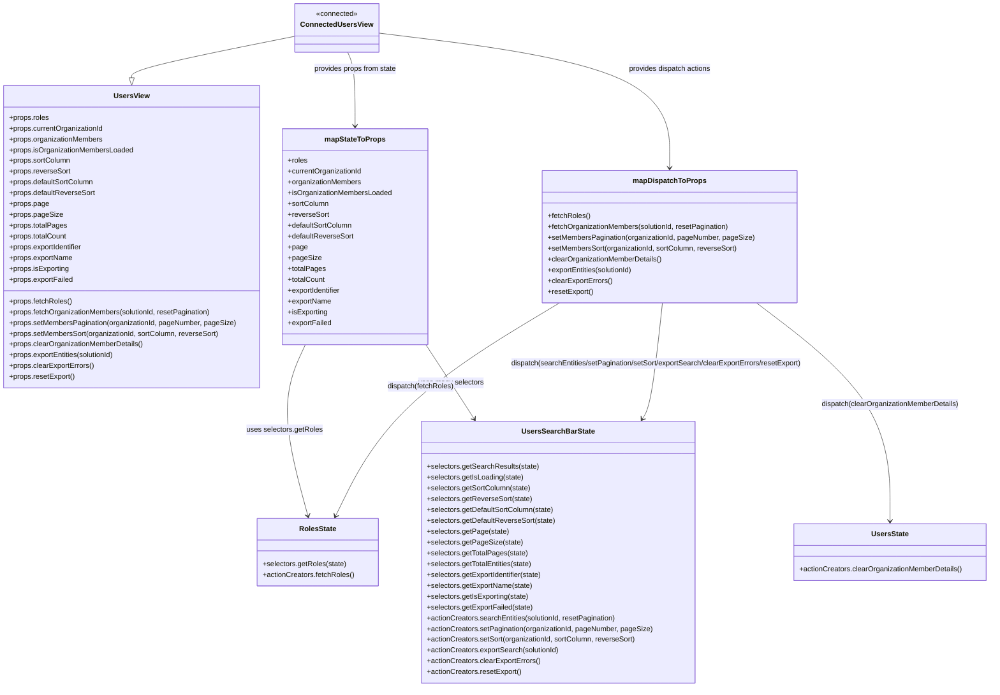

# Diagram: web/portal/src/modules/users/UsersViewContainer.js

> Auto-generated by Obscura crawlers

## Mermaid

### SVG

<svg id="container" width="2246.345703125" xmlns="http://www.w3.org/2000/svg" class="classDiagram" height="1526" viewBox="0 0 2246.345703125 1526" role="graphics-document document" aria-roledescription="class"><g><defs><marker id="container_class-aggregationStart" class="marker aggregation class" refX="18" refY="7" markerWidth="190" markerHeight="240" orient="auto"><path d="M 18,7 L9,13 L1,7 L9,1 Z"></path></marker></defs><defs><marker id="container_class-aggregationEnd" class="marker aggregation class" refX="1" refY="7" markerWidth="20" markerHeight="28" orient="auto"><path d="M 18,7 L9,13 L1,7 L9,1 Z"></path></marker></defs><defs><marker id="container_class-extensionStart" class="marker extension class" refX="18" refY="7" markerWidth="190" markerHeight="240" orient="auto"><path d="M 1,7 L18,13 V 1 Z"></path></marker></defs><defs><marker id="container_class-extensionEnd" class="marker extension class" refX="1" refY="7" markerWidth="20" markerHeight="28" orient="auto"><path d="M 1,1 V 13 L18,7 Z"></path></marker></defs><defs><marker id="container_class-compositionStart" class="marker composition class" refX="18" refY="7" markerWidth="190" markerHeight="240" orient="auto"><path d="M 18,7 L9,13 L1,7 L9,1 Z"></path></marker></defs><defs><marker id="container_class-compositionEnd" class="marker composition class" refX="1" refY="7" markerWidth="20" markerHeight="28" orient="auto"><path d="M 18,7 L9,13 L1,7 L9,1 Z"></path></marker></defs><defs><marker id="container_class-dependencyStart" class="marker dependency class" refX="6" refY="7" markerWidth="190" markerHeight="240" orient="auto"><path d="M 5,7 L9,13 L1,7 L9,1 Z"></path></marker></defs><defs><marker id="container_class-dependencyEnd" class="marker dependency class" refX="13" refY="7" markerWidth="20" markerHeight="28" orient="auto"><path d="M 18,7 L9,13 L14,7 L9,1 Z"></path></marker></defs><defs><marker id="container_class-lollipopStart" class="marker lollipop class" refX="13" refY="7" markerWidth="190" markerHeight="240" orient="auto"><circle stroke="black" fill="transparent" cx="7" cy="7" r="6"></circle></marker></defs><defs><marker id="container_class-lollipopEnd" class="marker lollipop class" refX="1" refY="7" markerWidth="190" markerHeight="240" orient="auto"><circle stroke="black" fill="transparent" cx="7" cy="7" r="6"></circle></marker></defs><g class="root"><g class="clusters"></g><g class="edgePaths"><path d="M696.723,78.295L629.172,90.746C561.621,103.197,426.52,128.098,358.969,143.841C291.418,159.583,291.418,166.167,291.418,169.458L291.418,172.75" id="id_ConnectedUsersView_UsersView_1" class="edge-thickness-normal edge-pattern-solid relation" style=";;;" data-edge="true" data-et="edge" data-id="id_ConnectedUsersView_UsersView_1" data-points="W3sieCI6Njk2LjcyMjY1NjI1LCJ5Ijo3OC4yOTQ4OTY3NDgxNjA0NX0seyJ4IjoyOTEuNDE3OTY4NzUsInkiOjE1M30seyJ4IjoyOTEuNDE3OTY4NzUsInkiOjE5MH1d" marker-end="url(#container_class-extensionEnd)"></path><path d="M785.129,116L785.129,122.167C785.129,128.333,785.129,140.667,785.129,168C785.129,195.333,785.129,237.667,785.129,258.833L785.129,280" id="id_ConnectedUsersView_mapStateToProps_2" class="edge-thickness-normal edge-pattern-solid relation" style=";;;" data-edge="true" data-et="edge" data-id="id_ConnectedUsersView_mapStateToProps_2" data-points="W3sieCI6Nzg1LjEyODkwNjI1LCJ5IjoxMTZ9LHsieCI6Nzg1LjEyODkwNjI1LCJ5IjoxNTN9LHsieCI6Nzg1LjEyODkwNjI1LCJ5IjoyODZ9XQ==" marker-end="url(#container_class-dependencyEnd)"></path><path d="M873.535,73.465L975.755,86.72C1077.975,99.976,1282.414,126.488,1384.634,176.411C1486.854,226.333,1486.854,299.667,1486.854,336.333L1486.854,373" id="id_ConnectedUsersView_mapDispatchToProps_3" class="edge-thickness-normal edge-pattern-solid relation" style=";;;" data-edge="true" data-et="edge" data-id="id_ConnectedUsersView_mapDispatchToProps_3" data-points="W3sieCI6ODczLjUzNTE1NjI1LCJ5Ijo3My40NjQ1NjY5MjkxMzM4NX0seyJ4IjoxNDg2Ljg1MzUxNTYyNSwieSI6MTUzfSx7IngiOjE0ODYuODUzNTE1NjI1LCJ5IjozNzl9XQ==" marker-end="url(#container_class-dependencyEnd)"></path><path d="M694.053,766L685.641,788.167C677.229,810.333,660.406,854.667,663.208,918.035C666.01,981.404,688.438,1063.807,699.653,1105.009L710.867,1146.211" id="id_mapStateToProps_RolesState_4" class="edge-thickness-normal edge-pattern-solid relation" style=";;;" data-edge="true" data-et="edge" data-id="id_mapStateToProps_RolesState_4" data-points="W3sieCI6Njk0LjA1MzE2ODk4NDU4NDQsInkiOjc2Nn0seyJ4Ijo2NDMuNTgyMDMxMjUsInkiOjg5OX0seyJ4Ijo3MTIuNDQyMzM1MTc1MzA0OCwieSI6MTE1Mn1d" marker-end="url(#container_class-dependencyEnd)"></path><path d="M945.422,744.26L964.362,770.05C983.303,795.84,1021.184,847.42,1043.649,878.543C1066.115,909.665,1073.165,920.33,1076.691,925.662L1080.216,930.995" id="id_mapStateToProps_UsersSearchBarState_5" class="edge-thickness-normal edge-pattern-solid relation" style=";;;" data-edge="true" data-et="edge" data-id="id_mapStateToProps_UsersSearchBarState_5" data-points="W3sieCI6OTQ1LjQyMTg3NSwieSI6NzQ0LjI2MDM4Mjg3NDA1MDh9LHsieCI6MTA1OS4wNjQ0NTMxMjUsInkiOjg5OX0seyJ4IjoxMDgzLjUyNDgyNDkzMzMwNzksInkiOjkzNn1d" marker-end="url(#container_class-dependencyEnd)"></path><path d="M1252.237,673L1192.119,710.667C1132.002,748.333,1011.768,823.667,931.687,902.6C851.606,981.533,811.679,1064.066,791.715,1105.332L771.751,1146.599" id="id_mapDispatchToProps_RolesState_6" class="edge-thickness-normal edge-pattern-solid relation" style=";;;" data-edge="true" data-et="edge" data-id="id_mapDispatchToProps_RolesState_6" data-points="W3sieCI6MTI1Mi4yMzY2NjMyNDU2NDM1LCJ5Ijo2NzN9LHsieCI6ODkxLjUzMzIwMzEyNSwieSI6ODk5fSx7IngiOjc2OS4xMzg0ODcyODA4NjksInkiOjExNTJ9XQ==" marker-end="url(#container_class-dependencyEnd)"></path><path d="M1486.854,673L1486.854,710.667C1486.854,748.333,1486.854,823.667,1483.428,866.659C1480.003,909.651,1473.153,920.302,1469.728,925.628L1466.303,930.954" id="id_mapDispatchToProps_UsersSearchBarState_7" class="edge-thickness-normal edge-pattern-solid relation" style=";;;" data-edge="true" data-et="edge" data-id="id_mapDispatchToProps_UsersSearchBarState_7" data-points="W3sieCI6MTQ4Ni44NTM1MTU2MjUsInkiOjY3M30seyJ4IjoxNDg2Ljg1MzUxNTYyNSwieSI6ODk5fSx7IngiOjE0NjMuMDU3MTk0NDA3MzkzNCwieSI6OTM2fV0=" marker-end="url(#container_class-dependencyEnd)"></path><path d="M1698.682,673L1752.96,710.667C1807.238,748.333,1915.794,823.667,1970.072,904.5C2024.35,985.333,2024.35,1071.667,2024.35,1114.833L2024.35,1158" id="id_mapDispatchToProps_UsersState_8" class="edge-thickness-normal edge-pattern-solid relation" style=";;;" data-edge="true" data-et="edge" data-id="id_mapDispatchToProps_UsersState_8" data-points="W3sieCI6MTY5OC42ODE3MzQ4Nzc2ODEsInkiOjY3M30seyJ4IjoyMDI0LjM0OTYwOTM3NSwieSI6ODk5fSx7IngiOjIwMjQuMzQ5NjA5Mzc1LCJ5IjoxMTY0fV0=" marker-end="url(#container_class-dependencyEnd)"></path></g><g class="edgeLabels"><g class="edgeLabel"><g class="label" data-id="id_ConnectedUsersView_UsersView_1" transform="translate(0, 0)"><foreignObject width="0" height="0">

</foreignObject></g></g><g class="edgeLabel" transform="translate(785.12890625, 153)"><g class="label" data-id="id_ConnectedUsersView_mapStateToProps_2" transform="translate(-93.5390625, -12)"><foreignObject width="187.078125" height="24">

provides props from state

</foreignObject></g></g><g class="edgeLabel" transform="translate(1486.853515625, 153)"><g class="label" data-id="id_ConnectedUsersView_mapDispatchToProps_3" transform="translate(-93.0546875, -12)"><foreignObject width="186.109375" height="24">

provides dispatch actions

</foreignObject></g></g><g class="edgeLabel" transform="translate(659.33264, 956.8694)"><g class="label" data-id="id_mapStateToProps_RolesState_4" transform="translate(-84.25, -12)"><foreignObject width="168.5" height="24">

uses selectors.getRoles

</foreignObject></g></g><g class="edgeLabel" transform="translate(1015.37048, 839.50479)"><g class="label" data-id="id_mapStateToProps_UsersSearchBarState_5" transform="translate(-73.234375, -12)"><foreignObject width="146.46875" height="24">

uses many selectors

</foreignObject></g></g><g class="edgeLabel" transform="translate(952.80291, 860.61125)"><g class="label" data-id="id_mapDispatchToProps_RolesState_6" transform="translate(-74.296875, -12)"><foreignObject width="148.59375" height="24">

dispatch(fetchRoles)

</foreignObject></g></g><g class="edgeLabel" transform="translate(1486.853515625, 899)"><g class="label" data-id="id_mapDispatchToProps_UsersSearchBarState_7" transform="translate(-334.5546875, -12)"><foreignObject width="669.109375" height="24">

dispatch(searchEntities/setPagination/setSort/exportSearch/clearExportErrors/resetExport)

</foreignObject></g></g><g class="edgeLabel" transform="translate(2024.349609375, 899)"><g class="label" data-id="id_mapDispatchToProps_UsersState_8" transform="translate(-154.828125, -12)"><foreignObject width="309.65625" height="24">

dispatch(clearOrganizationMemberDetails)

</foreignObject></g></g></g><g class="nodes"><g class="node default" id="classId-UsersView-0" transform="translate(291.41796875, 526)"><g class="basic label-container"><path d="M-283.41796875 -336 L283.41796875 -336 L283.41796875 336 L-283.41796875 336" stroke="none" stroke-width="0" fill="#ECECFF" style=""></path><path d="M-283.41796875 -336 C-146.64342879029675 -336, -9.868888830593505 -336, 283.41796875 -336 M-283.41796875 -336 C-121.4964461977915 -336, 40.425076354417 -336, 283.41796875 -336 M283.41796875 -336 C283.41796875 -191.1112987693754, 283.41796875 -46.22259753875079, 283.41796875 336 M283.41796875 -336 C283.41796875 -134.1262410833676, 283.41796875 67.7475178332648, 283.41796875 336 M283.41796875 336 C70.71719104693656 336, -141.98358665612687 336, -283.41796875 336 M283.41796875 336 C165.8229091010752 336, 48.227849452150366 336, -283.41796875 336 M-283.41796875 336 C-283.41796875 143.7624581016643, -283.41796875 -48.47508379667141, -283.41796875 -336 M-283.41796875 336 C-283.41796875 106.16208861003804, -283.41796875 -123.67582277992392, -283.41796875 -336" stroke="#9370DB" stroke-width="1.3" fill="none" stroke-dasharray="0 0" style=""></path></g><g class="annotation-group text" transform="translate(0, -312)"></g><g class="label-group text" transform="translate(-37.6484375, -312)"><g class="label" style="font-weight: bolder" transform="translate(0,-12)"><foreignObject width="75.296875" height="24">

UsersView

</foreignObject></g></g><g class="members-group text" transform="translate(-271.41796875, -264)"><g class="label" style="" transform="translate(0,-12)"><foreignObject width="89.1875" height="24">

+props.roles

</foreignObject></g><g class="label" style="" transform="translate(0,12)"><foreignObject width="212.109375" height="24">

+props.currentOrganizationId

</foreignObject></g><g class="label" style="" transform="translate(0,36)"><foreignObject width="210.0625" height="24">

+props.organizationMembers

</foreignObject></g><g class="label" style="" transform="translate(0,60)"><foreignObject width="277.234375" height="24">

+props.isOrganizationMembersLoaded

</foreignObject></g><g class="label" style="" transform="translate(0,84)"><foreignObject width="137.25" height="24">

+props.sortColumn

</foreignObject></g><g class="label" style="" transform="translate(0,108)"><foreignObject width="136.375" height="24">

+props.reverseSort

</foreignObject></g><g class="label" style="" transform="translate(0,132)"><foreignObject width="190.0625" height="24">

+props.defaultSortColumn

</foreignObject></g><g class="label" style="" transform="translate(0,156)"><foreignObject width="191.734375" height="24">

+props.defaultReverseSort

</foreignObject></g><g class="label" style="" transform="translate(0,180)"><foreignObject width="88.03125" height="24">

+props.page

</foreignObject></g><g class="label" style="" transform="translate(0,204)"><foreignObject width="116.859375" height="24">

+props.pageSize

</foreignObject></g><g class="label" style="" transform="translate(0,228)"><foreignObject width="127.859375" height="24">

+props.totalPages

</foreignObject></g><g class="label" style="" transform="translate(0,252)"><foreignObject width="129.09375" height="24">

+props.totalCount

</foreignObject></g><g class="label" style="" transform="translate(0,276)"><foreignObject width="167.09375" height="24">

+props.exportIdentifier

</foreignObject></g><g class="label" style="" transform="translate(0,300)"><foreignObject width="142.390625" height="24">

+props.exportName

</foreignObject></g><g class="label" style="" transform="translate(0,324)"><foreignObject width="134.671875" height="24">

+props.isExporting

</foreignObject></g><g class="label" style="" transform="translate(0,348)"><foreignObject width="143.34375" height="24">

+props.exportFailed

</foreignObject></g></g><g class="methods-group text" transform="translate(-271.41796875, 144)"><g class="label" style="" transform="translate(0,-12)"><foreignObject width="139.5625" height="24">

+props.fetchRoles()

</foreignObject></g><g class="label" style="" transform="translate(0,12)"><foreignObject width="454.03125" height="24">

+props.fetchOrganizationMembers(solutionId, resetPagination)

</foreignObject></g><g class="label" style="" transform="translate(0,36)"><foreignObject width="505.1875" height="24">

+props.setMembersPagination(organizationId, pageNumber, pageSize)

</foreignObject></g><g class="label" style="" transform="translate(0,60)"><foreignObject width="469.9375" height="24">

+props.setMembersSort(organizationId, sortColumn, reverseSort)

</foreignObject></g><g class="label" style="" transform="translate(0,84)"><foreignObject width="300.6875" height="24">

+props.clearOrganizationMemberDetails()

</foreignObject></g><g class="label" style="" transform="translate(0,108)"><foreignObject width="239.359375" height="24">

+props.exportEntities(solutionId)

</foreignObject></g><g class="label" style="" transform="translate(0,132)"><foreignObject width="189.40625" height="24">

+props.clearExportErrors()

</foreignObject></g><g class="label" style="" transform="translate(0,156)"><foreignObject width="147.21875" height="24">

+props.resetExport()

</foreignObject></g></g><g class="divider" style=""><path d="M-283.41796875 -288 C-73.38544210425943 -288, 136.64708454148115 -288, 283.41796875 -288 M-283.41796875 -288 C-73.63872380716157 -288, 136.14052113567686 -288, 283.41796875 -288" stroke="#9370DB" stroke-width="1.3" fill="none" stroke-dasharray="0 0" style=""></path></g><g class="divider" style=""><path d="M-283.41796875 120 C-151.6464689703691 120, -19.874969190738227 120, 283.41796875 120 M-283.41796875 120 C-139.08203139065353 120, 5.253905968692948 120, 283.41796875 120" stroke="#9370DB" stroke-width="1.3" fill="none" stroke-dasharray="0 0" style=""></path></g></g><g class="node default" id="classId-ConnectedUsersView-1" transform="translate(785.12890625, 62)"><g class="basic label-container"><path d="M-88.40625 -54 L88.40625 -54 L88.40625 54 L-88.40625 54" stroke="none" stroke-width="0" fill="#ECECFF" style=""></path><path d="M-88.40625 -54 C-31.80970924818123 -54, 24.786831503637544 -54, 88.40625 -54 M-88.40625 -54 C-40.82496193774797 -54, 6.7563261245040565 -54, 88.40625 -54 M88.40625 -54 C88.40625 -12.851745205523265, 88.40625 28.29650958895347, 88.40625 54 M88.40625 -54 C88.40625 -22.04627966205722, 88.40625 9.90744067588556, 88.40625 54 M88.40625 54 C43.07083058092381 54, -2.2645888381523775 54, -88.40625 54 M88.40625 54 C18.345069550466803 54, -51.71611089906639 54, -88.40625 54 M-88.40625 54 C-88.40625 14.881826315734877, -88.40625 -24.236347368530247, -88.40625 -54 M-88.40625 54 C-88.40625 16.91006232786053, -88.40625 -20.17987534427894, -88.40625 -54" stroke="#9370DB" stroke-width="1.3" fill="none" stroke-dasharray="0 0" style=""></path></g><g class="annotation-group text" transform="translate(-46.78125, -30)"><g class="label" style="" transform="translate(0,-12)"><foreignObject width="93.5625" height="24">

«connected»

</foreignObject></g></g><g class="label-group text" transform="translate(-76.40625, -6)"><g class="label" style="font-weight: bolder" transform="translate(0,-12)"><foreignObject width="152.8125" height="24">

ConnectedUsersView

</foreignObject></g></g><g class="members-group text" transform="translate(-76.40625, 42)"></g><g class="methods-group text" transform="translate(-76.40625, 72)"></g><g class="divider" style=""><path d="M-88.40625 18 C-32.01346295234017 18, 24.37932409531966 18, 88.40625 18 M-88.40625 18 C-35.941818400765825 18, 16.52261319846835 18, 88.40625 18" stroke="#9370DB" stroke-width="1.3" fill="none" stroke-dasharray="0 0" style=""></path></g><g class="divider" style=""><path d="M-88.40625 36 C-34.0116036659362 36, 20.3830426681276 36, 88.40625 36 M-88.40625 36 C-52.37479284951407 36, -16.343335699028145 36, 88.40625 36" stroke="#9370DB" stroke-width="1.3" fill="none" stroke-dasharray="0 0" style=""></path></g></g><g class="node default" id="classId-mapStateToProps-2" transform="translate(785.12890625, 526)"><g class="basic label-container"><path d="M-160.29296875 -240 L160.29296875 -240 L160.29296875 240 L-160.29296875 240" stroke="none" stroke-width="0" fill="#ECECFF" style=""></path><path d="M-160.29296875 -240 C-78.02524605159081 -240, 4.242476646818375 -240, 160.29296875 -240 M-160.29296875 -240 C-71.59346618634315 -240, 17.1060363773137 -240, 160.29296875 -240 M160.29296875 -240 C160.29296875 -113.49188112943101, 160.29296875 13.016237741137985, 160.29296875 240 M160.29296875 -240 C160.29296875 -82.42483737765127, 160.29296875 75.15032524469746, 160.29296875 240 M160.29296875 240 C95.32632694194639 240, 30.359685133892782 240, -160.29296875 240 M160.29296875 240 C48.381519690999426 240, -63.52992936800115 240, -160.29296875 240 M-160.29296875 240 C-160.29296875 135.75696507462447, -160.29296875 31.51393014924895, -160.29296875 -240 M-160.29296875 240 C-160.29296875 85.3961755019651, -160.29296875 -69.20764899606979, -160.29296875 -240" stroke="#9370DB" stroke-width="1.3" fill="none" stroke-dasharray="0 0" style=""></path></g><g class="annotation-group text" transform="translate(0, -216)"></g><g class="label-group text" transform="translate(-64.7109375, -216)"><g class="label" style="font-weight: bolder" transform="translate(0,-12)"><foreignObject width="129.421875" height="24">

mapStateToProps

</foreignObject></g></g><g class="members-group text" transform="translate(-148.29296875, -168)"><g class="label" style="" transform="translate(0,-12)"><foreignObject width="43.828125" height="24">

+roles

</foreignObject></g><g class="label" style="" transform="translate(0,12)"><foreignObject width="166.90625" height="24">

+currentOrganizationId

</foreignObject></g><g class="label" style="" transform="translate(0,36)"><foreignObject width="164.859375" height="24">

+organizationMembers

</foreignObject></g><g class="label" style="" transform="translate(0,60)"><foreignObject width="231.875" height="24">

+isOrganizationMembersLoaded

</foreignObject></g><g class="label" style="" transform="translate(0,84)"><foreignObject width="91.828125" height="24">

+sortColumn

</foreignObject></g><g class="label" style="" transform="translate(0,108)"><foreignObject width="91.015625" height="24">

+reverseSort

</foreignObject></g><g class="label" style="" transform="translate(0,132)"><foreignObject width="144.859375" height="24">

+defaultSortColumn

</foreignObject></g><g class="label" style="" transform="translate(0,156)"><foreignObject width="146.53125" height="24">

+defaultReverseSort

</foreignObject></g><g class="label" style="" transform="translate(0,180)"><foreignObject width="42.65625" height="24">

+page

</foreignObject></g><g class="label" style="" transform="translate(0,204)"><foreignObject width="71.5" height="24">

+pageSize

</foreignObject></g><g class="label" style="" transform="translate(0,228)"><foreignObject width="82.90625" height="24">

+totalPages

</foreignObject></g><g class="label" style="" transform="translate(0,252)"><foreignObject width="84.140625" height="24">

+totalCount

</foreignObject></g><g class="label" style="" transform="translate(0,276)"><foreignObject width="121.890625" height="24">

+exportIdentifier

</foreignObject></g><g class="label" style="" transform="translate(0,300)"><foreignObject width="97.1875" height="24">

+exportName

</foreignObject></g><g class="label" style="" transform="translate(0,324)"><foreignObject width="89.296875" height="24">

+isExporting

</foreignObject></g><g class="label" style="" transform="translate(0,348)"><foreignObject width="98.140625" height="24">

+exportFailed

</foreignObject></g></g><g class="methods-group text" transform="translate(-148.29296875, 240)"></g><g class="divider" style=""><path d="M-160.29296875 -192 C-40.59755263409082 -192, 79.09786348181837 -192, 160.29296875 -192 M-160.29296875 -192 C-85.90029413501928 -192, -11.50761952003856 -192, 160.29296875 -192" stroke="#9370DB" stroke-width="1.3" fill="none" stroke-dasharray="0 0" style=""></path></g><g class="divider" style=""><path d="M-160.29296875 216 C-64.07441347506824 216, 32.14414179986352 216, 160.29296875 216 M-160.29296875 216 C-88.78899852782918 216, -17.285028305658358 216, 160.29296875 216" stroke="#9370DB" stroke-width="1.3" fill="none" stroke-dasharray="0 0" style=""></path></g></g><g class="node default" id="classId-mapDispatchToProps-3" transform="translate(1486.853515625, 526)"><g class="basic label-container"><path d="M-280.48046875 -147 L280.48046875 -147 L280.48046875 147 L-280.48046875 147" stroke="none" stroke-width="0" fill="#ECECFF" style=""></path><path d="M-280.48046875 -147 C-111.88310233513579 -147, 56.71426407972842 -147, 280.48046875 -147 M-280.48046875 -147 C-60.44364521954108 -147, 159.59317831091784 -147, 280.48046875 -147 M280.48046875 -147 C280.48046875 -87.5355696849038, 280.48046875 -28.07113936980761, 280.48046875 147 M280.48046875 -147 C280.48046875 -47.839636656458225, 280.48046875 51.32072668708355, 280.48046875 147 M280.48046875 147 C124.67155511998087 147, -31.13735851003827 147, -280.48046875 147 M280.48046875 147 C61.08988171284997 147, -158.30070532430005 147, -280.48046875 147 M-280.48046875 147 C-280.48046875 33.92819464240853, -280.48046875 -79.14361071518294, -280.48046875 -147 M-280.48046875 147 C-280.48046875 56.296672530553124, -280.48046875 -34.40665493889375, -280.48046875 -147" stroke="#9370DB" stroke-width="1.3" fill="none" stroke-dasharray="0 0" style=""></path></g><g class="annotation-group text" transform="translate(0, -123)"></g><g class="label-group text" transform="translate(-77.1953125, -123)"><g class="label" style="font-weight: bolder" transform="translate(0,-12)"><foreignObject width="154.390625" height="24">

mapDispatchToProps

</foreignObject></g></g><g class="members-group text" transform="translate(-268.48046875, -75)"></g><g class="methods-group text" transform="translate(-268.48046875, -45)"><g class="label" style="" transform="translate(0,-12)"><foreignObject width="94.1875" height="24">

+fetchRoles()

</foreignObject></g><g class="label" style="" transform="translate(0,12)"><foreignObject width="408.65625" height="24">

+fetchOrganizationMembers(solutionId, resetPagination)

</foreignObject></g><g class="label" style="" transform="translate(0,36)"><foreignObject width="459.765625" height="24">

+setMembersPagination(organizationId, pageNumber, pageSize)

</foreignObject></g><g class="label" style="" transform="translate(0,60)"><foreignObject width="424.515625" height="24">

+setMembersSort(organizationId, sortColumn, reverseSort)

</foreignObject></g><g class="label" style="" transform="translate(0,84)"><foreignObject width="255.484375" height="24">

+clearOrganizationMemberDetails()

</foreignObject></g><g class="label" style="" transform="translate(0,108)"><foreignObject width="194.15625" height="24">

+exportEntities(solutionId)

</foreignObject></g><g class="label" style="" transform="translate(0,132)"><foreignObject width="144.203125" height="24">

+clearExportErrors()

</foreignObject></g><g class="label" style="" transform="translate(0,156)"><foreignObject width="101.859375" height="24">

+resetExport()

</foreignObject></g></g><g class="divider" style=""><path d="M-280.48046875 -99 C-140.24961969669377 -99, -0.01877064338754053 -99, 280.48046875 -99 M-280.48046875 -99 C-86.08344741054785 -99, 108.3135739289043 -99, 280.48046875 -99" stroke="#9370DB" stroke-width="1.3" fill="none" stroke-dasharray="0 0" style=""></path></g><g class="divider" style=""><path d="M-280.48046875 -75 C-115.24202292424187 -75, 49.99642290151627 -75, 280.48046875 -75 M-280.48046875 -75 C-69.06449723114974 -75, 142.3514742877005 -75, 280.48046875 -75" stroke="#9370DB" stroke-width="1.3" fill="none" stroke-dasharray="0 0" style=""></path></g></g><g class="node default" id="classId-RolesState-4" transform="translate(732.85546875, 1227)"><g class="basic label-container"><path d="M-133.2734375 -75 L133.2734375 -75 L133.2734375 75 L-133.2734375 75" stroke="none" stroke-width="0" fill="#ECECFF" style=""></path><path d="M-133.2734375 -75 C-60.34400890330669 -75, 12.585419693386626 -75, 133.2734375 -75 M-133.2734375 -75 C-29.6760402386509 -75, 73.9213570226982 -75, 133.2734375 -75 M133.2734375 -75 C133.2734375 -26.47593412213258, 133.2734375 22.048131755734843, 133.2734375 75 M133.2734375 -75 C133.2734375 -26.734476675386126, 133.2734375 21.531046649227747, 133.2734375 75 M133.2734375 75 C74.41914767040855 75, 15.564857840817098 75, -133.2734375 75 M133.2734375 75 C71.08579324784913 75, 8.898148995698264 75, -133.2734375 75 M-133.2734375 75 C-133.2734375 31.937300585167826, -133.2734375 -11.125398829664348, -133.2734375 -75 M-133.2734375 75 C-133.2734375 21.969655001181117, -133.2734375 -31.060689997637766, -133.2734375 -75" stroke="#9370DB" stroke-width="1.3" fill="none" stroke-dasharray="0 0" style=""></path></g><g class="annotation-group text" transform="translate(0, -51)"></g><g class="label-group text" transform="translate(-39.421875, -51)"><g class="label" style="font-weight: bolder" transform="translate(0,-12)"><foreignObject width="78.84375" height="24">

RolesState

</foreignObject></g></g><g class="members-group text" transform="translate(-121.2734375, -3)"></g><g class="methods-group text" transform="translate(-121.2734375, 27)"><g class="label" style="" transform="translate(0,-12)"><foreignObject width="185.734375" height="24">

+selectors.getRoles(state)

</foreignObject></g><g class="label" style="" transform="translate(0,12)"><foreignObject width="203.125" height="24">

+actionCreators.fetchRoles()

</foreignObject></g></g><g class="divider" style=""><path d="M-133.2734375 -27 C-78.69053810096582 -27, -24.107638701931663 -27, 133.2734375 -27 M-133.2734375 -27 C-46.16016131268654 -27, 40.95311487462692 -27, 133.2734375 -27" stroke="#9370DB" stroke-width="1.3" fill="none" stroke-dasharray="0 0" style=""></path></g><g class="divider" style=""><path d="M-133.2734375 -3 C-51.72250158791853 -3, 29.82843432416294 -3, 133.2734375 -3 M-133.2734375 -3 C-37.24394700003337 -3, 58.785543499933254 -3, 133.2734375 -3" stroke="#9370DB" stroke-width="1.3" fill="none" stroke-dasharray="0 0" style=""></path></g></g><g class="node default" id="classId-UsersSearchBarState-5" transform="translate(1275.90234375, 1227)"><g class="basic label-container"><path d="M-301.61328125 -291 L301.61328125 -291 L301.61328125 291 L-301.61328125 291" stroke="none" stroke-width="0" fill="#ECECFF" style=""></path><path d="M-301.61328125 -291 C-87.72869756992196 -291, 126.15588611015608 -291, 301.61328125 -291 M-301.61328125 -291 C-158.58189627371044 -291, -15.550511297420883 -291, 301.61328125 -291 M301.61328125 -291 C301.61328125 -76.64315895349966, 301.61328125 137.71368209300067, 301.61328125 291 M301.61328125 -291 C301.61328125 -65.53518572785396, 301.61328125 159.9296285442921, 301.61328125 291 M301.61328125 291 C101.12481291240348 291, -99.36365542519303 291, -301.61328125 291 M301.61328125 291 C86.80254356047408 291, -128.00819412905184 291, -301.61328125 291 M-301.61328125 291 C-301.61328125 150.99069348609174, -301.61328125 10.981386972183486, -301.61328125 -291 M-301.61328125 291 C-301.61328125 98.7018775885567, -301.61328125 -93.5962448228866, -301.61328125 -291" stroke="#9370DB" stroke-width="1.3" fill="none" stroke-dasharray="0 0" style=""></path></g><g class="annotation-group text" transform="translate(0, -267)"></g><g class="label-group text" transform="translate(-76.9765625, -267)"><g class="label" style="font-weight: bolder" transform="translate(0,-12)"><foreignObject width="153.953125" height="24">

UsersSearchBarState

</foreignObject></g></g><g class="members-group text" transform="translate(-289.61328125, -219)"></g><g class="methods-group text" transform="translate(-289.61328125, -189)"><g class="label" style="" transform="translate(0,-12)"><foreignObject width="247.734375" height="24">

+selectors.getSearchResults(state)

</foreignObject></g><g class="label" style="" transform="translate(0,12)"><foreignObject width="215.578125" height="24">

+selectors.getIsLoading(state)

</foreignObject></g><g class="label" style="" transform="translate(0,36)"><foreignObject width="231.234375" height="24">

+selectors.getSortColumn(state)

</foreignObject></g><g class="label" style="" transform="translate(0,60)"><foreignObject width="232.921875" height="24">

+selectors.getReverseSort(state)

</foreignObject></g><g class="label" style="" transform="translate(0,84)"><foreignObject width="283.75" height="24">

+selectors.getDefaultSortColumn(state)

</foreignObject></g><g class="label" style="" transform="translate(0,108)"><foreignObject width="285.4375" height="24">

+selectors.getDefaultReverseSort(state)

</foreignObject></g><g class="label" style="" transform="translate(0,132)"><foreignObject width="179.890625" height="24">

+selectors.getPage(state)

</foreignObject></g><g class="label" style="" transform="translate(0,156)"><foreignObject width="208.734375" height="24">

+selectors.getPageSize(state)

</foreignObject></g><g class="label" style="" transform="translate(0,180)"><foreignObject width="223" height="24">

+selectors.getTotalPages(state)

</foreignObject></g><g class="label" style="" transform="translate(0,204)"><foreignObject width="236.328125" height="24">

+selectors.getTotalEntities(state)

</foreignObject></g><g class="label" style="" transform="translate(0,228)"><foreignObject width="260.046875" height="24">

+selectors.getExportIdentifier(state)

</foreignObject></g><g class="label" style="" transform="translate(0,252)"><foreignObject width="235.34375" height="24">

+selectors.getExportName(state)

</foreignObject></g><g class="label" style="" transform="translate(0,276)"><foreignObject width="227.671875" height="24">

+selectors.getIsExporting(state)

</foreignObject></g><g class="label" style="" transform="translate(0,300)"><foreignObject width="236.28125" height="24">

+selectors.getExportFailed(state)

</foreignObject></g><g class="label" style="" transform="translate(0,324)"><foreignObject width="424.8125" height="24">

+actionCreators.searchEntities(solutionId, resetPagination)

</foreignObject></g><g class="label" style="" transform="translate(0,348)"><foreignObject width="502.25" height="24">

+actionCreators.setPagination(organizationId, pageNumber, pageSize)

</foreignObject></g><g class="label" style="" transform="translate(0,372)"><foreignObject width="467" height="24">

+actionCreators.setSort(organizationId, sortColumn, reverseSort)

</foreignObject></g><g class="label" style="" transform="translate(0,396)"><foreignObject width="297.078125" height="24">

+actionCreators.exportSearch(solutionId)

</foreignObject></g><g class="label" style="" transform="translate(0,420)"><foreignObject width="252.96875" height="24">

+actionCreators.clearExportErrors()

</foreignObject></g><g class="label" style="" transform="translate(0,444)"><foreignObject width="210.796875" height="24">

+actionCreators.resetExport()

</foreignObject></g></g><g class="divider" style=""><path d="M-301.61328125 -243 C-81.8549394346322 -243, 137.9034023807356 -243, 301.61328125 -243 M-301.61328125 -243 C-105.97321469002708 -243, 89.66685186994584 -243, 301.61328125 -243" stroke="#9370DB" stroke-width="1.3" fill="none" stroke-dasharray="0 0" style=""></path></g><g class="divider" style=""><path d="M-301.61328125 -219 C-140.41302344978942 -219, 20.78723435042116 -219, 301.61328125 -219 M-301.61328125 -219 C-165.9898700773718 -219, -30.36645890474358 -219, 301.61328125 -219" stroke="#9370DB" stroke-width="1.3" fill="none" stroke-dasharray="0 0" style=""></path></g></g><g class="node default" id="classId-UsersState-6" transform="translate(2024.349609375, 1227)"><g class="basic label-container"><path d="M-213.99609375 -63 L213.99609375 -63 L213.99609375 63 L-213.99609375 63" stroke="none" stroke-width="0" fill="#ECECFF" style=""></path><path d="M-213.99609375 -63 C-71.98953864722483 -63, 70.01701645555033 -63, 213.99609375 -63 M-213.99609375 -63 C-97.53283489377289 -63, 18.930423962454228 -63, 213.99609375 -63 M213.99609375 -63 C213.99609375 -34.034166470234865, 213.99609375 -5.0683329404697375, 213.99609375 63 M213.99609375 -63 C213.99609375 -20.52632347124873, 213.99609375 21.94735305750254, 213.99609375 63 M213.99609375 63 C83.8071029920101 63, -46.3818877659798 63, -213.99609375 63 M213.99609375 63 C79.42768928111346 63, -55.14071518777308 63, -213.99609375 63 M-213.99609375 63 C-213.99609375 31.803451070822348, -213.99609375 0.6069021416446958, -213.99609375 -63 M-213.99609375 63 C-213.99609375 17.820696583519428, -213.99609375 -27.358606832961144, -213.99609375 -63" stroke="#9370DB" stroke-width="1.3" fill="none" stroke-dasharray="0 0" style=""></path></g><g class="annotation-group text" transform="translate(0, -39)"></g><g class="label-group text" transform="translate(-39.7421875, -39)"><g class="label" style="font-weight: bolder" transform="translate(0,-12)"><foreignObject width="79.484375" height="24">

UsersState

</foreignObject></g></g><g class="members-group text" transform="translate(-201.99609375, 9)"></g><g class="methods-group text" transform="translate(-201.99609375, 39)"><g class="label" style="" transform="translate(0,-12)"><foreignObject width="364.25" height="24">

+actionCreators.clearOrganizationMemberDetails()

</foreignObject></g></g><g class="divider" style=""><path d="M-213.99609375 -15 C-44.37742274742038 -15, 125.24124825515923 -15, 213.99609375 -15 M-213.99609375 -15 C-65.2155330293613 -15, 83.56502769127741 -15, 213.99609375 -15" stroke="#9370DB" stroke-width="1.3" fill="none" stroke-dasharray="0 0" style=""></path></g><g class="divider" style=""><path d="M-213.99609375 9 C-76.07732606697672 9, 61.84144161604655 9, 213.99609375 9 M-213.99609375 9 C-68.94258054386353 9, 76.11093266227294 9, 213.99609375 9" stroke="#9370DB" stroke-width="1.3" fill="none" stroke-dasharray="0 0" style=""></path></g></g></g></g></g></svg>
