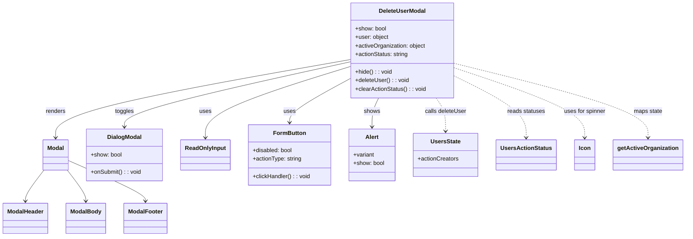

# Diagram: web/portal/src/modules/users/components/DeleteUserModal.js


> Auto-generated by Obscura crawlers

## Diagram 1



### SVG

<svg id="container" width="1867.28125" xmlns="http://www.w3.org/2000/svg" class="classDiagram" height="656" viewBox="0 0 1867.28125 656" role="graphics-document document" aria-roledescription="class"><style>#container{font-family:"trebuchet ms",verdana,arial,sans-serif;font-size:16px;fill:#333;}@keyframes edge-animation-frame{from{stroke-dashoffset:0;}}@keyframes dash{to{stroke-dashoffset:0;}}#container .edge-animation-slow{stroke-dasharray:9,5!important;stroke-dashoffset:900;animation:dash 50s linear infinite;stroke-linecap:round;}#container .edge-animation-fast{stroke-dasharray:9,5!important;stroke-dashoffset:900;animation:dash 20s linear infinite;stroke-linecap:round;}#container .error-icon{fill:#552222;}#container .error-text{fill:#552222;stroke:#552222;}#container .edge-thickness-normal{stroke-width:1px;}#container .edge-thickness-thick{stroke-width:3.5px;}#container .edge-pattern-solid{stroke-dasharray:0;}#container .edge-thickness-invisible{stroke-width:0;fill:none;}#container .edge-pattern-dashed{stroke-dasharray:3;}#container .edge-pattern-dotted{stroke-dasharray:2;}#container .marker{fill:#333333;stroke:#333333;}#container .marker.cross{stroke:#333333;}#container svg{font-family:"trebuchet ms",verdana,arial,sans-serif;font-size:16px;}#container p{margin:0;}#container g.classGroup text{fill:#9370DB;stroke:none;font-family:"trebuchet ms",verdana,arial,sans-serif;font-size:10px;}#container g.classGroup text .title{font-weight:bolder;}#container .nodeLabel,#container .edgeLabel{color:#131300;}#container .edgeLabel .label rect{fill:#ECECFF;}#container .label text{fill:#131300;}#container .labelBkg{background:#ECECFF;}#container .edgeLabel .label span{background:#ECECFF;}#container .classTitle{font-weight:bolder;}#container .node rect,#container .node circle,#container .node ellipse,#container .node polygon,#container .node path{fill:#ECECFF;stroke:#9370DB;stroke-width:1px;}#container .divider{stroke:#9370DB;stroke-width:1;}#container g.clickable{cursor:pointer;}#container g.classGroup rect{fill:#ECECFF;stroke:#9370DB;}#container g.classGroup line{stroke:#9370DB;stroke-width:1;}#container .classLabel .box{stroke:none;stroke-width:0;fill:#ECECFF;opacity:0.5;}#container .classLabel .label{fill:#9370DB;font-size:10px;}#container .relation{stroke:#333333;stroke-width:1;fill:none;}#container .dashed-line{stroke-dasharray:3;}#container .dotted-line{stroke-dasharray:1 2;}#container #compositionStart,#container .composition{fill:#333333!important;stroke:#333333!important;stroke-width:1;}#container #compositionEnd,#container .composition{fill:#333333!important;stroke:#333333!important;stroke-width:1;}#container #dependencyStart,#container .dependency{fill:#333333!important;stroke:#333333!important;stroke-width:1;}#container #dependencyStart,#container .dependency{fill:#333333!important;stroke:#333333!important;stroke-width:1;}#container #extensionStart,#container .extension{fill:transparent!important;stroke:#333333!important;stroke-width:1;}#container #extensionEnd,#container .extension{fill:transparent!important;stroke:#333333!important;stroke-width:1;}#container #aggregationStart,#container .aggregation{fill:transparent!important;stroke:#333333!important;stroke-width:1;}#container #aggregationEnd,#container .aggregation{fill:transparent!important;stroke:#333333!important;stroke-width:1;}#container #lollipopStart,#container .lollipop{fill:#ECECFF!important;stroke:#333333!important;stroke-width:1;}#container #lollipopEnd,#container .lollipop{fill:#ECECFF!important;stroke:#333333!important;stroke-width:1;}#container .edgeTerminals{font-size:11px;line-height:initial;}#container .classTitleText{text-anchor:middle;font-size:18px;fill:#333;}#container .label-icon{display:inline-block;height:1em;overflow:visible;vertical-align:-0.125em;}#container .node .label-icon path{fill:currentColor;stroke:revert;stroke-width:revert;}#container :root{--mermaid-font-family:"trebuchet ms",verdana,arial,sans-serif;}</style><g><defs><marker id="container_class-aggregationStart" class="marker aggregation class" refX="18" refY="7" markerWidth="190" markerHeight="240" orient="auto"><path d="M 18,7 L9,13 L1,7 L9,1 Z"></path></marker></defs><defs><marker id="container_class-aggregationEnd" class="marker aggregation class" refX="1" refY="7" markerWidth="20" markerHeight="28" orient="auto"><path d="M 18,7 L9,13 L1,7 L9,1 Z"></path></marker></defs><defs><marker id="container_class-extensionStart" class="marker extension class" refX="18" refY="7" markerWidth="190" markerHeight="240" orient="auto"><path d="M 1,7 L18,13 V 1 Z"></path></marker></defs><defs><marker id="container_class-extensionEnd" class="marker extension class" refX="1" refY="7" markerWidth="20" markerHeight="28" orient="auto"><path d="M 1,1 V 13 L18,7 Z"></path></marker></defs><defs><marker id="container_class-compositionStart" class="marker composition class" refX="18" refY="7" markerWidth="190" markerHeight="240" orient="auto"><path d="M 18,7 L9,13 L1,7 L9,1 Z"></path></marker></defs><defs><marker id="container_class-compositionEnd" class="marker composition class" refX="1" refY="7" markerWidth="20" markerHeight="28" orient="auto"><path d="M 18,7 L9,13 L1,7 L9,1 Z"></path></marker></defs><defs><marker id="container_class-dependencyStart" class="marker dependency class" refX="6" refY="7" markerWidth="190" markerHeight="240" orient="auto"><path d="M 5,7 L9,13 L1,7 L9,1 Z"></path></marker></defs><defs><marker id="container_class-dependencyEnd" class="marker dependency class" refX="13" refY="7" markerWidth="20" markerHeight="28" orient="auto"><path d="M 18,7 L9,13 L14,7 L9,1 Z"></path></marker></defs><defs><marker id="container_class-lollipopStart" class="marker lollipop class" refX="13" refY="7" markerWidth="190" markerHeight="240" orient="auto"><circle stroke="black" fill="transparent" cx="7" cy="7" r="6"></circle></marker></defs><defs><marker id="container_class-lollipopEnd" class="marker lollipop class" refX="1" refY="7" markerWidth="190" markerHeight="240" orient="auto"><circle stroke="black" fill="transparent" cx="7" cy="7" r="6"></circle></marker></defs><g class="root"><g class="clusters"></g><g class="edgePaths"><path d="M959.828,165.235L825.001,189.196C690.174,213.157,420.521,261.078,285.694,297.206C150.867,333.333,150.867,357.667,150.867,369.833L150.867,382" id="id_DeleteUserModal_Modal_1" class="edge-thickness-normal edge-pattern-solid relation" style=";;;" data-edge="true" data-et="edge" data-id="id_DeleteUserModal_Modal_1" data-points="W3sieCI6OTU5LjgyODEyNSwieSI6MTY1LjIzNDkzNjAyMjUxMDIzfSx7IngiOjE1MC44NjcxODc1LCJ5IjozMDl9LHsieCI6MTUwLjg2NzE4NzUsInkiOjM4OH1d" marker-end="url(#container_class-dependencyEnd)"></path><path d="M119.289,472L110.893,483.167C102.497,494.333,85.706,516.667,77.31,531C68.914,545.333,68.914,551.667,68.914,554.833L68.914,558" id="id_Modal_ModalHeader_2" class="edge-thickness-normal edge-pattern-solid relation" style=";;;" data-edge="true" data-et="edge" data-id="id_Modal_ModalHeader_2" data-points="W3sieCI6MTE5LjI4ODkxOTE1MTM3NjE1LCJ5Ijo0NzJ9LHsieCI6NjguOTE0MDYyNSwieSI6NTM5fSx7IngiOjY4LjkxNDA2MjUsInkiOjU2NH1d" marker-end="url(#container_class-dependencyEnd)"></path><path d="M182.445,472L190.841,483.167C199.237,494.333,216.029,516.667,224.425,531C232.82,545.333,232.82,551.667,232.82,554.833L232.82,558" id="id_Modal_ModalBody_3" class="edge-thickness-normal edge-pattern-solid relation" style=";;;" data-edge="true" data-et="edge" data-id="id_Modal_ModalBody_3" data-points="W3sieCI6MTgyLjQ0NTQ1NTg0ODYyMzg1LCJ5Ijo0NzJ9LHsieCI6MjMyLjgyMDMxMjUsInkiOjUzOX0seyJ4IjoyMzIuODIwMzEyNSwieSI6NTY0fV0=" marker-end="url(#container_class-dependencyEnd)"></path><path d="M185.313,445.456L220.057,461.047C254.802,476.637,324.292,507.819,359.036,526.576C393.781,545.333,393.781,551.667,393.781,554.833L393.781,558" id="id_Modal_ModalFooter_4" class="edge-thickness-normal edge-pattern-solid relation" style=";;;" data-edge="true" data-et="edge" data-id="id_Modal_ModalFooter_4" data-points="W3sieCI6MTg1LjMxMjUsInkiOjQ0NS40NTYyNDQxNzA3MTM2Nn0seyJ4IjozOTMuNzgxMjUsInkiOjUzOX0seyJ4IjozOTMuNzgxMjUsInkiOjU2NH1d" marker-end="url(#container_class-dependencyEnd)"></path><path d="M959.828,184.413L893.441,205.178C827.055,225.942,694.281,267.471,627.895,300.402C561.508,333.333,561.508,357.667,561.508,369.833L561.508,382" id="id_DeleteUserModal_ReadOnlyInput_5" class="edge-thickness-normal edge-pattern-solid relation" style=";;;" data-edge="true" data-et="edge" data-id="id_DeleteUserModal_ReadOnlyInput_5" data-points="W3sieCI6OTU5LjgyODEyNSwieSI6MTg0LjQxMzQ5NDY5NzExNzU5fSx7IngiOjU2MS41MDc4MTI1LCJ5IjozMDl9LHsieCI6NTYxLjUwNzgxMjUsInkiOjM4OH1d" marker-end="url(#container_class-dependencyEnd)"></path><path d="M1037.813,272L1034.823,278.167C1031.833,284.333,1025.852,296.667,1022.861,310C1019.871,323.333,1019.871,337.667,1019.871,344.833L1019.871,352" id="id_DeleteUserModal_Alert_6" class="edge-thickness-normal edge-pattern-solid relation" style=";;;" data-edge="true" data-et="edge" data-id="id_DeleteUserModal_Alert_6" data-points="W3sieCI6MTAzNy44MTM0OTM4OTc5MjksInkiOjI3Mn0seyJ4IjoxMDE5Ljg3MTA5Mzc1LCJ5IjozMDl9LHsieCI6MTAxOS44NzEwOTM3NSwieSI6MzU4fV0=" marker-end="url(#container_class-dependencyEnd)"></path><path d="M959.828,217.388L931.813,232.657C903.797,247.926,847.766,278.463,819.75,298.898C791.734,319.333,791.734,329.667,791.734,334.833L791.734,340" id="id_DeleteUserModal_FormButton_7" class="edge-thickness-normal edge-pattern-solid relation" style=";;;" data-edge="true" data-et="edge" data-id="id_DeleteUserModal_FormButton_7" data-points="W3sieCI6OTU5LjgyODEyNSwieSI6MjE3LjM4ODM0NTExMTY3Mzh9LHsieCI6NzkxLjczNDM3NSwieSI6MzA5fSx7IngiOjc5MS43MzQzNzUsInkiOjM0Nn1d" marker-end="url(#container_class-dependencyEnd)"></path><path d="M959.828,171.51L856.565,194.425C753.302,217.34,546.776,263.17,443.513,293.252C340.25,323.333,340.25,337.667,340.25,344.833L340.25,352" id="id_DeleteUserModal_DialogModal_8" class="edge-thickness-normal edge-pattern-solid relation" style=";;;" data-edge="true" data-et="edge" data-id="id_DeleteUserModal_DialogModal_8" data-points="W3sieCI6OTU5LjgyODEyNSwieSI6MTcxLjUxMDE3ODg1NDQ0OTN9LHsieCI6MzQwLjI1LCJ5IjozMDl9LHsieCI6MzQwLjI1LCJ5IjozNTh9XQ==" marker-end="url(#container_class-dependencyEnd)"></path><path d="M1196.089,272L1200.493,278.167C1204.897,284.333,1213.704,296.667,1218.108,312C1222.512,327.333,1222.512,345.667,1222.512,354.833L1222.512,364" id="id_DeleteUserModal_UsersState_9" class="edge-thickness-normal edge-pattern-dashed relation" style=";;;" data-edge="true" data-et="edge" data-id="id_DeleteUserModal_UsersState_9" data-points="W3sieCI6MTE5Ni4wODkwMTE2NDk0MDgzLCJ5IjoyNzJ9LHsieCI6MTIyMi41MTE3MTg3NSwieSI6MzA5fSx7IngiOjEyMjIuNTExNzE4NzUsInkiOjM3MH1d" marker-end="url(#container_class-dependencyEnd)"></path><path d="M1243.82,210.958L1276.52,227.298C1309.219,243.639,1374.617,276.319,1407.316,304.826C1440.016,333.333,1440.016,357.667,1440.016,369.833L1440.016,382" id="id_DeleteUserModal_UsersActionStatus_10" class="edge-thickness-normal edge-pattern-dashed relation" style=";;;" data-edge="true" data-et="edge" data-id="id_DeleteUserModal_UsersActionStatus_10" data-points="W3sieCI6MTI0My44MjAzMTI1LCJ5IjoyMTAuOTU3ODY0MDk3ODU1MX0seyJ4IjoxNDQwLjAxNTYyNSwieSI6MzA5fSx7IngiOjE0NDAuMDE1NjI1LCJ5IjozODh9XQ==" marker-end="url(#container_class-dependencyEnd)"></path><path d="M1243.82,188.52L1302.586,208.6C1361.352,228.68,1478.883,268.84,1537.648,301.087C1596.414,333.333,1596.414,357.667,1596.414,369.833L1596.414,382" id="id_DeleteUserModal_Icon_11" class="edge-thickness-normal edge-pattern-dashed relation" style=";;;" data-edge="true" data-et="edge" data-id="id_DeleteUserModal_Icon_11" data-points="W3sieCI6MTI0My44MjAzMTI1LCJ5IjoxODguNTE5Njc3NzYzMjk4Mn0seyJ4IjoxNTk2LjQxNDA2MjUsInkiOjMwOX0seyJ4IjoxNTk2LjQxNDA2MjUsInkiOjM4OH1d" marker-end="url(#container_class-dependencyEnd)"></path><path d="M1243.82,176.104L1330.934,198.253C1418.047,220.403,1592.273,264.701,1679.387,299.017C1766.5,333.333,1766.5,357.667,1766.5,369.833L1766.5,382" id="id_DeleteUserModal_getActiveOrganization_12" class="edge-thickness-normal edge-pattern-dashed relation" style=";;;" data-edge="true" data-et="edge" data-id="id_DeleteUserModal_getActiveOrganization_12" data-points="W3sieCI6MTI0My44MjAzMTI1LCJ5IjoxNzYuMTAzODI3NjQxNTMxMDR9LHsieCI6MTc2Ni41LCJ5IjozMDl9LHsieCI6MTc2Ni41LCJ5IjozODh9XQ==" marker-end="url(#container_class-dependencyEnd)"></path></g><g class="edgeLabels"><g class="edgeLabel" transform="translate(150.8671875, 309)"><g class="label" data-id="id_DeleteUserModal_Modal_1" transform="translate(-27.75, -12)"><foreignObject width="55.5" height="24"><div xmlns="http://www.w3.org/1999/xhtml" class="labelBkg" style="display: table-cell; white-space: nowrap; line-height: 1.5; max-width: 200px; text-align: center;"><span class="edgeLabel"><p>renders</p></span></div></foreignObject></g></g><g class="edgeLabel"><g class="label" data-id="id_Modal_ModalHeader_2" transform="translate(0, 0)"><foreignObject width="0" height="0"><div xmlns="http://www.w3.org/1999/xhtml" class="labelBkg" style="display: table-cell; white-space: nowrap; line-height: 1.5; max-width: 200px; text-align: center;"><span class="edgeLabel"></span></div></foreignObject></g></g><g class="edgeLabel"><g class="label" data-id="id_Modal_ModalBody_3" transform="translate(0, 0)"><foreignObject width="0" height="0"><div xmlns="http://www.w3.org/1999/xhtml" class="labelBkg" style="display: table-cell; white-space: nowrap; line-height: 1.5; max-width: 200px; text-align: center;"><span class="edgeLabel"></span></div></foreignObject></g></g><g class="edgeLabel"><g class="label" data-id="id_Modal_ModalFooter_4" transform="translate(0, 0)"><foreignObject width="0" height="0"><div xmlns="http://www.w3.org/1999/xhtml" class="labelBkg" style="display: table-cell; white-space: nowrap; line-height: 1.5; max-width: 200px; text-align: center;"><span class="edgeLabel"></span></div></foreignObject></g></g><g class="edgeLabel" transform="translate(561.5078125, 309)"><g class="label" data-id="id_DeleteUserModal_ReadOnlyInput_5" transform="translate(-16.4921875, -12)"><foreignObject width="32.984375" height="24"><div xmlns="http://www.w3.org/1999/xhtml" class="labelBkg" style="display: table-cell; white-space: nowrap; line-height: 1.5; max-width: 200px; text-align: center;"><span class="edgeLabel"><p>uses</p></span></div></foreignObject></g></g><g class="edgeLabel" transform="translate(1019.87109375, 309)"><g class="label" data-id="id_DeleteUserModal_Alert_6" transform="translate(-22.5703125, -12)"><foreignObject width="45.140625" height="24"><div xmlns="http://www.w3.org/1999/xhtml" class="labelBkg" style="display: table-cell; white-space: nowrap; line-height: 1.5; max-width: 200px; text-align: center;"><span class="edgeLabel"><p>shows</p></span></div></foreignObject></g></g><g class="edgeLabel" transform="translate(791.734375, 309)"><g class="label" data-id="id_DeleteUserModal_FormButton_7" transform="translate(-16.4921875, -12)"><foreignObject width="32.984375" height="24"><div xmlns="http://www.w3.org/1999/xhtml" class="labelBkg" style="display: table-cell; white-space: nowrap; line-height: 1.5; max-width: 200px; text-align: center;"><span class="edgeLabel"><p>uses</p></span></div></foreignObject></g></g><g class="edgeLabel" transform="translate(340.25, 309)"><g class="label" data-id="id_DeleteUserModal_DialogModal_8" transform="translate(-26.1640625, -12)"><foreignObject width="52.328125" height="24"><div xmlns="http://www.w3.org/1999/xhtml" class="labelBkg" style="display: table-cell; white-space: nowrap; line-height: 1.5; max-width: 200px; text-align: center;"><span class="edgeLabel"><p>toggles</p></span></div></foreignObject></g></g><g class="edgeLabel" transform="translate(1222.51171875, 309)"><g class="label" data-id="id_DeleteUserModal_UsersState_9" transform="translate(-57.9375, -12)"><foreignObject width="115.875" height="24"><div xmlns="http://www.w3.org/1999/xhtml" class="labelBkg" style="display: table-cell; white-space: nowrap; line-height: 1.5; max-width: 200px; text-align: center;"><span class="edgeLabel"><p>calls deleteUser</p></span></div></foreignObject></g></g><g class="edgeLabel" transform="translate(1440.015625, 309)"><g class="label" data-id="id_DeleteUserModal_UsersActionStatus_10" transform="translate(-52.421875, -12)"><foreignObject width="104.84375" height="24"><div xmlns="http://www.w3.org/1999/xhtml" class="labelBkg" style="display: table-cell; white-space: nowrap; line-height: 1.5; max-width: 200px; text-align: center;"><span class="edgeLabel"><p>reads statuses</p></span></div></foreignObject></g></g><g class="edgeLabel" transform="translate(1596.4140625, 309)"><g class="label" data-id="id_DeleteUserModal_Icon_11" transform="translate(-58.65625, -12)"><foreignObject width="117.3125" height="24"><div xmlns="http://www.w3.org/1999/xhtml" class="labelBkg" style="display: table-cell; white-space: nowrap; line-height: 1.5; max-width: 200px; text-align: center;"><span class="edgeLabel"><p>uses for spinner</p></span></div></foreignObject></g></g><g class="edgeLabel" transform="translate(1766.5, 309)"><g class="label" data-id="id_DeleteUserModal_getActiveOrganization_12" transform="translate(-39.8671875, -12)"><foreignObject width="79.734375" height="24"><div xmlns="http://www.w3.org/1999/xhtml" class="labelBkg" style="display: table-cell; white-space: nowrap; line-height: 1.5; max-width: 200px; text-align: center;"><span class="edgeLabel"><p>maps state</p></span></div></foreignObject></g></g></g><g class="nodes"><g class="node default" id="classId-DeleteUserModal-0" transform="translate(1101.82421875, 140)"><g class="basic label-container"><path d="M-141.99609375 -132 L141.99609375 -132 L141.99609375 132 L-141.99609375 132" stroke="none" stroke-width="0" fill="#ECECFF" style=""></path><path d="M-141.99609375 -132 C-44.98728969925472 -132, 52.021514351490566 -132, 141.99609375 -132 M-141.99609375 -132 C-58.548841690516866 -132, 24.898410368966267 -132, 141.99609375 -132 M141.99609375 -132 C141.99609375 -31.47391432756207, 141.99609375 69.05217134487586, 141.99609375 132 M141.99609375 -132 C141.99609375 -66.25160748672175, 141.99609375 -0.5032149734435052, 141.99609375 132 M141.99609375 132 C28.75733653661969 132, -84.48142067676062 132, -141.99609375 132 M141.99609375 132 C56.70815517225091 132, -28.579783405498176 132, -141.99609375 132 M-141.99609375 132 C-141.99609375 54.02441904476906, -141.99609375 -23.951161910461877, -141.99609375 -132 M-141.99609375 132 C-141.99609375 66.86247013762133, -141.99609375 1.724940275242659, -141.99609375 -132" stroke="#9370DB" stroke-width="1.3" fill="none" stroke-dasharray="0 0" style=""></path></g><g class="annotation-group text" transform="translate(0, -108)"></g><g class="label-group text" transform="translate(-62.8359375, -108)"><g class="label" style="font-weight: bolder" transform="translate(0,-12)"><foreignObject width="125.671875" height="24"><div xmlns="http://www.w3.org/1999/xhtml" style="display: table-cell; white-space: nowrap; line-height: 1.5; max-width: 174px; text-align: center;"><span class="nodeLabel markdown-node-label" style=""><p>DeleteUserModal</p></span></div></foreignObject></g></g><g class="members-group text" transform="translate(-129.99609375, -60)"><g class="label" style="" transform="translate(0,-12)"><foreignObject width="86.6875" height="24"><div xmlns="http://www.w3.org/1999/xhtml" style="display: table-cell; white-space: nowrap; line-height: 1.5; max-width: 144px; text-align: center;"><span class="nodeLabel markdown-node-label" style=""><p>+show: bool</p></span></div></foreignObject></g><g class="label" style="" transform="translate(0,12)"><foreignObject width="93.390625" height="24"><div xmlns="http://www.w3.org/1999/xhtml" style="display: table-cell; white-space: nowrap; line-height: 1.5; max-width: 151px; text-align: center;"><span class="nodeLabel markdown-node-label" style=""><p>+user: object</p></span></div></foreignObject></g><g class="label" style="" transform="translate(0,36)"><foreignObject width="196.546875" height="24"><div xmlns="http://www.w3.org/1999/xhtml" style="display: table-cell; white-space: nowrap; line-height: 1.5; max-width: 254px; text-align: center;"><span class="nodeLabel markdown-node-label" style=""><p>+activeOrganization: object</p></span></div></foreignObject></g><g class="label" style="" transform="translate(0,60)"><foreignObject width="148.46875" height="24"><div xmlns="http://www.w3.org/1999/xhtml" style="display: table-cell; white-space: nowrap; line-height: 1.5; max-width: 207px; text-align: center;"><span class="nodeLabel markdown-node-label" style=""><p>+actionStatus: string</p></span></div></foreignObject></g></g><g class="methods-group text" transform="translate(-129.99609375, 60)"><g class="label" style="" transform="translate(0,-12)"><foreignObject width="102.171875" height="24"><div xmlns="http://www.w3.org/1999/xhtml" style="display: table-cell; white-space: nowrap; line-height: 1.5; max-width: 160px; text-align: center;"><span class="nodeLabel markdown-node-label" style=""><p>+hide() : : void</p></span></div></foreignObject></g><g class="label" style="" transform="translate(0,12)"><foreignObject width="148.75" height="24"><div xmlns="http://www.w3.org/1999/xhtml" style="display: table-cell; white-space: nowrap; line-height: 1.5; max-width: 206px; text-align: center;"><span class="nodeLabel markdown-node-label" style=""><p>+deleteUser() : : void</p></span></div></foreignObject></g><g class="label" style="" transform="translate(0,36)"><foreignObject width="197.15625" height="24"><div xmlns="http://www.w3.org/1999/xhtml" style="display: table-cell; white-space: nowrap; line-height: 1.5; max-width: 255px; text-align: center;"><span class="nodeLabel markdown-node-label" style=""><p>+clearActionStatus() : : void</p></span></div></foreignObject></g></g><g class="divider" style=""><path d="M-141.99609375 -84 C-45.375492908932884 -84, 51.24510793213423 -84, 141.99609375 -84 M-141.99609375 -84 C-73.46153815662255 -84, -4.9269825632451045 -84, 141.99609375 -84" stroke="#9370DB" stroke-width="1.3" fill="none" stroke-dasharray="0 0" style=""></path></g><g class="divider" style=""><path d="M-141.99609375 36 C-60.99079927923964 36, 20.014495191520723 36, 141.99609375 36 M-141.99609375 36 C-53.232496219469326 36, 35.53110131106135 36, 141.99609375 36" stroke="#9370DB" stroke-width="1.3" fill="none" stroke-dasharray="0 0" style=""></path></g></g><g class="node default" id="classId-Modal-1" transform="translate(150.8671875, 430)"><g class="basic label-container"><path d="M-34.4453125 -42 L34.4453125 -42 L34.4453125 42 L-34.4453125 42" stroke="none" stroke-width="0" fill="#ECECFF" style=""></path><path d="M-34.4453125 -42 C-10.877149163865933 -42, 12.691014172268133 -42, 34.4453125 -42 M-34.4453125 -42 C-10.631790607277892 -42, 13.181731285444215 -42, 34.4453125 -42 M34.4453125 -42 C34.4453125 -17.60125754899169, 34.4453125 6.79748490201662, 34.4453125 42 M34.4453125 -42 C34.4453125 -17.34510575563198, 34.4453125 7.309788488736039, 34.4453125 42 M34.4453125 42 C8.650851055122825 42, -17.14361038975435 42, -34.4453125 42 M34.4453125 42 C17.69504838791366 42, 0.9447842758273168 42, -34.4453125 42 M-34.4453125 42 C-34.4453125 15.492712077141274, -34.4453125 -11.014575845717452, -34.4453125 -42 M-34.4453125 42 C-34.4453125 11.072515754197877, -34.4453125 -19.854968491604247, -34.4453125 -42" stroke="#9370DB" stroke-width="1.3" fill="none" stroke-dasharray="0 0" style=""></path></g><g class="annotation-group text" transform="translate(0, -18)"></g><g class="label-group text" transform="translate(-22.4453125, -18)"><g class="label" style="font-weight: bolder" transform="translate(0,-12)"><foreignObject width="44.890625" height="24"><div xmlns="http://www.w3.org/1999/xhtml" style="display: table-cell; white-space: nowrap; line-height: 1.5; max-width: 95px; text-align: center;"><span class="nodeLabel markdown-node-label" style=""><p>Modal</p></span></div></foreignObject></g></g><g class="members-group text" transform="translate(-22.4453125, 30)"></g><g class="methods-group text" transform="translate(-22.4453125, 60)"></g><g class="divider" style=""><path d="M-34.4453125 6 C-17.128404885197426 6, 0.18850272960514758 6, 34.4453125 6 M-34.4453125 6 C-15.602062500645811 6, 3.2411874987083777 6, 34.4453125 6" stroke="#9370DB" stroke-width="1.3" fill="none" stroke-dasharray="0 0" style=""></path></g><g class="divider" style=""><path d="M-34.4453125 24 C-10.581769576078756 24, 13.281773347842488 24, 34.4453125 24 M-34.4453125 24 C-11.684465901538932 24, 11.076380696922136 24, 34.4453125 24" stroke="#9370DB" stroke-width="1.3" fill="none" stroke-dasharray="0 0" style=""></path></g></g><g class="node default" id="classId-ModalHeader-2" transform="translate(68.9140625, 606)"><g class="basic label-container"><path d="M-60.9140625 -42 L60.9140625 -42 L60.9140625 42 L-60.9140625 42" stroke="none" stroke-width="0" fill="#ECECFF" style=""></path><path d="M-60.9140625 -42 C-19.86812907362237 -42, 21.17780435275526 -42, 60.9140625 -42 M-60.9140625 -42 C-36.42830910805735 -42, -11.94255571611469 -42, 60.9140625 -42 M60.9140625 -42 C60.9140625 -20.99193018576533, 60.9140625 0.016139628469339584, 60.9140625 42 M60.9140625 -42 C60.9140625 -12.174978378266637, 60.9140625 17.650043243466726, 60.9140625 42 M60.9140625 42 C19.738282532272976 42, -21.43749743545405 42, -60.9140625 42 M60.9140625 42 C16.16361347766498 42, -28.586835544670038 42, -60.9140625 42 M-60.9140625 42 C-60.9140625 18.616250957909664, -60.9140625 -4.767498084180673, -60.9140625 -42 M-60.9140625 42 C-60.9140625 9.309494997318481, -60.9140625 -23.381010005363038, -60.9140625 -42" stroke="#9370DB" stroke-width="1.3" fill="none" stroke-dasharray="0 0" style=""></path></g><g class="annotation-group text" transform="translate(0, -18)"></g><g class="label-group text" transform="translate(-48.9140625, -18)"><g class="label" style="font-weight: bolder" transform="translate(0,-12)"><foreignObject width="97.828125" height="24"><div xmlns="http://www.w3.org/1999/xhtml" style="display: table-cell; white-space: nowrap; line-height: 1.5; max-width: 148px; text-align: center;"><span class="nodeLabel markdown-node-label" style=""><p>ModalHeader</p></span></div></foreignObject></g></g><g class="members-group text" transform="translate(-48.9140625, 30)"></g><g class="methods-group text" transform="translate(-48.9140625, 60)"></g><g class="divider" style=""><path d="M-60.9140625 6 C-29.9401703400513 6, 1.0337218198974014 6, 60.9140625 6 M-60.9140625 6 C-13.335770411696089 6, 34.24252167660782 6, 60.9140625 6" stroke="#9370DB" stroke-width="1.3" fill="none" stroke-dasharray="0 0" style=""></path></g><g class="divider" style=""><path d="M-60.9140625 24 C-14.09009384458539 24, 32.73387481082922 24, 60.9140625 24 M-60.9140625 24 C-17.40049751490406 24, 26.11306747019188 24, 60.9140625 24" stroke="#9370DB" stroke-width="1.3" fill="none" stroke-dasharray="0 0" style=""></path></g></g><g class="node default" id="classId-ModalBody-3" transform="translate(232.8203125, 606)"><g class="basic label-container"><path d="M-52.9921875 -42 L52.9921875 -42 L52.9921875 42 L-52.9921875 42" stroke="none" stroke-width="0" fill="#ECECFF" style=""></path><path d="M-52.9921875 -42 C-18.43576198726958 -42, 16.12066352546084 -42, 52.9921875 -42 M-52.9921875 -42 C-14.8214522583974 -42, 23.3492829832052 -42, 52.9921875 -42 M52.9921875 -42 C52.9921875 -18.13096339948989, 52.9921875 5.738073201020221, 52.9921875 42 M52.9921875 -42 C52.9921875 -16.458967531153004, 52.9921875 9.082064937693993, 52.9921875 42 M52.9921875 42 C24.59797388932146 42, -3.7962397213570824 42, -52.9921875 42 M52.9921875 42 C13.006479997495504 42, -26.979227505008993 42, -52.9921875 42 M-52.9921875 42 C-52.9921875 18.43307445657494, -52.9921875 -5.133851086850122, -52.9921875 -42 M-52.9921875 42 C-52.9921875 24.43703895488754, -52.9921875 6.874077909775082, -52.9921875 -42" stroke="#9370DB" stroke-width="1.3" fill="none" stroke-dasharray="0 0" style=""></path></g><g class="annotation-group text" transform="translate(0, -18)"></g><g class="label-group text" transform="translate(-40.9921875, -18)"><g class="label" style="font-weight: bolder" transform="translate(0,-12)"><foreignObject width="81.984375" height="24"><div xmlns="http://www.w3.org/1999/xhtml" style="display: table-cell; white-space: nowrap; line-height: 1.5; max-width: 131px; text-align: center;"><span class="nodeLabel markdown-node-label" style=""><p>ModalBody</p></span></div></foreignObject></g></g><g class="members-group text" transform="translate(-40.9921875, 30)"></g><g class="methods-group text" transform="translate(-40.9921875, 60)"></g><g class="divider" style=""><path d="M-52.9921875 6 C-29.038387137903573 6, -5.084586775807146 6, 52.9921875 6 M-52.9921875 6 C-14.945553181782337 6, 23.101081136435326 6, 52.9921875 6" stroke="#9370DB" stroke-width="1.3" fill="none" stroke-dasharray="0 0" style=""></path></g><g class="divider" style=""><path d="M-52.9921875 24 C-19.40066854664378 24, 14.190850406712443 24, 52.9921875 24 M-52.9921875 24 C-21.942421275754032 24, 9.107344948491935 24, 52.9921875 24" stroke="#9370DB" stroke-width="1.3" fill="none" stroke-dasharray="0 0" style=""></path></g></g><g class="node default" id="classId-ModalFooter-4" transform="translate(393.78125, 606)"><g class="basic label-container"><path d="M-57.96875 -42 L57.96875 -42 L57.96875 42 L-57.96875 42" stroke="none" stroke-width="0" fill="#ECECFF" style=""></path><path d="M-57.96875 -42 C-13.242558853516378 -42, 31.483632292967243 -42, 57.96875 -42 M-57.96875 -42 C-29.82800228429259 -42, -1.6872545685851819 -42, 57.96875 -42 M57.96875 -42 C57.96875 -17.110142398611572, 57.96875 7.779715202776856, 57.96875 42 M57.96875 -42 C57.96875 -22.01064127440291, 57.96875 -2.0212825488058215, 57.96875 42 M57.96875 42 C26.759100053376223 42, -4.450549893247555 42, -57.96875 42 M57.96875 42 C33.763436306900616 42, 9.558122613801224 42, -57.96875 42 M-57.96875 42 C-57.96875 11.996458740555049, -57.96875 -18.007082518889902, -57.96875 -42 M-57.96875 42 C-57.96875 12.768460327933383, -57.96875 -16.463079344133234, -57.96875 -42" stroke="#9370DB" stroke-width="1.3" fill="none" stroke-dasharray="0 0" style=""></path></g><g class="annotation-group text" transform="translate(0, -18)"></g><g class="label-group text" transform="translate(-45.96875, -18)"><g class="label" style="font-weight: bolder" transform="translate(0,-12)"><foreignObject width="91.9375" height="24"><div xmlns="http://www.w3.org/1999/xhtml" style="display: table-cell; white-space: nowrap; line-height: 1.5; max-width: 142px; text-align: center;"><span class="nodeLabel markdown-node-label" style=""><p>ModalFooter</p></span></div></foreignObject></g></g><g class="members-group text" transform="translate(-45.96875, 30)"></g><g class="methods-group text" transform="translate(-45.96875, 60)"></g><g class="divider" style=""><path d="M-57.96875 6 C-30.966711389411778 6, -3.964672778823555 6, 57.96875 6 M-57.96875 6 C-30.969898908787954 6, -3.971047817575908 6, 57.96875 6" stroke="#9370DB" stroke-width="1.3" fill="none" stroke-dasharray="0 0" style=""></path></g><g class="divider" style=""><path d="M-57.96875 24 C-34.454800437308336 24, -10.940850874616672 24, 57.96875 24 M-57.96875 24 C-18.464709943735905 24, 21.03933011252819 24, 57.96875 24" stroke="#9370DB" stroke-width="1.3" fill="none" stroke-dasharray="0 0" style=""></path></g></g><g class="node default" id="classId-DialogModal-5" transform="translate(340.25, 430)"><g class="basic label-container"><path d="M-104.9375 -72 L104.9375 -72 L104.9375 72 L-104.9375 72" stroke="none" stroke-width="0" fill="#ECECFF" style=""></path><path d="M-104.9375 -72 C-32.76797907885691 -72, 39.40154184228618 -72, 104.9375 -72 M-104.9375 -72 C-33.98874178615051 -72, 36.960016427698974 -72, 104.9375 -72 M104.9375 -72 C104.9375 -38.739065283772895, 104.9375 -5.47813056754579, 104.9375 72 M104.9375 -72 C104.9375 -21.149909014783276, 104.9375 29.700181970433448, 104.9375 72 M104.9375 72 C29.958612716626703 72, -45.02027456674659 72, -104.9375 72 M104.9375 72 C42.61587392221692 72, -19.70575215556616 72, -104.9375 72 M-104.9375 72 C-104.9375 22.245635581960826, -104.9375 -27.508728836078348, -104.9375 -72 M-104.9375 72 C-104.9375 28.725362410149216, -104.9375 -14.549275179701567, -104.9375 -72" stroke="#9370DB" stroke-width="1.3" fill="none" stroke-dasharray="0 0" style=""></path></g><g class="annotation-group text" transform="translate(0, -48)"></g><g class="label-group text" transform="translate(-45.625, -48)"><g class="label" style="font-weight: bolder" transform="translate(0,-12)"><foreignObject width="91.25" height="24"><div xmlns="http://www.w3.org/1999/xhtml" style="display: table-cell; white-space: nowrap; line-height: 1.5; max-width: 141px; text-align: center;"><span class="nodeLabel markdown-node-label" style=""><p>DialogModal</p></span></div></foreignObject></g></g><g class="members-group text" transform="translate(-92.9375, 0)"><g class="label" style="" transform="translate(0,-12)"><foreignObject width="86.6875" height="24"><div xmlns="http://www.w3.org/1999/xhtml" style="display: table-cell; white-space: nowrap; line-height: 1.5; max-width: 144px; text-align: center;"><span class="nodeLabel markdown-node-label" style=""><p>+show: bool</p></span></div></foreignObject></g></g><g class="methods-group text" transform="translate(-92.9375, 48)"><g class="label" style="" transform="translate(0,-12)"><foreignObject width="140.25" height="24"><div xmlns="http://www.w3.org/1999/xhtml" style="display: table-cell; white-space: nowrap; line-height: 1.5; max-width: 198px; text-align: center;"><span class="nodeLabel markdown-node-label" style=""><p>+onSubmit() : : void</p></span></div></foreignObject></g></g><g class="divider" style=""><path d="M-104.9375 -24 C-42.60727747942899 -24, 19.722945041142026 -24, 104.9375 -24 M-104.9375 -24 C-57.46066919599319 -24, -9.983838391986382 -24, 104.9375 -24" stroke="#9370DB" stroke-width="1.3" fill="none" stroke-dasharray="0 0" style=""></path></g><g class="divider" style=""><path d="M-104.9375 24 C-22.133749266267458 24, 60.670001467465084 24, 104.9375 24 M-104.9375 24 C-55.557522035420284 24, -6.177544070840568 24, 104.9375 24" stroke="#9370DB" stroke-width="1.3" fill="none" stroke-dasharray="0 0" style=""></path></g></g><g class="node default" id="classId-ReadOnlyInput-6" transform="translate(561.5078125, 430)"><g class="basic label-container"><path d="M-66.3203125 -42 L66.3203125 -42 L66.3203125 42 L-66.3203125 42" stroke="none" stroke-width="0" fill="#ECECFF" style=""></path><path d="M-66.3203125 -42 C-26.84701438326971 -42, 12.626283733460582 -42, 66.3203125 -42 M-66.3203125 -42 C-25.702385380646426 -42, 14.915541738707148 -42, 66.3203125 -42 M66.3203125 -42 C66.3203125 -16.18075847762894, 66.3203125 9.638483044742117, 66.3203125 42 M66.3203125 -42 C66.3203125 -18.96132338759447, 66.3203125 4.077353224811063, 66.3203125 42 M66.3203125 42 C33.788680583478154 42, 1.2570486669563081 42, -66.3203125 42 M66.3203125 42 C28.456418999627672 42, -9.407474500744655 42, -66.3203125 42 M-66.3203125 42 C-66.3203125 8.943151590654686, -66.3203125 -24.113696818690627, -66.3203125 -42 M-66.3203125 42 C-66.3203125 11.704700158940359, -66.3203125 -18.590599682119283, -66.3203125 -42" stroke="#9370DB" stroke-width="1.3" fill="none" stroke-dasharray="0 0" style=""></path></g><g class="annotation-group text" transform="translate(0, -18)"></g><g class="label-group text" transform="translate(-54.3203125, -18)"><g class="label" style="font-weight: bolder" transform="translate(0,-12)"><foreignObject width="108.640625" height="24"><div xmlns="http://www.w3.org/1999/xhtml" style="display: table-cell; white-space: nowrap; line-height: 1.5; max-width: 158px; text-align: center;"><span class="nodeLabel markdown-node-label" style=""><p>ReadOnlyInput</p></span></div></foreignObject></g></g><g class="members-group text" transform="translate(-54.3203125, 30)"></g><g class="methods-group text" transform="translate(-54.3203125, 60)"></g><g class="divider" style=""><path d="M-66.3203125 6 C-18.52108750078321 6, 29.27813749843358 6, 66.3203125 6 M-66.3203125 6 C-36.87158592128169 6, -7.4228593425633775 6, 66.3203125 6" stroke="#9370DB" stroke-width="1.3" fill="none" stroke-dasharray="0 0" style=""></path></g><g class="divider" style=""><path d="M-66.3203125 24 C-24.010884147349124 24, 18.298544205301752 24, 66.3203125 24 M-66.3203125 24 C-18.696116589402763 24, 28.928079321194474 24, 66.3203125 24" stroke="#9370DB" stroke-width="1.3" fill="none" stroke-dasharray="0 0" style=""></path></g></g><g class="node default" id="classId-FormButton-7" transform="translate(791.734375, 430)"><g class="basic label-container"><path d="M-113.90625 -84 L113.90625 -84 L113.90625 84 L-113.90625 84" stroke="none" stroke-width="0" fill="#ECECFF" style=""></path><path d="M-113.90625 -84 C-23.714723795945915 -84, 66.47680240810817 -84, 113.90625 -84 M-113.90625 -84 C-43.617451889687445 -84, 26.67134622062511 -84, 113.90625 -84 M113.90625 -84 C113.90625 -29.746225998949207, 113.90625 24.507548002101586, 113.90625 84 M113.90625 -84 C113.90625 -48.090607456959944, 113.90625 -12.181214913919888, 113.90625 84 M113.90625 84 C56.81061064984139 84, -0.28502870031722694 84, -113.90625 84 M113.90625 84 C31.91945789345526 84, -50.06733421308948 84, -113.90625 84 M-113.90625 84 C-113.90625 35.943064940621596, -113.90625 -12.113870118756807, -113.90625 -84 M-113.90625 84 C-113.90625 44.15696557415413, -113.90625 4.3139311483082565, -113.90625 -84" stroke="#9370DB" stroke-width="1.3" fill="none" stroke-dasharray="0 0" style=""></path></g><g class="annotation-group text" transform="translate(0, -60)"></g><g class="label-group text" transform="translate(-43.09375, -60)"><g class="label" style="font-weight: bolder" transform="translate(0,-12)"><foreignObject width="86.1875" height="24"><div xmlns="http://www.w3.org/1999/xhtml" style="display: table-cell; white-space: nowrap; line-height: 1.5; max-width: 136px; text-align: center;"><span class="nodeLabel markdown-node-label" style=""><p>FormButton</p></span></div></foreignObject></g></g><g class="members-group text" transform="translate(-101.90625, -12)"><g class="label" style="" transform="translate(0,-12)"><foreignObject width="111.453125" height="24"><div xmlns="http://www.w3.org/1999/xhtml" style="display: table-cell; white-space: nowrap; line-height: 1.5; max-width: 169px; text-align: center;"><span class="nodeLabel markdown-node-label" style=""><p>+disabled: bool</p></span></div></foreignObject></g><g class="label" style="" transform="translate(0,12)"><foreignObject width="136.546875" height="24"><div xmlns="http://www.w3.org/1999/xhtml" style="display: table-cell; white-space: nowrap; line-height: 1.5; max-width: 195px; text-align: center;"><span class="nodeLabel markdown-node-label" style=""><p>+actionType: string</p></span></div></foreignObject></g></g><g class="methods-group text" transform="translate(-101.90625, 60)"><g class="label" style="" transform="translate(0,-12)"><foreignObject width="160.71875" height="24"><div xmlns="http://www.w3.org/1999/xhtml" style="display: table-cell; white-space: nowrap; line-height: 1.5; max-width: 218px; text-align: center;"><span class="nodeLabel markdown-node-label" style=""><p>+clickHandler() : : void</p></span></div></foreignObject></g></g><g class="divider" style=""><path d="M-113.90625 -36 C-62.45454858543799 -36, -11.002847170875981 -36, 113.90625 -36 M-113.90625 -36 C-54.00896545472776 -36, 5.888319090544485 -36, 113.90625 -36" stroke="#9370DB" stroke-width="1.3" fill="none" stroke-dasharray="0 0" style=""></path></g><g class="divider" style=""><path d="M-113.90625 36 C-48.71673378074652 36, 16.472782438506954 36, 113.90625 36 M-113.90625 36 C-48.207071986803385 36, 17.49210602639323 36, 113.90625 36" stroke="#9370DB" stroke-width="1.3" fill="none" stroke-dasharray="0 0" style=""></path></g></g><g class="node default" id="classId-Alert-8" transform="translate(1019.87109375, 430)"><g class="basic label-container"><path d="M-64.23046875 -72 L64.23046875 -72 L64.23046875 72 L-64.23046875 72" stroke="none" stroke-width="0" fill="#ECECFF" style=""></path><path d="M-64.23046875 -72 C-27.71459501587171 -72, 8.801278718256583 -72, 64.23046875 -72 M-64.23046875 -72 C-20.049093983728582 -72, 24.132280782542836 -72, 64.23046875 -72 M64.23046875 -72 C64.23046875 -36.07083250238693, 64.23046875 -0.14166500477385569, 64.23046875 72 M64.23046875 -72 C64.23046875 -21.00446748431385, 64.23046875 29.9910650313723, 64.23046875 72 M64.23046875 72 C19.49399879182529 72, -25.242471166349418 72, -64.23046875 72 M64.23046875 72 C29.5788994393234 72, -5.072669871353199 72, -64.23046875 72 M-64.23046875 72 C-64.23046875 33.621911009453186, -64.23046875 -4.756177981093629, -64.23046875 -72 M-64.23046875 72 C-64.23046875 19.15246324693267, -64.23046875 -33.69507350613466, -64.23046875 -72" stroke="#9370DB" stroke-width="1.3" fill="none" stroke-dasharray="0 0" style=""></path></g><g class="annotation-group text" transform="translate(0, -48)"></g><g class="label-group text" transform="translate(-17.7734375, -48)"><g class="label" style="font-weight: bolder" transform="translate(0,-12)"><foreignObject width="35.546875" height="24"><div xmlns="http://www.w3.org/1999/xhtml" style="display: table-cell; white-space: nowrap; line-height: 1.5; max-width: 85px; text-align: center;"><span class="nodeLabel markdown-node-label" style=""><p>Alert</p></span></div></foreignObject></g></g><g class="members-group text" transform="translate(-52.23046875, 0)"><g class="label" style="" transform="translate(0,-12)"><foreignObject width="58.703125" height="24"><div xmlns="http://www.w3.org/1999/xhtml" style="display: table-cell; white-space: nowrap; line-height: 1.5; max-width: 116px; text-align: center;"><span class="nodeLabel markdown-node-label" style=""><p>+variant</p></span></div></foreignObject></g><g class="label" style="" transform="translate(0,12)"><foreignObject width="86.6875" height="24"><div xmlns="http://www.w3.org/1999/xhtml" style="display: table-cell; white-space: nowrap; line-height: 1.5; max-width: 144px; text-align: center;"><span class="nodeLabel markdown-node-label" style=""><p>+show: bool</p></span></div></foreignObject></g></g><g class="methods-group text" transform="translate(-52.23046875, 72)"></g><g class="divider" style=""><path d="M-64.23046875 -24 C-22.28452146488661 -24, 19.661425820226782 -24, 64.23046875 -24 M-64.23046875 -24 C-15.228720246100174 -24, 33.77302825779965 -24, 64.23046875 -24" stroke="#9370DB" stroke-width="1.3" fill="none" stroke-dasharray="0 0" style=""></path></g><g class="divider" style=""><path d="M-64.23046875 48 C-38.28453146322218 48, -12.338594176444353 48, 64.23046875 48 M-64.23046875 48 C-32.28686441382493 48, -0.343260077649866 48, 64.23046875 48" stroke="#9370DB" stroke-width="1.3" fill="none" stroke-dasharray="0 0" style=""></path></g></g><g class="node default" id="classId-UsersState-9" transform="translate(1222.51171875, 430)"><g class="basic label-container"><path d="M-88.41015625 -60 L88.41015625 -60 L88.41015625 60 L-88.41015625 60" stroke="none" stroke-width="0" fill="#ECECFF" style=""></path><path d="M-88.41015625 -60 C-23.57676127563441 -60, 41.25663369873118 -60, 88.41015625 -60 M-88.41015625 -60 C-37.00703321084424 -60, 14.396089828311517 -60, 88.41015625 -60 M88.41015625 -60 C88.41015625 -22.943302906393868, 88.41015625 14.113394187212265, 88.41015625 60 M88.41015625 -60 C88.41015625 -22.09056992259729, 88.41015625 15.81886015480542, 88.41015625 60 M88.41015625 60 C22.96329353341882 60, -42.48356918316236 60, -88.41015625 60 M88.41015625 60 C50.19349286892038 60, 11.97682948784076 60, -88.41015625 60 M-88.41015625 60 C-88.41015625 35.340197846068676, -88.41015625 10.680395692137346, -88.41015625 -60 M-88.41015625 60 C-88.41015625 30.969856603539625, -88.41015625 1.9397132070792509, -88.41015625 -60" stroke="#9370DB" stroke-width="1.3" fill="none" stroke-dasharray="0 0" style=""></path></g><g class="annotation-group text" transform="translate(0, -36)"></g><g class="label-group text" transform="translate(-39.7421875, -36)"><g class="label" style="font-weight: bolder" transform="translate(0,-12)"><foreignObject width="79.484375" height="24"><div xmlns="http://www.w3.org/1999/xhtml" style="display: table-cell; white-space: nowrap; line-height: 1.5; max-width: 127px; text-align: center;"><span class="nodeLabel markdown-node-label" style=""><p>UsersState</p></span></div></foreignObject></g></g><g class="members-group text" transform="translate(-76.41015625, 12)"><g class="label" style="" transform="translate(0,-12)"><foreignObject width="113.078125" height="24"><div xmlns="http://www.w3.org/1999/xhtml" style="display: table-cell; white-space: nowrap; line-height: 1.5; max-width: 170px; text-align: center;"><span class="nodeLabel markdown-node-label" style=""><p>+actionCreators</p></span></div></foreignObject></g></g><g class="methods-group text" transform="translate(-76.41015625, 60)"></g><g class="divider" style=""><path d="M-88.41015625 -12 C-51.91398567809318 -12, -15.417815106186353 -12, 88.41015625 -12 M-88.41015625 -12 C-50.21312401649127 -12, -12.016091782982542 -12, 88.41015625 -12" stroke="#9370DB" stroke-width="1.3" fill="none" stroke-dasharray="0 0" style=""></path></g><g class="divider" style=""><path d="M-88.41015625 36 C-23.406961164942203 36, 41.596233920115594 36, 88.41015625 36 M-88.41015625 36 C-25.916505701221844 36, 36.57714484755631 36, 88.41015625 36" stroke="#9370DB" stroke-width="1.3" fill="none" stroke-dasharray="0 0" style=""></path></g></g><g class="node default" id="classId-UsersActionStatus-10" transform="translate(1440.015625, 430)"><g class="basic label-container"><path d="M-79.09375 -42 L79.09375 -42 L79.09375 42 L-79.09375 42" stroke="none" stroke-width="0" fill="#ECECFF" style=""></path><path d="M-79.09375 -42 C-17.412169289516548 -42, 44.269411420966904 -42, 79.09375 -42 M-79.09375 -42 C-22.0664523039081 -42, 34.9608453921838 -42, 79.09375 -42 M79.09375 -42 C79.09375 -19.857152113373587, 79.09375 2.285695773252826, 79.09375 42 M79.09375 -42 C79.09375 -22.65651660861972, 79.09375 -3.313033217239443, 79.09375 42 M79.09375 42 C34.60834248486576 42, -9.877065030268483 42, -79.09375 42 M79.09375 42 C16.18245022529809 42, -46.72884954940382 42, -79.09375 42 M-79.09375 42 C-79.09375 15.19099248168153, -79.09375 -11.61801503663694, -79.09375 -42 M-79.09375 42 C-79.09375 15.818855989587227, -79.09375 -10.362288020825545, -79.09375 -42" stroke="#9370DB" stroke-width="1.3" fill="none" stroke-dasharray="0 0" style=""></path></g><g class="annotation-group text" transform="translate(0, -18)"></g><g class="label-group text" transform="translate(-67.09375, -18)"><g class="label" style="font-weight: bolder" transform="translate(0,-12)"><foreignObject width="134.1875" height="24"><div xmlns="http://www.w3.org/1999/xhtml" style="display: table-cell; white-space: nowrap; line-height: 1.5; max-width: 182px; text-align: center;"><span class="nodeLabel markdown-node-label" style=""><p>UsersActionStatus</p></span></div></foreignObject></g></g><g class="members-group text" transform="translate(-67.09375, 30)"></g><g class="methods-group text" transform="translate(-67.09375, 60)"></g><g class="divider" style=""><path d="M-79.09375 6 C-34.13677363565487 6, 10.820202728690262 6, 79.09375 6 M-79.09375 6 C-18.225882438383096 6, 42.64198512323381 6, 79.09375 6" stroke="#9370DB" stroke-width="1.3" fill="none" stroke-dasharray="0 0" style=""></path></g><g class="divider" style=""><path d="M-79.09375 24 C-39.9166427696045 24, -0.7395355392090011 24, 79.09375 24 M-79.09375 24 C-30.736747439434623 24, 17.620255121130754 24, 79.09375 24" stroke="#9370DB" stroke-width="1.3" fill="none" stroke-dasharray="0 0" style=""></path></g></g><g class="node default" id="classId-Icon-11" transform="translate(1596.4140625, 430)"><g class="basic label-container"><path d="M-27.3046875 -42 L27.3046875 -42 L27.3046875 42 L-27.3046875 42" stroke="none" stroke-width="0" fill="#ECECFF" style=""></path><path d="M-27.3046875 -42 C-11.628579032013345 -42, 4.04752943597331 -42, 27.3046875 -42 M-27.3046875 -42 C-14.833711328902615 -42, -2.362735157805229 -42, 27.3046875 -42 M27.3046875 -42 C27.3046875 -9.19430461497015, 27.3046875 23.6113907700597, 27.3046875 42 M27.3046875 -42 C27.3046875 -22.733281484207662, 27.3046875 -3.4665629684153245, 27.3046875 42 M27.3046875 42 C13.08003312127102 42, -1.1446212574579597 42, -27.3046875 42 M27.3046875 42 C13.65682728092246 42, 0.008967061844920465 42, -27.3046875 42 M-27.3046875 42 C-27.3046875 10.464013827388012, -27.3046875 -21.071972345223976, -27.3046875 -42 M-27.3046875 42 C-27.3046875 19.542426354374665, -27.3046875 -2.915147291250669, -27.3046875 -42" stroke="#9370DB" stroke-width="1.3" fill="none" stroke-dasharray="0 0" style=""></path></g><g class="annotation-group text" transform="translate(0, -18)"></g><g class="label-group text" transform="translate(-15.3046875, -18)"><g class="label" style="font-weight: bolder" transform="translate(0,-12)"><foreignObject width="30.609375" height="24"><div xmlns="http://www.w3.org/1999/xhtml" style="display: table-cell; white-space: nowrap; line-height: 1.5; max-width: 81px; text-align: center;"><span class="nodeLabel markdown-node-label" style=""><p>Icon</p></span></div></foreignObject></g></g><g class="members-group text" transform="translate(-15.3046875, 30)"></g><g class="methods-group text" transform="translate(-15.3046875, 60)"></g><g class="divider" style=""><path d="M-27.3046875 6 C-13.48517123173428 6, 0.33434503653144176 6, 27.3046875 6 M-27.3046875 6 C-14.48848360992558 6, -1.6722797198511614 6, 27.3046875 6" stroke="#9370DB" stroke-width="1.3" fill="none" stroke-dasharray="0 0" style=""></path></g><g class="divider" style=""><path d="M-27.3046875 24 C-6.832497378409375 24, 13.63969274318125 24, 27.3046875 24 M-27.3046875 24 C-8.784147626886643 24, 9.736392246226714 24, 27.3046875 24" stroke="#9370DB" stroke-width="1.3" fill="none" stroke-dasharray="0 0" style=""></path></g></g><g class="node default" id="classId-getActiveOrganization-12" transform="translate(1766.5, 430)"><g class="basic label-container"><path d="M-92.78125 -42 L92.78125 -42 L92.78125 42 L-92.78125 42" stroke="none" stroke-width="0" fill="#ECECFF" style=""></path><path d="M-92.78125 -42 C-20.351513981674046 -42, 52.07822203665191 -42, 92.78125 -42 M-92.78125 -42 C-55.200419286088135 -42, -17.61958857217627 -42, 92.78125 -42 M92.78125 -42 C92.78125 -13.07047718050012, 92.78125 15.85904563899976, 92.78125 42 M92.78125 -42 C92.78125 -10.437247403633396, 92.78125 21.125505192733208, 92.78125 42 M92.78125 42 C28.75054278286315 42, -35.2801644342737 42, -92.78125 42 M92.78125 42 C52.03102303606711 42, 11.280796072134223 42, -92.78125 42 M-92.78125 42 C-92.78125 24.577672563383583, -92.78125 7.155345126767166, -92.78125 -42 M-92.78125 42 C-92.78125 9.878130132828446, -92.78125 -22.24373973434311, -92.78125 -42" stroke="#9370DB" stroke-width="1.3" fill="none" stroke-dasharray="0 0" style=""></path></g><g class="annotation-group text" transform="translate(0, -18)"></g><g class="label-group text" transform="translate(-80.78125, -18)"><g class="label" style="font-weight: bolder" transform="translate(0,-12)"><foreignObject width="161.5625" height="24"><div xmlns="http://www.w3.org/1999/xhtml" style="display: table-cell; white-space: nowrap; line-height: 1.5; max-width: 208px; text-align: center;"><span class="nodeLabel markdown-node-label" style=""><p>getActiveOrganization</p></span></div></foreignObject></g></g><g class="members-group text" transform="translate(-80.78125, 30)"></g><g class="methods-group text" transform="translate(-80.78125, 60)"></g><g class="divider" style=""><path d="M-92.78125 6 C-52.56221848056428 6, -12.343186961128566 6, 92.78125 6 M-92.78125 6 C-25.058719860203155 6, 42.66381027959369 6, 92.78125 6" stroke="#9370DB" stroke-width="1.3" fill="none" stroke-dasharray="0 0" style=""></path></g><g class="divider" style=""><path d="M-92.78125 24 C-42.151336467851436 24, 8.478577064297127 24, 92.78125 24 M-92.78125 24 C-53.49675296409688 24, -14.212255928193755 24, 92.78125 24" stroke="#9370DB" stroke-width="1.3" fill="none" stroke-dasharray="0 0" style=""></path></g></g></g></g></g></svg>

## Diagram 2

```mermaid
sequenceDiagram
    participant UI as User Interface
    participant DeleteModal as DeleteUserModal
    participant Dialog as DialogModal
    participant Store as Redux Store (UsersState)
    participant Actions as UsersActionStatus

    UI->>DeleteModal: open modal (show=true)
    DeleteModal->>DeleteModal: compute userEmail, org (useMemo)
    UI->>DeleteModal: click "Delete" button
    DeleteModal->>Dialog: show confirmation dialog
    UI->>Dialog: click "Delete User" (confirm)
    Dialog->>DeleteModal: onSubmit()
    DeleteModal->>Store: dispatch deleteUser(user, orgId)
    Store->>Actions: set DELETE_USER_IN_PROGRESS
    Store-->>DeleteModal: actionStatus = DELETE_USER_IN_PROGRESS
    Note right of DeleteModal: FormButton disabled, spinner shown
    Store->>Actions: set DELETE_USER_SUCCEEDED or DELETE_USER_FAILED
    Store-->>DeleteModal: actionStatus updated
    alt success
        DeleteModal->>Alert: show success message
        UI->>DeleteModal: click Close
        DeleteModal->>DeleteModal: clearActionStatus(); hide()
    else failure
        DeleteModal->>Alert: show failure message
        UI->>DeleteModal: click Cancel
        DeleteModal->>DeleteModal: clearActionStatus(); hide()
    end
```

> SVG rendering failed for this diagram.
