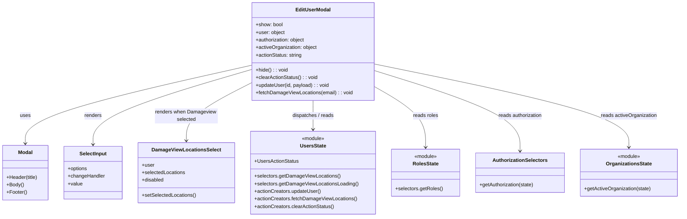

# Diagram: web/portal/src/modules/users/components/EditUserModal.js


> Auto-generated by Obscura crawlers

## Diagram 1



### SVG

<svg id="container" width="2141.8828125" xmlns="http://www.w3.org/2000/svg" class="classDiagram" height="690" viewBox="0 0 2141.8828125 690" role="graphics-document document" aria-roledescription="class"><style>#container{font-family:"trebuchet ms",verdana,arial,sans-serif;font-size:16px;fill:#333;}@keyframes edge-animation-frame{from{stroke-dashoffset:0;}}@keyframes dash{to{stroke-dashoffset:0;}}#container .edge-animation-slow{stroke-dasharray:9,5!important;stroke-dashoffset:900;animation:dash 50s linear infinite;stroke-linecap:round;}#container .edge-animation-fast{stroke-dasharray:9,5!important;stroke-dashoffset:900;animation:dash 20s linear infinite;stroke-linecap:round;}#container .error-icon{fill:#552222;}#container .error-text{fill:#552222;stroke:#552222;}#container .edge-thickness-normal{stroke-width:1px;}#container .edge-thickness-thick{stroke-width:3.5px;}#container .edge-pattern-solid{stroke-dasharray:0;}#container .edge-thickness-invisible{stroke-width:0;fill:none;}#container .edge-pattern-dashed{stroke-dasharray:3;}#container .edge-pattern-dotted{stroke-dasharray:2;}#container .marker{fill:#333333;stroke:#333333;}#container .marker.cross{stroke:#333333;}#container svg{font-family:"trebuchet ms",verdana,arial,sans-serif;font-size:16px;}#container p{margin:0;}#container g.classGroup text{fill:#9370DB;stroke:none;font-family:"trebuchet ms",verdana,arial,sans-serif;font-size:10px;}#container g.classGroup text .title{font-weight:bolder;}#container .nodeLabel,#container .edgeLabel{color:#131300;}#container .edgeLabel .label rect{fill:#ECECFF;}#container .label text{fill:#131300;}#container .labelBkg{background:#ECECFF;}#container .edgeLabel .label span{background:#ECECFF;}#container .classTitle{font-weight:bolder;}#container .node rect,#container .node circle,#container .node ellipse,#container .node polygon,#container .node path{fill:#ECECFF;stroke:#9370DB;stroke-width:1px;}#container .divider{stroke:#9370DB;stroke-width:1;}#container g.clickable{cursor:pointer;}#container g.classGroup rect{fill:#ECECFF;stroke:#9370DB;}#container g.classGroup line{stroke:#9370DB;stroke-width:1;}#container .classLabel .box{stroke:none;stroke-width:0;fill:#ECECFF;opacity:0.5;}#container .classLabel .label{fill:#9370DB;font-size:10px;}#container .relation{stroke:#333333;stroke-width:1;fill:none;}#container .dashed-line{stroke-dasharray:3;}#container .dotted-line{stroke-dasharray:1 2;}#container #compositionStart,#container .composition{fill:#333333!important;stroke:#333333!important;stroke-width:1;}#container #compositionEnd,#container .composition{fill:#333333!important;stroke:#333333!important;stroke-width:1;}#container #dependencyStart,#container .dependency{fill:#333333!important;stroke:#333333!important;stroke-width:1;}#container #dependencyStart,#container .dependency{fill:#333333!important;stroke:#333333!important;stroke-width:1;}#container #extensionStart,#container .extension{fill:transparent!important;stroke:#333333!important;stroke-width:1;}#container #extensionEnd,#container .extension{fill:transparent!important;stroke:#333333!important;stroke-width:1;}#container #aggregationStart,#container .aggregation{fill:transparent!important;stroke:#333333!important;stroke-width:1;}#container #aggregationEnd,#container .aggregation{fill:transparent!important;stroke:#333333!important;stroke-width:1;}#container #lollipopStart,#container .lollipop{fill:#ECECFF!important;stroke:#333333!important;stroke-width:1;}#container #lollipopEnd,#container .lollipop{fill:#ECECFF!important;stroke:#333333!important;stroke-width:1;}#container .edgeTerminals{font-size:11px;line-height:initial;}#container .classTitleText{text-anchor:middle;font-size:18px;fill:#333;}#container .label-icon{display:inline-block;height:1em;overflow:visible;vertical-align:-0.125em;}#container .node .label-icon path{fill:currentColor;stroke:revert;stroke-width:revert;}#container :root{--mermaid-font-family:"trebuchet ms",verdana,arial,sans-serif;}</style><g><defs><marker id="container_class-aggregationStart" class="marker aggregation class" refX="18" refY="7" markerWidth="190" markerHeight="240" orient="auto"><path d="M 18,7 L9,13 L1,7 L9,1 Z"></path></marker></defs><defs><marker id="container_class-aggregationEnd" class="marker aggregation class" refX="1" refY="7" markerWidth="20" markerHeight="28" orient="auto"><path d="M 18,7 L9,13 L1,7 L9,1 Z"></path></marker></defs><defs><marker id="container_class-extensionStart" class="marker extension class" refX="18" refY="7" markerWidth="190" markerHeight="240" orient="auto"><path d="M 1,7 L18,13 V 1 Z"></path></marker></defs><defs><marker id="container_class-extensionEnd" class="marker extension class" refX="1" refY="7" markerWidth="20" markerHeight="28" orient="auto"><path d="M 1,1 V 13 L18,7 Z"></path></marker></defs><defs><marker id="container_class-compositionStart" class="marker composition class" refX="18" refY="7" markerWidth="190" markerHeight="240" orient="auto"><path d="M 18,7 L9,13 L1,7 L9,1 Z"></path></marker></defs><defs><marker id="container_class-compositionEnd" class="marker composition class" refX="1" refY="7" markerWidth="20" markerHeight="28" orient="auto"><path d="M 18,7 L9,13 L1,7 L9,1 Z"></path></marker></defs><defs><marker id="container_class-dependencyStart" class="marker dependency class" refX="6" refY="7" markerWidth="190" markerHeight="240" orient="auto"><path d="M 5,7 L9,13 L1,7 L9,1 Z"></path></marker></defs><defs><marker id="container_class-dependencyEnd" class="marker dependency class" refX="13" refY="7" markerWidth="20" markerHeight="28" orient="auto"><path d="M 18,7 L9,13 L14,7 L9,1 Z"></path></marker></defs><defs><marker id="container_class-lollipopStart" class="marker lollipop class" refX="13" refY="7" markerWidth="190" markerHeight="240" orient="auto"><circle stroke="black" fill="transparent" cx="7" cy="7" r="6"></circle></marker></defs><defs><marker id="container_class-lollipopEnd" class="marker lollipop class" refX="1" refY="7" markerWidth="190" markerHeight="240" orient="auto"><circle stroke="black" fill="transparent" cx="7" cy="7" r="6"></circle></marker></defs><g class="root"><g class="clusters"></g><g class="edgePaths"><path d="M792.688,207.654L674.127,234.545C555.566,261.436,318.445,315.218,199.885,356.776C81.324,398.333,81.324,427.667,81.324,442.333L81.324,457" id="id_EditUserModal_Modal_1" class="edge-thickness-normal edge-pattern-solid relation" style=";;;" data-edge="true" data-et="edge" data-id="id_EditUserModal_Modal_1" data-points="W3sieCI6NzkyLjY4NzUsInkiOjIwNy42NTM1MzUzMDk4Nzk4Nn0seyJ4Ijo4MS4zMjQyMTg3NSwieSI6MzY5fSx7IngiOjgxLjMyNDIxODc1LCJ5Ijo0NjN9XQ==" marker-end="url(#container_class-dependencyEnd)"></path><path d="M792.688,221.305L710.012,245.921C627.337,270.537,461.987,319.768,379.312,359.551C296.637,399.333,296.637,429.667,296.637,444.833L296.637,460" id="id_EditUserModal_SelectInput_2" class="edge-thickness-normal edge-pattern-solid relation" style=";;;" data-edge="true" data-et="edge" data-id="id_EditUserModal_SelectInput_2" data-points="W3sieCI6NzkyLjY4NzUsInkiOjIyMS4zMDQ4NjIxMzU0ODE2N30seyJ4IjoyOTYuNjM2NzE4NzUsInkiOjM2OX0seyJ4IjoyOTYuNjM2NzE4NzUsInkiOjQ2Nn1d" marker-end="url(#container_class-dependencyEnd)"></path><path d="M792.688,263.562L758.717,281.135C724.746,298.708,656.805,333.854,622.834,364.594C588.863,395.333,588.863,421.667,588.863,434.833L588.863,448" id="id_EditUserModal_DamageViewLocationsSelect_3" class="edge-thickness-normal edge-pattern-solid relation" style=";;;" data-edge="true" data-et="edge" data-id="id_EditUserModal_DamageViewLocationsSelect_3" data-points="W3sieCI6NzkyLjY4NzUsInkiOjI2My41NjE5MDI0MTQ5ODI3NH0seyJ4Ijo1ODguODYzMjgxMjUsInkiOjM2OX0seyJ4Ijo1ODguODYzMjgxMjUsInkiOjQ1NH1d" marker-end="url(#container_class-dependencyEnd)"></path><path d="M985.152,320L985.152,328.167C985.152,336.333,985.152,352.667,985.152,368C985.152,383.333,985.152,397.667,985.152,404.833L985.152,412" id="id_EditUserModal_UsersState_4" class="edge-thickness-normal edge-pattern-solid relation" style=";;;" data-edge="true" data-et="edge" data-id="id_EditUserModal_UsersState_4" data-points="W3sieCI6OTg1LjE1MjM0Mzc1LCJ5IjozMjB9LHsieCI6OTg1LjE1MjM0Mzc1LCJ5IjozNjl9LHsieCI6OTg1LjE1MjM0Mzc1LCJ5Ijo0MTh9XQ==" marker-end="url(#container_class-dependencyEnd)"></path><path d="M1177.617,275.904L1204.303,291.42C1230.99,306.936,1284.362,337.968,1311.048,370.151C1337.734,402.333,1337.734,435.667,1337.734,452.333L1337.734,469" id="id_EditUserModal_RolesState_5" class="edge-thickness-normal edge-pattern-solid relation" style=";;;" data-edge="true" data-et="edge" data-id="id_EditUserModal_RolesState_5" data-points="W3sieCI6MTE3Ny42MTcxODc1LCJ5IjoyNzUuOTAzODY3NjcyNjM4Mn0seyJ4IjoxMzM3LjczNDM3NSwieSI6MzY5fSx7IngiOjEzMzcuNzM0Mzc1LCJ5Ijo0NzV9XQ==" marker-end="url(#container_class-dependencyEnd)"></path><path d="M1177.617,224.643L1253.977,248.702C1330.336,272.762,1483.055,320.881,1559.414,363.607C1635.773,406.333,1635.773,443.667,1635.773,462.333L1635.773,481" id="id_EditUserModal_AuthorizationSelectors_6" class="edge-thickness-normal edge-pattern-solid relation" style=";;;" data-edge="true" data-et="edge" data-id="id_EditUserModal_AuthorizationSelectors_6" data-points="W3sieCI6MTE3Ny42MTcxODc1LCJ5IjoyMjQuNjQyNTA1MDU4MjY3NjN9LHsieCI6MTYzNS43NzM0Mzc1LCJ5IjozNjl9LHsieCI6MTYzNS43NzM0Mzc1LCJ5Ijo0ODd9XQ==" marker-end="url(#container_class-dependencyEnd)"></path><path d="M1177.617,203.636L1311.445,231.197C1445.272,258.758,1712.927,313.879,1846.755,358.106C1980.582,402.333,1980.582,435.667,1980.582,452.333L1980.582,469" id="id_EditUserModal_OrganizationsState_7" class="edge-thickness-normal edge-pattern-solid relation" style=";;;" data-edge="true" data-et="edge" data-id="id_EditUserModal_OrganizationsState_7" data-points="W3sieCI6MTE3Ny42MTcxODc1LCJ5IjoyMDMuNjM2NDQzOTAzNzc5fSx7IngiOjE5ODAuNTgyMDMxMjUsInkiOjM2OX0seyJ4IjoxOTgwLjU4MjAzMTI1LCJ5Ijo0NzV9XQ==" marker-end="url(#container_class-dependencyEnd)"></path></g><g class="edgeLabels"><g class="edgeLabel" transform="translate(81.32421875, 369)"><g class="label" data-id="id_EditUserModal_Modal_1" transform="translate(-16.4921875, -12)"><foreignObject width="32.984375" height="24"><div xmlns="http://www.w3.org/1999/xhtml" class="labelBkg" style="display: table-cell; white-space: nowrap; line-height: 1.5; max-width: 200px; text-align: center;"><span class="edgeLabel"><p>uses</p></span></div></foreignObject></g></g><g class="edgeLabel" transform="translate(296.63671875, 369)"><g class="label" data-id="id_EditUserModal_SelectInput_2" transform="translate(-27.75, -12)"><foreignObject width="55.5" height="24"><div xmlns="http://www.w3.org/1999/xhtml" class="labelBkg" style="display: table-cell; white-space: nowrap; line-height: 1.5; max-width: 200px; text-align: center;"><span class="edgeLabel"><p>renders</p></span></div></foreignObject></g></g><g class="edgeLabel" transform="translate(588.86328125, 369)"><g class="label" data-id="id_EditUserModal_DamageViewLocationsSelect_3" transform="translate(-100, -24)"><foreignObject width="200" height="48"><div xmlns="http://www.w3.org/1999/xhtml" class="labelBkg" style="display: table; white-space: break-spaces; line-height: 1.5; max-width: 200px; text-align: center; width: 200px;"><span class="edgeLabel"><p>renders when Damageview selected</p></span></div></foreignObject></g></g><g class="edgeLabel" transform="translate(985.15234375, 369)"><g class="label" data-id="id_EditUserModal_UsersState_4" transform="translate(-67.578125, -12)"><foreignObject width="135.15625" height="24"><div xmlns="http://www.w3.org/1999/xhtml" class="labelBkg" style="display: table-cell; white-space: nowrap; line-height: 1.5; max-width: 200px; text-align: center;"><span class="edgeLabel"><p>dispatches / reads</p></span></div></foreignObject></g></g><g class="edgeLabel" transform="translate(1337.734375, 369)"><g class="label" data-id="id_EditUserModal_RolesState_5" transform="translate(-40.046875, -12)"><foreignObject width="80.09375" height="24"><div xmlns="http://www.w3.org/1999/xhtml" class="labelBkg" style="display: table-cell; white-space: nowrap; line-height: 1.5; max-width: 200px; text-align: center;"><span class="edgeLabel"><p>reads roles</p></span></div></foreignObject></g></g><g class="edgeLabel" transform="translate(1635.7734375, 369)"><g class="label" data-id="id_EditUserModal_AuthorizationSelectors_6" transform="translate(-70.953125, -12)"><foreignObject width="141.90625" height="24"><div xmlns="http://www.w3.org/1999/xhtml" class="labelBkg" style="display: table-cell; white-space: nowrap; line-height: 1.5; max-width: 200px; text-align: center;"><span class="edgeLabel"><p>reads authorization</p></span></div></foreignObject></g></g><g class="edgeLabel" transform="translate(1980.58203125, 369)"><g class="label" data-id="id_EditUserModal_OrganizationsState_7" transform="translate(-89.75, -12)"><foreignObject width="179.5" height="24"><div xmlns="http://www.w3.org/1999/xhtml" class="labelBkg" style="display: table-cell; white-space: nowrap; line-height: 1.5; max-width: 200px; text-align: center;"><span class="edgeLabel"><p>reads activeOrganization</p></span></div></foreignObject></g></g></g><g class="nodes"><g class="node default" id="classId-EditUserModal-0" transform="translate(985.15234375, 164)"><g class="basic label-container"><path d="M-192.46484375 -156 L192.46484375 -156 L192.46484375 156 L-192.46484375 156" stroke="none" stroke-width="0" fill="#ECECFF" style=""></path><path d="M-192.46484375 -156 C-50.579241745510416 -156, 91.30636025897917 -156, 192.46484375 -156 M-192.46484375 -156 C-85.04271951203998 -156, 22.37940472592004 -156, 192.46484375 -156 M192.46484375 -156 C192.46484375 -79.5670399688791, 192.46484375 -3.1340799377582016, 192.46484375 156 M192.46484375 -156 C192.46484375 -78.6046549301993, 192.46484375 -1.209309860398605, 192.46484375 156 M192.46484375 156 C83.48483623049032 156, -25.495171289019368 156, -192.46484375 156 M192.46484375 156 C85.38886731342683 156, -21.687109123146342 156, -192.46484375 156 M-192.46484375 156 C-192.46484375 52.74906226775413, -192.46484375 -50.50187546449175, -192.46484375 -156 M-192.46484375 156 C-192.46484375 84.20326132822635, -192.46484375 12.406522656452694, -192.46484375 -156" stroke="#9370DB" stroke-width="1.3" fill="none" stroke-dasharray="0 0" style=""></path></g><g class="annotation-group text" transform="translate(0, -132)"></g><g class="label-group text" transform="translate(-53.2890625, -132)"><g class="label" style="font-weight: bolder" transform="translate(0,-12)"><foreignObject width="106.578125" height="24"><div xmlns="http://www.w3.org/1999/xhtml" style="display: table-cell; white-space: nowrap; line-height: 1.5; max-width: 156px; text-align: center;"><span class="nodeLabel markdown-node-label" style=""><p>EditUserModal</p></span></div></foreignObject></g></g><g class="members-group text" transform="translate(-180.46484375, -84)"><g class="label" style="" transform="translate(0,-12)"><foreignObject width="86.6875" height="24"><div xmlns="http://www.w3.org/1999/xhtml" style="display: table-cell; white-space: nowrap; line-height: 1.5; max-width: 144px; text-align: center;"><span class="nodeLabel markdown-node-label" style=""><p>+show: bool</p></span></div></foreignObject></g><g class="label" style="" transform="translate(0,12)"><foreignObject width="93.390625" height="24"><div xmlns="http://www.w3.org/1999/xhtml" style="display: table-cell; white-space: nowrap; line-height: 1.5; max-width: 151px; text-align: center;"><span class="nodeLabel markdown-node-label" style=""><p>+user: object</p></span></div></foreignObject></g><g class="label" style="" transform="translate(0,36)"><foreignObject width="158.96875" height="24"><div xmlns="http://www.w3.org/1999/xhtml" style="display: table-cell; white-space: nowrap; line-height: 1.5; max-width: 217px; text-align: center;"><span class="nodeLabel markdown-node-label" style=""><p>+authorization: object</p></span></div></foreignObject></g><g class="label" style="" transform="translate(0,60)"><foreignObject width="196.546875" height="24"><div xmlns="http://www.w3.org/1999/xhtml" style="display: table-cell; white-space: nowrap; line-height: 1.5; max-width: 254px; text-align: center;"><span class="nodeLabel markdown-node-label" style=""><p>+activeOrganization: object</p></span></div></foreignObject></g><g class="label" style="" transform="translate(0,84)"><foreignObject width="148.46875" height="24"><div xmlns="http://www.w3.org/1999/xhtml" style="display: table-cell; white-space: nowrap; line-height: 1.5; max-width: 207px; text-align: center;"><span class="nodeLabel markdown-node-label" style=""><p>+actionStatus: string</p></span></div></foreignObject></g></g><g class="methods-group text" transform="translate(-180.46484375, 60)"><g class="label" style="" transform="translate(0,-12)"><foreignObject width="102.171875" height="24"><div xmlns="http://www.w3.org/1999/xhtml" style="display: table-cell; white-space: nowrap; line-height: 1.5; max-width: 160px; text-align: center;"><span class="nodeLabel markdown-node-label" style=""><p>+hide() : : void</p></span></div></foreignObject></g><g class="label" style="" transform="translate(0,12)"><foreignObject width="197.15625" height="24"><div xmlns="http://www.w3.org/1999/xhtml" style="display: table-cell; white-space: nowrap; line-height: 1.5; max-width: 255px; text-align: center;"><span class="nodeLabel markdown-node-label" style=""><p>+clearActionStatus() : : void</p></span></div></foreignObject></g><g class="label" style="" transform="translate(0,36)"><foreignObject width="234.125" height="24"><div xmlns="http://www.w3.org/1999/xhtml" style="display: table-cell; white-space: nowrap; line-height: 1.5; max-width: 291px; text-align: center;"><span class="nodeLabel markdown-node-label" style=""><p>+updateUser(id, payload) : : void</p></span></div></foreignObject></g><g class="label" style="" transform="translate(0,60)"><foreignObject width="307.640625" height="24"><div xmlns="http://www.w3.org/1999/xhtml" style="display: table-cell; white-space: nowrap; line-height: 1.5; max-width: 365px; text-align: center;"><span class="nodeLabel markdown-node-label" style=""><p>+fetchDamageViewLocations(email) : : void</p></span></div></foreignObject></g></g><g class="divider" style=""><path d="M-192.46484375 -108 C-107.9974387185046 -108, -23.530033687009194 -108, 192.46484375 -108 M-192.46484375 -108 C-54.418734882935155 -108, 83.62737398412969 -108, 192.46484375 -108" stroke="#9370DB" stroke-width="1.3" fill="none" stroke-dasharray="0 0" style=""></path></g><g class="divider" style=""><path d="M-192.46484375 36 C-55.316023478374944 36, 81.83279679325011 36, 192.46484375 36 M-192.46484375 36 C-98.971134539602 36, -5.47742532920401 36, 192.46484375 36" stroke="#9370DB" stroke-width="1.3" fill="none" stroke-dasharray="0 0" style=""></path></g></g><g class="node default" id="classId-Modal-1" transform="translate(81.32421875, 550)"><g class="basic label-container"><path d="M-73.32421875 -87 L73.32421875 -87 L73.32421875 87 L-73.32421875 87" stroke="none" stroke-width="0" fill="#ECECFF" style=""></path><path d="M-73.32421875 -87 C-38.93187381409309 -87, -4.539528878186175 -87, 73.32421875 -87 M-73.32421875 -87 C-35.65870368399714 -87, 2.006811382005722 -87, 73.32421875 -87 M73.32421875 -87 C73.32421875 -46.393263092257975, 73.32421875 -5.7865261845159495, 73.32421875 87 M73.32421875 -87 C73.32421875 -39.13483400884499, 73.32421875 8.73033198231002, 73.32421875 87 M73.32421875 87 C26.029615838255083 87, -21.264987073489834 87, -73.32421875 87 M73.32421875 87 C35.52940911455999 87, -2.2654005208800214 87, -73.32421875 87 M-73.32421875 87 C-73.32421875 39.094592141716554, -73.32421875 -8.810815716566893, -73.32421875 -87 M-73.32421875 87 C-73.32421875 22.480092390646888, -73.32421875 -42.039815218706224, -73.32421875 -87" stroke="#9370DB" stroke-width="1.3" fill="none" stroke-dasharray="0 0" style=""></path></g><g class="annotation-group text" transform="translate(0, -63)"></g><g class="label-group text" transform="translate(-22.4453125, -63)"><g class="label" style="font-weight: bolder" transform="translate(0,-12)"><foreignObject width="44.890625" height="24"><div xmlns="http://www.w3.org/1999/xhtml" style="display: table-cell; white-space: nowrap; line-height: 1.5; max-width: 95px; text-align: center;"><span class="nodeLabel markdown-node-label" style=""><p>Modal</p></span></div></foreignObject></g></g><g class="members-group text" transform="translate(-61.32421875, -15)"></g><g class="methods-group text" transform="translate(-61.32421875, 15)"><g class="label" style="" transform="translate(0,-12)"><foreignObject width="100.203125" height="24"><div xmlns="http://www.w3.org/1999/xhtml" style="display: table-cell; white-space: nowrap; line-height: 1.5; max-width: 158px; text-align: center;"><span class="nodeLabel markdown-node-label" style=""><p>+Header(title)</p></span></div></foreignObject></g><g class="label" style="" transform="translate(0,12)"><foreignObject width="54.875" height="24"><div xmlns="http://www.w3.org/1999/xhtml" style="display: table-cell; white-space: nowrap; line-height: 1.5; max-width: 112px; text-align: center;"><span class="nodeLabel markdown-node-label" style=""><p>+Body()</p></span></div></foreignObject></g><g class="label" style="" transform="translate(0,36)"><foreignObject width="64.78125" height="24"><div xmlns="http://www.w3.org/1999/xhtml" style="display: table-cell; white-space: nowrap; line-height: 1.5; max-width: 122px; text-align: center;"><span class="nodeLabel markdown-node-label" style=""><p>+Footer()</p></span></div></foreignObject></g></g><g class="divider" style=""><path d="M-73.32421875 -39 C-22.36560102624125 -39, 28.5930166975175 -39, 73.32421875 -39 M-73.32421875 -39 C-42.92452243373466 -39, -12.524826117469317 -39, 73.32421875 -39" stroke="#9370DB" stroke-width="1.3" fill="none" stroke-dasharray="0 0" style=""></path></g><g class="divider" style=""><path d="M-73.32421875 -15 C-39.11306310009821 -15, -4.901907450196418 -15, 73.32421875 -15 M-73.32421875 -15 C-35.7585150508172 -15, 1.807188648365596 -15, 73.32421875 -15" stroke="#9370DB" stroke-width="1.3" fill="none" stroke-dasharray="0 0" style=""></path></g></g><g class="node default" id="classId-SelectInput-2" transform="translate(296.63671875, 550)"><g class="basic label-container"><path d="M-91.98828125 -84 L91.98828125 -84 L91.98828125 84 L-91.98828125 84" stroke="none" stroke-width="0" fill="#ECECFF" style=""></path><path d="M-91.98828125 -84 C-54.03041408701018 -84, -16.072546924020358 -84, 91.98828125 -84 M-91.98828125 -84 C-26.597746871738323 -84, 38.792787506523354 -84, 91.98828125 -84 M91.98828125 -84 C91.98828125 -50.03511054056025, 91.98828125 -16.070221081120494, 91.98828125 84 M91.98828125 -84 C91.98828125 -26.23130300297879, 91.98828125 31.537393994042418, 91.98828125 84 M91.98828125 84 C37.707361124457776 84, -16.573559001084448 84, -91.98828125 84 M91.98828125 84 C47.8127537287549 84, 3.637226207509798 84, -91.98828125 84 M-91.98828125 84 C-91.98828125 22.720793262555077, -91.98828125 -38.558413474889846, -91.98828125 -84 M-91.98828125 84 C-91.98828125 42.42598878988495, -91.98828125 0.8519775797698941, -91.98828125 -84" stroke="#9370DB" stroke-width="1.3" fill="none" stroke-dasharray="0 0" style=""></path></g><g class="annotation-group text" transform="translate(0, -60)"></g><g class="label-group text" transform="translate(-42.0703125, -60)"><g class="label" style="font-weight: bolder" transform="translate(0,-12)"><foreignObject width="84.140625" height="24"><div xmlns="http://www.w3.org/1999/xhtml" style="display: table-cell; white-space: nowrap; line-height: 1.5; max-width: 133px; text-align: center;"><span class="nodeLabel markdown-node-label" style=""><p>SelectInput</p></span></div></foreignObject></g></g><g class="members-group text" transform="translate(-79.98828125, -12)"><g class="label" style="" transform="translate(0,-12)"><foreignObject width="63.3125" height="24"><div xmlns="http://www.w3.org/1999/xhtml" style="display: table-cell; white-space: nowrap; line-height: 1.5; max-width: 121px; text-align: center;"><span class="nodeLabel markdown-node-label" style=""><p>+options</p></span></div></foreignObject></g><g class="label" style="" transform="translate(0,12)"><foreignObject width="117.90625" height="24"><div xmlns="http://www.w3.org/1999/xhtml" style="display: table-cell; white-space: nowrap; line-height: 1.5; max-width: 176px; text-align: center;"><span class="nodeLabel markdown-node-label" style=""><p>+changeHandler</p></span></div></foreignObject></g><g class="label" style="" transform="translate(0,36)"><foreignObject width="46.71875" height="24"><div xmlns="http://www.w3.org/1999/xhtml" style="display: table-cell; white-space: nowrap; line-height: 1.5; max-width: 104px; text-align: center;"><span class="nodeLabel markdown-node-label" style=""><p>+value</p></span></div></foreignObject></g></g><g class="methods-group text" transform="translate(-79.98828125, 84)"></g><g class="divider" style=""><path d="M-91.98828125 -36 C-43.50428826724586 -36, 4.9797047155082765 -36, 91.98828125 -36 M-91.98828125 -36 C-54.437969800087664 -36, -16.88765835017533 -36, 91.98828125 -36" stroke="#9370DB" stroke-width="1.3" fill="none" stroke-dasharray="0 0" style=""></path></g><g class="divider" style=""><path d="M-91.98828125 60 C-23.224268419618667 60, 45.539744410762665 60, 91.98828125 60 M-91.98828125 60 C-49.51401353839274 60, -7.039745826785477 60, 91.98828125 60" stroke="#9370DB" stroke-width="1.3" fill="none" stroke-dasharray="0 0" style=""></path></g></g><g class="node default" id="classId-DamageViewLocationsSelect-3" transform="translate(588.86328125, 550)"><g class="basic label-container"><path d="M-150.23828125 -96 L150.23828125 -96 L150.23828125 96 L-150.23828125 96" stroke="none" stroke-width="0" fill="#ECECFF" style=""></path><path d="M-150.23828125 -96 C-58.665222189844556 -96, 32.90783687031089 -96, 150.23828125 -96 M-150.23828125 -96 C-33.81685345416827 -96, 82.60457434166347 -96, 150.23828125 -96 M150.23828125 -96 C150.23828125 -52.79056035244109, 150.23828125 -9.581120704882181, 150.23828125 96 M150.23828125 -96 C150.23828125 -28.153308891212077, 150.23828125 39.693382217575845, 150.23828125 96 M150.23828125 96 C72.95878657102318 96, -4.320708107953635 96, -150.23828125 96 M150.23828125 96 C39.74199681813418 96, -70.75428761373163 96, -150.23828125 96 M-150.23828125 96 C-150.23828125 44.92108220240887, -150.23828125 -6.157835595182263, -150.23828125 -96 M-150.23828125 96 C-150.23828125 34.35025516758305, -150.23828125 -27.2994896648339, -150.23828125 -96" stroke="#9370DB" stroke-width="1.3" fill="none" stroke-dasharray="0 0" style=""></path></g><g class="annotation-group text" transform="translate(0, -72)"></g><g class="label-group text" transform="translate(-104.3203125, -72)"><g class="label" style="font-weight: bolder" transform="translate(0,-12)"><foreignObject width="208.640625" height="24"><div xmlns="http://www.w3.org/1999/xhtml" style="display: table-cell; white-space: nowrap; line-height: 1.5; max-width: 255px; text-align: center;"><span class="nodeLabel markdown-node-label" style=""><p>DamageViewLocationsSelect</p></span></div></foreignObject></g></g><g class="members-group text" transform="translate(-138.23828125, -24)"><g class="label" style="" transform="translate(0,-12)"><foreignObject width="39.671875" height="24"><div xmlns="http://www.w3.org/1999/xhtml" style="display: table-cell; white-space: nowrap; line-height: 1.5; max-width: 98px; text-align: center;"><span class="nodeLabel markdown-node-label" style=""><p>+user</p></span></div></foreignObject></g><g class="label" style="" transform="translate(0,12)"><foreignObject width="138.5625" height="24"><div xmlns="http://www.w3.org/1999/xhtml" style="display: table-cell; white-space: nowrap; line-height: 1.5; max-width: 196px; text-align: center;"><span class="nodeLabel markdown-node-label" style=""><p>+selectedLocations</p></span></div></foreignObject></g><g class="label" style="" transform="translate(0,36)"><foreignObject width="70.484375" height="24"><div xmlns="http://www.w3.org/1999/xhtml" style="display: table-cell; white-space: nowrap; line-height: 1.5; max-width: 128px; text-align: center;"><span class="nodeLabel markdown-node-label" style=""><p>+disabled</p></span></div></foreignObject></g></g><g class="methods-group text" transform="translate(-138.23828125, 72)"><g class="label" style="" transform="translate(0,-12)"><foreignObject width="172.15625" height="24"><div xmlns="http://www.w3.org/1999/xhtml" style="display: table-cell; white-space: nowrap; line-height: 1.5; max-width: 230px; text-align: center;"><span class="nodeLabel markdown-node-label" style=""><p>+setSelectedLocations()</p></span></div></foreignObject></g></g><g class="divider" style=""><path d="M-150.23828125 -48 C-82.9484242982291 -48, -15.658567346458199 -48, 150.23828125 -48 M-150.23828125 -48 C-58.41230345785212 -48, 33.41367433429576 -48, 150.23828125 -48" stroke="#9370DB" stroke-width="1.3" fill="none" stroke-dasharray="0 0" style=""></path></g><g class="divider" style=""><path d="M-150.23828125 48 C-34.75721055174881 48, 80.72386014650237 48, 150.23828125 48 M-150.23828125 48 C-46.72540812155067 48, 56.78746500689866 48, 150.23828125 48" stroke="#9370DB" stroke-width="1.3" fill="none" stroke-dasharray="0 0" style=""></path></g></g><g class="node default" id="classId-UsersState-4" transform="translate(985.15234375, 550)"><g class="basic label-container"><path d="M-196.05078125 -132 L196.05078125 -132 L196.05078125 132 L-196.05078125 132" stroke="none" stroke-width="0" fill="#ECECFF" style=""></path><path d="M-196.05078125 -132 C-80.7100972997631 -132, 34.63058665047379 -132, 196.05078125 -132 M-196.05078125 -132 C-64.78193340059258 -132, 66.48691444881484 -132, 196.05078125 -132 M196.05078125 -132 C196.05078125 -52.99020089478931, 196.05078125 26.01959821042138, 196.05078125 132 M196.05078125 -132 C196.05078125 -67.8775508734115, 196.05078125 -3.7551017468229873, 196.05078125 132 M196.05078125 132 C105.8000762032637 132, 15.5493711565274 132, -196.05078125 132 M196.05078125 132 C58.489691593812864 132, -79.07139806237427 132, -196.05078125 132 M-196.05078125 132 C-196.05078125 65.69054897615554, -196.05078125 -0.6189020476889198, -196.05078125 -132 M-196.05078125 132 C-196.05078125 49.419598347364996, -196.05078125 -33.16080330527001, -196.05078125 -132" stroke="#9370DB" stroke-width="1.3" fill="none" stroke-dasharray="0 0" style=""></path></g><g class="annotation-group text" transform="translate(-36.6015625, -108)"><g class="label" style="" transform="translate(0,-12)"><foreignObject width="73.203125" height="24"><div xmlns="http://www.w3.org/1999/xhtml" style="display: table-cell; white-space: nowrap; line-height: 1.5; max-width: 123px; text-align: center;"><span class="nodeLabel markdown-node-label" style=""><p>«module»</p></span></div></foreignObject></g></g><g class="label-group text" transform="translate(-39.7421875, -84)"><g class="label" style="font-weight: bolder" transform="translate(0,-12)"><foreignObject width="79.484375" height="24"><div xmlns="http://www.w3.org/1999/xhtml" style="display: table-cell; white-space: nowrap; line-height: 1.5; max-width: 127px; text-align: center;"><span class="nodeLabel markdown-node-label" style=""><p>UsersState</p></span></div></foreignObject></g></g><g class="members-group text" transform="translate(-184.05078125, -36)"><g class="label" style="" transform="translate(0,-12)"><foreignObject width="139.578125" height="24"><div xmlns="http://www.w3.org/1999/xhtml" style="display: table-cell; white-space: nowrap; line-height: 1.5; max-width: 197px; text-align: center;"><span class="nodeLabel markdown-node-label" style=""><p>+UsersActionStatus</p></span></div></foreignObject></g></g><g class="methods-group text" transform="translate(-184.05078125, 12)"><g class="label" style="" transform="translate(0,-12)"><foreignObject width="271.125" height="24"><div xmlns="http://www.w3.org/1999/xhtml" style="display: table-cell; white-space: nowrap; line-height: 1.5; max-width: 328px; text-align: center;"><span class="nodeLabel markdown-node-label" style=""><p>+selectors.getDamageViewLocations()</p></span></div></foreignObject></g><g class="label" style="" transform="translate(0,12)"><foreignObject width="328.359375" height="24"><div xmlns="http://www.w3.org/1999/xhtml" style="display: table-cell; white-space: nowrap; line-height: 1.5; max-width: 386px; text-align: center;"><span class="nodeLabel markdown-node-label" style=""><p>+selectors.getDamageViewLocationsLoading()</p></span></div></foreignObject></g><g class="label" style="" transform="translate(0,36)"><foreignObject width="211.359375" height="24"><div xmlns="http://www.w3.org/1999/xhtml" style="display: table-cell; white-space: nowrap; line-height: 1.5; max-width: 269px; text-align: center;"><span class="nodeLabel markdown-node-label" style=""><p>+actionCreators.updateUser()</p></span></div></foreignObject></g><g class="label" style="" transform="translate(0,60)"><foreignObject width="324.609375" height="24"><div xmlns="http://www.w3.org/1999/xhtml" style="display: table-cell; white-space: nowrap; line-height: 1.5; max-width: 382px; text-align: center;"><span class="nodeLabel markdown-node-label" style=""><p>+actionCreators.fetchDamageViewLocations()</p></span></div></foreignObject></g><g class="label" style="" transform="translate(0,84)"><foreignObject width="254.296875" height="24"><div xmlns="http://www.w3.org/1999/xhtml" style="display: table-cell; white-space: nowrap; line-height: 1.5; max-width: 312px; text-align: center;"><span class="nodeLabel markdown-node-label" style=""><p>+actionCreators.clearActionStatus()</p></span></div></foreignObject></g></g><g class="divider" style=""><path d="M-196.05078125 -60 C-101.83513277266276 -60, -7.61948429532552 -60, 196.05078125 -60 M-196.05078125 -60 C-74.06703854879568 -60, 47.91670415240864 -60, 196.05078125 -60" stroke="#9370DB" stroke-width="1.3" fill="none" stroke-dasharray="0 0" style=""></path></g><g class="divider" style=""><path d="M-196.05078125 -12 C-52.507599825843016 -12, 91.03558159831397 -12, 196.05078125 -12 M-196.05078125 -12 C-46.50001305173964 -12, 103.05075514652071 -12, 196.05078125 -12" stroke="#9370DB" stroke-width="1.3" fill="none" stroke-dasharray="0 0" style=""></path></g></g><g class="node default" id="classId-RolesState-5" transform="translate(1337.734375, 550)"><g class="basic label-container"><path d="M-106.53125 -75 L106.53125 -75 L106.53125 75 L-106.53125 75" stroke="none" stroke-width="0" fill="#ECECFF" style=""></path><path d="M-106.53125 -75 C-61.47698919992974 -75, -16.42272839985948 -75, 106.53125 -75 M-106.53125 -75 C-30.05182281363234 -75, 46.42760437273532 -75, 106.53125 -75 M106.53125 -75 C106.53125 -33.53823364236363, 106.53125 7.923532715272742, 106.53125 75 M106.53125 -75 C106.53125 -19.416092642602123, 106.53125 36.16781471479575, 106.53125 75 M106.53125 75 C49.15080006387566 75, -8.229649872248686 75, -106.53125 75 M106.53125 75 C32.426933221426324 75, -41.67738355714735 75, -106.53125 75 M-106.53125 75 C-106.53125 19.484605953213347, -106.53125 -36.03078809357331, -106.53125 -75 M-106.53125 75 C-106.53125 30.79775986628576, -106.53125 -13.404480267428482, -106.53125 -75" stroke="#9370DB" stroke-width="1.3" fill="none" stroke-dasharray="0 0" style=""></path></g><g class="annotation-group text" transform="translate(-36.6015625, -51)"><g class="label" style="" transform="translate(0,-12)"><foreignObject width="73.203125" height="24"><div xmlns="http://www.w3.org/1999/xhtml" style="display: table-cell; white-space: nowrap; line-height: 1.5; max-width: 123px; text-align: center;"><span class="nodeLabel markdown-node-label" style=""><p>«module»</p></span></div></foreignObject></g></g><g class="label-group text" transform="translate(-39.421875, -27)"><g class="label" style="font-weight: bolder" transform="translate(0,-12)"><foreignObject width="78.84375" height="24"><div xmlns="http://www.w3.org/1999/xhtml" style="display: table-cell; white-space: nowrap; line-height: 1.5; max-width: 127px; text-align: center;"><span class="nodeLabel markdown-node-label" style=""><p>RolesState</p></span></div></foreignObject></g></g><g class="members-group text" transform="translate(-94.53125, 21)"></g><g class="methods-group text" transform="translate(-94.53125, 51)"><g class="label" style="" transform="translate(0,-12)"><foreignObject width="149.640625" height="24"><div xmlns="http://www.w3.org/1999/xhtml" style="display: table-cell; white-space: nowrap; line-height: 1.5; max-width: 207px; text-align: center;"><span class="nodeLabel markdown-node-label" style=""><p>+selectors.getRoles()</p></span></div></foreignObject></g></g><g class="divider" style=""><path d="M-106.53125 -3 C-57.62583272378736 -3, -8.720415447574723 -3, 106.53125 -3 M-106.53125 -3 C-39.88711631449583 -3, 26.757017371008345 -3, 106.53125 -3" stroke="#9370DB" stroke-width="1.3" fill="none" stroke-dasharray="0 0" style=""></path></g><g class="divider" style=""><path d="M-106.53125 21 C-40.132642746413126 21, 26.26596450717375 21, 106.53125 21 M-106.53125 21 C-52.65522357438786 21, 1.2208028512242777 21, 106.53125 21" stroke="#9370DB" stroke-width="1.3" fill="none" stroke-dasharray="0 0" style=""></path></g></g><g class="node default" id="classId-AuthorizationSelectors-6" transform="translate(1635.7734375, 550)"><g class="basic label-container"><path d="M-141.5078125 -63 L141.5078125 -63 L141.5078125 63 L-141.5078125 63" stroke="none" stroke-width="0" fill="#ECECFF" style=""></path><path d="M-141.5078125 -63 C-63.05465477025935 -63, 15.398502959481306 -63, 141.5078125 -63 M-141.5078125 -63 C-42.62143316965654 -63, 56.26494616068692 -63, 141.5078125 -63 M141.5078125 -63 C141.5078125 -22.535919226947982, 141.5078125 17.928161546104036, 141.5078125 63 M141.5078125 -63 C141.5078125 -35.392111060271915, 141.5078125 -7.784222120543831, 141.5078125 63 M141.5078125 63 C75.46010145128155 63, 9.41239040256309 63, -141.5078125 63 M141.5078125 63 C58.428016287768216 63, -24.65177992446357 63, -141.5078125 63 M-141.5078125 63 C-141.5078125 34.39670963731849, -141.5078125 5.793419274636975, -141.5078125 -63 M-141.5078125 63 C-141.5078125 13.861986968544585, -141.5078125 -35.27602606291083, -141.5078125 -63" stroke="#9370DB" stroke-width="1.3" fill="none" stroke-dasharray="0 0" style=""></path></g><g class="annotation-group text" transform="translate(0, -39)"></g><g class="label-group text" transform="translate(-83.875, -39)"><g class="label" style="font-weight: bolder" transform="translate(0,-12)"><foreignObject width="167.75" height="24"><div xmlns="http://www.w3.org/1999/xhtml" style="display: table-cell; white-space: nowrap; line-height: 1.5; max-width: 215px; text-align: center;"><span class="nodeLabel markdown-node-label" style=""><p>AuthorizationSelectors</p></span></div></foreignObject></g></g><g class="members-group text" transform="translate(-129.5078125, 9)"></g><g class="methods-group text" transform="translate(-129.5078125, 39)"><g class="label" style="" transform="translate(0,-12)"><foreignObject width="175.140625" height="24"><div xmlns="http://www.w3.org/1999/xhtml" style="display: table-cell; white-space: nowrap; line-height: 1.5; max-width: 233px; text-align: center;"><span class="nodeLabel markdown-node-label" style=""><p>+getAuthorization(state)</p></span></div></foreignObject></g></g><g class="divider" style=""><path d="M-141.5078125 -15 C-69.89130941079652 -15, 1.7251936784069528 -15, 141.5078125 -15 M-141.5078125 -15 C-63.89490991895285 -15, 13.717992662094304 -15, 141.5078125 -15" stroke="#9370DB" stroke-width="1.3" fill="none" stroke-dasharray="0 0" style=""></path></g><g class="divider" style=""><path d="M-141.5078125 9 C-79.99696053993495 9, -18.486108579869892 9, 141.5078125 9 M-141.5078125 9 C-61.3039430541841 9, 18.899926391631794 9, 141.5078125 9" stroke="#9370DB" stroke-width="1.3" fill="none" stroke-dasharray="0 0" style=""></path></g></g><g class="node default" id="classId-OrganizationsState-7" transform="translate(1980.58203125, 550)"><g class="basic label-container"><path d="M-153.30078125 -75 L153.30078125 -75 L153.30078125 75 L-153.30078125 75" stroke="none" stroke-width="0" fill="#ECECFF" style=""></path><path d="M-153.30078125 -75 C-72.52934091713495 -75, 8.24209941573011 -75, 153.30078125 -75 M-153.30078125 -75 C-33.23918514365505 -75, 86.8224109626899 -75, 153.30078125 -75 M153.30078125 -75 C153.30078125 -29.24507427651608, 153.30078125 16.509851446967843, 153.30078125 75 M153.30078125 -75 C153.30078125 -39.57298297057539, 153.30078125 -4.145965941150777, 153.30078125 75 M153.30078125 75 C75.79264055811922 75, -1.7155001337615658 75, -153.30078125 75 M153.30078125 75 C42.36563600851564 75, -68.56950923296873 75, -153.30078125 75 M-153.30078125 75 C-153.30078125 26.732460202613616, -153.30078125 -21.535079594772768, -153.30078125 -75 M-153.30078125 75 C-153.30078125 22.017975123524906, -153.30078125 -30.96404975295019, -153.30078125 -75" stroke="#9370DB" stroke-width="1.3" fill="none" stroke-dasharray="0 0" style=""></path></g><g class="annotation-group text" transform="translate(-36.6015625, -51)"><g class="label" style="" transform="translate(0,-12)"><foreignObject width="73.203125" height="24"><div xmlns="http://www.w3.org/1999/xhtml" style="display: table-cell; white-space: nowrap; line-height: 1.5; max-width: 123px; text-align: center;"><span class="nodeLabel markdown-node-label" style=""><p>«module»</p></span></div></foreignObject></g></g><g class="label-group text" transform="translate(-69.8671875, -27)"><g class="label" style="font-weight: bolder" transform="translate(0,-12)"><foreignObject width="139.734375" height="24"><div xmlns="http://www.w3.org/1999/xhtml" style="display: table-cell; white-space: nowrap; line-height: 1.5; max-width: 187px; text-align: center;"><span class="nodeLabel markdown-node-label" style=""><p>OrganizationsState</p></span></div></foreignObject></g></g><g class="members-group text" transform="translate(-141.30078125, 21)"></g><g class="methods-group text" transform="translate(-141.30078125, 51)"><g class="label" style="" transform="translate(0,-12)"><foreignObject width="212.734375" height="24"><div xmlns="http://www.w3.org/1999/xhtml" style="display: table-cell; white-space: nowrap; line-height: 1.5; max-width: 270px; text-align: center;"><span class="nodeLabel markdown-node-label" style=""><p>+getActiveOrganization(state)</p></span></div></foreignObject></g></g><g class="divider" style=""><path d="M-153.30078125 -3 C-51.682793546139635 -3, 49.93519415772073 -3, 153.30078125 -3 M-153.30078125 -3 C-43.85986666301204 -3, 65.58104792397592 -3, 153.30078125 -3" stroke="#9370DB" stroke-width="1.3" fill="none" stroke-dasharray="0 0" style=""></path></g><g class="divider" style=""><path d="M-153.30078125 21 C-31.075068087124137 21, 91.15064507575173 21, 153.30078125 21 M-153.30078125 21 C-46.691036850464585 21, 59.91870754907083 21, 153.30078125 21" stroke="#9370DB" stroke-width="1.3" fill="none" stroke-dasharray="0 0" style=""></path></g></g></g></g></g></svg>

## Diagram 2

```mermaid
flowchart TD
    U[User clicks "Edit"] --> OpenModal[Open EditUserModal]
    OpenModal --> LoadUserData[load user & roles]
    LoadUserData --> FetchDamageLocations{user exists?}
    FetchDamageLocations -->|yes| FetchLocations[fetchDamageViewLocations(email)]
    FetchLocations --> LocationsLoaded[damageLocations loaded]
    LoadUserData --> RoleTypes[compute roleTypes via filterRoleTypes]
    RoleTypes --> RenderForm[render ReadOnlyInput, SelectInput]
    RenderForm --> UserSelectsRoles[User selects roles]
    UserSelectsRoles --> CheckDamageView{Damageview role selected?}
    CheckDamageView -->|true| ShowLocationsSelect[show DamageViewLocationsSelect]
    ShowLocationsSelect --> UserSelectsLocations[select reporting locations]
    UserSelectsLocations --> ClickUpdate[click Update]
    ClickUpdate --> BuildPayload[assemble role_ids & damageLocations]
    BuildPayload --> UpdateCall[updateUser(id, payload)]
    UpdateCall --> UpdateSuccess{actionStatus}
    UpdateSuccess -->|UPDATE_USER_SUCCEEDED| ShowSuccess[show success Alert]
    UpdateSuccess -->|UPDATE_USER_FAILED| ShowFailure[show failure Alert]
    ShowSuccess --> CloseModal[Close or change button to Close]
    ShowFailure --> StayOpen[modal remains open for retry]
```

> SVG rendering failed for this diagram.
