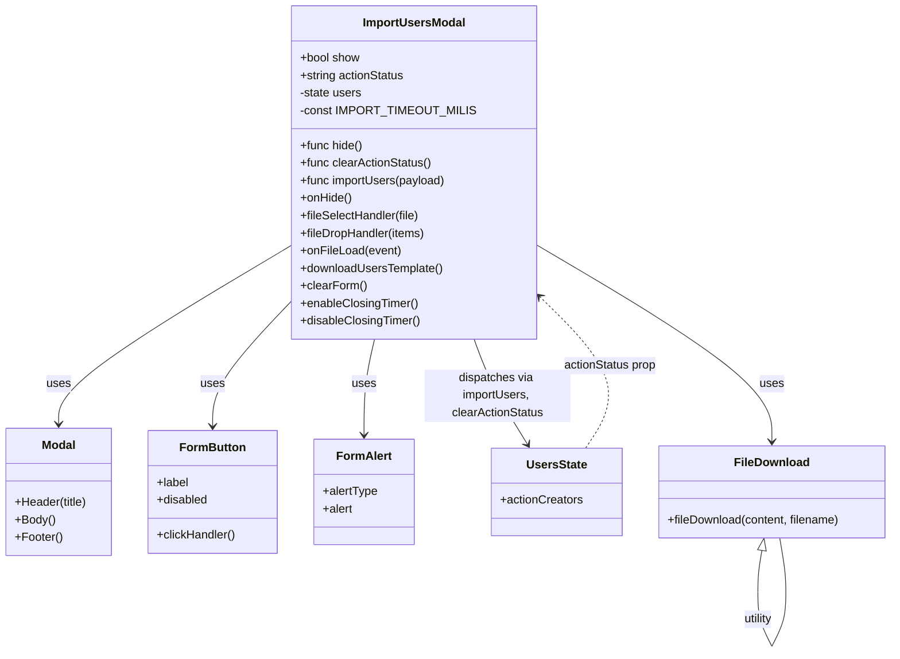

# Diagram: web/portal/src/modules/users/components/ImportUsersModal.js


> Auto-generated by Obscura crawlers

## Diagram 1



### SVG

<svg id="container" width="1221.619140625" xmlns="http://www.w3.org/2000/svg" class="classDiagram" height="892.25" viewBox="0 0 1221.619140625 892.25" role="graphics-document document" aria-roledescription="class"><style>#container{font-family:"trebuchet ms",verdana,arial,sans-serif;font-size:16px;fill:#333;}@keyframes edge-animation-frame{from{stroke-dashoffset:0;}}@keyframes dash{to{stroke-dashoffset:0;}}#container .edge-animation-slow{stroke-dasharray:9,5!important;stroke-dashoffset:900;animation:dash 50s linear infinite;stroke-linecap:round;}#container .edge-animation-fast{stroke-dasharray:9,5!important;stroke-dashoffset:900;animation:dash 20s linear infinite;stroke-linecap:round;}#container .error-icon{fill:#552222;}#container .error-text{fill:#552222;stroke:#552222;}#container .edge-thickness-normal{stroke-width:1px;}#container .edge-thickness-thick{stroke-width:3.5px;}#container .edge-pattern-solid{stroke-dasharray:0;}#container .edge-thickness-invisible{stroke-width:0;fill:none;}#container .edge-pattern-dashed{stroke-dasharray:3;}#container .edge-pattern-dotted{stroke-dasharray:2;}#container .marker{fill:#333333;stroke:#333333;}#container .marker.cross{stroke:#333333;}#container svg{font-family:"trebuchet ms",verdana,arial,sans-serif;font-size:16px;}#container p{margin:0;}#container g.classGroup text{fill:#9370DB;stroke:none;font-family:"trebuchet ms",verdana,arial,sans-serif;font-size:10px;}#container g.classGroup text .title{font-weight:bolder;}#container .nodeLabel,#container .edgeLabel{color:#131300;}#container .edgeLabel .label rect{fill:#ECECFF;}#container .label text{fill:#131300;}#container .labelBkg{background:#ECECFF;}#container .edgeLabel .label span{background:#ECECFF;}#container .classTitle{font-weight:bolder;}#container .node rect,#container .node circle,#container .node ellipse,#container .node polygon,#container .node path{fill:#ECECFF;stroke:#9370DB;stroke-width:1px;}#container .divider{stroke:#9370DB;stroke-width:1;}#container g.clickable{cursor:pointer;}#container g.classGroup rect{fill:#ECECFF;stroke:#9370DB;}#container g.classGroup line{stroke:#9370DB;stroke-width:1;}#container .classLabel .box{stroke:none;stroke-width:0;fill:#ECECFF;opacity:0.5;}#container .classLabel .label{fill:#9370DB;font-size:10px;}#container .relation{stroke:#333333;stroke-width:1;fill:none;}#container .dashed-line{stroke-dasharray:3;}#container .dotted-line{stroke-dasharray:1 2;}#container #compositionStart,#container .composition{fill:#333333!important;stroke:#333333!important;stroke-width:1;}#container #compositionEnd,#container .composition{fill:#333333!important;stroke:#333333!important;stroke-width:1;}#container #dependencyStart,#container .dependency{fill:#333333!important;stroke:#333333!important;stroke-width:1;}#container #dependencyStart,#container .dependency{fill:#333333!important;stroke:#333333!important;stroke-width:1;}#container #extensionStart,#container .extension{fill:transparent!important;stroke:#333333!important;stroke-width:1;}#container #extensionEnd,#container .extension{fill:transparent!important;stroke:#333333!important;stroke-width:1;}#container #aggregationStart,#container .aggregation{fill:transparent!important;stroke:#333333!important;stroke-width:1;}#container #aggregationEnd,#container .aggregation{fill:transparent!important;stroke:#333333!important;stroke-width:1;}#container #lollipopStart,#container .lollipop{fill:#ECECFF!important;stroke:#333333!important;stroke-width:1;}#container #lollipopEnd,#container .lollipop{fill:#ECECFF!important;stroke:#333333!important;stroke-width:1;}#container .edgeTerminals{font-size:11px;line-height:initial;}#container .classTitleText{text-anchor:middle;font-size:18px;fill:#333;}#container .label-icon{display:inline-block;height:1em;overflow:visible;vertical-align:-0.125em;}#container .node .label-icon path{fill:currentColor;stroke:revert;stroke-width:revert;}#container :root{--mermaid-font-family:"trebuchet ms",verdana,arial,sans-serif;}</style><g><defs><marker id="container_class-aggregationStart" class="marker aggregation class" refX="18" refY="7" markerWidth="190" markerHeight="240" orient="auto"><path d="M 18,7 L9,13 L1,7 L9,1 Z"></path></marker></defs><defs><marker id="container_class-aggregationEnd" class="marker aggregation class" refX="1" refY="7" markerWidth="20" markerHeight="28" orient="auto"><path d="M 18,7 L9,13 L1,7 L9,1 Z"></path></marker></defs><defs><marker id="container_class-extensionStart" class="marker extension class" refX="18" refY="7" markerWidth="190" markerHeight="240" orient="auto"><path d="M 1,7 L18,13 V 1 Z"></path></marker></defs><defs><marker id="container_class-extensionEnd" class="marker extension class" refX="1" refY="7" markerWidth="20" markerHeight="28" orient="auto"><path d="M 1,1 V 13 L18,7 Z"></path></marker></defs><defs><marker id="container_class-compositionStart" class="marker composition class" refX="18" refY="7" markerWidth="190" markerHeight="240" orient="auto"><path d="M 18,7 L9,13 L1,7 L9,1 Z"></path></marker></defs><defs><marker id="container_class-compositionEnd" class="marker composition class" refX="1" refY="7" markerWidth="20" markerHeight="28" orient="auto"><path d="M 18,7 L9,13 L1,7 L9,1 Z"></path></marker></defs><defs><marker id="container_class-dependencyStart" class="marker dependency class" refX="6" refY="7" markerWidth="190" markerHeight="240" orient="auto"><path d="M 5,7 L9,13 L1,7 L9,1 Z"></path></marker></defs><defs><marker id="container_class-dependencyEnd" class="marker dependency class" refX="13" refY="7" markerWidth="20" markerHeight="28" orient="auto"><path d="M 18,7 L9,13 L14,7 L9,1 Z"></path></marker></defs><defs><marker id="container_class-lollipopStart" class="marker lollipop class" refX="13" refY="7" markerWidth="190" markerHeight="240" orient="auto"><circle stroke="black" fill="transparent" cx="7" cy="7" r="6"></circle></marker></defs><defs><marker id="container_class-lollipopEnd" class="marker lollipop class" refX="1" refY="7" markerWidth="190" markerHeight="240" orient="auto"><circle stroke="black" fill="transparent" cx="7" cy="7" r="6"></circle></marker></defs><g class="root"><g class="clusters"></g><g class="edgePaths"><path d="M410.012,329.307L355.23,361.922C300.449,394.538,190.887,459.769,136.105,501.551C81.324,543.333,81.324,561.667,81.324,570.833L81.324,580" id="id_ImportUsersModal_Modal_1" class="edge-thickness-normal edge-pattern-solid relation" style=";;;" data-edge="true" data-et="edge" data-id="id_ImportUsersModal_Modal_1" data-points="W3sieCI6NDEwLjAxMTcxODc1LCJ5IjozMjkuMzA2ODMwNjE4NjgyOH0seyJ4Ijo4MS4zMjQyMTg3NSwieSI6NTI1fSx7IngiOjgxLjMyNDIxODc1LCJ5Ijo1ODZ9XQ==" marker-end="url(#container_class-dependencyEnd)"></path><path d="M410.012,401.301L390.465,421.917C370.919,442.534,331.827,483.767,312.281,514.05C292.734,544.333,292.734,563.667,292.734,573.333L292.734,583" id="id_ImportUsersModal_FormButton_2" class="edge-thickness-normal edge-pattern-solid relation" style=";;;" data-edge="true" data-et="edge" data-id="id_ImportUsersModal_FormButton_2" data-points="W3sieCI6NDEwLjAxMTcxODc1LCJ5Ijo0MDEuMzAwNjAwMjAyNDQzNTV9LHsieCI6MjkyLjczNDM3NSwieSI6NTI1fSx7IngiOjI5Mi43MzQzNzUsInkiOjU4OX1d" marker-end="url(#container_class-dependencyEnd)"></path><path d="M512.889,464L510.488,474.167C508.088,484.333,503.286,504.667,500.885,526.5C498.484,548.333,498.484,571.667,498.484,583.333L498.484,595" id="id_ImportUsersModal_FormAlert_3" class="edge-thickness-normal edge-pattern-solid relation" style=";;;" data-edge="true" data-et="edge" data-id="id_ImportUsersModal_FormAlert_3" data-points="W3sieCI6NTEyLjg4OTI1OTgzOTk2NTMsInkiOjQ2NH0seyJ4Ijo0OTguNDg0Mzc1LCJ5Ijo1MjV9LHsieCI6NDk4LjQ4NDM3NSwieSI6NjAxfV0=" marker-end="url(#container_class-dependencyEnd)"></path><path d="M648.019,464L651.644,474.167C655.269,484.333,662.518,504.667,674.763,528.652C687.008,552.636,704.247,580.273,712.867,594.091L721.487,607.909" id="id_ImportUsersModal_UsersState_4" class="edge-thickness-normal edge-pattern-solid relation" style=";;;" data-edge="true" data-et="edge" data-id="id_ImportUsersModal_UsersState_4" data-points="W3sieCI6NjQ4LjAxOTI2MDkyMTI4MDMsInkiOjQ2NH0seyJ4Ijo2NjkuNzY3NTc4MTI1LCJ5Ijo1MjV9LHsieCI6NzI0LjY2MzA1OTU0MzkxOSwieSI6NjEzfV0=" marker-end="url(#container_class-dependencyEnd)"></path><path d="M723.449,328.37L779.051,361.142C834.653,393.913,945.857,459.457,1001.459,505.395C1057.061,551.333,1057.061,577.667,1057.061,590.833L1057.061,604" id="id_ImportUsersModal_FileDownload_5" class="edge-thickness-normal edge-pattern-solid relation" style=";;;" data-edge="true" data-et="edge" data-id="id_ImportUsersModal_FileDownload_5" data-points="W3sieCI6NzIzLjQ0OTIxODc1LCJ5IjozMjguMzY5ODU2MDgzODcyMX0seyJ4IjoxMDU3LjA2MDU0Njg3NSwieSI6NTI1fSx7IngiOjEwNTcuMDYwNTQ2ODc1LCJ5Ijo2MTB9XQ==" marker-end="url(#container_class-dependencyEnd)"></path><path d="M801.381,613L810.985,598.333C820.589,583.667,839.798,554.333,827.52,518.03C815.242,481.727,771.479,438.454,749.597,416.818L727.716,395.181" id="id_UsersState_ImportUsersModal_6" class="edge-thickness-normal edge-pattern-dashed relation" style=";;;" data-edge="true" data-et="edge" data-id="id_UsersState_ImportUsersModal_6" data-points="W3sieCI6ODAxLjM4MTI4MTY3MjI5NzMsInkiOjYxM30seyJ4Ijo4NTkuMDA1ODU5Mzc1LCJ5Ijo1MjV9LHsieCI6NzIzLjQ0OTIxODc1LCJ5IjozOTAuOTYyNDc3ODY0Mjc4NzV9XQ==" marker-end="url(#container_class-dependencyEnd)"></path><path d="M1042.357,752.966L1041.375,758.305C1040.394,763.644,1038.43,774.322,1037.449,783.828C1036.467,793.333,1036.467,801.667,1036.467,805.833L1036.467,810" id="FileDownload-cyclic-special-1" class="edge-thickness-normal edge-pattern-solid relation" style=";;;" data-edge="true" data-et="edge" data-id="FileDownload-cyclic-special-1" data-points="W3sieCI6MTA0NS40NzY1NjI1LCJ5Ijo3MzZ9LHsieCI6MTAzNi40NjY3OTY4NzUsInkiOjc4NX0seyJ4IjoxMDM2LjQ2Njc5Njg3NSwieSI6ODEwfV0=" marker-start="url(#container_class-extensionStart)"></path><path d="M1036.467,810.1L1036.467,816.267C1036.467,822.433,1036.467,834.767,1039.894,847.1C1043.322,859.433,1050.177,871.767,1053.605,877.933L1057.033,884.1" id="FileDownload-cyclic-special-mid" class="edge-thickness-normal edge-pattern-solid relation" style=";;;" data-edge="true" data-et="edge" data-id="FileDownload-cyclic-special-mid" data-points="W3sieCI6MTAzNi40NjY3OTY4NzUsInkiOjgxMC4xMDAwMDAwMDE0OTAxfSx7IngiOjEwMzYuNDY2Nzk2ODc1LCJ5Ijo4NDcuMTAwMDAwMDAxNDkwMX0seyJ4IjoxMDU3LjAzMjc1NTAzOTIyODcsInkiOjg4NC4xMDAwMDAwMDE0OTAxfV0="></path><path d="M1057.088,884.1L1060.516,877.933C1063.944,871.767,1070.799,859.433,1074.227,847.092C1077.654,834.75,1077.654,822.4,1077.654,812.05C1077.654,801.7,1077.654,793.35,1076.153,781.008C1074.651,768.667,1071.648,752.333,1070.146,744.167L1068.645,736" id="FileDownload-cyclic-special-2" class="edge-thickness-normal edge-pattern-solid relation" style=";;;" data-edge="true" data-et="edge" data-id="FileDownload-cyclic-special-2" data-points="W3sieCI6MTA1Ny4wODgzMzg3MTA3NzEzLCJ5Ijo4ODQuMTAwMDAwMDAxNDkwMX0seyJ4IjoxMDc3LjY1NDI5Njg3NSwieSI6ODQ3LjEwMDAwMDAwMTQ5MDF9LHsieCI6MTA3Ny42NTQyOTY4NzUsInkiOjgxMC4wNTAwMDAwMDA3NDUxfSx7IngiOjEwNzcuNjU0Mjk2ODc1LCJ5Ijo3ODV9LHsieCI6MTA2OC42NDQ1MzEyNSwieSI6NzM2fV0="></path></g><g class="edgeLabels"><g class="edgeLabel" transform="translate(81.32421875, 525)"><g class="label" data-id="id_ImportUsersModal_Modal_1" transform="translate(-16.4921875, -12)"><foreignObject width="32.984375" height="24"><div xmlns="http://www.w3.org/1999/xhtml" class="labelBkg" style="display: table-cell; white-space: nowrap; line-height: 1.5; max-width: 200px; text-align: center;"><span class="edgeLabel"><p>uses</p></span></div></foreignObject></g></g><g class="edgeLabel" transform="translate(292.734375, 525)"><g class="label" data-id="id_ImportUsersModal_FormButton_2" transform="translate(-16.4921875, -12)"><foreignObject width="32.984375" height="24"><div xmlns="http://www.w3.org/1999/xhtml" class="labelBkg" style="display: table-cell; white-space: nowrap; line-height: 1.5; max-width: 200px; text-align: center;"><span class="edgeLabel"><p>uses</p></span></div></foreignObject></g></g><g class="edgeLabel" transform="translate(498.484375, 525)"><g class="label" data-id="id_ImportUsersModal_FormAlert_3" transform="translate(-16.4921875, -12)"><foreignObject width="32.984375" height="24"><div xmlns="http://www.w3.org/1999/xhtml" class="labelBkg" style="display: table-cell; white-space: nowrap; line-height: 1.5; max-width: 200px; text-align: center;"><span class="edgeLabel"><p>uses</p></span></div></foreignObject></g></g><g class="edgeLabel" transform="translate(680.07715, 541.52673)"><g class="label" data-id="id_ImportUsersModal_UsersState_4" transform="translate(-100, -36)"><foreignObject width="200" height="72"><div xmlns="http://www.w3.org/1999/xhtml" class="labelBkg" style="display: table; white-space: break-spaces; line-height: 1.5; max-width: 200px; text-align: center; width: 200px;"><span class="edgeLabel"><p>dispatches via importUsers, clearActionStatus</p></span></div></foreignObject></g></g><g class="edgeLabel" transform="translate(1057.060546875, 525)"><g class="label" data-id="id_ImportUsersModal_FileDownload_5" transform="translate(-16.4921875, -12)"><foreignObject width="32.984375" height="24"><div xmlns="http://www.w3.org/1999/xhtml" class="labelBkg" style="display: table-cell; white-space: nowrap; line-height: 1.5; max-width: 200px; text-align: center;"><span class="edgeLabel"><p>uses</p></span></div></foreignObject></g></g><g class="edgeLabel" transform="translate(828.62621, 494.9608)"><g class="label" data-id="id_UsersState_ImportUsersModal_6" transform="translate(-64.6484375, -12)"><foreignObject width="129.296875" height="24"><div xmlns="http://www.w3.org/1999/xhtml" class="labelBkg" style="display: table-cell; white-space: nowrap; line-height: 1.5; max-width: 200px; text-align: center;"><span class="edgeLabel"><p>actionStatus prop</p></span></div></foreignObject></g></g><g class="edgeLabel"><g class="label" data-id="FileDownload-cyclic-special-1" transform="translate(0, 0)"><foreignObject width="0" height="0"><div xmlns="http://www.w3.org/1999/xhtml" class="labelBkg" style="display: table-cell; white-space: nowrap; line-height: 1.5; max-width: 200px; text-align: center;"><span class="edgeLabel"></span></div></foreignObject></g></g><g class="edgeLabel" transform="translate(1036.466796875, 847.1000000014901)"><g class="label" data-id="FileDownload-cyclic-special-mid" transform="translate(-21.1875, -12)"><foreignObject width="42.375" height="24"><div xmlns="http://www.w3.org/1999/xhtml" class="labelBkg" style="display: table-cell; white-space: nowrap; line-height: 1.5; max-width: 200px; text-align: center;"><span class="edgeLabel"><p>utility</p></span></div></foreignObject></g></g><g class="edgeLabel"><g class="label" data-id="FileDownload-cyclic-special-2" transform="translate(0, 0)"><foreignObject width="0" height="0"><div xmlns="http://www.w3.org/1999/xhtml" class="labelBkg" style="display: table-cell; white-space: nowrap; line-height: 1.5; max-width: 200px; text-align: center;"><span class="edgeLabel"></span></div></foreignObject></g></g></g><g class="nodes"><g class="node default" id="classId-ImportUsersModal-0" transform="translate(566.73046875, 236)"><g class="basic label-container"><path d="M-156.71875 -228 L156.71875 -228 L156.71875 228 L-156.71875 228" stroke="none" stroke-width="0" fill="#ECECFF" style=""></path><path d="M-156.71875 -228 C-70.98986428347789 -228, 14.739021433044229 -228, 156.71875 -228 M-156.71875 -228 C-86.7644064113195 -228, -16.810062822638997 -228, 156.71875 -228 M156.71875 -228 C156.71875 -51.03854099750606, 156.71875 125.92291800498788, 156.71875 228 M156.71875 -228 C156.71875 -118.13652598127382, 156.71875 -8.27305196254764, 156.71875 228 M156.71875 228 C49.791420963141704 228, -57.13590807371659 228, -156.71875 228 M156.71875 228 C65.68887631148714 228, -25.34099737702573 228, -156.71875 228 M-156.71875 228 C-156.71875 107.30720444915062, -156.71875 -13.385591101698765, -156.71875 -228 M-156.71875 228 C-156.71875 59.572096251118126, -156.71875 -108.85580749776375, -156.71875 -228" stroke="#9370DB" stroke-width="1.3" fill="none" stroke-dasharray="0 0" style=""></path></g><g class="annotation-group text" transform="translate(0, -204)"></g><g class="label-group text" transform="translate(-67.71875, -204)"><g class="label" style="font-weight: bolder" transform="translate(0,-12)"><foreignObject width="135.4375" height="24"><div xmlns="http://www.w3.org/1999/xhtml" style="display: table-cell; white-space: nowrap; line-height: 1.5; max-width: 184px; text-align: center;"><span class="nodeLabel markdown-node-label" style=""><p>ImportUsersModal</p></span></div></foreignObject></g></g><g class="members-group text" transform="translate(-144.71875, -156)"><g class="label" style="" transform="translate(0,-12)"><foreignObject width="82.78125" height="24"><div xmlns="http://www.w3.org/1999/xhtml" style="display: table-cell; white-space: nowrap; line-height: 1.5; max-width: 141px; text-align: center;"><span class="nodeLabel markdown-node-label" style=""><p>+bool show</p></span></div></foreignObject></g><g class="label" style="" transform="translate(0,12)"><foreignObject width="144.875" height="24"><div xmlns="http://www.w3.org/1999/xhtml" style="display: table-cell; white-space: nowrap; line-height: 1.5; max-width: 202px; text-align: center;"><span class="nodeLabel markdown-node-label" style=""><p>+string actionStatus</p></span></div></foreignObject></g><g class="label" style="" transform="translate(0,36)"><foreignObject width="85.703125" height="24"><div xmlns="http://www.w3.org/1999/xhtml" style="display: table-cell; white-space: nowrap; line-height: 1.5; max-width: 143px; text-align: center;"><span class="nodeLabel markdown-node-label" style=""><p>-state users</p></span></div></foreignObject></g><g class="label" style="" transform="translate(0,60)"><foreignObject width="221.71875" height="24"><div xmlns="http://www.w3.org/1999/xhtml" style="display: table-cell; white-space: nowrap; line-height: 1.5; max-width: 279px; text-align: center;"><span class="nodeLabel markdown-node-label" style=""><p>-const IMPORT_TIMEOUT_MILIS</p></span></div></foreignObject></g></g><g class="methods-group text" transform="translate(-144.71875, -36)"><g class="label" style="" transform="translate(0,-12)"><foreignObject width="86.234375" height="24"><div xmlns="http://www.w3.org/1999/xhtml" style="display: table-cell; white-space: nowrap; line-height: 1.5; max-width: 144px; text-align: center;"><span class="nodeLabel markdown-node-label" style=""><p>+func hide()</p></span></div></foreignObject></g><g class="label" style="" transform="translate(0,12)"><foreignObject width="181.21875" height="24"><div xmlns="http://www.w3.org/1999/xhtml" style="display: table-cell; white-space: nowrap; line-height: 1.5; max-width: 239px; text-align: center;"><span class="nodeLabel markdown-node-label" style=""><p>+func clearActionStatus()</p></span></div></foreignObject></g><g class="label" style="" transform="translate(0,36)"><foreignObject width="200.9375" height="24"><div xmlns="http://www.w3.org/1999/xhtml" style="display: table-cell; white-space: nowrap; line-height: 1.5; max-width: 258px; text-align: center;"><span class="nodeLabel markdown-node-label" style=""><p>+func importUsers(payload)</p></span></div></foreignObject></g><g class="label" style="" transform="translate(0,60)"><foreignObject width="70.765625" height="24"><div xmlns="http://www.w3.org/1999/xhtml" style="display: table-cell; white-space: nowrap; line-height: 1.5; max-width: 128px; text-align: center;"><span class="nodeLabel markdown-node-label" style=""><p>+onHide()</p></span></div></foreignObject></g><g class="label" style="" transform="translate(0,84)"><foreignObject width="165.40625" height="24"><div xmlns="http://www.w3.org/1999/xhtml" style="display: table-cell; white-space: nowrap; line-height: 1.5; max-width: 223px; text-align: center;"><span class="nodeLabel markdown-node-label" style=""><p>+fileSelectHandler(file)</p></span></div></foreignObject></g><g class="label" style="" transform="translate(0,108)"><foreignObject width="173.484375" height="24"><div xmlns="http://www.w3.org/1999/xhtml" style="display: table-cell; white-space: nowrap; line-height: 1.5; max-width: 231px; text-align: center;"><span class="nodeLabel markdown-node-label" style=""><p>+fileDropHandler(items)</p></span></div></foreignObject></g><g class="label" style="" transform="translate(0,132)"><foreignObject width="137.578125" height="24"><div xmlns="http://www.w3.org/1999/xhtml" style="display: table-cell; white-space: nowrap; line-height: 1.5; max-width: 195px; text-align: center;"><span class="nodeLabel markdown-node-label" style=""><p>+onFileLoad(event)</p></span></div></foreignObject></g><g class="label" style="" transform="translate(0,156)"><foreignObject width="197.1875" height="24"><div xmlns="http://www.w3.org/1999/xhtml" style="display: table-cell; white-space: nowrap; line-height: 1.5; max-width: 255px; text-align: center;"><span class="nodeLabel markdown-node-label" style=""><p>+downloadUsersTemplate()</p></span></div></foreignObject></g><g class="label" style="" transform="translate(0,180)"><foreignObject width="90.578125" height="24"><div xmlns="http://www.w3.org/1999/xhtml" style="display: table-cell; white-space: nowrap; line-height: 1.5; max-width: 148px; text-align: center;"><span class="nodeLabel markdown-node-label" style=""><p>+clearForm()</p></span></div></foreignObject></g><g class="label" style="" transform="translate(0,204)"><foreignObject width="161.8125" height="24"><div xmlns="http://www.w3.org/1999/xhtml" style="display: table-cell; white-space: nowrap; line-height: 1.5; max-width: 219px; text-align: center;"><span class="nodeLabel markdown-node-label" style=""><p>+enableClosingTimer()</p></span></div></foreignObject></g><g class="label" style="" transform="translate(0,228)"><foreignObject width="165.109375" height="24"><div xmlns="http://www.w3.org/1999/xhtml" style="display: table-cell; white-space: nowrap; line-height: 1.5; max-width: 222px; text-align: center;"><span class="nodeLabel markdown-node-label" style=""><p>+disableClosingTimer()</p></span></div></foreignObject></g></g><g class="divider" style=""><path d="M-156.71875 -180 C-71.6699898258747 -180, 13.378770348250612 -180, 156.71875 -180 M-156.71875 -180 C-32.61859679875512 -180, 91.48155640248976 -180, 156.71875 -180" stroke="#9370DB" stroke-width="1.3" fill="none" stroke-dasharray="0 0" style=""></path></g><g class="divider" style=""><path d="M-156.71875 -60 C-69.83068090878392 -60, 17.057388182432163 -60, 156.71875 -60 M-156.71875 -60 C-47.350806974862465 -60, 62.01713605027507 -60, 156.71875 -60" stroke="#9370DB" stroke-width="1.3" fill="none" stroke-dasharray="0 0" style=""></path></g></g><g class="node default" id="classId-Modal-1" transform="translate(81.32421875, 673)"><g class="basic label-container"><path d="M-73.32421875 -87 L73.32421875 -87 L73.32421875 87 L-73.32421875 87" stroke="none" stroke-width="0" fill="#ECECFF" style=""></path><path d="M-73.32421875 -87 C-19.50781150455431 -87, 34.30859574089138 -87, 73.32421875 -87 M-73.32421875 -87 C-19.214536465340522 -87, 34.895145819318955 -87, 73.32421875 -87 M73.32421875 -87 C73.32421875 -43.20910735718872, 73.32421875 0.5817852856225585, 73.32421875 87 M73.32421875 -87 C73.32421875 -29.564338160059904, 73.32421875 27.87132367988019, 73.32421875 87 M73.32421875 87 C17.82674665424085 87, -37.6707254415183 87, -73.32421875 87 M73.32421875 87 C23.604975315307335 87, -26.11426811938533 87, -73.32421875 87 M-73.32421875 87 C-73.32421875 33.409202453559566, -73.32421875 -20.18159509288087, -73.32421875 -87 M-73.32421875 87 C-73.32421875 45.93334070521212, -73.32421875 4.866681410424235, -73.32421875 -87" stroke="#9370DB" stroke-width="1.3" fill="none" stroke-dasharray="0 0" style=""></path></g><g class="annotation-group text" transform="translate(0, -63)"></g><g class="label-group text" transform="translate(-22.4453125, -63)"><g class="label" style="font-weight: bolder" transform="translate(0,-12)"><foreignObject width="44.890625" height="24"><div xmlns="http://www.w3.org/1999/xhtml" style="display: table-cell; white-space: nowrap; line-height: 1.5; max-width: 95px; text-align: center;"><span class="nodeLabel markdown-node-label" style=""><p>Modal</p></span></div></foreignObject></g></g><g class="members-group text" transform="translate(-61.32421875, -15)"></g><g class="methods-group text" transform="translate(-61.32421875, 15)"><g class="label" style="" transform="translate(0,-12)"><foreignObject width="100.203125" height="24"><div xmlns="http://www.w3.org/1999/xhtml" style="display: table-cell; white-space: nowrap; line-height: 1.5; max-width: 158px; text-align: center;"><span class="nodeLabel markdown-node-label" style=""><p>+Header(title)</p></span></div></foreignObject></g><g class="label" style="" transform="translate(0,12)"><foreignObject width="54.875" height="24"><div xmlns="http://www.w3.org/1999/xhtml" style="display: table-cell; white-space: nowrap; line-height: 1.5; max-width: 112px; text-align: center;"><span class="nodeLabel markdown-node-label" style=""><p>+Body()</p></span></div></foreignObject></g><g class="label" style="" transform="translate(0,36)"><foreignObject width="64.78125" height="24"><div xmlns="http://www.w3.org/1999/xhtml" style="display: table-cell; white-space: nowrap; line-height: 1.5; max-width: 122px; text-align: center;"><span class="nodeLabel markdown-node-label" style=""><p>+Footer()</p></span></div></foreignObject></g></g><g class="divider" style=""><path d="M-73.32421875 -39 C-18.722136994632507 -39, 35.879944760734986 -39, 73.32421875 -39 M-73.32421875 -39 C-21.739525091152075 -39, 29.84516856769585 -39, 73.32421875 -39" stroke="#9370DB" stroke-width="1.3" fill="none" stroke-dasharray="0 0" style=""></path></g><g class="divider" style=""><path d="M-73.32421875 -15 C-27.37932593507115 -15, 18.5655668798577 -15, 73.32421875 -15 M-73.32421875 -15 C-23.086503737195848 -15, 27.151211275608304 -15, 73.32421875 -15" stroke="#9370DB" stroke-width="1.3" fill="none" stroke-dasharray="0 0" style=""></path></g></g><g class="node default" id="classId-FormButton-2" transform="translate(292.734375, 673)"><g class="basic label-container"><path d="M-88.0859375 -84 L88.0859375 -84 L88.0859375 84 L-88.0859375 84" stroke="none" stroke-width="0" fill="#ECECFF" style=""></path><path d="M-88.0859375 -84 C-32.58461035987228 -84, 22.91671678025544 -84, 88.0859375 -84 M-88.0859375 -84 C-37.62024558093238 -84, 12.845446338135247 -84, 88.0859375 -84 M88.0859375 -84 C88.0859375 -44.30663128234351, 88.0859375 -4.61326256468702, 88.0859375 84 M88.0859375 -84 C88.0859375 -21.282766046330877, 88.0859375 41.434467907338245, 88.0859375 84 M88.0859375 84 C40.993209375165655 84, -6.09951874966869 84, -88.0859375 84 M88.0859375 84 C42.91103922622947 84, -2.263859047541061 84, -88.0859375 84 M-88.0859375 84 C-88.0859375 29.39582125237788, -88.0859375 -25.208357495244243, -88.0859375 -84 M-88.0859375 84 C-88.0859375 45.910144617162835, -88.0859375 7.820289234325671, -88.0859375 -84" stroke="#9370DB" stroke-width="1.3" fill="none" stroke-dasharray="0 0" style=""></path></g><g class="annotation-group text" transform="translate(0, -60)"></g><g class="label-group text" transform="translate(-43.09375, -60)"><g class="label" style="font-weight: bolder" transform="translate(0,-12)"><foreignObject width="86.1875" height="24"><div xmlns="http://www.w3.org/1999/xhtml" style="display: table-cell; white-space: nowrap; line-height: 1.5; max-width: 136px; text-align: center;"><span class="nodeLabel markdown-node-label" style=""><p>FormButton</p></span></div></foreignObject></g></g><g class="members-group text" transform="translate(-76.0859375, -12)"><g class="label" style="" transform="translate(0,-12)"><foreignObject width="44.21875" height="24"><div xmlns="http://www.w3.org/1999/xhtml" style="display: table-cell; white-space: nowrap; line-height: 1.5; max-width: 102px; text-align: center;"><span class="nodeLabel markdown-node-label" style=""><p>+label</p></span></div></foreignObject></g><g class="label" style="" transform="translate(0,12)"><foreignObject width="70.484375" height="24"><div xmlns="http://www.w3.org/1999/xhtml" style="display: table-cell; white-space: nowrap; line-height: 1.5; max-width: 128px; text-align: center;"><span class="nodeLabel markdown-node-label" style=""><p>+disabled</p></span></div></foreignObject></g></g><g class="methods-group text" transform="translate(-76.0859375, 60)"><g class="label" style="" transform="translate(0,-12)"><foreignObject width="109.078125" height="24"><div xmlns="http://www.w3.org/1999/xhtml" style="display: table-cell; white-space: nowrap; line-height: 1.5; max-width: 166px; text-align: center;"><span class="nodeLabel markdown-node-label" style=""><p>+clickHandler()</p></span></div></foreignObject></g></g><g class="divider" style=""><path d="M-88.0859375 -36 C-37.49075275795379 -36, 13.104431984092415 -36, 88.0859375 -36 M-88.0859375 -36 C-36.599809425298645 -36, 14.88631864940271 -36, 88.0859375 -36" stroke="#9370DB" stroke-width="1.3" fill="none" stroke-dasharray="0 0" style=""></path></g><g class="divider" style=""><path d="M-88.0859375 36 C-20.42172487514638 36, 47.24248774970724 36, 88.0859375 36 M-88.0859375 36 C-21.028843380185847 36, 46.028250739628305 36, 88.0859375 36" stroke="#9370DB" stroke-width="1.3" fill="none" stroke-dasharray="0 0" style=""></path></g></g><g class="node default" id="classId-FormAlert-3" transform="translate(498.484375, 673)"><g class="basic label-container"><path d="M-67.6640625 -72 L67.6640625 -72 L67.6640625 72 L-67.6640625 72" stroke="none" stroke-width="0" fill="#ECECFF" style=""></path><path d="M-67.6640625 -72 C-18.160654486212636 -72, 31.34275352757473 -72, 67.6640625 -72 M-67.6640625 -72 C-21.377358203378485 -72, 24.90934609324303 -72, 67.6640625 -72 M67.6640625 -72 C67.6640625 -41.572890707850604, 67.6640625 -11.145781415701201, 67.6640625 72 M67.6640625 -72 C67.6640625 -23.46792249962165, 67.6640625 25.0641550007567, 67.6640625 72 M67.6640625 72 C22.3798038433777 72, -22.904454813244598 72, -67.6640625 72 M67.6640625 72 C30.18466342848204 72, -7.294735643035921 72, -67.6640625 72 M-67.6640625 72 C-67.6640625 42.900029168051546, -67.6640625 13.800058336103099, -67.6640625 -72 M-67.6640625 72 C-67.6640625 19.982702224261246, -67.6640625 -32.03459555147751, -67.6640625 -72" stroke="#9370DB" stroke-width="1.3" fill="none" stroke-dasharray="0 0" style=""></path></g><g class="annotation-group text" transform="translate(0, -48)"></g><g class="label-group text" transform="translate(-36.03125, -48)"><g class="label" style="font-weight: bolder" transform="translate(0,-12)"><foreignObject width="72.0625" height="24"><div xmlns="http://www.w3.org/1999/xhtml" style="display: table-cell; white-space: nowrap; line-height: 1.5; max-width: 121px; text-align: center;"><span class="nodeLabel markdown-node-label" style=""><p>FormAlert</p></span></div></foreignObject></g></g><g class="members-group text" transform="translate(-55.6640625, 0)"><g class="label" style="" transform="translate(0,-12)"><foreignObject width="75.296875" height="24"><div xmlns="http://www.w3.org/1999/xhtml" style="display: table-cell; white-space: nowrap; line-height: 1.5; max-width: 133px; text-align: center;"><span class="nodeLabel markdown-node-label" style=""><p>+alertType</p></span></div></foreignObject></g><g class="label" style="" transform="translate(0,12)"><foreignObject width="41.578125" height="24"><div xmlns="http://www.w3.org/1999/xhtml" style="display: table-cell; white-space: nowrap; line-height: 1.5; max-width: 99px; text-align: center;"><span class="nodeLabel markdown-node-label" style=""><p>+alert</p></span></div></foreignObject></g></g><g class="methods-group text" transform="translate(-55.6640625, 72)"></g><g class="divider" style=""><path d="M-67.6640625 -24 C-19.873045640060546 -24, 27.917971219878908 -24, 67.6640625 -24 M-67.6640625 -24 C-29.556741335818707 -24, 8.550579828362586 -24, 67.6640625 -24" stroke="#9370DB" stroke-width="1.3" fill="none" stroke-dasharray="0 0" style=""></path></g><g class="divider" style=""><path d="M-67.6640625 48 C-13.980996529480088 48, 39.702069441039825 48, 67.6640625 48 M-67.6640625 48 C-15.515058831860586 48, 36.63394483627883 48, 67.6640625 48" stroke="#9370DB" stroke-width="1.3" fill="none" stroke-dasharray="0 0" style=""></path></g></g><g class="node default" id="classId-UsersState-4" transform="translate(762.091796875, 673)"><g class="basic label-container"><path d="M-88.41015625 -60 L88.41015625 -60 L88.41015625 60 L-88.41015625 60" stroke="none" stroke-width="0" fill="#ECECFF" style=""></path><path d="M-88.41015625 -60 C-25.94239917456928 -60, 36.52535790086144 -60, 88.41015625 -60 M-88.41015625 -60 C-37.75220199005203 -60, 12.905752269895942 -60, 88.41015625 -60 M88.41015625 -60 C88.41015625 -19.254628345120828, 88.41015625 21.490743309758344, 88.41015625 60 M88.41015625 -60 C88.41015625 -29.64517411567643, 88.41015625 0.7096517686471415, 88.41015625 60 M88.41015625 60 C48.744380343439126 60, 9.078604436878251 60, -88.41015625 60 M88.41015625 60 C31.3665340390329 60, -25.6770881719342 60, -88.41015625 60 M-88.41015625 60 C-88.41015625 26.051989141870827, -88.41015625 -7.896021716258346, -88.41015625 -60 M-88.41015625 60 C-88.41015625 26.525352140359544, -88.41015625 -6.9492957192809115, -88.41015625 -60" stroke="#9370DB" stroke-width="1.3" fill="none" stroke-dasharray="0 0" style=""></path></g><g class="annotation-group text" transform="translate(0, -36)"></g><g class="label-group text" transform="translate(-39.7421875, -36)"><g class="label" style="font-weight: bolder" transform="translate(0,-12)"><foreignObject width="79.484375" height="24"><div xmlns="http://www.w3.org/1999/xhtml" style="display: table-cell; white-space: nowrap; line-height: 1.5; max-width: 127px; text-align: center;"><span class="nodeLabel markdown-node-label" style=""><p>UsersState</p></span></div></foreignObject></g></g><g class="members-group text" transform="translate(-76.41015625, 12)"><g class="label" style="" transform="translate(0,-12)"><foreignObject width="113.078125" height="24"><div xmlns="http://www.w3.org/1999/xhtml" style="display: table-cell; white-space: nowrap; line-height: 1.5; max-width: 170px; text-align: center;"><span class="nodeLabel markdown-node-label" style=""><p>+actionCreators</p></span></div></foreignObject></g></g><g class="methods-group text" transform="translate(-76.41015625, 60)"></g><g class="divider" style=""><path d="M-88.41015625 -12 C-36.2198173624116 -12, 15.970521525176807 -12, 88.41015625 -12 M-88.41015625 -12 C-41.543610267308324 -12, 5.322935715383352 -12, 88.41015625 -12" stroke="#9370DB" stroke-width="1.3" fill="none" stroke-dasharray="0 0" style=""></path></g><g class="divider" style=""><path d="M-88.41015625 36 C-18.80730755727579 36, 50.79554113544842 36, 88.41015625 36 M-88.41015625 36 C-28.53993610745919 36, 31.33028403508162 36, 88.41015625 36" stroke="#9370DB" stroke-width="1.3" fill="none" stroke-dasharray="0 0" style=""></path></g></g><g class="node default" id="classId-FileDownload-5" transform="translate(1057.060546875, 673)"><g class="basic label-container"><path d="M-156.55859375 -63 L156.55859375 -63 L156.55859375 63 L-156.55859375 63" stroke="none" stroke-width="0" fill="#ECECFF" style=""></path><path d="M-156.55859375 -63 C-49.67773117070759 -63, 57.203131408584824 -63, 156.55859375 -63 M-156.55859375 -63 C-57.040492676817934 -63, 42.47760839636413 -63, 156.55859375 -63 M156.55859375 -63 C156.55859375 -22.111945975252375, 156.55859375 18.77610804949525, 156.55859375 63 M156.55859375 -63 C156.55859375 -21.23150527964632, 156.55859375 20.53698944070736, 156.55859375 63 M156.55859375 63 C34.058964054851586 63, -88.44066564029683 63, -156.55859375 63 M156.55859375 63 C43.664565911446005 63, -69.22946192710799 63, -156.55859375 63 M-156.55859375 63 C-156.55859375 35.70141565035331, -156.55859375 8.402831300706616, -156.55859375 -63 M-156.55859375 63 C-156.55859375 36.364062185127736, -156.55859375 9.728124370255472, -156.55859375 -63" stroke="#9370DB" stroke-width="1.3" fill="none" stroke-dasharray="0 0" style=""></path></g><g class="annotation-group text" transform="translate(0, -39)"></g><g class="label-group text" transform="translate(-49.2734375, -39)"><g class="label" style="font-weight: bolder" transform="translate(0,-12)"><foreignObject width="98.546875" height="24"><div xmlns="http://www.w3.org/1999/xhtml" style="display: table-cell; white-space: nowrap; line-height: 1.5; max-width: 148px; text-align: center;"><span class="nodeLabel markdown-node-label" style=""><p>FileDownload</p></span></div></foreignObject></g></g><g class="members-group text" transform="translate(-144.55859375, 9)"></g><g class="methods-group text" transform="translate(-144.55859375, 39)"><g class="label" style="" transform="translate(0,-12)"><foreignObject width="239.84375" height="24"><div xmlns="http://www.w3.org/1999/xhtml" style="display: table-cell; white-space: nowrap; line-height: 1.5; max-width: 297px; text-align: center;"><span class="nodeLabel markdown-node-label" style=""><p>+fileDownload(content, filename)</p></span></div></foreignObject></g></g><g class="divider" style=""><path d="M-156.55859375 -15 C-36.26949639853653 -15, 84.01960095292694 -15, 156.55859375 -15 M-156.55859375 -15 C-62.6318521871533 -15, 31.2948893756934 -15, 156.55859375 -15" stroke="#9370DB" stroke-width="1.3" fill="none" stroke-dasharray="0 0" style=""></path></g><g class="divider" style=""><path d="M-156.55859375 9 C-55.25911846431494 9, 46.040356821370125 9, 156.55859375 9 M-156.55859375 9 C-71.62293526321207 9, 13.312723223575858 9, 156.55859375 9" stroke="#9370DB" stroke-width="1.3" fill="none" stroke-dasharray="0 0" style=""></path></g></g><g class="label edgeLabel" id="FileDownload---FileDownload---1" transform="translate(1036.466796875, 810.0500000007451)"><rect width="0.1" height="0.1"></rect><g class="label" style="" transform="translate(0, 0)"><rect></rect><foreignObject width="0" height="0"><div xmlns="http://www.w3.org/1999/xhtml" style="display: table-cell; white-space: nowrap; line-height: 1.5; max-width: 10px; text-align: center;"><span class="nodeLabel"></span></div></foreignObject></g></g><g class="label edgeLabel" id="FileDownload---FileDownload---2" transform="translate(1057.060546875, 884.1500000022352)"><rect width="0.1" height="0.1"></rect><g class="label" style="" transform="translate(0, 0)"><rect></rect><foreignObject width="0" height="0"><div xmlns="http://www.w3.org/1999/xhtml" style="display: table-cell; white-space: nowrap; line-height: 1.5; max-width: 10px; text-align: center;"><span class="nodeLabel"></span></div></foreignObject></g></g></g></g></g></svg>

## Diagram 2

```mermaid
flowchart LR
    Start([Start]) --> ShowModal{Modal visible?}
    ShowModal -- No --> End([Idle])
    ShowModal -- Yes --> ChooseFile[Select CSV file (browse / drop)]
    ChooseFile --> ReadFile[FileReader.readAsText]
    ReadFile --> ParseCSV[Trim & split lines]
    ParseCSV --> ValidLines{lines.length > 1}
    ValidLines -- No --> ShowErrorImportFormat[Show "Import_Error" FormAlert]
    ValidLines -- Yes --> SetUsersCSV[set users.importCsv]
    SetUsersCSV --> EnableImportButton[isValidForm(users) => Import enabled]
    EnableImportButton --> ClickImport{User clicks Import}
    ClickImport -- Yes --> DispatchImport[importUsers({ csv })]
    DispatchImport --> ImportResult{actionStatus}
    ImportResult -- "USERS_IMPORTED" --> ShowSuccess[Show SUCCESS FormAlert]
    ShowSuccess --> StartAutoClose[enableClosingTimer (30s)]
    StartAutoClose --> AutoClose([hide modal after timeout])
    ImportResult -- "Import_Error" --> ShowErrorImportFormat
    ImportResult -- "Permission_Error" --> ShowPermissionError[Show Permission_Error FormAlert]
    ShowErrorImportFormat --> DisableTimer[disableClosingTimer]
    ShowPermissionError --> DisableTimer
    DisableTimer --> AwaitUserAction([User fixes file or cancels])
    AwaitUserAction --> End([Idle])
```

> SVG rendering failed for this diagram.
