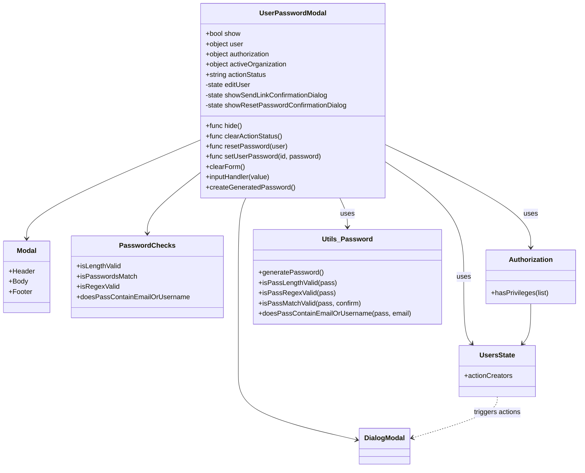

# Diagram: web/portal/src/modules/users/components/UserPasswordModal.js


> Auto-generated by Obscura crawlers

## Diagram 1



### SVG

<svg id="container" width="1333.1015625" xmlns="http://www.w3.org/2000/svg" class="classDiagram" height="1096" viewBox="0 0 1333.1015625 1096" role="graphics-document document" aria-roledescription="class"><style>#container{font-family:"trebuchet ms",verdana,arial,sans-serif;font-size:16px;fill:#333;}@keyframes edge-animation-frame{from{stroke-dashoffset:0;}}@keyframes dash{to{stroke-dashoffset:0;}}#container .edge-animation-slow{stroke-dasharray:9,5!important;stroke-dashoffset:900;animation:dash 50s linear infinite;stroke-linecap:round;}#container .edge-animation-fast{stroke-dasharray:9,5!important;stroke-dashoffset:900;animation:dash 20s linear infinite;stroke-linecap:round;}#container .error-icon{fill:#552222;}#container .error-text{fill:#552222;stroke:#552222;}#container .edge-thickness-normal{stroke-width:1px;}#container .edge-thickness-thick{stroke-width:3.5px;}#container .edge-pattern-solid{stroke-dasharray:0;}#container .edge-thickness-invisible{stroke-width:0;fill:none;}#container .edge-pattern-dashed{stroke-dasharray:3;}#container .edge-pattern-dotted{stroke-dasharray:2;}#container .marker{fill:#333333;stroke:#333333;}#container .marker.cross{stroke:#333333;}#container svg{font-family:"trebuchet ms",verdana,arial,sans-serif;font-size:16px;}#container p{margin:0;}#container g.classGroup text{fill:#9370DB;stroke:none;font-family:"trebuchet ms",verdana,arial,sans-serif;font-size:10px;}#container g.classGroup text .title{font-weight:bolder;}#container .nodeLabel,#container .edgeLabel{color:#131300;}#container .edgeLabel .label rect{fill:#ECECFF;}#container .label text{fill:#131300;}#container .labelBkg{background:#ECECFF;}#container .edgeLabel .label span{background:#ECECFF;}#container .classTitle{font-weight:bolder;}#container .node rect,#container .node circle,#container .node ellipse,#container .node polygon,#container .node path{fill:#ECECFF;stroke:#9370DB;stroke-width:1px;}#container .divider{stroke:#9370DB;stroke-width:1;}#container g.clickable{cursor:pointer;}#container g.classGroup rect{fill:#ECECFF;stroke:#9370DB;}#container g.classGroup line{stroke:#9370DB;stroke-width:1;}#container .classLabel .box{stroke:none;stroke-width:0;fill:#ECECFF;opacity:0.5;}#container .classLabel .label{fill:#9370DB;font-size:10px;}#container .relation{stroke:#333333;stroke-width:1;fill:none;}#container .dashed-line{stroke-dasharray:3;}#container .dotted-line{stroke-dasharray:1 2;}#container #compositionStart,#container .composition{fill:#333333!important;stroke:#333333!important;stroke-width:1;}#container #compositionEnd,#container .composition{fill:#333333!important;stroke:#333333!important;stroke-width:1;}#container #dependencyStart,#container .dependency{fill:#333333!important;stroke:#333333!important;stroke-width:1;}#container #dependencyStart,#container .dependency{fill:#333333!important;stroke:#333333!important;stroke-width:1;}#container #extensionStart,#container .extension{fill:transparent!important;stroke:#333333!important;stroke-width:1;}#container #extensionEnd,#container .extension{fill:transparent!important;stroke:#333333!important;stroke-width:1;}#container #aggregationStart,#container .aggregation{fill:transparent!important;stroke:#333333!important;stroke-width:1;}#container #aggregationEnd,#container .aggregation{fill:transparent!important;stroke:#333333!important;stroke-width:1;}#container #lollipopStart,#container .lollipop{fill:#ECECFF!important;stroke:#333333!important;stroke-width:1;}#container #lollipopEnd,#container .lollipop{fill:#ECECFF!important;stroke:#333333!important;stroke-width:1;}#container .edgeTerminals{font-size:11px;line-height:initial;}#container .classTitleText{text-anchor:middle;font-size:18px;fill:#333;}#container .label-icon{display:inline-block;height:1em;overflow:visible;vertical-align:-0.125em;}#container .node .label-icon path{fill:currentColor;stroke:revert;stroke-width:revert;}#container :root{--mermaid-font-family:"trebuchet ms",verdana,arial,sans-serif;}</style><g><defs><marker id="container_class-aggregationStart" class="marker aggregation class" refX="18" refY="7" markerWidth="190" markerHeight="240" orient="auto"><path d="M 18,7 L9,13 L1,7 L9,1 Z"></path></marker></defs><defs><marker id="container_class-aggregationEnd" class="marker aggregation class" refX="1" refY="7" markerWidth="20" markerHeight="28" orient="auto"><path d="M 18,7 L9,13 L1,7 L9,1 Z"></path></marker></defs><defs><marker id="container_class-extensionStart" class="marker extension class" refX="18" refY="7" markerWidth="190" markerHeight="240" orient="auto"><path d="M 1,7 L18,13 V 1 Z"></path></marker></defs><defs><marker id="container_class-extensionEnd" class="marker extension class" refX="1" refY="7" markerWidth="20" markerHeight="28" orient="auto"><path d="M 1,1 V 13 L18,7 Z"></path></marker></defs><defs><marker id="container_class-compositionStart" class="marker composition class" refX="18" refY="7" markerWidth="190" markerHeight="240" orient="auto"><path d="M 18,7 L9,13 L1,7 L9,1 Z"></path></marker></defs><defs><marker id="container_class-compositionEnd" class="marker composition class" refX="1" refY="7" markerWidth="20" markerHeight="28" orient="auto"><path d="M 18,7 L9,13 L1,7 L9,1 Z"></path></marker></defs><defs><marker id="container_class-dependencyStart" class="marker dependency class" refX="6" refY="7" markerWidth="190" markerHeight="240" orient="auto"><path d="M 5,7 L9,13 L1,7 L9,1 Z"></path></marker></defs><defs><marker id="container_class-dependencyEnd" class="marker dependency class" refX="13" refY="7" markerWidth="20" markerHeight="28" orient="auto"><path d="M 18,7 L9,13 L14,7 L9,1 Z"></path></marker></defs><defs><marker id="container_class-lollipopStart" class="marker lollipop class" refX="13" refY="7" markerWidth="190" markerHeight="240" orient="auto"><circle stroke="black" fill="transparent" cx="7" cy="7" r="6"></circle></marker></defs><defs><marker id="container_class-lollipopEnd" class="marker lollipop class" refX="1" refY="7" markerWidth="190" markerHeight="240" orient="auto"><circle stroke="black" fill="transparent" cx="7" cy="7" r="6"></circle></marker></defs><g class="root"><g class="clusters"></g><g class="edgePaths"><path d="M456.063,329.46L390.305,358.05C324.548,386.64,193.034,443.82,127.277,482.077C61.52,520.333,61.52,539.667,61.52,549.333L61.52,559" id="id_UserPasswordModal_Modal_1" class="edge-thickness-normal edge-pattern-solid relation" style=";;;" data-edge="true" data-et="edge" data-id="id_UserPasswordModal_Modal_1" data-points="W3sieCI6NDU2LjA2MjUsInkiOjMyOS40NTk1Nzg4MDQzNDc4fSx7IngiOjYxLjUxOTUzMTI1LCJ5Ijo1MDF9LHsieCI6NjEuNTE5NTMxMjUsInkiOjU2NX1d" marker-end="url(#container_class-dependencyEnd)"></path><path d="M563.025,464L560.104,470.167C557.184,476.333,551.342,488.667,548.421,519.5C545.5,550.333,545.5,599.667,545.5,647C545.5,694.333,545.5,739.667,545.5,776.5C545.5,813.333,545.5,841.667,545.5,872C545.5,902.333,545.5,934.667,591.158,961.523C636.816,988.38,728.133,1009.76,773.791,1020.45L819.449,1031.14" id="id_UserPasswordModal_DialogModal_2" class="edge-thickness-normal edge-pattern-solid relation" style=";;;" data-edge="true" data-et="edge" data-id="id_UserPasswordModal_DialogModal_2" data-points="W3sieCI6NTYzLjAyNTM2ODUxNDE1MSwieSI6NDY0fSx7IngiOjU0NS41LCJ5Ijo1MDF9LHsieCI6NTQ1LjUsInkiOjY0OX0seyJ4Ijo1NDUuNSwieSI6Nzg1fSx7IngiOjU0NS41LCJ5Ijo4NzB9LHsieCI6NTQ1LjUsInkiOjk2N30seyJ4Ijo4MjUuMjkxMDE1NjI1LCJ5IjoxMDMyLjUwODEyNDEyODExMDd9XQ==" marker-end="url(#container_class-dependencyEnd)"></path><path d="M456.063,406.934L436.347,422.611C416.632,438.289,377.201,469.645,357.485,492.989C337.77,516.333,337.77,531.667,337.77,539.333L337.77,547" id="id_UserPasswordModal_PasswordChecks_3" class="edge-thickness-normal edge-pattern-solid relation" style=";;;" data-edge="true" data-et="edge" data-id="id_UserPasswordModal_PasswordChecks_3" data-points="W3sieCI6NDU2LjA2MjUsInkiOjQwNi45MzM1NzMyMzcwNTkyNX0seyJ4IjozMzcuNzY5NTMxMjUsInkiOjUwMX0seyJ4IjozMzcuNzY5NTMxMjUsInkiOjU1M31d" marker-end="url(#container_class-dependencyEnd)"></path><path d="M885.977,380.927L915.659,400.939C945.341,420.951,1004.706,460.976,1034.388,505.654C1064.07,550.333,1064.07,599.667,1064.07,647C1064.07,694.333,1064.07,739.667,1067.224,765.764C1070.377,791.861,1076.683,798.722,1079.836,802.152L1082.99,805.583" id="id_UserPasswordModal_UsersState_4" class="edge-thickness-normal edge-pattern-solid relation" style=";;;" data-edge="true" data-et="edge" data-id="id_UserPasswordModal_UsersState_4" data-points="W3sieCI6ODg1Ljk3NjU2MjUsInkiOjM4MC45MjY4NTQyMzUxOTk0fSx7IngiOjEwNjQuMDcwMzEyNSwieSI6NTAxfSx7IngiOjEwNjQuMDcwMzEyNSwieSI6NjQ5fSx7IngiOjEwNjQuMDcwMzEyNSwieSI6Nzg1fSx7IngiOjEwODcuMDQ5OTc3MDIyMDU4OCwieSI6ODEwfV0=" marker-end="url(#container_class-dependencyEnd)"></path><path d="M885.977,339.7L941.702,366.583C997.428,393.467,1108.88,447.233,1164.606,487.283C1220.332,527.333,1220.332,553.667,1220.332,566.833L1220.332,580" id="id_UserPasswordModal_Authorization_5" class="edge-thickness-normal edge-pattern-solid relation" style=";;;" data-edge="true" data-et="edge" data-id="id_UserPasswordModal_Authorization_5" data-points="W3sieCI6ODg1Ljk3NjU2MjUsInkiOjMzOS42OTk4MzA3NTQzNTIwNH0seyJ4IjoxMjIwLjMzMjAzMTI1LCJ5Ijo1MDF9LHsieCI6MTIyMC4zMzIwMzEyNSwieSI6NTg2fV0=" marker-end="url(#container_class-dependencyEnd)"></path><path d="M779.014,464L781.935,470.167C784.855,476.333,790.697,488.667,793.618,500C796.539,511.333,796.539,521.667,796.539,526.833L796.539,532" id="id_UserPasswordModal_Utils_Password_6" class="edge-thickness-normal edge-pattern-solid relation" style=";;;" data-edge="true" data-et="edge" data-id="id_UserPasswordModal_Utils_Password_6" data-points="W3sieCI6Nzc5LjAxMzY5Mzk4NTg0OSwieSI6NDY0fSx7IngiOjc5Ni41MzkwNjI1LCJ5Ijo1MDF9LHsieCI6Nzk2LjUzOTA2MjUsInkiOjUzOH1d" marker-end="url(#container_class-dependencyEnd)"></path><path d="M1220.332,712L1220.332,724.167C1220.332,736.333,1220.332,760.667,1217.179,776.264C1214.026,791.861,1207.719,798.722,1204.566,802.152L1201.413,805.583" id="id_Authorization_UsersState_7" class="edge-thickness-normal edge-pattern-solid relation" style=";;;" data-edge="true" data-et="edge" data-id="id_Authorization_UsersState_7" data-points="W3sieCI6MTIyMC4zMzIwMzEyNSwieSI6NzEyfSx7IngiOjEyMjAuMzMyMDMxMjUsInkiOjc4NX0seyJ4IjoxMTk3LjM1MjM2NjcyNzk0MTIsInkiOjgxMH1d" marker-end="url(#container_class-dependencyEnd)"></path><path d="M1142.201,930L1142.201,936.167C1142.201,942.333,1142.201,954.667,1109.548,970.782C1076.894,986.898,1011.587,1006.796,978.934,1016.745L946.281,1026.694" id="id_UsersState_DialogModal_8" class="edge-thickness-normal edge-pattern-dashed relation" style=";;;" data-edge="true" data-et="edge" data-id="id_UsersState_DialogModal_8" data-points="W3sieCI6MTE0Mi4yMDExNzE4NzUsInkiOjkzMH0seyJ4IjoxMTQyLjIwMTE3MTg3NSwieSI6OTY3fSx7IngiOjk0MC41NDEwMTU2MjUsInkiOjEwMjguNDQyNTkzMDY2ODc1Nn1d" marker-end="url(#container_class-dependencyEnd)"></path></g><g class="edgeLabels"><g class="edgeLabel"><g class="label" data-id="id_UserPasswordModal_Modal_1" transform="translate(0, 0)"><foreignObject width="0" height="0"><div xmlns="http://www.w3.org/1999/xhtml" class="labelBkg" style="display: table-cell; white-space: nowrap; line-height: 1.5; max-width: 200px; text-align: center;"><span class="edgeLabel"></span></div></foreignObject></g></g><g class="edgeLabel"><g class="label" data-id="id_UserPasswordModal_DialogModal_2" transform="translate(0, 0)"><foreignObject width="0" height="0"><div xmlns="http://www.w3.org/1999/xhtml" class="labelBkg" style="display: table-cell; white-space: nowrap; line-height: 1.5; max-width: 200px; text-align: center;"><span class="edgeLabel"></span></div></foreignObject></g></g><g class="edgeLabel"><g class="label" data-id="id_UserPasswordModal_PasswordChecks_3" transform="translate(0, 0)"><foreignObject width="0" height="0"><div xmlns="http://www.w3.org/1999/xhtml" class="labelBkg" style="display: table-cell; white-space: nowrap; line-height: 1.5; max-width: 200px; text-align: center;"><span class="edgeLabel"></span></div></foreignObject></g></g><g class="edgeLabel" transform="translate(1064.0703125, 649)"><g class="label" data-id="id_UserPasswordModal_UsersState_4" transform="translate(-16.4921875, -12)"><foreignObject width="32.984375" height="24"><div xmlns="http://www.w3.org/1999/xhtml" class="labelBkg" style="display: table-cell; white-space: nowrap; line-height: 1.5; max-width: 200px; text-align: center;"><span class="edgeLabel"><p>uses</p></span></div></foreignObject></g></g><g class="edgeLabel" transform="translate(1220.33203125, 501)"><g class="label" data-id="id_UserPasswordModal_Authorization_5" transform="translate(-16.4921875, -12)"><foreignObject width="32.984375" height="24"><div xmlns="http://www.w3.org/1999/xhtml" class="labelBkg" style="display: table-cell; white-space: nowrap; line-height: 1.5; max-width: 200px; text-align: center;"><span class="edgeLabel"><p>uses</p></span></div></foreignObject></g></g><g class="edgeLabel" transform="translate(796.5390625, 501)"><g class="label" data-id="id_UserPasswordModal_Utils_Password_6" transform="translate(-16.4921875, -12)"><foreignObject width="32.984375" height="24"><div xmlns="http://www.w3.org/1999/xhtml" class="labelBkg" style="display: table-cell; white-space: nowrap; line-height: 1.5; max-width: 200px; text-align: center;"><span class="edgeLabel"><p>uses</p></span></div></foreignObject></g></g><g class="edgeLabel"><g class="label" data-id="id_Authorization_UsersState_7" transform="translate(0, 0)"><foreignObject width="0" height="0"><div xmlns="http://www.w3.org/1999/xhtml" class="labelBkg" style="display: table-cell; white-space: nowrap; line-height: 1.5; max-width: 200px; text-align: center;"><span class="edgeLabel"></span></div></foreignObject></g></g><g class="edgeLabel" transform="translate(1142.201171875, 967)"><g class="label" data-id="id_UsersState_DialogModal_8" transform="translate(-56.03125, -12)"><foreignObject width="112.0625" height="24"><div xmlns="http://www.w3.org/1999/xhtml" class="labelBkg" style="display: table-cell; white-space: nowrap; line-height: 1.5; max-width: 200px; text-align: center;"><span class="edgeLabel"><p>triggers actions</p></span></div></foreignObject></g></g></g><g class="nodes"><g class="node default" id="classId-UserPasswordModal-0" transform="translate(671.01953125, 236)"><g class="basic label-container"><path d="M-214.95703125 -228 L214.95703125 -228 L214.95703125 228 L-214.95703125 228" stroke="none" stroke-width="0" fill="#ECECFF" style=""></path><path d="M-214.95703125 -228 C-52.58174333571009 -228, 109.79354457857983 -228, 214.95703125 -228 M-214.95703125 -228 C-101.06420942618965 -228, 12.828612397620702 -228, 214.95703125 -228 M214.95703125 -228 C214.95703125 -53.018710995153896, 214.95703125 121.96257800969221, 214.95703125 228 M214.95703125 -228 C214.95703125 -78.32168326818712, 214.95703125 71.35663346362577, 214.95703125 228 M214.95703125 228 C98.883754852046 228, -17.189521545908008 228, -214.95703125 228 M214.95703125 228 C50.026451933569405 228, -114.90412738286119 228, -214.95703125 228 M-214.95703125 228 C-214.95703125 134.96855065725927, -214.95703125 41.93710131451854, -214.95703125 -228 M-214.95703125 228 C-214.95703125 119.66241584294454, -214.95703125 11.32483168588908, -214.95703125 -228" stroke="#9370DB" stroke-width="1.3" fill="none" stroke-dasharray="0 0" style=""></path></g><g class="annotation-group text" transform="translate(0, -204)"></g><g class="label-group text" transform="translate(-73.8203125, -204)"><g class="label" style="font-weight: bolder" transform="translate(0,-12)"><foreignObject width="147.640625" height="24"><div xmlns="http://www.w3.org/1999/xhtml" style="display: table-cell; white-space: nowrap; line-height: 1.5; max-width: 195px; text-align: center;"><span class="nodeLabel markdown-node-label" style=""><p>UserPasswordModal</p></span></div></foreignObject></g></g><g class="members-group text" transform="translate(-202.95703125, -156)"><g class="label" style="" transform="translate(0,-12)"><foreignObject width="82.78125" height="24"><div xmlns="http://www.w3.org/1999/xhtml" style="display: table-cell; white-space: nowrap; line-height: 1.5; max-width: 141px; text-align: center;"><span class="nodeLabel markdown-node-label" style=""><p>+bool show</p></span></div></foreignObject></g><g class="label" style="" transform="translate(0,12)"><foreignObject width="89.390625" height="24"><div xmlns="http://www.w3.org/1999/xhtml" style="display: table-cell; white-space: nowrap; line-height: 1.5; max-width: 148px; text-align: center;"><span class="nodeLabel markdown-node-label" style=""><p>+object user</p></span></div></foreignObject></g><g class="label" style="" transform="translate(0,36)"><foreignObject width="155.375" height="24"><div xmlns="http://www.w3.org/1999/xhtml" style="display: table-cell; white-space: nowrap; line-height: 1.5; max-width: 213px; text-align: center;"><span class="nodeLabel markdown-node-label" style=""><p>+object authorization</p></span></div></foreignObject></g><g class="label" style="" transform="translate(0,60)"><foreignObject width="192.953125" height="24"><div xmlns="http://www.w3.org/1999/xhtml" style="display: table-cell; white-space: nowrap; line-height: 1.5; max-width: 250px; text-align: center;"><span class="nodeLabel markdown-node-label" style=""><p>+object activeOrganization</p></span></div></foreignObject></g><g class="label" style="" transform="translate(0,84)"><foreignObject width="144.875" height="24"><div xmlns="http://www.w3.org/1999/xhtml" style="display: table-cell; white-space: nowrap; line-height: 1.5; max-width: 202px; text-align: center;"><span class="nodeLabel markdown-node-label" style=""><p>+string actionStatus</p></span></div></foreignObject></g><g class="label" style="" transform="translate(0,108)"><foreignObject width="108.25" height="24"><div xmlns="http://www.w3.org/1999/xhtml" style="display: table-cell; white-space: nowrap; line-height: 1.5; max-width: 166px; text-align: center;"><span class="nodeLabel markdown-node-label" style=""><p>-state editUser</p></span></div></foreignObject></g><g class="label" style="" transform="translate(0,132)"><foreignObject width="290.6875" height="24"><div xmlns="http://www.w3.org/1999/xhtml" style="display: table-cell; white-space: nowrap; line-height: 1.5; max-width: 349px; text-align: center;"><span class="nodeLabel markdown-node-label" style=""><p>-state showSendLinkConfirmationDialog</p></span></div></foreignObject></g><g class="label" style="" transform="translate(0,156)"><foreignObject width="332.09375" height="24"><div xmlns="http://www.w3.org/1999/xhtml" style="display: table-cell; white-space: nowrap; line-height: 1.5; max-width: 390px; text-align: center;"><span class="nodeLabel markdown-node-label" style=""><p>-state showResetPasswordConfirmationDialog</p></span></div></foreignObject></g></g><g class="methods-group text" transform="translate(-202.95703125, 60)"><g class="label" style="" transform="translate(0,-12)"><foreignObject width="86.234375" height="24"><div xmlns="http://www.w3.org/1999/xhtml" style="display: table-cell; white-space: nowrap; line-height: 1.5; max-width: 144px; text-align: center;"><span class="nodeLabel markdown-node-label" style=""><p>+func hide()</p></span></div></foreignObject></g><g class="label" style="" transform="translate(0,12)"><foreignObject width="181.21875" height="24"><div xmlns="http://www.w3.org/1999/xhtml" style="display: table-cell; white-space: nowrap; line-height: 1.5; max-width: 239px; text-align: center;"><span class="nodeLabel markdown-node-label" style=""><p>+func clearActionStatus()</p></span></div></foreignObject></g><g class="label" style="" transform="translate(0,36)"><foreignObject width="189.828125" height="24"><div xmlns="http://www.w3.org/1999/xhtml" style="display: table-cell; white-space: nowrap; line-height: 1.5; max-width: 247px; text-align: center;"><span class="nodeLabel markdown-node-label" style=""><p>+func resetPassword(user)</p></span></div></foreignObject></g><g class="label" style="" transform="translate(0,60)"><foreignObject width="267.421875" height="24"><div xmlns="http://www.w3.org/1999/xhtml" style="display: table-cell; white-space: nowrap; line-height: 1.5; max-width: 325px; text-align: center;"><span class="nodeLabel markdown-node-label" style=""><p>+func setUserPassword(id, password)</p></span></div></foreignObject></g><g class="label" style="" transform="translate(0,84)"><foreignObject width="90.578125" height="24"><div xmlns="http://www.w3.org/1999/xhtml" style="display: table-cell; white-space: nowrap; line-height: 1.5; max-width: 148px; text-align: center;"><span class="nodeLabel markdown-node-label" style=""><p>+clearForm()</p></span></div></foreignObject></g><g class="label" style="" transform="translate(0,108)"><foreignObject width="153.75" height="24"><div xmlns="http://www.w3.org/1999/xhtml" style="display: table-cell; white-space: nowrap; line-height: 1.5; max-width: 211px; text-align: center;"><span class="nodeLabel markdown-node-label" style=""><p>+inputHandler(value)</p></span></div></foreignObject></g><g class="label" style="" transform="translate(0,132)"><foreignObject width="206" height="24"><div xmlns="http://www.w3.org/1999/xhtml" style="display: table-cell; white-space: nowrap; line-height: 1.5; max-width: 263px; text-align: center;"><span class="nodeLabel markdown-node-label" style=""><p>+createGeneratedPassword()</p></span></div></foreignObject></g></g><g class="divider" style=""><path d="M-214.95703125 -180 C-125.68573662481694 -180, -36.41444199963388 -180, 214.95703125 -180 M-214.95703125 -180 C-116.34883855465041 -180, -17.740645859300827 -180, 214.95703125 -180" stroke="#9370DB" stroke-width="1.3" fill="none" stroke-dasharray="0 0" style=""></path></g><g class="divider" style=""><path d="M-214.95703125 36 C-117.33463709962216 36, -19.712242949244313 36, 214.95703125 36 M-214.95703125 36 C-123.71500444941377 36, -32.47297764882754 36, 214.95703125 36" stroke="#9370DB" stroke-width="1.3" fill="none" stroke-dasharray="0 0" style=""></path></g></g><g class="node default" id="classId-Modal-1" transform="translate(61.51953125, 649)"><g class="basic label-container"><path d="M-53.51953125 -84 L53.51953125 -84 L53.51953125 84 L-53.51953125 84" stroke="none" stroke-width="0" fill="#ECECFF" style=""></path><path d="M-53.51953125 -84 C-24.4338281080165 -84, 4.651875033967002 -84, 53.51953125 -84 M-53.51953125 -84 C-24.629350773982967 -84, 4.260829702034066 -84, 53.51953125 -84 M53.51953125 -84 C53.51953125 -31.77704418596698, 53.51953125 20.445911628066042, 53.51953125 84 M53.51953125 -84 C53.51953125 -33.036475368570756, 53.51953125 17.92704926285849, 53.51953125 84 M53.51953125 84 C23.573082189875596 84, -6.373366870248809 84, -53.51953125 84 M53.51953125 84 C27.945237972799823 84, 2.370944695599647 84, -53.51953125 84 M-53.51953125 84 C-53.51953125 40.77396795021995, -53.51953125 -2.452064099560104, -53.51953125 -84 M-53.51953125 84 C-53.51953125 32.1062541728891, -53.51953125 -19.787491654221796, -53.51953125 -84" stroke="#9370DB" stroke-width="1.3" fill="none" stroke-dasharray="0 0" style=""></path></g><g class="annotation-group text" transform="translate(0, -60)"></g><g class="label-group text" transform="translate(-22.4453125, -60)"><g class="label" style="font-weight: bolder" transform="translate(0,-12)"><foreignObject width="44.890625" height="24"><div xmlns="http://www.w3.org/1999/xhtml" style="display: table-cell; white-space: nowrap; line-height: 1.5; max-width: 95px; text-align: center;"><span class="nodeLabel markdown-node-label" style=""><p>Modal</p></span></div></foreignObject></g></g><g class="members-group text" transform="translate(-41.51953125, -12)"><g class="label" style="" transform="translate(0,-12)"><foreignObject width="60.59375" height="24"><div xmlns="http://www.w3.org/1999/xhtml" style="display: table-cell; white-space: nowrap; line-height: 1.5; max-width: 119px; text-align: center;"><span class="nodeLabel markdown-node-label" style=""><p>+Header</p></span></div></foreignObject></g><g class="label" style="" transform="translate(0,12)"><foreignObject width="44.5" height="24"><div xmlns="http://www.w3.org/1999/xhtml" style="display: table-cell; white-space: nowrap; line-height: 1.5; max-width: 102px; text-align: center;"><span class="nodeLabel markdown-node-label" style=""><p>+Body</p></span></div></foreignObject></g><g class="label" style="" transform="translate(0,36)"><foreignObject width="54.40625" height="24"><div xmlns="http://www.w3.org/1999/xhtml" style="display: table-cell; white-space: nowrap; line-height: 1.5; max-width: 113px; text-align: center;"><span class="nodeLabel markdown-node-label" style=""><p>+Footer</p></span></div></foreignObject></g></g><g class="methods-group text" transform="translate(-41.51953125, 84)"></g><g class="divider" style=""><path d="M-53.51953125 -36 C-31.570157081182746 -36, -9.620782912365492 -36, 53.51953125 -36 M-53.51953125 -36 C-28.967096156160874 -36, -4.414661062321748 -36, 53.51953125 -36" stroke="#9370DB" stroke-width="1.3" fill="none" stroke-dasharray="0 0" style=""></path></g><g class="divider" style=""><path d="M-53.51953125 60 C-16.793605778569415 60, 19.93231969286117 60, 53.51953125 60 M-53.51953125 60 C-27.860774295834158 60, -2.2020173416683164 60, 53.51953125 60" stroke="#9370DB" stroke-width="1.3" fill="none" stroke-dasharray="0 0" style=""></path></g></g><g class="node default" id="classId-DialogModal-2" transform="translate(882.916015625, 1046)"><g class="basic label-container"><path d="M-57.625 -42 L57.625 -42 L57.625 42 L-57.625 42" stroke="none" stroke-width="0" fill="#ECECFF" style=""></path><path d="M-57.625 -42 C-24.605613970127393 -42, 8.413772059745213 -42, 57.625 -42 M-57.625 -42 C-15.378285078142284 -42, 26.868429843715433 -42, 57.625 -42 M57.625 -42 C57.625 -21.04743776162191, 57.625 -0.09487552324382165, 57.625 42 M57.625 -42 C57.625 -11.128882361312957, 57.625 19.742235277374085, 57.625 42 M57.625 42 C14.245625067010998 42, -29.133749865978004 42, -57.625 42 M57.625 42 C28.170626639623354 42, -1.2837467207532924 42, -57.625 42 M-57.625 42 C-57.625 9.673929291880846, -57.625 -22.652141416238308, -57.625 -42 M-57.625 42 C-57.625 24.78187286219161, -57.625 7.563745724383217, -57.625 -42" stroke="#9370DB" stroke-width="1.3" fill="none" stroke-dasharray="0 0" style=""></path></g><g class="annotation-group text" transform="translate(0, -18)"></g><g class="label-group text" transform="translate(-45.625, -18)"><g class="label" style="font-weight: bolder" transform="translate(0,-12)"><foreignObject width="91.25" height="24"><div xmlns="http://www.w3.org/1999/xhtml" style="display: table-cell; white-space: nowrap; line-height: 1.5; max-width: 141px; text-align: center;"><span class="nodeLabel markdown-node-label" style=""><p>DialogModal</p></span></div></foreignObject></g></g><g class="members-group text" transform="translate(-45.625, 30)"></g><g class="methods-group text" transform="translate(-45.625, 60)"></g><g class="divider" style=""><path d="M-57.625 6 C-32.30204560430832 6, -6.979091208616644 6, 57.625 6 M-57.625 6 C-23.050628744458365 6, 11.52374251108327 6, 57.625 6" stroke="#9370DB" stroke-width="1.3" fill="none" stroke-dasharray="0 0" style=""></path></g><g class="divider" style=""><path d="M-57.625 24 C-18.68433712338679 24, 20.25632575322642 24, 57.625 24 M-57.625 24 C-16.813666389437806 24, 23.997667221124388 24, 57.625 24" stroke="#9370DB" stroke-width="1.3" fill="none" stroke-dasharray="0 0" style=""></path></g></g><g class="node default" id="classId-PasswordChecks-3" transform="translate(337.76953125, 649)"><g class="basic label-container"><path d="M-172.73046875 -96 L172.73046875 -96 L172.73046875 96 L-172.73046875 96" stroke="none" stroke-width="0" fill="#ECECFF" style=""></path><path d="M-172.73046875 -96 C-71.12368803660544 -96, 30.483092676789113 -96, 172.73046875 -96 M-172.73046875 -96 C-97.84012890822063 -96, -22.94978906644127 -96, 172.73046875 -96 M172.73046875 -96 C172.73046875 -21.7541712375658, 172.73046875 52.4916575248684, 172.73046875 96 M172.73046875 -96 C172.73046875 -53.95177774739952, 172.73046875 -11.903555494799036, 172.73046875 96 M172.73046875 96 C79.47756014993833 96, -13.775348450123346 96, -172.73046875 96 M172.73046875 96 C73.1510624588904 96, -26.428343832219213 96, -172.73046875 96 M-172.73046875 96 C-172.73046875 50.61536482014549, -172.73046875 5.230729640290974, -172.73046875 -96 M-172.73046875 96 C-172.73046875 48.03680359656212, -172.73046875 0.07360719312424635, -172.73046875 -96" stroke="#9370DB" stroke-width="1.3" fill="none" stroke-dasharray="0 0" style=""></path></g><g class="annotation-group text" transform="translate(0, -72)"></g><g class="label-group text" transform="translate(-60.3515625, -72)"><g class="label" style="font-weight: bolder" transform="translate(0,-12)"><foreignObject width="120.703125" height="24"><div xmlns="http://www.w3.org/1999/xhtml" style="display: table-cell; white-space: nowrap; line-height: 1.5; max-width: 168px; text-align: center;"><span class="nodeLabel markdown-node-label" style=""><p>PasswordChecks</p></span></div></foreignObject></g></g><g class="members-group text" transform="translate(-160.73046875, -24)"><g class="label" style="" transform="translate(0,-12)"><foreignObject width="104.6875" height="24"><div xmlns="http://www.w3.org/1999/xhtml" style="display: table-cell; white-space: nowrap; line-height: 1.5; max-width: 162px; text-align: center;"><span class="nodeLabel markdown-node-label" style=""><p>+isLengthValid</p></span></div></foreignObject></g><g class="label" style="" transform="translate(0,12)"><foreignObject width="138.875" height="24"><div xmlns="http://www.w3.org/1999/xhtml" style="display: table-cell; white-space: nowrap; line-height: 1.5; max-width: 196px; text-align: center;"><span class="nodeLabel markdown-node-label" style=""><p>+isPasswordsMatch</p></span></div></foreignObject></g><g class="label" style="" transform="translate(0,36)"><foreignObject width="98.109375" height="24"><div xmlns="http://www.w3.org/1999/xhtml" style="display: table-cell; white-space: nowrap; line-height: 1.5; max-width: 155px; text-align: center;"><span class="nodeLabel markdown-node-label" style=""><p>+isRegexValid</p></span></div></foreignObject></g><g class="label" style="" transform="translate(0,60)"><foreignObject width="261.109375" height="24"><div xmlns="http://www.w3.org/1999/xhtml" style="display: table-cell; white-space: nowrap; line-height: 1.5; max-width: 318px; text-align: center;"><span class="nodeLabel markdown-node-label" style=""><p>+doesPassContainEmailOrUsername</p></span></div></foreignObject></g></g><g class="methods-group text" transform="translate(-160.73046875, 96)"></g><g class="divider" style=""><path d="M-172.73046875 -48 C-71.65759119466676 -48, 29.41528636066647 -48, 172.73046875 -48 M-172.73046875 -48 C-70.12404870420174 -48, 32.48237134159652 -48, 172.73046875 -48" stroke="#9370DB" stroke-width="1.3" fill="none" stroke-dasharray="0 0" style=""></path></g><g class="divider" style=""><path d="M-172.73046875 72 C-102.41860653704772 72, -32.106744324095445 72, 172.73046875 72 M-172.73046875 72 C-35.34136434656912 72, 102.04774005686176 72, 172.73046875 72" stroke="#9370DB" stroke-width="1.3" fill="none" stroke-dasharray="0 0" style=""></path></g></g><g class="node default" id="classId-UsersState-4" transform="translate(1142.201171875, 870)"><g class="basic label-container"><path d="M-88.41015625 -60 L88.41015625 -60 L88.41015625 60 L-88.41015625 60" stroke="none" stroke-width="0" fill="#ECECFF" style=""></path><path d="M-88.41015625 -60 C-33.11830595204924 -60, 22.17354434590152 -60, 88.41015625 -60 M-88.41015625 -60 C-52.3361250670022 -60, -16.2620938840044 -60, 88.41015625 -60 M88.41015625 -60 C88.41015625 -34.061498040314305, 88.41015625 -8.122996080628617, 88.41015625 60 M88.41015625 -60 C88.41015625 -19.600314609030335, 88.41015625 20.79937078193933, 88.41015625 60 M88.41015625 60 C42.316516862816194 60, -3.7771225243676128 60, -88.41015625 60 M88.41015625 60 C45.349775229982185 60, 2.289394209964371 60, -88.41015625 60 M-88.41015625 60 C-88.41015625 20.945988143302003, -88.41015625 -18.108023713395994, -88.41015625 -60 M-88.41015625 60 C-88.41015625 31.72422683112856, -88.41015625 3.4484536622571227, -88.41015625 -60" stroke="#9370DB" stroke-width="1.3" fill="none" stroke-dasharray="0 0" style=""></path></g><g class="annotation-group text" transform="translate(0, -36)"></g><g class="label-group text" transform="translate(-39.7421875, -36)"><g class="label" style="font-weight: bolder" transform="translate(0,-12)"><foreignObject width="79.484375" height="24"><div xmlns="http://www.w3.org/1999/xhtml" style="display: table-cell; white-space: nowrap; line-height: 1.5; max-width: 127px; text-align: center;"><span class="nodeLabel markdown-node-label" style=""><p>UsersState</p></span></div></foreignObject></g></g><g class="members-group text" transform="translate(-76.41015625, 12)"><g class="label" style="" transform="translate(0,-12)"><foreignObject width="113.078125" height="24"><div xmlns="http://www.w3.org/1999/xhtml" style="display: table-cell; white-space: nowrap; line-height: 1.5; max-width: 170px; text-align: center;"><span class="nodeLabel markdown-node-label" style=""><p>+actionCreators</p></span></div></foreignObject></g></g><g class="methods-group text" transform="translate(-76.41015625, 60)"></g><g class="divider" style=""><path d="M-88.41015625 -12 C-24.058056474969973 -12, 40.29404330006005 -12, 88.41015625 -12 M-88.41015625 -12 C-30.500344619645 -12, 27.409467010710003 -12, 88.41015625 -12" stroke="#9370DB" stroke-width="1.3" fill="none" stroke-dasharray="0 0" style=""></path></g><g class="divider" style=""><path d="M-88.41015625 36 C-44.91318668969044 36, -1.4162171293808825 36, 88.41015625 36 M-88.41015625 36 C-28.794785916522393 36, 30.820584416955214 36, 88.41015625 36" stroke="#9370DB" stroke-width="1.3" fill="none" stroke-dasharray="0 0" style=""></path></g></g><g class="node default" id="classId-Authorization-5" transform="translate(1220.33203125, 649)"><g class="basic label-container"><path d="M-104.76953125 -63 L104.76953125 -63 L104.76953125 63 L-104.76953125 63" stroke="none" stroke-width="0" fill="#ECECFF" style=""></path><path d="M-104.76953125 -63 C-28.17527391693676 -63, 48.41898341612648 -63, 104.76953125 -63 M-104.76953125 -63 C-34.048796801955845 -63, 36.67193764608831 -63, 104.76953125 -63 M104.76953125 -63 C104.76953125 -23.005297642413048, 104.76953125 16.989404715173904, 104.76953125 63 M104.76953125 -63 C104.76953125 -30.50989273263646, 104.76953125 1.9802145347270823, 104.76953125 63 M104.76953125 63 C57.456927901687436 63, 10.144324553374872 63, -104.76953125 63 M104.76953125 63 C34.69185062328394 63, -35.38583000343212 63, -104.76953125 63 M-104.76953125 63 C-104.76953125 14.721073386502788, -104.76953125 -33.557853226994425, -104.76953125 -63 M-104.76953125 63 C-104.76953125 33.97456933381535, -104.76953125 4.949138667630699, -104.76953125 -63" stroke="#9370DB" stroke-width="1.3" fill="none" stroke-dasharray="0 0" style=""></path></g><g class="annotation-group text" transform="translate(0, -39)"></g><g class="label-group text" transform="translate(-49.7109375, -39)"><g class="label" style="font-weight: bolder" transform="translate(0,-12)"><foreignObject width="99.421875" height="24"><div xmlns="http://www.w3.org/1999/xhtml" style="display: table-cell; white-space: nowrap; line-height: 1.5; max-width: 148px; text-align: center;"><span class="nodeLabel markdown-node-label" style=""><p>Authorization</p></span></div></foreignObject></g></g><g class="members-group text" transform="translate(-92.76953125, 9)"></g><g class="methods-group text" transform="translate(-92.76953125, 39)"><g class="label" style="" transform="translate(0,-12)"><foreignObject width="135.828125" height="24"><div xmlns="http://www.w3.org/1999/xhtml" style="display: table-cell; white-space: nowrap; line-height: 1.5; max-width: 193px; text-align: center;"><span class="nodeLabel markdown-node-label" style=""><p>+hasPrivileges(list)</p></span></div></foreignObject></g></g><g class="divider" style=""><path d="M-104.76953125 -15 C-23.841954897616546 -15, 57.08562145476691 -15, 104.76953125 -15 M-104.76953125 -15 C-46.9964313462268 -15, 10.776668557546401 -15, 104.76953125 -15" stroke="#9370DB" stroke-width="1.3" fill="none" stroke-dasharray="0 0" style=""></path></g><g class="divider" style=""><path d="M-104.76953125 9 C-57.870896042519504 9, -10.972260835039009 9, 104.76953125 9 M-104.76953125 9 C-44.32174418640881 9, 16.126042877182385 9, 104.76953125 9" stroke="#9370DB" stroke-width="1.3" fill="none" stroke-dasharray="0 0" style=""></path></g></g><g class="node default" id="classId-Utils_Password-6" transform="translate(796.5390625, 649)"><g class="basic label-container"><path d="M-216.0390625 -111 L216.0390625 -111 L216.0390625 111 L-216.0390625 111" stroke="none" stroke-width="0" fill="#ECECFF" style=""></path><path d="M-216.0390625 -111 C-72.65058058013776 -111, 70.73790133972449 -111, 216.0390625 -111 M-216.0390625 -111 C-64.21809480878645 -111, 87.6028728824271 -111, 216.0390625 -111 M216.0390625 -111 C216.0390625 -29.36680166069769, 216.0390625 52.26639667860462, 216.0390625 111 M216.0390625 -111 C216.0390625 -57.81041147984493, 216.0390625 -4.6208229596898605, 216.0390625 111 M216.0390625 111 C80.33702814118419 111, -55.36500621763162 111, -216.0390625 111 M216.0390625 111 C116.92031927707804 111, 17.801576054156072 111, -216.0390625 111 M-216.0390625 111 C-216.0390625 26.732553215695035, -216.0390625 -57.53489356860993, -216.0390625 -111 M-216.0390625 111 C-216.0390625 65.92681701402299, -216.0390625 20.853634028045988, -216.0390625 -111" stroke="#9370DB" stroke-width="1.3" fill="none" stroke-dasharray="0 0" style=""></path></g><g class="annotation-group text" transform="translate(0, -87)"></g><g class="label-group text" transform="translate(-55.515625, -87)"><g class="label" style="font-weight: bolder" transform="translate(0,-12)"><foreignObject width="111.03125" height="24"><div xmlns="http://www.w3.org/1999/xhtml" style="display: table-cell; white-space: nowrap; line-height: 1.5; max-width: 159px; text-align: center;"><span class="nodeLabel markdown-node-label" style=""><p>Utils_Password</p></span></div></foreignObject></g></g><g class="members-group text" transform="translate(-204.0390625, -39)"></g><g class="methods-group text" transform="translate(-204.0390625, -9)"><g class="label" style="" transform="translate(0,-12)"><foreignObject width="149.53125" height="24"><div xmlns="http://www.w3.org/1999/xhtml" style="display: table-cell; white-space: nowrap; line-height: 1.5; max-width: 207px; text-align: center;"><span class="nodeLabel markdown-node-label" style=""><p>+generatePassword()</p></span></div></foreignObject></g><g class="label" style="" transform="translate(0,12)"><foreignObject width="179.46875" height="24"><div xmlns="http://www.w3.org/1999/xhtml" style="display: table-cell; white-space: nowrap; line-height: 1.5; max-width: 237px; text-align: center;"><span class="nodeLabel markdown-node-label" style=""><p>+isPassLengthValid(pass)</p></span></div></foreignObject></g><g class="label" style="" transform="translate(0,36)"><foreignObject width="172.890625" height="24"><div xmlns="http://www.w3.org/1999/xhtml" style="display: table-cell; white-space: nowrap; line-height: 1.5; max-width: 230px; text-align: center;"><span class="nodeLabel markdown-node-label" style=""><p>+isPassRegexValid(pass)</p></span></div></foreignObject></g><g class="label" style="" transform="translate(0,60)"><foreignObject width="237.25" height="24"><div xmlns="http://www.w3.org/1999/xhtml" style="display: table-cell; white-space: nowrap; line-height: 1.5; max-width: 295px; text-align: center;"><span class="nodeLabel markdown-node-label" style=""><p>+isPassMatchValid(pass, confirm)</p></span></div></foreignObject></g><g class="label" style="" transform="translate(0,84)"><foreignObject width="352.5625" height="24"><div xmlns="http://www.w3.org/1999/xhtml" style="display: table-cell; white-space: nowrap; line-height: 1.5; max-width: 410px; text-align: center;"><span class="nodeLabel markdown-node-label" style=""><p>+doesPassContainEmailOrUsername(pass, email)</p></span></div></foreignObject></g></g><g class="divider" style=""><path d="M-216.0390625 -63 C-128.80471317730394 -63, -41.570363854607905 -63, 216.0390625 -63 M-216.0390625 -63 C-72.31526833481365 -63, 71.4085258303727 -63, 216.0390625 -63" stroke="#9370DB" stroke-width="1.3" fill="none" stroke-dasharray="0 0" style=""></path></g><g class="divider" style=""><path d="M-216.0390625 -39 C-116.53909201135752 -39, -17.03912152271505 -39, 216.0390625 -39 M-216.0390625 -39 C-73.96968391615076 -39, 68.09969466769849 -39, 216.0390625 -39" stroke="#9370DB" stroke-width="1.3" fill="none" stroke-dasharray="0 0" style=""></path></g></g></g></g></g></svg>

## Diagram 2

```mermaid
flowchart TD
    A[User inputs password / confirm] --> B{Validations}
    B --> B1[isPassLengthValid]
    B --> B2[isPassRegexValid]
    B --> B3[isPassMatchValid]
    B --> B4[doesPassContainEmailOrUsername]
    B1 --> C{Length OK?}
    B2 --> D{Regex OK?}
    B3 --> E{Match?}
    B4 --> F{Contains email/username?}
    C & D & E & notF --> G[isFormValid = true]
    G --> H[Enable "Set Password" button]
    not G --> I[Disable "Set Password" button]
    J[Click Generate] --> K[generatePassword()]
    K --> A
    H --> L["Click Set Password" -> showResetPasswordConfirmationDialog]
    L --> M[Confirm -> setUserPassword(editUser.id, password)]
    N["Click Send Password Reset Link"] --> O[showSendLinkConfirmationDialog]
    O --> P[Confirm -> resetPassword(user)]
    Q[actionStatus in progress] --> I
    R[actionStatus success/failure] --> S[Show Alert with getAlertMessage(actionStatus)]
    style B1 fill:#f9f,stroke:#333,stroke-width:1px
    style B2 fill:#f9f,stroke:#333,stroke-width:1px
    style B3 fill:#f9f,stroke:#333,stroke-width:1px
    style B4 fill:#f9f,stroke:#333,stroke-width:1px
```

> SVG rendering failed for this diagram.
