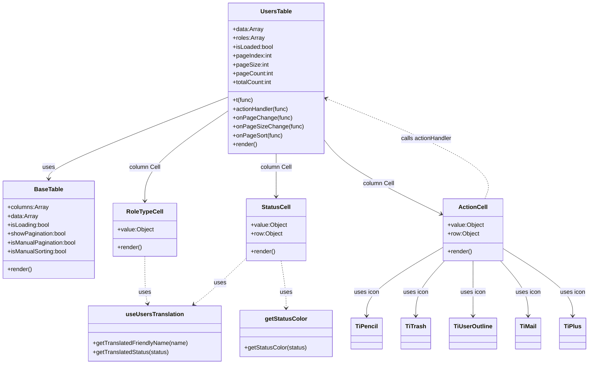

# Diagram: web/portal/src/modules/users/components/UsersTable.js


> Auto-generated by Obscura crawlers

## Diagram 1



### SVG

<svg id="container" width="1568.70703125" xmlns="http://www.w3.org/2000/svg" class="classDiagram" height="986" viewBox="0 0 1568.70703125 986" role="graphics-document document" aria-roledescription="class"><style>#container{font-family:"trebuchet ms",verdana,arial,sans-serif;font-size:16px;fill:#333;}@keyframes edge-animation-frame{from{stroke-dashoffset:0;}}@keyframes dash{to{stroke-dashoffset:0;}}#container .edge-animation-slow{stroke-dasharray:9,5!important;stroke-dashoffset:900;animation:dash 50s linear infinite;stroke-linecap:round;}#container .edge-animation-fast{stroke-dasharray:9,5!important;stroke-dashoffset:900;animation:dash 20s linear infinite;stroke-linecap:round;}#container .error-icon{fill:#552222;}#container .error-text{fill:#552222;stroke:#552222;}#container .edge-thickness-normal{stroke-width:1px;}#container .edge-thickness-thick{stroke-width:3.5px;}#container .edge-pattern-solid{stroke-dasharray:0;}#container .edge-thickness-invisible{stroke-width:0;fill:none;}#container .edge-pattern-dashed{stroke-dasharray:3;}#container .edge-pattern-dotted{stroke-dasharray:2;}#container .marker{fill:#333333;stroke:#333333;}#container .marker.cross{stroke:#333333;}#container svg{font-family:"trebuchet ms",verdana,arial,sans-serif;font-size:16px;}#container p{margin:0;}#container g.classGroup text{fill:#9370DB;stroke:none;font-family:"trebuchet ms",verdana,arial,sans-serif;font-size:10px;}#container g.classGroup text .title{font-weight:bolder;}#container .nodeLabel,#container .edgeLabel{color:#131300;}#container .edgeLabel .label rect{fill:#ECECFF;}#container .label text{fill:#131300;}#container .labelBkg{background:#ECECFF;}#container .edgeLabel .label span{background:#ECECFF;}#container .classTitle{font-weight:bolder;}#container .node rect,#container .node circle,#container .node ellipse,#container .node polygon,#container .node path{fill:#ECECFF;stroke:#9370DB;stroke-width:1px;}#container .divider{stroke:#9370DB;stroke-width:1;}#container g.clickable{cursor:pointer;}#container g.classGroup rect{fill:#ECECFF;stroke:#9370DB;}#container g.classGroup line{stroke:#9370DB;stroke-width:1;}#container .classLabel .box{stroke:none;stroke-width:0;fill:#ECECFF;opacity:0.5;}#container .classLabel .label{fill:#9370DB;font-size:10px;}#container .relation{stroke:#333333;stroke-width:1;fill:none;}#container .dashed-line{stroke-dasharray:3;}#container .dotted-line{stroke-dasharray:1 2;}#container #compositionStart,#container .composition{fill:#333333!important;stroke:#333333!important;stroke-width:1;}#container #compositionEnd,#container .composition{fill:#333333!important;stroke:#333333!important;stroke-width:1;}#container #dependencyStart,#container .dependency{fill:#333333!important;stroke:#333333!important;stroke-width:1;}#container #dependencyStart,#container .dependency{fill:#333333!important;stroke:#333333!important;stroke-width:1;}#container #extensionStart,#container .extension{fill:transparent!important;stroke:#333333!important;stroke-width:1;}#container #extensionEnd,#container .extension{fill:transparent!important;stroke:#333333!important;stroke-width:1;}#container #aggregationStart,#container .aggregation{fill:transparent!important;stroke:#333333!important;stroke-width:1;}#container #aggregationEnd,#container .aggregation{fill:transparent!important;stroke:#333333!important;stroke-width:1;}#container #lollipopStart,#container .lollipop{fill:#ECECFF!important;stroke:#333333!important;stroke-width:1;}#container #lollipopEnd,#container .lollipop{fill:#ECECFF!important;stroke:#333333!important;stroke-width:1;}#container .edgeTerminals{font-size:11px;line-height:initial;}#container .classTitleText{text-anchor:middle;font-size:18px;fill:#333;}#container .label-icon{display:inline-block;height:1em;overflow:visible;vertical-align:-0.125em;}#container .node .label-icon path{fill:currentColor;stroke:revert;stroke-width:revert;}#container :root{--mermaid-font-family:"trebuchet ms",verdana,arial,sans-serif;}</style><g><defs><marker id="container_class-aggregationStart" class="marker aggregation class" refX="18" refY="7" markerWidth="190" markerHeight="240" orient="auto"><path d="M 18,7 L9,13 L1,7 L9,1 Z"></path></marker></defs><defs><marker id="container_class-aggregationEnd" class="marker aggregation class" refX="1" refY="7" markerWidth="20" markerHeight="28" orient="auto"><path d="M 18,7 L9,13 L1,7 L9,1 Z"></path></marker></defs><defs><marker id="container_class-extensionStart" class="marker extension class" refX="18" refY="7" markerWidth="190" markerHeight="240" orient="auto"><path d="M 1,7 L18,13 V 1 Z"></path></marker></defs><defs><marker id="container_class-extensionEnd" class="marker extension class" refX="1" refY="7" markerWidth="20" markerHeight="28" orient="auto"><path d="M 1,1 V 13 L18,7 Z"></path></marker></defs><defs><marker id="container_class-compositionStart" class="marker composition class" refX="18" refY="7" markerWidth="190" markerHeight="240" orient="auto"><path d="M 18,7 L9,13 L1,7 L9,1 Z"></path></marker></defs><defs><marker id="container_class-compositionEnd" class="marker composition class" refX="1" refY="7" markerWidth="20" markerHeight="28" orient="auto"><path d="M 18,7 L9,13 L1,7 L9,1 Z"></path></marker></defs><defs><marker id="container_class-dependencyStart" class="marker dependency class" refX="6" refY="7" markerWidth="190" markerHeight="240" orient="auto"><path d="M 5,7 L9,13 L1,7 L9,1 Z"></path></marker></defs><defs><marker id="container_class-dependencyEnd" class="marker dependency class" refX="13" refY="7" markerWidth="20" markerHeight="28" orient="auto"><path d="M 18,7 L9,13 L14,7 L9,1 Z"></path></marker></defs><defs><marker id="container_class-lollipopStart" class="marker lollipop class" refX="13" refY="7" markerWidth="190" markerHeight="240" orient="auto"><circle stroke="black" fill="transparent" cx="7" cy="7" r="6"></circle></marker></defs><defs><marker id="container_class-lollipopEnd" class="marker lollipop class" refX="1" refY="7" markerWidth="190" markerHeight="240" orient="auto"><circle stroke="black" fill="transparent" cx="7" cy="7" r="6"></circle></marker></defs><g class="root"><g class="clusters"></g><g class="edgePaths"><path d="M618.031,261.09L537.026,293.075C456.021,325.06,294.01,389.03,213.005,426.182C132,463.333,132,473.667,132,478.833L132,484" id="id_UsersTable_BaseTable_1" class="edge-thickness-normal edge-pattern-solid relation" style=";;;" data-edge="true" data-et="edge" data-id="id_UsersTable_BaseTable_1" data-points="W3sieCI6NjE4LjAzMTI1LCJ5IjoyNjEuMDg5NjUwNjI2MjM2fSx7IngiOjEzMiwieSI6NDUzfSx7IngiOjEzMiwieSI6NDkwfV0=" marker-end="url(#container_class-dependencyEnd)"></path><path d="M618.031,297.147L580.104,323.123C542.177,349.098,466.323,401.049,428.396,442.191C390.469,483.333,390.469,513.667,390.469,528.833L390.469,544" id="id_UsersTable_RoleTypeCell_2" class="edge-thickness-normal edge-pattern-solid relation" style=";;;" data-edge="true" data-et="edge" data-id="id_UsersTable_RoleTypeCell_2" data-points="W3sieCI6NjE4LjAzMTI1LCJ5IjoyOTcuMTQ3MTA4Nzc3NDYwOH0seyJ4IjozOTAuNDY4NzUsInkiOjQ1M30seyJ4IjozOTAuNDY4NzUsInkiOjU1MH1d" marker-end="url(#container_class-dependencyEnd)"></path><path d="M742.355,416L742.355,422.167C742.355,428.333,742.355,440.667,742.355,460C742.355,479.333,742.355,505.667,742.355,518.833L742.355,532" id="id_UsersTable_StatusCell_3" class="edge-thickness-normal edge-pattern-solid relation" style=";;;" data-edge="true" data-et="edge" data-id="id_UsersTable_StatusCell_3" data-points="W3sieCI6NzQyLjM1NTQ2ODc1LCJ5Ijo0MTZ9LHsieCI6NzQyLjM1NTQ2ODc1LCJ5Ijo0NTN9LHsieCI6NzQyLjM1NTQ2ODc1LCJ5Ijo1Mzh9XQ==" marker-end="url(#container_class-dependencyEnd)"></path><path d="M866.68,373.009L876.974,386.341C887.268,399.673,907.857,426.336,959.754,460.703C1011.651,495.07,1094.857,537.141,1136.46,558.176L1178.063,579.211" id="id_UsersTable_ActionCell_4" class="edge-thickness-normal edge-pattern-solid relation" style=";;;" data-edge="true" data-et="edge" data-id="id_UsersTable_ActionCell_4" data-points="W3sieCI6ODY2LjY3OTY4NzUsInkiOjM3My4wMDg5ODQyMzU2MDUzfSx7IngiOjkyOC40NDUzMTI1LCJ5Ijo0NTN9LHsieCI6MTE4My40MTc5Njg3NSwieSI6NTgxLjkxODEyMjY0MDczNzd9XQ==" marker-end="url(#container_class-dependencyEnd)"></path><path d="M390.469,694L390.469,710.167C390.469,726.333,390.469,758.667,391.697,780.027C392.926,801.387,395.383,811.774,396.611,816.968L397.84,822.161" id="id_RoleTypeCell_useUsersTranslation_5" class="edge-thickness-normal edge-pattern-dashed relation" style=";;;" data-edge="true" data-et="edge" data-id="id_RoleTypeCell_useUsersTranslation_5" data-points="W3sieCI6MzkwLjQ2ODc1LCJ5Ijo2OTR9LHsieCI6MzkwLjQ2ODc1LCJ5Ijo3OTF9LHsieCI6Mzk5LjIyMDYzMzM3MDUzNTcsInkiOjgyOH1d" marker-end="url(#container_class-dependencyEnd)"></path><path d="M662.934,698.288L646.847,713.74C630.76,729.192,598.586,760.096,575.071,781.115C551.555,802.134,536.698,813.268,529.27,818.835L521.841,824.402" id="id_StatusCell_useUsersTranslation_6" class="edge-thickness-normal edge-pattern-dashed relation" style=";;;" data-edge="true" data-et="edge" data-id="id_StatusCell_useUsersTranslation_6" data-points="W3sieCI6NjYyLjkzMzU5Mzc1LCJ5Ijo2OTguMjg3NjAxNDM0MjMyOX0seyJ4Ijo1NjYuNDEyMTA5Mzc1LCJ5Ijo3OTF9LHsieCI6NTE3LjAzOTg0NzIzNzcyMzIsInkiOjgyOH1d" marker-end="url(#container_class-dependencyEnd)"></path><path d="M755.523,706L757.744,720.167C759.965,734.333,764.406,762.667,766.627,784C768.848,805.333,768.848,819.667,768.848,826.833L768.848,834" id="id_StatusCell_getStatusColor_7" class="edge-thickness-normal edge-pattern-dashed relation" style=";;;" data-edge="true" data-et="edge" data-id="id_StatusCell_getStatusColor_7" data-points="W3sieCI6NzU1LjUyMzE4MzI0NzA0MTQsInkiOjcwNn0seyJ4Ijo3NjguODQ3NjU2MjUsInkiOjc5MX0seyJ4Ijo3NjguODQ3NjU2MjUsInkiOjg0MH1d" marker-end="url(#container_class-dependencyEnd)"></path><path d="M1295.653,538L1301.212,523.833C1306.772,509.667,1317.89,481.333,1247.319,435.892C1176.748,390.451,1024.489,327.902,948.359,296.628L872.23,265.353" id="id_ActionCell_UsersTable_8" class="edge-thickness-normal edge-pattern-dashed relation" style=";;;" data-edge="true" data-et="edge" data-id="id_ActionCell_UsersTable_8" data-points="W3sieCI6MTI5NS42NTM0MDY5ODk2NDUsInkiOjUzOH0seyJ4IjoxMzI5LjAwNzgxMjUsInkiOjQ1M30seyJ4Ijo4NjYuNjc5Njg3NSwieSI6MjYzLjA3MzA3MDg1MzU1ODY1fV0=" marker-end="url(#container_class-dependencyEnd)"></path><path d="M1183.418,669.95L1150.064,690.125C1116.71,710.3,1050.001,750.65,1016.647,781.492C983.293,812.333,983.293,833.667,983.293,844.333L983.293,855" id="id_ActionCell_TiPencil_9" class="edge-thickness-normal edge-pattern-solid relation" style=";;;" data-edge="true" data-et="edge" data-id="id_ActionCell_TiPencil_9" data-points="W3sieCI6MTE4My40MTc5Njg3NSwieSI6NjY5Ljk1MDE5OTkyNzI5OTJ9LHsieCI6OTgzLjI5Mjk2ODc1LCJ5Ijo3OTF9LHsieCI6OTgzLjI5Mjk2ODc1LCJ5Ijo4NjF9XQ==" marker-end="url(#container_class-dependencyEnd)"></path><path d="M1187.941,706L1175.334,720.167C1162.728,734.333,1137.514,762.667,1124.907,787.5C1112.301,812.333,1112.301,833.667,1112.301,844.333L1112.301,855" id="id_ActionCell_TiTrash_10" class="edge-thickness-normal edge-pattern-solid relation" style=";;;" data-edge="true" data-et="edge" data-id="id_ActionCell_TiTrash_10" data-points="W3sieCI6MTE4Ny45NDEwMzY0Mjc1MTQ3LCJ5Ijo3MDZ9LHsieCI6MTExMi4zMDA3ODEyNSwieSI6NzkxfSx7IngiOjExMTIuMzAwNzgxMjUsInkiOjg2MX1d" marker-end="url(#container_class-dependencyEnd)"></path><path d="M1262.691,706L1262.691,720.167C1262.691,734.333,1262.691,762.667,1262.691,787.5C1262.691,812.333,1262.691,833.667,1262.691,844.333L1262.691,855" id="id_ActionCell_TiUserOutline_11" class="edge-thickness-normal edge-pattern-solid relation" style=";;;" data-edge="true" data-et="edge" data-id="id_ActionCell_TiUserOutline_11" data-points="W3sieCI6MTI2Mi42OTE0MDYyNSwieSI6NzA2fSx7IngiOjEyNjIuNjkxNDA2MjUsInkiOjc5MX0seyJ4IjoxMjYyLjY5MTQwNjI1LCJ5Ijo4NjF9XQ==" marker-end="url(#container_class-dependencyEnd)"></path><path d="M1335.209,706L1347.439,720.167C1359.669,734.333,1384.13,762.667,1396.36,787.5C1408.59,812.333,1408.59,833.667,1408.59,844.333L1408.59,855" id="id_ActionCell_TiMail_12" class="edge-thickness-normal edge-pattern-solid relation" style=";;;" data-edge="true" data-et="edge" data-id="id_ActionCell_TiMail_12" data-points="W3sieCI6MTMzNS4yMDg5NzI4MTgwNDc0LCJ5Ijo3MDZ9LHsieCI6MTQwOC41ODk4NDM3NSwieSI6NzkxfSx7IngiOjE0MDguNTg5ODQzNzUsInkiOjg2MX1d" marker-end="url(#container_class-dependencyEnd)"></path><path d="M1341.965,672.767L1372.736,692.472C1403.507,712.178,1465.048,751.589,1495.819,781.961C1526.59,812.333,1526.59,833.667,1526.59,844.333L1526.59,855" id="id_ActionCell_TiPlus_13" class="edge-thickness-normal edge-pattern-solid relation" style=";;;" data-edge="true" data-et="edge" data-id="id_ActionCell_TiPlus_13" data-points="W3sieCI6MTM0MS45NjQ4NDM3NSwieSI6NjcyLjc2NjU0MTM0MjI1NDF9LHsieCI6MTUyNi41ODk4NDM3NSwieSI6NzkxfSx7IngiOjE1MjYuNTg5ODQzNzUsInkiOjg2MX1d" marker-end="url(#container_class-dependencyEnd)"></path></g><g class="edgeLabels"><g class="edgeLabel" transform="translate(132, 453)"><g class="label" data-id="id_UsersTable_BaseTable_1" transform="translate(-16.4921875, -12)"><foreignObject width="32.984375" height="24"><div xmlns="http://www.w3.org/1999/xhtml" class="labelBkg" style="display: table-cell; white-space: nowrap; line-height: 1.5; max-width: 200px; text-align: center;"><span class="edgeLabel"><p>uses</p></span></div></foreignObject></g></g><g class="edgeLabel" transform="translate(390.46875, 453)"><g class="label" data-id="id_UsersTable_RoleTypeCell_2" transform="translate(-42.375, -12)"><foreignObject width="84.75" height="24"><div xmlns="http://www.w3.org/1999/xhtml" class="labelBkg" style="display: table-cell; white-space: nowrap; line-height: 1.5; max-width: 200px; text-align: center;"><span class="edgeLabel"><p>column Cell</p></span></div></foreignObject></g></g><g class="edgeLabel" transform="translate(742.35546875, 453)"><g class="label" data-id="id_UsersTable_StatusCell_3" transform="translate(-42.375, -12)"><foreignObject width="84.75" height="24"><div xmlns="http://www.w3.org/1999/xhtml" class="labelBkg" style="display: table-cell; white-space: nowrap; line-height: 1.5; max-width: 200px; text-align: center;"><span class="edgeLabel"><p>column Cell</p></span></div></foreignObject></g></g><g class="edgeLabel" transform="translate(1010.83703, 494.65853)"><g class="label" data-id="id_UsersTable_ActionCell_4" transform="translate(-42.375, -12)"><foreignObject width="84.75" height="24"><div xmlns="http://www.w3.org/1999/xhtml" class="labelBkg" style="display: table-cell; white-space: nowrap; line-height: 1.5; max-width: 200px; text-align: center;"><span class="edgeLabel"><p>column Cell</p></span></div></foreignObject></g></g><g class="edgeLabel" transform="translate(390.46875, 791)"><g class="label" data-id="id_RoleTypeCell_useUsersTranslation_5" transform="translate(-16.4921875, -12)"><foreignObject width="32.984375" height="24"><div xmlns="http://www.w3.org/1999/xhtml" class="labelBkg" style="display: table-cell; white-space: nowrap; line-height: 1.5; max-width: 200px; text-align: center;"><span class="edgeLabel"><p>uses</p></span></div></foreignObject></g></g><g class="edgeLabel" transform="translate(592.4248, 766.01386)"><g class="label" data-id="id_StatusCell_useUsersTranslation_6" transform="translate(-16.4921875, -12)"><foreignObject width="32.984375" height="24"><div xmlns="http://www.w3.org/1999/xhtml" class="labelBkg" style="display: table-cell; white-space: nowrap; line-height: 1.5; max-width: 200px; text-align: center;"><span class="edgeLabel"><p>uses</p></span></div></foreignObject></g></g><g class="edgeLabel" transform="translate(768.84765625, 791)"><g class="label" data-id="id_StatusCell_getStatusColor_7" transform="translate(-16.4921875, -12)"><foreignObject width="32.984375" height="24"><div xmlns="http://www.w3.org/1999/xhtml" class="labelBkg" style="display: table-cell; white-space: nowrap; line-height: 1.5; max-width: 200px; text-align: center;"><span class="edgeLabel"><p>uses</p></span></div></foreignObject></g></g><g class="edgeLabel" transform="translate(1140.07418, 375.38503)"><g class="label" data-id="id_ActionCell_UsersTable_8" transform="translate(-70.2578125, -12)"><foreignObject width="140.515625" height="24"><div xmlns="http://www.w3.org/1999/xhtml" class="labelBkg" style="display: table-cell; white-space: nowrap; line-height: 1.5; max-width: 200px; text-align: center;"><span class="edgeLabel"><p>calls actionHandler</p></span></div></foreignObject></g></g><g class="edgeLabel" transform="translate(983.29296875, 791)"><g class="label" data-id="id_ActionCell_TiPencil_9" transform="translate(-33.890625, -12)"><foreignObject width="67.78125" height="24"><div xmlns="http://www.w3.org/1999/xhtml" class="labelBkg" style="display: table-cell; white-space: nowrap; line-height: 1.5; max-width: 200px; text-align: center;"><span class="edgeLabel"><p>uses icon</p></span></div></foreignObject></g></g><g class="edgeLabel" transform="translate(1112.30078125, 791)"><g class="label" data-id="id_ActionCell_TiTrash_10" transform="translate(-33.890625, -12)"><foreignObject width="67.78125" height="24"><div xmlns="http://www.w3.org/1999/xhtml" class="labelBkg" style="display: table-cell; white-space: nowrap; line-height: 1.5; max-width: 200px; text-align: center;"><span class="edgeLabel"><p>uses icon</p></span></div></foreignObject></g></g><g class="edgeLabel" transform="translate(1262.69140625, 791)"><g class="label" data-id="id_ActionCell_TiUserOutline_11" transform="translate(-33.890625, -12)"><foreignObject width="67.78125" height="24"><div xmlns="http://www.w3.org/1999/xhtml" class="labelBkg" style="display: table-cell; white-space: nowrap; line-height: 1.5; max-width: 200px; text-align: center;"><span class="edgeLabel"><p>uses icon</p></span></div></foreignObject></g></g><g class="edgeLabel" transform="translate(1408.58984375, 791)"><g class="label" data-id="id_ActionCell_TiMail_12" transform="translate(-33.890625, -12)"><foreignObject width="67.78125" height="24"><div xmlns="http://www.w3.org/1999/xhtml" class="labelBkg" style="display: table-cell; white-space: nowrap; line-height: 1.5; max-width: 200px; text-align: center;"><span class="edgeLabel"><p>uses icon</p></span></div></foreignObject></g></g><g class="edgeLabel" transform="translate(1526.58984375, 791)"><g class="label" data-id="id_ActionCell_TiPlus_13" transform="translate(-33.890625, -12)"><foreignObject width="67.78125" height="24"><div xmlns="http://www.w3.org/1999/xhtml" class="labelBkg" style="display: table-cell; white-space: nowrap; line-height: 1.5; max-width: 200px; text-align: center;"><span class="edgeLabel"><p>uses icon</p></span></div></foreignObject></g></g></g><g class="nodes"><g class="node default" id="classId-UsersTable-0" transform="translate(742.35546875, 212)"><g class="basic label-container"><path d="M-124.32421875 -204 L124.32421875 -204 L124.32421875 204 L-124.32421875 204" stroke="none" stroke-width="0" fill="#ECECFF" style=""></path><path d="M-124.32421875 -204 C-42.36125834941342 -204, 39.60170205117316 -204, 124.32421875 -204 M-124.32421875 -204 C-46.325421614543416 -204, 31.67337552091317 -204, 124.32421875 -204 M124.32421875 -204 C124.32421875 -90.35876330214927, 124.32421875 23.28247339570146, 124.32421875 204 M124.32421875 -204 C124.32421875 -93.1254807002717, 124.32421875 17.74903859945661, 124.32421875 204 M124.32421875 204 C57.56933030079598 204, -9.185558148408035 204, -124.32421875 204 M124.32421875 204 C59.5152654218403 204, -5.293687906319406 204, -124.32421875 204 M-124.32421875 204 C-124.32421875 122.0186174528307, -124.32421875 40.03723490566139, -124.32421875 -204 M-124.32421875 204 C-124.32421875 66.0240044661264, -124.32421875 -71.9519910677472, -124.32421875 -204" stroke="#9370DB" stroke-width="1.3" fill="none" stroke-dasharray="0 0" style=""></path></g><g class="annotation-group text" transform="translate(0, -180)"></g><g class="label-group text" transform="translate(-40.2578125, -180)"><g class="label" style="font-weight: bolder" transform="translate(0,-12)"><foreignObject width="80.515625" height="24"><div xmlns="http://www.w3.org/1999/xhtml" style="display: table-cell; white-space: nowrap; line-height: 1.5; max-width: 129px; text-align: center;"><span class="nodeLabel markdown-node-label" style=""><p>UsersTable</p></span></div></foreignObject></g></g><g class="members-group text" transform="translate(-112.32421875, -132)"><g class="label" style="" transform="translate(0,-12)"><foreignObject width="81.828125" height="24"><div xmlns="http://www.w3.org/1999/xhtml" style="display: table-cell; white-space: nowrap; line-height: 1.5; max-width: 139px; text-align: center;"><span class="nodeLabel markdown-node-label" style=""><p>+data:Array</p></span></div></foreignObject></g><g class="label" style="" transform="translate(0,12)"><foreignObject width="85.03125" height="24"><div xmlns="http://www.w3.org/1999/xhtml" style="display: table-cell; white-space: nowrap; line-height: 1.5; max-width: 143px; text-align: center;"><span class="nodeLabel markdown-node-label" style=""><p>+roles:Array</p></span></div></foreignObject></g><g class="label" style="" transform="translate(0,36)"><foreignObject width="110.015625" height="24"><div xmlns="http://www.w3.org/1999/xhtml" style="display: table-cell; white-space: nowrap; line-height: 1.5; max-width: 168px; text-align: center;"><span class="nodeLabel markdown-node-label" style=""><p>+isLoaded:bool</p></span></div></foreignObject></g><g class="label" style="" transform="translate(0,60)"><foreignObject width="106.234375" height="24"><div xmlns="http://www.w3.org/1999/xhtml" style="display: table-cell; white-space: nowrap; line-height: 1.5; max-width: 164px; text-align: center;"><span class="nodeLabel markdown-node-label" style=""><p>+pageIndex:int</p></span></div></foreignObject></g><g class="label" style="" transform="translate(0,84)"><foreignObject width="95" height="24"><div xmlns="http://www.w3.org/1999/xhtml" style="display: table-cell; white-space: nowrap; line-height: 1.5; max-width: 153px; text-align: center;"><span class="nodeLabel markdown-node-label" style=""><p>+pageSize:int</p></span></div></foreignObject></g><g class="label" style="" transform="translate(0,108)"><foreignObject width="108.6875" height="24"><div xmlns="http://www.w3.org/1999/xhtml" style="display: table-cell; white-space: nowrap; line-height: 1.5; max-width: 166px; text-align: center;"><span class="nodeLabel markdown-node-label" style=""><p>+pageCount:int</p></span></div></foreignObject></g><g class="label" style="" transform="translate(0,132)"><foreignObject width="107.703125" height="24"><div xmlns="http://www.w3.org/1999/xhtml" style="display: table-cell; white-space: nowrap; line-height: 1.5; max-width: 165px; text-align: center;"><span class="nodeLabel markdown-node-label" style=""><p>+totalCount:int</p></span></div></foreignObject></g></g><g class="methods-group text" transform="translate(-112.32421875, 60)"><g class="label" style="" transform="translate(0,-12)"><foreignObject width="55.75" height="24"><div xmlns="http://www.w3.org/1999/xhtml" style="display: table-cell; white-space: nowrap; line-height: 1.5; max-width: 113px; text-align: center;"><span class="nodeLabel markdown-node-label" style=""><p>+t(func)</p></span></div></foreignObject></g><g class="label" style="" transform="translate(0,12)"><foreignObject width="153.203125" height="24"><div xmlns="http://www.w3.org/1999/xhtml" style="display: table-cell; white-space: nowrap; line-height: 1.5; max-width: 211px; text-align: center;"><span class="nodeLabel markdown-node-label" style=""><p>+actionHandler(func)</p></span></div></foreignObject></g><g class="label" style="" transform="translate(0,36)"><foreignObject width="155.5625" height="24"><div xmlns="http://www.w3.org/1999/xhtml" style="display: table-cell; white-space: nowrap; line-height: 1.5; max-width: 213px; text-align: center;"><span class="nodeLabel markdown-node-label" style=""><p>+onPageChange(func)</p></span></div></foreignObject></g><g class="label" style="" transform="translate(0,60)"><foreignObject width="184.390625" height="24"><div xmlns="http://www.w3.org/1999/xhtml" style="display: table-cell; white-space: nowrap; line-height: 1.5; max-width: 242px; text-align: center;"><span class="nodeLabel markdown-node-label" style=""><p>+onPageSizeChange(func)</p></span></div></foreignObject></g><g class="label" style="" transform="translate(0,84)"><foreignObject width="132.53125" height="24"><div xmlns="http://www.w3.org/1999/xhtml" style="display: table-cell; white-space: nowrap; line-height: 1.5; max-width: 190px; text-align: center;"><span class="nodeLabel markdown-node-label" style=""><p>+onPageSort(func)</p></span></div></foreignObject></g><g class="label" style="" transform="translate(0,108)"><foreignObject width="66.609375" height="24"><div xmlns="http://www.w3.org/1999/xhtml" style="display: table-cell; white-space: nowrap; line-height: 1.5; max-width: 124px; text-align: center;"><span class="nodeLabel markdown-node-label" style=""><p>+render()</p></span></div></foreignObject></g></g><g class="divider" style=""><path d="M-124.32421875 -156 C-65.33550547831345 -156, -6.346792206626915 -156, 124.32421875 -156 M-124.32421875 -156 C-63.203376776000376 -156, -2.082534802000751 -156, 124.32421875 -156" stroke="#9370DB" stroke-width="1.3" fill="none" stroke-dasharray="0 0" style=""></path></g><g class="divider" style=""><path d="M-124.32421875 36 C-50.97746827985243 36, 22.369282190295138 36, 124.32421875 36 M-124.32421875 36 C-43.36797516263822 36, 37.588268424723566 36, 124.32421875 36" stroke="#9370DB" stroke-width="1.3" fill="none" stroke-dasharray="0 0" style=""></path></g></g><g class="node default" id="classId-BaseTable-1" transform="translate(132, 622)"><g class="basic label-container"><path d="M-124 -132 L124 -132 L124 132 L-124 132" stroke="none" stroke-width="0" fill="#ECECFF" style=""></path><path d="M-124 -132 C-27.908524889777325 -132, 68.18295022044535 -132, 124 -132 M-124 -132 C-35.444557514970384 -132, 53.11088497005923 -132, 124 -132 M124 -132 C124 -45.389621699908375, 124 41.22075660018325, 124 132 M124 -132 C124 -37.19740529782108, 124 57.605189404357844, 124 132 M124 132 C61.52720040777346 132, -0.9455991844530871 132, -124 132 M124 132 C37.481720243238655 132, -49.03655951352269 132, -124 132 M-124 132 C-124 57.545409700802935, -124 -16.90918059839413, -124 -132 M-124 132 C-124 35.171087583385756, -124 -61.65782483322849, -124 -132" stroke="#9370DB" stroke-width="1.3" fill="none" stroke-dasharray="0 0" style=""></path></g><g class="annotation-group text" transform="translate(0, -108)"></g><g class="label-group text" transform="translate(-37.359375, -108)"><g class="label" style="font-weight: bolder" transform="translate(0,-12)"><foreignObject width="74.71875" height="24"><div xmlns="http://www.w3.org/1999/xhtml" style="display: table-cell; white-space: nowrap; line-height: 1.5; max-width: 123px; text-align: center;"><span class="nodeLabel markdown-node-label" style=""><p>BaseTable</p></span></div></foreignObject></g></g><g class="members-group text" transform="translate(-112, -60)"><g class="label" style="" transform="translate(0,-12)"><foreignObject width="110.421875" height="24"><div xmlns="http://www.w3.org/1999/xhtml" style="display: table-cell; white-space: nowrap; line-height: 1.5; max-width: 168px; text-align: center;"><span class="nodeLabel markdown-node-label" style=""><p>+columns:Array</p></span></div></foreignObject></g><g class="label" style="" transform="translate(0,12)"><foreignObject width="81.828125" height="24"><div xmlns="http://www.w3.org/1999/xhtml" style="display: table-cell; white-space: nowrap; line-height: 1.5; max-width: 139px; text-align: center;"><span class="nodeLabel markdown-node-label" style=""><p>+data:Array</p></span></div></foreignObject></g><g class="label" style="" transform="translate(0,36)"><foreignObject width="113.921875" height="24"><div xmlns="http://www.w3.org/1999/xhtml" style="display: table-cell; white-space: nowrap; line-height: 1.5; max-width: 172px; text-align: center;"><span class="nodeLabel markdown-node-label" style=""><p>+isLoading:bool</p></span></div></foreignObject></g><g class="label" style="" transform="translate(0,60)"><foreignObject width="159.25" height="24"><div xmlns="http://www.w3.org/1999/xhtml" style="display: table-cell; white-space: nowrap; line-height: 1.5; max-width: 217px; text-align: center;"><span class="nodeLabel markdown-node-label" style=""><p>+showPagination:bool</p></span></div></foreignObject></g><g class="label" style="" transform="translate(0,84)"><foreignObject width="186.640625" height="24"><div xmlns="http://www.w3.org/1999/xhtml" style="display: table-cell; white-space: nowrap; line-height: 1.5; max-width: 244px; text-align: center;"><span class="nodeLabel markdown-node-label" style=""><p>+isManualPagination:bool</p></span></div></foreignObject></g><g class="label" style="" transform="translate(0,108)"><foreignObject width="161.984375" height="24"><div xmlns="http://www.w3.org/1999/xhtml" style="display: table-cell; white-space: nowrap; line-height: 1.5; max-width: 220px; text-align: center;"><span class="nodeLabel markdown-node-label" style=""><p>+isManualSorting:bool</p></span></div></foreignObject></g></g><g class="methods-group text" transform="translate(-112, 108)"><g class="label" style="" transform="translate(0,-12)"><foreignObject width="66.609375" height="24"><div xmlns="http://www.w3.org/1999/xhtml" style="display: table-cell; white-space: nowrap; line-height: 1.5; max-width: 124px; text-align: center;"><span class="nodeLabel markdown-node-label" style=""><p>+render()</p></span></div></foreignObject></g></g><g class="divider" style=""><path d="M-124 -84 C-29.526834247283958 -84, 64.94633150543208 -84, 124 -84 M-124 -84 C-60.94920080457463 -84, 2.1015983908507394 -84, 124 -84" stroke="#9370DB" stroke-width="1.3" fill="none" stroke-dasharray="0 0" style=""></path></g><g class="divider" style=""><path d="M-124 84 C-48.402816807017985 84, 27.19436638596403 84, 124 84 M-124 84 C-69.26661368118494 84, -14.533227362369885 84, 124 84" stroke="#9370DB" stroke-width="1.3" fill="none" stroke-dasharray="0 0" style=""></path></g></g><g class="node default" id="classId-RoleTypeCell-2" transform="translate(390.46875, 622)"><g class="basic label-container"><path d="M-84.46875 -72 L84.46875 -72 L84.46875 72 L-84.46875 72" stroke="none" stroke-width="0" fill="#ECECFF" style=""></path><path d="M-84.46875 -72 C-37.32673812441222 -72, 9.815273751175553 -72, 84.46875 -72 M-84.46875 -72 C-39.7968869285317 -72, 4.874976142936603 -72, 84.46875 -72 M84.46875 -72 C84.46875 -25.05734406657905, 84.46875 21.885311866841903, 84.46875 72 M84.46875 -72 C84.46875 -17.803272923481437, 84.46875 36.393454153037126, 84.46875 72 M84.46875 72 C50.19456476584524 72, 15.920379531690486 72, -84.46875 72 M84.46875 72 C22.92593939724439 72, -38.61687120551122 72, -84.46875 72 M-84.46875 72 C-84.46875 41.555548933739715, -84.46875 11.11109786747943, -84.46875 -72 M-84.46875 72 C-84.46875 16.03044312057149, -84.46875 -39.93911375885702, -84.46875 -72" stroke="#9370DB" stroke-width="1.3" fill="none" stroke-dasharray="0 0" style=""></path></g><g class="annotation-group text" transform="translate(0, -48)"></g><g class="label-group text" transform="translate(-47.1875, -48)"><g class="label" style="font-weight: bolder" transform="translate(0,-12)"><foreignObject width="94.375" height="24"><div xmlns="http://www.w3.org/1999/xhtml" style="display: table-cell; white-space: nowrap; line-height: 1.5; max-width: 143px; text-align: center;"><span class="nodeLabel markdown-node-label" style=""><p>RoleTypeCell</p></span></div></foreignObject></g></g><g class="members-group text" transform="translate(-72.46875, 0)"><g class="label" style="" transform="translate(0,-12)"><foreignObject width="97.75" height="24"><div xmlns="http://www.w3.org/1999/xhtml" style="display: table-cell; white-space: nowrap; line-height: 1.5; max-width: 155px; text-align: center;"><span class="nodeLabel markdown-node-label" style=""><p>+value:Object</p></span></div></foreignObject></g></g><g class="methods-group text" transform="translate(-72.46875, 48)"><g class="label" style="" transform="translate(0,-12)"><foreignObject width="66.609375" height="24"><div xmlns="http://www.w3.org/1999/xhtml" style="display: table-cell; white-space: nowrap; line-height: 1.5; max-width: 124px; text-align: center;"><span class="nodeLabel markdown-node-label" style=""><p>+render()</p></span></div></foreignObject></g></g><g class="divider" style=""><path d="M-84.46875 -24 C-20.112519455793162 -24, 44.243711088413676 -24, 84.46875 -24 M-84.46875 -24 C-25.51297274821252 -24, 33.44280450357496 -24, 84.46875 -24" stroke="#9370DB" stroke-width="1.3" fill="none" stroke-dasharray="0 0" style=""></path></g><g class="divider" style=""><path d="M-84.46875 24 C-27.536923945980746 24, 29.394902108038508 24, 84.46875 24 M-84.46875 24 C-36.79858691090765 24, 10.871576178184696 24, 84.46875 24" stroke="#9370DB" stroke-width="1.3" fill="none" stroke-dasharray="0 0" style=""></path></g></g><g class="node default" id="classId-StatusCell-3" transform="translate(742.35546875, 622)"><g class="basic label-container"><path d="M-79.421875 -84 L79.421875 -84 L79.421875 84 L-79.421875 84" stroke="none" stroke-width="0" fill="#ECECFF" style=""></path><path d="M-79.421875 -84 C-37.64905226216568 -84, 4.1237704756686355 -84, 79.421875 -84 M-79.421875 -84 C-35.68854640917044 -84, 8.044782181659116 -84, 79.421875 -84 M79.421875 -84 C79.421875 -43.22298437945207, 79.421875 -2.4459687589041437, 79.421875 84 M79.421875 -84 C79.421875 -29.141856477729668, 79.421875 25.716287044540664, 79.421875 84 M79.421875 84 C44.44164539725762 84, 9.461415794515247 84, -79.421875 84 M79.421875 84 C31.64552340816745 84, -16.130828183665102 84, -79.421875 84 M-79.421875 84 C-79.421875 42.51247759230625, -79.421875 1.0249551846124945, -79.421875 -84 M-79.421875 84 C-79.421875 35.27544977350366, -79.421875 -13.449100452992681, -79.421875 -84" stroke="#9370DB" stroke-width="1.3" fill="none" stroke-dasharray="0 0" style=""></path></g><g class="annotation-group text" transform="translate(0, -60)"></g><g class="label-group text" transform="translate(-37.09375, -60)"><g class="label" style="font-weight: bolder" transform="translate(0,-12)"><foreignObject width="74.1875" height="24"><div xmlns="http://www.w3.org/1999/xhtml" style="display: table-cell; white-space: nowrap; line-height: 1.5; max-width: 123px; text-align: center;"><span class="nodeLabel markdown-node-label" style=""><p>StatusCell</p></span></div></foreignObject></g></g><g class="members-group text" transform="translate(-67.421875, -12)"><g class="label" style="" transform="translate(0,-12)"><foreignObject width="97.75" height="24"><div xmlns="http://www.w3.org/1999/xhtml" style="display: table-cell; white-space: nowrap; line-height: 1.5; max-width: 155px; text-align: center;"><span class="nodeLabel markdown-node-label" style=""><p>+value:Object</p></span></div></foreignObject></g><g class="label" style="" transform="translate(0,12)"><foreignObject width="85.609375" height="24"><div xmlns="http://www.w3.org/1999/xhtml" style="display: table-cell; white-space: nowrap; line-height: 1.5; max-width: 143px; text-align: center;"><span class="nodeLabel markdown-node-label" style=""><p>+row:Object</p></span></div></foreignObject></g></g><g class="methods-group text" transform="translate(-67.421875, 60)"><g class="label" style="" transform="translate(0,-12)"><foreignObject width="66.609375" height="24"><div xmlns="http://www.w3.org/1999/xhtml" style="display: table-cell; white-space: nowrap; line-height: 1.5; max-width: 124px; text-align: center;"><span class="nodeLabel markdown-node-label" style=""><p>+render()</p></span></div></foreignObject></g></g><g class="divider" style=""><path d="M-79.421875 -36 C-23.55691968938911 -36, 32.30803562122178 -36, 79.421875 -36 M-79.421875 -36 C-43.696701814931956 -36, -7.971528629863911 -36, 79.421875 -36" stroke="#9370DB" stroke-width="1.3" fill="none" stroke-dasharray="0 0" style=""></path></g><g class="divider" style=""><path d="M-79.421875 36 C-22.686006305021145 36, 34.04986238995771 36, 79.421875 36 M-79.421875 36 C-24.21076524562657 36, 31.000344508746863 36, 79.421875 36" stroke="#9370DB" stroke-width="1.3" fill="none" stroke-dasharray="0 0" style=""></path></g></g><g class="node default" id="classId-ActionCell-4" transform="translate(1262.69140625, 622)"><g class="basic label-container"><path d="M-79.2734375 -84 L79.2734375 -84 L79.2734375 84 L-79.2734375 84" stroke="none" stroke-width="0" fill="#ECECFF" style=""></path><path d="M-79.2734375 -84 C-19.824089879676933 -84, 39.625257740646134 -84, 79.2734375 -84 M-79.2734375 -84 C-26.642452020911733 -84, 25.988533458176533 -84, 79.2734375 -84 M79.2734375 -84 C79.2734375 -41.084631036461445, 79.2734375 1.8307379270771094, 79.2734375 84 M79.2734375 -84 C79.2734375 -37.756346593467775, 79.2734375 8.48730681306445, 79.2734375 84 M79.2734375 84 C29.2940465669745 84, -20.685344366050998 84, -79.2734375 84 M79.2734375 84 C42.13237037151448 84, 4.991303243028966 84, -79.2734375 84 M-79.2734375 84 C-79.2734375 33.75349777832842, -79.2734375 -16.493004443343153, -79.2734375 -84 M-79.2734375 84 C-79.2734375 38.53412661490528, -79.2734375 -6.931746770189434, -79.2734375 -84" stroke="#9370DB" stroke-width="1.3" fill="none" stroke-dasharray="0 0" style=""></path></g><g class="annotation-group text" transform="translate(0, -60)"></g><g class="label-group text" transform="translate(-36.796875, -60)"><g class="label" style="font-weight: bolder" transform="translate(0,-12)"><foreignObject width="73.59375" height="24"><div xmlns="http://www.w3.org/1999/xhtml" style="display: table-cell; white-space: nowrap; line-height: 1.5; max-width: 123px; text-align: center;"><span class="nodeLabel markdown-node-label" style=""><p>ActionCell</p></span></div></foreignObject></g></g><g class="members-group text" transform="translate(-67.2734375, -12)"><g class="label" style="" transform="translate(0,-12)"><foreignObject width="97.75" height="24"><div xmlns="http://www.w3.org/1999/xhtml" style="display: table-cell; white-space: nowrap; line-height: 1.5; max-width: 155px; text-align: center;"><span class="nodeLabel markdown-node-label" style=""><p>+value:Object</p></span></div></foreignObject></g><g class="label" style="" transform="translate(0,12)"><foreignObject width="85.609375" height="24"><div xmlns="http://www.w3.org/1999/xhtml" style="display: table-cell; white-space: nowrap; line-height: 1.5; max-width: 143px; text-align: center;"><span class="nodeLabel markdown-node-label" style=""><p>+row:Object</p></span></div></foreignObject></g></g><g class="methods-group text" transform="translate(-67.2734375, 60)"><g class="label" style="" transform="translate(0,-12)"><foreignObject width="66.609375" height="24"><div xmlns="http://www.w3.org/1999/xhtml" style="display: table-cell; white-space: nowrap; line-height: 1.5; max-width: 124px; text-align: center;"><span class="nodeLabel markdown-node-label" style=""><p>+render()</p></span></div></foreignObject></g></g><g class="divider" style=""><path d="M-79.2734375 -36 C-19.258342975296017 -36, 40.756751549407966 -36, 79.2734375 -36 M-79.2734375 -36 C-22.671789912252784 -36, 33.92985767549443 -36, 79.2734375 -36" stroke="#9370DB" stroke-width="1.3" fill="none" stroke-dasharray="0 0" style=""></path></g><g class="divider" style=""><path d="M-79.2734375 36 C-42.93553813713691 36, -6.597638774273818 36, 79.2734375 36 M-79.2734375 36 C-27.819727841812792 36, 23.633981816374416 36, 79.2734375 36" stroke="#9370DB" stroke-width="1.3" fill="none" stroke-dasharray="0 0" style=""></path></g></g><g class="node default" id="classId-useUsersTranslation-5" transform="translate(416.9609375, 903)"><g class="basic label-container"><path d="M-178.07421875 -75 L178.07421875 -75 L178.07421875 75 L-178.07421875 75" stroke="none" stroke-width="0" fill="#ECECFF" style=""></path><path d="M-178.07421875 -75 C-44.971182308477296 -75, 88.13185413304541 -75, 178.07421875 -75 M-178.07421875 -75 C-92.15116284956554 -75, -6.2281069491310745 -75, 178.07421875 -75 M178.07421875 -75 C178.07421875 -22.509410263997573, 178.07421875 29.981179472004854, 178.07421875 75 M178.07421875 -75 C178.07421875 -34.14873921936269, 178.07421875 6.702521561274622, 178.07421875 75 M178.07421875 75 C71.28983508677197 75, -35.494548576456054 75, -178.07421875 75 M178.07421875 75 C100.67678940141106 75, 23.279360052822113 75, -178.07421875 75 M-178.07421875 75 C-178.07421875 43.53992176384348, -178.07421875 12.079843527686961, -178.07421875 -75 M-178.07421875 75 C-178.07421875 36.222139652912965, -178.07421875 -2.55572069417407, -178.07421875 -75" stroke="#9370DB" stroke-width="1.3" fill="none" stroke-dasharray="0 0" style=""></path></g><g class="annotation-group text" transform="translate(0, -51)"></g><g class="label-group text" transform="translate(-74.5078125, -51)"><g class="label" style="font-weight: bolder" transform="translate(0,-12)"><foreignObject width="149.015625" height="24"><div xmlns="http://www.w3.org/1999/xhtml" style="display: table-cell; white-space: nowrap; line-height: 1.5; max-width: 197px; text-align: center;"><span class="nodeLabel markdown-node-label" style=""><p>useUsersTranslation</p></span></div></foreignObject></g></g><g class="members-group text" transform="translate(-166.07421875, -3)"></g><g class="methods-group text" transform="translate(-166.07421875, 27)"><g class="label" style="" transform="translate(0,-12)"><foreignObject width="257.640625" height="24"><div xmlns="http://www.w3.org/1999/xhtml" style="display: table-cell; white-space: nowrap; line-height: 1.5; max-width: 315px; text-align: center;"><span class="nodeLabel markdown-node-label" style=""><p>+getTranslatedFriendlyName(name)</p></span></div></foreignObject></g><g class="label" style="" transform="translate(0,12)"><foreignObject width="207.0625" height="24"><div xmlns="http://www.w3.org/1999/xhtml" style="display: table-cell; white-space: nowrap; line-height: 1.5; max-width: 264px; text-align: center;"><span class="nodeLabel markdown-node-label" style=""><p>+getTranslatedStatus(status)</p></span></div></foreignObject></g></g><g class="divider" style=""><path d="M-178.07421875 -27 C-61.75871764802348 -27, 54.556783453953045 -27, 178.07421875 -27 M-178.07421875 -27 C-96.05882375474708 -27, -14.043428759494162 -27, 178.07421875 -27" stroke="#9370DB" stroke-width="1.3" fill="none" stroke-dasharray="0 0" style=""></path></g><g class="divider" style=""><path d="M-178.07421875 -3 C-67.81724198867497 -3, 42.43973477265007 -3, 178.07421875 -3 M-178.07421875 -3 C-89.12314081329896 -3, -0.17206287659791997 -3, 178.07421875 -3" stroke="#9370DB" stroke-width="1.3" fill="none" stroke-dasharray="0 0" style=""></path></g></g><g class="node default" id="classId-getStatusColor-6" transform="translate(768.84765625, 903)"><g class="basic label-container"><path d="M-123.8125 -63 L123.8125 -63 L123.8125 63 L-123.8125 63" stroke="none" stroke-width="0" fill="#ECECFF" style=""></path><path d="M-123.8125 -63 C-25.56310288766373 -63, 72.68629422467254 -63, 123.8125 -63 M-123.8125 -63 C-51.30149308423283 -63, 21.209513831534338 -63, 123.8125 -63 M123.8125 -63 C123.8125 -22.445324041523683, 123.8125 18.109351916952633, 123.8125 63 M123.8125 -63 C123.8125 -16.240536084949923, 123.8125 30.518927830100154, 123.8125 63 M123.8125 63 C31.725984397178493 63, -60.360531205643014 63, -123.8125 63 M123.8125 63 C40.90794386048161 63, -41.99661227903678 63, -123.8125 63 M-123.8125 63 C-123.8125 28.12934902780073, -123.8125 -6.741301944398543, -123.8125 -63 M-123.8125 63 C-123.8125 24.808150522532507, -123.8125 -13.383698954934985, -123.8125 -63" stroke="#9370DB" stroke-width="1.3" fill="none" stroke-dasharray="0 0" style=""></path></g><g class="annotation-group text" transform="translate(0, -39)"></g><g class="label-group text" transform="translate(-54.546875, -39)"><g class="label" style="font-weight: bolder" transform="translate(0,-12)"><foreignObject width="109.09375" height="24"><div xmlns="http://www.w3.org/1999/xhtml" style="display: table-cell; white-space: nowrap; line-height: 1.5; max-width: 157px; text-align: center;"><span class="nodeLabel markdown-node-label" style=""><p>getStatusColor</p></span></div></foreignObject></g></g><g class="members-group text" transform="translate(-111.8125, 9)"></g><g class="methods-group text" transform="translate(-111.8125, 39)"><g class="label" style="" transform="translate(0,-12)"><foreignObject width="169.078125" height="24"><div xmlns="http://www.w3.org/1999/xhtml" style="display: table-cell; white-space: nowrap; line-height: 1.5; max-width: 226px; text-align: center;"><span class="nodeLabel markdown-node-label" style=""><p>+getStatusColor(status)</p></span></div></foreignObject></g></g><g class="divider" style=""><path d="M-123.8125 -15 C-69.6116752000666 -15, -15.4108504001332 -15, 123.8125 -15 M-123.8125 -15 C-58.9621824588216 -15, 5.888135082356797 -15, 123.8125 -15" stroke="#9370DB" stroke-width="1.3" fill="none" stroke-dasharray="0 0" style=""></path></g><g class="divider" style=""><path d="M-123.8125 9 C-35.57915760913292 9, 52.65418478173416 9, 123.8125 9 M-123.8125 9 C-31.076962197461924 9, 61.65857560507615 9, 123.8125 9" stroke="#9370DB" stroke-width="1.3" fill="none" stroke-dasharray="0 0" style=""></path></g></g><g class="node default" id="classId-TiPencil-7" transform="translate(983.29296875, 903)"><g class="basic label-container"><path d="M-40.6328125 -42 L40.6328125 -42 L40.6328125 42 L-40.6328125 42" stroke="none" stroke-width="0" fill="#ECECFF" style=""></path><path d="M-40.6328125 -42 C-8.40943937999944 -42, 23.81393374000112 -42, 40.6328125 -42 M-40.6328125 -42 C-14.000417269170438 -42, 12.631977961659125 -42, 40.6328125 -42 M40.6328125 -42 C40.6328125 -18.623570902218795, 40.6328125 4.7528581955624105, 40.6328125 42 M40.6328125 -42 C40.6328125 -20.89538562261857, 40.6328125 0.2092287547628615, 40.6328125 42 M40.6328125 42 C19.839704306258213 42, -0.9534038874835744 42, -40.6328125 42 M40.6328125 42 C18.81709047191668 42, -2.998631556166643 42, -40.6328125 42 M-40.6328125 42 C-40.6328125 16.33777922804524, -40.6328125 -9.324441543909522, -40.6328125 -42 M-40.6328125 42 C-40.6328125 10.781671108698088, -40.6328125 -20.436657782603824, -40.6328125 -42" stroke="#9370DB" stroke-width="1.3" fill="none" stroke-dasharray="0 0" style=""></path></g><g class="annotation-group text" transform="translate(0, -18)"></g><g class="label-group text" transform="translate(-28.6328125, -18)"><g class="label" style="font-weight: bolder" transform="translate(0,-12)"><foreignObject width="57.265625" height="24"><div xmlns="http://www.w3.org/1999/xhtml" style="display: table-cell; white-space: nowrap; line-height: 1.5; max-width: 107px; text-align: center;"><span class="nodeLabel markdown-node-label" style=""><p>TiPencil</p></span></div></foreignObject></g></g><g class="members-group text" transform="translate(-28.6328125, 30)"></g><g class="methods-group text" transform="translate(-28.6328125, 60)"></g><g class="divider" style=""><path d="M-40.6328125 6 C-19.090259747647462 6, 2.4522930047050764 6, 40.6328125 6 M-40.6328125 6 C-16.753098472958516 6, 7.126615554082967 6, 40.6328125 6" stroke="#9370DB" stroke-width="1.3" fill="none" stroke-dasharray="0 0" style=""></path></g><g class="divider" style=""><path d="M-40.6328125 24 C-18.10106829016703 24, 4.430675919665937 24, 40.6328125 24 M-40.6328125 24 C-24.168824216050165 24, -7.70483593210033 24, 40.6328125 24" stroke="#9370DB" stroke-width="1.3" fill="none" stroke-dasharray="0 0" style=""></path></g></g><g class="node default" id="classId-TiTrash-8" transform="translate(1112.30078125, 903)"><g class="basic label-container"><path d="M-38.375 -42 L38.375 -42 L38.375 42 L-38.375 42" stroke="none" stroke-width="0" fill="#ECECFF" style=""></path><path d="M-38.375 -42 C-19.380395192062533 -42, -0.38579038412506605 -42, 38.375 -42 M-38.375 -42 C-16.927138652679268 -42, 4.520722694641464 -42, 38.375 -42 M38.375 -42 C38.375 -20.156404838984304, 38.375 1.687190322031391, 38.375 42 M38.375 -42 C38.375 -22.535954934068084, 38.375 -3.071909868136167, 38.375 42 M38.375 42 C10.534831723532854 42, -17.305336552934293 42, -38.375 42 M38.375 42 C12.60658638664406 42, -13.161827226711878 42, -38.375 42 M-38.375 42 C-38.375 20.74171846514745, -38.375 -0.5165630697051, -38.375 -42 M-38.375 42 C-38.375 22.985411184981274, -38.375 3.970822369962548, -38.375 -42" stroke="#9370DB" stroke-width="1.3" fill="none" stroke-dasharray="0 0" style=""></path></g><g class="annotation-group text" transform="translate(0, -18)"></g><g class="label-group text" transform="translate(-26.375, -18)"><g class="label" style="font-weight: bolder" transform="translate(0,-12)"><foreignObject width="52.75" height="24"><div xmlns="http://www.w3.org/1999/xhtml" style="display: table-cell; white-space: nowrap; line-height: 1.5; max-width: 102px; text-align: center;"><span class="nodeLabel markdown-node-label" style=""><p>TiTrash</p></span></div></foreignObject></g></g><g class="members-group text" transform="translate(-26.375, 30)"></g><g class="methods-group text" transform="translate(-26.375, 60)"></g><g class="divider" style=""><path d="M-38.375 6 C-9.816801268930568 6, 18.741397462138863 6, 38.375 6 M-38.375 6 C-14.391711276458494 6, 9.591577447083012 6, 38.375 6" stroke="#9370DB" stroke-width="1.3" fill="none" stroke-dasharray="0 0" style=""></path></g><g class="divider" style=""><path d="M-38.375 24 C-19.29754726540185 24, -0.22009453080369923 24, 38.375 24 M-38.375 24 C-9.885653165569963 24, 18.603693668860075 24, 38.375 24" stroke="#9370DB" stroke-width="1.3" fill="none" stroke-dasharray="0 0" style=""></path></g></g><g class="node default" id="classId-TiUserOutline-9" transform="translate(1262.69140625, 903)"><g class="basic label-container"><path d="M-62.015625 -42 L62.015625 -42 L62.015625 42 L-62.015625 42" stroke="none" stroke-width="0" fill="#ECECFF" style=""></path><path d="M-62.015625 -42 C-34.158155937479364 -42, -6.300686874958721 -42, 62.015625 -42 M-62.015625 -42 C-24.119038474791417 -42, 13.777548050417167 -42, 62.015625 -42 M62.015625 -42 C62.015625 -20.91193942068417, 62.015625 0.1761211586316591, 62.015625 42 M62.015625 -42 C62.015625 -14.48425344850434, 62.015625 13.03149310299132, 62.015625 42 M62.015625 42 C30.518210310018333 42, -0.9792043799633348 42, -62.015625 42 M62.015625 42 C34.85200322349082 42, 7.688381446981637 42, -62.015625 42 M-62.015625 42 C-62.015625 22.35372108434354, -62.015625 2.7074421686870807, -62.015625 -42 M-62.015625 42 C-62.015625 13.733529858168176, -62.015625 -14.532940283663649, -62.015625 -42" stroke="#9370DB" stroke-width="1.3" fill="none" stroke-dasharray="0 0" style=""></path></g><g class="annotation-group text" transform="translate(0, -18)"></g><g class="label-group text" transform="translate(-50.015625, -18)"><g class="label" style="font-weight: bolder" transform="translate(0,-12)"><foreignObject width="100.03125" height="24"><div xmlns="http://www.w3.org/1999/xhtml" style="display: table-cell; white-space: nowrap; line-height: 1.5; max-width: 149px; text-align: center;"><span class="nodeLabel markdown-node-label" style=""><p>TiUserOutline</p></span></div></foreignObject></g></g><g class="members-group text" transform="translate(-50.015625, 30)"></g><g class="methods-group text" transform="translate(-50.015625, 60)"></g><g class="divider" style=""><path d="M-62.015625 6 C-28.543957718030967 6, 4.927709563938066 6, 62.015625 6 M-62.015625 6 C-18.63705980516356 6, 24.74150538967288 6, 62.015625 6" stroke="#9370DB" stroke-width="1.3" fill="none" stroke-dasharray="0 0" style=""></path></g><g class="divider" style=""><path d="M-62.015625 24 C-36.992586956417355 24, -11.969548912834718 24, 62.015625 24 M-62.015625 24 C-24.507509112312448 24, 13.000606775375104 24, 62.015625 24" stroke="#9370DB" stroke-width="1.3" fill="none" stroke-dasharray="0 0" style=""></path></g></g><g class="node default" id="classId-TiMail-10" transform="translate(1408.58984375, 903)"><g class="basic label-container"><path d="M-33.8828125 -42 L33.8828125 -42 L33.8828125 42 L-33.8828125 42" stroke="none" stroke-width="0" fill="#ECECFF" style=""></path><path d="M-33.8828125 -42 C-17.17448695676064 -42, -0.46616141352127727 -42, 33.8828125 -42 M-33.8828125 -42 C-9.645874209963427 -42, 14.591064080073146 -42, 33.8828125 -42 M33.8828125 -42 C33.8828125 -22.04488435230613, 33.8828125 -2.0897687046122613, 33.8828125 42 M33.8828125 -42 C33.8828125 -10.415237899153997, 33.8828125 21.169524201692006, 33.8828125 42 M33.8828125 42 C13.561634690040265 42, -6.759543119919471 42, -33.8828125 42 M33.8828125 42 C10.547001538118362 42, -12.788809423763276 42, -33.8828125 42 M-33.8828125 42 C-33.8828125 18.582339433185002, -33.8828125 -4.835321133629996, -33.8828125 -42 M-33.8828125 42 C-33.8828125 24.349206415447767, -33.8828125 6.698412830895535, -33.8828125 -42" stroke="#9370DB" stroke-width="1.3" fill="none" stroke-dasharray="0 0" style=""></path></g><g class="annotation-group text" transform="translate(0, -18)"></g><g class="label-group text" transform="translate(-21.8828125, -18)"><g class="label" style="font-weight: bolder" transform="translate(0,-12)"><foreignObject width="43.765625" height="24"><div xmlns="http://www.w3.org/1999/xhtml" style="display: table-cell; white-space: nowrap; line-height: 1.5; max-width: 93px; text-align: center;"><span class="nodeLabel markdown-node-label" style=""><p>TiMail</p></span></div></foreignObject></g></g><g class="members-group text" transform="translate(-21.8828125, 30)"></g><g class="methods-group text" transform="translate(-21.8828125, 60)"></g><g class="divider" style=""><path d="M-33.8828125 6 C-14.112151186125477 6, 5.658510127749047 6, 33.8828125 6 M-33.8828125 6 C-19.173749418554216 6, -4.464686337108432 6, 33.8828125 6" stroke="#9370DB" stroke-width="1.3" fill="none" stroke-dasharray="0 0" style=""></path></g><g class="divider" style=""><path d="M-33.8828125 24 C-18.887552949909228 24, -3.8922933998184526 24, 33.8828125 24 M-33.8828125 24 C-18.46063506618355 24, -3.038457632367102 24, 33.8828125 24" stroke="#9370DB" stroke-width="1.3" fill="none" stroke-dasharray="0 0" style=""></path></g></g><g class="node default" id="classId-TiPlus-11" transform="translate(1526.58984375, 903)"><g class="basic label-container"><path d="M-34.1171875 -42 L34.1171875 -42 L34.1171875 42 L-34.1171875 42" stroke="none" stroke-width="0" fill="#ECECFF" style=""></path><path d="M-34.1171875 -42 C-16.667156331307798 -42, 0.782874837384405 -42, 34.1171875 -42 M-34.1171875 -42 C-10.003853914785836 -42, 14.109479670428328 -42, 34.1171875 -42 M34.1171875 -42 C34.1171875 -16.14848376921492, 34.1171875 9.70303246157016, 34.1171875 42 M34.1171875 -42 C34.1171875 -9.888904759810877, 34.1171875 22.222190480378245, 34.1171875 42 M34.1171875 42 C7.139645115597567 42, -19.837897268804866 42, -34.1171875 42 M34.1171875 42 C16.51997910473408 42, -1.0772292905318395 42, -34.1171875 42 M-34.1171875 42 C-34.1171875 21.076326514048183, -34.1171875 0.15265302809636694, -34.1171875 -42 M-34.1171875 42 C-34.1171875 22.768762794011135, -34.1171875 3.5375255880222696, -34.1171875 -42" stroke="#9370DB" stroke-width="1.3" fill="none" stroke-dasharray="0 0" style=""></path></g><g class="annotation-group text" transform="translate(0, -18)"></g><g class="label-group text" transform="translate(-22.1171875, -18)"><g class="label" style="font-weight: bolder" transform="translate(0,-12)"><foreignObject width="44.234375" height="24"><div xmlns="http://www.w3.org/1999/xhtml" style="display: table-cell; white-space: nowrap; line-height: 1.5; max-width: 93px; text-align: center;"><span class="nodeLabel markdown-node-label" style=""><p>TiPlus</p></span></div></foreignObject></g></g><g class="members-group text" transform="translate(-22.1171875, 30)"></g><g class="methods-group text" transform="translate(-22.1171875, 60)"></g><g class="divider" style=""><path d="M-34.1171875 6 C-7.954112367808527 6, 18.208962764382946 6, 34.1171875 6 M-34.1171875 6 C-7.943051450631533 6, 18.231084598736935 6, 34.1171875 6" stroke="#9370DB" stroke-width="1.3" fill="none" stroke-dasharray="0 0" style=""></path></g><g class="divider" style=""><path d="M-34.1171875 24 C-15.51937045901359 24, 3.0784465819728197 24, 34.1171875 24 M-34.1171875 24 C-17.31095114796327 24, -0.5047147959265388 24, 34.1171875 24" stroke="#9370DB" stroke-width="1.3" fill="none" stroke-dasharray="0 0" style=""></path></g></g></g></g></g></svg>

## Diagram 2

```mermaid
flowchart TD
    subgraph TableRow
        A[Email cell]
        B[RoleTypeCell]
        C[StatusCell]
        D[ActionCell]
    end
    UsersTableComp[UsersTable] -->|renders rows| TableRow
    B -->|maps roles & id| RoleLookup[useUsersTranslation.getTranslatedFriendlyName]
    C -->|renders status text| StatusLookup[useUsersTranslation.getTranslatedStatus]
    C -->|color via| ColorFn[getStatusColor(status)]
    D -->|button click| ActionHandler{actionHandler}
    ActionHandler -->|RESEND| Resend[RESEND -> handles resend with rowID]
    ActionHandler -->|BLOCK/UNBLOCK| Block[BLOCK/UNBLOCK -> toggle status]
    ActionHandler -->|UPDATE| Update[UPDATE -> open edit]
    ActionHandler -->|DELETE| Delete[DELETE -> remove user]
    ActionHandler -->|RESET| Reset[RESET -> reset password]
    ActionHandler -->|DETAILS| Details[DETAILS -> show additional details]
    TableRow -->|displays| A
    TableRow -->|displays| B
    TableRow -->|displays| C
    TableRow -->|displays| D
```

> SVG rendering failed for this diagram.
