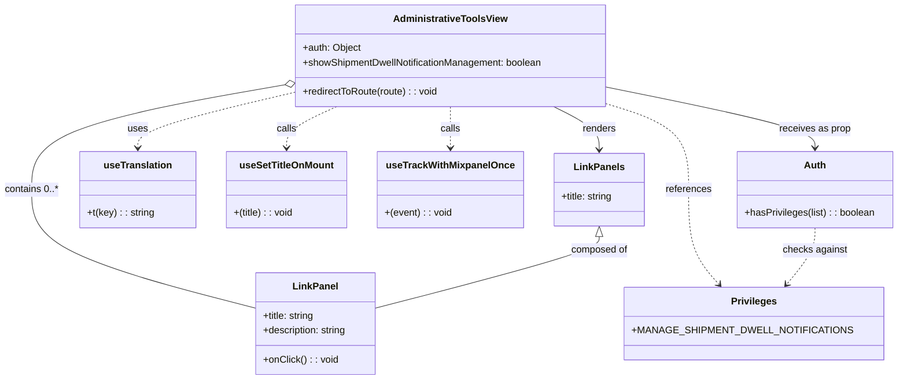

# Diagram: web/portal/src/pages/administration/admin-tools/AdminTools.page.js

> Auto-generated by Obscura crawlers

## Mermaid

### SVG

<svg id="container" width="1463.03125" xmlns="http://www.w3.org/2000/svg" class="classDiagram" height="626" viewBox="0 0 1463.03125 626" role="graphics-document document" aria-roledescription="class"><g><defs><marker id="container_class-aggregationStart" class="marker aggregation class" refX="18" refY="7" markerWidth="190" markerHeight="240" orient="auto"><path d="M 18,7 L9,13 L1,7 L9,1 Z"></path></marker></defs><defs><marker id="container_class-aggregationEnd" class="marker aggregation class" refX="1" refY="7" markerWidth="20" markerHeight="28" orient="auto"><path d="M 18,7 L9,13 L1,7 L9,1 Z"></path></marker></defs><defs><marker id="container_class-extensionStart" class="marker extension class" refX="18" refY="7" markerWidth="190" markerHeight="240" orient="auto"><path d="M 1,7 L18,13 V 1 Z"></path></marker></defs><defs><marker id="container_class-extensionEnd" class="marker extension class" refX="1" refY="7" markerWidth="20" markerHeight="28" orient="auto"><path d="M 1,1 V 13 L18,7 Z"></path></marker></defs><defs><marker id="container_class-compositionStart" class="marker composition class" refX="18" refY="7" markerWidth="190" markerHeight="240" orient="auto"><path d="M 18,7 L9,13 L1,7 L9,1 Z"></path></marker></defs><defs><marker id="container_class-compositionEnd" class="marker composition class" refX="1" refY="7" markerWidth="20" markerHeight="28" orient="auto"><path d="M 18,7 L9,13 L1,7 L9,1 Z"></path></marker></defs><defs><marker id="container_class-dependencyStart" class="marker dependency class" refX="6" refY="7" markerWidth="190" markerHeight="240" orient="auto"><path d="M 5,7 L9,13 L1,7 L9,1 Z"></path></marker></defs><defs><marker id="container_class-dependencyEnd" class="marker dependency class" refX="13" refY="7" markerWidth="20" markerHeight="28" orient="auto"><path d="M 18,7 L9,13 L14,7 L9,1 Z"></path></marker></defs><defs><marker id="container_class-lollipopStart" class="marker lollipop class" refX="13" refY="7" markerWidth="190" markerHeight="240" orient="auto"><circle stroke="black" fill="transparent" cx="7" cy="7" r="6"></circle></marker></defs><defs><marker id="container_class-lollipopEnd" class="marker lollipop class" refX="1" refY="7" markerWidth="190" markerHeight="240" orient="auto"><circle stroke="black" fill="transparent" cx="7" cy="7" r="6"></circle></marker></defs><g class="root"><g class="clusters"></g><g class="edgePaths"><path d="M903.361,176L915.725,182.167C928.089,188.333,952.818,200.667,965.182,212.5C977.547,224.333,977.547,235.667,977.547,241.333L977.547,247" id="id_AdministrativeToolsView_LinkPanels_1" class="edge-thickness-normal edge-pattern-solid relation" style=";;;" data-edge="true" data-et="edge" data-id="id_AdministrativeToolsView_LinkPanels_1" data-points="W3sieCI6OTAzLjM2MDUzNzE5MDA4MjYsInkiOjE3Nn0seyJ4Ijo5NzcuNTQ2ODc1LCJ5IjoyMTN9LHsieCI6OTc3LjU0Njg3NSwieSI6MjUzfV0=" marker-end="url(#container_class-dependencyEnd)"></path><path d="M460.268,140.66L392.212,152.716C324.155,164.773,188.043,188.887,119.986,217.61C51.93,246.333,51.93,279.667,51.93,313C51.93,346.333,51.93,379.667,112.408,412.145C172.885,444.624,293.841,476.247,354.319,492.059L414.797,507.871" id="id_AdministrativeToolsView_LinkPanel_2" class="edge-thickness-normal edge-pattern-solid relation" style=";;;" data-edge="true" data-et="edge" data-id="id_AdministrativeToolsView_LinkPanel_2" data-points="W3sieCI6NDc3LjI1MzkwNjI1LCJ5IjoxMzcuNjUwNTk3NjU1MTMyOTd9LHsieCI6NTEuOTI5Njg3NSwieSI6MjEzfSx7IngiOjUxLjkyOTY4NzUsInkiOjMxM30seyJ4Ijo1MS45Mjk2ODc1LCJ5Ijo0MTN9LHsieCI6NDE0Ljc5Njg3NSwieSI6NTA3Ljg3MDYwMTU0MTIwMTR9XQ==" marker-start="url(#container_class-aggregationStart)"></path><path d="M477.254,153.172L435.25,163.143C393.246,173.115,309.238,193.057,267.234,208.195C225.23,223.333,225.23,233.667,225.23,238.833L225.23,244" id="id_AdministrativeToolsView_useTranslation_3" class="edge-thickness-normal edge-pattern-dashed relation" style=";;;" data-edge="true" data-et="edge" data-id="id_AdministrativeToolsView_useTranslation_3" data-points="W3sieCI6NDc3LjI1MzkwNjI1LCJ5IjoxNTMuMTcxODM1ODQzMjAwMzd9LHsieCI6MjI1LjIzMDQ2ODc1LCJ5IjoyMTN9LHsieCI6MjI1LjIzMDQ2ODc1LCJ5IjoyNTB9XQ==" marker-end="url(#container_class-dependencyEnd)"></path><path d="M550,176L536.423,182.167C522.846,188.333,495.693,200.667,482.116,212C468.539,223.333,468.539,233.667,468.539,238.833L468.539,244" id="id_AdministrativeToolsView_useSetTitleOnMount_4" class="edge-thickness-normal edge-pattern-dashed relation" style=";;;" data-edge="true" data-et="edge" data-id="id_AdministrativeToolsView_useSetTitleOnMount_4" data-points="W3sieCI6NTQ5Ljk5OTc0MTczNTUzNzIsInkiOjE3Nn0seyJ4Ijo0NjguNTM5MDYyNSwieSI6MjEzfSx7IngiOjQ2OC41MzkwNjI1LCJ5IjoyNTB9XQ==" marker-end="url(#container_class-dependencyEnd)"></path><path d="M734.938,176L734.938,182.167C734.938,188.333,734.938,200.667,734.938,212C734.938,223.333,734.938,233.667,734.938,238.833L734.938,244" id="id_AdministrativeToolsView_useTrackWithMixpanelOnce_5" class="edge-thickness-normal edge-pattern-dashed relation" style=";;;" data-edge="true" data-et="edge" data-id="id_AdministrativeToolsView_useTrackWithMixpanelOnce_5" data-points="W3sieCI6NzM0LjkzNzUsInkiOjE3Nn0seyJ4Ijo3MzQuOTM3NSwieSI6MjEzfSx7IngiOjczNC45Mzc1LCJ5IjoyNTB9XQ==" marker-end="url(#container_class-dependencyEnd)"></path><path d="M992.621,171.828L1014.771,178.69C1036.922,185.552,1081.223,199.276,1103.373,222.805C1125.523,246.333,1125.523,279.667,1125.523,313C1125.523,346.333,1125.523,379.667,1133.335,405.731C1141.147,431.795,1156.772,450.591,1164.584,459.988L1172.396,469.386" id="id_AdministrativeToolsView_Privileges_6" class="edge-thickness-normal edge-pattern-dashed relation" style=";;;" data-edge="true" data-et="edge" data-id="id_AdministrativeToolsView_Privileges_6" data-points="W3sieCI6OTkyLjYyMTA5Mzc1LCJ5IjoxNzEuODI4MDUyODA1MjgwNTV9LHsieCI6MTEyNS41MjM0Mzc1LCJ5IjoyMTN9LHsieCI6MTEyNS41MjM0Mzc1LCJ5IjozMTN9LHsieCI6MTEyNS41MjM0Mzc1LCJ5Ijo0MTN9LHsieCI6MTE3Ni4yMzEwNjU5ODY1NzAyLCJ5Ijo0NzR9XQ==" marker-end="url(#container_class-dependencyEnd)"></path><path d="M992.621,144.69L1048.299,156.075C1103.978,167.46,1215.335,190.23,1271.013,206.782C1326.691,223.333,1326.691,233.667,1326.691,238.833L1326.691,244" id="id_AdministrativeToolsView_Auth_7" class="edge-thickness-normal edge-pattern-solid relation" style=";;;" data-edge="true" data-et="edge" data-id="id_AdministrativeToolsView_Auth_7" data-points="W3sieCI6OTkyLjYyMTA5Mzc1LCJ5IjoxNDQuNjkwMzQwNTUyNzc5NDJ9LHsieCI6MTMyNi42OTE0MDYyNSwieSI6MjEzfSx7IngiOjEzMjYuNjkxNDA2MjUsInkiOjI1MH1d" marker-end="url(#container_class-dependencyEnd)"></path><path d="M1326.691,376L1326.691,382.167C1326.691,388.333,1326.691,400.667,1318.879,416.231C1311.067,431.795,1295.443,450.591,1287.631,459.988L1279.819,469.386" id="id_Auth_Privileges_8" class="edge-thickness-normal edge-pattern-dashed relation" style=";;;" data-edge="true" data-et="edge" data-id="id_Auth_Privileges_8" data-points="W3sieCI6MTMyNi42OTE0MDYyNSwieSI6Mzc2fSx7IngiOjEzMjYuNjkxNDA2MjUsInkiOjQxM30seyJ4IjoxMjc1Ljk4Mzc3Nzc2MzQyOTgsInkiOjQ3NH1d" marker-end="url(#container_class-dependencyEnd)"></path><path d="M977.547,390.25L977.547,394.042C977.547,397.833,977.547,405.417,917.069,425.02C856.591,444.624,735.635,476.247,675.158,492.059L614.68,507.871" id="id_LinkPanels_LinkPanel_9" class="edge-thickness-normal edge-pattern-solid relation" style=";;;" data-edge="true" data-et="edge" data-id="id_LinkPanels_LinkPanel_9" data-points="W3sieCI6OTc3LjU0Njg3NSwieSI6MzczfSx7IngiOjk3Ny41NDY4NzUsInkiOjQxM30seyJ4Ijo2MTQuNjc5Njg3NSwieSI6NTA3Ljg3MDYwMTU0MTIwMTR9XQ==" marker-start="url(#container_class-extensionStart)"></path></g><g class="edgeLabels"><g class="edgeLabel" transform="translate(977.546875, 213)"><g class="label" data-id="id_AdministrativeToolsView_LinkPanels_1" transform="translate(-27.75, -12)"><foreignObject width="55.5" height="24">

renders

</foreignObject></g></g><g class="edgeLabel" transform="translate(51.9296875, 313)"><g class="label" data-id="id_AdministrativeToolsView_LinkPanel_2" transform="translate(-43.9296875, -12)"><foreignObject width="87.859375" height="24">

contains 0..*

</foreignObject></g></g><g class="edgeLabel" transform="translate(225.23046875, 213)"><g class="label" data-id="id_AdministrativeToolsView_useTranslation_3" transform="translate(-16.4921875, -12)"><foreignObject width="32.984375" height="24">

uses

</foreignObject></g></g><g class="edgeLabel" transform="translate(468.5390625, 213)"><g class="label" data-id="id_AdministrativeToolsView_useSetTitleOnMount_4" transform="translate(-16.4453125, -12)"><foreignObject width="32.890625" height="24">

calls

</foreignObject></g></g><g class="edgeLabel" transform="translate(734.9375, 213)"><g class="label" data-id="id_AdministrativeToolsView_useTrackWithMixpanelOnce_5" transform="translate(-16.4453125, -12)"><foreignObject width="32.890625" height="24">

calls

</foreignObject></g></g><g class="edgeLabel" transform="translate(1125.5234375, 313)"><g class="label" data-id="id_AdministrativeToolsView_Privileges_6" transform="translate(-37.828125, -12)"><foreignObject width="75.65625" height="24">

references

</foreignObject></g></g><g class="edgeLabel" transform="translate(1326.69140625, 213)"><g class="label" data-id="id_AdministrativeToolsView_Auth_7" transform="translate(-58.765625, -12)"><foreignObject width="117.53125" height="24">

receives as prop

</foreignObject></g></g><g class="edgeLabel" transform="translate(1326.69140625, 413)"><g class="label" data-id="id_Auth_Privileges_8" transform="translate(-52.8125, -12)"><foreignObject width="105.625" height="24">

checks against

</foreignObject></g></g><g class="edgeLabel" transform="translate(977.546875, 413)"><g class="label" data-id="id_LinkPanels_LinkPanel_9" transform="translate(-46.96875, -12)"><foreignObject width="93.9375" height="24">

composed of

</foreignObject></g></g></g><g class="nodes"><g class="node default" id="classId-AdministrativeToolsView-0" transform="translate(734.9375, 92)"><g class="basic label-container"><path d="M-257.68359375 -84 L257.68359375 -84 L257.68359375 84 L-257.68359375 84" stroke="none" stroke-width="0" fill="#ECECFF" style=""></path><path d="M-257.68359375 -84 C-52.50299791008439 -84, 152.67759792983122 -84, 257.68359375 -84 M-257.68359375 -84 C-101.42967204522034 -84, 54.824249659559314 -84, 257.68359375 -84 M257.68359375 -84 C257.68359375 -23.567907566706445, 257.68359375 36.86418486658711, 257.68359375 84 M257.68359375 -84 C257.68359375 -48.67977870141581, 257.68359375 -13.359557402831626, 257.68359375 84 M257.68359375 84 C154.22646569947477 84, 50.769337648949545 84, -257.68359375 84 M257.68359375 84 C89.36846732365186 84, -78.94665910269629 84, -257.68359375 84 M-257.68359375 84 C-257.68359375 44.95252234246534, -257.68359375 5.905044684930687, -257.68359375 -84 M-257.68359375 84 C-257.68359375 44.78827474334842, -257.68359375 5.576549486696834, -257.68359375 -84" stroke="#9370DB" stroke-width="1.3" fill="none" stroke-dasharray="0 0" style=""></path></g><g class="annotation-group text" transform="translate(0, -60)"></g><g class="label-group text" transform="translate(-90.1640625, -60)"><g class="label" style="font-weight: bolder" transform="translate(0,-12)"><foreignObject width="180.328125" height="24">

AdministrativeToolsView

</foreignObject></g></g><g class="members-group text" transform="translate(-245.68359375, -12)"><g class="label" style="" transform="translate(0,-12)"><foreignObject width="96.203125" height="24">

+auth: Object

</foreignObject></g><g class="label" style="" transform="translate(0,12)"><foreignObject width="401.203125" height="24">

+showShipmentDwellNotificationManagement: boolean

</foreignObject></g></g><g class="methods-group text" transform="translate(-245.68359375, 60)"><g class="label" style="" transform="translate(0,-12)"><foreignObject width="224.03125" height="24">

+redirectToRoute(route) : : void

</foreignObject></g></g><g class="divider" style=""><path d="M-257.68359375 -36 C-133.45560791428295 -36, -9.2276220785659 -36, 257.68359375 -36 M-257.68359375 -36 C-55.348926225207634 -36, 146.98574129958473 -36, 257.68359375 -36" stroke="#9370DB" stroke-width="1.3" fill="none" stroke-dasharray="0 0" style=""></path></g><g class="divider" style=""><path d="M-257.68359375 36 C-79.39080981123911 36, 98.90197412752178 36, 257.68359375 36 M-257.68359375 36 C-90.00245981335024 36, 77.67867412329952 36, 257.68359375 36" stroke="#9370DB" stroke-width="1.3" fill="none" stroke-dasharray="0 0" style=""></path></g></g><g class="node default" id="classId-LinkPanels-1" transform="translate(977.546875, 313)"><g class="basic label-container"><path d="M-75.1484375 -60 L75.1484375 -60 L75.1484375 60 L-75.1484375 60" stroke="none" stroke-width="0" fill="#ECECFF" style=""></path><path d="M-75.1484375 -60 C-33.96592757576426 -60, 7.216582348471476 -60, 75.1484375 -60 M-75.1484375 -60 C-18.871623966674505 -60, 37.40518956665099 -60, 75.1484375 -60 M75.1484375 -60 C75.1484375 -27.6531792080866, 75.1484375 4.693641583826803, 75.1484375 60 M75.1484375 -60 C75.1484375 -26.98155724725782, 75.1484375 6.0368855054843635, 75.1484375 60 M75.1484375 60 C18.14446483856856 60, -38.85950782286288 60, -75.1484375 60 M75.1484375 60 C31.45567234939739 60, -12.237092801205222 60, -75.1484375 60 M-75.1484375 60 C-75.1484375 33.242709807787236, -75.1484375 6.485419615574479, -75.1484375 -60 M-75.1484375 60 C-75.1484375 26.004662838351678, -75.1484375 -7.990674323296645, -75.1484375 -60" stroke="#9370DB" stroke-width="1.3" fill="none" stroke-dasharray="0 0" style=""></path></g><g class="annotation-group text" transform="translate(0, -36)"></g><g class="label-group text" transform="translate(-39.4375, -36)"><g class="label" style="font-weight: bolder" transform="translate(0,-12)"><foreignObject width="78.875" height="24">

LinkPanels

</foreignObject></g></g><g class="members-group text" transform="translate(-63.1484375, 12)"><g class="label" style="" transform="translate(0,-12)"><foreignObject width="86.859375" height="24">

+title: string

</foreignObject></g></g><g class="methods-group text" transform="translate(-63.1484375, 60)"></g><g class="divider" style=""><path d="M-75.1484375 -12 C-36.81658072261313 -12, 1.5152760547737358 -12, 75.1484375 -12 M-75.1484375 -12 C-28.00210631175551 -12, 19.144224876488977 -12, 75.1484375 -12" stroke="#9370DB" stroke-width="1.3" fill="none" stroke-dasharray="0 0" style=""></path></g><g class="divider" style=""><path d="M-75.1484375 36 C-34.080840437505934 36, 6.986756624988132 36, 75.1484375 36 M-75.1484375 36 C-40.59954945498038 36, -6.050661409960753 36, 75.1484375 36" stroke="#9370DB" stroke-width="1.3" fill="none" stroke-dasharray="0 0" style=""></path></g></g><g class="node default" id="classId-LinkPanel-2" transform="translate(514.73828125, 534)"><g class="basic label-container"><path d="M-99.94140625 -84 L99.94140625 -84 L99.94140625 84 L-99.94140625 84" stroke="none" stroke-width="0" fill="#ECECFF" style=""></path><path d="M-99.94140625 -84 C-22.320222933808935 -84, 55.30096038238213 -84, 99.94140625 -84 M-99.94140625 -84 C-34.61116934712352 -84, 30.719067555752957 -84, 99.94140625 -84 M99.94140625 -84 C99.94140625 -36.82076032274445, 99.94140625 10.358479354511104, 99.94140625 84 M99.94140625 -84 C99.94140625 -21.763836855802083, 99.94140625 40.472326288395834, 99.94140625 84 M99.94140625 84 C28.625432218605084 84, -42.69054181278983 84, -99.94140625 84 M99.94140625 84 C22.949277006449577 84, -54.042852237100846 84, -99.94140625 84 M-99.94140625 84 C-99.94140625 17.49685028998026, -99.94140625 -49.00629942003948, -99.94140625 -84 M-99.94140625 84 C-99.94140625 45.613124281780856, -99.94140625 7.226248563561711, -99.94140625 -84" stroke="#9370DB" stroke-width="1.3" fill="none" stroke-dasharray="0 0" style=""></path></g><g class="annotation-group text" transform="translate(0, -60)"></g><g class="label-group text" transform="translate(-35.5703125, -60)"><g class="label" style="font-weight: bolder" transform="translate(0,-12)"><foreignObject width="71.140625" height="24">

LinkPanel

</foreignObject></g></g><g class="members-group text" transform="translate(-87.94140625, -12)"><g class="label" style="" transform="translate(0,-12)"><foreignObject width="86.859375" height="24">

+title: string

</foreignObject></g><g class="label" style="" transform="translate(0,12)"><foreignObject width="140.3125" height="24">

+description: string

</foreignObject></g></g><g class="methods-group text" transform="translate(-87.94140625, 60)"><g class="label" style="" transform="translate(0,-12)"><foreignObject width="122.546875" height="24">

+onClick() : : void

</foreignObject></g></g><g class="divider" style=""><path d="M-99.94140625 -36 C-33.58273374894067 -36, 32.77593875211866 -36, 99.94140625 -36 M-99.94140625 -36 C-33.20869236869862 -36, 33.52402151260276 -36, 99.94140625 -36" stroke="#9370DB" stroke-width="1.3" fill="none" stroke-dasharray="0 0" style=""></path></g><g class="divider" style=""><path d="M-99.94140625 36 C-42.37699710163756 36, 15.187412046724873 36, 99.94140625 36 M-99.94140625 36 C-29.270471200967705 36, 41.40046384806459 36, 99.94140625 36" stroke="#9370DB" stroke-width="1.3" fill="none" stroke-dasharray="0 0" style=""></path></g></g><g class="node default" id="classId-useTranslation-3" transform="translate(225.23046875, 313)"><g class="basic label-container"><path d="M-94.37109375 -63 L94.37109375 -63 L94.37109375 63 L-94.37109375 63" stroke="none" stroke-width="0" fill="#ECECFF" style=""></path><path d="M-94.37109375 -63 C-29.94301177629471 -63, 34.48507019741058 -63, 94.37109375 -63 M-94.37109375 -63 C-54.404375883261665 -63, -14.43765801652333 -63, 94.37109375 -63 M94.37109375 -63 C94.37109375 -28.04576537046428, 94.37109375 6.908469259071438, 94.37109375 63 M94.37109375 -63 C94.37109375 -20.418814616133503, 94.37109375 22.162370767732995, 94.37109375 63 M94.37109375 63 C46.873663163417156 63, -0.6237674231656882 63, -94.37109375 63 M94.37109375 63 C24.053481983752548 63, -46.264129782494905 63, -94.37109375 63 M-94.37109375 63 C-94.37109375 19.78577726032912, -94.37109375 -23.42844547934176, -94.37109375 -63 M-94.37109375 63 C-94.37109375 26.51208253875702, -94.37109375 -9.975834922485959, -94.37109375 -63" stroke="#9370DB" stroke-width="1.3" fill="none" stroke-dasharray="0 0" style=""></path></g><g class="annotation-group text" transform="translate(0, -39)"></g><g class="label-group text" transform="translate(-54.0859375, -39)"><g class="label" style="font-weight: bolder" transform="translate(0,-12)"><foreignObject width="108.171875" height="24">

useTranslation

</foreignObject></g></g><g class="members-group text" transform="translate(-82.37109375, 9)"></g><g class="methods-group text" transform="translate(-82.37109375, 39)"><g class="label" style="" transform="translate(0,-12)"><foreignObject width="110.65625" height="24">

+t(key) : : string

</foreignObject></g></g><g class="divider" style=""><path d="M-94.37109375 -15 C-39.590635904090135 -15, 15.18982194181973 -15, 94.37109375 -15 M-94.37109375 -15 C-21.278712950172476 -15, 51.81366784965505 -15, 94.37109375 -15" stroke="#9370DB" stroke-width="1.3" fill="none" stroke-dasharray="0 0" style=""></path></g><g class="divider" style=""><path d="M-94.37109375 9 C-22.65044272316362 9, 49.07020830367276 9, 94.37109375 9 M-94.37109375 9 C-43.078268258403575 9, 8.21455723319285 9, 94.37109375 9" stroke="#9370DB" stroke-width="1.3" fill="none" stroke-dasharray="0 0" style=""></path></g></g><g class="node default" id="classId-useSetTitleOnMount-4" transform="translate(468.5390625, 313)"><g class="basic label-container"><path d="M-98.9375 -63 L98.9375 -63 L98.9375 63 L-98.9375 63" stroke="none" stroke-width="0" fill="#ECECFF" style=""></path><path d="M-98.9375 -63 C-46.3328142975246 -63, 6.271871404950801 -63, 98.9375 -63 M-98.9375 -63 C-31.373650449432787 -63, 36.190199101134425 -63, 98.9375 -63 M98.9375 -63 C98.9375 -27.693773766899596, 98.9375 7.612452466200807, 98.9375 63 M98.9375 -63 C98.9375 -31.274446930511868, 98.9375 0.4511061389762645, 98.9375 63 M98.9375 63 C28.85196434712057 63, -41.23357130575886 63, -98.9375 63 M98.9375 63 C44.589706469630755 63, -9.75808706073849 63, -98.9375 63 M-98.9375 63 C-98.9375 20.68372811576876, -98.9375 -21.632543768462483, -98.9375 -63 M-98.9375 63 C-98.9375 13.34209244349384, -98.9375 -36.31581511301232, -98.9375 -63" stroke="#9370DB" stroke-width="1.3" fill="none" stroke-dasharray="0 0" style=""></path></g><g class="annotation-group text" transform="translate(0, -39)"></g><g class="label-group text" transform="translate(-74.65625, -39)"><g class="label" style="font-weight: bolder" transform="translate(0,-12)"><foreignObject width="149.3125" height="24">

useSetTitleOnMount

</foreignObject></g></g><g class="members-group text" transform="translate(-86.9375, 9)"></g><g class="methods-group text" transform="translate(-86.9375, 39)"><g class="label" style="" transform="translate(0,-12)"><foreignObject width="99.21875" height="24">

+(title) : : void

</foreignObject></g></g><g class="divider" style=""><path d="M-98.9375 -15 C-51.33687046234049 -15, -3.7362409246809847 -15, 98.9375 -15 M-98.9375 -15 C-39.71117613900706 -15, 19.515147721985883 -15, 98.9375 -15" stroke="#9370DB" stroke-width="1.3" fill="none" stroke-dasharray="0 0" style=""></path></g><g class="divider" style=""><path d="M-98.9375 9 C-46.65400843200184 9, 5.629483135996324 9, 98.9375 9 M-98.9375 9 C-32.13635353778439 9, 34.664792924431225 9, 98.9375 9" stroke="#9370DB" stroke-width="1.3" fill="none" stroke-dasharray="0 0" style=""></path></g></g><g class="node default" id="classId-useTrackWithMixpanelOnce-5" transform="translate(734.9375, 313)"><g class="basic label-container"><path d="M-117.4609375 -63 L117.4609375 -63 L117.4609375 63 L-117.4609375 63" stroke="none" stroke-width="0" fill="#ECECFF" style=""></path><path d="M-117.4609375 -63 C-28.87008280674111 -63, 59.72077188651778 -63, 117.4609375 -63 M-117.4609375 -63 C-51.67699876623108 -63, 14.10693996753784 -63, 117.4609375 -63 M117.4609375 -63 C117.4609375 -23.006175286725323, 117.4609375 16.987649426549353, 117.4609375 63 M117.4609375 -63 C117.4609375 -20.592326053062756, 117.4609375 21.81534789387449, 117.4609375 63 M117.4609375 63 C70.0104536696912 63, 22.55996983938239 63, -117.4609375 63 M117.4609375 63 C44.343048650726146 63, -28.774840198547707 63, -117.4609375 63 M-117.4609375 63 C-117.4609375 30.846134258307146, -117.4609375 -1.3077314833857088, -117.4609375 -63 M-117.4609375 63 C-117.4609375 22.263443268174, -117.4609375 -18.473113463652, -117.4609375 -63" stroke="#9370DB" stroke-width="1.3" fill="none" stroke-dasharray="0 0" style=""></path></g><g class="annotation-group text" transform="translate(0, -39)"></g><g class="label-group text" transform="translate(-100.59375, -39)"><g class="label" style="font-weight: bolder" transform="translate(0,-12)"><foreignObject width="201.1875" height="24">

useTrackWithMixpanelOnce

</foreignObject></g></g><g class="members-group text" transform="translate(-105.4609375, 9)"></g><g class="methods-group text" transform="translate(-105.4609375, 39)"><g class="label" style="" transform="translate(0,-12)"><foreignObject width="110.328125" height="24">

+(event) : : void

</foreignObject></g></g><g class="divider" style=""><path d="M-117.4609375 -15 C-44.032190561030916 -15, 29.39655637793817 -15, 117.4609375 -15 M-117.4609375 -15 C-51.44871909449758 -15, 14.563499311004847 -15, 117.4609375 -15" stroke="#9370DB" stroke-width="1.3" fill="none" stroke-dasharray="0 0" style=""></path></g><g class="divider" style=""><path d="M-117.4609375 9 C-58.77506114055903 9, -0.08918478111806394 9, 117.4609375 9 M-117.4609375 9 C-35.31445451917662 9, 46.83202846164676 9, 117.4609375 9" stroke="#9370DB" stroke-width="1.3" fill="none" stroke-dasharray="0 0" style=""></path></g></g><g class="node default" id="classId-Privileges-6" transform="translate(1226.107421875, 534)"><g class="basic label-container"><path d="M-190.59375 -60 L190.59375 -60 L190.59375 60 L-190.59375 60" stroke="none" stroke-width="0" fill="#ECECFF" style=""></path><path d="M-190.59375 -60 C-91.54697933575515 -60, 7.499791328489692 -60, 190.59375 -60 M-190.59375 -60 C-56.17400685665558 -60, 78.24573628668884 -60, 190.59375 -60 M190.59375 -60 C190.59375 -34.55829705475067, 190.59375 -9.116594109501335, 190.59375 60 M190.59375 -60 C190.59375 -24.546471807594145, 190.59375 10.90705638481171, 190.59375 60 M190.59375 60 C68.88892194825114 60, -52.815906103497724 60, -190.59375 60 M190.59375 60 C65.72905649673375 60, -59.135637006532505 60, -190.59375 60 M-190.59375 60 C-190.59375 21.769137983714067, -190.59375 -16.461724032571865, -190.59375 -60 M-190.59375 60 C-190.59375 16.54807123044929, -190.59375 -26.903857539101423, -190.59375 -60" stroke="#9370DB" stroke-width="1.3" fill="none" stroke-dasharray="0 0" style=""></path></g><g class="annotation-group text" transform="translate(0, -36)"></g><g class="label-group text" transform="translate(-35.734375, -36)"><g class="label" style="font-weight: bolder" transform="translate(0,-12)"><foreignObject width="71.46875" height="24">

Privileges

</foreignObject></g></g><g class="members-group text" transform="translate(-178.59375, 12)"><g class="label" style="" transform="translate(0,-12)"><foreignObject width="321.453125" height="24">

+MANAGE_SHIPMENT_DWELL_NOTIFICATIONS

</foreignObject></g></g><g class="methods-group text" transform="translate(-178.59375, 60)"></g><g class="divider" style=""><path d="M-190.59375 -12 C-75.34054817499258 -12, 39.912653650014846 -12, 190.59375 -12 M-190.59375 -12 C-110.8577799051451 -12, -31.121809810290188 -12, 190.59375 -12" stroke="#9370DB" stroke-width="1.3" fill="none" stroke-dasharray="0 0" style=""></path></g><g class="divider" style=""><path d="M-190.59375 36 C-47.22404186984966 36, 96.14566626030069 36, 190.59375 36 M-190.59375 36 C-71.6512795725278 36, 47.291190854944404 36, 190.59375 36" stroke="#9370DB" stroke-width="1.3" fill="none" stroke-dasharray="0 0" style=""></path></g></g><g class="node default" id="classId-Auth-7" transform="translate(1326.69140625, 313)"><g class="basic label-container"><path d="M-128.33984375 -63 L128.33984375 -63 L128.33984375 63 L-128.33984375 63" stroke="none" stroke-width="0" fill="#ECECFF" style=""></path><path d="M-128.33984375 -63 C-36.45600999842698 -63, 55.42782375314604 -63, 128.33984375 -63 M-128.33984375 -63 C-57.07412320532907 -63, 14.191597339341854 -63, 128.33984375 -63 M128.33984375 -63 C128.33984375 -18.125290317033297, 128.33984375 26.749419365933406, 128.33984375 63 M128.33984375 -63 C128.33984375 -20.73696150656746, 128.33984375 21.52607698686508, 128.33984375 63 M128.33984375 63 C54.98303869009639 63, -18.373766369807214 63, -128.33984375 63 M128.33984375 63 C68.17272699933024 63, 8.005610248660474 63, -128.33984375 63 M-128.33984375 63 C-128.33984375 31.859753322520245, -128.33984375 0.7195066450404894, -128.33984375 -63 M-128.33984375 63 C-128.33984375 23.37779415770126, -128.33984375 -16.24441168459748, -128.33984375 -63" stroke="#9370DB" stroke-width="1.3" fill="none" stroke-dasharray="0 0" style=""></path></g><g class="annotation-group text" transform="translate(0, -39)"></g><g class="label-group text" transform="translate(-17.0078125, -39)"><g class="label" style="font-weight: bolder" transform="translate(0,-12)"><foreignObject width="34.015625" height="24">

Auth

</foreignObject></g></g><g class="members-group text" transform="translate(-116.33984375, 9)"></g><g class="methods-group text" transform="translate(-116.33984375, 39)"><g class="label" style="" transform="translate(0,-12)"><foreignObject width="215.671875" height="24">

+hasPrivileges(list) : : boolean

</foreignObject></g></g><g class="divider" style=""><path d="M-128.33984375 -15 C-71.88842283808663 -15, -15.437001926173252 -15, 128.33984375 -15 M-128.33984375 -15 C-63.586738634454846 -15, 1.1663664810903072 -15, 128.33984375 -15" stroke="#9370DB" stroke-width="1.3" fill="none" stroke-dasharray="0 0" style=""></path></g><g class="divider" style=""><path d="M-128.33984375 9 C-57.42130724348661 9, 13.497229263026782 9, 128.33984375 9 M-128.33984375 9 C-33.34261987607583 9, 61.65460399784834 9, 128.33984375 9" stroke="#9370DB" stroke-width="1.3" fill="none" stroke-dasharray="0 0" style=""></path></g></g></g></g></g></svg>
