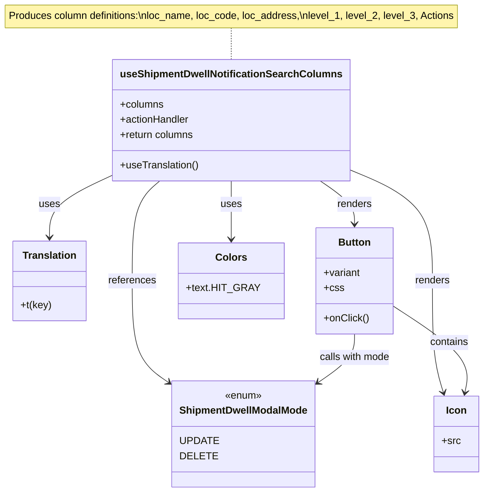

# Diagram: web/portal/src/pages/administration/admin-tools/shipment-dwell-notification/ShipmentDwellNotificationSearch.columns.js


> Auto-generated by Obscura crawlers

## Diagram 1



### SVG

<svg id="container" width="757.05859375" xmlns="http://www.w3.org/2000/svg" class="classDiagram" height="778" viewBox="0 0 757.05859375 778" role="graphics-document document" aria-roledescription="class"><style>#container{font-family:"trebuchet ms",verdana,arial,sans-serif;font-size:16px;fill:#333;}@keyframes edge-animation-frame{from{stroke-dashoffset:0;}}@keyframes dash{to{stroke-dashoffset:0;}}#container .edge-animation-slow{stroke-dasharray:9,5!important;stroke-dashoffset:900;animation:dash 50s linear infinite;stroke-linecap:round;}#container .edge-animation-fast{stroke-dasharray:9,5!important;stroke-dashoffset:900;animation:dash 20s linear infinite;stroke-linecap:round;}#container .error-icon{fill:#552222;}#container .error-text{fill:#552222;stroke:#552222;}#container .edge-thickness-normal{stroke-width:1px;}#container .edge-thickness-thick{stroke-width:3.5px;}#container .edge-pattern-solid{stroke-dasharray:0;}#container .edge-thickness-invisible{stroke-width:0;fill:none;}#container .edge-pattern-dashed{stroke-dasharray:3;}#container .edge-pattern-dotted{stroke-dasharray:2;}#container .marker{fill:#333333;stroke:#333333;}#container .marker.cross{stroke:#333333;}#container svg{font-family:"trebuchet ms",verdana,arial,sans-serif;font-size:16px;}#container p{margin:0;}#container g.classGroup text{fill:#9370DB;stroke:none;font-family:"trebuchet ms",verdana,arial,sans-serif;font-size:10px;}#container g.classGroup text .title{font-weight:bolder;}#container .nodeLabel,#container .edgeLabel{color:#131300;}#container .edgeLabel .label rect{fill:#ECECFF;}#container .label text{fill:#131300;}#container .labelBkg{background:#ECECFF;}#container .edgeLabel .label span{background:#ECECFF;}#container .classTitle{font-weight:bolder;}#container .node rect,#container .node circle,#container .node ellipse,#container .node polygon,#container .node path{fill:#ECECFF;stroke:#9370DB;stroke-width:1px;}#container .divider{stroke:#9370DB;stroke-width:1;}#container g.clickable{cursor:pointer;}#container g.classGroup rect{fill:#ECECFF;stroke:#9370DB;}#container g.classGroup line{stroke:#9370DB;stroke-width:1;}#container .classLabel .box{stroke:none;stroke-width:0;fill:#ECECFF;opacity:0.5;}#container .classLabel .label{fill:#9370DB;font-size:10px;}#container .relation{stroke:#333333;stroke-width:1;fill:none;}#container .dashed-line{stroke-dasharray:3;}#container .dotted-line{stroke-dasharray:1 2;}#container #compositionStart,#container .composition{fill:#333333!important;stroke:#333333!important;stroke-width:1;}#container #compositionEnd,#container .composition{fill:#333333!important;stroke:#333333!important;stroke-width:1;}#container #dependencyStart,#container .dependency{fill:#333333!important;stroke:#333333!important;stroke-width:1;}#container #dependencyStart,#container .dependency{fill:#333333!important;stroke:#333333!important;stroke-width:1;}#container #extensionStart,#container .extension{fill:transparent!important;stroke:#333333!important;stroke-width:1;}#container #extensionEnd,#container .extension{fill:transparent!important;stroke:#333333!important;stroke-width:1;}#container #aggregationStart,#container .aggregation{fill:transparent!important;stroke:#333333!important;stroke-width:1;}#container #aggregationEnd,#container .aggregation{fill:transparent!important;stroke:#333333!important;stroke-width:1;}#container #lollipopStart,#container .lollipop{fill:#ECECFF!important;stroke:#333333!important;stroke-width:1;}#container #lollipopEnd,#container .lollipop{fill:#ECECFF!important;stroke:#333333!important;stroke-width:1;}#container .edgeTerminals{font-size:11px;line-height:initial;}#container .classTitleText{text-anchor:middle;font-size:18px;fill:#333;}#container .label-icon{display:inline-block;height:1em;overflow:visible;vertical-align:-0.125em;}#container .node .label-icon path{fill:currentColor;stroke:revert;stroke-width:revert;}#container :root{--mermaid-font-family:"trebuchet ms",verdana,arial,sans-serif;}</style><g><defs><marker id="container_class-aggregationStart" class="marker aggregation class" refX="18" refY="7" markerWidth="190" markerHeight="240" orient="auto"><path d="M 18,7 L9,13 L1,7 L9,1 Z"></path></marker></defs><defs><marker id="container_class-aggregationEnd" class="marker aggregation class" refX="1" refY="7" markerWidth="20" markerHeight="28" orient="auto"><path d="M 18,7 L9,13 L1,7 L9,1 Z"></path></marker></defs><defs><marker id="container_class-extensionStart" class="marker extension class" refX="18" refY="7" markerWidth="190" markerHeight="240" orient="auto"><path d="M 1,7 L18,13 V 1 Z"></path></marker></defs><defs><marker id="container_class-extensionEnd" class="marker extension class" refX="1" refY="7" markerWidth="20" markerHeight="28" orient="auto"><path d="M 1,1 V 13 L18,7 Z"></path></marker></defs><defs><marker id="container_class-compositionStart" class="marker composition class" refX="18" refY="7" markerWidth="190" markerHeight="240" orient="auto"><path d="M 18,7 L9,13 L1,7 L9,1 Z"></path></marker></defs><defs><marker id="container_class-compositionEnd" class="marker composition class" refX="1" refY="7" markerWidth="20" markerHeight="28" orient="auto"><path d="M 18,7 L9,13 L1,7 L9,1 Z"></path></marker></defs><defs><marker id="container_class-dependencyStart" class="marker dependency class" refX="6" refY="7" markerWidth="190" markerHeight="240" orient="auto"><path d="M 5,7 L9,13 L1,7 L9,1 Z"></path></marker></defs><defs><marker id="container_class-dependencyEnd" class="marker dependency class" refX="13" refY="7" markerWidth="20" markerHeight="28" orient="auto"><path d="M 18,7 L9,13 L14,7 L9,1 Z"></path></marker></defs><defs><marker id="container_class-lollipopStart" class="marker lollipop class" refX="13" refY="7" markerWidth="190" markerHeight="240" orient="auto"><circle stroke="black" fill="transparent" cx="7" cy="7" r="6"></circle></marker></defs><defs><marker id="container_class-lollipopEnd" class="marker lollipop class" refX="1" refY="7" markerWidth="190" markerHeight="240" orient="auto"><circle stroke="black" fill="transparent" cx="7" cy="7" r="6"></circle></marker></defs><g class="root"><g class="clusters"></g><g class="edgePaths"><path d="M369.594,44L369.594,48.167C369.594,52.333,369.594,60.667,369.594,69C369.594,77.333,369.594,85.667,369.594,89.833L369.594,94" id="edgeNote1" class="edge-thickness-normal edge-pattern-dotted relation" style="fill: none;;;fill: none" data-edge="true" data-et="edge" data-id="edgeNote1" data-points="W3sieCI6MzY5LjU5Mzc1LCJ5Ijo0NH0seyJ4IjozNjkuNTkzNzUsInkiOjY5fSx7IngiOjM2OS41OTM3NSwieSI6OTR9XQ=="></path><path d="M190.367,275.218L173.618,283.182C156.87,291.145,123.372,307.073,106.624,323.703C89.875,340.333,89.875,357.667,89.875,366.333L89.875,375" id="id_useShipmentDwellNotificationSearchColumns_Translation_1" class="edge-thickness-normal edge-pattern-solid relation" style=";;;" data-edge="true" data-et="edge" data-id="id_useShipmentDwellNotificationSearchColumns_Translation_1" data-points="W3sieCI6MTkwLjM2NzE4NzUsInkiOjI3NS4yMTgyMTU4NDE4MDU0fSx7IngiOjg5Ljg3NSwieSI6MzIzfSx7IngiOjg5Ljg3NSwieSI6MzgxfV0=" marker-end="url(#container_class-dependencyEnd)"></path><path d="M261.348,286L254.395,292.167C247.442,298.333,233.535,310.667,226.582,337C219.629,363.333,219.629,403.667,219.629,444C219.629,484.333,219.629,524.667,228.549,551.24C237.47,577.812,255.311,590.625,264.231,597.031L273.152,603.437" id="id_useShipmentDwellNotificationSearchColumns_ShipmentDwellModalMode_2" class="edge-thickness-normal edge-pattern-solid relation" style=";;;" data-edge="true" data-et="edge" data-id="id_useShipmentDwellNotificationSearchColumns_ShipmentDwellModalMode_2" data-points="W3sieCI6MjYxLjM0ODQ0OTI0ODEyMDMsInkiOjI4Nn0seyJ4IjoyMTkuNjI4OTA2MjUsInkiOjMyM30seyJ4IjoyMTkuNjI4OTA2MjUsInkiOjQ0NH0seyJ4IjoyMTkuNjI4OTA2MjUsInkiOjU2NX0seyJ4IjoyNzguMDI1MzkwNjI1LCJ5Ijo2MDYuOTM2OTk3OTI1MDQ2Nn1d" marker-end="url(#container_class-dependencyEnd)"></path><path d="M504.582,286L513.254,292.167C521.925,298.333,539.267,310.667,547.938,322C556.609,333.333,556.609,343.667,556.609,348.833L556.609,354" id="id_useShipmentDwellNotificationSearchColumns_Button_3" class="edge-thickness-normal edge-pattern-solid relation" style=";;;" data-edge="true" data-et="edge" data-id="id_useShipmentDwellNotificationSearchColumns_Button_3" data-points="W3sieCI6NTA0LjU4MjQ3MTgwNDUxMTMsInkiOjI4Nn0seyJ4Ijo1NTYuNjA5Mzc1LCJ5IjozMjN9LHsieCI6NTU2LjYwOTM3NSwieSI6MzYwfV0=" marker-end="url(#container_class-dependencyEnd)"></path><path d="M548.82,266.982L570.557,276.319C592.293,285.655,635.766,304.327,657.502,333.83C679.238,363.333,679.238,403.667,679.238,444C679.238,484.333,679.238,524.667,681.96,554.041C684.681,583.415,690.124,601.831,692.845,611.038L695.566,620.246" id="id_useShipmentDwellNotificationSearchColumns_Icon_4" class="edge-thickness-normal edge-pattern-solid relation" style=";;;" data-edge="true" data-et="edge" data-id="id_useShipmentDwellNotificationSearchColumns_Icon_4" data-points="W3sieCI6NTQ4LjgyMDMxMjUsInkiOjI2Ni45ODIyNTAzMTIyMjc5Nn0seyJ4Ijo2NzkuMjM4MjgxMjUsInkiOjMyM30seyJ4Ijo2NzkuMjM4MjgxMjUsInkiOjQ0NH0seyJ4Ijo2NzkuMjM4MjgxMjUsInkiOjU2NX0seyJ4Ijo2OTcuMjY2OTE2MzIyMzE0LCJ5Ijo2MjZ9XQ==" marker-end="url(#container_class-dependencyEnd)"></path><path d="M369.594,286L369.594,292.167C369.594,298.333,369.594,310.667,369.594,326C369.594,341.333,369.594,359.667,369.594,368.833L369.594,378" id="id_useShipmentDwellNotificationSearchColumns_Colors_5" class="edge-thickness-normal edge-pattern-solid relation" style=";;;" data-edge="true" data-et="edge" data-id="id_useShipmentDwellNotificationSearchColumns_Colors_5" data-points="W3sieCI6MzY5LjU5Mzc1LCJ5IjoyODZ9LHsieCI6MzY5LjU5Mzc1LCJ5IjozMjN9LHsieCI6MzY5LjU5Mzc1LCJ5IjozODR9XQ==" marker-end="url(#container_class-dependencyEnd)"></path><path d="M616.488,483.412L637.148,497.01C657.807,510.608,699.126,537.804,717.854,560.59C736.581,583.376,732.717,601.752,730.784,610.94L728.852,620.128" id="id_Button_Icon_6" class="edge-thickness-normal edge-pattern-solid relation" style=";;;" data-edge="true" data-et="edge" data-id="id_Button_Icon_6" data-points="W3sieCI6NjE2LjQ4ODI4MTI1LCJ5Ijo0ODMuNDEyMDMwOTM3OTExN30seyJ4Ijo3NDAuNDQ1MzEyNSwieSI6NTY1fSx7IngiOjcyNy42MTc1MTAzMzA1Nzg1LCJ5Ijo2MjZ9XQ==" marker-end="url(#container_class-dependencyEnd)"></path><path d="M556.609,528L556.609,534.167C556.609,540.333,556.609,552.667,547.689,565.24C538.768,577.812,520.927,590.625,512.007,597.031L503.086,603.437" id="id_Button_ShipmentDwellModalMode_7" class="edge-thickness-normal edge-pattern-solid relation" style=";;;" data-edge="true" data-et="edge" data-id="id_Button_ShipmentDwellModalMode_7" data-points="W3sieCI6NTU2LjYwOTM3NSwieSI6NTI4fSx7IngiOjU1Ni42MDkzNzUsInkiOjU2NX0seyJ4Ijo0OTguMjEyODkwNjI1LCJ5Ijo2MDYuOTM2OTk3OTI1MDQ2Nn1d" marker-end="url(#container_class-dependencyEnd)"></path></g><g class="edgeLabels"><g class="edgeLabel"><g class="label" data-id="edgeNote1" transform="translate(0, 0)"><foreignObject width="0" height="0"><div xmlns="http://www.w3.org/1999/xhtml" class="labelBkg" style="display: table-cell; white-space: nowrap; line-height: 1.5; max-width: 200px; text-align: center;"><span class="edgeLabel"></span></div></foreignObject></g></g><g class="edgeLabel" transform="translate(89.875, 323)"><g class="label" data-id="id_useShipmentDwellNotificationSearchColumns_Translation_1" transform="translate(-16.4921875, -12)"><foreignObject width="32.984375" height="24"><div xmlns="http://www.w3.org/1999/xhtml" class="labelBkg" style="display: table-cell; white-space: nowrap; line-height: 1.5; max-width: 200px; text-align: center;"><span class="edgeLabel"><p>uses</p></span></div></foreignObject></g></g><g class="edgeLabel" transform="translate(219.62890625, 444)"><g class="label" data-id="id_useShipmentDwellNotificationSearchColumns_ShipmentDwellModalMode_2" transform="translate(-37.828125, -12)"><foreignObject width="75.65625" height="24"><div xmlns="http://www.w3.org/1999/xhtml" class="labelBkg" style="display: table-cell; white-space: nowrap; line-height: 1.5; max-width: 200px; text-align: center;"><span class="edgeLabel"><p>references</p></span></div></foreignObject></g></g><g class="edgeLabel" transform="translate(556.609375, 323)"><g class="label" data-id="id_useShipmentDwellNotificationSearchColumns_Button_3" transform="translate(-27.75, -12)"><foreignObject width="55.5" height="24"><div xmlns="http://www.w3.org/1999/xhtml" class="labelBkg" style="display: table-cell; white-space: nowrap; line-height: 1.5; max-width: 200px; text-align: center;"><span class="edgeLabel"><p>renders</p></span></div></foreignObject></g></g><g class="edgeLabel" transform="translate(679.23828125, 444)"><g class="label" data-id="id_useShipmentDwellNotificationSearchColumns_Icon_4" transform="translate(-27.75, -12)"><foreignObject width="55.5" height="24"><div xmlns="http://www.w3.org/1999/xhtml" class="labelBkg" style="display: table-cell; white-space: nowrap; line-height: 1.5; max-width: 200px; text-align: center;"><span class="edgeLabel"><p>renders</p></span></div></foreignObject></g></g><g class="edgeLabel" transform="translate(369.59375, 323)"><g class="label" data-id="id_useShipmentDwellNotificationSearchColumns_Colors_5" transform="translate(-16.4921875, -12)"><foreignObject width="32.984375" height="24"><div xmlns="http://www.w3.org/1999/xhtml" class="labelBkg" style="display: table-cell; white-space: nowrap; line-height: 1.5; max-width: 200px; text-align: center;"><span class="edgeLabel"><p>uses</p></span></div></foreignObject></g></g><g class="edgeLabel" transform="translate(704.50073, 541.34143)"><g class="label" data-id="id_Button_Icon_6" transform="translate(-30.890625, -12)"><foreignObject width="61.78125" height="24"><div xmlns="http://www.w3.org/1999/xhtml" class="labelBkg" style="display: table-cell; white-space: nowrap; line-height: 1.5; max-width: 200px; text-align: center;"><span class="edgeLabel"><p>contains</p></span></div></foreignObject></g></g><g class="edgeLabel" transform="translate(556.609375, 565)"><g class="label" data-id="id_Button_ShipmentDwellModalMode_7" transform="translate(-56.921875, -12)"><foreignObject width="113.84375" height="24"><div xmlns="http://www.w3.org/1999/xhtml" class="labelBkg" style="display: table-cell; white-space: nowrap; line-height: 1.5; max-width: 200px; text-align: center;"><span class="edgeLabel"><p>calls with mode</p></span></div></foreignObject></g></g></g><g class="nodes"><g class="node default" id="classId-useShipmentDwellNotificationSearchColumns-0" transform="translate(369.59375, 190)"><g class="basic label-container"><path d="M-179.2265625 -96 L179.2265625 -96 L179.2265625 96 L-179.2265625 96" stroke="none" stroke-width="0" fill="#ECECFF" style=""></path><path d="M-179.2265625 -96 C-37.96131975699478 -96, 103.30392298601043 -96, 179.2265625 -96 M-179.2265625 -96 C-39.10501824992724 -96, 101.01652600014552 -96, 179.2265625 -96 M179.2265625 -96 C179.2265625 -33.10426931399653, 179.2265625 29.791461372006935, 179.2265625 96 M179.2265625 -96 C179.2265625 -54.40376396336623, 179.2265625 -12.807527926732462, 179.2265625 96 M179.2265625 96 C90.3991244207733 96, 1.5716863415466094 96, -179.2265625 96 M179.2265625 96 C46.610545390460146 96, -86.00547171907971 96, -179.2265625 96 M-179.2265625 96 C-179.2265625 48.332379821322526, -179.2265625 0.6647596426450519, -179.2265625 -96 M-179.2265625 96 C-179.2265625 40.483310363471595, -179.2265625 -15.03337927305681, -179.2265625 -96" stroke="#9370DB" stroke-width="1.3" fill="none" stroke-dasharray="0 0" style=""></path></g><g class="annotation-group text" transform="translate(0, -72)"></g><g class="label-group text" transform="translate(-167.2265625, -72)"><g class="label" style="font-weight: bolder" transform="translate(0,-12)"><foreignObject width="334.453125" height="24"><div xmlns="http://www.w3.org/1999/xhtml" style="display: table-cell; white-space: nowrap; line-height: 1.5; max-width: 381px; text-align: center;"><span class="nodeLabel markdown-node-label" style=""><p>useShipmentDwellNotificationSearchColumns</p></span></div></foreignObject></g></g><g class="members-group text" transform="translate(-167.2265625, -24)"><g class="label" style="" transform="translate(0,-12)"><foreignObject width="69.21875" height="24"><div xmlns="http://www.w3.org/1999/xhtml" style="display: table-cell; white-space: nowrap; line-height: 1.5; max-width: 127px; text-align: center;"><span class="nodeLabel markdown-node-label" style=""><p>+columns</p></span></div></foreignObject></g><g class="label" style="" transform="translate(0,12)"><foreignObject width="111.140625" height="24"><div xmlns="http://www.w3.org/1999/xhtml" style="display: table-cell; white-space: nowrap; line-height: 1.5; max-width: 169px; text-align: center;"><span class="nodeLabel markdown-node-label" style=""><p>+actionHandler</p></span></div></foreignObject></g><g class="label" style="" transform="translate(0,36)"><foreignObject width="118.515625" height="24"><div xmlns="http://www.w3.org/1999/xhtml" style="display: table-cell; white-space: nowrap; line-height: 1.5; max-width: 176px; text-align: center;"><span class="nodeLabel markdown-node-label" style=""><p>+return columns</p></span></div></foreignObject></g></g><g class="methods-group text" transform="translate(-167.2265625, 72)"><g class="label" style="" transform="translate(0,-12)"><foreignObject width="125.140625" height="24"><div xmlns="http://www.w3.org/1999/xhtml" style="display: table-cell; white-space: nowrap; line-height: 1.5; max-width: 183px; text-align: center;"><span class="nodeLabel markdown-node-label" style=""><p>+useTranslation()</p></span></div></foreignObject></g></g><g class="divider" style=""><path d="M-179.2265625 -48 C-92.59852607739764 -48, -5.970489654795273 -48, 179.2265625 -48 M-179.2265625 -48 C-71.1082651129911 -48, 37.01003227401779 -48, 179.2265625 -48" stroke="#9370DB" stroke-width="1.3" fill="none" stroke-dasharray="0 0" style=""></path></g><g class="divider" style=""><path d="M-179.2265625 48 C-59.589812464699435 48, 60.04693757060113 48, 179.2265625 48 M-179.2265625 48 C-51.44550675270743 48, 76.33554899458514 48, 179.2265625 48" stroke="#9370DB" stroke-width="1.3" fill="none" stroke-dasharray="0 0" style=""></path></g></g><g class="node default" id="classId-Translation-1" transform="translate(89.875, 444)"><g class="basic label-container"><path d="M-56.92578125 -63 L56.92578125 -63 L56.92578125 63 L-56.92578125 63" stroke="none" stroke-width="0" fill="#ECECFF" style=""></path><path d="M-56.92578125 -63 C-18.13318520389958 -63, 20.659410842200842 -63, 56.92578125 -63 M-56.92578125 -63 C-15.954641971520637 -63, 25.016497306958726 -63, 56.92578125 -63 M56.92578125 -63 C56.92578125 -26.339258971788325, 56.92578125 10.32148205642335, 56.92578125 63 M56.92578125 -63 C56.92578125 -23.206538637917724, 56.92578125 16.586922724164552, 56.92578125 63 M56.92578125 63 C12.307971237000416 63, -32.30983877599917 63, -56.92578125 63 M56.92578125 63 C29.97469464830993 63, 3.023608046619863 63, -56.92578125 63 M-56.92578125 63 C-56.92578125 31.20152733328611, -56.92578125 -0.596945333427783, -56.92578125 -63 M-56.92578125 63 C-56.92578125 18.21031720017492, -56.92578125 -26.57936559965016, -56.92578125 -63" stroke="#9370DB" stroke-width="1.3" fill="none" stroke-dasharray="0 0" style=""></path></g><g class="annotation-group text" transform="translate(0, -39)"></g><g class="label-group text" transform="translate(-41.2265625, -39)"><g class="label" style="font-weight: bolder" transform="translate(0,-12)"><foreignObject width="82.453125" height="24"><div xmlns="http://www.w3.org/1999/xhtml" style="display: table-cell; white-space: nowrap; line-height: 1.5; max-width: 131px; text-align: center;"><span class="nodeLabel markdown-node-label" style=""><p>Translation</p></span></div></foreignObject></g></g><g class="members-group text" transform="translate(-44.92578125, 9)"></g><g class="methods-group text" transform="translate(-44.92578125, 39)"><g class="label" style="" transform="translate(0,-12)"><foreignObject width="48.625" height="24"><div xmlns="http://www.w3.org/1999/xhtml" style="display: table-cell; white-space: nowrap; line-height: 1.5; max-width: 106px; text-align: center;"><span class="nodeLabel markdown-node-label" style=""><p>+t(key)</p></span></div></foreignObject></g></g><g class="divider" style=""><path d="M-56.92578125 -15 C-20.635342319902755 -15, 15.65509661019449 -15, 56.92578125 -15 M-56.92578125 -15 C-24.214911773474967 -15, 8.495957703050067 -15, 56.92578125 -15" stroke="#9370DB" stroke-width="1.3" fill="none" stroke-dasharray="0 0" style=""></path></g><g class="divider" style=""><path d="M-56.92578125 9 C-29.056543328000288 9, -1.1873054060005757 9, 56.92578125 9 M-56.92578125 9 C-32.06726953543756 9, -7.208757820875128 9, 56.92578125 9" stroke="#9370DB" stroke-width="1.3" fill="none" stroke-dasharray="0 0" style=""></path></g></g><g class="node default" id="classId-ShipmentDwellModalMode-2" transform="translate(388.119140625, 686)"><g class="basic label-container"><path d="M-110.09375 -84 L110.09375 -84 L110.09375 84 L-110.09375 84" stroke="none" stroke-width="0" fill="#ECECFF" style=""></path><path d="M-110.09375 -84 C-24.76550584933679 -84, 60.56273830132642 -84, 110.09375 -84 M-110.09375 -84 C-65.28029879691596 -84, -20.46684759383193 -84, 110.09375 -84 M110.09375 -84 C110.09375 -46.02903581280974, 110.09375 -8.058071625619476, 110.09375 84 M110.09375 -84 C110.09375 -30.77594950317652, 110.09375 22.44810099364696, 110.09375 84 M110.09375 84 C55.34049323881151 84, 0.5872364776230228 84, -110.09375 84 M110.09375 84 C36.93716433687078 84, -36.21942132625844 84, -110.09375 84 M-110.09375 84 C-110.09375 41.982252492639354, -110.09375 -0.035495014721291795, -110.09375 -84 M-110.09375 84 C-110.09375 20.17538478849199, -110.09375 -43.64923042301602, -110.09375 -84" stroke="#9370DB" stroke-width="1.3" fill="none" stroke-dasharray="0 0" style=""></path></g><g class="annotation-group text" transform="translate(-29.53125, -60)"><g class="label" style="" transform="translate(0,-12)"><foreignObject width="59.0625" height="24"><div xmlns="http://www.w3.org/1999/xhtml" style="display: table-cell; white-space: nowrap; line-height: 1.5; max-width: 109px; text-align: center;"><span class="nodeLabel markdown-node-label" style=""><p>«enum»</p></span></div></foreignObject></g></g><g class="label-group text" transform="translate(-98.09375, -36)"><g class="label" style="font-weight: bolder" transform="translate(0,-12)"><foreignObject width="196.1875" height="24"><div xmlns="http://www.w3.org/1999/xhtml" style="display: table-cell; white-space: nowrap; line-height: 1.5; max-width: 244px; text-align: center;"><span class="nodeLabel markdown-node-label" style=""><p>ShipmentDwellModalMode</p></span></div></foreignObject></g></g><g class="members-group text" transform="translate(-98.09375, 12)"><g class="label" style="" transform="translate(0,-12)"><foreignObject width="55.234375" height="24"><div xmlns="http://www.w3.org/1999/xhtml" style="display: table-cell; white-space: nowrap; line-height: 1.5; max-width: 105px; text-align: center;"><span class="nodeLabel markdown-node-label" style=""><p>UPDATE</p></span></div></foreignObject></g><g class="label" style="" transform="translate(0,12)"><foreignObject width="52.234375" height="24"><div xmlns="http://www.w3.org/1999/xhtml" style="display: table-cell; white-space: nowrap; line-height: 1.5; max-width: 102px; text-align: center;"><span class="nodeLabel markdown-node-label" style=""><p>DELETE</p></span></div></foreignObject></g></g><g class="methods-group text" transform="translate(-98.09375, 84)"></g><g class="divider" style=""><path d="M-110.09375 -12 C-29.124074202943163 -12, 51.845601594113674 -12, 110.09375 -12 M-110.09375 -12 C-23.991510429137676 -12, 62.11072914172465 -12, 110.09375 -12" stroke="#9370DB" stroke-width="1.3" fill="none" stroke-dasharray="0 0" style=""></path></g><g class="divider" style=""><path d="M-110.09375 60 C-46.01271498585896 60, 18.068320028282074 60, 110.09375 60 M-110.09375 60 C-44.319096918179866 60, 21.455556163640267 60, 110.09375 60" stroke="#9370DB" stroke-width="1.3" fill="none" stroke-dasharray="0 0" style=""></path></g></g><g class="node default" id="classId-Button-3" transform="translate(556.609375, 444)"><g class="basic label-container"><path d="M-59.87890625 -84 L59.87890625 -84 L59.87890625 84 L-59.87890625 84" stroke="none" stroke-width="0" fill="#ECECFF" style=""></path><path d="M-59.87890625 -84 C-12.02715200510216 -84, 35.82460223979568 -84, 59.87890625 -84 M-59.87890625 -84 C-12.319703218911485 -84, 35.23949981217703 -84, 59.87890625 -84 M59.87890625 -84 C59.87890625 -23.235418028821577, 59.87890625 37.529163942356845, 59.87890625 84 M59.87890625 -84 C59.87890625 -50.24685691282616, 59.87890625 -16.49371382565232, 59.87890625 84 M59.87890625 84 C34.10162226138754 84, 8.32433827277508 84, -59.87890625 84 M59.87890625 84 C22.488143069007826 84, -14.902620111984348 84, -59.87890625 84 M-59.87890625 84 C-59.87890625 22.588700392889628, -59.87890625 -38.822599214220745, -59.87890625 -84 M-59.87890625 84 C-59.87890625 26.519361682695838, -59.87890625 -30.961276634608325, -59.87890625 -84" stroke="#9370DB" stroke-width="1.3" fill="none" stroke-dasharray="0 0" style=""></path></g><g class="annotation-group text" transform="translate(0, -60)"></g><g class="label-group text" transform="translate(-24.8359375, -60)"><g class="label" style="font-weight: bolder" transform="translate(0,-12)"><foreignObject width="49.671875" height="24"><div xmlns="http://www.w3.org/1999/xhtml" style="display: table-cell; white-space: nowrap; line-height: 1.5; max-width: 99px; text-align: center;"><span class="nodeLabel markdown-node-label" style=""><p>Button</p></span></div></foreignObject></g></g><g class="members-group text" transform="translate(-47.87890625, -12)"><g class="label" style="" transform="translate(0,-12)"><foreignObject width="58.703125" height="24"><div xmlns="http://www.w3.org/1999/xhtml" style="display: table-cell; white-space: nowrap; line-height: 1.5; max-width: 116px; text-align: center;"><span class="nodeLabel markdown-node-label" style=""><p>+variant</p></span></div></foreignObject></g><g class="label" style="" transform="translate(0,12)"><foreignObject width="30.421875" height="24"><div xmlns="http://www.w3.org/1999/xhtml" style="display: table-cell; white-space: nowrap; line-height: 1.5; max-width: 88px; text-align: center;"><span class="nodeLabel markdown-node-label" style=""><p>+css</p></span></div></foreignObject></g></g><g class="methods-group text" transform="translate(-47.87890625, 60)"><g class="label" style="" transform="translate(0,-12)"><foreignObject width="70.921875" height="24"><div xmlns="http://www.w3.org/1999/xhtml" style="display: table-cell; white-space: nowrap; line-height: 1.5; max-width: 128px; text-align: center;"><span class="nodeLabel markdown-node-label" style=""><p>+onClick()</p></span></div></foreignObject></g></g><g class="divider" style=""><path d="M-59.87890625 -36 C-16.579999086572762 -36, 26.718908076854476 -36, 59.87890625 -36 M-59.87890625 -36 C-34.90870399288706 -36, -9.938501735774125 -36, 59.87890625 -36" stroke="#9370DB" stroke-width="1.3" fill="none" stroke-dasharray="0 0" style=""></path></g><g class="divider" style=""><path d="M-59.87890625 36 C-34.24459507762646 36, -8.61028390525292 36, 59.87890625 36 M-59.87890625 36 C-17.32986367035582 36, 25.21917890928836 36, 59.87890625 36" stroke="#9370DB" stroke-width="1.3" fill="none" stroke-dasharray="0 0" style=""></path></g></g><g class="node default" id="classId-Icon-4" transform="translate(715, 686)"><g class="basic label-container"><path d="M-34.05859375 -60 L34.05859375 -60 L34.05859375 60 L-34.05859375 60" stroke="none" stroke-width="0" fill="#ECECFF" style=""></path><path d="M-34.05859375 -60 C-11.010640905827351 -60, 12.037311938345297 -60, 34.05859375 -60 M-34.05859375 -60 C-19.892666967204335 -60, -5.726740184408673 -60, 34.05859375 -60 M34.05859375 -60 C34.05859375 -29.473718079702657, 34.05859375 1.0525638405946864, 34.05859375 60 M34.05859375 -60 C34.05859375 -15.983278041488148, 34.05859375 28.033443917023703, 34.05859375 60 M34.05859375 60 C9.888646575017987 60, -14.281300599964027 60, -34.05859375 60 M34.05859375 60 C16.945449932893194 60, -0.16769388421361242 60, -34.05859375 60 M-34.05859375 60 C-34.05859375 17.319843052588247, -34.05859375 -25.360313894823506, -34.05859375 -60 M-34.05859375 60 C-34.05859375 12.019624775524015, -34.05859375 -35.96075044895197, -34.05859375 -60" stroke="#9370DB" stroke-width="1.3" fill="none" stroke-dasharray="0 0" style=""></path></g><g class="annotation-group text" transform="translate(0, -36)"></g><g class="label-group text" transform="translate(-15.3046875, -36)"><g class="label" style="font-weight: bolder" transform="translate(0,-12)"><foreignObject width="30.609375" height="24"><div xmlns="http://www.w3.org/1999/xhtml" style="display: table-cell; white-space: nowrap; line-height: 1.5; max-width: 81px; text-align: center;"><span class="nodeLabel markdown-node-label" style=""><p>Icon</p></span></div></foreignObject></g></g><g class="members-group text" transform="translate(-22.05859375, 12)"><g class="label" style="" transform="translate(0,-12)"><foreignObject width="28.8125" height="24"><div xmlns="http://www.w3.org/1999/xhtml" style="display: table-cell; white-space: nowrap; line-height: 1.5; max-width: 87px; text-align: center;"><span class="nodeLabel markdown-node-label" style=""><p>+src</p></span></div></foreignObject></g></g><g class="methods-group text" transform="translate(-22.05859375, 60)"></g><g class="divider" style=""><path d="M-34.05859375 -12 C-10.05181697679103 -12, 13.954959796417938 -12, 34.05859375 -12 M-34.05859375 -12 C-7.553089174264699 -12, 18.952415401470603 -12, 34.05859375 -12" stroke="#9370DB" stroke-width="1.3" fill="none" stroke-dasharray="0 0" style=""></path></g><g class="divider" style=""><path d="M-34.05859375 36 C-7.629346696886639 36, 18.799900356226722 36, 34.05859375 36 M-34.05859375 36 C-11.748411774856155 36, 10.56177020028769 36, 34.05859375 36" stroke="#9370DB" stroke-width="1.3" fill="none" stroke-dasharray="0 0" style=""></path></g></g><g class="node default" id="classId-Colors-5" transform="translate(369.59375, 444)"><g class="basic label-container"><path d="M-77.13671875 -60 L77.13671875 -60 L77.13671875 60 L-77.13671875 60" stroke="none" stroke-width="0" fill="#ECECFF" style=""></path><path d="M-77.13671875 -60 C-22.541010751648415 -60, 32.05469724670317 -60, 77.13671875 -60 M-77.13671875 -60 C-41.20637388748101 -60, -5.276029024962014 -60, 77.13671875 -60 M77.13671875 -60 C77.13671875 -32.078185663467295, 77.13671875 -4.156371326934597, 77.13671875 60 M77.13671875 -60 C77.13671875 -26.066290394618306, 77.13671875 7.867419210763387, 77.13671875 60 M77.13671875 60 C15.951803301456962 60, -45.233112147086075 60, -77.13671875 60 M77.13671875 60 C38.23723209953183 60, -0.6622545509363391 60, -77.13671875 60 M-77.13671875 60 C-77.13671875 16.135717217959538, -77.13671875 -27.728565564080924, -77.13671875 -60 M-77.13671875 60 C-77.13671875 18.110758251658396, -77.13671875 -23.778483496683208, -77.13671875 -60" stroke="#9370DB" stroke-width="1.3" fill="none" stroke-dasharray="0 0" style=""></path></g><g class="annotation-group text" transform="translate(0, -36)"></g><g class="label-group text" transform="translate(-23.1015625, -36)"><g class="label" style="font-weight: bolder" transform="translate(0,-12)"><foreignObject width="46.203125" height="24"><div xmlns="http://www.w3.org/1999/xhtml" style="display: table-cell; white-space: nowrap; line-height: 1.5; max-width: 95px; text-align: center;"><span class="nodeLabel markdown-node-label" style=""><p>Colors</p></span></div></foreignObject></g></g><g class="members-group text" transform="translate(-65.13671875, 12)"><g class="label" style="" transform="translate(0,-12)"><foreignObject width="107.171875" height="24"><div xmlns="http://www.w3.org/1999/xhtml" style="display: table-cell; white-space: nowrap; line-height: 1.5; max-width: 165px; text-align: center;"><span class="nodeLabel markdown-node-label" style=""><p>+text.HIT_GRAY</p></span></div></foreignObject></g></g><g class="methods-group text" transform="translate(-65.13671875, 60)"></g><g class="divider" style=""><path d="M-77.13671875 -12 C-32.853188898999505 -12, 11.43034095200099 -12, 77.13671875 -12 M-77.13671875 -12 C-18.26142206391622 -12, 40.61387462216756 -12, 77.13671875 -12" stroke="#9370DB" stroke-width="1.3" fill="none" stroke-dasharray="0 0" style=""></path></g><g class="divider" style=""><path d="M-77.13671875 36 C-27.49455628275898 36, 22.147606184482044 36, 77.13671875 36 M-77.13671875 36 C-22.565982931638445 36, 32.00475288672311 36, 77.13671875 36" stroke="#9370DB" stroke-width="1.3" fill="none" stroke-dasharray="0 0" style=""></path></g></g><g class="node undefined" id="note0" transform="translate(369.59375, 26)"><g class="basic label-container"><path d="M-361.59375 -18 L361.59375 -18 L361.59375 18 L-361.59375 18" stroke="none" stroke-width="0" fill="#fff5ad" style="fill:#fff5ad !important;stroke:#aaaa33 !important"></path><path d="M-361.59375 -18 C-95.44968996407312 -18, 170.69437007185377 -18, 361.59375 -18 M-361.59375 -18 C-181.66748445676657 -18, -1.741218913533146 -18, 361.59375 -18 M361.59375 -18 C361.59375 -10.21152228806531, 361.59375 -2.423044576130623, 361.59375 18 M361.59375 -18 C361.59375 -3.8590560890203403, 361.59375 10.28188782195932, 361.59375 18 M361.59375 18 C174.26195762897711 18, -13.06983474204577 18, -361.59375 18 M361.59375 18 C200.11422446285417 18, 38.634698925708335 18, -361.59375 18 M-361.59375 18 C-361.59375 7.863069902236303, -361.59375 -2.2738601955273943, -361.59375 -18 M-361.59375 18 C-361.59375 9.149020111188356, -361.59375 0.2980402223767129, -361.59375 -18" stroke="#aaaa33" stroke-width="1.3" fill="none" stroke-dasharray="0 0" style="fill:#fff5ad !important;stroke:#aaaa33 !important"></path></g><g class="label" style="text-align:left !important;white-space:nowrap !important" transform="translate(-355.59375, -12)"><rect></rect><foreignObject width="711.1875" height="24"><div style="text-align: center; white-space: break-spaces; display: table; line-height: 1.5; max-width: 200px; width: 200px;" xmlns="http://www.w3.org/1999/xhtml"><span style="text-align:left !important;white-space:nowrap !important" class="nodeLabel"><p>Produces column definitions:\nloc_name, loc_code, loc_address,\nlevel_1, level_2, level_3, Actions</p></span></div></foreignObject></g></g></g></g></g></svg>

## Diagram 2

```mermaid
graph LR
    A[useShipmentDwellNotificationSearchColumns(actionHandler)] --> B[build columns array]
    B --> C[add loc_name column]
    B --> D[add loc_code column]
    B --> E[add loc_address column]
    B --> F[add level_1 column]
    B --> G[add level_2 column]
    B --> H[add level_3 column]
    B --> I[add Actions column]
    I --> J[Cell renderer]
    J --> K[Button: Edit Recipients]
    J --> L[Button: Delete]
    K --> M[actionHandler(ShipmentDwellModalMode.UPDATE, original)]
    L --> N[actionHandler(ShipmentDwellModalMode.DELETE, original)]
    A --> O[useTranslation("shipment-dwell") : t()]
    style K fill:#f9f,stroke:#333,stroke-width:1px
    style L fill:#fdd,stroke:#333,stroke-width:1px
```

> SVG rendering failed for this diagram.
