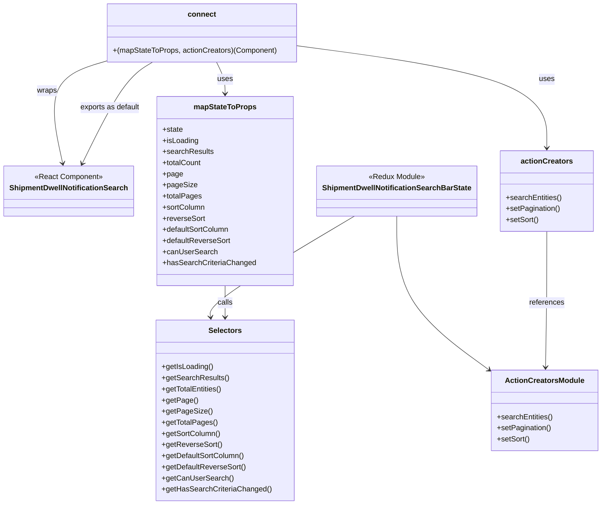

# Diagram: web/portal/src/pages/administration/admin-tools/shipment-dwell-notification/ShipmentDwellNotificationSearch.page.container.js

> Auto-generated by Obscura crawlers

## Mermaid

### SVG

<svg id="container" width="1264.115234375" xmlns="http://www.w3.org/2000/svg" class="classDiagram" height="1088" viewBox="0 0 1264.115234375 1088" role="graphics-document document" aria-roledescription="class"><g><defs><marker id="container_class-aggregationStart" class="marker aggregation class" refX="18" refY="7" markerWidth="190" markerHeight="240" orient="auto"><path d="M 18,7 L9,13 L1,7 L9,1 Z"></path></marker></defs><defs><marker id="container_class-aggregationEnd" class="marker aggregation class" refX="1" refY="7" markerWidth="20" markerHeight="28" orient="auto"><path d="M 18,7 L9,13 L1,7 L9,1 Z"></path></marker></defs><defs><marker id="container_class-extensionStart" class="marker extension class" refX="18" refY="7" markerWidth="190" markerHeight="240" orient="auto"><path d="M 1,7 L18,13 V 1 Z"></path></marker></defs><defs><marker id="container_class-extensionEnd" class="marker extension class" refX="1" refY="7" markerWidth="20" markerHeight="28" orient="auto"><path d="M 1,1 V 13 L18,7 Z"></path></marker></defs><defs><marker id="container_class-compositionStart" class="marker composition class" refX="18" refY="7" markerWidth="190" markerHeight="240" orient="auto"><path d="M 18,7 L9,13 L1,7 L9,1 Z"></path></marker></defs><defs><marker id="container_class-compositionEnd" class="marker composition class" refX="1" refY="7" markerWidth="20" markerHeight="28" orient="auto"><path d="M 18,7 L9,13 L1,7 L9,1 Z"></path></marker></defs><defs><marker id="container_class-dependencyStart" class="marker dependency class" refX="6" refY="7" markerWidth="190" markerHeight="240" orient="auto"><path d="M 5,7 L9,13 L1,7 L9,1 Z"></path></marker></defs><defs><marker id="container_class-dependencyEnd" class="marker dependency class" refX="13" refY="7" markerWidth="20" markerHeight="28" orient="auto"><path d="M 18,7 L9,13 L14,7 L9,1 Z"></path></marker></defs><defs><marker id="container_class-lollipopStart" class="marker lollipop class" refX="13" refY="7" markerWidth="190" markerHeight="240" orient="auto"><circle stroke="black" fill="transparent" cx="7" cy="7" r="6"></circle></marker></defs><defs><marker id="container_class-lollipopEnd" class="marker lollipop class" refX="1" refY="7" markerWidth="190" markerHeight="240" orient="auto"><circle stroke="black" fill="transparent" cx="7" cy="7" r="6"></circle></marker></defs><g class="root"><g class="clusters"></g><g class="edgePaths"><path d="M742.647,466L691.36,497.167C640.073,528.333,537.5,590.667,487.026,627.012C436.553,663.358,438.18,673.715,438.994,678.894L439.807,684.073" id="id_ShipmentDwellNotificationSearchBarState_Selectors_1" class="edge-thickness-normal edge-pattern-solid relation" style=";;;" data-edge="true" data-et="edge" data-id="id_ShipmentDwellNotificationSearchBarState_Selectors_1" data-points="W3sieCI6NzQyLjY0NzEwODQwMjQ4OTYsInkiOjQ2Nn0seyJ4Ijo0MzQuOTI1NzgxMjUsInkiOjY1M30seyJ4Ijo0NDAuNzM4MTgwMjI2MjkzMSwieSI6NjkwfV0=" marker-end="url(#container_class-dependencyEnd)"></path><path d="M831.508,466L831.508,497.167C831.508,528.333,831.508,590.667,863.903,645.93C896.298,701.194,961.089,749.387,993.484,773.484L1025.879,797.581" id="id_ShipmentDwellNotificationSearchBarState_ActionCreatorsModule_2" class="edge-thickness-normal edge-pattern-solid relation" style=";;;" data-edge="true" data-et="edge" data-id="id_ShipmentDwellNotificationSearchBarState_ActionCreatorsModule_2" data-points="W3sieCI6ODMxLjUwNzgxMjUsInkiOjQ2Nn0seyJ4Ijo4MzEuNTA3ODEyNSwieSI6NjUzfSx7IngiOjEwMzAuNjkzMzU5Mzc1LCJ5Ijo4MDEuMTYxNDg2ODcxNTIwN31d" marker-end="url(#container_class-dependencyEnd)"></path><path d="M471.371,616L471.371,622.167C471.371,628.333,471.371,640.667,471.371,652C471.371,663.333,471.371,673.667,471.371,678.833L471.371,684" id="id_mapStateToProps_Selectors_3" class="edge-thickness-normal edge-pattern-solid relation" style=";;;" data-edge="true" data-et="edge" data-id="id_mapStateToProps_Selectors_3" data-points="W3sieCI6NDcxLjM3MTA5Mzc1LCJ5Ijo2MTZ9LHsieCI6NDcxLjM3MTA5Mzc1LCJ5Ijo2NTN9LHsieCI6NDcxLjM3MTA5Mzc1LCJ5Ijo2OTB9XQ==" marker-end="url(#container_class-dependencyEnd)"></path><path d="M1147.41,499L1147.41,524.667C1147.41,550.333,1147.41,601.667,1147.01,650.5C1146.61,699.334,1145.81,745.667,1145.41,768.834L1145.01,792.001" id="id_actionCreators_ActionCreatorsModule_4" class="edge-thickness-normal edge-pattern-solid relation" style=";;;" data-edge="true" data-et="edge" data-id="id_actionCreators_ActionCreatorsModule_4" data-points="W3sieCI6MTE0Ny40MTAxNTYyNSwieSI6NDk5fSx7IngiOjExNDcuNDEwMTU2MjUsInkiOjY1M30seyJ4IjoxMTQ0LjkwNjQ5NDE0MDYyNSwieSI6Nzk4fV0=" marker-end="url(#container_class-dependencyEnd)"></path><path d="M452.513,134L455.656,140.167C458.799,146.333,465.085,158.667,468.228,170C471.371,181.333,471.371,191.667,471.371,196.833L471.371,202" id="id_connect_mapStateToProps_5" class="edge-thickness-normal edge-pattern-solid relation" style=";;;" data-edge="true" data-et="edge" data-id="id_connect_mapStateToProps_5" data-points="W3sieCI6NDUyLjUxMjY1NjI1LCJ5IjoxMzR9LHsieCI6NDcxLjM3MTA5Mzc1LCJ5IjoxNzF9LHsieCI6NDcxLjM3MTA5Mzc1LCJ5IjoyMDh9XQ==" marker-end="url(#container_class-dependencyEnd)"></path><path d="M623.32,98.911L710.669,110.926C798.017,122.941,972.714,146.97,1060.062,183.652C1147.41,220.333,1147.41,269.667,1147.41,294.333L1147.41,319" id="id_connect_actionCreators_6" class="edge-thickness-normal edge-pattern-solid relation" style=";;;" data-edge="true" data-et="edge" data-id="id_connect_actionCreators_6" data-points="W3sieCI6NjIzLjMyMDMxMjUsInkiOjk4LjkxMTM4NzY0NDEzMjA5fSx7IngiOjExNDcuNDEwMTU2MjUsInkiOjE3MX0seyJ4IjoxMTQ3LjQxMDE1NjI1LCJ5IjozMjV9XQ==" marker-end="url(#container_class-dependencyEnd)"></path><path d="M217.484,132.351L196.179,138.792C174.874,145.234,132.263,158.117,117.649,194.749C103.036,231.381,116.419,291.761,123.111,321.952L129.803,352.142" id="id_connect_ShipmentDwellNotificationSearch_7" class="edge-thickness-normal edge-pattern-solid relation" style=";;;" data-edge="true" data-et="edge" data-id="id_connect_ShipmentDwellNotificationSearch_7" data-points="W3sieCI6MjE3LjQ4NDM3NSwieSI6MTMyLjM1MDg1OTc4ODM1OTh9LHsieCI6ODkuNjUyMzQzNzUsInkiOjE3MX0seyJ4IjoxMzEuMTAxMTQxMDc4ODM4MTcsInkiOjM1OH1d" marker-end="url(#container_class-dependencyEnd)"></path><path d="M316.988,134L306.865,140.167C296.742,146.333,276.497,158.667,252.163,195.095C227.828,231.523,199.405,292.046,185.193,322.308L170.981,352.569" id="id_connect_ShipmentDwellNotificationSearch_8" class="edge-thickness-normal edge-pattern-solid relation" style=";;;" data-edge="true" data-et="edge" data-id="id_connect_ShipmentDwellNotificationSearch_8" data-points="W3sieCI6MzE2Ljk4NzU5NzY1NjI1LCJ5IjoxMzR9LHsieCI6MjU2LjI1MTk1MzEyNSwieSI6MTcxfSx7IngiOjE2OC40MzA1MTQxMzM4MTc0NCwieSI6MzU4fV0=" marker-end="url(#container_class-dependencyEnd)"></path></g><g class="edgeLabels"><g class="edgeLabel"><g class="label" data-id="id_ShipmentDwellNotificationSearchBarState_Selectors_1" transform="translate(0, 0)"><foreignObject width="0" height="0">

</foreignObject></g></g><g class="edgeLabel"><g class="label" data-id="id_ShipmentDwellNotificationSearchBarState_ActionCreatorsModule_2" transform="translate(0, 0)"><foreignObject width="0" height="0">

</foreignObject></g></g><g class="edgeLabel" transform="translate(471.37109375, 653)"><g class="label" data-id="id_mapStateToProps_Selectors_3" transform="translate(-16.4453125, -12)"><foreignObject width="32.890625" height="24">

calls

</foreignObject></g></g><g class="edgeLabel" transform="translate(1147.41015625, 653)"><g class="label" data-id="id_actionCreators_ActionCreatorsModule_4" transform="translate(-37.828125, -12)"><foreignObject width="75.65625" height="24">

references

</foreignObject></g></g><g class="edgeLabel" transform="translate(471.37109375, 171)"><g class="label" data-id="id_connect_mapStateToProps_5" transform="translate(-16.4921875, -12)"><foreignObject width="32.984375" height="24">

uses

</foreignObject></g></g><g class="edgeLabel" transform="translate(1147.41015625, 171)"><g class="label" data-id="id_connect_actionCreators_6" transform="translate(-16.4921875, -12)"><foreignObject width="32.984375" height="24">

uses

</foreignObject></g></g><g class="edgeLabel" transform="translate(95.92701, 199.30873)"><g class="label" data-id="id_connect_ShipmentDwellNotificationSearch_7" transform="translate(-21.390625, -12)"><foreignObject width="42.78125" height="24">

wraps

</foreignObject></g></g><g class="edgeLabel" transform="translate(256.251953125, 171)"><g class="label" data-id="id_connect_ShipmentDwellNotificationSearch_8" transform="translate(-65.4453125, -12)"><foreignObject width="130.890625" height="24">

exports as default

</foreignObject></g></g></g><g class="nodes"><g class="node default" id="classId-ShipmentDwellNotificationSearch-0" transform="translate(143.0703125, 412)"><g class="basic label-container"><path d="M-135.0703125 -54 L135.0703125 -54 L135.0703125 54 L-135.0703125 54" stroke="none" stroke-width="0" fill="#ECECFF" style=""></path><path d="M-135.0703125 -54 C-31.94766344009848 -54, 71.17498561980304 -54, 135.0703125 -54 M-135.0703125 -54 C-58.01825485063959 -54, 19.033802798720814 -54, 135.0703125 -54 M135.0703125 -54 C135.0703125 -12.688001129876795, 135.0703125 28.62399774024641, 135.0703125 54 M135.0703125 -54 C135.0703125 -27.710471917657216, 135.0703125 -1.4209438353144321, 135.0703125 54 M135.0703125 54 C32.402626380796605 54, -70.26505973840679 54, -135.0703125 54 M135.0703125 54 C41.46352537635268 54, -52.143261747294645 54, -135.0703125 54 M-135.0703125 54 C-135.0703125 26.554452018716038, -135.0703125 -0.891095962567924, -135.0703125 -54 M-135.0703125 54 C-135.0703125 28.712576989735695, -135.0703125 3.425153979471389, -135.0703125 -54" stroke="#9370DB" stroke-width="1.3" fill="none" stroke-dasharray="0 0" style=""></path></g><g class="annotation-group text" transform="translate(-73.2109375, -30)"><g class="label" style="" transform="translate(0,-12)"><foreignObject width="146.421875" height="24">

«React Component»

</foreignObject></g></g><g class="label-group text" transform="translate(-123.0703125, -6)"><g class="label" style="font-weight: bolder" transform="translate(0,-12)"><foreignObject width="246.140625" height="24">

ShipmentDwellNotificationSearch

</foreignObject></g></g><g class="members-group text" transform="translate(-123.0703125, 42)"></g><g class="methods-group text" transform="translate(-123.0703125, 72)"></g><g class="divider" style=""><path d="M-135.0703125 18 C-54.40103664005056 18, 26.268239219898874 18, 135.0703125 18 M-135.0703125 18 C-67.74096152224841 18, -0.4116105444968241 18, 135.0703125 18" stroke="#9370DB" stroke-width="1.3" fill="none" stroke-dasharray="0 0" style=""></path></g><g class="divider" style=""><path d="M-135.0703125 36 C-66.85795065660702 36, 1.354411186785967 36, 135.0703125 36 M-135.0703125 36 C-36.63883423126627 36, 61.792644037467454 36, 135.0703125 36" stroke="#9370DB" stroke-width="1.3" fill="none" stroke-dasharray="0 0" style=""></path></g></g><g class="node default" id="classId-mapStateToProps-1" transform="translate(471.37109375, 412)"><g class="basic label-container"><path d="M-143.23046875 -204 L143.23046875 -204 L143.23046875 204 L-143.23046875 204" stroke="none" stroke-width="0" fill="#ECECFF" style=""></path><path d="M-143.23046875 -204 C-44.9803761251668 -204, 53.2697164996664 -204, 143.23046875 -204 M-143.23046875 -204 C-59.17858902054954 -204, 24.873290708900925 -204, 143.23046875 -204 M143.23046875 -204 C143.23046875 -77.20976202707462, 143.23046875 49.580475945850765, 143.23046875 204 M143.23046875 -204 C143.23046875 -120.7386924021404, 143.23046875 -37.4773848042808, 143.23046875 204 M143.23046875 204 C69.82739807769467 204, -3.5756725946106656 204, -143.23046875 204 M143.23046875 204 C73.58008266689149 204, 3.9296965837829703 204, -143.23046875 204 M-143.23046875 204 C-143.23046875 68.1802573866841, -143.23046875 -67.63948522663179, -143.23046875 -204 M-143.23046875 204 C-143.23046875 61.02062652751644, -143.23046875 -81.95874694496712, -143.23046875 -204" stroke="#9370DB" stroke-width="1.3" fill="none" stroke-dasharray="0 0" style=""></path></g><g class="annotation-group text" transform="translate(0, -180)"></g><g class="label-group text" transform="translate(-64.7109375, -180)"><g class="label" style="font-weight: bolder" transform="translate(0,-12)"><foreignObject width="129.421875" height="24">

mapStateToProps

</foreignObject></g></g><g class="members-group text" transform="translate(-131.23046875, -132)"><g class="label" style="" transform="translate(0,-12)"><foreignObject width="44.09375" height="24">

+state

</foreignObject></g><g class="label" style="" transform="translate(0,12)"><foreignObject width="77.203125" height="24">

+isLoading

</foreignObject></g><g class="label" style="" transform="translate(0,36)"><foreignObject width="108.328125" height="24">

+searchResults

</foreignObject></g><g class="label" style="" transform="translate(0,60)"><foreignObject width="84.140625" height="24">

+totalCount

</foreignObject></g><g class="label" style="" transform="translate(0,84)"><foreignObject width="42.65625" height="24">

+page

</foreignObject></g><g class="label" style="" transform="translate(0,108)"><foreignObject width="71.5" height="24">

+pageSize

</foreignObject></g><g class="label" style="" transform="translate(0,132)"><foreignObject width="82.90625" height="24">

+totalPages

</foreignObject></g><g class="label" style="" transform="translate(0,156)"><foreignObject width="91.828125" height="24">

+sortColumn

</foreignObject></g><g class="label" style="" transform="translate(0,180)"><foreignObject width="91.015625" height="24">

+reverseSort

</foreignObject></g><g class="label" style="" transform="translate(0,204)"><foreignObject width="144.859375" height="24">

+defaultSortColumn

</foreignObject></g><g class="label" style="" transform="translate(0,228)"><foreignObject width="146.53125" height="24">

+defaultReverseSort

</foreignObject></g><g class="label" style="" transform="translate(0,252)"><foreignObject width="115.140625" height="24">

+canUserSearch

</foreignObject></g><g class="label" style="" transform="translate(0,276)"><foreignObject width="197.75" height="24">

+hasSearchCriteriaChanged

</foreignObject></g></g><g class="methods-group text" transform="translate(-131.23046875, 204)"></g><g class="divider" style=""><path d="M-143.23046875 -156 C-49.96223364579539 -156, 43.30600145840921 -156, 143.23046875 -156 M-143.23046875 -156 C-29.169951841803865 -156, 84.89056506639227 -156, 143.23046875 -156" stroke="#9370DB" stroke-width="1.3" fill="none" stroke-dasharray="0 0" style=""></path></g><g class="divider" style=""><path d="M-143.23046875 180 C-45.273288636655536 180, 52.68389147668893 180, 143.23046875 180 M-143.23046875 180 C-57.7772035545852 180, 27.6760616408296 180, 143.23046875 180" stroke="#9370DB" stroke-width="1.3" fill="none" stroke-dasharray="0 0" style=""></path></g></g><g class="node default" id="classId-actionCreators-2" transform="translate(1147.41015625, 412)"><g class="basic label-container"><path d="M-98.99609375 -87 L98.99609375 -87 L98.99609375 87 L-98.99609375 87" stroke="none" stroke-width="0" fill="#ECECFF" style=""></path><path d="M-98.99609375 -87 C-42.20922865946944 -87, 14.577636431061123 -87, 98.99609375 -87 M-98.99609375 -87 C-35.04569234580109 -87, 28.904709058397813 -87, 98.99609375 -87 M98.99609375 -87 C98.99609375 -37.222156911724, 98.99609375 12.555686176552001, 98.99609375 87 M98.99609375 -87 C98.99609375 -27.97233058483966, 98.99609375 31.05533883032068, 98.99609375 87 M98.99609375 87 C24.994431926757755 87, -49.00722989648449 87, -98.99609375 87 M98.99609375 87 C19.87108205797577 87, -59.25392963404846 87, -98.99609375 87 M-98.99609375 87 C-98.99609375 28.03721276197853, -98.99609375 -30.92557447604294, -98.99609375 -87 M-98.99609375 87 C-98.99609375 17.78321299712715, -98.99609375 -51.4335740057457, -98.99609375 -87" stroke="#9370DB" stroke-width="1.3" fill="none" stroke-dasharray="0 0" style=""></path></g><g class="annotation-group text" transform="translate(0, -63)"></g><g class="label-group text" transform="translate(-53.6328125, -63)"><g class="label" style="font-weight: bolder" transform="translate(0,-12)"><foreignObject width="107.265625" height="24">

actionCreators

</foreignObject></g></g><g class="members-group text" transform="translate(-86.99609375, -15)"></g><g class="methods-group text" transform="translate(-86.99609375, 15)"><g class="label" style="" transform="translate(0,-12)"><foreignObject width="120.359375" height="24">

+searchEntities()

</foreignObject></g><g class="label" style="" transform="translate(0,12)"><foreignObject width="117.203125" height="24">

+setPagination()

</foreignObject></g><g class="label" style="" transform="translate(0,36)"><foreignObject width="70.34375" height="24">

+setSort()

</foreignObject></g></g><g class="divider" style=""><path d="M-98.99609375 -39 C-38.33481870200196 -39, 22.32645634599608 -39, 98.99609375 -39 M-98.99609375 -39 C-39.47830938542864 -39, 20.039474979142724 -39, 98.99609375 -39" stroke="#9370DB" stroke-width="1.3" fill="none" stroke-dasharray="0 0" style=""></path></g><g class="divider" style=""><path d="M-98.99609375 -15 C-22.468796370081066 -15, 54.05850100983787 -15, 98.99609375 -15 M-98.99609375 -15 C-56.88151802473499 -15, -14.766942299469974 -15, 98.99609375 -15" stroke="#9370DB" stroke-width="1.3" fill="none" stroke-dasharray="0 0" style=""></path></g></g><g class="node default" id="classId-ShipmentDwellNotificationSearchBarState-3" transform="translate(831.5078125, 412)"><g class="basic label-container"><path d="M-166.90625 -54 L166.90625 -54 L166.90625 54 L-166.90625 54" stroke="none" stroke-width="0" fill="#ECECFF" style=""></path><path d="M-166.90625 -54 C-68.57451582170465 -54, 29.7572183565907 -54, 166.90625 -54 M-166.90625 -54 C-44.389903616701275 -54, 78.12644276659745 -54, 166.90625 -54 M166.90625 -54 C166.90625 -12.114321326929854, 166.90625 29.77135734614029, 166.90625 54 M166.90625 -54 C166.90625 -16.85688605255062, 166.90625 20.286227894898758, 166.90625 54 M166.90625 54 C64.40704856368804 54, -38.09215287262393 54, -166.90625 54 M166.90625 54 C40.68136020985959 54, -85.54352958028082 54, -166.90625 54 M-166.90625 54 C-166.90625 25.011930513370405, -166.90625 -3.9761389732591894, -166.90625 -54 M-166.90625 54 C-166.90625 25.646176164960963, -166.90625 -2.7076476700780745, -166.90625 -54" stroke="#9370DB" stroke-width="1.3" fill="none" stroke-dasharray="0 0" style=""></path></g><g class="annotation-group text" transform="translate(-60.4921875, -30)"><g class="label" style="" transform="translate(0,-12)"><foreignObject width="120.984375" height="24">

«Redux Module»

</foreignObject></g></g><g class="label-group text" transform="translate(-154.90625, -6)"><g class="label" style="font-weight: bolder" transform="translate(0,-12)"><foreignObject width="309.8125" height="24">

ShipmentDwellNotificationSearchBarState

</foreignObject></g></g><g class="members-group text" transform="translate(-154.90625, 42)"></g><g class="methods-group text" transform="translate(-154.90625, 72)"></g><g class="divider" style=""><path d="M-166.90625 18 C-77.39766745028219 18, 12.11091509943563 18, 166.90625 18 M-166.90625 18 C-70.68412929271875 18, 25.537991414562498 18, 166.90625 18" stroke="#9370DB" stroke-width="1.3" fill="none" stroke-dasharray="0 0" style=""></path></g><g class="divider" style=""><path d="M-166.90625 36 C-45.700017573142716 36, 75.50621485371457 36, 166.90625 36 M-166.90625 36 C-88.93407882630818 36, -10.961907652616361 36, 166.90625 36" stroke="#9370DB" stroke-width="1.3" fill="none" stroke-dasharray="0 0" style=""></path></g></g><g class="node default" id="classId-Selectors-4" transform="translate(471.37109375, 885)"><g class="basic label-container"><path d="M-145.1796875 -195 L145.1796875 -195 L145.1796875 195 L-145.1796875 195" stroke="none" stroke-width="0" fill="#ECECFF" style=""></path><path d="M-145.1796875 -195 C-78.41759049833486 -195, -11.65549349666972 -195, 145.1796875 -195 M-145.1796875 -195 C-40.52523421450073 -195, 64.12921907099854 -195, 145.1796875 -195 M145.1796875 -195 C145.1796875 -64.32127899015842, 145.1796875 66.35744201968316, 145.1796875 195 M145.1796875 -195 C145.1796875 -79.96199923970174, 145.1796875 35.07600152059652, 145.1796875 195 M145.1796875 195 C46.847592529706674 195, -51.48450244058665 195, -145.1796875 195 M145.1796875 195 C41.41971361044749 195, -62.340260279105024 195, -145.1796875 195 M-145.1796875 195 C-145.1796875 52.26768287394415, -145.1796875 -90.4646342521117, -145.1796875 -195 M-145.1796875 195 C-145.1796875 50.194480614674205, -145.1796875 -94.61103877065159, -145.1796875 -195" stroke="#9370DB" stroke-width="1.3" fill="none" stroke-dasharray="0 0" style=""></path></g><g class="annotation-group text" transform="translate(0, -171)"></g><g class="label-group text" transform="translate(-34.171875, -171)"><g class="label" style="font-weight: bolder" transform="translate(0,-12)"><foreignObject width="68.34375" height="24">

Selectors

</foreignObject></g></g><g class="members-group text" transform="translate(-133.1796875, -123)"></g><g class="methods-group text" transform="translate(-133.1796875, -93)"><g class="label" style="" transform="translate(0,-12)"><foreignObject width="110.34375" height="24">

+getIsLoading()

</foreignObject></g><g class="label" style="" transform="translate(0,12)"><foreignObject width="142.5" height="24">

+getSearchResults()

</foreignObject></g><g class="label" style="" transform="translate(0,36)"><foreignObject width="131.09375" height="24">

+getTotalEntities()

</foreignObject></g><g class="label" style="" transform="translate(0,60)"><foreignObject width="74.65625" height="24">

+getPage()

</foreignObject></g><g class="label" style="" transform="translate(0,84)"><foreignObject width="103.5" height="24">

+getPageSize()

</foreignObject></g><g class="label" style="" transform="translate(0,108)"><foreignObject width="117.765625" height="24">

+getTotalPages()

</foreignObject></g><g class="label" style="" transform="translate(0,132)"><foreignObject width="126.015625" height="24">

+getSortColumn()

</foreignObject></g><g class="label" style="" transform="translate(0,156)"><foreignObject width="127.6875" height="24">

+getReverseSort()

</foreignObject></g><g class="label" style="" transform="translate(0,180)"><foreignObject width="178.515625" height="24">

+getDefaultSortColumn()

</foreignObject></g><g class="label" style="" transform="translate(0,204)"><foreignObject width="180.203125" height="24">

+getDefaultReverseSort()

</foreignObject></g><g class="label" style="" transform="translate(0,228)"><foreignObject width="149.390625" height="24">

+getCanUserSearch()

</foreignObject></g><g class="label" style="" transform="translate(0,252)"><foreignObject width="232.1875" height="24">

+getHasSearchCriteriaChanged()

</foreignObject></g></g><g class="divider" style=""><path d="M-145.1796875 -147 C-31.16301593052289 -147, 82.85365563895422 -147, 145.1796875 -147 M-145.1796875 -147 C-47.21940531048217 -147, 50.74087687903565 -147, 145.1796875 -147" stroke="#9370DB" stroke-width="1.3" fill="none" stroke-dasharray="0 0" style=""></path></g><g class="divider" style=""><path d="M-145.1796875 -123 C-82.51483248466072 -123, -19.84997746932143 -123, 145.1796875 -123 M-145.1796875 -123 C-46.06104369989936 -123, 53.057600100201284 -123, 145.1796875 -123" stroke="#9370DB" stroke-width="1.3" fill="none" stroke-dasharray="0 0" style=""></path></g></g><g class="node default" id="classId-ActionCreatorsModule-5" transform="translate(1143.404296875, 885)"><g class="basic label-container"><path d="M-112.7109375 -87 L112.7109375 -87 L112.7109375 87 L-112.7109375 87" stroke="none" stroke-width="0" fill="#ECECFF" style=""></path><path d="M-112.7109375 -87 C-28.27098879284935 -87, 56.1689599143013 -87, 112.7109375 -87 M-112.7109375 -87 C-36.198733073565194 -87, 40.31347135286961 -87, 112.7109375 -87 M112.7109375 -87 C112.7109375 -23.280994184493693, 112.7109375 40.438011631012614, 112.7109375 87 M112.7109375 -87 C112.7109375 -19.23631183026839, 112.7109375 48.52737633946322, 112.7109375 87 M112.7109375 87 C43.54187128704349 87, -25.627194925913017 87, -112.7109375 87 M112.7109375 87 C59.428632938853774 87, 6.1463283777075475 87, -112.7109375 87 M-112.7109375 87 C-112.7109375 39.84802398012013, -112.7109375 -7.303952039759736, -112.7109375 -87 M-112.7109375 87 C-112.7109375 33.368292499979724, -112.7109375 -20.263415000040553, -112.7109375 -87" stroke="#9370DB" stroke-width="1.3" fill="none" stroke-dasharray="0 0" style=""></path></g><g class="annotation-group text" transform="translate(0, -63)"></g><g class="label-group text" transform="translate(-81.0625, -63)"><g class="label" style="font-weight: bolder" transform="translate(0,-12)"><foreignObject width="162.125" height="24">

ActionCreatorsModule

</foreignObject></g></g><g class="members-group text" transform="translate(-100.7109375, -15)"></g><g class="methods-group text" transform="translate(-100.7109375, 15)"><g class="label" style="" transform="translate(0,-12)"><foreignObject width="120.359375" height="24">

+searchEntities()

</foreignObject></g><g class="label" style="" transform="translate(0,12)"><foreignObject width="117.203125" height="24">

+setPagination()

</foreignObject></g><g class="label" style="" transform="translate(0,36)"><foreignObject width="70.34375" height="24">

+setSort()

</foreignObject></g></g><g class="divider" style=""><path d="M-112.7109375 -39 C-60.10547186450469 -39, -7.5000062290093865 -39, 112.7109375 -39 M-112.7109375 -39 C-64.09843060202465 -39, -15.485923704049284 -39, 112.7109375 -39" stroke="#9370DB" stroke-width="1.3" fill="none" stroke-dasharray="0 0" style=""></path></g><g class="divider" style=""><path d="M-112.7109375 -15 C-56.05197097600659 -15, 0.606995547986827 -15, 112.7109375 -15 M-112.7109375 -15 C-54.07202333683749 -15, 4.566890826325022 -15, 112.7109375 -15" stroke="#9370DB" stroke-width="1.3" fill="none" stroke-dasharray="0 0" style=""></path></g></g><g class="node default" id="classId-connect-6" transform="translate(420.40234375, 71)"><g class="basic label-container"><path d="M-202.91796875 -63 L202.91796875 -63 L202.91796875 63 L-202.91796875 63" stroke="none" stroke-width="0" fill="#ECECFF" style=""></path><path d="M-202.91796875 -63 C-55.78910426810549 -63, 91.33976021378902 -63, 202.91796875 -63 M-202.91796875 -63 C-110.85464744693955 -63, -18.791326143879104 -63, 202.91796875 -63 M202.91796875 -63 C202.91796875 -33.342107120662746, 202.91796875 -3.684214241325485, 202.91796875 63 M202.91796875 -63 C202.91796875 -36.19082051296438, 202.91796875 -9.38164102592875, 202.91796875 63 M202.91796875 63 C50.96318128382825 63, -100.9916061823435 63, -202.91796875 63 M202.91796875 63 C111.84478429925277 63, 20.77159984850553 63, -202.91796875 63 M-202.91796875 63 C-202.91796875 26.921929789420567, -202.91796875 -9.156140421158867, -202.91796875 -63 M-202.91796875 63 C-202.91796875 27.173467818271362, -202.91796875 -8.653064363457275, -202.91796875 -63" stroke="#9370DB" stroke-width="1.3" fill="none" stroke-dasharray="0 0" style=""></path></g><g class="annotation-group text" transform="translate(0, -39)"></g><g class="label-group text" transform="translate(-28.9140625, -39)"><g class="label" style="font-weight: bolder" transform="translate(0,-12)"><foreignObject width="57.828125" height="24">

connect

</foreignObject></g></g><g class="members-group text" transform="translate(-190.91796875, 9)"></g><g class="methods-group text" transform="translate(-190.91796875, 39)"><g class="label" style="" transform="translate(0,-12)"><foreignObject width="352.921875" height="24">

+(mapStateToProps, actionCreators)(Component)

</foreignObject></g></g><g class="divider" style=""><path d="M-202.91796875 -15 C-91.21374379523739 -15, 20.490481159525217 -15, 202.91796875 -15 M-202.91796875 -15 C-104.05817543870899 -15, -5.198382127417972 -15, 202.91796875 -15" stroke="#9370DB" stroke-width="1.3" fill="none" stroke-dasharray="0 0" style=""></path></g><g class="divider" style=""><path d="M-202.91796875 9 C-69.52473103850838 9, 63.868506672983244 9, 202.91796875 9 M-202.91796875 9 C-65.7429729299607 9, 71.4320228900786 9, 202.91796875 9" stroke="#9370DB" stroke-width="1.3" fill="none" stroke-dasharray="0 0" style=""></path></g></g></g></g></g></svg>
