# Diagram: web/portal/src/pages/administration/admin-tools/shipment-dwell-notification/ShipmentDwellNotificationSearch.page.js

> Auto-generated by Obscura crawlers

## Mermaid

```mermaid
classDiagram
class ShipmentDwellNotificationSearch {
  +props
  +state: modal
  +useEffect: searchEntities()
  +callbacks: closeModal(), onPageChange(), onPageSizeChange(), onPageSort()
}
class ShipmentDwellModalMode {
  <<enumeration>>
  CREATE
  UPDATE
  DELETE
}
class useSetTitleOnMount
class useSetDescriptionOnMount
class useTrackWithMixpanelOnce
class useShipmentDwellNotificationSearchColumns
class SearchFiltersContainer
class BaseTable
class ShipmentDwellNotificationEditModalContainer
class ShipmentDwellNotificationDeleteModalContainer
class Button
class Icon
class Text
class MediaQueries
class Colors

ShipmentDwellNotificationSearch ..> useSetTitleOnMount : calls
ShipmentDwellNotificationSearch ..> useSetDescriptionOnMount : calls
ShipmentDwellNotificationSearch ..> useTrackWithMixpanelOnce : calls
ShipmentDwellNotificationSearch ..> useShipmentDwellNotificationSearchColumns : obtains columns
ShipmentDwellNotificationSearch --> SearchFiltersContainer : renders
ShipmentDwellNotificationSearch --> Button : renders (Search, Add)
ShipmentDwellNotificationSearch --> Icon : uses in Add button
ShipmentDwellNotificationSearch --> Text : displays counts/labels
ShipmentDwellNotificationSearch --> BaseTable : renders with pagination & sorting
ShipmentDwellNotificationSearch --> ShipmentDwellNotificationEditModalContainer : controls show/hide
ShipmentDwellNotificationSearch --> ShipmentDwellNotificationDeleteModalContainer : controls show/hide
ShipmentDwellNotificationSearch ..> MediaQueries : uses for responsive styles
ShipmentDwellNotificationSearch ..> Colors : uses for backgroundColor
ShipmentDwellNotificationSearch ..> ShipmentDwellModalMode : sets modal.mode

BaseTable --> ShipmentDwellNotificationSearch : calls callbacks (onPageChange,onPageSizeChange,onPageSort)
ShipmentDwellNotificationEditModalContainer ..|> ShipmentDwellModalMode : receives mode
ShipmentDwellNotificationDeleteModalContainer ..|> ShipmentDwellModalMode : receives mode
```

### SVG

<svg id="container" width="3700.76171875" xmlns="http://www.w3.org/2000/svg" class="classDiagram" height="656" viewBox="0 0 3700.76171875 656" role="graphics-document document" aria-roledescription="class"><g><defs><marker id="container_class-aggregationStart" class="marker aggregation class" refX="18" refY="7" markerWidth="190" markerHeight="240" orient="auto"><path d="M 18,7 L9,13 L1,7 L9,1 Z"></path></marker></defs><defs><marker id="container_class-aggregationEnd" class="marker aggregation class" refX="1" refY="7" markerWidth="20" markerHeight="28" orient="auto"><path d="M 18,7 L9,13 L1,7 L9,1 Z"></path></marker></defs><defs><marker id="container_class-extensionStart" class="marker extension class" refX="18" refY="7" markerWidth="190" markerHeight="240" orient="auto"><path d="M 1,7 L18,13 V 1 Z"></path></marker></defs><defs><marker id="container_class-extensionEnd" class="marker extension class" refX="1" refY="7" markerWidth="20" markerHeight="28" orient="auto"><path d="M 1,1 V 13 L18,7 Z"></path></marker></defs><defs><marker id="container_class-compositionStart" class="marker composition class" refX="18" refY="7" markerWidth="190" markerHeight="240" orient="auto"><path d="M 18,7 L9,13 L1,7 L9,1 Z"></path></marker></defs><defs><marker id="container_class-compositionEnd" class="marker composition class" refX="1" refY="7" markerWidth="20" markerHeight="28" orient="auto"><path d="M 18,7 L9,13 L1,7 L9,1 Z"></path></marker></defs><defs><marker id="container_class-dependencyStart" class="marker dependency class" refX="6" refY="7" markerWidth="190" markerHeight="240" orient="auto"><path d="M 5,7 L9,13 L1,7 L9,1 Z"></path></marker></defs><defs><marker id="container_class-dependencyEnd" class="marker dependency class" refX="13" refY="7" markerWidth="20" markerHeight="28" orient="auto"><path d="M 18,7 L9,13 L14,7 L9,1 Z"></path></marker></defs><defs><marker id="container_class-lollipopStart" class="marker lollipop class" refX="13" refY="7" markerWidth="190" markerHeight="240" orient="auto"><circle stroke="black" fill="transparent" cx="7" cy="7" r="6"></circle></marker></defs><defs><marker id="container_class-lollipopEnd" class="marker lollipop class" refX="1" refY="7" markerWidth="190" markerHeight="240" orient="auto"><circle stroke="black" fill="transparent" cx="7" cy="7" r="6"></circle></marker></defs><g class="root"><g class="clusters"></g><g class="edgePaths"><path d="M1585.555,131.576L1337.072,151.146C1088.589,170.717,591.622,209.859,343.139,236.596C94.656,263.333,94.656,277.667,94.656,284.833L94.656,292" id="id_ShipmentDwellNotificationSearch_useSetTitleOnMount_1" class="edge-thickness-normal edge-pattern-dashed relation" style=";;;" data-edge="true" data-et="edge" data-id="id_ShipmentDwellNotificationSearch_useSetTitleOnMount_1" data-points="W3sieCI6MTU4NS41NTQ2ODc1LCJ5IjoxMzEuNTc1Nzg0OTAxNzkzMTN9LHsieCI6OTQuNjU2MjUsInkiOjI0OX0seyJ4Ijo5NC42NTYyNSwieSI6Mjk4fV0=" marker-end="url(#container_class-dependencyEnd)"></path><path d="M1585.555,135.892L1378.6,154.744C1171.646,173.595,757.737,211.297,550.783,237.315C343.828,263.333,343.828,277.667,343.828,284.833L343.828,292" id="id_ShipmentDwellNotificationSearch_useSetDescriptionOnMount_2" class="edge-thickness-normal edge-pattern-dashed relation" style=";;;" data-edge="true" data-et="edge" data-id="id_ShipmentDwellNotificationSearch_useSetDescriptionOnMount_2" data-points="W3sieCI6MTU4NS41NTQ2ODc1LCJ5IjoxMzUuODkyMjIxODQzMjI5NTV9LHsieCI6MzQzLjgyODEyNSwieSI6MjQ5fSx7IngiOjM0My44MjgxMjUsInkiOjI5OH1d" marker-end="url(#container_class-dependencyEnd)"></path><path d="M1585.555,142.556L1424.452,160.296C1263.349,178.037,941.143,213.519,780.04,238.426C618.938,263.333,618.938,277.667,618.938,284.833L618.938,292" id="id_ShipmentDwellNotificationSearch_useTrackWithMixpanelOnce_3" class="edge-thickness-normal edge-pattern-dashed relation" style=";;;" data-edge="true" data-et="edge" data-id="id_ShipmentDwellNotificationSearch_useTrackWithMixpanelOnce_3" data-points="W3sieCI6MTU4NS41NTQ2ODc1LCJ5IjoxNDIuNTU1NTQyMzcwNjE4N30seyJ4Ijo2MTguOTM3NSwieSI6MjQ5fSx7IngiOjYxOC45Mzc1LCJ5IjoyOTh9XQ==" marker-end="url(#container_class-dependencyEnd)"></path><path d="M1585.555,156.074L1481.422,171.561C1377.289,187.049,1169.023,218.025,1064.891,240.679C960.758,263.333,960.758,277.667,960.758,284.833L960.758,292" id="id_ShipmentDwellNotificationSearch_useShipmentDwellNotificationSearchColumns_4" class="edge-thickness-normal edge-pattern-dashed relation" style=";;;" data-edge="true" data-et="edge" data-id="id_ShipmentDwellNotificationSearch_useShipmentDwellNotificationSearchColumns_4" data-points="W3sieCI6MTU4NS41NTQ2ODc1LCJ5IjoxNTYuMDczNjcyMDYzNzU1Mzd9LHsieCI6OTYwLjc1NzgxMjUsInkiOjI0OX0seyJ4Ijo5NjAuNzU3ODEyNSwieSI6Mjk4fV0=" marker-end="url(#container_class-dependencyEnd)"></path><path d="M1585.555,182.014L1535.451,193.179C1485.346,204.343,1385.138,226.671,1335.034,245.002C1284.93,263.333,1284.93,277.667,1284.93,284.833L1284.93,292" id="id_ShipmentDwellNotificationSearch_SearchFiltersContainer_5" class="edge-thickness-normal edge-pattern-solid relation" style=";;;" data-edge="true" data-et="edge" data-id="id_ShipmentDwellNotificationSearch_SearchFiltersContainer_5" data-points="W3sieCI6MTU4NS41NTQ2ODc1LCJ5IjoxODIuMDE0Mzg4NTMyMzkzN30seyJ4IjoxMjg0LjkyOTY4NzUsInkiOjI0OX0seyJ4IjoxMjg0LjkyOTY4NzUsInkiOjI5OH1d" marker-end="url(#container_class-dependencyEnd)"></path><path d="M2285.797,196.404L2319.011,205.17C2352.225,213.936,2418.654,231.468,2451.868,247.401C2485.082,263.333,2485.082,277.667,2485.082,284.833L2485.082,292" id="id_ShipmentDwellNotificationSearch_Button_6" class="edge-thickness-normal edge-pattern-solid relation" style=";;;" data-edge="true" data-et="edge" data-id="id_ShipmentDwellNotificationSearch_Button_6" data-points="W3sieCI6MjI4NS43OTY4NzUsInkiOjE5Ni40MDQ0MDY3NDU5MTg5fSx7IngiOjI0ODUuMDgyMDMxMjUsInkiOjI0OX0seyJ4IjoyNDg1LjA4MjAzMTI1LCJ5IjoyOTh9XQ==" marker-end="url(#container_class-dependencyEnd)"></path><path d="M2285.797,174.966L2346.673,187.305C2407.548,199.644,2529.299,224.322,2590.175,243.828C2651.051,263.333,2651.051,277.667,2651.051,284.833L2651.051,292" id="id_ShipmentDwellNotificationSearch_Icon_7" class="edge-thickness-normal edge-pattern-solid relation" style=";;;" data-edge="true" data-et="edge" data-id="id_ShipmentDwellNotificationSearch_Icon_7" data-points="W3sieCI6MjI4NS43OTY4NzUsInkiOjE3NC45NjYzNTgzMzQ3ODk0NX0seyJ4IjoyNjUxLjA1MDc4MTI1LCJ5IjoyNDl9LHsieCI6MjY1MS4wNTA3ODEyNSwieSI6Mjk4fV0=" marker-end="url(#container_class-dependencyEnd)"></path><path d="M2285.797,161.308L2375.088,175.924C2464.379,190.539,2642.961,219.769,2732.252,241.551C2821.543,263.333,2821.543,277.667,2821.543,284.833L2821.543,292" id="id_ShipmentDwellNotificationSearch_Text_8" class="edge-thickness-normal edge-pattern-solid relation" style=";;;" data-edge="true" data-et="edge" data-id="id_ShipmentDwellNotificationSearch_Text_8" data-points="W3sieCI6MjI4NS43OTY4NzUsInkiOjE2MS4zMDgzMTgxMjA0ODU3NX0seyJ4IjoyODIxLjU0Mjk2ODc1LCJ5IjoyNDl9LHsieCI6MjgyMS41NDI5Njg3NSwieSI6Mjk4fV0=" marker-end="url(#container_class-dependencyEnd)"></path><path d="M1618.069,200L1591.05,208.167C1564.032,216.333,1509.994,232.667,1498.057,250.303C1486.12,267.939,1516.283,286.878,1531.364,296.348L1546.446,305.817" id="id_ShipmentDwellNotificationSearch_BaseTable_9" class="edge-thickness-normal edge-pattern-solid relation" style=";;;" data-edge="true" data-et="edge" data-id="id_ShipmentDwellNotificationSearch_BaseTable_9" data-points="W3sieCI6MTYxOC4wNjg4ODQ2OTgyNzU3LCJ5IjoyMDB9LHsieCI6MTQ1NS45NTcwMzEyNSwieSI6MjQ5fSx7IngiOjE1NTEuNTI3MzQzNzUsInkiOjMwOS4wMDc3MDg0NzkzMjczfV0=" marker-end="url(#container_class-dependencyEnd)"></path><path d="M2121.045,200L2136.814,208.167C2152.583,216.333,2184.122,232.667,2199.891,248C2215.66,263.333,2215.66,277.667,2215.66,284.833L2215.66,292" id="id_ShipmentDwellNotificationSearch_ShipmentDwellNotificationEditModalContainer_10" class="edge-thickness-normal edge-pattern-solid relation" style=";;;" data-edge="true" data-et="edge" data-id="id_ShipmentDwellNotificationSearch_ShipmentDwellNotificationEditModalContainer_10" data-points="W3sieCI6MjEyMS4wNDQ3NDY3NjcyNDE2LCJ5IjoyMDB9LHsieCI6MjIxNS42NjAxNTYyNSwieSI6MjQ5fSx7IngiOjIyMTUuNjYwMTU2MjUsInkiOjI5OH1d" marker-end="url(#container_class-dependencyEnd)"></path><path d="M2285.797,136.44L2488.269,155.2C2690.741,173.96,3095.685,211.48,3298.157,237.407C3500.629,263.333,3500.629,277.667,3500.629,284.833L3500.629,292" id="id_ShipmentDwellNotificationSearch_ShipmentDwellNotificationDeleteModalContainer_11" class="edge-thickness-normal edge-pattern-solid relation" style=";;;" data-edge="true" data-et="edge" data-id="id_ShipmentDwellNotificationSearch_ShipmentDwellNotificationDeleteModalContainer_11" data-points="W3sieCI6MjI4NS43OTY4NzUsInkiOjEzNi40NDAzMDYyMTkyMzU4fSx7IngiOjM1MDAuNjI4OTA2MjUsInkiOjI0OX0seyJ4IjozNTAwLjYyODkwNjI1LCJ5IjoyOTh9XQ==" marker-end="url(#container_class-dependencyEnd)"></path><path d="M2285.797,150.945L2407.682,167.287C2529.566,183.63,2773.336,216.315,2895.221,239.824C3017.105,263.333,3017.105,277.667,3017.105,284.833L3017.105,292" id="id_ShipmentDwellNotificationSearch_MediaQueries_12" class="edge-thickness-normal edge-pattern-dashed relation" style=";;;" data-edge="true" data-et="edge" data-id="id_ShipmentDwellNotificationSearch_MediaQueries_12" data-points="W3sieCI6MjI4NS43OTY4NzUsInkiOjE1MC45NDQ4NTM4MTc2NDU5fSx7IngiOjMwMTcuMTA1NDY4NzUsInkiOjI0OX0seyJ4IjozMDE3LjEwNTQ2ODc1LCJ5IjoyOTh9XQ==" marker-end="url(#container_class-dependencyEnd)"></path><path d="M2285.797,143.424L2442.063,161.02C2598.329,178.616,2910.862,213.808,3067.128,238.571C3223.395,263.333,3223.395,277.667,3223.395,284.833L3223.395,292" id="id_ShipmentDwellNotificationSearch_Colors_13" class="edge-thickness-normal edge-pattern-dashed relation" style=";;;" data-edge="true" data-et="edge" data-id="id_ShipmentDwellNotificationSearch_Colors_13" data-points="W3sieCI6MjI4NS43OTY4NzUsInkiOjE0My40MjQ0MTUxNDc5MTE3Nn0seyJ4IjozMjIzLjM5NDUzMTI1LCJ5IjoyNDl9LHsieCI6MzIyMy4zOTQ1MzEyNSwieSI6Mjk4fV0=" marker-end="url(#container_class-dependencyEnd)"></path><path d="M1935.676,200L1935.676,208.167C1935.676,216.333,1935.676,232.667,1935.676,256C1935.676,279.333,1935.676,309.667,1935.676,338C1935.676,366.333,1935.676,392.667,1963.088,418.855C1990.499,445.043,2045.323,471.085,2072.735,484.107L2100.147,497.128" id="id_ShipmentDwellNotificationSearch_ShipmentDwellModalMode_14" class="edge-thickness-normal edge-pattern-dashed relation" style=";;;" data-edge="true" data-et="edge" data-id="id_ShipmentDwellNotificationSearch_ShipmentDwellModalMode_14" data-points="W3sieCI6MTkzNS42NzU3ODEyNSwieSI6MjAwfSx7IngiOjE5MzUuNjc1NzgxMjUsInkiOjI0OX0seyJ4IjoxOTM1LjY3NTc4MTI1LCJ5IjozNDB9LHsieCI6MTkzNS42NzU3ODEyNSwieSI6NDE5fSx7IngiOjIxMDUuNTY2NDA2MjUsInkiOjQ5OS43MDI1NTAzNjU1MzM4fV0=" marker-end="url(#container_class-dependencyEnd)"></path><path d="M1650.246,309.008L1666.174,299.006C1682.103,289.005,1713.96,269.003,1739.787,251.442C1765.613,233.881,1785.41,218.761,1795.309,211.201L1805.207,203.642" id="id_BaseTable_ShipmentDwellNotificationSearch_15" class="edge-thickness-normal edge-pattern-solid relation" style=";;;" data-edge="true" data-et="edge" data-id="id_BaseTable_ShipmentDwellNotificationSearch_15" data-points="W3sieCI6MTY1MC4yNDYwOTM3NSwieSI6MzA5LjAwNzcwODQ3OTMyNzN9LHsieCI6MTc0NS44MTY0MDYyNSwieSI6MjQ5fSx7IngiOjE4MDkuOTc1NzgxMjUsInkiOjIwMH1d" marker-end="url(#container_class-dependencyEnd)"></path><path d="M2215.66,382L2215.66,388.167C2215.66,394.333,2215.66,406.667,2215.66,416.125C2215.66,425.583,2215.66,432.167,2215.66,435.458L2215.66,438.75" id="id_ShipmentDwellNotificationEditModalContainer_ShipmentDwellModalMode_16" class="edge-thickness-normal edge-pattern-dashed relation" style=";;;" data-edge="true" data-et="edge" data-id="id_ShipmentDwellNotificationEditModalContainer_ShipmentDwellModalMode_16" data-points="W3sieCI6MjIxNS42NjAxNTYyNSwieSI6MzgyfSx7IngiOjIyMTUuNjYwMTU2MjUsInkiOjQxOX0seyJ4IjoyMjE1LjY2MDE1NjI1LCJ5Ijo0NTZ9XQ==" marker-end="url(#container_class-extensionEnd)"></path><path d="M3500.629,382L3500.629,388.167C3500.629,394.333,3500.629,406.667,3307.676,432.805C3114.723,458.943,2728.818,498.886,2535.865,518.857L2342.912,538.829" id="id_ShipmentDwellNotificationDeleteModalContainer_ShipmentDwellModalMode_17" class="edge-thickness-normal edge-pattern-dashed relation" style=";;;" data-edge="true" data-et="edge" data-id="id_ShipmentDwellNotificationDeleteModalContainer_ShipmentDwellModalMode_17" data-points="W3sieCI6MzUwMC42Mjg5MDYyNSwieSI6MzgyfSx7IngiOjM1MDAuNjI4OTA2MjUsInkiOjQxOX0seyJ4IjoyMzI1Ljc1MzkwNjI1LCJ5Ijo1NDAuNjA0ODA1NTY0MzM3N31d" marker-end="url(#container_class-extensionEnd)"></path></g><g class="edgeLabels"><g class="edgeLabel" transform="translate(94.65625, 249)"><g class="label" data-id="id_ShipmentDwellNotificationSearch_useSetTitleOnMount_1" transform="translate(-16.4453125, -12)"><foreignObject width="32.890625" height="24">

calls

</foreignObject></g></g><g class="edgeLabel" transform="translate(343.828125, 249)"><g class="label" data-id="id_ShipmentDwellNotificationSearch_useSetDescriptionOnMount_2" transform="translate(-16.4453125, -12)"><foreignObject width="32.890625" height="24">

calls

</foreignObject></g></g><g class="edgeLabel" transform="translate(618.9375, 249)"><g class="label" data-id="id_ShipmentDwellNotificationSearch_useTrackWithMixpanelOnce_3" transform="translate(-16.4453125, -12)"><foreignObject width="32.890625" height="24">

calls

</foreignObject></g></g><g class="edgeLabel" transform="translate(960.7578125, 249)"><g class="label" data-id="id_ShipmentDwellNotificationSearch_useShipmentDwellNotificationSearchColumns_4" transform="translate(-60.03125, -12)"><foreignObject width="120.0625" height="24">

obtains columns

</foreignObject></g></g><g class="edgeLabel" transform="translate(1284.9296875, 249)"><g class="label" data-id="id_ShipmentDwellNotificationSearch_SearchFiltersContainer_5" transform="translate(-27.75, -12)"><foreignObject width="55.5" height="24">

renders

</foreignObject></g></g><g class="edgeLabel" transform="translate(2485.08203125, 249)"><g class="label" data-id="id_ShipmentDwellNotificationSearch_Button_6" transform="translate(-77.59375, -12)"><foreignObject width="155.1875" height="24">

renders (Search, Add)

</foreignObject></g></g><g class="edgeLabel" transform="translate(2651.05078125, 249)"><g class="label" data-id="id_ShipmentDwellNotificationSearch_Icon_7" transform="translate(-68.375, -12)"><foreignObject width="136.75" height="24">

uses in Add button

</foreignObject></g></g><g class="edgeLabel" transform="translate(2821.54296875, 249)"><g class="label" data-id="id_ShipmentDwellNotificationSearch_Text_8" transform="translate(-82.1171875, -12)"><foreignObject width="164.234375" height="24">

displays counts/labels

</foreignObject></g></g><g class="edgeLabel" transform="translate(1483.00242, 240.82525)"><g class="label" data-id="id_ShipmentDwellNotificationSearch_BaseTable_9" transform="translate(-100, -24)"><foreignObject width="200" height="48">

renders with pagination &amp; sorting

</foreignObject></g></g><g class="edgeLabel" transform="translate(2215.66015625, 249)"><g class="label" data-id="id_ShipmentDwellNotificationSearch_ShipmentDwellNotificationEditModalContainer_10" transform="translate(-70.71875, -12)"><foreignObject width="141.4375" height="24">

controls show/hide

</foreignObject></g></g><g class="edgeLabel" transform="translate(3500.62890625, 249)"><g class="label" data-id="id_ShipmentDwellNotificationSearch_ShipmentDwellNotificationDeleteModalContainer_11" transform="translate(-70.71875, -12)"><foreignObject width="141.4375" height="24">

controls show/hide

</foreignObject></g></g><g class="edgeLabel" transform="translate(3017.10546875, 249)"><g class="label" data-id="id_ShipmentDwellNotificationSearch_MediaQueries_12" transform="translate(-93.4453125, -12)"><foreignObject width="186.890625" height="24">

uses for responsive styles

</foreignObject></g></g><g class="edgeLabel" transform="translate(3223.39453125, 249)"><g class="label" data-id="id_ShipmentDwellNotificationSearch_Colors_13" transform="translate(-92.84375, -12)"><foreignObject width="185.6875" height="24">

uses for backgroundColor

</foreignObject></g></g><g class="edgeLabel" transform="translate(1935.67578125, 340)"><g class="label" data-id="id_ShipmentDwellNotificationSearch_ShipmentDwellModalMode_14" transform="translate(-62.3984375, -12)"><foreignObject width="124.796875" height="24">

sets modal.mode

</foreignObject></g></g><g class="edgeLabel" transform="translate(1732.21646, 257.53928)"><g class="label" data-id="id_BaseTable_ShipmentDwellNotificationSearch_15" transform="translate(-169.859375, -24)"><foreignObject width="339.71875" height="48">

calls callbacks (onPageChange,onPageSizeChange,onPageSort)

</foreignObject></g></g><g class="edgeLabel" transform="translate(2215.66015625, 419)"><g class="label" data-id="id_ShipmentDwellNotificationEditModalContainer_ShipmentDwellModalMode_16" transform="translate(-52.28125, -12)"><foreignObject width="104.5625" height="24">

receives mode

</foreignObject></g></g><g class="edgeLabel" transform="translate(3500.62890625, 419)"><g class="label" data-id="id_ShipmentDwellNotificationDeleteModalContainer_ShipmentDwellModalMode_17" transform="translate(-52.28125, -12)"><foreignObject width="104.5625" height="24">

receives mode

</foreignObject></g></g></g><g class="nodes"><g class="node default" id="classId-ShipmentDwellNotificationSearch-0" transform="translate(1935.67578125, 104)"><g class="basic label-container"><path d="M-350.12109375 -96 L350.12109375 -96 L350.12109375 96 L-350.12109375 96" stroke="none" stroke-width="0" fill="#ECECFF" style=""></path><path d="M-350.12109375 -96 C-133.26770094616566 -96, 83.58569185766868 -96, 350.12109375 -96 M-350.12109375 -96 C-70.33822884120713 -96, 209.44463606758575 -96, 350.12109375 -96 M350.12109375 -96 C350.12109375 -49.86201028148865, 350.12109375 -3.7240205629773016, 350.12109375 96 M350.12109375 -96 C350.12109375 -38.09534997305096, 350.12109375 19.809300053898085, 350.12109375 96 M350.12109375 96 C80.68350099526242 96, -188.75409175947516 96, -350.12109375 96 M350.12109375 96 C168.26480088371105 96, -13.591491982577907 96, -350.12109375 96 M-350.12109375 96 C-350.12109375 32.15527557560027, -350.12109375 -31.689448848799458, -350.12109375 -96 M-350.12109375 96 C-350.12109375 29.538200030222214, -350.12109375 -36.92359993955557, -350.12109375 -96" stroke="#9370DB" stroke-width="1.3" fill="none" stroke-dasharray="0 0" style=""></path></g><g class="annotation-group text" transform="translate(0, -72)"></g><g class="label-group text" transform="translate(-123.0703125, -72)"><g class="label" style="font-weight: bolder" transform="translate(0,-12)"><foreignObject width="246.140625" height="24">

ShipmentDwellNotificationSearch

</foreignObject></g></g><g class="members-group text" transform="translate(-338.12109375, -24)"><g class="label" style="" transform="translate(0,-12)"><foreignObject width="49.515625" height="24">

+props

</foreignObject></g><g class="label" style="" transform="translate(0,12)"><foreignObject width="98.03125" height="24">

+state: modal

</foreignObject></g></g><g class="methods-group text" transform="translate(-338.12109375, 48)"><g class="label" style="" transform="translate(0,-12)"><foreignObject width="194.953125" height="24">

+useEffect: searchEntities()

</foreignObject></g><g class="label" style="" transform="translate(0,12)"><foreignObject width="553.171875" height="24">

+callbacks: closeModal(), onPageChange(), onPageSizeChange(), onPageSort()

</foreignObject></g></g><g class="divider" style=""><path d="M-350.12109375 -48 C-157.80444167911634 -48, 34.512210391767326 -48, 350.12109375 -48 M-350.12109375 -48 C-133.53128885338927 -48, 83.05851604322146 -48, 350.12109375 -48" stroke="#9370DB" stroke-width="1.3" fill="none" stroke-dasharray="0 0" style=""></path></g><g class="divider" style=""><path d="M-350.12109375 24 C-175.9512874458504 24, -1.7814811417007945 24, 350.12109375 24 M-350.12109375 24 C-209.0415633935756 24, -67.96203303715117 24, 350.12109375 24" stroke="#9370DB" stroke-width="1.3" fill="none" stroke-dasharray="0 0" style=""></path></g></g><g class="node default" id="classId-ShipmentDwellModalMode-1" transform="translate(2215.66015625, 552)"><g class="basic label-container"><path d="M-110.09375 -96 L110.09375 -96 L110.09375 96 L-110.09375 96" stroke="none" stroke-width="0" fill="#ECECFF" style=""></path><path d="M-110.09375 -96 C-35.08873048945193 -96, 39.916289021096134 -96, 110.09375 -96 M-110.09375 -96 C-61.277186441509585 -96, -12.46062288301917 -96, 110.09375 -96 M110.09375 -96 C110.09375 -28.85551028289217, 110.09375 38.28897943421566, 110.09375 96 M110.09375 -96 C110.09375 -25.082724677115024, 110.09375 45.83455064576995, 110.09375 96 M110.09375 96 C22.962056141717625 96, -64.16963771656475 96, -110.09375 96 M110.09375 96 C41.90697925564558 96, -26.279791488708838 96, -110.09375 96 M-110.09375 96 C-110.09375 43.9959280441433, -110.09375 -8.008143911713404, -110.09375 -96 M-110.09375 96 C-110.09375 47.626549487976305, -110.09375 -0.7469010240473892, -110.09375 -96" stroke="#9370DB" stroke-width="1.3" fill="none" stroke-dasharray="0 0" style=""></path></g><g class="annotation-group text" transform="translate(-55.5546875, -72)"><g class="label" style="" transform="translate(0,-12)"><foreignObject width="111.109375" height="24">

«enumeration»

</foreignObject></g></g><g class="label-group text" transform="translate(-98.09375, -48)"><g class="label" style="font-weight: bolder" transform="translate(0,-12)"><foreignObject width="196.1875" height="24">

ShipmentDwellModalMode

</foreignObject></g></g><g class="members-group text" transform="translate(-98.09375, 0)"><g class="label" style="" transform="translate(0,-12)"><foreignObject width="52.40625" height="24">

CREATE

</foreignObject></g><g class="label" style="" transform="translate(0,12)"><foreignObject width="55.234375" height="24">

UPDATE

</foreignObject></g><g class="label" style="" transform="translate(0,36)"><foreignObject width="52.234375" height="24">

DELETE

</foreignObject></g></g><g class="methods-group text" transform="translate(-98.09375, 96)"></g><g class="divider" style=""><path d="M-110.09375 -24 C-42.41367222407011 -24, 25.266405551859776 -24, 110.09375 -24 M-110.09375 -24 C-29.463010109560287 -24, 51.16772978087943 -24, 110.09375 -24" stroke="#9370DB" stroke-width="1.3" fill="none" stroke-dasharray="0 0" style=""></path></g><g class="divider" style=""><path d="M-110.09375 72 C-36.11192754231489 72, 37.869894915370224 72, 110.09375 72 M-110.09375 72 C-49.37051894412216 72, 11.352712111755679 72, 110.09375 72" stroke="#9370DB" stroke-width="1.3" fill="none" stroke-dasharray="0 0" style=""></path></g></g><g class="node default" id="classId-useSetTitleOnMount-2" transform="translate(94.65625, 340)"><g class="basic label-container"><path d="M-86.65625 -42 L86.65625 -42 L86.65625 42 L-86.65625 42" stroke="none" stroke-width="0" fill="#ECECFF" style=""></path><path d="M-86.65625 -42 C-48.200227145104805 -42, -9.744204290209609 -42, 86.65625 -42 M-86.65625 -42 C-26.383048804829514 -42, 33.89015239034097 -42, 86.65625 -42 M86.65625 -42 C86.65625 -16.38188793183984, 86.65625 9.236224136320317, 86.65625 42 M86.65625 -42 C86.65625 -23.69558849140103, 86.65625 -5.391176982802058, 86.65625 42 M86.65625 42 C17.77086831928891 42, -51.11451336142218 42, -86.65625 42 M86.65625 42 C26.792806225755363 42, -33.07063754848927 42, -86.65625 42 M-86.65625 42 C-86.65625 17.1231745308586, -86.65625 -7.753650938282803, -86.65625 -42 M-86.65625 42 C-86.65625 22.599607959383775, -86.65625 3.1992159187675497, -86.65625 -42" stroke="#9370DB" stroke-width="1.3" fill="none" stroke-dasharray="0 0" style=""></path></g><g class="annotation-group text" transform="translate(0, -18)"></g><g class="label-group text" transform="translate(-74.65625, -18)"><g class="label" style="font-weight: bolder" transform="translate(0,-12)"><foreignObject width="149.3125" height="24">

useSetTitleOnMount

</foreignObject></g></g><g class="members-group text" transform="translate(-74.65625, 30)"></g><g class="methods-group text" transform="translate(-74.65625, 60)"></g><g class="divider" style=""><path d="M-86.65625 6 C-40.52630666201187 6, 5.6036366759762615 6, 86.65625 6 M-86.65625 6 C-28.677191839764816 6, 29.301866320470367 6, 86.65625 6" stroke="#9370DB" stroke-width="1.3" fill="none" stroke-dasharray="0 0" style=""></path></g><g class="divider" style=""><path d="M-86.65625 24 C-37.66126430261735 24, 11.333721394765305 24, 86.65625 24 M-86.65625 24 C-26.8721485475037 24, 32.9119529049926 24, 86.65625 24" stroke="#9370DB" stroke-width="1.3" fill="none" stroke-dasharray="0 0" style=""></path></g></g><g class="node default" id="classId-useSetDescriptionOnMount-3" transform="translate(343.828125, 340)"><g class="basic label-container"><path d="M-112.515625 -42 L112.515625 -42 L112.515625 42 L-112.515625 42" stroke="none" stroke-width="0" fill="#ECECFF" style=""></path><path d="M-112.515625 -42 C-54.52622627782325 -42, 3.4631724443535035 -42, 112.515625 -42 M-112.515625 -42 C-38.87168072424784 -42, 34.772263551504324 -42, 112.515625 -42 M112.515625 -42 C112.515625 -20.07091720149683, 112.515625 1.8581655970063409, 112.515625 42 M112.515625 -42 C112.515625 -24.362229408839962, 112.515625 -6.724458817679924, 112.515625 42 M112.515625 42 C46.84276148205004 42, -18.830102035899927 42, -112.515625 42 M112.515625 42 C46.799073983814964 42, -18.917477032370073 42, -112.515625 42 M-112.515625 42 C-112.515625 20.678058227463605, -112.515625 -0.6438835450727893, -112.515625 -42 M-112.515625 42 C-112.515625 9.249182697732785, -112.515625 -23.50163460453443, -112.515625 -42" stroke="#9370DB" stroke-width="1.3" fill="none" stroke-dasharray="0 0" style=""></path></g><g class="annotation-group text" transform="translate(0, -18)"></g><g class="label-group text" transform="translate(-100.515625, -18)"><g class="label" style="font-weight: bolder" transform="translate(0,-12)"><foreignObject width="201.03125" height="24">

useSetDescriptionOnMount

</foreignObject></g></g><g class="members-group text" transform="translate(-100.515625, 30)"></g><g class="methods-group text" transform="translate(-100.515625, 60)"></g><g class="divider" style=""><path d="M-112.515625 6 C-65.1549062374624 6, -17.794187474924797 6, 112.515625 6 M-112.515625 6 C-38.627443204280226 6, 35.26073859143955 6, 112.515625 6" stroke="#9370DB" stroke-width="1.3" fill="none" stroke-dasharray="0 0" style=""></path></g><g class="divider" style=""><path d="M-112.515625 24 C-46.27581456898085 24, 19.963995862038303 24, 112.515625 24 M-112.515625 24 C-37.8823181529886 24, 36.750988694022794 24, 112.515625 24" stroke="#9370DB" stroke-width="1.3" fill="none" stroke-dasharray="0 0" style=""></path></g></g><g class="node default" id="classId-useTrackWithMixpanelOnce-4" transform="translate(618.9375, 340)"><g class="basic label-container"><path d="M-112.59375 -42 L112.59375 -42 L112.59375 42 L-112.59375 42" stroke="none" stroke-width="0" fill="#ECECFF" style=""></path><path d="M-112.59375 -42 C-45.28093781767774 -42, 22.031874364644523 -42, 112.59375 -42 M-112.59375 -42 C-31.16784807532494 -42, 50.25805384935012 -42, 112.59375 -42 M112.59375 -42 C112.59375 -23.278622608758397, 112.59375 -4.557245217516794, 112.59375 42 M112.59375 -42 C112.59375 -11.926143630740142, 112.59375 18.147712738519715, 112.59375 42 M112.59375 42 C53.23836628505572 42, -6.117017429888563 42, -112.59375 42 M112.59375 42 C38.010440979240926 42, -36.57286804151815 42, -112.59375 42 M-112.59375 42 C-112.59375 21.08675605829087, -112.59375 0.17351211658174037, -112.59375 -42 M-112.59375 42 C-112.59375 23.56169307405099, -112.59375 5.123386148101979, -112.59375 -42" stroke="#9370DB" stroke-width="1.3" fill="none" stroke-dasharray="0 0" style=""></path></g><g class="annotation-group text" transform="translate(0, -18)"></g><g class="label-group text" transform="translate(-100.59375, -18)"><g class="label" style="font-weight: bolder" transform="translate(0,-12)"><foreignObject width="201.1875" height="24">

useTrackWithMixpanelOnce

</foreignObject></g></g><g class="members-group text" transform="translate(-100.59375, 30)"></g><g class="methods-group text" transform="translate(-100.59375, 60)"></g><g class="divider" style=""><path d="M-112.59375 6 C-65.29099326386094 6, -17.988236527721895 6, 112.59375 6 M-112.59375 6 C-56.742728628643995 6, -0.8917072572879903 6, 112.59375 6" stroke="#9370DB" stroke-width="1.3" fill="none" stroke-dasharray="0 0" style=""></path></g><g class="divider" style=""><path d="M-112.59375 24 C-26.038038644741462 24, 60.517672710517076 24, 112.59375 24 M-112.59375 24 C-56.301539533378 24, -0.009329066755995541 24, 112.59375 24" stroke="#9370DB" stroke-width="1.3" fill="none" stroke-dasharray="0 0" style=""></path></g></g><g class="node default" id="classId-useShipmentDwellNotificationSearchColumns-5" transform="translate(960.7578125, 340)"><g class="basic label-container"><path d="M-179.2265625 -42 L179.2265625 -42 L179.2265625 42 L-179.2265625 42" stroke="none" stroke-width="0" fill="#ECECFF" style=""></path><path d="M-179.2265625 -42 C-70.90435570362385 -42, 37.4178510927523 -42, 179.2265625 -42 M-179.2265625 -42 C-91.13427922762872 -42, -3.0419959552574483 -42, 179.2265625 -42 M179.2265625 -42 C179.2265625 -21.785709906095423, 179.2265625 -1.5714198121908467, 179.2265625 42 M179.2265625 -42 C179.2265625 -9.194991245727344, 179.2265625 23.61001750854531, 179.2265625 42 M179.2265625 42 C80.47042875318566 42, -18.285704993628684 42, -179.2265625 42 M179.2265625 42 C49.35014461241448 42, -80.52627327517104 42, -179.2265625 42 M-179.2265625 42 C-179.2265625 13.3533211718166, -179.2265625 -15.293357656366801, -179.2265625 -42 M-179.2265625 42 C-179.2265625 11.894729499803908, -179.2265625 -18.210541000392183, -179.2265625 -42" stroke="#9370DB" stroke-width="1.3" fill="none" stroke-dasharray="0 0" style=""></path></g><g class="annotation-group text" transform="translate(0, -18)"></g><g class="label-group text" transform="translate(-167.2265625, -18)"><g class="label" style="font-weight: bolder" transform="translate(0,-12)"><foreignObject width="334.453125" height="24">

useShipmentDwellNotificationSearchColumns

</foreignObject></g></g><g class="members-group text" transform="translate(-167.2265625, 30)"></g><g class="methods-group text" transform="translate(-167.2265625, 60)"></g><g class="divider" style=""><path d="M-179.2265625 6 C-41.662623182392025 6, 95.90131613521595 6, 179.2265625 6 M-179.2265625 6 C-95.30482372525724 6, -11.383084950514473 6, 179.2265625 6" stroke="#9370DB" stroke-width="1.3" fill="none" stroke-dasharray="0 0" style=""></path></g><g class="divider" style=""><path d="M-179.2265625 24 C-94.96548610410645 24, -10.704409708212893 24, 179.2265625 24 M-179.2265625 24 C-94.55476308559142 24, -9.882963671182836 24, 179.2265625 24" stroke="#9370DB" stroke-width="1.3" fill="none" stroke-dasharray="0 0" style=""></path></g></g><g class="node default" id="classId-SearchFiltersContainer-6" transform="translate(1284.9296875, 340)"><g class="basic label-container"><path d="M-94.9453125 -42 L94.9453125 -42 L94.9453125 42 L-94.9453125 42" stroke="none" stroke-width="0" fill="#ECECFF" style=""></path><path d="M-94.9453125 -42 C-55.43503134926069 -42, -15.92475019852138 -42, 94.9453125 -42 M-94.9453125 -42 C-40.307456985697804 -42, 14.330398528604391 -42, 94.9453125 -42 M94.9453125 -42 C94.9453125 -23.350194808640385, 94.9453125 -4.70038961728077, 94.9453125 42 M94.9453125 -42 C94.9453125 -13.949148857268312, 94.9453125 14.101702285463375, 94.9453125 42 M94.9453125 42 C24.242727048674226 42, -46.45985840265155 42, -94.9453125 42 M94.9453125 42 C48.59129203445692 42, 2.2372715689138403 42, -94.9453125 42 M-94.9453125 42 C-94.9453125 9.298800225325003, -94.9453125 -23.402399549349994, -94.9453125 -42 M-94.9453125 42 C-94.9453125 14.979920239399817, -94.9453125 -12.040159521200366, -94.9453125 -42" stroke="#9370DB" stroke-width="1.3" fill="none" stroke-dasharray="0 0" style=""></path></g><g class="annotation-group text" transform="translate(0, -18)"></g><g class="label-group text" transform="translate(-82.9453125, -18)"><g class="label" style="font-weight: bolder" transform="translate(0,-12)"><foreignObject width="165.890625" height="24">

SearchFiltersContainer

</foreignObject></g></g><g class="members-group text" transform="translate(-82.9453125, 30)"></g><g class="methods-group text" transform="translate(-82.9453125, 60)"></g><g class="divider" style=""><path d="M-94.9453125 6 C-36.96980378586232 6, 21.005704928275364 6, 94.9453125 6 M-94.9453125 6 C-37.17946761688123 6, 20.586377266237534 6, 94.9453125 6" stroke="#9370DB" stroke-width="1.3" fill="none" stroke-dasharray="0 0" style=""></path></g><g class="divider" style=""><path d="M-94.9453125 24 C-48.113382484724895 24, -1.281452469449789 24, 94.9453125 24 M-94.9453125 24 C-20.213515510598 24, 54.518281478804 24, 94.9453125 24" stroke="#9370DB" stroke-width="1.3" fill="none" stroke-dasharray="0 0" style=""></path></g></g><g class="node default" id="classId-BaseTable-7" transform="translate(1600.88671875, 340)"><g class="basic label-container"><path d="M-49.359375 -42 L49.359375 -42 L49.359375 42 L-49.359375 42" stroke="none" stroke-width="0" fill="#ECECFF" style=""></path><path d="M-49.359375 -42 C-19.712937371216128 -42, 9.933500257567744 -42, 49.359375 -42 M-49.359375 -42 C-28.85820799430482 -42, -8.35704098860964 -42, 49.359375 -42 M49.359375 -42 C49.359375 -9.725738636370437, 49.359375 22.548522727259126, 49.359375 42 M49.359375 -42 C49.359375 -9.625395945029332, 49.359375 22.749208109941335, 49.359375 42 M49.359375 42 C24.135817583711244 42, -1.0877398325775118 42, -49.359375 42 M49.359375 42 C22.60657628855382 42, -4.146222422892357 42, -49.359375 42 M-49.359375 42 C-49.359375 17.853681218806795, -49.359375 -6.29263756238641, -49.359375 -42 M-49.359375 42 C-49.359375 15.698562679407143, -49.359375 -10.602874641185714, -49.359375 -42" stroke="#9370DB" stroke-width="1.3" fill="none" stroke-dasharray="0 0" style=""></path></g><g class="annotation-group text" transform="translate(0, -18)"></g><g class="label-group text" transform="translate(-37.359375, -18)"><g class="label" style="font-weight: bolder" transform="translate(0,-12)"><foreignObject width="74.71875" height="24">

BaseTable

</foreignObject></g></g><g class="members-group text" transform="translate(-37.359375, 30)"></g><g class="methods-group text" transform="translate(-37.359375, 60)"></g><g class="divider" style=""><path d="M-49.359375 6 C-14.555899131463548 6, 20.247576737072905 6, 49.359375 6 M-49.359375 6 C-15.145021634797033 6, 19.069331730405935 6, 49.359375 6" stroke="#9370DB" stroke-width="1.3" fill="none" stroke-dasharray="0 0" style=""></path></g><g class="divider" style=""><path d="M-49.359375 24 C-21.716262653249057 24, 5.926849693501886 24, 49.359375 24 M-49.359375 24 C-18.80682436935418 24, 11.745726261291637 24, 49.359375 24" stroke="#9370DB" stroke-width="1.3" fill="none" stroke-dasharray="0 0" style=""></path></g></g><g class="node default" id="classId-ShipmentDwellNotificationEditModalContainer-8" transform="translate(2215.66015625, 340)"><g class="basic label-container"><path d="M-182.5859375 -42 L182.5859375 -42 L182.5859375 42 L-182.5859375 42" stroke="none" stroke-width="0" fill="#ECECFF" style=""></path><path d="M-182.5859375 -42 C-103.0987606878565 -42, -23.611583875712995 -42, 182.5859375 -42 M-182.5859375 -42 C-107.22462547996042 -42, -31.863313459920846 -42, 182.5859375 -42 M182.5859375 -42 C182.5859375 -22.847776771661113, 182.5859375 -3.6955535433222266, 182.5859375 42 M182.5859375 -42 C182.5859375 -12.629139566835175, 182.5859375 16.74172086632965, 182.5859375 42 M182.5859375 42 C76.44296756048031 42, -29.700002379039375 42, -182.5859375 42 M182.5859375 42 C66.13682578420453 42, -50.312285931590935 42, -182.5859375 42 M-182.5859375 42 C-182.5859375 25.10294402956197, -182.5859375 8.205888059123943, -182.5859375 -42 M-182.5859375 42 C-182.5859375 22.293144468971775, -182.5859375 2.58628893794355, -182.5859375 -42" stroke="#9370DB" stroke-width="1.3" fill="none" stroke-dasharray="0 0" style=""></path></g><g class="annotation-group text" transform="translate(0, -18)"></g><g class="label-group text" transform="translate(-170.5859375, -18)"><g class="label" style="font-weight: bolder" transform="translate(0,-12)"><foreignObject width="341.171875" height="24">

ShipmentDwellNotificationEditModalContainer

</foreignObject></g></g><g class="members-group text" transform="translate(-170.5859375, 30)"></g><g class="methods-group text" transform="translate(-170.5859375, 60)"></g><g class="divider" style=""><path d="M-182.5859375 6 C-65.0774460180627 6, 52.4310454638746 6, 182.5859375 6 M-182.5859375 6 C-97.44199473334045 6, -12.298051966680902 6, 182.5859375 6" stroke="#9370DB" stroke-width="1.3" fill="none" stroke-dasharray="0 0" style=""></path></g><g class="divider" style=""><path d="M-182.5859375 24 C-85.42870300329294 24, 11.728531493414124 24, 182.5859375 24 M-182.5859375 24 C-79.38523933328318 24, 23.815458833433638 24, 182.5859375 24" stroke="#9370DB" stroke-width="1.3" fill="none" stroke-dasharray="0 0" style=""></path></g></g><g class="node default" id="classId-ShipmentDwellNotificationDeleteModalContainer-9" transform="translate(3500.62890625, 340)"><g class="basic label-container"><path d="M-192.1328125 -42 L192.1328125 -42 L192.1328125 42 L-192.1328125 42" stroke="none" stroke-width="0" fill="#ECECFF" style=""></path><path d="M-192.1328125 -42 C-77.85112752307087 -42, 36.430557453858256 -42, 192.1328125 -42 M-192.1328125 -42 C-108.8940324788055 -42, -25.655252457611 -42, 192.1328125 -42 M192.1328125 -42 C192.1328125 -12.142302585373947, 192.1328125 17.715394829252105, 192.1328125 42 M192.1328125 -42 C192.1328125 -20.465741845049262, 192.1328125 1.0685163099014758, 192.1328125 42 M192.1328125 42 C95.56794202100563 42, -0.9969284579887301 42, -192.1328125 42 M192.1328125 42 C63.70395094156652 42, -64.72491061686696 42, -192.1328125 42 M-192.1328125 42 C-192.1328125 23.53529116818594, -192.1328125 5.070582336371878, -192.1328125 -42 M-192.1328125 42 C-192.1328125 14.13028733825615, -192.1328125 -13.739425323487701, -192.1328125 -42" stroke="#9370DB" stroke-width="1.3" fill="none" stroke-dasharray="0 0" style=""></path></g><g class="annotation-group text" transform="translate(0, -18)"></g><g class="label-group text" transform="translate(-180.1328125, -18)"><g class="label" style="font-weight: bolder" transform="translate(0,-12)"><foreignObject width="360.265625" height="24">

ShipmentDwellNotificationDeleteModalContainer

</foreignObject></g></g><g class="members-group text" transform="translate(-180.1328125, 30)"></g><g class="methods-group text" transform="translate(-180.1328125, 60)"></g><g class="divider" style=""><path d="M-192.1328125 6 C-83.76766933841085 6, 24.59747382317829 6, 192.1328125 6 M-192.1328125 6 C-100.71626007438793 6, -9.299707648775865 6, 192.1328125 6" stroke="#9370DB" stroke-width="1.3" fill="none" stroke-dasharray="0 0" style=""></path></g><g class="divider" style=""><path d="M-192.1328125 24 C-52.9882935538393 24, 86.1562253923214 24, 192.1328125 24 M-192.1328125 24 C-74.39826848409321 24, 43.336275531813584 24, 192.1328125 24" stroke="#9370DB" stroke-width="1.3" fill="none" stroke-dasharray="0 0" style=""></path></g></g><g class="node default" id="classId-Button-10" transform="translate(2485.08203125, 340)"><g class="basic label-container"><path d="M-36.8359375 -42 L36.8359375 -42 L36.8359375 42 L-36.8359375 42" stroke="none" stroke-width="0" fill="#ECECFF" style=""></path><path d="M-36.8359375 -42 C-9.860483915737266 -42, 17.114969668525468 -42, 36.8359375 -42 M-36.8359375 -42 C-21.277603021603266 -42, -5.719268543206532 -42, 36.8359375 -42 M36.8359375 -42 C36.8359375 -21.19655589623278, 36.8359375 -0.39311179246556094, 36.8359375 42 M36.8359375 -42 C36.8359375 -16.285766469658633, 36.8359375 9.428467060682735, 36.8359375 42 M36.8359375 42 C13.009461812225702 42, -10.817013875548597 42, -36.8359375 42 M36.8359375 42 C8.685130064015937 42, -19.465677371968127 42, -36.8359375 42 M-36.8359375 42 C-36.8359375 11.681382389115132, -36.8359375 -18.637235221769735, -36.8359375 -42 M-36.8359375 42 C-36.8359375 24.529914402802238, -36.8359375 7.059828805604475, -36.8359375 -42" stroke="#9370DB" stroke-width="1.3" fill="none" stroke-dasharray="0 0" style=""></path></g><g class="annotation-group text" transform="translate(0, -18)"></g><g class="label-group text" transform="translate(-24.8359375, -18)"><g class="label" style="font-weight: bolder" transform="translate(0,-12)"><foreignObject width="49.671875" height="24">

Button

</foreignObject></g></g><g class="members-group text" transform="translate(-24.8359375, 30)"></g><g class="methods-group text" transform="translate(-24.8359375, 60)"></g><g class="divider" style=""><path d="M-36.8359375 6 C-8.601847048711413 6, 19.632243402577174 6, 36.8359375 6 M-36.8359375 6 C-14.286783746619513 6, 8.262370006760975 6, 36.8359375 6" stroke="#9370DB" stroke-width="1.3" fill="none" stroke-dasharray="0 0" style=""></path></g><g class="divider" style=""><path d="M-36.8359375 24 C-18.39292691921662 24, 0.050083661566759474 24, 36.8359375 24 M-36.8359375 24 C-10.645215333310851 24, 15.545506833378298 24, 36.8359375 24" stroke="#9370DB" stroke-width="1.3" fill="none" stroke-dasharray="0 0" style=""></path></g></g><g class="node default" id="classId-Icon-11" transform="translate(2651.05078125, 340)"><g class="basic label-container"><path d="M-27.3046875 -42 L27.3046875 -42 L27.3046875 42 L-27.3046875 42" stroke="none" stroke-width="0" fill="#ECECFF" style=""></path><path d="M-27.3046875 -42 C-12.641904180283042 -42, 2.020879139433916 -42, 27.3046875 -42 M-27.3046875 -42 C-5.768621201399974 -42, 15.767445097200053 -42, 27.3046875 -42 M27.3046875 -42 C27.3046875 -9.79577449868792, 27.3046875 22.40845100262416, 27.3046875 42 M27.3046875 -42 C27.3046875 -15.842476389904544, 27.3046875 10.315047220190912, 27.3046875 42 M27.3046875 42 C14.216179966963931 42, 1.127672433927863 42, -27.3046875 42 M27.3046875 42 C8.136075749241076 42, -11.032536001517848 42, -27.3046875 42 M-27.3046875 42 C-27.3046875 20.728899719936322, -27.3046875 -0.5422005601273554, -27.3046875 -42 M-27.3046875 42 C-27.3046875 24.550792542231846, -27.3046875 7.101585084463693, -27.3046875 -42" stroke="#9370DB" stroke-width="1.3" fill="none" stroke-dasharray="0 0" style=""></path></g><g class="annotation-group text" transform="translate(0, -18)"></g><g class="label-group text" transform="translate(-15.3046875, -18)"><g class="label" style="font-weight: bolder" transform="translate(0,-12)"><foreignObject width="30.609375" height="24">

Icon

</foreignObject></g></g><g class="members-group text" transform="translate(-15.3046875, 30)"></g><g class="methods-group text" transform="translate(-15.3046875, 60)"></g><g class="divider" style=""><path d="M-27.3046875 6 C-14.473055073051432 6, -1.641422646102864 6, 27.3046875 6 M-27.3046875 6 C-10.866919334654611 6, 5.570848830690778 6, 27.3046875 6" stroke="#9370DB" stroke-width="1.3" fill="none" stroke-dasharray="0 0" style=""></path></g><g class="divider" style=""><path d="M-27.3046875 24 C-15.40435408728357 24, -3.5040206745671405 24, 27.3046875 24 M-27.3046875 24 C-8.877685777804587 24, 9.549315944390827 24, 27.3046875 24" stroke="#9370DB" stroke-width="1.3" fill="none" stroke-dasharray="0 0" style=""></path></g></g><g class="node default" id="classId-Text-12" transform="translate(2821.54296875, 340)"><g class="basic label-container"><path d="M-27.3828125 -42 L27.3828125 -42 L27.3828125 42 L-27.3828125 42" stroke="none" stroke-width="0" fill="#ECECFF" style=""></path><path d="M-27.3828125 -42 C-8.315183166035304 -42, 10.752446167929392 -42, 27.3828125 -42 M-27.3828125 -42 C-10.183427542597364 -42, 7.015957414805271 -42, 27.3828125 -42 M27.3828125 -42 C27.3828125 -16.361616758760448, 27.3828125 9.276766482479104, 27.3828125 42 M27.3828125 -42 C27.3828125 -19.52845319607676, 27.3828125 2.943093607846478, 27.3828125 42 M27.3828125 42 C8.28762454268358 42, -10.807563414632838 42, -27.3828125 42 M27.3828125 42 C8.086192129046037 42, -11.210428241907927 42, -27.3828125 42 M-27.3828125 42 C-27.3828125 18.507348450444095, -27.3828125 -4.98530309911181, -27.3828125 -42 M-27.3828125 42 C-27.3828125 12.105590129061, -27.3828125 -17.788819741878, -27.3828125 -42" stroke="#9370DB" stroke-width="1.3" fill="none" stroke-dasharray="0 0" style=""></path></g><g class="annotation-group text" transform="translate(0, -18)"></g><g class="label-group text" transform="translate(-15.3828125, -18)"><g class="label" style="font-weight: bolder" transform="translate(0,-12)"><foreignObject width="30.765625" height="24">

Text

</foreignObject></g></g><g class="members-group text" transform="translate(-15.3828125, 30)"></g><g class="methods-group text" transform="translate(-15.3828125, 60)"></g><g class="divider" style=""><path d="M-27.3828125 6 C-10.554685220969485 6, 6.273442058061029 6, 27.3828125 6 M-27.3828125 6 C-7.935815890322566 6, 11.511180719354869 6, 27.3828125 6" stroke="#9370DB" stroke-width="1.3" fill="none" stroke-dasharray="0 0" style=""></path></g><g class="divider" style=""><path d="M-27.3828125 24 C-14.709045953021878 24, -2.035279406043756 24, 27.3828125 24 M-27.3828125 24 C-7.5260253591136035 24, 12.330761781772793 24, 27.3828125 24" stroke="#9370DB" stroke-width="1.3" fill="none" stroke-dasharray="0 0" style=""></path></g></g><g class="node default" id="classId-MediaQueries-13" transform="translate(3017.10546875, 340)"><g class="basic label-container"><path d="M-62.40625 -42 L62.40625 -42 L62.40625 42 L-62.40625 42" stroke="none" stroke-width="0" fill="#ECECFF" style=""></path><path d="M-62.40625 -42 C-25.70861090832998 -42, 10.98902818334004 -42, 62.40625 -42 M-62.40625 -42 C-21.06022853878971 -42, 20.285792922420583 -42, 62.40625 -42 M62.40625 -42 C62.40625 -15.304439141156532, 62.40625 11.391121717686936, 62.40625 42 M62.40625 -42 C62.40625 -24.93598671675991, 62.40625 -7.87197343351982, 62.40625 42 M62.40625 42 C17.059829064563232 42, -28.286591870873536 42, -62.40625 42 M62.40625 42 C28.93876383191578 42, -4.5287223361684426 42, -62.40625 42 M-62.40625 42 C-62.40625 14.944713388689461, -62.40625 -12.110573222621078, -62.40625 -42 M-62.40625 42 C-62.40625 14.228691431069144, -62.40625 -13.542617137861711, -62.40625 -42" stroke="#9370DB" stroke-width="1.3" fill="none" stroke-dasharray="0 0" style=""></path></g><g class="annotation-group text" transform="translate(0, -18)"></g><g class="label-group text" transform="translate(-50.40625, -18)"><g class="label" style="font-weight: bolder" transform="translate(0,-12)"><foreignObject width="100.8125" height="24">

MediaQueries

</foreignObject></g></g><g class="members-group text" transform="translate(-50.40625, 30)"></g><g class="methods-group text" transform="translate(-50.40625, 60)"></g><g class="divider" style=""><path d="M-62.40625 6 C-20.611015086901396 6, 21.184219826197207 6, 62.40625 6 M-62.40625 6 C-16.58075270104193 6, 29.24474459791614 6, 62.40625 6" stroke="#9370DB" stroke-width="1.3" fill="none" stroke-dasharray="0 0" style=""></path></g><g class="divider" style=""><path d="M-62.40625 24 C-19.597241012700977 24, 23.211767974598047 24, 62.40625 24 M-62.40625 24 C-22.405462009653213 24, 17.595325980693573 24, 62.40625 24" stroke="#9370DB" stroke-width="1.3" fill="none" stroke-dasharray="0 0" style=""></path></g></g><g class="node default" id="classId-Colors-14" transform="translate(3223.39453125, 340)"><g class="basic label-container"><path d="M-35.1015625 -42 L35.1015625 -42 L35.1015625 42 L-35.1015625 42" stroke="none" stroke-width="0" fill="#ECECFF" style=""></path><path d="M-35.1015625 -42 C-10.303832813934704 -42, 14.493896872130591 -42, 35.1015625 -42 M-35.1015625 -42 C-9.020835991073305 -42, 17.05989051785339 -42, 35.1015625 -42 M35.1015625 -42 C35.1015625 -10.801579930059741, 35.1015625 20.396840139880517, 35.1015625 42 M35.1015625 -42 C35.1015625 -11.913497220957943, 35.1015625 18.173005558084114, 35.1015625 42 M35.1015625 42 C17.122190277879636 42, -0.8571819442407289 42, -35.1015625 42 M35.1015625 42 C10.50129472683918 42, -14.098973046321639 42, -35.1015625 42 M-35.1015625 42 C-35.1015625 13.06551716173459, -35.1015625 -15.86896567653082, -35.1015625 -42 M-35.1015625 42 C-35.1015625 22.121887188806745, -35.1015625 2.243774377613491, -35.1015625 -42" stroke="#9370DB" stroke-width="1.3" fill="none" stroke-dasharray="0 0" style=""></path></g><g class="annotation-group text" transform="translate(0, -18)"></g><g class="label-group text" transform="translate(-23.1015625, -18)"><g class="label" style="font-weight: bolder" transform="translate(0,-12)"><foreignObject width="46.203125" height="24">

Colors

</foreignObject></g></g><g class="members-group text" transform="translate(-23.1015625, 30)"></g><g class="methods-group text" transform="translate(-23.1015625, 60)"></g><g class="divider" style=""><path d="M-35.1015625 6 C-20.90486042552316 6, -6.708158351046325 6, 35.1015625 6 M-35.1015625 6 C-19.529817894241283 6, -3.95807328848257 6, 35.1015625 6" stroke="#9370DB" stroke-width="1.3" fill="none" stroke-dasharray="0 0" style=""></path></g><g class="divider" style=""><path d="M-35.1015625 24 C-19.067529361429834 24, -3.033496222859668 24, 35.1015625 24 M-35.1015625 24 C-17.742756407042226 24, -0.38395031408445135 24, 35.1015625 24" stroke="#9370DB" stroke-width="1.3" fill="none" stroke-dasharray="0 0" style=""></path></g></g></g></g></g></svg>
