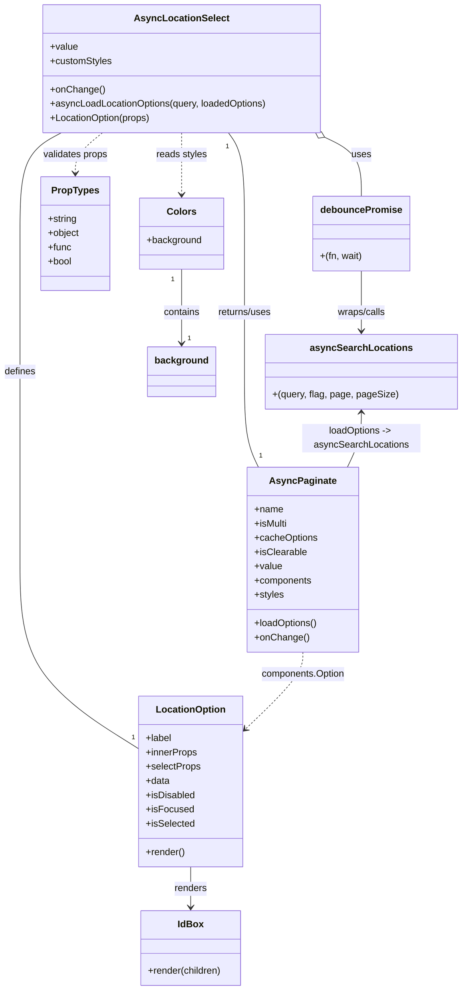

# Diagram: web/portal/src/pages/administration/admin-tools/shipment-dwell-notification/components/molecules/AsyncLocationSelect.molecule.js

> Auto-generated by Obscura crawlers

## Mermaid

### SVG

<svg id="container" width="766.15625" xmlns="http://www.w3.org/2000/svg" class="classDiagram" height="1670" viewBox="0 0 766.15625 1670" role="graphics-document document" aria-roledescription="class"><g><defs><marker id="container_class-aggregationStart" class="marker aggregation class" refX="18" refY="7" markerWidth="190" markerHeight="240" orient="auto"><path d="M 18,7 L9,13 L1,7 L9,1 Z"></path></marker></defs><defs><marker id="container_class-aggregationEnd" class="marker aggregation class" refX="1" refY="7" markerWidth="20" markerHeight="28" orient="auto"><path d="M 18,7 L9,13 L1,7 L9,1 Z"></path></marker></defs><defs><marker id="container_class-extensionStart" class="marker extension class" refX="18" refY="7" markerWidth="190" markerHeight="240" orient="auto"><path d="M 1,7 L18,13 V 1 Z"></path></marker></defs><defs><marker id="container_class-extensionEnd" class="marker extension class" refX="1" refY="7" markerWidth="20" markerHeight="28" orient="auto"><path d="M 1,1 V 13 L18,7 Z"></path></marker></defs><defs><marker id="container_class-compositionStart" class="marker composition class" refX="18" refY="7" markerWidth="190" markerHeight="240" orient="auto"><path d="M 18,7 L9,13 L1,7 L9,1 Z"></path></marker></defs><defs><marker id="container_class-compositionEnd" class="marker composition class" refX="1" refY="7" markerWidth="20" markerHeight="28" orient="auto"><path d="M 18,7 L9,13 L1,7 L9,1 Z"></path></marker></defs><defs><marker id="container_class-dependencyStart" class="marker dependency class" refX="6" refY="7" markerWidth="190" markerHeight="240" orient="auto"><path d="M 5,7 L9,13 L1,7 L9,1 Z"></path></marker></defs><defs><marker id="container_class-dependencyEnd" class="marker dependency class" refX="13" refY="7" markerWidth="20" markerHeight="28" orient="auto"><path d="M 18,7 L9,13 L14,7 L9,1 Z"></path></marker></defs><defs><marker id="container_class-lollipopStart" class="marker lollipop class" refX="13" refY="7" markerWidth="190" markerHeight="240" orient="auto"><circle stroke="black" fill="transparent" cx="7" cy="7" r="6"></circle></marker></defs><defs><marker id="container_class-lollipopEnd" class="marker lollipop class" refX="1" refY="7" markerWidth="190" markerHeight="240" orient="auto"><circle stroke="black" fill="transparent" cx="7" cy="7" r="6"></circle></marker></defs><g class="root"><g class="clusters"></g><g class="edgePaths"><path d="M103.676,224L92.152,230.167C80.628,236.333,57.579,248.667,46.055,277C34.531,305.333,34.531,349.667,34.531,394C34.531,438.333,34.531,482.667,34.531,521.5C34.531,560.333,34.531,593.667,34.531,629C34.531,664.333,34.531,701.667,34.531,754.5C34.531,807.333,34.531,875.667,34.531,942C34.531,1008.333,34.531,1072.667,67.466,1125.845C100.401,1179.023,166.271,1221.046,199.206,1242.058L232.141,1263.07" id="id_AsyncLocationSelect_LocationOption_1" class="edge-thickness-normal edge-pattern-solid relation" style=";;;" data-edge="true" data-et="edge" data-id="id_AsyncLocationSelect_LocationOption_1" data-points="W3sieCI6MTAzLjY3NTk5Njc2NzI0MTM3LCJ5IjoyMjR9LHsieCI6MzQuNTMxMjUsInkiOjI2MX0seyJ4IjozNC41MzEyNSwieSI6Mzk0fSx7IngiOjM0LjUzMTI1LCJ5Ijo1Mjd9LHsieCI6MzQuNTMxMjUsInkiOjYyN30seyJ4IjozNC41MzEyNSwieSI6NzM5fSx7IngiOjM0LjUzMTI1LCJ5Ijo5NDR9LHsieCI6MzQuNTMxMjUsInkiOjExMzd9LHsieCI6MjMyLjE0MDYyNSwieSI6MTI2My4wNjk1MDI5NjAyMDkzfV0="></path><path d="M383.894,224L388.37,230.167C392.846,236.333,401.798,248.667,406.274,277C410.75,305.333,410.75,349.667,410.75,394C410.75,438.333,410.75,482.667,410.75,521.5C410.75,560.333,410.75,593.667,410.75,629C410.75,664.333,410.75,701.667,414.559,728.5C418.367,755.333,425.984,771.667,429.793,779.833L433.601,788" id="id_AsyncLocationSelect_AsyncPaginate_2" class="edge-thickness-normal edge-pattern-solid relation" style=";;;" data-edge="true" data-et="edge" data-id="id_AsyncLocationSelect_AsyncPaginate_2" data-points="W3sieCI6MzgzLjg5NDEwMDIxNTUxNzI2LCJ5IjoyMjR9LHsieCI6NDEwLjc1LCJ5IjoyNjF9LHsieCI6NDEwLjc1LCJ5IjozOTR9LHsieCI6NDEwLjc1LCJ5Ijo1Mjd9LHsieCI6NDEwLjc1LCJ5Ijo2Mjd9LHsieCI6NDEwLjc1LCJ5Ijo3Mzl9LHsieCI6NDMzLjYwMTEwNTE4MjkyNjg2LCJ5Ijo3ODh9XQ=="></path><path d="M541.803,231.579L551.828,236.483C561.853,241.386,581.903,251.193,591.928,267.763C601.953,284.333,601.953,307.667,601.953,319.333L601.953,331" id="id_AsyncLocationSelect_debouncePromise_3" class="edge-thickness-normal edge-pattern-solid relation" style=";;;" data-edge="true" data-et="edge" data-id="id_AsyncLocationSelect_debouncePromise_3" data-points="W3sieCI6NTI2LjMwNzQ2MjI4NDQ4MjgsInkiOjIyNH0seyJ4Ijo2MDEuOTUzMTI1LCJ5IjoyNjF9LHsieCI6NjAxLjk1MzEyNSwieSI6MzMxfV0=" marker-start="url(#container_class-aggregationStart)"></path><path d="M601.953,457L601.953,468.667C601.953,480.333,601.953,503.667,601.953,520.5C601.953,537.333,601.953,547.667,601.953,552.833L601.953,558" id="id_debouncePromise_asyncSearchLocations_4" class="edge-thickness-normal edge-pattern-solid relation" style=";;;" data-edge="true" data-et="edge" data-id="id_debouncePromise_asyncSearchLocations_4" data-points="W3sieCI6NjAxLjk1MzEyNSwieSI6NDU3fSx7IngiOjYwMS45NTMxMjUsInkiOjUyN30seyJ4Ijo2MDEuOTUzMTI1LCJ5Ijo1NjR9XQ==" marker-end="url(#container_class-dependencyEnd)"></path><path d="M506.352,1100L506.352,1106.167C506.352,1112.333,506.352,1124.667,490.071,1146.499C473.79,1168.331,441.229,1199.662,424.948,1215.327L408.667,1230.992" id="id_AsyncPaginate_LocationOption_5" class="edge-thickness-normal edge-pattern-dashed relation" style=";;;" data-edge="true" data-et="edge" data-id="id_AsyncPaginate_LocationOption_5" data-points="W3sieCI6NTA2LjM1MTU2MjUsInkiOjExMDB9LHsieCI6NTA2LjM1MTU2MjUsInkiOjExMzd9LHsieCI6NDA0LjM0Mzc1LCJ5IjoxMjM1LjE1MjU0NTg5MjUxNn1d" marker-end="url(#container_class-dependencyEnd)"></path><path d="M318.242,1462L318.242,1468.167C318.242,1474.333,318.242,1486.667,318.242,1498C318.242,1509.333,318.242,1519.667,318.242,1524.833L318.242,1530" id="id_LocationOption_IdBox_6" class="edge-thickness-normal edge-pattern-solid relation" style=";;;" data-edge="true" data-et="edge" data-id="id_LocationOption_IdBox_6" data-points="W3sieCI6MzE4LjI0MjE4NzUsInkiOjE0NjJ9LHsieCI6MzE4LjI0MjE4NzUsInkiOjE0OTl9LHsieCI6MzE4LjI0MjE4NzUsInkiOjE1MzZ9XQ==" marker-end="url(#container_class-dependencyEnd)"></path><path d="M172.843,224L165.268,230.167C157.694,236.333,142.544,248.667,134.969,260C127.395,271.333,127.395,281.667,127.395,286.833L127.395,292" id="id_AsyncLocationSelect_PropTypes_7" class="edge-thickness-normal edge-pattern-dashed relation" style=";;;" data-edge="true" data-et="edge" data-id="id_AsyncLocationSelect_PropTypes_7" data-points="W3sieCI6MTcyLjg0MzEzMDM4NzkzMTA0LCJ5IjoyMjR9LHsieCI6MTI3LjM5NDUzMTI1LCJ5IjoyNjF9LHsieCI6MTI3LjM5NDUzMTI1LCJ5IjoyOTh9XQ==" marker-end="url(#container_class-dependencyEnd)"></path><path d="M305.504,224L305.504,230.167C305.504,236.333,305.504,248.667,305.504,266C305.504,283.333,305.504,305.667,305.504,316.833L305.504,328" id="id_AsyncLocationSelect_Colors_8" class="edge-thickness-normal edge-pattern-dashed relation" style=";;;" data-edge="true" data-et="edge" data-id="id_AsyncLocationSelect_Colors_8" data-points="W3sieCI6MzA1LjUwMzkwNjI1LCJ5IjoyMjR9LHsieCI6MzA1LjUwMzkwNjI1LCJ5IjoyNjF9LHsieCI6MzA1LjUwMzkwNjI1LCJ5IjozMzR9XQ==" marker-end="url(#container_class-dependencyEnd)"></path><path d="M601.953,696L601.953,703.167C601.953,710.333,601.953,724.667,598.145,740C594.336,755.333,586.719,771.667,582.911,779.833L579.102,788" id="id_asyncSearchLocations_AsyncPaginate_9" class="edge-thickness-normal edge-pattern-solid relation" style=";;;" data-edge="true" data-et="edge" data-id="id_asyncSearchLocations_AsyncPaginate_9" data-points="W3sieCI6NjAxLjk1MzEyNSwieSI6NjkwfSx7IngiOjYwMS45NTMxMjUsInkiOjczOX0seyJ4Ijo1NzkuMTAyMDE5ODE3MDczMSwieSI6Nzg4fV0=" marker-start="url(#container_class-dependencyStart)"></path><path d="M305.504,454L305.504,466.167C305.504,478.333,305.504,502.667,305.504,523.5C305.504,544.333,305.504,561.667,305.504,570.333L305.504,579" id="id_Colors_background_10" class="edge-thickness-normal edge-pattern-solid relation" style=";;;" data-edge="true" data-et="edge" data-id="id_Colors_background_10" data-points="W3sieCI6MzA1LjUwMzkwNjI1LCJ5Ijo0NTR9LHsieCI6MzA1LjUwMzkwNjI1LCJ5Ijo1Mjd9LHsieCI6MzA1LjUwMzkwNjI1LCJ5Ijo1ODV9XQ==" marker-end="url(#container_class-dependencyEnd)"></path></g><g class="edgeLabels"><g class="edgeLabel" transform="translate(34.53125, 627)"><g class="label" data-id="id_AsyncLocationSelect_LocationOption_1" transform="translate(-26.53125, -12)"><foreignObject width="53.0625" height="24">

defines

</foreignObject></g></g><g class="edgeLabel" transform="translate(410.75, 527)"><g class="label" data-id="id_AsyncLocationSelect_AsyncPaginate_2" transform="translate(-46.6796875, -12)"><foreignObject width="93.359375" height="24">

returns/uses

</foreignObject></g></g><g class="edgeLabel" transform="translate(601.953125, 261)"><g class="label" data-id="id_AsyncLocationSelect_debouncePromise_3" transform="translate(-16.4921875, -12)"><foreignObject width="32.984375" height="24">

uses

</foreignObject></g></g><g class="edgeLabel" transform="translate(601.953125, 527)"><g class="label" data-id="id_debouncePromise_asyncSearchLocations_4" transform="translate(-41.5859375, -12)"><foreignObject width="83.171875" height="24">

wraps/calls

</foreignObject></g></g><g class="edgeLabel" transform="translate(506.3515625, 1137)"><g class="label" data-id="id_AsyncPaginate_LocationOption_5" transform="translate(-71.53125, -12)"><foreignObject width="143.0625" height="24">

components.Option

</foreignObject></g></g><g class="edgeLabel" transform="translate(318.2421875, 1499)"><g class="label" data-id="id_LocationOption_IdBox_6" transform="translate(-27.75, -12)"><foreignObject width="55.5" height="24">

renders

</foreignObject></g></g><g class="edgeLabel" transform="translate(127.39453125, 261)"><g class="label" data-id="id_AsyncLocationSelect_PropTypes_7" transform="translate(-55.5625, -12)"><foreignObject width="111.125" height="24">

validates props

</foreignObject></g></g><g class="edgeLabel" transform="translate(305.50390625, 261)"><g class="label" data-id="id_AsyncLocationSelect_Colors_8" transform="translate(-43.046875, -12)"><foreignObject width="86.09375" height="24">

reads styles

</foreignObject></g></g><g class="edgeLabel" transform="translate(601.953125, 739)"><g class="label" data-id="id_asyncSearchLocations_AsyncPaginate_9" transform="translate(-100, -24)"><foreignObject width="200" height="48">

loadOptions -&gt; asyncSearchLocations

</foreignObject></g></g><g class="edgeLabel" transform="translate(305.50390625, 527)"><g class="label" data-id="id_Colors_background_10" transform="translate(-30.890625, -12)"><foreignObject width="61.78125" height="24">

contains

</foreignObject></g></g><g class="edgeTerminals" transform="translate(81.16911040041708, 219.03109114988854)"><g class="inner" transform="translate(0, 0)"><foreignObject style="width: 9px; height: 12px;">
1
</foreignObject></g></g><g class="edgeTerminals" transform="translate(382.03444850472783, 246.973718087239)"><g class="inner" transform="translate(0, 0)"><foreignObject style="width: 9px; height: 12px;">
1
</foreignObject></g></g><g class="edgeTerminals" transform="translate(290.5039081250001, 471.50000160714285)"><g class="inner" transform="translate(0, 0)"><foreignObject style="width: 9px; height: 12px;">
1
</foreignObject></g></g><g class="edgeTerminals" transform="translate(220.4549259831477, 1236.011591058874)"><g class="inner" transform="translate(0, 0)"></g><foreignObject style="width: 9px; height: 12px;">
1
</foreignObject></g><g class="edgeTerminals" transform="translate(434.79914928994697, 760.8001297957295)"><g class="inner" transform="translate(0, 0)"></g><foreignObject style="width: 9px; height: 12px;">
1
</foreignObject></g><g class="edgeTerminals" transform="translate(315.5039081249999, 562.5000016071428)"><g class="inner" transform="translate(0, 0)"></g><foreignObject style="width: 9px; height: 12px;">
1
</foreignObject></g></g><g class="nodes"><g class="node default" id="classId-AsyncLocationSelect-0" transform="translate(305.50390625, 116)"><g class="basic label-container"><path d="M-234.24609375 -108 L234.24609375 -108 L234.24609375 108 L-234.24609375 108" stroke="none" stroke-width="0" fill="#ECECFF" style=""></path><path d="M-234.24609375 -108 C-49.19044068358693 -108, 135.86521238282614 -108, 234.24609375 -108 M-234.24609375 -108 C-57.71631519903161 -108, 118.81346335193678 -108, 234.24609375 -108 M234.24609375 -108 C234.24609375 -63.21685297300448, 234.24609375 -18.433705946008956, 234.24609375 108 M234.24609375 -108 C234.24609375 -56.96627568503322, 234.24609375 -5.9325513700664345, 234.24609375 108 M234.24609375 108 C130.3312331260165 108, 26.416372502033028 108, -234.24609375 108 M234.24609375 108 C127.86246004161012 108, 21.47882633322024 108, -234.24609375 108 M-234.24609375 108 C-234.24609375 34.46958097911883, -234.24609375 -39.06083804176234, -234.24609375 -108 M-234.24609375 108 C-234.24609375 39.04349762907542, -234.24609375 -29.913004741849164, -234.24609375 -108" stroke="#9370DB" stroke-width="1.3" fill="none" stroke-dasharray="0 0" style=""></path></g><g class="annotation-group text" transform="translate(0, -84)"></g><g class="label-group text" transform="translate(-75.0390625, -84)"><g class="label" style="font-weight: bolder" transform="translate(0,-12)"><foreignObject width="150.078125" height="24">

AsyncLocationSelect

</foreignObject></g></g><g class="members-group text" transform="translate(-222.24609375, -36)"><g class="label" style="" transform="translate(0,-12)"><foreignObject width="46.71875" height="24">

+value

</foreignObject></g><g class="label" style="" transform="translate(0,12)"><foreignObject width="103.9375" height="24">

+customStyles

</foreignObject></g></g><g class="methods-group text" transform="translate(-222.24609375, 36)"><g class="label" style="" transform="translate(0,-12)"><foreignObject width="90.125" height="24">

+onChange()

</foreignObject></g><g class="label" style="" transform="translate(0,12)"><foreignObject width="369.453125" height="24">

+asyncLoadLocationOptions(query, loadedOptions)

</foreignObject></g><g class="label" style="" transform="translate(0,36)"><foreignObject width="171.578125" height="24">

+LocationOption(props)

</foreignObject></g></g><g class="divider" style=""><path d="M-234.24609375 -60 C-123.00197587371538 -60, -11.757857997430762 -60, 234.24609375 -60 M-234.24609375 -60 C-132.88285241990144 -60, -31.51961108980285 -60, 234.24609375 -60" stroke="#9370DB" stroke-width="1.3" fill="none" stroke-dasharray="0 0" style=""></path></g><g class="divider" style=""><path d="M-234.24609375 12 C-69.92169982142781 12, 94.40269410714438 12, 234.24609375 12 M-234.24609375 12 C-94.00255996031817 12, 46.24097382936367 12, 234.24609375 12" stroke="#9370DB" stroke-width="1.3" fill="none" stroke-dasharray="0 0" style=""></path></g></g><g class="node default" id="classId-LocationOption-1" transform="translate(318.2421875, 1318)"><g class="basic label-container"><path d="M-86.1015625 -144 L86.1015625 -144 L86.1015625 144 L-86.1015625 144" stroke="none" stroke-width="0" fill="#ECECFF" style=""></path><path d="M-86.1015625 -144 C-29.011099357833082 -144, 28.079363784333836 -144, 86.1015625 -144 M-86.1015625 -144 C-26.723671134066137 -144, 32.654220231867725 -144, 86.1015625 -144 M86.1015625 -144 C86.1015625 -63.178014864520065, 86.1015625 17.64397027095987, 86.1015625 144 M86.1015625 -144 C86.1015625 -85.53703614625006, 86.1015625 -27.07407229250012, 86.1015625 144 M86.1015625 144 C46.12590146036326 144, 6.150240420726519 144, -86.1015625 144 M86.1015625 144 C30.18836929963537 144, -25.724823900729263 144, -86.1015625 144 M-86.1015625 144 C-86.1015625 68.94968430559204, -86.1015625 -6.100631388815913, -86.1015625 -144 M-86.1015625 144 C-86.1015625 31.099872519909866, -86.1015625 -81.80025496018027, -86.1015625 -144" stroke="#9370DB" stroke-width="1.3" fill="none" stroke-dasharray="0 0" style=""></path></g><g class="annotation-group text" transform="translate(0, -120)"></g><g class="label-group text" transform="translate(-56.28125, -120)"><g class="label" style="font-weight: bolder" transform="translate(0,-12)"><foreignObject width="112.5625" height="24">

LocationOption

</foreignObject></g></g><g class="members-group text" transform="translate(-74.1015625, -72)"><g class="label" style="" transform="translate(0,-12)"><foreignObject width="44.21875" height="24">

+label

</foreignObject></g><g class="label" style="" transform="translate(0,12)"><foreignObject width="87.140625" height="24">

+innerProps

</foreignObject></g><g class="label" style="" transform="translate(0,36)"><foreignObject width="91.921875" height="24">

+selectProps

</foreignObject></g><g class="label" style="" transform="translate(0,60)"><foreignObject width="40.625" height="24">

+data

</foreignObject></g><g class="label" style="" transform="translate(0,84)"><foreignObject width="83.203125" height="24">

+isDisabled

</foreignObject></g><g class="label" style="" transform="translate(0,108)"><foreignObject width="79.171875" height="24">

+isFocused

</foreignObject></g><g class="label" style="" transform="translate(0,132)"><foreignObject width="82.21875" height="24">

+isSelected

</foreignObject></g></g><g class="methods-group text" transform="translate(-74.1015625, 120)"><g class="label" style="" transform="translate(0,-12)"><foreignObject width="66.609375" height="24">

+render()

</foreignObject></g></g><g class="divider" style=""><path d="M-86.1015625 -96 C-47.80673797736543 -96, -9.511913454730859 -96, 86.1015625 -96 M-86.1015625 -96 C-43.79054859939217 -96, -1.4795346987843345 -96, 86.1015625 -96" stroke="#9370DB" stroke-width="1.3" fill="none" stroke-dasharray="0 0" style=""></path></g><g class="divider" style=""><path d="M-86.1015625 96 C-19.78986991581243 96, 46.52182266837514 96, 86.1015625 96 M-86.1015625 96 C-50.625935357267764 96, -15.150308214535528 96, 86.1015625 96" stroke="#9370DB" stroke-width="1.3" fill="none" stroke-dasharray="0 0" style=""></path></g></g><g class="node default" id="classId-AsyncPaginate-2" transform="translate(506.3515625, 944)"><g class="basic label-container"><path d="M-92.11328125 -156 L92.11328125 -156 L92.11328125 156 L-92.11328125 156" stroke="none" stroke-width="0" fill="#ECECFF" style=""></path><path d="M-92.11328125 -156 C-44.607159369438904 -156, 2.8989625111221926 -156, 92.11328125 -156 M-92.11328125 -156 C-53.88949613191103 -156, -15.665711013822062 -156, 92.11328125 -156 M92.11328125 -156 C92.11328125 -75.33337388516644, 92.11328125 5.333252229667124, 92.11328125 156 M92.11328125 -156 C92.11328125 -60.57366439915286, 92.11328125 34.85267120169428, 92.11328125 156 M92.11328125 156 C33.55971795136785 156, -24.993845347264298 156, -92.11328125 156 M92.11328125 156 C22.058311093833467 156, -47.996659062333066 156, -92.11328125 156 M-92.11328125 156 C-92.11328125 66.39870884235488, -92.11328125 -23.202582315290243, -92.11328125 -156 M-92.11328125 156 C-92.11328125 57.968958890521634, -92.11328125 -40.06208221895673, -92.11328125 -156" stroke="#9370DB" stroke-width="1.3" fill="none" stroke-dasharray="0 0" style=""></path></g><g class="annotation-group text" transform="translate(0, -132)"></g><g class="label-group text" transform="translate(-52.7421875, -132)"><g class="label" style="font-weight: bolder" transform="translate(0,-12)"><foreignObject width="105.484375" height="24">

AsyncPaginate

</foreignObject></g></g><g class="members-group text" transform="translate(-80.11328125, -84)"><g class="label" style="" transform="translate(0,-12)"><foreignObject width="48.5" height="24">

+name

</foreignObject></g><g class="label" style="" transform="translate(0,12)"><foreignObject width="56.71875" height="24">

+isMulti

</foreignObject></g><g class="label" style="" transform="translate(0,36)"><foreignObject width="106.984375" height="24">

+cacheOptions

</foreignObject></g><g class="label" style="" transform="translate(0,60)"><foreignObject width="87.796875" height="24">

+isClearable

</foreignObject></g><g class="label" style="" transform="translate(0,84)"><foreignObject width="46.71875" height="24">

+value

</foreignObject></g><g class="label" style="" transform="translate(0,108)"><foreignObject width="97.9375" height="24">

+components

</foreignObject></g><g class="label" style="" transform="translate(0,132)"><foreignObject width="49.828125" height="24">

+styles

</foreignObject></g></g><g class="methods-group text" transform="translate(-80.11328125, 108)"><g class="label" style="" transform="translate(0,-12)"><foreignObject width="107.484375" height="24">

+loadOptions()

</foreignObject></g><g class="label" style="" transform="translate(0,12)"><foreignObject width="90.125" height="24">

+onChange()

</foreignObject></g></g><g class="divider" style=""><path d="M-92.11328125 -108 C-34.39466059080729 -108, 23.323960068385418 -108, 92.11328125 -108 M-92.11328125 -108 C-42.337243055494724 -108, 7.438795139010551 -108, 92.11328125 -108" stroke="#9370DB" stroke-width="1.3" fill="none" stroke-dasharray="0 0" style=""></path></g><g class="divider" style=""><path d="M-92.11328125 84 C-42.53439321816033 84, 7.044494813679336 84, 92.11328125 84 M-92.11328125 84 C-43.484515305609825 84, 5.144250638780349 84, 92.11328125 84" stroke="#9370DB" stroke-width="1.3" fill="none" stroke-dasharray="0 0" style=""></path></g></g><g class="node default" id="classId-asyncSearchLocations-3" transform="translate(601.953125, 627)"><g class="basic label-container"><path d="M-156.203125 -63 L156.203125 -63 L156.203125 63 L-156.203125 63" stroke="none" stroke-width="0" fill="#ECECFF" style=""></path><path d="M-156.203125 -63 C-58.20753947622437 -63, 39.78804604755126 -63, 156.203125 -63 M-156.203125 -63 C-62.537134901533506 -63, 31.12885519693299 -63, 156.203125 -63 M156.203125 -63 C156.203125 -22.39908740400262, 156.203125 18.201825191994757, 156.203125 63 M156.203125 -63 C156.203125 -25.18173505826646, 156.203125 12.636529883467077, 156.203125 63 M156.203125 63 C92.19418561021368 63, 28.18524622042736 63, -156.203125 63 M156.203125 63 C87.43158228548965 63, 18.660039570979308 63, -156.203125 63 M-156.203125 63 C-156.203125 13.368882196631041, -156.203125 -36.26223560673792, -156.203125 -63 M-156.203125 63 C-156.203125 31.93266593799238, -156.203125 0.8653318759847579, -156.203125 -63" stroke="#9370DB" stroke-width="1.3" fill="none" stroke-dasharray="0 0" style=""></path></g><g class="annotation-group text" transform="translate(0, -39)"></g><g class="label-group text" transform="translate(-80.53125, -39)"><g class="label" style="font-weight: bolder" transform="translate(0,-12)"><foreignObject width="161.0625" height="24">

asyncSearchLocations

</foreignObject></g></g><g class="members-group text" transform="translate(-144.203125, 9)"></g><g class="methods-group text" transform="translate(-144.203125, 39)"><g class="label" style="" transform="translate(0,-12)"><foreignObject width="207.875" height="24">

+(query, flag, page, pageSize)

</foreignObject></g></g><g class="divider" style=""><path d="M-156.203125 -15 C-57.99080961156227 -15, 40.22150577687546 -15, 156.203125 -15 M-156.203125 -15 C-72.53125541202142 -15, 11.140614175957154 -15, 156.203125 -15" stroke="#9370DB" stroke-width="1.3" fill="none" stroke-dasharray="0 0" style=""></path></g><g class="divider" style=""><path d="M-156.203125 9 C-42.12882673198531 9, 71.94547153602937 9, 156.203125 9 M-156.203125 9 C-53.79296058458647 9, 48.617203830827066 9, 156.203125 9" stroke="#9370DB" stroke-width="1.3" fill="none" stroke-dasharray="0 0" style=""></path></g></g><g class="node default" id="classId-debouncePromise-4" transform="translate(601.953125, 394)"><g class="basic label-container"><path d="M-80.48828125 -63 L80.48828125 -63 L80.48828125 63 L-80.48828125 63" stroke="none" stroke-width="0" fill="#ECECFF" style=""></path><path d="M-80.48828125 -63 C-21.348284468060818 -63, 37.791712313878364 -63, 80.48828125 -63 M-80.48828125 -63 C-28.049239277540437 -63, 24.389802694919126 -63, 80.48828125 -63 M80.48828125 -63 C80.48828125 -30.35321189012869, 80.48828125 2.2935762197426186, 80.48828125 63 M80.48828125 -63 C80.48828125 -30.20993054509114, 80.48828125 2.5801389098177197, 80.48828125 63 M80.48828125 63 C44.26075585947475 63, 8.033230468949498 63, -80.48828125 63 M80.48828125 63 C29.34832465135959 63, -21.79163194728082 63, -80.48828125 63 M-80.48828125 63 C-80.48828125 36.06999474451723, -80.48828125 9.13998948903447, -80.48828125 -63 M-80.48828125 63 C-80.48828125 15.79683930590901, -80.48828125 -31.40632138818198, -80.48828125 -63" stroke="#9370DB" stroke-width="1.3" fill="none" stroke-dasharray="0 0" style=""></path></g><g class="annotation-group text" transform="translate(0, -39)"></g><g class="label-group text" transform="translate(-65.5234375, -39)"><g class="label" style="font-weight: bolder" transform="translate(0,-12)"><foreignObject width="131.046875" height="24">

debouncePromise

</foreignObject></g></g><g class="members-group text" transform="translate(-68.48828125, 9)"></g><g class="methods-group text" transform="translate(-68.48828125, 39)"><g class="label" style="" transform="translate(0,-12)"><foreignObject width="71.453125" height="24">

+(fn, wait)

</foreignObject></g></g><g class="divider" style=""><path d="M-80.48828125 -15 C-39.18420864866806 -15, 2.119863952663877 -15, 80.48828125 -15 M-80.48828125 -15 C-32.2120295390826 -15, 16.0642221718348 -15, 80.48828125 -15" stroke="#9370DB" stroke-width="1.3" fill="none" stroke-dasharray="0 0" style=""></path></g><g class="divider" style=""><path d="M-80.48828125 9 C-46.22804630621757 9, -11.967811362435143 9, 80.48828125 9 M-80.48828125 9 C-41.996116265758566 9, -3.503951281517132 9, 80.48828125 9" stroke="#9370DB" stroke-width="1.3" fill="none" stroke-dasharray="0 0" style=""></path></g></g><g class="node default" id="classId-PropTypes-5" transform="translate(127.39453125, 394)"><g class="basic label-container"><path d="M-57.86328125 -96 L57.86328125 -96 L57.86328125 96 L-57.86328125 96" stroke="none" stroke-width="0" fill="#ECECFF" style=""></path><path d="M-57.86328125 -96 C-26.18885124609928 -96, 5.485578757801441 -96, 57.86328125 -96 M-57.86328125 -96 C-20.56914326467183 -96, 16.72499472065634 -96, 57.86328125 -96 M57.86328125 -96 C57.86328125 -44.793644734517045, 57.86328125 6.41271053096591, 57.86328125 96 M57.86328125 -96 C57.86328125 -49.50108545822073, 57.86328125 -3.0021709164414574, 57.86328125 96 M57.86328125 96 C26.258008966567285 96, -5.34726331686543 96, -57.86328125 96 M57.86328125 96 C33.58613848928668 96, 9.308995728573372 96, -57.86328125 96 M-57.86328125 96 C-57.86328125 20.666548511584494, -57.86328125 -54.66690297683101, -57.86328125 -96 M-57.86328125 96 C-57.86328125 41.1416382325349, -57.86328125 -13.716723534930196, -57.86328125 -96" stroke="#9370DB" stroke-width="1.3" fill="none" stroke-dasharray="0 0" style=""></path></g><g class="annotation-group text" transform="translate(0, -72)"></g><g class="label-group text" transform="translate(-38.2578125, -72)"><g class="label" style="font-weight: bolder" transform="translate(0,-12)"><foreignObject width="76.515625" height="24">

PropTypes

</foreignObject></g></g><g class="members-group text" transform="translate(-45.86328125, -24)"><g class="label" style="" transform="translate(0,-12)"><foreignObject width="49.625" height="24">

+string

</foreignObject></g><g class="label" style="" transform="translate(0,12)"><foreignObject width="53.46875" height="24">

+object

</foreignObject></g><g class="label" style="" transform="translate(0,36)"><foreignObject width="39.453125" height="24">

+func

</foreignObject></g><g class="label" style="" transform="translate(0,60)"><foreignObject width="40.875" height="24">

+bool

</foreignObject></g></g><g class="methods-group text" transform="translate(-45.86328125, 96)"></g><g class="divider" style=""><path d="M-57.86328125 -48 C-16.065864196287215 -48, 25.73155285742557 -48, 57.86328125 -48 M-57.86328125 -48 C-26.56825366344018 -48, 4.726773923119637 -48, 57.86328125 -48" stroke="#9370DB" stroke-width="1.3" fill="none" stroke-dasharray="0 0" style=""></path></g><g class="divider" style=""><path d="M-57.86328125 72 C-34.39210408266708 72, -10.920926915334164 72, 57.86328125 72 M-57.86328125 72 C-21.921603113754614 72, 14.020075022490772 72, 57.86328125 72" stroke="#9370DB" stroke-width="1.3" fill="none" stroke-dasharray="0 0" style=""></path></g></g><g class="node default" id="classId-Colors-6" transform="translate(305.50390625, 394)"><g class="basic label-container"><path d="M-70.24609375 -60 L70.24609375 -60 L70.24609375 60 L-70.24609375 60" stroke="none" stroke-width="0" fill="#ECECFF" style=""></path><path d="M-70.24609375 -60 C-18.78596447969072 -60, 32.67416479061856 -60, 70.24609375 -60 M-70.24609375 -60 C-35.63342202991119 -60, -1.0207503098223754 -60, 70.24609375 -60 M70.24609375 -60 C70.24609375 -35.74189501014277, 70.24609375 -11.483790020285547, 70.24609375 60 M70.24609375 -60 C70.24609375 -12.406470177933244, 70.24609375 35.18705964413351, 70.24609375 60 M70.24609375 60 C18.152625654827133 60, -33.94084244034573 60, -70.24609375 60 M70.24609375 60 C33.42810339637241 60, -3.389886957255186 60, -70.24609375 60 M-70.24609375 60 C-70.24609375 24.4323935927044, -70.24609375 -11.135212814591199, -70.24609375 -60 M-70.24609375 60 C-70.24609375 15.575649637291647, -70.24609375 -28.848700725416705, -70.24609375 -60" stroke="#9370DB" stroke-width="1.3" fill="none" stroke-dasharray="0 0" style=""></path></g><g class="annotation-group text" transform="translate(0, -36)"></g><g class="label-group text" transform="translate(-23.1015625, -36)"><g class="label" style="font-weight: bolder" transform="translate(0,-12)"><foreignObject width="46.203125" height="24">

Colors

</foreignObject></g></g><g class="members-group text" transform="translate(-58.24609375, 12)"><g class="label" style="" transform="translate(0,-12)"><foreignObject width="93.390625" height="24">

+background

</foreignObject></g></g><g class="methods-group text" transform="translate(-58.24609375, 60)"></g><g class="divider" style=""><path d="M-70.24609375 -12 C-17.053627047657386 -12, 36.13883965468523 -12, 70.24609375 -12 M-70.24609375 -12 C-22.163069182006588 -12, 25.919955385986825 -12, 70.24609375 -12" stroke="#9370DB" stroke-width="1.3" fill="none" stroke-dasharray="0 0" style=""></path></g><g class="divider" style=""><path d="M-70.24609375 36 C-25.627248122519724 36, 18.991597504960552 36, 70.24609375 36 M-70.24609375 36 C-15.719226671872278 36, 38.807640406255445 36, 70.24609375 36" stroke="#9370DB" stroke-width="1.3" fill="none" stroke-dasharray="0 0" style=""></path></g></g><g class="node default" id="classId-IdBox-7" transform="translate(318.2421875, 1599)"><g class="basic label-container"><path d="M-85.4375 -63 L85.4375 -63 L85.4375 63 L-85.4375 63" stroke="none" stroke-width="0" fill="#ECECFF" style=""></path><path d="M-85.4375 -63 C-25.094265574844243 -63, 35.24896885031151 -63, 85.4375 -63 M-85.4375 -63 C-42.01859028918714 -63, 1.4003194216257242 -63, 85.4375 -63 M85.4375 -63 C85.4375 -13.210045532942672, 85.4375 36.579908934114655, 85.4375 63 M85.4375 -63 C85.4375 -15.613980889616805, 85.4375 31.77203822076639, 85.4375 63 M85.4375 63 C18.013581658007737 63, -49.410336683984525 63, -85.4375 63 M85.4375 63 C25.182171182824902 63, -35.073157634350196 63, -85.4375 63 M-85.4375 63 C-85.4375 18.625737619034084, -85.4375 -25.748524761931833, -85.4375 -63 M-85.4375 63 C-85.4375 14.970858163011037, -85.4375 -33.058283673977925, -85.4375 -63" stroke="#9370DB" stroke-width="1.3" fill="none" stroke-dasharray="0 0" style=""></path></g><g class="annotation-group text" transform="translate(0, -39)"></g><g class="label-group text" transform="translate(-20.75, -39)"><g class="label" style="font-weight: bolder" transform="translate(0,-12)"><foreignObject width="41.5" height="24">

IdBox

</foreignObject></g></g><g class="members-group text" transform="translate(-73.4375, 9)"></g><g class="methods-group text" transform="translate(-73.4375, 39)"><g class="label" style="" transform="translate(0,-12)"><foreignObject width="126.125" height="24">

+render(children)

</foreignObject></g></g><g class="divider" style=""><path d="M-85.4375 -15 C-49.14902320037786 -15, -12.860546400755723 -15, 85.4375 -15 M-85.4375 -15 C-29.149394780038456 -15, 27.138710439923088 -15, 85.4375 -15" stroke="#9370DB" stroke-width="1.3" fill="none" stroke-dasharray="0 0" style=""></path></g><g class="divider" style=""><path d="M-85.4375 9 C-50.440612916957235 9, -15.44372583391447 9, 85.4375 9 M-85.4375 9 C-27.9483940843134 9, 29.5407118313732 9, 85.4375 9" stroke="#9370DB" stroke-width="1.3" fill="none" stroke-dasharray="0 0" style=""></path></g></g><g class="node default" id="classId-background-8" transform="translate(305.50390625, 627)"><g class="basic label-container"><path d="M-55.296875 -42 L55.296875 -42 L55.296875 42 L-55.296875 42" stroke="none" stroke-width="0" fill="#ECECFF" style=""></path><path d="M-55.296875 -42 C-32.09682140000193 -42, -8.896767800003857 -42, 55.296875 -42 M-55.296875 -42 C-23.346330979992352 -42, 8.604213040015296 -42, 55.296875 -42 M55.296875 -42 C55.296875 -19.71406107013872, 55.296875 2.571877859722562, 55.296875 42 M55.296875 -42 C55.296875 -13.765444397323886, 55.296875 14.469111205352228, 55.296875 42 M55.296875 42 C27.415831611132436 42, -0.4652117777351279 42, -55.296875 42 M55.296875 42 C14.32751306361861 42, -26.64184887276278 42, -55.296875 42 M-55.296875 42 C-55.296875 17.723309920504075, -55.296875 -6.55338015899185, -55.296875 -42 M-55.296875 42 C-55.296875 22.90975342861316, -55.296875 3.8195068572263224, -55.296875 -42" stroke="#9370DB" stroke-width="1.3" fill="none" stroke-dasharray="0 0" style=""></path></g><g class="annotation-group text" transform="translate(0, -18)"></g><g class="label-group text" transform="translate(-43.296875, -18)"><g class="label" style="font-weight: bolder" transform="translate(0,-12)"><foreignObject width="86.59375" height="24">

background

</foreignObject></g></g><g class="members-group text" transform="translate(-43.296875, 30)"></g><g class="methods-group text" transform="translate(-43.296875, 60)"></g><g class="divider" style=""><path d="M-55.296875 6 C-30.670442588058084 6, -6.044010176116167 6, 55.296875 6 M-55.296875 6 C-32.16208499794865 6, -9.027294995897293 6, 55.296875 6" stroke="#9370DB" stroke-width="1.3" fill="none" stroke-dasharray="0 0" style=""></path></g><g class="divider" style=""><path d="M-55.296875 24 C-13.526064994300562 24, 28.244745011398876 24, 55.296875 24 M-55.296875 24 C-29.074885179013773 24, -2.8528953580275456 24, 55.296875 24" stroke="#9370DB" stroke-width="1.3" fill="none" stroke-dasharray="0 0" style=""></path></g></g></g></g></g></svg>
