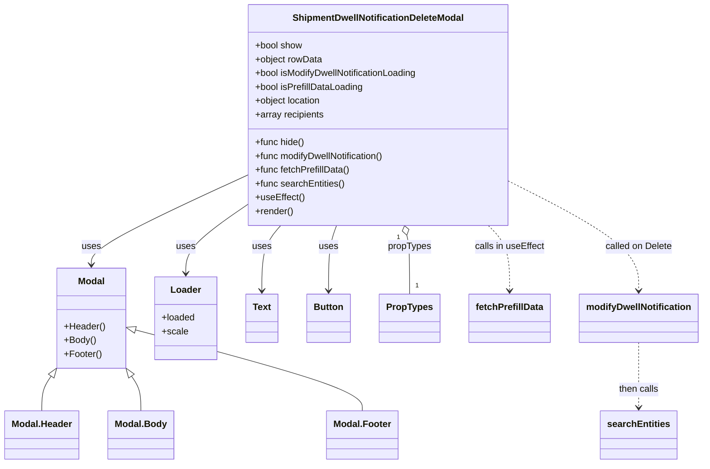
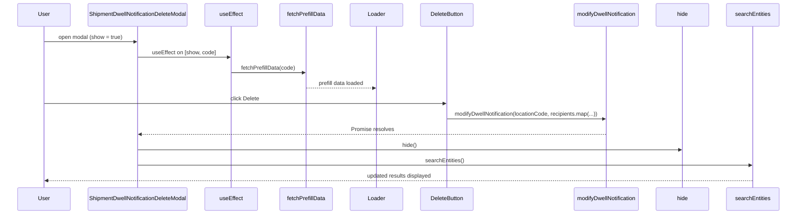

# Diagram: web/portal/src/pages/administration/admin-tools/shipment-dwell-notification/components/organisms/ShipmentDwellNotification.DeleteModal.organism.js

> Auto-generated by Obscura crawlers

## Diagram 1

### SVG

<svg id="container" width="1197.69140625" xmlns="http://www.w3.org/2000/svg" class="classDiagram" height="806" viewBox="0 0 1197.69140625 806" role="graphics-document document" aria-roledescription="class"><g><defs><marker id="container_class-aggregationStart" class="marker aggregation class" refX="18" refY="7" markerWidth="190" markerHeight="240" orient="auto"><path d="M 18,7 L9,13 L1,7 L9,1 Z"></path></marker></defs><defs><marker id="container_class-aggregationEnd" class="marker aggregation class" refX="1" refY="7" markerWidth="20" markerHeight="28" orient="auto"><path d="M 18,7 L9,13 L1,7 L9,1 Z"></path></marker></defs><defs><marker id="container_class-extensionStart" class="marker extension class" refX="18" refY="7" markerWidth="190" markerHeight="240" orient="auto"><path d="M 1,7 L18,13 V 1 Z"></path></marker></defs><defs><marker id="container_class-extensionEnd" class="marker extension class" refX="1" refY="7" markerWidth="20" markerHeight="28" orient="auto"><path d="M 1,1 V 13 L18,7 Z"></path></marker></defs><defs><marker id="container_class-compositionStart" class="marker composition class" refX="18" refY="7" markerWidth="190" markerHeight="240" orient="auto"><path d="M 18,7 L9,13 L1,7 L9,1 Z"></path></marker></defs><defs><marker id="container_class-compositionEnd" class="marker composition class" refX="1" refY="7" markerWidth="20" markerHeight="28" orient="auto"><path d="M 18,7 L9,13 L1,7 L9,1 Z"></path></marker></defs><defs><marker id="container_class-dependencyStart" class="marker dependency class" refX="6" refY="7" markerWidth="190" markerHeight="240" orient="auto"><path d="M 5,7 L9,13 L1,7 L9,1 Z"></path></marker></defs><defs><marker id="container_class-dependencyEnd" class="marker dependency class" refX="13" refY="7" markerWidth="20" markerHeight="28" orient="auto"><path d="M 18,7 L9,13 L14,7 L9,1 Z"></path></marker></defs><defs><marker id="container_class-lollipopStart" class="marker lollipop class" refX="13" refY="7" markerWidth="190" markerHeight="240" orient="auto"><circle stroke="black" fill="transparent" cx="7" cy="7" r="6"></circle></marker></defs><defs><marker id="container_class-lollipopEnd" class="marker lollipop class" refX="1" refY="7" markerWidth="190" markerHeight="240" orient="auto"><circle stroke="black" fill="transparent" cx="7" cy="7" r="6"></circle></marker></defs><g class="root"><g class="clusters"></g><g class="edgePaths"><path d="M418.332,306.33L374.416,326.775C330.5,347.22,242.668,388.11,198.752,413.722C154.836,439.333,154.836,449.667,154.836,454.833L154.836,460" id="id_ShipmentDwellNotificationDeleteModal_Modal_1" class="edge-thickness-normal edge-pattern-solid relation" style=";;;" data-edge="true" data-et="edge" data-id="id_ShipmentDwellNotificationDeleteModal_Modal_1" data-points="W3sieCI6NDE4LjMzMjAzMTI1LCJ5IjozMDYuMzMwMTk2NTQ1NTYyODR9LHsieCI6MTU0LjgzNTkzNzUsInkiOjQyOX0seyJ4IjoxNTQuODM1OTM3NSwieSI6NDY2fV0=" marker-end="url(#container_class-dependencyEnd)"></path><path d="M418.332,358.801L401.505,370.501C384.677,382.201,351.022,405.6,334.195,424.967C317.367,444.333,317.367,459.667,317.367,467.333L317.367,475" id="id_ShipmentDwellNotificationDeleteModal_Loader_2" class="edge-thickness-normal edge-pattern-solid relation" style=";;;" data-edge="true" data-et="edge" data-id="id_ShipmentDwellNotificationDeleteModal_Loader_2" data-points="W3sieCI6NDE4LjMzMjAzMTI1LCJ5IjozNTguODAxMDcyMTQ0NDA3NH0seyJ4IjozMTcuMzY3MTg3NSwieSI6NDI5fSx7IngiOjMxNy4zNjcxODc1LCJ5Ijo0ODF9XQ==" marker-end="url(#container_class-dependencyEnd)"></path><path d="M480.591,392L475.255,398.167C469.919,404.333,459.246,416.667,453.91,435.5C448.574,454.333,448.574,479.667,448.574,492.333L448.574,505" id="id_ShipmentDwellNotificationDeleteModal_Text_3" class="edge-thickness-normal edge-pattern-solid relation" style=";;;" data-edge="true" data-et="edge" data-id="id_ShipmentDwellNotificationDeleteModal_Text_3" data-points="W3sieCI6NDgwLjU5MDczMDc1ODczMzYsInkiOjM5Mn0seyJ4Ijo0NDguNTc0MjE4NzUsInkiOjQyOX0seyJ4Ijo0NDguNTc0MjE4NzUsInkiOjUxMX1d" marker-end="url(#container_class-dependencyEnd)"></path><path d="M576.355,392L574.095,398.167C571.834,404.333,567.314,416.667,565.053,435.5C562.793,454.333,562.793,479.667,562.793,492.333L562.793,505" id="id_ShipmentDwellNotificationDeleteModal_Button_4" class="edge-thickness-normal edge-pattern-solid relation" style=";;;" data-edge="true" data-et="edge" data-id="id_ShipmentDwellNotificationDeleteModal_Button_4" data-points="W3sieCI6NTc2LjM1NDkyMjg5ODQ3MTYsInkiOjM5Mn0seyJ4Ijo1NjIuNzkyOTY4NzUsInkiOjQyOX0seyJ4Ijo1NjIuNzkyOTY4NzUsInkiOjUxMX1d" marker-end="url(#container_class-dependencyEnd)"></path><path d="M695.199,408.803L695.98,412.169C696.761,415.535,698.324,422.268,699.105,439.301C699.887,456.333,699.887,483.667,699.887,497.333L699.887,511" id="id_ShipmentDwellNotificationDeleteModal_PropTypes_5" class="edge-thickness-normal edge-pattern-solid relation" style=";;;" data-edge="true" data-et="edge" data-id="id_ShipmentDwellNotificationDeleteModal_PropTypes_5" data-points="W3sieCI6NjkxLjI5ODE1NDMzOTUxOTcsInkiOjM5Mn0seyJ4Ijo2OTkuODg2NzE4NzUsInkiOjQyOX0seyJ4Ijo2OTkuODg2NzE4NzUsInkiOjUxMX1d" marker-start="url(#container_class-aggregationStart)"></path><path d="M833.241,392L839.232,398.167C845.222,404.333,857.203,416.667,863.193,435.5C869.184,454.333,869.184,479.667,869.184,492.333L869.184,505" id="id_ShipmentDwellNotificationDeleteModal_fetchPrefillData_6" class="edge-thickness-normal edge-pattern-dashed relation" style=";;;" data-edge="true" data-et="edge" data-id="id_ShipmentDwellNotificationDeleteModal_fetchPrefillData_6" data-points="W3sieCI6ODMzLjI0MTM4NTc4MDU2NzcsInkiOjM5Mn0seyJ4Ijo4NjkuMTgzNTkzNzUsInkiOjQyOX0seyJ4Ijo4NjkuMTgzNTkzNzUsInkiOjUxMX1d" marker-end="url(#container_class-dependencyEnd)"></path><path d="M875.129,318.273L910.767,336.727C946.405,355.182,1017.681,392.091,1053.319,423.212C1088.957,454.333,1088.957,479.667,1088.957,492.333L1088.957,505" id="id_ShipmentDwellNotificationDeleteModal_modifyDwellNotification_7" class="edge-thickness-normal edge-pattern-dashed relation" style=";;;" data-edge="true" data-et="edge" data-id="id_ShipmentDwellNotificationDeleteModal_modifyDwellNotification_7" data-points="W3sieCI6ODc1LjEyODkwNjI1LCJ5IjozMTguMjcyNTAyNDI5MTE0MDd9LHsieCI6MTA4OC45NTcwMzEyNSwieSI6NDI5fSx7IngiOjEwODguOTU3MDMxMjUsInkiOjUxMX1d" marker-end="url(#container_class-dependencyEnd)"></path><path d="M1088.957,595L1088.957,608.667C1088.957,622.333,1088.957,649.667,1088.957,668.5C1088.957,687.333,1088.957,697.667,1088.957,702.833L1088.957,708" id="id_modifyDwellNotification_searchEntities_8" class="edge-thickness-normal edge-pattern-dashed relation" style=";;;" data-edge="true" data-et="edge" data-id="id_modifyDwellNotification_searchEntities_8" data-points="W3sieCI6MTA4OC45NTcwMzEyNSwieSI6NTk1fSx7IngiOjEwODguOTU3MDMxMjUsInkiOjY3N30seyJ4IjoxMDg4Ljk1NzAzMTI1LCJ5Ijo3MTR9XQ==" marker-end="url(#container_class-dependencyEnd)"></path><path d="M86.459,654.012L83.866,657.844C81.272,661.675,76.085,669.337,73.492,679.335C70.898,689.333,70.898,701.667,70.898,707.833L70.898,714" id="id_Modal_Modal.Header_9" class="edge-thickness-normal edge-pattern-solid relation" style=";;;" data-edge="true" data-et="edge" data-id="id_Modal_Modal.Header_9" data-points="W3sieCI6OTYuMTI4OTA2MjUsInkiOjYzOS43MjcyODk2NTAwMzczfSx7IngiOjcwLjg5ODQzNzUsInkiOjY3N30seyJ4Ijo3MC44OTg0Mzc1LCJ5Ijo3MTR9XQ==" marker-start="url(#container_class-extensionStart)"></path><path d="M223.213,654.012L225.806,657.844C228.4,661.675,233.587,669.337,236.18,679.335C238.773,689.333,238.773,701.667,238.773,707.833L238.773,714" id="id_Modal_Modal.Body_10" class="edge-thickness-normal edge-pattern-solid relation" style=";;;" data-edge="true" data-et="edge" data-id="id_Modal_Modal.Body_10" data-points="W3sieCI6MjEzLjU0Mjk2ODc1LCJ5Ijo2MzkuNzI3Mjg5NjUwMDM3M30seyJ4IjoyMzguNzczNDM3NSwieSI6Njc3fSx7IngiOjIzOC43NzM0Mzc1LCJ5Ijo3MTR9XQ==" marker-start="url(#container_class-extensionStart)"></path><path d="M230.205,573.199L294.758,590.499C359.312,607.799,488.419,642.4,552.972,665.866C617.525,689.333,617.525,701.667,617.525,707.833L617.525,714" id="id_Modal_Modal.Footer_11" class="edge-thickness-normal edge-pattern-solid relation" style=";;;" data-edge="true" data-et="edge" data-id="id_Modal_Modal.Footer_11" data-points="W3sieCI6MjEzLjU0Mjk2ODc1LCJ5Ijo1NjguNzMzMzg2MjM5NTg5M30seyJ4Ijo2MTcuNTI1MzkwNjI1LCJ5Ijo2Nzd9LHsieCI6NjE3LjUyNTM5MDYyNSwieSI6NzE0fV0=" marker-start="url(#container_class-extensionStart)"></path></g><g class="edgeLabels"><g class="edgeLabel" transform="translate(154.8359375, 429)"><g class="label" data-id="id_ShipmentDwellNotificationDeleteModal_Modal_1" transform="translate(-16.4921875, -12)"><foreignObject width="32.984375" height="24">

uses

</foreignObject></g></g><g class="edgeLabel" transform="translate(317.3671875, 429)"><g class="label" data-id="id_ShipmentDwellNotificationDeleteModal_Loader_2" transform="translate(-16.4921875, -12)"><foreignObject width="32.984375" height="24">

uses

</foreignObject></g></g><g class="edgeLabel" transform="translate(448.57421875, 429)"><g class="label" data-id="id_ShipmentDwellNotificationDeleteModal_Text_3" transform="translate(-16.4921875, -12)"><foreignObject width="32.984375" height="24">

uses

</foreignObject></g></g><g class="edgeLabel" transform="translate(562.79296875, 429)"><g class="label" data-id="id_ShipmentDwellNotificationDeleteModal_Button_4" transform="translate(-16.4921875, -12)"><foreignObject width="32.984375" height="24">

uses

</foreignObject></g></g><g class="edgeLabel" transform="translate(699.88671875, 429)"><g class="label" data-id="id_ShipmentDwellNotificationDeleteModal_PropTypes_5" transform="translate(-37.625, -12)"><foreignObject width="75.25" height="24">

propTypes

</foreignObject></g></g><g class="edgeLabel" transform="translate(869.18359375, 429)"><g class="label" data-id="id_ShipmentDwellNotificationDeleteModal_fetchPrefillData_6" transform="translate(-60.8515625, -12)"><foreignObject width="121.703125" height="24">

calls in useEffect

</foreignObject></g></g><g class="edgeLabel" transform="translate(1088.95703125, 429)"><g class="label" data-id="id_ShipmentDwellNotificationDeleteModal_modifyDwellNotification_7" transform="translate(-58.71875, -12)"><foreignObject width="117.4375" height="24">

called on Delete

</foreignObject></g></g><g class="edgeLabel" transform="translate(1088.95703125, 677)"><g class="label" data-id="id_modifyDwellNotification_searchEntities_8" transform="translate(-35.1875, -12)"><foreignObject width="70.375" height="24">

then calls

</foreignObject></g></g><g class="edgeLabel"><g class="label" data-id="id_Modal_Modal.Header_9" transform="translate(0, 0)"><foreignObject width="0" height="0">

</foreignObject></g></g><g class="edgeLabel"><g class="label" data-id="id_Modal_Modal.Body_10" transform="translate(0, 0)"><foreignObject width="0" height="0">

</foreignObject></g></g><g class="edgeLabel"><g class="label" data-id="id_Modal_Modal.Footer_11" transform="translate(0, 0)"><foreignObject width="0" height="0">

</foreignObject></g></g><g class="edgeTerminals" transform="translate(680.6435860656566, 412.43844877917496)"><g class="inner" transform="translate(0, 0)"><foreignObject style="width: 9px; height: 12px;">
1
</foreignObject></g></g><g class="edgeTerminals" transform="translate(709.886719375, 488.50000053571426)"><g class="inner" transform="translate(0, 0)"></g><foreignObject style="width: 9px; height: 12px;">
1
</foreignObject></g></g><g class="nodes"><g class="node default" id="classId-ShipmentDwellNotificationDeleteModal-0" transform="translate(646.73046875, 200)"><g class="basic label-container"><path d="M-228.3984375 -192 L228.3984375 -192 L228.3984375 192 L-228.3984375 192" stroke="none" stroke-width="0" fill="#ECECFF" style=""></path><path d="M-228.3984375 -192 C-72.27146253564862 -192, 83.85551242870275 -192, 228.3984375 -192 M-228.3984375 -192 C-85.74793172897853 -192, 56.90257404204294 -192, 228.3984375 -192 M228.3984375 -192 C228.3984375 -106.96019587833395, 228.3984375 -21.920391756667897, 228.3984375 192 M228.3984375 -192 C228.3984375 -113.2078892839784, 228.3984375 -34.41577856795681, 228.3984375 192 M228.3984375 192 C71.35314988757233 192, -85.69213772485534 192, -228.3984375 192 M228.3984375 192 C83.6335657867046 192, -61.13130592659081 192, -228.3984375 192 M-228.3984375 192 C-228.3984375 45.457296848163935, -228.3984375 -101.08540630367213, -228.3984375 -192 M-228.3984375 192 C-228.3984375 71.55156195704876, -228.3984375 -48.89687608590248, -228.3984375 -192" stroke="#9370DB" stroke-width="1.3" fill="none" stroke-dasharray="0 0" style=""></path></g><g class="annotation-group text" transform="translate(0, -168)"></g><g class="label-group text" transform="translate(-144.53125, -168)"><g class="label" style="font-weight: bolder" transform="translate(0,-12)"><foreignObject width="289.0625" height="24">

ShipmentDwellNotificationDeleteModal

</foreignObject></g></g><g class="members-group text" transform="translate(-216.3984375, -120)"><g class="label" style="" transform="translate(0,-12)"><foreignObject width="82.78125" height="24">

+bool show

</foreignObject></g><g class="label" style="" transform="translate(0,12)"><foreignObject width="117.4375" height="24">

+object rowData

</foreignObject></g><g class="label" style="" transform="translate(0,36)"><foreignObject width="288.265625" height="24">

+bool isModifyDwellNotificationLoading

</foreignObject></g><g class="label" style="" transform="translate(0,60)"><foreignObject width="189.515625" height="24">

+bool isPrefillDataLoading

</foreignObject></g><g class="label" style="" transform="translate(0,84)"><foreignObject width="116.859375" height="24">

+object location

</foreignObject></g><g class="label" style="" transform="translate(0,108)"><foreignObject width="120.765625" height="24">

+array recipients

</foreignObject></g></g><g class="methods-group text" transform="translate(-216.3984375, 48)"><g class="label" style="" transform="translate(0,-12)"><foreignObject width="86.234375" height="24">

+func hide()

</foreignObject></g><g class="label" style="" transform="translate(0,12)"><foreignObject width="229.25" height="24">

+func modifyDwellNotification()

</foreignObject></g><g class="label" style="" transform="translate(0,36)"><foreignObject width="165.71875" height="24">

+func fetchPrefillData()

</foreignObject></g><g class="label" style="" transform="translate(0,60)"><foreignObject width="156.0625" height="24">

+func searchEntities()

</foreignObject></g><g class="label" style="" transform="translate(0,84)"><foreignObject width="84.8125" height="24">

+useEffect()

</foreignObject></g><g class="label" style="" transform="translate(0,108)"><foreignObject width="66.609375" height="24">

+render()

</foreignObject></g></g><g class="divider" style=""><path d="M-228.3984375 -144 C-125.49128717985946 -144, -22.58413685971891 -144, 228.3984375 -144 M-228.3984375 -144 C-110.01993726725395 -144, 8.358562965492098 -144, 228.3984375 -144" stroke="#9370DB" stroke-width="1.3" fill="none" stroke-dasharray="0 0" style=""></path></g><g class="divider" style=""><path d="M-228.3984375 24 C-103.43240995863533 24, 21.533617582729335 24, 228.3984375 24 M-228.3984375 24 C-114.13560422627103 24, 0.12722904745794494 24, 228.3984375 24" stroke="#9370DB" stroke-width="1.3" fill="none" stroke-dasharray="0 0" style=""></path></g></g><g class="node default" id="classId-Modal-1" transform="translate(154.8359375, 553)"><g class="basic label-container"><path d="M-58.70703125 -87 L58.70703125 -87 L58.70703125 87 L-58.70703125 87" stroke="none" stroke-width="0" fill="#ECECFF" style=""></path><path d="M-58.70703125 -87 C-29.510041532648902 -87, -0.3130518152978041 -87, 58.70703125 -87 M-58.70703125 -87 C-24.985630588591157 -87, 8.735770072817687 -87, 58.70703125 -87 M58.70703125 -87 C58.70703125 -21.061675826525033, 58.70703125 44.876648346949935, 58.70703125 87 M58.70703125 -87 C58.70703125 -37.94129718059023, 58.70703125 11.117405638819534, 58.70703125 87 M58.70703125 87 C31.378993489818633 87, 4.050955729637266 87, -58.70703125 87 M58.70703125 87 C14.71178744939359 87, -29.28345635121282 87, -58.70703125 87 M-58.70703125 87 C-58.70703125 37.60515549157363, -58.70703125 -11.789689016852734, -58.70703125 -87 M-58.70703125 87 C-58.70703125 28.69285545499379, -58.70703125 -29.61428909001242, -58.70703125 -87" stroke="#9370DB" stroke-width="1.3" fill="none" stroke-dasharray="0 0" style=""></path></g><g class="annotation-group text" transform="translate(0, -63)"></g><g class="label-group text" transform="translate(-22.4453125, -63)"><g class="label" style="font-weight: bolder" transform="translate(0,-12)"><foreignObject width="44.890625" height="24">

Modal

</foreignObject></g></g><g class="members-group text" transform="translate(-46.70703125, -15)"></g><g class="methods-group text" transform="translate(-46.70703125, 15)"><g class="label" style="" transform="translate(0,-12)"><foreignObject width="70.96875" height="24">

+Header()

</foreignObject></g><g class="label" style="" transform="translate(0,12)"><foreignObject width="54.875" height="24">

+Body()

</foreignObject></g><g class="label" style="" transform="translate(0,36)"><foreignObject width="64.78125" height="24">

+Footer()

</foreignObject></g></g><g class="divider" style=""><path d="M-58.70703125 -39 C-25.037828281350038 -39, 8.631374687299925 -39, 58.70703125 -39 M-58.70703125 -39 C-31.34917686467183 -39, -3.9913224793436584 -39, 58.70703125 -39" stroke="#9370DB" stroke-width="1.3" fill="none" stroke-dasharray="0 0" style=""></path></g><g class="divider" style=""><path d="M-58.70703125 -15 C-34.76072721982611 -15, -10.814423189652224 -15, 58.70703125 -15 M-58.70703125 -15 C-23.295000599592875 -15, 12.11703005081425 -15, 58.70703125 -15" stroke="#9370DB" stroke-width="1.3" fill="none" stroke-dasharray="0 0" style=""></path></g></g><g class="node default" id="classId-Loader-2" transform="translate(317.3671875, 553)"><g class="basic label-container"><path d="M-53.82421875 -72 L53.82421875 -72 L53.82421875 72 L-53.82421875 72" stroke="none" stroke-width="0" fill="#ECECFF" style=""></path><path d="M-53.82421875 -72 C-20.091606157831542 -72, 13.641006434336916 -72, 53.82421875 -72 M-53.82421875 -72 C-13.500742422121064 -72, 26.82273390575787 -72, 53.82421875 -72 M53.82421875 -72 C53.82421875 -21.482557727772665, 53.82421875 29.03488454445467, 53.82421875 72 M53.82421875 -72 C53.82421875 -16.671948818487415, 53.82421875 38.65610236302517, 53.82421875 72 M53.82421875 72 C17.215991247253058 72, -19.392236255493884 72, -53.82421875 72 M53.82421875 72 C14.72998310777784 72, -24.36425253444432 72, -53.82421875 72 M-53.82421875 72 C-53.82421875 41.82522175818312, -53.82421875 11.650443516366245, -53.82421875 -72 M-53.82421875 72 C-53.82421875 25.2560131042489, -53.82421875 -21.4879737915022, -53.82421875 -72" stroke="#9370DB" stroke-width="1.3" fill="none" stroke-dasharray="0 0" style=""></path></g><g class="annotation-group text" transform="translate(0, -48)"></g><g class="label-group text" transform="translate(-25.3046875, -48)"><g class="label" style="font-weight: bolder" transform="translate(0,-12)"><foreignObject width="50.609375" height="24">

Loader

</foreignObject></g></g><g class="members-group text" transform="translate(-41.82421875, 0)"><g class="label" style="" transform="translate(0,-12)"><foreignObject width="58.34375" height="24">

+loaded

</foreignObject></g><g class="label" style="" transform="translate(0,12)"><foreignObject width="44.828125" height="24">

+scale

</foreignObject></g></g><g class="methods-group text" transform="translate(-41.82421875, 72)"></g><g class="divider" style=""><path d="M-53.82421875 -24 C-13.561583764107858 -24, 26.701051221784283 -24, 53.82421875 -24 M-53.82421875 -24 C-25.520913072443374 -24, 2.7823926051132517 -24, 53.82421875 -24" stroke="#9370DB" stroke-width="1.3" fill="none" stroke-dasharray="0 0" style=""></path></g><g class="divider" style=""><path d="M-53.82421875 48 C-12.815113598362046 48, 28.193991553275907 48, 53.82421875 48 M-53.82421875 48 C-28.734978978780987 48, -3.6457392075619737 48, 53.82421875 48" stroke="#9370DB" stroke-width="1.3" fill="none" stroke-dasharray="0 0" style=""></path></g></g><g class="node default" id="classId-Text-3" transform="translate(448.57421875, 553)"><g class="basic label-container"><path d="M-27.3828125 -42 L27.3828125 -42 L27.3828125 42 L-27.3828125 42" stroke="none" stroke-width="0" fill="#ECECFF" style=""></path><path d="M-27.3828125 -42 C-14.682038254250388 -42, -1.9812640085007764 -42, 27.3828125 -42 M-27.3828125 -42 C-11.84393532962876 -42, 3.69494184074248 -42, 27.3828125 -42 M27.3828125 -42 C27.3828125 -13.878625804295837, 27.3828125 14.242748391408327, 27.3828125 42 M27.3828125 -42 C27.3828125 -20.639777176190155, 27.3828125 0.720445647619691, 27.3828125 42 M27.3828125 42 C5.505498630410177 42, -16.371815239179647 42, -27.3828125 42 M27.3828125 42 C7.763791124388327 42, -11.855230251223347 42, -27.3828125 42 M-27.3828125 42 C-27.3828125 13.113258463049391, -27.3828125 -15.773483073901218, -27.3828125 -42 M-27.3828125 42 C-27.3828125 22.696654819744854, -27.3828125 3.3933096394897078, -27.3828125 -42" stroke="#9370DB" stroke-width="1.3" fill="none" stroke-dasharray="0 0" style=""></path></g><g class="annotation-group text" transform="translate(0, -18)"></g><g class="label-group text" transform="translate(-15.3828125, -18)"><g class="label" style="font-weight: bolder" transform="translate(0,-12)"><foreignObject width="30.765625" height="24">

Text

</foreignObject></g></g><g class="members-group text" transform="translate(-15.3828125, 30)"></g><g class="methods-group text" transform="translate(-15.3828125, 60)"></g><g class="divider" style=""><path d="M-27.3828125 6 C-12.679089069882536 6, 2.024634360234927 6, 27.3828125 6 M-27.3828125 6 C-13.659962534585837 6, 0.06288743082832582 6, 27.3828125 6" stroke="#9370DB" stroke-width="1.3" fill="none" stroke-dasharray="0 0" style=""></path></g><g class="divider" style=""><path d="M-27.3828125 24 C-14.569050490371717 24, -1.7552884807434346 24, 27.3828125 24 M-27.3828125 24 C-10.663762490253518 24, 6.055287519492964 24, 27.3828125 24" stroke="#9370DB" stroke-width="1.3" fill="none" stroke-dasharray="0 0" style=""></path></g></g><g class="node default" id="classId-Button-4" transform="translate(562.79296875, 553)"><g class="basic label-container"><path d="M-36.8359375 -42 L36.8359375 -42 L36.8359375 42 L-36.8359375 42" stroke="none" stroke-width="0" fill="#ECECFF" style=""></path><path d="M-36.8359375 -42 C-20.63695868550535 -42, -4.437979871010697 -42, 36.8359375 -42 M-36.8359375 -42 C-14.40527574034789 -42, 8.025386019304221 -42, 36.8359375 -42 M36.8359375 -42 C36.8359375 -24.945949762640552, 36.8359375 -7.891899525281104, 36.8359375 42 M36.8359375 -42 C36.8359375 -11.340981105229083, 36.8359375 19.318037789541833, 36.8359375 42 M36.8359375 42 C16.72208330119449 42, -3.3917708976110177 42, -36.8359375 42 M36.8359375 42 C19.70227843758873 42, 2.5686193751774624 42, -36.8359375 42 M-36.8359375 42 C-36.8359375 21.907887886763092, -36.8359375 1.815775773526184, -36.8359375 -42 M-36.8359375 42 C-36.8359375 21.92477986812915, -36.8359375 1.8495597362582998, -36.8359375 -42" stroke="#9370DB" stroke-width="1.3" fill="none" stroke-dasharray="0 0" style=""></path></g><g class="annotation-group text" transform="translate(0, -18)"></g><g class="label-group text" transform="translate(-24.8359375, -18)"><g class="label" style="font-weight: bolder" transform="translate(0,-12)"><foreignObject width="49.671875" height="24">

Button

</foreignObject></g></g><g class="members-group text" transform="translate(-24.8359375, 30)"></g><g class="methods-group text" transform="translate(-24.8359375, 60)"></g><g class="divider" style=""><path d="M-36.8359375 6 C-8.909464369048301 6, 19.017008761903398 6, 36.8359375 6 M-36.8359375 6 C-18.873428683382464 6, -0.9109198667649281 6, 36.8359375 6" stroke="#9370DB" stroke-width="1.3" fill="none" stroke-dasharray="0 0" style=""></path></g><g class="divider" style=""><path d="M-36.8359375 24 C-12.687873913891298 24, 11.460189672217403 24, 36.8359375 24 M-36.8359375 24 C-12.105249610623616 24, 12.625438278752767 24, 36.8359375 24" stroke="#9370DB" stroke-width="1.3" fill="none" stroke-dasharray="0 0" style=""></path></g></g><g class="node default" id="classId-PropTypes-5" transform="translate(699.88671875, 553)"><g class="basic label-container"><path d="M-50.2578125 -42 L50.2578125 -42 L50.2578125 42 L-50.2578125 42" stroke="none" stroke-width="0" fill="#ECECFF" style=""></path><path d="M-50.2578125 -42 C-24.648187638839648 -42, 0.9614372223207042 -42, 50.2578125 -42 M-50.2578125 -42 C-23.117813767946483 -42, 4.0221849641070335 -42, 50.2578125 -42 M50.2578125 -42 C50.2578125 -20.32194460791369, 50.2578125 1.3561107841726212, 50.2578125 42 M50.2578125 -42 C50.2578125 -24.825652856796975, 50.2578125 -7.651305713593949, 50.2578125 42 M50.2578125 42 C11.166334111426245 42, -27.92514427714751 42, -50.2578125 42 M50.2578125 42 C27.986072077187913 42, 5.714331654375826 42, -50.2578125 42 M-50.2578125 42 C-50.2578125 14.504244658793759, -50.2578125 -12.991510682412482, -50.2578125 -42 M-50.2578125 42 C-50.2578125 20.236948122499907, -50.2578125 -1.526103755000186, -50.2578125 -42" stroke="#9370DB" stroke-width="1.3" fill="none" stroke-dasharray="0 0" style=""></path></g><g class="annotation-group text" transform="translate(0, -18)"></g><g class="label-group text" transform="translate(-38.2578125, -18)"><g class="label" style="font-weight: bolder" transform="translate(0,-12)"><foreignObject width="76.515625" height="24">

PropTypes

</foreignObject></g></g><g class="members-group text" transform="translate(-38.2578125, 30)"></g><g class="methods-group text" transform="translate(-38.2578125, 60)"></g><g class="divider" style=""><path d="M-50.2578125 6 C-26.045943844094495 6, -1.83407518818899 6, 50.2578125 6 M-50.2578125 6 C-10.232538566413595 6, 29.79273536717281 6, 50.2578125 6" stroke="#9370DB" stroke-width="1.3" fill="none" stroke-dasharray="0 0" style=""></path></g><g class="divider" style=""><path d="M-50.2578125 24 C-29.755863338251253 24, -9.253914176502505 24, 50.2578125 24 M-50.2578125 24 C-22.21190258139702 24, 5.834007337205961 24, 50.2578125 24" stroke="#9370DB" stroke-width="1.3" fill="none" stroke-dasharray="0 0" style=""></path></g></g><g class="node default" id="classId-fetchPrefillData-6" transform="translate(869.18359375, 553)"><g class="basic label-container"><path d="M-69.0390625 -42 L69.0390625 -42 L69.0390625 42 L-69.0390625 42" stroke="none" stroke-width="0" fill="#ECECFF" style=""></path><path d="M-69.0390625 -42 C-27.59398606182281 -42, 13.851090376354378 -42, 69.0390625 -42 M-69.0390625 -42 C-38.573790038175815 -42, -8.10851757635163 -42, 69.0390625 -42 M69.0390625 -42 C69.0390625 -13.303615177643493, 69.0390625 15.392769644713013, 69.0390625 42 M69.0390625 -42 C69.0390625 -11.23934301768406, 69.0390625 19.52131396463188, 69.0390625 42 M69.0390625 42 C25.461792587975566 42, -18.115477324048868 42, -69.0390625 42 M69.0390625 42 C37.14072125837475 42, 5.242380016749493 42, -69.0390625 42 M-69.0390625 42 C-69.0390625 23.938325143210804, -69.0390625 5.876650286421608, -69.0390625 -42 M-69.0390625 42 C-69.0390625 8.746077967634527, -69.0390625 -24.507844064730946, -69.0390625 -42" stroke="#9370DB" stroke-width="1.3" fill="none" stroke-dasharray="0 0" style=""></path></g><g class="annotation-group text" transform="translate(0, -18)"></g><g class="label-group text" transform="translate(-57.0390625, -18)"><g class="label" style="font-weight: bolder" transform="translate(0,-12)"><foreignObject width="114.078125" height="24">

fetchPrefillData

</foreignObject></g></g><g class="members-group text" transform="translate(-57.0390625, 30)"></g><g class="methods-group text" transform="translate(-57.0390625, 60)"></g><g class="divider" style=""><path d="M-69.0390625 6 C-32.12199499396591 6, 4.795072512068174 6, 69.0390625 6 M-69.0390625 6 C-25.329049959031813 6, 18.380962581936373 6, 69.0390625 6" stroke="#9370DB" stroke-width="1.3" fill="none" stroke-dasharray="0 0" style=""></path></g><g class="divider" style=""><path d="M-69.0390625 24 C-39.588710169326504 24, -10.138357838653015 24, 69.0390625 24 M-69.0390625 24 C-17.427140009576313 24, 34.184782480847375 24, 69.0390625 24" stroke="#9370DB" stroke-width="1.3" fill="none" stroke-dasharray="0 0" style=""></path></g></g><g class="node default" id="classId-modifyDwellNotification-7" transform="translate(1088.95703125, 553)"><g class="basic label-container"><path d="M-100.734375 -42 L100.734375 -42 L100.734375 42 L-100.734375 42" stroke="none" stroke-width="0" fill="#ECECFF" style=""></path><path d="M-100.734375 -42 C-38.361778656952026 -42, 24.010817686095947 -42, 100.734375 -42 M-100.734375 -42 C-43.46202268169243 -42, 13.810329636615137 -42, 100.734375 -42 M100.734375 -42 C100.734375 -20.421210695660292, 100.734375 1.1575786086794153, 100.734375 42 M100.734375 -42 C100.734375 -24.709238522241343, 100.734375 -7.418477044482685, 100.734375 42 M100.734375 42 C33.868686894582495 42, -32.99700121083501 42, -100.734375 42 M100.734375 42 C30.540648946188853 42, -39.653077107622295 42, -100.734375 42 M-100.734375 42 C-100.734375 22.73136259999745, -100.734375 3.4627251999948996, -100.734375 -42 M-100.734375 42 C-100.734375 12.114400392200984, -100.734375 -17.77119921559803, -100.734375 -42" stroke="#9370DB" stroke-width="1.3" fill="none" stroke-dasharray="0 0" style=""></path></g><g class="annotation-group text" transform="translate(0, -18)"></g><g class="label-group text" transform="translate(-88.734375, -18)"><g class="label" style="font-weight: bolder" transform="translate(0,-12)"><foreignObject width="177.46875" height="24">

modifyDwellNotification

</foreignObject></g></g><g class="members-group text" transform="translate(-88.734375, 30)"></g><g class="methods-group text" transform="translate(-88.734375, 60)"></g><g class="divider" style=""><path d="M-100.734375 6 C-38.48604652795886 6, 23.762281944082275 6, 100.734375 6 M-100.734375 6 C-30.750431574087955 6, 39.23351185182409 6, 100.734375 6" stroke="#9370DB" stroke-width="1.3" fill="none" stroke-dasharray="0 0" style=""></path></g><g class="divider" style=""><path d="M-100.734375 24 C-57.19615708333449 24, -13.657939166668982 24, 100.734375 24 M-100.734375 24 C-22.831136796021198 24, 55.072101407957604 24, 100.734375 24" stroke="#9370DB" stroke-width="1.3" fill="none" stroke-dasharray="0 0" style=""></path></g></g><g class="node default" id="classId-searchEntities-8" transform="translate(1088.95703125, 756)"><g class="basic label-container"><path d="M-63.71875 -42 L63.71875 -42 L63.71875 42 L-63.71875 42" stroke="none" stroke-width="0" fill="#ECECFF" style=""></path><path d="M-63.71875 -42 C-33.82344353654956 -42, -3.9281370730991227 -42, 63.71875 -42 M-63.71875 -42 C-36.81974138911497 -42, -9.92073277822994 -42, 63.71875 -42 M63.71875 -42 C63.71875 -16.384732175170665, 63.71875 9.23053564965867, 63.71875 42 M63.71875 -42 C63.71875 -8.654183692033897, 63.71875 24.691632615932207, 63.71875 42 M63.71875 42 C28.925917416403678 42, -5.866915167192644 42, -63.71875 42 M63.71875 42 C18.43557289119807 42, -26.84760421760386 42, -63.71875 42 M-63.71875 42 C-63.71875 12.09562944168373, -63.71875 -17.80874111663254, -63.71875 -42 M-63.71875 42 C-63.71875 16.353714134400647, -63.71875 -9.292571731198706, -63.71875 -42" stroke="#9370DB" stroke-width="1.3" fill="none" stroke-dasharray="0 0" style=""></path></g><g class="annotation-group text" transform="translate(0, -18)"></g><g class="label-group text" transform="translate(-51.71875, -18)"><g class="label" style="font-weight: bolder" transform="translate(0,-12)"><foreignObject width="103.4375" height="24">

searchEntities

</foreignObject></g></g><g class="members-group text" transform="translate(-51.71875, 30)"></g><g class="methods-group text" transform="translate(-51.71875, 60)"></g><g class="divider" style=""><path d="M-63.71875 6 C-25.78861375881724 6, 12.141522482365517 6, 63.71875 6 M-63.71875 6 C-27.669172288327495 6, 8.38040542334501 6, 63.71875 6" stroke="#9370DB" stroke-width="1.3" fill="none" stroke-dasharray="0 0" style=""></path></g><g class="divider" style=""><path d="M-63.71875 24 C-26.77882210956706 24, 10.161105780865881 24, 63.71875 24 M-63.71875 24 C-16.773024833783694 24, 30.172700332432612 24, 63.71875 24" stroke="#9370DB" stroke-width="1.3" fill="none" stroke-dasharray="0 0" style=""></path></g></g><g class="node default" id="classId-Modal.Header-9" transform="translate(70.8984375, 756)"><g class="basic label-container"><path d="M-62.8984375 -42 L62.8984375 -42 L62.8984375 42 L-62.8984375 42" stroke="none" stroke-width="0" fill="#ECECFF" style=""></path><path d="M-62.8984375 -42 C-20.419784806610366 -42, 22.058867886779268 -42, 62.8984375 -42 M-62.8984375 -42 C-16.524771858192985 -42, 29.84889378361403 -42, 62.8984375 -42 M62.8984375 -42 C62.8984375 -12.31523411288892, 62.8984375 17.36953177422216, 62.8984375 42 M62.8984375 -42 C62.8984375 -12.444072656615852, 62.8984375 17.111854686768297, 62.8984375 42 M62.8984375 42 C25.99703739870877 42, -10.90436270258246 42, -62.8984375 42 M62.8984375 42 C15.965102538928619 42, -30.968232422142762 42, -62.8984375 42 M-62.8984375 42 C-62.8984375 21.35329213507721, -62.8984375 0.7065842701544227, -62.8984375 -42 M-62.8984375 42 C-62.8984375 13.086672770542439, -62.8984375 -15.826654458915122, -62.8984375 -42" stroke="#9370DB" stroke-width="1.3" fill="none" stroke-dasharray="0 0" style=""></path></g><g class="annotation-group text" transform="translate(0, -18)"></g><g class="label-group text" transform="translate(-50.8984375, -18)"><g class="label" style="font-weight: bolder" transform="translate(0,-12)"><foreignObject width="101.796875" height="24">

Modal.Header

</foreignObject></g></g><g class="members-group text" transform="translate(-50.8984375, 30)"></g><g class="methods-group text" transform="translate(-50.8984375, 60)"></g><g class="divider" style=""><path d="M-62.8984375 6 C-17.47219160148675 6, 27.954054297026502 6, 62.8984375 6 M-62.8984375 6 C-30.42409882785413 6, 2.0502398442917382 6, 62.8984375 6" stroke="#9370DB" stroke-width="1.3" fill="none" stroke-dasharray="0 0" style=""></path></g><g class="divider" style=""><path d="M-62.8984375 24 C-22.410508533612116 24, 18.077420432775767 24, 62.8984375 24 M-62.8984375 24 C-15.464439510966507 24, 31.969558478066986 24, 62.8984375 24" stroke="#9370DB" stroke-width="1.3" fill="none" stroke-dasharray="0 0" style=""></path></g></g><g class="node default" id="classId-Modal.Body-10" transform="translate(238.7734375, 756)"><g class="basic label-container"><path d="M-54.9765625 -42 L54.9765625 -42 L54.9765625 42 L-54.9765625 42" stroke="none" stroke-width="0" fill="#ECECFF" style=""></path><path d="M-54.9765625 -42 C-13.991758357297606 -42, 26.99304578540479 -42, 54.9765625 -42 M-54.9765625 -42 C-14.195902092198097 -42, 26.584758315603807 -42, 54.9765625 -42 M54.9765625 -42 C54.9765625 -13.350637232194089, 54.9765625 15.298725535611823, 54.9765625 42 M54.9765625 -42 C54.9765625 -15.264079739371976, 54.9765625 11.471840521256048, 54.9765625 42 M54.9765625 42 C27.485236845524017 42, -0.0060888089519650634 42, -54.9765625 42 M54.9765625 42 C23.343136532810043 42, -8.290289434379915 42, -54.9765625 42 M-54.9765625 42 C-54.9765625 10.406635200190713, -54.9765625 -21.186729599618573, -54.9765625 -42 M-54.9765625 42 C-54.9765625 24.194278290656044, -54.9765625 6.388556581312088, -54.9765625 -42" stroke="#9370DB" stroke-width="1.3" fill="none" stroke-dasharray="0 0" style=""></path></g><g class="annotation-group text" transform="translate(0, -18)"></g><g class="label-group text" transform="translate(-42.9765625, -18)"><g class="label" style="font-weight: bolder" transform="translate(0,-12)"><foreignObject width="85.953125" height="24">

Modal.Body

</foreignObject></g></g><g class="members-group text" transform="translate(-42.9765625, 30)"></g><g class="methods-group text" transform="translate(-42.9765625, 60)"></g><g class="divider" style=""><path d="M-54.9765625 6 C-29.718442979147127 6, -4.460323458294255 6, 54.9765625 6 M-54.9765625 6 C-17.04120749756723 6, 20.894147504865543 6, 54.9765625 6" stroke="#9370DB" stroke-width="1.3" fill="none" stroke-dasharray="0 0" style=""></path></g><g class="divider" style=""><path d="M-54.9765625 24 C-32.88659278283008 24, -10.796623065660164 24, 54.9765625 24 M-54.9765625 24 C-20.00355334389768 24, 14.969455812204643 24, 54.9765625 24" stroke="#9370DB" stroke-width="1.3" fill="none" stroke-dasharray="0 0" style=""></path></g></g><g class="node default" id="classId-Modal.Footer-11" transform="translate(617.525390625, 756)"><g class="basic label-container"><path d="M-59.953125 -42 L59.953125 -42 L59.953125 42 L-59.953125 42" stroke="none" stroke-width="0" fill="#ECECFF" style=""></path><path d="M-59.953125 -42 C-29.748153333984593 -42, 0.4568183320308137 -42, 59.953125 -42 M-59.953125 -42 C-15.717243687330637 -42, 28.518637625338727 -42, 59.953125 -42 M59.953125 -42 C59.953125 -17.09651530223819, 59.953125 7.806969395523623, 59.953125 42 M59.953125 -42 C59.953125 -22.452263383683878, 59.953125 -2.9045267673677557, 59.953125 42 M59.953125 42 C15.023383538072636 42, -29.906357923854728 42, -59.953125 42 M59.953125 42 C23.016842528494635 42, -13.91943994301073 42, -59.953125 42 M-59.953125 42 C-59.953125 16.637170975036327, -59.953125 -8.725658049927347, -59.953125 -42 M-59.953125 42 C-59.953125 16.928192517581945, -59.953125 -8.143614964836111, -59.953125 -42" stroke="#9370DB" stroke-width="1.3" fill="none" stroke-dasharray="0 0" style=""></path></g><g class="annotation-group text" transform="translate(0, -18)"></g><g class="label-group text" transform="translate(-47.953125, -18)"><g class="label" style="font-weight: bolder" transform="translate(0,-12)"><foreignObject width="95.90625" height="24">

Modal.Footer

</foreignObject></g></g><g class="members-group text" transform="translate(-47.953125, 30)"></g><g class="methods-group text" transform="translate(-47.953125, 60)"></g><g class="divider" style=""><path d="M-59.953125 6 C-30.29655651163129 6, -0.6399880232625819 6, 59.953125 6 M-59.953125 6 C-25.946190569637338 6, 8.060743860725324 6, 59.953125 6" stroke="#9370DB" stroke-width="1.3" fill="none" stroke-dasharray="0 0" style=""></path></g><g class="divider" style=""><path d="M-59.953125 24 C-32.79392575385379 24, -5.634726507707583 24, 59.953125 24 M-59.953125 24 C-22.607914843823508 24, 14.737295312352984 24, 59.953125 24" stroke="#9370DB" stroke-width="1.3" fill="none" stroke-dasharray="0 0" style=""></path></g></g></g></g></g></svg>

## Diagram 2

### SVG

<svg id="container" width="2348.5" xmlns="http://www.w3.org/2000/svg" height="651" viewBox="-50 -10 2348.5 651" role="graphics-document document" aria-roledescription="sequence"><g><rect x="2098.5" y="565" fill="#eaeaea" stroke="#666" width="150" height="65" name="Search" rx="3" ry="3" class="actor actor-bottom"></rect><text x="2173.5" y="597.5" dominant-baseline="central" alignment-baseline="central" class="actor actor-box" style="text-anchor: middle; font-size: 16px; font-weight: 400;"><tspan x="2173.5" dy="0">searchEntities</tspan></text></g><g><rect x="1898.5" y="565" fill="#eaeaea" stroke="#666" width="150" height="65" name="UI" rx="3" ry="3" class="actor actor-bottom"></rect><text x="1973.5" y="597.5" dominant-baseline="central" alignment-baseline="central" class="actor actor-box" style="text-anchor: middle; font-size: 16px; font-weight: 400;"><tspan x="1973.5" dy="0">hide</tspan></text></g><g><rect x="1653.5" y="565" fill="#eaeaea" stroke="#666" width="195" height="65" name="API" rx="3" ry="3" class="actor actor-bottom"></rect><text x="1751" y="597.5" dominant-baseline="central" alignment-baseline="central" class="actor actor-box" style="text-anchor: middle; font-size: 16px; font-weight: 400;"><tspan x="1751" dy="0">modifyDwellNotification</tspan></text></g><g><rect x="1187" y="565" fill="#eaeaea" stroke="#666" width="150" height="65" name="ButtonDelete" rx="3" ry="3" class="actor actor-bottom"></rect><text x="1262" y="597.5" dominant-baseline="central" alignment-baseline="central" class="actor actor-box" style="text-anchor: middle; font-size: 16px; font-weight: 400;"><tspan x="1262" dy="0">DeleteButton</tspan></text></g><g><rect x="987" y="565" fill="#eaeaea" stroke="#666" width="150" height="65" name="Loader" rx="3" ry="3" class="actor actor-bottom"></rect><text x="1062" y="597.5" dominant-baseline="central" alignment-baseline="central" class="actor actor-box" style="text-anchor: middle; font-size: 16px; font-weight: 400;"><tspan x="1062" dy="0">Loader</tspan></text></g><g><rect x="783" y="565" fill="#eaeaea" stroke="#666" width="150" height="65" name="Prefill" rx="3" ry="3" class="actor actor-bottom"></rect><text x="858" y="597.5" dominant-baseline="central" alignment-baseline="central" class="actor actor-box" style="text-anchor: middle; font-size: 16px; font-weight: 400;"><tspan x="858" dy="0">fetchPrefillData</tspan></text></g><g><rect x="556" y="565" fill="#eaeaea" stroke="#666" width="150" height="65" name="Effect" rx="3" ry="3" class="actor actor-bottom"></rect><text x="631" y="597.5" dominant-baseline="central" alignment-baseline="central" class="actor actor-box" style="text-anchor: middle; font-size: 16px; font-weight: 400;"><tspan x="631" dy="0">useEffect</tspan></text></g><g><rect x="200" y="565" fill="#eaeaea" stroke="#666" width="306" height="65" name="Component" rx="3" ry="3" class="actor actor-bottom"></rect><text x="353" y="597.5" dominant-baseline="central" alignment-baseline="central" class="actor actor-box" style="text-anchor: middle; font-size: 16px; font-weight: 400;"><tspan x="353" dy="0">ShipmentDwellNotificationDeleteModal</tspan></text></g><g><rect x="0" y="565" fill="#eaeaea" stroke="#666" width="150" height="65" name="User" rx="3" ry="3" class="actor actor-bottom"></rect><text x="75" y="597.5" dominant-baseline="central" alignment-baseline="central" class="actor actor-box" style="text-anchor: middle; font-size: 16px; font-weight: 400;"><tspan x="75" dy="0">User</tspan></text></g><g><line id="actor8" x1="2173.5" y1="65" x2="2173.5" y2="565" class="actor-line 200" stroke-width="0.5px" stroke="#999" name="Search"></line><g id="root-8"><rect x="2098.5" y="0" fill="#eaeaea" stroke="#666" width="150" height="65" name="Search" rx="3" ry="3" class="actor actor-top"></rect><text x="2173.5" y="32.5" dominant-baseline="central" alignment-baseline="central" class="actor actor-box" style="text-anchor: middle; font-size: 16px; font-weight: 400;"><tspan x="2173.5" dy="0">searchEntities</tspan></text></g></g><g><line id="actor7" x1="1973.5" y1="65" x2="1973.5" y2="565" class="actor-line 200" stroke-width="0.5px" stroke="#999" name="UI"></line><g id="root-7"><rect x="1898.5" y="0" fill="#eaeaea" stroke="#666" width="150" height="65" name="UI" rx="3" ry="3" class="actor actor-top"></rect><text x="1973.5" y="32.5" dominant-baseline="central" alignment-baseline="central" class="actor actor-box" style="text-anchor: middle; font-size: 16px; font-weight: 400;"><tspan x="1973.5" dy="0">hide</tspan></text></g></g><g><line id="actor6" x1="1751" y1="65" x2="1751" y2="565" class="actor-line 200" stroke-width="0.5px" stroke="#999" name="API"></line><g id="root-6"><rect x="1653.5" y="0" fill="#eaeaea" stroke="#666" width="195" height="65" name="API" rx="3" ry="3" class="actor actor-top"></rect><text x="1751" y="32.5" dominant-baseline="central" alignment-baseline="central" class="actor actor-box" style="text-anchor: middle; font-size: 16px; font-weight: 400;"><tspan x="1751" dy="0">modifyDwellNotification</tspan></text></g></g><g><line id="actor5" x1="1262" y1="65" x2="1262" y2="565" class="actor-line 200" stroke-width="0.5px" stroke="#999" name="ButtonDelete"></line><g id="root-5"><rect x="1187" y="0" fill="#eaeaea" stroke="#666" width="150" height="65" name="ButtonDelete" rx="3" ry="3" class="actor actor-top"></rect><text x="1262" y="32.5" dominant-baseline="central" alignment-baseline="central" class="actor actor-box" style="text-anchor: middle; font-size: 16px; font-weight: 400;"><tspan x="1262" dy="0">DeleteButton</tspan></text></g></g><g><line id="actor4" x1="1062" y1="65" x2="1062" y2="565" class="actor-line 200" stroke-width="0.5px" stroke="#999" name="Loader"></line><g id="root-4"><rect x="987" y="0" fill="#eaeaea" stroke="#666" width="150" height="65" name="Loader" rx="3" ry="3" class="actor actor-top"></rect><text x="1062" y="32.5" dominant-baseline="central" alignment-baseline="central" class="actor actor-box" style="text-anchor: middle; font-size: 16px; font-weight: 400;"><tspan x="1062" dy="0">Loader</tspan></text></g></g><g><line id="actor3" x1="858" y1="65" x2="858" y2="565" class="actor-line 200" stroke-width="0.5px" stroke="#999" name="Prefill"></line><g id="root-3"><rect x="783" y="0" fill="#eaeaea" stroke="#666" width="150" height="65" name="Prefill" rx="3" ry="3" class="actor actor-top"></rect><text x="858" y="32.5" dominant-baseline="central" alignment-baseline="central" class="actor actor-box" style="text-anchor: middle; font-size: 16px; font-weight: 400;"><tspan x="858" dy="0">fetchPrefillData</tspan></text></g></g><g><line id="actor2" x1="631" y1="65" x2="631" y2="565" class="actor-line 200" stroke-width="0.5px" stroke="#999" name="Effect"></line><g id="root-2"><rect x="556" y="0" fill="#eaeaea" stroke="#666" width="150" height="65" name="Effect" rx="3" ry="3" class="actor actor-top"></rect><text x="631" y="32.5" dominant-baseline="central" alignment-baseline="central" class="actor actor-box" style="text-anchor: middle; font-size: 16px; font-weight: 400;"><tspan x="631" dy="0">useEffect</tspan></text></g></g><g><line id="actor1" x1="353" y1="65" x2="353" y2="565" class="actor-line 200" stroke-width="0.5px" stroke="#999" name="Component"></line><g id="root-1"><rect x="200" y="0" fill="#eaeaea" stroke="#666" width="306" height="65" name="Component" rx="3" ry="3" class="actor actor-top"></rect><text x="353" y="32.5" dominant-baseline="central" alignment-baseline="central" class="actor actor-box" style="text-anchor: middle; font-size: 16px; font-weight: 400;"><tspan x="353" dy="0">ShipmentDwellNotificationDeleteModal</tspan></text></g></g><g><line id="actor0" x1="75" y1="65" x2="75" y2="565" class="actor-line 200" stroke-width="0.5px" stroke="#999" name="User"></line><g id="root-0"><rect x="0" y="0" fill="#eaeaea" stroke="#666" width="150" height="65" name="User" rx="3" ry="3" class="actor actor-top"></rect><text x="75" y="32.5" dominant-baseline="central" alignment-baseline="central" class="actor actor-box" style="text-anchor: middle; font-size: 16px; font-weight: 400;"><tspan x="75" dy="0">User</tspan></text></g></g><g></g><defs><symbol id="computer" width="24" height="24"><path transform="scale(.5)" d="M2 2v13h20v-13h-20zm18 11h-16v-9h16v9zm-10.228 6l.466-1h3.524l.467 1h-4.457zm14.228 3h-24l2-6h2.104l-1.33 4h18.45l-1.297-4h2.073l2 6zm-5-10h-14v-7h14v7z"></path></symbol></defs><defs><symbol id="database" fill-rule="evenodd" clip-rule="evenodd"><path transform="scale(.5)" d="M12.258.001l.256.004.255.005.253.008.251.01.249.012.247.015.246.016.242.019.241.02.239.023.236.024.233.027.231.028.229.031.225.032.223.034.22.036.217.038.214.04.211.041.208.043.205.045.201.046.198.048.194.05.191.051.187.053.183.054.18.056.175.057.172.059.168.06.163.061.16.063.155.064.15.066.074.033.073.033.071.034.07.034.069.035.068.035.067.035.066.035.064.036.064.036.062.036.06.036.06.037.058.037.058.037.055.038.055.038.053.038.052.038.051.039.05.039.048.039.047.039.045.04.044.04.043.04.041.04.04.041.039.041.037.041.036.041.034.041.033.042.032.042.03.042.029.042.027.042.026.043.024.043.023.043.021.043.02.043.018.044.017.043.015.044.013.044.012.044.011.045.009.044.007.045.006.045.004.045.002.045.001.045v17l-.001.045-.002.045-.004.045-.006.045-.007.045-.009.044-.011.045-.012.044-.013.044-.015.044-.017.043-.018.044-.02.043-.021.043-.023.043-.024.043-.026.043-.027.042-.029.042-.03.042-.032.042-.033.042-.034.041-.036.041-.037.041-.039.041-.04.041-.041.04-.043.04-.044.04-.045.04-.047.039-.048.039-.05.039-.051.039-.052.038-.053.038-.055.038-.055.038-.058.037-.058.037-.06.037-.06.036-.062.036-.064.036-.064.036-.066.035-.067.035-.068.035-.069.035-.07.034-.071.034-.073.033-.074.033-.15.066-.155.064-.16.063-.163.061-.168.06-.172.059-.175.057-.18.056-.183.054-.187.053-.191.051-.194.05-.198.048-.201.046-.205.045-.208.043-.211.041-.214.04-.217.038-.22.036-.223.034-.225.032-.229.031-.231.028-.233.027-.236.024-.239.023-.241.02-.242.019-.246.016-.247.015-.249.012-.251.01-.253.008-.255.005-.256.004-.258.001-.258-.001-.256-.004-.255-.005-.253-.008-.251-.01-.249-.012-.247-.015-.245-.016-.243-.019-.241-.02-.238-.023-.236-.024-.234-.027-.231-.028-.228-.031-.226-.032-.223-.034-.22-.036-.217-.038-.214-.04-.211-.041-.208-.043-.204-.045-.201-.046-.198-.048-.195-.05-.19-.051-.187-.053-.184-.054-.179-.056-.176-.057-.172-.059-.167-.06-.164-.061-.159-.063-.155-.064-.151-.066-.074-.033-.072-.033-.072-.034-.07-.034-.069-.035-.068-.035-.067-.035-.066-.035-.064-.036-.063-.036-.062-.036-.061-.036-.06-.037-.058-.037-.057-.037-.056-.038-.055-.038-.053-.038-.052-.038-.051-.039-.049-.039-.049-.039-.046-.039-.046-.04-.044-.04-.043-.04-.041-.04-.04-.041-.039-.041-.037-.041-.036-.041-.034-.041-.033-.042-.032-.042-.03-.042-.029-.042-.027-.042-.026-.043-.024-.043-.023-.043-.021-.043-.02-.043-.018-.044-.017-.043-.015-.044-.013-.044-.012-.044-.011-.045-.009-.044-.007-.045-.006-.045-.004-.045-.002-.045-.001-.045v-17l.001-.045.002-.045.004-.045.006-.045.007-.045.009-.044.011-.045.012-.044.013-.044.015-.044.017-.043.018-.044.02-.043.021-.043.023-.043.024-.043.026-.043.027-.042.029-.042.03-.042.032-.042.033-.042.034-.041.036-.041.037-.041.039-.041.04-.041.041-.04.043-.04.044-.04.046-.04.046-.039.049-.039.049-.039.051-.039.052-.038.053-.038.055-.038.056-.038.057-.037.058-.037.06-.037.061-.036.062-.036.063-.036.064-.036.066-.035.067-.035.068-.035.069-.035.07-.034.072-.034.072-.033.074-.033.151-.066.155-.064.159-.063.164-.061.167-.06.172-.059.176-.057.179-.056.184-.054.187-.053.19-.051.195-.05.198-.048.201-.046.204-.045.208-.043.211-.041.214-.04.217-.038.22-.036.223-.034.226-.032.228-.031.231-.028.234-.027.236-.024.238-.023.241-.02.243-.019.245-.016.247-.015.249-.012.251-.01.253-.008.255-.005.256-.004.258-.001.258.001zm-9.258 20.499v.01l.001.021.003.021.004.022.005.021.006.022.007.022.009.023.01.022.011.023.012.023.013.023.015.023.016.024.017.023.018.024.019.024.021.024.022.025.023.024.024.025.052.049.056.05.061.051.066.051.07.051.075.051.079.052.084.052.088.052.092.052.097.052.102.051.105.052.11.052.114.051.119.051.123.051.127.05.131.05.135.05.139.048.144.049.147.047.152.047.155.047.16.045.163.045.167.043.171.043.176.041.178.041.183.039.187.039.19.037.194.035.197.035.202.033.204.031.209.03.212.029.216.027.219.025.222.024.226.021.23.02.233.018.236.016.24.015.243.012.246.01.249.008.253.005.256.004.259.001.26-.001.257-.004.254-.005.25-.008.247-.011.244-.012.241-.014.237-.016.233-.018.231-.021.226-.021.224-.024.22-.026.216-.027.212-.028.21-.031.205-.031.202-.034.198-.034.194-.036.191-.037.187-.039.183-.04.179-.04.175-.042.172-.043.168-.044.163-.045.16-.046.155-.046.152-.047.148-.048.143-.049.139-.049.136-.05.131-.05.126-.05.123-.051.118-.052.114-.051.11-.052.106-.052.101-.052.096-.052.092-.052.088-.053.083-.051.079-.052.074-.052.07-.051.065-.051.06-.051.056-.05.051-.05.023-.024.023-.025.021-.024.02-.024.019-.024.018-.024.017-.024.015-.023.014-.024.013-.023.012-.023.01-.023.01-.022.008-.022.006-.022.006-.022.004-.022.004-.021.001-.021.001-.021v-4.127l-.077.055-.08.053-.083.054-.085.053-.087.052-.09.052-.093.051-.095.05-.097.05-.1.049-.102.049-.105.048-.106.047-.109.047-.111.046-.114.045-.115.045-.118.044-.12.043-.122.042-.124.042-.126.041-.128.04-.13.04-.132.038-.134.038-.135.037-.138.037-.139.035-.142.035-.143.034-.144.033-.147.032-.148.031-.15.03-.151.03-.153.029-.154.027-.156.027-.158.026-.159.025-.161.024-.162.023-.163.022-.165.021-.166.02-.167.019-.169.018-.169.017-.171.016-.173.015-.173.014-.175.013-.175.012-.177.011-.178.01-.179.008-.179.008-.181.006-.182.005-.182.004-.184.003-.184.002h-.37l-.184-.002-.184-.003-.182-.004-.182-.005-.181-.006-.179-.008-.179-.008-.178-.01-.176-.011-.176-.012-.175-.013-.173-.014-.172-.015-.171-.016-.17-.017-.169-.018-.167-.019-.166-.02-.165-.021-.163-.022-.162-.023-.161-.024-.159-.025-.157-.026-.156-.027-.155-.027-.153-.029-.151-.03-.15-.03-.148-.031-.146-.032-.145-.033-.143-.034-.141-.035-.14-.035-.137-.037-.136-.037-.134-.038-.132-.038-.13-.04-.128-.04-.126-.041-.124-.042-.122-.042-.12-.044-.117-.043-.116-.045-.113-.045-.112-.046-.109-.047-.106-.047-.105-.048-.102-.049-.1-.049-.097-.05-.095-.05-.093-.052-.09-.051-.087-.052-.085-.053-.083-.054-.08-.054-.077-.054v4.127zm0-5.654v.011l.001.021.003.021.004.021.005.022.006.022.007.022.009.022.01.022.011.023.012.023.013.023.015.024.016.023.017.024.018.024.019.024.021.024.022.024.023.025.024.024.052.05.056.05.061.05.066.051.07.051.075.052.079.051.084.052.088.052.092.052.097.052.102.052.105.052.11.051.114.051.119.052.123.05.127.051.131.05.135.049.139.049.144.048.147.048.152.047.155.046.16.045.163.045.167.044.171.042.176.042.178.04.183.04.187.038.19.037.194.036.197.034.202.033.204.032.209.03.212.028.216.027.219.025.222.024.226.022.23.02.233.018.236.016.24.014.243.012.246.01.249.008.253.006.256.003.259.001.26-.001.257-.003.254-.006.25-.008.247-.01.244-.012.241-.015.237-.016.233-.018.231-.02.226-.022.224-.024.22-.025.216-.027.212-.029.21-.03.205-.032.202-.033.198-.035.194-.036.191-.037.187-.039.183-.039.179-.041.175-.042.172-.043.168-.044.163-.045.16-.045.155-.047.152-.047.148-.048.143-.048.139-.05.136-.049.131-.05.126-.051.123-.051.118-.051.114-.052.11-.052.106-.052.101-.052.096-.052.092-.052.088-.052.083-.052.079-.052.074-.051.07-.052.065-.051.06-.05.056-.051.051-.049.023-.025.023-.024.021-.025.02-.024.019-.024.018-.024.017-.024.015-.023.014-.023.013-.024.012-.022.01-.023.01-.023.008-.022.006-.022.006-.022.004-.021.004-.022.001-.021.001-.021v-4.139l-.077.054-.08.054-.083.054-.085.052-.087.053-.09.051-.093.051-.095.051-.097.05-.1.049-.102.049-.105.048-.106.047-.109.047-.111.046-.114.045-.115.044-.118.044-.12.044-.122.042-.124.042-.126.041-.128.04-.13.039-.132.039-.134.038-.135.037-.138.036-.139.036-.142.035-.143.033-.144.033-.147.033-.148.031-.15.03-.151.03-.153.028-.154.028-.156.027-.158.026-.159.025-.161.024-.162.023-.163.022-.165.021-.166.02-.167.019-.169.018-.169.017-.171.016-.173.015-.173.014-.175.013-.175.012-.177.011-.178.009-.179.009-.179.007-.181.007-.182.005-.182.004-.184.003-.184.002h-.37l-.184-.002-.184-.003-.182-.004-.182-.005-.181-.007-.179-.007-.179-.009-.178-.009-.176-.011-.176-.012-.175-.013-.173-.014-.172-.015-.171-.016-.17-.017-.169-.018-.167-.019-.166-.02-.165-.021-.163-.022-.162-.023-.161-.024-.159-.025-.157-.026-.156-.027-.155-.028-.153-.028-.151-.03-.15-.03-.148-.031-.146-.033-.145-.033-.143-.033-.141-.035-.14-.036-.137-.036-.136-.037-.134-.038-.132-.039-.13-.039-.128-.04-.126-.041-.124-.042-.122-.043-.12-.043-.117-.044-.116-.044-.113-.046-.112-.046-.109-.046-.106-.047-.105-.048-.102-.049-.1-.049-.097-.05-.095-.051-.093-.051-.09-.051-.087-.053-.085-.052-.083-.054-.08-.054-.077-.054v4.139zm0-5.666v.011l.001.02.003.022.004.021.005.022.006.021.007.022.009.023.01.022.011.023.012.023.013.023.015.023.016.024.017.024.018.023.019.024.021.025.022.024.023.024.024.025.052.05.056.05.061.05.066.051.07.051.075.052.079.051.084.052.088.052.092.052.097.052.102.052.105.051.11.052.114.051.119.051.123.051.127.05.131.05.135.05.139.049.144.048.147.048.152.047.155.046.16.045.163.045.167.043.171.043.176.042.178.04.183.04.187.038.19.037.194.036.197.034.202.033.204.032.209.03.212.028.216.027.219.025.222.024.226.021.23.02.233.018.236.017.24.014.243.012.246.01.249.008.253.006.256.003.259.001.26-.001.257-.003.254-.006.25-.008.247-.01.244-.013.241-.014.237-.016.233-.018.231-.02.226-.022.224-.024.22-.025.216-.027.212-.029.21-.03.205-.032.202-.033.198-.035.194-.036.191-.037.187-.039.183-.039.179-.041.175-.042.172-.043.168-.044.163-.045.16-.045.155-.047.152-.047.148-.048.143-.049.139-.049.136-.049.131-.051.126-.05.123-.051.118-.052.114-.051.11-.052.106-.052.101-.052.096-.052.092-.052.088-.052.083-.052.079-.052.074-.052.07-.051.065-.051.06-.051.056-.05.051-.049.023-.025.023-.025.021-.024.02-.024.019-.024.018-.024.017-.024.015-.023.014-.024.013-.023.012-.023.01-.022.01-.023.008-.022.006-.022.006-.022.004-.022.004-.021.001-.021.001-.021v-4.153l-.077.054-.08.054-.083.053-.085.053-.087.053-.09.051-.093.051-.095.051-.097.05-.1.049-.102.048-.105.048-.106.048-.109.046-.111.046-.114.046-.115.044-.118.044-.12.043-.122.043-.124.042-.126.041-.128.04-.13.039-.132.039-.134.038-.135.037-.138.036-.139.036-.142.034-.143.034-.144.033-.147.032-.148.032-.15.03-.151.03-.153.028-.154.028-.156.027-.158.026-.159.024-.161.024-.162.023-.163.023-.165.021-.166.02-.167.019-.169.018-.169.017-.171.016-.173.015-.173.014-.175.013-.175.012-.177.01-.178.01-.179.009-.179.007-.181.006-.182.006-.182.004-.184.003-.184.001-.185.001-.185-.001-.184-.001-.184-.003-.182-.004-.182-.006-.181-.006-.179-.007-.179-.009-.178-.01-.176-.01-.176-.012-.175-.013-.173-.014-.172-.015-.171-.016-.17-.017-.169-.018-.167-.019-.166-.02-.165-.021-.163-.023-.162-.023-.161-.024-.159-.024-.157-.026-.156-.027-.155-.028-.153-.028-.151-.03-.15-.03-.148-.032-.146-.032-.145-.033-.143-.034-.141-.034-.14-.036-.137-.036-.136-.037-.134-.038-.132-.039-.13-.039-.128-.041-.126-.041-.124-.041-.122-.043-.12-.043-.117-.044-.116-.044-.113-.046-.112-.046-.109-.046-.106-.048-.105-.048-.102-.048-.1-.05-.097-.049-.095-.051-.093-.051-.09-.052-.087-.052-.085-.053-.083-.053-.08-.054-.077-.054v4.153zm8.74-8.179l-.257.004-.254.005-.25.008-.247.011-.244.012-.241.014-.237.016-.233.018-.231.021-.226.022-.224.023-.22.026-.216.027-.212.028-.21.031-.205.032-.202.033-.198.034-.194.036-.191.038-.187.038-.183.04-.179.041-.175.042-.172.043-.168.043-.163.045-.16.046-.155.046-.152.048-.148.048-.143.048-.139.049-.136.05-.131.05-.126.051-.123.051-.118.051-.114.052-.11.052-.106.052-.101.052-.096.052-.092.052-.088.052-.083.052-.079.052-.074.051-.07.052-.065.051-.06.05-.056.05-.051.05-.023.025-.023.024-.021.024-.02.025-.019.024-.018.024-.017.023-.015.024-.014.023-.013.023-.012.023-.01.023-.01.022-.008.022-.006.023-.006.021-.004.022-.004.021-.001.021-.001.021.001.021.001.021.004.021.004.022.006.021.006.023.008.022.01.022.01.023.012.023.013.023.014.023.015.024.017.023.018.024.019.024.02.025.021.024.023.024.023.025.051.05.056.05.06.05.065.051.07.052.074.051.079.052.083.052.088.052.092.052.096.052.101.052.106.052.11.052.114.052.118.051.123.051.126.051.131.05.136.05.139.049.143.048.148.048.152.048.155.046.16.046.163.045.168.043.172.043.175.042.179.041.183.04.187.038.191.038.194.036.198.034.202.033.205.032.21.031.212.028.216.027.22.026.224.023.226.022.231.021.233.018.237.016.241.014.244.012.247.011.25.008.254.005.257.004.26.001.26-.001.257-.004.254-.005.25-.008.247-.011.244-.012.241-.014.237-.016.233-.018.231-.021.226-.022.224-.023.22-.026.216-.027.212-.028.21-.031.205-.032.202-.033.198-.034.194-.036.191-.038.187-.038.183-.04.179-.041.175-.042.172-.043.168-.043.163-.045.16-.046.155-.046.152-.048.148-.048.143-.048.139-.049.136-.05.131-.05.126-.051.123-.051.118-.051.114-.052.11-.052.106-.052.101-.052.096-.052.092-.052.088-.052.083-.052.079-.052.074-.051.07-.052.065-.051.06-.05.056-.05.051-.05.023-.025.023-.024.021-.024.02-.025.019-.024.018-.024.017-.023.015-.024.014-.023.013-.023.012-.023.01-.023.01-.022.008-.022.006-.023.006-.021.004-.022.004-.021.001-.021.001-.021-.001-.021-.001-.021-.004-.021-.004-.022-.006-.021-.006-.023-.008-.022-.01-.022-.01-.023-.012-.023-.013-.023-.014-.023-.015-.024-.017-.023-.018-.024-.019-.024-.02-.025-.021-.024-.023-.024-.023-.025-.051-.05-.056-.05-.06-.05-.065-.051-.07-.052-.074-.051-.079-.052-.083-.052-.088-.052-.092-.052-.096-.052-.101-.052-.106-.052-.11-.052-.114-.052-.118-.051-.123-.051-.126-.051-.131-.05-.136-.05-.139-.049-.143-.048-.148-.048-.152-.048-.155-.046-.16-.046-.163-.045-.168-.043-.172-.043-.175-.042-.179-.041-.183-.04-.187-.038-.191-.038-.194-.036-.198-.034-.202-.033-.205-.032-.21-.031-.212-.028-.216-.027-.22-.026-.224-.023-.226-.022-.231-.021-.233-.018-.237-.016-.241-.014-.244-.012-.247-.011-.25-.008-.254-.005-.257-.004-.26-.001-.26.001z"></path></symbol></defs><defs><symbol id="clock" width="24" height="24"><path transform="scale(.5)" d="M12 2c5.514 0 10 4.486 10 10s-4.486 10-10 10-10-4.486-10-10 4.486-10 10-10zm0-2c-6.627 0-12 5.373-12 12s5.373 12 12 12 12-5.373 12-12-5.373-12-12-12zm5.848 12.459c.202.038.202.333.001.372-1.907.361-6.045 1.111-6.547 1.111-.719 0-1.301-.582-1.301-1.301 0-.512.77-5.447 1.125-7.445.034-.192.312-.181.343.014l.985 6.238 5.394 1.011z"></path></symbol></defs><defs><marker id="arrowhead" refX="7.9" refY="5" markerUnits="userSpaceOnUse" markerWidth="12" markerHeight="12" orient="auto-start-reverse"><path d="M -1 0 L 10 5 L 0 10 z"></path></marker></defs><defs><marker id="crosshead" markerWidth="15" markerHeight="8" orient="auto" refX="4" refY="4.5"><path fill="none" stroke="#000000" stroke-width="1pt" d="M 1,2 L 6,7 M 6,2 L 1,7" style="stroke-dasharray: 0, 0;"></path></marker></defs><defs><marker id="filled-head" refX="15.5" refY="7" markerWidth="20" markerHeight="28" orient="auto"><path d="M 18,7 L9,13 L14,7 L9,1 Z"></path></marker></defs><defs><marker id="sequencenumber" refX="15" refY="15" markerWidth="60" markerHeight="40" orient="auto"><circle cx="15" cy="15" r="6"></circle></marker></defs><text x="213" y="80" text-anchor="middle" dominant-baseline="middle" alignment-baseline="middle" class="messageText" dy="1em" style="font-size: 16px; font-weight: 400;">open modal (show = true)</text><line x1="76" y1="113" x2="349" y2="113" class="messageLine0" stroke-width="2" stroke="none" marker-end="url(#arrowhead)" style="fill: none;"></line><text x="491" y="128" text-anchor="middle" dominant-baseline="middle" alignment-baseline="middle" class="messageText" dy="1em" style="font-size: 16px; font-weight: 400;">useEffect on [show, code]</text><line x1="354" y1="161" x2="627" y2="161" class="messageLine0" stroke-width="2" stroke="none" marker-end="url(#arrowhead)" style="fill: none;"></line><text x="743" y="176" text-anchor="middle" dominant-baseline="middle" alignment-baseline="middle" class="messageText" dy="1em" style="font-size: 16px; font-weight: 400;">fetchPrefillData(code)</text><line x1="632" y1="209" x2="854" y2="209" class="messageLine0" stroke-width="2" stroke="none" marker-end="url(#arrowhead)" style="fill: none;"></line><text x="959" y="224" text-anchor="middle" dominant-baseline="middle" alignment-baseline="middle" class="messageText" dy="1em" style="font-size: 16px; font-weight: 400;">prefill data loaded</text><line x1="859" y1="257" x2="1058" y2="257" class="messageLine1" stroke-width="2" stroke="none" marker-end="url(#arrowhead)" style="stroke-dasharray: 3, 3; fill: none;"></line><text x="667" y="272" text-anchor="middle" dominant-baseline="middle" alignment-baseline="middle" class="messageText" dy="1em" style="font-size: 16px; font-weight: 400;">click Delete</text><line x1="76" y1="305" x2="1258" y2="305" class="messageLine0" stroke-width="2" stroke="none" marker-end="url(#arrowhead)" style="fill: none;"></line><text x="1505" y="320" text-anchor="middle" dominant-baseline="middle" alignment-baseline="middle" class="messageText" dy="1em" style="font-size: 16px; font-weight: 400;">modifyDwellNotification(locationCode, recipients.map(...))</text><line x1="1263" y1="353" x2="1747" y2="353" class="messageLine0" stroke-width="2" stroke="none" marker-end="url(#arrowhead)" style="fill: none;"></line><text x="1054" y="368" text-anchor="middle" dominant-baseline="middle" alignment-baseline="middle" class="messageText" dy="1em" style="font-size: 16px; font-weight: 400;">Promise resolves</text><line x1="1750" y1="401" x2="357" y2="401" class="messageLine1" stroke-width="2" stroke="none" marker-end="url(#arrowhead)" style="stroke-dasharray: 3, 3; fill: none;"></line><text x="1162" y="416" text-anchor="middle" dominant-baseline="middle" alignment-baseline="middle" class="messageText" dy="1em" style="font-size: 16px; font-weight: 400;">hide()</text><line x1="354" y1="449" x2="1969.5" y2="449" class="messageLine0" stroke-width="2" stroke="none" marker-end="url(#arrowhead)" style="fill: none;"></line><text x="1262" y="464" text-anchor="middle" dominant-baseline="middle" alignment-baseline="middle" class="messageText" dy="1em" style="font-size: 16px; font-weight: 400;">searchEntities()</text><line x1="354" y1="497" x2="2169.5" y2="497" class="messageLine0" stroke-width="2" stroke="none" marker-end="url(#arrowhead)" style="fill: none;"></line><text x="1126" y="512" text-anchor="middle" dominant-baseline="middle" alignment-baseline="middle" class="messageText" dy="1em" style="font-size: 16px; font-weight: 400;">updated results displayed</text><line x1="2172.5" y1="545" x2="79" y2="545" class="messageLine1" stroke-width="2" stroke="none" marker-end="url(#arrowhead)" style="stroke-dasharray: 3, 3; fill: none;"></line></svg>
