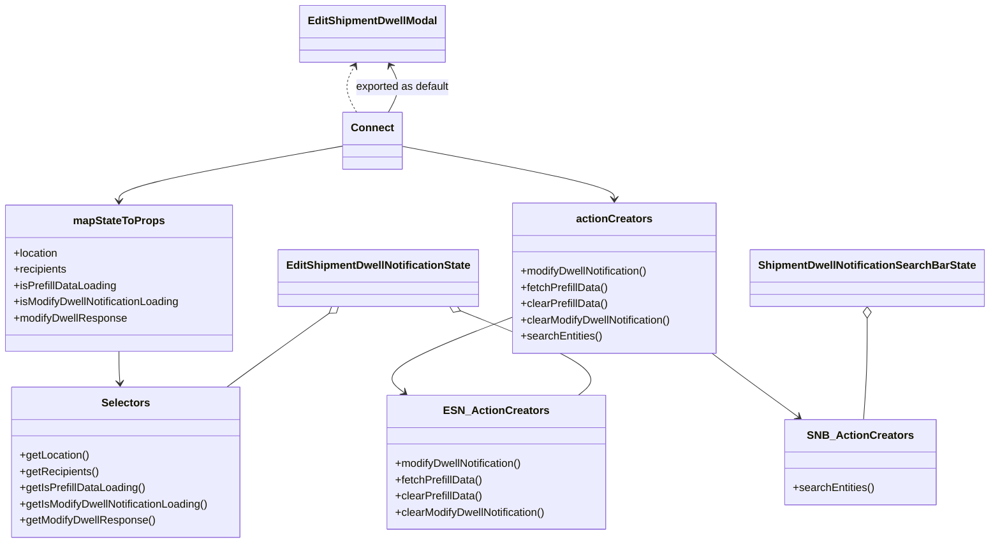

# Diagram: web/portal/src/pages/administration/admin-tools/shipment-dwell-notification/components/organisms/ShipmentDwellNotification.EditModal.organism.container.js

> Auto-generated by Obscura crawlers

## Mermaid

### SVG

<svg id="container" width="1452.771484375" xmlns="http://www.w3.org/2000/svg" class="classDiagram" height="802" viewBox="0 0 1452.771484375 802" role="graphics-document document" aria-roledescription="class"><g><defs><marker id="container_class-aggregationStart" class="marker aggregation class" refX="18" refY="7" markerWidth="190" markerHeight="240" orient="auto"><path d="M 18,7 L9,13 L1,7 L9,1 Z"></path></marker></defs><defs><marker id="container_class-aggregationEnd" class="marker aggregation class" refX="1" refY="7" markerWidth="20" markerHeight="28" orient="auto"><path d="M 18,7 L9,13 L1,7 L9,1 Z"></path></marker></defs><defs><marker id="container_class-extensionStart" class="marker extension class" refX="18" refY="7" markerWidth="190" markerHeight="240" orient="auto"><path d="M 1,7 L18,13 V 1 Z"></path></marker></defs><defs><marker id="container_class-extensionEnd" class="marker extension class" refX="1" refY="7" markerWidth="20" markerHeight="28" orient="auto"><path d="M 1,1 V 13 L18,7 Z"></path></marker></defs><defs><marker id="container_class-compositionStart" class="marker composition class" refX="18" refY="7" markerWidth="190" markerHeight="240" orient="auto"><path d="M 18,7 L9,13 L1,7 L9,1 Z"></path></marker></defs><defs><marker id="container_class-compositionEnd" class="marker composition class" refX="1" refY="7" markerWidth="20" markerHeight="28" orient="auto"><path d="M 18,7 L9,13 L1,7 L9,1 Z"></path></marker></defs><defs><marker id="container_class-dependencyStart" class="marker dependency class" refX="6" refY="7" markerWidth="190" markerHeight="240" orient="auto"><path d="M 5,7 L9,13 L1,7 L9,1 Z"></path></marker></defs><defs><marker id="container_class-dependencyEnd" class="marker dependency class" refX="13" refY="7" markerWidth="20" markerHeight="28" orient="auto"><path d="M 18,7 L9,13 L14,7 L9,1 Z"></path></marker></defs><defs><marker id="container_class-lollipopStart" class="marker lollipop class" refX="13" refY="7" markerWidth="190" markerHeight="240" orient="auto"><circle stroke="black" fill="transparent" cx="7" cy="7" r="6"></circle></marker></defs><defs><marker id="container_class-lollipopEnd" class="marker lollipop class" refX="1" refY="7" markerWidth="190" markerHeight="240" orient="auto"><circle stroke="black" fill="transparent" cx="7" cy="7" r="6"></circle></marker></defs><g class="root"><g class="clusters"></g><g class="edgePaths"><path d="M488.213,462.983L468.481,476.986C448.748,490.989,409.283,518.994,383.978,537.164C358.673,555.333,347.528,563.667,341.955,567.833L336.382,572" id="id_EditShipmentDwellNotificationState_Selectors_1" class="edge-thickness-normal edge-pattern-solid relation" style=";;;" data-edge="true" data-et="edge" data-id="id_EditShipmentDwellNotificationState_Selectors_1" data-points="W3sieCI6NTAyLjI4MTI1LCJ5Ijo0NTN9LHsieCI6MzY5LjgxODM1OTM3NSwieSI6NTQ3fSx7IngiOjMzNi4zODIyMjM2OTAyNTczLCJ5Ijo1NzJ9XQ==" marker-start="url(#container_class-aggregationStart)"></path><path d="M681.915,459.436L718.207,474.03C754.499,488.624,827.082,517.812,855.899,538.573C884.715,559.333,869.765,571.667,862.289,577.833L854.814,584" id="id_EditShipmentDwellNotificationState_ESN_ActionCreators_2" class="edge-thickness-normal edge-pattern-solid relation" style=";;;" data-edge="true" data-et="edge" data-id="id_EditShipmentDwellNotificationState_ESN_ActionCreators_2" data-points="W3sieCI6NjY1LjkxMDY3MzI1MzY3NjUsInkiOjQ1M30seyJ4Ijo4OTkuNjY2MDE1NjI1LCJ5Ijo1NDd9LHsieCI6ODU0LjgxNDAzNjY0OTgxNjIsInkiOjU4NH1d" marker-start="url(#container_class-aggregationStart)"></path><path d="M1277.865,470.25L1277.865,483.042C1277.865,495.833,1277.865,521.417,1276.971,546.375C1276.076,571.333,1274.287,595.667,1273.392,607.833L1272.498,620" id="id_ShipmentDwellNotificationSearchBarState_SNB_ActionCreators_3" class="edge-thickness-normal edge-pattern-solid relation" style=";;;" data-edge="true" data-et="edge" data-id="id_ShipmentDwellNotificationSearchBarState_SNB_ActionCreators_3" data-points="W3sieCI6MTI3Ny44NjUyMzQzNzUsInkiOjQ1M30seyJ4IjoxMjc3Ljg2NTIzNDM3NSwieSI6NTQ3fSx7IngiOjEyNzIuNDk3NTg3MzE2MTc2NiwieSI6NjIwfV0=" marker-start="url(#container_class-aggregationStart)"></path><path d="M177.926,519L177.926,523.667C177.926,528.333,177.926,537.667,178.159,545.503C178.392,553.339,178.858,559.677,179.091,562.847L179.324,566.016" id="id_mapStateToProps_Selectors_4" class="edge-thickness-normal edge-pattern-solid relation" style=";;;" data-edge="true" data-et="edge" data-id="id_mapStateToProps_Selectors_4" data-points="W3sieCI6MTc3LjkyNTc4MTI1LCJ5Ijo1MTl9LHsieCI6MTc3LjkyNTc4MTI1LCJ5Ijo1NDd9LHsieCI6MTc5Ljc2NDAxNjU0NDExNzY1LCJ5Ijo1NzJ9XQ==" marker-end="url(#container_class-dependencyEnd)"></path><path d="M755.326,469.546L721.631,482.455C687.936,495.364,620.546,521.182,594.287,539.658C568.028,558.135,582.9,569.269,590.336,574.837L597.772,580.404" id="id_actionCreators_ESN_ActionCreators_5" class="edge-thickness-normal edge-pattern-solid relation" style=";;;" data-edge="true" data-et="edge" data-id="id_actionCreators_ESN_ActionCreators_5" data-points="W3sieCI6NzU1LjMyNjE3MTg3NSwieSI6NDY5LjU0NjAwNDc0MjcwMDIzfSx7IngiOjU1My4xNTYyNSwieSI6NTQ3fSx7IngiOjYwMi41NzUzMTAyMDIyMDU5LCJ5Ijo1ODR9XQ==" marker-end="url(#container_class-dependencyEnd)"></path><path d="M1050.86,522L1056.218,526.167C1061.575,530.333,1072.289,538.667,1093.379,554.407C1114.469,570.148,1145.933,593.296,1161.666,604.87L1177.398,616.444" id="id_actionCreators_SNB_ActionCreators_6" class="edge-thickness-normal edge-pattern-solid relation" style=";;;" data-edge="true" data-et="edge" data-id="id_actionCreators_SNB_ActionCreators_6" data-points="W3sieCI6MTA1MC44NjAyNzk3NTY0MzM4LCJ5Ijo1MjJ9LHsieCI6MTA4My4wMDM5MDYyNSwieSI6NTQ3fSx7IngiOjExODIuMjMwOTQyNjcwMDM2NywieSI6NjIwfV0=" marker-end="url(#container_class-dependencyEnd)"></path><path d="M511.225,215.448L455.675,225.374C400.125,235.299,289.025,255.149,233.476,268.741C177.926,282.333,177.926,289.667,177.926,293.333L177.926,297" id="id_Connect_mapStateToProps_7" class="edge-thickness-normal edge-pattern-solid relation" style=";;;" data-edge="true" data-et="edge" data-id="id_Connect_mapStateToProps_7" data-points="W3sieCI6NTExLjIyNDYwOTM3NSwieSI6MjE1LjQ0ODQzODIyNDMxMDI1fSx7IngiOjE3Ny45MjU3ODEyNSwieSI6Mjc1fSx7IngiOjE3Ny45MjU3ODEyNSwieSI6MzAzfV0=" marker-end="url(#container_class-dependencyEnd)"></path><path d="M594.6,215.863L646.857,225.719C699.114,235.575,803.628,255.288,855.885,268.31C908.143,281.333,908.143,287.667,908.143,290.833L908.143,294" id="id_Connect_actionCreators_8" class="edge-thickness-normal edge-pattern-solid relation" style=";;;" data-edge="true" data-et="edge" data-id="id_Connect_actionCreators_8" data-points="W3sieCI6NTk0LjU5OTYwOTM3NSwieSI6MjE1Ljg2MjY3NzE3OTIwODA1fSx7IngiOjkwOC4xNDI1NzgxMjUsInkiOjI3NX0seyJ4Ijo5MDguMTQyNTc4MTI1LCJ5IjozMDB9XQ==" marker-end="url(#container_class-dependencyEnd)"></path><path d="M528.793,166L525.252,159.833C521.71,153.667,514.628,141.333,514.13,129.867C513.632,118.401,519.718,107.802,522.762,102.503L525.805,97.203" id="id_Connect_EditShipmentDwellModal_9" class="edge-thickness-normal edge-pattern-dashed relation" style=";;;" data-edge="true" data-et="edge" data-id="id_Connect_EditShipmentDwellModal_9" data-points="W3sieCI6NTI4Ljc5Mjg0NTEzNDQ5MzYsInkiOjE2Nn0seyJ4Ijo1MDcuNTQ0OTIxODc1LCJ5IjoxMjl9LHsieCI6NTI4Ljc5Mjg0NTEzNDQ5MzYsInkiOjkyfV0=" marker-end="url(#container_class-dependencyEnd)"></path><path d="M580.019,97.203L583.063,102.503C586.106,107.802,592.193,118.401,591.695,129.867C591.197,141.333,584.114,153.667,580.573,159.833L577.031,166" id="id_EditShipmentDwellModal_Connect_10" class="edge-thickness-normal edge-pattern-solid relation" style=";;;" data-edge="true" data-et="edge" data-id="id_EditShipmentDwellModal_Connect_10" data-points="W3sieCI6NTc3LjAzMTM3MzYxNTUwNjQsInkiOjkyfSx7IngiOjU5OC4yNzkyOTY4NzUsInkiOjEyOX0seyJ4Ijo1NzcuMDMxMzczNjE1NTA2NCwieSI6MTY2fV0=" marker-start="url(#container_class-dependencyStart)"></path></g><g class="edgeLabels"><g class="edgeLabel"><g class="label" data-id="id_EditShipmentDwellNotificationState_Selectors_1" transform="translate(0, 0)"><foreignObject width="0" height="0">

</foreignObject></g></g><g class="edgeLabel"><g class="label" data-id="id_EditShipmentDwellNotificationState_ESN_ActionCreators_2" transform="translate(0, 0)"><foreignObject width="0" height="0">

</foreignObject></g></g><g class="edgeLabel"><g class="label" data-id="id_ShipmentDwellNotificationSearchBarState_SNB_ActionCreators_3" transform="translate(0, 0)"><foreignObject width="0" height="0">

</foreignObject></g></g><g class="edgeLabel"><g class="label" data-id="id_mapStateToProps_Selectors_4" transform="translate(0, 0)"><foreignObject width="0" height="0">

</foreignObject></g></g><g class="edgeLabel"><g class="label" data-id="id_actionCreators_ESN_ActionCreators_5" transform="translate(0, 0)"><foreignObject width="0" height="0">

</foreignObject></g></g><g class="edgeLabel"><g class="label" data-id="id_actionCreators_SNB_ActionCreators_6" transform="translate(0, 0)"><foreignObject width="0" height="0">

</foreignObject></g></g><g class="edgeLabel"><g class="label" data-id="id_Connect_mapStateToProps_7" transform="translate(0, 0)"><foreignObject width="0" height="0">

</foreignObject></g></g><g class="edgeLabel"><g class="label" data-id="id_Connect_actionCreators_8" transform="translate(0, 0)"><foreignObject width="0" height="0">

</foreignObject></g></g><g class="edgeLabel"><g class="label" data-id="id_Connect_EditShipmentDwellModal_9" transform="translate(0, 0)"><foreignObject width="0" height="0">

</foreignObject></g></g><g class="edgeLabel" transform="translate(598.279296875, 129)"><g class="label" data-id="id_EditShipmentDwellModal_Connect_10" transform="translate(-70.734375, -12)"><foreignObject width="141.46875" height="24">

exported as default

</foreignObject></g></g></g><g class="nodes"><g class="node default" id="classId-EditShipmentDwellModal-0" transform="translate(552.912109375, 50)"><g class="basic label-container"><path d="M-104.109375 -42 L104.109375 -42 L104.109375 42 L-104.109375 42" stroke="none" stroke-width="0" fill="#ECECFF" style=""></path><path d="M-104.109375 -42 C-52.23444326679237 -42, -0.35951153358473675 -42, 104.109375 -42 M-104.109375 -42 C-34.982549090008305 -42, 34.14427681998339 -42, 104.109375 -42 M104.109375 -42 C104.109375 -20.576263384713897, 104.109375 0.8474732305722057, 104.109375 42 M104.109375 -42 C104.109375 -18.07044919375928, 104.109375 5.859101612481439, 104.109375 42 M104.109375 42 C44.8414806776997 42, -14.4264136446006 42, -104.109375 42 M104.109375 42 C33.03187652626603 42, -38.045621947467936 42, -104.109375 42 M-104.109375 42 C-104.109375 19.336900113453588, -104.109375 -3.3261997730928243, -104.109375 -42 M-104.109375 42 C-104.109375 12.728843565611953, -104.109375 -16.542312868776094, -104.109375 -42" stroke="#9370DB" stroke-width="1.3" fill="none" stroke-dasharray="0 0" style=""></path></g><g class="annotation-group text" transform="translate(0, -18)"></g><g class="label-group text" transform="translate(-92.109375, -18)"><g class="label" style="font-weight: bolder" transform="translate(0,-12)"><foreignObject width="184.21875" height="24">

EditShipmentDwellModal

</foreignObject></g></g><g class="members-group text" transform="translate(-92.109375, 30)"></g><g class="methods-group text" transform="translate(-92.109375, 60)"></g><g class="divider" style=""><path d="M-104.109375 6 C-61.28424278314136 6, -18.459110566282718 6, 104.109375 6 M-104.109375 6 C-30.64474360750323 6, 42.81988778499354 6, 104.109375 6" stroke="#9370DB" stroke-width="1.3" fill="none" stroke-dasharray="0 0" style=""></path></g><g class="divider" style=""><path d="M-104.109375 24 C-30.580443170012586 24, 42.94848865997483 24, 104.109375 24 M-104.109375 24 C-57.8360290304919 24, -11.562683060983801 24, 104.109375 24" stroke="#9370DB" stroke-width="1.3" fill="none" stroke-dasharray="0 0" style=""></path></g></g><g class="node default" id="classId-Connect-1" transform="translate(552.912109375, 208)"><g class="basic label-container"><path d="M-41.6875 -42 L41.6875 -42 L41.6875 42 L-41.6875 42" stroke="none" stroke-width="0" fill="#ECECFF" style=""></path><path d="M-41.6875 -42 C-13.863634177102103 -42, 13.960231645795794 -42, 41.6875 -42 M-41.6875 -42 C-13.286162736284926 -42, 15.115174527430149 -42, 41.6875 -42 M41.6875 -42 C41.6875 -14.58266441767125, 41.6875 12.8346711646575, 41.6875 42 M41.6875 -42 C41.6875 -22.01873757030847, 41.6875 -2.037475140616941, 41.6875 42 M41.6875 42 C19.185047522755884 42, -3.3174049544882322 42, -41.6875 42 M41.6875 42 C19.60068702879136 42, -2.4861259424172815 42, -41.6875 42 M-41.6875 42 C-41.6875 22.547082943800934, -41.6875 3.094165887601868, -41.6875 -42 M-41.6875 42 C-41.6875 22.93327360230205, -41.6875 3.866547204604103, -41.6875 -42" stroke="#9370DB" stroke-width="1.3" fill="none" stroke-dasharray="0 0" style=""></path></g><g class="annotation-group text" transform="translate(0, -18)"></g><g class="label-group text" transform="translate(-29.6875, -18)"><g class="label" style="font-weight: bolder" transform="translate(0,-12)"><foreignObject width="59.375" height="24">

Connect

</foreignObject></g></g><g class="members-group text" transform="translate(-29.6875, 30)"></g><g class="methods-group text" transform="translate(-29.6875, 60)"></g><g class="divider" style=""><path d="M-41.6875 6 C-22.963477291612126 6, -4.239454583224251 6, 41.6875 6 M-41.6875 6 C-10.000994726155199 6, 21.685510547689603 6, 41.6875 6" stroke="#9370DB" stroke-width="1.3" fill="none" stroke-dasharray="0 0" style=""></path></g><g class="divider" style=""><path d="M-41.6875 24 C-15.870933660901859 24, 9.945632678196283 24, 41.6875 24 M-41.6875 24 C-20.880560289066906 24, -0.07362057813381284 24, 41.6875 24" stroke="#9370DB" stroke-width="1.3" fill="none" stroke-dasharray="0 0" style=""></path></g></g><g class="node default" id="classId-mapStateToProps-2" transform="translate(177.92578125, 411)"><g class="basic label-container"><path d="M-169.92578125 -108 L169.92578125 -108 L169.92578125 108 L-169.92578125 108" stroke="none" stroke-width="0" fill="#ECECFF" style=""></path><path d="M-169.92578125 -108 C-98.24652645501642 -108, -26.567271660032844 -108, 169.92578125 -108 M-169.92578125 -108 C-83.50891176435059 -108, 2.9079577212988283 -108, 169.92578125 -108 M169.92578125 -108 C169.92578125 -61.8687809491506, 169.92578125 -15.737561898301195, 169.92578125 108 M169.92578125 -108 C169.92578125 -55.41718034952619, 169.92578125 -2.8343606990523824, 169.92578125 108 M169.92578125 108 C38.35688406259811 108, -93.21201312480378 108, -169.92578125 108 M169.92578125 108 C49.087786479731975 108, -71.75020829053605 108, -169.92578125 108 M-169.92578125 108 C-169.92578125 50.029087954976134, -169.92578125 -7.9418240900477315, -169.92578125 -108 M-169.92578125 108 C-169.92578125 25.436821578214875, -169.92578125 -57.12635684357025, -169.92578125 -108" stroke="#9370DB" stroke-width="1.3" fill="none" stroke-dasharray="0 0" style=""></path></g><g class="annotation-group text" transform="translate(0, -84)"></g><g class="label-group text" transform="translate(-64.7109375, -84)"><g class="label" style="font-weight: bolder" transform="translate(0,-12)"><foreignObject width="129.421875" height="24">

mapStateToProps

</foreignObject></g></g><g class="members-group text" transform="translate(-157.92578125, -36)"><g class="label" style="" transform="translate(0,-12)"><foreignObject width="67.140625" height="24">

+location

</foreignObject></g><g class="label" style="" transform="translate(0,12)"><foreignObject width="79.921875" height="24">

+recipients

</foreignObject></g><g class="label" style="" transform="translate(0,36)"><foreignObject width="152.390625" height="24">

+isPrefillDataLoading

</foreignObject></g><g class="label" style="" transform="translate(0,60)"><foreignObject width="251.140625" height="24">

+isModifyDwellNotificationLoading

</foreignObject></g><g class="label" style="" transform="translate(0,84)"><foreignObject width="168.28125" height="24">

+modifyDwellResponse

</foreignObject></g></g><g class="methods-group text" transform="translate(-157.92578125, 108)"></g><g class="divider" style=""><path d="M-169.92578125 -60 C-37.843402251658375 -60, 94.23897674668325 -60, 169.92578125 -60 M-169.92578125 -60 C-82.48968932181137 -60, 4.946402606377262 -60, 169.92578125 -60" stroke="#9370DB" stroke-width="1.3" fill="none" stroke-dasharray="0 0" style=""></path></g><g class="divider" style=""><path d="M-169.92578125 84 C-80.18628843375205 84, 9.553204382495892 84, 169.92578125 84 M-169.92578125 84 C-66.0855845030393 84, 37.7546122439214 84, 169.92578125 84" stroke="#9370DB" stroke-width="1.3" fill="none" stroke-dasharray="0 0" style=""></path></g></g><g class="node default" id="classId-actionCreators-3" transform="translate(908.142578125, 411)"><g class="basic label-container"><path d="M-152.81640625 -111 L152.81640625 -111 L152.81640625 111 L-152.81640625 111" stroke="none" stroke-width="0" fill="#ECECFF" style=""></path><path d="M-152.81640625 -111 C-70.20832633271328 -111, 12.399753584573432 -111, 152.81640625 -111 M-152.81640625 -111 C-49.87731270667895 -111, 53.0617808366421 -111, 152.81640625 -111 M152.81640625 -111 C152.81640625 -24.906459700918575, 152.81640625 61.18708059816285, 152.81640625 111 M152.81640625 -111 C152.81640625 -46.736275116214856, 152.81640625 17.52744976757029, 152.81640625 111 M152.81640625 111 C79.70406239814959 111, 6.591718546299177 111, -152.81640625 111 M152.81640625 111 C60.39325232979647 111, -32.029901590407064 111, -152.81640625 111 M-152.81640625 111 C-152.81640625 32.69134642118375, -152.81640625 -45.617307157632496, -152.81640625 -111 M-152.81640625 111 C-152.81640625 51.836061911737026, -152.81640625 -7.3278761765259475, -152.81640625 -111" stroke="#9370DB" stroke-width="1.3" fill="none" stroke-dasharray="0 0" style=""></path></g><g class="annotation-group text" transform="translate(0, -87)"></g><g class="label-group text" transform="translate(-53.6328125, -87)"><g class="label" style="font-weight: bolder" transform="translate(0,-12)"><foreignObject width="107.265625" height="24">

actionCreators

</foreignObject></g></g><g class="members-group text" transform="translate(-140.81640625, -39)"></g><g class="methods-group text" transform="translate(-140.81640625, -9)"><g class="label" style="" transform="translate(0,-12)"><foreignObject width="193.5625" height="24">

+modifyDwellNotification()

</foreignObject></g><g class="label" style="" transform="translate(0,12)"><foreignObject width="129.78125" height="24">

+fetchPrefillData()

</foreignObject></g><g class="label" style="" transform="translate(0,36)"><foreignObject width="129.234375" height="24">

+clearPrefillData()

</foreignObject></g><g class="label" style="" transform="translate(0,60)"><foreignObject width="228" height="24">

+clearModifyDwellNotification()

</foreignObject></g><g class="label" style="" transform="translate(0,84)"><foreignObject width="120.359375" height="24">

+searchEntities()

</foreignObject></g></g><g class="divider" style=""><path d="M-152.81640625 -63 C-39.68515181659696 -63, 73.44610261680609 -63, 152.81640625 -63 M-152.81640625 -63 C-64.68376088247385 -63, 23.448884485052304 -63, 152.81640625 -63" stroke="#9370DB" stroke-width="1.3" fill="none" stroke-dasharray="0 0" style=""></path></g><g class="divider" style=""><path d="M-152.81640625 -39 C-69.71588796803675 -39, 13.384630313926493 -39, 152.81640625 -39 M-152.81640625 -39 C-45.24784498232448 -39, 62.32071628535104 -39, 152.81640625 -39" stroke="#9370DB" stroke-width="1.3" fill="none" stroke-dasharray="0 0" style=""></path></g></g><g class="node default" id="classId-EditShipmentDwellNotificationState-4" transform="translate(561.466796875, 411)"><g class="basic label-container"><path d="M-143.859375 -42 L143.859375 -42 L143.859375 42 L-143.859375 42" stroke="none" stroke-width="0" fill="#ECECFF" style=""></path><path d="M-143.859375 -42 C-65.74601099620921 -42, 12.367353007581585 -42, 143.859375 -42 M-143.859375 -42 C-53.35608134720874 -42, 37.147212305582514 -42, 143.859375 -42 M143.859375 -42 C143.859375 -16.383558197839168, 143.859375 9.232883604321664, 143.859375 42 M143.859375 -42 C143.859375 -8.56339275327558, 143.859375 24.87321449344884, 143.859375 42 M143.859375 42 C33.8806814946728 42, -76.0980120106544 42, -143.859375 42 M143.859375 42 C72.84670878003516 42, 1.8340425600703156 42, -143.859375 42 M-143.859375 42 C-143.859375 9.172189501860196, -143.859375 -23.65562099627961, -143.859375 -42 M-143.859375 42 C-143.859375 20.682581244495722, -143.859375 -0.6348375110085556, -143.859375 -42" stroke="#9370DB" stroke-width="1.3" fill="none" stroke-dasharray="0 0" style=""></path></g><g class="annotation-group text" transform="translate(0, -18)"></g><g class="label-group text" transform="translate(-131.859375, -18)"><g class="label" style="font-weight: bolder" transform="translate(0,-12)"><foreignObject width="263.71875" height="24">

EditShipmentDwellNotificationState

</foreignObject></g></g><g class="members-group text" transform="translate(-131.859375, 30)"></g><g class="methods-group text" transform="translate(-131.859375, 60)"></g><g class="divider" style=""><path d="M-143.859375 6 C-78.7070234681031 6, -13.554671936206205 6, 143.859375 6 M-143.859375 6 C-39.0865795791008 6, 65.6862158417984 6, 143.859375 6" stroke="#9370DB" stroke-width="1.3" fill="none" stroke-dasharray="0 0" style=""></path></g><g class="divider" style=""><path d="M-143.859375 24 C-32.444579295571145 24, 78.97021640885771 24, 143.859375 24 M-143.859375 24 C-48.6899495311191 24, 46.479475937761805 24, 143.859375 24" stroke="#9370DB" stroke-width="1.3" fill="none" stroke-dasharray="0 0" style=""></path></g></g><g class="node default" id="classId-ShipmentDwellNotificationSearchBarState-5" transform="translate(1277.865234375, 411)"><g class="basic label-container"><path d="M-166.90625 -42 L166.90625 -42 L166.90625 42 L-166.90625 42" stroke="none" stroke-width="0" fill="#ECECFF" style=""></path><path d="M-166.90625 -42 C-52.944899874010815 -42, 61.01645025197837 -42, 166.90625 -42 M-166.90625 -42 C-63.124588302506595 -42, 40.65707339498681 -42, 166.90625 -42 M166.90625 -42 C166.90625 -19.06358493293627, 166.90625 3.8728301341274616, 166.90625 42 M166.90625 -42 C166.90625 -11.17419091625898, 166.90625 19.65161816748204, 166.90625 42 M166.90625 42 C57.94910635794075 42, -51.0080372841185 42, -166.90625 42 M166.90625 42 C56.324494855146995 42, -54.25726028970601 42, -166.90625 42 M-166.90625 42 C-166.90625 12.491864178396977, -166.90625 -17.016271643206046, -166.90625 -42 M-166.90625 42 C-166.90625 14.762536844190663, -166.90625 -12.474926311618674, -166.90625 -42" stroke="#9370DB" stroke-width="1.3" fill="none" stroke-dasharray="0 0" style=""></path></g><g class="annotation-group text" transform="translate(0, -18)"></g><g class="label-group text" transform="translate(-154.90625, -18)"><g class="label" style="font-weight: bolder" transform="translate(0,-12)"><foreignObject width="309.8125" height="24">

ShipmentDwellNotificationSearchBarState

</foreignObject></g></g><g class="members-group text" transform="translate(-154.90625, 30)"></g><g class="methods-group text" transform="translate(-154.90625, 60)"></g><g class="divider" style=""><path d="M-166.90625 6 C-76.0248241635806 6, 14.856601672838792 6, 166.90625 6 M-166.90625 6 C-40.327147438328154 6, 86.25195512334369 6, 166.90625 6" stroke="#9370DB" stroke-width="1.3" fill="none" stroke-dasharray="0 0" style=""></path></g><g class="divider" style=""><path d="M-166.90625 24 C-86.50867815144224 24, -6.11110630288448 24, 166.90625 24 M-166.90625 24 C-76.06510530433853 24, 14.77603939132294 24, 166.90625 24" stroke="#9370DB" stroke-width="1.3" fill="none" stroke-dasharray="0 0" style=""></path></g></g><g class="node default" id="classId-Selectors-6" transform="translate(187.92578125, 683)"><g class="basic label-container"><path d="M-171.2265625 -111 L171.2265625 -111 L171.2265625 111 L-171.2265625 111" stroke="none" stroke-width="0" fill="#ECECFF" style=""></path><path d="M-171.2265625 -111 C-35.507043618933096 -111, 100.21247526213381 -111, 171.2265625 -111 M-171.2265625 -111 C-71.24829210447375 -111, 28.729978291052504 -111, 171.2265625 -111 M171.2265625 -111 C171.2265625 -40.59647989276806, 171.2265625 29.807040214463882, 171.2265625 111 M171.2265625 -111 C171.2265625 -51.041414010601144, 171.2265625 8.917171978797711, 171.2265625 111 M171.2265625 111 C40.72102813293557 111, -89.78450623412886 111, -171.2265625 111 M171.2265625 111 C92.61904048121434 111, 14.011518462428683 111, -171.2265625 111 M-171.2265625 111 C-171.2265625 62.57276433759632, -171.2265625 14.145528675192637, -171.2265625 -111 M-171.2265625 111 C-171.2265625 46.911877425085635, -171.2265625 -17.17624514982873, -171.2265625 -111" stroke="#9370DB" stroke-width="1.3" fill="none" stroke-dasharray="0 0" style=""></path></g><g class="annotation-group text" transform="translate(0, -87)"></g><g class="label-group text" transform="translate(-34.171875, -87)"><g class="label" style="font-weight: bolder" transform="translate(0,-12)"><foreignObject width="68.34375" height="24">

Selectors

</foreignObject></g></g><g class="members-group text" transform="translate(-159.2265625, -39)"></g><g class="methods-group text" transform="translate(-159.2265625, -9)"><g class="label" style="" transform="translate(0,-12)"><foreignObject width="103.03125" height="24">

+getLocation()

</foreignObject></g><g class="label" style="" transform="translate(0,12)"><foreignObject width="116.59375" height="24">

+getRecipients()

</foreignObject></g><g class="label" style="" transform="translate(0,36)"><foreignObject width="185.53125" height="24">

+getIsPrefillDataLoading()

</foreignObject></g><g class="label" style="" transform="translate(0,60)"><foreignObject width="284.28125" height="24">

+getIsModifyDwellNotificationLoading()

</foreignObject></g><g class="label" style="" transform="translate(0,84)"><foreignObject width="199.9375" height="24">

+getModifyDwellResponse()

</foreignObject></g></g><g class="divider" style=""><path d="M-171.2265625 -63 C-96.92422239413794 -63, -22.621882288275884 -63, 171.2265625 -63 M-171.2265625 -63 C-87.8718657047242 -63, -4.517168909448401 -63, 171.2265625 -63" stroke="#9370DB" stroke-width="1.3" fill="none" stroke-dasharray="0 0" style=""></path></g><g class="divider" style=""><path d="M-171.2265625 -39 C-60.08822286447618 -39, 51.05011677104764 -39, 171.2265625 -39 M-171.2265625 -39 C-40.75051703725944 -39, 89.72552842548112 -39, 171.2265625 -39" stroke="#9370DB" stroke-width="1.3" fill="none" stroke-dasharray="0 0" style=""></path></g></g><g class="node default" id="classId-ESN_ActionCreators-7" transform="translate(734.8046875, 683)"><g class="basic label-container"><path d="M-162.0703125 -99 L162.0703125 -99 L162.0703125 99 L-162.0703125 99" stroke="none" stroke-width="0" fill="#ECECFF" style=""></path><path d="M-162.0703125 -99 C-49.995637333723565 -99, 62.07903783255287 -99, 162.0703125 -99 M-162.0703125 -99 C-65.4048163040235 -99, 31.260679891953004 -99, 162.0703125 -99 M162.0703125 -99 C162.0703125 -50.84959991220004, 162.0703125 -2.6991998244000825, 162.0703125 99 M162.0703125 -99 C162.0703125 -27.14535218860631, 162.0703125 44.70929562278738, 162.0703125 99 M162.0703125 99 C51.3502125958277 99, -59.3698873083446 99, -162.0703125 99 M162.0703125 99 C75.33103327594888 99, -11.408245948102234 99, -162.0703125 99 M-162.0703125 99 C-162.0703125 27.631692393294685, -162.0703125 -43.73661521341063, -162.0703125 -99 M-162.0703125 99 C-162.0703125 29.43715535898204, -162.0703125 -40.12568928203592, -162.0703125 -99" stroke="#9370DB" stroke-width="1.3" fill="none" stroke-dasharray="0 0" style=""></path></g><g class="annotation-group text" transform="translate(0, -75)"></g><g class="label-group text" transform="translate(-72.140625, -75)"><g class="label" style="font-weight: bolder" transform="translate(0,-12)"><foreignObject width="144.28125" height="24">

ESN_ActionCreators

</foreignObject></g></g><g class="members-group text" transform="translate(-150.0703125, -27)"></g><g class="methods-group text" transform="translate(-150.0703125, 3)"><g class="label" style="" transform="translate(0,-12)"><foreignObject width="193.5625" height="24">

+modifyDwellNotification()

</foreignObject></g><g class="label" style="" transform="translate(0,12)"><foreignObject width="129.78125" height="24">

+fetchPrefillData()

</foreignObject></g><g class="label" style="" transform="translate(0,36)"><foreignObject width="129.234375" height="24">

+clearPrefillData()

</foreignObject></g><g class="label" style="" transform="translate(0,60)"><foreignObject width="228" height="24">

+clearModifyDwellNotification()

</foreignObject></g></g><g class="divider" style=""><path d="M-162.0703125 -51 C-95.84940033510024 -51, -29.628488170200484 -51, 162.0703125 -51 M-162.0703125 -51 C-84.39377072408402 -51, -6.717228948168042 -51, 162.0703125 -51" stroke="#9370DB" stroke-width="1.3" fill="none" stroke-dasharray="0 0" style=""></path></g><g class="divider" style=""><path d="M-162.0703125 -27 C-83.24652123565593 -27, -4.422729971311867 -27, 162.0703125 -27 M-162.0703125 -27 C-61.749704826363896 -27, 38.57090284727221 -27, 162.0703125 -27" stroke="#9370DB" stroke-width="1.3" fill="none" stroke-dasharray="0 0" style=""></path></g></g><g class="node default" id="classId-SNB_ActionCreators-8" transform="translate(1267.865234375, 683)"><g class="basic label-container"><path d="M-108.57421875 -63 L108.57421875 -63 L108.57421875 63 L-108.57421875 63" stroke="none" stroke-width="0" fill="#ECECFF" style=""></path><path d="M-108.57421875 -63 C-24.82227374835948 -63, 58.92967125328104 -63, 108.57421875 -63 M-108.57421875 -63 C-32.055841559184714 -63, 44.46253563163057 -63, 108.57421875 -63 M108.57421875 -63 C108.57421875 -18.75263778108622, 108.57421875 25.494724437827557, 108.57421875 63 M108.57421875 -63 C108.57421875 -36.64081777828665, 108.57421875 -10.281635556573306, 108.57421875 63 M108.57421875 63 C60.791324426709835 63, 13.00843010341967 63, -108.57421875 63 M108.57421875 63 C23.628737754714166 63, -61.31674324057167 63, -108.57421875 63 M-108.57421875 63 C-108.57421875 21.611847578497517, -108.57421875 -19.776304843004965, -108.57421875 -63 M-108.57421875 63 C-108.57421875 24.51114032895122, -108.57421875 -13.977719342097558, -108.57421875 -63" stroke="#9370DB" stroke-width="1.3" fill="none" stroke-dasharray="0 0" style=""></path></g><g class="annotation-group text" transform="translate(0, -39)"></g><g class="label-group text" transform="translate(-72.7890625, -39)"><g class="label" style="font-weight: bolder" transform="translate(0,-12)"><foreignObject width="145.578125" height="24">

SNB_ActionCreators

</foreignObject></g></g><g class="members-group text" transform="translate(-96.57421875, 9)"></g><g class="methods-group text" transform="translate(-96.57421875, 39)"><g class="label" style="" transform="translate(0,-12)"><foreignObject width="120.359375" height="24">

+searchEntities()

</foreignObject></g></g><g class="divider" style=""><path d="M-108.57421875 -15 C-58.24279215227639 -15, -7.9113655545527735 -15, 108.57421875 -15 M-108.57421875 -15 C-62.02004947897969 -15, -15.465880207959387 -15, 108.57421875 -15" stroke="#9370DB" stroke-width="1.3" fill="none" stroke-dasharray="0 0" style=""></path></g><g class="divider" style=""><path d="M-108.57421875 9 C-25.125600461777736 9, 58.32301782644453 9, 108.57421875 9 M-108.57421875 9 C-21.85817259892265 9, 64.8578735521547 9, 108.57421875 9" stroke="#9370DB" stroke-width="1.3" fill="none" stroke-dasharray="0 0" style=""></path></g></g></g></g></g></svg>
