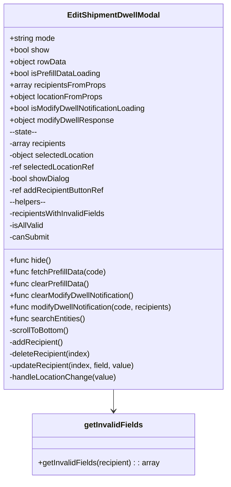
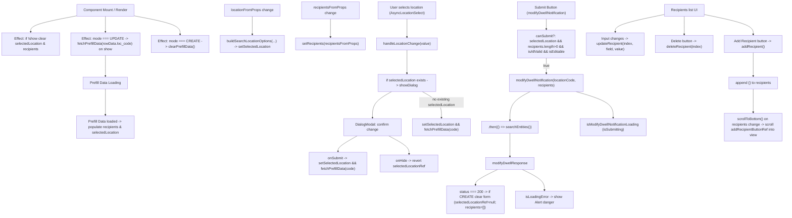

# Diagram: web/portal/src/pages/administration/admin-tools/shipment-dwell-notification/components/organisms/ShipmentDwellNotification.EditModal.organism.js

> Auto-generated by Obscura crawlers

## Diagram 1

### SVG

<svg id="container" width="476.1875" xmlns="http://www.w3.org/2000/svg" class="classDiagram" height="984" viewBox="0 0 476.1875 984" role="graphics-document document" aria-roledescription="class"><g><defs><marker id="container_class-aggregationStart" class="marker aggregation class" refX="18" refY="7" markerWidth="190" markerHeight="240" orient="auto"><path d="M 18,7 L9,13 L1,7 L9,1 Z"></path></marker></defs><defs><marker id="container_class-aggregationEnd" class="marker aggregation class" refX="1" refY="7" markerWidth="20" markerHeight="28" orient="auto"><path d="M 18,7 L9,13 L1,7 L9,1 Z"></path></marker></defs><defs><marker id="container_class-extensionStart" class="marker extension class" refX="18" refY="7" markerWidth="190" markerHeight="240" orient="auto"><path d="M 1,7 L18,13 V 1 Z"></path></marker></defs><defs><marker id="container_class-extensionEnd" class="marker extension class" refX="1" refY="7" markerWidth="20" markerHeight="28" orient="auto"><path d="M 1,1 V 13 L18,7 Z"></path></marker></defs><defs><marker id="container_class-compositionStart" class="marker composition class" refX="18" refY="7" markerWidth="190" markerHeight="240" orient="auto"><path d="M 18,7 L9,13 L1,7 L9,1 Z"></path></marker></defs><defs><marker id="container_class-compositionEnd" class="marker composition class" refX="1" refY="7" markerWidth="20" markerHeight="28" orient="auto"><path d="M 18,7 L9,13 L1,7 L9,1 Z"></path></marker></defs><defs><marker id="container_class-dependencyStart" class="marker dependency class" refX="6" refY="7" markerWidth="190" markerHeight="240" orient="auto"><path d="M 5,7 L9,13 L1,7 L9,1 Z"></path></marker></defs><defs><marker id="container_class-dependencyEnd" class="marker dependency class" refX="13" refY="7" markerWidth="20" markerHeight="28" orient="auto"><path d="M 18,7 L9,13 L14,7 L9,1 Z"></path></marker></defs><defs><marker id="container_class-lollipopStart" class="marker lollipop class" refX="13" refY="7" markerWidth="190" markerHeight="240" orient="auto"><circle stroke="black" fill="transparent" cx="7" cy="7" r="6"></circle></marker></defs><defs><marker id="container_class-lollipopEnd" class="marker lollipop class" refX="1" refY="7" markerWidth="190" markerHeight="240" orient="auto"><circle stroke="black" fill="transparent" cx="7" cy="7" r="6"></circle></marker></defs><g class="root"><g class="clusters"></g><g class="edgePaths"><path d="M238.094,800L238.094,804.167C238.094,808.333,238.094,816.667,238.094,824C238.094,831.333,238.094,837.667,238.094,840.833L238.094,844" id="id_EditShipmentDwellModal_getInvalidFields_1" class="edge-thickness-normal edge-pattern-solid relation" style=";;;" data-edge="true" data-et="edge" data-id="id_EditShipmentDwellModal_getInvalidFields_1" data-points="W3sieCI6MjM4LjA5Mzc1LCJ5Ijo4MDB9LHsieCI6MjM4LjA5Mzc1LCJ5Ijo4MjV9LHsieCI6MjM4LjA5Mzc1LCJ5Ijo4NTB9XQ==" marker-end="url(#container_class-dependencyEnd)"></path></g><g class="edgeLabels"><g class="edgeLabel"><g class="label" data-id="id_EditShipmentDwellModal_getInvalidFields_1" transform="translate(0, 0)"><foreignObject width="0" height="0">

</foreignObject></g></g></g><g class="nodes"><g class="node default" id="classId-EditShipmentDwellModal-0" transform="translate(238.09375, 404)"><g class="basic label-container"><path d="M-230.09375 -396 L230.09375 -396 L230.09375 396 L-230.09375 396" stroke="none" stroke-width="0" fill="#ECECFF" style=""></path><path d="M-230.09375 -396 C-62.0906906852677 -396, 105.9123686294646 -396, 230.09375 -396 M-230.09375 -396 C-68.7688286502472 -396, 92.5560926995056 -396, 230.09375 -396 M230.09375 -396 C230.09375 -94.92184173514244, 230.09375 206.15631652971513, 230.09375 396 M230.09375 -396 C230.09375 -122.82149243971605, 230.09375 150.3570151205679, 230.09375 396 M230.09375 396 C96.32160425661263 396, -37.45054148677474 396, -230.09375 396 M230.09375 396 C96.11911030552287 396, -37.85552938895427 396, -230.09375 396 M-230.09375 396 C-230.09375 85.6325431764783, -230.09375 -224.7349136470434, -230.09375 -396 M-230.09375 396 C-230.09375 136.8610578198365, -230.09375 -122.277884360327, -230.09375 -396" stroke="#9370DB" stroke-width="1.3" fill="none" stroke-dasharray="0 0" style=""></path></g><g class="annotation-group text" transform="translate(0, -372)"></g><g class="label-group text" transform="translate(-92.109375, -372)"><g class="label" style="font-weight: bolder" transform="translate(0,-12)"><foreignObject width="184.21875" height="24">

EditShipmentDwellModal

</foreignObject></g></g><g class="members-group text" transform="translate(-218.09375, -324)"><g class="label" style="" transform="translate(0,-12)"><foreignObject width="95.203125" height="24">

+string mode

</foreignObject></g><g class="label" style="" transform="translate(0,12)"><foreignObject width="82.78125" height="24">

+bool show

</foreignObject></g><g class="label" style="" transform="translate(0,36)"><foreignObject width="117.4375" height="24">

+object rowData

</foreignObject></g><g class="label" style="" transform="translate(0,60)"><foreignObject width="189.515625" height="24">

+bool isPrefillDataLoading

</foreignObject></g><g class="label" style="" transform="translate(0,84)"><foreignObject width="197.796875" height="24">

+array recipientsFromProps

</foreignObject></g><g class="label" style="" transform="translate(0,108)"><foreignObject width="193.890625" height="24">

+object locationFromProps

</foreignObject></g><g class="label" style="" transform="translate(0,132)"><foreignObject width="288.265625" height="24">

+bool isModifyDwellNotificationLoading

</foreignObject></g><g class="label" style="" transform="translate(0,156)"><foreignObject width="218" height="24">

+object modifyDwellResponse

</foreignObject></g><g class="label" style="" transform="translate(0,180)"><foreignObject width="61.890625" height="24">

--state--

</foreignObject></g><g class="label" style="" transform="translate(0,204)"><foreignObject width="119.21875" height="24">

-array recipients

</foreignObject></g><g class="label" style="" transform="translate(0,228)"><foreignObject width="179.265625" height="24">

-object selectedLocation

</foreignObject></g><g class="label" style="" transform="translate(0,252)"><foreignObject width="177.09375" height="24">

-ref selectedLocationRef

</foreignObject></g><g class="label" style="" transform="translate(0,276)"><foreignObject width="126.875" height="24">

-bool showDialog

</foreignObject></g><g class="label" style="" transform="translate(0,300)"><foreignObject width="199.109375" height="24">

-ref addRecipientButtonRef

</foreignObject></g><g class="label" style="" transform="translate(0,324)"><foreignObject width="80.0625" height="24">

--helpers--

</foreignObject></g><g class="label" style="" transform="translate(0,348)"><foreignObject width="202.359375" height="24">

-recipientsWithInvalidFields

</foreignObject></g><g class="label" style="" transform="translate(0,372)"><foreignObject width="72.546875" height="24">

-isAllValid

</foreignObject></g><g class="label" style="" transform="translate(0,396)"><foreignObject width="83.5625" height="24">

-canSubmit

</foreignObject></g></g><g class="methods-group text" transform="translate(-218.09375, 132)"><g class="label" style="" transform="translate(0,-12)"><foreignObject width="86.234375" height="24">

+func hide()

</foreignObject></g><g class="label" style="" transform="translate(0,12)"><foreignObject width="200.6875" height="24">

+func fetchPrefillData(code)

</foreignObject></g><g class="label" style="" transform="translate(0,36)"><foreignObject width="164.9375" height="24">

+func clearPrefillData()

</foreignObject></g><g class="label" style="" transform="translate(0,60)"><foreignObject width="263.6875" height="24">

+func clearModifyDwellNotification()

</foreignObject></g><g class="label" style="" transform="translate(0,84)"><foreignObject width="344.078125" height="24">

+func modifyDwellNotification(code, recipients)

</foreignObject></g><g class="label" style="" transform="translate(0,108)"><foreignObject width="156.0625" height="24">

+func searchEntities()

</foreignObject></g><g class="label" style="" transform="translate(0,132)"><foreignObject width="126.53125" height="24">

-scrollToBottom()

</foreignObject></g><g class="label" style="" transform="translate(0,156)"><foreignObject width="112.625" height="24">

-addRecipient()

</foreignObject></g><g class="label" style="" transform="translate(0,180)"><foreignObject width="170.703125" height="24">

-deleteRecipient(index)

</foreignObject></g><g class="label" style="" transform="translate(0,204)"><foreignObject width="263.375" height="24">

-updateRecipient(index, field, value)

</foreignObject></g><g class="label" style="" transform="translate(0,228)"><foreignObject width="221.203125" height="24">

-handleLocationChange(value)

</foreignObject></g></g><g class="divider" style=""><path d="M-230.09375 -348 C-47.49104268435468 -348, 135.11166463129064 -348, 230.09375 -348 M-230.09375 -348 C-74.47052262253831 -348, 81.15270475492338 -348, 230.09375 -348" stroke="#9370DB" stroke-width="1.3" fill="none" stroke-dasharray="0 0" style=""></path></g><g class="divider" style=""><path d="M-230.09375 108 C-78.50959745000588 108, 73.07455509998823 108, 230.09375 108 M-230.09375 108 C-59.30883706661146 108, 111.47607586677708 108, 230.09375 108" stroke="#9370DB" stroke-width="1.3" fill="none" stroke-dasharray="0 0" style=""></path></g></g><g class="node default" id="classId-getInvalidFields-1" transform="translate(238.09375, 913)"><g class="basic label-container"><path d="M-167.67578125 -63 L167.67578125 -63 L167.67578125 63 L-167.67578125 63" stroke="none" stroke-width="0" fill="#ECECFF" style=""></path><path d="M-167.67578125 -63 C-81.06898679323237 -63, 5.537807663535261 -63, 167.67578125 -63 M-167.67578125 -63 C-80.33763223153683 -63, 7.00051678692634 -63, 167.67578125 -63 M167.67578125 -63 C167.67578125 -37.003732950663455, 167.67578125 -11.00746590132691, 167.67578125 63 M167.67578125 -63 C167.67578125 -20.698598893213585, 167.67578125 21.60280221357283, 167.67578125 63 M167.67578125 63 C40.60551656359971 63, -86.46474812280059 63, -167.67578125 63 M167.67578125 63 C98.28647033915769 63, 28.897159428315376 63, -167.67578125 63 M-167.67578125 63 C-167.67578125 15.587249007276505, -167.67578125 -31.82550198544699, -167.67578125 -63 M-167.67578125 63 C-167.67578125 27.678929450550918, -167.67578125 -7.642141098898165, -167.67578125 -63" stroke="#9370DB" stroke-width="1.3" fill="none" stroke-dasharray="0 0" style=""></path></g><g class="annotation-group text" transform="translate(0, -39)"></g><g class="label-group text" transform="translate(-57.6484375, -39)"><g class="label" style="font-weight: bolder" transform="translate(0,-12)"><foreignObject width="115.296875" height="24">

getInvalidFields

</foreignObject></g></g><g class="members-group text" transform="translate(-155.67578125, 9)"></g><g class="methods-group text" transform="translate(-155.67578125, 39)"><g class="label" style="" transform="translate(0,-12)"><foreignObject width="253.703125" height="24">

+getInvalidFields(recipient) : : array

</foreignObject></g></g><g class="divider" style=""><path d="M-167.67578125 -15 C-55.345366265481275 -15, 56.98504871903745 -15, 167.67578125 -15 M-167.67578125 -15 C-46.85956393771349 -15, 73.95665337457302 -15, 167.67578125 -15" stroke="#9370DB" stroke-width="1.3" fill="none" stroke-dasharray="0 0" style=""></path></g><g class="divider" style=""><path d="M-167.67578125 9 C-39.52622216803016 9, 88.62333691393968 9, 167.67578125 9 M-167.67578125 9 C-82.72261609063135 9, 2.2305490687373037 9, 167.67578125 9" stroke="#9370DB" stroke-width="1.3" fill="none" stroke-dasharray="0 0" style=""></path></g></g></g></g></g></svg>

## Diagram 2

### SVG

<svg id="container" width="3533.80859375" xmlns="http://www.w3.org/2000/svg" class="flowchart" height="974" viewBox="0 0 3533.80859375 974" role="graphics-document document" aria-roledescription="flowchart-v2"><g><marker id="container_flowchart-v2-pointEnd" class="marker flowchart-v2" viewBox="0 0 10 10" refX="5" refY="5" markerUnits="userSpaceOnUse" markerWidth="8" markerHeight="8" orient="auto"><path d="M 0 0 L 10 5 L 0 10 z" class="arrowMarkerPath" style="stroke-width: 1; stroke-dasharray: 1, 0;"></path></marker><marker id="container_flowchart-v2-pointStart" class="marker flowchart-v2" viewBox="0 0 10 10" refX="4.5" refY="5" markerUnits="userSpaceOnUse" markerWidth="8" markerHeight="8" orient="auto"><path d="M 0 5 L 10 10 L 10 0 z" class="arrowMarkerPath" style="stroke-width: 1; stroke-dasharray: 1, 0;"></path></marker><marker id="container_flowchart-v2-circleEnd" class="marker flowchart-v2" viewBox="0 0 10 10" refX="11" refY="5" markerUnits="userSpaceOnUse" markerWidth="11" markerHeight="11" orient="auto"><circle cx="5" cy="5" r="5" class="arrowMarkerPath" style="stroke-width: 1; stroke-dasharray: 1, 0;"></circle></marker><marker id="container_flowchart-v2-circleStart" class="marker flowchart-v2" viewBox="0 0 10 10" refX="-1" refY="5" markerUnits="userSpaceOnUse" markerWidth="11" markerHeight="11" orient="auto"><circle cx="5" cy="5" r="5" class="arrowMarkerPath" style="stroke-width: 1; stroke-dasharray: 1, 0;"></circle></marker><marker id="container_flowchart-v2-crossEnd" class="marker cross flowchart-v2" viewBox="0 0 11 11" refX="12" refY="5.2" markerUnits="userSpaceOnUse" markerWidth="11" markerHeight="11" orient="auto"><path d="M 1,1 l 9,9 M 10,1 l -9,9" class="arrowMarkerPath" style="stroke-width: 2; stroke-dasharray: 1, 0;"></path></marker><marker id="container_flowchart-v2-crossStart" class="marker cross flowchart-v2" viewBox="0 0 11 11" refX="-1" refY="5.2" markerUnits="userSpaceOnUse" markerWidth="11" markerHeight="11" orient="auto"><path d="M 1,1 l 9,9 M 10,1 l -9,9" class="arrowMarkerPath" style="stroke-width: 2; stroke-dasharray: 1, 0;"></path></marker><g class="root"><g class="clusters"></g><g class="edgePaths"><path d="M345.203,71.674L310.669,78.228C276.135,84.782,207.068,97.891,172.534,109.946C138,122,138,133,138,138.5L138,144" id="L_Mount_CheckShow_0" class="edge-thickness-normal edge-pattern-solid edge-thickness-normal edge-pattern-solid flowchart-link" style=";" data-edge="true" data-et="edge" data-id="L_Mount_CheckShow_0" data-points="W3sieCI6MzQ1LjIwMzEyNSwieSI6NzEuNjczNTU1NDQyMjg3Mn0seyJ4IjoxMzgsInkiOjExMX0seyJ4IjoxMzgsInkiOjE0OH1d" marker-end="url(#container_flowchart-v2-pointEnd)"></path><path d="M475.203,86L475.203,90.167C475.203,94.333,475.203,102.667,475.203,112.333C475.203,122,475.203,133,475.203,138.5L475.203,144" id="L_Mount_ModeEffect_0" class="edge-thickness-normal edge-pattern-solid edge-thickness-normal edge-pattern-solid flowchart-link" style=";" data-edge="true" data-et="edge" data-id="L_Mount_ModeEffect_0" data-points="W3sieCI6NDc1LjIwMzEyNSwieSI6ODZ9LHsieCI6NDc1LjIwMzEyNSwieSI6MTExfSx7IngiOjQ3NS4yMDMxMjUsInkiOjE0OH1d" marker-end="url(#container_flowchart-v2-pointEnd)"></path><path d="M605.203,71.674L639.737,78.228C674.271,84.782,743.339,97.891,777.872,111.946C812.406,126,812.406,141,812.406,148.5L812.406,156" id="L_Mount_PrefillClear_0" class="edge-thickness-normal edge-pattern-solid edge-thickness-normal edge-pattern-solid flowchart-link" style=";" data-edge="true" data-et="edge" data-id="L_Mount_PrefillClear_0" data-points="W3sieCI6NjA1LjIwMzEyNSwieSI6NzEuNjczNTU1NDQyMjg3Mn0seyJ4Ijo4MTIuNDA2MjUsInkiOjExMX0seyJ4Ijo4MTIuNDA2MjUsInkiOjE2MH1d" marker-end="url(#container_flowchart-v2-pointEnd)"></path><path d="M475.203,250L475.203,258.167C475.203,266.333,475.203,282.667,475.203,298.333C475.203,314,475.203,329,475.203,336.5L475.203,344" id="L_ModeEffect_Fetching_0" class="edge-thickness-normal edge-pattern-solid edge-thickness-normal edge-pattern-solid flowchart-link" style=";" data-edge="true" data-et="edge" data-id="L_ModeEffect_Fetching_0" data-points="W3sieCI6NDc1LjIwMzEyNSwieSI6MjUwfSx7IngiOjQ3NS4yMDMxMjUsInkiOjI5OX0seyJ4Ijo0NzUuMjAzMTI1LCJ5IjozNDh9XQ==" marker-end="url(#container_flowchart-v2-pointEnd)"></path><path d="M475.203,402L475.203,412.167C475.203,422.333,475.203,442.667,475.203,462.333C475.203,482,475.203,501,475.203,510.5L475.203,520" id="L_Fetching_PrefillLoaded_0" class="edge-thickness-normal edge-pattern-solid edge-thickness-normal edge-pattern-solid flowchart-link" style=";" data-edge="true" data-et="edge" data-id="L_Fetching_PrefillLoaded_0" data-points="W3sieCI6NDc1LjIwMzEyNSwieSI6NDAyfSx7IngiOjQ3NS4yMDMxMjUsInkiOjQ2M30seyJ4Ijo0NzUuMjAzMTI1LCJ5Ijo1MjR9XQ==" marker-end="url(#container_flowchart-v2-pointEnd)"></path><path d="M1138.164,74L1138.164,80.167C1138.164,86.333,1138.164,98.667,1138.164,112.333C1138.164,126,1138.164,141,1138.164,148.5L1138.164,156" id="L_SelectedLocationProp_FormatLocation_0" class="edge-thickness-normal edge-pattern-solid edge-thickness-normal edge-pattern-solid flowchart-link" style=";" data-edge="true" data-et="edge" data-id="L_SelectedLocationProp_FormatLocation_0" data-points="W3sieCI6MTEzOC4xNjQwNjI1LCJ5Ijo3NH0seyJ4IjoxMTM4LjE2NDA2MjUsInkiOjExMX0seyJ4IjoxMTM4LjE2NDA2MjUsInkiOjE2MH1d" marker-end="url(#container_flowchart-v2-pointEnd)"></path><path d="M1492.422,86L1492.422,90.167C1492.422,94.333,1492.422,102.667,1492.422,116.333C1492.422,130,1492.422,149,1492.422,158.5L1492.422,168" id="L_RecipientsProp_SetRecipients_0" class="edge-thickness-normal edge-pattern-solid edge-thickness-normal edge-pattern-solid flowchart-link" style=";" data-edge="true" data-et="edge" data-id="L_RecipientsProp_SetRecipients_0" data-points="W3sieCI6MTQ5Mi40MjE4NzUsInkiOjg2fSx7IngiOjE0OTIuNDIxODc1LCJ5IjoxMTF9LHsieCI6MTQ5Mi40MjE4NzUsInkiOjE3Mn1d" marker-end="url(#container_flowchart-v2-pointEnd)"></path><path d="M1838.305,86L1838.305,90.167C1838.305,94.333,1838.305,102.667,1838.305,116.333C1838.305,130,1838.305,149,1838.305,158.5L1838.305,168" id="L_UserSelectLocation_HandleLocationChange_0" class="edge-thickness-normal edge-pattern-solid edge-thickness-normal edge-pattern-solid flowchart-link" style=";" data-edge="true" data-et="edge" data-id="L_UserSelectLocation_HandleLocationChange_0" data-points="W3sieCI6MTgzOC4zMDQ2ODc1LCJ5Ijo4Nn0seyJ4IjoxODM4LjMwNDY4NzUsInkiOjExMX0seyJ4IjoxODM4LjMwNDY4NzUsInkiOjE3Mn1d" marker-end="url(#container_flowchart-v2-pointEnd)"></path><path d="M1838.305,226L1838.305,238.167C1838.305,250.333,1838.305,274.667,1838.305,292.333C1838.305,310,1838.305,321,1838.305,326.5L1838.305,332" id="L_HandleLocationChange_IfSelected_0" class="edge-thickness-normal edge-pattern-solid edge-thickness-normal edge-pattern-solid flowchart-link" style=";" data-edge="true" data-et="edge" data-id="L_HandleLocationChange_IfSelected_0" data-points="W3sieCI6MTgzOC4zMDQ2ODc1LCJ5IjoyMjZ9LHsieCI6MTgzOC4zMDQ2ODc1LCJ5IjoyOTl9LHsieCI6MTgzOC4zMDQ2ODc1LCJ5IjozMzZ9XQ==" marker-end="url(#container_flowchart-v2-pointEnd)"></path><path d="M1769.612,414L1755.227,422.167C1740.843,430.333,1712.074,446.667,1697.689,466.333C1683.305,486,1683.305,509,1683.305,520.5L1683.305,532" id="L_IfSelected_ShowDialog_0" class="edge-thickness-normal edge-pattern-solid edge-thickness-normal edge-pattern-solid flowchart-link" style=";" data-edge="true" data-et="edge" data-id="L_IfSelected_ShowDialog_0" data-points="W3sieCI6MTc2OS42MTE1MDU2ODE4MTgyLCJ5Ijo0MTR9LHsieCI6MTY4My4zMDQ2ODc1LCJ5Ijo0NjN9LHsieCI6MTY4My4zMDQ2ODc1LCJ5Ijo1MzZ9XQ==" marker-end="url(#container_flowchart-v2-pointEnd)"></path><path d="M1614.612,614L1600.227,622.167C1585.843,630.333,1557.074,646.667,1542.689,658.333C1528.305,670,1528.305,677,1528.305,680.5L1528.305,684" id="L_ShowDialog_ConfirmChange_0" class="edge-thickness-normal edge-pattern-solid edge-thickness-normal edge-pattern-solid flowchart-link" style=";" data-edge="true" data-et="edge" data-id="L_ShowDialog_ConfirmChange_0" data-points="W3sieCI6MTYxNC42MTE1MDU2ODE4MTgyLCJ5Ijo2MTR9LHsieCI6MTUyOC4zMDQ2ODc1LCJ5Ijo2NjN9LHsieCI6MTUyOC4zMDQ2ODc1LCJ5Ijo2ODh9XQ==" marker-end="url(#container_flowchart-v2-pointEnd)"></path><path d="M1755.755,614L1770.926,622.167C1786.097,630.333,1816.439,646.667,1831.61,660.333C1846.781,674,1846.781,685,1846.781,690.5L1846.781,696" id="L_ShowDialog_CancelChange_0" class="edge-thickness-normal edge-pattern-solid edge-thickness-normal edge-pattern-solid flowchart-link" style=";" data-edge="true" data-et="edge" data-id="L_ShowDialog_CancelChange_0" data-points="W3sieCI6MTc1NS43NTQ1Mjc2OTg4NjM3LCJ5Ijo2MTR9LHsieCI6MTg0Ni43ODEyNSwieSI6NjYzfSx7IngiOjE4NDYuNzgxMjUsInkiOjcwMH1d" marker-end="url(#container_flowchart-v2-pointEnd)"></path><path d="M1906.998,414L1921.382,422.167C1935.767,430.333,1964.536,446.667,1978.92,466.333C1993.305,486,1993.305,509,1993.305,520.5L1993.305,532" id="L_IfSelected_DirectSet_0" class="edge-thickness-normal edge-pattern-solid edge-thickness-normal edge-pattern-solid flowchart-link" style=";" data-edge="true" data-et="edge" data-id="L_IfSelected_DirectSet_0" data-points="W3sieCI6MTkwNi45OTc4NjkzMTgxODE4LCJ5Ijo0MTR9LHsieCI6MTk5My4zMDQ2ODc1LCJ5Ijo0NjN9LHsieCI6MTk5My4zMDQ2ODc1LCJ5Ijo1MzZ9XQ==" marker-end="url(#container_flowchart-v2-pointEnd)"></path><path d="M3176.77,65.779L3213.276,73.316C3249.783,80.853,3322.796,95.926,3359.302,110.963C3395.809,126,3395.809,141,3395.809,148.5L3395.809,156" id="L_RecipientsUI_AddRecipientBtn_0" class="edge-thickness-normal edge-pattern-solid edge-thickness-normal edge-pattern-solid flowchart-link" style=";" data-edge="true" data-et="edge" data-id="L_RecipientsUI_AddRecipientBtn_0" data-points="W3sieCI6MzE3Ni43Njk1MzEyNSwieSI6NjUuNzc5MDMyMjU4MDY0NTJ9LHsieCI6MzM5NS44MDg1OTM3NSwieSI6MTExfSx7IngiOjMzOTUuODA4NTkzNzUsInkiOjE2MH1d" marker-end="url(#container_flowchart-v2-pointEnd)"></path><path d="M3395.809,238L3395.809,248.167C3395.809,258.333,3395.809,278.667,3395.809,296.333C3395.809,314,3395.809,329,3395.809,336.5L3395.809,344" id="L_AddRecipientBtn_RecipientsState_0" class="edge-thickness-normal edge-pattern-solid edge-thickness-normal edge-pattern-solid flowchart-link" style=";" data-edge="true" data-et="edge" data-id="L_AddRecipientBtn_RecipientsState_0" data-points="W3sieCI6MzM5NS44MDg1OTM3NSwieSI6MjM4fSx7IngiOjMzOTUuODA4NTkzNzUsInkiOjI5OX0seyJ4IjozMzk1LjgwODU5Mzc1LCJ5IjozNDh9XQ==" marker-end="url(#container_flowchart-v2-pointEnd)"></path><path d="M2994.848,65.779L2958.341,73.316C2921.835,80.853,2848.822,95.926,2812.315,108.963C2775.809,122,2775.809,133,2775.809,138.5L2775.809,144" id="L_RecipientsUI_UpdateRecipient_0" class="edge-thickness-normal edge-pattern-solid edge-thickness-normal edge-pattern-solid flowchart-link" style=";" data-edge="true" data-et="edge" data-id="L_RecipientsUI_UpdateRecipient_0" data-points="W3sieCI6Mjk5NC44NDc2NTYyNSwieSI6NjUuNzc5MDMyMjU4MDY0NTJ9LHsieCI6Mjc3NS44MDg1OTM3NSwieSI6MTExfSx7IngiOjI3NzUuODA4NTkzNzUsInkiOjE0OH1d" marker-end="url(#container_flowchart-v2-pointEnd)"></path><path d="M3085.809,74L3085.809,80.167C3085.809,86.333,3085.809,98.667,3085.809,112.333C3085.809,126,3085.809,141,3085.809,148.5L3085.809,156" id="L_RecipientsUI_DeleteRecipient_0" class="edge-thickness-normal edge-pattern-solid edge-thickness-normal edge-pattern-solid flowchart-link" style=";" data-edge="true" data-et="edge" data-id="L_RecipientsUI_DeleteRecipient_0" data-points="W3sieCI6MzA4NS44MDg1OTM3NSwieSI6NzR9LHsieCI6MzA4NS44MDg1OTM3NSwieSI6MTExfSx7IngiOjMwODUuODA4NTkzNzUsInkiOjE2MH1d" marker-end="url(#container_flowchart-v2-pointEnd)"></path><path d="M2465.809,86L2465.809,90.167C2465.809,94.333,2465.809,102.667,2465.809,110.333C2465.809,118,2465.809,125,2465.809,128.5L2465.809,132" id="L_Submit_PreSubmitCheck_0" class="edge-thickness-normal edge-pattern-solid edge-thickness-normal edge-pattern-solid flowchart-link" style=";" data-edge="true" data-et="edge" data-id="L_Submit_PreSubmitCheck_0" data-points="W3sieCI6MjQ2NS44MDg1OTM3NSwieSI6ODZ9LHsieCI6MjQ2NS44MDg1OTM3NSwieSI6MTExfSx7IngiOjI0NjUuODA4NTkzNzUsInkiOjEzNn1d" marker-end="url(#container_flowchart-v2-pointEnd)"></path><path d="M2465.809,262L2465.809,268.167C2465.809,274.333,2465.809,286.667,2465.809,298.333C2465.809,310,2465.809,321,2465.809,326.5L2465.809,332" id="L_PreSubmitCheck_CallModify_0" class="edge-thickness-normal edge-pattern-solid edge-thickness-normal edge-pattern-solid flowchart-link" style=";" data-edge="true" data-et="edge" data-id="L_PreSubmitCheck_CallModify_0" data-points="W3sieCI6MjQ2NS44MDg1OTM3NSwieSI6MjYyfSx7IngiOjI0NjUuODA4NTkzNzUsInkiOjI5OX0seyJ4IjoyNDY1LjgwODU5Mzc1LCJ5IjozMzZ9XQ==" marker-end="url(#container_flowchart-v2-pointEnd)"></path><path d="M2392.505,414L2377.155,422.167C2361.806,430.333,2331.106,446.667,2315.756,468.333C2300.406,490,2300.406,517,2300.406,530.5L2300.406,544" id="L_CallModify_ThenSearch_0" class="edge-thickness-normal edge-pattern-solid edge-thickness-normal edge-pattern-solid flowchart-link" style=";" data-edge="true" data-et="edge" data-id="L_CallModify_ThenSearch_0" data-points="W3sieCI6MjM5Mi41MDUyODIzMTUzNDEsInkiOjQxNH0seyJ4IjoyMzAwLjQwNjI1LCJ5Ijo0NjN9LHsieCI6MjMwMC40MDYyNSwieSI6NTQ4fV0=" marker-end="url(#container_flowchart-v2-pointEnd)"></path><path d="M2597.943,414L2625.612,422.167C2653.281,430.333,2708.619,446.667,2736.288,466.333C2763.957,486,2763.957,509,2763.957,520.5L2763.957,532" id="L_CallModify_Waiting_0" class="edge-thickness-normal edge-pattern-solid edge-thickness-normal edge-pattern-solid flowchart-link" style=";" data-edge="true" data-et="edge" data-id="L_CallModify_Waiting_0" data-points="W3sieCI6MjU5Ny45NDI1NjAzNjkzMTgsInkiOjQxNH0seyJ4IjoyNzYzLjk1NzAzMTI1LCJ5Ijo0NjN9LHsieCI6Mjc2My45NTcwMzEyNSwieSI6NTM2fV0=" marker-end="url(#container_flowchart-v2-pointEnd)"></path><path d="M2300.406,602L2300.406,612.167C2300.406,622.333,2300.406,642.667,2300.406,660.333C2300.406,678,2300.406,693,2300.406,700.5L2300.406,708" id="L_ThenSearch_Response_0" class="edge-thickness-normal edge-pattern-solid edge-thickness-normal edge-pattern-solid flowchart-link" style=";" data-edge="true" data-et="edge" data-id="L_ThenSearch_Response_0" data-points="W3sieCI6MjMwMC40MDYyNSwieSI6NjAyfSx7IngiOjIzMDAuNDA2MjUsInkiOjY2M30seyJ4IjoyMzAwLjQwNjI1LCJ5Ijo3MTJ9XQ==" marker-end="url(#container_flowchart-v2-pointEnd)"></path><path d="M2245.34,766L2228.685,774.167C2212.029,782.333,2178.718,798.667,2162.062,810.333C2145.406,822,2145.406,829,2145.406,832.5L2145.406,836" id="L_Response_Success_0" class="edge-thickness-normal edge-pattern-solid edge-thickness-normal edge-pattern-solid flowchart-link" style=";" data-edge="true" data-et="edge" data-id="L_Response_Success_0" data-points="W3sieCI6MjI0NS4zNDA0NjA1MjYzMTYsInkiOjc2Nn0seyJ4IjoyMTQ1LjQwNjI1LCJ5Ijo4MTV9LHsieCI6MjE0NS40MDYyNSwieSI6ODQwfV0=" marker-end="url(#container_flowchart-v2-pointEnd)"></path><path d="M2355.472,766L2372.128,774.167C2388.783,782.333,2422.095,798.667,2438.751,814.333C2455.406,830,2455.406,845,2455.406,852.5L2455.406,860" id="L_Response_Error_0" class="edge-thickness-normal edge-pattern-solid edge-thickness-normal edge-pattern-solid flowchart-link" style=";" data-edge="true" data-et="edge" data-id="L_Response_Error_0" data-points="W3sieCI6MjM1NS40NzIwMzk0NzM2ODQsInkiOjc2Nn0seyJ4IjoyNDU1LjQwNjI1LCJ5Ijo4MTV9LHsieCI6MjQ1NS40MDYyNSwieSI6ODY0fV0=" marker-end="url(#container_flowchart-v2-pointEnd)"></path><path d="M3395.809,402L3395.809,412.167C3395.809,422.333,3395.809,442.667,3395.809,460.333C3395.809,478,3395.809,493,3395.809,500.5L3395.809,508" id="L_RecipientsState_Scroll_0" class="edge-thickness-normal edge-pattern-solid edge-thickness-normal edge-pattern-solid flowchart-link" style=";" data-edge="true" data-et="edge" data-id="L_RecipientsState_Scroll_0" data-points="W3sieCI6MzM5NS44MDg1OTM3NSwieSI6NDAyfSx7IngiOjMzOTUuODA4NTkzNzUsInkiOjQ2M30seyJ4IjozMzk1LjgwODU5Mzc1LCJ5Ijo1MTJ9XQ==" marker-end="url(#container_flowchart-v2-pointEnd)"></path></g><g class="edgeLabels"><g class="edgeLabel"><g class="label" data-id="L_Mount_CheckShow_0" transform="translate(0, 0)"><foreignObject width="0" height="0">

</foreignObject></g></g><g class="edgeLabel"><g class="label" data-id="L_Mount_ModeEffect_0" transform="translate(0, 0)"><foreignObject width="0" height="0">

</foreignObject></g></g><g class="edgeLabel"><g class="label" data-id="L_Mount_PrefillClear_0" transform="translate(0, 0)"><foreignObject width="0" height="0">

</foreignObject></g></g><g class="edgeLabel"><g class="label" data-id="L_ModeEffect_Fetching_0" transform="translate(0, 0)"><foreignObject width="0" height="0">

</foreignObject></g></g><g class="edgeLabel"><g class="label" data-id="L_Fetching_PrefillLoaded_0" transform="translate(0, 0)"><foreignObject width="0" height="0">

</foreignObject></g></g><g class="edgeLabel"><g class="label" data-id="L_SelectedLocationProp_FormatLocation_0" transform="translate(0, 0)"><foreignObject width="0" height="0">

</foreignObject></g></g><g class="edgeLabel"><g class="label" data-id="L_RecipientsProp_SetRecipients_0" transform="translate(0, 0)"><foreignObject width="0" height="0">

</foreignObject></g></g><g class="edgeLabel"><g class="label" data-id="L_UserSelectLocation_HandleLocationChange_0" transform="translate(0, 0)"><foreignObject width="0" height="0">

</foreignObject></g></g><g class="edgeLabel"><g class="label" data-id="L_HandleLocationChange_IfSelected_0" transform="translate(0, 0)"><foreignObject width="0" height="0">

</foreignObject></g></g><g class="edgeLabel"><g class="label" data-id="L_IfSelected_ShowDialog_0" transform="translate(0, 0)"><foreignObject width="0" height="0">

</foreignObject></g></g><g class="edgeLabel"><g class="label" data-id="L_ShowDialog_ConfirmChange_0" transform="translate(0, 0)"><foreignObject width="0" height="0">

</foreignObject></g></g><g class="edgeLabel"><g class="label" data-id="L_ShowDialog_CancelChange_0" transform="translate(0, 0)"><foreignObject width="0" height="0">

</foreignObject></g></g><g class="edgeLabel" transform="translate(1993.3046875, 463)"><g class="label" data-id="L_IfSelected_DirectSet_0" transform="translate(-100, -24)"><foreignObject width="200" height="48">

no existing selectedLocation

</foreignObject></g></g><g class="edgeLabel"><g class="label" data-id="L_RecipientsUI_AddRecipientBtn_0" transform="translate(0, 0)"><foreignObject width="0" height="0">

</foreignObject></g></g><g class="edgeLabel"><g class="label" data-id="L_AddRecipientBtn_RecipientsState_0" transform="translate(0, 0)"><foreignObject width="0" height="0">

</foreignObject></g></g><g class="edgeLabel"><g class="label" data-id="L_RecipientsUI_UpdateRecipient_0" transform="translate(0, 0)"><foreignObject width="0" height="0">

</foreignObject></g></g><g class="edgeLabel"><g class="label" data-id="L_RecipientsUI_DeleteRecipient_0" transform="translate(0, 0)"><foreignObject width="0" height="0">

</foreignObject></g></g><g class="edgeLabel"><g class="label" data-id="L_Submit_PreSubmitCheck_0" transform="translate(0, 0)"><foreignObject width="0" height="0">

</foreignObject></g></g><g class="edgeLabel" transform="translate(2465.80859375, 299)"><g class="label" data-id="L_PreSubmitCheck_CallModify_0" transform="translate(-14.9921875, -12)"><foreignObject width="29.984375" height="24">

true

</foreignObject></g></g><g class="edgeLabel"><g class="label" data-id="L_CallModify_ThenSearch_0" transform="translate(0, 0)"><foreignObject width="0" height="0">

</foreignObject></g></g><g class="edgeLabel"><g class="label" data-id="L_CallModify_Waiting_0" transform="translate(0, 0)"><foreignObject width="0" height="0">

</foreignObject></g></g><g class="edgeLabel"><g class="label" data-id="L_ThenSearch_Response_0" transform="translate(0, 0)"><foreignObject width="0" height="0">

</foreignObject></g></g><g class="edgeLabel"><g class="label" data-id="L_Response_Success_0" transform="translate(0, 0)"><foreignObject width="0" height="0">

</foreignObject></g></g><g class="edgeLabel"><g class="label" data-id="L_Response_Error_0" transform="translate(0, 0)"><foreignObject width="0" height="0">

</foreignObject></g></g><g class="edgeLabel"><g class="label" data-id="L_RecipientsState_Scroll_0" transform="translate(0, 0)"><foreignObject width="0" height="0">

</foreignObject></g></g></g><g class="nodes"><g class="node default" id="flowchart-Mount-0" transform="translate(475.203125, 47)"><rect class="basic label-container" style="" x="-130" y="-39" width="260" height="78"></rect><g class="label" style="" transform="translate(-100, -24)"><rect></rect><foreignObject width="200" height="48">

Component Mount / Render

</foreignObject></g></g><g class="node default" id="flowchart-CheckShow-2" transform="translate(138, 199)"><rect class="basic label-container" style="" x="-130" y="-51" width="260" height="102"></rect><g class="label" style="" transform="translate(-100, -36)"><rect></rect><foreignObject width="200" height="72">

Effect: if !show clear selectedLocation &amp; recipients

</foreignObject></g></g><g class="node default" id="flowchart-ModeEffect-4" transform="translate(475.203125, 199)"><rect class="basic label-container" style="" x="-157.203125" y="-51" width="314.40625" height="102"></rect><g class="label" style="" transform="translate(-127.203125, -36)"><rect></rect><foreignObject width="254.40625" height="72">

Effect: mode === UPDATE -&gt; fetchPrefillData(rowData.loc_code) on show

</foreignObject></g></g><g class="node default" id="flowchart-PrefillClear-6" transform="translate(812.40625, 199)"><rect class="basic label-container" style="" x="-130" y="-39" width="260" height="78"></rect><g class="label" style="" transform="translate(-100, -24)"><rect></rect><foreignObject width="200" height="48">

Effect: mode === CREATE -&gt; clearPrefillData()

</foreignObject></g></g><g class="node default" id="flowchart-Fetching-8" transform="translate(475.203125, 375)"><rect class="basic label-container" style="" x="-100.453125" y="-27" width="200.90625" height="54"></rect><g class="label" style="" transform="translate(-70.453125, -12)"><rect></rect><foreignObject width="140.90625" height="24">

Prefill Data Loading

</foreignObject></g></g><g class="node default" id="flowchart-PrefillLoaded-9" transform="translate(475.203125, 575)"><rect class="basic label-container" style="" x="-130" y="-51" width="260" height="102"></rect><g class="label" style="" transform="translate(-100, -36)"><rect></rect><foreignObject width="200" height="72">

Prefill Data loaded -&gt; populate recipients &amp; selectedLocation

</foreignObject></g></g><g class="node default" id="flowchart-SelectedLocationProp-10" transform="translate(1138.1640625, 47)"><rect class="basic label-container" style="" x="-126.1640625" y="-27" width="252.328125" height="54"></rect><g class="label" style="" transform="translate(-96.1640625, -12)"><rect></rect><foreignObject width="192.328125" height="24">

locationFromProps change

</foreignObject></g></g><g class="node default" id="flowchart-FormatLocation-11" transform="translate(1138.1640625, 199)"><rect class="basic label-container" style="" x="-145.7578125" y="-39" width="291.515625" height="78"></rect><g class="label" style="" transform="translate(-115.7578125, -24)"><rect></rect><foreignObject width="231.515625" height="48">

buildSearchLocationOptions(...) -&gt; setSelectedLocation

</foreignObject></g></g><g class="node default" id="flowchart-RecipientsProp-12" transform="translate(1492.421875, 47)"><rect class="basic label-container" style="" x="-130" y="-39" width="260" height="78"></rect><g class="label" style="" transform="translate(-100, -24)"><rect></rect><foreignObject width="200" height="48">

recipientsFromProps change

</foreignObject></g></g><g class="node default" id="flowchart-SetRecipients-13" transform="translate(1492.421875, 199)"><rect class="basic label-container" style="" x="-158.5" y="-27" width="317" height="54"></rect><g class="label" style="" transform="translate(-128.5, -12)"><rect></rect><foreignObject width="257" height="24">

setRecipients(recipientsFromProps)

</foreignObject></g></g><g class="node default" id="flowchart-UserSelectLocation-14" transform="translate(1838.3046875, 47)"><rect class="basic label-container" style="" x="-130" y="-39" width="260" height="78"></rect><g class="label" style="" transform="translate(-100, -24)"><rect></rect><foreignObject width="200" height="48">

User selects location (AsyncLocationSelect)

</foreignObject></g></g><g class="node default" id="flowchart-HandleLocationChange-15" transform="translate(1838.3046875, 199)"><rect class="basic label-container" style="" x="-137.3828125" y="-27" width="274.765625" height="54"></rect><g class="label" style="" transform="translate(-107.3828125, -12)"><rect></rect><foreignObject width="214.765625" height="24">

handleLocationChange(value)

</foreignObject></g></g><g class="node default" id="flowchart-IfSelected-17" transform="translate(1838.3046875, 375)"><rect class="basic label-container" style="" x="-130" y="-39" width="260" height="78"></rect><g class="label" style="" transform="translate(-100, -24)"><rect></rect><foreignObject width="200" height="48">

if selectedLocation exists -&gt; showDialog

</foreignObject></g></g><g class="node default" id="flowchart-ShowDialog-19" transform="translate(1683.3046875, 575)"><rect class="basic label-container" style="" x="-130" y="-39" width="260" height="78"></rect><g class="label" style="" transform="translate(-100, -24)"><rect></rect><foreignObject width="200" height="48">

DialogModal: confirm change

</foreignObject></g></g><g class="node default" id="flowchart-ConfirmChange-21" transform="translate(1528.3046875, 739)"><rect class="basic label-container" style="" x="-130" y="-51" width="260" height="102"></rect><g class="label" style="" transform="translate(-100, -36)"><rect></rect><foreignObject width="200" height="72">

onSubmit -&gt; setSelectedLocation &amp;&amp; fetchPrefillData(code)

</foreignObject></g></g><g class="node default" id="flowchart-CancelChange-23" transform="translate(1846.78125, 739)"><rect class="basic label-container" style="" x="-130" y="-39" width="260" height="78"></rect><g class="label" style="" transform="translate(-100, -24)"><rect></rect><foreignObject width="200" height="48">

onHide -&gt; revert selectedLocationRef

</foreignObject></g></g><g class="node default" id="flowchart-DirectSet-25" transform="translate(1993.3046875, 575)"><rect class="basic label-container" style="" x="-130" y="-39" width="260" height="78"></rect><g class="label" style="" transform="translate(-100, -24)"><rect></rect><foreignObject width="200" height="48">

setSelectedLocation &amp;&amp; fetchPrefillData(code)

</foreignObject></g></g><g class="node default" id="flowchart-RecipientsUI-26" transform="translate(3085.80859375, 47)"><rect class="basic label-container" style="" x="-90.9609375" y="-27" width="181.921875" height="54"></rect><g class="label" style="" transform="translate(-60.9609375, -12)"><rect></rect><foreignObject width="121.921875" height="24">

Recipients list UI

</foreignObject></g></g><g class="node default" id="flowchart-AddRecipientBtn-27" transform="translate(3395.80859375, 199)"><rect class="basic label-container" style="" x="-130" y="-39" width="260" height="78"></rect><g class="label" style="" transform="translate(-100, -24)"><rect></rect><foreignObject width="200" height="48">

Add Recipient button -&gt; addRecipient()

</foreignObject></g></g><g class="node default" id="flowchart-RecipientsState-29" transform="translate(3395.80859375, 375)"><rect class="basic label-container" style="" x="-112.609375" y="-27" width="225.21875" height="54"></rect><g class="label" style="" transform="translate(-82.609375, -12)"><rect></rect><foreignObject width="165.21875" height="24">

append {} to recipients

</foreignObject></g></g><g class="node default" id="flowchart-UpdateRecipient-31" transform="translate(2775.80859375, 199)"><rect class="basic label-container" style="" x="-130" y="-51" width="260" height="102"></rect><g class="label" style="" transform="translate(-100, -36)"><rect></rect><foreignObject width="200" height="72">

Input changes -&gt; updateRecipient(index, field, value)

</foreignObject></g></g><g class="node default" id="flowchart-DeleteRecipient-33" transform="translate(3085.80859375, 199)"><rect class="basic label-container" style="" x="-130" y="-39" width="260" height="78"></rect><g class="label" style="" transform="translate(-100, -24)"><rect></rect><foreignObject width="200" height="48">

Delete button -&gt; deleteRecipient(index)

</foreignObject></g></g><g class="node default" id="flowchart-Submit-34" transform="translate(2465.80859375, 47)"><rect class="basic label-container" style="" x="-130" y="-39" width="260" height="78"></rect><g class="label" style="" transform="translate(-100, -24)"><rect></rect><foreignObject width="200" height="48">

Submit Button (modifyDwellNotification)

</foreignObject></g></g><g class="node default" id="flowchart-PreSubmitCheck-35" transform="translate(2465.80859375, 199)"><rect class="basic label-container" style="" x="-130" y="-63" width="260" height="126"></rect><g class="label" style="" transform="translate(-100, -48)"><rect></rect><foreignObject width="200" height="96">

canSubmit?: selectedLocation &amp;&amp; recipients.length&gt;0 &amp;&amp; isAllValid &amp;&amp; isEditable

</foreignObject></g></g><g class="node default" id="flowchart-CallModify-37" transform="translate(2465.80859375, 375)"><rect class="basic label-container" style="" x="-171.8671875" y="-39" width="343.734375" height="78"></rect><g class="label" style="" transform="translate(-141.8671875, -24)"><rect></rect><foreignObject width="283.734375" height="48">

modifyDwellNotification(locationCode, recipients)

</foreignObject></g></g><g class="node default" id="flowchart-ThenSearch-38" transform="translate(2300.40625, 575)"><rect class="basic label-container" style="" x="-127.1015625" y="-27" width="254.203125" height="54"></rect><g class="label" style="" transform="translate(-97.1015625, -12)"><rect></rect><foreignObject width="194.203125" height="24">

.then(() =&gt; searchEntities())

</foreignObject></g></g><g class="node default" id="flowchart-Waiting-40" transform="translate(2763.95703125, 575)"><rect class="basic label-container" style="" x="-153.703125" y="-39" width="307.40625" height="78"></rect><g class="label" style="" transform="translate(-123.703125, -24)"><rect></rect><foreignObject width="247.40625" height="48">

isModifyDwellNotificationLoading (isSubmitting)

</foreignObject></g></g><g class="node default" id="flowchart-Response-42" transform="translate(2300.40625, 739)"><rect class="basic label-container" style="" x="-110.1484375" y="-27" width="220.296875" height="54"></rect><g class="label" style="" transform="translate(-80.1484375, -12)"><rect></rect><foreignObject width="160.296875" height="24">

modifyDwellResponse

</foreignObject></g></g><g class="node default" id="flowchart-Success-44" transform="translate(2145.40625, 903)"><rect class="basic label-container" style="" x="-130" y="-63" width="260" height="126"></rect><g class="label" style="" transform="translate(-100, -48)"><rect></rect><foreignObject width="200" height="96">

status === 200 -&gt; if CREATE clear form (selectedLocationRef=null; recipients=[])

</foreignObject></g></g><g class="node default" id="flowchart-Error-46" transform="translate(2455.40625, 903)"><rect class="basic label-container" style="" x="-130" y="-39" width="260" height="78"></rect><g class="label" style="" transform="translate(-100, -24)"><rect></rect><foreignObject width="200" height="48">

isLoadingError -&gt; show Alert danger

</foreignObject></g></g><g class="node default" id="flowchart-Scroll-48" transform="translate(3395.80859375, 575)"><rect class="basic label-container" style="" x="-130" y="-63" width="260" height="126"></rect><g class="label" style="" transform="translate(-100, -48)"><rect></rect><foreignObject width="200" height="96">

scrollToBottom() on recipients change -&gt; scroll addRecipientButtonRef into view

</foreignObject></g></g></g></g></g></svg>
