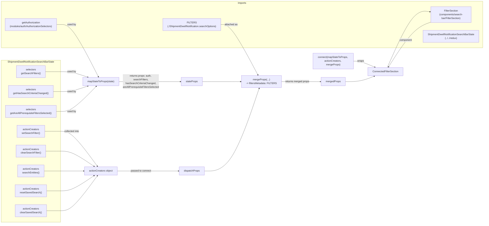

# Diagram: web/portal/src/pages/administration/admin-tools/shipment-dwell-notification/components/search/ShipmentDwellNotification.SearchFilters.container.js

> Auto-generated by Obscura crawlers

## Mermaid

### SVG

<svg id="container" width="3798.125" xmlns="http://www.w3.org/2000/svg" class="flowchart" height="1206" viewBox="0 0 3798.125 1206" role="graphics-document document" aria-roledescription="flowchart-v2"><g><marker id="container_flowchart-v2-pointEnd" class="marker flowchart-v2" viewBox="0 0 10 10" refX="5" refY="5" markerUnits="userSpaceOnUse" markerWidth="8" markerHeight="8" orient="auto"><path d="M 0 0 L 10 5 L 0 10 z" class="arrowMarkerPath" style="stroke-width: 1; stroke-dasharray: 1, 0;"></path></marker><marker id="container_flowchart-v2-pointStart" class="marker flowchart-v2" viewBox="0 0 10 10" refX="4.5" refY="5" markerUnits="userSpaceOnUse" markerWidth="8" markerHeight="8" orient="auto"><path d="M 0 5 L 10 10 L 10 0 z" class="arrowMarkerPath" style="stroke-width: 1; stroke-dasharray: 1, 0;"></path></marker><marker id="container_flowchart-v2-circleEnd" class="marker flowchart-v2" viewBox="0 0 10 10" refX="11" refY="5" markerUnits="userSpaceOnUse" markerWidth="11" markerHeight="11" orient="auto"><circle cx="5" cy="5" r="5" class="arrowMarkerPath" style="stroke-width: 1; stroke-dasharray: 1, 0;"></circle></marker><marker id="container_flowchart-v2-circleStart" class="marker flowchart-v2" viewBox="0 0 10 10" refX="-1" refY="5" markerUnits="userSpaceOnUse" markerWidth="11" markerHeight="11" orient="auto"><circle cx="5" cy="5" r="5" class="arrowMarkerPath" style="stroke-width: 1; stroke-dasharray: 1, 0;"></circle></marker><marker id="container_flowchart-v2-crossEnd" class="marker cross flowchart-v2" viewBox="0 0 11 11" refX="12" refY="5.2" markerUnits="userSpaceOnUse" markerWidth="11" markerHeight="11" orient="auto"><path d="M 1,1 l 9,9 M 10,1 l -9,9" class="arrowMarkerPath" style="stroke-width: 2; stroke-dasharray: 1, 0;"></path></marker><marker id="container_flowchart-v2-crossStart" class="marker cross flowchart-v2" viewBox="0 0 11 11" refX="-1" refY="5.2" markerUnits="userSpaceOnUse" markerWidth="11" markerHeight="11" orient="auto"><path d="M 1,1 l 9,9 M 10,1 l -9,9" class="arrowMarkerPath" style="stroke-width: 2; stroke-dasharray: 1, 0;"></path></marker><g class="root"><g class="clusters"><g class="cluster" id="StateSlice" data-look="classic"><rect style="" x="8" y="346" width="534.296875" height="852"></rect><g class="cluster-label" transform="translate(122.5546875, 346)"><foreignObject width="305.1875" height="24">

ShipmentDwellNotificationSearchBarState

</foreignObject></g></g><g class="cluster" id="Imports" data-look="classic"><rect style="" x="8" y="8" width="3782.125" height="252"></rect><g class="cluster-label" transform="translate(1870.703125, 8)"><foreignObject width="56.71875" height="24">

Imports

</foreignObject></g></g></g><g class="edgePaths"><path d="M517.297,134L521.464,134C525.63,134,533.964,134,550.561,134C567.159,134,592.021,134,633.479,185.586C674.938,237.171,732.993,340.343,762.021,391.928L791.048,443.514" id="L_A_M_0" class="edge-thickness-normal edge-pattern-solid edge-thickness-normal edge-pattern-solid flowchart-link" style=";" data-edge="true" data-et="edge" data-id="L_A_M_0" data-points="W3sieCI6NTE3LjI5Njg3NSwieSI6MTM0fSx7IngiOjU0Mi4yOTY4NzUsInkiOjEzNH0seyJ4Ijo2MTYuODgyODEyNSwieSI6MTM0fSx7IngiOjc5My4wMTAwNDEzNjAyOTQyLCJ5Ijo0NDd9XQ==" marker-end="url(#container_flowchart-v2-pointEnd)"></path><path d="M409.305,408L431.47,408C453.635,408,497.966,408,532.563,408C567.159,408,592.021,408,622.664,414.283C653.307,420.565,689.731,433.13,707.942,439.413L726.154,445.696" id="L_D1_M_0" class="edge-thickness-normal edge-pattern-solid edge-thickness-normal edge-pattern-solid flowchart-link" style=";" data-edge="true" data-et="edge" data-id="L_D1_M_0" data-points="W3sieCI6NDA5LjMwNDY4NzUsInkiOjQwOH0seyJ4Ijo1NDIuMjk2ODc1LCJ5Ijo0MDh9LHsieCI6NjE2Ljg4MjgxMjUsInkiOjQwOH0seyJ4Ijo3MjkuOTM1NzI0NDMxODE4MiwieSI6NDQ3fV0=" marker-end="url(#container_flowchart-v2-pointEnd)"></path><path d="M458.508,512L472.473,512C486.438,512,514.367,512,540.763,512C567.159,512,592.021,512,616.229,509.661C640.437,507.322,663.991,502.643,675.768,500.304L687.545,497.965" id="L_D2_M_0" class="edge-thickness-normal edge-pattern-solid edge-thickness-normal edge-pattern-solid flowchart-link" style=";" data-edge="true" data-et="edge" data-id="L_D2_M_0" data-points="W3sieCI6NDU4LjUwNzgxMjUsInkiOjUxMn0seyJ4Ijo1NDIuMjk2ODc1LCJ5Ijo1MTJ9LHsieCI6NjE2Ljg4MjgxMjUsInkiOjUxMn0seyJ4Ijo2OTEuNDY4NzUsInkiOjQ5Ny4xODU3NTY4NzA0MzE2NX1d" marker-end="url(#container_flowchart-v2-pointEnd)"></path><path d="M480.859,616L491.099,616C501.339,616,521.818,616,544.488,616C567.159,616,592.021,616,629.74,597.231C667.46,578.461,718.037,540.923,743.325,522.153L768.613,503.384" id="L_D3_M_0" class="edge-thickness-normal edge-pattern-solid edge-thickness-normal edge-pattern-solid flowchart-link" style=";" data-edge="true" data-et="edge" data-id="L_D3_M_0" data-points="W3sieCI6NDgwLjg1OTM3NSwieSI6NjE2fSx7IngiOjU0Mi4yOTY4NzUsInkiOjYxNn0seyJ4Ijo2MTYuODgyODEyNSwieSI6NjE2fSx7IngiOjc3MS44MjUzMTkxMDIxMTI2LCJ5Ijo1MDF9XQ==" marker-end="url(#container_flowchart-v2-pointEnd)"></path><path d="M924.938,474L975.393,474C1025.849,474,1126.76,474,1253.667,474C1380.573,474,1533.474,474,1609.924,474L1686.375,474" id="L_M_StateProps_0" class="edge-thickness-normal edge-pattern-solid edge-thickness-normal edge-pattern-solid flowchart-link" style=";" data-edge="true" data-et="edge" data-id="L_M_StateProps_0" data-points="W3sieCI6OTI0LjkzNzUsInkiOjQ3NH0seyJ4IjoxMjI3LjY3MTg3NSwieSI6NDc0fSx7IngiOjE2OTAuMzc1LCJ5Ijo0NzR9XQ==" marker-end="url(#container_flowchart-v2-pointEnd)"></path><path d="M425.328,720L444.823,720C464.318,720,503.307,720,535.233,720C567.159,720,592.021,720,631.748,749.676C671.475,779.352,726.068,838.704,753.364,868.38L780.66,898.056" id="L_D4_AC_0" class="edge-thickness-normal edge-pattern-solid edge-thickness-normal edge-pattern-solid flowchart-link" style=";" data-edge="true" data-et="edge" data-id="L_D4_AC_0" data-points="W3sieCI6NDI1LjMyODEyNSwieSI6NzIwfSx7IngiOjU0Mi4yOTY4NzUsInkiOjcyMH0seyJ4Ijo2MTYuODgyODEyNSwieSI6NzIwfSx7IngiOjc4My4zNjgyNzY3NDI3ODg1LCJ5Ijo5MDF9XQ==" marker-end="url(#container_flowchart-v2-pointEnd)"></path><path d="M432.195,824L450.546,824C468.896,824,505.596,824,536.378,824C567.159,824,592.021,824,627.475,836.515C662.928,849.03,708.974,874.06,731.996,886.575L755.019,899.09" id="L_D5_AC_0" class="edge-thickness-normal edge-pattern-solid edge-thickness-normal edge-pattern-solid flowchart-link" style=";" data-edge="true" data-et="edge" data-id="L_D5_AC_0" data-points="W3sieCI6NDMyLjE5NTMxMjUsInkiOjgyNH0seyJ4Ijo1NDIuMjk2ODc1LCJ5Ijo4MjR9LHsieCI6NjE2Ljg4MjgxMjUsInkiOjgyNH0seyJ4Ijo3NTguNTMzNDI4NDg1NTc2OSwieSI6OTAxfV0=" marker-end="url(#container_flowchart-v2-pointEnd)"></path><path d="M422.531,928L442.492,928C462.453,928,502.375,928,534.767,928C567.159,928,592.021,928,617.751,928C643.482,928,670.081,928,683.38,928L696.68,928" id="L_D6_AC_0" class="edge-thickness-normal edge-pattern-solid edge-thickness-normal edge-pattern-solid flowchart-link" style=";" data-edge="true" data-et="edge" data-id="L_D6_AC_0" data-points="W3sieCI6NDIyLjUzMTI1LCJ5Ijo5Mjh9LHsieCI6NTQyLjI5Njg3NSwieSI6OTI4fSx7IngiOjYxNi44ODI4MTI1LCJ5Ijo5Mjh9LHsieCI6NzAwLjY3OTY4NzUsInkiOjkyOH1d" marker-end="url(#container_flowchart-v2-pointEnd)"></path><path d="M435.711,1032L453.475,1032C471.24,1032,506.768,1032,536.964,1032C567.159,1032,592.021,1032,627.475,1019.485C662.928,1006.97,708.974,981.94,731.996,969.425L755.019,956.91" id="L_D7_AC_0" class="edge-thickness-normal edge-pattern-solid edge-thickness-normal edge-pattern-solid flowchart-link" style=";" data-edge="true" data-et="edge" data-id="L_D7_AC_0" data-points="W3sieCI6NDM1LjcxMDkzNzUsInkiOjEwMzJ9LHsieCI6NTQyLjI5Njg3NSwieSI6MTAzMn0seyJ4Ijo2MTYuODgyODEyNSwieSI6MTAzMn0seyJ4Ijo3NTguNTMzNDI4NDg1NTc2OSwieSI6OTU1fV0=" marker-end="url(#container_flowchart-v2-pointEnd)"></path><path d="M435.367,1136L453.189,1136C471.01,1136,506.654,1136,536.906,1136C567.159,1136,592.021,1136,631.748,1106.324C671.475,1076.648,726.068,1017.296,753.364,987.62L780.66,957.944" id="L_D8_AC_0" class="edge-thickness-normal edge-pattern-solid edge-thickness-normal edge-pattern-solid flowchart-link" style=";" data-edge="true" data-et="edge" data-id="L_D8_AC_0" data-points="W3sieCI6NDM1LjM2NzE4NzUsInkiOjExMzZ9LHsieCI6NTQyLjI5Njg3NSwieSI6MTEzNn0seyJ4Ijo2MTYuODgyODEyNSwieSI6MTEzNn0seyJ4Ijo3ODMuMzY4Mjc2NzQyNzg4NSwieSI6OTU1fV0=" marker-end="url(#container_flowchart-v2-pointEnd)"></path><path d="M915.727,928L967.717,928C1019.708,928,1123.69,928,1249.96,928C1376.229,928,1524.786,928,1599.065,928L1673.344,928" id="L_AC_DispatchProps_0" class="edge-thickness-normal edge-pattern-solid edge-thickness-normal edge-pattern-solid flowchart-link" style=";" data-edge="true" data-et="edge" data-id="L_AC_DispatchProps_0" data-points="W3sieCI6OTE1LjcyNjU2MjUsInkiOjkyOH0seyJ4IjoxMjI3LjY3MTg3NSwieSI6OTI4fSx7IngiOjE2NzcuMzQzNzUsInkiOjkyOH1d" marker-end="url(#container_flowchart-v2-pointEnd)"></path><path d="M1987.438,134L1998.639,134C2009.841,134,2032.245,134,2072.21,183.59C2112.176,233.18,2169.704,332.36,2198.467,381.95L2227.231,431.54" id="L_B_Merge_0" class="edge-thickness-normal edge-pattern-solid edge-thickness-normal edge-pattern-solid flowchart-link" style=";" data-edge="true" data-et="edge" data-id="L_B_Merge_0" data-points="W3sieCI6MTk4Ny40Mzc1LCJ5IjoxMzR9LHsieCI6MjA1NC42NDg0Mzc1LCJ5IjoxMzR9LHsieCI6MjIyOS4yMzgxMjA0MDQ0MTIsInkiOjQzNX1d" marker-end="url(#container_flowchart-v2-pointEnd)"></path><path d="M1827.469,474L1865.332,474C1903.195,474,1978.922,474,2027.32,474C2075.719,474,2096.789,474,2107.324,474L2117.859,474" id="L_StateProps_Merge_0" class="edge-thickness-normal edge-pattern-solid edge-thickness-normal edge-pattern-solid flowchart-link" style=";" data-edge="true" data-et="edge" data-id="L_StateProps_Merge_0" data-points="W3sieCI6MTgyNy40Njg3NSwieSI6NDc0fSx7IngiOjIwNTQuNjQ4NDM3NSwieSI6NDc0fSx7IngiOjIxMjEuODU5Mzc1LCJ5Ijo0NzR9XQ==" marker-end="url(#container_flowchart-v2-pointEnd)"></path><path d="M1840.5,928L1876.191,928C1911.883,928,1983.266,928,2048.736,859.445C2114.207,790.89,2173.766,653.779,2203.545,585.224L2233.325,516.669" id="L_DispatchProps_Merge_0" class="edge-thickness-normal edge-pattern-solid edge-thickness-normal edge-pattern-solid flowchart-link" style=";" data-edge="true" data-et="edge" data-id="L_DispatchProps_Merge_0" data-points="W3sieCI6MTg0MC41LCJ5Ijo5Mjh9LHsieCI6MjA1NC42NDg0Mzc1LCJ5Ijo5Mjh9LHsieCI6MjIzNC45MTgzNDczMjkyOTUsInkiOjUxM31d" marker-end="url(#container_flowchart-v2-pointEnd)"></path><path d="M2381.859,474L2399.13,474C2416.401,474,2450.943,474,2493.508,474C2536.073,474,2586.661,474,2611.956,474L2637.25,474" id="L_Merge_MergedProps_0" class="edge-thickness-normal edge-pattern-solid edge-thickness-normal edge-pattern-solid flowchart-link" style=";" data-edge="true" data-et="edge" data-id="L_Merge_MergedProps_0" data-points="W3sieCI6MjM4MS44NTkzNzUsInkiOjQ3NH0seyJ4IjoyNDg1LjQ4NDM3NSwieSI6NDc0fSx7IngiOjI2NDEuMjUsInkiOjQ3NH1d" marker-end="url(#container_flowchart-v2-pointEnd)"></path><path d="M2849.109,346L2856.841,346C2864.573,346,2880.036,346,2899.427,349.635C2918.817,353.27,2942.133,360.54,2953.792,364.174L2965.45,367.809" id="L_connect_Connected_0" class="edge-thickness-normal edge-pattern-solid edge-thickness-normal edge-pattern-solid flowchart-link" style=";" data-edge="true" data-et="edge" data-id="L_connect_Connected_0" data-points="W3sieCI6Mjg0OS4xMDkzNzUsInkiOjM0Nn0seyJ4IjoyODk1LjUsInkiOjM0Nn0seyJ4IjoyOTY5LjI2ODkwNjI1LCJ5IjozNjl9XQ==" marker-end="url(#container_flowchart-v2-pointEnd)"></path><path d="M2796.969,474L2813.391,474C2829.813,474,2862.656,474,2895.955,465.792C2929.253,457.583,2963.006,441.166,2979.882,432.958L2996.758,424.75" id="L_MergedProps_Connected_0" class="edge-thickness-normal edge-pattern-solid edge-thickness-normal edge-pattern-solid flowchart-link" style=";" data-edge="true" data-et="edge" data-id="L_MergedProps_Connected_0" data-points="W3sieCI6Mjc5Ni45Njg3NSwieSI6NDc0fSx7IngiOjI4OTUuNSwieSI6NDc0fSx7IngiOjMwMDAuMzU1NDY4NzUsInkiOjQyM31d" marker-end="url(#container_flowchart-v2-pointEnd)"></path><path d="M3374.713,121L3351.609,126.667C3328.504,132.333,3282.295,143.667,3232.918,184.466C3183.542,225.266,3130.997,295.531,3104.725,330.664L3078.453,365.797" id="L_C_Connected_0" class="edge-thickness-normal edge-pattern-solid edge-thickness-normal edge-pattern-solid flowchart-link" style=";" data-edge="true" data-et="edge" data-id="L_C_Connected_0" data-points="W3sieCI6MzM3NC43MTMwNzc5MTA5NTksInkiOjEyMX0seyJ4IjozMjM2LjA4NTkzNzUsInkiOjE1NX0seyJ4IjozMDc2LjA1NzY2OTg2NTE0NTMsInkiOjM2OX1d" marker-end="url(#container_flowchart-v2-pointEnd)"></path><path d="M3070.137,369L3097.795,316.667C3125.453,264.333,3180.77,159.667,3230.283,109.316C3279.797,58.965,3323.508,62.93,3345.364,64.913L3367.219,66.896" id="L_Connected_C_0" class="edge-thickness-normal edge-pattern-solid edge-thickness-normal edge-pattern-solid flowchart-link" style=";" data-edge="true" data-et="edge" data-id="L_Connected_C_0" data-points="W3sieCI6MzA3MC4xMzY3MDcyOTQ3MjE0LCJ5IjozNjl9LHsieCI6MzIzNi4wODU5Mzc1LCJ5Ijo1NX0seyJ4IjozMzcxLjIwMzEyNSwieSI6NjcuMjU2OTQyNjIxNjU5OTN9XQ==" marker-end="url(#container_flowchart-v2-pointEnd)"></path></g><g class="edgeLabels"><g class="edgeLabel" transform="translate(616.8828125, 134)"><g class="label" data-id="L_A_M_0" transform="translate(-28.3125, -12)"><foreignObject width="56.625" height="24">

used by

</foreignObject></g></g><g class="edgeLabel" transform="translate(616.8828125, 408)"><g class="label" data-id="L_D1_M_0" transform="translate(-28.3125, -12)"><foreignObject width="56.625" height="24">

used by

</foreignObject></g></g><g class="edgeLabel" transform="translate(616.8828125, 512)"><g class="label" data-id="L_D2_M_0" transform="translate(-28.3125, -12)"><foreignObject width="56.625" height="24">

used by

</foreignObject></g></g><g class="edgeLabel" transform="translate(616.8828125, 616)"><g class="label" data-id="L_D3_M_0" transform="translate(-28.3125, -12)"><foreignObject width="56.625" height="24">

used by

</foreignObject></g></g><g class="edgeLabel" transform="translate(1227.671875, 474)"><g class="label" data-id="L_M_StateProps_0" transform="translate(-277.734375, -24)"><foreignObject width="555.46875" height="48">

returns props: auth, searchFilters,\nhasSearchCriteriaChanged,\nareAllPrerequisiteFiltersSelected

</foreignObject></g></g><g class="edgeLabel" transform="translate(616.8828125, 720)"><g class="label" data-id="L_D4_AC_0" transform="translate(-49.5859375, -12)"><foreignObject width="99.171875" height="24">

collected into

</foreignObject></g></g><g class="edgeLabel"><g class="label" data-id="L_D5_AC_0" transform="translate(0, 0)"><foreignObject width="0" height="0">

</foreignObject></g></g><g class="edgeLabel"><g class="label" data-id="L_D6_AC_0" transform="translate(0, 0)"><foreignObject width="0" height="0">

</foreignObject></g></g><g class="edgeLabel"><g class="label" data-id="L_D7_AC_0" transform="translate(0, 0)"><foreignObject width="0" height="0">

</foreignObject></g></g><g class="edgeLabel"><g class="label" data-id="L_D8_AC_0" transform="translate(0, 0)"><foreignObject width="0" height="0">

</foreignObject></g></g><g class="edgeLabel" transform="translate(1227.671875, 928)"><g class="label" data-id="L_AC_DispatchProps_0" transform="translate(-65.9453125, -12)"><foreignObject width="131.890625" height="24">

passed to connect

</foreignObject></g></g><g class="edgeLabel" transform="translate(2054.6484375, 134)"><g class="label" data-id="L_B_Merge_0" transform="translate(-42.2109375, -12)"><foreignObject width="84.421875" height="24">

attached as

</foreignObject></g></g><g class="edgeLabel"><g class="label" data-id="L_StateProps_Merge_0" transform="translate(0, 0)"><foreignObject width="0" height="0">

</foreignObject></g></g><g class="edgeLabel"><g class="label" data-id="L_DispatchProps_Merge_0" transform="translate(0, 0)"><foreignObject width="0" height="0">

</foreignObject></g></g><g class="edgeLabel" transform="translate(2485.484375, 474)"><g class="label" data-id="L_Merge_MergedProps_0" transform="translate(-78.625, -12)"><foreignObject width="157.25" height="24">

returns merged props

</foreignObject></g></g><g class="edgeLabel" transform="translate(2895.5, 346)"><g class="label" data-id="L_connect_Connected_0" transform="translate(-21.390625, -12)"><foreignObject width="42.78125" height="24">

wraps

</foreignObject></g></g><g class="edgeLabel"><g class="label" data-id="L_MergedProps_Connected_0" transform="translate(0, 0)"><foreignObject width="0" height="0">

</foreignObject></g></g><g class="edgeLabel" transform="translate(3198.81184, 204.8453)"><g class="label" data-id="L_C_Connected_0" transform="translate(-41.2421875, -12)"><foreignObject width="82.484375" height="24">

component

</foreignObject></g></g><g class="edgeLabel"><g class="label" data-id="L_Connected_C_0" transform="translate(0, 0)"><foreignObject width="0" height="0">

</foreignObject></g></g></g><g class="nodes"><g class="node default" id="flowchart-A-0" transform="translate(275.1484375, 134)"><rect class="basic label-container" style="" x="-242.1484375" y="-27" width="484.296875" height="54"></rect><g class="label" style="" transform="translate(-212.1484375, -12)"><rect></rect><foreignObject width="424.296875" height="24">

getAuthorization\n(modules/auth/AuthorizationSelectors)

</foreignObject></g></g><g class="node default" id="flowchart-B-1" transform="translate(1758.921875, 134)"><rect class="basic label-container" style="" x="-228.515625" y="-27" width="457.03125" height="54"></rect><g class="label" style="" transform="translate(-198.515625, -12)"><rect></rect><foreignObject width="397.03125" height="24">

FILTERS\n(./ShipmentDwellNotification.searchOptions)

</foreignObject></g></g><g class="node default" id="flowchart-C-2" transform="translate(3533.7265625, 82)"><rect class="basic label-container" style="" x="-162.5234375" y="-39" width="325.046875" height="78"></rect><g class="label" style="" transform="translate(-132.5234375, -24)"><rect></rect><foreignObject width="265.046875" height="48">

FilterSection\n(components/search-bar/FilterSection)

</foreignObject></g></g><g class="node default" id="flowchart-D-3" transform="translate(3533.7265625, 198)"><rect class="basic label-container" style="" x="-231.3984375" y="-27" width="462.796875" height="54"></rect><g class="label" style="" transform="translate(-201.3984375, -12)"><rect></rect><foreignObject width="402.796875" height="24">

ShipmentDwellNotificationSearchBarState\n(../../redux)

</foreignObject></g></g><g class="node default" id="flowchart-D1-4" transform="translate(275.1484375, 408)"><rect class="basic label-container" style="" x="-134.15625" y="-27" width="268.3125" height="54"></rect><g class="label" style="" transform="translate(-104.15625, -12)"><rect></rect><foreignObject width="208.3125" height="24">

selectors\ngetSearchFilters()

</foreignObject></g></g><g class="node default" id="flowchart-D2-5" transform="translate(275.1484375, 512)"><rect class="basic label-container" style="" x="-183.359375" y="-27" width="366.71875" height="54"></rect><g class="label" style="" transform="translate(-153.359375, -12)"><rect></rect><foreignObject width="306.71875" height="24">

selectors\ngetHasSearchCriteriaChanged()

</foreignObject></g></g><g class="node default" id="flowchart-D3-6" transform="translate(275.1484375, 616)"><rect class="basic label-container" style="" x="-205.7109375" y="-27" width="411.421875" height="54"></rect><g class="label" style="" transform="translate(-175.7109375, -12)"><rect></rect><foreignObject width="351.421875" height="24">

selectors\ngetAreAllPrerequisiteFiltersSelected()

</foreignObject></g></g><g class="node default" id="flowchart-D4-7" transform="translate(275.1484375, 720)"><rect class="basic label-container" style="" x="-150.1796875" y="-27" width="300.359375" height="54"></rect><g class="label" style="" transform="translate(-120.1796875, -12)"><rect></rect><foreignObject width="240.359375" height="24">

actionCreators\nsetSearchFilter()

</foreignObject></g></g><g class="node default" id="flowchart-D5-8" transform="translate(275.1484375, 824)"><rect class="basic label-container" style="" x="-157.046875" y="-27" width="314.09375" height="54"></rect><g class="label" style="" transform="translate(-127.046875, -12)"><rect></rect><foreignObject width="254.09375" height="24">

actionCreators\nclearSearchFilter()

</foreignObject></g></g><g class="node default" id="flowchart-D6-9" transform="translate(275.1484375, 928)"><rect class="basic label-container" style="" x="-147.3828125" y="-27" width="294.765625" height="54"></rect><g class="label" style="" transform="translate(-117.3828125, -12)"><rect></rect><foreignObject width="234.765625" height="24">

actionCreators\nsearchEntities()

</foreignObject></g></g><g class="node default" id="flowchart-D7-10" transform="translate(275.1484375, 1032)"><rect class="basic label-container" style="" x="-160.5625" y="-27" width="321.125" height="54"></rect><g class="label" style="" transform="translate(-130.5625, -12)"><rect></rect><foreignObject width="261.125" height="24">

actionCreators\nresetSavedSearch()

</foreignObject></g></g><g class="node default" id="flowchart-D8-11" transform="translate(275.1484375, 1136)"><rect class="basic label-container" style="" x="-160.21875" y="-27" width="320.4375" height="54"></rect><g class="label" style="" transform="translate(-130.21875, -12)"><rect></rect><foreignObject width="260.4375" height="24">

actionCreators\nclearSavedSearch()

</foreignObject></g></g><g class="node default" id="flowchart-M-13" transform="translate(808.203125, 474)"><rect class="basic label-container" style="" x="-116.734375" y="-27" width="233.46875" height="54"></rect><g class="label" style="" transform="translate(-86.734375, -12)"><rect></rect><foreignObject width="173.46875" height="24">

mapStateToProps(state)

</foreignObject></g></g><g class="node default" id="flowchart-StateProps-21" transform="translate(1758.921875, 474)"><rect class="basic label-container" style="" x="-68.546875" y="-27" width="137.09375" height="54"></rect><g class="label" style="" transform="translate(-38.546875, -12)"><rect></rect><foreignObject width="77.09375" height="24">

stateProps

</foreignObject></g></g><g class="node default" id="flowchart-AC-23" transform="translate(808.203125, 928)"><rect class="basic label-container" style="" x="-107.5234375" y="-27" width="215.046875" height="54"></rect><g class="label" style="" transform="translate(-77.5234375, -12)"><rect></rect><foreignObject width="155.046875" height="24">

actionCreators object

</foreignObject></g></g><g class="node default" id="flowchart-DispatchProps-33" transform="translate(1758.921875, 928)"><rect class="basic label-container" style="" x="-81.578125" y="-27" width="163.15625" height="54"></rect><g class="label" style="" transform="translate(-51.578125, -12)"><rect></rect><foreignObject width="103.15625" height="24">

dispatchProps

</foreignObject></g></g><g class="node default" id="flowchart-Merge-35" transform="translate(2251.859375, 474)"><rect class="basic label-container" style="" x="-130" y="-39" width="260" height="78"></rect><g class="label" style="" transform="translate(-100, -24)"><rect></rect><foreignObject width="200" height="48">

mergeProps(...)\n-&gt; filtersMetadata: FILTERS

</foreignObject></g></g><g class="node default" id="flowchart-MergedProps-41" transform="translate(2719.109375, 474)"><rect class="basic label-container" style="" x="-77.859375" y="-27" width="155.71875" height="54"></rect><g class="label" style="" transform="translate(-47.859375, -12)"><rect></rect><foreignObject width="95.71875" height="24">

mergedProps

</foreignObject></g></g><g class="node default" id="flowchart-connect-42" transform="translate(2719.109375, 346)"><rect class="basic label-container" style="" x="-130" y="-51" width="260" height="102"></rect><g class="label" style="" transform="translate(-100, -36)"><rect></rect><foreignObject width="200" height="72">

connect(mapStateToProps, actionCreators, mergeProps)

</foreignObject></g></g><g class="node default" id="flowchart-Connected-44" transform="translate(3055.8671875, 396)"><rect class="basic label-container" style="" x="-113.9765625" y="-27" width="227.953125" height="54"></rect><g class="label" style="" transform="translate(-83.9765625, -12)"><rect></rect><foreignObject width="167.953125" height="24">

ConnectedFilterSection

</foreignObject></g></g></g></g></g></svg>
