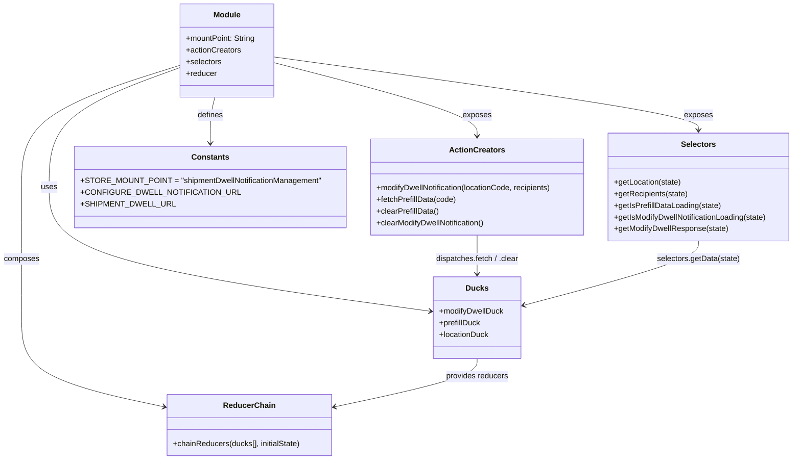
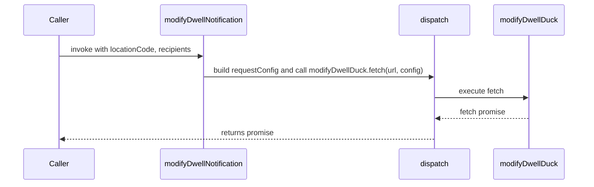
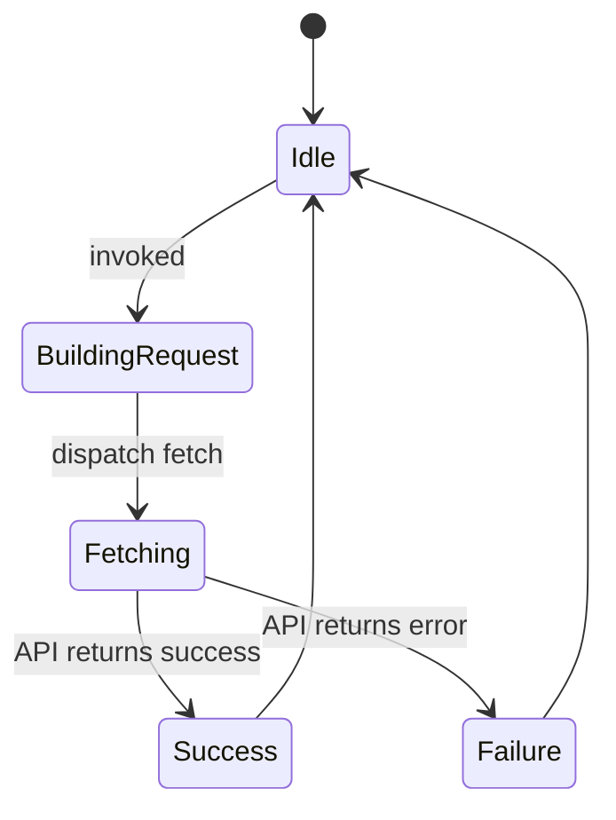

# Diagram: web/portal/src/pages/administration/admin-tools/shipment-dwell-notification/redux/EditShipmentDwellNotificationState.js


> Auto-generated by Obscura crawlers

## Diagram 1



### SVG

<svg id="container" width="1627.890625" xmlns="http://www.w3.org/2000/svg" class="classDiagram" height="946" viewBox="0 0 1627.890625 946" role="graphics-document document" aria-roledescription="class"><style>#container{font-family:"trebuchet ms",verdana,arial,sans-serif;font-size:16px;fill:#333;}@keyframes edge-animation-frame{from{stroke-dashoffset:0;}}@keyframes dash{to{stroke-dashoffset:0;}}#container .edge-animation-slow{stroke-dasharray:9,5!important;stroke-dashoffset:900;animation:dash 50s linear infinite;stroke-linecap:round;}#container .edge-animation-fast{stroke-dasharray:9,5!important;stroke-dashoffset:900;animation:dash 20s linear infinite;stroke-linecap:round;}#container .error-icon{fill:#552222;}#container .error-text{fill:#552222;stroke:#552222;}#container .edge-thickness-normal{stroke-width:1px;}#container .edge-thickness-thick{stroke-width:3.5px;}#container .edge-pattern-solid{stroke-dasharray:0;}#container .edge-thickness-invisible{stroke-width:0;fill:none;}#container .edge-pattern-dashed{stroke-dasharray:3;}#container .edge-pattern-dotted{stroke-dasharray:2;}#container .marker{fill:#333333;stroke:#333333;}#container .marker.cross{stroke:#333333;}#container svg{font-family:"trebuchet ms",verdana,arial,sans-serif;font-size:16px;}#container p{margin:0;}#container g.classGroup text{fill:#9370DB;stroke:none;font-family:"trebuchet ms",verdana,arial,sans-serif;font-size:10px;}#container g.classGroup text .title{font-weight:bolder;}#container .nodeLabel,#container .edgeLabel{color:#131300;}#container .edgeLabel .label rect{fill:#ECECFF;}#container .label text{fill:#131300;}#container .labelBkg{background:#ECECFF;}#container .edgeLabel .label span{background:#ECECFF;}#container .classTitle{font-weight:bolder;}#container .node rect,#container .node circle,#container .node ellipse,#container .node polygon,#container .node path{fill:#ECECFF;stroke:#9370DB;stroke-width:1px;}#container .divider{stroke:#9370DB;stroke-width:1;}#container g.clickable{cursor:pointer;}#container g.classGroup rect{fill:#ECECFF;stroke:#9370DB;}#container g.classGroup line{stroke:#9370DB;stroke-width:1;}#container .classLabel .box{stroke:none;stroke-width:0;fill:#ECECFF;opacity:0.5;}#container .classLabel .label{fill:#9370DB;font-size:10px;}#container .relation{stroke:#333333;stroke-width:1;fill:none;}#container .dashed-line{stroke-dasharray:3;}#container .dotted-line{stroke-dasharray:1 2;}#container #compositionStart,#container .composition{fill:#333333!important;stroke:#333333!important;stroke-width:1;}#container #compositionEnd,#container .composition{fill:#333333!important;stroke:#333333!important;stroke-width:1;}#container #dependencyStart,#container .dependency{fill:#333333!important;stroke:#333333!important;stroke-width:1;}#container #dependencyStart,#container .dependency{fill:#333333!important;stroke:#333333!important;stroke-width:1;}#container #extensionStart,#container .extension{fill:transparent!important;stroke:#333333!important;stroke-width:1;}#container #extensionEnd,#container .extension{fill:transparent!important;stroke:#333333!important;stroke-width:1;}#container #aggregationStart,#container .aggregation{fill:transparent!important;stroke:#333333!important;stroke-width:1;}#container #aggregationEnd,#container .aggregation{fill:transparent!important;stroke:#333333!important;stroke-width:1;}#container #lollipopStart,#container .lollipop{fill:#ECECFF!important;stroke:#333333!important;stroke-width:1;}#container #lollipopEnd,#container .lollipop{fill:#ECECFF!important;stroke:#333333!important;stroke-width:1;}#container .edgeTerminals{font-size:11px;line-height:initial;}#container .classTitleText{text-anchor:middle;font-size:18px;fill:#333;}#container .label-icon{display:inline-block;height:1em;overflow:visible;vertical-align:-0.125em;}#container .node .label-icon path{fill:currentColor;stroke:revert;stroke-width:revert;}#container :root{--mermaid-font-family:"trebuchet ms",verdana,arial,sans-serif;}</style><g><defs><marker id="container_class-aggregationStart" class="marker aggregation class" refX="18" refY="7" markerWidth="190" markerHeight="240" orient="auto"><path d="M 18,7 L9,13 L1,7 L9,1 Z"></path></marker></defs><defs><marker id="container_class-aggregationEnd" class="marker aggregation class" refX="1" refY="7" markerWidth="20" markerHeight="28" orient="auto"><path d="M 18,7 L9,13 L1,7 L9,1 Z"></path></marker></defs><defs><marker id="container_class-extensionStart" class="marker extension class" refX="18" refY="7" markerWidth="190" markerHeight="240" orient="auto"><path d="M 1,7 L18,13 V 1 Z"></path></marker></defs><defs><marker id="container_class-extensionEnd" class="marker extension class" refX="1" refY="7" markerWidth="20" markerHeight="28" orient="auto"><path d="M 1,1 V 13 L18,7 Z"></path></marker></defs><defs><marker id="container_class-compositionStart" class="marker composition class" refX="18" refY="7" markerWidth="190" markerHeight="240" orient="auto"><path d="M 18,7 L9,13 L1,7 L9,1 Z"></path></marker></defs><defs><marker id="container_class-compositionEnd" class="marker composition class" refX="1" refY="7" markerWidth="20" markerHeight="28" orient="auto"><path d="M 18,7 L9,13 L1,7 L9,1 Z"></path></marker></defs><defs><marker id="container_class-dependencyStart" class="marker dependency class" refX="6" refY="7" markerWidth="190" markerHeight="240" orient="auto"><path d="M 5,7 L9,13 L1,7 L9,1 Z"></path></marker></defs><defs><marker id="container_class-dependencyEnd" class="marker dependency class" refX="13" refY="7" markerWidth="20" markerHeight="28" orient="auto"><path d="M 18,7 L9,13 L14,7 L9,1 Z"></path></marker></defs><defs><marker id="container_class-lollipopStart" class="marker lollipop class" refX="13" refY="7" markerWidth="190" markerHeight="240" orient="auto"><circle stroke="black" fill="transparent" cx="7" cy="7" r="6"></circle></marker></defs><defs><marker id="container_class-lollipopEnd" class="marker lollipop class" refX="1" refY="7" markerWidth="190" markerHeight="240" orient="auto"><circle stroke="black" fill="transparent" cx="7" cy="7" r="6"></circle></marker></defs><g class="root"><g class="clusters"></g><g class="edgePaths"><path d="M359.898,140.437L316.733,156.531C273.568,172.624,187.237,204.812,144.072,245.573C100.906,286.333,100.906,335.667,100.906,385C100.906,434.333,100.906,483.667,229.459,526.274C358.011,568.881,615.117,604.761,743.669,622.702L872.222,640.642" id="id_Module_Ducks_1" class="edge-thickness-normal edge-pattern-solid relation" style=";;;" data-edge="true" data-et="edge" data-id="id_Module_Ducks_1" data-points="W3sieCI6MzU5Ljg5ODQzNzUsInkiOjE0MC40MzY2NDAzODU0NTc3NH0seyJ4IjoxMDAuOTA2MjUsInkiOjIzN30seyJ4IjoxMDAuOTA2MjUsInkiOjM4NX0seyJ4IjoxMDAuOTA2MjUsInkiOjUzM30seyJ4Ijo4NzguMTY0MDYyNSwieSI6NjQxLjQ3MTUxNzM5MDUyMDh9XQ==" marker-end="url(#container_class-dependencyEnd)"></path><path d="M555.352,129.47L624.116,147.392C692.88,165.313,830.409,201.157,899.173,226.245C967.938,251.333,967.938,265.667,967.938,272.833L967.938,280" id="id_Module_ActionCreators_2" class="edge-thickness-normal edge-pattern-solid relation" style=";;;" data-edge="true" data-et="edge" data-id="id_Module_ActionCreators_2" data-points="W3sieCI6NTU1LjM1MTU2MjUsInkiOjEyOS40Njk5NDc5NDg1NjA5M30seyJ4Ijo5NjcuOTM3NSwieSI6MjM3fSx7IngiOjk2Ny45Mzc1LCJ5IjoyODZ9XQ==" marker-end="url(#container_class-dependencyEnd)"></path><path d="M555.352,117.358L701.229,137.299C847.107,157.239,1138.862,197.119,1284.74,222.226C1430.617,247.333,1430.617,257.667,1430.617,262.833L1430.617,268" id="id_Module_Selectors_3" class="edge-thickness-normal edge-pattern-solid relation" style=";;;" data-edge="true" data-et="edge" data-id="id_Module_Selectors_3" data-points="W3sieCI6NTU1LjM1MTU2MjUsInkiOjExNy4zNTg0MTQzNjI5MTA4fSx7IngiOjE0MzAuNjE3MTg3NSwieSI6MjM3fSx7IngiOjE0MzAuNjE3MTg3NSwieSI6Mjc0fV0=" marker-end="url(#container_class-dependencyEnd)"></path><path d="M359.898,135.458L307.324,152.382C254.75,169.305,149.602,203.153,97.027,244.743C44.453,286.333,44.453,335.667,44.453,385C44.453,434.333,44.453,483.667,44.453,528.5C44.453,573.333,44.453,613.667,44.453,654C44.453,694.333,44.453,734.667,92.222,765.179C139.991,795.691,235.528,816.381,283.297,826.727L331.066,837.072" id="id_Module_ReducerChain_4" class="edge-thickness-normal edge-pattern-solid relation" style=";;;" data-edge="true" data-et="edge" data-id="id_Module_ReducerChain_4" data-points="W3sieCI6MzU5Ljg5ODQzNzUsInkiOjEzNS40NTgxNzQxODU5ODQ5NH0seyJ4Ijo0NC40NTMxMjUsInkiOjIzN30seyJ4Ijo0NC40NTMxMjUsInkiOjM4NX0seyJ4Ijo0NC40NTMxMjUsInkiOjUzM30seyJ4Ijo0NC40NTMxMjUsInkiOjY1NH0seyJ4Ijo0NC40NTMxMjUsInkiOjc3NX0seyJ4IjozMzYuOTI5Njg3NSwieSI6ODM4LjM0MTk2MjMzNjkzNzJ9XQ==" marker-end="url(#container_class-dependencyEnd)"></path><path d="M432.968,200L431.384,206.167C429.8,212.333,426.633,224.667,425.049,240.5C423.465,256.333,423.465,275.667,423.465,285.333L423.465,295" id="id_Module_Constants_5" class="edge-thickness-normal edge-pattern-solid relation" style=";;;" data-edge="true" data-et="edge" data-id="id_Module_Constants_5" data-points="W3sieCI6NDMyLjk2ODA0NTExMjc4MTk3LCJ5IjoyMDB9LHsieCI6NDIzLjQ2NDg0Mzc1LCJ5IjoyMzd9LHsieCI6NDIzLjQ2NDg0Mzc1LCJ5IjozMDF9XQ==" marker-end="url(#container_class-dependencyEnd)"></path><path d="M967.938,738L967.938,744.167C967.938,750.333,967.938,762.667,920.169,779.179C872.4,795.691,776.862,816.381,729.094,826.727L681.325,837.072" id="id_Ducks_ReducerChain_6" class="edge-thickness-normal edge-pattern-solid relation" style=";;;" data-edge="true" data-et="edge" data-id="id_Ducks_ReducerChain_6" data-points="W3sieCI6OTY3LjkzNzUsInkiOjczOH0seyJ4Ijo5NjcuOTM3NSwieSI6Nzc1fSx7IngiOjY3NS40NjA5Mzc1LCJ5Ijo4MzguMzQxOTYyMzM2OTM3Mn1d" marker-end="url(#container_class-dependencyEnd)"></path><path d="M967.938,484L967.938,492.167C967.938,500.333,967.938,516.667,967.938,530C967.938,543.333,967.938,553.667,967.938,558.833L967.938,564" id="id_ActionCreators_Ducks_7" class="edge-thickness-normal edge-pattern-solid relation" style=";;;" data-edge="true" data-et="edge" data-id="id_ActionCreators_Ducks_7" data-points="W3sieCI6OTY3LjkzNzUsInkiOjQ4NH0seyJ4Ijo5NjcuOTM3NSwieSI6NTMzfSx7IngiOjk2Ny45Mzc1LCJ5Ijo1NzB9XQ==" marker-end="url(#container_class-dependencyEnd)"></path><path d="M1430.617,496L1430.617,502.167C1430.617,508.333,1430.617,520.667,1369.434,542.834C1308.25,565.001,1185.883,597.003,1124.699,613.004L1063.516,629.004" id="id_Selectors_Ducks_8" class="edge-thickness-normal edge-pattern-solid relation" style=";;;" data-edge="true" data-et="edge" data-id="id_Selectors_Ducks_8" data-points="W3sieCI6MTQzMC42MTcxODc1LCJ5Ijo0OTZ9LHsieCI6MTQzMC42MTcxODc1LCJ5Ijo1MzN9LHsieCI6MTA1Ny43MTA5Mzc1LCJ5Ijo2MzAuNTIyNDQ5MDQ4NTExNn1d" marker-end="url(#container_class-dependencyEnd)"></path></g><g class="edgeLabels"><g class="edgeLabel" transform="translate(100.90625, 385)"><g class="label" data-id="id_Module_Ducks_1" transform="translate(-16.4921875, -12)"><foreignObject width="32.984375" height="24"><div xmlns="http://www.w3.org/1999/xhtml" class="labelBkg" style="display: table-cell; white-space: nowrap; line-height: 1.5; max-width: 200px; text-align: center;"><span class="edgeLabel"><p>uses</p></span></div></foreignObject></g></g><g class="edgeLabel" transform="translate(967.9375, 237)"><g class="label" data-id="id_Module_ActionCreators_2" transform="translate(-29.4296875, -12)"><foreignObject width="58.859375" height="24"><div xmlns="http://www.w3.org/1999/xhtml" class="labelBkg" style="display: table-cell; white-space: nowrap; line-height: 1.5; max-width: 200px; text-align: center;"><span class="edgeLabel"><p>exposes</p></span></div></foreignObject></g></g><g class="edgeLabel" transform="translate(1430.6171875, 237)"><g class="label" data-id="id_Module_Selectors_3" transform="translate(-29.4296875, -12)"><foreignObject width="58.859375" height="24"><div xmlns="http://www.w3.org/1999/xhtml" class="labelBkg" style="display: table-cell; white-space: nowrap; line-height: 1.5; max-width: 200px; text-align: center;"><span class="edgeLabel"><p>exposes</p></span></div></foreignObject></g></g><g class="edgeLabel" transform="translate(44.453125, 533)"><g class="label" data-id="id_Module_ReducerChain_4" transform="translate(-36.453125, -12)"><foreignObject width="72.90625" height="24"><div xmlns="http://www.w3.org/1999/xhtml" class="labelBkg" style="display: table-cell; white-space: nowrap; line-height: 1.5; max-width: 200px; text-align: center;"><span class="edgeLabel"><p>composes</p></span></div></foreignObject></g></g><g class="edgeLabel" transform="translate(423.46484375, 237)"><g class="label" data-id="id_Module_Constants_5" transform="translate(-26.53125, -12)"><foreignObject width="53.0625" height="24"><div xmlns="http://www.w3.org/1999/xhtml" class="labelBkg" style="display: table-cell; white-space: nowrap; line-height: 1.5; max-width: 200px; text-align: center;"><span class="edgeLabel"><p>defines</p></span></div></foreignObject></g></g><g class="edgeLabel" transform="translate(967.9375, 775)"><g class="label" data-id="id_Ducks_ReducerChain_6" transform="translate(-64.8125, -12)"><foreignObject width="129.625" height="24"><div xmlns="http://www.w3.org/1999/xhtml" class="labelBkg" style="display: table-cell; white-space: nowrap; line-height: 1.5; max-width: 200px; text-align: center;"><span class="edgeLabel"><p>provides reducers</p></span></div></foreignObject></g></g><g class="edgeLabel" transform="translate(967.9375, 533)"><g class="label" data-id="id_ActionCreators_Ducks_7" transform="translate(-87.3125, -12)"><foreignObject width="174.625" height="24"><div xmlns="http://www.w3.org/1999/xhtml" class="labelBkg" style="display: table-cell; white-space: nowrap; line-height: 1.5; max-width: 200px; text-align: center;"><span class="edgeLabel"><p>dispatches.fetch / .clear</p></span></div></foreignObject></g></g><g class="edgeLabel" transform="translate(1430.6171875, 533)"><g class="label" data-id="id_Selectors_Ducks_8" transform="translate(-85.6953125, -12)"><foreignObject width="171.390625" height="24"><div xmlns="http://www.w3.org/1999/xhtml" class="labelBkg" style="display: table-cell; white-space: nowrap; line-height: 1.5; max-width: 200px; text-align: center;"><span class="edgeLabel"><p>selectors.getData(state)</p></span></div></foreignObject></g></g></g><g class="nodes"><g class="node default" id="classId-Module-0" transform="translate(457.625, 104)"><g class="basic label-container"><path d="M-97.7265625 -96 L97.7265625 -96 L97.7265625 96 L-97.7265625 96" stroke="none" stroke-width="0" fill="#ECECFF" style=""></path><path d="M-97.7265625 -96 C-38.0669417381893 -96, 21.5926790236214 -96, 97.7265625 -96 M-97.7265625 -96 C-34.92966137394971 -96, 27.867239752100573 -96, 97.7265625 -96 M97.7265625 -96 C97.7265625 -39.66283714962178, 97.7265625 16.67432570075644, 97.7265625 96 M97.7265625 -96 C97.7265625 -53.27939727849924, 97.7265625 -10.558794556998478, 97.7265625 96 M97.7265625 96 C28.9218764511472 96, -39.8828095977056 96, -97.7265625 96 M97.7265625 96 C33.751583405801135 96, -30.22339568839773 96, -97.7265625 96 M-97.7265625 96 C-97.7265625 34.23444166764229, -97.7265625 -27.531116664715427, -97.7265625 -96 M-97.7265625 96 C-97.7265625 21.599605753715508, -97.7265625 -52.800788492568984, -97.7265625 -96" stroke="#9370DB" stroke-width="1.3" fill="none" stroke-dasharray="0 0" style=""></path></g><g class="annotation-group text" transform="translate(0, -72)"></g><g class="label-group text" transform="translate(-27.09375, -72)"><g class="label" style="font-weight: bolder" transform="translate(0,-12)"><foreignObject width="54.1875" height="24"><div xmlns="http://www.w3.org/1999/xhtml" style="display: table-cell; white-space: nowrap; line-height: 1.5; max-width: 104px; text-align: center;"><span class="nodeLabel markdown-node-label" style=""><p>Module</p></span></div></foreignObject></g></g><g class="members-group text" transform="translate(-85.7265625, -24)"><g class="label" style="" transform="translate(0,-12)"><foreignObject width="144.359375" height="24"><div xmlns="http://www.w3.org/1999/xhtml" style="display: table-cell; white-space: nowrap; line-height: 1.5; max-width: 202px; text-align: center;"><span class="nodeLabel markdown-node-label" style=""><p>+mountPoint: String</p></span></div></foreignObject></g><g class="label" style="" transform="translate(0,12)"><foreignObject width="113.078125" height="24"><div xmlns="http://www.w3.org/1999/xhtml" style="display: table-cell; white-space: nowrap; line-height: 1.5; max-width: 170px; text-align: center;"><span class="nodeLabel markdown-node-label" style=""><p>+actionCreators</p></span></div></foreignObject></g><g class="label" style="" transform="translate(0,36)"><foreignObject width="73.453125" height="24"><div xmlns="http://www.w3.org/1999/xhtml" style="display: table-cell; white-space: nowrap; line-height: 1.5; max-width: 131px; text-align: center;"><span class="nodeLabel markdown-node-label" style=""><p>+selectors</p></span></div></foreignObject></g><g class="label" style="" transform="translate(0,60)"><foreignObject width="63.515625" height="24"><div xmlns="http://www.w3.org/1999/xhtml" style="display: table-cell; white-space: nowrap; line-height: 1.5; max-width: 122px; text-align: center;"><span class="nodeLabel markdown-node-label" style=""><p>+reducer</p></span></div></foreignObject></g></g><g class="methods-group text" transform="translate(-85.7265625, 96)"></g><g class="divider" style=""><path d="M-97.7265625 -48 C-49.118367534235 -48, -0.5101725684699971 -48, 97.7265625 -48 M-97.7265625 -48 C-48.379898298705406 -48, 0.9667659025891879 -48, 97.7265625 -48" stroke="#9370DB" stroke-width="1.3" fill="none" stroke-dasharray="0 0" style=""></path></g><g class="divider" style=""><path d="M-97.7265625 72 C-51.41188977125441 72, -5.097217042508817 72, 97.7265625 72 M-97.7265625 72 C-26.274128067066698 72, 45.178306365866604 72, 97.7265625 72" stroke="#9370DB" stroke-width="1.3" fill="none" stroke-dasharray="0 0" style=""></path></g></g><g class="node default" id="classId-Ducks-1" transform="translate(967.9375, 654)"><g class="basic label-container"><path d="M-89.7734375 -84 L89.7734375 -84 L89.7734375 84 L-89.7734375 84" stroke="none" stroke-width="0" fill="#ECECFF" style=""></path><path d="M-89.7734375 -84 C-25.772524205081083 -84, 38.22838908983783 -84, 89.7734375 -84 M-89.7734375 -84 C-23.95772435953883 -84, 41.85798878092234 -84, 89.7734375 -84 M89.7734375 -84 C89.7734375 -24.466077731235863, 89.7734375 35.06784453752827, 89.7734375 84 M89.7734375 -84 C89.7734375 -45.92213952782088, 89.7734375 -7.844279055641763, 89.7734375 84 M89.7734375 84 C30.49040388985936 84, -28.792629720281283 84, -89.7734375 84 M89.7734375 84 C47.451703272571656 84, 5.129969045143312 84, -89.7734375 84 M-89.7734375 84 C-89.7734375 39.63138163845692, -89.7734375 -4.737236723086156, -89.7734375 -84 M-89.7734375 84 C-89.7734375 23.19353783792473, -89.7734375 -37.61292432415054, -89.7734375 -84" stroke="#9370DB" stroke-width="1.3" fill="none" stroke-dasharray="0 0" style=""></path></g><g class="annotation-group text" transform="translate(0, -60)"></g><g class="label-group text" transform="translate(-21.859375, -60)"><g class="label" style="font-weight: bolder" transform="translate(0,-12)"><foreignObject width="43.71875" height="24"><div xmlns="http://www.w3.org/1999/xhtml" style="display: table-cell; white-space: nowrap; line-height: 1.5; max-width: 93px; text-align: center;"><span class="nodeLabel markdown-node-label" style=""><p>Ducks</p></span></div></foreignObject></g></g><g class="members-group text" transform="translate(-77.7734375, -12)"><g class="label" style="" transform="translate(0,-12)"><foreignObject width="133.6875" height="24"><div xmlns="http://www.w3.org/1999/xhtml" style="display: table-cell; white-space: nowrap; line-height: 1.5; max-width: 192px; text-align: center;"><span class="nodeLabel markdown-node-label" style=""><p>+modifyDwellDuck</p></span></div></foreignObject></g><g class="label" style="" transform="translate(0,12)"><foreignObject width="85.9375" height="24"><div xmlns="http://www.w3.org/1999/xhtml" style="display: table-cell; white-space: nowrap; line-height: 1.5; max-width: 144px; text-align: center;"><span class="nodeLabel markdown-node-label" style=""><p>+prefillDuck</p></span></div></foreignObject></g><g class="label" style="" transform="translate(0,36)"><foreignObject width="102.59375" height="24"><div xmlns="http://www.w3.org/1999/xhtml" style="display: table-cell; white-space: nowrap; line-height: 1.5; max-width: 161px; text-align: center;"><span class="nodeLabel markdown-node-label" style=""><p>+locationDuck</p></span></div></foreignObject></g></g><g class="methods-group text" transform="translate(-77.7734375, 84)"></g><g class="divider" style=""><path d="M-89.7734375 -36 C-25.60682818895789 -36, 38.55978112208422 -36, 89.7734375 -36 M-89.7734375 -36 C-49.71018893937908 -36, -9.64694037875816 -36, 89.7734375 -36" stroke="#9370DB" stroke-width="1.3" fill="none" stroke-dasharray="0 0" style=""></path></g><g class="divider" style=""><path d="M-89.7734375 60 C-24.07739315632638 60, 41.61865118734724 60, 89.7734375 60 M-89.7734375 60 C-47.40164395093214 60, -5.02985040186428 60, 89.7734375 60" stroke="#9370DB" stroke-width="1.3" fill="none" stroke-dasharray="0 0" style=""></path></g></g><g class="node default" id="classId-ActionCreators-2" transform="translate(967.9375, 385)"><g class="basic label-container"><path d="M-223.40625 -99 L223.40625 -99 L223.40625 99 L-223.40625 99" stroke="none" stroke-width="0" fill="#ECECFF" style=""></path><path d="M-223.40625 -99 C-47.892402751450305 -99, 127.62144449709939 -99, 223.40625 -99 M-223.40625 -99 C-115.67053275541622 -99, -7.934815510832436 -99, 223.40625 -99 M223.40625 -99 C223.40625 -30.76440385528531, 223.40625 37.47119228942938, 223.40625 99 M223.40625 -99 C223.40625 -36.52289144756159, 223.40625 25.954217104876818, 223.40625 99 M223.40625 99 C118.56470503304482 99, 13.723160066089633 99, -223.40625 99 M223.40625 99 C117.23936853757226 99, 11.072487075144522 99, -223.40625 99 M-223.40625 99 C-223.40625 21.266221660155423, -223.40625 -56.46755667968915, -223.40625 -99 M-223.40625 99 C-223.40625 46.69627463974024, -223.40625 -5.607450720519523, -223.40625 -99" stroke="#9370DB" stroke-width="1.3" fill="none" stroke-dasharray="0 0" style=""></path></g><g class="annotation-group text" transform="translate(0, -75)"></g><g class="label-group text" transform="translate(-53.96875, -75)"><g class="label" style="font-weight: bolder" transform="translate(0,-12)"><foreignObject width="107.9375" height="24"><div xmlns="http://www.w3.org/1999/xhtml" style="display: table-cell; white-space: nowrap; line-height: 1.5; max-width: 156px; text-align: center;"><span class="nodeLabel markdown-node-label" style=""><p>ActionCreators</p></span></div></foreignObject></g></g><g class="members-group text" transform="translate(-211.40625, -27)"></g><g class="methods-group text" transform="translate(-211.40625, 3)"><g class="label" style="" transform="translate(0,-12)"><foreignObject width="368.84375" height="24"><div xmlns="http://www.w3.org/1999/xhtml" style="display: table-cell; white-space: nowrap; line-height: 1.5; max-width: 426px; text-align: center;"><span class="nodeLabel markdown-node-label" style=""><p>+modifyDwellNotification(locationCode, recipients)</p></span></div></foreignObject></g><g class="label" style="" transform="translate(0,12)"><foreignObject width="164.75" height="24"><div xmlns="http://www.w3.org/1999/xhtml" style="display: table-cell; white-space: nowrap; line-height: 1.5; max-width: 222px; text-align: center;"><span class="nodeLabel markdown-node-label" style=""><p>+fetchPrefillData(code)</p></span></div></foreignObject></g><g class="label" style="" transform="translate(0,36)"><foreignObject width="129.234375" height="24"><div xmlns="http://www.w3.org/1999/xhtml" style="display: table-cell; white-space: nowrap; line-height: 1.5; max-width: 187px; text-align: center;"><span class="nodeLabel markdown-node-label" style=""><p>+clearPrefillData()</p></span></div></foreignObject></g><g class="label" style="" transform="translate(0,60)"><foreignObject width="228" height="24"><div xmlns="http://www.w3.org/1999/xhtml" style="display: table-cell; white-space: nowrap; line-height: 1.5; max-width: 285px; text-align: center;"><span class="nodeLabel markdown-node-label" style=""><p>+clearModifyDwellNotification()</p></span></div></foreignObject></g></g><g class="divider" style=""><path d="M-223.40625 -51 C-90.96888186749746 -51, 41.46848626500508 -51, 223.40625 -51 M-223.40625 -51 C-107.67085314139872 -51, 8.064543717202554 -51, 223.40625 -51" stroke="#9370DB" stroke-width="1.3" fill="none" stroke-dasharray="0 0" style=""></path></g><g class="divider" style=""><path d="M-223.40625 -27 C-70.83427904605955 -27, 81.7376919078809 -27, 223.40625 -27 M-223.40625 -27 C-72.25296499650156 -27, 78.90032000699688 -27, 223.40625 -27" stroke="#9370DB" stroke-width="1.3" fill="none" stroke-dasharray="0 0" style=""></path></g></g><g class="node default" id="classId-Selectors-3" transform="translate(1430.6171875, 385)"><g class="basic label-container"><path d="M-189.2734375 -111 L189.2734375 -111 L189.2734375 111 L-189.2734375 111" stroke="none" stroke-width="0" fill="#ECECFF" style=""></path><path d="M-189.2734375 -111 C-49.330203701196154 -111, 90.61303009760769 -111, 189.2734375 -111 M-189.2734375 -111 C-73.03493874664233 -111, 43.20356000671535 -111, 189.2734375 -111 M189.2734375 -111 C189.2734375 -61.612677505899576, 189.2734375 -12.225355011799152, 189.2734375 111 M189.2734375 -111 C189.2734375 -30.609621667236013, 189.2734375 49.780756665527974, 189.2734375 111 M189.2734375 111 C71.18204678510271 111, -46.909343929794574 111, -189.2734375 111 M189.2734375 111 C47.05200399634805 111, -95.1694295073039 111, -189.2734375 111 M-189.2734375 111 C-189.2734375 54.698121981938385, -189.2734375 -1.6037560361232295, -189.2734375 -111 M-189.2734375 111 C-189.2734375 22.411192315538088, -189.2734375 -66.17761536892382, -189.2734375 -111" stroke="#9370DB" stroke-width="1.3" fill="none" stroke-dasharray="0 0" style=""></path></g><g class="annotation-group text" transform="translate(0, -87)"></g><g class="label-group text" transform="translate(-34.171875, -87)"><g class="label" style="font-weight: bolder" transform="translate(0,-12)"><foreignObject width="68.34375" height="24"><div xmlns="http://www.w3.org/1999/xhtml" style="display: table-cell; white-space: nowrap; line-height: 1.5; max-width: 117px; text-align: center;"><span class="nodeLabel markdown-node-label" style=""><p>Selectors</p></span></div></foreignObject></g></g><g class="members-group text" transform="translate(-177.2734375, -39)"></g><g class="methods-group text" transform="translate(-177.2734375, -9)"><g class="label" style="" transform="translate(0,-12)"><foreignObject width="139.125" height="24"><div xmlns="http://www.w3.org/1999/xhtml" style="display: table-cell; white-space: nowrap; line-height: 1.5; max-width: 196px; text-align: center;"><span class="nodeLabel markdown-node-label" style=""><p>+getLocation(state)</p></span></div></foreignObject></g><g class="label" style="" transform="translate(0,12)"><foreignObject width="152.703125" height="24"><div xmlns="http://www.w3.org/1999/xhtml" style="display: table-cell; white-space: nowrap; line-height: 1.5; max-width: 210px; text-align: center;"><span class="nodeLabel markdown-node-label" style=""><p>+getRecipients(state)</p></span></div></foreignObject></g><g class="label" style="" transform="translate(0,36)"><foreignObject width="221.625" height="24"><div xmlns="http://www.w3.org/1999/xhtml" style="display: table-cell; white-space: nowrap; line-height: 1.5; max-width: 279px; text-align: center;"><span class="nodeLabel markdown-node-label" style=""><p>+getIsPrefillDataLoading(state)</p></span></div></foreignObject></g><g class="label" style="" transform="translate(0,60)"><foreignObject width="320.375" height="24"><div xmlns="http://www.w3.org/1999/xhtml" style="display: table-cell; white-space: nowrap; line-height: 1.5; max-width: 378px; text-align: center;"><span class="nodeLabel markdown-node-label" style=""><p>+getIsModifyDwellNotificationLoading(state)</p></span></div></foreignObject></g><g class="label" style="" transform="translate(0,84)"><foreignObject width="236.046875" height="24"><div xmlns="http://www.w3.org/1999/xhtml" style="display: table-cell; white-space: nowrap; line-height: 1.5; max-width: 293px; text-align: center;"><span class="nodeLabel markdown-node-label" style=""><p>+getModifyDwellResponse(state)</p></span></div></foreignObject></g></g><g class="divider" style=""><path d="M-189.2734375 -63 C-109.72484664526445 -63, -30.1762557905289 -63, 189.2734375 -63 M-189.2734375 -63 C-84.78348390015888 -63, 19.70646969968223 -63, 189.2734375 -63" stroke="#9370DB" stroke-width="1.3" fill="none" stroke-dasharray="0 0" style=""></path></g><g class="divider" style=""><path d="M-189.2734375 -39 C-91.91355348285985 -39, 5.446330534280293 -39, 189.2734375 -39 M-189.2734375 -39 C-109.25473083233364 -39, -29.23602416466727 -39, 189.2734375 -39" stroke="#9370DB" stroke-width="1.3" fill="none" stroke-dasharray="0 0" style=""></path></g></g><g class="node default" id="classId-ReducerChain-4" transform="translate(506.1953125, 875)"><g class="basic label-container"><path d="M-169.265625 -63 L169.265625 -63 L169.265625 63 L-169.265625 63" stroke="none" stroke-width="0" fill="#ECECFF" style=""></path><path d="M-169.265625 -63 C-49.51085683101793 -63, 70.24391133796414 -63, 169.265625 -63 M-169.265625 -63 C-79.84898231253207 -63, 9.567660374935855 -63, 169.265625 -63 M169.265625 -63 C169.265625 -36.65599584783676, 169.265625 -10.311991695673534, 169.265625 63 M169.265625 -63 C169.265625 -36.32177463424303, 169.265625 -9.643549268486048, 169.265625 63 M169.265625 63 C97.34429538095394 63, 25.422965761907875 63, -169.265625 63 M169.265625 63 C69.04287906269091 63, -31.17986687461817 63, -169.265625 63 M-169.265625 63 C-169.265625 20.673067203649623, -169.265625 -21.653865592700754, -169.265625 -63 M-169.265625 63 C-169.265625 27.51246864168416, -169.265625 -7.975062716631683, -169.265625 -63" stroke="#9370DB" stroke-width="1.3" fill="none" stroke-dasharray="0 0" style=""></path></g><g class="annotation-group text" transform="translate(0, -39)"></g><g class="label-group text" transform="translate(-50.296875, -39)"><g class="label" style="font-weight: bolder" transform="translate(0,-12)"><foreignObject width="100.59375" height="24"><div xmlns="http://www.w3.org/1999/xhtml" style="display: table-cell; white-space: nowrap; line-height: 1.5; max-width: 150px; text-align: center;"><span class="nodeLabel markdown-node-label" style=""><p>ReducerChain</p></span></div></foreignObject></g></g><g class="members-group text" transform="translate(-157.265625, 9)"></g><g class="methods-group text" transform="translate(-157.265625, 39)"><g class="label" style="" transform="translate(0,-12)"><foreignObject width="264.234375" height="24"><div xmlns="http://www.w3.org/1999/xhtml" style="display: table-cell; white-space: nowrap; line-height: 1.5; max-width: 322px; text-align: center;"><span class="nodeLabel markdown-node-label" style=""><p>+chainReducers(ducks[], initialState)</p></span></div></foreignObject></g></g><g class="divider" style=""><path d="M-169.265625 -15 C-93.51281589146251 -15, -17.760006782925018 -15, 169.265625 -15 M-169.265625 -15 C-68.1328855070847 -15, 32.99985398583061 -15, 169.265625 -15" stroke="#9370DB" stroke-width="1.3" fill="none" stroke-dasharray="0 0" style=""></path></g><g class="divider" style=""><path d="M-169.265625 9 C-48.88753670075219 9, 71.49055159849561 9, 169.265625 9 M-169.265625 9 C-35.4643226695089 9, 98.3369796609822 9, 169.265625 9" stroke="#9370DB" stroke-width="1.3" fill="none" stroke-dasharray="0 0" style=""></path></g></g><g class="node default" id="classId-Constants-5" transform="translate(423.46484375, 385)"><g class="basic label-container"><path d="M-271.06640625 -84 L271.06640625 -84 L271.06640625 84 L-271.06640625 84" stroke="none" stroke-width="0" fill="#ECECFF" style=""></path><path d="M-271.06640625 -84 C-110.59092496727789 -84, 49.88455631544423 -84, 271.06640625 -84 M-271.06640625 -84 C-150.8976432598226 -84, -30.728880269645202 -84, 271.06640625 -84 M271.06640625 -84 C271.06640625 -27.78949169439889, 271.06640625 28.42101661120222, 271.06640625 84 M271.06640625 -84 C271.06640625 -34.65232816240561, 271.06640625 14.69534367518878, 271.06640625 84 M271.06640625 84 C120.66609993664193 84, -29.734206376716145 84, -271.06640625 84 M271.06640625 84 C118.0095838496336 84, -35.0472385507328 84, -271.06640625 84 M-271.06640625 84 C-271.06640625 19.038682095176014, -271.06640625 -45.92263580964797, -271.06640625 -84 M-271.06640625 84 C-271.06640625 39.11956776751596, -271.06640625 -5.76086446496808, -271.06640625 -84" stroke="#9370DB" stroke-width="1.3" fill="none" stroke-dasharray="0 0" style=""></path></g><g class="annotation-group text" transform="translate(0, -60)"></g><g class="label-group text" transform="translate(-36.5390625, -60)"><g class="label" style="font-weight: bolder" transform="translate(0,-12)"><foreignObject width="73.078125" height="24"><div xmlns="http://www.w3.org/1999/xhtml" style="display: table-cell; white-space: nowrap; line-height: 1.5; max-width: 122px; text-align: center;"><span class="nodeLabel markdown-node-label" style=""><p>Constants</p></span></div></foreignObject></g></g><g class="members-group text" transform="translate(-259.06640625, -12)"><g class="label" style="" transform="translate(0,-12)"><foreignObject width="481.59375" height="24"><div xmlns="http://www.w3.org/1999/xhtml" style="display: table-cell; white-space: nowrap; line-height: 1.5; max-width: 539px; text-align: center;"><span class="nodeLabel markdown-node-label" style=""><p>+STORE_MOUNT_POINT = "shipmentDwellNotificationManagement"</p></span></div></foreignObject></g><g class="label" style="" transform="translate(0,12)"><foreignObject width="290.203125" height="24"><div xmlns="http://www.w3.org/1999/xhtml" style="display: table-cell; white-space: nowrap; line-height: 1.5; max-width: 348px; text-align: center;"><span class="nodeLabel markdown-node-label" style=""><p>+CONFIGURE_DWELL_NOTIFICATION_URL</p></span></div></foreignObject></g><g class="label" style="" transform="translate(0,36)"><foreignObject width="172.3125" height="24"><div xmlns="http://www.w3.org/1999/xhtml" style="display: table-cell; white-space: nowrap; line-height: 1.5; max-width: 230px; text-align: center;"><span class="nodeLabel markdown-node-label" style=""><p>+SHIPMENT_DWELL_URL</p></span></div></foreignObject></g></g><g class="methods-group text" transform="translate(-259.06640625, 84)"></g><g class="divider" style=""><path d="M-271.06640625 -36 C-109.29993772078808 -36, 52.46653080842384 -36, 271.06640625 -36 M-271.06640625 -36 C-159.6519653539794 -36, -48.23752445795881 -36, 271.06640625 -36" stroke="#9370DB" stroke-width="1.3" fill="none" stroke-dasharray="0 0" style=""></path></g><g class="divider" style=""><path d="M-271.06640625 60 C-122.32084489410354 60, 26.42471646179291 60, 271.06640625 60 M-271.06640625 60 C-55.494073000560576 60, 160.07826024887885 60, 271.06640625 60" stroke="#9370DB" stroke-width="1.3" fill="none" stroke-dasharray="0 0" style=""></path></g></g></g></g></g></svg>

## Diagram 2

```mermaid
flowchart LR
  A[modifyDwellNotification(locationCode, recipients)] --> B[filter recipients where status not null]
  B --> C{recipient.status === "deleted"}
  C -->|yes| D[map -> {id, status}]
  C -->|no| E[map -> full recipient payload (id, location_code, name, shift_start, shift_end, alert_level, phone_number, status)]
  D --> F[requestConfig.data.recipients]
  E --> F
  F --> G[requestConfig: { method: "POST", data }]
  G --> H[modifyDwellDuck.fetch(CONFIGURE_DWELL_NOTIFICATION_URL, requestConfig)]
  H --> I[dispatch(fetch action)]
  I --> J[returns promise of API response]
```

> SVG rendering failed for this diagram.

## Diagram 3



### SVG

<svg id="container" width="1309" xmlns="http://www.w3.org/2000/svg" height="411" viewBox="-50 -10 1309 411" role="graphics-document document" aria-roledescription="sequence"><g><rect x="1059" y="325" fill="#eaeaea" stroke="#666" width="150" height="65" name="Duck" rx="3" ry="3" class="actor actor-bottom"></rect><text x="1134" y="357.5" dominant-baseline="central" alignment-baseline="central" class="actor actor-box" style="text-anchor: middle; font-size: 16px; font-weight: 400;"><tspan x="1134" dy="0">modifyDwellDuck</tspan></text></g><g><rect x="859" y="325" fill="#eaeaea" stroke="#666" width="150" height="65" name="Dispatcher" rx="3" ry="3" class="actor actor-bottom"></rect><text x="934" y="357.5" dominant-baseline="central" alignment-baseline="central" class="actor actor-box" style="text-anchor: middle; font-size: 16px; font-weight: 400;"><tspan x="934" dy="0">dispatch</tspan></text></g><g><rect x="310.5" y="325" fill="#eaeaea" stroke="#666" width="195" height="65" name="ActionCreator" rx="3" ry="3" class="actor actor-bottom"></rect><text x="408" y="357.5" dominant-baseline="central" alignment-baseline="central" class="actor actor-box" style="text-anchor: middle; font-size: 16px; font-weight: 400;"><tspan x="408" dy="0">modifyDwellNotification</tspan></text></g><g><rect x="0" y="325" fill="#eaeaea" stroke="#666" width="150" height="65" name="Caller" rx="3" ry="3" class="actor actor-bottom"></rect><text x="75" y="357.5" dominant-baseline="central" alignment-baseline="central" class="actor actor-box" style="text-anchor: middle; font-size: 16px; font-weight: 400;"><tspan x="75" dy="0">Caller</tspan></text></g><g><line id="actor3" x1="1134" y1="65" x2="1134" y2="325" class="actor-line 200" stroke-width="0.5px" stroke="#999" name="Duck"></line><g id="root-3"><rect x="1059" y="0" fill="#eaeaea" stroke="#666" width="150" height="65" name="Duck" rx="3" ry="3" class="actor actor-top"></rect><text x="1134" y="32.5" dominant-baseline="central" alignment-baseline="central" class="actor actor-box" style="text-anchor: middle; font-size: 16px; font-weight: 400;"><tspan x="1134" dy="0">modifyDwellDuck</tspan></text></g></g><g><line id="actor2" x1="934" y1="65" x2="934" y2="325" class="actor-line 200" stroke-width="0.5px" stroke="#999" name="Dispatcher"></line><g id="root-2"><rect x="859" y="0" fill="#eaeaea" stroke="#666" width="150" height="65" name="Dispatcher" rx="3" ry="3" class="actor actor-top"></rect><text x="934" y="32.5" dominant-baseline="central" alignment-baseline="central" class="actor actor-box" style="text-anchor: middle; font-size: 16px; font-weight: 400;"><tspan x="934" dy="0">dispatch</tspan></text></g></g><g><line id="actor1" x1="408" y1="65" x2="408" y2="325" class="actor-line 200" stroke-width="0.5px" stroke="#999" name="ActionCreator"></line><g id="root-1"><rect x="310.5" y="0" fill="#eaeaea" stroke="#666" width="195" height="65" name="ActionCreator" rx="3" ry="3" class="actor actor-top"></rect><text x="408" y="32.5" dominant-baseline="central" alignment-baseline="central" class="actor actor-box" style="text-anchor: middle; font-size: 16px; font-weight: 400;"><tspan x="408" dy="0">modifyDwellNotification</tspan></text></g></g><g><line id="actor0" x1="75" y1="65" x2="75" y2="325" class="actor-line 200" stroke-width="0.5px" stroke="#999" name="Caller"></line><g id="root-0"><rect x="0" y="0" fill="#eaeaea" stroke="#666" width="150" height="65" name="Caller" rx="3" ry="3" class="actor actor-top"></rect><text x="75" y="32.5" dominant-baseline="central" alignment-baseline="central" class="actor actor-box" style="text-anchor: middle; font-size: 16px; font-weight: 400;"><tspan x="75" dy="0">Caller</tspan></text></g></g><style>#container{font-family:"trebuchet ms",verdana,arial,sans-serif;font-size:16px;fill:#333;}@keyframes edge-animation-frame{from{stroke-dashoffset:0;}}@keyframes dash{to{stroke-dashoffset:0;}}#container .edge-animation-slow{stroke-dasharray:9,5!important;stroke-dashoffset:900;animation:dash 50s linear infinite;stroke-linecap:round;}#container .edge-animation-fast{stroke-dasharray:9,5!important;stroke-dashoffset:900;animation:dash 20s linear infinite;stroke-linecap:round;}#container .error-icon{fill:#552222;}#container .error-text{fill:#552222;stroke:#552222;}#container .edge-thickness-normal{stroke-width:1px;}#container .edge-thickness-thick{stroke-width:3.5px;}#container .edge-pattern-solid{stroke-dasharray:0;}#container .edge-thickness-invisible{stroke-width:0;fill:none;}#container .edge-pattern-dashed{stroke-dasharray:3;}#container .edge-pattern-dotted{stroke-dasharray:2;}#container .marker{fill:#333333;stroke:#333333;}#container .marker.cross{stroke:#333333;}#container svg{font-family:"trebuchet ms",verdana,arial,sans-serif;font-size:16px;}#container p{margin:0;}#container .actor{stroke:hsl(259.6261682243, 59.7765363128%, 87.9019607843%);fill:#ECECFF;}#container text.actor&gt;tspan{fill:black;stroke:none;}#container .actor-line{stroke:hsl(259.6261682243, 59.7765363128%, 87.9019607843%);}#container .innerArc{stroke-width:1.5;stroke-dasharray:none;}#container .messageLine0{stroke-width:1.5;stroke-dasharray:none;stroke:#333;}#container .messageLine1{stroke-width:1.5;stroke-dasharray:2,2;stroke:#333;}#container #arrowhead path{fill:#333;stroke:#333;}#container .sequenceNumber{fill:white;}#container #sequencenumber{fill:#333;}#container #crosshead path{fill:#333;stroke:#333;}#container .messageText{fill:#333;stroke:none;}#container .labelBox{stroke:hsl(259.6261682243, 59.7765363128%, 87.9019607843%);fill:#ECECFF;}#container .labelText,#container .labelText&gt;tspan{fill:black;stroke:none;}#container .loopText,#container .loopText&gt;tspan{fill:black;stroke:none;}#container .loopLine{stroke-width:2px;stroke-dasharray:2,2;stroke:hsl(259.6261682243, 59.7765363128%, 87.9019607843%);fill:hsl(259.6261682243, 59.7765363128%, 87.9019607843%);}#container .note{stroke:#aaaa33;fill:#fff5ad;}#container .noteText,#container .noteText&gt;tspan{fill:black;stroke:none;}#container .activation0{fill:#f4f4f4;stroke:#666;}#container .activation1{fill:#f4f4f4;stroke:#666;}#container .activation2{fill:#f4f4f4;stroke:#666;}#container .actorPopupMenu{position:absolute;}#container .actorPopupMenuPanel{position:absolute;fill:#ECECFF;box-shadow:0px 8px 16px 0px rgba(0,0,0,0.2);filter:drop-shadow(3px 5px 2px rgb(0 0 0 / 0.4));}#container .actor-man line{stroke:hsl(259.6261682243, 59.7765363128%, 87.9019607843%);fill:#ECECFF;}#container .actor-man circle,#container line{stroke:hsl(259.6261682243, 59.7765363128%, 87.9019607843%);fill:#ECECFF;stroke-width:2px;}#container :root{--mermaid-font-family:"trebuchet ms",verdana,arial,sans-serif;}</style><g></g><defs><symbol id="computer" width="24" height="24"><path transform="scale(.5)" d="M2 2v13h20v-13h-20zm18 11h-16v-9h16v9zm-10.228 6l.466-1h3.524l.467 1h-4.457zm14.228 3h-24l2-6h2.104l-1.33 4h18.45l-1.297-4h2.073l2 6zm-5-10h-14v-7h14v7z"></path></symbol></defs><defs><symbol id="database" fill-rule="evenodd" clip-rule="evenodd"><path transform="scale(.5)" d="M12.258.001l.256.004.255.005.253.008.251.01.249.012.247.015.246.016.242.019.241.02.239.023.236.024.233.027.231.028.229.031.225.032.223.034.22.036.217.038.214.04.211.041.208.043.205.045.201.046.198.048.194.05.191.051.187.053.183.054.18.056.175.057.172.059.168.06.163.061.16.063.155.064.15.066.074.033.073.033.071.034.07.034.069.035.068.035.067.035.066.035.064.036.064.036.062.036.06.036.06.037.058.037.058.037.055.038.055.038.053.038.052.038.051.039.05.039.048.039.047.039.045.04.044.04.043.04.041.04.04.041.039.041.037.041.036.041.034.041.033.042.032.042.03.042.029.042.027.042.026.043.024.043.023.043.021.043.02.043.018.044.017.043.015.044.013.044.012.044.011.045.009.044.007.045.006.045.004.045.002.045.001.045v17l-.001.045-.002.045-.004.045-.006.045-.007.045-.009.044-.011.045-.012.044-.013.044-.015.044-.017.043-.018.044-.02.043-.021.043-.023.043-.024.043-.026.043-.027.042-.029.042-.03.042-.032.042-.033.042-.034.041-.036.041-.037.041-.039.041-.04.041-.041.04-.043.04-.044.04-.045.04-.047.039-.048.039-.05.039-.051.039-.052.038-.053.038-.055.038-.055.038-.058.037-.058.037-.06.037-.06.036-.062.036-.064.036-.064.036-.066.035-.067.035-.068.035-.069.035-.07.034-.071.034-.073.033-.074.033-.15.066-.155.064-.16.063-.163.061-.168.06-.172.059-.175.057-.18.056-.183.054-.187.053-.191.051-.194.05-.198.048-.201.046-.205.045-.208.043-.211.041-.214.04-.217.038-.22.036-.223.034-.225.032-.229.031-.231.028-.233.027-.236.024-.239.023-.241.02-.242.019-.246.016-.247.015-.249.012-.251.01-.253.008-.255.005-.256.004-.258.001-.258-.001-.256-.004-.255-.005-.253-.008-.251-.01-.249-.012-.247-.015-.245-.016-.243-.019-.241-.02-.238-.023-.236-.024-.234-.027-.231-.028-.228-.031-.226-.032-.223-.034-.22-.036-.217-.038-.214-.04-.211-.041-.208-.043-.204-.045-.201-.046-.198-.048-.195-.05-.19-.051-.187-.053-.184-.054-.179-.056-.176-.057-.172-.059-.167-.06-.164-.061-.159-.063-.155-.064-.151-.066-.074-.033-.072-.033-.072-.034-.07-.034-.069-.035-.068-.035-.067-.035-.066-.035-.064-.036-.063-.036-.062-.036-.061-.036-.06-.037-.058-.037-.057-.037-.056-.038-.055-.038-.053-.038-.052-.038-.051-.039-.049-.039-.049-.039-.046-.039-.046-.04-.044-.04-.043-.04-.041-.04-.04-.041-.039-.041-.037-.041-.036-.041-.034-.041-.033-.042-.032-.042-.03-.042-.029-.042-.027-.042-.026-.043-.024-.043-.023-.043-.021-.043-.02-.043-.018-.044-.017-.043-.015-.044-.013-.044-.012-.044-.011-.045-.009-.044-.007-.045-.006-.045-.004-.045-.002-.045-.001-.045v-17l.001-.045.002-.045.004-.045.006-.045.007-.045.009-.044.011-.045.012-.044.013-.044.015-.044.017-.043.018-.044.02-.043.021-.043.023-.043.024-.043.026-.043.027-.042.029-.042.03-.042.032-.042.033-.042.034-.041.036-.041.037-.041.039-.041.04-.041.041-.04.043-.04.044-.04.046-.04.046-.039.049-.039.049-.039.051-.039.052-.038.053-.038.055-.038.056-.038.057-.037.058-.037.06-.037.061-.036.062-.036.063-.036.064-.036.066-.035.067-.035.068-.035.069-.035.07-.034.072-.034.072-.033.074-.033.151-.066.155-.064.159-.063.164-.061.167-.06.172-.059.176-.057.179-.056.184-.054.187-.053.19-.051.195-.05.198-.048.201-.046.204-.045.208-.043.211-.041.214-.04.217-.038.22-.036.223-.034.226-.032.228-.031.231-.028.234-.027.236-.024.238-.023.241-.02.243-.019.245-.016.247-.015.249-.012.251-.01.253-.008.255-.005.256-.004.258-.001.258.001zm-9.258 20.499v.01l.001.021.003.021.004.022.005.021.006.022.007.022.009.023.01.022.011.023.012.023.013.023.015.023.016.024.017.023.018.024.019.024.021.024.022.025.023.024.024.025.052.049.056.05.061.051.066.051.07.051.075.051.079.052.084.052.088.052.092.052.097.052.102.051.105.052.11.052.114.051.119.051.123.051.127.05.131.05.135.05.139.048.144.049.147.047.152.047.155.047.16.045.163.045.167.043.171.043.176.041.178.041.183.039.187.039.19.037.194.035.197.035.202.033.204.031.209.03.212.029.216.027.219.025.222.024.226.021.23.02.233.018.236.016.24.015.243.012.246.01.249.008.253.005.256.004.259.001.26-.001.257-.004.254-.005.25-.008.247-.011.244-.012.241-.014.237-.016.233-.018.231-.021.226-.021.224-.024.22-.026.216-.027.212-.028.21-.031.205-.031.202-.034.198-.034.194-.036.191-.037.187-.039.183-.04.179-.04.175-.042.172-.043.168-.044.163-.045.16-.046.155-.046.152-.047.148-.048.143-.049.139-.049.136-.05.131-.05.126-.05.123-.051.118-.052.114-.051.11-.052.106-.052.101-.052.096-.052.092-.052.088-.053.083-.051.079-.052.074-.052.07-.051.065-.051.06-.051.056-.05.051-.05.023-.024.023-.025.021-.024.02-.024.019-.024.018-.024.017-.024.015-.023.014-.024.013-.023.012-.023.01-.023.01-.022.008-.022.006-.022.006-.022.004-.022.004-.021.001-.021.001-.021v-4.127l-.077.055-.08.053-.083.054-.085.053-.087.052-.09.052-.093.051-.095.05-.097.05-.1.049-.102.049-.105.048-.106.047-.109.047-.111.046-.114.045-.115.045-.118.044-.12.043-.122.042-.124.042-.126.041-.128.04-.13.04-.132.038-.134.038-.135.037-.138.037-.139.035-.142.035-.143.034-.144.033-.147.032-.148.031-.15.03-.151.03-.153.029-.154.027-.156.027-.158.026-.159.025-.161.024-.162.023-.163.022-.165.021-.166.02-.167.019-.169.018-.169.017-.171.016-.173.015-.173.014-.175.013-.175.012-.177.011-.178.01-.179.008-.179.008-.181.006-.182.005-.182.004-.184.003-.184.002h-.37l-.184-.002-.184-.003-.182-.004-.182-.005-.181-.006-.179-.008-.179-.008-.178-.01-.176-.011-.176-.012-.175-.013-.173-.014-.172-.015-.171-.016-.17-.017-.169-.018-.167-.019-.166-.02-.165-.021-.163-.022-.162-.023-.161-.024-.159-.025-.157-.026-.156-.027-.155-.027-.153-.029-.151-.03-.15-.03-.148-.031-.146-.032-.145-.033-.143-.034-.141-.035-.14-.035-.137-.037-.136-.037-.134-.038-.132-.038-.13-.04-.128-.04-.126-.041-.124-.042-.122-.042-.12-.044-.117-.043-.116-.045-.113-.045-.112-.046-.109-.047-.106-.047-.105-.048-.102-.049-.1-.049-.097-.05-.095-.05-.093-.052-.09-.051-.087-.052-.085-.053-.083-.054-.08-.054-.077-.054v4.127zm0-5.654v.011l.001.021.003.021.004.021.005.022.006.022.007.022.009.022.01.022.011.023.012.023.013.023.015.024.016.023.017.024.018.024.019.024.021.024.022.024.023.025.024.024.052.05.056.05.061.05.066.051.07.051.075.052.079.051.084.052.088.052.092.052.097.052.102.052.105.052.11.051.114.051.119.052.123.05.127.051.131.05.135.049.139.049.144.048.147.048.152.047.155.046.16.045.163.045.167.044.171.042.176.042.178.04.183.04.187.038.19.037.194.036.197.034.202.033.204.032.209.03.212.028.216.027.219.025.222.024.226.022.23.02.233.018.236.016.24.014.243.012.246.01.249.008.253.006.256.003.259.001.26-.001.257-.003.254-.006.25-.008.247-.01.244-.012.241-.015.237-.016.233-.018.231-.02.226-.022.224-.024.22-.025.216-.027.212-.029.21-.03.205-.032.202-.033.198-.035.194-.036.191-.037.187-.039.183-.039.179-.041.175-.042.172-.043.168-.044.163-.045.16-.045.155-.047.152-.047.148-.048.143-.048.139-.05.136-.049.131-.05.126-.051.123-.051.118-.051.114-.052.11-.052.106-.052.101-.052.096-.052.092-.052.088-.052.083-.052.079-.052.074-.051.07-.052.065-.051.06-.05.056-.051.051-.049.023-.025.023-.024.021-.025.02-.024.019-.024.018-.024.017-.024.015-.023.014-.023.013-.024.012-.022.01-.023.01-.023.008-.022.006-.022.006-.022.004-.021.004-.022.001-.021.001-.021v-4.139l-.077.054-.08.054-.083.054-.085.052-.087.053-.09.051-.093.051-.095.051-.097.05-.1.049-.102.049-.105.048-.106.047-.109.047-.111.046-.114.045-.115.044-.118.044-.12.044-.122.042-.124.042-.126.041-.128.04-.13.039-.132.039-.134.038-.135.037-.138.036-.139.036-.142.035-.143.033-.144.033-.147.033-.148.031-.15.03-.151.03-.153.028-.154.028-.156.027-.158.026-.159.025-.161.024-.162.023-.163.022-.165.021-.166.02-.167.019-.169.018-.169.017-.171.016-.173.015-.173.014-.175.013-.175.012-.177.011-.178.009-.179.009-.179.007-.181.007-.182.005-.182.004-.184.003-.184.002h-.37l-.184-.002-.184-.003-.182-.004-.182-.005-.181-.007-.179-.007-.179-.009-.178-.009-.176-.011-.176-.012-.175-.013-.173-.014-.172-.015-.171-.016-.17-.017-.169-.018-.167-.019-.166-.02-.165-.021-.163-.022-.162-.023-.161-.024-.159-.025-.157-.026-.156-.027-.155-.028-.153-.028-.151-.03-.15-.03-.148-.031-.146-.033-.145-.033-.143-.033-.141-.035-.14-.036-.137-.036-.136-.037-.134-.038-.132-.039-.13-.039-.128-.04-.126-.041-.124-.042-.122-.043-.12-.043-.117-.044-.116-.044-.113-.046-.112-.046-.109-.046-.106-.047-.105-.048-.102-.049-.1-.049-.097-.05-.095-.051-.093-.051-.09-.051-.087-.053-.085-.052-.083-.054-.08-.054-.077-.054v4.139zm0-5.666v.011l.001.02.003.022.004.021.005.022.006.021.007.022.009.023.01.022.011.023.012.023.013.023.015.023.016.024.017.024.018.023.019.024.021.025.022.024.023.024.024.025.052.05.056.05.061.05.066.051.07.051.075.052.079.051.084.052.088.052.092.052.097.052.102.052.105.051.11.052.114.051.119.051.123.051.127.05.131.05.135.05.139.049.144.048.147.048.152.047.155.046.16.045.163.045.167.043.171.043.176.042.178.04.183.04.187.038.19.037.194.036.197.034.202.033.204.032.209.03.212.028.216.027.219.025.222.024.226.021.23.02.233.018.236.017.24.014.243.012.246.01.249.008.253.006.256.003.259.001.26-.001.257-.003.254-.006.25-.008.247-.01.244-.013.241-.014.237-.016.233-.018.231-.02.226-.022.224-.024.22-.025.216-.027.212-.029.21-.03.205-.032.202-.033.198-.035.194-.036.191-.037.187-.039.183-.039.179-.041.175-.042.172-.043.168-.044.163-.045.16-.045.155-.047.152-.047.148-.048.143-.049.139-.049.136-.049.131-.051.126-.05.123-.051.118-.052.114-.051.11-.052.106-.052.101-.052.096-.052.092-.052.088-.052.083-.052.079-.052.074-.052.07-.051.065-.051.06-.051.056-.05.051-.049.023-.025.023-.025.021-.024.02-.024.019-.024.018-.024.017-.024.015-.023.014-.024.013-.023.012-.023.01-.022.01-.023.008-.022.006-.022.006-.022.004-.022.004-.021.001-.021.001-.021v-4.153l-.077.054-.08.054-.083.053-.085.053-.087.053-.09.051-.093.051-.095.051-.097.05-.1.049-.102.048-.105.048-.106.048-.109.046-.111.046-.114.046-.115.044-.118.044-.12.043-.122.043-.124.042-.126.041-.128.04-.13.039-.132.039-.134.038-.135.037-.138.036-.139.036-.142.034-.143.034-.144.033-.147.032-.148.032-.15.03-.151.03-.153.028-.154.028-.156.027-.158.026-.159.024-.161.024-.162.023-.163.023-.165.021-.166.02-.167.019-.169.018-.169.017-.171.016-.173.015-.173.014-.175.013-.175.012-.177.01-.178.01-.179.009-.179.007-.181.006-.182.006-.182.004-.184.003-.184.001-.185.001-.185-.001-.184-.001-.184-.003-.182-.004-.182-.006-.181-.006-.179-.007-.179-.009-.178-.01-.176-.01-.176-.012-.175-.013-.173-.014-.172-.015-.171-.016-.17-.017-.169-.018-.167-.019-.166-.02-.165-.021-.163-.023-.162-.023-.161-.024-.159-.024-.157-.026-.156-.027-.155-.028-.153-.028-.151-.03-.15-.03-.148-.032-.146-.032-.145-.033-.143-.034-.141-.034-.14-.036-.137-.036-.136-.037-.134-.038-.132-.039-.13-.039-.128-.041-.126-.041-.124-.041-.122-.043-.12-.043-.117-.044-.116-.044-.113-.046-.112-.046-.109-.046-.106-.048-.105-.048-.102-.048-.1-.05-.097-.049-.095-.051-.093-.051-.09-.052-.087-.052-.085-.053-.083-.053-.08-.054-.077-.054v4.153zm8.74-8.179l-.257.004-.254.005-.25.008-.247.011-.244.012-.241.014-.237.016-.233.018-.231.021-.226.022-.224.023-.22.026-.216.027-.212.028-.21.031-.205.032-.202.033-.198.034-.194.036-.191.038-.187.038-.183.04-.179.041-.175.042-.172.043-.168.043-.163.045-.16.046-.155.046-.152.048-.148.048-.143.048-.139.049-.136.05-.131.05-.126.051-.123.051-.118.051-.114.052-.11.052-.106.052-.101.052-.096.052-.092.052-.088.052-.083.052-.079.052-.074.051-.07.052-.065.051-.06.05-.056.05-.051.05-.023.025-.023.024-.021.024-.02.025-.019.024-.018.024-.017.023-.015.024-.014.023-.013.023-.012.023-.01.023-.01.022-.008.022-.006.023-.006.021-.004.022-.004.021-.001.021-.001.021.001.021.001.021.004.021.004.022.006.021.006.023.008.022.01.022.01.023.012.023.013.023.014.023.015.024.017.023.018.024.019.024.02.025.021.024.023.024.023.025.051.05.056.05.06.05.065.051.07.052.074.051.079.052.083.052.088.052.092.052.096.052.101.052.106.052.11.052.114.052.118.051.123.051.126.051.131.05.136.05.139.049.143.048.148.048.152.048.155.046.16.046.163.045.168.043.172.043.175.042.179.041.183.04.187.038.191.038.194.036.198.034.202.033.205.032.21.031.212.028.216.027.22.026.224.023.226.022.231.021.233.018.237.016.241.014.244.012.247.011.25.008.254.005.257.004.26.001.26-.001.257-.004.254-.005.25-.008.247-.011.244-.012.241-.014.237-.016.233-.018.231-.021.226-.022.224-.023.22-.026.216-.027.212-.028.21-.031.205-.032.202-.033.198-.034.194-.036.191-.038.187-.038.183-.04.179-.041.175-.042.172-.043.168-.043.163-.045.16-.046.155-.046.152-.048.148-.048.143-.048.139-.049.136-.05.131-.05.126-.051.123-.051.118-.051.114-.052.11-.052.106-.052.101-.052.096-.052.092-.052.088-.052.083-.052.079-.052.074-.051.07-.052.065-.051.06-.05.056-.05.051-.05.023-.025.023-.024.021-.024.02-.025.019-.024.018-.024.017-.023.015-.024.014-.023.013-.023.012-.023.01-.023.01-.022.008-.022.006-.023.006-.021.004-.022.004-.021.001-.021.001-.021-.001-.021-.001-.021-.004-.021-.004-.022-.006-.021-.006-.023-.008-.022-.01-.022-.01-.023-.012-.023-.013-.023-.014-.023-.015-.024-.017-.023-.018-.024-.019-.024-.02-.025-.021-.024-.023-.024-.023-.025-.051-.05-.056-.05-.06-.05-.065-.051-.07-.052-.074-.051-.079-.052-.083-.052-.088-.052-.092-.052-.096-.052-.101-.052-.106-.052-.11-.052-.114-.052-.118-.051-.123-.051-.126-.051-.131-.05-.136-.05-.139-.049-.143-.048-.148-.048-.152-.048-.155-.046-.16-.046-.163-.045-.168-.043-.172-.043-.175-.042-.179-.041-.183-.04-.187-.038-.191-.038-.194-.036-.198-.034-.202-.033-.205-.032-.21-.031-.212-.028-.216-.027-.22-.026-.224-.023-.226-.022-.231-.021-.233-.018-.237-.016-.241-.014-.244-.012-.247-.011-.25-.008-.254-.005-.257-.004-.26-.001-.26.001z"></path></symbol></defs><defs><symbol id="clock" width="24" height="24"><path transform="scale(.5)" d="M12 2c5.514 0 10 4.486 10 10s-4.486 10-10 10-10-4.486-10-10 4.486-10 10-10zm0-2c-6.627 0-12 5.373-12 12s5.373 12 12 12 12-5.373 12-12-5.373-12-12-12zm5.848 12.459c.202.038.202.333.001.372-1.907.361-6.045 1.111-6.547 1.111-.719 0-1.301-.582-1.301-1.301 0-.512.77-5.447 1.125-7.445.034-.192.312-.181.343.014l.985 6.238 5.394 1.011z"></path></symbol></defs><defs><marker id="arrowhead" refX="7.9" refY="5" markerUnits="userSpaceOnUse" markerWidth="12" markerHeight="12" orient="auto-start-reverse"><path d="M -1 0 L 10 5 L 0 10 z"></path></marker></defs><defs><marker id="crosshead" markerWidth="15" markerHeight="8" orient="auto" refX="4" refY="4.5"><path fill="none" stroke="#000000" stroke-width="1pt" d="M 1,2 L 6,7 M 6,2 L 1,7" style="stroke-dasharray: 0, 0;"></path></marker></defs><defs><marker id="filled-head" refX="15.5" refY="7" markerWidth="20" markerHeight="28" orient="auto"><path d="M 18,7 L9,13 L14,7 L9,1 Z"></path></marker></defs><defs><marker id="sequencenumber" refX="15" refY="15" markerWidth="60" markerHeight="40" orient="auto"><circle cx="15" cy="15" r="6"></circle></marker></defs><text x="240" y="80" text-anchor="middle" dominant-baseline="middle" alignment-baseline="middle" class="messageText" dy="1em" style="font-size: 16px; font-weight: 400;">invoke with locationCode, recipients</text><line x1="76" y1="113" x2="404" y2="113" class="messageLine0" stroke-width="2" stroke="none" marker-end="url(#arrowhead)" style="fill: none;"></line><text x="670" y="128" text-anchor="middle" dominant-baseline="middle" alignment-baseline="middle" class="messageText" dy="1em" style="font-size: 16px; font-weight: 400;">build requestConfig and call modifyDwellDuck.fetch(url, config)</text><line x1="409" y1="161" x2="930" y2="161" class="messageLine0" stroke-width="2" stroke="none" marker-end="url(#arrowhead)" style="fill: none;"></line><text x="1033" y="176" text-anchor="middle" dominant-baseline="middle" alignment-baseline="middle" class="messageText" dy="1em" style="font-size: 16px; font-weight: 400;">execute fetch</text><line x1="935" y1="209" x2="1130" y2="209" class="messageLine0" stroke-width="2" stroke="none" marker-end="url(#arrowhead)" style="fill: none;"></line><text x="1036" y="224" text-anchor="middle" dominant-baseline="middle" alignment-baseline="middle" class="messageText" dy="1em" style="font-size: 16px; font-weight: 400;">fetch promise</text><line x1="1133" y1="257" x2="938" y2="257" class="messageLine1" stroke-width="2" stroke="none" marker-end="url(#arrowhead)" style="stroke-dasharray: 3, 3; fill: none;"></line><text x="506" y="272" text-anchor="middle" dominant-baseline="middle" alignment-baseline="middle" class="messageText" dy="1em" style="font-size: 16px; font-weight: 400;">returns promise</text><line x1="933" y1="305" x2="79" y2="305" class="messageLine1" stroke-width="2" stroke="none" marker-end="url(#arrowhead)" style="stroke-dasharray: 3, 3; fill: none;"></line></svg>

## Diagram 4



### SVG

<svg id="container" width="348.3590087890625" xmlns="http://www.w3.org/2000/svg" class="statediagram" height="462" viewBox="0 0 348.3590087890625 462" role="graphics-document document" aria-roledescription="stateDiagram"><style>#container{font-family:"trebuchet ms",verdana,arial,sans-serif;font-size:16px;fill:#333;}@keyframes edge-animation-frame{from{stroke-dashoffset:0;}}@keyframes dash{to{stroke-dashoffset:0;}}#container .edge-animation-slow{stroke-dasharray:9,5!important;stroke-dashoffset:900;animation:dash 50s linear infinite;stroke-linecap:round;}#container .edge-animation-fast{stroke-dasharray:9,5!important;stroke-dashoffset:900;animation:dash 20s linear infinite;stroke-linecap:round;}#container .error-icon{fill:#552222;}#container .error-text{fill:#552222;stroke:#552222;}#container .edge-thickness-normal{stroke-width:1px;}#container .edge-thickness-thick{stroke-width:3.5px;}#container .edge-pattern-solid{stroke-dasharray:0;}#container .edge-thickness-invisible{stroke-width:0;fill:none;}#container .edge-pattern-dashed{stroke-dasharray:3;}#container .edge-pattern-dotted{stroke-dasharray:2;}#container .marker{fill:#333333;stroke:#333333;}#container .marker.cross{stroke:#333333;}#container svg{font-family:"trebuchet ms",verdana,arial,sans-serif;font-size:16px;}#container p{margin:0;}#container defs #statediagram-barbEnd{fill:#333333;stroke:#333333;}#container g.stateGroup text{fill:#9370DB;stroke:none;font-size:10px;}#container g.stateGroup text{fill:#333;stroke:none;font-size:10px;}#container g.stateGroup .state-title{font-weight:bolder;fill:#131300;}#container g.stateGroup rect{fill:#ECECFF;stroke:#9370DB;}#container g.stateGroup line{stroke:#333333;stroke-width:1;}#container .transition{stroke:#333333;stroke-width:1;fill:none;}#container .stateGroup .composit{fill:white;border-bottom:1px;}#container .stateGroup .alt-composit{fill:#e0e0e0;border-bottom:1px;}#container .state-note{stroke:#aaaa33;fill:#fff5ad;}#container .state-note text{fill:black;stroke:none;font-size:10px;}#container .stateLabel .box{stroke:none;stroke-width:0;fill:#ECECFF;opacity:0.5;}#container .edgeLabel .label rect{fill:#ECECFF;opacity:0.5;}#container .edgeLabel{background-color:rgba(232,232,232, 0.8);text-align:center;}#container .edgeLabel p{background-color:rgba(232,232,232, 0.8);}#container .edgeLabel rect{opacity:0.5;background-color:rgba(232,232,232, 0.8);fill:rgba(232,232,232, 0.8);}#container .edgeLabel .label text{fill:#333;}#container .label div .edgeLabel{color:#333;}#container .stateLabel text{fill:#131300;font-size:10px;font-weight:bold;}#container .node circle.state-start{fill:#333333;stroke:#333333;}#container .node .fork-join{fill:#333333;stroke:#333333;}#container .node circle.state-end{fill:#9370DB;stroke:white;stroke-width:1.5;}#container .end-state-inner{fill:white;stroke-width:1.5;}#container .node rect{fill:#ECECFF;stroke:#9370DB;stroke-width:1px;}#container .node polygon{fill:#ECECFF;stroke:#9370DB;stroke-width:1px;}#container #statediagram-barbEnd{fill:#333333;}#container .statediagram-cluster rect{fill:#ECECFF;stroke:#9370DB;stroke-width:1px;}#container .cluster-label,#container .nodeLabel{color:#131300;}#container .statediagram-cluster rect.outer{rx:5px;ry:5px;}#container .statediagram-state .divider{stroke:#9370DB;}#container .statediagram-state .title-state{rx:5px;ry:5px;}#container .statediagram-cluster.statediagram-cluster .inner{fill:white;}#container .statediagram-cluster.statediagram-cluster-alt .inner{fill:#f0f0f0;}#container .statediagram-cluster .inner{rx:0;ry:0;}#container .statediagram-state rect.basic{rx:5px;ry:5px;}#container .statediagram-state rect.divider{stroke-dasharray:10,10;fill:#f0f0f0;}#container .note-edge{stroke-dasharray:5;}#container .statediagram-note rect{fill:#fff5ad;stroke:#aaaa33;stroke-width:1px;rx:0;ry:0;}#container .statediagram-note rect{fill:#fff5ad;stroke:#aaaa33;stroke-width:1px;rx:0;ry:0;}#container .statediagram-note text{fill:black;}#container .statediagram-note .nodeLabel{color:black;}#container .statediagram .edgeLabel{color:red;}#container #dependencyStart,#container #dependencyEnd{fill:#333333;stroke:#333333;stroke-width:1;}#container .statediagramTitleText{text-anchor:middle;font-size:18px;fill:#333;}#container :root{--mermaid-font-family:"trebuchet ms",verdana,arial,sans-serif;}</style><g><defs><marker id="container_stateDiagram-barbEnd" refX="19" refY="7" markerWidth="20" markerHeight="14" markerUnits="userSpaceOnUse" orient="auto"><path d="M 19,7 L9,13 L14,7 L9,1 Z"></path></marker></defs><g class="root"><g class="clusters"></g><g class="edgePaths"><path d="M180.047,22L180.047,26.167C180.047,30.333,180.047,38.667,180.13,47.083C180.214,55.5,180.38,64,180.464,68.25L180.547,72.5" id="edge0" class="edge-thickness-normal edge-pattern-solid transition" style="fill:none;;;fill:none" data-edge="true" data-et="edge" data-id="edge0" data-points="W3sieCI6MTgwLjA0Njg3NSwieSI6MjJ9LHsieCI6MTgwLjA0Njg3NSwieSI6NDd9LHsieCI6MTgwLjU0Njg3NSwieSI6NzIuNX1d" marker-end="url(#container_stateDiagram-barbEnd)"></path><path d="M158.734,104.633L145.207,112.027C131.68,119.422,104.625,134.211,91.181,147.855C77.737,161.5,77.904,174,77.987,180.25L78.07,186.5" id="edge1" class="edge-thickness-normal edge-pattern-solid transition" style="fill:none;;;fill:none" data-edge="true" data-et="edge" data-id="edge1" data-points="W3sieCI6MTU4LjczNDM3NSwieSI6MTA0LjYzMjY1MjI4MzI5NjQ4fSx7IngiOjc3LjU3MDMxMjUsInkiOjE0OX0seyJ4Ijo3OC4wNzAzMTI1LCJ5IjoxODYuNX1d" marker-end="url(#container_stateDiagram-barbEnd)"></path><path d="M78.07,226.5L77.987,232.583C77.904,238.667,77.737,250.833,77.737,263.167C77.737,275.5,77.904,288,77.987,294.25L78.07,300.5" id="edge2" class="edge-thickness-normal edge-pattern-solid transition" style="fill:none;;;fill:none" data-edge="true" data-et="edge" data-id="edge2" data-points="W3sieCI6NzguMDcwMzEyNSwieSI6MjI2LjV9LHsieCI6NzcuNTcwMzEyNSwieSI6MjYzfSx7IngiOjc4LjA3MDMxMjUsInkiOjMwMC41fV0=" marker-end="url(#container_stateDiagram-barbEnd)"></path><path d="M78.07,340.5L77.987,346.583C77.904,352.667,77.737,364.833,83.28,377.167C88.824,389.5,100.077,402,105.704,408.25L111.33,414.5" id="edge3" class="edge-thickness-normal edge-pattern-solid transition" style="fill:none;;;fill:none" data-edge="true" data-et="edge" data-id="edge3" data-points="W3sieCI6NzguMDcwMzEyNSwieSI6MzQwLjV9LHsieCI6NzcuNTcwMzEyNSwieSI6Mzc3fSx7IngiOjExMS4zMzAyNDk0NTE3NTQzOCwieSI6NDE0LjV9XQ==" marker-end="url(#container_stateDiagram-barbEnd)"></path><path d="M116.469,332.484L140.424,339.904C164.38,347.323,212.292,362.161,240.667,375.831C269.042,389.5,277.88,402,282.299,408.25L286.719,414.5" id="edge4" class="edge-thickness-normal edge-pattern-solid transition" style="fill:none;;;fill:none" data-edge="true" data-et="edge" data-id="edge4" data-points="W3sieCI6MTE2LjQ2ODc1LCJ5IjozMzIuNDg0MjE1MjU0MzA5OH0seyJ4IjoyNjAuMjAzMTI1LCJ5IjozNzd9LHsieCI6Mjg2LjcxODc1LCJ5Ijo0MTQuNX1d" marker-end="url(#container_stateDiagram-barbEnd)"></path><path d="M147.287,414.5L152.747,408.25C158.207,402,169.127,389.5,174.587,373.75C180.047,358,180.047,339,180.047,320C180.047,301,180.047,282,180.047,263C180.047,244,180.047,225,180.047,206C180.047,187,180.047,168,180.13,152.417C180.214,136.833,180.38,124.667,180.464,118.583L180.547,112.5" id="edge5" class="edge-thickness-normal edge-pattern-solid transition" style="fill:none;;;fill:none" data-edge="true" data-et="edge" data-id="edge5" data-points="W3sieCI6MTQ3LjI4NjkzODA0ODI0NTYyLCJ5Ijo0MTQuNX0seyJ4IjoxODAuMDQ2ODc1LCJ5IjozNzd9LHsieCI6MTgwLjA0Njg3NSwieSI6MzIwfSx7IngiOjE4MC4wNDY4NzUsInkiOjI2M30seyJ4IjoxODAuMDQ2ODc1LCJ5IjoyMDZ9LHsieCI6MTgwLjA0Njg3NSwieSI6MTQ5fSx7IngiOjE4MC41NDY4NzUsInkiOjExMi41fV0=" marker-end="url(#container_stateDiagram-barbEnd)"></path><path d="M314.844,414.5L319.096,408.25C323.349,402,331.854,389.5,336.107,373.75C340.359,358,340.359,339,340.359,320C340.359,301,340.359,282,340.359,263C340.359,244,340.359,225,340.359,206C340.359,187,340.359,168,317.359,150.376C294.359,132.752,248.359,116.504,225.359,108.38L202.359,100.256" id="edge6" class="edge-thickness-normal edge-pattern-solid transition" style="fill:none;;;fill:none" data-edge="true" data-et="edge" data-id="edge6" data-points="W3sieCI6MzE0Ljg0Mzc1LCJ5Ijo0MTQuNX0seyJ4IjozNDAuMzU5Mzc1LCJ5IjozNzd9LHsieCI6MzQwLjM1OTM3NSwieSI6MzIwfSx7IngiOjM0MC4zNTkzNzUsInkiOjI2M30seyJ4IjozNDAuMzU5Mzc1LCJ5IjoyMDZ9LHsieCI6MzQwLjM1OTM3NSwieSI6MTQ5fSx7IngiOjIwMi4zNTkzNzUsInkiOjEwMC4yNTU1NTU1NTU1NTU1Nn1d" marker-end="url(#container_stateDiagram-barbEnd)"></path></g><g class="edgeLabels"><g class="edgeLabel"><g class="label" data-id="edge0" transform="translate(0, 0)"><foreignObject width="0" height="0"><div xmlns="http://www.w3.org/1999/xhtml" class="labelBkg" style="display: table-cell; white-space: nowrap; line-height: 1.5; max-width: 200px; text-align: center;"><span class="edgeLabel"></span></div></foreignObject></g></g><g class="edgeLabel" transform="translate(77.5703125, 149)"><g class="label" data-id="edge1" transform="translate(-28.6328125, -12)"><foreignObject width="57.265625" height="24"><div xmlns="http://www.w3.org/1999/xhtml" class="labelBkg" style="display: table-cell; white-space: nowrap; line-height: 1.5; max-width: 200px; text-align: center;"><span class="edgeLabel"><p>invoked</p></span></div></foreignObject></g></g><g class="edgeLabel" transform="translate(77.5703125, 263)"><g class="label" data-id="edge2" transform="translate(-51.4453125, -12)"><foreignObject width="102.890625" height="24"><div xmlns="http://www.w3.org/1999/xhtml" class="labelBkg" style="display: table-cell; white-space: nowrap; line-height: 1.5; max-width: 200px; text-align: center;"><span class="edgeLabel"><p>dispatch fetch</p></span></div></foreignObject></g></g><g class="edgeLabel" transform="translate(77.5703125, 377)"><g class="label" data-id="edge3" transform="translate(-69.5703125, -12)"><foreignObject width="139.140625" height="24"><div xmlns="http://www.w3.org/1999/xhtml" class="labelBkg" style="display: table-cell; white-space: nowrap; line-height: 1.5; max-width: 200px; text-align: center;"><span class="edgeLabel"><p>API returns success</p></span></div></foreignObject></g></g><g class="edgeLabel" transform="translate(210.2717, 361.5358)"><g class="label" data-id="edge4" transform="translate(-60.15625, -12)"><foreignObject width="120.3125" height="24"><div xmlns="http://www.w3.org/1999/xhtml" class="labelBkg" style="display: table-cell; white-space: nowrap; line-height: 1.5; max-width: 200px; text-align: center;"><span class="edgeLabel"><p>API returns error</p></span></div></foreignObject></g></g><g class="edgeLabel"><g class="label" data-id="edge5" transform="translate(0, 0)"><foreignObject width="0" height="0"><div xmlns="http://www.w3.org/1999/xhtml" class="labelBkg" style="display: table-cell; white-space: nowrap; line-height: 1.5; max-width: 200px; text-align: center;"><span class="edgeLabel"></span></div></foreignObject></g></g><g class="edgeLabel"><g class="label" data-id="edge6" transform="translate(0, 0)"><foreignObject width="0" height="0"><div xmlns="http://www.w3.org/1999/xhtml" class="labelBkg" style="display: table-cell; white-space: nowrap; line-height: 1.5; max-width: 200px; text-align: center;"><span class="edgeLabel"></span></div></foreignObject></g></g></g><g class="nodes"><g class="node default" id="state-root_start-0" transform="translate(180.046875, 15)"><circle class="state-start" r="7" width="14" height="14"></circle></g><g class="node  statediagram-state" id="state-Idle-6" transform="translate(180.046875, 92)"><g class="basic label-container outer-path"><path d="M-16.8125 -20 C-5.975432228700429 -20, 4.861635542599142 -20, 16.8125 -20 C16.8125 -20, 16.8125 -20, 16.8125 -20 C16.919808264767287 -19.995561697338985, 17.027116529534574 -19.991123394677967, 17.225396727361662 -19.982922465033347 C17.358143033921053 -19.96637565517683, 17.490889340480443 -19.94982884532031, 17.63547295140367 -19.931806517013612 C17.740892932684535 -19.90970227140254, 17.8463129139654 -19.88759802579147, 18.039927435703998 -19.847001329696653 C18.152396539964464 -19.81351782662342, 18.26486564422493 -19.78003432355019, 18.435997346023417 -19.729086208503173 C18.57649963078096 -19.674262046865223, 18.7170019155385 -19.619437885227274, 18.820977123264846 -19.578866633275286 C18.9062519177569 -19.537178326501884, 18.99152671224896 -19.495490019728482, 19.19223696518537 -19.397368756032446 C19.26349475361889 -19.354908330415682, 19.33475254205241 -19.31244790479892, 19.547240790612136 -19.185832391312644 C19.677026370584635 -19.09316726830493, 19.80681195055713 -19.00050214529722, 19.88356356344834 -18.94570254698197 C20.0052611957878 -18.842629910154386, 20.126958828127254 -18.739557273326803, 20.198907858128706 -18.678619553365657 C20.29356249929598 -18.583964912198383, 20.388217140463254 -18.48931027103111, 20.491119553365657 -18.386407858128706 C20.59195131139091 -18.267356026391585, 20.69278306941617 -18.148304194654465, 20.75820254698197 -18.07106356344834 C20.809340423713145 -17.99944051073232, 20.860478300444324 -17.9278174580163, 20.998332391312644 -17.734740790612136 C21.052449911854552 -17.64391987270312, 21.10656743239646 -17.553098954794102, 21.209868756032446 -17.37973696518537 C21.25554672821463 -17.2863011796587, 21.301224700396816 -17.192865394132028, 21.391366633275286 -17.008477123264846 C21.435264617900064 -16.89597623037817, 21.479162602524838 -16.7834753374915, 21.541586208503173 -16.623497346023417 C21.588501781013655 -16.465910715837786, 21.635417353524137 -16.308324085652156, 21.659501329696653 -16.227427435703994 C21.691441117401816 -16.075099603248752, 21.72338090510698 -15.92277177079351, 21.744306517013612 -15.82297295140367 C21.758064445026523 -15.712600369289033, 21.77182237303943 -15.602227787174394, 21.795422465033347 -15.412896727361662 C21.800802806207045 -15.282812071288804, 21.806183147380743 -15.152727415215944, 21.8125 -15 C21.8125 -15, 21.8125 -15, 21.8125 -15 C21.8125 -3.4862369762093657, 21.8125 8.027526047581269, 21.8125 15 C21.8125 15, 21.8125 15, 21.8125 15 C21.806890604467142 15.135622679884245, 21.801281208934284 15.271245359768491, 21.795422465033347 15.412896727361662 C21.77882592712979 15.546041975749358, 21.762229389226235 15.679187224137054, 21.744306517013612 15.822972951403669 C21.71641264459519 15.956004929058118, 21.688518772176774 16.089036906712565, 21.659501329696653 16.227427435703994 C21.619184914194143 16.36284788823678, 21.578868498691634 16.498268340769563, 21.541586208503173 16.623497346023417 C21.497116785276393 16.737462710536857, 21.452647362049614 16.851428075050297, 21.391366633275286 17.008477123264846 C21.335083952674868 17.123605186578864, 21.278801272074453 17.238733249892885, 21.209868756032446 17.379736965185366 C21.155268193713958 17.471368531791846, 21.100667631395474 17.563000098398327, 20.998332391312644 17.734740790612133 C20.904216444701724 17.866558375471346, 20.810100498090808 17.998375960330563, 20.75820254698197 18.07106356344834 C20.703545318457135 18.13559723122319, 20.6488880899323 18.20013089899804, 20.491119553365657 18.386407858128706 C20.40785116577668 18.469676245717682, 20.324582778187704 18.55294463330666, 20.198907858128706 18.678619553365657 C20.125294717956766 18.740966702745823, 20.051681577784823 18.803313852125985, 19.88356356344834 18.94570254698197 C19.80542605555354 19.001491655310662, 19.727288547658738 19.057280763639355, 19.547240790612136 19.185832391312644 C19.443174010369976 19.2478427326211, 19.339107230127816 19.309853073929553, 19.19223696518537 19.397368756032446 C19.072661742140518 19.45582552054867, 18.953086519095663 19.5142822850649, 18.820977123264846 19.578866633275286 C18.734900593199722 19.612453799531462, 18.6488240631346 19.646040965787638, 18.435997346023417 19.729086208503173 C18.343520334545577 19.75661780767774, 18.25104332306774 19.784149406852304, 18.039927435703998 19.847001329696653 C17.942358391979386 19.867459406811847, 17.84478934825477 19.887917483927044, 17.63547295140367 19.931806517013612 C17.50320406846968 19.948293816077285, 17.370935185535696 19.96478111514096, 17.225396727361662 19.982922465033347 C17.08655213773097 19.98866511973904, 16.947707548100276 19.994407774444735, 16.8125 20 C16.8125 20, 16.8125 20, 16.8125 20 C4.47107936940664 20, -7.87034126118672 20, -16.8125 20 C-16.8125 20, -16.8125 20, -16.8125 20 C-16.976855824884133 19.993202192799234, -17.141211649768266 19.98640438559847, -17.225396727361662 19.982922465033347 C-17.36338035091223 19.965722824294694, -17.501363974462794 19.948523183556045, -17.63547295140367 19.931806517013612 C-17.782571492317505 19.90096319644114, -17.929670033231336 19.870119875868667, -18.039927435703994 19.847001329696653 C-18.176652335984137 19.80629656327373, -18.31337723626428 19.76559179685081, -18.435997346023417 19.729086208503173 C-18.562175682889606 19.679851268676416, -18.688354019755796 19.63061632884966, -18.820977123264846 19.578866633275286 C-18.932816797035777 19.524191548364538, -19.044656470806707 19.46951646345379, -19.19223696518537 19.397368756032446 C-19.268111057475693 19.352157610377283, -19.343985149766016 19.306946464722117, -19.547240790612133 19.185832391312644 C-19.672866330171736 19.096137480070055, -19.79849186973134 19.006442568827467, -19.88356356344834 18.94570254698197 C-19.982587807886137 18.861833290137326, -20.081612052323937 18.777964033292683, -20.198907858128706 18.67861955336566 C-20.283345640760096 18.59418177073427, -20.367783423391487 18.50974398810288, -20.491119553365657 18.386407858128706 C-20.582672598378913 18.278311382143343, -20.674225643392166 18.170214906157977, -20.758202546981966 18.07106356344834 C-20.833330825913823 17.965839861833064, -20.90845910484568 17.860616160217784, -20.998332391312644 17.734740790612133 C-21.066212739111865 17.62082286840551, -21.134093086911083 17.506904946198887, -21.209868756032446 17.37973696518537 C-21.274410103521443 17.247715528736045, -21.338951451010445 17.115694092286716, -21.391366633275286 17.00847712326485 C-21.43036235565415 16.90853965178679, -21.46935807803301 16.80860218030873, -21.541586208503173 16.623497346023417 C-21.574839858317016 16.511800305251594, -21.60809350813086 16.40010326447977, -21.659501329696653 16.227427435703994 C-21.679160635676993 16.133667906204195, -21.69881994165733 16.039908376704396, -21.744306517013612 15.82297295140367 C-21.758315032972753 15.710590034691688, -21.77232354893189 15.598207117979705, -21.795422465033347 15.412896727361664 C-21.801738888105824 15.260179697629294, -21.808055311178304 15.107462667896922, -21.8125 15 C-21.8125 15, -21.8125 15, -21.8125 15 C-21.8125 3.18249367250273, -21.8125 -8.63501265499454, -21.8125 -15 C-21.8125 -15, -21.8125 -15, -21.8125 -15 C-21.808018647838228 -15.10834910573241, -21.803537295676456 -15.216698211464822, -21.795422465033347 -15.41289672736166 C-21.78148947831349 -15.524673712922052, -21.767556491593627 -15.636450698482442, -21.744306517013612 -15.822972951403669 C-21.715047081394662 -15.962517598595479, -21.685787645775715 -16.102062245787288, -21.659501329696653 -16.227427435703994 C-21.63079894850656 -16.32383703464984, -21.602096567316465 -16.42024663359569, -21.541586208503173 -16.623497346023417 C-21.51057065913878 -16.702983386822105, -21.479555109774385 -16.782469427620796, -21.39136663327529 -17.008477123264846 C-21.340287316947986 -17.112961534835726, -21.289208000620686 -17.21744594640661, -21.209868756032446 -17.379736965185366 C-21.16470556211578 -17.45553058407517, -21.119542368199113 -17.531324202964974, -20.998332391312644 -17.734740790612133 C-20.93167970621194 -17.828093684470577, -20.865027021111242 -17.92144657832902, -20.75820254698197 -18.07106356344834 C-20.667232910413592 -18.17847121038447, -20.57626327384521 -18.285878857320597, -20.49111955336566 -18.386407858128706 C-20.421820362787095 -18.45570704870727, -20.35252117220853 -18.525006239285837, -20.198907858128706 -18.678619553365657 C-20.106927968593258 -18.756522545948812, -20.01494807905781 -18.834425538531967, -19.88356356344834 -18.945702546981966 C-19.80831957000877 -18.99942572569833, -19.7330755765692 -19.053148904414694, -19.547240790612136 -19.185832391312644 C-19.45217693662772 -19.242478152985615, -19.357113082643302 -19.299123914658583, -19.192236965185366 -19.397368756032446 C-19.11737306343499 -19.43396748747488, -19.042509161684613 -19.470566218917316, -18.82097712326485 -19.578866633275286 C-18.725645750478304 -19.616065050367478, -18.63031437769176 -19.65326346745967, -18.43599734602342 -19.729086208503173 C-18.29405878697095 -19.77134314839341, -18.152120227918477 -19.81360008828365, -18.039927435703994 -19.847001329696653 C-17.88267536454049 -19.879973621681675, -17.72542329337698 -19.912945913666693, -17.635472951403674 -19.931806517013612 C-17.487151878898096 -19.950294719420707, -17.338830806392522 -19.968782921827806, -17.225396727361662 -19.982922465033347 C-17.07621358032111 -19.989092725636525, -16.927030433280553 -19.9952629862397, -16.8125 -20 C-16.8125 -20, -16.8125 -20, -16.8125 -20" stroke="none" stroke-width="0" fill="#ECECFF" style=""></path><path d="M-16.8125 -20 C-8.057821883362237 -20, 0.6968562332755255 -20, 16.8125 -20 M-16.8125 -20 C-6.581982535811807 -20, 3.6485349283763853 -20, 16.8125 -20 M16.8125 -20 C16.8125 -20, 16.8125 -20, 16.8125 -20 M16.8125 -20 C16.8125 -20, 16.8125 -20, 16.8125 -20 M16.8125 -20 C16.946517280333456 -19.994457004283724, 17.080534560666912 -19.98891400856745, 17.225396727361662 -19.982922465033347 M16.8125 -20 C16.934347657809614 -19.994960343594524, 17.056195315619227 -19.98992068718905, 17.225396727361662 -19.982922465033347 M17.225396727361662 -19.982922465033347 C17.375368519754943 -19.964228500606833, 17.525340312148224 -19.945534536180315, 17.63547295140367 -19.931806517013612 M17.225396727361662 -19.982922465033347 C17.31681051931919 -19.971527747749008, 17.40822431127672 -19.960133030464668, 17.63547295140367 -19.931806517013612 M17.63547295140367 -19.931806517013612 C17.79340992736177 -19.89869061559501, 17.95134690331987 -19.86557471417641, 18.039927435703998 -19.847001329696653 M17.63547295140367 -19.931806517013612 C17.75461623658059 -19.906824797168262, 17.873759521757506 -19.881843077322912, 18.039927435703998 -19.847001329696653 M18.039927435703998 -19.847001329696653 C18.160058240000012 -19.811236839694846, 18.280189044296026 -19.775472349693043, 18.435997346023417 -19.729086208503173 M18.039927435703998 -19.847001329696653 C18.152619160918775 -19.81345154949374, 18.265310886133555 -19.77990176929083, 18.435997346023417 -19.729086208503173 M18.435997346023417 -19.729086208503173 C18.584516441068708 -19.671133877783884, 18.733035536113995 -19.613181547064595, 18.820977123264846 -19.578866633275286 M18.435997346023417 -19.729086208503173 C18.56944550816308 -19.677014574052123, 18.702893670302743 -19.624942939601073, 18.820977123264846 -19.578866633275286 M18.820977123264846 -19.578866633275286 C18.96658003785684 -19.507685705701455, 19.11218295244883 -19.43650477812762, 19.19223696518537 -19.397368756032446 M18.820977123264846 -19.578866633275286 C18.91456559680827 -19.53311401647014, 19.00815407035169 -19.487361399664994, 19.19223696518537 -19.397368756032446 M19.19223696518537 -19.397368756032446 C19.27939451588483 -19.345434128537427, 19.366552066584294 -19.293499501042408, 19.547240790612136 -19.185832391312644 M19.19223696518537 -19.397368756032446 C19.284088508248626 -19.34263711619688, 19.37594005131188 -19.287905476361317, 19.547240790612136 -19.185832391312644 M19.547240790612136 -19.185832391312644 C19.670419942096355 -19.097884167583246, 19.793599093580575 -19.009935943853847, 19.88356356344834 -18.94570254698197 M19.547240790612136 -19.185832391312644 C19.6627391501952 -19.10336814759449, 19.77823750977827 -19.020903903876338, 19.88356356344834 -18.94570254698197 M19.88356356344834 -18.94570254698197 C19.972239534721215 -18.870597830426373, 20.060915505994085 -18.79549311387078, 20.198907858128706 -18.678619553365657 M19.88356356344834 -18.94570254698197 C19.9681126745802 -18.874093102671, 20.05266178571206 -18.802483658360032, 20.198907858128706 -18.678619553365657 M20.198907858128706 -18.678619553365657 C20.303606528263437 -18.573920883230926, 20.408305198398164 -18.4692222130962, 20.491119553365657 -18.386407858128706 M20.198907858128706 -18.678619553365657 C20.308300350365048 -18.569227061129315, 20.41769284260139 -18.459834568892973, 20.491119553365657 -18.386407858128706 M20.491119553365657 -18.386407858128706 C20.580263664038007 -18.281155605545134, 20.669407774710358 -18.17590335296156, 20.75820254698197 -18.07106356344834 M20.491119553365657 -18.386407858128706 C20.54600036366504 -18.32161020785147, 20.600881173964428 -18.25681255757424, 20.75820254698197 -18.07106356344834 M20.75820254698197 -18.07106356344834 C20.81206897175044 -17.99561894142978, 20.865935396518903 -17.92017431941122, 20.998332391312644 -17.734740790612136 M20.75820254698197 -18.07106356344834 C20.82406736416114 -17.978814147271883, 20.889932181340313 -17.886564731095426, 20.998332391312644 -17.734740790612136 M20.998332391312644 -17.734740790612136 C21.053791369063465 -17.641668617031588, 21.109250346814285 -17.548596443451043, 21.209868756032446 -17.37973696518537 M20.998332391312644 -17.734740790612136 C21.067967206584417 -17.617878492079637, 21.13760202185619 -17.501016193547137, 21.209868756032446 -17.37973696518537 M21.209868756032446 -17.37973696518537 C21.254127420019266 -17.289204420976183, 21.29838608400609 -17.198671876766994, 21.391366633275286 -17.008477123264846 M21.209868756032446 -17.37973696518537 C21.26926597718687 -17.258238007339134, 21.32866319834129 -17.1367390494929, 21.391366633275286 -17.008477123264846 M21.391366633275286 -17.008477123264846 C21.434298874063103 -16.898451219717348, 21.477231114850923 -16.78842531616985, 21.541586208503173 -16.623497346023417 M21.391366633275286 -17.008477123264846 C21.429913040738917 -16.909691147227477, 21.468459448202548 -16.810905171190104, 21.541586208503173 -16.623497346023417 M21.541586208503173 -16.623497346023417 C21.5760602467625 -16.507701092722574, 21.610534285021828 -16.391904839421727, 21.659501329696653 -16.227427435703994 M21.541586208503173 -16.623497346023417 C21.578361842154585 -16.499970170078317, 21.615137475805994 -16.37644299413322, 21.659501329696653 -16.227427435703994 M21.659501329696653 -16.227427435703994 C21.682336131738147 -16.118523271041592, 21.705170933779637 -16.009619106379187, 21.744306517013612 -15.82297295140367 M21.659501329696653 -16.227427435703994 C21.692793828966472 -16.068648225973373, 21.726086328236292 -15.909869016242753, 21.744306517013612 -15.82297295140367 M21.744306517013612 -15.82297295140367 C21.759669653389608 -15.699722631325919, 21.7750327897656 -15.57647231124817, 21.795422465033347 -15.412896727361662 M21.744306517013612 -15.82297295140367 C21.763842259132243 -15.666248021666021, 21.783378001250874 -15.509523091928372, 21.795422465033347 -15.412896727361662 M21.795422465033347 -15.412896727361662 C21.80040690138953 -15.292384167251079, 21.805391337745707 -15.171871607140494, 21.8125 -15 M21.795422465033347 -15.412896727361662 C21.800775607790673 -15.28346966836775, 21.806128750547998 -15.154042609373839, 21.8125 -15 M21.8125 -15 C21.8125 -15, 21.8125 -15, 21.8125 -15 M21.8125 -15 C21.8125 -15, 21.8125 -15, 21.8125 -15 M21.8125 -15 C21.8125 -6.927785479674373, 21.8125 1.1444290406512536, 21.8125 15 M21.8125 -15 C21.8125 -3.594456495043307, 21.8125 7.811087009913386, 21.8125 15 M21.8125 15 C21.8125 15, 21.8125 15, 21.8125 15 M21.8125 15 C21.8125 15, 21.8125 15, 21.8125 15 M21.8125 15 C21.806154246491932 15.153426174283432, 21.799808492983864 15.306852348566862, 21.795422465033347 15.412896727361662 M21.8125 15 C21.80889692559615 15.087114307345594, 21.8052938511923 15.174228614691188, 21.795422465033347 15.412896727361662 M21.795422465033347 15.412896727361662 C21.778961689252238 15.544952828023499, 21.76250091347113 15.677008928685336, 21.744306517013612 15.822972951403669 M21.795422465033347 15.412896727361662 C21.783283274974167 15.510283030761046, 21.771144084914987 15.607669334160432, 21.744306517013612 15.822972951403669 M21.744306517013612 15.822972951403669 C21.720000229699078 15.93889495113126, 21.695693942384548 16.054816950858854, 21.659501329696653 16.227427435703994 M21.744306517013612 15.822972951403669 C21.724031747612113 15.919667760554237, 21.703756978210613 16.016362569704803, 21.659501329696653 16.227427435703994 M21.659501329696653 16.227427435703994 C21.635060036202358 16.30952429337921, 21.61061874270806 16.39162115105442, 21.541586208503173 16.623497346023417 M21.659501329696653 16.227427435703994 C21.620115237367873 16.359722987780774, 21.580729145039093 16.492018539857558, 21.541586208503173 16.623497346023417 M21.541586208503173 16.623497346023417 C21.488969138622238 16.758343339371013, 21.436352068741307 16.89318933271861, 21.391366633275286 17.008477123264846 M21.541586208503173 16.623497346023417 C21.500658029789932 16.728387278643837, 21.45972985107669 16.833277211264253, 21.391366633275286 17.008477123264846 M21.391366633275286 17.008477123264846 C21.334098406993 17.12562115249326, 21.27683018071071 17.242765181721676, 21.209868756032446 17.379736965185366 M21.391366633275286 17.008477123264846 C21.338373198163968 17.116876927389992, 21.28537976305265 17.225276731515134, 21.209868756032446 17.379736965185366 M21.209868756032446 17.379736965185366 C21.14086554912172 17.495539288121517, 21.071862342210995 17.611341611057668, 20.998332391312644 17.734740790612133 M21.209868756032446 17.379736965185366 C21.16749888278828 17.450842787129737, 21.125129009544114 17.52194860907411, 20.998332391312644 17.734740790612133 M20.998332391312644 17.734740790612133 C20.934003294907946 17.824839296015245, 20.869674198503247 17.914937801418354, 20.75820254698197 18.07106356344834 M20.998332391312644 17.734740790612133 C20.935473714044143 17.822779845876944, 20.872615036775642 17.910818901141752, 20.75820254698197 18.07106356344834 M20.75820254698197 18.07106356344834 C20.69596789223251 18.144543881460795, 20.63373323748305 18.21802419947325, 20.491119553365657 18.386407858128706 M20.75820254698197 18.07106356344834 C20.66723713297293 18.178466224818077, 20.576271718963888 18.285868886187814, 20.491119553365657 18.386407858128706 M20.491119553365657 18.386407858128706 C20.38437251869327 18.493154892801094, 20.277625484020877 18.599901927473486, 20.198907858128706 18.678619553365657 M20.491119553365657 18.386407858128706 C20.42767135020862 18.449856061285743, 20.364223147051586 18.513304264442777, 20.198907858128706 18.678619553365657 M20.198907858128706 18.678619553365657 C20.102451237964974 18.760314143380526, 20.005994617801242 18.8420087333954, 19.88356356344834 18.94570254698197 M20.198907858128706 18.678619553365657 C20.08494849658695 18.775138209147986, 19.970989135045194 18.871656864930316, 19.88356356344834 18.94570254698197 M19.88356356344834 18.94570254698197 C19.770905303066197 19.026138998846335, 19.65824704268405 19.1065754507107, 19.547240790612136 19.185832391312644 M19.88356356344834 18.94570254698197 C19.789282930947074 19.013017624741966, 19.695002298445807 19.080332702501963, 19.547240790612136 19.185832391312644 M19.547240790612136 19.185832391312644 C19.442239869521543 19.248399359747516, 19.337238948430947 19.310966328182385, 19.19223696518537 19.397368756032446 M19.547240790612136 19.185832391312644 C19.405924355708486 19.270038709029766, 19.264607920804835 19.35424502674689, 19.19223696518537 19.397368756032446 M19.19223696518537 19.397368756032446 C19.079670554694943 19.45239912087657, 18.967104144204512 19.507429485720696, 18.820977123264846 19.578866633275286 M19.19223696518537 19.397368756032446 C19.093481397568333 19.44564741120744, 18.9947258299513 19.493926066382436, 18.820977123264846 19.578866633275286 M18.820977123264846 19.578866633275286 C18.693066204416844 19.628777628689225, 18.56515528556884 19.678688624103163, 18.435997346023417 19.729086208503173 M18.820977123264846 19.578866633275286 C18.680970528400515 19.633497376116704, 18.540963933536187 19.68812811895812, 18.435997346023417 19.729086208503173 M18.435997346023417 19.729086208503173 C18.297393109285252 19.77035047763114, 18.158788872547085 19.81161474675911, 18.039927435703998 19.847001329696653 M18.435997346023417 19.729086208503173 C18.32119991913851 19.763262883254647, 18.20640249225361 19.797439558006126, 18.039927435703998 19.847001329696653 M18.039927435703998 19.847001329696653 C17.882221447610636 19.8800687980532, 17.724515459517278 19.913136266409744, 17.63547295140367 19.931806517013612 M18.039927435703998 19.847001329696653 C17.903527811298385 19.875601323383684, 17.767128186892773 19.904201317070715, 17.63547295140367 19.931806517013612 M17.63547295140367 19.931806517013612 C17.498604764884803 19.948867118671263, 17.36173657836593 19.965927720328914, 17.225396727361662 19.982922465033347 M17.63547295140367 19.931806517013612 C17.516254999377566 19.94666701923615, 17.397037047351464 19.961527521458684, 17.225396727361662 19.982922465033347 M17.225396727361662 19.982922465033347 C17.09475636260344 19.988325790488286, 16.964115997845216 19.99372911594323, 16.8125 20 M17.225396727361662 19.982922465033347 C17.11403626248769 19.98752836793052, 17.00267579761372 19.99213427082769, 16.8125 20 M16.8125 20 C16.8125 20, 16.8125 20, 16.8125 20 M16.8125 20 C16.8125 20, 16.8125 20, 16.8125 20 M16.8125 20 C7.197531430557481 20, -2.417437138885038 20, -16.8125 20 M16.8125 20 C5.598564122365783 20, -5.615371755268434 20, -16.8125 20 M-16.8125 20 C-16.8125 20, -16.8125 20, -16.8125 20 M-16.8125 20 C-16.8125 20, -16.8125 20, -16.8125 20 M-16.8125 20 C-16.90581041302336 19.99614065276966, -16.99912082604672 19.992281305539322, -17.225396727361662 19.982922465033347 M-16.8125 20 C-16.968210292760087 19.993559774652926, -17.123920585520175 19.987119549305852, -17.225396727361662 19.982922465033347 M-17.225396727361662 19.982922465033347 C-17.34014077131002 19.968619634871125, -17.454884815258378 19.954316804708903, -17.63547295140367 19.931806517013612 M-17.225396727361662 19.982922465033347 C-17.333687824660476 19.96942399383215, -17.441978921959294 19.955925522630956, -17.63547295140367 19.931806517013612 M-17.63547295140367 19.931806517013612 C-17.748990540856337 19.908004381517557, -17.862508130309003 19.884202246021502, -18.039927435703994 19.847001329696653 M-17.63547295140367 19.931806517013612 C-17.733119123222643 19.911332267837672, -17.830765295041612 19.890858018661728, -18.039927435703994 19.847001329696653 M-18.039927435703994 19.847001329696653 C-18.183454419386766 19.804271495304942, -18.326981403069542 19.76154166091323, -18.435997346023417 19.729086208503173 M-18.039927435703994 19.847001329696653 C-18.15373586501722 19.813119092279308, -18.267544294330445 19.779236854861967, -18.435997346023417 19.729086208503173 M-18.435997346023417 19.729086208503173 C-18.53232485381046 19.691499098327625, -18.628652361597506 19.653911988152082, -18.820977123264846 19.578866633275286 M-18.435997346023417 19.729086208503173 C-18.562661343291115 19.67966176339969, -18.689325340558813 19.63023731829621, -18.820977123264846 19.578866633275286 M-18.820977123264846 19.578866633275286 C-18.92438307033818 19.52831454611442, -19.027789017411518 19.477762458953553, -19.19223696518537 19.397368756032446 M-18.820977123264846 19.578866633275286 C-18.963475306144673 19.50920351654857, -19.105973489024503 19.43954039982186, -19.19223696518537 19.397368756032446 M-19.19223696518537 19.397368756032446 C-19.265220002825522 19.353880305027594, -19.33820304046568 19.310391854022743, -19.547240790612133 19.185832391312644 M-19.19223696518537 19.397368756032446 C-19.27459540074343 19.34829378045713, -19.356953836301486 19.299218804881814, -19.547240790612133 19.185832391312644 M-19.547240790612133 19.185832391312644 C-19.67920530531209 19.0916115388118, -19.811169820012054 18.99739068631096, -19.88356356344834 18.94570254698197 M-19.547240790612133 19.185832391312644 C-19.631581677756646 19.125614155330787, -19.715922564901163 19.06539591934893, -19.88356356344834 18.94570254698197 M-19.88356356344834 18.94570254698197 C-19.97308697729145 18.869880083181872, -20.062610391134562 18.79405761938177, -20.198907858128706 18.67861955336566 M-19.88356356344834 18.94570254698197 C-19.993744497767775 18.85238405581566, -20.10392543208721 18.759065564649347, -20.198907858128706 18.67861955336566 M-20.198907858128706 18.67861955336566 C-20.276650563446726 18.60087684804764, -20.354393268764742 18.52313414272962, -20.491119553365657 18.386407858128706 M-20.198907858128706 18.67861955336566 C-20.28318833738015 18.594339074114213, -20.367468816631597 18.51005859486277, -20.491119553365657 18.386407858128706 M-20.491119553365657 18.386407858128706 C-20.565732505735397 18.29831251173291, -20.640345458105138 18.21021716533711, -20.758202546981966 18.07106356344834 M-20.491119553365657 18.386407858128706 C-20.582726766788106 18.27824742562346, -20.674333980210555 18.17008699311821, -20.758202546981966 18.07106356344834 M-20.758202546981966 18.07106356344834 C-20.812338584929396 17.9952413246775, -20.866474622876822 17.91941908590666, -20.998332391312644 17.734740790612133 M-20.758202546981966 18.07106356344834 C-20.849502546027022 17.94318995854777, -20.94080254507208 17.815316353647198, -20.998332391312644 17.734740790612133 M-20.998332391312644 17.734740790612133 C-21.04707601323063 17.652938438241364, -21.095819635148615 17.571136085870595, -21.209868756032446 17.37973696518537 M-20.998332391312644 17.734740790612133 C-21.066817202545778 17.61980844787477, -21.135302013778908 17.50487610513741, -21.209868756032446 17.37973696518537 M-21.209868756032446 17.37973696518537 C-21.27382574331403 17.248910856645796, -21.337782730595617 17.11808474810622, -21.391366633275286 17.00847712326485 M-21.209868756032446 17.37973696518537 C-21.264613404935584 17.26775499599363, -21.319358053838727 17.15577302680189, -21.391366633275286 17.00847712326485 M-21.391366633275286 17.00847712326485 C-21.44878621404983 16.861323349315317, -21.50620579482437 16.71416957536578, -21.541586208503173 16.623497346023417 M-21.391366633275286 17.00847712326485 C-21.446286122577458 16.86773053464157, -21.50120561187963 16.72698394601829, -21.541586208503173 16.623497346023417 M-21.541586208503173 16.623497346023417 C-21.588611638165577 16.46554171216913, -21.635637067827982 16.30758607831484, -21.659501329696653 16.227427435703994 M-21.541586208503173 16.623497346023417 C-21.572403055614167 16.51998538124706, -21.60321990272516 16.416473416470705, -21.659501329696653 16.227427435703994 M-21.659501329696653 16.227427435703994 C-21.680954765904534 16.12511130679199, -21.702408202112416 16.022795177879985, -21.744306517013612 15.82297295140367 M-21.659501329696653 16.227427435703994 C-21.677827684614673 16.140025041322517, -21.69615403953269 16.05262264694104, -21.744306517013612 15.82297295140367 M-21.744306517013612 15.82297295140367 C-21.755714747438454 15.73145075066481, -21.76712297786329 15.639928549925946, -21.795422465033347 15.412896727361664 M-21.744306517013612 15.82297295140367 C-21.757095043950674 15.720377361561829, -21.769883570887735 15.617781771719988, -21.795422465033347 15.412896727361664 M-21.795422465033347 15.412896727361664 C-21.799238089921534 15.320643423108512, -21.803053714809725 15.22839011885536, -21.8125 15 M-21.795422465033347 15.412896727361664 C-21.799066294356084 15.324797056925632, -21.802710123678818 15.2366973864896, -21.8125 15 M-21.8125 15 C-21.8125 15, -21.8125 15, -21.8125 15 M-21.8125 15 C-21.8125 15, -21.8125 15, -21.8125 15 M-21.8125 15 C-21.8125 8.900688381254433, -21.8125 2.801376762508868, -21.8125 -15 M-21.8125 15 C-21.8125 6.826304336073436, -21.8125 -1.3473913278531278, -21.8125 -15 M-21.8125 -15 C-21.8125 -15, -21.8125 -15, -21.8125 -15 M-21.8125 -15 C-21.8125 -15, -21.8125 -15, -21.8125 -15 M-21.8125 -15 C-21.807642008910467 -15.11745539542667, -21.80278401782093 -15.23491079085334, -21.795422465033347 -15.41289672736166 M-21.8125 -15 C-21.807643666174705 -15.11741532647165, -21.802787332349407 -15.234830652943304, -21.795422465033347 -15.41289672736166 M-21.795422465033347 -15.41289672736166 C-21.780774452272656 -15.530409988786545, -21.76612643951196 -15.647923250211429, -21.744306517013612 -15.822972951403669 M-21.795422465033347 -15.41289672736166 C-21.781793732828515 -15.522232839818779, -21.76816500062368 -15.631568952275899, -21.744306517013612 -15.822972951403669 M-21.744306517013612 -15.822972951403669 C-21.718827614767598 -15.944487408177825, -21.69334871252158 -16.066001864951982, -21.659501329696653 -16.227427435703994 M-21.744306517013612 -15.822972951403669 C-21.717304190689998 -15.951752950760406, -21.690301864366386 -16.080532950117142, -21.659501329696653 -16.227427435703994 M-21.659501329696653 -16.227427435703994 C-21.617089661286062 -16.369885718694835, -21.57467799287547 -16.512344001685676, -21.541586208503173 -16.623497346023417 M-21.659501329696653 -16.227427435703994 C-21.629277018464915 -16.328949107546052, -21.599052707233177 -16.43047077938811, -21.541586208503173 -16.623497346023417 M-21.541586208503173 -16.623497346023417 C-21.505424204083624 -16.716172620766557, -21.469262199664072 -16.808847895509693, -21.39136663327529 -17.008477123264846 M-21.541586208503173 -16.623497346023417 C-21.50542100792844 -16.71618081181029, -21.469255807353708 -16.808864277597166, -21.39136663327529 -17.008477123264846 M-21.39136663327529 -17.008477123264846 C-21.332161457542842 -17.12958324592156, -21.272956281810398 -17.250689368578268, -21.209868756032446 -17.379736965185366 M-21.39136663327529 -17.008477123264846 C-21.32046844034286 -17.153501694903916, -21.249570247410432 -17.29852626654299, -21.209868756032446 -17.379736965185366 M-21.209868756032446 -17.379736965185366 C-21.12772217498977 -17.517596715940314, -21.045575593947092 -17.655456466695266, -20.998332391312644 -17.734740790612133 M-21.209868756032446 -17.379736965185366 C-21.15293029500269 -17.475292032070676, -21.095991833972935 -17.570847098955987, -20.998332391312644 -17.734740790612133 M-20.998332391312644 -17.734740790612133 C-20.91862586635234 -17.846376724756468, -20.838919341392035 -17.9580126589008, -20.75820254698197 -18.07106356344834 M-20.998332391312644 -17.734740790612133 C-20.926635353002847 -17.835158740724527, -20.85493831469305 -17.93557669083692, -20.75820254698197 -18.07106356344834 M-20.75820254698197 -18.07106356344834 C-20.686759042827536 -18.155416749407607, -20.6153155386731 -18.23976993536687, -20.49111955336566 -18.386407858128706 M-20.75820254698197 -18.07106356344834 C-20.68826710421777 -18.153636184688757, -20.618331661453567 -18.236208805929174, -20.49111955336566 -18.386407858128706 M-20.49111955336566 -18.386407858128706 C-20.398955787979467 -18.478571623514895, -20.306792022593278 -18.570735388901088, -20.198907858128706 -18.678619553365657 M-20.49111955336566 -18.386407858128706 C-20.406917009985403 -18.47061040150896, -20.322714466605145 -18.554812944889218, -20.198907858128706 -18.678619553365657 M-20.198907858128706 -18.678619553365657 C-20.128320107698396 -18.73840432834209, -20.05773235726809 -18.798189103318524, -19.88356356344834 -18.945702546981966 M-20.198907858128706 -18.678619553365657 C-20.125314782205507 -18.740949709193984, -20.051721706282304 -18.803279865022308, -19.88356356344834 -18.945702546981966 M-19.88356356344834 -18.945702546981966 C-19.79895815437848 -19.0061096479884, -19.714352745308613 -19.06651674899483, -19.547240790612136 -19.185832391312644 M-19.88356356344834 -18.945702546981966 C-19.75826929345877 -19.03516093629768, -19.632975023469204 -19.12461932561339, -19.547240790612136 -19.185832391312644 M-19.547240790612136 -19.185832391312644 C-19.451267262321355 -19.243020201217394, -19.355293734030575 -19.30020801112214, -19.192236965185366 -19.397368756032446 M-19.547240790612136 -19.185832391312644 C-19.413461331253313 -19.265547646417083, -19.279681871894486 -19.34526290152152, -19.192236965185366 -19.397368756032446 M-19.192236965185366 -19.397368756032446 C-19.10162371471427 -19.441666874906556, -19.011010464243174 -19.485964993780662, -18.82097712326485 -19.578866633275286 M-19.192236965185366 -19.397368756032446 C-19.1094316995035 -19.437849783735427, -19.02662643382163 -19.478330811438404, -18.82097712326485 -19.578866633275286 M-18.82097712326485 -19.578866633275286 C-18.7133754505265 -19.620852936266022, -18.605773777788148 -19.662839239256762, -18.43599734602342 -19.729086208503173 M-18.82097712326485 -19.578866633275286 C-18.689881850923086 -19.630020167278225, -18.558786578581323 -19.681173701281168, -18.43599734602342 -19.729086208503173 M-18.43599734602342 -19.729086208503173 C-18.327861604008486 -19.761279613740026, -18.21972586199355 -19.793473018976883, -18.039927435703994 -19.847001329696653 M-18.43599734602342 -19.729086208503173 C-18.321198732097198 -19.76326323665216, -18.206400118170972 -19.79744026480115, -18.039927435703994 -19.847001329696653 M-18.039927435703994 -19.847001329696653 C-17.90269330140038 -19.875776301708726, -17.76545916709676 -19.9045512737208, -17.635472951403674 -19.931806517013612 M-18.039927435703994 -19.847001329696653 C-17.895954413534902 -19.877189297904646, -17.75198139136581 -19.90737726611264, -17.635472951403674 -19.931806517013612 M-17.635472951403674 -19.931806517013612 C-17.547030438605336 -19.942830864737005, -17.458587925807002 -19.953855212460397, -17.225396727361662 -19.982922465033347 M-17.635472951403674 -19.931806517013612 C-17.524022432094085 -19.945698809757747, -17.4125719127845 -19.959591102501882, -17.225396727361662 -19.982922465033347 M-17.225396727361662 -19.982922465033347 C-17.11900132597602 -19.987323011385616, -17.01260592459037 -19.99172355773788, -16.8125 -20 M-17.225396727361662 -19.982922465033347 C-17.121210452420954 -19.987231641239983, -17.017024177480245 -19.991540817446623, -16.8125 -20 M-16.8125 -20 C-16.8125 -20, -16.8125 -20, -16.8125 -20 M-16.8125 -20 C-16.8125 -20, -16.8125 -20, -16.8125 -20" stroke="#9370DB" stroke-width="1.3" fill="none" stroke-dasharray="0 0" style=""></path></g><g class="label" style="" transform="translate(-13.8125, -12)"><rect></rect><foreignObject width="27.625" height="24"><div xmlns="http://www.w3.org/1999/xhtml" style="display: table-cell; white-space: nowrap; line-height: 1.5; max-width: 200px; text-align: center;"><span class="nodeLabel"><p>Idle</p></span></div></foreignObject></g></g><g class="node  statediagram-state" id="state-BuildingRequest-2" transform="translate(77.5703125, 206)"><g class="basic label-container outer-path"><path d="M-62.4765625 -20 C-23.475396299898712 -20, 15.525769900202576 -20, 62.4765625 -20 C62.4765625 -20, 62.4765625 -20, 62.4765625 -20 C62.60020696077101 -19.99488602727432, 62.72385142154203 -19.98977205454864, 62.88945922736166 -19.982922465033347 C63.02080753205982 -19.966549915927104, 63.15215583675798 -19.950177366820856, 63.29953545140367 -19.931806517013612 C63.44231798643642 -19.9018681677084, 63.58510052146918 -19.871929818403185, 63.703989935703994 -19.847001329696653 C63.802536646228674 -19.817662702823014, 63.90108335675335 -19.78832407594938, 64.10005984602341 -19.729086208503173 C64.19767156242679 -19.690997998570566, 64.29528327883017 -19.652909788637956, 64.48503962326485 -19.578866633275286 C64.612798350063 -19.516409197552747, 64.74055707686114 -19.453951761830208, 64.85629946518537 -19.397368756032446 C64.92996187315244 -19.353475488180674, 65.00362428111951 -19.3095822203289, 65.21130329061214 -19.185832391312644 C65.31829212826409 -19.109443829474177, 65.42528096591603 -19.03305526763571, 65.54762606344833 -18.94570254698197 C65.66335554575102 -18.84768467539055, 65.7790850280537 -18.74966680379913, 65.8629703581287 -18.678619553365657 C65.93861591685936 -18.602973994635, 66.01426147559002 -18.527328435904344, 66.15518205336566 -18.386407858128706 C66.22066467553374 -18.309092672231543, 66.28614729770183 -18.23177748633438, 66.42226504698196 -18.07106356344834 C66.47635519962564 -17.995305591044016, 66.53044535226934 -17.91954761863969, 66.66239489131264 -17.734740790612136 C66.7387108954818 -17.606666010385947, 66.81502689965096 -17.478591230159758, 66.87393125603245 -17.37973696518537 C66.92005310005179 -17.285393225303523, 66.96617494407114 -17.191049485421676, 67.05542913327528 -17.008477123264846 C67.09973115796545 -16.894940764433496, 67.14403318265563 -16.781404405602142, 67.20564870850318 -16.623497346023417 C67.23548348823321 -16.52328408743138, 67.26531826796324 -16.423070828839343, 67.32356382969665 -16.227427435703994 C67.35633637331432 -16.07112800818725, 67.38910891693197 -15.914828580670505, 67.40836901701361 -15.82297295140367 C67.41892344934612 -15.73830032132447, 67.42947788167864 -15.653627691245271, 67.45948496503335 -15.412896727361662 C67.46414221159583 -15.300294887112736, 67.46879945815829 -15.18769304686381, 67.4765625 -15 C67.4765625 -15, 67.4765625 -15, 67.4765625 -15 C67.4765625 -3.969749436271517, 67.4765625 7.060501127456966, 67.4765625 15 C67.4765625 15, 67.4765625 15, 67.4765625 15 C67.47064414679997 15.143092587568251, 67.46472579359992 15.286185175136504, 67.45948496503335 15.412896727361662 C67.44442684144322 15.533700091130216, 67.42936871785307 15.654503454898771, 67.40836901701361 15.822972951403669 C67.39041522308644 15.908598520944704, 67.37246142915927 15.994224090485739, 67.32356382969665 16.227427435703994 C67.29756300114644 16.314762679291736, 67.27156217259625 16.402097922879477, 67.20564870850318 16.623497346023417 C67.15618952561799 16.750250368595854, 67.1067303427328 16.87700339116829, 67.05542913327528 17.008477123264846 C67.00061424562641 17.12060276810743, 66.94579935797753 17.232728412950017, 66.87393125603245 17.379736965185366 C66.80118942586016 17.501813507504277, 66.72844759568788 17.623890049823185, 66.66239489131264 17.734740790612133 C66.58817287323676 17.83869519492351, 66.51395085516089 17.942649599234887, 66.42226504698196 18.07106356344834 C66.35949632740471 18.145174450611435, 66.29672760782745 18.21928533777453, 66.15518205336566 18.386407858128706 C66.03924882715724 18.502341084337125, 65.92331560094883 18.61827431054554, 65.8629703581287 18.678619553365657 C65.78654980622774 18.74334445919028, 65.71012925432679 18.8080693650149, 65.54762606344833 18.94570254698197 C65.42041525076931 19.036529321476568, 65.2932044380903 19.127356095971166, 65.21130329061214 19.185832391312644 C65.10822827703323 19.247251767962215, 65.00515326345433 19.308671144611786, 64.85629946518537 19.397368756032446 C64.71648087409046 19.465721900157966, 64.57666228299556 19.534075044283487, 64.48503962326485 19.578866633275286 C64.39189497347527 19.61521178840629, 64.2987503236857 19.6515569435373, 64.10005984602341 19.729086208503173 C63.981620736779035 19.764347059066992, 63.86318162753465 19.799607909630815, 63.703989935703994 19.847001329696653 C63.6010748223173 19.868580359741536, 63.4981597089306 19.890159389786422, 63.29953545140367 19.931806517013612 C63.176788715680594 19.94710688166526, 63.05404197995752 19.962407246316904, 62.88945922736166 19.982922465033347 C62.771455241409015 19.987803145994874, 62.65345125545636 19.9926838269564, 62.4765625 20 C62.4765625 20, 62.4765625 20, 62.4765625 20 C18.93373144124987 20, -24.609099617500263 20, -62.4765625 20 C-62.4765625 20, -62.4765625 20, -62.4765625 20 C-62.56172919742538 19.99647747933831, -62.646895894850765 19.992954958676616, -62.88945922736166 19.982922465033347 C-63.0211920460801 19.966501986304458, -63.15292486479854 19.950081507575568, -63.29953545140367 19.931806517013612 C-63.44988522473766 19.900281484690854, -63.60023499807165 19.8687564523681, -63.703989935703994 19.847001329696653 C-63.85036056544259 19.803424905194035, -63.99673119518119 19.759848480691417, -64.10005984602341 19.729086208503173 C-64.20576282405257 19.687840778486976, -64.31146580208173 19.646595348470782, -64.48503962326485 19.578866633275286 C-64.57476813820517 19.535001035246754, -64.6644966531455 19.491135437218222, -64.85629946518537 19.397368756032446 C-64.96887826102898 19.330286354346605, -65.08145705687258 19.263203952660763, -65.21130329061214 19.185832391312644 C-65.28166273257752 19.135596715316456, -65.35202217454288 19.08536103932027, -65.54762606344833 18.94570254698197 C-65.6190001249508 18.885251800498818, -65.69037418645325 18.824801054015662, -65.8629703581287 18.67861955336566 C-65.96719707836058 18.574392833133786, -66.07142379859246 18.470166112901907, -66.15518205336566 18.386407858128706 C-66.22304496808808 18.30628226612325, -66.2909078828105 18.2261566741178, -66.42226504698196 18.07106356344834 C-66.49192614294367 17.973497128014408, -66.56158723890537 17.875930692580475, -66.66239489131264 17.734740790612133 C-66.73997630388293 17.604542381081263, -66.8175577164532 17.474343971550397, -66.87393125603245 17.37973696518537 C-66.92385226684395 17.2776219054175, -66.97377327765547 17.175506845649632, -67.05542913327528 17.00847712326485 C-67.11490023919814 16.856065740955017, -67.17437134512097 16.703654358645185, -67.20564870850318 16.623497346023417 C-67.25238154481188 16.46652451591969, -67.2991143811206 16.30955168581597, -67.32356382969665 16.227427435703994 C-67.3549166994839 16.077898743151945, -67.38626956927115 15.928370050599899, -67.40836901701361 15.82297295140367 C-67.42704817991365 15.673119903831235, -67.44572734281368 15.523266856258802, -67.45948496503335 15.412896727361664 C-67.46515737188199 15.275750574322585, -67.47082977873063 15.138604421283505, -67.4765625 15 C-67.4765625 15, -67.4765625 15, -67.4765625 15 C-67.4765625 8.642819477445812, -67.4765625 2.285638954891624, -67.4765625 -15 C-67.4765625 -15, -67.4765625 -15, -67.4765625 -15 C-67.47199552498623 -15.110419275428843, -67.46742854997247 -15.220838550857685, -67.45948496503335 -15.41289672736166 C-67.44447782870749 -15.533291047267733, -67.42947069238164 -15.653685367173807, -67.40836901701361 -15.822972951403669 C-67.37543765619459 -15.980029812885313, -67.34250629537557 -16.137086674366955, -67.32356382969665 -16.227427435703994 C-67.28898478001602 -16.343576416151254, -67.25440573033539 -16.459725396598515, -67.20564870850318 -16.623497346023417 C-67.15619773390823 -16.75022933255083, -67.10674675931328 -16.876961319078244, -67.05542913327528 -17.008477123264846 C-66.99474415899887 -17.132610222224827, -66.93405918472246 -17.256743321184807, -66.87393125603245 -17.379736965185366 C-66.81612963450644 -17.47674060228947, -66.75832801298044 -17.573744239393577, -66.66239489131264 -17.734740790612133 C-66.59443273264871 -17.82992771630851, -66.52647057398478 -17.925114642004893, -66.42226504698196 -18.07106356344834 C-66.33066999004829 -18.17920964281441, -66.23907493311462 -18.28735572218048, -66.15518205336566 -18.386407858128706 C-66.0519876415245 -18.489602269969865, -65.94879322968335 -18.59279668181102, -65.8629703581287 -18.678619553365657 C-65.74831364776422 -18.77572883347293, -65.63365693739972 -18.872838113580197, -65.54762606344833 -18.945702546981966 C-65.41556904485216 -19.03998944599524, -65.283512026256 -19.134276345008516, -65.21130329061214 -19.185832391312644 C-65.12041722661108 -19.23998873049959, -65.02953116261003 -19.294145069686532, -64.85629946518537 -19.397368756032446 C-64.70963320150116 -19.46906952330132, -64.56296693781695 -19.540770290570197, -64.48503962326485 -19.578866633275286 C-64.37887769413787 -19.620291146565567, -64.27271576501089 -19.66171565985585, -64.10005984602341 -19.729086208503173 C-63.94490781524577 -19.775276969366086, -63.78975578446813 -19.821467730229003, -63.703989935703994 -19.847001329696653 C-63.54922663873606 -19.879451780609223, -63.39446334176812 -19.91190223152179, -63.29953545140367 -19.931806517013612 C-63.21072487170348 -19.942876744228474, -63.12191429200329 -19.953946971443337, -62.88945922736166 -19.982922465033347 C-62.74567507327993 -19.98886942163596, -62.6018909191982 -19.994816378238575, -62.4765625 -20 C-62.4765625 -20, -62.4765625 -20, -62.4765625 -20" stroke="none" stroke-width="0" fill="#ECECFF" style=""></path><path d="M-62.4765625 -20 C-15.323084918226499 -20, 31.830392663547002 -20, 62.4765625 -20 M-62.4765625 -20 C-13.00174450167836 -20, 36.47307349664328 -20, 62.4765625 -20 M62.4765625 -20 C62.4765625 -20, 62.4765625 -20, 62.4765625 -20 M62.4765625 -20 C62.4765625 -20, 62.4765625 -20, 62.4765625 -20 M62.4765625 -20 C62.5873406025933 -19.995418183784928, 62.69811870518661 -19.99083636756985, 62.88945922736166 -19.982922465033347 M62.4765625 -20 C62.56429500993671 -19.996371356547847, 62.652027519873414 -19.992742713095694, 62.88945922736166 -19.982922465033347 M62.88945922736166 -19.982922465033347 C63.01321295449079 -19.96749657903384, 63.13696668161992 -19.95207069303433, 63.29953545140367 -19.931806517013612 M62.88945922736166 -19.982922465033347 C62.974181354800464 -19.972361862861398, 63.058903482239266 -19.961801260689448, 63.29953545140367 -19.931806517013612 M63.29953545140367 -19.931806517013612 C63.42537947981405 -19.905419799060603, 63.55122350822442 -19.879033081107593, 63.703989935703994 -19.847001329696653 M63.29953545140367 -19.931806517013612 C63.40094756409906 -19.9105426330732, 63.50235967679446 -19.889278749132785, 63.703989935703994 -19.847001329696653 M63.703989935703994 -19.847001329696653 C63.8479770805521 -19.804134499390422, 63.991964225400196 -19.761267669084187, 64.10005984602341 -19.729086208503173 M63.703989935703994 -19.847001329696653 C63.84957958789295 -19.803657412284366, 63.9951692400819 -19.76031349487208, 64.10005984602341 -19.729086208503173 M64.10005984602341 -19.729086208503173 C64.20157317364279 -19.689475585149864, 64.30308650126216 -19.649864961796556, 64.48503962326485 -19.578866633275286 M64.10005984602341 -19.729086208503173 C64.20495831776174 -19.688154697815783, 64.30985678950007 -19.647223187128397, 64.48503962326485 -19.578866633275286 M64.48503962326485 -19.578866633275286 C64.60481852261428 -19.520310297481075, 64.7245974219637 -19.46175396168686, 64.85629946518537 -19.397368756032446 M64.48503962326485 -19.578866633275286 C64.60397213122901 -19.520724073016147, 64.72290463919317 -19.46258151275701, 64.85629946518537 -19.397368756032446 M64.85629946518537 -19.397368756032446 C64.9710693694853 -19.328980737098675, 65.08583927378523 -19.260592718164904, 65.21130329061214 -19.185832391312644 M64.85629946518537 -19.397368756032446 C64.932329560749 -19.35206465260344, 65.0083596563126 -19.306760549174435, 65.21130329061214 -19.185832391312644 M65.21130329061214 -19.185832391312644 C65.31642457738089 -19.11077723517573, 65.42154586414965 -19.03572207903881, 65.54762606344833 -18.94570254698197 M65.21130329061214 -19.185832391312644 C65.32571806793355 -19.10414181045893, 65.44013284525496 -19.022451229605217, 65.54762606344833 -18.94570254698197 M65.54762606344833 -18.94570254698197 C65.64717022202439 -18.861392945324333, 65.74671438060045 -18.7770833436667, 65.8629703581287 -18.678619553365657 M65.54762606344833 -18.94570254698197 C65.62759183223453 -18.877974995621337, 65.70755760102072 -18.810247444260707, 65.8629703581287 -18.678619553365657 M65.8629703581287 -18.678619553365657 C65.96897588873517 -18.572614022759193, 66.07498141934164 -18.46660849215273, 66.15518205336566 -18.386407858128706 M65.8629703581287 -18.678619553365657 C65.93228983359589 -18.609300077898478, 66.00160930906307 -18.5399806024313, 66.15518205336566 -18.386407858128706 M66.15518205336566 -18.386407858128706 C66.25995183925478 -18.262706405678756, 66.3647216251439 -18.139004953228806, 66.42226504698196 -18.07106356344834 M66.15518205336566 -18.386407858128706 C66.23186624383398 -18.29586700553101, 66.30855043430229 -18.205326152933317, 66.42226504698196 -18.07106356344834 M66.42226504698196 -18.07106356344834 C66.48414610762525 -17.98439374546048, 66.54602716826852 -17.89772392747262, 66.66239489131264 -17.734740790612136 M66.42226504698196 -18.07106356344834 C66.48601737375401 -17.981772874177718, 66.54976970052606 -17.892482184907095, 66.66239489131264 -17.734740790612136 M66.66239489131264 -17.734740790612136 C66.74533832915965 -17.595543741590628, 66.82828176700666 -17.456346692569124, 66.87393125603245 -17.37973696518537 M66.66239489131264 -17.734740790612136 C66.72044904600891 -17.637313348165595, 66.77850320070516 -17.539885905719057, 66.87393125603245 -17.37973696518537 M66.87393125603245 -17.37973696518537 C66.94262856250555 -17.23921437875619, 67.01132586897864 -17.098691792327017, 67.05542913327528 -17.008477123264846 M66.87393125603245 -17.37973696518537 C66.94312283985104 -17.23820331828573, 67.01231442366964 -17.096669671386092, 67.05542913327528 -17.008477123264846 M67.05542913327528 -17.008477123264846 C67.0882663838471 -16.924322462388044, 67.12110363441893 -16.840167801511246, 67.20564870850318 -16.623497346023417 M67.05542913327528 -17.008477123264846 C67.09156493986984 -16.915868987793104, 67.1277007464644 -16.82326085232136, 67.20564870850318 -16.623497346023417 M67.20564870850318 -16.623497346023417 C67.23155438518758 -16.536481711918963, 67.25746006187197 -16.449466077814513, 67.32356382969665 -16.227427435703994 M67.20564870850318 -16.623497346023417 C67.24659203435482 -16.485971138747306, 67.28753536020648 -16.348444931471196, 67.32356382969665 -16.227427435703994 M67.32356382969665 -16.227427435703994 C67.3416915732194 -16.14097226250072, 67.35981931674216 -16.054517089297452, 67.40836901701361 -15.82297295140367 M67.32356382969665 -16.227427435703994 C67.34843498699459 -16.108811447494556, 67.37330614429251 -15.99019545928512, 67.40836901701361 -15.82297295140367 M67.40836901701361 -15.82297295140367 C67.419805466789 -15.731224361736048, 67.43124191656437 -15.639475772068424, 67.45948496503335 -15.412896727361662 M67.40836901701361 -15.82297295140367 C67.42585137338138 -15.682721249843068, 67.44333372974916 -15.542469548282467, 67.45948496503335 -15.412896727361662 M67.45948496503335 -15.412896727361662 C67.46338821806557 -15.318524769920602, 67.46729147109781 -15.224152812479543, 67.4765625 -15 M67.45948496503335 -15.412896727361662 C67.46598779132526 -15.255672883301429, 67.47249061761717 -15.098449039241196, 67.4765625 -15 M67.4765625 -15 C67.4765625 -15, 67.4765625 -15, 67.4765625 -15 M67.4765625 -15 C67.4765625 -15, 67.4765625 -15, 67.4765625 -15 M67.4765625 -15 C67.4765625 -8.921640901353255, 67.4765625 -2.8432818027065103, 67.4765625 15 M67.4765625 -15 C67.4765625 -7.661898909464582, 67.4765625 -0.3237978189291635, 67.4765625 15 M67.4765625 15 C67.4765625 15, 67.4765625 15, 67.4765625 15 M67.4765625 15 C67.4765625 15, 67.4765625 15, 67.4765625 15 M67.4765625 15 C67.47276978266716 15.09169945062909, 67.4689770653343 15.183398901258181, 67.45948496503335 15.412896727361662 M67.4765625 15 C67.47115487702659 15.130744269175235, 67.46574725405317 15.26148853835047, 67.45948496503335 15.412896727361662 M67.45948496503335 15.412896727361662 C67.44384514299978 15.538366750176102, 67.4282053209662 15.66383677299054, 67.40836901701361 15.822972951403669 M67.45948496503335 15.412896727361662 C67.4478609938458 15.50614970216954, 67.43623702265825 15.599402676977416, 67.40836901701361 15.822972951403669 M67.40836901701361 15.822972951403669 C67.37712122759626 15.972000492691706, 67.34587343817891 16.121028033979744, 67.32356382969665 16.227427435703994 M67.40836901701361 15.822972951403669 C67.3772669601879 15.97130546209209, 67.34616490336217 16.11963797278051, 67.32356382969665 16.227427435703994 M67.32356382969665 16.227427435703994 C67.27980681041394 16.374404672615892, 67.23604979113122 16.521381909527793, 67.20564870850318 16.623497346023417 M67.32356382969665 16.227427435703994 C67.29613132979559 16.319571578589816, 67.26869882989453 16.411715721475638, 67.20564870850318 16.623497346023417 M67.20564870850318 16.623497346023417 C67.15986015436145 16.74084335333933, 67.11407160021975 16.858189360655242, 67.05542913327528 17.008477123264846 M67.20564870850318 16.623497346023417 C67.15840943318642 16.74456123307611, 67.11117015786965 16.865625120128804, 67.05542913327528 17.008477123264846 M67.05542913327528 17.008477123264846 C66.98784605161212 17.146720526416022, 66.92026296994898 17.2849639295672, 66.87393125603245 17.379736965185366 M67.05542913327528 17.008477123264846 C67.00132486538641 17.119149172154845, 66.94722059749753 17.229821221044844, 66.87393125603245 17.379736965185366 M66.87393125603245 17.379736965185366 C66.81374357918293 17.48074491979135, 66.75355590233339 17.58175287439733, 66.66239489131264 17.734740790612133 M66.87393125603245 17.379736965185366 C66.82082538532325 17.468860115615588, 66.76771951461404 17.55798326604581, 66.66239489131264 17.734740790612133 M66.66239489131264 17.734740790612133 C66.58280529384724 17.84621295761033, 66.50321569638184 17.957685124608528, 66.42226504698196 18.07106356344834 M66.66239489131264 17.734740790612133 C66.57623902523241 17.855409589015654, 66.49008315915219 17.976078387419175, 66.42226504698196 18.07106356344834 M66.42226504698196 18.07106356344834 C66.35218149528914 18.15381105657033, 66.28209794359634 18.236558549692322, 66.15518205336566 18.386407858128706 M66.42226504698196 18.07106356344834 C66.31746342345217 18.1948026065296, 66.21266179992239 18.318541649610857, 66.15518205336566 18.386407858128706 M66.15518205336566 18.386407858128706 C66.07157530214465 18.470014609349715, 65.98796855092364 18.553621360570723, 65.8629703581287 18.678619553365657 M66.15518205336566 18.386407858128706 C66.04317923434695 18.49841067714741, 65.93117641532824 18.61041349616612, 65.8629703581287 18.678619553365657 M65.8629703581287 18.678619553365657 C65.76760349251435 18.75939116835842, 65.67223662689999 18.840162783351182, 65.54762606344833 18.94570254698197 M65.8629703581287 18.678619553365657 C65.7429149809513 18.78030127102216, 65.62285960377388 18.88198298867867, 65.54762606344833 18.94570254698197 M65.54762606344833 18.94570254698197 C65.43955432075128 19.02286428816155, 65.33148257805425 19.10002602934113, 65.21130329061214 19.185832391312644 M65.54762606344833 18.94570254698197 C65.47879330065884 18.994848194997726, 65.40996053786935 19.04399384301348, 65.21130329061214 19.185832391312644 M65.21130329061214 19.185832391312644 C65.0877269934926 19.259467881371872, 64.96415069637307 19.3331033714311, 64.85629946518537 19.397368756032446 M65.21130329061214 19.185832391312644 C65.1273235813788 19.235873436307273, 65.04334387214547 19.285914481301898, 64.85629946518537 19.397368756032446 M64.85629946518537 19.397368756032446 C64.75715729702793 19.445836408695186, 64.65801512887049 19.49430406135793, 64.48503962326485 19.578866633275286 M64.85629946518537 19.397368756032446 C64.74887770924859 19.449884052519586, 64.6414559533118 19.502399349006726, 64.48503962326485 19.578866633275286 M64.48503962326485 19.578866633275286 C64.37789420349007 19.62067490580719, 64.27074878371529 19.66248317833909, 64.10005984602341 19.729086208503173 M64.48503962326485 19.578866633275286 C64.39413715889798 19.61433688493943, 64.3032346945311 19.649807136603574, 64.10005984602341 19.729086208503173 M64.10005984602341 19.729086208503173 C63.97349085552614 19.766767429583023, 63.846921865028854 19.804448650662877, 63.703989935703994 19.847001329696653 M64.10005984602341 19.729086208503173 C63.94756506835226 19.774485870840472, 63.79507029068111 19.819885533177775, 63.703989935703994 19.847001329696653 M63.703989935703994 19.847001329696653 C63.55071624369743 19.879139443293948, 63.397442551690865 19.91127755689124, 63.29953545140367 19.931806517013612 M63.703989935703994 19.847001329696653 C63.54770484268732 19.87977086768572, 63.39141974967063 19.912540405674786, 63.29953545140367 19.931806517013612 M63.29953545140367 19.931806517013612 C63.141034979789225 19.951563580196378, 62.98253450817478 19.97132064337914, 62.88945922736166 19.982922465033347 M63.29953545140367 19.931806517013612 C63.20115093467009 19.94407013423514, 63.1027664179365 19.95633375145667, 62.88945922736166 19.982922465033347 M62.88945922736166 19.982922465033347 C62.756938820444354 19.988403549607174, 62.62441841352705 19.993884634181, 62.4765625 20 M62.88945922736166 19.982922465033347 C62.76227260458314 19.988182942663357, 62.63508598180462 19.993443420293367, 62.4765625 20 M62.4765625 20 C62.4765625 20, 62.4765625 20, 62.4765625 20 M62.4765625 20 C62.4765625 20, 62.4765625 20, 62.4765625 20 M62.4765625 20 C14.84175314540397 20, -32.79305620919206 20, -62.4765625 20 M62.4765625 20 C12.638754644114421 20, -37.19905321177116 20, -62.4765625 20 M-62.4765625 20 C-62.4765625 20, -62.4765625 20, -62.4765625 20 M-62.4765625 20 C-62.4765625 20, -62.4765625 20, -62.4765625 20 M-62.4765625 20 C-62.61570471905751 19.994245035250156, -62.75484693811502 19.988490070500312, -62.88945922736166 19.982922465033347 M-62.4765625 20 C-62.58230439744351 19.995626482770714, -62.688046294887016 19.99125296554143, -62.88945922736166 19.982922465033347 M-62.88945922736166 19.982922465033347 C-62.986379170527165 19.970841406716694, -63.083299113692675 19.958760348400045, -63.29953545140367 19.931806517013612 M-62.88945922736166 19.982922465033347 C-63.03534466990936 19.964737863583885, -63.181230112457044 19.946553262134426, -63.29953545140367 19.931806517013612 M-63.29953545140367 19.931806517013612 C-63.39718174032954 19.911332243282935, -63.49482802925541 19.89085796955226, -63.703989935703994 19.847001329696653 M-63.29953545140367 19.931806517013612 C-63.428816457608484 19.904699140600936, -63.5580974638133 19.877591764188256, -63.703989935703994 19.847001329696653 M-63.703989935703994 19.847001329696653 C-63.840187090759066 19.8064536798346, -63.976384245814145 19.765906029972548, -64.10005984602341 19.729086208503173 M-63.703989935703994 19.847001329696653 C-63.79862502806622 19.8188272420058, -63.893260120428444 19.790653154314946, -64.10005984602341 19.729086208503173 M-64.10005984602341 19.729086208503173 C-64.1783464907663 19.698538664932027, -64.25663313550919 19.667991121360878, -64.48503962326485 19.578866633275286 M-64.10005984602341 19.729086208503173 C-64.20604258830929 19.687731614135252, -64.31202533059518 19.646377019767336, -64.48503962326485 19.578866633275286 M-64.48503962326485 19.578866633275286 C-64.610691344465 19.517439249823944, -64.73634306566515 19.456011866372606, -64.85629946518537 19.397368756032446 M-64.48503962326485 19.578866633275286 C-64.59580988082588 19.52471435409268, -64.70658013838691 19.470562074910077, -64.85629946518537 19.397368756032446 M-64.85629946518537 19.397368756032446 C-64.98818388696078 19.318782698228684, -65.12006830873621 19.240196640424923, -65.21130329061214 19.185832391312644 M-64.85629946518537 19.397368756032446 C-64.98697388848309 19.31950370082346, -65.11764831178081 19.241638645614476, -65.21130329061214 19.185832391312644 M-65.21130329061214 19.185832391312644 C-65.28479309196037 19.133361681676107, -65.35828289330861 19.080890972039565, -65.54762606344833 18.94570254698197 M-65.21130329061214 19.185832391312644 C-65.31651911228595 19.110709738550856, -65.42173493395975 19.035587085789068, -65.54762606344833 18.94570254698197 M-65.54762606344833 18.94570254698197 C-65.63907640426507 18.868248059285204, -65.7305267450818 18.79079357158844, -65.8629703581287 18.67861955336566 M-65.54762606344833 18.94570254698197 C-65.65668896364858 18.853330982411627, -65.76575186384882 18.76095941784129, -65.8629703581287 18.67861955336566 M-65.8629703581287 18.67861955336566 C-65.97137968701072 18.570210224483645, -66.07978901589274 18.461800895601627, -66.15518205336566 18.386407858128706 M-65.8629703581287 18.67861955336566 C-65.93231667344111 18.609273238053262, -66.0016629887535 18.539926922740868, -66.15518205336566 18.386407858128706 M-66.15518205336566 18.386407858128706 C-66.22864361554929 18.299671955556814, -66.30210517773291 18.21293605298492, -66.42226504698196 18.07106356344834 M-66.15518205336566 18.386407858128706 C-66.24322761582762 18.282452658966204, -66.33127317828956 18.178497459803697, -66.42226504698196 18.07106356344834 M-66.42226504698196 18.07106356344834 C-66.47226575440102 18.00103321545131, -66.52226646182008 17.93100286745428, -66.66239489131264 17.734740790612133 M-66.42226504698196 18.07106356344834 C-66.47164289745169 18.001905580887037, -66.52102074792141 17.932747598325733, -66.66239489131264 17.734740790612133 M-66.66239489131264 17.734740790612133 C-66.72764888897674 17.62523045263393, -66.79290288664086 17.51572011465572, -66.87393125603245 17.37973696518537 M-66.66239489131264 17.734740790612133 C-66.73213340596746 17.617704462060146, -66.80187192062228 17.50066813350816, -66.87393125603245 17.37973696518537 M-66.87393125603245 17.37973696518537 C-66.92593056191393 17.27337068490261, -66.97792986779542 17.167004404619853, -67.05542913327528 17.00847712326485 M-66.87393125603245 17.37973696518537 C-66.93650700348813 17.25173622786891, -66.99908275094381 17.123735490552452, -67.05542913327528 17.00847712326485 M-67.05542913327528 17.00847712326485 C-67.10066676189277 16.89254301706283, -67.14590439051027 16.776608910860812, -67.20564870850318 16.623497346023417 M-67.05542913327528 17.00847712326485 C-67.08867164459207 16.92328386810973, -67.12191415590885 16.838090612954613, -67.20564870850318 16.623497346023417 M-67.20564870850318 16.623497346023417 C-67.23597094581604 16.52164674627309, -67.2662931831289 16.41979614652276, -67.32356382969665 16.227427435703994 M-67.20564870850318 16.623497346023417 C-67.24405167112309 16.494504068427467, -67.282454633743 16.365510790831518, -67.32356382969665 16.227427435703994 M-67.32356382969665 16.227427435703994 C-67.35629753553809 16.07131323403548, -67.38903124137953 15.91519903236696, -67.40836901701361 15.82297295140367 M-67.32356382969665 16.227427435703994 C-67.35595369504306 16.072953084550537, -67.38834356038944 15.918478733397079, -67.40836901701361 15.82297295140367 M-67.40836901701361 15.82297295140367 C-67.42158836679751 15.716921097653943, -67.43480771658139 15.610869243904213, -67.45948496503335 15.412896727361664 M-67.40836901701361 15.82297295140367 C-67.42406699974691 15.697036336047137, -67.4397649824802 15.571099720690603, -67.45948496503335 15.412896727361664 M-67.45948496503335 15.412896727361664 C-67.46298472733024 15.328280276465705, -67.46648448962713 15.243663825569746, -67.4765625 15 M-67.45948496503335 15.412896727361664 C-67.46368675001251 15.311306932911734, -67.46788853499167 15.209717138461805, -67.4765625 15 M-67.4765625 15 C-67.4765625 15, -67.4765625 15, -67.4765625 15 M-67.4765625 15 C-67.4765625 15, -67.4765625 15, -67.4765625 15 M-67.4765625 15 C-67.4765625 6.451795530301663, -67.4765625 -2.0964089393966745, -67.4765625 -15 M-67.4765625 15 C-67.4765625 6.093302475827903, -67.4765625 -2.8133950483441943, -67.4765625 -15 M-67.4765625 -15 C-67.4765625 -15, -67.4765625 -15, -67.4765625 -15 M-67.4765625 -15 C-67.4765625 -15, -67.4765625 -15, -67.4765625 -15 M-67.4765625 -15 C-67.47273620938276 -15.092511177806449, -67.4689099187655 -15.185022355612897, -67.45948496503335 -15.41289672736166 M-67.4765625 -15 C-67.4705912819194 -15.144370742537276, -67.46462006383881 -15.288741485074553, -67.45948496503335 -15.41289672736166 M-67.45948496503335 -15.41289672736166 C-67.4432487089796 -15.543151624962986, -67.42701245292582 -15.673406522564312, -67.40836901701361 -15.822972951403669 M-67.45948496503335 -15.41289672736166 C-67.44874507160127 -15.499057213782471, -67.43800517816919 -15.585217700203282, -67.40836901701361 -15.822972951403669 M-67.40836901701361 -15.822972951403669 C-67.39009850745313 -15.910109007062253, -67.37182799789265 -15.997245062720838, -67.32356382969665 -16.227427435703994 M-67.40836901701361 -15.822972951403669 C-67.38481054663828 -15.935328448608693, -67.36125207626293 -16.047683945813716, -67.32356382969665 -16.227427435703994 M-67.32356382969665 -16.227427435703994 C-67.28508740091357 -16.356667481792083, -67.24661097213048 -16.485907527880173, -67.20564870850318 -16.623497346023417 M-67.32356382969665 -16.227427435703994 C-67.29728486333083 -16.315696927745822, -67.27100589696501 -16.40396641978765, -67.20564870850318 -16.623497346023417 M-67.20564870850318 -16.623497346023417 C-67.16814180153696 -16.71961931060067, -67.13063489457076 -16.815741275177928, -67.05542913327528 -17.008477123264846 M-67.20564870850318 -16.623497346023417 C-67.16976453421039 -16.715460603173973, -67.1338803599176 -16.80742386032453, -67.05542913327528 -17.008477123264846 M-67.05542913327528 -17.008477123264846 C-67.01346177868025 -17.094322719199432, -66.97149442408522 -17.18016831513402, -66.87393125603245 -17.379736965185366 M-67.05542913327528 -17.008477123264846 C-66.99967091811058 -17.12253237538286, -66.9439127029459 -17.23658762750087, -66.87393125603245 -17.379736965185366 M-66.87393125603245 -17.379736965185366 C-66.79406566568503 -17.51376871963505, -66.7142000753376 -17.64780047408473, -66.66239489131264 -17.734740790612133 M-66.87393125603245 -17.379736965185366 C-66.79033125275345 -17.52003587317241, -66.70673124947443 -17.660334781159456, -66.66239489131264 -17.734740790612133 M-66.66239489131264 -17.734740790612133 C-66.58019688410077 -17.84986626276726, -66.4979988768889 -17.96499173492239, -66.42226504698196 -18.07106356344834 M-66.66239489131264 -17.734740790612133 C-66.57768489207254 -17.853384526507586, -66.49297489283244 -17.972028262403036, -66.42226504698196 -18.07106356344834 M-66.42226504698196 -18.07106356344834 C-66.32227109531654 -18.189126199085617, -66.22227714365113 -18.307188834722897, -66.15518205336566 -18.386407858128706 M-66.42226504698196 -18.07106356344834 C-66.33385953962272 -18.17544374874801, -66.24545403226348 -18.279823934047673, -66.15518205336566 -18.386407858128706 M-66.15518205336566 -18.386407858128706 C-66.07231072026117 -18.469279191233202, -65.98943938715666 -18.552150524337698, -65.8629703581287 -18.678619553365657 M-66.15518205336566 -18.386407858128706 C-66.04064751387494 -18.500942397619422, -65.92611297438422 -18.615476937110135, -65.8629703581287 -18.678619553365657 M-65.8629703581287 -18.678619553365657 C-65.79619581963748 -18.735174702573804, -65.72942128114623 -18.79172985178195, -65.54762606344833 -18.945702546981966 M-65.8629703581287 -18.678619553365657 C-65.79883252858636 -18.73294152400916, -65.73469469904401 -18.78726349465266, -65.54762606344833 -18.945702546981966 M-65.54762606344833 -18.945702546981966 C-65.41730832980218 -19.03874762040974, -65.28699059615603 -19.131792693837518, -65.21130329061214 -19.185832391312644 M-65.54762606344833 -18.945702546981966 C-65.41701033392866 -19.038960385373933, -65.286394604409 -19.132218223765904, -65.21130329061214 -19.185832391312644 M-65.21130329061214 -19.185832391312644 C-65.08080140911714 -19.263594633923297, -64.95029952762215 -19.34135687653395, -64.85629946518537 -19.397368756032446 M-65.21130329061214 -19.185832391312644 C-65.13669469881529 -19.230289462350107, -65.06208610701844 -19.27474653338757, -64.85629946518537 -19.397368756032446 M-64.85629946518537 -19.397368756032446 C-64.73042197108792 -19.45890651312772, -64.60454447699048 -19.520444270222992, -64.48503962326485 -19.578866633275286 M-64.85629946518537 -19.397368756032446 C-64.72928477710181 -19.45946245339162, -64.60227008901826 -19.52155615075079, -64.48503962326485 -19.578866633275286 M-64.48503962326485 -19.578866633275286 C-64.37200513200642 -19.62297282863082, -64.25897064074799 -19.66707902398636, -64.10005984602341 -19.729086208503173 M-64.48503962326485 -19.578866633275286 C-64.36211647168611 -19.626831395861377, -64.23919332010738 -19.674796158447467, -64.10005984602341 -19.729086208503173 M-64.10005984602341 -19.729086208503173 C-64.01183424894334 -19.755352106772683, -63.92360865186327 -19.781618005042194, -63.703989935703994 -19.847001329696653 M-64.10005984602341 -19.729086208503173 C-63.971730514127074 -19.767291505924103, -63.843401182230735 -19.805496803345036, -63.703989935703994 -19.847001329696653 M-63.703989935703994 -19.847001329696653 C-63.542830743472436 -19.88079285881937, -63.38167155124088 -19.914584387942085, -63.29953545140367 -19.931806517013612 M-63.703989935703994 -19.847001329696653 C-63.60135539333896 -19.868521530184758, -63.49872085097394 -19.890041730672866, -63.29953545140367 -19.931806517013612 M-63.29953545140367 -19.931806517013612 C-63.16456875808882 -19.948630097790563, -63.02960206477396 -19.965453678567513, -62.88945922736166 -19.982922465033347 M-63.29953545140367 -19.931806517013612 C-63.16798883605502 -19.94820378551666, -63.03644222070637 -19.964601054019713, -62.88945922736166 -19.982922465033347 M-62.88945922736166 -19.982922465033347 C-62.799974741910596 -19.986623570728778, -62.710490256459536 -19.990324676424212, -62.4765625 -20 M-62.88945922736166 -19.982922465033347 C-62.732945174057704 -19.98939593416242, -62.57643112075374 -19.995869403291493, -62.4765625 -20 M-62.4765625 -20 C-62.4765625 -20, -62.4765625 -20, -62.4765625 -20 M-62.4765625 -20 C-62.4765625 -20, -62.4765625 -20, -62.4765625 -20" stroke="#9370DB" stroke-width="1.3" fill="none" stroke-dasharray="0 0" style=""></path></g><g class="label" style="" transform="translate(-59.4765625, -12)"><rect></rect><foreignObject width="118.953125" height="24"><div xmlns="http://www.w3.org/1999/xhtml" style="display: table-cell; white-space: nowrap; line-height: 1.5; max-width: 200px; text-align: center;"><span class="nodeLabel"><p>BuildingRequest</p></span></div></foreignObject></g></g><g class="node  statediagram-state" id="state-Fetching-4" transform="translate(77.5703125, 320)"><g class="basic label-container outer-path"><path d="M-33.3984375 -20 C-6.9493698670244335 -20, 19.499697765951133 -20, 33.3984375 -20 C33.3984375 -20, 33.3984375 -20, 33.3984375 -20 C33.52604975889692 -19.994721917929912, 33.65366201779384 -19.989443835859824, 33.81133422736166 -19.982922465033347 C33.90846247081179 -19.970815442113295, 34.00559071426191 -19.958708419193243, 34.22141045140367 -19.931806517013612 C34.36111031118873 -19.902514536736227, 34.5008101709738 -19.873222556458842, 34.625864935703994 -19.847001329696653 C34.76520168634271 -19.805518981731822, 34.90453843698141 -19.764036633766995, 35.02193484602342 -19.729086208503173 C35.127675438598715 -19.687826101245527, 35.23341603117401 -19.64656599398788, 35.406914623264846 -19.578866633275286 C35.511337325903284 -19.527817484606807, 35.61576002854173 -19.476768335938324, 35.778174465185366 -19.397368756032446 C35.86239158181723 -19.347186246933926, 35.9466086984491 -19.297003737835407, 36.133178290612136 -19.185832391312644 C36.26174747773002 -19.09403575611014, 36.39031666484791 -19.00223912090764, 36.46950106344834 -18.94570254698197 C36.538581952140476 -18.887194018796063, 36.60766284083262 -18.828685490610155, 36.784845358128706 -18.678619553365657 C36.851244057849605 -18.612220853644754, 36.91764275757051 -18.54582215392385, 37.07705705336566 -18.386407858128706 C37.14070751773093 -18.31125589686164, 37.20435798209621 -18.236103935594567, 37.34414004698197 -18.07106356344834 C37.43083428902171 -17.949640722597337, 37.51752853106146 -17.828217881746333, 37.584269891312644 -17.734740790612136 C37.640617784162615 -17.640176825012308, 37.69696567701258 -17.545612859412483, 37.79580625603245 -17.37973696518537 C37.86342258969153 -17.241425543989358, 37.93103892335061 -17.103114122793347, 37.97730413327529 -17.008477123264846 C38.00773065891959 -16.93050062088821, 38.03815718456389 -16.852524118511575, 38.127523708503176 -16.623497346023417 C38.167053216959864 -16.490720067664668, 38.20658272541655 -16.35794278930592, 38.24543882969665 -16.227427435703994 C38.27916606400912 -16.066574879483106, 38.31289329832158 -15.905722323262218, 38.33024401701361 -15.82297295140367 C38.341579588106484 -15.732033658067445, 38.35291515919936 -15.64109436473122, 38.38135996503335 -15.412896727361662 C38.386912745836824 -15.278642865431966, 38.3924655266403 -15.144389003502269, 38.3984375 -15 C38.3984375 -15, 38.3984375 -15, 38.3984375 -15 C38.3984375 -7.369084378569905, 38.3984375 0.26183124286018966, 38.3984375 15 C38.3984375 15, 38.3984375 15, 38.3984375 15 C38.393210932706744 15.126366746426482, 38.38798436541349 15.252733492852963, 38.38135996503335 15.412896727361662 C38.370253584076124 15.501997349420984, 38.3591472031189 15.591097971480306, 38.33024401701361 15.822972951403669 C38.307297445154965 15.93241017076695, 38.28435087329631 16.04184739013023, 38.24543882969665 16.227427435703994 C38.20224867106576 16.372500621250314, 38.159058512434875 16.517573806796634, 38.127523708503176 16.623497346023417 C38.08919293084181 16.721730710238287, 38.05086215318044 16.81996407445316, 37.97730413327529 17.008477123264846 C37.92980058045601 17.10564719367152, 37.88229702763673 17.202817264078192, 37.79580625603245 17.379736965185366 C37.72809147197392 17.493377035584448, 37.660376687915395 17.607017105983534, 37.584269891312644 17.734740790612133 C37.5114367365518 17.836749970819838, 37.43860358179096 17.93875915102754, 37.34414004698197 18.07106356344834 C37.27497141275279 18.15273081556227, 37.205802778523605 18.234398067676192, 37.07705705336566 18.386407858128706 C36.992504723968274 18.470960187526085, 36.9079523945709 18.555512516923468, 36.784845358128706 18.678619553365657 C36.69376815375886 18.75575801061271, 36.602690949389014 18.83289646785976, 36.46950106344834 18.94570254698197 C36.35227020222064 19.029403773098675, 36.23503934099293 19.113104999215377, 36.133178290612136 19.185832391312644 C36.00927424324622 19.25966317812839, 35.88537019588029 19.33349396494413, 35.778174465185366 19.397368756032446 C35.63693733315232 19.466415382565657, 35.49570020111927 19.535462009098868, 35.406914623264846 19.578866633275286 C35.31243758620939 19.615731687530744, 35.217960549153936 19.652596741786205, 35.02193484602342 19.729086208503173 C34.89080412954424 19.768125514249373, 34.75967341306507 19.80716481999557, 34.625864935703994 19.847001329696653 C34.49130726791701 19.87521510569508, 34.356749600130016 19.903428881693507, 34.22141045140367 19.931806517013612 C34.06496975805905 19.9513068291028, 33.90852906471443 19.970807141191987, 33.81133422736166 19.982922465033347 C33.700750138823544 19.98749625676774, 33.59016605028542 19.992070048502136, 33.3984375 20 C33.3984375 20, 33.3984375 20, 33.3984375 20 C16.637831785185913 20, -0.12277392962817402 20, -33.3984375 20 C-33.3984375 20, -33.3984375 20, -33.3984375 20 C-33.55145285345895 19.99367123816692, -33.70446820691789 19.98734247633384, -33.81133422736166 19.982922465033347 C-33.89763160761981 19.972165507802238, -33.98392898787795 19.96140855057113, -34.22141045140367 19.931806517013612 C-34.356023676984954 19.903581091770747, -34.49063690256624 19.87535566652788, -34.625864935703994 19.847001329696653 C-34.765171022824084 19.805528110656844, -34.904477109944175 19.764054891617036, -35.02193484602342 19.729086208503173 C-35.11111519359273 19.694287928898643, -35.200295541162035 19.659489649294112, -35.406914623264846 19.578866633275286 C-35.522517683958334 19.52235174060576, -35.638120744651815 19.465836847936238, -35.778174465185366 19.397368756032446 C-35.9135331701526 19.316712474800756, -36.04889187511982 19.236056193569063, -36.133178290612136 19.185832391312644 C-36.23396149441914 19.1138745668774, -36.334744698226146 19.041916742442154, -36.46950106344834 18.94570254698197 C-36.54197935476909 18.88431656554932, -36.614457646089846 18.822930584116666, -36.784845358128706 18.67861955336566 C-36.90044867376059 18.563016237733773, -37.01605198939247 18.44741292210189, -37.07705705336566 18.386407858128706 C-37.15753391531044 18.291389006780484, -37.23801077725522 18.196370155432263, -37.34414004698197 18.07106356344834 C-37.42441554482862 17.95863073319417, -37.50469104267526 17.846197902939995, -37.584269891312644 17.734740790612133 C-37.66174799103921 17.604715762404044, -37.73922609076578 17.47469073419596, -37.79580625603244 17.37973696518537 C-37.867907296771605 17.23225192903087, -37.94000833751076 17.084766892876367, -37.97730413327528 17.00847712326485 C-38.03691078098001 16.855718377138313, -38.096517428684734 16.702959631011773, -38.127523708503176 16.623497346023417 C-38.17342710999086 16.46931053837258, -38.219330511478546 16.31512373072174, -38.24543882969665 16.227427435703994 C-38.27071312124505 16.10688881209295, -38.295987412793444 15.986350188481905, -38.33024401701361 15.82297295140367 C-38.34205864496609 15.72819043817819, -38.35387327291857 15.633407924952712, -38.38135996503335 15.412896727361664 C-38.38509888938324 15.322497871148656, -38.38883781373313 15.232099014935649, -38.3984375 15 C-38.3984375 15, -38.3984375 15, -38.3984375 15 C-38.3984375 6.288000533545727, -38.3984375 -2.423998932908546, -38.3984375 -15 C-38.3984375 -15, -38.3984375 -15, -38.3984375 -15 C-38.393585312138455 -15.117315086309995, -38.38873312427692 -15.234630172619992, -38.38135996503335 -15.41289672736166 C-38.36165596382643 -15.570971510799744, -38.34195196261951 -15.729046294237829, -38.33024401701361 -15.822972951403669 C-38.29988530982453 -15.967760265112359, -38.269526602635445 -16.11254757882105, -38.24543882969665 -16.227427435703994 C-38.200612804131204 -16.37799540142361, -38.155786778565755 -16.52856336714323, -38.127523708503176 -16.623497346023417 C-38.07001096641741 -16.77088987195178, -38.01249822433163 -16.918282397880144, -37.97730413327529 -17.008477123264846 C-37.90759911720736 -17.15106101261701, -37.83789410113944 -17.29364490196917, -37.79580625603245 -17.379736965185366 C-37.74392580060918 -17.466803603418168, -37.692045345185925 -17.553870241650966, -37.584269891312644 -17.734740790612133 C-37.50205070071543 -17.849895931944438, -37.41983151011822 -17.965051073276744, -37.34414004698197 -18.07106356344834 C-37.276037924908586 -18.15147158703938, -37.20793580283521 -18.231879610630422, -37.07705705336566 -18.386407858128706 C-37.00549850066134 -18.457966410833027, -36.933939947957015 -18.529524963537344, -36.784845358128706 -18.678619553365657 C-36.66200282123291 -18.782661874888568, -36.53916028433712 -18.88670419641148, -36.46950106344834 -18.945702546981966 C-36.39132732825345 -19.00151752110576, -36.313153593058566 -19.057332495229556, -36.133178290612136 -19.185832391312644 C-36.01102229529811 -19.25862156519378, -35.88886629998409 -19.33141073907492, -35.778174465185366 -19.397368756032446 C-35.68093534945035 -19.44490606305596, -35.58369623371533 -19.49244337007947, -35.406914623264846 -19.578866633275286 C-35.309711552932555 -19.61679538901615, -35.21250848260027 -19.65472414475702, -35.02193484602342 -19.729086208503173 C-34.88265713135861 -19.77055098069707, -34.743379416693806 -19.812015752890964, -34.625864935703994 -19.847001329696653 C-34.48052839891399 -19.877475196855762, -34.33519186212399 -19.907949064014872, -34.22141045140367 -19.931806517013612 C-34.10611620010217 -19.94617793045088, -33.99082194880067 -19.96054934388815, -33.81133422736166 -19.982922465033347 C-33.69180834656822 -19.9878660920311, -33.572282465774784 -19.99280971902886, -33.3984375 -20 C-33.3984375 -20, -33.3984375 -20, -33.3984375 -20" stroke="none" stroke-width="0" fill="#ECECFF" style=""></path><path d="M-33.3984375 -20 C-18.411379029834784 -20, -3.424320559669564 -20, 33.3984375 -20 M-33.3984375 -20 C-18.78858068856791 -20, -4.178723877135823 -20, 33.3984375 -20 M33.3984375 -20 C33.3984375 -20, 33.3984375 -20, 33.3984375 -20 M33.3984375 -20 C33.3984375 -20, 33.3984375 -20, 33.3984375 -20 M33.3984375 -20 C33.52743059140515 -19.994664806274915, 33.656423682810306 -19.98932961254983, 33.81133422736166 -19.982922465033347 M33.3984375 -20 C33.53985287708127 -19.994151016738837, 33.681268254162546 -19.988302033477673, 33.81133422736166 -19.982922465033347 M33.81133422736166 -19.982922465033347 C33.93767006036684 -19.967174719872045, 34.06400589337202 -19.951426974710742, 34.22141045140367 -19.931806517013612 M33.81133422736166 -19.982922465033347 C33.92843924937891 -19.96832533926175, 34.04554427139617 -19.953728213490148, 34.22141045140367 -19.931806517013612 M34.22141045140367 -19.931806517013612 C34.32537519543644 -19.910007402566134, 34.42933993946922 -19.88820828811865, 34.625864935703994 -19.847001329696653 M34.22141045140367 -19.931806517013612 C34.31959793589306 -19.911218766506387, 34.41778542038245 -19.890631015999162, 34.625864935703994 -19.847001329696653 M34.625864935703994 -19.847001329696653 C34.71876183879276 -19.819344723373348, 34.811658741881516 -19.791688117050047, 35.02193484602342 -19.729086208503173 M34.625864935703994 -19.847001329696653 C34.72080420774294 -19.818736683792437, 34.81574347978189 -19.79047203788822, 35.02193484602342 -19.729086208503173 M35.02193484602342 -19.729086208503173 C35.14291252490746 -19.681880571718207, 35.263890203791505 -19.634674934933237, 35.406914623264846 -19.578866633275286 M35.02193484602342 -19.729086208503173 C35.105124673968525 -19.696625436909557, 35.18831450191363 -19.664164665315944, 35.406914623264846 -19.578866633275286 M35.406914623264846 -19.578866633275286 C35.506563746448016 -19.530151145402165, 35.606212869631186 -19.481435657529044, 35.778174465185366 -19.397368756032446 M35.406914623264846 -19.578866633275286 C35.55264617669595 -19.50762281800504, 35.698377730127056 -19.43637900273479, 35.778174465185366 -19.397368756032446 M35.778174465185366 -19.397368756032446 C35.90863839253254 -19.31962912918501, 36.03910231987971 -19.241889502337575, 36.133178290612136 -19.185832391312644 M35.778174465185366 -19.397368756032446 C35.90088860241967 -19.324247001755385, 36.02360273965398 -19.251125247478328, 36.133178290612136 -19.185832391312644 M36.133178290612136 -19.185832391312644 C36.20900234631 -19.131695056104252, 36.28482640200787 -19.07755772089586, 36.46950106344834 -18.94570254698197 M36.133178290612136 -19.185832391312644 C36.22213317558803 -19.12231982419868, 36.31108806056392 -19.058807257084716, 36.46950106344834 -18.94570254698197 M36.46950106344834 -18.94570254698197 C36.541760329541695 -18.884502070454264, 36.61401959563505 -18.823301593926562, 36.784845358128706 -18.678619553365657 M36.46950106344834 -18.94570254698197 C36.57994441261668 -18.85216180177587, 36.690387761785026 -18.758621056569773, 36.784845358128706 -18.678619553365657 M36.784845358128706 -18.678619553365657 C36.86101465737434 -18.602450254120022, 36.937183956619975 -18.526280954874384, 37.07705705336566 -18.386407858128706 M36.784845358128706 -18.678619553365657 C36.87727116159954 -18.586193749894825, 36.96969696507037 -18.493767946423993, 37.07705705336566 -18.386407858128706 M37.07705705336566 -18.386407858128706 C37.1402659974891 -18.3117771988261, 37.203474941612555 -18.237146539523494, 37.34414004698197 -18.07106356344834 M37.07705705336566 -18.386407858128706 C37.167818044246914 -18.279246558689863, 37.258579035128164 -18.17208525925102, 37.34414004698197 -18.07106356344834 M37.34414004698197 -18.07106356344834 C37.4066888446706 -17.98345852153926, 37.469237642359225 -17.89585347963018, 37.584269891312644 -17.734740790612136 M37.34414004698197 -18.07106356344834 C37.42453120755772 -17.958468737462763, 37.50492236813347 -17.845873911477184, 37.584269891312644 -17.734740790612136 M37.584269891312644 -17.734740790612136 C37.658486026385816 -17.610190045428133, 37.732702161458995 -17.485639300244134, 37.79580625603245 -17.37973696518537 M37.584269891312644 -17.734740790612136 C37.64828737968014 -17.62730558298352, 37.71230486804764 -17.519870375354902, 37.79580625603245 -17.37973696518537 M37.79580625603245 -17.37973696518537 C37.84218012900205 -17.284877691845757, 37.888554001971656 -17.19001841850615, 37.97730413327529 -17.008477123264846 M37.79580625603245 -17.37973696518537 C37.865152439805655 -17.237887079023974, 37.93449862357886 -17.096037192862575, 37.97730413327529 -17.008477123264846 M37.97730413327529 -17.008477123264846 C38.0118927698214 -16.919834044808482, 38.04648140636752 -16.831190966352114, 38.127523708503176 -16.623497346023417 M37.97730413327529 -17.008477123264846 C38.01299051701578 -16.917020759857326, 38.04867690075626 -16.825564396449806, 38.127523708503176 -16.623497346023417 M38.127523708503176 -16.623497346023417 C38.162231081087306 -16.50691733654131, 38.196938453671436 -16.3903373270592, 38.24543882969665 -16.227427435703994 M38.127523708503176 -16.623497346023417 C38.173638891692875 -16.468599176175125, 38.21975407488258 -16.313701006326838, 38.24543882969665 -16.227427435703994 M38.24543882969665 -16.227427435703994 C38.27402052298308 -16.091115089910986, 38.3026022162695 -15.954802744117975, 38.33024401701361 -15.82297295140367 M38.24543882969665 -16.227427435703994 C38.26988486670258 -16.110838939136354, 38.29433090370852 -15.994250442568713, 38.33024401701361 -15.82297295140367 M38.33024401701361 -15.82297295140367 C38.34611518284789 -15.69564697959637, 38.361986348682166 -15.568321007789068, 38.38135996503335 -15.412896727361662 M38.33024401701361 -15.82297295140367 C38.34949541318013 -15.66852917889546, 38.368746809346646 -15.514085406387249, 38.38135996503335 -15.412896727361662 M38.38135996503335 -15.412896727361662 C38.38640915382311 -15.290818597749027, 38.39145834261287 -15.168740468136392, 38.3984375 -15 M38.38135996503335 -15.412896727361662 C38.38634701572014 -15.292320958564549, 38.391334066406934 -15.171745189767435, 38.3984375 -15 M38.3984375 -15 C38.3984375 -15, 38.3984375 -15, 38.3984375 -15 M38.3984375 -15 C38.3984375 -15, 38.3984375 -15, 38.3984375 -15 M38.3984375 -15 C38.3984375 -4.773482642666799, 38.3984375 5.453034714666401, 38.3984375 15 M38.3984375 -15 C38.3984375 -4.128977596010127, 38.3984375 6.742044807979745, 38.3984375 15 M38.3984375 15 C38.3984375 15, 38.3984375 15, 38.3984375 15 M38.3984375 15 C38.3984375 15, 38.3984375 15, 38.3984375 15 M38.3984375 15 C38.39410287594377 15.104801547217185, 38.38976825188754 15.209603094434373, 38.38135996503335 15.412896727361662 M38.3984375 15 C38.39240065935625 15.145957349832846, 38.38636381871249 15.291914699665691, 38.38135996503335 15.412896727361662 M38.38135996503335 15.412896727361662 C38.36642434797197 15.532717286023747, 38.351488730910596 15.652537844685831, 38.33024401701361 15.822972951403669 M38.38135996503335 15.412896727361662 C38.370681837282454 15.498561700380153, 38.360003709531554 15.584226673398643, 38.33024401701361 15.822972951403669 M38.33024401701361 15.822972951403669 C38.30250576120699 15.955262759404773, 38.27476750540037 16.087552567405876, 38.24543882969665 16.227427435703994 M38.33024401701361 15.822972951403669 C38.29671960856002 15.982858186747773, 38.263195200106416 16.142743422091876, 38.24543882969665 16.227427435703994 M38.24543882969665 16.227427435703994 C38.211602478455106 16.341081736069647, 38.17776612721356 16.454736036435296, 38.127523708503176 16.623497346023417 M38.24543882969665 16.227427435703994 C38.2159409726415 16.32650899098037, 38.186443115586336 16.42559054625674, 38.127523708503176 16.623497346023417 M38.127523708503176 16.623497346023417 C38.07294630786555 16.763367236535462, 38.01836890722792 16.903237127047507, 37.97730413327529 17.008477123264846 M38.127523708503176 16.623497346023417 C38.068289628136256 16.775301283893448, 38.00905554776934 16.927105221763483, 37.97730413327529 17.008477123264846 M37.97730413327529 17.008477123264846 C37.94050699426403 17.083746874184136, 37.903709855252764 17.15901662510343, 37.79580625603245 17.379736965185366 M37.97730413327529 17.008477123264846 C37.90917981270204 17.147827648302265, 37.841055492128795 17.28717817333968, 37.79580625603245 17.379736965185366 M37.79580625603245 17.379736965185366 C37.738617222645125 17.475712546744834, 37.6814281892578 17.571688128304302, 37.584269891312644 17.734740790612133 M37.79580625603245 17.379736965185366 C37.73444274537704 17.482718223529012, 37.673079234721634 17.585699481872663, 37.584269891312644 17.734740790612133 M37.584269891312644 17.734740790612133 C37.535950414581514 17.802416428521717, 37.48763093785039 17.8700920664313, 37.34414004698197 18.07106356344834 M37.584269891312644 17.734740790612133 C37.49371451148857 17.8615714914047, 37.40315913166449 17.988402192197267, 37.34414004698197 18.07106356344834 M37.34414004698197 18.07106356344834 C37.25879847911905 18.171826162220576, 37.17345691125614 18.27258876099281, 37.07705705336566 18.386407858128706 M37.34414004698197 18.07106356344834 C37.26310271752719 18.166744157535174, 37.18206538807241 18.262424751622003, 37.07705705336566 18.386407858128706 M37.07705705336566 18.386407858128706 C36.96510960432491 18.498355307169454, 36.85316215528416 18.610302756210203, 36.784845358128706 18.678619553365657 M37.07705705336566 18.386407858128706 C37.006485984105254 18.456978927389105, 36.93591491484486 18.52754999664951, 36.784845358128706 18.678619553365657 M36.784845358128706 18.678619553365657 C36.704790438093994 18.74642261198214, 36.624735518059275 18.81422567059862, 36.46950106344834 18.94570254698197 M36.784845358128706 18.678619553365657 C36.69319608706266 18.75624252638911, 36.601546815996606 18.83386549941256, 36.46950106344834 18.94570254698197 M36.46950106344834 18.94570254698197 C36.39946418587087 18.995707916431858, 36.3294273082934 19.045713285881742, 36.133178290612136 19.185832391312644 M36.46950106344834 18.94570254698197 C36.36566934441562 19.019836969452538, 36.26183762538291 19.09397139192311, 36.133178290612136 19.185832391312644 M36.133178290612136 19.185832391312644 C36.030791332361524 19.246841775977767, 35.92840437411091 19.307851160642894, 35.778174465185366 19.397368756032446 M36.133178290612136 19.185832391312644 C36.04739695324429 19.23694697365773, 35.96161561587644 19.288061556002816, 35.778174465185366 19.397368756032446 M35.778174465185366 19.397368756032446 C35.66799789621476 19.451230798548604, 35.55782132724414 19.505092841064762, 35.406914623264846 19.578866633275286 M35.778174465185366 19.397368756032446 C35.66107197370841 19.454616675745413, 35.543969482231454 19.51186459545838, 35.406914623264846 19.578866633275286 M35.406914623264846 19.578866633275286 C35.2682579398677 19.632970639027683, 35.129601256470565 19.68707464478008, 35.02193484602342 19.729086208503173 M35.406914623264846 19.578866633275286 C35.32950376385993 19.60907244434712, 35.252092904455026 19.639278255418954, 35.02193484602342 19.729086208503173 M35.02193484602342 19.729086208503173 C34.869909438531316 19.77434613328378, 34.71788403103922 19.819606058064387, 34.625864935703994 19.847001329696653 M35.02193484602342 19.729086208503173 C34.936492953132706 19.75452336212861, 34.851051060242 19.77996051575405, 34.625864935703994 19.847001329696653 M34.625864935703994 19.847001329696653 C34.5447981997287 19.863999236745336, 34.463731463753405 19.880997143794016, 34.22141045140367 19.931806517013612 M34.625864935703994 19.847001329696653 C34.51595238637885 19.87004756776749, 34.406039837053704 19.89309380583833, 34.22141045140367 19.931806517013612 M34.22141045140367 19.931806517013612 C34.117004011649136 19.944820766156894, 34.0125975718946 19.957835015300173, 33.81133422736166 19.982922465033347 M34.22141045140367 19.931806517013612 C34.12755150528353 19.943506022446467, 34.033692559163384 19.955205527879322, 33.81133422736166 19.982922465033347 M33.81133422736166 19.982922465033347 C33.71662535419856 19.986839653002914, 33.621916481035456 19.990756840972484, 33.3984375 20 M33.81133422736166 19.982922465033347 C33.66464622707931 19.98898952560323, 33.51795822679696 19.995056586173117, 33.3984375 20 M33.3984375 20 C33.3984375 20, 33.3984375 20, 33.3984375 20 M33.3984375 20 C33.3984375 20, 33.3984375 20, 33.3984375 20 M33.3984375 20 C16.149439782140277 20, -1.0995579357194458 20, -33.3984375 20 M33.3984375 20 C7.952943152609649 20, -17.492551194780702 20, -33.3984375 20 M-33.3984375 20 C-33.3984375 20, -33.3984375 20, -33.3984375 20 M-33.3984375 20 C-33.3984375 20, -33.3984375 20, -33.3984375 20 M-33.3984375 20 C-33.56281181879083 19.993201427885595, -33.72718613758165 19.98640285577119, -33.81133422736166 19.982922465033347 M-33.3984375 20 C-33.535899756269835 19.99431451902503, -33.67336201253967 19.988629038050057, -33.81133422736166 19.982922465033347 M-33.81133422736166 19.982922465033347 C-33.91121108847182 19.970472827279274, -34.011087949581984 19.9580231895252, -34.22141045140367 19.931806517013612 M-33.81133422736166 19.982922465033347 C-33.932762895464855 19.96778639733918, -34.05419156356805 19.952650329645014, -34.22141045140367 19.931806517013612 M-34.22141045140367 19.931806517013612 C-34.34702918531147 19.90546703835015, -34.47264791921926 19.879127559686687, -34.625864935703994 19.847001329696653 M-34.22141045140367 19.931806517013612 C-34.35262010136481 19.904294746530965, -34.483829751325956 19.87678297604832, -34.625864935703994 19.847001329696653 M-34.625864935703994 19.847001329696653 C-34.783876271546276 19.799959316833924, -34.94188760738856 19.752917303971195, -35.02193484602342 19.729086208503173 M-34.625864935703994 19.847001329696653 C-34.73779081991191 19.813679550240042, -34.849716704119814 19.780357770783432, -35.02193484602342 19.729086208503173 M-35.02193484602342 19.729086208503173 C-35.12073429618928 19.690534543418288, -35.21953374635515 19.651982878333403, -35.406914623264846 19.578866633275286 M-35.02193484602342 19.729086208503173 C-35.1555197871653 19.67696120271984, -35.28910472830717 19.62483619693651, -35.406914623264846 19.578866633275286 M-35.406914623264846 19.578866633275286 C-35.535584941694644 19.515963547559465, -35.66425526012444 19.45306046184364, -35.778174465185366 19.397368756032446 M-35.406914623264846 19.578866633275286 C-35.50605369665444 19.530400493552353, -35.60519277004404 19.48193435382942, -35.778174465185366 19.397368756032446 M-35.778174465185366 19.397368756032446 C-35.86647744532738 19.344751600736412, -35.95478042546939 19.29213444544038, -36.133178290612136 19.185832391312644 M-35.778174465185366 19.397368756032446 C-35.89924770521183 19.325224764262057, -36.02032094523828 19.25308077249167, -36.133178290612136 19.185832391312644 M-36.133178290612136 19.185832391312644 C-36.26571883047128 19.091200264753137, -36.39825937033043 18.99656813819363, -36.46950106344834 18.94570254698197 M-36.133178290612136 19.185832391312644 C-36.213712161736396 19.128332312524243, -36.29424603286066 19.07083223373584, -36.46950106344834 18.94570254698197 M-36.46950106344834 18.94570254698197 C-36.56947613136468 18.861027983729905, -36.66945119928102 18.77635342047784, -36.784845358128706 18.67861955336566 M-36.46950106344834 18.94570254698197 C-36.54192271841528 18.88436453409411, -36.61434437338222 18.82302652120625, -36.784845358128706 18.67861955336566 M-36.784845358128706 18.67861955336566 C-36.89422261740008 18.56924229409428, -37.003599876671466 18.4598650348229, -37.07705705336566 18.386407858128706 M-36.784845358128706 18.67861955336566 C-36.86985226721428 18.593612644280086, -36.954859176299856 18.50860573519451, -37.07705705336566 18.386407858128706 M-37.07705705336566 18.386407858128706 C-37.133457866635865 18.31981554373506, -37.18985867990608 18.253223229341412, -37.34414004698197 18.07106356344834 M-37.07705705336566 18.386407858128706 C-37.149719446201544 18.300615533022683, -37.22238183903743 18.214823207916655, -37.34414004698197 18.07106356344834 M-37.34414004698197 18.07106356344834 C-37.3955667583537 17.999035972648045, -37.446993469725435 17.92700838184775, -37.584269891312644 17.734740790612133 M-37.34414004698197 18.07106356344834 C-37.431385357206125 17.94886890358284, -37.51863066743027 17.826674243717342, -37.584269891312644 17.734740790612133 M-37.584269891312644 17.734740790612133 C-37.6628388163301 17.602885121362018, -37.74140774134756 17.4710294521119, -37.79580625603244 17.37973696518537 M-37.584269891312644 17.734740790612133 C-37.65512697820591 17.615827255631874, -37.72598406509917 17.496913720651616, -37.79580625603244 17.37973696518537 M-37.79580625603244 17.37973696518537 C-37.84075385910486 17.28779517355194, -37.88570146217727 17.195853381918514, -37.97730413327528 17.00847712326485 M-37.79580625603244 17.37973696518537 C-37.84858077608995 17.271784958960147, -37.90135529614747 17.163832952734925, -37.97730413327528 17.00847712326485 M-37.97730413327528 17.00847712326485 C-38.01215384735915 16.919164960422016, -38.04700356144302 16.829852797579182, -38.127523708503176 16.623497346023417 M-37.97730413327528 17.00847712326485 C-38.01944284440348 16.90048486194496, -38.061581555531674 16.79249260062507, -38.127523708503176 16.623497346023417 M-38.127523708503176 16.623497346023417 C-38.171933140164974 16.474328694559585, -38.21634257182677 16.325160043095753, -38.24543882969665 16.227427435703994 M-38.127523708503176 16.623497346023417 C-38.15525512836083 16.530349148702488, -38.18298654821849 16.43720095138156, -38.24543882969665 16.227427435703994 M-38.24543882969665 16.227427435703994 C-38.27828344560348 16.07078427967879, -38.3111280615103 15.914141123653586, -38.33024401701361 15.82297295140367 M-38.24543882969665 16.227427435703994 C-38.274321564965554 16.08967935486189, -38.303204300234455 15.951931274019783, -38.33024401701361 15.82297295140367 M-38.33024401701361 15.82297295140367 C-38.34875973207233 15.674431159441074, -38.36727544713106 15.525889367478477, -38.38135996503335 15.412896727361664 M-38.33024401701361 15.82297295140367 C-38.34891324389654 15.673199615242908, -38.367582470779475 15.523426279082145, -38.38135996503335 15.412896727361664 M-38.38135996503335 15.412896727361664 C-38.38654966759209 15.28742128803922, -38.39173937015083 15.161945848716774, -38.3984375 15 M-38.38135996503335 15.412896727361664 C-38.38714746111303 15.272967973265272, -38.39293495719272 15.13303921916888, -38.3984375 15 M-38.3984375 15 C-38.3984375 15, -38.3984375 15, -38.3984375 15 M-38.3984375 15 C-38.3984375 15, -38.3984375 15, -38.3984375 15 M-38.3984375 15 C-38.3984375 4.61460773421426, -38.3984375 -5.770784531571479, -38.3984375 -15 M-38.3984375 15 C-38.3984375 7.150295678063826, -38.3984375 -0.6994086438723475, -38.3984375 -15 M-38.3984375 -15 C-38.3984375 -15, -38.3984375 -15, -38.3984375 -15 M-38.3984375 -15 C-38.3984375 -15, -38.3984375 -15, -38.3984375 -15 M-38.3984375 -15 C-38.39407949584515 -15.105366825884456, -38.389721491690295 -15.21073365176891, -38.38135996503335 -15.41289672736166 M-38.3984375 -15 C-38.39340364421193 -15.121707411811062, -38.38836978842386 -15.243414823622123, -38.38135996503335 -15.41289672736166 M-38.38135996503335 -15.41289672736166 C-38.36250151452666 -15.564188104606172, -38.34364306401998 -15.715479481850682, -38.33024401701361 -15.822972951403669 M-38.38135996503335 -15.41289672736166 C-38.36927849698648 -15.509819957576026, -38.357197028939616 -15.606743187790393, -38.33024401701361 -15.822972951403669 M-38.33024401701361 -15.822972951403669 C-38.305300576461775 -15.941933674258536, -38.280357135909945 -16.060894397113405, -38.24543882969665 -16.227427435703994 M-38.33024401701361 -15.822972951403669 C-38.307378063983805 -15.932025681941742, -38.28451211095399 -16.041078412479813, -38.24543882969665 -16.227427435703994 M-38.24543882969665 -16.227427435703994 C-38.20846057388451 -16.351635207489707, -38.17148231807237 -16.475842979275416, -38.127523708503176 -16.623497346023417 M-38.24543882969665 -16.227427435703994 C-38.22071014963583 -16.310489607839994, -38.195981469574996 -16.393551779975997, -38.127523708503176 -16.623497346023417 M-38.127523708503176 -16.623497346023417 C-38.0881951196671 -16.724287881120887, -38.04886653083102 -16.825078416218357, -37.97730413327529 -17.008477123264846 M-38.127523708503176 -16.623497346023417 C-38.07054662682885 -16.769517091969128, -38.013569545154525 -16.915536837914843, -37.97730413327529 -17.008477123264846 M-37.97730413327529 -17.008477123264846 C-37.916325729611486 -17.13321044163032, -37.85534732594768 -17.257943759995793, -37.79580625603245 -17.379736965185366 M-37.97730413327529 -17.008477123264846 C-37.93832163146637 -17.088217105236534, -37.89933912965746 -17.167957087208222, -37.79580625603245 -17.379736965185366 M-37.79580625603245 -17.379736965185366 C-37.74486480205048 -17.46522775567123, -37.6939233480685 -17.55071854615709, -37.584269891312644 -17.734740790612133 M-37.79580625603245 -17.379736965185366 C-37.74798954475521 -17.459983760790617, -37.700172833477964 -17.54023055639587, -37.584269891312644 -17.734740790612133 M-37.584269891312644 -17.734740790612133 C-37.50361103039036 -17.847710554261486, -37.42295216946808 -17.96068031791084, -37.34414004698197 -18.07106356344834 M-37.584269891312644 -17.734740790612133 C-37.509986433591486 -17.83878124650081, -37.43570297587033 -17.942821702389494, -37.34414004698197 -18.07106356344834 M-37.34414004698197 -18.07106356344834 C-37.25094401339582 -18.18109991237609, -37.15774797980966 -18.291136261303844, -37.07705705336566 -18.386407858128706 M-37.34414004698197 -18.07106356344834 C-37.24238090675501 -18.19121035328195, -37.14062176652806 -18.31135714311556, -37.07705705336566 -18.386407858128706 M-37.07705705336566 -18.386407858128706 C-36.98136734801899 -18.48209756347537, -36.88567764267233 -18.577787268822032, -36.784845358128706 -18.678619553365657 M-37.07705705336566 -18.386407858128706 C-36.98215046183539 -18.481314449658974, -36.88724387030512 -18.576221041189246, -36.784845358128706 -18.678619553365657 M-36.784845358128706 -18.678619553365657 C-36.716398023984695 -18.736591488221073, -36.64795068984069 -18.79456342307649, -36.46950106344834 -18.945702546981966 M-36.784845358128706 -18.678619553365657 C-36.676304451278924 -18.770549012120107, -36.567763544429134 -18.862478470874557, -36.46950106344834 -18.945702546981966 M-36.46950106344834 -18.945702546981966 C-36.39104242630649 -19.001720937186086, -36.31258378916464 -19.057739327390202, -36.133178290612136 -19.185832391312644 M-36.46950106344834 -18.945702546981966 C-36.378576602360184 -19.01062136441091, -36.28765214127203 -19.075540181839855, -36.133178290612136 -19.185832391312644 M-36.133178290612136 -19.185832391312644 C-36.01829631891325 -19.254287187921697, -35.903414347214365 -19.32274198453075, -35.778174465185366 -19.397368756032446 M-36.133178290612136 -19.185832391312644 C-35.99585149129151 -19.26766140223096, -35.858524691970885 -19.349490413149276, -35.778174465185366 -19.397368756032446 M-35.778174465185366 -19.397368756032446 C-35.65810249421648 -19.456068365811095, -35.53803052324759 -19.51476797558974, -35.406914623264846 -19.578866633275286 M-35.778174465185366 -19.397368756032446 C-35.688581241172386 -19.441168214356782, -35.59898801715941 -19.484967672681123, -35.406914623264846 -19.578866633275286 M-35.406914623264846 -19.578866633275286 C-35.256858446672965 -19.63741873507521, -35.10680227008108 -19.69597083687514, -35.02193484602342 -19.729086208503173 M-35.406914623264846 -19.578866633275286 C-35.26988249959036 -19.632336733856825, -35.132850375915865 -19.685806834438363, -35.02193484602342 -19.729086208503173 M-35.02193484602342 -19.729086208503173 C-34.916969527442134 -19.760335737788655, -34.81200420886084 -19.791585267074137, -34.625864935703994 -19.847001329696653 M-35.02193484602342 -19.729086208503173 C-34.923767452970814 -19.75831190767257, -34.8256000599182 -19.78753760684197, -34.625864935703994 -19.847001329696653 M-34.625864935703994 -19.847001329696653 C-34.474959766188356 -19.878642816352464, -34.32405459667272 -19.91028430300827, -34.22141045140367 -19.931806517013612 M-34.625864935703994 -19.847001329696653 C-34.51787168893632 -19.869645132340956, -34.40987844216864 -19.892288934985256, -34.22141045140367 -19.931806517013612 M-34.22141045140367 -19.931806517013612 C-34.10891012474048 -19.94582966810791, -33.996409798077295 -19.9598528192022, -33.81133422736166 -19.982922465033347 M-34.22141045140367 -19.931806517013612 C-34.09868558705011 -19.94710415540189, -33.975960722696556 -19.96240179379017, -33.81133422736166 -19.982922465033347 M-33.81133422736166 -19.982922465033347 C-33.716391659230304 -19.9868493186983, -33.62144909109894 -19.99077617236325, -33.3984375 -20 M-33.81133422736166 -19.982922465033347 C-33.65325896854739 -19.989460506099967, -33.49518370973312 -19.995998547166586, -33.3984375 -20 M-33.3984375 -20 C-33.3984375 -20, -33.3984375 -20, -33.3984375 -20 M-33.3984375 -20 C-33.3984375 -20, -33.3984375 -20, -33.3984375 -20" stroke="#9370DB" stroke-width="1.3" fill="none" stroke-dasharray="0 0" style=""></path></g><g class="label" style="" transform="translate(-30.3984375, -12)"><rect></rect><foreignObject width="60.796875" height="24"><div xmlns="http://www.w3.org/1999/xhtml" style="display: table-cell; white-space: nowrap; line-height: 1.5; max-width: 200px; text-align: center;"><span class="nodeLabel"><p>Fetching</p></span></div></foreignObject></g></g><g class="node  statediagram-state" id="state-Success-5" transform="translate(128.80859375, 434)"><g class="basic label-container outer-path"><path d="M-31.1015625 -20 C-9.504242493220868 -20, 12.093077513558264 -20, 31.1015625 -20 C31.1015625 -20, 31.1015625 -20, 31.1015625 -20 C31.210376741123767 -19.995499409696137, 31.319190982247537 -19.990998819392274, 31.514459227361662 -19.982922465033347 C31.67640007280138 -19.962736559700488, 31.838340918241098 -19.94255065436763, 31.92453545140367 -19.931806517013612 C32.07426652664017 -19.900411212039884, 32.22399760187667 -19.869015907066153, 32.328989935703994 -19.847001329696653 C32.46282005002758 -19.80715837839274, 32.59665016435116 -19.767315427088825, 32.72505984602342 -19.729086208503173 C32.81555459905469 -19.69377504629585, 32.906049352085965 -19.65846388408853, 33.110039623264846 -19.578866633275286 C33.18840528559654 -19.540555995398712, 33.26677094792823 -19.50224535752214, 33.481299465185366 -19.397368756032446 C33.569376313215386 -19.344886346227845, 33.65745316124541 -19.292403936423245, 33.836303290612136 -19.185832391312644 C33.95553866680348 -19.10069996902056, 34.07477404299482 -19.01556754672848, 34.17262606344834 -18.94570254698197 C34.27315307085512 -18.86056051482722, 34.3736800782619 -18.775418482672475, 34.487970358128706 -18.678619553365657 C34.551673080803376 -18.614916830690987, 34.615375803478045 -18.551214108016318, 34.78018205336566 -18.386407858128706 C34.86583195261245 -18.285281213179438, 34.95148185185924 -18.18415456823017, 35.04726504698197 -18.07106356344834 C35.11917424993024 -17.970348458270916, 35.1910834528785 -17.86963335309349, 35.287394891312644 -17.734740790612136 C35.35781678107396 -17.616557610655526, 35.42823867083526 -17.49837443069892, 35.49893125603245 -17.37973696518537 C35.538110478863636 -17.29959458393089, 35.577289701694816 -17.219452202676408, 35.68042913327529 -17.008477123264846 C35.719677883314255 -16.907891197468665, 35.75892663335323 -16.807305271672483, 35.830648708503176 -16.623497346023417 C35.867859829497775 -16.498507393877805, 35.90507095049238 -16.373517441732194, 35.94856382969665 -16.227427435703994 C35.979398900918525 -16.0803682377472, 36.010233972140405 -15.933309039790409, 36.03336901701361 -15.82297295140367 C36.04821542393852 -15.703868078497734, 36.063061830863425 -15.584763205591798, 36.08448496503335 -15.412896727361662 C36.089048648183315 -15.302557041861553, 36.09361233133328 -15.192217356361441, 36.1015625 -15 C36.1015625 -15, 36.1015625 -15, 36.1015625 -15 C36.1015625 -7.278236876572488, 36.1015625 0.44352624685502384, 36.1015625 15 C36.1015625 15, 36.1015625 15, 36.1015625 15 C36.09766118924567 15.094324997491094, 36.09375987849134 15.188649994982189, 36.08448496503335 15.412896727361662 C36.06787822562138 15.546123817057463, 36.0512714862094 15.679350906753264, 36.03336901701361 15.822972951403669 C36.00800646186231 15.943932523439292, 35.982643906711 16.064892095474917, 35.94856382969665 16.227427435703994 C35.919028279386225 16.326635600393004, 35.88949272907579 16.425843765082018, 35.830648708503176 16.623497346023417 C35.77610181817269 16.7632890453195, 35.72155492784221 16.903080744615583, 35.68042913327529 17.008477123264846 C35.64018125670292 17.090805470686256, 35.59993338013054 17.173133818107665, 35.49893125603245 17.379736965185366 C35.44283360024452 17.47388097880954, 35.38673594445658 17.568024992433717, 35.287394891312644 17.734740790612133 C35.204566408657186 17.850749298568097, 35.12173792600173 17.96675780652406, 35.04726504698197 18.07106356344834 C34.99342148534913 18.134636536539162, 34.93957792371629 18.198209509629987, 34.78018205336566 18.386407858128706 C34.71031497628449 18.45627493520988, 34.64044789920331 18.52614201229105, 34.487970358128706 18.678619553365657 C34.39980347749065 18.753293092148063, 34.31163659685259 18.82796663093047, 34.17262606344834 18.94570254698197 C34.097183404366994 18.999567570240202, 34.02174074528565 19.05343259349844, 33.836303290612136 19.185832391312644 C33.740047784539925 19.243188223504884, 33.64379227846771 19.300544055697124, 33.481299465185366 19.397368756032446 C33.33505709458991 19.4688622945976, 33.18881472399444 19.540355833162753, 33.110039623264846 19.578866633275286 C33.00821583041429 19.618598400537728, 32.90639203756373 19.658330167800173, 32.72505984602342 19.729086208503173 C32.642798171078006 19.75357657022478, 32.5605364961326 19.778066931946384, 32.328989935703994 19.847001329696653 C32.180999632142 19.878031633233476, 32.03300932857999 19.909061936770303, 31.92453545140367 19.931806517013612 C31.834813861970854 19.94299030147322, 31.745092272538034 19.95417408593283, 31.514459227361662 19.982922465033347 C31.35360216758048 19.989575562239033, 31.1927451077993 19.996228659444714, 31.1015625 20 C31.1015625 20, 31.1015625 20, 31.1015625 20 C7.1178431755270175 20, -16.865876148945965 20, -31.1015625 20 C-31.1015625 20, -31.1015625 20, -31.1015625 20 C-31.210748060051348 19.99548405183169, -31.319933620102695 19.990968103663377, -31.514459227361662 19.982922465033347 C-31.632665307561332 19.96818809250244, -31.750871387761006 19.95345371997153, -31.92453545140367 19.931806517013612 C-32.08525829155971 19.898106481299767, -32.24598113171575 19.864406445585917, -32.328989935703994 19.847001329696653 C-32.46883011477343 19.80536910459429, -32.60867029384286 19.76373687949193, -32.72505984602342 19.729086208503173 C-32.802299425672 19.69894723099965, -32.87953900532058 19.66880825349613, -33.110039623264846 19.578866633275286 C-33.23502198805622 19.517766478232716, -33.36000435284759 19.456666323190145, -33.481299465185366 19.397368756032446 C-33.61122869558821 19.319947739407574, -33.74115792599105 19.242526722782706, -33.836303290612136 19.185832391312644 C-33.94564605045938 19.107763161330432, -34.054988810306625 19.02969393134822, -34.17262606344834 18.94570254698197 C-34.23833915307986 18.89004639909969, -34.304052242711386 18.834390251217407, -34.487970358128706 18.67861955336566 C-34.55277050195805 18.613819409536315, -34.617570645787396 18.54901926570697, -34.78018205336566 18.386407858128706 C-34.845382729583996 18.309425565185364, -34.910583405802335 18.232443272242026, -35.04726504698197 18.07106356344834 C-35.138478871033996 17.943310654135136, -35.229692695086015 17.815557744821934, -35.287394891312644 17.734740790612133 C-35.3541039833087 17.622788489263318, -35.42081307530474 17.5108361879145, -35.49893125603244 17.37973696518537 C-35.53902922821574 17.2977152520929, -35.579127200399036 17.215693539000434, -35.68042913327528 17.00847712326485 C-35.73495322602399 16.86874384916363, -35.7894773187727 16.729010575062404, -35.830648708503176 16.623497346023417 C-35.877101583898956 16.467464888049715, -35.923554459294735 16.31143243007601, -35.94856382969665 16.227427435703994 C-35.976877181693894 16.09239486820245, -36.00519053369114 15.957362300700904, -36.03336901701361 15.82297295140367 C-36.05252448326755 15.669298773862348, -36.07167994952148 15.515624596321025, -36.08448496503335 15.412896727361664 C-36.08925626211775 15.29753739972651, -36.09402755920215 15.182178072091354, -36.1015625 15 C-36.1015625 15, -36.1015625 15, -36.1015625 15 C-36.1015625 6.708460941915245, -36.1015625 -1.58307811616951, -36.1015625 -15 C-36.1015625 -15, -36.1015625 -15, -36.1015625 -15 C-36.09634514430368 -15.12614403054642, -36.091127788607366 -15.25228806109284, -36.08448496503335 -15.41289672736166 C-36.06566088285667 -15.56391238566634, -36.04683680067999 -15.71492804397102, -36.03336901701361 -15.822972951403669 C-36.00533425779241 -15.956676849031005, -35.97729949857121 -16.09038074665834, -35.94856382969665 -16.227427435703994 C-35.918813286718134 -16.327357748035382, -35.88906274373961 -16.42728806036677, -35.830648708503176 -16.623497346023417 C-35.77486355349521 -16.76646244571676, -35.71907839848724 -16.909427545410097, -35.68042913327529 -17.008477123264846 C-35.61442650334977 -17.143487660714285, -35.54842387342424 -17.278498198163724, -35.49893125603245 -17.379736965185366 C-35.44727602031594 -17.466425635981864, -35.39562078459942 -17.55311430677836, -35.287394891312644 -17.734740790612133 C-35.20349786479296 -17.85224588736703, -35.11960083827327 -17.969750984121923, -35.04726504698197 -18.07106356344834 C-34.987781553974 -18.141295590930664, -34.928298060966036 -18.211527618412987, -34.78018205336566 -18.386407858128706 C-34.66414061592041 -18.502449295573957, -34.548099178475155 -18.618490733019204, -34.487970358128706 -18.678619553365657 C-34.4160845043129 -18.739503765826996, -34.344198650497084 -18.800387978288338, -34.17262606344834 -18.945702546981966 C-34.08954217199777 -19.005023305288535, -34.0064582805472 -19.064344063595108, -33.836303290612136 -19.185832391312644 C-33.695638892736774 -19.269650179293613, -33.55497449486142 -19.35346796727458, -33.481299465185366 -19.397368756032446 C-33.37801859837277 -19.447859695179858, -33.274737731560165 -19.498350634327274, -33.110039623264846 -19.578866633275286 C-32.97168843709226 -19.632851433640752, -32.83333725091967 -19.68683623400622, -32.72505984602342 -19.729086208503173 C-32.62221461021084 -19.759704561801538, -32.51936937439826 -19.790322915099907, -32.328989935703994 -19.847001329696653 C-32.206238614384255 -19.872739575165568, -32.083487293064515 -19.898477820634483, -31.924535451403674 -19.931806517013612 C-31.802612552234446 -19.947004190545915, -31.68068965306522 -19.962201864078217, -31.514459227361662 -19.982922465033347 C-31.381409173346746 -19.98842545597317, -31.248359119331834 -19.993928446913, -31.1015625 -20 C-31.1015625 -20, -31.1015625 -20, -31.1015625 -20" stroke="none" stroke-width="0" fill="#ECECFF" style=""></path><path d="M-31.1015625 -20 C-10.177148067817384 -20, 10.747266364365231 -20, 31.1015625 -20 M-31.1015625 -20 C-10.237680983763234 -20, 10.626200532473533 -20, 31.1015625 -20 M31.1015625 -20 C31.1015625 -20, 31.1015625 -20, 31.1015625 -20 M31.1015625 -20 C31.1015625 -20, 31.1015625 -20, 31.1015625 -20 M31.1015625 -20 C31.205325426412433 -19.995708333618012, 31.30908835282487 -19.991416667236027, 31.514459227361662 -19.982922465033347 M31.1015625 -20 C31.23094863259287 -19.994648549971142, 31.36033476518574 -19.989297099942284, 31.514459227361662 -19.982922465033347 M31.514459227361662 -19.982922465033347 C31.67012848429485 -19.963518312392562, 31.825797741228037 -19.944114159751777, 31.92453545140367 -19.931806517013612 M31.514459227361662 -19.982922465033347 C31.596683950671267 -19.972673163961456, 31.678908673980867 -19.962423862889565, 31.92453545140367 -19.931806517013612 M31.92453545140367 -19.931806517013612 C32.02023646482079 -19.911740124664664, 32.11593747823791 -19.891673732315716, 32.328989935703994 -19.847001329696653 M31.92453545140367 -19.931806517013612 C32.03411896231061 -19.90882927104392, 32.14370247321755 -19.88585202507423, 32.328989935703994 -19.847001329696653 M32.328989935703994 -19.847001329696653 C32.413129586834266 -19.821951870240866, 32.497269237964545 -19.79690241078508, 32.72505984602342 -19.729086208503173 M32.328989935703994 -19.847001329696653 C32.47152206333527 -19.804567676784085, 32.61405419096654 -19.762134023871518, 32.72505984602342 -19.729086208503173 M32.72505984602342 -19.729086208503173 C32.855077468422486 -19.67835317481273, 32.98509509082155 -19.627620141122293, 33.110039623264846 -19.578866633275286 M32.72505984602342 -19.729086208503173 C32.87253340037276 -19.671541849029424, 33.0200069547221 -19.613997489555675, 33.110039623264846 -19.578866633275286 M33.110039623264846 -19.578866633275286 C33.204150710675954 -19.53285852611839, 33.29826179808706 -19.486850418961495, 33.481299465185366 -19.397368756032446 M33.110039623264846 -19.578866633275286 C33.235053082133895 -19.517751277264402, 33.36006654100294 -19.456635921253515, 33.481299465185366 -19.397368756032446 M33.481299465185366 -19.397368756032446 C33.565086794112176 -19.34744234481856, 33.648874123038986 -19.29751593360467, 33.836303290612136 -19.185832391312644 M33.481299465185366 -19.397368756032446 C33.61775699246459 -19.316057718821508, 33.75421451974382 -19.234746681610574, 33.836303290612136 -19.185832391312644 M33.836303290612136 -19.185832391312644 C33.91315446021692 -19.130961710870157, 33.9900056298217 -19.076091030427666, 34.17262606344834 -18.94570254698197 M33.836303290612136 -19.185832391312644 C33.92070028720019 -19.12557409395811, 34.00509728378824 -19.065315796603578, 34.17262606344834 -18.94570254698197 M34.17262606344834 -18.94570254698197 C34.275713005889386 -18.85839236045136, 34.378799948330425 -18.771082173920753, 34.487970358128706 -18.678619553365657 M34.17262606344834 -18.94570254698197 C34.263409828354405 -18.86881262028313, 34.35419359326046 -18.79192269358429, 34.487970358128706 -18.678619553365657 M34.487970358128706 -18.678619553365657 C34.552245040307135 -18.614344871187225, 34.61651972248557 -18.550070189008796, 34.78018205336566 -18.386407858128706 M34.487970358128706 -18.678619553365657 C34.58491703396312 -18.58167287753124, 34.68186370979754 -18.484726201696823, 34.78018205336566 -18.386407858128706 M34.78018205336566 -18.386407858128706 C34.84591603538748 -18.30879589221303, 34.911650017409315 -18.23118392629736, 35.04726504698197 -18.07106356344834 M34.78018205336566 -18.386407858128706 C34.84095437176938 -18.31465411737708, 34.901726690173106 -18.242900376625457, 35.04726504698197 -18.07106356344834 M35.04726504698197 -18.07106356344834 C35.11143584030424 -17.98118677530732, 35.1756066336265 -17.891309987166306, 35.287394891312644 -17.734740790612136 M35.04726504698197 -18.07106356344834 C35.09573422788085 -18.003178251806023, 35.14420340877972 -17.935292940163706, 35.287394891312644 -17.734740790612136 M35.287394891312644 -17.734740790612136 C35.35693865595371 -17.618031294753774, 35.42648242059479 -17.501321798895415, 35.49893125603245 -17.37973696518537 M35.287394891312644 -17.734740790612136 C35.335740334193176 -17.65360666888667, 35.3840857770737 -17.572472547161205, 35.49893125603245 -17.37973696518537 M35.49893125603245 -17.37973696518537 C35.54446102557757 -17.286604332998255, 35.58999079512269 -17.193471700811145, 35.68042913327529 -17.008477123264846 M35.49893125603245 -17.37973696518537 C35.56451746638759 -17.245578227581863, 35.63010367674273 -17.11141948997836, 35.68042913327529 -17.008477123264846 M35.68042913327529 -17.008477123264846 C35.72179797883687 -16.902457858299734, 35.763166824398446 -16.796438593334617, 35.830648708503176 -16.623497346023417 M35.68042913327529 -17.008477123264846 C35.73272729145984 -16.874448430549666, 35.78502544964438 -16.740419737834483, 35.830648708503176 -16.623497346023417 M35.830648708503176 -16.623497346023417 C35.85426878245284 -16.5441589161741, 35.87788885640251 -16.464820486324786, 35.94856382969665 -16.227427435703994 M35.830648708503176 -16.623497346023417 C35.87075803727212 -16.488772485567043, 35.91086736604106 -16.35404762511067, 35.94856382969665 -16.227427435703994 M35.94856382969665 -16.227427435703994 C35.968277390513116 -16.13340915302578, 35.98799095132957 -16.039390870347567, 36.03336901701361 -15.82297295140367 M35.94856382969665 -16.227427435703994 C35.97277048444272 -16.111980605483993, 35.996977139188786 -15.996533775263995, 36.03336901701361 -15.82297295140367 M36.03336901701361 -15.82297295140367 C36.04485833548872 -15.730800224111784, 36.05634765396383 -15.638627496819897, 36.08448496503335 -15.412896727361662 M36.03336901701361 -15.82297295140367 C36.053510774738974 -15.66138627887642, 36.07365253246434 -15.499799606349171, 36.08448496503335 -15.412896727361662 M36.08448496503335 -15.412896727361662 C36.08808600240505 -15.32583167091262, 36.09168703977675 -15.238766614463577, 36.1015625 -15 M36.08448496503335 -15.412896727361662 C36.08950932006328 -15.291419022703904, 36.09453367509321 -15.169941318046146, 36.1015625 -15 M36.1015625 -15 C36.1015625 -15, 36.1015625 -15, 36.1015625 -15 M36.1015625 -15 C36.1015625 -15, 36.1015625 -15, 36.1015625 -15 M36.1015625 -15 C36.1015625 -3.825438386935595, 36.1015625 7.34912322612881, 36.1015625 15 M36.1015625 -15 C36.1015625 -6.296044285338391, 36.1015625 2.4079114293232173, 36.1015625 15 M36.1015625 15 C36.1015625 15, 36.1015625 15, 36.1015625 15 M36.1015625 15 C36.1015625 15, 36.1015625 15, 36.1015625 15 M36.1015625 15 C36.09800763875232 15.085948620703064, 36.094452777504635 15.171897241406128, 36.08448496503335 15.412896727361662 M36.1015625 15 C36.09808270520764 15.08413368114673, 36.094602910415276 15.16826736229346, 36.08448496503335 15.412896727361662 M36.08448496503335 15.412896727361662 C36.06948445392395 15.533237896659132, 36.05448394281454 15.653579065956603, 36.03336901701361 15.822972951403669 M36.08448496503335 15.412896727361662 C36.07058713038828 15.524391706412166, 36.056689295743226 15.635886685462669, 36.03336901701361 15.822972951403669 M36.03336901701361 15.822972951403669 C36.01312518527513 15.919520212073586, 35.99288135353664 16.0160674727435, 35.94856382969665 16.227427435703994 M36.03336901701361 15.822972951403669 C36.01190709619052 15.925329545301107, 35.99044517536743 16.027686139198543, 35.94856382969665 16.227427435703994 M35.94856382969665 16.227427435703994 C35.92177929455852 16.317395103317217, 35.894994759420385 16.407362770930444, 35.830648708503176 16.623497346023417 M35.94856382969665 16.227427435703994 C35.92274241643733 16.31416003395287, 35.896921003178 16.40089263220175, 35.830648708503176 16.623497346023417 M35.830648708503176 16.623497346023417 C35.78647778354934 16.736697725025152, 35.7423068585955 16.849898104026888, 35.68042913327529 17.008477123264846 M35.830648708503176 16.623497346023417 C35.79179349473472 16.723074724794174, 35.75293828096626 16.822652103564927, 35.68042913327529 17.008477123264846 M35.68042913327529 17.008477123264846 C35.6310112913418 17.10956293464177, 35.5815934494083 17.21064874601869, 35.49893125603245 17.379736965185366 M35.68042913327529 17.008477123264846 C35.63106293880179 17.109457288073752, 35.58169674432829 17.21043745288266, 35.49893125603245 17.379736965185366 M35.49893125603245 17.379736965185366 C35.41772978828208 17.516010611183923, 35.33652832053172 17.65228425718248, 35.287394891312644 17.734740790612133 M35.49893125603245 17.379736965185366 C35.44804068836704 17.46514235741327, 35.39715012070163 17.550547749641176, 35.287394891312644 17.734740790612133 M35.287394891312644 17.734740790612133 C35.22664386674863 17.819827894595228, 35.165892842184626 17.904914998578324, 35.04726504698197 18.07106356344834 M35.287394891312644 17.734740790612133 C35.20960095640677 17.84369797571468, 35.1318070215009 17.95265516081723, 35.04726504698197 18.07106356344834 M35.04726504698197 18.07106356344834 C34.9670522537499 18.165770629456624, 34.88683946051783 18.260477695464903, 34.78018205336566 18.386407858128706 M35.04726504698197 18.07106356344834 C34.97897058346305 18.151698684154994, 34.91067611994414 18.23233380486165, 34.78018205336566 18.386407858128706 M34.78018205336566 18.386407858128706 C34.67631375460431 18.490276156890054, 34.57244545584296 18.594144455651403, 34.487970358128706 18.678619553365657 M34.78018205336566 18.386407858128706 C34.719587865354605 18.447002046139755, 34.65899367734356 18.507596234150803, 34.487970358128706 18.678619553365657 M34.487970358128706 18.678619553365657 C34.384296062715954 18.7664272024876, 34.2806217673032 18.85423485160954, 34.17262606344834 18.94570254698197 M34.487970358128706 18.678619553365657 C34.40604186345779 18.74800944875402, 34.32411336878686 18.817399344142384, 34.17262606344834 18.94570254698197 M34.17262606344834 18.94570254698197 C34.07026260847826 19.018788649061317, 33.96789915350817 19.091874751140665, 33.836303290612136 19.185832391312644 M34.17262606344834 18.94570254698197 C34.06562271325689 19.022101470574476, 33.958619363065445 19.09850039416698, 33.836303290612136 19.185832391312644 M33.836303290612136 19.185832391312644 C33.74637356564536 19.239418876125463, 33.656443840678584 19.293005360938277, 33.481299465185366 19.397368756032446 M33.836303290612136 19.185832391312644 C33.72248918830757 19.25365087587802, 33.60867508600301 19.3214693604434, 33.481299465185366 19.397368756032446 M33.481299465185366 19.397368756032446 C33.34047271796895 19.466214757653773, 33.199645970752535 19.5350607592751, 33.110039623264846 19.578866633275286 M33.481299465185366 19.397368756032446 C33.33987726452211 19.46650585710595, 33.198455063858844 19.53564295817946, 33.110039623264846 19.578866633275286 M33.110039623264846 19.578866633275286 C33.02920432322058 19.61040866523104, 32.94836902317632 19.641950697186793, 32.72505984602342 19.729086208503173 M33.110039623264846 19.578866633275286 C32.963421347797244 19.636077261893774, 32.81680307232965 19.693287890512266, 32.72505984602342 19.729086208503173 M32.72505984602342 19.729086208503173 C32.57731834135953 19.773070760153914, 32.42957683669564 19.81705531180466, 32.328989935703994 19.847001329696653 M32.72505984602342 19.729086208503173 C32.570338674136316 19.77514869711674, 32.41561750224921 19.821211185730306, 32.328989935703994 19.847001329696653 M32.328989935703994 19.847001329696653 C32.236391378114845 19.86641720546624, 32.143792820525704 19.885833081235827, 31.92453545140367 19.931806517013612 M32.328989935703994 19.847001329696653 C32.238238962951435 19.86602980766443, 32.147487990198876 19.885058285632205, 31.92453545140367 19.931806517013612 M31.92453545140367 19.931806517013612 C31.78117382540208 19.94967652505868, 31.637812199400493 19.96754653310375, 31.514459227361662 19.982922465033347 M31.92453545140367 19.931806517013612 C31.76191948662585 19.952076575884206, 31.599303521848025 19.9723466347548, 31.514459227361662 19.982922465033347 M31.514459227361662 19.982922465033347 C31.37980729702721 19.98849171006783, 31.24515536669276 19.994060955102317, 31.1015625 20 M31.514459227361662 19.982922465033347 C31.35323576134928 19.989590716912854, 31.192012295336898 19.99625896879236, 31.1015625 20 M31.1015625 20 C31.1015625 20, 31.1015625 20, 31.1015625 20 M31.1015625 20 C31.1015625 20, 31.1015625 20, 31.1015625 20 M31.1015625 20 C16.60451286523329 20, 2.107463230466582 20, -31.1015625 20 M31.1015625 20 C15.489641894209381 20, -0.12227871158123804 20, -31.1015625 20 M-31.1015625 20 C-31.1015625 20, -31.1015625 20, -31.1015625 20 M-31.1015625 20 C-31.1015625 20, -31.1015625 20, -31.1015625 20 M-31.1015625 20 C-31.233176991715226 19.99455638435609, -31.364791483430448 19.989112768712182, -31.514459227361662 19.982922465033347 M-31.1015625 20 C-31.194023786535755 19.996175772900973, -31.28648507307151 19.992351545801945, -31.514459227361662 19.982922465033347 M-31.514459227361662 19.982922465033347 C-31.672534288845284 19.96321842916809, -31.830609350328906 19.94351439330283, -31.92453545140367 19.931806517013612 M-31.514459227361662 19.982922465033347 C-31.65727106787941 19.96512098767737, -31.800082908397158 19.947319510321396, -31.92453545140367 19.931806517013612 M-31.92453545140367 19.931806517013612 C-32.03390640904096 19.90887383877786, -32.14327736667825 19.885941160542114, -32.328989935703994 19.847001329696653 M-31.92453545140367 19.931806517013612 C-32.07559728241068 19.900132181897376, -32.2266591134177 19.86845784678114, -32.328989935703994 19.847001329696653 M-32.328989935703994 19.847001329696653 C-32.45758900636724 19.808715727565463, -32.5861880770305 19.77043012543427, -32.72505984602342 19.729086208503173 M-32.328989935703994 19.847001329696653 C-32.46008933328681 19.80797134798988, -32.59118873086963 19.76894136628311, -32.72505984602342 19.729086208503173 M-32.72505984602342 19.729086208503173 C-32.86066178946411 19.67617416598058, -32.9962637329048 19.623262123457987, -33.110039623264846 19.578866633275286 M-32.72505984602342 19.729086208503173 C-32.81642831994201 19.693434119347685, -32.90779679386061 19.657782030192195, -33.110039623264846 19.578866633275286 M-33.110039623264846 19.578866633275286 C-33.246874808025076 19.511971987634, -33.383709992785306 19.44507734199271, -33.481299465185366 19.397368756032446 M-33.110039623264846 19.578866633275286 C-33.184309615282004 19.542558246609424, -33.25857960729916 19.506249859943562, -33.481299465185366 19.397368756032446 M-33.481299465185366 19.397368756032446 C-33.57743522472822 19.340084277284014, -33.67357098427107 19.28279979853558, -33.836303290612136 19.185832391312644 M-33.481299465185366 19.397368756032446 C-33.56570499287641 19.34707397831123, -33.65011052056746 19.296779200590013, -33.836303290612136 19.185832391312644 M-33.836303290612136 19.185832391312644 C-33.944833485203866 19.108343321771752, -34.053363679795595 19.030854252230863, -34.17262606344834 18.94570254698197 M-33.836303290612136 19.185832391312644 C-33.94849662577272 19.105727889676142, -34.06068996093331 19.02562338803964, -34.17262606344834 18.94570254698197 M-34.17262606344834 18.94570254698197 C-34.26969217221637 18.863491746451306, -34.36675828098439 18.78128094592064, -34.487970358128706 18.67861955336566 M-34.17262606344834 18.94570254698197 C-34.24995793691287 18.880205791165288, -34.327289810377394 18.814709035348606, -34.487970358128706 18.67861955336566 M-34.487970358128706 18.67861955336566 C-34.56396740860073 18.60262250289363, -34.63996445907276 18.526625452421605, -34.78018205336566 18.386407858128706 M-34.487970358128706 18.67861955336566 C-34.55704452291429 18.609545388580074, -34.62611868769987 18.54047122379449, -34.78018205336566 18.386407858128706 M-34.78018205336566 18.386407858128706 C-34.86065950216905 18.291388313877828, -34.94113695097245 18.196368769626954, -35.04726504698197 18.07106356344834 M-34.78018205336566 18.386407858128706 C-34.860167194041395 18.291969580985775, -34.94015233471714 18.197531303842844, -35.04726504698197 18.07106356344834 M-35.04726504698197 18.07106356344834 C-35.110917811810786 17.981912319355427, -35.174570576639596 17.892761075262513, -35.287394891312644 17.734740790612133 M-35.04726504698197 18.07106356344834 C-35.112740720767235 17.979359176506517, -35.17821639455251 17.88765478956469, -35.287394891312644 17.734740790612133 M-35.287394891312644 17.734740790612133 C-35.33967176156087 17.647008882464608, -35.39194863180909 17.559276974317083, -35.49893125603244 17.37973696518537 M-35.287394891312644 17.734740790612133 C-35.33449064160616 17.65570392365222, -35.38158639189968 17.576667056692305, -35.49893125603244 17.37973696518537 M-35.49893125603244 17.37973696518537 C-35.54731888232862 17.280758493577185, -35.59570650862479 17.181780021968997, -35.68042913327528 17.00847712326485 M-35.49893125603244 17.37973696518537 C-35.56756387572275 17.23934669768532, -35.63619649541305 17.098956430185268, -35.68042913327528 17.00847712326485 M-35.68042913327528 17.00847712326485 C-35.736977214289844 16.86355681178486, -35.79352529530441 16.718636500304875, -35.830648708503176 16.623497346023417 M-35.68042913327528 17.00847712326485 C-35.71426865079975 16.921753872325255, -35.74810816832422 16.835030621385663, -35.830648708503176 16.623497346023417 M-35.830648708503176 16.623497346023417 C-35.86368426357415 16.51253287257948, -35.89671981864512 16.401568399135545, -35.94856382969665 16.227427435703994 M-35.830648708503176 16.623497346023417 C-35.87457970949727 16.47593571484447, -35.91851071049136 16.328374083665523, -35.94856382969665 16.227427435703994 M-35.94856382969665 16.227427435703994 C-35.97388844283729 16.10664881741476, -35.99921305597793 15.985870199125527, -36.03336901701361 15.82297295140367 M-35.94856382969665 16.227427435703994 C-35.97624528688637 16.095408512728188, -36.003926744076075 15.96338958975238, -36.03336901701361 15.82297295140367 M-36.03336901701361 15.82297295140367 C-36.0499880130552 15.689647533248996, -36.06660700909679 15.55632211509432, -36.08448496503335 15.412896727361664 M-36.03336901701361 15.82297295140367 C-36.045908385725056 15.72237622626663, -36.05844775443651 15.621779501129586, -36.08448496503335 15.412896727361664 M-36.08448496503335 15.412896727361664 C-36.08825922132459 15.321643623566382, -36.092033477615836 15.230390519771099, -36.1015625 15 M-36.08448496503335 15.412896727361664 C-36.09080405906613 15.260115119763023, -36.09712315309891 15.107333512164384, -36.1015625 15 M-36.1015625 15 C-36.1015625 15, -36.1015625 15, -36.1015625 15 M-36.1015625 15 C-36.1015625 15, -36.1015625 15, -36.1015625 15 M-36.1015625 15 C-36.1015625 7.098156273961479, -36.1015625 -0.8036874520770425, -36.1015625 -15 M-36.1015625 15 C-36.1015625 4.7887525765137, -36.1015625 -5.422494846972601, -36.1015625 -15 M-36.1015625 -15 C-36.1015625 -15, -36.1015625 -15, -36.1015625 -15 M-36.1015625 -15 C-36.1015625 -15, -36.1015625 -15, -36.1015625 -15 M-36.1015625 -15 C-36.09565439323158 -15.142844851692532, -36.08974628646315 -15.285689703385065, -36.08448496503335 -15.41289672736166 M-36.1015625 -15 C-36.097009001803094 -15.110093436038683, -36.09245550360619 -15.220186872077365, -36.08448496503335 -15.41289672736166 M-36.08448496503335 -15.41289672736166 C-36.07055067436135 -15.524684173840594, -36.05661638368935 -15.63647162031953, -36.03336901701361 -15.822972951403669 M-36.08448496503335 -15.41289672736166 C-36.070824192802235 -15.522489880008829, -36.05716342057113 -15.632083032655997, -36.03336901701361 -15.822972951403669 M-36.03336901701361 -15.822972951403669 C-36.01547490383749 -15.908313890391403, -35.99758079066137 -15.993654829379137, -35.94856382969665 -16.227427435703994 M-36.03336901701361 -15.822972951403669 C-36.011777809339186 -15.925946142568764, -35.99018660166476 -16.028919333733857, -35.94856382969665 -16.227427435703994 M-35.94856382969665 -16.227427435703994 C-35.92451071144292 -16.30822043573006, -35.90045759318919 -16.389013435756127, -35.830648708503176 -16.623497346023417 M-35.94856382969665 -16.227427435703994 C-35.90981584781713 -16.357579612564326, -35.87106786593761 -16.487731789424657, -35.830648708503176 -16.623497346023417 M-35.830648708503176 -16.623497346023417 C-35.77228224626141 -16.773077769201404, -35.71391578401965 -16.922658192379394, -35.68042913327529 -17.008477123264846 M-35.830648708503176 -16.623497346023417 C-35.792701555881585 -16.720747563520327, -35.75475440326 -16.81799778101724, -35.68042913327529 -17.008477123264846 M-35.68042913327529 -17.008477123264846 C-35.61617117031994 -17.139918887385427, -35.55191320736458 -17.271360651506008, -35.49893125603245 -17.379736965185366 M-35.68042913327529 -17.008477123264846 C-35.633389223205036 -17.104698797269716, -35.58634931313479 -17.20092047127459, -35.49893125603245 -17.379736965185366 M-35.49893125603245 -17.379736965185366 C-35.417913602192506 -17.515702131639745, -35.336895948352556 -17.65166729809412, -35.287394891312644 -17.734740790612133 M-35.49893125603245 -17.379736965185366 C-35.45641848623706 -17.451082598485065, -35.41390571644167 -17.52242823178476, -35.287394891312644 -17.734740790612133 M-35.287394891312644 -17.734740790612133 C-35.2002021621976 -17.85686180605221, -35.113009433082546 -17.978982821492288, -35.04726504698197 -18.07106356344834 M-35.287394891312644 -17.734740790612133 C-35.22317932676642 -17.824680284753846, -35.15896376222019 -17.91461977889556, -35.04726504698197 -18.07106356344834 M-35.04726504698197 -18.07106356344834 C-34.95424641590851 -18.180890453625157, -34.861227784835044 -18.290717343801976, -34.78018205336566 -18.386407858128706 M-35.04726504698197 -18.07106356344834 C-34.95264131230488 -18.182785595868857, -34.858017577627784 -18.29450762828937, -34.78018205336566 -18.386407858128706 M-34.78018205336566 -18.386407858128706 C-34.68417668706982 -18.482413224424544, -34.58817132077398 -18.578418590720382, -34.487970358128706 -18.678619553365657 M-34.78018205336566 -18.386407858128706 C-34.69339982331742 -18.473190088176946, -34.60661759326918 -18.55997231822518, -34.487970358128706 -18.678619553365657 M-34.487970358128706 -18.678619553365657 C-34.406550785776226 -18.747578413537525, -34.325131213423745 -18.816537273709393, -34.17262606344834 -18.945702546981966 M-34.487970358128706 -18.678619553365657 C-34.36615843128879 -18.78178899269721, -34.24434650444886 -18.88495843202876, -34.17262606344834 -18.945702546981966 M-34.17262606344834 -18.945702546981966 C-34.08405199528401 -19.00894321611856, -33.99547792711967 -19.072183885255154, -33.836303290612136 -19.185832391312644 M-34.17262606344834 -18.945702546981966 C-34.077332892680474 -19.0137405631689, -33.982039721912614 -19.081778579355834, -33.836303290612136 -19.185832391312644 M-33.836303290612136 -19.185832391312644 C-33.70434440658013 -19.264462818990587, -33.57238552254812 -19.343093246668534, -33.481299465185366 -19.397368756032446 M-33.836303290612136 -19.185832391312644 C-33.725686953638125 -19.251745421331332, -33.615070616664106 -19.317658451350017, -33.481299465185366 -19.397368756032446 M-33.481299465185366 -19.397368756032446 C-33.33722396853762 -19.467802974473642, -33.19314847188987 -19.53823719291484, -33.110039623264846 -19.578866633275286 M-33.481299465185366 -19.397368756032446 C-33.38762566386012 -19.443163087048294, -33.293951862534875 -19.488957418064143, -33.110039623264846 -19.578866633275286 M-33.110039623264846 -19.578866633275286 C-33.02560480489951 -19.611813201638356, -32.94116998653418 -19.64475977000143, -32.72505984602342 -19.729086208503173 M-33.110039623264846 -19.578866633275286 C-32.97244845683909 -19.63255487301528, -32.834857290413325 -19.686243112755275, -32.72505984602342 -19.729086208503173 M-32.72505984602342 -19.729086208503173 C-32.6045476432608 -19.764964245748132, -32.48403544049818 -19.800842282993088, -32.328989935703994 -19.847001329696653 M-32.72505984602342 -19.729086208503173 C-32.57516277285159 -19.77371250070333, -32.425265699679755 -19.818338792903486, -32.328989935703994 -19.847001329696653 M-32.328989935703994 -19.847001329696653 C-32.19322552644998 -19.875468132772607, -32.057461117195956 -19.903934935848557, -31.924535451403674 -19.931806517013612 M-32.328989935703994 -19.847001329696653 C-32.19567921576167 -19.874953648226697, -32.062368495819356 -19.90290596675674, -31.924535451403674 -19.931806517013612 M-31.924535451403674 -19.931806517013612 C-31.786918215715804 -19.948960487552807, -31.649300980027935 -19.966114458092, -31.514459227361662 -19.982922465033347 M-31.924535451403674 -19.931806517013612 C-31.794276957977363 -19.94804322128649, -31.664018464551056 -19.964279925559367, -31.514459227361662 -19.982922465033347 M-31.514459227361662 -19.982922465033347 C-31.401522884296217 -19.987593546734647, -31.288586541230767 -19.992264628435947, -31.1015625 -20 M-31.514459227361662 -19.982922465033347 C-31.42723723932561 -19.9865299931435, -31.340015251289554 -19.99013752125365, -31.1015625 -20 M-31.1015625 -20 C-31.1015625 -20, -31.1015625 -20, -31.1015625 -20 M-31.1015625 -20 C-31.1015625 -20, -31.1015625 -20, -31.1015625 -20" stroke="#9370DB" stroke-width="1.3" fill="none" stroke-dasharray="0 0" style=""></path></g><g class="label" style="" transform="translate(-28.1015625, -12)"><rect></rect><foreignObject width="56.203125" height="24"><div xmlns="http://www.w3.org/1999/xhtml" style="display: table-cell; white-space: nowrap; line-height: 1.5; max-width: 200px; text-align: center;"><span class="nodeLabel"><p>Success</p></span></div></foreignObject></g></g><g class="node  statediagram-state" id="state-Failure-6" transform="translate(300.28125, 434)"><g class="basic label-container outer-path"><path d="M-27.265625 -20 C-8.42832585037932 -20, 10.40897329924136 -20, 27.265625 -20 C27.265625 -20, 27.265625 -20, 27.265625 -20 C27.403350014135125 -19.99430365127933, 27.541075028270253 -19.98860730255866, 27.678521727361662 -19.982922465033347 C27.805673177256054 -19.96707305333283, 27.932824627150442 -19.95122364163231, 28.08859795140367 -19.931806517013612 C28.174459784759065 -19.913803183774082, 28.26032161811446 -19.895799850534548, 28.493052435703998 -19.847001329696653 C28.62559348763644 -19.80754214889415, 28.75813453956888 -19.768082968091647, 28.889122346023417 -19.729086208503173 C28.985376226755246 -19.691527827693722, 29.081630107487072 -19.653969446884272, 29.274102123264846 -19.578866633275286 C29.385164685204185 -19.52457145518959, 29.496227247143523 -19.4702762771039, 29.64536196518537 -19.397368756032446 C29.725669763914073 -19.349515694783605, 29.805977562642774 -19.301662633534768, 30.000365790612136 -19.185832391312644 C30.090251364301846 -19.12165532522918, 30.180136937991556 -19.057478259145714, 30.33668856344834 -18.94570254698197 C30.44825262738209 -18.851212604788376, 30.559816691315838 -18.756722662594782, 30.652032858128706 -18.678619553365657 C30.720771384748346 -18.609881026746017, 30.789509911367983 -18.54114250012638, 30.944244553365657 -18.386407858128706 C31.001342482097737 -18.318992461064546, 31.058440410829817 -18.25157706400039, 31.21132754698197 -18.07106356344834 C31.290493482928106 -17.960184771327388, 31.369659418874242 -17.84930597920643, 31.451457391312644 -17.734740790612136 C31.505650060788277 -17.64379375651981, 31.559842730263913 -17.552846722427486, 31.662993756032446 -17.37973696518537 C31.709490081739546 -17.284627210767653, 31.75598640744665 -17.189517456349932, 31.844491633275286 -17.008477123264846 C31.89849256730226 -16.8700845900614, 31.95249350132923 -16.731692056857955, 31.994711208503173 -16.623497346023417 C32.02771587107895 -16.512636638641712, 32.06072053365472 -16.40177593126001, 32.11262632969665 -16.227427435703994 C32.141461022387155 -16.089908480424675, 32.17029571507766 -15.952389525145358, 32.19743151701361 -15.82297295140367 C32.21588080097006 -15.674964101049959, 32.23433008492652 -15.526955250696247, 32.24854746503335 -15.412896727361662 C32.252253651936485 -15.323289389635038, 32.255959838839615 -15.233682051908412, 32.265625 -15 C32.265625 -15, 32.265625 -15, 32.265625 -15 C32.265625 -7.979758968424115, 32.265625 -0.9595179368482292, 32.265625 15 C32.265625 15, 32.265625 15, 32.265625 15 C32.25954044283168 15.147111029030286, 32.25345588566336 15.294222058060573, 32.24854746503335 15.412896727361662 C32.23785470753136 15.49867906713786, 32.22716195002938 15.58446140691406, 32.19743151701361 15.822972951403669 C32.17658633086655 15.922388202757864, 32.155741144719485 16.02180345411206, 32.11262632969665 16.227427435703994 C32.08590986179314 16.317166469506397, 32.05919339388963 16.406905503308803, 31.994711208503173 16.623497346023417 C31.93579545280377 16.7744854876871, 31.876879697104368 16.925473629350787, 31.844491633275286 17.008477123264846 C31.79640969525175 17.106830299516965, 31.748327757228214 17.205183475769083, 31.662993756032446 17.379736965185366 C31.59602901402284 17.492118302614585, 31.529064272013233 17.60449964004381, 31.451457391312644 17.734740790612133 C31.372713777688208 17.845028083518734, 31.293970164063772 17.955315376425332, 31.21132754698197 18.07106356344834 C31.125052015682815 18.172928890766, 31.038776484383664 18.274794218083656, 30.944244553365657 18.386407858128706 C30.865915119198892 18.46473729229547, 30.78758568503213 18.543066726462232, 30.652032858128706 18.678619553365657 C30.56751942160326 18.75019878282626, 30.48300598507782 18.821778012286863, 30.33668856344834 18.94570254698197 C30.257838714798527 19.00200025683404, 30.178988866148714 19.058297966686112, 30.000365790612136 19.185832391312644 C29.88505500360147 19.254542706385706, 29.7697442165908 19.32325302145877, 29.64536196518537 19.397368756032446 C29.570271209111013 19.434078389796102, 29.495180453036657 19.47078802355976, 29.274102123264846 19.578866633275286 C29.124468847422342 19.63725371869074, 28.97483557157984 19.695640804106194, 28.889122346023417 19.729086208503173 C28.791889029087606 19.758033821163988, 28.6946557121518 19.786981433824803, 28.493052435703998 19.847001329696653 C28.379609004477746 19.870787915847785, 28.266165573251495 19.894574501998914, 28.08859795140367 19.931806517013612 C27.925987045810867 19.95207594525745, 27.763376140218064 19.97234537350129, 27.678521727361662 19.982922465033347 C27.52653166066661 19.98920882069219, 27.374541593971554 19.99549517635104, 27.265625 20 C27.265625 20, 27.265625 20, 27.265625 20 C13.10434823850476 20, -1.0569285229904786 20, -27.265625 20 C-27.265625 20, -27.265625 20, -27.265625 20 C-27.384273606516512 19.995092657334734, -27.50292221303302 19.990185314669468, -27.678521727361662 19.982922465033347 C-27.83366063113108 19.963584420845486, -27.9887995349005 19.94424637665762, -28.08859795140367 19.931806517013612 C-28.18387563146537 19.911828888334984, -28.279153311527068 19.891851259656356, -28.493052435703994 19.847001329696653 C-28.574774093987628 19.82267173790091, -28.656495752271262 19.798342146105174, -28.889122346023417 19.729086208503173 C-28.99063191635164 19.68947705124942, -29.09214148667986 19.649867893995665, -29.274102123264846 19.578866633275286 C-29.40083712500564 19.516909666237506, -29.527572126746435 19.454952699199723, -29.64536196518537 19.397368756032446 C-29.73871643808269 19.341741564400657, -29.83207091098001 19.286114372768868, -30.000365790612133 19.185832391312644 C-30.10979030516176 19.10770478959488, -30.219214819711382 19.029577187877116, -30.33668856344834 18.94570254698197 C-30.43638118770833 18.86126720130428, -30.53607381196832 18.77683185562659, -30.652032858128706 18.67861955336566 C-30.75982669120286 18.570825720291502, -30.86762052427702 18.463031887217348, -30.944244553365657 18.386407858128706 C-31.008517367876074 18.310521089433777, -31.072790182386495 18.23463432073885, -31.211327546981966 18.07106356344834 C-31.29522277613874 17.95356098405684, -31.37911800529551 17.836058404665334, -31.451457391312644 17.734740790612133 C-31.503771452863933 17.64694646740478, -31.556085514415223 17.559152144197427, -31.662993756032446 17.37973696518537 C-31.727277757784258 17.2482419378553, -31.791561759536073 17.116746910525233, -31.844491633275286 17.00847712326485 C-31.898750398290613 16.86942382586797, -31.953009163305943 16.73037052847109, -31.994711208503173 16.623497346023417 C-32.02813986502871 16.511212468069164, -32.06156852155426 16.39892759011491, -32.11262632969665 16.227427435703994 C-32.144203042446094 16.076831187113186, -32.175779755195535 15.926234938522379, -32.19743151701361 15.82297295140367 C-32.20857724005302 15.733556708620648, -32.21972296309242 15.644140465837626, -32.24854746503335 15.412896727361664 C-32.25263344130529 15.314106929299042, -32.25671941757724 15.21531713123642, -32.265625 15 C-32.265625 15, -32.265625 15, -32.265625 15 C-32.265625 3.755043265112052, -32.265625 -7.489913469775896, -32.265625 -15 C-32.265625 -15, -32.265625 -15, -32.265625 -15 C-32.259920921635896 -15.13791189968287, -32.2542168432718 -15.275823799365737, -32.24854746503335 -15.41289672736166 C-32.23827363886676 -15.49531820253868, -32.22799981270017 -15.5777396777157, -32.19743151701361 -15.822972951403669 C-32.17937713732643 -15.909078236431212, -32.16132275763925 -15.995183521458753, -32.11262632969665 -16.227427435703994 C-32.088370959935204 -16.308899786569132, -32.06411559017376 -16.39037213743427, -31.994711208503173 -16.623497346023417 C-31.936046651058152 -16.77384172173404, -31.877382093613132 -16.924186097444665, -31.84449163327529 -17.008477123264846 C-31.788487503066282 -17.123035402646117, -31.73248337285727 -17.237593682027384, -31.662993756032446 -17.379736965185366 C-31.605720941774177 -17.47585314918793, -31.548448127515908 -17.571969333190495, -31.451457391312644 -17.734740790612133 C-31.36607837714255 -17.854321540217608, -31.280699362972452 -17.973902289823087, -31.21132754698197 -18.07106356344834 C-31.129629871551618 -18.167523826555247, -31.047932196121266 -18.263984089662156, -30.94424455336566 -18.386407858128706 C-30.842005709153778 -18.488646702340585, -30.7397668649419 -18.590885546552467, -30.652032858128706 -18.678619553365657 C-30.530934740243396 -18.7811844273517, -30.409836622358082 -18.883749301337748, -30.33668856344834 -18.945702546981966 C-30.213249311102857 -19.033836479156854, -30.089810058757376 -19.12197041133174, -30.000365790612136 -19.185832391312644 C-29.895346545651048 -19.248410278404368, -29.790327300689963 -19.31098816549609, -29.645361965185366 -19.397368756032446 C-29.530228663577407 -19.453653997478728, -29.41509536196945 -19.509939238925007, -29.27410212326485 -19.578866633275286 C-29.171747260727102 -19.61880562457271, -29.069392398189354 -19.65874461587013, -28.88912234602342 -19.729086208503173 C-28.757667907573733 -19.76822189045567, -28.626213469124046 -19.80735757240817, -28.493052435703994 -19.847001329696653 C-28.405061825067772 -19.865451020593387, -28.31707121443155 -19.88390071149012, -28.088597951403674 -19.931806517013612 C-27.931461920785882 -19.951393502803512, -27.774325890168093 -19.970980488593412, -27.678521727361662 -19.982922465033347 C-27.549537291665153 -19.988257300755674, -27.420552855968644 -19.993592136478004, -27.265625 -20 C-27.265625 -20, -27.265625 -20, -27.265625 -20" stroke="none" stroke-width="0" fill="#ECECFF" style=""></path><path d="M-27.265625 -20 C-12.98838770610857 -20, 1.2888495877828596 -20, 27.265625 -20 M-27.265625 -20 C-11.215059558116707 -20, 4.8355058837665865 -20, 27.265625 -20 M27.265625 -20 C27.265625 -20, 27.265625 -20, 27.265625 -20 M27.265625 -20 C27.265625 -20, 27.265625 -20, 27.265625 -20 M27.265625 -20 C27.40088997834239 -19.99440539911235, 27.536154956684786 -19.988810798224698, 27.678521727361662 -19.982922465033347 M27.265625 -20 C27.39771720613903 -19.994536625941368, 27.529809412278063 -19.989073251882736, 27.678521727361662 -19.982922465033347 M27.678521727361662 -19.982922465033347 C27.799603302287558 -19.96782966245861, 27.92068487721345 -19.952736859883874, 28.08859795140367 -19.931806517013612 M27.678521727361662 -19.982922465033347 C27.812420955600928 -19.966231943639304, 27.946320183840196 -19.949541422245264, 28.08859795140367 -19.931806517013612 M28.08859795140367 -19.931806517013612 C28.17271317170656 -19.914169410019152, 28.256828392009453 -19.896532303024692, 28.493052435703998 -19.847001329696653 M28.08859795140367 -19.931806517013612 C28.170330305467857 -19.91466904452827, 28.252062659532044 -19.897531572042933, 28.493052435703998 -19.847001329696653 M28.493052435703998 -19.847001329696653 C28.622550647211646 -19.8084480417381, 28.752048858719295 -19.769894753779543, 28.889122346023417 -19.729086208503173 M28.493052435703998 -19.847001329696653 C28.6488289393499 -19.800624655205805, 28.804605442995804 -19.754247980714958, 28.889122346023417 -19.729086208503173 M28.889122346023417 -19.729086208503173 C29.02109911422969 -19.67758871374655, 29.15307588243596 -19.62609121898993, 29.274102123264846 -19.578866633275286 M28.889122346023417 -19.729086208503173 C29.032462276513687 -19.673154794064384, 29.175802207003958 -19.617223379625592, 29.274102123264846 -19.578866633275286 M29.274102123264846 -19.578866633275286 C29.37188164941302 -19.531065135699087, 29.469661175561193 -19.483263638122885, 29.64536196518537 -19.397368756032446 M29.274102123264846 -19.578866633275286 C29.366935437076712 -19.53348319156742, 29.459768750888575 -19.488099749859554, 29.64536196518537 -19.397368756032446 M29.64536196518537 -19.397368756032446 C29.75886511810808 -19.329735557081303, 29.872368271030787 -19.262102358130157, 30.000365790612136 -19.185832391312644 M29.64536196518537 -19.397368756032446 C29.766249884364903 -19.325335191517926, 29.88713780354444 -19.253301627003406, 30.000365790612136 -19.185832391312644 M30.000365790612136 -19.185832391312644 C30.12319445653014 -19.09813440946769, 30.246023122448143 -19.010436427622732, 30.33668856344834 -18.94570254698197 M30.000365790612136 -19.185832391312644 C30.100007238360405 -19.114689765034623, 30.19964868610867 -19.043547138756598, 30.33668856344834 -18.94570254698197 M30.33668856344834 -18.94570254698197 C30.43467550562899 -18.86271184033404, 30.532662447809642 -18.77972113368611, 30.652032858128706 -18.678619553365657 M30.33668856344834 -18.94570254698197 C30.42003580297005 -18.875111035999733, 30.503383042491762 -18.804519525017497, 30.652032858128706 -18.678619553365657 M30.652032858128706 -18.678619553365657 C30.72556013120845 -18.605092280285913, 30.79908740428819 -18.531565007206172, 30.944244553365657 -18.386407858128706 M30.652032858128706 -18.678619553365657 C30.757993373654134 -18.57265903784023, 30.863953889179562 -18.4666985223148, 30.944244553365657 -18.386407858128706 M30.944244553365657 -18.386407858128706 C31.033103835939148 -18.281491901445982, 31.121963118512642 -18.176575944763258, 31.21132754698197 -18.07106356344834 M30.944244553365657 -18.386407858128706 C31.03866637849579 -18.274924219859813, 31.13308820362592 -18.16344058159092, 31.21132754698197 -18.07106356344834 M31.21132754698197 -18.07106356344834 C31.280578841785168 -17.974071090248568, 31.349830136588366 -17.87707861704879, 31.451457391312644 -17.734740790612136 M31.21132754698197 -18.07106356344834 C31.262488693997298 -17.9994079186715, 31.31364984101263 -17.927752273894665, 31.451457391312644 -17.734740790612136 M31.451457391312644 -17.734740790612136 C31.528224905170543 -17.605908279359735, 31.60499241902844 -17.47707576810733, 31.662993756032446 -17.37973696518537 M31.451457391312644 -17.734740790612136 C31.533371180444334 -17.597271715091857, 31.615284969576027 -17.459802639571578, 31.662993756032446 -17.37973696518537 M31.662993756032446 -17.37973696518537 C31.715963095022012 -17.271386450465084, 31.768932434011578 -17.163035935744798, 31.844491633275286 -17.008477123264846 M31.662993756032446 -17.37973696518537 C31.705825370609105 -17.292123497201636, 31.74865698518576 -17.204510029217907, 31.844491633275286 -17.008477123264846 M31.844491633275286 -17.008477123264846 C31.87957751492811 -16.918559714814368, 31.914663396580934 -16.82864230636389, 31.994711208503173 -16.623497346023417 M31.844491633275286 -17.008477123264846 C31.902653609839877 -16.85942075196444, 31.96081558640447 -16.71036438066403, 31.994711208503173 -16.623497346023417 M31.994711208503173 -16.623497346023417 C32.02712260789666 -16.51462937454382, 32.05953400729015 -16.40576140306422, 32.11262632969665 -16.227427435703994 M31.994711208503173 -16.623497346023417 C32.02579319344406 -16.519094798975306, 32.05687517838494 -16.414692251927196, 32.11262632969665 -16.227427435703994 M32.11262632969665 -16.227427435703994 C32.133601345255634 -16.127392999492066, 32.154576360814616 -16.027358563280142, 32.19743151701361 -15.82297295140367 M32.11262632969665 -16.227427435703994 C32.13451878402404 -16.12301753337153, 32.15641123835142 -16.018607631039067, 32.19743151701361 -15.82297295140367 M32.19743151701361 -15.82297295140367 C32.209003860345916 -15.73013415958085, 32.22057620367823 -15.637295367758028, 32.24854746503335 -15.412896727361662 M32.19743151701361 -15.82297295140367 C32.2161529429403 -15.672780849914476, 32.234874368866976 -15.522588748425282, 32.24854746503335 -15.412896727361662 M32.24854746503335 -15.412896727361662 C32.25333147528603 -15.297230023656791, 32.25811548553871 -15.18156331995192, 32.265625 -15 M32.24854746503335 -15.412896727361662 C32.252814356900515 -15.309732793491806, 32.25708124876768 -15.20656885962195, 32.265625 -15 M32.265625 -15 C32.265625 -15, 32.265625 -15, 32.265625 -15 M32.265625 -15 C32.265625 -15, 32.265625 -15, 32.265625 -15 M32.265625 -15 C32.265625 -8.33388929565342, 32.265625 -1.6677785913068384, 32.265625 15 M32.265625 -15 C32.265625 -7.781317156254408, 32.265625 -0.5626343125088162, 32.265625 15 M32.265625 15 C32.265625 15, 32.265625 15, 32.265625 15 M32.265625 15 C32.265625 15, 32.265625 15, 32.265625 15 M32.265625 15 C32.26003237633459 15.135217173515999, 32.254439752669185 15.270434347031998, 32.24854746503335 15.412896727361662 M32.265625 15 C32.2607582848487 15.11766632379304, 32.2558915696974 15.235332647586079, 32.24854746503335 15.412896727361662 M32.24854746503335 15.412896727361662 C32.22852054112155 15.573562148919654, 32.20849361720975 15.734227570477644, 32.19743151701361 15.822972951403669 M32.24854746503335 15.412896727361662 C32.235592730480164 15.516825713027425, 32.22263799592699 15.620754698693187, 32.19743151701361 15.822972951403669 M32.19743151701361 15.822972951403669 C32.173489912015754 15.937155701410921, 32.149548307017895 16.051338451418175, 32.11262632969665 16.227427435703994 M32.19743151701361 15.822972951403669 C32.167587947929775 15.965303458833246, 32.137744378845944 16.107633966262824, 32.11262632969665 16.227427435703994 M32.11262632969665 16.227427435703994 C32.0720821578556 16.363612908292474, 32.03153798601454 16.499798380880957, 31.994711208503173 16.623497346023417 M32.11262632969665 16.227427435703994 C32.07127491833011 16.36632437806182, 32.02992350696358 16.505221320419643, 31.994711208503173 16.623497346023417 M31.994711208503173 16.623497346023417 C31.958003828439427 16.7175702987569, 31.921296448375685 16.811643251490384, 31.844491633275286 17.008477123264846 M31.994711208503173 16.623497346023417 C31.960288682061716 16.71171472076579, 31.925866155620263 16.799932095508165, 31.844491633275286 17.008477123264846 M31.844491633275286 17.008477123264846 C31.799729746064934 17.100039027030498, 31.754967858854585 17.191600930796152, 31.662993756032446 17.379736965185366 M31.844491633275286 17.008477123264846 C31.772281200151717 17.15618592511821, 31.700070767028148 17.303894726971574, 31.662993756032446 17.379736965185366 M31.662993756032446 17.379736965185366 C31.611823299892826 17.465612070879178, 31.560652843753203 17.55148717657299, 31.451457391312644 17.734740790612133 M31.662993756032446 17.379736965185366 C31.58995478702153 17.50231217081702, 31.516915818010613 17.624887376448676, 31.451457391312644 17.734740790612133 M31.451457391312644 17.734740790612133 C31.403138390787856 17.80241576155324, 31.354819390263064 17.87009073249435, 31.21132754698197 18.07106356344834 M31.451457391312644 17.734740790612133 C31.372740018829717 17.84499133051329, 31.294022646346793 17.95524187041445, 31.21132754698197 18.07106356344834 M31.21132754698197 18.07106356344834 C31.14559121799397 18.148678300421736, 31.079854889005972 18.22629303739513, 30.944244553365657 18.386407858128706 M31.21132754698197 18.07106356344834 C31.11411876807605 18.1858377518224, 31.01690998917013 18.30061194019646, 30.944244553365657 18.386407858128706 M30.944244553365657 18.386407858128706 C30.84179841927677 18.488853992217592, 30.739352285187884 18.59130012630648, 30.652032858128706 18.678619553365657 M30.944244553365657 18.386407858128706 C30.82755680510563 18.503095606388733, 30.710869056845606 18.619783354648757, 30.652032858128706 18.678619553365657 M30.652032858128706 18.678619553365657 C30.548743555028565 18.76610113063183, 30.445454251928428 18.853582707898006, 30.33668856344834 18.94570254698197 M30.652032858128706 18.678619553365657 C30.55529867649268 18.760549225955934, 30.458564494856656 18.842478898546208, 30.33668856344834 18.94570254698197 M30.33668856344834 18.94570254698197 C30.223299622719782 19.026660694586294, 30.109910681991224 19.107618842190618, 30.000365790612136 19.185832391312644 M30.33668856344834 18.94570254698197 C30.247295769519997 19.009527775078407, 30.157902975591657 19.073353003174844, 30.000365790612136 19.185832391312644 M30.000365790612136 19.185832391312644 C29.896631697971838 19.247644493839303, 29.79289760533154 19.309456596365965, 29.64536196518537 19.397368756032446 M30.000365790612136 19.185832391312644 C29.896243696389224 19.247875692599468, 29.792121602166308 19.309918993886292, 29.64536196518537 19.397368756032446 M29.64536196518537 19.397368756032446 C29.555533997267165 19.441282973659252, 29.46570602934896 19.485197191286062, 29.274102123264846 19.578866633275286 M29.64536196518537 19.397368756032446 C29.526999099886872 19.455232834961446, 29.408636234588375 19.513096913890447, 29.274102123264846 19.578866633275286 M29.274102123264846 19.578866633275286 C29.126493823966257 19.636463570391385, 28.97888552466767 19.694060507507483, 28.889122346023417 19.729086208503173 M29.274102123264846 19.578866633275286 C29.153696294317548 19.625849133522518, 29.033290465370253 19.67283163376975, 28.889122346023417 19.729086208503173 M28.889122346023417 19.729086208503173 C28.783639647821364 19.760489768375418, 28.678156949619307 19.791893328247664, 28.493052435703998 19.847001329696653 M28.889122346023417 19.729086208503173 C28.755594006236944 19.76883931763481, 28.62206566645047 19.80859242676645, 28.493052435703998 19.847001329696653 M28.493052435703998 19.847001329696653 C28.39548745340295 19.86745855522088, 28.297922471101906 19.887915780745104, 28.08859795140367 19.931806517013612 M28.493052435703998 19.847001329696653 C28.358054787533852 19.875307359880058, 28.22305713936371 19.90361339006346, 28.08859795140367 19.931806517013612 M28.08859795140367 19.931806517013612 C27.944531843707633 19.949764338610315, 27.800465736011596 19.967722160207018, 27.678521727361662 19.982922465033347 M28.08859795140367 19.931806517013612 C27.943987867968534 19.94983214511548, 27.7993777845334 19.96785777321735, 27.678521727361662 19.982922465033347 M27.678521727361662 19.982922465033347 C27.515626645886986 19.989659855439793, 27.352731564412306 19.99639724584624, 27.265625 20 M27.678521727361662 19.982922465033347 C27.528144774228945 19.989142101821734, 27.37776782109623 19.995361738610118, 27.265625 20 M27.265625 20 C27.265625 20, 27.265625 20, 27.265625 20 M27.265625 20 C27.265625 20, 27.265625 20, 27.265625 20 M27.265625 20 C10.899789931220425 20, -5.466045137559149 20, -27.265625 20 M27.265625 20 C8.543434794669384 20, -10.178755410661232 20, -27.265625 20 M-27.265625 20 C-27.265625 20, -27.265625 20, -27.265625 20 M-27.265625 20 C-27.265625 20, -27.265625 20, -27.265625 20 M-27.265625 20 C-27.407411534473734 19.99413566555553, -27.549198068947472 19.98827133111106, -27.678521727361662 19.982922465033347 M-27.265625 20 C-27.40251824243968 19.994338053611127, -27.53941148487936 19.988676107222258, -27.678521727361662 19.982922465033347 M-27.678521727361662 19.982922465033347 C-27.823555904361836 19.964843973723724, -27.968590081362013 19.946765482414104, -28.08859795140367 19.931806517013612 M-27.678521727361662 19.982922465033347 C-27.769894863555635 19.97153281548465, -27.861267999749604 19.960143165935953, -28.08859795140367 19.931806517013612 M-28.08859795140367 19.931806517013612 C-28.213250931844385 19.905669535557763, -28.337903912285103 19.879532554101917, -28.493052435703994 19.847001329696653 M-28.08859795140367 19.931806517013612 C-28.23061828537571 19.902027984464638, -28.372638619347747 19.872249451915664, -28.493052435703994 19.847001329696653 M-28.493052435703994 19.847001329696653 C-28.58212274059934 19.82048395101468, -28.671193045494682 19.79396657233271, -28.889122346023417 19.729086208503173 M-28.493052435703994 19.847001329696653 C-28.60007915717431 19.815138094181147, -28.707105878644626 19.78327485866564, -28.889122346023417 19.729086208503173 M-28.889122346023417 19.729086208503173 C-29.028213303879905 19.674812748330904, -29.167304261736394 19.620539288158636, -29.274102123264846 19.578866633275286 M-28.889122346023417 19.729086208503173 C-29.018896759864518 19.678448075086536, -29.14867117370562 19.627809941669902, -29.274102123264846 19.578866633275286 M-29.274102123264846 19.578866633275286 C-29.40059372956314 19.517028655018827, -29.527085335861436 19.455190676762367, -29.64536196518537 19.397368756032446 M-29.274102123264846 19.578866633275286 C-29.41144746834386 19.51172258545133, -29.54879281342287 19.444578537627372, -29.64536196518537 19.397368756032446 M-29.64536196518537 19.397368756032446 C-29.781828545611635 19.316052324316782, -29.918295126037904 19.23473589260112, -30.000365790612133 19.185832391312644 M-29.64536196518537 19.397368756032446 C-29.75808500618126 19.330200402892117, -29.87080804717715 19.263032049751793, -30.000365790612133 19.185832391312644 M-30.000365790612133 19.185832391312644 C-30.10987023377737 19.10764772166022, -30.219374676942614 19.029463052007795, -30.33668856344834 18.94570254698197 M-30.000365790612133 19.185832391312644 C-30.089959366792723 19.121863807443507, -30.179552942973313 19.057895223574373, -30.33668856344834 18.94570254698197 M-30.33668856344834 18.94570254698197 C-30.43384185742663 18.86341790434492, -30.530995151404916 18.78113326170787, -30.652032858128706 18.67861955336566 M-30.33668856344834 18.94570254698197 C-30.43518868923949 18.86227719598728, -30.533688815030636 18.778851844992587, -30.652032858128706 18.67861955336566 M-30.652032858128706 18.67861955336566 C-30.743315901948574 18.587336509545793, -30.83459894576844 18.49605346572592, -30.944244553365657 18.386407858128706 M-30.652032858128706 18.67861955336566 C-30.752015777237574 18.578636634256792, -30.851998696346442 18.47865371514792, -30.944244553365657 18.386407858128706 M-30.944244553365657 18.386407858128706 C-31.000520620856005 18.319962830799025, -31.056796688346356 18.253517803469343, -31.211327546981966 18.07106356344834 M-30.944244553365657 18.386407858128706 C-31.015760407839554 18.301969248308673, -31.08727626231345 18.217530638488636, -31.211327546981966 18.07106356344834 M-31.211327546981966 18.07106356344834 C-31.287274416154503 17.964693354865847, -31.36322128532704 17.85832314628335, -31.451457391312644 17.734740790612133 M-31.211327546981966 18.07106356344834 C-31.286391469231145 17.965929998975447, -31.36145539148032 17.860796434502557, -31.451457391312644 17.734740790612133 M-31.451457391312644 17.734740790612133 C-31.50416381814469 17.64628799350211, -31.55687024497674 17.557835196392087, -31.662993756032446 17.37973696518537 M-31.451457391312644 17.734740790612133 C-31.510308336146874 17.635976161779613, -31.569159280981108 17.537211532947094, -31.662993756032446 17.37973696518537 M-31.662993756032446 17.37973696518537 C-31.72033923422395 17.262434914650925, -31.777684712415454 17.145132864116476, -31.844491633275286 17.00847712326485 M-31.662993756032446 17.37973696518537 C-31.714109948923667 17.275177121397324, -31.76522614181489 17.170617277609274, -31.844491633275286 17.00847712326485 M-31.844491633275286 17.00847712326485 C-31.89597250259033 16.876542962413744, -31.94745337190537 16.744608801562638, -31.994711208503173 16.623497346023417 M-31.844491633275286 17.00847712326485 C-31.888846507774424 16.89480532198099, -31.933201382273566 16.781133520697125, -31.994711208503173 16.623497346023417 M-31.994711208503173 16.623497346023417 C-32.03408313312875 16.491249382422804, -32.07345505775434 16.35900141882219, -32.11262632969665 16.227427435703994 M-31.994711208503173 16.623497346023417 C-32.04174675881706 16.465507717500035, -32.088782309130956 16.307518088976654, -32.11262632969665 16.227427435703994 M-32.11262632969665 16.227427435703994 C-32.1394705986458 16.09940124653152, -32.166314867594956 15.971375057359051, -32.19743151701361 15.82297295140367 M-32.11262632969665 16.227427435703994 C-32.13094752817288 16.140049633521055, -32.14926872664912 16.05267183133812, -32.19743151701361 15.82297295140367 M-32.19743151701361 15.82297295140367 C-32.2171076450577 15.665121779613361, -32.23678377310179 15.507270607823052, -32.24854746503335 15.412896727361664 M-32.19743151701361 15.82297295140367 C-32.21359178493528 15.693327666408356, -32.229752052856945 15.56368238141304, -32.24854746503335 15.412896727361664 M-32.24854746503335 15.412896727361664 C-32.254784784475646 15.262092247074303, -32.26102210391795 15.111287766786944, -32.265625 15 M-32.24854746503335 15.412896727361664 C-32.253938886643425 15.282544171036989, -32.259330308253496 15.152191614712313, -32.265625 15 M-32.265625 15 C-32.265625 15, -32.265625 15, -32.265625 15 M-32.265625 15 C-32.265625 15, -32.265625 15, -32.265625 15 M-32.265625 15 C-32.265625 5.984072427498489, -32.265625 -3.0318551450030213, -32.265625 -15 M-32.265625 15 C-32.265625 5.309343444276433, -32.265625 -4.381313111447135, -32.265625 -15 M-32.265625 -15 C-32.265625 -15, -32.265625 -15, -32.265625 -15 M-32.265625 -15 C-32.265625 -15, -32.265625 -15, -32.265625 -15 M-32.265625 -15 C-32.26106712168566 -15.110199337514338, -32.256509243371326 -15.220398675028676, -32.24854746503335 -15.41289672736166 M-32.265625 -15 C-32.2619125485485 -15.089758800541537, -32.258200097097 -15.179517601083075, -32.24854746503335 -15.41289672736166 M-32.24854746503335 -15.41289672736166 C-32.23130088936682 -15.55125688502228, -32.2140543137003 -15.6896170426829, -32.19743151701361 -15.822972951403669 M-32.24854746503335 -15.41289672736166 C-32.23523560644617 -15.5196907303273, -32.221923747858995 -15.62648473329294, -32.19743151701361 -15.822972951403669 M-32.19743151701361 -15.822972951403669 C-32.16786052024702 -15.964003501843697, -32.13828952348042 -16.105034052283727, -32.11262632969665 -16.227427435703994 M-32.19743151701361 -15.822972951403669 C-32.17358481963364 -15.936703066225958, -32.149738122253666 -16.050433181048245, -32.11262632969665 -16.227427435703994 M-32.11262632969665 -16.227427435703994 C-32.076285091383674 -16.349495503427907, -32.03994385307069 -16.471563571151815, -31.994711208503173 -16.623497346023417 M-32.11262632969665 -16.227427435703994 C-32.080891537640156 -16.33402272320064, -32.049156745583666 -16.440618010697285, -31.994711208503173 -16.623497346023417 M-31.994711208503173 -16.623497346023417 C-31.957382721638062 -16.71916205906956, -31.920054234772955 -16.814826772115705, -31.84449163327529 -17.008477123264846 M-31.994711208503173 -16.623497346023417 C-31.94854368407868 -16.741814570937457, -31.90237615965419 -16.8601317958515, -31.84449163327529 -17.008477123264846 M-31.84449163327529 -17.008477123264846 C-31.775830215561054 -17.14892629806439, -31.70716879784682 -17.28937547286393, -31.662993756032446 -17.379736965185366 M-31.84449163327529 -17.008477123264846 C-31.7927889169297 -17.11423671995501, -31.741086200584117 -17.219996316645172, -31.662993756032446 -17.379736965185366 M-31.662993756032446 -17.379736965185366 C-31.590520017690274 -17.501363591361578, -31.5180462793481 -17.62299021753779, -31.451457391312644 -17.734740790612133 M-31.662993756032446 -17.379736965185366 C-31.600523093354443 -17.484576264362186, -31.538052430676437 -17.589415563539006, -31.451457391312644 -17.734740790612133 M-31.451457391312644 -17.734740790612133 C-31.397673162703466 -17.810070289746715, -31.343888934094288 -17.885399788881298, -31.21132754698197 -18.07106356344834 M-31.451457391312644 -17.734740790612133 C-31.39980901577031 -17.807078841400035, -31.348160640227977 -17.87941689218794, -31.21132754698197 -18.07106356344834 M-31.21132754698197 -18.07106356344834 C-31.131442098149225 -18.16538413465467, -31.051556649316478 -18.259704705861, -30.94424455336566 -18.386407858128706 M-31.21132754698197 -18.07106356344834 C-31.119900197980257 -18.179011630433312, -31.02847284897855 -18.286959697418283, -30.94424455336566 -18.386407858128706 M-30.94424455336566 -18.386407858128706 C-30.857855662519526 -18.47279674897484, -30.771466771673392 -18.559185639820974, -30.652032858128706 -18.678619553365657 M-30.94424455336566 -18.386407858128706 C-30.837085831210175 -18.493566580284188, -30.72992710905469 -18.600725302439674, -30.652032858128706 -18.678619553365657 M-30.652032858128706 -18.678619553365657 C-30.54776542740011 -18.766929562474594, -30.443497996671514 -18.85523957158353, -30.33668856344834 -18.945702546981966 M-30.652032858128706 -18.678619553365657 C-30.527929516403567 -18.78372972210784, -30.403826174678425 -18.888839890850026, -30.33668856344834 -18.945702546981966 M-30.33668856344834 -18.945702546981966 C-30.243562093188356 -19.012193568740656, -30.150435622928374 -19.07868459049935, -30.000365790612136 -19.185832391312644 M-30.33668856344834 -18.945702546981966 C-30.210417866904532 -19.035858091457566, -30.08414717036072 -19.126013635933166, -30.000365790612136 -19.185832391312644 M-30.000365790612136 -19.185832391312644 C-29.9153915895731 -19.236466024798588, -29.830417388534066 -19.287099658284532, -29.645361965185366 -19.397368756032446 M-30.000365790612136 -19.185832391312644 C-29.904319318596002 -19.24306366624336, -29.808272846579868 -19.300294941174073, -29.645361965185366 -19.397368756032446 M-29.645361965185366 -19.397368756032446 C-29.539576647133384 -19.44908404678561, -29.4337913290814 -19.500799337538776, -29.27410212326485 -19.578866633275286 M-29.645361965185366 -19.397368756032446 C-29.558227284359255 -19.43996630583035, -29.471092603533144 -19.482563855628257, -29.27410212326485 -19.578866633275286 M-29.27410212326485 -19.578866633275286 C-29.16715877204216 -19.62059605841349, -29.06021542081947 -19.662325483551694, -28.88912234602342 -19.729086208503173 M-29.27410212326485 -19.578866633275286 C-29.174910808760476 -19.61757120429954, -29.075719494256106 -19.656275775323795, -28.88912234602342 -19.729086208503173 M-28.88912234602342 -19.729086208503173 C-28.757386452975386 -19.768305683120072, -28.625650559927355 -19.807525157736972, -28.493052435703994 -19.847001329696653 M-28.88912234602342 -19.729086208503173 C-28.808190256635612 -19.753180735454006, -28.7272581672478 -19.77727526240484, -28.493052435703994 -19.847001329696653 M-28.493052435703994 -19.847001329696653 C-28.34221934524279 -19.87862770296406, -28.19138625478158 -19.910254076231467, -28.088597951403674 -19.931806517013612 M-28.493052435703994 -19.847001329696653 C-28.407148961523095 -19.865013394099133, -28.3212454873422 -19.88302545850161, -28.088597951403674 -19.931806517013612 M-28.088597951403674 -19.931806517013612 C-27.977765504606968 -19.94562176709936, -27.86693305781026 -19.959437017185113, -27.678521727361662 -19.982922465033347 M-28.088597951403674 -19.931806517013612 C-27.938577183903867 -19.95050658618079, -27.78855641640406 -19.969206655347968, -27.678521727361662 -19.982922465033347 M-27.678521727361662 -19.982922465033347 C-27.58570288454675 -19.986761480769474, -27.49288404173183 -19.990600496505596, -27.265625 -20 M-27.678521727361662 -19.982922465033347 C-27.564496741830137 -19.98763857332011, -27.450471756298608 -19.99235468160687, -27.265625 -20 M-27.265625 -20 C-27.265625 -20, -27.265625 -20, -27.265625 -20 M-27.265625 -20 C-27.265625 -20, -27.265625 -20, -27.265625 -20" stroke="#9370DB" stroke-width="1.3" fill="none" stroke-dasharray="0 0" style=""></path></g><g class="label" style="" transform="translate(-24.265625, -12)"><rect></rect><foreignObject width="48.53125" height="24"><div xmlns="http://www.w3.org/1999/xhtml" style="display: table-cell; white-space: nowrap; line-height: 1.5; max-width: 200px; text-align: center;"><span class="nodeLabel"><p>Failure</p></span></div></foreignObject></g></g></g></g></g></svg>
