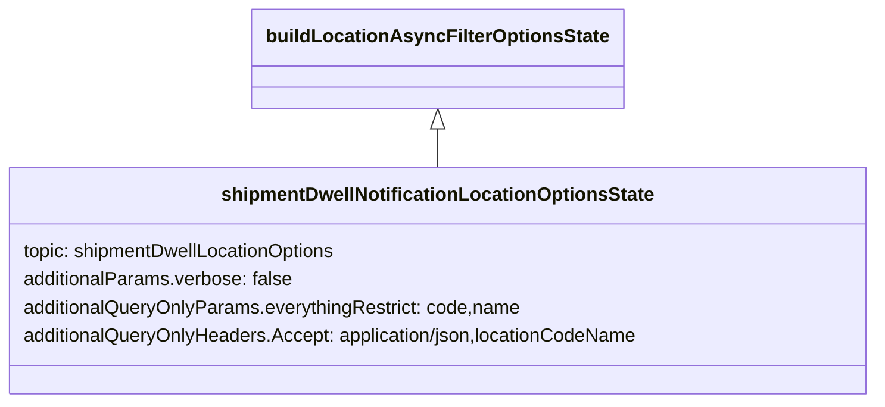

# Diagram: web/portal/src/pages/administration/admin-tools/shipment-dwell-notification/redux/ShipmentDwellNotificationSearchFilterLoaders.js

> Auto-generated by Obscura crawlers

## Mermaid

### SVG

<svg id="container" width="749.8359375" xmlns="http://www.w3.org/2000/svg" class="classDiagram" height="342" viewBox="0 0 749.8359375 342" role="graphics-document document" aria-roledescription="class"><g><defs><marker id="container_class-aggregationStart" class="marker aggregation class" refX="18" refY="7" markerWidth="190" markerHeight="240" orient="auto"><path d="M 18,7 L9,13 L1,7 L9,1 Z"></path></marker></defs><defs><marker id="container_class-aggregationEnd" class="marker aggregation class" refX="1" refY="7" markerWidth="20" markerHeight="28" orient="auto"><path d="M 18,7 L9,13 L1,7 L9,1 Z"></path></marker></defs><defs><marker id="container_class-extensionStart" class="marker extension class" refX="18" refY="7" markerWidth="190" markerHeight="240" orient="auto"><path d="M 1,7 L18,13 V 1 Z"></path></marker></defs><defs><marker id="container_class-extensionEnd" class="marker extension class" refX="1" refY="7" markerWidth="20" markerHeight="28" orient="auto"><path d="M 1,1 V 13 L18,7 Z"></path></marker></defs><defs><marker id="container_class-compositionStart" class="marker composition class" refX="18" refY="7" markerWidth="190" markerHeight="240" orient="auto"><path d="M 18,7 L9,13 L1,7 L9,1 Z"></path></marker></defs><defs><marker id="container_class-compositionEnd" class="marker composition class" refX="1" refY="7" markerWidth="20" markerHeight="28" orient="auto"><path d="M 18,7 L9,13 L1,7 L9,1 Z"></path></marker></defs><defs><marker id="container_class-dependencyStart" class="marker dependency class" refX="6" refY="7" markerWidth="190" markerHeight="240" orient="auto"><path d="M 5,7 L9,13 L1,7 L9,1 Z"></path></marker></defs><defs><marker id="container_class-dependencyEnd" class="marker dependency class" refX="13" refY="7" markerWidth="20" markerHeight="28" orient="auto"><path d="M 18,7 L9,13 L14,7 L9,1 Z"></path></marker></defs><defs><marker id="container_class-lollipopStart" class="marker lollipop class" refX="13" refY="7" markerWidth="190" markerHeight="240" orient="auto"><circle stroke="black" fill="transparent" cx="7" cy="7" r="6"></circle></marker></defs><defs><marker id="container_class-lollipopEnd" class="marker lollipop class" refX="1" refY="7" markerWidth="190" markerHeight="240" orient="auto"><circle stroke="black" fill="transparent" cx="7" cy="7" r="6"></circle></marker></defs><g class="root"><g class="clusters"></g><g class="edgePaths"><path d="M374.918,109.25L374.918,110.542C374.918,111.833,374.918,114.417,374.918,119.875C374.918,125.333,374.918,133.667,374.918,137.833L374.918,142" id="id_buildLocationAsyncFilterOptionsState_shipmentDwellNotificationLocationOptionsState_1" class="edge-thickness-normal edge-pattern-solid relation" style=";;;" data-edge="true" data-et="edge" data-id="id_buildLocationAsyncFilterOptionsState_shipmentDwellNotificationLocationOptionsState_1" data-points="W3sieCI6Mzc0LjkxNzk2ODc1LCJ5Ijo5Mn0seyJ4IjozNzQuOTE3OTY4NzUsInkiOjExN30seyJ4IjozNzQuOTE3OTY4NzUsInkiOjE0Mn1d" marker-start="url(#container_class-extensionStart)"></path></g><g class="edgeLabels"><g class="edgeLabel"><g class="label" data-id="id_buildLocationAsyncFilterOptionsState_shipmentDwellNotificationLocationOptionsState_1" transform="translate(0, 0)"><foreignObject width="0" height="0">

</foreignObject></g></g></g><g class="nodes"><g class="node default" id="classId-buildLocationAsyncFilterOptionsState-0" transform="translate(374.91796875, 50)"><g class="basic label-container"><path d="M-150.09375 -42 L150.09375 -42 L150.09375 42 L-150.09375 42" stroke="none" stroke-width="0" fill="#ECECFF" style=""></path><path d="M-150.09375 -42 C-34.69131667901391 -42, 80.71111664197218 -42, 150.09375 -42 M-150.09375 -42 C-73.13392690138546 -42, 3.8258961972290706 -42, 150.09375 -42 M150.09375 -42 C150.09375 -24.385397479057644, 150.09375 -6.770794958115289, 150.09375 42 M150.09375 -42 C150.09375 -16.068694980157193, 150.09375 9.862610039685613, 150.09375 42 M150.09375 42 C39.70330838036308 42, -70.68713323927383 42, -150.09375 42 M150.09375 42 C50.199330184258685 42, -49.69508963148263 42, -150.09375 42 M-150.09375 42 C-150.09375 18.43278633508575, -150.09375 -5.1344273298284975, -150.09375 -42 M-150.09375 42 C-150.09375 13.208820112631159, -150.09375 -15.582359774737682, -150.09375 -42" stroke="#9370DB" stroke-width="1.3" fill="none" stroke-dasharray="0 0" style=""></path></g><g class="annotation-group text" transform="translate(0, -18)"></g><g class="label-group text" transform="translate(-138.09375, -18)"><g class="label" style="font-weight: bolder" transform="translate(0,-12)"><foreignObject width="276.1875" height="24">

buildLocationAsyncFilterOptionsState

</foreignObject></g></g><g class="members-group text" transform="translate(-138.09375, 30)"></g><g class="methods-group text" transform="translate(-138.09375, 60)"></g><g class="divider" style=""><path d="M-150.09375 6 C-52.2805322692636 6, 45.532685461472795 6, 150.09375 6 M-150.09375 6 C-74.94768130570532 6, 0.19838738858936722 6, 150.09375 6" stroke="#9370DB" stroke-width="1.3" fill="none" stroke-dasharray="0 0" style=""></path></g><g class="divider" style=""><path d="M-150.09375 24 C-70.92651598859904 24, 8.240718022801929 24, 150.09375 24 M-150.09375 24 C-89.8492088335004 24, -29.604667667000797 24, 150.09375 24" stroke="#9370DB" stroke-width="1.3" fill="none" stroke-dasharray="0 0" style=""></path></g></g><g class="node default" id="classId-shipmentDwellNotificationLocationOptionsState-1" transform="translate(374.91796875, 238)"><g class="basic label-container"><path d="M-366.91796875 -96 L366.91796875 -96 L366.91796875 96 L-366.91796875 96" stroke="none" stroke-width="0" fill="#ECECFF" style=""></path><path d="M-366.91796875 -96 C-164.98398864412928 -96, 36.94999146174143 -96, 366.91796875 -96 M-366.91796875 -96 C-173.061309220503 -96, 20.79535030899399 -96, 366.91796875 -96 M366.91796875 -96 C366.91796875 -32.354744319693154, 366.91796875 31.290511360613692, 366.91796875 96 M366.91796875 -96 C366.91796875 -34.291561309346434, 366.91796875 27.41687738130713, 366.91796875 96 M366.91796875 96 C97.29596649747549 96, -172.32603575504902 96, -366.91796875 96 M366.91796875 96 C196.91039374812047 96, 26.90281874624094 96, -366.91796875 96 M-366.91796875 96 C-366.91796875 21.82688372718792, -366.91796875 -52.34623254562416, -366.91796875 -96 M-366.91796875 96 C-366.91796875 38.56720395324666, -366.91796875 -18.865592093506677, -366.91796875 -96" stroke="#9370DB" stroke-width="1.3" fill="none" stroke-dasharray="0 0" style=""></path></g><g class="annotation-group text" transform="translate(0, -72)"></g><g class="label-group text" transform="translate(-177.1015625, -72)"><g class="label" style="font-weight: bolder" transform="translate(0,-12)"><foreignObject width="354.203125" height="24">

shipmentDwellNotificationLocationOptionsState

</foreignObject></g></g><g class="members-group text" transform="translate(-354.91796875, -24)"><g class="label" style="" transform="translate(0,-12)"><foreignObject width="272.1875" height="24">

topic: shipmentDwellLocationOptions

</foreignObject></g><g class="label" style="" transform="translate(0,12)"><foreignObject width="230.6875" height="24">

additionalParams.verbose: false

</foreignObject></g><g class="label" style="" transform="translate(0,36)"><foreignObject width="426.296875" height="24">

additionalQueryOnlyParams.everythingRestrict: code,name

</foreignObject></g><g class="label" style="" transform="translate(0,60)"><foreignObject width="532.734375" height="24">

additionalQueryOnlyHeaders.Accept: application/json,locationCodeName

</foreignObject></g></g><g class="methods-group text" transform="translate(-354.91796875, 96)"></g><g class="divider" style=""><path d="M-366.91796875 -48 C-172.9436973743174 -48, 21.03057400136521 -48, 366.91796875 -48 M-366.91796875 -48 C-141.79335982287773 -48, 83.33124910424453 -48, 366.91796875 -48" stroke="#9370DB" stroke-width="1.3" fill="none" stroke-dasharray="0 0" style=""></path></g><g class="divider" style=""><path d="M-366.91796875 72 C-195.65289825507674 72, -24.38782776015347 72, 366.91796875 72 M-366.91796875 72 C-137.52670598014973 72, 91.86455678970054 72, 366.91796875 72" stroke="#9370DB" stroke-width="1.3" fill="none" stroke-dasharray="0 0" style=""></path></g></g></g></g></g></svg>
