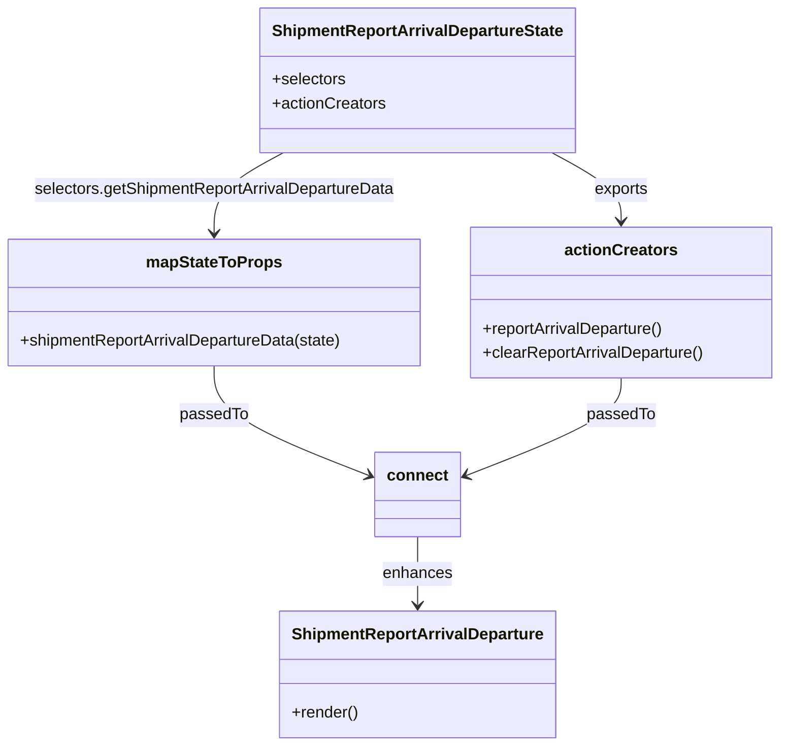

# Diagram: web/portal/src/pages/administration/admin-tools/shipment-report-arrival-departure/ShipmentReportArrivalDeparture.page.container.js


> Auto-generated by Obscura crawlers

## Diagram 1



### SVG

<svg id="container" width="779.703125" xmlns="http://www.w3.org/2000/svg" class="classDiagram" height="742" viewBox="0 0 779.703125 742" role="graphics-document document" aria-roledescription="class"><style>#container{font-family:"trebuchet ms",verdana,arial,sans-serif;font-size:16px;fill:#333;}@keyframes edge-animation-frame{from{stroke-dashoffset:0;}}@keyframes dash{to{stroke-dashoffset:0;}}#container .edge-animation-slow{stroke-dasharray:9,5!important;stroke-dashoffset:900;animation:dash 50s linear infinite;stroke-linecap:round;}#container .edge-animation-fast{stroke-dasharray:9,5!important;stroke-dashoffset:900;animation:dash 20s linear infinite;stroke-linecap:round;}#container .error-icon{fill:#552222;}#container .error-text{fill:#552222;stroke:#552222;}#container .edge-thickness-normal{stroke-width:1px;}#container .edge-thickness-thick{stroke-width:3.5px;}#container .edge-pattern-solid{stroke-dasharray:0;}#container .edge-thickness-invisible{stroke-width:0;fill:none;}#container .edge-pattern-dashed{stroke-dasharray:3;}#container .edge-pattern-dotted{stroke-dasharray:2;}#container .marker{fill:#333333;stroke:#333333;}#container .marker.cross{stroke:#333333;}#container svg{font-family:"trebuchet ms",verdana,arial,sans-serif;font-size:16px;}#container p{margin:0;}#container g.classGroup text{fill:#9370DB;stroke:none;font-family:"trebuchet ms",verdana,arial,sans-serif;font-size:10px;}#container g.classGroup text .title{font-weight:bolder;}#container .nodeLabel,#container .edgeLabel{color:#131300;}#container .edgeLabel .label rect{fill:#ECECFF;}#container .label text{fill:#131300;}#container .labelBkg{background:#ECECFF;}#container .edgeLabel .label span{background:#ECECFF;}#container .classTitle{font-weight:bolder;}#container .node rect,#container .node circle,#container .node ellipse,#container .node polygon,#container .node path{fill:#ECECFF;stroke:#9370DB;stroke-width:1px;}#container .divider{stroke:#9370DB;stroke-width:1;}#container g.clickable{cursor:pointer;}#container g.classGroup rect{fill:#ECECFF;stroke:#9370DB;}#container g.classGroup line{stroke:#9370DB;stroke-width:1;}#container .classLabel .box{stroke:none;stroke-width:0;fill:#ECECFF;opacity:0.5;}#container .classLabel .label{fill:#9370DB;font-size:10px;}#container .relation{stroke:#333333;stroke-width:1;fill:none;}#container .dashed-line{stroke-dasharray:3;}#container .dotted-line{stroke-dasharray:1 2;}#container #compositionStart,#container .composition{fill:#333333!important;stroke:#333333!important;stroke-width:1;}#container #compositionEnd,#container .composition{fill:#333333!important;stroke:#333333!important;stroke-width:1;}#container #dependencyStart,#container .dependency{fill:#333333!important;stroke:#333333!important;stroke-width:1;}#container #dependencyStart,#container .dependency{fill:#333333!important;stroke:#333333!important;stroke-width:1;}#container #extensionStart,#container .extension{fill:transparent!important;stroke:#333333!important;stroke-width:1;}#container #extensionEnd,#container .extension{fill:transparent!important;stroke:#333333!important;stroke-width:1;}#container #aggregationStart,#container .aggregation{fill:transparent!important;stroke:#333333!important;stroke-width:1;}#container #aggregationEnd,#container .aggregation{fill:transparent!important;stroke:#333333!important;stroke-width:1;}#container #lollipopStart,#container .lollipop{fill:#ECECFF!important;stroke:#333333!important;stroke-width:1;}#container #lollipopEnd,#container .lollipop{fill:#ECECFF!important;stroke:#333333!important;stroke-width:1;}#container .edgeTerminals{font-size:11px;line-height:initial;}#container .classTitleText{text-anchor:middle;font-size:18px;fill:#333;}#container .label-icon{display:inline-block;height:1em;overflow:visible;vertical-align:-0.125em;}#container .node .label-icon path{fill:currentColor;stroke:revert;stroke-width:revert;}#container :root{--mermaid-font-family:"trebuchet ms",verdana,arial,sans-serif;}</style><g><defs><marker id="container_class-aggregationStart" class="marker aggregation class" refX="18" refY="7" markerWidth="190" markerHeight="240" orient="auto"><path d="M 18,7 L9,13 L1,7 L9,1 Z"></path></marker></defs><defs><marker id="container_class-aggregationEnd" class="marker aggregation class" refX="1" refY="7" markerWidth="20" markerHeight="28" orient="auto"><path d="M 18,7 L9,13 L1,7 L9,1 Z"></path></marker></defs><defs><marker id="container_class-extensionStart" class="marker extension class" refX="18" refY="7" markerWidth="190" markerHeight="240" orient="auto"><path d="M 1,7 L18,13 V 1 Z"></path></marker></defs><defs><marker id="container_class-extensionEnd" class="marker extension class" refX="1" refY="7" markerWidth="20" markerHeight="28" orient="auto"><path d="M 1,1 V 13 L18,7 Z"></path></marker></defs><defs><marker id="container_class-compositionStart" class="marker composition class" refX="18" refY="7" markerWidth="190" markerHeight="240" orient="auto"><path d="M 18,7 L9,13 L1,7 L9,1 Z"></path></marker></defs><defs><marker id="container_class-compositionEnd" class="marker composition class" refX="1" refY="7" markerWidth="20" markerHeight="28" orient="auto"><path d="M 18,7 L9,13 L1,7 L9,1 Z"></path></marker></defs><defs><marker id="container_class-dependencyStart" class="marker dependency class" refX="6" refY="7" markerWidth="190" markerHeight="240" orient="auto"><path d="M 5,7 L9,13 L1,7 L9,1 Z"></path></marker></defs><defs><marker id="container_class-dependencyEnd" class="marker dependency class" refX="13" refY="7" markerWidth="20" markerHeight="28" orient="auto"><path d="M 18,7 L9,13 L14,7 L9,1 Z"></path></marker></defs><defs><marker id="container_class-lollipopStart" class="marker lollipop class" refX="13" refY="7" markerWidth="190" markerHeight="240" orient="auto"><circle stroke="black" fill="transparent" cx="7" cy="7" r="6"></circle></marker></defs><defs><marker id="container_class-lollipopEnd" class="marker lollipop class" refX="1" refY="7" markerWidth="190" markerHeight="240" orient="auto"><circle stroke="black" fill="transparent" cx="7" cy="7" r="6"></circle></marker></defs><g class="root"><g class="clusters"></g><g class="edgePaths"><path d="M283.768,152L272.259,158.167C260.75,164.333,237.732,176.667,226.224,190C214.715,203.333,214.715,217.667,214.715,224.833L214.715,232" id="id_ShipmentReportArrivalDepartureState_mapStateToProps_1" class="edge-thickness-normal edge-pattern-solid relation" style=";;;" data-edge="true" data-et="edge" data-id="id_ShipmentReportArrivalDepartureState_mapStateToProps_1" data-points="W3sieCI6MjgzLjc2NzYzMTg4MDczMzksInkiOjE1Mn0seyJ4IjoyMTQuNzE0ODQzNzUsInkiOjE4OX0seyJ4IjoyMTQuNzE0ODQzNzUsInkiOjIzOH1d" marker-end="url(#container_class-dependencyEnd)"></path><path d="M552.514,152L564.022,158.167C575.531,164.333,598.549,176.667,610.058,188C621.566,199.333,621.566,209.667,621.566,214.833L621.566,220" id="id_ShipmentReportArrivalDepartureState_actionCreators_2" class="edge-thickness-normal edge-pattern-solid relation" style=";;;" data-edge="true" data-et="edge" data-id="id_ShipmentReportArrivalDepartureState_actionCreators_2" data-points="W3sieCI6NTUyLjUxMzYxODExOTI2NjEsInkiOjE1Mn0seyJ4Ijo2MjEuNTY2NDA2MjUsInkiOjE4OX0seyJ4Ijo2MjEuNTY2NDA2MjUsInkiOjIyNn1d" marker-end="url(#container_class-dependencyEnd)"></path><path d="M214.715,364L214.715,372.167C214.715,380.333,214.715,396.667,240.868,414.99C267.021,433.313,319.327,453.626,345.48,463.783L371.634,473.939" id="id_mapStateToProps_connect_3" class="edge-thickness-normal edge-pattern-solid relation" style=";;;" data-edge="true" data-et="edge" data-id="id_mapStateToProps_connect_3" data-points="W3sieCI6MjE0LjcxNDg0Mzc1LCJ5IjozNjR9LHsieCI6MjE0LjcxNDg0Mzc1LCJ5Ijo0MTN9LHsieCI6Mzc3LjIyNjU2MjUsInkiOjQ3Ni4xMTExMDQ3MTAzMzI3N31d" marker-end="url(#container_class-dependencyEnd)"></path><path d="M621.566,376L621.566,382.167C621.566,388.333,621.566,400.667,595.413,416.99C569.26,433.313,516.954,453.626,490.801,463.783L464.648,473.939" id="id_actionCreators_connect_4" class="edge-thickness-normal edge-pattern-solid relation" style=";;;" data-edge="true" data-et="edge" data-id="id_actionCreators_connect_4" data-points="W3sieCI6NjIxLjU2NjQwNjI1LCJ5IjozNzZ9LHsieCI6NjIxLjU2NjQwNjI1LCJ5Ijo0MTN9LHsieCI6NDU5LjA1NDY4NzUsInkiOjQ3Ni4xMTExMDQ3MTAzMzI3N31d" marker-end="url(#container_class-dependencyEnd)"></path><path d="M418.141,534L418.141,540.167C418.141,546.333,418.141,558.667,418.141,570C418.141,581.333,418.141,591.667,418.141,596.833L418.141,602" id="id_connect_ShipmentReportArrivalDeparture_5" class="edge-thickness-normal edge-pattern-solid relation" style=";;;" data-edge="true" data-et="edge" data-id="id_connect_ShipmentReportArrivalDeparture_5" data-points="W3sieCI6NDE4LjE0MDYyNSwieSI6NTM0fSx7IngiOjQxOC4xNDA2MjUsInkiOjU3MX0seyJ4Ijo0MTguMTQwNjI1LCJ5Ijo2MDh9XQ==" marker-end="url(#container_class-dependencyEnd)"></path></g><g class="edgeLabels"><g class="edgeLabel" transform="translate(214.71484375, 189)"><g class="label" data-id="id_ShipmentReportArrivalDepartureState_mapStateToProps_1" transform="translate(-181.6015625, -12)"><foreignObject width="363.203125" height="24"><div xmlns="http://www.w3.org/1999/xhtml" class="labelBkg" style="display: table; white-space: break-spaces; line-height: 1.5; max-width: 200px; text-align: center; width: 200px;"><span class="edgeLabel"><p>selectors.getShipmentReportArrivalDepartureData</p></span></div></foreignObject></g></g><g class="edgeLabel" transform="translate(621.56640625, 189)"><g class="label" data-id="id_ShipmentReportArrivalDepartureState_actionCreators_2" transform="translate(-27.3046875, -12)"><foreignObject width="54.609375" height="24"><div xmlns="http://www.w3.org/1999/xhtml" class="labelBkg" style="display: table-cell; white-space: nowrap; line-height: 1.5; max-width: 200px; text-align: center;"><span class="edgeLabel"><p>exports</p></span></div></foreignObject></g></g><g class="edgeLabel" transform="translate(214.71484375, 413)"><g class="label" data-id="id_mapStateToProps_connect_3" transform="translate(-33.8515625, -12)"><foreignObject width="67.703125" height="24"><div xmlns="http://www.w3.org/1999/xhtml" class="labelBkg" style="display: table-cell; white-space: nowrap; line-height: 1.5; max-width: 200px; text-align: center;"><span class="edgeLabel"><p>passedTo</p></span></div></foreignObject></g></g><g class="edgeLabel" transform="translate(621.56640625, 413)"><g class="label" data-id="id_actionCreators_connect_4" transform="translate(-33.8515625, -12)"><foreignObject width="67.703125" height="24"><div xmlns="http://www.w3.org/1999/xhtml" class="labelBkg" style="display: table-cell; white-space: nowrap; line-height: 1.5; max-width: 200px; text-align: center;"><span class="edgeLabel"><p>passedTo</p></span></div></foreignObject></g></g><g class="edgeLabel" transform="translate(418.140625, 571)"><g class="label" data-id="id_connect_ShipmentReportArrivalDeparture_5" transform="translate(-34.5390625, -12)"><foreignObject width="69.078125" height="24"><div xmlns="http://www.w3.org/1999/xhtml" class="labelBkg" style="display: table-cell; white-space: nowrap; line-height: 1.5; max-width: 200px; text-align: center;"><span class="edgeLabel"><p>enhances</p></span></div></foreignObject></g></g></g><g class="nodes"><g class="node default" id="classId-ShipmentReportArrivalDeparture-0" transform="translate(418.140625, 671)"><g class="basic label-container"><path d="M-133.046875 -63 L133.046875 -63 L133.046875 63 L-133.046875 63" stroke="none" stroke-width="0" fill="#ECECFF" style=""></path><path d="M-133.046875 -63 C-33.56856549530143 -63, 65.90974400939714 -63, 133.046875 -63 M-133.046875 -63 C-56.33855255629925 -63, 20.369769887401503 -63, 133.046875 -63 M133.046875 -63 C133.046875 -27.517692475527106, 133.046875 7.964615048945788, 133.046875 63 M133.046875 -63 C133.046875 -30.799846754873506, 133.046875 1.4003064902529871, 133.046875 63 M133.046875 63 C56.96092027495337 63, -19.125034450093267 63, -133.046875 63 M133.046875 63 C41.01966351296541 63, -51.00754797406918 63, -133.046875 63 M-133.046875 63 C-133.046875 17.569793979209024, -133.046875 -27.860412041581952, -133.046875 -63 M-133.046875 63 C-133.046875 25.97539471328107, -133.046875 -11.049210573437861, -133.046875 -63" stroke="#9370DB" stroke-width="1.3" fill="none" stroke-dasharray="0 0" style=""></path></g><g class="annotation-group text" transform="translate(0, -39)"></g><g class="label-group text" transform="translate(-121.046875, -39)"><g class="label" style="font-weight: bolder" transform="translate(0,-12)"><foreignObject width="242.09375" height="24"><div xmlns="http://www.w3.org/1999/xhtml" style="display: table-cell; white-space: nowrap; line-height: 1.5; max-width: 288px; text-align: center;"><span class="nodeLabel markdown-node-label" style=""><p>ShipmentReportArrivalDeparture</p></span></div></foreignObject></g></g><g class="members-group text" transform="translate(-121.046875, 9)"></g><g class="methods-group text" transform="translate(-121.046875, 39)"><g class="label" style="" transform="translate(0,-12)"><foreignObject width="66.609375" height="24"><div xmlns="http://www.w3.org/1999/xhtml" style="display: table-cell; white-space: nowrap; line-height: 1.5; max-width: 124px; text-align: center;"><span class="nodeLabel markdown-node-label" style=""><p>+render()</p></span></div></foreignObject></g></g><g class="divider" style=""><path d="M-133.046875 -15 C-32.305295479389926 -15, 68.43628404122015 -15, 133.046875 -15 M-133.046875 -15 C-53.1532033558271 -15, 26.740468288345795 -15, 133.046875 -15" stroke="#9370DB" stroke-width="1.3" fill="none" stroke-dasharray="0 0" style=""></path></g><g class="divider" style=""><path d="M-133.046875 9 C-74.6028893954448 9, -16.158903790889596 9, 133.046875 9 M-133.046875 9 C-69.47143568042057 9, -5.8959963608411385 9, 133.046875 9" stroke="#9370DB" stroke-width="1.3" fill="none" stroke-dasharray="0 0" style=""></path></g></g><g class="node default" id="classId-ShipmentReportArrivalDepartureState-1" transform="translate(418.140625, 80)"><g class="basic label-container"><path d="M-152.359375 -72 L152.359375 -72 L152.359375 72 L-152.359375 72" stroke="none" stroke-width="0" fill="#ECECFF" style=""></path><path d="M-152.359375 -72 C-68.71598406111579 -72, 14.92740687776842 -72, 152.359375 -72 M-152.359375 -72 C-41.48540234954376 -72, 69.38857030091248 -72, 152.359375 -72 M152.359375 -72 C152.359375 -26.180922436303966, 152.359375 19.638155127392068, 152.359375 72 M152.359375 -72 C152.359375 -38.990348982839976, 152.359375 -5.980697965679951, 152.359375 72 M152.359375 72 C72.22149885697425 72, -7.9163772860515 72, -152.359375 72 M152.359375 72 C85.4488608975895 72, 18.538346795178995 72, -152.359375 72 M-152.359375 72 C-152.359375 28.20624946748294, -152.359375 -15.587501065034118, -152.359375 -72 M-152.359375 72 C-152.359375 30.24875669975178, -152.359375 -11.50248660049644, -152.359375 -72" stroke="#9370DB" stroke-width="1.3" fill="none" stroke-dasharray="0 0" style=""></path></g><g class="annotation-group text" transform="translate(0, -48)"></g><g class="label-group text" transform="translate(-140.359375, -48)"><g class="label" style="font-weight: bolder" transform="translate(0,-12)"><foreignObject width="280.71875" height="24"><div xmlns="http://www.w3.org/1999/xhtml" style="display: table-cell; white-space: nowrap; line-height: 1.5; max-width: 326px; text-align: center;"><span class="nodeLabel markdown-node-label" style=""><p>ShipmentReportArrivalDepartureState</p></span></div></foreignObject></g></g><g class="members-group text" transform="translate(-140.359375, 0)"><g class="label" style="" transform="translate(0,-12)"><foreignObject width="73.453125" height="24"><div xmlns="http://www.w3.org/1999/xhtml" style="display: table-cell; white-space: nowrap; line-height: 1.5; max-width: 131px; text-align: center;"><span class="nodeLabel markdown-node-label" style=""><p>+selectors</p></span></div></foreignObject></g><g class="label" style="" transform="translate(0,12)"><foreignObject width="113.078125" height="24"><div xmlns="http://www.w3.org/1999/xhtml" style="display: table-cell; white-space: nowrap; line-height: 1.5; max-width: 170px; text-align: center;"><span class="nodeLabel markdown-node-label" style=""><p>+actionCreators</p></span></div></foreignObject></g></g><g class="methods-group text" transform="translate(-140.359375, 72)"></g><g class="divider" style=""><path d="M-152.359375 -24 C-80.95840100873636 -24, -9.557427017472719 -24, 152.359375 -24 M-152.359375 -24 C-57.812259371140144 -24, 36.73485625771971 -24, 152.359375 -24" stroke="#9370DB" stroke-width="1.3" fill="none" stroke-dasharray="0 0" style=""></path></g><g class="divider" style=""><path d="M-152.359375 48 C-61.226967343008425 48, 29.90544031398315 48, 152.359375 48 M-152.359375 48 C-40.16292852261634 48, 72.03351795476732 48, 152.359375 48" stroke="#9370DB" stroke-width="1.3" fill="none" stroke-dasharray="0 0" style=""></path></g></g><g class="node default" id="classId-mapStateToProps-2" transform="translate(214.71484375, 301)"><g class="basic label-container"><path d="M-206.71484375 -63 L206.71484375 -63 L206.71484375 63 L-206.71484375 63" stroke="none" stroke-width="0" fill="#ECECFF" style=""></path><path d="M-206.71484375 -63 C-112.3649858641037 -63, -18.015127978207403 -63, 206.71484375 -63 M-206.71484375 -63 C-112.33131177943123 -63, -17.947779808862464 -63, 206.71484375 -63 M206.71484375 -63 C206.71484375 -25.74073015793045, 206.71484375 11.5185396841391, 206.71484375 63 M206.71484375 -63 C206.71484375 -34.89255904918791, 206.71484375 -6.785118098375818, 206.71484375 63 M206.71484375 63 C83.68785225976251 63, -39.339139230474984 63, -206.71484375 63 M206.71484375 63 C99.17627733734709 63, -8.362289075305824 63, -206.71484375 63 M-206.71484375 63 C-206.71484375 27.58822245357681, -206.71484375 -7.823555092846377, -206.71484375 -63 M-206.71484375 63 C-206.71484375 22.19121714289996, -206.71484375 -18.617565714200083, -206.71484375 -63" stroke="#9370DB" stroke-width="1.3" fill="none" stroke-dasharray="0 0" style=""></path></g><g class="annotation-group text" transform="translate(0, -39)"></g><g class="label-group text" transform="translate(-64.7109375, -39)"><g class="label" style="font-weight: bolder" transform="translate(0,-12)"><foreignObject width="129.421875" height="24"><div xmlns="http://www.w3.org/1999/xhtml" style="display: table-cell; white-space: nowrap; line-height: 1.5; max-width: 177px; text-align: center;"><span class="nodeLabel markdown-node-label" style=""><p>mapStateToProps</p></span></div></foreignObject></g></g><g class="members-group text" transform="translate(-194.71484375, 9)"></g><g class="methods-group text" transform="translate(-194.71484375, 39)"><g class="label" style="" transform="translate(0,-12)"><foreignObject width="324.71875" height="24"><div xmlns="http://www.w3.org/1999/xhtml" style="display: table-cell; white-space: nowrap; line-height: 1.5; max-width: 382px; text-align: center;"><span class="nodeLabel markdown-node-label" style=""><p>+shipmentReportArrivalDepartureData(state)</p></span></div></foreignObject></g></g><g class="divider" style=""><path d="M-206.71484375 -15 C-76.89086044339712 -15, 52.93312286320577 -15, 206.71484375 -15 M-206.71484375 -15 C-66.5632665733815 -15, 73.588310603237 -15, 206.71484375 -15" stroke="#9370DB" stroke-width="1.3" fill="none" stroke-dasharray="0 0" style=""></path></g><g class="divider" style=""><path d="M-206.71484375 9 C-68.5992168123201 9, 69.51641012535981 9, 206.71484375 9 M-206.71484375 9 C-67.60752219407158 9, 71.49979936185684 9, 206.71484375 9" stroke="#9370DB" stroke-width="1.3" fill="none" stroke-dasharray="0 0" style=""></path></g></g><g class="node default" id="classId-actionCreators-3" transform="translate(621.56640625, 301)"><g class="basic label-container"><path d="M-150.13671875 -75 L150.13671875 -75 L150.13671875 75 L-150.13671875 75" stroke="none" stroke-width="0" fill="#ECECFF" style=""></path><path d="M-150.13671875 -75 C-37.26010943764287 -75, 75.61649987471426 -75, 150.13671875 -75 M-150.13671875 -75 C-79.1223460365308 -75, -8.1079733230616 -75, 150.13671875 -75 M150.13671875 -75 C150.13671875 -25.801078627669106, 150.13671875 23.397842744661787, 150.13671875 75 M150.13671875 -75 C150.13671875 -19.154534523238937, 150.13671875 36.69093095352213, 150.13671875 75 M150.13671875 75 C63.929421053132685 75, -22.27787664373463 75, -150.13671875 75 M150.13671875 75 C74.93262073559181 75, -0.27147727881637707 75, -150.13671875 75 M-150.13671875 75 C-150.13671875 38.11898855636896, -150.13671875 1.2379771127379229, -150.13671875 -75 M-150.13671875 75 C-150.13671875 31.364162857101306, -150.13671875 -12.271674285797388, -150.13671875 -75" stroke="#9370DB" stroke-width="1.3" fill="none" stroke-dasharray="0 0" style=""></path></g><g class="annotation-group text" transform="translate(0, -51)"></g><g class="label-group text" transform="translate(-53.6328125, -51)"><g class="label" style="font-weight: bolder" transform="translate(0,-12)"><foreignObject width="107.265625" height="24"><div xmlns="http://www.w3.org/1999/xhtml" style="display: table-cell; white-space: nowrap; line-height: 1.5; max-width: 155px; text-align: center;"><span class="nodeLabel markdown-node-label" style=""><p>actionCreators</p></span></div></foreignObject></g></g><g class="members-group text" transform="translate(-138.13671875, -3)"></g><g class="methods-group text" transform="translate(-138.13671875, 27)"><g class="label" style="" transform="translate(0,-12)"><foreignObject width="183.203125" height="24"><div xmlns="http://www.w3.org/1999/xhtml" style="display: table-cell; white-space: nowrap; line-height: 1.5; max-width: 241px; text-align: center;"><span class="nodeLabel markdown-node-label" style=""><p>+reportArrivalDeparture()</p></span></div></foreignObject></g><g class="label" style="" transform="translate(0,12)"><foreignObject width="222.640625" height="24"><div xmlns="http://www.w3.org/1999/xhtml" style="display: table-cell; white-space: nowrap; line-height: 1.5; max-width: 280px; text-align: center;"><span class="nodeLabel markdown-node-label" style=""><p>+clearReportArrivalDeparture()</p></span></div></foreignObject></g></g><g class="divider" style=""><path d="M-150.13671875 -27 C-56.51303473632281 -27, 37.11064927735438 -27, 150.13671875 -27 M-150.13671875 -27 C-86.727573558891 -27, -23.31842836778199 -27, 150.13671875 -27" stroke="#9370DB" stroke-width="1.3" fill="none" stroke-dasharray="0 0" style=""></path></g><g class="divider" style=""><path d="M-150.13671875 -3 C-38.837393673703275 -3, 72.46193140259345 -3, 150.13671875 -3 M-150.13671875 -3 C-57.50822659410788 -3, 35.12026556178424 -3, 150.13671875 -3" stroke="#9370DB" stroke-width="1.3" fill="none" stroke-dasharray="0 0" style=""></path></g></g><g class="node default" id="classId-connect-4" transform="translate(418.140625, 492)"><g class="basic label-container"><path d="M-40.9140625 -42 L40.9140625 -42 L40.9140625 42 L-40.9140625 42" stroke="none" stroke-width="0" fill="#ECECFF" style=""></path><path d="M-40.9140625 -42 C-23.42722289985112 -42, -5.9403832997022405 -42, 40.9140625 -42 M-40.9140625 -42 C-15.50356406098587 -42, 9.90693437802826 -42, 40.9140625 -42 M40.9140625 -42 C40.9140625 -15.708599340333354, 40.9140625 10.582801319333292, 40.9140625 42 M40.9140625 -42 C40.9140625 -19.445572999006174, 40.9140625 3.108854001987652, 40.9140625 42 M40.9140625 42 C10.500567906691025 42, -19.91292668661795 42, -40.9140625 42 M40.9140625 42 C23.638876845934345 42, 6.363691191868689 42, -40.9140625 42 M-40.9140625 42 C-40.9140625 16.707689424181506, -40.9140625 -8.584621151636988, -40.9140625 -42 M-40.9140625 42 C-40.9140625 13.830811693827322, -40.9140625 -14.338376612345357, -40.9140625 -42" stroke="#9370DB" stroke-width="1.3" fill="none" stroke-dasharray="0 0" style=""></path></g><g class="annotation-group text" transform="translate(0, -18)"></g><g class="label-group text" transform="translate(-28.9140625, -18)"><g class="label" style="font-weight: bolder" transform="translate(0,-12)"><foreignObject width="57.828125" height="24"><div xmlns="http://www.w3.org/1999/xhtml" style="display: table-cell; white-space: nowrap; line-height: 1.5; max-width: 108px; text-align: center;"><span class="nodeLabel markdown-node-label" style=""><p>connect</p></span></div></foreignObject></g></g><g class="members-group text" transform="translate(-28.9140625, 30)"></g><g class="methods-group text" transform="translate(-28.9140625, 60)"></g><g class="divider" style=""><path d="M-40.9140625 6 C-23.10810943451867 6, -5.302156369037341 6, 40.9140625 6 M-40.9140625 6 C-22.95640129943034 6, -4.998740098860679 6, 40.9140625 6" stroke="#9370DB" stroke-width="1.3" fill="none" stroke-dasharray="0 0" style=""></path></g><g class="divider" style=""><path d="M-40.9140625 24 C-22.64355854839994 24, -4.373054596799882 24, 40.9140625 24 M-40.9140625 24 C-23.945186642554997 24, -6.976310785109995 24, 40.9140625 24" stroke="#9370DB" stroke-width="1.3" fill="none" stroke-dasharray="0 0" style=""></path></g></g></g></g></g></svg>

## Diagram 2

```mermaid
flowchart TD
    State["Redux State"] -->|selectors.getShipmentReportArrivalDepartureData(state)| Selector[\"ShipmentReportArrivalDepartureState.selectors\"]
    Selector -->|returns data| mapStateToProps[\"mapStateToProps\"]
    Actions["ShipmentReportArrivalDepartureState.actionCreators"] -->|reportArrivalDeparture / clearReportArrivalDeparture| ActionCreators
    mapStateToProps -->|props: shipmentReportArrivalDepartureData| Connect["connect(mapStateToProps, actionCreators)"]
    ActionCreators --> Connect
    Connect --> Component["ShipmentReportArrivalDeparture (React Component)"]
    Component -->|dispatches| ActionCreators
```

> SVG rendering failed for this diagram.
