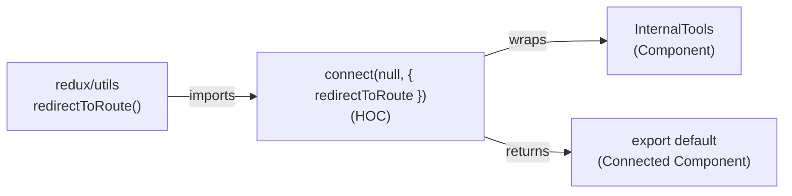

# Diagram: web/portal/src/pages/administration/internal-tools/InternalTools.page.container.js

> Auto-generated by Obscura crawlers

## Mermaid

### SVG

<svg id="container" width="1035.140625" xmlns="http://www.w3.org/2000/svg" class="flowchart" height="222" viewBox="0 0 1035.140625 222" role="graphics-document document" aria-roledescription="flowchart-v2"><g><marker id="container_flowchart-v2-pointEnd" class="marker flowchart-v2" viewBox="0 0 10 10" refX="5" refY="5" markerUnits="userSpaceOnUse" markerWidth="8" markerHeight="8" orient="auto"><path d="M 0 0 L 10 5 L 0 10 z" class="arrowMarkerPath" style="stroke-width: 1; stroke-dasharray: 1, 0;"></path></marker><marker id="container_flowchart-v2-pointStart" class="marker flowchart-v2" viewBox="0 0 10 10" refX="4.5" refY="5" markerUnits="userSpaceOnUse" markerWidth="8" markerHeight="8" orient="auto"><path d="M 0 5 L 10 10 L 10 0 z" class="arrowMarkerPath" style="stroke-width: 1; stroke-dasharray: 1, 0;"></path></marker><marker id="container_flowchart-v2-circleEnd" class="marker flowchart-v2" viewBox="0 0 10 10" refX="11" refY="5" markerUnits="userSpaceOnUse" markerWidth="11" markerHeight="11" orient="auto"><circle cx="5" cy="5" r="5" class="arrowMarkerPath" style="stroke-width: 1; stroke-dasharray: 1, 0;"></circle></marker><marker id="container_flowchart-v2-circleStart" class="marker flowchart-v2" viewBox="0 0 10 10" refX="-1" refY="5" markerUnits="userSpaceOnUse" markerWidth="11" markerHeight="11" orient="auto"><circle cx="5" cy="5" r="5" class="arrowMarkerPath" style="stroke-width: 1; stroke-dasharray: 1, 0;"></circle></marker><marker id="container_flowchart-v2-crossEnd" class="marker cross flowchart-v2" viewBox="0 0 11 11" refX="12" refY="5.2" markerUnits="userSpaceOnUse" markerWidth="11" markerHeight="11" orient="auto"><path d="M 1,1 l 9,9 M 10,1 l -9,9" class="arrowMarkerPath" style="stroke-width: 2; stroke-dasharray: 1, 0;"></path></marker><marker id="container_flowchart-v2-crossStart" class="marker cross flowchart-v2" viewBox="0 0 11 11" refX="-1" refY="5.2" markerUnits="userSpaceOnUse" markerWidth="11" markerHeight="11" orient="auto"><path d="M 1,1 l 9,9 M 10,1 l -9,9" class="arrowMarkerPath" style="stroke-width: 2; stroke-dasharray: 1, 0;"></path></marker><g class="root"><g class="clusters"></g><g class="edgePaths"><path d="M291.516,99L300.391,99C309.266,99,327.016,99,344.099,99C361.182,99,377.599,99,385.807,99L394.016,99" id="L_ReduxUtils_Connect_0" class="edge-thickness-normal edge-pattern-solid edge-thickness-normal edge-pattern-solid flowchart-link" style=";" data-edge="true" data-et="edge" data-id="L_ReduxUtils_Connect_0" data-points="W3sieCI6MjkxLjUxNTYyNSwieSI6OTl9LHsieCI6MzQ0Ljc2NTYyNSwieSI6OTl9LHsieCI6Mzk4LjAxNTYyNSwieSI6OTl9XQ==" marker-end="url(#container_flowchart-v2-pointEnd)"></path><path d="M638.474,60L650.276,55.833C662.077,51.667,685.679,43.333,705.358,39.167C725.036,35,740.792,35,748.669,35L756.547,35" id="L_Connect_InternalTools_0" class="edge-thickness-normal edge-pattern-solid edge-thickness-normal edge-pattern-solid flowchart-link" style=";" data-edge="true" data-et="edge" data-id="L_Connect_InternalTools_0" data-points="W3sieCI6NjM4LjQ3NDM2NTIzNDM3NSwieSI6NjB9LHsieCI6NzA5LjI4MTI1LCJ5IjozNX0seyJ4Ijo3NjAuNTQ2ODc1LCJ5IjozNX1d" marker-end="url(#container_flowchart-v2-pointEnd)"></path><path d="M638.474,138L650.276,142.167C662.077,146.333,685.679,154.667,705.907,158.833C726.135,163,742.99,163,751.417,163L759.844,163" id="L_Connect_Export_0" class="edge-thickness-normal edge-pattern-solid edge-thickness-normal edge-pattern-solid flowchart-link" style=";" data-edge="true" data-et="edge" data-id="L_Connect_Export_0" data-points="W3sieCI6NjM4LjQ3NDM2NTIzNDM3NSwieSI6MTM4fSx7IngiOjcwOS4yODEyNSwieSI6MTYzfSx7IngiOjc2My44NDM3NSwieSI6MTYzfV0=" marker-end="url(#container_flowchart-v2-pointEnd)"></path></g><g class="edgeLabels"><g class="edgeLabel" transform="translate(344.765625, 99)"><g class="label" data-id="L_ReduxUtils_Connect_0" transform="translate(-28.25, -12)"><foreignObject width="56.5" height="24">

imports

</foreignObject></g></g><g class="edgeLabel" transform="translate(709.28125, 35)"><g class="label" data-id="L_Connect_InternalTools_0" transform="translate(-21.390625, -12)"><foreignObject width="42.78125" height="24">

wraps

</foreignObject></g></g><g class="edgeLabel" transform="translate(709.28125, 163)"><g class="label" data-id="L_Connect_Export_0" transform="translate(-26.265625, -12)"><foreignObject width="52.53125" height="24">

returns

</foreignObject></g></g></g><g class="nodes"><g class="node default" id="flowchart-ReduxUtils-0" transform="translate(149.7578125, 99)"><rect class="basic label-container" style="" x="-141.7578125" y="-27" width="283.515625" height="54"></rect><g class="label" style="" transform="translate(-111.7578125, -12)"><rect></rect><foreignObject width="223.515625" height="24">

redux/utils\nredirectToRoute()

</foreignObject></g></g><g class="node default" id="flowchart-InternalTools-1" transform="translate(893.84375, 35)"><rect class="basic label-container" style="" x="-133.296875" y="-27" width="266.59375" height="54"></rect><g class="label" style="" transform="translate(-103.296875, -12)"><rect></rect><foreignObject width="206.59375" height="24">

InternalTools\n(Component)

</foreignObject></g></g><g class="node default" id="flowchart-Connect-2" transform="translate(528.015625, 99)"><rect class="basic label-container" style="" x="-130" y="-39" width="260" height="78"></rect><g class="label" style="" transform="translate(-100, -24)"><rect></rect><foreignObject width="200" height="48">

connect(null, { redirectToRoute })\n(HOC)

</foreignObject></g></g><g class="node default" id="flowchart-Export-3" transform="translate(893.84375, 163)"><rect class="basic label-container" style="" x="-130" y="-51" width="260" height="102"></rect><g class="label" style="" transform="translate(-100, -36)"><rect></rect><foreignObject width="200" height="72">

export default\n(Connected Component)

</foreignObject></g></g></g></g></g></svg>
