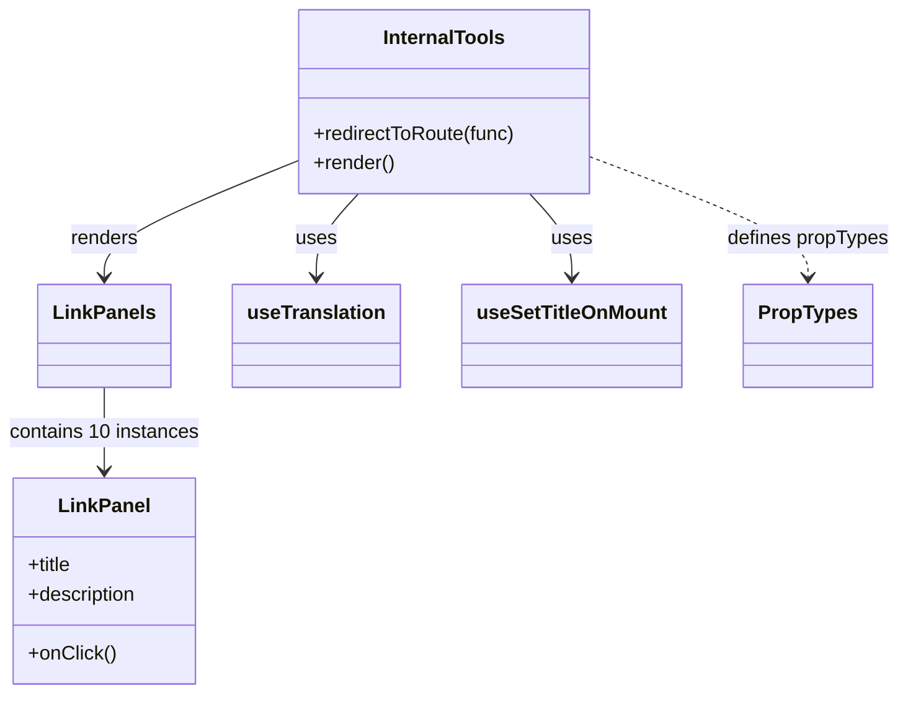
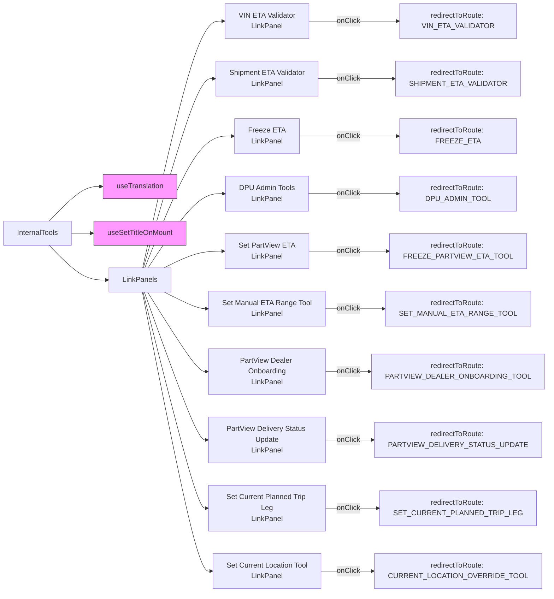

# Diagram: web/portal/src/pages/administration/internal-tools/InternalTools.page.js

> Auto-generated by Obscura crawlers

## Diagram 1

### SVG

<svg id="container" width="716.828125" xmlns="http://www.w3.org/2000/svg" class="classDiagram" height="566" viewBox="0 0 716.828125 566" role="graphics-document document" aria-roledescription="class"><g><defs><marker id="container_class-aggregationStart" class="marker aggregation class" refX="18" refY="7" markerWidth="190" markerHeight="240" orient="auto"><path d="M 18,7 L9,13 L1,7 L9,1 Z"></path></marker></defs><defs><marker id="container_class-aggregationEnd" class="marker aggregation class" refX="1" refY="7" markerWidth="20" markerHeight="28" orient="auto"><path d="M 18,7 L9,13 L1,7 L9,1 Z"></path></marker></defs><defs><marker id="container_class-extensionStart" class="marker extension class" refX="18" refY="7" markerWidth="190" markerHeight="240" orient="auto"><path d="M 1,7 L18,13 V 1 Z"></path></marker></defs><defs><marker id="container_class-extensionEnd" class="marker extension class" refX="1" refY="7" markerWidth="20" markerHeight="28" orient="auto"><path d="M 1,1 V 13 L18,7 Z"></path></marker></defs><defs><marker id="container_class-compositionStart" class="marker composition class" refX="18" refY="7" markerWidth="190" markerHeight="240" orient="auto"><path d="M 18,7 L9,13 L1,7 L9,1 Z"></path></marker></defs><defs><marker id="container_class-compositionEnd" class="marker composition class" refX="1" refY="7" markerWidth="20" markerHeight="28" orient="auto"><path d="M 18,7 L9,13 L1,7 L9,1 Z"></path></marker></defs><defs><marker id="container_class-dependencyStart" class="marker dependency class" refX="6" refY="7" markerWidth="190" markerHeight="240" orient="auto"><path d="M 5,7 L9,13 L1,7 L9,1 Z"></path></marker></defs><defs><marker id="container_class-dependencyEnd" class="marker dependency class" refX="13" refY="7" markerWidth="20" markerHeight="28" orient="auto"><path d="M 18,7 L9,13 L14,7 L9,1 Z"></path></marker></defs><defs><marker id="container_class-lollipopStart" class="marker lollipop class" refX="13" refY="7" markerWidth="190" markerHeight="240" orient="auto"><circle stroke="black" fill="transparent" cx="7" cy="7" r="6"></circle></marker></defs><defs><marker id="container_class-lollipopEnd" class="marker lollipop class" refX="1" refY="7" markerWidth="190" markerHeight="240" orient="auto"><circle stroke="black" fill="transparent" cx="7" cy="7" r="6"></circle></marker></defs><g class="root"><g class="clusters"></g><g class="edgePaths"><path d="M286.387,158L280.806,164.167C275.224,170.333,264.061,182.667,258.48,194C252.898,205.333,252.898,215.667,252.898,220.833L252.898,226" id="id_InternalTools_useTranslation_1" class="edge-thickness-normal edge-pattern-solid relation" style=";;;" data-edge="true" data-et="edge" data-id="id_InternalTools_useTranslation_1" data-points="W3sieCI6Mjg2LjM4NzEwMjM5OTU1MzU2LCJ5IjoxNTh9LHsieCI6MjUyLjg5ODQzNzUsInkiOjE5NX0seyJ4IjoyNTIuODk4NDM3NSwieSI6MjMyfV0=" marker-end="url(#container_class-dependencyEnd)"></path><path d="M422.152,158L427.733,164.167C433.315,170.333,444.478,182.667,450.059,194C455.641,205.333,455.641,215.667,455.641,220.833L455.641,226" id="id_InternalTools_useSetTitleOnMount_2" class="edge-thickness-normal edge-pattern-solid relation" style=";;;" data-edge="true" data-et="edge" data-id="id_InternalTools_useSetTitleOnMount_2" data-points="W3sieCI6NDIyLjE1MTk2MDEwMDQ0NjQ0LCJ5IjoxNTh9LHsieCI6NDU1LjY0MDYyNSwieSI6MTk1fSx7IngiOjQ1NS42NDA2MjUsInkiOjIzMn1d" marker-end="url(#container_class-dependencyEnd)"></path><path d="M235.383,132.519L210.382,142.932C185.38,153.346,135.378,174.173,110.376,189.753C85.375,205.333,85.375,215.667,85.375,220.833L85.375,226" id="id_InternalTools_LinkPanels_3" class="edge-thickness-normal edge-pattern-solid relation" style=";;;" data-edge="true" data-et="edge" data-id="id_InternalTools_LinkPanels_3" data-points="W3sieCI6MjM1LjM4MjgxMjUsInkiOjEzMi41MTg3MTgxMzEyMzc1Nn0seyJ4Ijo4NS4zNzUsInkiOjE5NX0seyJ4Ijo4NS4zNzUsInkiOjIzMn1d" marker-end="url(#container_class-dependencyEnd)"></path><path d="M85.375,316L85.375,322.167C85.375,328.333,85.375,340.667,85.375,352C85.375,363.333,85.375,373.667,85.375,378.833L85.375,384" id="id_LinkPanels_LinkPanel_4" class="edge-thickness-normal edge-pattern-solid relation" style=";;;" data-edge="true" data-et="edge" data-id="id_LinkPanels_LinkPanel_4" data-points="W3sieCI6ODUuMzc1LCJ5IjozMTZ9LHsieCI6ODUuMzc1LCJ5IjozNTN9LHsieCI6ODUuMzc1LCJ5IjozOTB9XQ==" marker-end="url(#container_class-dependencyEnd)"></path><path d="M473.156,129.188L501.389,140.157C529.622,151.125,586.089,173.063,614.322,189.198C642.555,205.333,642.555,215.667,642.555,220.833L642.555,226" id="id_InternalTools_PropTypes_5" class="edge-thickness-normal edge-pattern-dashed relation" style=";;;" data-edge="true" data-et="edge" data-id="id_InternalTools_PropTypes_5" data-points="W3sieCI6NDczLjE1NjI1LCJ5IjoxMjkuMTg3OTkyMDMyNjI4M30seyJ4Ijo2NDIuNTU0Njg3NSwieSI6MTk1fSx7IngiOjY0Mi41NTQ2ODc1LCJ5IjoyMzJ9XQ==" marker-end="url(#container_class-dependencyEnd)"></path></g><g class="edgeLabels"><g class="edgeLabel" transform="translate(252.8984375, 195)"><g class="label" data-id="id_InternalTools_useTranslation_1" transform="translate(-16.4921875, -12)"><foreignObject width="32.984375" height="24">

uses

</foreignObject></g></g><g class="edgeLabel" transform="translate(455.640625, 195)"><g class="label" data-id="id_InternalTools_useSetTitleOnMount_2" transform="translate(-16.4921875, -12)"><foreignObject width="32.984375" height="24">

uses

</foreignObject></g></g><g class="edgeLabel" transform="translate(85.375, 195)"><g class="label" data-id="id_InternalTools_LinkPanels_3" transform="translate(-27.75, -12)"><foreignObject width="55.5" height="24">

renders

</foreignObject></g></g><g class="edgeLabel" transform="translate(85.375, 353)"><g class="label" data-id="id_LinkPanels_LinkPanel_4" transform="translate(-77.375, -12)"><foreignObject width="154.75" height="24">

contains 10 instances

</foreignObject></g></g><g class="edgeLabel" transform="translate(642.5546875, 195)"><g class="label" data-id="id_InternalTools_PropTypes_5" transform="translate(-66.2734375, -12)"><foreignObject width="132.546875" height="24">

defines propTypes

</foreignObject></g></g></g><g class="nodes"><g class="node default" id="classId-InternalTools-0" transform="translate(354.26953125, 83)"><g class="basic label-container"><path d="M-118.88671875 -75 L118.88671875 -75 L118.88671875 75 L-118.88671875 75" stroke="none" stroke-width="0" fill="#ECECFF" style=""></path><path d="M-118.88671875 -75 C-32.74710453118924 -75, 53.392509687621526 -75, 118.88671875 -75 M-118.88671875 -75 C-70.57811276107707 -75, -22.26950677215413 -75, 118.88671875 -75 M118.88671875 -75 C118.88671875 -35.47495474667424, 118.88671875 4.0500905066515145, 118.88671875 75 M118.88671875 -75 C118.88671875 -27.183558731987432, 118.88671875 20.632882536025136, 118.88671875 75 M118.88671875 75 C57.50688126848003 75, -3.8729562130399415 75, -118.88671875 75 M118.88671875 75 C60.81832465341602 75, 2.749930556832041 75, -118.88671875 75 M-118.88671875 75 C-118.88671875 35.52039359421983, -118.88671875 -3.9592128115603344, -118.88671875 -75 M-118.88671875 75 C-118.88671875 20.546660792685692, -118.88671875 -33.906678414628615, -118.88671875 -75" stroke="#9370DB" stroke-width="1.3" fill="none" stroke-dasharray="0 0" style=""></path></g><g class="annotation-group text" transform="translate(0, -51)"></g><g class="label-group text" transform="translate(-48.2890625, -51)"><g class="label" style="font-weight: bolder" transform="translate(0,-12)"><foreignObject width="96.578125" height="24">

InternalTools

</foreignObject></g></g><g class="members-group text" transform="translate(-106.88671875, -3)"></g><g class="methods-group text" transform="translate(-106.88671875, 27)"><g class="label" style="" transform="translate(0,-12)"><foreignObject width="165.484375" height="24">

+redirectToRoute(func)

</foreignObject></g><g class="label" style="" transform="translate(0,12)"><foreignObject width="66.609375" height="24">

+render()

</foreignObject></g></g><g class="divider" style=""><path d="M-118.88671875 -27 C-60.06113780433412 -27, -1.2355568586682466 -27, 118.88671875 -27 M-118.88671875 -27 C-42.80197980556477 -27, 33.28275913887046 -27, 118.88671875 -27" stroke="#9370DB" stroke-width="1.3" fill="none" stroke-dasharray="0 0" style=""></path></g><g class="divider" style=""><path d="M-118.88671875 -3 C-56.547661205952764 -3, 5.791396338094472 -3, 118.88671875 -3 M-118.88671875 -3 C-50.84056120124261 -3, 17.205596347514785 -3, 118.88671875 -3" stroke="#9370DB" stroke-width="1.3" fill="none" stroke-dasharray="0 0" style=""></path></g></g><g class="node default" id="classId-LinkPanels-1" transform="translate(85.375, 274)"><g class="basic label-container"><path d="M-51.4375 -42 L51.4375 -42 L51.4375 42 L-51.4375 42" stroke="none" stroke-width="0" fill="#ECECFF" style=""></path><path d="M-51.4375 -42 C-20.58160057270134 -42, 10.274298854597319 -42, 51.4375 -42 M-51.4375 -42 C-11.994012085393308 -42, 27.449475829213384 -42, 51.4375 -42 M51.4375 -42 C51.4375 -14.721373897500268, 51.4375 12.557252204999465, 51.4375 42 M51.4375 -42 C51.4375 -9.798713692666098, 51.4375 22.402572614667804, 51.4375 42 M51.4375 42 C23.853899352690426 42, -3.7297012946191472 42, -51.4375 42 M51.4375 42 C10.814393892295499 42, -29.808712215409003 42, -51.4375 42 M-51.4375 42 C-51.4375 8.671620394039294, -51.4375 -24.65675921192141, -51.4375 -42 M-51.4375 42 C-51.4375 21.85242364744147, -51.4375 1.7048472948829385, -51.4375 -42" stroke="#9370DB" stroke-width="1.3" fill="none" stroke-dasharray="0 0" style=""></path></g><g class="annotation-group text" transform="translate(0, -18)"></g><g class="label-group text" transform="translate(-39.4375, -18)"><g class="label" style="font-weight: bolder" transform="translate(0,-12)"><foreignObject width="78.875" height="24">

LinkPanels

</foreignObject></g></g><g class="members-group text" transform="translate(-39.4375, 30)"></g><g class="methods-group text" transform="translate(-39.4375, 60)"></g><g class="divider" style=""><path d="M-51.4375 6 C-30.680324447857135 6, -9.92314889571427 6, 51.4375 6 M-51.4375 6 C-14.76108869746524 6, 21.91532260506952 6, 51.4375 6" stroke="#9370DB" stroke-width="1.3" fill="none" stroke-dasharray="0 0" style=""></path></g><g class="divider" style=""><path d="M-51.4375 24 C-27.565461098288566 24, -3.6934221965771314 24, 51.4375 24 M-51.4375 24 C-29.10721819315857 24, -6.776936386317139 24, 51.4375 24" stroke="#9370DB" stroke-width="1.3" fill="none" stroke-dasharray="0 0" style=""></path></g></g><g class="node default" id="classId-LinkPanel-2" transform="translate(85.375, 474)"><g class="basic label-container"><path d="M-75.08203125 -84 L75.08203125 -84 L75.08203125 84 L-75.08203125 84" stroke="none" stroke-width="0" fill="#ECECFF" style=""></path><path d="M-75.08203125 -84 C-44.59406385703622 -84, -14.106096464072436 -84, 75.08203125 -84 M-75.08203125 -84 C-42.563769914922 -84, -10.045508579843997 -84, 75.08203125 -84 M75.08203125 -84 C75.08203125 -30.218504224501856, 75.08203125 23.562991550996287, 75.08203125 84 M75.08203125 -84 C75.08203125 -37.756055489824206, 75.08203125 8.487889020351588, 75.08203125 84 M75.08203125 84 C23.883945646919557 84, -27.314139956160886 84, -75.08203125 84 M75.08203125 84 C23.618471583916502 84, -27.845088082166995 84, -75.08203125 84 M-75.08203125 84 C-75.08203125 44.69616487435044, -75.08203125 5.392329748700874, -75.08203125 -84 M-75.08203125 84 C-75.08203125 39.35411652399945, -75.08203125 -5.2917669520010975, -75.08203125 -84" stroke="#9370DB" stroke-width="1.3" fill="none" stroke-dasharray="0 0" style=""></path></g><g class="annotation-group text" transform="translate(0, -60)"></g><g class="label-group text" transform="translate(-35.5703125, -60)"><g class="label" style="font-weight: bolder" transform="translate(0,-12)"><foreignObject width="71.140625" height="24">

LinkPanel

</foreignObject></g></g><g class="members-group text" transform="translate(-63.08203125, -12)"><g class="label" style="" transform="translate(0,-12)"><foreignObject width="37.140625" height="24">

+title

</foreignObject></g><g class="label" style="" transform="translate(0,12)"><foreignObject width="90.59375" height="24">

+description

</foreignObject></g></g><g class="methods-group text" transform="translate(-63.08203125, 60)"><g class="label" style="" transform="translate(0,-12)"><foreignObject width="70.921875" height="24">

+onClick()

</foreignObject></g></g><g class="divider" style=""><path d="M-75.08203125 -36 C-39.88253942807729 -36, -4.683047606154574 -36, 75.08203125 -36 M-75.08203125 -36 C-15.547067298894177 -36, 43.987896652211646 -36, 75.08203125 -36" stroke="#9370DB" stroke-width="1.3" fill="none" stroke-dasharray="0 0" style=""></path></g><g class="divider" style=""><path d="M-75.08203125 36 C-21.228248404143557 36, 32.62553444171289 36, 75.08203125 36 M-75.08203125 36 C-23.89903215334477 36, 27.28396694331046 36, 75.08203125 36" stroke="#9370DB" stroke-width="1.3" fill="none" stroke-dasharray="0 0" style=""></path></g></g><g class="node default" id="classId-useTranslation-3" transform="translate(252.8984375, 274)"><g class="basic label-container"><path d="M-66.0859375 -42 L66.0859375 -42 L66.0859375 42 L-66.0859375 42" stroke="none" stroke-width="0" fill="#ECECFF" style=""></path><path d="M-66.0859375 -42 C-30.400831393833904 -42, 5.284274712332191 -42, 66.0859375 -42 M-66.0859375 -42 C-18.004203196566216 -42, 30.077531106867568 -42, 66.0859375 -42 M66.0859375 -42 C66.0859375 -14.337370579700035, 66.0859375 13.325258840599929, 66.0859375 42 M66.0859375 -42 C66.0859375 -12.760027164434486, 66.0859375 16.479945671131027, 66.0859375 42 M66.0859375 42 C29.79947717982831 42, -6.4869831403433835 42, -66.0859375 42 M66.0859375 42 C35.42078924740523 42, 4.755640994810463 42, -66.0859375 42 M-66.0859375 42 C-66.0859375 20.753536220481823, -66.0859375 -0.4929275590363531, -66.0859375 -42 M-66.0859375 42 C-66.0859375 24.399949787612936, -66.0859375 6.799899575225872, -66.0859375 -42" stroke="#9370DB" stroke-width="1.3" fill="none" stroke-dasharray="0 0" style=""></path></g><g class="annotation-group text" transform="translate(0, -18)"></g><g class="label-group text" transform="translate(-54.0859375, -18)"><g class="label" style="font-weight: bolder" transform="translate(0,-12)"><foreignObject width="108.171875" height="24">

useTranslation

</foreignObject></g></g><g class="members-group text" transform="translate(-54.0859375, 30)"></g><g class="methods-group text" transform="translate(-54.0859375, 60)"></g><g class="divider" style=""><path d="M-66.0859375 6 C-30.371677384449406 6, 5.342582731101189 6, 66.0859375 6 M-66.0859375 6 C-15.138746032139728 6, 35.80844543572054 6, 66.0859375 6" stroke="#9370DB" stroke-width="1.3" fill="none" stroke-dasharray="0 0" style=""></path></g><g class="divider" style=""><path d="M-66.0859375 24 C-38.902805252272344 24, -11.719673004544681 24, 66.0859375 24 M-66.0859375 24 C-27.47452353386184 24, 11.136890432276317 24, 66.0859375 24" stroke="#9370DB" stroke-width="1.3" fill="none" stroke-dasharray="0 0" style=""></path></g></g><g class="node default" id="classId-useSetTitleOnMount-4" transform="translate(455.640625, 274)"><g class="basic label-container"><path d="M-86.65625 -42 L86.65625 -42 L86.65625 42 L-86.65625 42" stroke="none" stroke-width="0" fill="#ECECFF" style=""></path><path d="M-86.65625 -42 C-39.241828577830056 -42, 8.172592844339889 -42, 86.65625 -42 M-86.65625 -42 C-39.70001820494309 -42, 7.256213590113816 -42, 86.65625 -42 M86.65625 -42 C86.65625 -21.685375385916327, 86.65625 -1.370750771832654, 86.65625 42 M86.65625 -42 C86.65625 -9.961502219508326, 86.65625 22.07699556098335, 86.65625 42 M86.65625 42 C36.679068464799755 42, -13.29811307040049 42, -86.65625 42 M86.65625 42 C44.44842466766003 42, 2.2405993353200557 42, -86.65625 42 M-86.65625 42 C-86.65625 9.607302340561219, -86.65625 -22.785395318877562, -86.65625 -42 M-86.65625 42 C-86.65625 23.107509217596927, -86.65625 4.215018435193855, -86.65625 -42" stroke="#9370DB" stroke-width="1.3" fill="none" stroke-dasharray="0 0" style=""></path></g><g class="annotation-group text" transform="translate(0, -18)"></g><g class="label-group text" transform="translate(-74.65625, -18)"><g class="label" style="font-weight: bolder" transform="translate(0,-12)"><foreignObject width="149.3125" height="24">

useSetTitleOnMount

</foreignObject></g></g><g class="members-group text" transform="translate(-74.65625, 30)"></g><g class="methods-group text" transform="translate(-74.65625, 60)"></g><g class="divider" style=""><path d="M-86.65625 6 C-24.29556516296465 6, 38.0651196740707 6, 86.65625 6 M-86.65625 6 C-39.678827170003245 6, 7.298595659993509 6, 86.65625 6" stroke="#9370DB" stroke-width="1.3" fill="none" stroke-dasharray="0 0" style=""></path></g><g class="divider" style=""><path d="M-86.65625 24 C-27.854675432632646 24, 30.946899134734707 24, 86.65625 24 M-86.65625 24 C-36.81080575696936 24, 13.034638486061283 24, 86.65625 24" stroke="#9370DB" stroke-width="1.3" fill="none" stroke-dasharray="0 0" style=""></path></g></g><g class="node default" id="classId-PropTypes-5" transform="translate(642.5546875, 274)"><g class="basic label-container"><path d="M-50.2578125 -42 L50.2578125 -42 L50.2578125 42 L-50.2578125 42" stroke="none" stroke-width="0" fill="#ECECFF" style=""></path><path d="M-50.2578125 -42 C-16.609106917533857 -42, 17.039598664932285 -42, 50.2578125 -42 M-50.2578125 -42 C-19.82629543383343 -42, 10.60522163233314 -42, 50.2578125 -42 M50.2578125 -42 C50.2578125 -8.763438451239715, 50.2578125 24.47312309752057, 50.2578125 42 M50.2578125 -42 C50.2578125 -24.167947178211783, 50.2578125 -6.335894356423566, 50.2578125 42 M50.2578125 42 C24.88284481300705 42, -0.49212287398589893 42, -50.2578125 42 M50.2578125 42 C22.073506711399773 42, -6.110799077200454 42, -50.2578125 42 M-50.2578125 42 C-50.2578125 16.105117291077907, -50.2578125 -9.789765417844187, -50.2578125 -42 M-50.2578125 42 C-50.2578125 11.315575935216856, -50.2578125 -19.368848129566288, -50.2578125 -42" stroke="#9370DB" stroke-width="1.3" fill="none" stroke-dasharray="0 0" style=""></path></g><g class="annotation-group text" transform="translate(0, -18)"></g><g class="label-group text" transform="translate(-38.2578125, -18)"><g class="label" style="font-weight: bolder" transform="translate(0,-12)"><foreignObject width="76.515625" height="24">

PropTypes

</foreignObject></g></g><g class="members-group text" transform="translate(-38.2578125, 30)"></g><g class="methods-group text" transform="translate(-38.2578125, 60)"></g><g class="divider" style=""><path d="M-50.2578125 6 C-10.324791769445866 6, 29.608228961108267 6, 50.2578125 6 M-50.2578125 6 C-18.380089545767248 6, 13.497633408465504 6, 50.2578125 6" stroke="#9370DB" stroke-width="1.3" fill="none" stroke-dasharray="0 0" style=""></path></g><g class="divider" style=""><path d="M-50.2578125 24 C-18.180387512037193 24, 13.897037475925615 24, 50.2578125 24 M-50.2578125 24 C-24.854690054910648 24, 0.5484323901787036 24, 50.2578125 24" stroke="#9370DB" stroke-width="1.3" fill="none" stroke-dasharray="0 0" style=""></path></g></g></g></g></g></svg>

## Diagram 2

### SVG

<svg id="container" width="1183.796875" xmlns="http://www.w3.org/2000/svg" class="flowchart" height="1246" viewBox="0 0 1183.796875 1246" role="graphics-document document" aria-roledescription="flowchart-v2"><g><marker id="container_flowchart-v2-pointEnd" class="marker flowchart-v2" viewBox="0 0 10 10" refX="5" refY="5" markerUnits="userSpaceOnUse" markerWidth="8" markerHeight="8" orient="auto"><path d="M 0 0 L 10 5 L 0 10 z" class="arrowMarkerPath" style="stroke-width: 1; stroke-dasharray: 1, 0;"></path></marker><marker id="container_flowchart-v2-pointStart" class="marker flowchart-v2" viewBox="0 0 10 10" refX="4.5" refY="5" markerUnits="userSpaceOnUse" markerWidth="8" markerHeight="8" orient="auto"><path d="M 0 5 L 10 10 L 10 0 z" class="arrowMarkerPath" style="stroke-width: 1; stroke-dasharray: 1, 0;"></path></marker><marker id="container_flowchart-v2-circleEnd" class="marker flowchart-v2" viewBox="0 0 10 10" refX="11" refY="5" markerUnits="userSpaceOnUse" markerWidth="11" markerHeight="11" orient="auto"><circle cx="5" cy="5" r="5" class="arrowMarkerPath" style="stroke-width: 1; stroke-dasharray: 1, 0;"></circle></marker><marker id="container_flowchart-v2-circleStart" class="marker flowchart-v2" viewBox="0 0 10 10" refX="-1" refY="5" markerUnits="userSpaceOnUse" markerWidth="11" markerHeight="11" orient="auto"><circle cx="5" cy="5" r="5" class="arrowMarkerPath" style="stroke-width: 1; stroke-dasharray: 1, 0;"></circle></marker><marker id="container_flowchart-v2-crossEnd" class="marker cross flowchart-v2" viewBox="0 0 11 11" refX="12" refY="5.2" markerUnits="userSpaceOnUse" markerWidth="11" markerHeight="11" orient="auto"><path d="M 1,1 l 9,9 M 10,1 l -9,9" class="arrowMarkerPath" style="stroke-width: 2; stroke-dasharray: 1, 0;"></path></marker><marker id="container_flowchart-v2-crossStart" class="marker cross flowchart-v2" viewBox="0 0 11 11" refX="-1" refY="5.2" markerUnits="userSpaceOnUse" markerWidth="11" markerHeight="11" orient="auto"><path d="M 1,1 l 9,9 M 10,1 l -9,9" class="arrowMarkerPath" style="stroke-width: 2; stroke-dasharray: 1, 0;"></path></marker><g class="root"><g class="clusters"></g><g class="edgePaths"><path d="M112.357,492L125.029,479.167C137.701,466.333,163.046,440.667,182.582,427.833C202.117,415,215.844,415,222.707,415L229.57,415" id="L_IT_T_0" class="edge-thickness-normal edge-pattern-solid edge-thickness-normal edge-pattern-solid flowchart-link" style=";" data-edge="true" data-et="edge" data-id="L_IT_T_0" data-points="W3sieCI6MTEyLjM1NjU5NTU1Mjg4NDYxLCJ5Ijo0OTJ9LHsieCI6MTg4LjM5MDYyNSwieSI6NDE1fSx7IngiOjIzMy41NzAzMTI1LCJ5Ijo0MTV9XQ==" marker-end="url(#container_flowchart-v2-pointEnd)"></path><path d="M163.391,519L167.557,519C171.724,519,180.057,519,187.724,519C195.391,519,202.391,519,205.891,519L209.391,519" id="L_IT_S_0" class="edge-thickness-normal edge-pattern-solid edge-thickness-normal edge-pattern-solid flowchart-link" style=";" data-edge="true" data-et="edge" data-id="L_IT_S_0" data-points="W3sieCI6MTYzLjM5MDYyNSwieSI6NTE5fSx7IngiOjE4OC4zOTA2MjUsInkiOjUxOX0seyJ4IjoyMTMuMzkwNjI1LCJ5Ijo1MTl9XQ==" marker-end="url(#container_flowchart-v2-pointEnd)"></path><path d="M112.357,546L125.029,558.833C137.701,571.667,163.046,597.333,185.028,610.167C207.01,623,225.63,623,234.94,623L244.25,623" id="L_IT_LPs_0" class="edge-thickness-normal edge-pattern-solid edge-thickness-normal edge-pattern-solid flowchart-link" style=";" data-edge="true" data-et="edge" data-id="L_IT_LPs_0" data-points="W3sieCI6MTEyLjM1NjU5NTU1Mjg4NDYxLCJ5Ijo1NDZ9LHsieCI6MTg4LjM5MDYyNSwieSI6NjIzfSx7IngiOjI0OC4yNSwieSI6NjIzfV0=" marker-end="url(#container_flowchart-v2-pointEnd)"></path><path d="M322.996,596L343.421,504.5C363.846,413,404.697,230,428.622,138.5C452.547,47,459.547,47,463.047,47L466.547,47" id="L_LPs_LP1_0" class="edge-thickness-normal edge-pattern-solid edge-thickness-normal edge-pattern-solid flowchart-link" style=";" data-edge="true" data-et="edge" data-id="L_LPs_LP1_0" data-points="W3sieCI6MzIyLjk5NTg0OTYwOTM3NSwieSI6NTk2fSx7IngiOjQ0NS41NDY4NzUsInkiOjQ3fSx7IngiOjQ3MC41NDY4NzUsInkiOjQ3fV0=" marker-end="url(#container_flowchart-v2-pointEnd)"></path><path d="M324.718,596L344.856,525.833C364.994,455.667,405.271,315.333,428.909,245.167C452.547,175,459.547,175,463.047,175L466.547,175" id="L_LPs_LP2_0" class="edge-thickness-normal edge-pattern-solid edge-thickness-normal edge-pattern-solid flowchart-link" style=";" data-edge="true" data-et="edge" data-id="L_LPs_LP2_0" data-points="W3sieCI6MzI0LjcxNzg3ODA2OTE5NjQ0LCJ5Ijo1OTZ9LHsieCI6NDQ1LjU0Njg3NSwieSI6MTc1fSx7IngiOjQ3MC41NDY4NzUsInkiOjE3NX1d" marker-end="url(#container_flowchart-v2-pointEnd)"></path><path d="M327.818,596L347.439,547.167C367.061,498.333,406.304,400.667,432.548,351.833C458.792,303,472.036,303,478.659,303L485.281,303" id="L_LPs_LP3_0" class="edge-thickness-normal edge-pattern-solid edge-thickness-normal edge-pattern-solid flowchart-link" style=";" data-edge="true" data-et="edge" data-id="L_LPs_LP3_0" data-points="W3sieCI6MzI3LjgxNzUyOTI5Njg3NSwieSI6NTk2fSx7IngiOjQ0NS41NDY4NzUsInkiOjMwM30seyJ4Ijo0ODkuMjgxMjUsInkiOjMwM31d" marker-end="url(#container_flowchart-v2-pointEnd)"></path><path d="M335.05,596L353.466,568.5C371.882,541,408.715,486,430.631,458.5C452.547,431,459.547,431,463.047,431L466.547,431" id="L_LPs_LP4_0" class="edge-thickness-normal edge-pattern-solid edge-thickness-normal edge-pattern-solid flowchart-link" style=";" data-edge="true" data-et="edge" data-id="L_LPs_LP4_0" data-points="W3sieCI6MzM1LjA1MDA0ODgyODEyNSwieSI6NTk2fSx7IngiOjQ0NS41NDY4NzUsInkiOjQzMX0seyJ4Ijo0NzAuNTQ2ODc1LCJ5Ijo0MzF9XQ==" marker-end="url(#container_flowchart-v2-pointEnd)"></path><path d="M371.213,596L383.602,589.833C395.991,583.667,420.769,571.333,436.658,565.167C452.547,559,459.547,559,463.047,559L466.547,559" id="L_LPs_LP5_0" class="edge-thickness-normal edge-pattern-solid edge-thickness-normal edge-pattern-solid flowchart-link" style=";" data-edge="true" data-et="edge" data-id="L_LPs_LP5_0" data-points="W3sieCI6MzcxLjIxMjY0NjQ4NDM3NSwieSI6NTk2fSx7IngiOjQ0NS41NDY4NzUsInkiOjU1OX0seyJ4Ijo0NzAuNTQ2ODc1LCJ5Ijo1NTl9XQ==" marker-end="url(#container_flowchart-v2-pointEnd)"></path><path d="M371.213,650L383.602,656.167C395.991,662.333,420.769,674.667,436.658,680.833C452.547,687,459.547,687,463.047,687L466.547,687" id="L_LPs_LP6_0" class="edge-thickness-normal edge-pattern-solid edge-thickness-normal edge-pattern-solid flowchart-link" style=";" data-edge="true" data-et="edge" data-id="L_LPs_LP6_0" data-points="W3sieCI6MzcxLjIxMjY0NjQ4NDM3NSwieSI6NjUwfSx7IngiOjQ0NS41NDY4NzUsInkiOjY4N30seyJ4Ijo0NzAuNTQ2ODc1LCJ5Ijo2ODd9XQ==" marker-end="url(#container_flowchart-v2-pointEnd)"></path><path d="M335.05,650L353.466,677.5C371.882,705,408.715,760,430.631,787.5C452.547,815,459.547,815,463.047,815L466.547,815" id="L_LPs_LP7_0" class="edge-thickness-normal edge-pattern-solid edge-thickness-normal edge-pattern-solid flowchart-link" style=";" data-edge="true" data-et="edge" data-id="L_LPs_LP7_0" data-points="W3sieCI6MzM1LjA1MDA0ODgyODEyNSwieSI6NjUwfSx7IngiOjQ0NS41NDY4NzUsInkiOjgxNX0seyJ4Ijo0NzAuNTQ2ODc1LCJ5Ijo4MTV9XQ==" marker-end="url(#container_flowchart-v2-pointEnd)"></path><path d="M327.818,650L347.439,698.833C367.061,747.667,406.304,845.333,429.425,894.167C452.547,943,459.547,943,463.047,943L466.547,943" id="L_LPs_LP8_0" class="edge-thickness-normal edge-pattern-solid edge-thickness-normal edge-pattern-solid flowchart-link" style=";" data-edge="true" data-et="edge" data-id="L_LPs_LP8_0" data-points="W3sieCI6MzI3LjgxNzUyOTI5Njg3NSwieSI6NjUwfSx7IngiOjQ0NS41NDY4NzUsInkiOjk0M30seyJ4Ijo0NzAuNTQ2ODc1LCJ5Ijo5NDN9XQ==" marker-end="url(#container_flowchart-v2-pointEnd)"></path><path d="M324.718,650L344.856,720.167C364.994,790.333,405.271,930.667,428.909,1000.833C452.547,1071,459.547,1071,463.047,1071L466.547,1071" id="L_LPs_LP9_0" class="edge-thickness-normal edge-pattern-solid edge-thickness-normal edge-pattern-solid flowchart-link" style=";" data-edge="true" data-et="edge" data-id="L_LPs_LP9_0" data-points="W3sieCI6MzI0LjcxNzg3ODA2OTE5NjQ0LCJ5Ijo2NTB9LHsieCI6NDQ1LjU0Njg3NSwieSI6MTA3MX0seyJ4Ijo0NzAuNTQ2ODc1LCJ5IjoxMDcxfV0=" marker-end="url(#container_flowchart-v2-pointEnd)"></path><path d="M322.996,650L343.421,741.5C363.846,833,404.697,1016,428.622,1107.5C452.547,1199,459.547,1199,463.047,1199L466.547,1199" id="L_LPs_LP10_0" class="edge-thickness-normal edge-pattern-solid edge-thickness-normal edge-pattern-solid flowchart-link" style=";" data-edge="true" data-et="edge" data-id="L_LPs_LP10_0" data-points="W3sieCI6MzIyLjk5NTg0OTYwOTM3NSwieSI6NjUwfSx7IngiOjQ0NS41NDY4NzUsInkiOjExOTl9LHsieCI6NDcwLjU0Njg3NSwieSI6MTE5OX1d" marker-end="url(#container_flowchart-v2-pointEnd)"></path><path d="M730.547,47L739.094,47C747.641,47,764.734,47,788.052,47C811.37,47,840.911,47,855.682,47L870.453,47" id="L_LP1_RT1_0" class="edge-thickness-normal edge-pattern-solid edge-thickness-normal edge-pattern-solid flowchart-link" style=";" data-edge="true" data-et="edge" data-id="L_LP1_RT1_0" data-points="W3sieCI6NzMwLjU0Njg3NSwieSI6NDd9LHsieCI6NzgxLjgyODEyNSwieSI6NDd9LHsieCI6ODc0LjQ1MzEyNSwieSI6NDd9XQ==" marker-end="url(#container_flowchart-v2-pointEnd)"></path><path d="M730.547,175L739.094,175C747.641,175,764.734,175,788.052,175C811.37,175,840.911,175,855.682,175L870.453,175" id="L_LP2_RT2_0" class="edge-thickness-normal edge-pattern-solid edge-thickness-normal edge-pattern-solid flowchart-link" style=";" data-edge="true" data-et="edge" data-id="L_LP2_RT2_0" data-points="W3sieCI6NzMwLjU0Njg3NSwieSI6MTc1fSx7IngiOjc4MS44MjgxMjUsInkiOjE3NX0seyJ4Ijo4NzQuNDUzMTI1LCJ5IjoxNzV9XQ==" marker-end="url(#container_flowchart-v2-pointEnd)"></path><path d="M711.813,303L723.482,303C735.151,303,758.49,303,784.93,303C811.37,303,840.911,303,855.682,303L870.453,303" id="L_LP3_RT3_0" class="edge-thickness-normal edge-pattern-solid edge-thickness-normal edge-pattern-solid flowchart-link" style=";" data-edge="true" data-et="edge" data-id="L_LP3_RT3_0" data-points="W3sieCI6NzExLjgxMjUsInkiOjMwM30seyJ4Ijo3ODEuODI4MTI1LCJ5IjozMDN9LHsieCI6ODc0LjQ1MzEyNSwieSI6MzAzfV0=" marker-end="url(#container_flowchart-v2-pointEnd)"></path><path d="M730.547,431L739.094,431C747.641,431,764.734,431,788.052,431C811.37,431,840.911,431,855.682,431L870.453,431" id="L_LP4_RT4_0" class="edge-thickness-normal edge-pattern-solid edge-thickness-normal edge-pattern-solid flowchart-link" style=";" data-edge="true" data-et="edge" data-id="L_LP4_RT4_0" data-points="W3sieCI6NzMwLjU0Njg3NSwieSI6NDMxfSx7IngiOjc4MS44MjgxMjUsInkiOjQzMX0seyJ4Ijo4NzQuNDUzMTI1LCJ5Ijo0MzF9XQ==" marker-end="url(#container_flowchart-v2-pointEnd)"></path><path d="M730.547,559L739.094,559C747.641,559,764.734,559,787.372,559C810.01,559,838.193,559,852.284,559L866.375,559" id="L_LP5_RT5_0" class="edge-thickness-normal edge-pattern-solid edge-thickness-normal edge-pattern-solid flowchart-link" style=";" data-edge="true" data-et="edge" data-id="L_LP5_RT5_0" data-points="W3sieCI6NzMwLjU0Njg3NSwieSI6NTU5fSx7IngiOjc4MS44MjgxMjUsInkiOjU1OX0seyJ4Ijo4NzAuMzc1LCJ5Ijo1NTl9XQ==" marker-end="url(#container_flowchart-v2-pointEnd)"></path><path d="M730.547,687L739.094,687C747.641,687,764.734,687,785.652,687C806.57,687,831.313,687,843.684,687L856.055,687" id="L_LP6_RT6_0" class="edge-thickness-normal edge-pattern-solid edge-thickness-normal edge-pattern-solid flowchart-link" style=";" data-edge="true" data-et="edge" data-id="L_LP6_RT6_0" data-points="W3sieCI6NzMwLjU0Njg3NSwieSI6Njg3fSx7IngiOjc4MS44MjgxMjUsInkiOjY4N30seyJ4Ijo4NjAuMDU0Njg3NSwieSI6Njg3fV0=" marker-end="url(#container_flowchart-v2-pointEnd)"></path><path d="M730.547,815L739.094,815C747.641,815,764.734,815,781.161,815C797.589,815,813.349,815,821.229,815L829.109,815" id="L_LP7_RT7_0" class="edge-thickness-normal edge-pattern-solid edge-thickness-normal edge-pattern-solid flowchart-link" style=";" data-edge="true" data-et="edge" data-id="L_LP7_RT7_0" data-points="W3sieCI6NzMwLjU0Njg3NSwieSI6ODE1fSx7IngiOjc4MS44MjgxMjUsInkiOjgxNX0seyJ4Ijo4MzMuMTA5Mzc1LCJ5Ijo4MTV9XQ==" marker-end="url(#container_flowchart-v2-pointEnd)"></path><path d="M730.547,943L739.094,943C747.641,943,764.734,943,782.556,943C800.378,943,818.927,943,828.202,943L837.477,943" id="L_LP8_RT8_0" class="edge-thickness-normal edge-pattern-solid edge-thickness-normal edge-pattern-solid flowchart-link" style=";" data-edge="true" data-et="edge" data-id="L_LP8_RT8_0" data-points="W3sieCI6NzMwLjU0Njg3NSwieSI6OTQzfSx7IngiOjc4MS44MjgxMjUsInkiOjk0M30seyJ4Ijo4NDEuNDc2NTYyNSwieSI6OTQzfV0=" marker-end="url(#container_flowchart-v2-pointEnd)"></path><path d="M730.547,1071L739.094,1071C747.641,1071,764.734,1071,784.251,1071C803.768,1071,825.708,1071,836.678,1071L847.648,1071" id="L_LP9_RT9_0" class="edge-thickness-normal edge-pattern-solid edge-thickness-normal edge-pattern-solid flowchart-link" style=";" data-edge="true" data-et="edge" data-id="L_LP9_RT9_0" data-points="W3sieCI6NzMwLjU0Njg3NSwieSI6MTA3MX0seyJ4Ijo3ODEuODI4MTI1LCJ5IjoxMDcxfSx7IngiOjg1MS42NDg0Mzc1LCJ5IjoxMDcxfV0=" marker-end="url(#container_flowchart-v2-pointEnd)"></path><path d="M730.547,1199L739.094,1199C747.641,1199,764.734,1199,782.296,1199C799.857,1199,817.885,1199,826.9,1199L835.914,1199" id="L_LP10_RT10_0" class="edge-thickness-normal edge-pattern-solid edge-thickness-normal edge-pattern-solid flowchart-link" style=";" data-edge="true" data-et="edge" data-id="L_LP10_RT10_0" data-points="W3sieCI6NzMwLjU0Njg3NSwieSI6MTE5OX0seyJ4Ijo3ODEuODI4MTI1LCJ5IjoxMTk5fSx7IngiOjgzOS45MTQwNjI1LCJ5IjoxMTk5fV0=" marker-end="url(#container_flowchart-v2-pointEnd)"></path></g><g class="edgeLabels"><g class="edgeLabel"><g class="label" data-id="L_IT_T_0" transform="translate(0, 0)"><foreignObject width="0" height="0">

</foreignObject></g></g><g class="edgeLabel"><g class="label" data-id="L_IT_S_0" transform="translate(0, 0)"><foreignObject width="0" height="0">

</foreignObject></g></g><g class="edgeLabel"><g class="label" data-id="L_IT_LPs_0" transform="translate(0, 0)"><foreignObject width="0" height="0">

</foreignObject></g></g><g class="edgeLabel"><g class="label" data-id="L_LPs_LP1_0" transform="translate(0, 0)"><foreignObject width="0" height="0">

</foreignObject></g></g><g class="edgeLabel"><g class="label" data-id="L_LPs_LP2_0" transform="translate(0, 0)"><foreignObject width="0" height="0">

</foreignObject></g></g><g class="edgeLabel"><g class="label" data-id="L_LPs_LP3_0" transform="translate(0, 0)"><foreignObject width="0" height="0">

</foreignObject></g></g><g class="edgeLabel"><g class="label" data-id="L_LPs_LP4_0" transform="translate(0, 0)"><foreignObject width="0" height="0">

</foreignObject></g></g><g class="edgeLabel"><g class="label" data-id="L_LPs_LP5_0" transform="translate(0, 0)"><foreignObject width="0" height="0">

</foreignObject></g></g><g class="edgeLabel"><g class="label" data-id="L_LPs_LP6_0" transform="translate(0, 0)"><foreignObject width="0" height="0">

</foreignObject></g></g><g class="edgeLabel"><g class="label" data-id="L_LPs_LP7_0" transform="translate(0, 0)"><foreignObject width="0" height="0">

</foreignObject></g></g><g class="edgeLabel"><g class="label" data-id="L_LPs_LP8_0" transform="translate(0, 0)"><foreignObject width="0" height="0">

</foreignObject></g></g><g class="edgeLabel"><g class="label" data-id="L_LPs_LP9_0" transform="translate(0, 0)"><foreignObject width="0" height="0">

</foreignObject></g></g><g class="edgeLabel"><g class="label" data-id="L_LPs_LP10_0" transform="translate(0, 0)"><foreignObject width="0" height="0">

</foreignObject></g></g><g class="edgeLabel" transform="translate(781.828125, 47)"><g class="label" data-id="L_LP1_RT1_0" transform="translate(-26.28125, -12)"><foreignObject width="52.5625" height="24">

onClick

</foreignObject></g></g><g class="edgeLabel" transform="translate(781.828125, 175)"><g class="label" data-id="L_LP2_RT2_0" transform="translate(-26.28125, -12)"><foreignObject width="52.5625" height="24">

onClick

</foreignObject></g></g><g class="edgeLabel" transform="translate(781.828125, 303)"><g class="label" data-id="L_LP3_RT3_0" transform="translate(-26.28125, -12)"><foreignObject width="52.5625" height="24">

onClick

</foreignObject></g></g><g class="edgeLabel" transform="translate(781.828125, 431)"><g class="label" data-id="L_LP4_RT4_0" transform="translate(-26.28125, -12)"><foreignObject width="52.5625" height="24">

onClick

</foreignObject></g></g><g class="edgeLabel" transform="translate(781.828125, 559)"><g class="label" data-id="L_LP5_RT5_0" transform="translate(-26.28125, -12)"><foreignObject width="52.5625" height="24">

onClick

</foreignObject></g></g><g class="edgeLabel" transform="translate(781.828125, 687)"><g class="label" data-id="L_LP6_RT6_0" transform="translate(-26.28125, -12)"><foreignObject width="52.5625" height="24">

onClick

</foreignObject></g></g><g class="edgeLabel" transform="translate(781.828125, 815)"><g class="label" data-id="L_LP7_RT7_0" transform="translate(-26.28125, -12)"><foreignObject width="52.5625" height="24">

onClick

</foreignObject></g></g><g class="edgeLabel" transform="translate(781.828125, 943)"><g class="label" data-id="L_LP8_RT8_0" transform="translate(-26.28125, -12)"><foreignObject width="52.5625" height="24">

onClick

</foreignObject></g></g><g class="edgeLabel" transform="translate(781.828125, 1071)"><g class="label" data-id="L_LP9_RT9_0" transform="translate(-26.28125, -12)"><foreignObject width="52.5625" height="24">

onClick

</foreignObject></g></g><g class="edgeLabel" transform="translate(781.828125, 1199)"><g class="label" data-id="L_LP10_RT10_0" transform="translate(-26.28125, -12)"><foreignObject width="52.5625" height="24">

onClick

</foreignObject></g></g></g><g class="nodes"><g class="node default" id="flowchart-IT-0" transform="translate(85.6953125, 519)"><rect class="basic label-container" style="" x="-77.6953125" y="-27" width="155.390625" height="54"></rect><g class="label" style="" transform="translate(-47.6953125, -12)"><rect></rect><foreignObject width="95.390625" height="24">

InternalTools

</foreignObject></g></g><g class="node default hook" id="flowchart-T-1" transform="translate(316.96875, 415)"><rect class="basic label-container" style="fill:#f9f !important;stroke:#333 !important;stroke-width:1px !important" x="-83.3984375" y="-27" width="166.796875" height="54"></rect><g class="label" style="" transform="translate(-53.3984375, -12)"><rect></rect><foreignObject width="106.796875" height="24">

useTranslation

</foreignObject></g></g><g class="node default hook" id="flowchart-S-3" transform="translate(316.96875, 519)"><rect class="basic label-container" style="fill:#f9f !important;stroke:#333 !important;stroke-width:1px !important" x="-103.578125" y="-27" width="207.15625" height="54"></rect><g class="label" style="" transform="translate(-73.578125, -12)"><rect></rect><foreignObject width="147.15625" height="24">

useSetTitleOnMount

</foreignObject></g></g><g class="node default" id="flowchart-LPs-5" transform="translate(316.96875, 623)"><rect class="basic label-container" style="" x="-68.71875" y="-27" width="137.4375" height="54"></rect><g class="label" style="" transform="translate(-38.71875, -12)"><rect></rect><foreignObject width="77.4375" height="24">

LinkPanels

</foreignObject></g></g><g class="node default" id="flowchart-LP1-7" transform="translate(600.546875, 47)"><rect class="basic label-container" style="" x="-130" y="-39" width="260" height="78"></rect><g class="label" style="" transform="translate(-100, -24)"><rect></rect><foreignObject width="200" height="48">

VIN ETA Validator\nLinkPanel

</foreignObject></g></g><g class="node default" id="flowchart-LP2-9" transform="translate(600.546875, 175)"><rect class="basic label-container" style="" x="-130" y="-39" width="260" height="78"></rect><g class="label" style="" transform="translate(-100, -24)"><rect></rect><foreignObject width="200" height="48">

Shipment ETA Validator\nLinkPanel

</foreignObject></g></g><g class="node default" id="flowchart-LP3-11" transform="translate(600.546875, 303)"><rect class="basic label-container" style="" x="-111.265625" y="-27" width="222.53125" height="54"></rect><g class="label" style="" transform="translate(-81.265625, -12)"><rect></rect><foreignObject width="162.53125" height="24">

Freeze ETA\nLinkPanel

</foreignObject></g></g><g class="node default" id="flowchart-LP4-13" transform="translate(600.546875, 431)"><rect class="basic label-container" style="" x="-130" y="-39" width="260" height="78"></rect><g class="label" style="" transform="translate(-100, -24)"><rect></rect><foreignObject width="200" height="48">

DPU Admin Tools\nLinkPanel

</foreignObject></g></g><g class="node default" id="flowchart-LP5-15" transform="translate(600.546875, 559)"><rect class="basic label-container" style="" x="-130" y="-39" width="260" height="78"></rect><g class="label" style="" transform="translate(-100, -24)"><rect></rect><foreignObject width="200" height="48">

Set PartView ETA\nLinkPanel

</foreignObject></g></g><g class="node default" id="flowchart-LP6-17" transform="translate(600.546875, 687)"><rect class="basic label-container" style="" x="-130" y="-39" width="260" height="78"></rect><g class="label" style="" transform="translate(-100, -24)"><rect></rect><foreignObject width="200" height="48">

Set Manual ETA Range Tool\nLinkPanel

</foreignObject></g></g><g class="node default" id="flowchart-LP7-19" transform="translate(600.546875, 815)"><rect class="basic label-container" style="" x="-130" y="-39" width="260" height="78"></rect><g class="label" style="" transform="translate(-100, -24)"><rect></rect><foreignObject width="200" height="48">

PartView Dealer Onboarding\nLinkPanel

</foreignObject></g></g><g class="node default" id="flowchart-LP8-21" transform="translate(600.546875, 943)"><rect class="basic label-container" style="" x="-130" y="-39" width="260" height="78"></rect><g class="label" style="" transform="translate(-100, -24)"><rect></rect><foreignObject width="200" height="48">

PartView Delivery Status Update\nLinkPanel

</foreignObject></g></g><g class="node default" id="flowchart-LP9-23" transform="translate(600.546875, 1071)"><rect class="basic label-container" style="" x="-130" y="-39" width="260" height="78"></rect><g class="label" style="" transform="translate(-100, -24)"><rect></rect><foreignObject width="200" height="48">

Set Current Planned Trip Leg\nLinkPanel

</foreignObject></g></g><g class="node default" id="flowchart-LP10-25" transform="translate(600.546875, 1199)"><rect class="basic label-container" style="" x="-130" y="-39" width="260" height="78"></rect><g class="label" style="" transform="translate(-100, -24)"><rect></rect><foreignObject width="200" height="48">

Set Current Location Tool\nLinkPanel

</foreignObject></g></g><g class="node default" id="flowchart-RT1-27" transform="translate(1004.453125, 47)"><rect class="basic label-container" style="" x="-130" y="-39" width="260" height="78"></rect><g class="label" style="" transform="translate(-100, -24)"><rect></rect><foreignObject width="200" height="48">

redirectToRoute: VIN_ETA_VALIDATOR

</foreignObject></g></g><g class="node default" id="flowchart-RT2-29" transform="translate(1004.453125, 175)"><rect class="basic label-container" style="" x="-130" y="-39" width="260" height="78"></rect><g class="label" style="" transform="translate(-100, -24)"><rect></rect><foreignObject width="200" height="48">

redirectToRoute: SHIPMENT_ETA_VALIDATOR

</foreignObject></g></g><g class="node default" id="flowchart-RT3-31" transform="translate(1004.453125, 303)"><rect class="basic label-container" style="" x="-130" y="-39" width="260" height="78"></rect><g class="label" style="" transform="translate(-100, -24)"><rect></rect><foreignObject width="200" height="48">

redirectToRoute: FREEZE_ETA

</foreignObject></g></g><g class="node default" id="flowchart-RT4-33" transform="translate(1004.453125, 431)"><rect class="basic label-container" style="" x="-130" y="-39" width="260" height="78"></rect><g class="label" style="" transform="translate(-100, -24)"><rect></rect><foreignObject width="200" height="48">

redirectToRoute: DPU_ADMIN_TOOL

</foreignObject></g></g><g class="node default" id="flowchart-RT5-35" transform="translate(1004.453125, 559)"><rect class="basic label-container" style="" x="-134.078125" y="-39" width="268.15625" height="78"></rect><g class="label" style="" transform="translate(-104.078125, -24)"><rect></rect><foreignObject width="208.15625" height="48">

redirectToRoute: FREEZE_PARTVIEW_ETA_TOOL

</foreignObject></g></g><g class="node default" id="flowchart-RT6-37" transform="translate(1004.453125, 687)"><rect class="basic label-container" style="" x="-144.3984375" y="-39" width="288.796875" height="78"></rect><g class="label" style="" transform="translate(-114.3984375, -24)"><rect></rect><foreignObject width="228.796875" height="48">

redirectToRoute: SET_MANUAL_ETA_RANGE_TOOL

</foreignObject></g></g><g class="node default" id="flowchart-RT7-39" transform="translate(1004.453125, 815)"><rect class="basic label-container" style="" x="-171.34375" y="-39" width="342.6875" height="78"></rect><g class="label" style="" transform="translate(-141.34375, -24)"><rect></rect><foreignObject width="282.6875" height="48">

redirectToRoute: PARTVIEW_DEALER_ONBOARDING_TOOL

</foreignObject></g></g><g class="node default" id="flowchart-RT8-41" transform="translate(1004.453125, 943)"><rect class="basic label-container" style="" x="-162.9765625" y="-39" width="325.953125" height="78"></rect><g class="label" style="" transform="translate(-132.9765625, -24)"><rect></rect><foreignObject width="265.953125" height="48">

redirectToRoute: PARTVIEW_DELIVERY_STATUS_UPDATE

</foreignObject></g></g><g class="node default" id="flowchart-RT9-43" transform="translate(1004.453125, 1071)"><rect class="basic label-container" style="" x="-152.8046875" y="-39" width="305.609375" height="78"></rect><g class="label" style="" transform="translate(-122.8046875, -24)"><rect></rect><foreignObject width="245.609375" height="48">

redirectToRoute: SET_CURRENT_PLANNED_TRIP_LEG

</foreignObject></g></g><g class="node default" id="flowchart-RT10-45" transform="translate(1004.453125, 1199)"><rect class="basic label-container" style="" x="-164.5390625" y="-39" width="329.078125" height="78"></rect><g class="label" style="" transform="translate(-134.5390625, -24)"><rect></rect><foreignObject width="269.078125" height="48">

redirectToRoute: CURRENT_LOCATION_OVERRIDE_TOOL

</foreignObject></g></g></g></g></g></svg>
