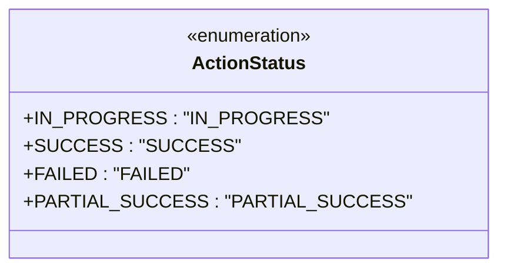

# Diagram: web/portal/src/pages/administration/internal-tools/const.js

> Auto-generated by Obscura crawlers

## Mermaid

### SVG

<svg id="container" width="383.5859375" xmlns="http://www.w3.org/2000/svg" class="classDiagram" height="232" viewBox="0 0 383.5859375 232" role="graphics-document document" aria-roledescription="class"><g><defs><marker id="container_class-aggregationStart" class="marker aggregation class" refX="18" refY="7" markerWidth="190" markerHeight="240" orient="auto"><path d="M 18,7 L9,13 L1,7 L9,1 Z"></path></marker></defs><defs><marker id="container_class-aggregationEnd" class="marker aggregation class" refX="1" refY="7" markerWidth="20" markerHeight="28" orient="auto"><path d="M 18,7 L9,13 L1,7 L9,1 Z"></path></marker></defs><defs><marker id="container_class-extensionStart" class="marker extension class" refX="18" refY="7" markerWidth="190" markerHeight="240" orient="auto"><path d="M 1,7 L18,13 V 1 Z"></path></marker></defs><defs><marker id="container_class-extensionEnd" class="marker extension class" refX="1" refY="7" markerWidth="20" markerHeight="28" orient="auto"><path d="M 1,1 V 13 L18,7 Z"></path></marker></defs><defs><marker id="container_class-compositionStart" class="marker composition class" refX="18" refY="7" markerWidth="190" markerHeight="240" orient="auto"><path d="M 18,7 L9,13 L1,7 L9,1 Z"></path></marker></defs><defs><marker id="container_class-compositionEnd" class="marker composition class" refX="1" refY="7" markerWidth="20" markerHeight="28" orient="auto"><path d="M 18,7 L9,13 L1,7 L9,1 Z"></path></marker></defs><defs><marker id="container_class-dependencyStart" class="marker dependency class" refX="6" refY="7" markerWidth="190" markerHeight="240" orient="auto"><path d="M 5,7 L9,13 L1,7 L9,1 Z"></path></marker></defs><defs><marker id="container_class-dependencyEnd" class="marker dependency class" refX="13" refY="7" markerWidth="20" markerHeight="28" orient="auto"><path d="M 18,7 L9,13 L14,7 L9,1 Z"></path></marker></defs><defs><marker id="container_class-lollipopStart" class="marker lollipop class" refX="13" refY="7" markerWidth="190" markerHeight="240" orient="auto"><circle stroke="black" fill="transparent" cx="7" cy="7" r="6"></circle></marker></defs><defs><marker id="container_class-lollipopEnd" class="marker lollipop class" refX="1" refY="7" markerWidth="190" markerHeight="240" orient="auto"><circle stroke="black" fill="transparent" cx="7" cy="7" r="6"></circle></marker></defs><g class="root"><g class="clusters"></g><g class="edgePaths"></g><g class="edgeLabels"></g><g class="nodes"><g class="node default" id="classId-ActionStatus-0" transform="translate(191.79296875, 116)"><g class="basic label-container"><path d="M-183.79296875 -108 L183.79296875 -108 L183.79296875 108 L-183.79296875 108" stroke="none" stroke-width="0" fill="#ECECFF" style=""></path><path d="M-183.79296875 -108 C-101.91677213835521 -108, -20.040575526710427 -108, 183.79296875 -108 M-183.79296875 -108 C-86.47112192869248 -108, 10.850724892615034 -108, 183.79296875 -108 M183.79296875 -108 C183.79296875 -33.394671648070485, 183.79296875 41.21065670385903, 183.79296875 108 M183.79296875 -108 C183.79296875 -40.213615724977885, 183.79296875 27.57276855004423, 183.79296875 108 M183.79296875 108 C47.08745445819645 108, -89.6180598336071 108, -183.79296875 108 M183.79296875 108 C69.86998820040294 108, -44.05299234919411 108, -183.79296875 108 M-183.79296875 108 C-183.79296875 37.82233246669185, -183.79296875 -32.355335066616306, -183.79296875 -108 M-183.79296875 108 C-183.79296875 35.36106837053023, -183.79296875 -37.27786325893953, -183.79296875 -108" stroke="#9370DB" stroke-width="1.3" fill="none" stroke-dasharray="0 0" style=""></path></g><g class="annotation-group text" transform="translate(-55.5546875, -84)"><g class="label" style="" transform="translate(0,-12)"><foreignObject width="111.109375" height="24">

«enumeration»

</foreignObject></g></g><g class="label-group text" transform="translate(-46.671875, -60)"><g class="label" style="font-weight: bolder" transform="translate(0,-12)"><foreignObject width="93.34375" height="24">

ActionStatus

</foreignObject></g></g><g class="members-group text" transform="translate(-171.79296875, -12)"><g class="label" style="" transform="translate(0,-12)"><foreignObject width="231.515625" height="24">

+IN_PROGRESS : "IN_PROGRESS"

</foreignObject></g><g class="label" style="" transform="translate(0,12)"><foreignObject width="157.40625" height="24">

+SUCCESS : "SUCCESS"

</foreignObject></g><g class="label" style="" transform="translate(0,36)"><foreignObject width="128.625" height="24">

+FAILED : "FAILED"

</foreignObject></g><g class="label" style="" transform="translate(0,60)"><foreignObject width="288.03125" height="24">

+PARTIAL_SUCCESS : "PARTIAL_SUCCESS"

</foreignObject></g></g><g class="methods-group text" transform="translate(-171.79296875, 108)"></g><g class="divider" style=""><path d="M-183.79296875 -36 C-40.84775337626618 -36, 102.09746199746763 -36, 183.79296875 -36 M-183.79296875 -36 C-97.22320127506157 -36, -10.653433800123139 -36, 183.79296875 -36" stroke="#9370DB" stroke-width="1.3" fill="none" stroke-dasharray="0 0" style=""></path></g><g class="divider" style=""><path d="M-183.79296875 84 C-38.24006568959135 84, 107.3128373708173 84, 183.79296875 84 M-183.79296875 84 C-95.76916252392077 84, -7.745356297841539 84, 183.79296875 84" stroke="#9370DB" stroke-width="1.3" fill="none" stroke-dasharray="0 0" style=""></path></g></g></g></g></g></svg>
