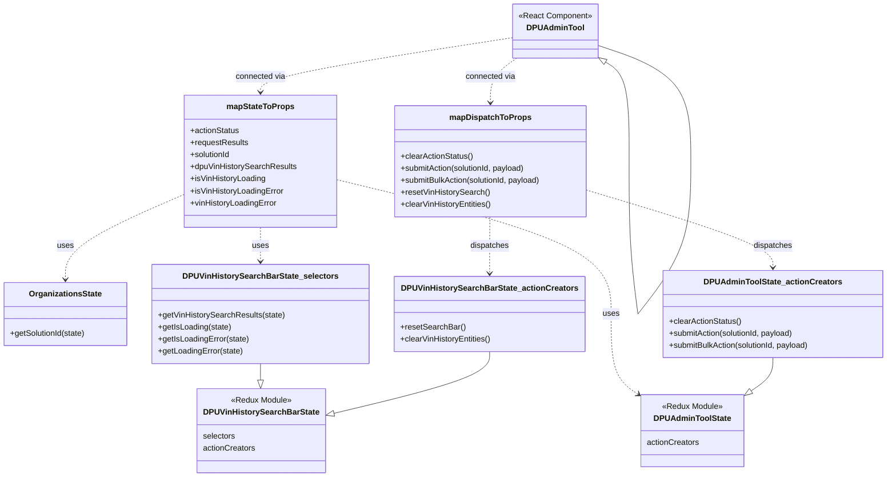

# Diagram: web/portal/src/pages/administration/internal-tools/dpu-admin-tool/DPUAdminTool.page.container.js

> Auto-generated by Obscura crawlers

## Mermaid

### SVG

<svg id="container" width="1756.6038818359375" xmlns="http://www.w3.org/2000/svg" class="classDiagram" height="952" viewBox="0 0 1756.6038818359375 952" role="graphics-document document" aria-roledescription="class"><g><defs><marker id="container_class-aggregationStart" class="marker aggregation class" refX="18" refY="7" markerWidth="190" markerHeight="240" orient="auto"><path d="M 18,7 L9,13 L1,7 L9,1 Z"></path></marker></defs><defs><marker id="container_class-aggregationEnd" class="marker aggregation class" refX="1" refY="7" markerWidth="20" markerHeight="28" orient="auto"><path d="M 18,7 L9,13 L1,7 L9,1 Z"></path></marker></defs><defs><marker id="container_class-extensionStart" class="marker extension class" refX="18" refY="7" markerWidth="190" markerHeight="240" orient="auto"><path d="M 1,7 L18,13 V 1 Z"></path></marker></defs><defs><marker id="container_class-extensionEnd" class="marker extension class" refX="1" refY="7" markerWidth="20" markerHeight="28" orient="auto"><path d="M 1,1 V 13 L18,7 Z"></path></marker></defs><defs><marker id="container_class-compositionStart" class="marker composition class" refX="18" refY="7" markerWidth="190" markerHeight="240" orient="auto"><path d="M 18,7 L9,13 L1,7 L9,1 Z"></path></marker></defs><defs><marker id="container_class-compositionEnd" class="marker composition class" refX="1" refY="7" markerWidth="20" markerHeight="28" orient="auto"><path d="M 18,7 L9,13 L1,7 L9,1 Z"></path></marker></defs><defs><marker id="container_class-dependencyStart" class="marker dependency class" refX="6" refY="7" markerWidth="190" markerHeight="240" orient="auto"><path d="M 5,7 L9,13 L1,7 L9,1 Z"></path></marker></defs><defs><marker id="container_class-dependencyEnd" class="marker dependency class" refX="13" refY="7" markerWidth="20" markerHeight="28" orient="auto"><path d="M 18,7 L9,13 L14,7 L9,1 Z"></path></marker></defs><defs><marker id="container_class-lollipopStart" class="marker lollipop class" refX="13" refY="7" markerWidth="190" markerHeight="240" orient="auto"><circle stroke="black" fill="transparent" cx="7" cy="7" r="6"></circle></marker></defs><defs><marker id="container_class-lollipopEnd" class="marker lollipop class" refX="1" refY="7" markerWidth="190" markerHeight="240" orient="auto"><circle stroke="black" fill="transparent" cx="7" cy="7" r="6"></circle></marker></defs><g class="root"><g class="clusters"></g><g class="edgePaths"><path d="M1194.762,124.612L1202.305,129.344C1209.848,134.075,1224.935,143.537,1232.478,176.427C1240.021,209.317,1240.021,265.633,1240.021,293.792L1240.021,321.95" id="DPUAdminTool-cyclic-special-1" class="edge-thickness-normal edge-pattern-solid relation" style=";;;" data-edge="true" data-et="edge" data-id="DPUAdminTool-cyclic-special-1" data-points="W3sieCI6MTE4MC4xNDg0Mzc1LCJ5IjoxMTUuNDQ2Mzk2NzQzMTE5Nn0seyJ4IjoxMjQwLjAyMTA5Mzc1MDM3MjUsInkiOjE1M30seyJ4IjoxMjQwLjAyMTA5Mzc1MDM3MjUsInkiOjMyMS45NDk5OTk5OTkyNTQ5NH1d" marker-start="url(#container_class-extensionStart)"></path><path d="M1240.021,322.05L1240.021,350.208C1240.021,378.367,1240.021,434.683,1242.941,485.5C1245.861,536.317,1251.7,581.633,1254.62,604.292L1257.54,626.95" id="DPUAdminTool-cyclic-special-mid" class="edge-thickness-normal edge-pattern-solid relation" style=";;;" data-edge="true" data-et="edge" data-id="DPUAdminTool-cyclic-special-mid" data-points="W3sieCI6MTI0MC4wMjEwOTM3NTAzNzI1LCJ5IjozMjIuMDUwMDAwMDAwNzQ1MDZ9LHsieCI6MTI0MC4wMjEwOTM3NTAzNzI1LCJ5Ijo0OTF9LHsieCI6MTI1Ny41Mzk2NTA3MzU5NDMsInkiOjYyNi45NDk5OTk5OTkyNTQ5fV0="></path><path d="M1257.585,626.95L1275.193,604.292C1292.801,581.633,1328.017,536.317,1345.625,485.492C1363.233,434.667,1363.233,378.333,1363.233,322C1363.233,265.667,1363.233,209.333,1332.719,170.817C1302.205,132.301,1241.177,111.601,1210.663,101.251L1180.148,90.902" id="DPUAdminTool-cyclic-special-2" class="edge-thickness-normal edge-pattern-solid relation" style=";;;" data-edge="true" data-et="edge" data-id="DPUAdminTool-cyclic-special-2" data-points="W3sieCI6MTI1Ny41ODQ5NDkzMDYyNDE1LCJ5Ijo2MjYuOTQ5OTk5OTk5MjU0OX0seyJ4IjoxMzYzLjIzMzIwMzEyNjExNzYsInkiOjQ5MX0seyJ4IjoxMzYzLjIzMzIwMzEyNjExNzYsInkiOjMyMn0seyJ4IjoxMzYzLjIzMzIwMzEyNjExNzYsInkiOjE1M30seyJ4IjoxMTgwLjE0ODQzNzUsInkiOjkwLjkwMTY3NTM2MDk5MTQ5fV0="></path><path d="M516.367,454L516.367,460.167C516.367,466.333,516.367,478.667,516.367,490C516.367,501.333,516.367,511.667,516.367,516.833L516.367,522" id="id_mapStateToProps_DPUVinHistorySearchBarState_selectors_2" class="edge-thickness-normal edge-pattern-dashed relation" style=";;;" data-edge="true" data-et="edge" data-id="id_mapStateToProps_DPUVinHistorySearchBarState_selectors_2" data-points="W3sieCI6NTE2LjM2NzE4NzUsInkiOjQ1NH0seyJ4Ijo1MTYuMzY3MTg3NSwieSI6NDkxfSx7IngiOjUxNi4zNjcxODc1LCJ5Ijo1Mjh9XQ==" marker-end="url(#container_class-dependencyEnd)"></path><path d="M666.988,359.005L756.532,381.004C846.076,403.003,1025.163,447.002,1114.706,491.667C1204.25,536.333,1204.25,581.667,1204.25,625C1204.25,668.333,1204.25,709.667,1213.674,736.643C1223.098,763.619,1241.945,776.238,1251.369,782.547L1260.793,788.857" id="id_mapStateToProps_DPUAdminToolState_3" class="edge-thickness-normal edge-pattern-dashed relation" style=";;;" data-edge="true" data-et="edge" data-id="id_mapStateToProps_DPUAdminToolState_3" data-points="W3sieCI6NjY2Ljk4ODI4MTI1LCJ5IjozNTkuMDA0Nzk4NDY0NDkxNH0seyJ4IjoxMjA0LjI1LCJ5Ijo0OTF9LHsieCI6MTIwNC4yNSwieSI6NjI3fSx7IngiOjEyMDQuMjUsInkiOjc1MX0seyJ4IjoxMjY1Ljc3ODUxNTYyNTc0NSwieSI6NzkyLjE5NDg4Nzg2NDkyNzN9XQ==" marker-end="url(#container_class-dependencyEnd)"></path><path d="M365.746,388.075L326.642,405.229C287.538,422.383,209.329,456.692,170.225,485.012C131.121,513.333,131.121,535.667,131.121,546.833L131.121,558" id="id_mapStateToProps_OrganizationsState_4" class="edge-thickness-normal edge-pattern-dashed relation" style=";;;" data-edge="true" data-et="edge" data-id="id_mapStateToProps_OrganizationsState_4" data-points="W3sieCI6MzY1Ljc0NjA5Mzc1LCJ5IjozODguMDc0NTU2NjQ1MDAxN30seyJ4IjoxMzEuMTIxMDkzNzUsInkiOjQ5MX0seyJ4IjoxMzEuMTIxMDkzNzUsInkiOjU2NH1d" marker-end="url(#container_class-dependencyEnd)"></path><path d="M1161.141,380.399L1222.301,398.833C1283.46,417.266,1405.78,454.133,1466.94,479.733C1528.1,505.333,1528.1,519.667,1528.1,526.833L1528.1,534" id="id_mapDispatchToProps_DPUAdminToolState_actionCreators_5" class="edge-thickness-normal edge-pattern-dashed relation" style=";;;" data-edge="true" data-et="edge" data-id="id_mapDispatchToProps_DPUAdminToolState_actionCreators_5" data-points="W3sieCI6MTE2MS4xNDA2MjUsInkiOjM4MC4zOTkzMTk3OTMxMzU1M30seyJ4IjoxNTI4LjEwMDAwMDAwMTQ5MDEsInkiOjQ5MX0seyJ4IjoxNTI4LjEwMDAwMDAwMTQ5MDEsInkiOjU0MH1d" marker-end="url(#container_class-dependencyEnd)"></path><path d="M966.227,433L966.127,442.667C966.026,452.333,965.826,471.667,965.725,490.5C965.625,509.333,965.625,527.667,965.625,536.833L965.625,546" id="id_mapDispatchToProps_DPUVinHistorySearchBarState_actionCreators_6" class="edge-thickness-normal edge-pattern-dashed relation" style=";;;" data-edge="true" data-et="edge" data-id="id_mapDispatchToProps_DPUVinHistorySearchBarState_actionCreators_6" data-points="W3sieCI6OTY2LjIyNjkzMjMyMjQ4NTMsInkiOjQzM30seyJ4Ijo5NjUuNjI1LCJ5Ijo0OTF9LHsieCI6OTY1LjYyNSwieSI6NTUyfV0=" marker-end="url(#container_class-dependencyEnd)"></path><path d="M1009.727,75.402L927.5,88.335C845.273,101.268,680.82,127.134,598.594,145.234C516.367,163.333,516.367,173.667,516.367,178.833L516.367,184" id="id_DPUAdminTool_mapStateToProps_7" class="edge-thickness-normal edge-pattern-dashed relation" style=";;;" data-edge="true" data-et="edge" data-id="id_DPUAdminTool_mapStateToProps_7" data-points="W3sieCI6MTAwOS43MjY1NjI1LCJ5Ijo3NS40MDIzMzg3MzkwNzkzNX0seyJ4Ijo1MTYuMzY3MTg3NSwieSI6MTUzfSx7IngiOjUxNi4zNjcxODc1LCJ5IjoxOTB9XQ==" marker-end="url(#container_class-dependencyEnd)"></path><path d="M1019.243,116L1010.599,122.167C1001.955,128.333,984.667,140.667,976.023,155.5C967.379,170.333,967.379,187.667,967.379,196.333L967.379,205" id="id_DPUAdminTool_mapDispatchToProps_8" class="edge-thickness-normal edge-pattern-dashed relation" style=";;;" data-edge="true" data-et="edge" data-id="id_DPUAdminTool_mapDispatchToProps_8" data-points="W3sieCI6MTAxOS4yNDMzODk0MjMwNzY5LCJ5IjoxMTZ9LHsieCI6OTY3LjM3ODkwNjI1LCJ5IjoxNTN9LHsieCI6OTY3LjM3ODkwNjI1LCJ5IjoyMTF9XQ==" marker-end="url(#container_class-dependencyEnd)"></path><path d="M1528.1,714L1528.1,720.167C1528.1,726.333,1528.1,738.667,1520.518,749.965C1512.937,761.263,1497.774,771.525,1490.192,776.656L1482.611,781.788" id="id_DPUAdminToolState_actionCreators_DPUAdminToolState_9" class="edge-thickness-normal edge-pattern-solid relation" style=";;;" data-edge="true" data-et="edge" data-id="id_DPUAdminToolState_actionCreators_DPUAdminToolState_9" data-points="W3sieCI6MTUyOC4xMDAwMDAwMDE0OTAxLCJ5Ijo3MTR9LHsieCI6MTUyOC4xMDAwMDAwMDE0OTAxLCJ5Ijo3NTF9LHsieCI6MTQ2OC4zMjUzOTA2MjU3NDUsInkiOjc5MS40NTY0NTEwMzAzMTM1fV0=" marker-end="url(#container_class-extensionEnd)"></path><path d="M516.367,726L516.367,730.167C516.367,734.333,516.367,742.667,516.388,748.125C516.409,753.584,516.45,756.168,516.471,757.46L516.492,758.752" id="id_DPUVinHistorySearchBarState_selectors_DPUVinHistorySearchBarState_10" class="edge-thickness-normal edge-pattern-solid relation" style=";;;" data-edge="true" data-et="edge" data-id="id_DPUVinHistorySearchBarState_selectors_DPUVinHistorySearchBarState_10" data-points="W3sieCI6NTE2LjM2NzE4NzUsInkiOjcyNn0seyJ4Ijo1MTYuMzY3MTg3NSwieSI6NzUxfSx7IngiOjUxNi43Njk0NTk1NzU2ODgxLCJ5Ijo3NzZ9XQ==" marker-end="url(#container_class-extensionEnd)"></path><path d="M965.625,702L965.625,710.167C965.625,718.333,965.625,734.667,914.104,755.383C862.583,776.098,759.541,801.197,708.019,813.746L656.498,826.295" id="id_DPUVinHistorySearchBarState_actionCreators_DPUVinHistorySearchBarState_11" class="edge-thickness-normal edge-pattern-solid relation" style=";;;" data-edge="true" data-et="edge" data-id="id_DPUVinHistorySearchBarState_actionCreators_DPUVinHistorySearchBarState_11" data-points="W3sieCI6OTY1LjYyNSwieSI6NzAyfSx7IngiOjk2NS42MjUsInkiOjc1MX0seyJ4Ijo2MzkuNzM4MjgxMjUsInkiOjgzMC4zNzczMDExNzU3OTI4fV0=" marker-end="url(#container_class-extensionEnd)"></path></g><g class="edgeLabels"><g class="edgeLabel"><g class="label" data-id="DPUAdminTool-cyclic-special-1" transform="translate(0, 0)"><foreignObject width="0" height="0">

</foreignObject></g></g><g class="edgeLabel"><g class="label" data-id="DPUAdminTool-cyclic-special-mid" transform="translate(0, 0)"><foreignObject width="0" height="0">

</foreignObject></g></g><g class="edgeLabel"><g class="label" data-id="DPUAdminTool-cyclic-special-2" transform="translate(0, 0)"><foreignObject width="0" height="0">

</foreignObject></g></g><g class="edgeLabel" transform="translate(516.3671875, 491)"><g class="label" data-id="id_mapStateToProps_DPUVinHistorySearchBarState_selectors_2" transform="translate(-16.4921875, -12)"><foreignObject width="32.984375" height="24">

uses

</foreignObject></g></g><g class="edgeLabel" transform="translate(1204.25, 627)"><g class="label" data-id="id_mapStateToProps_DPUAdminToolState_3" transform="translate(-16.4921875, -12)"><foreignObject width="32.984375" height="24">

uses

</foreignObject></g></g><g class="edgeLabel" transform="translate(131.12109375, 491)"><g class="label" data-id="id_mapStateToProps_OrganizationsState_4" transform="translate(-16.4921875, -12)"><foreignObject width="32.984375" height="24">

uses

</foreignObject></g></g><g class="edgeLabel" transform="translate(1528.1000000014901, 491)"><g class="label" data-id="id_mapDispatchToProps_DPUAdminToolState_actionCreators_5" transform="translate(-39.1796875, -12)"><foreignObject width="78.359375" height="24">

dispatches

</foreignObject></g></g><g class="edgeLabel" transform="translate(965.625, 491)"><g class="label" data-id="id_mapDispatchToProps_DPUVinHistorySearchBarState_actionCreators_6" transform="translate(-39.1796875, -12)"><foreignObject width="78.359375" height="24">

dispatches

</foreignObject></g></g><g class="edgeLabel" transform="translate(516.3671875, 153)"><g class="label" data-id="id_DPUAdminTool_mapStateToProps_7" transform="translate(-50.4765625, -12)"><foreignObject width="100.953125" height="24">

connected via

</foreignObject></g></g><g class="edgeLabel" transform="translate(967.37890625, 153)"><g class="label" data-id="id_DPUAdminTool_mapDispatchToProps_8" transform="translate(-50.4765625, -12)"><foreignObject width="100.953125" height="24">

connected via

</foreignObject></g></g><g class="edgeLabel"><g class="label" data-id="id_DPUAdminToolState_actionCreators_DPUAdminToolState_9" transform="translate(0, 0)"><foreignObject width="0" height="0">

</foreignObject></g></g><g class="edgeLabel"><g class="label" data-id="id_DPUVinHistorySearchBarState_selectors_DPUVinHistorySearchBarState_10" transform="translate(0, 0)"><foreignObject width="0" height="0">

</foreignObject></g></g><g class="edgeLabel"><g class="label" data-id="id_DPUVinHistorySearchBarState_actionCreators_DPUVinHistorySearchBarState_11" transform="translate(0, 0)"><foreignObject width="0" height="0">

</foreignObject></g></g></g><g class="nodes"><g class="node default" id="classId-DPUAdminTool-0" transform="translate(1094.9375, 62)"><g class="basic label-container"><path d="M-85.2109375 -54 L85.2109375 -54 L85.2109375 54 L-85.2109375 54" stroke="none" stroke-width="0" fill="#ECECFF" style=""></path><path d="M-85.2109375 -54 C-41.21553165040887 -54, 2.7798741991822595 -54, 85.2109375 -54 M-85.2109375 -54 C-21.67798352252847 -54, 41.85497045494306 -54, 85.2109375 -54 M85.2109375 -54 C85.2109375 -25.836982024817715, 85.2109375 2.3260359503645702, 85.2109375 54 M85.2109375 -54 C85.2109375 -12.323159121401162, 85.2109375 29.353681757197677, 85.2109375 54 M85.2109375 54 C30.35245851501292 54, -24.50602046997416 54, -85.2109375 54 M85.2109375 54 C26.33574781647289 54, -32.53944186705422 54, -85.2109375 54 M-85.2109375 54 C-85.2109375 13.48475165149722, -85.2109375 -27.03049669700556, -85.2109375 -54 M-85.2109375 54 C-85.2109375 15.863465490454999, -85.2109375 -22.273069019090002, -85.2109375 -54" stroke="#9370DB" stroke-width="1.3" fill="none" stroke-dasharray="0 0" style=""></path></g><g class="annotation-group text" transform="translate(-73.2109375, -30)"><g class="label" style="" transform="translate(0,-12)"><foreignObject width="146.421875" height="24">

«React Component»

</foreignObject></g></g><g class="label-group text" transform="translate(-53.890625, -6)"><g class="label" style="font-weight: bolder" transform="translate(0,-12)"><foreignObject width="107.78125" height="24">

DPUAdminTool

</foreignObject></g></g><g class="members-group text" transform="translate(-73.2109375, 42)"></g><g class="methods-group text" transform="translate(-73.2109375, 72)"></g><g class="divider" style=""><path d="M-85.2109375 18 C-36.395317497833396 18, 12.420302504333208 18, 85.2109375 18 M-85.2109375 18 C-34.42293142451833 18, 16.365074650963336 18, 85.2109375 18" stroke="#9370DB" stroke-width="1.3" fill="none" stroke-dasharray="0 0" style=""></path></g><g class="divider" style=""><path d="M-85.2109375 36 C-37.39930874711631 36, 10.412320005767384 36, 85.2109375 36 M-85.2109375 36 C-44.37637174899076 36, -3.541805997981527 36, 85.2109375 36" stroke="#9370DB" stroke-width="1.3" fill="none" stroke-dasharray="0 0" style=""></path></g></g><g class="node default" id="classId-mapStateToProps-1" transform="translate(516.3671875, 322)"><g class="basic label-container"><path d="M-150.62109375 -132 L150.62109375 -132 L150.62109375 132 L-150.62109375 132" stroke="none" stroke-width="0" fill="#ECECFF" style=""></path><path d="M-150.62109375 -132 C-63.28040053726595 -132, 24.060292675468105 -132, 150.62109375 -132 M-150.62109375 -132 C-84.94630878829652 -132, -19.27152382659304 -132, 150.62109375 -132 M150.62109375 -132 C150.62109375 -65.30854955645151, 150.62109375 1.3829008870969801, 150.62109375 132 M150.62109375 -132 C150.62109375 -40.48588649698388, 150.62109375 51.02822700603224, 150.62109375 132 M150.62109375 132 C38.02515970558082 132, -74.57077433883836 132, -150.62109375 132 M150.62109375 132 C44.1771141822083 132, -62.2668653855834 132, -150.62109375 132 M-150.62109375 132 C-150.62109375 66.4836199504379, -150.62109375 0.9672399008757964, -150.62109375 -132 M-150.62109375 132 C-150.62109375 61.749895291433646, -150.62109375 -8.500209417132709, -150.62109375 -132" stroke="#9370DB" stroke-width="1.3" fill="none" stroke-dasharray="0 0" style=""></path></g><g class="annotation-group text" transform="translate(0, -108)"></g><g class="label-group text" transform="translate(-64.7109375, -108)"><g class="label" style="font-weight: bolder" transform="translate(0,-12)"><foreignObject width="129.421875" height="24">

mapStateToProps

</foreignObject></g></g><g class="members-group text" transform="translate(-138.62109375, -60)"><g class="label" style="" transform="translate(0,-12)"><foreignObject width="98.765625" height="24">

+actionStatus

</foreignObject></g><g class="label" style="" transform="translate(0,12)"><foreignObject width="116.140625" height="24">

+requestResults

</foreignObject></g><g class="label" style="" transform="translate(0,36)"><foreignObject width="82.109375" height="24">

+solutionId

</foreignObject></g><g class="label" style="" transform="translate(0,60)"><foreignObject width="212.53125" height="24">

+dpuVinHistorySearchResults

</foreignObject></g><g class="label" style="" transform="translate(0,84)"><foreignObject width="151.78125" height="24">

+isVinHistoryLoading

</foreignObject></g><g class="label" style="" transform="translate(0,108)"><foreignObject width="187.578125" height="24">

+isVinHistoryLoadingError

</foreignObject></g><g class="label" style="" transform="translate(0,132)"><foreignObject width="174.40625" height="24">

+vinHistoryLoadingError

</foreignObject></g></g><g class="methods-group text" transform="translate(-138.62109375, 132)"></g><g class="divider" style=""><path d="M-150.62109375 -84 C-45.14212903213547 -84, 60.336835685729056 -84, 150.62109375 -84 M-150.62109375 -84 C-68.18038067075896 -84, 14.260332408482071 -84, 150.62109375 -84" stroke="#9370DB" stroke-width="1.3" fill="none" stroke-dasharray="0 0" style=""></path></g><g class="divider" style=""><path d="M-150.62109375 108 C-62.75231896866883 108, 25.116455812662338 108, 150.62109375 108 M-150.62109375 108 C-80.83988525659392 108, -11.058676763187833 108, 150.62109375 108" stroke="#9370DB" stroke-width="1.3" fill="none" stroke-dasharray="0 0" style=""></path></g></g><g class="node default" id="classId-mapDispatchToProps-2" transform="translate(967.37890625, 322)"><g class="basic label-container"><path d="M-193.76171875 -111 L193.76171875 -111 L193.76171875 111 L-193.76171875 111" stroke="none" stroke-width="0" fill="#ECECFF" style=""></path><path d="M-193.76171875 -111 C-53.589612971335356 -111, 86.58249280732929 -111, 193.76171875 -111 M-193.76171875 -111 C-48.36014355357301 -111, 97.04143164285398 -111, 193.76171875 -111 M193.76171875 -111 C193.76171875 -54.16449245039266, 193.76171875 2.671015099214685, 193.76171875 111 M193.76171875 -111 C193.76171875 -66.14129075795577, 193.76171875 -21.28258151591153, 193.76171875 111 M193.76171875 111 C48.890960992146375 111, -95.97979676570725 111, -193.76171875 111 M193.76171875 111 C39.16226068175723 111, -115.43719738648554 111, -193.76171875 111 M-193.76171875 111 C-193.76171875 42.24920174150684, -193.76171875 -26.501596516986325, -193.76171875 -111 M-193.76171875 111 C-193.76171875 47.83589814810552, -193.76171875 -15.328203703788958, -193.76171875 -111" stroke="#9370DB" stroke-width="1.3" fill="none" stroke-dasharray="0 0" style=""></path></g><g class="annotation-group text" transform="translate(0, -87)"></g><g class="label-group text" transform="translate(-77.1953125, -87)"><g class="label" style="font-weight: bolder" transform="translate(0,-12)"><foreignObject width="154.390625" height="24">

mapDispatchToProps

</foreignObject></g></g><g class="members-group text" transform="translate(-181.76171875, -39)"></g><g class="methods-group text" transform="translate(-181.76171875, -9)"><g class="label" style="" transform="translate(0,-12)"><foreignObject width="145.53125" height="24">

+clearActionStatus()

</foreignObject></g><g class="label" style="" transform="translate(0,12)"><foreignObject width="254.40625" height="24">

+submitAction(solutionId, payload)

</foreignObject></g><g class="label" style="" transform="translate(0,36)"><foreignObject width="286.328125" height="24">

+submitBulkAction(solutionId, payload)

</foreignObject></g><g class="label" style="" transform="translate(0,60)"><foreignObject width="178.03125" height="24">

+resetVinHistorySearch()

</foreignObject></g><g class="label" style="" transform="translate(0,84)"><foreignObject width="183.171875" height="24">

+clearVinHistoryEntities()

</foreignObject></g></g><g class="divider" style=""><path d="M-193.76171875 -63 C-103.56382585936976 -63, -13.365932968739514 -63, 193.76171875 -63 M-193.76171875 -63 C-91.51013791256227 -63, 10.741442924875457 -63, 193.76171875 -63" stroke="#9370DB" stroke-width="1.3" fill="none" stroke-dasharray="0 0" style=""></path></g><g class="divider" style=""><path d="M-193.76171875 -39 C-102.31907879793077 -39, -10.876438845861543 -39, 193.76171875 -39 M-193.76171875 -39 C-111.62141823274453 -39, -29.481117715489063 -39, 193.76171875 -39" stroke="#9370DB" stroke-width="1.3" fill="none" stroke-dasharray="0 0" style=""></path></g></g><g class="node default" id="classId-DPUAdminToolState-3" transform="translate(1367.051953125745, 860)"><g class="basic label-container"><path d="M-101.2734375 -72 L101.2734375 -72 L101.2734375 72 L-101.2734375 72" stroke="none" stroke-width="0" fill="#ECECFF" style=""></path><path d="M-101.2734375 -72 C-37.6166314325289 -72, 26.040174634942204 -72, 101.2734375 -72 M-101.2734375 -72 C-50.89789636279664 -72, -0.5223552255932731 -72, 101.2734375 -72 M101.2734375 -72 C101.2734375 -33.47681465595886, 101.2734375 5.046370688082277, 101.2734375 72 M101.2734375 -72 C101.2734375 -30.952894048234242, 101.2734375 10.094211903531516, 101.2734375 72 M101.2734375 72 C41.06789174441552 72, -19.137654011168962 72, -101.2734375 72 M101.2734375 72 C50.52709881048174 72, -0.21923987903652176 72, -101.2734375 72 M-101.2734375 72 C-101.2734375 39.86124406964768, -101.2734375 7.722488139295365, -101.2734375 -72 M-101.2734375 72 C-101.2734375 15.639604279498158, -101.2734375 -40.72079144100368, -101.2734375 -72" stroke="#9370DB" stroke-width="1.3" fill="none" stroke-dasharray="0 0" style=""></path></g><g class="annotation-group text" transform="translate(-60.4921875, -48)"><g class="label" style="" transform="translate(0,-12)"><foreignObject width="120.984375" height="24">

«Redux Module»

</foreignObject></g></g><g class="label-group text" transform="translate(-73.203125, -24)"><g class="label" style="font-weight: bolder" transform="translate(0,-12)"><foreignObject width="146.40625" height="24">

DPUAdminToolState

</foreignObject></g></g><g class="members-group text" transform="translate(-89.2734375, 24)"><g class="label" style="" transform="translate(0,-12)"><foreignObject width="105.34375" height="24">

actionCreators

</foreignObject></g></g><g class="methods-group text" transform="translate(-89.2734375, 72)"></g><g class="divider" style=""><path d="M-101.2734375 0 C-40.134445832383534 0, 21.004545835232932 0, 101.2734375 0 M-101.2734375 0 C-37.17613548393862 0, 26.921166532122754 0, 101.2734375 0" stroke="#9370DB" stroke-width="1.3" fill="none" stroke-dasharray="0 0" style=""></path></g><g class="divider" style=""><path d="M-101.2734375 48 C-31.716527583733154 48, 37.84038233253369 48, 101.2734375 48 M-101.2734375 48 C-56.81173677404367 48, -12.350036048087347 48, 101.2734375 48" stroke="#9370DB" stroke-width="1.3" fill="none" stroke-dasharray="0 0" style=""></path></g></g><g class="node default" id="classId-DPUVinHistorySearchBarState-4" transform="translate(518.12109375, 860)"><g class="basic label-container"><path d="M-121.6171875 -84 L121.6171875 -84 L121.6171875 84 L-121.6171875 84" stroke="none" stroke-width="0" fill="#ECECFF" style=""></path><path d="M-121.6171875 -84 C-39.91751374564244 -84, 41.782160008715124 -84, 121.6171875 -84 M-121.6171875 -84 C-59.13510447656978 -84, 3.3469785468604414 -84, 121.6171875 -84 M121.6171875 -84 C121.6171875 -36.033573039436945, 121.6171875 11.93285392112611, 121.6171875 84 M121.6171875 -84 C121.6171875 -26.55952717746515, 121.6171875 30.8809456450697, 121.6171875 84 M121.6171875 84 C62.766213280108204 84, 3.9152390602164076 84, -121.6171875 84 M121.6171875 84 C66.94713568916501 84, 12.277083878330032 84, -121.6171875 84 M-121.6171875 84 C-121.6171875 19.84377804884585, -121.6171875 -44.3124439023083, -121.6171875 -84 M-121.6171875 84 C-121.6171875 45.96769940073937, -121.6171875 7.93539880147874, -121.6171875 -84" stroke="#9370DB" stroke-width="1.3" fill="none" stroke-dasharray="0 0" style=""></path></g><g class="annotation-group text" transform="translate(-60.4921875, -60)"><g class="label" style="" transform="translate(0,-12)"><foreignObject width="120.984375" height="24">

«Redux Module»

</foreignObject></g></g><g class="label-group text" transform="translate(-109.6171875, -36)"><g class="label" style="font-weight: bolder" transform="translate(0,-12)"><foreignObject width="219.234375" height="24">

DPUVinHistorySearchBarState

</foreignObject></g></g><g class="members-group text" transform="translate(-109.6171875, 12)"><g class="label" style="" transform="translate(0,-12)"><foreignObject width="65.46875" height="24">

selectors

</foreignObject></g><g class="label" style="" transform="translate(0,12)"><foreignObject width="105.34375" height="24">

actionCreators

</foreignObject></g></g><g class="methods-group text" transform="translate(-109.6171875, 84)"></g><g class="divider" style=""><path d="M-121.6171875 -12 C-68.94369369666883 -12, -16.27019989333766 -12, 121.6171875 -12 M-121.6171875 -12 C-71.81441437078846 -12, -22.01164124157691 -12, 121.6171875 -12" stroke="#9370DB" stroke-width="1.3" fill="none" stroke-dasharray="0 0" style=""></path></g><g class="divider" style=""><path d="M-121.6171875 60 C-45.910511928209374 60, 29.796163643581252 60, 121.6171875 60 M-121.6171875 60 C-29.116690360617397 60, 63.383806778765205 60, 121.6171875 60" stroke="#9370DB" stroke-width="1.3" fill="none" stroke-dasharray="0 0" style=""></path></g></g><g class="node default" id="classId-OrganizationsState-5" transform="translate(131.12109375, 627)"><g class="basic label-container"><path d="M-123.12109375 -63 L123.12109375 -63 L123.12109375 63 L-123.12109375 63" stroke="none" stroke-width="0" fill="#ECECFF" style=""></path><path d="M-123.12109375 -63 C-30.984050472488107 -63, 61.152992805023786 -63, 123.12109375 -63 M-123.12109375 -63 C-59.91181609774871 -63, 3.2974615545025756 -63, 123.12109375 -63 M123.12109375 -63 C123.12109375 -28.9059702788294, 123.12109375 5.188059442341199, 123.12109375 63 M123.12109375 -63 C123.12109375 -20.627576199336517, 123.12109375 21.744847601326967, 123.12109375 63 M123.12109375 63 C73.75714756524175 63, 24.39320138048349 63, -123.12109375 63 M123.12109375 63 C73.34516940946915 63, 23.569245068938315 63, -123.12109375 63 M-123.12109375 63 C-123.12109375 36.063795401258986, -123.12109375 9.127590802517979, -123.12109375 -63 M-123.12109375 63 C-123.12109375 28.262476205781972, -123.12109375 -6.475047588436055, -123.12109375 -63" stroke="#9370DB" stroke-width="1.3" fill="none" stroke-dasharray="0 0" style=""></path></g><g class="annotation-group text" transform="translate(0, -39)"></g><g class="label-group text" transform="translate(-69.8671875, -39)"><g class="label" style="font-weight: bolder" transform="translate(0,-12)"><foreignObject width="139.734375" height="24">

OrganizationsState

</foreignObject></g></g><g class="members-group text" transform="translate(-111.12109375, 9)"></g><g class="methods-group text" transform="translate(-111.12109375, 39)"><g class="label" style="" transform="translate(0,-12)"><foreignObject width="152.375" height="24">

+getSolutionId(state)

</foreignObject></g></g><g class="divider" style=""><path d="M-123.12109375 -15 C-58.23128332293989 -15, 6.658527104120225 -15, 123.12109375 -15 M-123.12109375 -15 C-72.88815117965308 -15, -22.65520860930617 -15, 123.12109375 -15" stroke="#9370DB" stroke-width="1.3" fill="none" stroke-dasharray="0 0" style=""></path></g><g class="divider" style=""><path d="M-123.12109375 9 C-42.11787823652979 9, 38.88533727694042 9, 123.12109375 9 M-123.12109375 9 C-27.06168418545583 9, 68.99772537908834 9, 123.12109375 9" stroke="#9370DB" stroke-width="1.3" fill="none" stroke-dasharray="0 0" style=""></path></g></g><g class="node default" id="classId-DPUAdminToolState_actionCreators-6" transform="translate(1528.1000000014901, 627)"><g class="basic label-container"><path d="M-220.50390625 -87 L220.50390625 -87 L220.50390625 87 L-220.50390625 87" stroke="none" stroke-width="0" fill="#ECECFF" style=""></path><path d="M-220.50390625 -87 C-81.41849796240524 -87, 57.66691032518952 -87, 220.50390625 -87 M-220.50390625 -87 C-131.22363545646382 -87, -41.94336466292765 -87, 220.50390625 -87 M220.50390625 -87 C220.50390625 -19.69218838636928, 220.50390625 47.61562322726144, 220.50390625 87 M220.50390625 -87 C220.50390625 -38.47396695356639, 220.50390625 10.052066092867221, 220.50390625 87 M220.50390625 87 C105.44914330606696 87, -9.605619637866084 87, -220.50390625 87 M220.50390625 87 C58.589865808652604 87, -103.32417463269479 87, -220.50390625 87 M-220.50390625 87 C-220.50390625 41.70817680208698, -220.50390625 -3.5836463958260367, -220.50390625 -87 M-220.50390625 87 C-220.50390625 17.52045901036692, -220.50390625 -51.95908197926616, -220.50390625 -87" stroke="#9370DB" stroke-width="1.3" fill="none" stroke-dasharray="0 0" style=""></path></g><g class="annotation-group text" transform="translate(0, -63)"></g><g class="label-group text" transform="translate(-130.6796875, -63)"><g class="label" style="font-weight: bolder" transform="translate(0,-12)"><foreignObject width="261.359375" height="24">

DPUAdminToolState_actionCreators

</foreignObject></g></g><g class="members-group text" transform="translate(-208.50390625, -15)"></g><g class="methods-group text" transform="translate(-208.50390625, 15)"><g class="label" style="" transform="translate(0,-12)"><foreignObject width="145.53125" height="24">

+clearActionStatus()

</foreignObject></g><g class="label" style="" transform="translate(0,12)"><foreignObject width="254.40625" height="24">

+submitAction(solutionId, payload)

</foreignObject></g><g class="label" style="" transform="translate(0,36)"><foreignObject width="286.328125" height="24">

+submitBulkAction(solutionId, payload)

</foreignObject></g></g><g class="divider" style=""><path d="M-220.50390625 -39 C-96.56017620241579 -39, 27.38355384516842 -39, 220.50390625 -39 M-220.50390625 -39 C-47.07705560799738 -39, 126.34979503400524 -39, 220.50390625 -39" stroke="#9370DB" stroke-width="1.3" fill="none" stroke-dasharray="0 0" style=""></path></g><g class="divider" style=""><path d="M-220.50390625 -15 C-106.99670493031368 -15, 6.5104963893726335 -15, 220.50390625 -15 M-220.50390625 -15 C-62.874821416428205 -15, 94.75426341714359 -15, 220.50390625 -15" stroke="#9370DB" stroke-width="1.3" fill="none" stroke-dasharray="0 0" style=""></path></g></g><g class="node default" id="classId-DPUVinHistorySearchBarState_selectors-7" transform="translate(516.3671875, 627)"><g class="basic label-container"><path d="M-212.125 -99 L212.125 -99 L212.125 99 L-212.125 99" stroke="none" stroke-width="0" fill="#ECECFF" style=""></path><path d="M-212.125 -99 C-45.35278673656941 -99, 121.41942652686117 -99, 212.125 -99 M-212.125 -99 C-73.1871920734628 -99, 65.75061585307441 -99, 212.125 -99 M212.125 -99 C212.125 -54.05522677995266, 212.125 -9.110453559905324, 212.125 99 M212.125 -99 C212.125 -33.220043702060096, 212.125 32.55991259587981, 212.125 99 M212.125 99 C62.468170923288795 99, -87.18865815342241 99, -212.125 99 M212.125 99 C82.97991895932634 99, -46.16516208134732 99, -212.125 99 M-212.125 99 C-212.125 42.55223285586875, -212.125 -13.895534288262496, -212.125 -99 M-212.125 99 C-212.125 33.79827822975358, -212.125 -31.403443540492844, -212.125 -99" stroke="#9370DB" stroke-width="1.3" fill="none" stroke-dasharray="0 0" style=""></path></g><g class="annotation-group text" transform="translate(0, -75)"></g><g class="label-group text" transform="translate(-147.078125, -75)"><g class="label" style="font-weight: bolder" transform="translate(0,-12)"><foreignObject width="294.15625" height="24">

DPUVinHistorySearchBarState_selectors

</foreignObject></g></g><g class="members-group text" transform="translate(-200.125, -27)"></g><g class="methods-group text" transform="translate(-200.125, 3)"><g class="label" style="" transform="translate(0,-12)"><foreignObject width="253.171875" height="24">

+getVinHistorySearchResults(state)

</foreignObject></g><g class="label" style="" transform="translate(0,12)"><foreignObject width="146.4375" height="24">

+getIsLoading(state)

</foreignObject></g><g class="label" style="" transform="translate(0,36)"><foreignObject width="182.234375" height="24">

+getIsLoadingError(state)

</foreignObject></g><g class="label" style="" transform="translate(0,60)"><foreignObject width="170.046875" height="24">

+getLoadingError(state)

</foreignObject></g></g><g class="divider" style=""><path d="M-212.125 -51 C-75.2182435666954 -51, 61.68851286660919 -51, 212.125 -51 M-212.125 -51 C-122.62877068595057 -51, -33.13254137190114 -51, 212.125 -51" stroke="#9370DB" stroke-width="1.3" fill="none" stroke-dasharray="0 0" style=""></path></g><g class="divider" style=""><path d="M-212.125 -27 C-51.17781130504923 -27, 109.76937738990154 -27, 212.125 -27 M-212.125 -27 C-61.206324727929456 -27, 89.71235054414109 -27, 212.125 -27" stroke="#9370DB" stroke-width="1.3" fill="none" stroke-dasharray="0 0" style=""></path></g></g><g class="node default" id="classId-DPUVinHistorySearchBarState_actionCreators-8" transform="translate(965.625, 627)"><g class="basic label-container"><path d="M-187.1328125 -75 L187.1328125 -75 L187.1328125 75 L-187.1328125 75" stroke="none" stroke-width="0" fill="#ECECFF" style=""></path><path d="M-187.1328125 -75 C-63.728424646588195 -75, 59.67596320682361 -75, 187.1328125 -75 M-187.1328125 -75 C-92.29734378440945 -75, 2.538124931181102 -75, 187.1328125 -75 M187.1328125 -75 C187.1328125 -33.02333208181694, 187.1328125 8.953335836366122, 187.1328125 75 M187.1328125 -75 C187.1328125 -41.52193870746995, 187.1328125 -8.0438774149399, 187.1328125 75 M187.1328125 75 C50.69743894415106 75, -85.73793461169788 75, -187.1328125 75 M187.1328125 75 C70.13396780681778 75, -46.86487688636444 75, -187.1328125 75 M-187.1328125 75 C-187.1328125 32.79656012795304, -187.1328125 -9.406879744093914, -187.1328125 -75 M-187.1328125 75 C-187.1328125 25.600902387400097, -187.1328125 -23.798195225199805, -187.1328125 -75" stroke="#9370DB" stroke-width="1.3" fill="none" stroke-dasharray="0 0" style=""></path></g><g class="annotation-group text" transform="translate(0, -51)"></g><g class="label-group text" transform="translate(-167.09375, -51)"><g class="label" style="font-weight: bolder" transform="translate(0,-12)"><foreignObject width="334.1875" height="24">

DPUVinHistorySearchBarState_actionCreators

</foreignObject></g></g><g class="members-group text" transform="translate(-175.1328125, -3)"></g><g class="methods-group text" transform="translate(-175.1328125, 27)"><g class="label" style="" transform="translate(0,-12)"><foreignObject width="128.0625" height="24">

+resetSearchBar()

</foreignObject></g><g class="label" style="" transform="translate(0,12)"><foreignObject width="183.171875" height="24">

+clearVinHistoryEntities()

</foreignObject></g></g><g class="divider" style=""><path d="M-187.1328125 -27 C-67.13568172594212 -27, 52.86144904811576 -27, 187.1328125 -27 M-187.1328125 -27 C-39.10087425396219 -27, 108.93106399207562 -27, 187.1328125 -27" stroke="#9370DB" stroke-width="1.3" fill="none" stroke-dasharray="0 0" style=""></path></g><g class="divider" style=""><path d="M-187.1328125 -3 C-74.79433806699757 -3, 37.544136366004864 -3, 187.1328125 -3 M-187.1328125 -3 C-45.408837876208764 -3, 96.31513674758247 -3, 187.1328125 -3" stroke="#9370DB" stroke-width="1.3" fill="none" stroke-dasharray="0 0" style=""></path></g></g><g class="label edgeLabel" id="DPUAdminTool---DPUAdminTool---1" transform="translate(1240.0210937503725, 322)"><rect width="0.1" height="0.1"></rect><g class="label" style="" transform="translate(0, 0)"><rect></rect><foreignObject width="0" height="0">

</foreignObject></g></g><g class="label edgeLabel" id="DPUAdminTool---DPUAdminTool---2" transform="translate(1257.546093750745, 627)"><rect width="0.1" height="0.1"></rect><g class="label" style="" transform="translate(0, 0)"><rect></rect><foreignObject width="0" height="0">

</foreignObject></g></g></g></g></g></svg>
