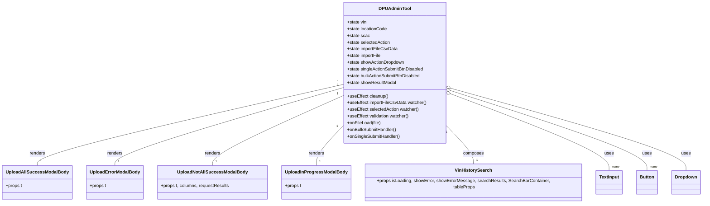

# Diagram: web/portal/src/pages/administration/internal-tools/dpu-admin-tool/DPUAdminTool.page.js


> Auto-generated by Obscura crawlers

## Diagram 1

```mermaid
flowchart LR
  A[DPUAdminTool Component] -->|uses state| State((state: vin,locationCode,scac,selectedAction,importFileCsvData,showActionDropdown,buttonsDisabled,showResultModal))
  A -->|effects| E1[useEffect: cleanup -> resetVinHistorySearch & clearVinHistoryEntities]
  A -->|effects| E2[useEffect: importFileCsvData -> setBulkActionSubmitBtnDisabled]
  A -->|effects| E3[useEffect: selectedAction -> reset scac & locationCode]
  A -->|effects| E4[useEffect: vin/location/scac/selectedAction -> compute singleActionSubmitBtnDisabled]
  A -->|handlers| H1[onFileLoad(file) -> setImportFileCsvData]
  A -->|handlers| H2[onBulkSubmitHandler -> submitBulkAction(solutionId, {csvData}) -> setshowResultModal(true)]
  A -->|handlers| H3[onSingleSubmitHandler -> submitAction(solutionId, {action, externalId, locationCode, scac}) -> setshowResultModal(true)]
  A -->|renders| C1[DownloadCsvLink (csvTemplate)]
  A -->|renders| C2[File Input -> onFileLoad]
  A -->|renders| C3[Dropdown -> adminActionOptions -> setSelectedAction]
  A -->|renders| C4[TextInput VIN -> setVin]
  A -->|renders| C5[TextInput LocationCode -> setLocationCode]
  A -->|renders| C6[TextInput SCAC -> setScac]
  A -->|renders| C7[Button Upload -> disabled based on importFileCsvData -> onBulkSubmitHandler]
  A -->|renders| C8[Button Submit -> disabled based on validation -> onSingleSubmitHandler]
  A -->|renders| C9[VinHistorySearch -> uses vinHistoryColumns & dpuVinHistorySearchResults]
  A -->|renders| Modal[DialogModal show=showResultModal]
  Modal -->|shows body based on actionStatus| M1[UploadInProgressModalBody]
  Modal --> M2[UploadAllSuccessModalBody]
  Modal --> M3[UploadNotAllSuccessModalBody -> BaseTable(columns, requestResults)]
  Modal --> M4[UploadErrorModalBody]
  subgraph Validation
    VIN_VALID{vinRegex.test(vin) && selectedAction != null}
    ACTION_OVR{selectedAction.code === "OVERRIDE_VIN"}
    LOC_FILLED{!isEmpty(locationCode.trim()) && !isEmpty(scac.trim())}
    VIN_VALID -->|true & not override| ENABLE_SUBMIT[enable submit]
    VIN_VALID -->|true & override| ACTION_OVR
    ACTION_OVR -->|true & LOC_FILLED| ENABLE_SUBMIT
    ACTION_OVR -->|true & !LOC_FILLED| DISABLE_SUBMIT[disable submit]
    VIN_VALID -->|false| DISABLE_SUBMIT
  end
```

> SVG rendering failed for this diagram.

## Diagram 2



### SVG

<svg id="container" width="2462.0234375" xmlns="http://www.w3.org/2000/svg" class="classDiagram" height="714" viewBox="0 0 2462.0234375 714" role="graphics-document document" aria-roledescription="class"><style>#container{font-family:"trebuchet ms",verdana,arial,sans-serif;font-size:16px;fill:#333;}@keyframes edge-animation-frame{from{stroke-dashoffset:0;}}@keyframes dash{to{stroke-dashoffset:0;}}#container .edge-animation-slow{stroke-dasharray:9,5!important;stroke-dashoffset:900;animation:dash 50s linear infinite;stroke-linecap:round;}#container .edge-animation-fast{stroke-dasharray:9,5!important;stroke-dashoffset:900;animation:dash 20s linear infinite;stroke-linecap:round;}#container .error-icon{fill:#552222;}#container .error-text{fill:#552222;stroke:#552222;}#container .edge-thickness-normal{stroke-width:1px;}#container .edge-thickness-thick{stroke-width:3.5px;}#container .edge-pattern-solid{stroke-dasharray:0;}#container .edge-thickness-invisible{stroke-width:0;fill:none;}#container .edge-pattern-dashed{stroke-dasharray:3;}#container .edge-pattern-dotted{stroke-dasharray:2;}#container .marker{fill:#333333;stroke:#333333;}#container .marker.cross{stroke:#333333;}#container svg{font-family:"trebuchet ms",verdana,arial,sans-serif;font-size:16px;}#container p{margin:0;}#container g.classGroup text{fill:#9370DB;stroke:none;font-family:"trebuchet ms",verdana,arial,sans-serif;font-size:10px;}#container g.classGroup text .title{font-weight:bolder;}#container .nodeLabel,#container .edgeLabel{color:#131300;}#container .edgeLabel .label rect{fill:#ECECFF;}#container .label text{fill:#131300;}#container .labelBkg{background:#ECECFF;}#container .edgeLabel .label span{background:#ECECFF;}#container .classTitle{font-weight:bolder;}#container .node rect,#container .node circle,#container .node ellipse,#container .node polygon,#container .node path{fill:#ECECFF;stroke:#9370DB;stroke-width:1px;}#container .divider{stroke:#9370DB;stroke-width:1;}#container g.clickable{cursor:pointer;}#container g.classGroup rect{fill:#ECECFF;stroke:#9370DB;}#container g.classGroup line{stroke:#9370DB;stroke-width:1;}#container .classLabel .box{stroke:none;stroke-width:0;fill:#ECECFF;opacity:0.5;}#container .classLabel .label{fill:#9370DB;font-size:10px;}#container .relation{stroke:#333333;stroke-width:1;fill:none;}#container .dashed-line{stroke-dasharray:3;}#container .dotted-line{stroke-dasharray:1 2;}#container #compositionStart,#container .composition{fill:#333333!important;stroke:#333333!important;stroke-width:1;}#container #compositionEnd,#container .composition{fill:#333333!important;stroke:#333333!important;stroke-width:1;}#container #dependencyStart,#container .dependency{fill:#333333!important;stroke:#333333!important;stroke-width:1;}#container #dependencyStart,#container .dependency{fill:#333333!important;stroke:#333333!important;stroke-width:1;}#container #extensionStart,#container .extension{fill:transparent!important;stroke:#333333!important;stroke-width:1;}#container #extensionEnd,#container .extension{fill:transparent!important;stroke:#333333!important;stroke-width:1;}#container #aggregationStart,#container .aggregation{fill:transparent!important;stroke:#333333!important;stroke-width:1;}#container #aggregationEnd,#container .aggregation{fill:transparent!important;stroke:#333333!important;stroke-width:1;}#container #lollipopStart,#container .lollipop{fill:#ECECFF!important;stroke:#333333!important;stroke-width:1;}#container #lollipopEnd,#container .lollipop{fill:#ECECFF!important;stroke:#333333!important;stroke-width:1;}#container .edgeTerminals{font-size:11px;line-height:initial;}#container .classTitleText{text-anchor:middle;font-size:18px;fill:#333;}#container .label-icon{display:inline-block;height:1em;overflow:visible;vertical-align:-0.125em;}#container .node .label-icon path{fill:currentColor;stroke:revert;stroke-width:revert;}#container :root{--mermaid-font-family:"trebuchet ms",verdana,arial,sans-serif;}</style><g><defs><marker id="container_class-aggregationStart" class="marker aggregation class" refX="18" refY="7" markerWidth="190" markerHeight="240" orient="auto"><path d="M 18,7 L9,13 L1,7 L9,1 Z"></path></marker></defs><defs><marker id="container_class-aggregationEnd" class="marker aggregation class" refX="1" refY="7" markerWidth="20" markerHeight="28" orient="auto"><path d="M 18,7 L9,13 L1,7 L9,1 Z"></path></marker></defs><defs><marker id="container_class-extensionStart" class="marker extension class" refX="18" refY="7" markerWidth="190" markerHeight="240" orient="auto"><path d="M 1,7 L18,13 V 1 Z"></path></marker></defs><defs><marker id="container_class-extensionEnd" class="marker extension class" refX="1" refY="7" markerWidth="20" markerHeight="28" orient="auto"><path d="M 1,1 V 13 L18,7 Z"></path></marker></defs><defs><marker id="container_class-compositionStart" class="marker composition class" refX="18" refY="7" markerWidth="190" markerHeight="240" orient="auto"><path d="M 18,7 L9,13 L1,7 L9,1 Z"></path></marker></defs><defs><marker id="container_class-compositionEnd" class="marker composition class" refX="1" refY="7" markerWidth="20" markerHeight="28" orient="auto"><path d="M 18,7 L9,13 L1,7 L9,1 Z"></path></marker></defs><defs><marker id="container_class-dependencyStart" class="marker dependency class" refX="6" refY="7" markerWidth="190" markerHeight="240" orient="auto"><path d="M 5,7 L9,13 L1,7 L9,1 Z"></path></marker></defs><defs><marker id="container_class-dependencyEnd" class="marker dependency class" refX="13" refY="7" markerWidth="20" markerHeight="28" orient="auto"><path d="M 18,7 L9,13 L14,7 L9,1 Z"></path></marker></defs><defs><marker id="container_class-lollipopStart" class="marker lollipop class" refX="13" refY="7" markerWidth="190" markerHeight="240" orient="auto"><circle stroke="black" fill="transparent" cx="7" cy="7" r="6"></circle></marker></defs><defs><marker id="container_class-lollipopEnd" class="marker lollipop class" refX="1" refY="7" markerWidth="190" markerHeight="240" orient="auto"><circle stroke="black" fill="transparent" cx="7" cy="7" r="6"></circle></marker></defs><g class="root"><g class="clusters"></g><g class="edgePaths"><path d="M1190.367,301.757L1012.831,342.964C835.294,384.171,480.221,466.586,302.685,513.96C125.148,561.333,125.148,573.667,125.148,579.833L125.148,586" id="id_DPUAdminTool_UploadAllSuccessModalBody_1" class="edge-thickness-normal edge-pattern-solid relation" style=";;;" data-edge="true" data-et="edge" data-id="id_DPUAdminTool_UploadAllSuccessModalBody_1" data-points="W3sieCI6MTE5MC4zNjcxODc1LCJ5IjozMDEuNzU3MTc3OTk0MTc3M30seyJ4IjoxMjUuMTQ4NDM3NSwieSI6NTQ5fSx7IngiOjEyNS4xNDg0Mzc1LCJ5Ijo1ODZ9XQ=="></path><path d="M1190.367,313.016L1056.901,352.347C923.435,391.677,656.503,470.339,523.036,515.836C389.57,561.333,389.57,573.667,389.57,579.833L389.57,586" id="id_DPUAdminTool_UploadErrorModalBody_2" class="edge-thickness-normal edge-pattern-solid relation" style=";;;" data-edge="true" data-et="edge" data-id="id_DPUAdminTool_UploadErrorModalBody_2" data-points="W3sieCI6MTE5MC4zNjcxODc1LCJ5IjozMTMuMDE1OTQ4Mzc4ODczNn0seyJ4IjozODkuNTcwMzEyNSwieSI6NTQ5fSx7IngiOjM4OS41NzAzMTI1LCJ5Ijo1ODZ9XQ=="></path><path d="M1190.367,341.269L1113.725,375.891C1037.082,410.513,883.797,479.756,807.154,520.545C730.512,561.333,730.512,573.667,730.512,579.833L730.512,586" id="id_DPUAdminTool_UploadNotAllSuccessModalBody_3" class="edge-thickness-normal edge-pattern-solid relation" style=";;;" data-edge="true" data-et="edge" data-id="id_DPUAdminTool_UploadNotAllSuccessModalBody_3" data-points="W3sieCI6MTE5MC4zNjcxODc1LCJ5IjozNDEuMjY5MTczNzAzNTg4MzZ9LHsieCI6NzMwLjUxMTcxODc1LCJ5Ijo1NDl9LHsieCI6NzMwLjUxMTcxODc1LCJ5Ijo1ODZ9XQ=="></path><path d="M1190.367,446.825L1173.969,463.854C1157.57,480.884,1124.773,514.942,1108.375,538.138C1091.977,561.333,1091.977,573.667,1091.977,579.833L1091.977,586" id="id_DPUAdminTool_UploadInProgressModalBody_4" class="edge-thickness-normal edge-pattern-solid relation" style=";;;" data-edge="true" data-et="edge" data-id="id_DPUAdminTool_UploadInProgressModalBody_4" data-points="W3sieCI6MTE5MC4zNjcxODc1LCJ5Ijo0NDYuODI1MzMyNjU5NTkyNH0seyJ4IjoxMDkxLjk3NjU2MjUsInkiOjU0OX0seyJ4IjoxMDkxLjk3NjU2MjUsInkiOjU4Nn1d"></path><path d="M1550.18,446.825L1566.578,463.854C1582.977,480.884,1615.773,514.942,1632.172,538.138C1648.57,561.333,1648.57,573.667,1648.57,579.833L1648.57,586" id="id_DPUAdminTool_VinHistorySearch_5" class="edge-thickness-normal edge-pattern-solid relation" style=";;;" data-edge="true" data-et="edge" data-id="id_DPUAdminTool_VinHistorySearch_5" data-points="W3sieCI6MTU1MC4xNzk2ODc1LCJ5Ijo0NDYuODI1MzMyNjU5NTkyNH0seyJ4IjoxNjQ4LjU3MDMxMjUsInkiOjU0OX0seyJ4IjoxNjQ4LjU3MDMxMjUsInkiOjU4Nn1d"></path><path d="M1566.314,334.169L1660.953,369.974C1755.592,405.779,1944.87,477.39,2039.509,522.361C2134.148,567.333,2134.148,585.667,2134.148,594.833L2134.148,604" id="id_DPUAdminTool_TextInput_6" class="edge-thickness-normal edge-pattern-solid relation" style=";;;" data-edge="true" data-et="edge" data-id="id_DPUAdminTool_TextInput_6" data-points="W3sieCI6MTU1MC4xNzk2ODc1LCJ5IjozMjguMDY0Njc4NDQ4Njk5MDZ9LHsieCI6MjEzNC4xNDg0Mzc1LCJ5Ijo1NDl9LHsieCI6MjEzNC4xNDg0Mzc1LCJ5Ijo2MDR9XQ==" marker-start="url(#container_class-aggregationStart)"></path><path d="M1566.599,323.219L1683.46,360.849C1800.321,398.479,2034.044,473.74,2150.905,520.536C2267.766,567.333,2267.766,585.667,2267.766,594.833L2267.766,604" id="id_DPUAdminTool_Button_7" class="edge-thickness-normal edge-pattern-solid relation" style=";;;" data-edge="true" data-et="edge" data-id="id_DPUAdminTool_Button_7" data-points="W3sieCI6MTU1MC4xNzk2ODc1LCJ5IjozMTcuOTMxMzE5MDQwMDMzNDN9LHsieCI6MjI2Ny43NjU2MjUsInkiOjU0OX0seyJ4IjoyMjY3Ljc2NTYyNSwieSI6NjA0fV0=" marker-start="url(#container_class-aggregationStart)"></path><path d="M1566.793,314.925L1706.38,353.937C1845.966,392.95,2125.139,470.975,2264.726,519.154C2404.313,567.333,2404.313,585.667,2404.313,594.833L2404.313,604" id="id_DPUAdminTool_Dropdown_8" class="edge-thickness-normal edge-pattern-solid relation" style=";;;" data-edge="true" data-et="edge" data-id="id_DPUAdminTool_Dropdown_8" data-points="W3sieCI6MTU1MC4xNzk2ODc1LCJ5IjozMTAuMjgxMzc1MzcxMTU1MjZ9LHsieCI6MjQwNC4zMTI1LCJ5Ijo1NDl9LHsieCI6MjQwNC4zMTI1LCJ5Ijo2MDR9XQ==" marker-start="url(#container_class-aggregationStart)"></path></g><g class="edgeLabels"><g class="edgeLabel" transform="translate(125.1484375, 549)"><g class="label" data-id="id_DPUAdminTool_UploadAllSuccessModalBody_1" transform="translate(-27.75, -12)"><foreignObject width="55.5" height="24"><div xmlns="http://www.w3.org/1999/xhtml" class="labelBkg" style="display: table-cell; white-space: nowrap; line-height: 1.5; max-width: 200px; text-align: center;"><span class="edgeLabel"><p>renders</p></span></div></foreignObject></g></g><g class="edgeLabel" transform="translate(389.5703125, 549)"><g class="label" data-id="id_DPUAdminTool_UploadErrorModalBody_2" transform="translate(-27.75, -12)"><foreignObject width="55.5" height="24"><div xmlns="http://www.w3.org/1999/xhtml" class="labelBkg" style="display: table-cell; white-space: nowrap; line-height: 1.5; max-width: 200px; text-align: center;"><span class="edgeLabel"><p>renders</p></span></div></foreignObject></g></g><g class="edgeLabel" transform="translate(730.51171875, 549)"><g class="label" data-id="id_DPUAdminTool_UploadNotAllSuccessModalBody_3" transform="translate(-27.75, -12)"><foreignObject width="55.5" height="24"><div xmlns="http://www.w3.org/1999/xhtml" class="labelBkg" style="display: table-cell; white-space: nowrap; line-height: 1.5; max-width: 200px; text-align: center;"><span class="edgeLabel"><p>renders</p></span></div></foreignObject></g></g><g class="edgeLabel" transform="translate(1091.9765625, 549)"><g class="label" data-id="id_DPUAdminTool_UploadInProgressModalBody_4" transform="translate(-27.75, -12)"><foreignObject width="55.5" height="24"><div xmlns="http://www.w3.org/1999/xhtml" class="labelBkg" style="display: table-cell; white-space: nowrap; line-height: 1.5; max-width: 200px; text-align: center;"><span class="edgeLabel"><p>renders</p></span></div></foreignObject></g></g><g class="edgeLabel" transform="translate(1648.5703125, 549)"><g class="label" data-id="id_DPUAdminTool_VinHistorySearch_5" transform="translate(-36.453125, -12)"><foreignObject width="72.90625" height="24"><div xmlns="http://www.w3.org/1999/xhtml" class="labelBkg" style="display: table-cell; white-space: nowrap; line-height: 1.5; max-width: 200px; text-align: center;"><span class="edgeLabel"><p>composes</p></span></div></foreignObject></g></g><g class="edgeLabel" transform="translate(2134.1484375, 549)"><g class="label" data-id="id_DPUAdminTool_TextInput_6" transform="translate(-16.4921875, -12)"><foreignObject width="32.984375" height="24"><div xmlns="http://www.w3.org/1999/xhtml" class="labelBkg" style="display: table-cell; white-space: nowrap; line-height: 1.5; max-width: 200px; text-align: center;"><span class="edgeLabel"><p>uses</p></span></div></foreignObject></g></g><g class="edgeLabel" transform="translate(2267.765625, 549)"><g class="label" data-id="id_DPUAdminTool_Button_7" transform="translate(-16.4921875, -12)"><foreignObject width="32.984375" height="24"><div xmlns="http://www.w3.org/1999/xhtml" class="labelBkg" style="display: table-cell; white-space: nowrap; line-height: 1.5; max-width: 200px; text-align: center;"><span class="edgeLabel"><p>uses</p></span></div></foreignObject></g></g><g class="edgeLabel" transform="translate(2404.3125, 549)"><g class="label" data-id="id_DPUAdminTool_Dropdown_8" transform="translate(-16.4921875, -12)"><foreignObject width="32.984375" height="24"><div xmlns="http://www.w3.org/1999/xhtml" class="labelBkg" style="display: table-cell; white-space: nowrap; line-height: 1.5; max-width: 200px; text-align: center;"><span class="edgeLabel"><p>uses</p></span></div></foreignObject></g></g><g class="edgeTerminals" transform="translate(1169.9289202997095, 291.1022597880908)"><g class="inner" transform="translate(0, 0)"><foreignObject style="width: 9px; height: 12px;"><div xmlns="http://www.w3.org/1999/xhtml" style="display: inline-block; padding-right: 1px; white-space: nowrap;"><span class="edgeLabel">1</span></div></foreignObject></g></g><g class="edgeTerminals" transform="translate(1169.340849555517, 303.57438478993635)"><g class="inner" transform="translate(0, 0)"><foreignObject style="width: 9px; height: 12px;"><div xmlns="http://www.w3.org/1999/xhtml" style="display: inline-block; padding-right: 1px; white-space: nowrap;"><span class="edgeLabel">1</span></div></foreignObject></g></g><g class="edgeTerminals" transform="translate(1168.2437697238186, 334.80354727954585)"><g class="inner" transform="translate(0, 0)"><foreignObject style="width: 9px; height: 12px;"><div xmlns="http://www.w3.org/1999/xhtml" style="display: inline-block; padding-right: 1px; white-space: nowrap;"><span class="edgeLabel">1</span></div></foreignObject></g></g><g class="edgeTerminals" transform="translate(1167.423652853549, 449.0262832445975)"><g class="inner" transform="translate(0, 0)"><foreignObject style="width: 9px; height: 12px;"><div xmlns="http://www.w3.org/1999/xhtml" style="display: inline-block; padding-right: 1px; white-space: nowrap;"><span class="edgeLabel">1</span></div></foreignObject></g></g><g class="edgeTerminals" transform="translate(1551.5136367828825, 469.8355583031518)"><g class="inner" transform="translate(0, 0)"><foreignObject style="width: 9px; height: 12px;"><div xmlns="http://www.w3.org/1999/xhtml" style="display: inline-block; padding-right: 1px; white-space: nowrap;"><span class="edgeLabel">1</span></div></foreignObject></g></g><g class="edgeTerminals" transform="translate(2144.14843875, 581.5000010714285)"><g class="inner" transform="translate(0, 0)"></g><foreignObject style="width: 36px; height: 12px;"><div xmlns="http://www.w3.org/1999/xhtml" style="display: inline-block; padding-right: 1px; white-space: nowrap;"><span class="edgeLabel">many</span></div></foreignObject></g><g class="edgeTerminals" transform="translate(2277.7656275, 581.500002142857)"><g class="inner" transform="translate(0, 0)"></g><foreignObject style="width: 36px; height: 12px;"><div xmlns="http://www.w3.org/1999/xhtml" style="display: inline-block; padding-right: 1px; white-space: nowrap;"><span class="edgeLabel">many</span></div></foreignObject></g><g class="edgeTerminals" transform="translate(135.14843874999997, 563.5000010714285)"><g class="inner" transform="translate(0, 0)"></g><foreignObject style="width: 9px; height: 12px;"><div xmlns="http://www.w3.org/1999/xhtml" style="display: inline-block; padding-right: 1px; white-space: nowrap;"><span class="edgeLabel">1</span></div></foreignObject></g><g class="edgeTerminals" transform="translate(399.57031125, 563.4999989285715)"><g class="inner" transform="translate(0, 0)"></g><foreignObject style="width: 9px; height: 12px;"><div xmlns="http://www.w3.org/1999/xhtml" style="display: inline-block; padding-right: 1px; white-space: nowrap;"><span class="edgeLabel">1</span></div></foreignObject></g><g class="edgeTerminals" transform="translate(740.511719375, 563.5000005357143)"><g class="inner" transform="translate(0, 0)"></g><foreignObject style="width: 9px; height: 12px;"><div xmlns="http://www.w3.org/1999/xhtml" style="display: inline-block; padding-right: 1px; white-space: nowrap;"><span class="edgeLabel">1</span></div></foreignObject></g><g class="edgeTerminals" transform="translate(1101.97656125, 563.4999989285715)"><g class="inner" transform="translate(0, 0)"></g><foreignObject style="width: 9px; height: 12px;"><div xmlns="http://www.w3.org/1999/xhtml" style="display: inline-block; padding-right: 1px; white-space: nowrap;"><span class="edgeLabel">1</span></div></foreignObject></g><g class="edgeTerminals" transform="translate(1658.57031125, 563.4999989285715)"><g class="inner" transform="translate(0, 0)"></g><foreignObject style="width: 9px; height: 12px;"><div xmlns="http://www.w3.org/1999/xhtml" style="display: inline-block; padding-right: 1px; white-space: nowrap;"><span class="edgeLabel">1</span></div></foreignObject></g></g><g class="nodes"><g class="node default" id="classId-DPUAdminTool-0" transform="translate(1370.2734375, 260)"><g class="basic label-container"><path d="M-179.90625 -252 L179.90625 -252 L179.90625 252 L-179.90625 252" stroke="none" stroke-width="0" fill="#ECECFF" style=""></path><path d="M-179.90625 -252 C-46.447525444868546 -252, 87.01119911026291 -252, 179.90625 -252 M-179.90625 -252 C-54.4852477353718 -252, 70.9357545292564 -252, 179.90625 -252 M179.90625 -252 C179.90625 -119.8366701643229, 179.90625 12.326659671354207, 179.90625 252 M179.90625 -252 C179.90625 -133.0463832024613, 179.90625 -14.092766404922571, 179.90625 252 M179.90625 252 C83.3871752557556 252, -13.131899488488813 252, -179.90625 252 M179.90625 252 C48.34039728733262 252, -83.22545542533476 252, -179.90625 252 M-179.90625 252 C-179.90625 115.72539592219653, -179.90625 -20.549208155606948, -179.90625 -252 M-179.90625 252 C-179.90625 69.54724094171203, -179.90625 -112.90551811657593, -179.90625 -252" stroke="#9370DB" stroke-width="1.3" fill="none" stroke-dasharray="0 0" style=""></path></g><g class="annotation-group text" transform="translate(0, -228)"></g><g class="label-group text" transform="translate(-53.890625, -228)"><g class="label" style="font-weight: bolder" transform="translate(0,-12)"><foreignObject width="107.78125" height="24"><div xmlns="http://www.w3.org/1999/xhtml" style="display: table-cell; white-space: nowrap; line-height: 1.5; max-width: 157px; text-align: center;"><span class="nodeLabel markdown-node-label" style=""><p>DPUAdminTool</p></span></div></foreignObject></g></g><g class="members-group text" transform="translate(-167.90625, -180)"><g class="label" style="" transform="translate(0,-12)"><foreignObject width="70.09375" height="24"><div xmlns="http://www.w3.org/1999/xhtml" style="display: table-cell; white-space: nowrap; line-height: 1.5; max-width: 127px; text-align: center;"><span class="nodeLabel markdown-node-label" style=""><p>+state vin</p></span></div></foreignObject></g><g class="label" style="" transform="translate(0,12)"><foreignObject width="143.75" height="24"><div xmlns="http://www.w3.org/1999/xhtml" style="display: table-cell; white-space: nowrap; line-height: 1.5; max-width: 201px; text-align: center;"><span class="nodeLabel markdown-node-label" style=""><p>+state locationCode</p></span></div></foreignObject></g><g class="label" style="" transform="translate(0,36)"><foreignObject width="79.640625" height="24"><div xmlns="http://www.w3.org/1999/xhtml" style="display: table-cell; white-space: nowrap; line-height: 1.5; max-width: 137px; text-align: center;"><span class="nodeLabel markdown-node-label" style=""><p>+state scac</p></span></div></foreignObject></g><g class="label" style="" transform="translate(0,60)"><foreignObject width="155.140625" height="24"><div xmlns="http://www.w3.org/1999/xhtml" style="display: table-cell; white-space: nowrap; line-height: 1.5; max-width: 213px; text-align: center;"><span class="nodeLabel markdown-node-label" style=""><p>+state selectedAction</p></span></div></foreignObject></g><g class="label" style="" transform="translate(0,84)"><foreignObject width="179.53125" height="24"><div xmlns="http://www.w3.org/1999/xhtml" style="display: table-cell; white-space: nowrap; line-height: 1.5; max-width: 237px; text-align: center;"><span class="nodeLabel markdown-node-label" style=""><p>+state importFileCsvData</p></span></div></foreignObject></g><g class="label" style="" transform="translate(0,108)"><foreignObject width="122.484375" height="24"><div xmlns="http://www.w3.org/1999/xhtml" style="display: table-cell; white-space: nowrap; line-height: 1.5; max-width: 180px; text-align: center;"><span class="nodeLabel markdown-node-label" style=""><p>+state importFile</p></span></div></foreignObject></g><g class="label" style="" transform="translate(0,132)"><foreignObject width="206.421875" height="24"><div xmlns="http://www.w3.org/1999/xhtml" style="display: table-cell; white-space: nowrap; line-height: 1.5; max-width: 264px; text-align: center;"><span class="nodeLabel markdown-node-label" style=""><p>+state showActionDropdown</p></span></div></foreignObject></g><g class="label" style="" transform="translate(0,156)"><foreignObject width="276.8125" height="24"><div xmlns="http://www.w3.org/1999/xhtml" style="display: table-cell; white-space: nowrap; line-height: 1.5; max-width: 334px; text-align: center;"><span class="nodeLabel markdown-node-label" style=""><p>+state singleActionSubmitBtnDisabled</p></span></div></foreignObject></g><g class="label" style="" transform="translate(0,180)"><foreignObject width="265.5" height="24"><div xmlns="http://www.w3.org/1999/xhtml" style="display: table-cell; white-space: nowrap; line-height: 1.5; max-width: 323px; text-align: center;"><span class="nodeLabel markdown-node-label" style=""><p>+state bulkActionSubmitBtnDisabled</p></span></div></foreignObject></g><g class="label" style="" transform="translate(0,204)"><foreignObject width="175.984375" height="24"><div xmlns="http://www.w3.org/1999/xhtml" style="display: table-cell; white-space: nowrap; line-height: 1.5; max-width: 234px; text-align: center;"><span class="nodeLabel markdown-node-label" style=""><p>+state showResultModal</p></span></div></foreignObject></g></g><g class="methods-group text" transform="translate(-167.90625, 84)"><g class="label" style="" transform="translate(0,-12)"><foreignObject width="146.765625" height="24"><div xmlns="http://www.w3.org/1999/xhtml" style="display: table-cell; white-space: nowrap; line-height: 1.5; max-width: 204px; text-align: center;"><span class="nodeLabel markdown-node-label" style=""><p>+useEffect cleanup()</p></span></div></foreignObject></g><g class="label" style="" transform="translate(0,12)"><foreignObject width="281.921875" height="24"><div xmlns="http://www.w3.org/1999/xhtml" style="display: table-cell; white-space: nowrap; line-height: 1.5; max-width: 339px; text-align: center;"><span class="nodeLabel markdown-node-label" style=""><p>+useEffect importFileCsvData watcher()</p></span></div></foreignObject></g><g class="label" style="" transform="translate(0,36)"><foreignObject width="257.546875" height="24"><div xmlns="http://www.w3.org/1999/xhtml" style="display: table-cell; white-space: nowrap; line-height: 1.5; max-width: 315px; text-align: center;"><span class="nodeLabel markdown-node-label" style=""><p>+useEffect selectedAction watcher()</p></span></div></foreignObject></g><g class="label" style="" transform="translate(0,60)"><foreignObject width="223.375" height="24"><div xmlns="http://www.w3.org/1999/xhtml" style="display: table-cell; white-space: nowrap; line-height: 1.5; max-width: 281px; text-align: center;"><span class="nodeLabel markdown-node-label" style=""><p>+useEffect validation watcher()</p></span></div></foreignObject></g><g class="label" style="" transform="translate(0,84)"><foreignObject width="119.765625" height="24"><div xmlns="http://www.w3.org/1999/xhtml" style="display: table-cell; white-space: nowrap; line-height: 1.5; max-width: 177px; text-align: center;"><span class="nodeLabel markdown-node-label" style=""><p>+onFileLoad(file)</p></span></div></foreignObject></g><g class="label" style="" transform="translate(0,108)"><foreignObject width="178.5625" height="24"><div xmlns="http://www.w3.org/1999/xhtml" style="display: table-cell; white-space: nowrap; line-height: 1.5; max-width: 236px; text-align: center;"><span class="nodeLabel markdown-node-label" style=""><p>+onBulkSubmitHandler()</p></span></div></foreignObject></g><g class="label" style="" transform="translate(0,132)"><foreignObject width="190.90625" height="24"><div xmlns="http://www.w3.org/1999/xhtml" style="display: table-cell; white-space: nowrap; line-height: 1.5; max-width: 248px; text-align: center;"><span class="nodeLabel markdown-node-label" style=""><p>+onSingleSubmitHandler()</p></span></div></foreignObject></g></g><g class="divider" style=""><path d="M-179.90625 -204 C-36.969955717504575 -204, 105.96633856499085 -204, 179.90625 -204 M-179.90625 -204 C-37.69805422550189 -204, 104.51014154899622 -204, 179.90625 -204" stroke="#9370DB" stroke-width="1.3" fill="none" stroke-dasharray="0 0" style=""></path></g><g class="divider" style=""><path d="M-179.90625 60 C-82.92407596609908 60, 14.058098067801836 60, 179.90625 60 M-179.90625 60 C-36.890607778590805 60, 106.12503444281839 60, 179.90625 60" stroke="#9370DB" stroke-width="1.3" fill="none" stroke-dasharray="0 0" style=""></path></g></g><g class="node default" id="classId-UploadAllSuccessModalBody-1" transform="translate(125.1484375, 646)"><g class="basic label-container"><path d="M-117.1484375 -60 L117.1484375 -60 L117.1484375 60 L-117.1484375 60" stroke="none" stroke-width="0" fill="#ECECFF" style=""></path><path d="M-117.1484375 -60 C-27.098131608411492 -60, 62.952174283177015 -60, 117.1484375 -60 M-117.1484375 -60 C-54.38483099842334 -60, 8.37877550315332 -60, 117.1484375 -60 M117.1484375 -60 C117.1484375 -16.326647599939072, 117.1484375 27.346704800121856, 117.1484375 60 M117.1484375 -60 C117.1484375 -12.136735111124153, 117.1484375 35.72652977775169, 117.1484375 60 M117.1484375 60 C69.79356277210067 60, 22.438688044201328 60, -117.1484375 60 M117.1484375 60 C62.10760233774499 60, 7.066767175489986 60, -117.1484375 60 M-117.1484375 60 C-117.1484375 22.967938519719766, -117.1484375 -14.064122960560468, -117.1484375 -60 M-117.1484375 60 C-117.1484375 25.61039008265991, -117.1484375 -8.779219834680177, -117.1484375 -60" stroke="#9370DB" stroke-width="1.3" fill="none" stroke-dasharray="0 0" style=""></path></g><g class="annotation-group text" transform="translate(0, -36)"></g><g class="label-group text" transform="translate(-105.1484375, -36)"><g class="label" style="font-weight: bolder" transform="translate(0,-12)"><foreignObject width="210.296875" height="24"><div xmlns="http://www.w3.org/1999/xhtml" style="display: table-cell; white-space: nowrap; line-height: 1.5; max-width: 258px; text-align: center;"><span class="nodeLabel markdown-node-label" style=""><p>UploadAllSuccessModalBody</p></span></div></foreignObject></g></g><g class="members-group text" transform="translate(-105.1484375, 12)"><g class="label" style="" transform="translate(0,-12)"><foreignObject width="59.53125" height="24"><div xmlns="http://www.w3.org/1999/xhtml" style="display: table-cell; white-space: nowrap; line-height: 1.5; max-width: 117px; text-align: center;"><span class="nodeLabel markdown-node-label" style=""><p>+props t</p></span></div></foreignObject></g></g><g class="methods-group text" transform="translate(-105.1484375, 60)"></g><g class="divider" style=""><path d="M-117.1484375 -12 C-52.75405476988513 -12, 11.64032796022974 -12, 117.1484375 -12 M-117.1484375 -12 C-61.02751065262797 -12, -4.906583805255934 -12, 117.1484375 -12" stroke="#9370DB" stroke-width="1.3" fill="none" stroke-dasharray="0 0" style=""></path></g><g class="divider" style=""><path d="M-117.1484375 36 C-52.99972418946882 36, 11.148989121062357 36, 117.1484375 36 M-117.1484375 36 C-23.899559566302585 36, 69.34931836739483 36, 117.1484375 36" stroke="#9370DB" stroke-width="1.3" fill="none" stroke-dasharray="0 0" style=""></path></g></g><g class="node default" id="classId-UploadErrorModalBody-2" transform="translate(389.5703125, 646)"><g class="basic label-container"><path d="M-97.2734375 -60 L97.2734375 -60 L97.2734375 60 L-97.2734375 60" stroke="none" stroke-width="0" fill="#ECECFF" style=""></path><path d="M-97.2734375 -60 C-28.857096928982273 -60, 39.559243642035455 -60, 97.2734375 -60 M-97.2734375 -60 C-35.66962243027071 -60, 25.934192639458587 -60, 97.2734375 -60 M97.2734375 -60 C97.2734375 -19.49640620523317, 97.2734375 21.007187589533658, 97.2734375 60 M97.2734375 -60 C97.2734375 -27.922792338386692, 97.2734375 4.154415323226615, 97.2734375 60 M97.2734375 60 C47.53604278436917 60, -2.201351931261655 60, -97.2734375 60 M97.2734375 60 C55.99616894404106 60, 14.718900388082119 60, -97.2734375 60 M-97.2734375 60 C-97.2734375 32.75714116052919, -97.2734375 5.514282321058381, -97.2734375 -60 M-97.2734375 60 C-97.2734375 22.108152249102467, -97.2734375 -15.783695501795066, -97.2734375 -60" stroke="#9370DB" stroke-width="1.3" fill="none" stroke-dasharray="0 0" style=""></path></g><g class="annotation-group text" transform="translate(0, -36)"></g><g class="label-group text" transform="translate(-85.2734375, -36)"><g class="label" style="font-weight: bolder" transform="translate(0,-12)"><foreignObject width="170.546875" height="24"><div xmlns="http://www.w3.org/1999/xhtml" style="display: table-cell; white-space: nowrap; line-height: 1.5; max-width: 219px; text-align: center;"><span class="nodeLabel markdown-node-label" style=""><p>UploadErrorModalBody</p></span></div></foreignObject></g></g><g class="members-group text" transform="translate(-85.2734375, 12)"><g class="label" style="" transform="translate(0,-12)"><foreignObject width="59.53125" height="24"><div xmlns="http://www.w3.org/1999/xhtml" style="display: table-cell; white-space: nowrap; line-height: 1.5; max-width: 117px; text-align: center;"><span class="nodeLabel markdown-node-label" style=""><p>+props t</p></span></div></foreignObject></g></g><g class="methods-group text" transform="translate(-85.2734375, 60)"></g><g class="divider" style=""><path d="M-97.2734375 -12 C-51.62936010493151 -12, -5.985282709863014 -12, 97.2734375 -12 M-97.2734375 -12 C-22.028743585200246 -12, 53.21595032959951 -12, 97.2734375 -12" stroke="#9370DB" stroke-width="1.3" fill="none" stroke-dasharray="0 0" style=""></path></g><g class="divider" style=""><path d="M-97.2734375 36 C-57.26634477896317 36, -17.259252057926346 36, 97.2734375 36 M-97.2734375 36 C-33.44017732336448 36, 30.39308285327104 36, 97.2734375 36" stroke="#9370DB" stroke-width="1.3" fill="none" stroke-dasharray="0 0" style=""></path></g></g><g class="node default" id="classId-UploadNotAllSuccessModalBody-3" transform="translate(730.51171875, 646)"><g class="basic label-container"><path d="M-193.66796875 -60 L193.66796875 -60 L193.66796875 60 L-193.66796875 60" stroke="none" stroke-width="0" fill="#ECECFF" style=""></path><path d="M-193.66796875 -60 C-99.06464531078437 -60, -4.461321871568742 -60, 193.66796875 -60 M-193.66796875 -60 C-108.72604937834932 -60, -23.784130006698632 -60, 193.66796875 -60 M193.66796875 -60 C193.66796875 -23.765451388892515, 193.66796875 12.46909722221497, 193.66796875 60 M193.66796875 -60 C193.66796875 -27.85352779256781, 193.66796875 4.29294441486438, 193.66796875 60 M193.66796875 60 C59.36758828739602 60, -74.93279217520796 60, -193.66796875 60 M193.66796875 60 C94.0176830065552 60, -5.632602736889595 60, -193.66796875 60 M-193.66796875 60 C-193.66796875 32.99768483347287, -193.66796875 5.995369666945734, -193.66796875 -60 M-193.66796875 60 C-193.66796875 23.221833457337354, -193.66796875 -13.556333085325292, -193.66796875 -60" stroke="#9370DB" stroke-width="1.3" fill="none" stroke-dasharray="0 0" style=""></path></g><g class="annotation-group text" transform="translate(0, -36)"></g><g class="label-group text" transform="translate(-118.2109375, -36)"><g class="label" style="font-weight: bolder" transform="translate(0,-12)"><foreignObject width="236.421875" height="24"><div xmlns="http://www.w3.org/1999/xhtml" style="display: table-cell; white-space: nowrap; line-height: 1.5; max-width: 284px; text-align: center;"><span class="nodeLabel markdown-node-label" style=""><p>UploadNotAllSuccessModalBody</p></span></div></foreignObject></g></g><g class="members-group text" transform="translate(-181.66796875, 12)"><g class="label" style="" transform="translate(0,-12)"><foreignObject width="245.125" height="24"><div xmlns="http://www.w3.org/1999/xhtml" style="display: table-cell; white-space: nowrap; line-height: 1.5; max-width: 302px; text-align: center;"><span class="nodeLabel markdown-node-label" style=""><p>+props t, columns, requestResults</p></span></div></foreignObject></g></g><g class="methods-group text" transform="translate(-181.66796875, 60)"></g><g class="divider" style=""><path d="M-193.66796875 -12 C-86.83779811858074 -12, 19.99237251283853 -12, 193.66796875 -12 M-193.66796875 -12 C-100.22521777230857 -12, -6.782466794617136 -12, 193.66796875 -12" stroke="#9370DB" stroke-width="1.3" fill="none" stroke-dasharray="0 0" style=""></path></g><g class="divider" style=""><path d="M-193.66796875 36 C-75.17249567093177 36, 43.32297740813647 36, 193.66796875 36 M-193.66796875 36 C-107.27514097585497 36, -20.882313201709934 36, 193.66796875 36" stroke="#9370DB" stroke-width="1.3" fill="none" stroke-dasharray="0 0" style=""></path></g></g><g class="node default" id="classId-UploadInProgressModalBody-4" transform="translate(1091.9765625, 646)"><g class="basic label-container"><path d="M-117.796875 -60 L117.796875 -60 L117.796875 60 L-117.796875 60" stroke="none" stroke-width="0" fill="#ECECFF" style=""></path><path d="M-117.796875 -60 C-30.049572384046 -60, 57.697730231908 -60, 117.796875 -60 M-117.796875 -60 C-40.88430382334323 -60, 36.02826735331354 -60, 117.796875 -60 M117.796875 -60 C117.796875 -26.610368495090725, 117.796875 6.77926300981855, 117.796875 60 M117.796875 -60 C117.796875 -14.398550195832733, 117.796875 31.202899608334533, 117.796875 60 M117.796875 60 C45.09584435756892 60, -27.605186284862157 60, -117.796875 60 M117.796875 60 C34.48613441900096 60, -48.82460616199808 60, -117.796875 60 M-117.796875 60 C-117.796875 17.4578817763958, -117.796875 -25.084236447208397, -117.796875 -60 M-117.796875 60 C-117.796875 14.595555572696938, -117.796875 -30.808888854606124, -117.796875 -60" stroke="#9370DB" stroke-width="1.3" fill="none" stroke-dasharray="0 0" style=""></path></g><g class="annotation-group text" transform="translate(0, -36)"></g><g class="label-group text" transform="translate(-105.796875, -36)"><g class="label" style="font-weight: bolder" transform="translate(0,-12)"><foreignObject width="211.59375" height="24"><div xmlns="http://www.w3.org/1999/xhtml" style="display: table-cell; white-space: nowrap; line-height: 1.5; max-width: 259px; text-align: center;"><span class="nodeLabel markdown-node-label" style=""><p>UploadInProgressModalBody</p></span></div></foreignObject></g></g><g class="members-group text" transform="translate(-105.796875, 12)"><g class="label" style="" transform="translate(0,-12)"><foreignObject width="59.53125" height="24"><div xmlns="http://www.w3.org/1999/xhtml" style="display: table-cell; white-space: nowrap; line-height: 1.5; max-width: 117px; text-align: center;"><span class="nodeLabel markdown-node-label" style=""><p>+props t</p></span></div></foreignObject></g></g><g class="methods-group text" transform="translate(-105.796875, 60)"></g><g class="divider" style=""><path d="M-117.796875 -12 C-26.630134290312597 -12, 64.5366064193748 -12, 117.796875 -12 M-117.796875 -12 C-69.24038734719565 -12, -20.683899694391314 -12, 117.796875 -12" stroke="#9370DB" stroke-width="1.3" fill="none" stroke-dasharray="0 0" style=""></path></g><g class="divider" style=""><path d="M-117.796875 36 C-46.200640017694866 36, 25.395594964610268 36, 117.796875 36 M-117.796875 36 C-61.434317486102756 36, -5.071759972205513 36, 117.796875 36" stroke="#9370DB" stroke-width="1.3" fill="none" stroke-dasharray="0 0" style=""></path></g></g><g class="node default" id="classId-VinHistorySearch-5" transform="translate(1648.5703125, 646)"><g class="basic label-container"><path d="M-388.796875 -60 L388.796875 -60 L388.796875 60 L-388.796875 60" stroke="none" stroke-width="0" fill="#ECECFF" style=""></path><path d="M-388.796875 -60 C-78.20724048660094 -60, 232.38239402679812 -60, 388.796875 -60 M-388.796875 -60 C-107.03145897939692 -60, 174.73395704120617 -60, 388.796875 -60 M388.796875 -60 C388.796875 -12.34246229213609, 388.796875 35.31507541572782, 388.796875 60 M388.796875 -60 C388.796875 -21.35627931068194, 388.796875 17.287441378636117, 388.796875 60 M388.796875 60 C206.2721539208266 60, 23.74743284165322 60, -388.796875 60 M388.796875 60 C188.89351304573114 60, -11.00984890853772 60, -388.796875 60 M-388.796875 60 C-388.796875 20.451519134272893, -388.796875 -19.096961731454215, -388.796875 -60 M-388.796875 60 C-388.796875 15.92973574498923, -388.796875 -28.14052851002154, -388.796875 -60" stroke="#9370DB" stroke-width="1.3" fill="none" stroke-dasharray="0 0" style=""></path></g><g class="annotation-group text" transform="translate(0, -36)"></g><g class="label-group text" transform="translate(-62.5625, -36)"><g class="label" style="font-weight: bolder" transform="translate(0,-12)"><foreignObject width="125.125" height="24"><div xmlns="http://www.w3.org/1999/xhtml" style="display: table-cell; white-space: nowrap; line-height: 1.5; max-width: 173px; text-align: center;"><span class="nodeLabel markdown-node-label" style=""><p>VinHistorySearch</p></span></div></foreignObject></g></g><g class="members-group text" transform="translate(-376.796875, 12)"><g class="label" style="" transform="translate(0,-12)"><foreignObject width="691.03125" height="24"><div xmlns="http://www.w3.org/1999/xhtml" style="display: table-cell; white-space: nowrap; line-height: 1.5; max-width: 748px; text-align: center;"><span class="nodeLabel markdown-node-label" style=""><p>+props isLoading, showError, showErrorMessage, searchResults, SearchBarContainer, tableProps</p></span></div></foreignObject></g></g><g class="methods-group text" transform="translate(-376.796875, 60)"></g><g class="divider" style=""><path d="M-388.796875 -12 C-185.7519444885075 -12, 17.29298602298502 -12, 388.796875 -12 M-388.796875 -12 C-184.24268797009398 -12, 20.311499059812036 -12, 388.796875 -12" stroke="#9370DB" stroke-width="1.3" fill="none" stroke-dasharray="0 0" style=""></path></g><g class="divider" style=""><path d="M-388.796875 36 C-77.83236616420771 36, 233.13214267158457 36, 388.796875 36 M-388.796875 36 C-215.94292369171586 36, -43.088972383431724 36, 388.796875 36" stroke="#9370DB" stroke-width="1.3" fill="none" stroke-dasharray="0 0" style=""></path></g></g><g class="node default" id="classId-TextInput-6" transform="translate(2134.1484375, 646)"><g class="basic label-container"><path d="M-46.78125 -42 L46.78125 -42 L46.78125 42 L-46.78125 42" stroke="none" stroke-width="0" fill="#ECECFF" style=""></path><path d="M-46.78125 -42 C-10.358058231891754 -42, 26.065133536216493 -42, 46.78125 -42 M-46.78125 -42 C-18.006758569375517 -42, 10.767732861248966 -42, 46.78125 -42 M46.78125 -42 C46.78125 -11.722758749266578, 46.78125 18.554482501466843, 46.78125 42 M46.78125 -42 C46.78125 -13.40108833107573, 46.78125 15.19782333784854, 46.78125 42 M46.78125 42 C14.661083032080448 42, -17.459083935839104 42, -46.78125 42 M46.78125 42 C16.09894871684203 42, -14.583352566315938 42, -46.78125 42 M-46.78125 42 C-46.78125 8.548314477852387, -46.78125 -24.903371044295227, -46.78125 -42 M-46.78125 42 C-46.78125 15.287581604783313, -46.78125 -11.424836790433375, -46.78125 -42" stroke="#9370DB" stroke-width="1.3" fill="none" stroke-dasharray="0 0" style=""></path></g><g class="annotation-group text" transform="translate(0, -18)"></g><g class="label-group text" transform="translate(-34.78125, -18)"><g class="label" style="font-weight: bolder" transform="translate(0,-12)"><foreignObject width="69.5625" height="24"><div xmlns="http://www.w3.org/1999/xhtml" style="display: table-cell; white-space: nowrap; line-height: 1.5; max-width: 118px; text-align: center;"><span class="nodeLabel markdown-node-label" style=""><p>TextInput</p></span></div></foreignObject></g></g><g class="members-group text" transform="translate(-34.78125, 30)"></g><g class="methods-group text" transform="translate(-34.78125, 60)"></g><g class="divider" style=""><path d="M-46.78125 6 C-21.951412764331934 6, 2.8784244713361318 6, 46.78125 6 M-46.78125 6 C-10.789191118412425 6, 25.20286776317515 6, 46.78125 6" stroke="#9370DB" stroke-width="1.3" fill="none" stroke-dasharray="0 0" style=""></path></g><g class="divider" style=""><path d="M-46.78125 24 C-24.13226404928369 24, -1.4832780985673821 24, 46.78125 24 M-46.78125 24 C-11.301785777528941 24, 24.177678444942117 24, 46.78125 24" stroke="#9370DB" stroke-width="1.3" fill="none" stroke-dasharray="0 0" style=""></path></g></g><g class="node default" id="classId-Button-7" transform="translate(2267.765625, 646)"><g class="basic label-container"><path d="M-36.8359375 -42 L36.8359375 -42 L36.8359375 42 L-36.8359375 42" stroke="none" stroke-width="0" fill="#ECECFF" style=""></path><path d="M-36.8359375 -42 C-20.623290159552447 -42, -4.410642819104893 -42, 36.8359375 -42 M-36.8359375 -42 C-16.803769873028582 -42, 3.2283977539428363 -42, 36.8359375 -42 M36.8359375 -42 C36.8359375 -12.509015578696818, 36.8359375 16.981968842606364, 36.8359375 42 M36.8359375 -42 C36.8359375 -19.70012436096014, 36.8359375 2.5997512780797223, 36.8359375 42 M36.8359375 42 C14.810773524441672 42, -7.214390451116657 42, -36.8359375 42 M36.8359375 42 C19.540215151460394 42, 2.2444928029207887 42, -36.8359375 42 M-36.8359375 42 C-36.8359375 17.25988968065667, -36.8359375 -7.48022063868666, -36.8359375 -42 M-36.8359375 42 C-36.8359375 16.50010155591217, -36.8359375 -8.99979688817566, -36.8359375 -42" stroke="#9370DB" stroke-width="1.3" fill="none" stroke-dasharray="0 0" style=""></path></g><g class="annotation-group text" transform="translate(0, -18)"></g><g class="label-group text" transform="translate(-24.8359375, -18)"><g class="label" style="font-weight: bolder" transform="translate(0,-12)"><foreignObject width="49.671875" height="24"><div xmlns="http://www.w3.org/1999/xhtml" style="display: table-cell; white-space: nowrap; line-height: 1.5; max-width: 99px; text-align: center;"><span class="nodeLabel markdown-node-label" style=""><p>Button</p></span></div></foreignObject></g></g><g class="members-group text" transform="translate(-24.8359375, 30)"></g><g class="methods-group text" transform="translate(-24.8359375, 60)"></g><g class="divider" style=""><path d="M-36.8359375 6 C-14.653731680310091 6, 7.528474139379817 6, 36.8359375 6 M-36.8359375 6 C-21.413611591539656 6, -5.991285683079308 6, 36.8359375 6" stroke="#9370DB" stroke-width="1.3" fill="none" stroke-dasharray="0 0" style=""></path></g><g class="divider" style=""><path d="M-36.8359375 24 C-15.485632356833818 24, 5.864672786332363 24, 36.8359375 24 M-36.8359375 24 C-14.515691013948683 24, 7.804555472102635 24, 36.8359375 24" stroke="#9370DB" stroke-width="1.3" fill="none" stroke-dasharray="0 0" style=""></path></g></g><g class="node default" id="classId-Dropdown-8" transform="translate(2404.3125, 646)"><g class="basic label-container"><path d="M-49.7109375 -42 L49.7109375 -42 L49.7109375 42 L-49.7109375 42" stroke="none" stroke-width="0" fill="#ECECFF" style=""></path><path d="M-49.7109375 -42 C-24.341638824483187 -42, 1.0276598510336257 -42, 49.7109375 -42 M-49.7109375 -42 C-21.526394823315297 -42, 6.658147853369407 -42, 49.7109375 -42 M49.7109375 -42 C49.7109375 -24.11473108451713, 49.7109375 -6.229462169034257, 49.7109375 42 M49.7109375 -42 C49.7109375 -15.124673927918526, 49.7109375 11.750652144162949, 49.7109375 42 M49.7109375 42 C13.320381591078082 42, -23.070174317843836 42, -49.7109375 42 M49.7109375 42 C23.721826259440142 42, -2.2672849811197153 42, -49.7109375 42 M-49.7109375 42 C-49.7109375 24.946253123995128, -49.7109375 7.892506247990255, -49.7109375 -42 M-49.7109375 42 C-49.7109375 16.433950537169885, -49.7109375 -9.13209892566023, -49.7109375 -42" stroke="#9370DB" stroke-width="1.3" fill="none" stroke-dasharray="0 0" style=""></path></g><g class="annotation-group text" transform="translate(0, -18)"></g><g class="label-group text" transform="translate(-37.7109375, -18)"><g class="label" style="font-weight: bolder" transform="translate(0,-12)"><foreignObject width="75.421875" height="24"><div xmlns="http://www.w3.org/1999/xhtml" style="display: table-cell; white-space: nowrap; line-height: 1.5; max-width: 125px; text-align: center;"><span class="nodeLabel markdown-node-label" style=""><p>Dropdown</p></span></div></foreignObject></g></g><g class="members-group text" transform="translate(-37.7109375, 30)"></g><g class="methods-group text" transform="translate(-37.7109375, 60)"></g><g class="divider" style=""><path d="M-49.7109375 6 C-22.178424529659218 6, 5.354088440681565 6, 49.7109375 6 M-49.7109375 6 C-21.632382993052524 6, 6.446171513894953 6, 49.7109375 6" stroke="#9370DB" stroke-width="1.3" fill="none" stroke-dasharray="0 0" style=""></path></g><g class="divider" style=""><path d="M-49.7109375 24 C-13.410925451996377 24, 22.889086596007246 24, 49.7109375 24 M-49.7109375 24 C-14.838462490793788 24, 20.034012518412425 24, 49.7109375 24" stroke="#9370DB" stroke-width="1.3" fill="none" stroke-dasharray="0 0" style=""></path></g></g></g></g></g></svg>
